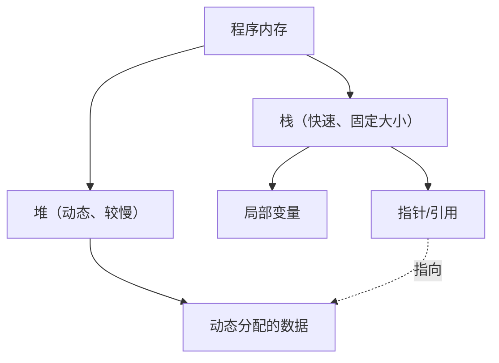

现代系统编程中，兼顾性能与内存安全是永恒的课题。多年来，C++一直作为该领域的王者而存在，但近年来Rust正在逐渐威胁其地位。Rust最大的特点在于不使用垃圾回收（GC）的情况下，在编译时通过“所有权（Ownership）”和“借用（Borrowing）”的概念来保证内存安全。

本文将详细比较C++的指针（原始指针、`std::unique_ptr`、`std::shared_ptr`）与Rust的所有权模型，并通过代码示例和图表，深入解析Rust的编译器（借用检查器）是如何防止释放后使用（Use-After-Free）和数据竞争（Data Race）的。

## 1. 内存管理基础：栈与堆

为了理解内存管理的基础，让我们先回顾一下程序是如何使用内存的。内存区域大致可分为“栈（Stack）”和“堆（Heap）”。

### 栈（Stack）
这是在函数调用时分配局部变量等数据的区域。它具有LIFO（后进先出）结构，内存的分配和释放非常快。只有在编译时能够确定大小的数据才会被放置在这里。

### 堆（Heap）
这里放置的是在运行时动态确定大小的数据，或者需要超越函数作用域存活的数据。通过指针（或引用）进行访问。

在没有垃圾回收的C++和Rust中，堆内存的管理成本可以用数学公式建模如下。假设对象总数为 $N$，分配的平均时间为 $T_{alloc}$，释放的平均时间为 $T_{dealloc}$，那么内存管理的总成本 $C_{memory}$ 为：

$$ C_{memory} = \sum_{i=1}^{N} (T_{alloc, i} + T_{dealloc, i}) + O_{sync} $$

这里 $O_{sync}$ 是多线程环境下的互斥控制（互斥锁或原子操作）所产生的开销。Rust在编译时决定内存释放的时机，因此在将运行时的垃圾回收导致的吞吐量下降（Stop-The-World）降至零的同时，在确切且安全的时机执行 $T_{dealloc}$。



## 2. C++指针：自由与危险的权衡

让我们来看看C++中内存管理的变迁。

### 原始指针（Raw Pointers）时代及问题

从C语言继承而来的原始指针（`*`）提供了终极的自由，但同时也成为以下严重Bug的温床。

- **内存泄漏（Memory Leak）**: 忘记使用`delete`释放通过`new`分配的内存。
- **悬垂指针（Dangling Pointer）**: 访问在内存释放后（`delete`后）的指针。
- **双重释放（Double Free）**: 对同一块内存区域执行了两次`delete`。

```cpp
// C++: 原始指针引发问题的示例
void rawPointerExample() {
    int* ptr = new int(10);
    // ... 执行某些操作 ...
    delete ptr; 
    
    // 错误地再次访问 (Use-After-Free / Dangling Pointer)
    // C++编译器无法将其作为编译错误处理
    std::cout << *ptr << std::endl; // 未定义行为（Undefined Behavior）
}
```

### RAII与智能指针的登场 (C++11及以后)

自C++11起，基于RAII（Resource Acquisition Is Initialization，资源获取即初始化）概念的智能指针成为标准，不再推荐直接使用原始指针。

#### `std::unique_ptr`
表达单一所有权的指针。离开作用域时会自动释放内存。它无法被复制，只能“移动（Move）”所有权（使用`std::move`）。

```cpp
// C++: std::unique_ptr
#include <memory>
#include <iostream>

void uniquePtrExample() {
    std::unique_ptr<int> p1 = std::make_unique<int>(42);
    // std::unique_ptr<int> p2 = p1; // 编译错误（不可复制）
    std::unique_ptr<int> p3 = std::move(p1); // 所有权移动
    
    // C++的弱点：移动后p1变为nullptr，但访问操作本身可以通过编译
    // 在运行时会导致崩溃（段错误）
    // std::cout << *p1 << std::endl; 
}
```

#### `std::shared_ptr`
允许多个指针共享同一对象的指针。它使用引用计数（Reference Counting），在计数变为0时释放内存。由于需要原子递增/递减操作，会产生一定的性能开销（相当于前述的 $O_{sync}$）。

## 3. Rust的所有权（Ownership）：范式转移

Rust将C++中`std::unique_ptr`的概念作为语言规范的基础，并拥有一个更严格的“所有权模型”。

### 所有权的3个规则

Rust的所有权系统基于以下三个极其简单的规则。

1. **Rust中的每一个值都有一个被称为其所有者（owner）的变量。**
2. **在任何时候，值有且只有一个所有者。**
3. **当所有者离开作用域，这个值将被丢弃。**

在Rust中，资源默认是“移动（Move）”的。即使不像C++那样显式调用`std::move`，赋值操作也会转移所有权。

```rust
// Rust: 所有权的移动（Move）
fn main() {
    let s1 = String::from("hello"); // 在堆上分配的数据
    let s2 = s1; // 所有权从s1移动到s2

    // 与C++最大的不同：对移动后的变量进行访问会导致“编译错误”！
    // println!("{}, world!", s1); // 编译错误: value borrowed here after move
}
```

这个“在编译时禁止访问移动后的变量”的特性，正是Rust比C++的`std::unique_ptr`更安全的原因之一。

```mermaid
sequenceDiagram
    participant S1 as "变量 s1"
    participant Heap as "堆内存 ('hello')"
    participant S2 as "变量 s2"
    
    S1->>Heap: "分配并拥有"
    Note over S1,S2: "let s2 = s1;"
    S1--xHeap: "失去所有权（无效化）"
    S2->>Heap: "获得所有权"
```

## 4. 借用（Borrowing）与引用

如果所有权总是被移动，那么每次向函数传递值时都必须将其所有权返回，这非常不便。因此便有了“借用（Borrowing）”。它相当于C++中的指针或引用。

Rust中的借用分为两种：
- **不可变引用（Immutable Reference）**: `&T` （类似于C++的 `const T&`）
- **可变引用（Mutable Reference）**: `&mut T` （类似于C++的 `T&`）

### 借用检查器（Borrow Checker）的冷酷法则

Rust编译器内置了“借用检查器”来验证引用的有效性。借用检查器强制执行以下严格规则：

> 在任意给定的作用域中，以下两者只能存在其一：
> - **一个可变引用（`&mut T`）**
> - **任意数量的不可变引用（`&T`）**

这被称为 **“多读或单写（Multiple Readers XOR Single Writer, MRSW）”** 原则。可以用数学上的异或（XOR）来表示，对于状态 $S$，不可变引用的数量 $N_r$ 和可变引用的数量 $N_w$ 必须满足以下约束：

$$ (N_r \ge 0 \land N_w = 0) \oplus (N_r = 0 \land N_w = 1) $$

通过这个规则，Rust在**编译时彻底消除了数据竞争（Data Race）**。数据竞争发生在：①两个或多个指针同时访问同一数据；②至少有一个指针在进行写入操作；③没有同步机制。Rust通过在编译时打破条件②，防患于未然地阻止了数据竞争。

```rust
// Rust: 违反借用规则导致的编译错误
fn main() {
    let mut s = String::from("hello");

    let r1 = &s; // 不可变借用 (OK)
    let r2 = &s; // 不可变借用 (OK)
    // let r3 = &mut s; // 错误！已经存在不可变借用，不能再创建可变借用

    println!("{}, {}", r1, r2);
}
```

## 5. 防止迭代器失效（Iterator Invalidation）

作为借用检查器发挥威力最具体的例子，让我们来看一个经典的Bug——“迭代器失效”。

### C++中的迭代器失效（运行时崩溃）

在C++中，如果在循环遍历`std::vector`时修改它，背后的内存可能会被重新分配（Reallocation），导致引用变为悬垂指针。

```cpp
// C++: 迭代器失效Bug
#include <iostream>
#include <vector>

int main() {
    std::vector<int> v = {1, 2, 3};
    
    // 获取向量元素的引用
    int& first = v[0]; 
    
    // 添加元素（如果此时容量不足，将会分配新的内存区域，
    // 旧的区域可能会被丢弃）
    v.push_back(4); 
    
    // first此时可能指向已经被释放的内存！（未定义行为）
    std::cout << "The first element is: " << first << std::endl; 
    
    return 0;
}
```

### Rust中的编译期防御

让我们用Rust编写完全相同的逻辑。

```rust
// Rust: 在编译时防止迭代器失效
fn main() {
    let mut v = vec![1, 2, 3];

    // 获取不可变引用 (借用开始)
    let first = &v[0]; 

    // 错误！当`first`对`v`进行不可变借用时，
    // 不能进行`v.push`所需的可变借用。
    // v.push(4); 

    println!("The first element is: {}", first);
}
```

就像这样，Rust在编译器级别禁止“在读取值（不可变借用）的过程中对其进行修改（可变借用）”，因此能够确保在编译时捕获Use-After-Free和迭代器失效等致命Bug。

```mermaid
graph LR
    A["变量 v（所有者）"] --> B["堆数组 [1, 2, 3]"]
    C["引用 'first' (&v[0])"] -.->|"不可变借用"| B
    A -->|X "可变借用被拒绝！"| D["v.push(4)"]
    
    style C stroke:#00FF00,stroke-width:2px
    style D stroke:#FF0000,stroke-width:2px
```

## 6. Rust中的共享所有权：`Rc` 与 `Arc`

Rust也提供了相当于C++中`std::shared_ptr`的共享所有权，但根据单线程和多线程用途划分了明确的类型。

### 单线程用：`Rc<T>` (Reference Counted)
`Rc<T>` 是非线程安全的引用计数智能指针。由于不使用原子指令来递增或递减计数，在单线程中非常快。但是，如果试图将它发送到另一个线程，则会导致编译错误（因为它没有实现 `Send` trait）。

### 多线程用：`Arc<T>` (Atomic Reference Counted)
如果要在线程之间共享，需要使用进行原子递增和递减的 `Arc<T>`。其开销与C++的`std::shared_ptr`相当。

此外，在C++中，如果多个线程同时向`std::shared_ptr`共享的变量写入数据，会发生数据竞争。为了防止这种情况，必须手动正确地使用`std::mutex`。

而在Rust中，仅靠`Arc<T>`**无法修改其内部的数据**。如果需要修改，必须将其与互斥锁 `Mutex<T>` 结合使用。

```rust
use std::sync::{Arc, Mutex};
use std::thread;

fn main() {
    // 线程安全共享与互斥控制的结合
    // 类似于C++的 std::shared_ptr<std::mutex>，但Mutex包含了数据
    let counter = Arc::new(Mutex::new(0));
    let mut handles = vec![];

    for _ in 0..10 {
        let counter_clone = Arc::clone(&counter);
        let handle = thread::spawn(move || {
            // 只有调用 lock() 才能获得内部的可变引用 (&mut i32)
            let mut num = counter_clone.lock().unwrap();
            *num += 1;
        }); // 依靠 RAII，离开作用域时会自动释放锁
        handles.push(handle);
    }

    for handle in handles {
        handle.join().unwrap();
    }

    println!("Result: {}", *counter.lock().unwrap());
}
```

值得特别注意的是，Rust的`Mutex<T>`不仅是一个锁机制，更重要的一点是它**“将受保护的数据包含在了类型内部”**。通过这种方式，可以在编译级别彻底防止“忘记获取锁就访问数据”的错误。如果不获取锁（`lock()`），就无法获得内部数据的访问权（引用）。

## 总结：编译器的“事前检查”还是开发者的“自我责任”

C++的指针和智能指针为开发者提供了高度的控制和性能，但它们的正确使用依赖于开发者的自律。RAII和`std::unique_ptr`的引入使得C++的安全性大幅提升，但即使如此，也无法在语言级别完全防止移动后的访问或迭代器失效等“未定义行为”。

相反，Rust通过将所有权（Ownership）和借用（Borrowing）规则嵌入编译器，在**编译时**而非运行时检测这些错误。“只要能编译通过，内存就是安全的”，这种强有力的保证正是Rust在系统编程领域迅速获得支持的最大理由。

与Rust的借用检查器作斗争（Fight the borrow checker）对初学者来说是一大障碍，但这只不过是编译器在严格代替C++程序员原本在脑海中进行的追踪指针生命周期的复杂计算罢了。

如果在理解了C++指针的自由与危险之后再学习Rust，您一定能更深刻地体会到所有权模型背后“为何要采取这种设计”的哲学。

---
*本文是关于C++和Rust内存管理方法的比较探讨。希望能够为您根据不同项目的需求选择合适的语言提供参考。*
