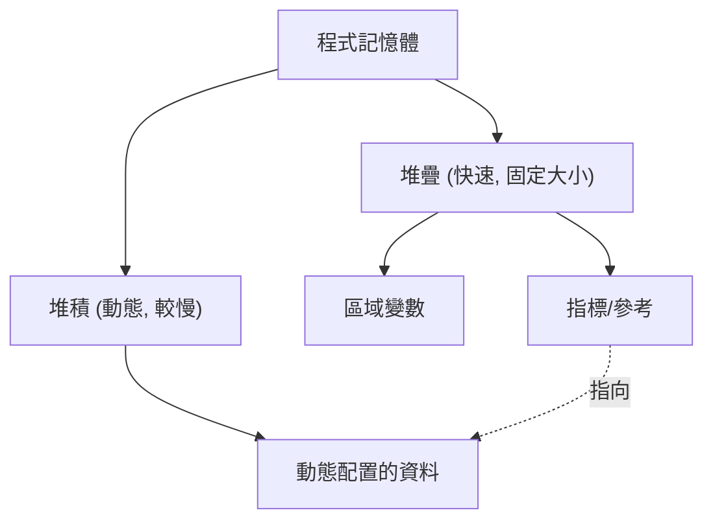

現代系統程式設計中，兼顧效能與記憶體安全性是永遠的課題。C++長年來一直稱霸這個領域，但近年來逐漸威脅其地位的便是Rust。Rust最大的特色在於，它沒有垃圾回收機制（GC），卻能透過「所有權（Ownership）」與「借用（Borrowing）」的概念，在編譯時期保證記憶體的安全性。

在本文中，我們將詳細比較C++的指標（原生指標、`std::unique_ptr`、`std::shared_ptr`）與Rust的所有權模型，並搭配程式碼範例與圖解，徹底為您解說Rust的編譯器（借用檢查器）是如何防止釋放後使用（Use-After-Free）以及資料競爭（Data Race）的。

## 1. 記憶體管理的基礎：堆疊與堆積

為了理解記憶體管理的基礎，首先讓我們回顧一下程式是如何使用記憶體的。記憶體區域大致可分為「堆疊（Stack）」與「堆積（Heap）」。

### 堆疊（Stack）
這是存放函式呼叫時的區域變數等資料的區域。它具有LIFO（後進先出）的結構，記憶體的配置與釋放都非常快速。只有在編譯時期就能確定大小的資料才會被配置在此處。

### 堆積（Heap）
執行時才會動態決定大小的資料，或者是需要超越函式作用域（Scope）而持續存在的資料，會被配置在此處。它必須透過指標（或參考）來進行存取。

在沒有垃圾回收機制的C++與Rust中，可以將堆積記憶體的管理成本以數學式進行如下的模型化。假設物件總數為 $N$、平均配置時間為 $T_{alloc}$、平均釋放時間為 $T_{dealloc}$，則記憶體管理的總成本 $C_{memory}$ 為：

$$ C_{memory} = \sum_{i=1}^{N} (T_{alloc, i} + T_{dealloc, i}) + O_{sync} $$

這裡的 $O_{sync}$ 是在多執行緒環境下進行互斥控制（互斥鎖或原子操作）所產生的額外開銷。由於Rust會在編譯時期決定記憶體釋放的時機，因此完全消除了執行時因垃圾回收而導致的吞吐量下降（Stop-The-World），同時能在確實且安全的時機執行 $T_{dealloc}$。



## 2. C++的指標：自由與危險的權衡

讓我們來看看C++中記憶體管理的演變。

### 原生指標（Raw Pointers）的時代與問題點

從C語言繼承下來的原生指標（`*`）提供了極致的自由，但同時也成為以下這類嚴重Bug的溫床。

- **記憶體洩漏（Memory Leak）**: 忘記對 `new` 出來的記憶體執行 `delete`。
- **懸空指標（Dangling Pointer）**: 存取已經釋放記憶體（`delete` 後）的指標。
- **雙重釋放（Double Free）**: 對同一塊記憶體區域執行了兩次 `delete`。

```cpp
// C++: 原生指標造成問題的範例
void rawPointerExample() {
    int* ptr = new int(10);
    // ... 某些處理 ...
    delete ptr; 
    
    // 錯誤地再次存取 (Use-After-Free / Dangling Pointer)
    // C++編譯器無法將此視為編譯錯誤
    std::cout << *ptr << std::endl; // 未定義行為（Undefined Behavior）
}
```

### RAII與智慧指標的登場 (C++11 以後)

C++11以後，基於RAII (Resource Acquisition Is Initialization) 概念的智慧指標被納入標準，並不再建議直接使用原生指標。

#### `std::unique_ptr`
這是一種用來表達所有權是單一的指標。當脫離作用域時，記憶體會自動被釋放。它無法被複製，只能將所有權「移動（Move）」（使用 `std::move`）。

```cpp
// C++: std::unique_ptr
#include <memory>
#include <iostream>

void uniquePtrExample() {
    std::unique_ptr<int> p1 = std::make_unique<int>(42);
    // std::unique_ptr<int> p2 = p1; // 編譯錯誤（不可複製）
    std::unique_ptr<int> p3 = std::move(p1); // 所有權的移動
    
    // C++的弱點：移動後的p1會變成nullptr，但存取行為本身是可以編譯的
    // 會在執行時引發崩潰（Segmentation Fault）
    // std::cout << *p1 << std::endl; 
}
```

#### `std::shared_ptr`
這是一種允許多個指標共用同一個物件的指標。它使用參考計數（Reference Counting），當計數歸零時就會釋放記憶體。由於需要進行原子的增減操作，因此會產生些許的效能開銷（相當於前述的 $O_{sync}$）。

## 3. Rust的所有權（Ownership）：典範轉移

Rust將C++中 `std::unique_ptr` 的概念視為語言規範的核心，並擁有更加嚴格的「所有權模型」。

### 所有權的3個規則

Rust的所有權系統建立在以下3個極其簡單的規則之上。

1. **Rust中的每一個值，都有一個被稱為其擁有者（owner）的變數。**
2. **任何時候，擁有者都只能有一個。**
3. **當擁有者離開作用域時，該值就會被丟棄。**

在Rust中，資源預設是會被「移動」的。即使不像C++那樣明確寫出 `std::move`，所有權也會透過賦值操作而轉移。

```rust
// Rust: 所有權的移動（Move）
fn main() {
    let s1 = String::from("hello"); // 配置在堆積中的資料
    let s2 = s1; // 所有權從s1移動（Move）到s2

    // 與C++最大的不同點：存取移動後的變數會變成「編譯錯誤」！
    // println!("{}, world!", s1); // 編譯錯誤: value borrowed here after move
}
```

這個「讓移動後的變數在編譯時期變得無法存取」的功能，正是Rust比C++的 `std::unique_ptr` 更安全的原因之一。

```mermaid
sequenceDiagram
    participant S1 as "變數 s1"
    participant Heap as "堆積記憶體 ('hello')"
    participant S2 as "變數 s2"
    
    S1->>Heap: "配置與擁有"
    Note over S1,S2: "let s2 = s1;"
    S1--xHeap: "失去所有權 (失效)"
    S2->>Heap: "取得所有權"
```

## 4. 借用（Borrowing）與參考

如果總是讓所有權不斷轉移，每次傳遞值給函式時，都必須再把所有權還回來，這非常不方便。因此誕生了「借用（Borrowing）」的概念。這相當於C++的指標或參考。

在Rust中，借用有兩種。
- **不可變參考（Immutable Reference）**: `&T` （類似於C++的 `const T&`）
- **可變參考（Mutable Reference）**: `&mut T` （類似於C++的 `T&`）

### 借用檢查器（Borrow Checker）的冷酷鐵律

Rust的編譯器內建了驗證參考正確性的「借用檢查器」。借用檢查器會強制執行以下嚴格的規則。

> 在任意的作用域中，只能存在以下其中一種情況。
> - **1個可變參考（`&mut T`）**
> - **多個不可變參考（`&T`）**

這被稱為 **「Multiple Readers XOR Single Writer (MRSW)」** 原則。可以用數學的互斥或（XOR）來表示，對於狀態 $S$，不可變參考的數量 $N_r$ 與可變參考的數量 $N_w$ 必須滿足以下條件：

$$ (N_r \ge 0 \land N_w = 0) \oplus (N_r = 0 \land N_w = 1) $$

透過這個規則，**在編譯時期就能完全排除資料競爭（Data Race）**。資料競爭會發生在以下條件下：①兩個以上的指標同時存取同一份資料，②至少有一個正在進行寫入，③沒有同步機制。Rust藉由在編譯時期破壞條件②，來防範資料競爭於未然。

```rust
// Rust: 違反借用規則所導致的編譯錯誤
fn main() {
    let mut s = String::from("hello");

    let r1 = &s; // 不可變借用 (OK)
    let r2 = &s; // 不可變借用 (OK)
    // let r3 = &mut s; // 錯誤！既然已經存在不可變借用，就無法建立可變借用

    println!("{}, {}", r1, r2);
}
```

## 5. 防止迭代器失效（Iterator Invalidation）

作為借用檢查器威力發揮得最淋漓盡致的具體例子，讓我們來看看「迭代器失效」這個傳統的Bug。

### C++中的迭代器失效（執行時崩潰）

如果在迴圈中修改C++的 `std::vector`，背後的記憶體可能會被重新配置（Reallocation），進而導致參考變成懸空指標。

```cpp
// C++: 迭代器失效的Bug
#include <iostream>
#include <vector>

int main() {
    std::vector<int> v = {1, 2, 3};
    
    // 取得向量元素的參考
    int& first = v[0]; 
    
    // 新增元素（如果這裡容量不足，就會配置新的記憶體區域，
    // 而舊的區域可能會被丟棄）
    v.push_back(4); 
    
    // first可能已經指向被釋放的記憶體了！（未定義行為）
    std::cout << "The first element is: " << first << std::endl; 
    
    return 0;
}
```

### 透過Rust進行編譯時期防禦

讓我們用Rust來撰寫完全一樣的邏輯。

```rust
// Rust: 在編譯時期防止迭代器失效
fn main() {
    let mut v = vec![1, 2, 3];

    // 取得不可變參考 (開始借用)
    let first = &v[0]; 

    // 錯誤！在 `first` 對 `v` 進行不可變借用的期間，
    // 無法進行 `v.push` 所需的可變借用。
    // v.push(4); 

    println!("The first element is: {}", first);
}
```

像這樣，在Rust中「讀取數值的過程中（不可變借用中），更改該數值（可變借用）」在編譯器層級是被禁止的，因此像是釋放後使用（Use-After-Free）或迭代器失效這類致命的Bug，必定能在編譯時期被捕捉到。

```mermaid
graph LR
    A["變數 v (擁有者)"] --> B["堆積陣列 [1, 2, 3]"]
    C["參考 'first' (&v[0])"] -.->|"不可變借用"| B
    A -->|X "拒絕可變借用！"| D["v.push(4)"]
    
    style C stroke:#00FF00,stroke-width:2px
    style D stroke:#FF0000,stroke-width:2px
```

## 6. Rust中的共用所有權：`Rc` 與 `Arc`

Rust也準備了相當於C++ `std::shared_ptr` 的共用所有權，但它明確區分了單一執行緒用與多執行緒用的型別。

### 單一執行緒用：`Rc<T>` (Reference Counted)
`Rc<T>` 是一種非執行緒安全（Non-thread-safe）的參考計數智慧指標。因為它不使用原子指令來增減計數，所以在單一執行緒內非常快速。然而，如果試圖將它傳送到另一個執行緒，就會產生編譯錯誤（因為它沒有實作 `Send` 特徵）。

### 多執行緒用：`Arc<T>` (Atomic Reference Counted)
要在執行緒之間共用的情況下，我們使用會進行原子增減的 `Arc<T>`。它的開銷與C++的 `std::shared_ptr` 相當。

此外，在C++中，如果從多個執行緒同時對以 `std::shared_ptr` 共用的變數進行寫入，就會發生資料競爭。為了防止這種情況，必須手動且正確地使用 `std::mutex`。

另一方面，在Rust中，單靠 `Arc<T>` **無法更改內部的資料**。如果需要更改，必須將其與作為互斥鎖的 `Mutex<T>` 結合使用。

```rust
use std::sync::{Arc, Mutex};
use std::thread;

fn main() {
    // 執行緒安全的共用與互斥控制的組合
    // 類似於C++的 std::shared_ptr<std::mutex>，但Mutex內含了資料
    let counter = Arc::new(Mutex::new(0));
    let mut handles = vec![];

    for _ in 0..10 {
        let counter_clone = Arc::clone(&counter);
        let handle = thread::spawn(move || {
            // 只有呼叫了lock()才能取得內部的可變參考(&mut i32)
            let mut num = counter_clone.lock().unwrap();
            *num += 1;
        }); // 由於RAII的關係，脫離作用域時會自動釋放鎖
        handles.push(handle);
    }

    for handle in handles {
        handle.join().unwrap();
    }

    println!("Result: {}", *counter.lock().unwrap());
}
```

值得特別一提的是，Rust的 `Mutex<T>` 不僅僅是一個鎖的機制，**「它還將需要保護的資料作為型別內含在其中」**。這使得「忘記取得鎖就存取資料」的失誤能在編譯層級被完全防堵。除非取得鎖（`lock()`），否則機制上是不允許取得存取內部資料的權限（參考）的。

## 總結：是編譯器的「事前檢查」，還是開發者的「自我負責」？

C++的指標與智慧指標為開發者提供了高度的控制能力與效能，但正確的使用與否卻取決於開發者的紀律。雖然RAII與 `std::unique_ptr` 的引入讓C++變得極為安全，但仍然無法在語言層級完全防止移動後存取或迭代器失效這類的「未定義行為」。

相對地，Rust將所有權（Ownership）與借用（Borrowing）的規則內建於編譯器中，使得這些錯誤能在**編譯時期**而非執行時被偵測出來。「只要編譯通過，就保證記憶體安全」這樣強力的保證，正是Rust在系統程式設計領域中迅速獲得支持的最大理由。

對初學者來說，與Rust的借用檢查器搏鬥（Fight the borrow checker）是一大障礙，但這其實只不過是編譯器在嚴格地代勞處理C++程式設計師原本要在腦中進行的「追蹤指標生存期間」的複雜計算而已。

如果能在理解C++指標的自由與危險性之後再來學習Rust，想必能更深刻地體會所有權模型背後「為何如此設計」的哲理。

---
*本文是對C++與Rust記憶體管理手法的比較探討。希望能作為您根據各專案需求選擇合適語言時的參考。*
