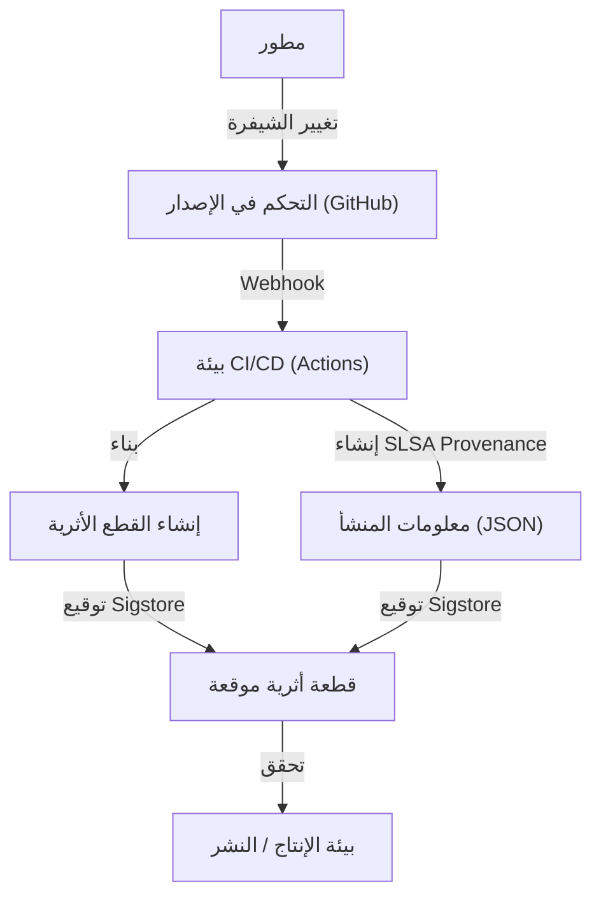

## تهديدات هجمات سلسلة توريد البرمجيات والخلفية التاريخية

في تطوير البرمجيات الحديث، نادراً ما نكتب كل التعليمات البرمجية من الصفر. المكتبات مفتوحة المصدر، وأطر العمل التابعة لجهات خارجية، وأدوات البناء، وخطوط أنابيب CI/CD (التكامل المستمر/التسليم المستمر). كل هذه العناصر تشكل أجزاء مهمة من "سلسلة توريد البرمجيات"، لكنها في الوقت نفسه تمثل أهدافاً جذابة للمهاجمين.

هجوم سلسلة توريد البرمجيات هو أسلوب لا يقتحم فيه المهاجم أنظمة الشركة المستهدفة بشكل مباشر، بل يقوم بإدخال برمجيات خبيثة في البرامج أو أدوات التطوير أو التبعيات التي تستخدمها الشركة، لشن هجوم غير مباشر. يتميز هذا الأسلوب بتأثيره الهائل وصعوبة اكتشافه، حيث يمكن لتعديل واحد أن يؤثر على الآلاف أو الملايين من المستخدمين النهائيين.

### الدروس المستفادة من حادثة SolarWinds

الحادثة الأبرز التي جعلت العالم يدرك تهديد هجمات سلسلة توريد البرمجيات كانت الهجوم على شركة SolarWinds (المعروف بـ SUNBURST) الذي تم اكتشافه في عام 2020. توفر شركة SolarWinds برنامج إدارة البنية التحتية لتكنولوجيا المعلومات "Orion"، والذي تستخدمه العديد من الوكالات الحكومية الأمريكية وشركات Fortune 500.

اخترق المهاجمون بيئة بناء SolarWinds وزرعوا باباً خلفياً سراً في حزمة تحديث شرعية. نظرًا لأن هذا التحديث المعدل كان يحتوي على توقيع رقمي شرعي، فقد تمكن من تجاوز منتجات الأمان وتم توزيعه وتثبيته تلقائيًا في حوالي 18000 مؤسسة.

تركت هذه الحادثة لنا دروسًا خطيرة كالتالي:

1. **"المورد الموثوق" ليس آمنًا بلا شروط**: حتى البرامج التي تتعاقد عليها وتشتريها الشركات بشكل شرعي تشكل تهديدًا إذا تم اختراق عملية تطويرها.
2. **نقاط الضعف في خطوط أنابيب البناء**: ليس فقط الشيفرة المصدرية، ولكن بيئة CI/CD وخوادم البناء نفسها تصبح أهدافًا للهجوم.
3. **انعدام الرؤية**: لم تتمكن المؤسسات من الفهم الدقيق لأي برامج، أو أي مكونات، أو أي مسارات تم إدخالها إلى شبكاتها الخاصة.

في أعقاب هذه الحادثة، أصدرت الحكومة الأمريكية أمرًا تنفيذيًا لتعزيز الأمن السيبراني (EO 14028)، والذي تضمن إلزام الموردين الذين يقدمون البرمجيات للحكومة الفيدرالية بتقديم SBOM (قائمة مكونات البرمجيات)، مما جعل الاستجابة لأمن سلسلة التوريد مسألة ملحة.

## SBOM (Software Bill of Materials): ضمان شفافية البرمجيات

SBOM (قائمة مكونات البرمجيات) هي "قائمة مكونات" توضح المكونات والمكتبات والتبعيات التي تشكل البرنامج بتنسيق مقروء آليًا. تمامًا كما يتم سرد المكونات والمواد المسببة للحساسية على عبوات الطعام، فإنها تتيح رؤية ما يتم تضمينه في البرنامج.

### التحديات التي يحلها SBOM

عند اكتشاف ثغرة أمنية خطيرة في مكتبة مفتوحة المصدر (مثل Log4j)، فإن التحدي الأكبر الذي تواجهه الشركات هو تحديد "في أي من أنظمتها، وأي إصدار من تلك المكتبة يتم استخدامه". في حالة عدم وجود SBOM، يتطلب الأمر وقتًا وجهدًا كبيرين، مثل إجراء مقابلات مع كل فريق تطوير أو البحث يدويًا في مستودعات التعليمات البرمجية.

إذا تم إنشاء وإدارة SBOM بانتظام، يمكن للمرء تحديد الأنظمة المتأثرة فورًا بمجرد مطابقة معلومات الثغرات (CVE) مع SBOM، مما يتيح الترقيع السريع أو تنفيذ الحلول البديلة.

### تنسيقات SBOM النموذجية: SPDX و CycloneDX

حاليًا، هناك تنسيقان رئيسيان لبيانات SBOM يستخدمان على نطاق واسع كمعايير صناعية: "SPDX" و "CycloneDX".

1. **SPDX (Software Package Data Exchange)**:
   تنسيق قياسي من ISO (ISO/IEC 5962:2021) تدار بواسطة مؤسسة Linux. تم تطويره في الأصل لإدارة الامتثال لتراخيص المصادر المفتوحة، لكنه امتد الآن ليشمل الاستخدامات الأمنية. يمكنه وصف أصل الحزمة، ومعلومات الترخيص، والمراجع الأمنية (مثل CPE) بالتفصيل، ويتميز بتوافقه العالي مع الإدارات القانونية وإدارات الامتثال.
2. **CycloneDX**:
   تنسيق تم تطويره بواسطة OWASP (Open Worldwide Application Security Project). مصمم خصيصًا للسياقات الأمنية وتحديد الثغرات، وهو يدعم وصف ليس فقط البرمجيات، ولكن أيضًا الأجهزة والخدمات وخوارزميات التشفير (CBOM). حجم الملف مضغوط نسبيًا، ومن السهل إنشاؤه تلقائيًا في خطوط أنابيب CI/CD أو ربطه بماسحات الثغرات الأمنية.

### استراتيجية إنشاء وإدارة SBOM

SBOM ليس شيئًا "يصنع مرة واحدة فقط عند إصدار البرنامج". نظرًا لتحديث التبعيات بشكل متكرر، من الضروري دمج إنشاء SBOM في عملية البناء والحفاظ على أحدث حالة باستمرار.

**أدوات الإنشاء:**
- Syft (Anchore)
- Trivy (Aqua Security)
- Microsoft SBOM Tool

**مثال على الإنشاء في GitHub Actions (باستخدام Trivy):**
```yaml
name: Generate SBOM
on: [push]
jobs:
  sbom:
    runs-on: ubuntu-latest
    steps:
      - uses: actions/checkout@v4
      - name: Run Trivy in fs mode to generate SBOM
        uses: aquasecurity/trivy-action@master
        with:
          scan-type: 'fs'
          format: 'cyclonedx'
          output: 'sbom.json'
      - name: Upload SBOM
        uses: actions/upload-artifact@v4
        with:
          name: sbom
          path: sbom.json
```

من المهم تخزين SBOM المنشأ في خوادم إدارة متخصصة مثل Dependency-Track أو Guac، وبناء نظام يطابقه باستمرار مع قواعد بيانات الثغرات (Continuous Monitoring).

## SLSA: إطار عمل لسلامة البناء

إذا كان SBOM يوضح "محتويات البرنامج"، فإن SLSA (Supply chain Levels for Software Artifacts، يُنطق سالسا) هو إطار عمل يضمن "أن البرنامج قد تم بناؤه بشكل صحيح وآمن". تم اقتراحه بواسطة Google وتديره حاليًا OpenSSF.

تحدد SLSA إرشادات ومستويات أمان لإثبات عدم حدوث أي تلاعب (السلامة) في كل خطوة من التعديلات على الشيفرة المصدرية وحتى إنشاء الأداة النهائية (مثل الثنائيات أو صور الحاويات).

### مستويات SLSA الأربعة ومتطلباتها

مع مراعاة التوازن بين سهولة التبني وقوة الأمان، تقدم SLSA نهجًا تدريجيًا من المستوى 1 إلى المستوى 4 (حاليًا كـ SLSA v1.0، تم تقسيمها إلى مسارات مثل البناء والمصدر وما إلى ذلك، ولكننا سنشرح المفهوم العام هنا).

*   **SLSA المستوى 1: تسجيل المصدر (Provenance)**
    *   **المتطلبات**: أن تكون عملية البناء مبرمجة أو مؤتمتة، مع إنشاء إثبات (Provenance: معلومات المنشأ) يوضح "من أي شيفرة مصدرية" و "عبر أي عملية بناء" تم إنشاء الأداة النهائية.
    *   **الغرض**: الخطوة الأولى نحو القضاء على البناء اليدوي وتوضيح أصل البرنامج.
*   **SLSA المستوى 2: معلومات المنشأ الموقعة**
    *   **المتطلبات**: بالإضافة إلى متطلبات المستوى 1، أن تقوم خدمة البناء (مثل بيئة CI) بإجراء توقيع تشفيري على معلومات المنشأ، لضمان عدم التلاعب بعملية البناء من الخارج.
    *   **الغرض**: ضمان موثوقية معلومات المنشأ نفسها ومنع استبدال الأداة بعد البناء.
*   **SLSA المستوى 3: عزل بيئة البناء والتحقق منها**
    *   **المتطلبات**: بالإضافة إلى متطلبات المستوى 2، أن يتم البناء في بيئة معزولة ومخصصة (مثل حاوية أو جهاز ظاهري) لمنع التداخل مع عمليات البناء الأخرى أو الاختراقات المستمرة (بيئة سريعة الزوال). وأن يتم إنشاء معلومات المنشأ بواسطة مستوى تحكم موثوق معزول عن بيئة البناء نفسها.
    *   **الغرض**: جعل الهجمات على خط أنابيب البناء نفسه (كما في حالة SolarWinds) صعبة.
*   **SLSA المستوى 4: أعلى مستويات الموثوقية (مراجعة شخصين والبناء المحكم)**
    *   **المتطلبات**: بالإضافة إلى متطلبات المستوى 3، يتطلب الموافقة من شخصين أو أكثر (Two-Person Review) على التعديلات في الشيفرة المصدرية. علاوة على ذلك، يجب أن يتم البناء في بيئة مغلقة تمامًا (Hermetic Build: حالة يتم فيها قطع الوصول إلى الشبكة الخارجية وتحديد جميع التبعيات مسبقًا).
    *   **الغرض**: منع التهديدات الداخلية وحظر تنزيل البرمجيات الخبيثة من الخارج.

### نهج تنفيذ متطلبات SLSA

لتلبية مستويات SLSA، ليس من الكافي ببساطة تقديم الأدوات، بل يتطلب الأمر مراجعة شاملة لعملية التطوير بأكملها.



## Sigstore: التوقيع التشفيري للمطورين

من أجل تحقيق متطلبات SLSA المتمثلة في "توقيع معلومات المنشأ والقطع الأثرية"، كانت هناك عقبة كبيرة وهي تشغيل البنية التحتية للمفاتيح العامة (PKI). كانت إدارة تواقيع PGP التقليدية، مثل إنشاء المفاتيح وتخزينها الآمن وتدويرها وإجراءات إلغائها، تشكل عبئًا كبيرًا على المطورين، ولم تنتشر على نطاق واسع.

ظهرت "Sigstore" لحل هذه المشكلة. تُعرف Sigstore أيضًا باسم "Let's Encrypt لتوقيع البرمجيات"، وتوفر بنية تحتية مجانية وآلية للتوقيع لمشاريع مفتوحة المصدر.

### المكونات الرئيسية الثلاثة لـ Sigstore

1.  **Fulcio (سلطة الشهادات)**: تستخدم OIDC (OpenID Connect) لإصدار شهادات مؤقتة (قصيرة العمر) بناءً على المعرفات مثل حسابات GitHub أو حسابات Google. هذا يلغي حاجة المطورين لإدارة المفاتيح الخاصة بشكل دائم.
2.  **Rekor (سجل الشفافية)**: يسجل توقيعات السجل في دفتر أستاذ موزع لا يمكن التلاعب به (Transparency Log). نظرًا لأنه يمكن لأي شخص التحقق من تاريخ التوقيع ومراجعته، فمن السهل اكتشافه حتى في حالة إصدار شهادة بشكل احتيالي.
3.  **Cosign (أداة التوقيع)**: أداة واجهة سطر أوامر (CLI) لتسهيل توقيع صور الحاويات أو أي أدوات، والتحقق منها.

### توقيع صور الحاويات من خلال الجمع بين GitHub Actions و Sigstore

نظرًا لأن GitHub Actions يعمل كموفر OIDC، يمكنه التعاون مع Sigstore (Fulcio) لتحقيق "التوقيع بدون مفتاح" (Keyless Signing). هذه آلية مبتكرة تُدرج هوية سير عمل GitHub Actions نفسه (مثل اسم المستودع، الفرع، تجزئة الالتزام) في الشهادة وتؤدي التوقيع.

**مثال على التوقيع بدون مفتاح في GitHub Actions باستخدام Cosign:**

```yaml
name: Build and Sign Container
on: [push]
jobs:
  build-and-sign:
    runs-on: ubuntu-latest
    permissions:
      contents: read
      packages: write
      id-token: write # مطلوب للحصول على رمز OIDC
    steps:
      - name: Checkout repository
        uses: actions/checkout@v4

      - name: Install Cosign
        uses: sigstore/cosign-installer@v3.5.0

      - name: Log in to GitHub Container Registry
        uses: docker/login-action@v3
        with:
          registry: ghcr.io
          username: ${{ github.actor }}
          password: ${{ secrets.GITHUB_TOKEN }}

      - name: Build and push Docker image
        id: docker_build
        uses: docker/build-push-action@v5
        with:
          push: true
          tags: ghcr.io/${{ github.repository }}:latest

      - name: Sign the container image
        env:
          COSIGN_EXPERIMENTAL: "true"
        run: |
          cosign sign --yes ghcr.io/${{ github.repository }}@${{ steps.docker_build.outputs.digest }}
```

عند تنفيذ سير العمل هذا، يتم دفع صورة الحاوية إلى GHCR، ثم يقوم Cosign تلقائيًا بجلب شهادة قصيرة العمر من Fulcio عبر GitHub OIDC ويوقع ملخص الصورة. يتم إرفاق معلومات التوقيع بـ GHCR وتسجيلها أيضًا في سجل Rekor.

### التحقق من التوقيع في بيئة الإنتاج

لتشغيل الصور الموقعة بأمان، من الضروري وجود آلية للتحقق من هذا التوقيع عند النشر. في بيئة Kubernetes، من خلال تقديم وحدات تحكم القبول (Admission Controllers) مثل Kyverno أو Sigstore Policy Controller، يمكنك تطبيق سياسات صارمة مثل "السماح فقط بتشغيل الصور التي تم بناؤها وتوقيعها من GitHub Actions في المستودع الصحيح".

## الخلاصة: دفاع مستمر عن سلسلة التوريد

أمن سلسلة توريد البرمجيات لا يمكن حله بأداة أو حل واحد.
1.  استخدام **SBOM** لتوضيح "ما يتم استخدامه" وإنشاء أساس لإدارة الثغرات.
2.  اتباع إطار عمل **SLSA** لتعزيز سلامة عملية البناء وتعزيز الأتمتة والعزل.
3.  الاستفادة من **Sigstore** لتوقيع القطع الأثرية ومعلومات المنشأ بدون مفتاح، والتحقق منها عند النشر.

دمج هذه العناصر بعمق في خطوط أنابيب CI/CD (مثل GitHub Actions) وبناء بيئة "آمنة افتراضيًا" (Secure by Default) مع تقليل العبء على المطورين، أصبح المسؤولية الأهم في الجيل القادم من تطوير البرمجيات. لكي لا تتكرر مأساة مثل حادثة SolarWinds، دعونا نتخذ خطوة نحو حماية سلسلة التوريد اليوم.
