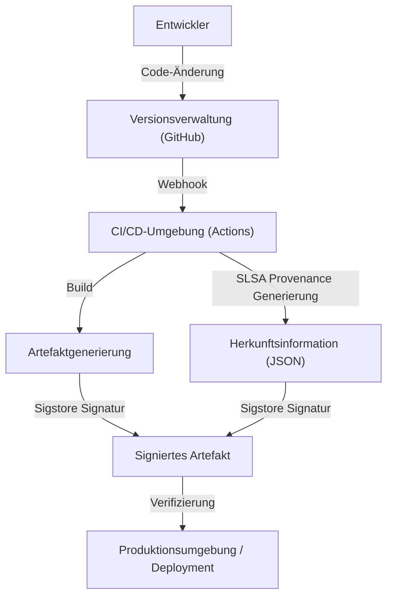

## Die Bedrohung durch Angriffe auf die Software-Lieferkette und der historische Hintergrund

In der modernen Softwareentwicklung schreiben wir fast nie den gesamten Code von Grund auf neu. Open-Source-Bibliotheken, Frameworks von Drittanbietern, Build-Tools und CI/CD-Pipelines: All diese Elemente bilden die wichtige "Software-Lieferkette" (Supply Chain), stellen aber gleichzeitig attraktive Ziele für Angreifer dar.

Bei einem Angriff auf die Software-Lieferkette dringt der Angreifer nicht direkt in das System des Zielunternehmens ein. Stattdessen schleust er Malware in die Software, Entwicklungstools oder Abhängigkeiten ein, die das Unternehmen nutzt, um so einen indirekten Angriff durchzuführen. Diese Methode hat den Vorteil, dass eine einzige Manipulation Auswirkungen auf Tausende oder Zehntausende von Endbenutzern haben kann. Daher ist sie extrem wirkungsvoll und schwer zu entdecken.

### Die Lehren aus dem SolarWinds-Vorfall

Der Vorfall, der die Bedrohung durch Angriffe auf die Software-Lieferkette weltweit bekannt machte, war der 2020 entdeckte Angriff auf SolarWinds (SUNBURST). SolarWinds bietet die IT-Infrastruktur-Management-Software "Orion" an, die von vielen US-Regierungsbehörden und Fortune-500-Unternehmen eingesetzt wurde.

Angreifer drangen in die Build-Umgebung von SolarWinds ein und bauten heimlich eine Hintertür in ein legitimes Update-Paket ein. Da dieses manipulierte Update mit einer legitimen digitalen Signatur versehen war, umging es die Erkennung durch Sicherheitsprodukte und wurde automatisch an etwa 18.000 Organisationen verteilt und installiert.

Dieser Vorfall hat uns folgende wichtige Lehren hinterlassen:

1.  **Ein "vertrauenswürdiger Anbieter" ist nicht bedingungslos sicher**: Selbst wenn Software legal von einem Unternehmen erworben wurde, stellt sie eine Bedrohung dar, wenn der Entwicklungsprozess kompromittiert wurde.
2.  **Schwachstellen in der Build-Pipeline**: Nicht nur der Quellcode, sondern auch die CI/CD-Umgebung und die Build-Server selbst sind Angriffsziele.
3.  **Mangelnde Transparenz**: Organisationen wussten nicht genau, welche Software, welche Komponenten und über welche Wege diese in ihre Netzwerke eingeführt wurden.

Als Reaktion auf diesen Vorfall erließ die US-Regierung eine Executive Order (EO 14028) zur Stärkung der Cybersicherheit. Diese verpflichtet Anbieter, die Software an die Bundesregierung liefern, zur Vorlage von SBOMs (Software Bill of Materials) und machte Maßnahmen zur Sicherung der Lieferkette dringend erforderlich.

## SBOM (Software Bill of Materials): Transparenz der Software gewährleisten

Eine SBOM (Software Bill of Materials) ist eine "Stückliste" für Software. Sie ist eine maschinenlesbare Liste der Komponenten, Bibliotheken und Abhängigkeiten, aus denen die Software besteht. Ähnlich wie auf Lebensmittelverpackungen Zutaten und Allergene aufgeführt sind, macht die SBOM sichtbar, was in der Software enthalten ist.

### Die Probleme, die SBOM löst

Wenn eine schwerwiegende Schwachstelle in einer Open-Source-Bibliothek (wie z. B. Log4j) entdeckt wird, besteht die größte Herausforderung für Unternehmen darin, herauszufinden, "in welchen Systemen und in welcher Version diese Bibliothek verwendet wird". Ohne SBOM kostet dies enorm viel Zeit und Mühe, da beispielsweise jedes Entwicklungsteam befragt oder Code-Repositories manuell durchsucht werden müssen.

Wenn SBOMs routinemäßig generiert und verwaltet werden, können betroffene Systeme sofort identifiziert werden, indem einfach Schwachstelleninformationen (CVE) mit den SBOMs abgeglichen werden. Dies ermöglicht ein schnelles Patchen oder das Ergreifen von Workarounds.

### Repräsentative SBOM-Formate: SPDX und CycloneDX

Derzeit gibt es zwei Hauptdatenformate für SBOMs, die branchenweit als Standard weit verbreitet sind: "SPDX" und "CycloneDX".

1.  **SPDX (Software Package Data Exchange)**:
    Ein von der Linux Foundation verwaltetes ISO-Standardformat (ISO/IEC 5962:2021). Ursprünglich für das Compliance-Management von Open-Source-Lizenzen entwickelt, wird es mittlerweile auch für Sicherheitszwecke erweitert. Es kann die Herkunft, Lizenzinformationen und Sicherheitsreferenzen (z. B. CPE) detailliert beschreiben und zeichnet sich durch eine hohe Kompatibilität mit Rechts- und Compliance-Abteilungen aus.
2.  **CycloneDX**:
    Ein Format, das vom OWASP (Open Worldwide Application Security Project) entwickelt wurde. Es wurde speziell für den Sicherheitskontext und die Identifizierung von Schwachstellen entwickelt und unterstützt nicht nur Software, sondern auch Hardware, Dienste und kryptografische Algorithmen (CBOM: Cryptography Bill of Materials). Die Dateigröße ist relativ kompakt, was die automatische Generierung in CI/CD-Pipelines und die Integration mit Schwachstellenscannern erleichtert.

### Strategien zur Generierung und Verwaltung von SBOMs

Eine SBOM ist nicht etwas, das "nur einmal bei der Softwareveröffentlichung erstellt werden muss". Da Abhängigkeiten häufig aktualisiert werden, muss die SBOM-Generierung in den Build-Prozess integriert werden, um sie kontinuierlich auf dem neuesten Stand zu halten.

**Tools zur Generierung:**
- Syft (Anchore)
- Trivy (Aqua Security)
- Microsoft SBOM Tool

**Beispiel für die Generierung mit GitHub Actions (mit Trivy):**
```yaml
name: Generate SBOM
on: [push]
jobs:
  sbom:
    runs-on: ubuntu-latest
    steps:
      - uses: actions/checkout@v4
      - name: Run Trivy in fs mode to generate SBOM
        uses: aquasecurity/trivy-action@master
        with:
          scan-type: 'fs'
          format: 'cyclonedx'
          output: 'sbom.json'
      - name: Upload SBOM
        uses: actions/upload-artifact@v4
        with:
          name: sbom
          path: sbom.json
```

Es ist wichtig, die generierten SBOMs auf spezialisierten Management-Servern wie Dependency-Track oder Guac zu speichern und ein System (Continuous Monitoring) aufzubauen, das sie kontinuierlich mit Schwachstellen-Datenbanken abgleicht.

## SLSA: Framework für Build-Integrität

Wenn die SBOM den "Inhalt der Software" offenlegt, dann ist SLSA (Supply chain Levels for Software Artifacts, ausgesprochen "Salsa") das Framework, das garantiert, dass die "Software korrekt und sicher erstellt wurde". Es wurde von Google initiiert und wird heute von der OpenSSF verwaltet.

SLSA definiert Richtlinien und Sicherheitsstufen, um die Manipulationsfreiheit (Integrität) in jedem Schritt vom Ändern des Quellcodes bis zur Generierung des finalen Artefakts (z. B. Binärdatei oder Container-Image) nachzuweisen.

### Die 4 SLSA-Level und ihre Anforderungen

SLSA bietet einen stufenweisen Ansatz von Level 1 bis Level 4, der ein Gleichgewicht zwischen einfacher Implementierung und Sicherheitsstärke berücksichtigt (aktuell als SLSA v1.0 in Tracks wie Build und Source unterteilt, hier erklären wir jedoch das Gesamtkonzept).

*   **SLSA Level 1: Aufzeichnung der Herkunft (Provenance)**
    *   **Anforderung**: Der Build-Prozess ist skriptgesteuert oder automatisiert, und es wird ein Nachweis (Provenance: Herkunftsinformationen) erstellt, der zeigt, aus welchem "Quellcode" und durch welchen "Build-Prozess" das finale Artefakt erstellt wurde.
    *   **Ziel**: Abschaffung manueller Builds als erster Schritt zur Klärung der Herkunft von Software.
*   **SLSA Level 2: Signierte Herkunftsinformationen**
    *   **Anforderung**: Zusätzlich zu den Anforderungen von Level 1 signiert der Build-Dienst (z. B. die CI-Umgebung) die Herkunftsinformationen kryptografisch und garantiert, dass der Build-Prozess nicht von außen manipuliert wurde.
    *   **Ziel**: Die Vertrauenswürdigkeit der Herkunftsinformationen selbst sicherstellen und das Ersetzen von Artefakten nach dem Build verhindern.
*   **SLSA Level 3: Isolierte und verifizierte Build-Umgebungen**
    *   **Anforderung**: Zusätzlich zu Level 2 wird der Build in einer dedizierten, isolierten Umgebung (Container oder VM) durchgeführt, um Interferenzen mit anderen Builds und dauerhafte Kompromittierungen zu verhindern (ephemere Umgebung). Die Generierung von Herkunftsinformationen wird von einer vertrauenswürdigen Control Plane durchgeführt, die von der Build-Umgebung getrennt ist.
    *   **Ziel**: Angriffe auf die Build-Pipeline selbst (wie im Fall von SolarWinds) erschweren.
*   **SLSA Level 4: Höchste Vertrauenswürdigkeit (Two-Person Review & Hermetic Build)**
    *   **Anforderung**: Zusätzlich zu Level 3 ist für Quellcode-Änderungen die Zustimmung von mindestens zwei Personen (Two-Person Review) erforderlich. Zudem muss der Build in einer vollständig abgeschotteten Umgebung durchgeführt werden (Hermetic Build: Der Zugriff auf externe Netzwerke ist blockiert und alle Abhängigkeiten sind im Voraus definiert).
    *   **Ziel**: Vermeidung von Insider-Bedrohungen und Blockierung externer Malware-Downloads.

### Implementierungsansätze für SLSA-Anforderungen

Um die SLSA-Level zu erfüllen, reicht es nicht aus, einfach nur Tools einzuführen, sondern der gesamte Entwicklungsprozess muss überdacht werden.



## Sigstore: Kryptografische Signaturen für Entwickler

Um die SLSA-Anforderung "Signierung von Herkunftsinformationen und Artefakten" umzusetzen, stellte der Betrieb einer Public-Key-Infrastruktur (PKI) eine große Hürde dar. Herkömmliche PGP-Signaturen etc. bedeuteten für Entwickler einen großen Aufwand (Schlüsselgenerierung, sichere Speicherung, Rotation, Sperrverfahren), sodass sie sich nicht weit verbreiten konnten.

Um dieses Problem zu lösen, entstand "Sigstore". Sigstore wird auch das "Let's Encrypt für Software-Signaturen" genannt und bietet eine kostenlose und automatisierte Signaturinfrastruktur für Open-Source-Projekte.

### Die 3 Hauptkomponenten von Sigstore

1.  **Fulcio (Zertifizierungsstelle)**: Nutzt OIDC (OpenID Connect), um temporäre (kurzlebige) Zertifikate basierend auf IDs wie GitHub- oder Google-Konten auszustellen. Dadurch müssen Entwickler private Schlüssel nicht mehr dauerhaft verwalten.
2.  **Rekor (Transparency Log)**: Speichert Signaturdatensätze in einem manipulationssicheren, verteilten Hauptbuch (Transparency Log). Da jeder die Signaturhistorie überprüfen und auditieren kann, lassen sich betrügerisch ausgestellte Zertifikate leicht aufdecken.
3.  **Cosign (Signaturtool)**: Ein CLI-Tool zum einfachen Signieren und Überprüfen von Container-Images und beliebigen Artefakten.

### Container-Image-Signatur mit GitHub Actions und Sigstore

Da GitHub Actions als OIDC-Provider fungiert, kann es in Kombination mit Sigstore (Fulcio) ein "schlüsselloses Signieren" (Keyless Signing) ermöglichen. Dies ist ein revolutionärer Mechanismus, bei dem die Identität des GitHub Actions-Workflows selbst (Repository-Name, Branch, Commit-Hash usw.) in das Zertifikat eingebettet und zur Signatur verwendet wird.

**Beispiel für schlüsselloses Signieren in GitHub Actions mit Cosign:**

```yaml
name: Build and Sign Container
on: [push]
jobs:
  build-and-sign:
    runs-on: ubuntu-latest
    permissions:
      contents: read
      packages: write
      id-token: write # Zwingend erforderlich für den Abruf des OIDC-Tokens
    steps:
      - name: Checkout repository
        uses: actions/checkout@v4

      - name: Install Cosign
        uses: sigstore/cosign-installer@v3.5.0

      - name: Log in to GitHub Container Registry
        uses: docker/login-action@v3
        with:
          registry: ghcr.io
          username: ${{ github.actor }}
          password: ${{ secrets.GITHUB_TOKEN }}

      - name: Build and push Docker image
        id: docker_build
        uses: docker/build-push-action@v5
        with:
          push: true
          tags: ghcr.io/${{ github.repository }}:latest

      - name: Sign the container image
        env:
          COSIGN_EXPERIMENTAL: "true"
        run: |
          cosign sign --yes ghcr.io/${{ github.repository }}@${{ steps.docker_build.outputs.digest }}
```

Wenn dieser Workflow ausgeführt wird und das Container-Image nach GHCR gepusht wurde, ruft Cosign automatisch über GitHub OIDC ein kurzlebiges Zertifikat von Fulcio ab und signiert den Digest des Images. Die Signaturinformationen werden an GHCR angehängt und auch im Rekor-Log aufgezeichnet.

### Signaturüberprüfung in der Produktionsumgebung

Um signierte Images sicher betreiben zu können, ist ein Mechanismus erforderlich, der deren Signaturen beim Deployment überprüft. In einer Kubernetes-Umgebung können Sie durch die Einführung eines Admission Controllers wie Kyverno oder Sigstore Policy Controller strenge Richtlinien anwenden, wie z. B. "nur die Ausführung von Images zulassen, die von GitHub Actions im richtigen Repository erstellt und signiert wurden".

## Fazit: Kontinuierliche Verteidigung der Lieferkette

Die Sicherheit der Software-Lieferkette kann nicht mit einem einzigen Tool oder einer einzigen Lösung gewährleistet werden.
1.  Schaffen Sie eine Basis für das Schwachstellenmanagement, indem Sie durch **SBOM** sichtbar machen, "was verwendet wird".
2.  Stärken Sie die Integrität des Build-Prozesses und treiben Sie die Automatisierung und Isolierung gemäß dem **SLSA**-Framework voran.
3.  Nutzen Sie **Sigstore**, um Artefakte und Herkunftsinformationen schlüssellos zu signieren und diese beim Deployment zu verifizieren.

Die tiefe Integration dieser Elemente in Ihre CI/CD-Pipeline (z. B. GitHub Actions) und der Aufbau einer Umgebung, die "standardmäßig sicher" (Secure by Default) ist und gleichzeitig die Belastung der Entwickler minimiert, ist die wichtigste Aufgabe in der Softwareentwicklung der nächsten Generation. Um Tragödien wie den SolarWinds-Vorfall nicht zu wiederholen, lassen Sie uns heute den ersten Schritt zur Verteidigung der Lieferkette machen.
