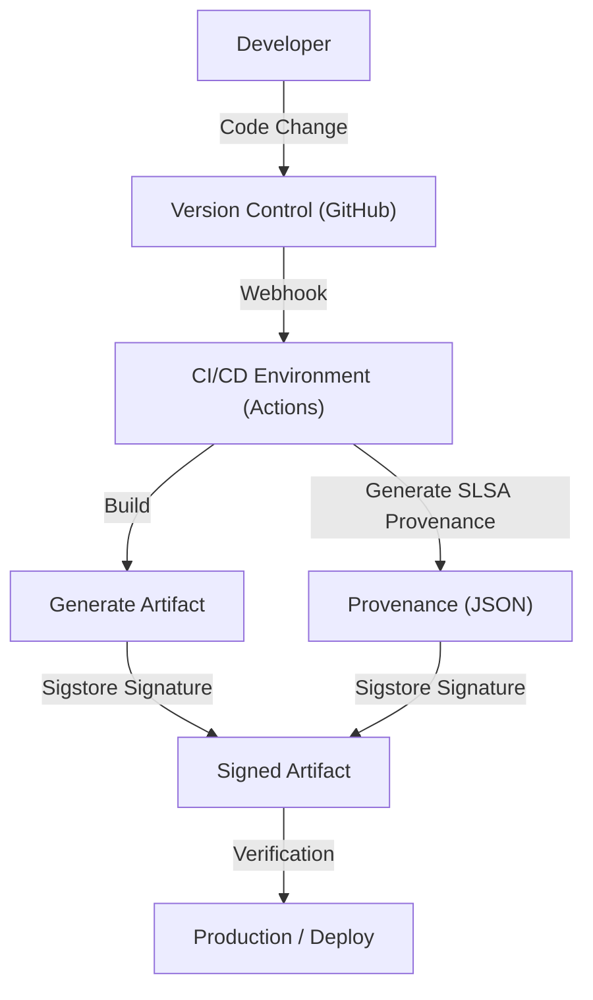

## The Threat of Software Supply Chain Attacks and Historical Background

In modern software development, we rarely write all the code from scratch. Open source libraries, third-party frameworks, build tools, and CI/CD pipelines are all crucial elements that make up the "software supply chain," but at the same time, they are prime targets for attackers.

A software supply chain attack is a method where attackers do not directly infiltrate the target company's systems, but instead indirectly launch an attack by injecting malware into the software, development tools, or dependencies used by that company. This method is characterized by its massive impact—a single tampering can affect thousands or tens of thousands of end users—and the difficulty in detecting it.

### Lessons from the SolarWinds Incident

The most iconic incident that made the world aware of the threat of software supply chain attacks was the attack on SolarWinds (SUNBURST), which came to light in 2020. SolarWinds provided the IT infrastructure management software "Orion," which was adopted by many US government agencies and Fortune 500 companies.

Attackers infiltrated SolarWinds' build environment and secretly embedded a backdoor into a legitimate update package. Because this tampered update had a legitimate digital signature, it slipped past security products' detection and was automatically distributed and installed in about 18,000 organizations.

This incident left us with the following profound lessons:

1.  **"Trusted vendors" are not unconditionally safe**: Even if a company legitimately contracts and purchases software, it becomes a threat if its development process is compromised.
2.  **Vulnerabilities in the build pipeline**: Not only the source code but also the CI/CD environment and the build servers themselves become targets for attacks.
3.  **Lack of visibility**: Organizations could not accurately grasp which components of which software were introduced into their networks and through what routes.

Triggered by this incident, the US government issued an executive order (EO 14028) on improving cyber security, making responses to supply chain security an urgent issue, such as mandating vendors delivering software to the federal government to submit an SBOM (Software Bill of Materials).

## SBOM (Software Bill of Materials): Ensuring Software Transparency

An SBOM (Software Bill of Materials) is a "bill of materials for software" that lists the components, libraries, and dependencies that make up the software in a machine-readable format. Just as food packages list ingredients and allergens, it visualizes what is included in the software.

### Problems Solved by SBOM

When a critical vulnerability is discovered in an open-source library (e.g., Log4j), the biggest challenge companies face is identifying "which systems in our company are using which version of that library." Without an SBOM, it takes an enormous amount of time and effort, such as interviewing each development team or manually searching code repositories.

If an SBOM is routinely generated and managed, organizations can instantly identify affected systems simply by cross-referencing vulnerability information (CVE) with the SBOM, enabling swift patching and execution of workarounds.

### Representative SBOM Formats: SPDX and CycloneDX

Currently, there are mainly two SBOM data formats widely used as industry standards: "SPDX" and "CycloneDX".

1.  **SPDX (Software Package Data Exchange)**:
    An ISO standard (ISO/IEC 5962:2021) format managed by the Linux Foundation. It was originally developed for open-source license compliance management but has now been expanded for security purposes. It is characterized by its high affinity with legal and compliance departments, as it can detail the origin of packages, license information, and security references (such as CPE).
2.  **CycloneDX**:
    A format formulated by OWASP (Open Worldwide Application Security Project). It is designed specifically for security contexts and vulnerability identification, and it supports describing not only software but also hardware, services, and cryptographic algorithms (CBOM: Cryptography Bill of Materials). Its file size is relatively compact, making it easy to generate automatically in CI/CD pipelines and integrate with vulnerability scanners.

### SBOM Generation and Management Strategy

An SBOM is not something you "create just once when releasing software." Since dependencies are frequently updated, it is necessary to integrate SBOM generation into the build process and continuously maintain the latest state.

**Generation Tools:**
- Syft (Anchore)
- Trivy (Aqua Security)
- Microsoft SBOM Tool

**Example of Generation in GitHub Actions (Using Trivy):**
```yaml
name: Generate SBOM
on: [push]
jobs:
  sbom:
    runs-on: ubuntu-latest
    steps:
      - uses: actions/checkout@v4
      - name: Run Trivy in fs mode to generate SBOM
        uses: aquasecurity/trivy-action@master
        with:
          scan-type: 'fs'
          format: 'cyclonedx'
          output: 'sbom.json'
      - name: Upload SBOM
        uses: actions/upload-artifact@v4
        with:
          name: sbom
          path: sbom.json
```

It is important to store the generated SBOM in a specialized management server such as Dependency-Track or Guac, and build a mechanism (Continuous Monitoring) to continuously cross-reference it with vulnerability databases.

## SLSA: The Build Integrity Framework

If an SBOM clarifies "what is inside the software," SLSA (Supply chain Levels for Software Artifacts, pronounced "salsa") is a framework that guarantees "whether the software was built correctly and securely." It was proposed by Google and is currently managed by the OpenSSF.

SLSA defines guidelines and security levels to prove that no tampering has occurred (integrity) at each step from source code changes to the generation of the final artifact (such as a binary or container image).

### The 4 Levels of SLSA and Requirements

SLSA provides a phased approach from Level 1 to Level 4, considering the balance between ease of adoption and security strength (Currently, as SLSA v1.0, it is subdivided into tracks such as Build and Source, but we will explain the overall concept here).

*   **SLSA Level 1: Recording Provenance**
    *   **Requirement**: The build process is scripted or automated, and provenance (history information) showing "from which source code" and "through which build process" the final artifact was created is generated.
    *   **Purpose**: The first step to eliminate manual builds and clarify the software's origins.
*   **SLSA Level 2: Signed Provenance**
    *   **Requirement**: In addition to Level 1 requirements, the build service (such as the CI environment) cryptographically signs the provenance, guaranteeing that the build process has not been tampered with from the outside.
    *   **Purpose**: Ensures the reliability of the provenance itself and prevents the swapping of artifacts after the build.
*   **SLSA Level 3: Build Environment Isolation and Verification**
    *   **Requirement**: In addition to Level 2 requirements, the build is performed in a dedicated, isolated environment (container or VM) to prevent interference from other builds and persistent compromises (ephemeral environments). Provenance generation is performed by a trusted control plane isolated from the build environment itself.
    *   **Purpose**: Makes attacks on the build pipeline itself (like the SolarWinds case) difficult.
*   **SLSA Level 4: Highest Trust (Two-Person Review & Hermetic Build)**
    *   **Requirement**: In addition to Level 3 requirements, changes to the source code must be approved by two or more people (Two-Person Review). Also, the build must be performed in a completely sealed environment (Hermetic Build: access to the external network is blocked, and all dependencies are predefined).
    *   **Purpose**: Prevents internal threats and blocks malware downloads from the outside.

### Implementation Approach for SLSA Requirements

To meet SLSA levels, it is necessary to review the entire development process, not just introduce tools.



## Sigstore: Cryptographic Signatures for Developers

To achieve the SLSA requirement of "signing provenance and artifacts," there was a high hurdle of operating a Public Key Infrastructure (PKI). Traditional PGP signatures placed a heavy burden on developers—such as key generation, secure storage, rotation, and revocation procedures—and did not achieve widespread adoption.

"Sigstore" emerged to solve this problem. Sigstore is also known as "Let's Encrypt for software signing," and it provides a free and automated signing infrastructure for open source projects.

### 3 Major Components of Sigstore

1.  **Fulcio (Certificate Authority)**: Uses OIDC (OpenID Connect) to issue temporary (short-lived) certificates based on identities such as GitHub or Google accounts. This eliminates the need for developers to permanently manage private keys.
2.  **Rekor (Transparency Log)**: Records signatures in a tamper-proof distributed ledger (Transparency Log). Anyone can verify and audit the signature history, making it easy to detect even if a certificate is fraudulently issued.
3.  **Cosign (Signing Tool)**: A CLI tool for easily signing and verifying container images and arbitrary artifacts.

### Signing Container Images Combining GitHub Actions and Sigstore

Because GitHub Actions functions as an OIDC provider, it can work with Sigstore (Fulcio) to achieve "Keyless Signing." This is a groundbreaking mechanism that embeds the identity (repository name, branch, commit hash, etc.) inherent in the GitHub Actions workflow itself into the certificate and performs the signature.

**Example of Keyless Signing in GitHub Actions using Cosign:**

```yaml
name: Build and Sign Container
on: [push]
jobs:
  build-and-sign:
    runs-on: ubuntu-latest
    permissions:
      contents: read
      packages: write
      id-token: write # Required to obtain OIDC token
    steps:
      - name: Checkout repository
        uses: actions/checkout@v4

      - name: Install Cosign
        uses: sigstore/cosign-installer@v3.5.0

      - name: Log in to GitHub Container Registry
        uses: docker/login-action@v3
        with:
          registry: ghcr.io
          username: ${{ github.actor }}
          password: ${{ secrets.GITHUB_TOKEN }}

      - name: Build and push Docker image
        id: docker_build
        uses: docker/build-push-action@v5
        with:
          push: true
          tags: ghcr.io/${{ github.repository }}:latest

      - name: Sign the container image
        env:
          COSIGN_EXPERIMENTAL: "true"
        run: |
          cosign sign --yes ghcr.io/${{ github.repository }}@${{ steps.docker_build.outputs.digest }}
```

When this workflow is executed, after the container image is pushed to GHCR, Cosign automatically obtains a short-lived certificate from Fulcio via GitHub OIDC and signs the image digest. The signature information is attached to GHCR and also recorded in the Rekor log.

### Signature Verification in Production Environments

To securely operate signed images, a mechanism to verify those signatures during deployment is required. In a Kubernetes environment, by introducing an Admission Controller such as Kyverno or Sigstore Policy Controller, you can apply strict policies such as "only allowing execution of images built and signed from the correct repository's GitHub Actions."

## Conclusion: Continuous Supply Chain Defense

Software supply chain security is not something that can be solved with a single tool or solution.
1.  Visualize "what is being used" with an **SBOM** to build a foundation for vulnerability management.
2.  Follow the **SLSA** framework to strengthen the integrity of the build process and promote automation and isolation.
3.  Leverage **Sigstore** to securely keyless-sign artifacts and provenance, and verify them during deployment.

Deeply integrating these into CI/CD pipelines (like GitHub Actions) to build an environment that is "Secure by Default" while minimizing the burden on developers is the most important responsibility in next-generation software development. To avoid repeating tragedies like the SolarWinds incident, let's take a step toward supply chain defense today.
