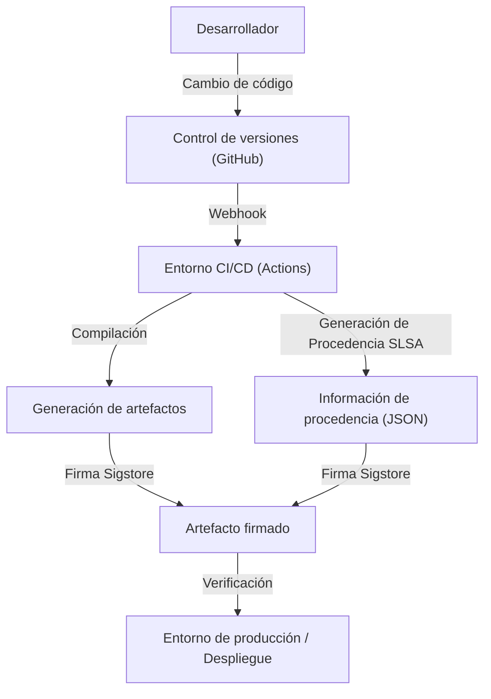

## Amenaza y antecedentes históricos de los ataques a la cadena de suministro de software

En el desarrollo de software moderno, casi nunca escribimos todo el código desde cero. Bibliotecas de código abierto, marcos de trabajo de terceros, herramientas de compilación y tuberías de CI/CD. Todos estos son componentes cruciales que conforman la "cadena de suministro de software", pero al mismo tiempo son objetivos perfectos para los atacantes.

Un ataque a la cadena de suministro de software es un método en el que no se invade directamente el sistema de la empresa objetivo, sino que se inyecta malware en el software, las herramientas de desarrollo o las dependencias que esa empresa utiliza, realizando un ataque indirecto. Este método se caracteriza por tener un impacto masivo y ser difícil de detectar, ya que una sola alteración puede afectar a miles o decenas de miles de usuarios finales.

### Las lecciones que dejó el incidente de SolarWinds

El incidente más emblemático que dio a conocer al mundo la amenaza de los ataques a la cadena de suministro de software fue el ataque contra SolarWinds (SUNBURST) descubierto en 2020. SolarWinds proporcionaba el software de gestión de infraestructura de TI "Orion", que había sido adoptado por muchas agencias gubernamentales de EE. UU. y empresas de Fortune 500.

Los atacantes invadieron el entorno de compilación de SolarWinds e introdujeron subrepticiamente una puerta trasera en un paquete de actualización legítimo. Dado que esta actualización alterada tenía una firma digital válida, eludió la detección de los productos de seguridad y se distribuyó e instaló automáticamente en aproximadamente 18.000 organizaciones.

Este incidente nos dejó las siguientes lecciones críticas:

1.  **Los "proveedores de confianza" no son incondicionalmente seguros**: Incluso si el software es adquirido y licenciado legalmente por una empresa, se convierte en una amenaza si su proceso de desarrollo se ve comprometido.
2.  **Vulnerabilidad de las tuberías de compilación**: No solo el código fuente, sino también el entorno CI/CD y los propios servidores de compilación son objetivos de ataque.
3.  **Falta de visibilidad**: Las organizaciones no podían rastrear con precisión qué componentes de qué software se estaban introduciendo en sus redes y a través de qué rutas.

A raíz de este incidente, el gobierno de los EE. UU. emitió una orden ejecutiva para fortalecer la ciberseguridad (EO 14028), exigiendo a los proveedores que suministran software al gobierno federal la presentación de un SBOM (Lista de materiales de software), lo que convirtió la seguridad de la cadena de suministro en una necesidad urgente.

## SBOM (Software Bill of Materials): Garantizando la transparencia del software

SBOM (Lista de materiales de software) es una lista en formato legible por máquina de los componentes, bibliotecas y dependencias que conforman un software. Al igual que los envases de alimentos enumeran los ingredientes y los alérgenos, el SBOM visualiza lo que está contenido dentro del software.

### Problemas que resuelve el SBOM

Cuando se descubre una vulnerabilidad grave en una biblioteca de código abierto (como Log4j, por ejemplo), el mayor desafío al que se enfrentan las empresas es identificar "en qué sistemas propios y qué versión de esa biblioteca se está utilizando". Si no existe un SBOM, requiere una enorme cantidad de tiempo y esfuerzo, como entrevistar a cada equipo de desarrollo o buscar manualmente en los repositorios de código.

Si el SBOM se genera y gestiona de forma rutinaria, la simple comparación de la información de vulnerabilidades (CVE) con el SBOM permite identificar instantáneamente los sistemas afectados, posibilitando la aplicación rápida de parches y soluciones alternativas.

### Formatos representativos de SBOM: SPDX y CycloneDX

Actualmente, existen dos formatos de datos principales para SBOM ampliamente utilizados como estándares de la industria: "SPDX" y "CycloneDX".

1.  **SPDX (Software Package Data Exchange)**:
    Es un formato estándar ISO (ISO/IEC 5962:2021) gestionado por la Linux Foundation. Desarrollado originalmente para gestionar el cumplimiento de las licencias de código abierto, ahora se ha ampliado para usos de seguridad. Permite una descripción detallada del origen de los paquetes, la información de licencias y las referencias de seguridad (como CPE), y se caracteriza por su alta afinidad con los departamentos legales y de cumplimiento.
2.  **CycloneDX**:
    Es un formato desarrollado por OWASP (Open Worldwide Application Security Project). Diseñado específicamente para el contexto de seguridad y la identificación de vulnerabilidades, admite la descripción no solo de software, sino también de hardware, servicios y algoritmos criptográficos (CBOM: Cryptography Bill of Materials). Su tamaño de archivo es relativamente compacto, lo que facilita su generación automática en las tuberías de CI/CD y su integración con escáneres de vulnerabilidades.

### Estrategias de generación y gestión de SBOM

El SBOM no es algo que "solo necesite crearse una vez cuando se lanza el software". Dado que las dependencias se actualizan con frecuencia, es necesario integrar la generación del SBOM en el proceso de compilación y mantenerlo actualizado de forma continua.

**Herramientas de generación:**
- Syft (Anchore)
- Trivy (Aqua Security)
- Microsoft SBOM Tool

**Ejemplo de generación en GitHub Actions (usando Trivy):**
```yaml
name: Generate SBOM
on: [push]
jobs:
  sbom:
    runs-on: ubuntu-latest
    steps:
      - uses: actions/checkout@v4
      - name: Run Trivy in fs mode to generate SBOM
        uses: aquasecurity/trivy-action@master
        with:
          scan-type: 'fs'
          format: 'cyclonedx'
          output: 'sbom.json'
      - name: Upload SBOM
        uses: actions/upload-artifact@v4
        with:
          name: sbom
          path: sbom.json
```

Es importante almacenar el SBOM generado en servidores de gestión especializados como Dependency-Track o Guac, y construir un sistema que lo compare continuamente con las bases de datos de vulnerabilidades (Monitorización Continua).

## SLSA: Un marco para la integridad de la compilación

Si el SBOM revela el "contenido del software", SLSA (Supply chain Levels for Software Artifacts, pronunciado 'salsa') es un marco que garantiza si el "software fue construido correcta y de forma segura". Propuesto por Google, actualmente está administrado por OpenSSF.

SLSA define pautas y niveles de seguridad para demostrar que no se ha producido ninguna alteración (integridad) en cada paso desde el cambio del código fuente hasta la generación del artefacto final (como binarios o imágenes de contenedor).

### Los 4 niveles de SLSA y sus requisitos

SLSA proporciona un enfoque gradual desde el Nivel 1 hasta el Nivel 4, considerando el equilibrio entre la facilidad de adopción y la solidez de la seguridad (actualmente subdividido en pistas como Build y Source bajo SLSA v1.0, pero aquí explicaremos el concepto general).

*   **SLSA Nivel 1: Registro de procedencia (Provenance)**
    *   **Requisitos**: El proceso de compilación está programado o automatizado, y se genera una prueba (Procedencia) que muestra "de qué código fuente" y "a través de qué proceso de compilación" se creó el artefacto final.
    *   **Propósito**: El primer paso para eliminar las compilaciones manuales y revelar el origen del software.
*   **SLSA Nivel 2: Información de procedencia firmada**
    *   **Requisitos**: Además de los requisitos del Nivel 1, el servicio de compilación (como el entorno CI) aplica firmas criptográficas a la información de procedencia, garantizando que el proceso de compilación no haya sido alterado externamente.
    *   **Propósito**: Asegurar la fiabilidad de la información de procedencia en sí y evitar el intercambio de artefactos después de la compilación.
*   **SLSA Nivel 3: Aislamiento y verificación del entorno de compilación**
    *   **Requisitos**: Además de los requisitos del Nivel 2, la compilación se realiza en un entorno dedicado y aislado (contenedor o VM) para evitar la interferencia con otras compilaciones y compromisos persistentes (entorno efímero). La generación de la información de procedencia se lleva a cabo por un plano de control de confianza aislado del propio entorno de compilación.
    *   **Propósito**: Dificultar los ataques a la propia tubería de compilación (como el caso de SolarWinds).
*   **SLSA Nivel 4: Máxima fiabilidad (Revisión por dos personas y compilación hermética)**
    *   **Requisitos**: Además de los requisitos del Nivel 3, se exige la aprobación de dos o más personas (Two-Person Review) para los cambios en el código fuente. Además, la compilación debe realizarse en un entorno completamente sellado (Hermetic Build: donde se bloquea el acceso a la red externa y todas las dependencias están predefinidas).
    *   **Propósito**: Prevención de amenazas internas y bloqueo de descargas de malware desde el exterior.

### Enfoque de implementación de los requisitos de SLSA

Para cumplir con los niveles de SLSA, no basta con introducir herramientas, sino que es necesario revisar todo el proceso de desarrollo.



## Sigstore: Firmas criptográficas para desarrolladores

Para lograr el requisito de SLSA de "firmar información de procedencia y artefactos", existía un obstáculo importante: la operación de una infraestructura de clave pública (PKI). La generación de claves, el almacenamiento seguro, la rotación, los procedimientos de revocación, etc., suponían una gran carga para los desarrolladores en las firmas PGP convencionales, lo que impidió su adopción generalizada.

Para resolver este problema surgió "Sigstore". Sigstore también es conocido como el "Let's Encrypt para firmas de software" y proporciona una infraestructura de firma gratuita y automatizada para proyectos de código abierto.

### Los 3 componentes principales que conforman Sigstore

1.  **Fulcio (Autoridad de certificación)**: Emite certificados temporales (de corta duración) basados en la identidad, como cuentas de GitHub o Google, utilizando OIDC (OpenID Connect). Esto elimina la necesidad de que los desarrolladores gestionen permanentemente claves privadas.
2.  **Rekor (Registro de transparencia)**: Registra los registros de firmas en un libro mayor distribuido inmutable (Transparency Log). Como cualquiera puede verificar y auditar el historial de firmas, es fácil de detectar incluso si un certificado se emite de manera fraudulenta.
3.  **Cosign (Herramienta de firma)**: Es una herramienta CLI para firmar y verificar fácilmente imágenes de contenedores y cualquier artefacto.

### Firma de imágenes de contenedor combinando GitHub Actions y Sigstore

Dado que GitHub Actions funciona como un proveedor OIDC, puede integrarse con Sigstore (Fulcio) para lograr "firmas sin clave (Keyless Signing)". Se trata de un mecanismo revolucionario que integra la identidad del propio flujo de trabajo de GitHub Actions (nombre del repositorio, rama, hash de confirmación, etc.) en un certificado para realizar la firma.

**Ejemplo de firma sin clave en GitHub Actions usando Cosign:**

```yaml
name: Build and Sign Container
on: [push]
jobs:
  build-and-sign:
    runs-on: ubuntu-latest
    permissions:
      contents: read
      packages: write
      id-token: write # OIDCトークンの取得に必須
    steps:
      - name: Checkout repository
        uses: actions/checkout@v4

      - name: Install Cosign
        uses: sigstore/cosign-installer@v3.5.0

      - name: Log in to GitHub Container Registry
        uses: docker/login-action@v3
        with:
          registry: ghcr.io
          username: ${{ github.actor }}
          password: ${{ secrets.GITHUB_TOKEN }}

      - name: Build and push Docker image
        id: docker_build
        uses: docker/build-push-action@v5
        with:
          push: true
          tags: ghcr.io/${{ github.repository }}:latest

      - name: Sign the container image
        env:
          COSIGN_EXPERIMENTAL: "true"
        run: |
          cosign sign --yes ghcr.io/${{ github.repository }}@${{ steps.docker_build.outputs.digest }}
```

Cuando se ejecuta este flujo de trabajo, después de enviar la imagen del contenedor a GHCR, Cosign obtiene automáticamente un certificado de corta duración de Fulcio a través de GitHub OIDC y firma el resumen (digest) de la imagen. La información de la firma se adjunta a GHCR y también se registra en el registro de Rekor.

### Verificación de firmas en entornos de producción

Para operar de manera segura con imágenes firmadas, es necesario un mecanismo que verifique su firma en el momento del despliegue. Si es un entorno de Kubernetes, al introducir Admission Controllers como Kyverno o Sigstore Policy Controller, puede aplicar políticas estrictas como "solo permitir la ejecución de imágenes compiladas y firmadas por GitHub Actions desde el repositorio correcto".

## Conclusión: Defensa continua de la cadena de suministro

La seguridad de la cadena de suministro de software no es algo que pueda resolverse con una sola herramienta o solución.
1.  Visualizar "qué se está usando" con el **SBOM** y construir la base para la gestión de vulnerabilidades.
2.  Seguir el marco de **SLSA** para fortalecer la integridad del proceso de compilación y avanzar en la automatización y el aislamiento.
3.  Utilizar **Sigstore** para firmar sin clave los artefactos y la información de procedencia, y verificarlos durante el despliegue.

Integrar esto profundamente en la tubería de CI/CD (como GitHub Actions) y construir un entorno "Seguro por defecto (Secure by Default)" minimizando la carga para los desarrolladores, se convertirá en la responsabilidad más importante en el desarrollo de software de próxima generación. Para evitar repetir tragedias como el incidente de SolarWinds, demos hoy el primer paso hacia la defensa de la cadena de suministro.
