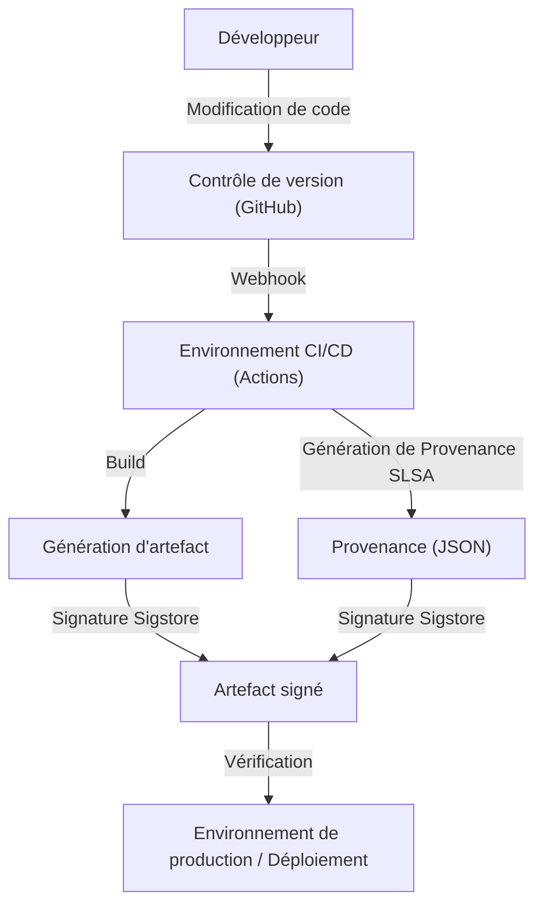

## La menace des attaques de la chaîne d'approvisionnement logicielle et son contexte historique

Dans le développement logiciel moderne, nous n'écrivons presque jamais tout le code à partir de zéro. Les bibliothèques open source, les frameworks tiers, les outils de build et les pipelines CI/CD sont tous des éléments cruciaux qui composent la « chaîne d'approvisionnement logicielle », mais ils constituent également des cibles de choix pour les attaquants.

Une attaque de la chaîne d'approvisionnement logicielle ne cible pas directement les systèmes d'une entreprise, mais consiste plutôt à injecter des logiciels malveillants dans les logiciels, les outils de développement ou les dépendances utilisés par cette entreprise, afin de l'attaquer indirectement. Cette méthode a un impact considérable et est difficile à détecter, car une seule modification peut affecter des milliers, voire des dizaines de milliers d'utilisateurs finaux.

### Les leçons tirées de l'incident SolarWinds

L'incident le plus emblématique qui a révélé au monde entier la menace des attaques de la chaîne d'approvisionnement logicielle est l'attaque contre SolarWinds (SUNBURST) découverte en 2020. SolarWinds fournissait un logiciel de gestion d'infrastructure informatique appelé « Orion », qui était utilisé par de nombreuses agences gouvernementales américaines et entreprises du Fortune 500.

Les attaquants ont infiltré l'environnement de build de SolarWinds et ont secrètement inséré une porte dérobée (backdoor) dans les packages de mise à jour légitimes. Comme ces mises à jour altérées portaient une signature numérique valide, elles ont contourné les outils de sécurité et ont été automatiquement distribuées et installées dans environ 18 000 organisations.

Cet incident nous a laissé de sérieuses leçons :

1.  **Les « fournisseurs de confiance » ne sont pas inconditionnellement sûrs** : Même si un logiciel est acheté et sous licence légalement par une entreprise, il devient une menace si son processus de développement a été compromis.
2.  **Vulnérabilité du pipeline de build** : Non seulement le code source, mais aussi l'environnement CI/CD et le serveur de build lui-même deviennent des cibles d'attaque.
3.  **Manque de visibilité** : Les organisations ne savaient pas exactement quels logiciels, quels composants et par quels moyens ils étaient introduits dans leurs réseaux.

Suite à cet incident, le gouvernement américain a publié un décret présidentiel (EO 14028) sur le renforcement de la cybersécurité, obligeant les fournisseurs de logiciels du gouvernement fédéral à soumettre un SBOM (nomenclature logicielle), rendant urgente la sécurisation de la chaîne d'approvisionnement.

## SBOM (Software Bill of Materials) : Garantir la transparence des logiciels

Un SBOM (Software Bill of Materials) est une « nomenclature logicielle », une liste lisible par machine des composants, bibliothèques et dépendances qui constituent un logiciel. Tout comme l'emballage d'un produit alimentaire indique les ingrédients et les allergènes, il permet de visualiser ce qui est inclus dans le logiciel.

### Les défis résolus par le SBOM

Lorsqu'une vulnérabilité grave est découverte dans une bibliothèque open source (comme Log4j), le plus grand défi pour une entreprise est de déterminer « dans quels systèmes et quelles versions de cette bibliothèque sont utilisés ». En l'absence de SBOM, cela demande un temps et des efforts considérables, comme interroger chaque équipe de développement ou rechercher manuellement dans les référentiels de code.

Si vous générez et gérez quotidiennement des SBOM, il suffit de vérifier les informations sur les vulnérabilités (CVE) par rapport aux SBOM pour identifier instantanément les systèmes affectés et appliquer rapidement des correctifs ou des solutions de contournement.

### Formats de SBOM représentatifs : SPDX et CycloneDX

Actuellement, il existe deux principaux formats de données SBOM largement utilisés comme standards de l'industrie : « SPDX » et « CycloneDX ».

1.  **SPDX (Software Package Data Exchange)** :
    Il s'agit d'un format standard ISO (ISO/IEC 5962:2021) géré par la Linux Foundation. Développé à l'origine pour la gestion de la conformité des licences open source, il a été étendu pour des cas d'utilisation de sécurité. Il permet de décrire en détail l'origine du package, les informations de licence et les références de sécurité (comme CPE), ce qui le rend très adapté aux départements juridiques et de conformité.
2.  **CycloneDX** :
    Ce format a été conçu par l'OWASP (Open Worldwide Application Security Project). Il est spécialement conçu pour le contexte de sécurité et l'identification des vulnérabilités, et prend en charge la description non seulement des logiciels, mais aussi du matériel, des services et des algorithmes de cryptographie (CBOM : Cryptography Bill of Materials). Sa taille de fichier est relativement compacte, ce qui facilite sa génération automatique dans les pipelines CI/CD et son intégration avec les scanners de vulnérabilités.

### Stratégies de génération et de gestion des SBOM

Un SBOM n'est pas quelque chose que l'on « crée une seule fois lors de la sortie d'un logiciel ». Étant donné que les dépendances sont fréquemment mises à jour, il est nécessaire d'intégrer la génération de SBOM dans le processus de build et de la maintenir en permanence à jour.

**Outils de génération :**
- Syft (Anchore)
- Trivy (Aqua Security)
- Microsoft SBOM Tool

**Exemple de génération dans GitHub Actions (utilisant Trivy) :**
```yaml
name: Generate SBOM
on: [push]
jobs:
  sbom:
    runs-on: ubuntu-latest
    steps:
      - uses: actions/checkout@v4
      - name: Run Trivy in fs mode to generate SBOM
        uses: aquasecurity/trivy-action@master
        with:
          scan-type: 'fs'
          format: 'cyclonedx'
          output: 'sbom.json'
      - name: Upload SBOM
        uses: actions/upload-artifact@v4
        with:
          name: sbom
          path: sbom.json
```

Il est important de stocker le SBOM généré sur un serveur de gestion spécialisé, tel que Dependency-Track ou Guac, et de mettre en place un système de surveillance continue (Continuous Monitoring) pour le vérifier par rapport aux bases de données de vulnérabilités.

## SLSA : Le framework de l'intégrité du build

Si le SBOM clarifie « ce qui se trouve à l'intérieur du logiciel », SLSA (Supply chain Levels for Software Artifacts, prononcé salsa) est un framework qui garantit que « le logiciel a été construit correctement et en toute sécurité ». Proposé par Google, il est actuellement géré par l'OpenSSF.

SLSA définit des directives et des niveaux de sécurité pour prouver qu'aucune altération (intégrité) n'a eu lieu à chaque étape, de la modification du code source à la génération de l'artefact final (binaire, image de conteneur, etc.).

### Les 4 niveaux de SLSA et leurs exigences

SLSA propose une approche progressive du niveau 1 au niveau 4, en équilibrant la facilité d'adoption et la force de sécurité (actuellement, SLSA v1.0 est subdivisé en pistes comme Build, Source, etc., mais nous expliquerons ici le concept global).

*   **SLSA Level 1 : Enregistrement de la provenance (Provenance)**
    *   **Exigence** : Le processus de build est scripté ou automatisé, et il existe une preuve (Provenance : historique) indiquant « de quel code source » et « via quel processus de build » l'artefact final a été créé.
    *   **Objectif** : Éliminer les builds manuels et constituer la première étape pour clarifier l'origine du logiciel.
*   **SLSA Level 2 : Provenance signée**
    *   **Exigence** : En plus des exigences du niveau 1, le service de build (comme l'environnement CI) doit signer cryptographiquement les informations de provenance pour garantir que le processus de build n'a pas été altéré de l'extérieur.
    *   **Objectif** : Garantir la fiabilité des informations de provenance elles-mêmes et empêcher le remplacement de l'artefact après le build.
*   **SLSA Level 3 : Isolation et vérification de l'environnement de build**
    *   **Exigence** : En plus des exigences du niveau 2, le build est effectué dans un environnement isolé dédié (conteneur ou VM) pour éviter les interférences avec d'autres builds et les compromissions persistantes (environnement éphémère). La génération de la provenance doit être effectuée par un plan de contrôle de confiance isolé de l'environnement de build lui-même.
    *   **Objectif** : Rendre difficile l'attaque du pipeline de build lui-même (comme dans le cas de SolarWinds).
*   **SLSA Level 4 : Confiance maximale (Two-Person Review & Hermetic Build)**
    *   **Exigence** : En plus des exigences du niveau 3, l'approbation d'au moins deux personnes (Two-Person Review) est requise pour toute modification du code source. De plus, le build doit être effectué dans un environnement complètement hermétique (Hermetic Build : l'accès au réseau externe est bloqué et toutes les dépendances sont prédéfinies).
    *   **Objectif** : Prévenir les menaces internes et bloquer le téléchargement de logiciels malveillants depuis l'extérieur.

### Approches d'implémentation des exigences SLSA

Atteindre les niveaux SLSA nécessite non seulement l'adoption d'outils, mais aussi une révision de l'ensemble du processus de développement.



## Sigstore : La signature cryptographique pour les développeurs

La réalisation de l'exigence SLSA de « signature des informations de provenance et des artefacts » posait un défi majeur : la gestion de l'infrastructure à clé publique (PKI). La création de clés, le stockage sécurisé, la rotation et la révocation constituaient une lourde charge pour les développeurs utilisant les signatures PGP traditionnelles, ce qui entravait leur adoption généralisée.

« Sigstore » est apparu pour résoudre ce problème. Également appelé le « Let's Encrypt de la signature de logiciels », Sigstore fournit une infrastructure de signature gratuite et automatisée pour les projets open source.

### Les 3 composants principaux de Sigstore

1.  **Fulcio (Autorité de certification)** : Utilise OIDC (OpenID Connect) pour émettre des certificats temporaires (à courte durée de vie) basés sur l'identité (compte GitHub, compte Google, etc.). Cela évite aux développeurs d'avoir à gérer les clés privées de manière permanente.
2.  **Rekor (Journal de transparence)** : Enregistre les signatures dans un registre distribué infalsifiable (Transparency Log). N'importe qui peut vérifier et auditer l'historique des signatures, ce qui facilite la détection si un certificat est émis frauduleusement.
3.  **Cosign (Outil de signature)** : Un outil CLI permettant de signer et de vérifier facilement les images de conteneurs et les artefacts arbitraires.

### Signature d'images de conteneurs combinant GitHub Actions et Sigstore

Puisque GitHub Actions agit comme un fournisseur OIDC, il peut s'intégrer à Sigstore (Fulcio) pour réaliser une « signature sans clé (Keyless Signing) ». Il s'agit d'un mécanisme innovant dans lequel l'identité du flux de travail GitHub Actions lui-même (nom du référentiel, branche, hachage de commit, etc.) est intégrée dans le certificat pour effectuer la signature.

**Exemple de signature sans clé dans GitHub Actions avec Cosign :**

```yaml
name: Build and Sign Container
on: [push]
jobs:
  build-and-sign:
    runs-on: ubuntu-latest
    permissions:
      contents: read
      packages: write
      id-token: write # Requis pour obtenir un jeton OIDC
    steps:
      - name: Checkout repository
        uses: actions/checkout@v4

      - name: Install Cosign
        uses: sigstore/cosign-installer@v3.5.0

      - name: Log in to GitHub Container Registry
        uses: docker/login-action@v3
        with:
          registry: ghcr.io
          username: ${{ github.actor }}
          password: ${{ secrets.GITHUB_TOKEN }}

      - name: Build and push Docker image
        id: docker_build
        uses: docker/build-push-action@v5
        with:
          push: true
          tags: ghcr.io/${{ github.repository }}:latest

      - name: Sign the container image
        env:
          COSIGN_EXPERIMENTAL: "true"
        run: |
          cosign sign --yes ghcr.io/${{ github.repository }}@${{ steps.docker_build.outputs.digest }}
```

Lorsque ce flux de travail est exécuté et que l'image du conteneur est poussée vers le GHCR, Cosign obtient automatiquement un certificat à courte durée de vie de Fulcio via GitHub OIDC et signe le hachage (digest) de l'image. Les informations de signature sont attachées au GHCR et également enregistrées dans le journal Rekor.

### Vérification de signature en production

Pour utiliser en toute sécurité des images signées, un mécanisme de vérification de ces signatures lors du déploiement est nécessaire. Dans un environnement Kubernetes, l'introduction de contrôleurs d'admission comme Kyverno ou Sigstore Policy Controller permet d'appliquer des politiques strictes, telles que « n'autoriser que l'exécution d'images construites et signées à partir du flux de travail GitHub Actions du référentiel correct ».

## Conclusion : Une défense continue de la chaîne d'approvisionnement

La sécurité de la chaîne d'approvisionnement logicielle ne peut être résolue par un outil ou une solution unique.
1.  Utilisez le **SBOM** pour visualiser « ce que vous utilisez » et établir une base pour la gestion des vulnérabilités.
2.  Suivez le framework **SLSA** pour renforcer l'intégrité de votre processus de build, en favorisant l'automatisation et l'isolation.
3.  Tirez parti de **Sigstore** pour signer sans clé les artefacts et les informations de provenance, et vérifiez-les lors du déploiement.

L'intégration étroite de ces éléments dans votre pipeline CI/CD (comme GitHub Actions) pour créer un environnement « sécurisé par défaut (Secure by Default) » tout en minimisant la charge des développeurs est la responsabilité la plus importante dans le développement logiciel de la prochaine génération. Commençons dès aujourd'hui à défendre la chaîne d'approvisionnement afin de ne pas répéter une tragédie comme l'incident de SolarWinds.
