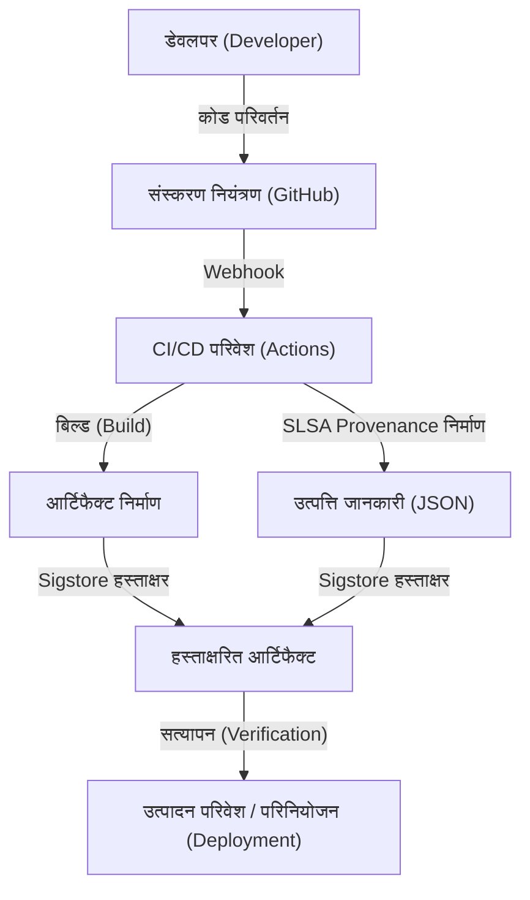

## सॉफ्टवेयर सप्लाई चेन हमलों का खतरा और ऐतिहासिक पृष्ठभूमि

आधुनिक सॉफ्टवेयर विकास में, हम शायद ही कभी सारा कोड शून्य से लिखते हैं। ओपन-सोर्स लाइब्रेरी, थर्ड-पार्टी फ्रेमवर्क, बिल्ड टूल और CI/CD पाइपलाइन—ये सभी "सॉफ्टवेयर सप्लाई चेन" बनाने वाले महत्वपूर्ण तत्व हैं, लेकिन साथ ही ये हमलावरों के लिए आसान लक्ष्य भी बन गए हैं।

सॉफ्टवेयर सप्लाई चेन हमला एक ऐसी तकनीक है जहाँ हमलावर लक्ष्य कंपनी के सिस्टम में सीधे घुसपैठ करने के बजाय, कंपनी द्वारा उपयोग किए जा रहे सॉफ्टवेयर, विकास उपकरण या निर्भरता (dependencies) में मैलवेयर डालकर अप्रत्यक्ष रूप से हमला करता है। इस पद्धति की विशेषता यह है कि एक भी बदलाव से हजारों या लाखों अंतिम-उपयोगकर्ता प्रभावित हो सकते हैं, जिससे इसका प्रभाव बहुत बड़ा होता है और इसका पता लगाना मुश्किल होता है।

### SolarWinds घटना द्वारा छोड़े गए सबक

दुनिया भर में सॉफ्टवेयर सप्लाई चेन हमलों के खतरे को उजागर करने वाली सबसे प्रतिष्ठित घटना 2020 में SolarWinds कंपनी पर हुआ हमला (SUNBURST) था। SolarWinds "Orion" नामक IT इंफ्रास्ट्रक्चर प्रबंधन सॉफ्टवेयर प्रदान करता था, जिसका उपयोग अमेरिकी सरकारी एजेंसियों और कई फॉर्च्यून 500 कंपनियों द्वारा किया जा रहा था।

हमलावरों ने SolarWinds के बिल्ड परिवेश में घुसपैठ की और वैध अपडेट पैकेज में गुप्त रूप से एक बैकडोर डाल दिया। इस बदले गए अपडेट में एक वैध डिजिटल हस्ताक्षर था, जिससे यह सुरक्षा उत्पादों की पहचान से बच गया और स्वचालित रूप से लगभग 18,000 संगठनों में वितरित और स्थापित हो गया।

इस घटना ने हमारे लिए निम्नलिखित गंभीर सबक छोड़े हैं:

1. **"विश्वसनीय वेंडर" बिना शर्त सुरक्षित नहीं होते**: भले ही कोई कंपनी कानूनी रूप से अनुबंध करके सॉफ्टवेयर खरीदती है, यदि उसकी विकास प्रक्रिया से समझौता किया गया है, तो यह एक खतरा बन जाता है।
2. **बिल्ड पाइपलाइन की भेद्यता**: केवल सोर्स कोड ही नहीं, बल्कि CI/CD परिवेश और बिल्ड सर्वर भी हमले के लक्ष्य होते हैं।
3. **दृश्यता की कमी (Lack of Visibility)**: संगठन इस बात का सटीक अंदाज़ा नहीं लगा पा रहे थे कि उनके नेटवर्क में कौन सा सॉफ्टवेयर, कौन से घटक और किस मार्ग से पेश किए गए थे।

इस घटना के बाद, अमेरिकी सरकार ने साइबर सुरक्षा को मजबूत करने के लिए एक कार्यकारी आदेश (EO 14028) जारी किया, जिसने संघीय सरकार को सॉफ्टवेयर की आपूर्ति करने वाले वेंडरों को SBOM (सॉफ्टवेयर बिल ऑफ मटेरियल्स) जमा करने के लिए अनिवार्य कर दिया, जिससे सप्लाई चेन सुरक्षा को संबोधित करना एक तत्काल प्राथमिकता बन गया।

## SBOM (Software Bill of Materials): सॉफ्टवेयर पारदर्शिता सुनिश्चित करना

SBOM (सॉफ्टवेयर बिल ऑफ मटेरियल्स) सॉफ्टवेयर घटकों, पुस्तकालयों और निर्भरताओं की एक मशीन-पठनीय सूची है जो "सॉफ्टवेयर के लिए सामग्रियों का बिल" बनाती है। जिस तरह खाद्य पैकेजों पर सामग्री और एलर्जी की जानकारी सूचीबद्ध होती है, उसी तरह यह सॉफ्टवेयर के अंदर क्या है इसकी कल्पना करने में मदद करता है।

### SBOM द्वारा हल की जाने वाली चुनौतियाँ

जब किसी ओपन-सोर्स लाइब्रेरी (जैसे Log4j) में गंभीर भेद्यता (vulnerability) पाई जाती है, तो कंपनियों के सामने सबसे बड़ी चुनौती यह पहचानना होता है कि "हमारी कंपनी के किस सिस्टम में उस लाइब्रेरी के किस संस्करण का उपयोग किया जा रहा है।" SBOM के बिना, प्रत्येक विकास दल से पूछताछ करने या मैन्युअल रूप से कोड रिपॉजिटरी खोजने में बहुत समय और प्रयास लगता है।

यदि आप नियमित रूप से SBOM बनाते और प्रबंधित करते हैं, तो भेद्यता जानकारी (CVE) को SBOM के साथ मिला कर तुरंत प्रभावित सिस्टम की पहचान की जा सकती है, जिससे त्वरित पैचिंग और वर्कअराउंड को लागू करना संभव हो जाता है।

### सामान्य SBOM प्रारूप: SPDX और CycloneDX

वर्तमान में, दो मुख्य SBOM डेटा प्रारूप हैं जिन्हें व्यापक रूप से उद्योग मानकों के रूप में उपयोग किया जाता है: "SPDX" और "CycloneDX"।

1. **SPDX (Software Package Data Exchange)**:
    यह Linux Foundation द्वारा प्रबंधित एक ISO मानक (ISO/IEC 5962:2021) प्रारूप है। मूल रूप से ओपन-सोर्स लाइसेंस अनुपालन के प्रबंधन के उद्देश्य से विकसित किया गया था, लेकिन अब इसे सुरक्षा उद्देश्यों के लिए भी विस्तारित किया गया है। यह आपको पैकेज की उत्पत्ति, लाइसेंस जानकारी और सुरक्षा संदर्भ (जैसे CPE) का विस्तार से वर्णन करने की अनुमति देता है, और यह कानूनी और अनुपालन विभागों के साथ अच्छी तरह मेल खाता है।
2. **CycloneDX**:
    यह OWASP (Open Worldwide Application Security Project) द्वारा बनाया गया एक प्रारूप है। इसे विशेष रूप से सुरक्षा संदर्भ और कमजोरियों की पहचान करने के लिए डिज़ाइन किया गया है, और यह न केवल सॉफ्टवेयर बल्कि हार्डवेयर, सेवाओं और क्रिप्टोग्राफिक एल्गोरिदम (CBOM: क्रिप्टोग्राफी बिल ऑफ मटेरियल्स) का वर्णन करने का भी समर्थन करता है। इसका फ़ाइल आकार अपेक्षाकृत छोटा होता है, और यह CI/CD पाइपलाइनों में स्वचालित पीढ़ी और भेद्यता स्कैनर के साथ एकीकरण के लिए आसान है।

### SBOM निर्माण और प्रबंधन रणनीतियाँ

SBOM कोई ऐसी चीज़ नहीं है जिसे "केवल एक बार सॉफ़्टवेयर रिलीज़ होने पर" बनाया जाता है। चूँकि निर्भरताएँ बार-बार अपडेट की जाती हैं, इसलिए बिल्ड प्रक्रिया में SBOM जनरेशन को शामिल करना और इसे लगातार अद्यतित रखना आवश्यक है।

**निर्माण उपकरण:**
- Syft (Anchore)
- Trivy (Aqua Security)
- Microsoft SBOM Tool

**GitHub Actions में निर्माण उदाहरण (Trivy का उपयोग करके):**
```yaml
name: Generate SBOM
on: [push]
jobs:
  sbom:
    runs-on: ubuntu-latest
    steps:
      - uses: actions/checkout@v4
      - name: Run Trivy in fs mode to generate SBOM
        uses: aquasecurity/trivy-action@master
        with:
          scan-type: 'fs'
          format: 'cyclonedx'
          output: 'sbom.json'
      - name: Upload SBOM
        uses: actions/upload-artifact@v4
        with:
          name: sbom
          path: sbom.json
```

उत्पन्न किए गए SBOM को विशेष प्रबंधन सर्वर जैसे Dependency-Track या Guac में सहेजना महत्वपूर्ण है, और एक ऐसा तंत्र स्थापित करना (निरंतर निगरानी) जो भेद्यता डेटाबेस के खिलाफ इसकी लगातार जांच करे।

## SLSA: बिल्ड इंटिग्रिटी फ्रेमवर्क

यदि SBOM से पता चलता है कि "सॉफ्टवेयर के अंदर क्या है", तो SLSA (Supply chain Levels for Software Artifacts, जिसे साल्सा कहा जाता है) एक ऐसा फ्रेमवर्क है जो यह सुनिश्चित करता है कि "सॉफ्टवेयर सही और सुरक्षित रूप से बनाया गया था।" इसे Google द्वारा प्रस्तावित किया गया था और वर्तमान में OpenSSF द्वारा प्रबंधित किया जाता है।

SLSA सोर्स कोड में परिवर्तन से लेकर अंतिम आर्टिफैक्ट (जैसे बाइनरी या कंटेनर इमेज) के निर्माण तक हर कदम पर बिना किसी छेड़छाड़ के (अखंडता/इंटीग्रिटी) यह साबित करने के लिए दिशानिर्देश और सुरक्षा स्तर परिभाषित करता है।

### SLSA के 4 स्तर और आवश्यकताएँ

कार्यान्वयन की आसानी और सुरक्षा की मजबूती के संतुलन पर विचार करते हुए, SLSA स्तर 1 से स्तर 4 तक एक चरणबद्ध दृष्टिकोण प्रदान करता है (वर्तमान में SLSA v1.0 के रूप में, इसे बिल्ड और सोर्स जैसे ट्रैक में उप-विभाजित किया गया है, लेकिन यहाँ हम समग्र अवधारणा की व्याख्या करेंगे)।

* **SLSA Level 1: स्रोत की रिकॉर्डिंग (Provenance)**
    * **आवश्यकता**: बिल्ड प्रक्रिया स्क्रिप्टेड या स्वचालित होनी चाहिए, और एक प्रमाण (Provenance: उत्पत्ति की जानकारी) उत्पन्न होना चाहिए जो दिखाए कि अंतिम आर्टिफैक्ट "किस सोर्स कोड से" और "किस बिल्ड प्रक्रिया के माध्यम से" बनाया गया था।
    * **उद्देश्य**: मैन्युअल बिल्ड को खत्म करने और सॉफ्टवेयर की उत्पत्ति को स्पष्ट करने की दिशा में पहला कदम।
* **SLSA Level 2: हस्ताक्षरित उत्पत्ति की जानकारी**
    * **आवश्यकता**: Level 1 की आवश्यकताओं के अलावा, बिल्ड सेवा (जैसे CI परिवेश) को उत्पत्ति की जानकारी पर क्रिप्टोग्राफिक हस्ताक्षर करना चाहिए, ताकि यह सुनिश्चित हो सके कि बिल्ड प्रक्रिया के साथ बाहर से कोई छेड़छाड़ नहीं की गई है।
    * **उद्देश्य**: उत्पत्ति की जानकारी की विश्वसनीयता सुनिश्चित करना और बिल्ड के बाद आर्टिफैक्ट की हेराफेरी को रोकना।
* **SLSA Level 3: बिल्ड परिवेश का अलगाव और सत्यापन**
    * **आवश्यकता**: Level 2 की आवश्यकताओं के अलावा, बिल्ड को एक समर्पित, पृथक परिवेश (कंटेनर या VM) में निष्पादित किया जाना चाहिए ताकि अन्य बिल्ड और लगातार होने वाले उल्लंघनों (अस्थायी/ephemeral परिवेश) के साथ हस्तक्षेप को रोका जा सके। उत्पत्ति की जानकारी का निर्माण बिल्ड वातावरण से अलग एक विश्वसनीय नियंत्रण तल (control plane) द्वारा किया जाना चाहिए।
    * **उद्देश्य**: बिल्ड पाइपलाइन पर हमले को कठिन बनाना (जैसे SolarWinds के मामले में)।
* **SLSA Level 4: उच्चतम विश्वसनीयता (Two-Person Review & Hermetic Build)**
    * **आवश्यकता**: Level 3 की आवश्यकताओं के अलावा, सोर्स कोड में किसी भी बदलाव के लिए कम से कम दो लोगों (Two-Person Review) की मंजूरी अनिवार्य होनी चाहिए। साथ ही, बिल्ड एक पूरी तरह से सीलबंद (Hermetic Build) वातावरण में किया जाना चाहिए जहाँ बाहरी नेटवर्क तक पहुँच अवरुद्ध हो और सभी निर्भरताएँ पूर्व-परिभाषित हों।
    * **उद्देश्य**: अंदरूनी खतरों (insider threats) को रोकना और बाहर से मैलवेयर डाउनलोड को ब्लॉक करना।

### SLSA आवश्यकताओं का कार्यान्वयन दृष्टिकोण

SLSA स्तरों को पूरा करने के लिए केवल उपकरणों को शामिल करने से कहीं अधिक की आवश्यकता होती है; पूरी विकास प्रक्रिया की समीक्षा की आवश्यकता है।



## Sigstore: डेवलपर्स के लिए क्रिप्टोग्राफिक हस्ताक्षर

SLSA की "उत्पत्ति की जानकारी और आर्टिफैक्ट्स पर हस्ताक्षर करने" की आवश्यकता को प्राप्त करने में, पब्लिक की इंफ्रास्ट्रक्चर (PKI) के संचालन की एक बड़ी बाधा थी। कुंजी (key) बनाना, उन्हें सुरक्षित रूप से संग्रहीत करना, रोटेशन और निरस्तीकरण की प्रक्रियाएं जैसे पारंपरिक PGP हस्ताक्षर डेवलपर्स के लिए बोझिल थे, और इसलिए वे व्यापक रूप से उपयोग में नहीं आ सके।

इस समस्या को हल करने के लिए "Sigstore" बनाया गया था। Sigstore को "सॉफ्टवेयर हस्ताक्षरों के लिए Let's Encrypt" भी कहा जाता है, और यह ओपन-सोर्स परियोजनाओं के लिए एक मुफ्त और स्वचालित हस्ताक्षर बुनियादी ढांचा प्रदान करता है।

### Sigstore बनाने वाले 3 मुख्य घटक

1. **Fulcio (प्रमाणन प्राधिकरण/Certificate Authority)**: OIDC (OpenID Connect) का उपयोग करके, यह GitHub या Google खातों जैसे पहचान के आधार पर अस्थायी (अल्पकालिक) प्रमाणपत्र जारी करता है। इसका मतलब है कि डेवलपर्स को निजी कुंजियों को स्थायी रूप से प्रबंधित करने की आवश्यकता नहीं है।
2. **Rekor (पारदर्शिता लॉग/Transparency Log)**: यह हस्ताक्षर रिकॉर्ड को छेड़छाड़-प्रूफ वितरित बहीखाता (Transparency Log) में दर्ज करता है। चूंकि कोई भी हस्ताक्षर इतिहास को सत्यापित और ऑडिट कर सकता है, भले ही कोई प्रमाणपत्र गलत तरीके से जारी किया गया हो, इसे खोजना आसान है।
3. **Cosign (हस्ताक्षर उपकरण)**: यह कंटेनर इमेज या किसी भी आर्टिफैक्ट पर आसानी से हस्ताक्षर करने और सत्यापित करने के लिए एक CLI टूल है।

### GitHub Actions और Sigstore के संयोजन से कंटेनर इमेज पर हस्ताक्षर करना

चूंकि GitHub Actions एक OIDC प्रदाता के रूप में काम करता है, इसलिए यह "कीलेस साइनिंग (Keyless Signing)" प्राप्त करने के लिए Sigstore (Fulcio) के साथ काम कर सकता है। यह एक क्रांतिकारी तंत्र है जहां GitHub Actions वर्कफ़्लो की पहचान (रिपॉजिटरी नाम, ब्रांच, कमिट हैश, आदि) को प्रमाणपत्र में एम्बेड करके हस्ताक्षर किए जाते हैं।

**Cosign का उपयोग करके GitHub Actions में कीलेस साइनिंग का उदाहरण:**

```yaml
name: Build and Sign Container
on: [push]
jobs:
  build-and-sign:
    runs-on: ubuntu-latest
    permissions:
      contents: read
      packages: write
      id-token: write # OIDC टोकन प्राप्त करने के लिए आवश्यक
    steps:
      - name: Checkout repository
        uses: actions/checkout@v4

      - name: Install Cosign
        uses: sigstore/cosign-installer@v3.5.0

      - name: Log in to GitHub Container Registry
        uses: docker/login-action@v3
        with:
          registry: ghcr.io
          username: ${{ github.actor }}
          password: ${{ secrets.GITHUB_TOKEN }}

      - name: Build and push Docker image
        id: docker_build
        uses: docker/build-push-action@v5
        with:
          push: true
          tags: ghcr.io/${{ github.repository }}:latest

      - name: Sign the container image
        env:
          COSIGN_EXPERIMENTAL: "true"
        run: |
          cosign sign --yes ghcr.io/${{ github.repository }}@${{ steps.docker_build.outputs.digest }}
```

जब यह वर्कफ़्लो चलता है और कंटेनर इमेज को GHCR में पुश किया जाता है, तो Cosign स्वचालित रूप से GitHub OIDC के माध्यम से Fulcio से एक अल्पकालिक प्रमाणपत्र प्राप्त करता है और इमेज के डाइजेस्ट पर हस्ताक्षर करता है। हस्ताक्षर की जानकारी GHCR से जुड़ी होती है और इसे Rekor लॉग में भी दर्ज किया जाता है।

### उत्पादन परिवेश में हस्ताक्षर सत्यापन

हस्ताक्षरित इमेज को सुरक्षित रूप से संचालित करने के लिए, डिप्लॉयमेंट के दौरान उन हस्ताक्षरों को सत्यापित करने के लिए एक तंत्र की आवश्यकता होती है। यदि यह कुबेरनेट्स (Kubernetes) वातावरण है, तो आप Kyverno या Sigstore Policy Controller जैसे एडमिशन कंट्रोलर को शामिल करके सख्त नीतियां लागू कर सकते हैं, जैसे "केवल सही रिपॉजिटरी के GitHub Actions से बनाई और हस्ताक्षरित की गई इमेज को निष्पादित करने की अनुमति देना।"

## निष्कर्ष: निरंतर सप्लाई चेन सुरक्षा

सॉफ्टवेयर सप्लाई चेन सुरक्षा कोई ऐसी चीज़ नहीं है जिसे किसी एक टूल या समाधान से हल किया जा सके।
1. **SBOM** का उपयोग करके आप जो उपयोग कर रहे हैं उसकी कल्पना करें और भेद्यता प्रबंधन की नींव बनाएं।
2. **SLSA** फ्रेमवर्क के अनुसार, बिल्ड प्रक्रिया की अखंडता को मजबूत करें और स्वचालन (automation) और अलगाव (isolation) को बढ़ावा दें।
3. आर्टिफैक्ट्स और उत्पत्ति की जानकारी पर कीलेस हस्ताक्षर करने और डिप्लॉयमेंट पर इसे सत्यापित करने के लिए **Sigstore** का लाभ उठाएं।

इन्हें CI/CD पाइपलाइन (जैसे GitHub Actions) में गहराई से एकीकृत करना और डेवलपर्स पर न्यूनतम बोझ डालते हुए एक "डिफ़ॉल्ट रूप से सुरक्षित (Secure by Default)" परिवेश बनाना अगली पीढ़ी के सॉफ्टवेयर विकास में सबसे महत्वपूर्ण ज़िम्मेदारी है। SolarWinds की घटना जैसी त्रासदियों को दोहराने से बचने के लिए, आइए आज ही सप्लाई चेन सुरक्षा की दिशा में पहला कदम उठाएं।
