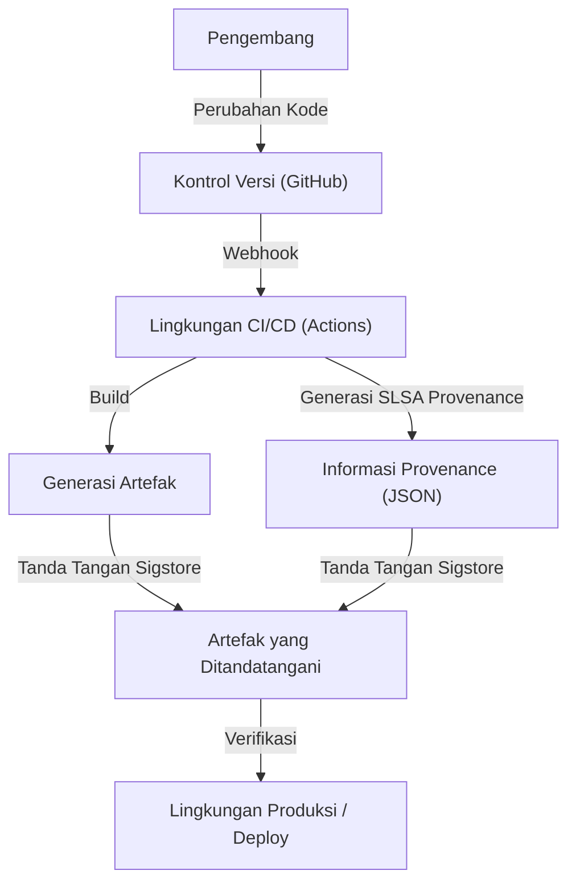

## Ancaman Serangan Rantai Pasokan Perangkat Lunak dan Latar Belakang Historis

Dalam pengembangan perangkat lunak modern, kita hampir tidak pernah menulis semua kode dari nol. Pustaka open-source, framework pihak ketiga, alat build, dan pipeline CI/CD—semuanya adalah komponen penting yang membentuk "rantai pasokan perangkat lunak (software supply chain)", tetapi pada saat yang sama menjadi target yang menarik bagi penyerang.

Serangan rantai pasokan perangkat lunak adalah teknik di mana penyerang tidak menyusup langsung ke sistem perusahaan target, melainkan memasukkan malware ke dalam perangkat lunak, alat pengembangan, atau dependensi yang digunakan oleh perusahaan tersebut untuk melancarkan serangan secara tidak langsung. Teknik ini sangat berdampak besar karena satu perubahan berbahaya dapat memengaruhi ribuan atau puluhan ribu pengguna akhir, dan juga sangat sulit dideteksi.

### Pelajaran dari Insiden SolarWinds

Insiden paling ikonik yang menyadarkan dunia akan ancaman serangan rantai pasokan perangkat lunak adalah serangan terhadap SolarWinds (SUNBURST) yang terungkap pada tahun 2020. SolarWinds menyediakan perangkat lunak manajemen infrastruktur TI "Orion", yang banyak digunakan oleh lembaga pemerintah AS dan perusahaan-perusahaan Fortune 500.

Penyerang menyusup ke lingkungan build SolarWinds dan secara diam-diam memasukkan backdoor ke dalam paket pembaruan resmi. Pembaruan yang dimanipulasi ini memiliki tanda tangan digital yang sah, sehingga lolos dari deteksi produk keamanan dan secara otomatis didistribusikan serta diinstal di sekitar 18.000 organisasi.

Insiden ini meninggalkan pelajaran penting berikut:

1.  **"Vendor tepercaya" tidak aman tanpa syarat**: Bahkan jika perangkat lunak dibeli dan dikontrak secara resmi oleh perusahaan, perangkat lunak tersebut akan menjadi ancaman jika proses pengembangannya telah disusupi.
2.  **Kerentanan pipeline build**: Bukan hanya kode sumber, tetapi lingkungan CI/CD dan server build itu sendiri menjadi target serangan.
3.  **Kurangnya visibilitas**: Organisasi tidak memiliki pemahaman yang akurat tentang komponen mana dari perangkat lunak apa, dan melalui jalur apa, yang dimasukkan ke dalam jaringan mereka.

Buntut dari insiden ini, pemerintah AS mengeluarkan Perintah Eksekutif (EO 14028) untuk memperkuat keamanan siber, mewajibkan vendor yang memasok perangkat lunak kepada pemerintah federal untuk menyerahkan SBOM (Software Bill of Materials), sehingga keamanan rantai pasokan menjadi isu yang mendesak.

## SBOM (Software Bill of Materials): Memastikan Transparansi Perangkat Lunak

SBOM (Software Bill of Materials) adalah "daftar bahan perangkat lunak" yang mendeskripsikan daftar komponen, pustaka, dan dependensi yang membentuk perangkat lunak dalam format yang dapat dibaca mesin (machine-readable). Mirip dengan daftar bahan dan alergen pada kemasan makanan, SBOM memvisualisasikan apa saja yang terkandung di dalam perangkat lunak.

### Masalah yang Diselesaikan oleh SBOM

Ketika kerentanan kritis ditemukan dalam pustaka open source tertentu (seperti Log4j), tantangan terbesar yang dihadapi perusahaan adalah mengidentifikasi "di sistem perusahaan mana dan versi pustaka apa yang digunakan". Tanpa SBOM, proses ini memerlukan waktu dan upaya yang sangat besar, seperti mewawancarai setiap tim pengembangan atau mencari secara manual di repositori kode.

Jika SBOM secara rutin dihasilkan dan dikelola, Anda dapat dengan instan mengidentifikasi sistem yang terdampak hanya dengan mencocokkan informasi kerentanan (CVE) dengan SBOM, sehingga memungkinkan penerapan patch atau eksekusi langkah mitigasi yang cepat.

### Format SBOM Terkemuka: SPDX dan CycloneDX

Saat ini, ada dua format data SBOM utama yang banyak digunakan sebagai standar industri: "SPDX" dan "CycloneDX".

1.  **SPDX (Software Package Data Exchange)**:
    Ini adalah format standar ISO (ISO/IEC 5962:2021) yang dikelola oleh Linux Foundation. Awalnya dikembangkan untuk manajemen kepatuhan lisensi open-source, tetapi sekarang telah diperluas untuk tujuan keamanan. Format ini memungkinkan deskripsi rinci tentang asal paket, informasi lisensi, dan referensi keamanan (seperti CPE), serta sangat cocok untuk departemen hukum dan kepatuhan.
2.  **CycloneDX**:
    Ini adalah format yang dirumuskan oleh OWASP (Open Worldwide Application Security Project). Format ini dirancang khusus untuk konteks keamanan dan identifikasi kerentanan, serta mendukung tidak hanya perangkat lunak tetapi juga perangkat keras, layanan, dan algoritma kriptografi (CBOM: Cryptography Bill of Materials). Ukuran filenya relatif ringkas, sehingga mudah dihasilkan secara otomatis di pipeline CI/CD atau diintegrasikan dengan pemindai kerentanan.

### Strategi Pembuatan dan Pengelolaan SBOM

SBOM bukanlah sesuatu yang "dibuat sekali saja saat merilis perangkat lunak". Karena dependensi sering diperbarui, pembuatan SBOM harus diintegrasikan ke dalam proses build untuk menjaganya agar terus mutakhir.

**Alat Pembuatan:**
- Syft (Anchore)
- Trivy (Aqua Security)
- Microsoft SBOM Tool

**Contoh Pembuatan di GitHub Actions (menggunakan Trivy):**
```yaml
name: Generate SBOM
on: [push]
jobs:
  sbom:
    runs-on: ubuntu-latest
    steps:
      - uses: actions/checkout@v4
      - name: Run Trivy in fs mode to generate SBOM
        uses: aquasecurity/trivy-action@master
        with:
          scan-type: 'fs'
          format: 'cyclonedx'
          output: 'sbom.json'
      - name: Upload SBOM
        uses: actions/upload-artifact@v4
        with:
          name: sbom
          path: sbom.json
```

Sangat penting untuk menyimpan SBOM yang dihasilkan di server manajemen khusus seperti Dependency-Track atau Guac, dan membangun sistem (Continuous Monitoring) untuk mencocokkannya secara terus-menerus dengan basis data kerentanan.

## SLSA: Framework Integritas Build

Jika SBOM mengungkapkan "isi perangkat lunak", maka SLSA (Supply chain Levels for Software Artifacts, diucapkan "salsa") adalah framework yang menjamin bahwa "perangkat lunak dibuat dengan benar dan aman". Diusulkan oleh Google, dan sekarang dikelola oleh OpenSSF.

SLSA mendefinisikan panduan dan level keamanan untuk membuktikan bahwa tidak ada manipulasi (integritas) di setiap langkah, dari perubahan kode sumber hingga pembuatan artefak akhir (seperti biner atau image container).

### 4 Level dan Persyaratan SLSA

SLSA menawarkan pendekatan bertahap dari Level 1 hingga Level 4, menyeimbangkan kemudahan adopsi dan kekuatan keamanan (saat ini sebagai SLSA v1.0, telah disubkategorikan ke dalam jalur Build, Source, dll., tetapi konsep keseluruhannya dijelaskan di sini).

*   **SLSA Level 1: Pencatatan Asal-usul (Provenance)**
    *   **Persyaratan**: Proses build diskrip atau diotomatisasi, dan bukti (Provenance) yang menunjukkan dari "kode sumber mana" dan "melalui proses build apa" artefak akhir dibuat telah dihasilkan.
    *   **Tujuan**: Menghilangkan build manual dan langkah pertama untuk memperjelas asal-usul perangkat lunak.
*   **SLSA Level 2: Provenance yang Ditandatangani**
    *   **Persyaratan**: Selain persyaratan Level 1, layanan build (seperti lingkungan CI) harus memberikan tanda tangan kriptografi pada informasi provenance untuk menjamin bahwa proses build belum dimanipulasi dari luar.
    *   **Tujuan**: Memastikan keandalan informasi provenance itu sendiri dan mencegah penukaran artefak pasca-build.
*   **SLSA Level 3: Isolasi dan Verifikasi Lingkungan Build**
    *   **Persyaratan**: Selain persyaratan Level 2, build dilakukan di lingkungan terisolasi khusus (kontainer atau VM) untuk mencegah gangguan dari build lain atau penyusupan berkelanjutan (lingkungan ephemeral). Pembuatan informasi provenance harus dilakukan oleh control plane terpercaya yang terpisah dari lingkungan build itu sendiri.
    *   **Tujuan**: Mempersulit serangan langsung ke pipeline build (seperti kasus SolarWinds).
*   **SLSA Level 4: Kepercayaan Tertinggi (Two-Person Review & Hermetic Build)**
    *   **Persyaratan**: Selain persyaratan Level 3, persetujuan dari minimal dua orang (Two-Person Review) diwajibkan untuk perubahan kode sumber. Selain itu, build harus dilakukan di lingkungan yang sepenuhnya tertutup (Hermetic Build: akses ke jaringan eksternal diblokir, dan semua dependensi didefinisikan sebelumnya).
    *   **Tujuan**: Mencegah ancaman internal dan memblokir pengunduhan malware dari luar.

### Pendekatan Implementasi Persyaratan SLSA

Untuk memenuhi level SLSA, tidak cukup hanya dengan memperkenalkan alat, tetapi seluruh proses pengembangan perlu ditinjau ulang.



## Sigstore: Tanda Tangan Kriptografi untuk Pengembang

Untuk memenuhi persyaratan SLSA berupa "tanda tangan pada informasi provenance dan artefak", ada rintangan besar yaitu pengoperasian Public Key Infrastructure (PKI). Pembuatan kunci, penyimpanan yang aman, rotasi, dan prosedur pencabutan membuat tanda tangan PGP tradisional membebani pengembang, sehingga tidak diadopsi secara luas.

Untuk memecahkan masalah ini, "Sigstore" hadir. Sering disebut sebagai "Let's Encrypt untuk tanda tangan perangkat lunak", Sigstore menyediakan infrastruktur penandatanganan otomatis dan gratis untuk proyek open-source.

### 3 Komponen Utama yang Membentuk Sigstore

1.  **Fulcio (Certificate Authority)**: Menggunakan OIDC (OpenID Connect) untuk menerbitkan sertifikat sementara (berumur pendek) berbasis identitas seperti akun GitHub atau akun Google. Hal ini membebaskan pengembang dari keharusan mengelola kunci privat secara permanen.
2.  **Rekor (Transparency Log)**: Mencatat catatan tanda tangan pada buku besar terdistribusi yang tidak dapat diubah (Transparency Log). Siapa pun dapat memverifikasi dan mengaudit riwayat tanda tangan, sehingga mudah untuk dideteksi meskipun sertifikat diterbitkan secara tidak sah.
3.  **Cosign (Alat Tanda Tangan)**: Ini adalah alat CLI untuk menyederhanakan penandatanganan dan verifikasi image container atau artefak apa pun.

### Penandatanganan Image Container dengan Kombinasi GitHub Actions dan Sigstore

Karena GitHub Actions berfungsi sebagai penyedia OIDC, ia dapat berintegrasi dengan Sigstore (Fulcio) untuk mewujudkan "Penandatanganan Tanpa Kunci (Keyless Signing)". Ini adalah mekanisme revolusioner di mana identitas dari alur kerja GitHub Actions itu sendiri (nama repositori, branch, commit hash, dll.) disematkan ke dalam sertifikat untuk penandatanganan.

**Contoh Penandatanganan Tanpa Kunci di GitHub Actions Menggunakan Cosign:**

```yaml
name: Build and Sign Container
on: [push]
jobs:
  build-and-sign:
    runs-on: ubuntu-latest
    permissions:
      contents: read
      packages: write
      id-token: write # Wajib untuk mendapatkan token OIDC
    steps:
      - name: Checkout repository
        uses: actions/checkout@v4

      - name: Install Cosign
        uses: sigstore/cosign-installer@v3.5.0

      - name: Log in to GitHub Container Registry
        uses: docker/login-action@v3
        with:
          registry: ghcr.io
          username: ${{ github.actor }}
          password: ${{ secrets.GITHUB_TOKEN }}

      - name: Build and push Docker image
        id: docker_build
        uses: docker/build-push-action@v5
        with:
          push: true
          tags: ghcr.io/${{ github.repository }}:latest

      - name: Sign the container image
        env:
          COSIGN_EXPERIMENTAL: "true"
        run: |
          cosign sign --yes ghcr.io/${{ github.repository }}@${{ steps.docker_build.outputs.digest }}
```

Ketika alur kerja ini dijalankan, setelah image container di-push ke GHCR, Cosign secara otomatis mengambil sertifikat berumur pendek dari Fulcio melalui GitHub OIDC dan menandatangani digest image. Informasi tanda tangan dilampirkan ke GHCR dan juga dicatat dalam log Rekor.

### Verifikasi Tanda Tangan di Lingkungan Produksi

Untuk mengoperasikan image yang ditandatangani dengan aman, mekanisme untuk memverifikasi tanda tangan saat deployment diperlukan. Di lingkungan Kubernetes, dengan memperkenalkan Admission Controller seperti Kyverno atau Sigstore Policy Controller, Anda dapat menerapkan kebijakan ketat seperti "hanya mengizinkan eksekusi image yang dibuild dan ditandatangani dari GitHub Actions repositori yang benar".

## Kesimpulan: Pertahanan Rantai Pasokan yang Berkelanjutan

Keamanan rantai pasokan perangkat lunak tidak dapat diselesaikan dengan satu alat atau solusi saja.
1.  Gunakan **SBOM** untuk memvisualisasikan "apa yang Anda gunakan" dan buat landasan untuk manajemen kerentanan.
2.  Ikuti framework **SLSA** untuk memperkuat integritas proses build dan mendorong otomatisasi serta isolasi.
3.  Manfaatkan **Sigstore** untuk menandatangani artefak dan informasi provenance tanpa kunci, lalu memverifikasinya saat deployment.

Mengintegrasikan langkah-langkah ini secara mendalam ke dalam pipeline CI/CD (seperti GitHub Actions) dan membangun lingkungan "Secure by Default" sambil meminimalkan beban pengembang adalah tanggung jawab paling penting dalam pengembangan perangkat lunak generasi mendatang. Mari ambil langkah pertama dalam pertahanan rantai pasokan mulai hari ini, agar tragedi seperti insiden SolarWinds tidak terulang kembali.
