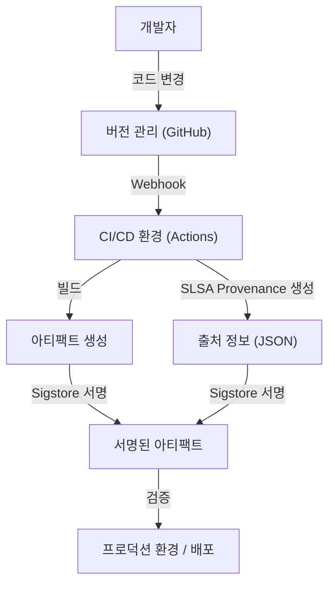

## 소프트웨어 공급망 공격의 위협과 역사적 배경

현대의 소프트웨어 개발에 있어 우리가 모든 코드를 처음부터 끝까지 직접 작성하는 일은 거의 없습니다. 오픈소스 라이브러리, 서드파티 프레임워크, 빌드 도구, 그리고 CI/CD 파이프라인. 이 모든 것들은 '소프트웨어 공급망'을 구성하는 중요한 요소이지만, 동시에 공격자에게는 아주 좋은 표적이 되고 있습니다.

소프트웨어 공급망 공격이란 타겟 기업의 시스템에 직접 침입하는 대신, 그 기업이 이용하고 있는 소프트웨어나 개발 도구, 의존성에 멀웨어를 혼입시켜 간접적으로 공격을 가하는 수법입니다. 이 수법은 한 번의 변조로 수천, 수만 명의 엔드 유저에게 영향을 미칠 수 있기 때문에 매우 영향력이 크고 또 발견하기 어렵다는 특징을 가지고 있습니다.

### SolarWinds 사건이 남긴 교훈

소프트웨어 공급망 공격의 위협을 전 세계에 알린 가장 상징적인 사건이 2020년에 발각된 SolarWinds사에 대한 공격(SUNBURST)입니다. SolarWinds사는 IT 인프라 관리 소프트웨어 'Orion'을 제공하고 있었으며, 미국 정부 기관과 포춘 500대 기업 중 상당수가 이를 도입하고 있었습니다.

공격자는 SolarWinds사의 빌드 환경에 침입하여 정상적인 업데이트 패키지에 은밀하게 백도어를 심었습니다. 이 변조된 업데이트는 정상적인 디지털 서명이 되어 있었기 때문에 보안 제품의 탐지를 피할 수 있었고, 약 1만 8000개의 조직에 자동으로 배포되어 설치되었습니다.

이 사건은 다음과 같은 심각한 교훈을 우리에게 남겼습니다.

1.  **'신뢰할 수 있는 벤더'가 무조건 안전한 것은 아니다**: 기업이 정상적으로 계약하고 구매한 소프트웨어라 할지라도 그 개발 프로세스가 침해당했다면 위협이 됩니다.
2.  **빌드 파이프라인의 취약성**: 소스 코드뿐만 아니라 CI/CD 환경이나 빌드 서버 자체가 공격 대상이 됩니다.
3.  **가시성의 결여**: 조직은 자사의 네트워크에 어떤 소프트웨어의 어떤 컴포넌트가 어떤 경로로 도입되었는지 정확히 파악하지 못하고 있었습니다.

이 사건을 계기로 미국 정부는 사이버 보안 강화에 관한 행정명령(EO 14028)을 발령하여 연방 정부에 소프트웨어를 납품하는 벤더에게 SBOM(소프트웨어 구성 요소 명세서) 제출을 의무화하는 등 공급망 보안에 대한 대응이 시급해졌습니다.

## SBOM (Software Bill of Materials): 소프트웨어의 투명성 확보하기

SBOM(Software Bill of Materials)은 소프트웨어를 구성하는 컴포넌트, 라이브러리, 의존성 목록을 기계가 읽을 수 있는 형식으로 기술한 '소프트웨어 부품 명세서'입니다. 식품 패키지에 원재료나 알레르기 유발 물질이 기재되어 있는 것과 마찬가지로 소프트웨어 안에 무엇이 포함되어 있는지 시각화합니다.

### SBOM이 해결하는 과제

어떤 오픈소스 라이브러리(예: Log4j 등)에서 심각한 취약성이 발견되었을 때 기업이 직면하는 가장 큰 과제는 "자사의 어느 시스템에서 해당 라이브러리의 어느 버전이 사용되고 있는가"를 파악하는 것입니다. SBOM이 존재하지 않을 경우 각 개발 팀에 탐문을 진행하거나 코드 저장소를 수동으로 검색하는 등 엄청난 시간과 노력이 소요됩니다.

SBOM을 일상적으로 생성 및 관리하고 있다면 취약성 정보(CVE)와 SBOM을 대조하는 것만으로 영향을 받는 시스템을 순식간에 파악하고 신속하게 패치를 적용하거나 회피책을 실행할 수 있습니다.

### 대표적인 SBOM 포맷: SPDX와 CycloneDX

현재 업계 표준으로 널리 이용되고 있는 SBOM 데이터 포맷에는 주로 'SPDX'와 'CycloneDX' 두 가지가 있습니다.

1.  **SPDX (Software Package Data Exchange)**:
    Linux Foundation에 의해 관리되고 있는 ISO 표준(ISO/IEC 5962:2021) 포맷입니다. 원래는 오픈소스 라이선스의 컴플라이언스 관리를 목적으로 개발되었지만, 현재는 보안 용도로도 확장되어 있습니다. 패키지의 출처, 라이선스 정보, 보안 참조(CPE 등)를 상세하게 기술할 수 있어 법무 및 컴플라이언스 부서와의 친화성이 높다는 특징이 있습니다.
2.  **CycloneDX**:
    OWASP(Open Worldwide Application Security Project)에 의해 제정된 포맷입니다. 보안 컨텍스트와 취약성 식별에 특화되어 설계되었으며, 소프트웨어뿐만 아니라 하드웨어, 서비스, 암호화 알고리즘(CBOM: Cryptography Bill of Materials) 등의 기술에도 대응하고 있습니다. 파일 크기가 비교적 작고 CI/CD 파이프라인에서의 자동 생성이나 취약성 스캐너와의 연동이 쉽습니다.

### SBOM의 생성 및 관리 전략

SBOM은 '소프트웨어 릴리스 시에 한 번만 만들면 되는' 것이 아닙니다. 의존성은 빈번하게 업데이트되므로 빌드 프로세스에 SBOM 생성을 통합하여 지속적으로 최신 상태를 유지해야 합니다.

**생성 도구:**
- Syft (Anchore)
- Trivy (Aqua Security)
- Microsoft SBOM Tool

**GitHub Actions에서의 생성 예 (Trivy 사용):**
```yaml
name: Generate SBOM
on: [push]
jobs:
  sbom:
    runs-on: ubuntu-latest
    steps:
      - uses: actions/checkout@v4
      - name: Run Trivy in fs mode to generate SBOM
        uses: aquasecurity/trivy-action@master
        with:
          scan-type: 'fs'
          format: 'cyclonedx'
          output: 'sbom.json'
      - name: Upload SBOM
        uses: actions/upload-artifact@v4
        with:
          name: sbom
          path: sbom.json
```

생성된 SBOM은 Dependency-Track이나 Guac 등의 전문 관리 서버에 저장하고, 지속적으로 취약성 데이터베이스와 대조하는 시스템(Continuous Monitoring)을 구축하는 것이 중요합니다.

## SLSA: 빌드 무결성 프레임워크

SBOM이 '소프트웨어의 내용물'을 밝히는 것이라면, SLSA(Supply chain Levels for Software Artifacts, 살사라고 발음)는 '소프트웨어가 올바르고 안전하게 만들어졌는가'를 보증하는 프레임워크입니다. Google이 제창하였으며 현재는 OpenSSF에 의해 관리되고 있습니다.

SLSA는 소스 코드의 변경부터 최종적인 아티팩트(바이너리나 컨테이너 이미지 등) 생성에 이르기까지의 각 단계에 있어서 변조가 이루어지지 않았음(무결성)을 증명하기 위한 가이드라인과 보안 레벨을 정의하고 있습니다.

### SLSA의 4단계 레벨과 요구 사항

SLSA는 도입의 용이성과 보안 강도의 균형을 고려하여 레벨 1부터 레벨 4까지의 단계적인 접근 방식을 제공합니다(현재는 SLSA v1.0으로서 Build, Source 등의 트랙으로 세분화되어 있지만, 여기서는 전체적인 개념을 해설합니다).

*   **SLSA Level 1: 출처의 기록 (Provenance)**
    *   **요구 사항**: 빌드 프로세스가 스크립트화 또는 자동화되어 있으며, 최종적인 아티팩트가 "어떤 소스 코드에서" "어떤 빌드 프로세스를 거쳐" 만들어졌는지를 나타내는 증명(Provenance: 출처 정보)이 생성되어 있을 것.
    *   **목적**: 수동 빌드를 배제하고 소프트웨어의 출처를 명확히 하는 첫걸음.
*   **SLSA Level 2: 서명된 출처 정보**
    *   **요구 사항**: Level 1의 요구 사항에 더하여, 빌드 서비스(CI 환경 등)가 출처 정보에 대해 암호화 서명을 수행하고, 빌드 프로세스가 외부로부터 변조되지 않았음을 보증할 것.
    *   **목적**: 출처 정보 자체의 신뢰성을 담보하고, 빌드 후의 아티팩트 바꿔치기를 방지.
*   **SLSA Level 3: 빌드 환경의 분리 및 검증**
    *   **요구 사항**: Level 2의 요구 사항에 더하여, 빌드가 전용으로 분리된 환경(컨테이너나 VM)에서 이루어지며, 다른 빌드와의 간섭이나 지속적인 침해를 방지할 것(에페메럴 환경). 출처 정보의 생성이 빌드 환경 자체에서 분리된, 신뢰할 수 있는 컨트롤 플레인에 의해 이루어질 것.
    *   **목적**: 빌드 파이프라인 자체에 대한 공격(SolarWinds와 같은 케이스)을 어렵게 만듦.
*   **SLSA Level 4: 최고의 신뢰성 (Two-Person Review & Hermetic Build)**
    *   **요구 사항**: Level 3의 요구 사항에 더하여, 소스 코드 변경에 대해 2인 이상의 승인(Two-Person Review)이 의무화되어 있을 것. 또한 빌드가 완전히 밀폐된 환경(Hermetic Build: 외부 네트워크로의 접근이 차단되고, 모든 의존성이 사전에 정의되어 있는 상태)에서 이루어질 것.
    *   **목적**: 내부 범행의 방지 및 외부로부터의 멀웨어 다운로드 차단.

### SLSA 요구 사항 구현 접근 방식

SLSA 레벨을 충족하기 위해서는 단순히 도구를 도입하는 것뿐만 아니라 개발 프로세스 전체의 재검토가 필요합니다.



## Sigstore: 개발자를 위한 암호화 서명

SLSA의 요구 사항인 '출처 정보와 아티팩트에 대한 서명'을 실현하기 위해서는 공개키 기반 구조(PKI) 운영이라는 높은 장벽이 있었습니다. 키 생성, 안전한 보관, 로테이션, 폐기 절차 등 기존의 PGP 서명 등은 개발자에게 부담이 커서 널리 보급되지 못했습니다.

이 문제를 해결하기 위해 등장한 것이 'Sigstore'입니다. Sigstore는 '소프트웨어 서명을 위한 Let's Encrypt'라고도 불리며, 오픈소스 프로젝트를 위한 무료 및 자동화된 서명 인프라를 제공합니다.

### Sigstore를 구성하는 3가지 주요 컴포넌트

1.  **Fulcio (인증 기관)**: OIDC(OpenID Connect)를 이용하여 GitHub 계정이나 Google 계정 등의 ID 기반으로 임시적인(단명의) 인증서를 발행합니다. 이로 인해 개발자는 비밀키를 영구적으로 관리할 필요가 없어집니다.
2.  **Rekor (투명성 로그)**: 서명 기록을 변조가 불가능한 분산형 원장(Transparency Log)에 기록합니다. 누구나 서명 이력을 검증하고 감사할 수 있기 때문에, 만에 하나 인증서가 부정 발급된 경우에도 발견이 쉬워집니다.
3.  **Cosign (서명 도구)**: 컨테이너 이미지나 임의의 아티팩트에 대한 서명, 검증을 간단히 수행하기 위한 CLI 도구입니다.

### GitHub Actions와 Sigstore를 조합한 컨테이너 이미지 서명

GitHub Actions는 OIDC 프로바이더로 기능하기 때문에 Sigstore(Fulcio)와 연동하여 '키 없는 서명(Keyless Signing)'을 실현할 수 있습니다. 이는 GitHub Actions 워크플로우 자체가 가지는 정체성(저장소 이름, 브랜치, 커밋 해시 등)을 인증서에 포함시켜 서명하는 획기적인 방식입니다.

**Cosign을 사용한 GitHub Actions에서의 키 없는 서명 예:**

```yaml
name: Build and Sign Container
on: [push]
jobs:
  build-and-sign:
    runs-on: ubuntu-latest
    permissions:
      contents: read
      packages: write
      id-token: write # OIDC 토큰 획득에 필수
    steps:
      - name: Checkout repository
        uses: actions/checkout@v4

      - name: Install Cosign
        uses: sigstore/cosign-installer@v3.5.0

      - name: Log in to GitHub Container Registry
        uses: docker/login-action@v3
        with:
          registry: ghcr.io
          username: ${{ github.actor }}
          password: ${{ secrets.GITHUB_TOKEN }}

      - name: Build and push Docker image
        id: docker_build
        uses: docker/build-push-action@v5
        with:
          push: true
          tags: ghcr.io/${{ github.repository }}:latest

      - name: Sign the container image
        env:
          COSIGN_EXPERIMENTAL: "true"
        run: |
          cosign sign --yes ghcr.io/${{ github.repository }}@${{ steps.docker_build.outputs.digest }}
```

이 워크플로우가 실행되면 컨테이너 이미지가 GHCR에 푸시된 후, Cosign이 자동으로 GitHub OIDC를 통해 Fulcio에서 단기 인증서를 획득하고 이미지의 다이제스트에 서명합니다. 서명 정보는 GHCR에 첨부되고 Rekor 로그에도 기록됩니다.

### 프로덕션 환경에서의 서명 검증

서명된 이미지를 안전하게 운영하기 위해서는 배포 시 해당 서명을 검증하는 시스템이 필요합니다. Kubernetes 환경이라면 Kyverno나 Sigstore Policy Controller와 같은 Admission Controller를 도입하여 "올바른 저장소의 GitHub Actions에서 빌드 및 서명된 이미지의 실행만 허용한다"는 엄격한 정책을 적용할 수 있습니다.

## 결론: 지속적인 공급망 방어

소프트웨어 공급망 보안은 단일 도구나 솔루션으로 해결할 수 있는 것이 아닙니다.
1.  **SBOM**을 통해 '무엇을 사용하고 있는가'를 시각화하여 취약성 관리의 기반을 만듭니다.
2.  **SLSA** 프레임워크에 따라 빌드 프로세스의 무결성을 강화하고 자동화 및 분리를 추진합니다.
3.  **Sigstore**를 활용하여 아티팩트와 출처 정보에 키 없이 서명하고, 배포 시 검증합니다.

이러한 요소들을 CI/CD 파이프라인(GitHub Actions 등)에 깊이 통합하여 개발자의 부담을 최소화하면서 "기본적으로 안전한(Secure by Default)" 환경을 구축하는 것이 차세대 소프트웨어 개발에서 가장 중요한 책무가 될 것입니다. SolarWinds 사건과 같은 비극을 반복하지 않기 위해 지금 바로 공급망 방어의 첫걸음을 내딛으시기 바랍니다.
