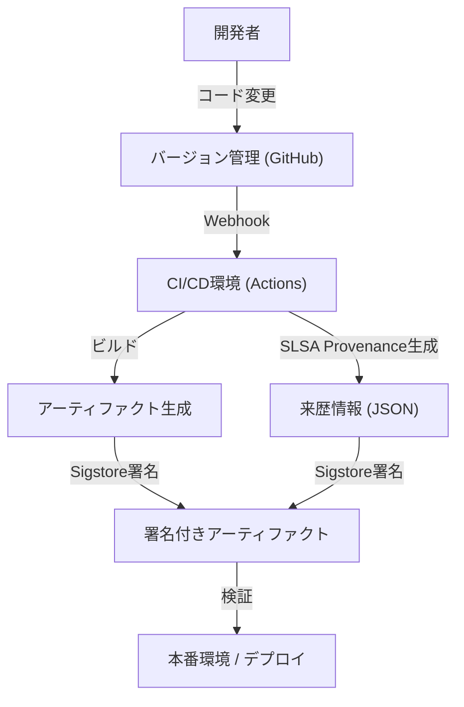

## ソフトウェアサプライチェーン攻撃の脅威と歴史的背景

現代のソフトウェア開発において、私たちはゼロからすべてのコードを書き上げることはほぼありません。オープンソースのライブラリ、サードパーティのフレームワーク、ビルドツール、そしてCI/CDパイプライン。これらはすべて「ソフトウェアサプライチェーン（供給網）」を構成する重要な要素ですが、同時に攻撃者にとっての格好の標的となっています。

ソフトウェアサプライチェーン攻撃とは、ターゲット企業のシステムに直接侵入するのではなく、その企業が利用しているソフトウェアや開発ツール、依存関係にマルウェアを混入させ、間接的に攻撃を仕掛ける手法です。この手法は、一度の改ざんで何千、何万というエンドユーザーに影響を及ぼすことができるため、非常に影響力が大きく、また発見が困難であるという特徴を持っています。

### SolarWinds事件が残した教訓

ソフトウェアサプライチェーン攻撃の脅威を世界中に知らしめた最も象徴的な事件が、2020年に発覚したSolarWinds社に対する攻撃（SUNBURST）です。SolarWinds社は、ITインフラ管理ソフトウェア「Orion」を提供しており、米国政府機関やフォーチュン500企業の多くがこれを導入していました。

攻撃者は、SolarWinds社のビルド環境に侵入し、正規のアップデートパッケージに密かにバックドアを仕込みました。この改ざんされたアップデートは、正規のデジタル署名が施されていたため、セキュリティ製品の検知をすり抜け、約1万8000の組織に自動的に配信・インストールされました。

この事件は、以下のような深刻な教訓を私たちに残しました。

1.  **「信頼されたベンダー」は無条件に安全ではない**: 企業が正規に契約・購入したソフトウェアであっても、その開発プロセスが侵害されていれば脅威となります。
2.  **ビルドパイプラインの脆弱性**: ソースコードだけでなく、CI/CD環境やビルドサーバー自体が攻撃対象となります。
3.  **可視性の欠如**: 組織は自社のネットワークにどのソフトウェアの、どのコンポーネントが、どのような経路で導入されているかを正確に把握できていませんでした。

この事件を契機に、米国政府はサイバーセキュリティ強化に関する大統領令（EO 14028）を発令し、連邦政府にソフトウェアを納入するベンダーに対してSBOM（ソフトウェア部品表）の提出を義務付けるなど、サプライチェーンセキュリティへの対応が急務となりました。

## SBOM（Software Bill of Materials）：ソフトウェアの透明性を確保する

SBOM（Software Bill of Materials）は、ソフトウェアを構成するコンポーネント、ライブラリ、依存関係のリストを機械可読な形式で記述した「ソフトウェアの部品表」です。食品のパッケージに原材料やアレルギー物質が記載されているのと同様に、ソフトウェアの中に何が含まれているかを可視化します。

### SBOMが解決する課題

あるオープンソースライブラリ（例えばLog4jなど）に深刻な脆弱性が発見された場合、企業が直面する最大の課題は「自社のどのシステムで、そのライブラリのどのバージョンが使われているか」を特定することです。SBOMが存在しない場合、各開発チームにヒアリングを行ったり、コードリポジトリを手動で検索したりするなど、膨大な時間と労力がかかります。

SBOMを日常的に生成・管理していれば、脆弱性情報（CVE）とSBOMを照合するだけで、影響を受けるシステムを瞬時に特定し、迅速なパッチ適用や回避策の実行が可能になります。

### 代表的なSBOMフォーマット：SPDXとCycloneDX

現在、業界標準として広く利用されているSBOMのデータフォーマットには、主に「SPDX」と「CycloneDX」の2つがあります。

1.  **SPDX (Software Package Data Exchange)**:
    Linux Foundationによって管理されているISO標準（ISO/IEC 5962:2021）のフォーマットです。元々はオープンソースライセンスのコンプライアンス管理を目的として開発されましたが、現在ではセキュリティ用途にも拡張されています。パッケージの出所、ライセンス情報、セキュリティ参照（CPEなど）を詳細に記述でき、法務およびコンプライアンス部門との親和性が高いのが特徴です。
2.  **CycloneDX**:
    OWASP（Open Worldwide Application Security Project）によって策定されたフォーマットです。セキュリティコンテキストと脆弱性の特定に特化して設計されており、ソフトウェアだけでなく、ハードウェア、サービス、暗号化アルゴリズム（CBOM: Cryptography Bill of Materials）などの記述にも対応しています。ファイルサイズが比較的コンパクトで、CI/CDパイプラインでの自動生成や脆弱性スキャナとの連携が容易です。

### SBOMの生成と管理戦略

SBOMは「ソフトウェアリリース時に一度だけ作ればよい」というものではありません。依存関係は頻繁に更新されるため、ビルドプロセスにSBOM生成を組み込み、継続的に最新の状態を維持する必要があります。

**生成ツール:**
- Syft (Anchore)
- Trivy (Aqua Security)
- Microsoft SBOM Tool

**GitHub Actionsでの生成例 (Trivyを使用):**
```yaml
name: Generate SBOM
on: [push]
jobs:
  sbom:
    runs-on: ubuntu-latest
    steps:
      - uses: actions/checkout@v4
      - name: Run Trivy in fs mode to generate SBOM
        uses: aquasecurity/trivy-action@master
        with:
          scan-type: 'fs'
          format: 'cyclonedx'
          output: 'sbom.json'
      - name: Upload SBOM
        uses: actions/upload-artifact@v4
        with:
          name: sbom
          path: sbom.json
```

生成されたSBOMは、Dependency-TrackやGuacなどの専門の管理サーバーに保存し、継続的に脆弱性データベースと照合する仕組み（Continuous Monitoring）を構築することが重要です。

## SLSA：ビルドインテグリティのフレームワーク

SBOMが「ソフトウェアの中身」を明らかにするものだとすれば、SLSA（Supply chain Levels for Software Artifacts、サルサと発音）は「ソフトウェアが正しく安全に作られたか」を保証するフレームワークです。Googleが提唱し、現在はOpenSSFによって管理されています。

SLSAは、ソースコードの変更から最終的なアーティファクト（バイナリやコンテナイメージなど）の生成に至るまでの各ステップにおいて、改ざんが行われていないこと（インテグリティ）を証明するためのガイドラインとセキュリティレベルを定義しています。

### SLSAの4つのレベルと要求要件

SLSAは、導入のしやすさとセキュリティ強度のバランスを考慮し、レベル1からレベル4までの段階的なアプローチを提供しています（現在はSLSA v1.0として、Build、Sourceなどのトラックに細分化されていますが、ここでは全体的な概念を解説します）。

*   **SLSA Level 1: 出どころの記録（Provenance）**
    *   **要件**: ビルドプロセスがスクリプト化または自動化されており、最終的なアーティファクトが「どのソースコードから」「どのビルドプロセスを経て」作られたかを示す証明（Provenance: 来歴情報）が生成されていること。
    *   **目的**: 手動ビルドを排除し、ソフトウェアの出自を明らかにする第一歩。
*   **SLSA Level 2: 署名付きの来歴情報**
    *   **要件**: Level 1の要件に加え、ビルドサービス（CI環境など）が来歴情報に対して暗号化署名を行い、ビルドプロセスが外部から改ざんされていないことを保証すること。
    *   **目的**: 来歴情報自体の信頼性を担保し、ビルド後のアーティファクトすり替えを防ぐ。
*   **SLSA Level 3: ビルド環境の分離と検証**
    *   **要件**: Level 2の要件に加え、ビルドが専用の分離された環境（コンテナやVM）で行われ、他のビルドとの干渉や持続的な侵害を防ぐこと（エフェメラル環境）。来歴情報の生成がビルド環境自体から分離された、信頼できるコントロールプレーンによって行われること。
    *   **目的**: ビルドパイプライン自体への攻撃（SolarWindsのようなケース）を困難にする。
*   **SLSA Level 4: 最高の信頼性（Two-Person Review & Hermetic Build）**
    *   **要件**: Level 3の要件に加え、ソースコードの変更に対して2人以上の承認（Two-Person Review）が義務付けられていること。また、ビルドが完全に密閉された環境（Hermetic Build：外部ネットワークへのアクセスが遮断され、すべての依存関係が事前に定義されている状態）で行われること。
    *   **目的**: 内部犯行の防止と、外部からのマルウェアダウンロードの遮断。

### SLSA要件の実装アプローチ

SLSAレベルを満たすためには、単にツールを導入するだけでなく、開発プロセス全体の見直しが必要です。



## Sigstore：開発者のための暗号化署名

SLSAの要件である「来歴情報とアーティファクトへの署名」を実現するためには、公開鍵基盤（PKI）の運用という高いハードルがありました。鍵の生成、安全な保管、ローテーション、失効手続きなど、従来のPGP署名などは開発者にとって負担が大きく、広く普及するには至りませんでした。

この問題を解決するために登場したのが「Sigstore」です。Sigstoreは「ソフトウェア署名のためのLet's Encrypt」とも呼ばれ、オープンソースプロジェクトのための無料かつ自動化された署名基盤を提供します。

### Sigstoreを構成する3つの主要コンポーネント

1.  **Fulcio（認証局）**: OIDC（OpenID Connect）を利用して、GitHubアカウントやGoogleアカウントなどのIDベースで、一時的な（短命な）証明書を発行します。これにより、開発者は秘密鍵を永続的に管理する必要がなくなります。
2.  **Rekor（透明性ログ）**: 署名の記録を改ざん不可能な分散型台帳（Transparency Log）に記録します。誰でも署名の履歴を検証・監査できるため、万が一証明書が不正発行された場合でも発見が容易になります。
3.  **Cosign（署名ツール）**: コンテナイメージや任意のアーティファクトに対する署名、検証を簡単に行うためのCLIツールです。

### GitHub ActionsとSigstoreを組み合わせたコンテナイメージの署名

GitHub ActionsはOIDCプロバイダとして機能するため、Sigstore（Fulcio）と連携して「キーレス署名（Keyless Signing）」を実現できます。これは、GitHub Actionsのワークフロー自体が持つアイデンティティ（リポジトリ名、ブランチ、コミットハッシュなど）を証明書に埋め込んで署名を行う画期的な仕組みです。

**Cosignを使用したGitHub Actionsでのキーレス署名例:**

```yaml
name: Build and Sign Container
on: [push]
jobs:
  build-and-sign:
    runs-on: ubuntu-latest
    permissions:
      contents: read
      packages: write
      id-token: write # OIDCトークンの取得に必須
    steps:
      - name: Checkout repository
        uses: actions/checkout@v4

      - name: Install Cosign
        uses: sigstore/cosign-installer@v3.5.0

      - name: Log in to GitHub Container Registry
        uses: docker/login-action@v3
        with:
          registry: ghcr.io
          username: ${{ github.actor }}
          password: ${{ secrets.GITHUB_TOKEN }}

      - name: Build and push Docker image
        id: docker_build
        uses: docker/build-push-action@v5
        with:
          push: true
          tags: ghcr.io/${{ github.repository }}:latest

      - name: Sign the container image
        env:
          COSIGN_EXPERIMENTAL: "true"
        run: |
          cosign sign --yes ghcr.io/${{ github.repository }}@${{ steps.docker_build.outputs.digest }}
```

このワークフローが実行されると、コンテナイメージがGHCRにプッシュされた後、Cosignが自動的にGitHub OIDCを通じてFulcioから短命な証明書を取得し、イメージのダイジェストに対して署名を行います。署名情報はGHCRにアタッチされ、Rekorログにも記録されます。

### 本番環境での署名検証

署名されたイメージを安全に運用するためには、デプロイ時にその署名を検証する仕組みが必要です。Kubernetes環境であれば、KyvernoやSigstore Policy ControllerなどのAdmission Controllerを導入することで、「正しいリポジトリのGitHub Actionsからビルド・署名されたイメージのみ実行を許可する」といった厳格なポリシーを適用できます。

## 結論：継続的なサプライチェーン防衛

ソフトウェアサプライチェーンセキュリティは、単一のツールやソリューションで解決できるものではありません。
1.  **SBOM**によって「何を使っているか」を可視化し、脆弱性管理の基盤を作る。
2.  **SLSA**のフレームワークに沿って、ビルドプロセスのインテグリティを強化し、自動化・分離化を進める。
3.  **Sigstore**を活用して、アーティファクトと来歴情報にキーレスで署名し、デプロイ時に検証する。

これらをCI/CDパイプライン（GitHub Actionsなど）に深く統合し、開発者の負担を最小限に抑えながら「デフォルトで安全な（Secure by Default）」な環境を構築することが、次世代のソフトウェア開発における最も重要な責務となります。SolarWinds事件のような悲劇を繰り返さないために、今日からサプライチェーン防御の一歩を踏み出しましょう。
