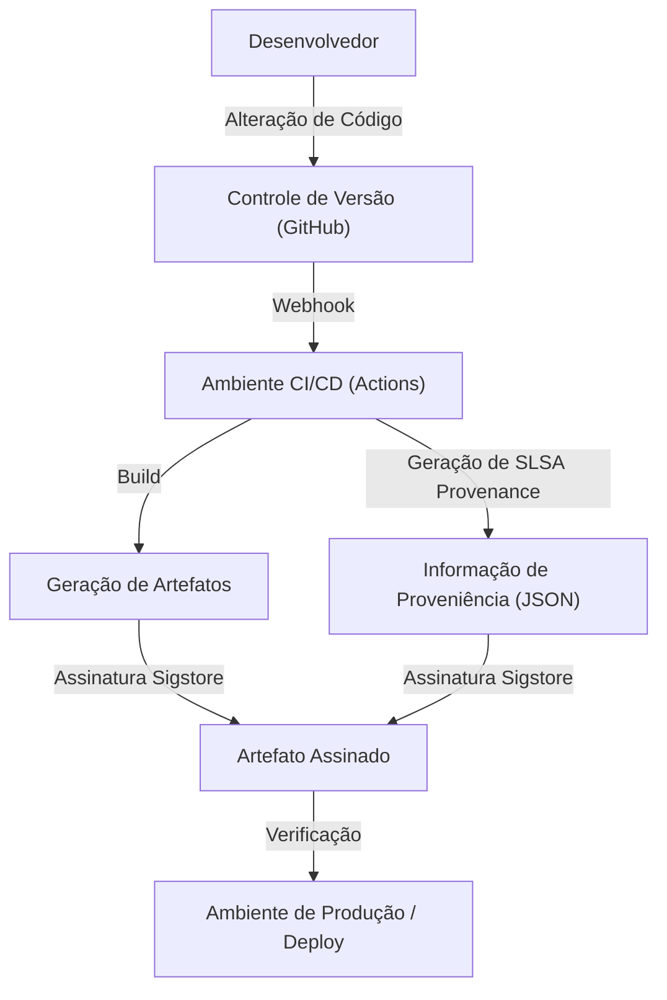

## A Ameaça dos Ataques à Cadeia de Suprimentos de Software e Contexto Histórico

No desenvolvimento de software moderno, raramente escrevemos todo o código do zero. Bibliotecas de código aberto, frameworks de terceiros, ferramentas de compilação (build) e pipelines de CI/CD. Todos esses são componentes cruciais que formam a "cadeia de suprimentos de software" (software supply chain), mas, ao mesmo tempo, tornaram-se alvos principais para invasores.

Um ataque à cadeia de suprimentos de software é um método em que o invasor, em vez de se infiltrar diretamente no sistema da empresa-alvo, injeta malware em softwares, ferramentas de desenvolvimento ou dependências usadas por essa empresa, lançando um ataque indireto. Esse método é caracterizado pelo seu enorme impacto, pois uma única violação pode afetar milhares ou dezenas de milhares de usuários finais, e por ser extremamente difícil de detectar.

### Lições Deixadas pelo Incidente da SolarWinds

O incidente mais emblemático que revelou a ameaça dos ataques à cadeia de suprimentos de software para o mundo foi o ataque contra a SolarWinds (SUNBURST) descoberto em 2020. A SolarWinds fornecia o software de gerenciamento de infraestrutura de TI "Orion", que havia sido adotado por muitas agências governamentais dos EUA e empresas da Fortune 500.

Os invasores se infiltraram no ambiente de compilação (build) da SolarWinds e secretamente inseriram um backdoor em um pacote de atualização legítimo. Como essa atualização adulterada tinha uma assinatura digital válida, ela contornou a detecção por produtos de segurança e foi automaticamente distribuída e instalada em cerca de 18.000 organizações.

Este incidente nos deixou as seguintes lições profundas:

1.  **"Fornecedores confiáveis" não são incondicionalmente seguros**: Mesmo que o software seja licenciado e adquirido legitimamente por uma empresa, ele se torna uma ameaça se seu processo de desenvolvimento for comprometido.
2.  **Vulnerabilidades no pipeline de build**: Não apenas o código-fonte, mas também o ambiente de CI/CD e os próprios servidores de build se tornam alvos de ataques.
3.  **Falta de visibilidade**: As organizações não conseguiam entender com precisão quais softwares, quais componentes e por quais rotas eles estavam sendo introduzidos em suas próprias redes.

Incentivado por este incidente, o governo dos EUA emitiu uma Ordem Executiva para Melhorar a Segurança Cibernética da Nação (EO 14028), tornando obrigatório que os fornecedores que entregam software ao governo federal enviem um SBOM (Lista de Materiais de Software), tornando a resposta à segurança da cadeia de suprimentos uma questão urgente.

## SBOM (Lista de Materiais de Software): Garantindo a Transparência do Software

O SBOM (Software Bill of Materials) é uma "lista de materiais de software" que descreve a lista de componentes, bibliotecas e dependências que compõem o software em um formato legível por máquina. Da mesma forma que os ingredientes e alérgenos estão listados em embalagens de alimentos, ele visualiza o que está contido no software.

### Problemas Resolvidos pelo SBOM

Quando uma vulnerabilidade crítica é descoberta em uma biblioteca de código aberto (por exemplo, Log4j), o maior desafio que as empresas enfrentam é identificar "em qual de nossos sistemas e qual versão daquela biblioteca está sendo usada". Na ausência de um SBOM, exige-se uma enorme quantidade de tempo e esforço, como entrevistar cada equipe de desenvolvimento ou pesquisar repositórios de código manualmente.

Se você gerar e gerenciar um SBOM regularmente, poderá identificar instantaneamente os sistemas afetados e aplicar patches rapidamente ou implementar soluções alternativas simplesmente verificando as informações de vulnerabilidade (CVE) em relação ao SBOM.

### Formatos de SBOM Representativos: SPDX e CycloneDX

Atualmente, existem dois formatos de dados de SBOM amplamente utilizados como padrões do setor: "SPDX" e "CycloneDX".

1.  **SPDX (Software Package Data Exchange)**:
    Este é um formato padrão ISO (ISO/IEC 5962:2021) mantido pela Linux Foundation. Originalmente desenvolvido com o propósito de gerenciar a conformidade de licenças de código aberto, agora foi expandido para uso de segurança. Ele permite a descrição detalhada de origens de pacotes, informações de licenciamento e referências de segurança (CPE, etc.), e é caracterizado por sua alta compatibilidade com departamentos jurídicos e de conformidade.
2.  **CycloneDX**:
    Um formato formulado pelo OWASP (Open Worldwide Application Security Project). Projetado especificamente para contexto de segurança e identificação de vulnerabilidades, ele suporta descrições não apenas de software, mas também de hardware, serviços e algoritmos de criptografia (CBOM: Lista de Materiais de Criptografia). O tamanho do arquivo é relativamente compacto, facilitando a geração automática em pipelines de CI/CD e a integração com scanners de vulnerabilidade.

### Estratégias de Geração e Gerenciamento de SBOM

O SBOM não é algo que você "cria apenas uma vez no lançamento do software". Como as dependências são atualizadas com frequência, é necessário integrar a geração do SBOM no processo de build e mantê-lo continuamente atualizado.

**Ferramentas de Geração:**
- Syft (Anchore)
- Trivy (Aqua Security)
- Microsoft SBOM Tool

**Exemplo de Geração no GitHub Actions (usando Trivy):**
```yaml
name: Generate SBOM
on: [push]
jobs:
  sbom:
    runs-on: ubuntu-latest
    steps:
      - uses: actions/checkout@v4
      - name: Run Trivy in fs mode to generate SBOM
        uses: aquasecurity/trivy-action@master
        with:
          scan-type: 'fs'
          format: 'cyclonedx'
          output: 'sbom.json'
      - name: Upload SBOM
        uses: actions/upload-artifact@v4
        with:
          name: sbom
          path: sbom.json
```

É importante armazenar o SBOM gerado em um servidor de gerenciamento especializado, como Dependency-Track ou Guac, e construir um mecanismo (Monitoramento Contínuo) para verificá-lo continuamente em relação a bancos de dados de vulnerabilidades.

## SLSA: Um Framework para a Integridade do Build

Se o SBOM revela os "conteúdos do software", o SLSA (Supply chain Levels for Software Artifacts, pronunciado "salsa") é um framework que garante se o "software foi criado de forma correta e segura". Proposto pelo Google, agora é mantido pela OpenSSF.

O SLSA define diretrizes e níveis de segurança para provar que nenhuma adulteração (integridade) ocorreu em cada etapa, desde as alterações no código-fonte até a geração dos artefatos finais (binários, imagens de contêiner, etc.).

### Os 4 Níveis e Requisitos do SLSA

O SLSA fornece uma abordagem em etapas do Nível 1 ao Nível 4 (atualmente subdividido em faixas como Build e Source no SLSA v1.0, mas explicaremos o conceito geral aqui), considerando o equilíbrio entre facilidade de implementação e força de segurança.

*   **SLSA Level 1: Registro de Origem (Provenance)**
    *   **Requisitos**: O processo de build é roteirizado ou automatizado, e uma prova (Provenance: informação de proveniência) é gerada mostrando "de qual código-fonte" e "por meio de qual processo de build" o artefato final foi criado.
    *   **Objetivo**: Eliminar builds manuais e dar o primeiro passo no esclarecimento da origem do software.
*   **SLSA Level 2: Proveniência Assinada**
    *   **Requisitos**: Além dos requisitos do Nível 1, o serviço de build (ambiente CI, etc.) deve assinar criptograficamente as informações de proveniência para garantir que o processo de build não tenha sido adulterado externamente.
    *   **Objetivo**: Garantir a confiabilidade das próprias informações de proveniência e impedir a substituição de artefatos pós-build.
*   **SLSA Level 3: Isolamento e Verificação do Ambiente de Build**
    *   **Requisitos**: Além dos requisitos do Nível 2, o build deve ocorrer em um ambiente isolado dedicado (contêiner ou VM) para evitar interferência de outros builds ou comprometimentos persistentes (ambiente efêmero). A geração de informações de proveniência deve ser realizada por um plano de controle (control plane) confiável e separado do próprio ambiente de build.
    *   **Objetivo**: Dificultar ataques ao próprio pipeline de build (casos como o da SolarWinds).
*   **SLSA Level 4: Confiança Máxima (Revisão por Duas Pessoas e Build Hermético)**
    *   **Requisitos**: Além dos requisitos do Nível 3, as alterações no código-fonte devem exigir aprovação de pelo menos duas pessoas (Two-Person Review). Além disso, o build deve ser realizado em um ambiente completamente fechado (Hermetic Build: o acesso a redes externas é bloqueado e todas as dependências são definidas com antecedência).
    *   **Objetivo**: Prevenção de ameaças internas e bloqueio de downloads externos de malware.

### Abordagem de Implementação para Requisitos SLSA

Para atender aos níveis SLSA, você precisa rever todo o processo de desenvolvimento, não apenas introduzir ferramentas.



## Sigstore: Assinatura Criptográfica para Desenvolvedores

Havia um alto obstáculo para atingir o requisito SLSA de "assinar informações de proveniência e artefatos", que era a operação de uma Infraestrutura de Chave Pública (PKI). Assinaturas PGP tradicionais representavam um grande fardo para os desenvolvedores devido à geração de chaves, armazenamento seguro, rotação e procedimentos de revogação, o que impedia sua adoção generalizada.

Para resolver esse problema, surgiu o "Sigstore". O Sigstore também é conhecido como o "Let's Encrypt para assinaturas de software", fornecendo uma infraestrutura de assinatura gratuita e automatizada para projetos de código aberto.

### Três Componentes Principais do Sigstore

1.  **Fulcio (Autoridade de Certificação)**: Usa OIDC (OpenID Connect) para emitir certificados temporários (de curta duração) baseados em identidades, como contas do GitHub ou do Google. Isso elimina a necessidade de os desenvolvedores gerenciarem chaves privadas permanentemente.
2.  **Rekor (Log de Transparência)**: Registra registros de assinaturas em um ledger distribuído à prova de adulteração (Transparency Log). Como qualquer um pode verificar e auditar o histórico de assinaturas, torna-se fácil descobrir se um certificado for emitido de forma fraudulenta.
3.  **Cosign (Ferramenta de Assinatura)**: Uma ferramenta CLI para assinar e verificar facilmente imagens de contêiner e artefatos arbitrários.

### Assinatura de Imagem de Contêiner Combinando GitHub Actions e Sigstore

Como o GitHub Actions atua como um provedor OIDC, ele pode se integrar ao Sigstore (Fulcio) para permitir a "Assinatura Sem Chave" (Keyless Signing). Este é um mecanismo revolucionário que incorpora a própria identidade do fluxo de trabalho do GitHub Actions (nome do repositório, branch, hash do commit, etc.) no certificado para realizar a assinatura.

**Exemplo de Assinatura Sem Chave no GitHub Actions usando Cosign:**

```yaml
name: Build and Sign Container
on: [push]
jobs:
  build-and-sign:
    runs-on: ubuntu-latest
    permissions:
      contents: read
      packages: write
      id-token: write # Obrigatório para obter token OIDC
    steps:
      - name: Checkout repository
        uses: actions/checkout@v4

      - name: Install Cosign
        uses: sigstore/cosign-installer@v3.5.0

      - name: Log in to GitHub Container Registry
        uses: docker/login-action@v3
        with:
          registry: ghcr.io
          username: ${{ github.actor }}
          password: ${{ secrets.GITHUB_TOKEN }}

      - name: Build and push Docker image
        id: docker_build
        uses: docker/build-push-action@v5
        with:
          push: true
          tags: ghcr.io/${{ github.repository }}:latest

      - name: Sign the container image
        env:
          COSIGN_EXPERIMENTAL: "true"
        run: |
          cosign sign --yes ghcr.io/${{ github.repository }}@${{ steps.docker_build.outputs.digest }}
```

Quando este workflow é executado e a imagem de contêiner é enviada (pushed) para o GHCR, o Cosign obtém automaticamente um certificado de curta duração do Fulcio via GitHub OIDC e assina o digest da imagem. As informações da assinatura são anexadas ao GHCR e registradas no log do Rekor.

### Verificação de Assinatura em Ambiente de Produção

Para operar com segurança imagens assinadas, é necessário um mecanismo para verificar essas assinaturas no momento do deploy. Em ambientes Kubernetes, a introdução de um Admission Controller, como Kyverno ou Sigstore Policy Controller, permite a aplicação de políticas rígidas, como "permitir a execução apenas de imagens compiladas e assinadas pelo GitHub Actions do repositório correto".

## Conclusão: Defesa Contínua da Cadeia de Suprimentos

A segurança da cadeia de suprimentos de software não pode ser resolvida com uma única ferramenta ou solução.
1.  Use **SBOM** para visualizar "o que você está usando" e construir uma base para o gerenciamento de vulnerabilidades.
2.  Siga o framework **SLSA** para fortalecer a integridade do processo de build e promover a automação e o isolamento.
3.  Utilize o **Sigstore** para assinar artefatos e informações de proveniência sem o uso de chaves (keyless) e verificá-los durante o deploy.

Integrar profundamente essas práticas ao seu pipeline de CI/CD (como GitHub Actions) para construir um ambiente que seja "Seguro por Padrão" (Secure by Default), mantendo o fardo do desenvolvedor ao mínimo, é a responsabilidade mais crítica no desenvolvimento de software da próxima geração. Para evitar repetir tragédias como o incidente da SolarWinds, vamos dar o primeiro passo em direção à defesa da cadeia de suprimentos hoje.
