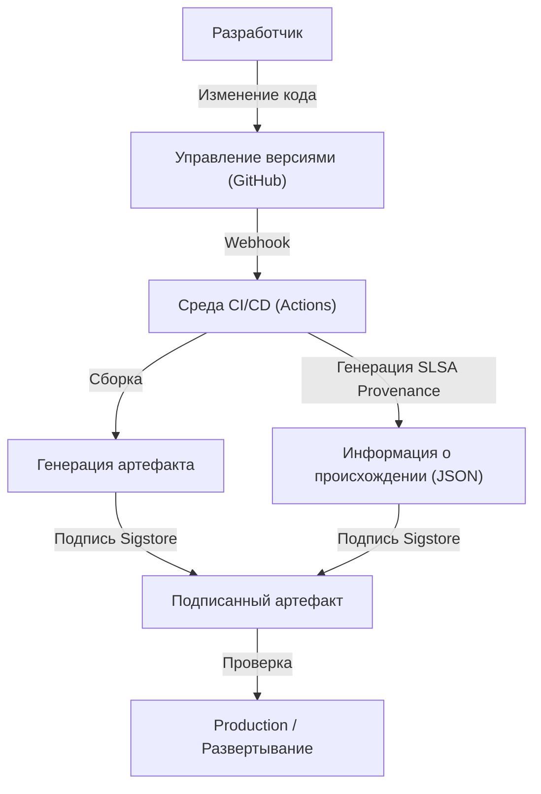

## Угроза атак на цепочку поставок программного обеспечения и исторический контекст

В современной разработке программного обеспечения мы почти никогда не пишем весь код с нуля. Библиотеки с открытым исходным кодом, сторонние фреймворки, инструменты сборки и конвейеры CI/CD — всё это важные элементы, составляющие «цепочку поставок программного обеспечения» (software supply chain), но в то же время они являются отличными мишенями для злоумышленников.

Атака на цепочку поставок программного обеспечения — это метод, при котором злоумышленники не проникают напрямую в системы целевой компании, а внедряют вредоносное ПО в используемые ею программы, инструменты разработки или зависимости, совершая таким образом косвенную атаку. Этот метод характеризуется колоссальным масштабом воздействия (одна подделка может затронуть тысячи и десятки тысяч конечных пользователей) и сложностью обнаружения.

### Уроки инцидента с SolarWinds

Самым показательным событием, продемонстрировавшим миру угрозу атак на цепочки поставок, стала атака на компанию SolarWinds (SUNBURST), раскрытая в 2020 году. SolarWinds предоставляла программное обеспечение для управления ИТ-инфраструктурой «Orion», которое использовалось многими правительственными учреждениями США и компаниями из списка Fortune 500.

Злоумышленники проникли в среду сборки SolarWinds и тайно внедрили бэкдор в легитимный пакет обновлений. Поскольку это измененное обновление имело официальную цифровую подпись, оно обошло средства защиты и было автоматически доставлено и установлено примерно в 18 000 организациях.

Этот инцидент оставил нам следующие серьезные уроки:

1.  **«Надежный поставщик» не означает безусловную безопасность**: Даже программное обеспечение, официально приобретенное компанией, представляет угрозу, если его процесс разработки был скомпрометирован.
2.  **Уязвимость конвейера сборки**: Объектом атаки становится не только исходный код, но и среда CI/CD, а также сами серверы сборки.
3.  **Недостаток прозрачности**: Организации не могли точно определить, какие программные компоненты и какими путями были внедрены в их собственные сети.

Вследствие этого инцидента правительство США выпустило Указ Президента о повышении кибербезопасности (EO 14028), обязав поставщиков, поставляющих ПО федеральному правительству, предоставлять SBOM (спецификацию программного обеспечения), что сделало реагирование на угрозы безопасности цепочек поставок насущной необходимостью.

## SBOM (Software Bill of Materials): Обеспечение прозрачности программного обеспечения

SBOM (Software Bill of Materials) — это «спецификация программного обеспечения», представляющая собой машиночитаемый список компонентов, библиотек и зависимостей, из которых состоит программное обеспечение. Подобно тому, как на упаковке пищевых продуктов указываются ингредиенты и аллергены, SBOM показывает, что именно содержится внутри ПО.

### Проблемы, которые решает SBOM

При обнаружении серьезной уязвимости в какой-либо библиотеке с открытым исходным кодом (например, Log4j) главная проблема, с которой сталкивается компания, — это определить, «в каких наших системах и какая версия этой библиотеки используется». При отсутствии SBOM это требует огромных затрат времени и усилий, таких как опрос каждой команды разработчиков или ручной поиск по репозиториям кода.

При регулярной генерации и управлении SBOM достаточно просто сопоставить информацию об уязвимости (CVE) с SBOM, чтобы мгновенно определить затронутые системы и быстро применить исправления или обходные решения.

### Основные форматы SBOM: SPDX и CycloneDX

В настоящее время в качестве отраслевых стандартов широко используются два основных формата данных SBOM: SPDX и CycloneDX.

1.  **SPDX (Software Package Data Exchange)**:
    Формат стандарта ISO (ISO/IEC 5962:2021), управляемый Linux Foundation. Изначально он был разработан для управления соблюдением лицензий на ПО с открытым исходным кодом, но теперь расширен и для целей безопасности. Он позволяет детально описывать происхождение пакетов, информацию о лицензиях и ссылки на безопасность (например, CPE), и хорошо подходит для юридических отделов и отделов комплаенса.
2.  **CycloneDX**:
    Формат, разработанный OWASP (Open Worldwide Application Security Project). Он специально разработан для контекста безопасности и идентификации уязвимостей и поддерживает описание не только программного обеспечения, но и оборудования, сервисов и криптографических алгоритмов (CBOM: Cryptography Bill of Materials). Файлы имеют относительно небольшой размер, что упрощает их автоматическую генерацию в конвейерах CI/CD и интеграцию со сканерами уязвимостей.

### Стратегии генерации и управления SBOM

SBOM — это не то, что «нужно создать один раз при выпуске ПО». Поскольку зависимости часто обновляются, необходимо интегрировать генерацию SBOM в процесс сборки и постоянно поддерживать его в актуальном состоянии.

**Инструменты генерации:**
- Syft (Anchore)
- Trivy (Aqua Security)
- Microsoft SBOM Tool

**Пример генерации в GitHub Actions (с использованием Trivy):**
```yaml
name: Generate SBOM
on: [push]
jobs:
  sbom:
    runs-on: ubuntu-latest
    steps:
      - uses: actions/checkout@v4
      - name: Run Trivy in fs mode to generate SBOM
        uses: aquasecurity/trivy-action@master
        with:
          scan-type: 'fs'
          format: 'cyclonedx'
          output: 'sbom.json'
      - name: Upload SBOM
        uses: actions/upload-artifact@v4
        with:
          name: sbom
          path: sbom.json
```

Важно сохранять сгенерированные SBOM на специализированных серверах управления, таких как Dependency-Track или Guac, и создать систему непрерывного мониторинга (Continuous Monitoring) для их сопоставления с базами данных уязвимостей.

## SLSA: Фреймворк целостности сборки

Если SBOM проясняет «содержимое программного обеспечения», то SLSA (Supply chain Levels for Software Artifacts, произносится как «сальса») — это фреймворк, гарантирующий, что «программное обеспечение было создано правильно и безопасно». Он был предложен Google и в настоящее время управляется OpenSSF.

SLSA определяет рекомендации и уровни безопасности для подтверждения того, что ни на одном этапе (от изменения исходного кода до генерации конечного артефакта, такого как двоичный файл или образ контейнера) не было внесено никаких несанкционированных изменений (целостность).

### 4 уровня SLSA и их требования

SLSA предлагает поэтапный подход от 1 до 4 уровня, балансируя простоту внедрения и надежность защиты (в настоящее время, как SLSA v1.0, он подразделяется на треки, такие как Build, Source и т.д., но здесь объясняется общая концепция).

*   **SLSA Level 1: Регистрация происхождения (Provenance)**
    *   **Требования**: Процесс сборки должен быть автоматизирован (через скрипты или системы сборки), и должно генерироваться подтверждение (Provenance: информация о происхождении), показывающее, «из какого исходного кода» и «через какой процесс сборки» был создан конечный артефакт.
    *   **Цель**: Исключить ручную сборку и сделать первый шаг к пониманию происхождения программного обеспечения.
*   **SLSA Level 2: Подписанная информация о происхождении**
    *   **Требования**: В дополнение к требованиям Level 1, сервис сборки (например, среда CI) должен криптографически подписать информацию о происхождении, чтобы гарантировать, что процесс сборки не был изменен извне.
    *   **Цель**: Гарантировать надежность самой информации о происхождении и предотвратить подмену артефакта после сборки.
*   **SLSA Level 3: Изоляция и проверка среды сборки**
    *   **Требования**: В дополнение к требованиям Level 2, сборка должна выполняться в выделенной изолированной среде (контейнер или ВМ) для предотвращения вмешательства других сборок и постоянных компрометаций (эфемерная среда). Генерация информации о происхождении должна осуществляться надежным уровнем управления (control plane), изолированным от самой среды сборки.
    *   **Цель**: Усложнить атаки на сам конвейер сборки (как в случае с SolarWinds).
*   **SLSA Level 4: Максимальная надежность (Проверка двумя лицами и Герметичная сборка)**
    *   **Требования**: В дополнение к требованиям Level 3, изменения исходного кода должны в обязательном порядке утверждаться не менее чем двумя лицами (Two-Person Review). Кроме того, сборка должна происходить в полностью герметичной среде (Hermetic Build: доступ к внешней сети заблокирован, а все зависимости определены заранее).
    *   **Цель**: Предотвращение внутренних диверсий и блокировка загрузки вредоносного ПО извне.

### Подходы к реализации требований SLSA

Для соответствия уровням SLSA недостаточно просто внедрить инструменты; необходимо пересмотреть весь процесс разработки.



## Sigstore: Криптографические подписи для разработчиков

Для реализации требования SLSA о «подписи артефактов и информации об их происхождении» традиционно существовал высокий барьер — необходимость эксплуатации инфраструктуры открытых ключей (PKI). Генерация ключей, их безопасное хранение, ротация, процедуры отзыва — все это, например в традиционных подписях PGP, возлагало большую нагрузку на разработчиков и препятствовало широкому распространению.

Для решения этой проблемы появился Sigstore. Sigstore, который также называют «Let's Encrypt для подписей программного обеспечения», предоставляет бесплатную и автоматизированную инфраструктуру подписи для проектов с открытым исходным кодом.

### 3 основных компонента Sigstore

1.  **Fulcio (Удостоверяющий центр)**: Использует OIDC (OpenID Connect) для выпуска временных (краткосрочных) сертификатов на основе идентификаторов, таких как учетные записи GitHub или Google. Это избавляет разработчиков от необходимости постоянно управлять закрытыми ключами.
2.  **Rekor (Журнал прозрачности)**: Записывает историю подписей в защищенный от несанкционированного доступа распределенный реестр (Transparency Log). Любой желающий может проверить и проаудировать историю подписей, что позволяет легко обнаружить неправомерный выпуск сертификата.
3.  **Cosign (Инструмент подписи)**: CLI-инструмент для легкой подписи и проверки образов контейнеров и любых других артефактов.

### Подпись образов контейнеров с помощью GitHub Actions и Sigstore

Поскольку GitHub Actions выступает в роли провайдера OIDC, он может взаимодействовать с Sigstore (Fulcio) для реализации «подписи без ключа (Keyless Signing)». Это революционный механизм, при котором идентификационная информация самого рабочего процесса GitHub Actions (имя репозитория, ветка, хэш коммита и т.д.) внедряется в сертификат для создания подписи.

**Пример подписи без ключа в GitHub Actions с использованием Cosign:**

```yaml
name: Build and Sign Container
on: [push]
jobs:
  build-and-sign:
    runs-on: ubuntu-latest
    permissions:
      contents: read
      packages: write
      id-token: write # Обязательно для получения токена OIDC
    steps:
      - name: Checkout repository
        uses: actions/checkout@v4

      - name: Install Cosign
        uses: sigstore/cosign-installer@v3.5.0

      - name: Log in to GitHub Container Registry
        uses: docker/login-action@v3
        with:
          registry: ghcr.io
          username: ${{ github.actor }}
          password: ${{ secrets.GITHUB_TOKEN }}

      - name: Build and push Docker image
        id: docker_build
        uses: docker/build-push-action@v5
        with:
          push: true
          tags: ghcr.io/${{ github.repository }}:latest

      - name: Sign the container image
        env:
          COSIGN_EXPERIMENTAL: "true"
        run: |
          cosign sign --yes ghcr.io/${{ github.repository }}@${{ steps.docker_build.outputs.digest }}
```

При выполнении этого рабочего процесса, после отправки образа контейнера в GHCR, Cosign автоматически получает краткосрочный сертификат от Fulcio через GitHub OIDC и подписывает дайджест образа. Информация о подписи прикрепляется к GHCR, а также записывается в журнал Rekor.

### Проверка подписи в производственной среде

Для безопасного использования подписанных образов необходим механизм проверки этих подписей во время развертывания. В среде Kubernetes вы можете внедрить контроллеры допуска (Admission Controllers), такие как Kyverno или Sigstore Policy Controller, для применения строгих политик, например: «разрешать выполнение только тех образов, которые были собраны и подписаны GitHub Actions из правильного репозитория».

## Заключение: Непрерывная защита цепочки поставок

Безопасность цепочки поставок программного обеспечения не может быть решена с помощью одного инструмента или решения.
1.  Сделайте прозрачным «что именно используется» с помощью **SBOM** и создайте основу для управления уязвимостями.
2.  В соответствии с фреймворком **SLSA**, повысьте целостность процесса сборки, продвигайте автоматизацию и изоляцию.
3.  Используйте **Sigstore** для подписи артефактов и информации о происхождении без использования ключей, а также проверяйте их при развертывании.

Глубокая интеграция этих процессов в конвейер CI/CD (например, GitHub Actions) и создание среды, которая является «безопасной по умолчанию» (Secure by Default) при минимизации нагрузки на разработчиков, — вот самая важная обязанность в разработке программного обеспечения следующего поколения. Давайте сделаем шаг к защите цепочки поставок сегодня, чтобы трагедии, подобные инциденту с SolarWinds, не повторялись.
