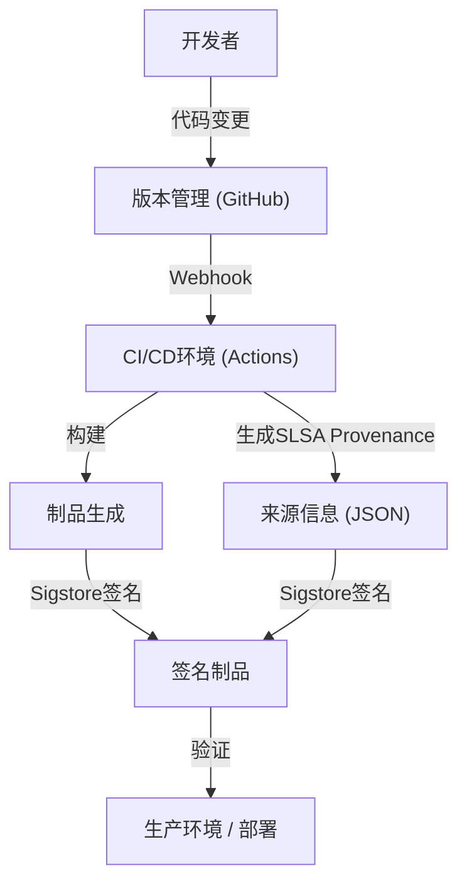

## 软件供应链攻击的威胁与历史背景

在现代软件开发中，我们几乎从不从零开始编写所有代码。开源库、第三方框架、构建工具以及CI/CD流水线，这些都是构成“软件供应链”的重要组成部分，但同时它们也成为了攻击者的理想目标。

软件供应链攻击并非直接入侵目标企业的系统，而是在该企业使用的软件、开发工具或依赖项中混入恶意软件，进行间接攻击的手法。由于这种手法通过一次篡改就能影响成千上万的最终用户，因此其破坏力极大，且难以被发现。

### SolarWinds事件留下的教训

2020年曝光的针对SolarWinds公司的攻击（SUNBURST）是让全世界认识到软件供应链攻击威胁的最具标志性事件。SolarWinds公司提供IT基础设施管理软件“Orion”，许多美国政府机构和财富500强企业都在使用它。

攻击者潜入了SolarWinds公司的构建环境，在合法的更新包中秘密植入了后门。由于这些被篡改的更新带有合法的数字签名，它们成功绕过了安全产品的检测，被自动分发并安装到了约18,000个组织中。

这一事件给我们留下了以下深刻的教训：

1.  **“受信任的供应商”并不绝对安全**：即便是企业通过正规渠道购买的合法软件，如果其开发过程遭到破坏，依然会成为威胁。
2.  **构建流水线的脆弱性**：除了源代码，CI/CD环境和构建服务器本身也会成为攻击目标。
3.  **缺乏可见性**：组织无法准确掌握其网络中引入了哪些软件的哪些组件，以及通过何种途径引入。

以此事件为契机，美国政府发布了关于加强网络安全的行政命令（EO 14028），强制要求向联邦政府提供软件的供应商提交SBOM（软件物料清单），应对供应链安全问题已刻不容缓。

## SBOM（Software Bill of Materials）：确保软件的透明度

SBOM（Software Bill of Materials）是以机器可读格式记录软件所包含的组件、库和依赖关系列表的“软件物料清单”。就像食品包装上标明了成分和过敏原一样，SBOM让软件内部包含的内容变得可视化。

### SBOM解决的问题

当某个开源库（例如Log4j等）被发现存在严重漏洞时，企业面临的最大挑战是确定“在公司的哪些系统中，使用了该库的哪个版本”。如果没有SBOM，就需要对各个开发团队进行访谈，或者手动搜索代码库，这将耗费大量的时间和精力。

如果日常都在生成并管理SBOM，只需将漏洞信息（CVE）与SBOM进行比对，就能瞬间锁定受影响的系统，从而实现快速修补或采取规避措施。

### 常见的SBOM格式：SPDX与CycloneDX

目前作为行业标准被广泛使用的SBOM数据格式，主要有“SPDX”和“CycloneDX”两种。

1.  **SPDX (Software Package Data Exchange)**:
    这是由Linux基金会管理的ISO标准（ISO/IEC 5962:2021）格式。最初是为了开源许可证的合规管理而开发的，如今已扩展到安全领域。它可以详细记录软件包的来源、许可证信息以及安全参考（如CPE等），其特点是与法务和合规部门的要求高度契合。
2.  **CycloneDX**:
    这是由OWASP（Open Worldwide Application Security Project）制定的格式。它专门为安全上下文和漏洞识别而设计，不仅支持软件，还支持硬件、服务、加密算法（CBOM: Cryptography Bill of Materials）等内容的描述。其文件尺寸相对紧凑，易于在CI/CD流水线中自动生成以及与漏洞扫描器集成。

### SBOM的生成与管理策略

SBOM并不是“在软件发布时只创建一次”的东西。由于依赖关系经常更新，必须将SBOM的生成集成到构建过程中，持续保持其最新状态。

**生成工具:**
- Syft (Anchore)
- Trivy (Aqua Security)
- Microsoft SBOM Tool

**在GitHub Actions中的生成示例 (使用Trivy):**
```yaml
name: Generate SBOM
on: [push]
jobs:
  sbom:
    runs-on: ubuntu-latest
    steps:
      - uses: actions/checkout@v4
      - name: Run Trivy in fs mode to generate SBOM
        uses: aquasecurity/trivy-action@master
        with:
          scan-type: 'fs'
          format: 'cyclonedx'
          output: 'sbom.json'
      - name: Upload SBOM
        uses: actions/upload-artifact@v4
        with:
          name: sbom
          path: sbom.json
```

将生成的SBOM保存在Dependency-Track或Guac等专业的管理服务器上，并构建一个持续与漏洞数据库进行比对的机制（Continuous Monitoring），这一点至关重要。

## SLSA：构建完整性框架

如果说SBOM是为了弄清“软件的内容”，那么SLSA（Supply chain Levels for Software Artifacts，发音为Salsa）就是一个保证“软件被正确、安全地构建”的框架。它由Google提出，目前由OpenSSF管理。

SLSA定义了指导原则和安全级别，用于证明从源代码变更到最终制品（如二进制文件或容器镜像）生成的各个步骤中，都未发生任何篡改（即完整性）。

### SLSA的4个级别与要求

SLSA考虑到导入的便捷性与安全强度的平衡，提供了从1级到4级的渐进式方法（目前作为SLSA v1.0，已被细分为Build、Source等轨道，但此处主要解释其总体概念）。

*   **SLSA Level 1: 来源记录（Provenance）**
    *   **要求**: 构建过程已经脚本化或自动化，并生成证明最终制品是“从哪些源代码”、“经过哪些构建过程”产生的来源证明（Provenance：来源信息）。
    *   **目的**: 消除手动构建，迈出阐明软件出处的第一步。
*   **SLSA Level 2: 带有签名的来源信息**
    *   **要求**: 在Level 1的基础上，要求构建服务（如CI环境）对来源信息进行加密签名，以保证构建过程未被外部篡改。
    *   **目的**: 担保来源信息本身的可靠性，防止构建后的制品被替换。
*   **SLSA Level 3: 构建环境的隔离与验证**
    *   **要求**: 在Level 2的基础上，要求构建在专用的隔离环境（容器或VM）中进行，以防止与其他构建的干扰或持久性入侵（临时环境）。来源信息的生成必须由与构建环境本身隔离的、可信的控制平面来完成。
    *   **目的**: 使针对构建流水线本身的攻击（如SolarWinds案例）变得困难。
*   **SLSA Level 4: 最高信任度（Two-Person Review & Hermetic Build）**
    *   **要求**: 在Level 3的基础上，强制要求源代码变更必须有两人以上的批准（Two-Person Review）。此外，构建必须在完全封闭的环境（Hermetic Build：切断对外部网络的访问，所有依赖关系都预先定义好的状态）中进行。
    *   **目的**: 防止内部作案，并阻断从外部下载恶意软件。

### SLSA要求的实施方法

为了达到SLSA级别，仅引入工具是不够的，还需要对整个开发流程进行重新审视。



## Sigstore：为开发者设计的加密签名

为了实现SLSA要求的“对来源信息和制品进行签名”，过去存在着运营公钥基础设施（PKI）的高门槛。密钥的生成、安全存储、轮换和吊销等手续对开发者来说负担过重，使得传统的PGP签名等难以广泛普及。

为了解决这个问题，“Sigstore”应运而生。Sigstore被称为“软件签名领域的Let's Encrypt”，它为开源项目提供了一个免费且自动化的签名基础设施。

### 构成Sigstore的3个主要组件

1.  **Fulcio（证书颁发机构）**: 利用OIDC（OpenID Connect），基于GitHub账号或Google账号等身份，颁发临时（短生命周期）证书。这使得开发者无需再永久管理私钥。
2.  **Rekor（透明度日志）**: 将签名记录保存在不可篡改的分布式账本（Transparency Log）中。任何人都可以验证和审计签名历史，即使证书被违规颁发，也能轻易发现。
3.  **Cosign（签名工具）**: 这是一个CLI工具，可以轻松对容器镜像或任何制品进行签名和验证。

### 结合GitHub Actions与Sigstore的容器镜像签名

由于GitHub Actions可作为OIDC提供商，它可以与Sigstore（Fulcio）协同实现“无密钥签名（Keyless Signing）”。这是一种创新的机制，将GitHub Actions工作流本身具备的身份信息（如仓库名、分支、提交哈希等）嵌入到证书中进行签名。

**在GitHub Actions中使用Cosign进行无密钥签名的示例:**

```yaml
name: Build and Sign Container
on: [push]
jobs:
  build-and-sign:
    runs-on: ubuntu-latest
    permissions:
      contents: read
      packages: write
      id-token: write # 获取OIDC令牌所必需
    steps:
      - name: Checkout repository
        uses: actions/checkout@v4

      - name: Install Cosign
        uses: sigstore/cosign-installer@v3.5.0

      - name: Log in to GitHub Container Registry
        uses: docker/login-action@v3
        with:
          registry: ghcr.io
          username: ${{ github.actor }}
          password: ${{ secrets.GITHUB_TOKEN }}

      - name: Build and push Docker image
        id: docker_build
        uses: docker/build-push-action@v5
        with:
          push: true
          tags: ghcr.io/${{ github.repository }}:latest

      - name: Sign the container image
        env:
          COSIGN_EXPERIMENTAL: "true"
        run: |
          cosign sign --yes ghcr.io/${{ github.repository }}@${{ steps.docker_build.outputs.digest }}
```

执行此工作流时，一旦容器镜像推送到GHCR，Cosign将自动通过GitHub OIDC从Fulcio获取短期证书，并对镜像摘要进行签名。签名信息将附加到GHCR，同时记录在Rekor日志中。

### 在生产环境中进行签名验证

为了安全地运行带签名的镜像，必须在部署时引入签名验证机制。在Kubernetes环境中，通过引入Kyverno或Sigstore Policy Controller等Admission Controller，可以实施严格的策略，例如“只允许执行来自正确仓库的GitHub Actions构建并签名的镜像”。

## 结论：持续的供应链防御

软件供应链安全并非靠单一的工具或解决方案就能解决的。
1.  通过**SBOM**实现“我们在使用什么”的可视化，奠定漏洞管理的基础。
2.  遵循**SLSA**框架，增强构建流程的完整性，推进自动化与隔离。
3.  利用**Sigstore**，对制品和来源信息进行无密钥签名，并在部署时进行验证。

将这些深入集成到CI/CD流水线（如GitHub Actions）中，在最大限度减轻开发者负担的同时，构建“默认安全（Secure by Default）”的环境，是下一代软件开发中最重要的责任。为了避免重蹈SolarWinds事件的覆辙，请从今天开始迈出供应链防御的第一步。
