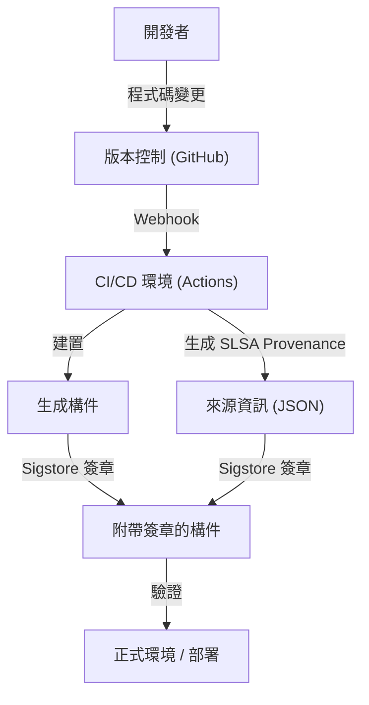

## 軟體供應鏈攻擊的威脅與歷史背景

在現代的軟體開發中，我們幾乎不可能從零開始編寫所有程式碼。開源函式庫、第三方框架、建置工具以及 CI/CD 流程，這些都是構成「軟體供應鏈」的重要元素，但同時也是攻擊者的絕佳目標。

軟體供應鏈攻擊是指不直接入侵目標企業的系統，而是在該企業使用的軟體、開發工具或依賴套件中混入惡意程式碼，間接發起攻擊的手法。這種手法只需要一次竄改，就能影響成千上萬的終端使用者，因此具有極大的影響力，且難以被發現。

### SolarWinds 事件留下的教訓

讓全世界見識到軟體供應鏈攻擊威脅的最具代表性事件，是 2020 年爆發的 SolarWinds 攻擊事件（SUNBURST）。SolarWinds 公司提供 IT 基礎設施管理軟體「Orion」，許多美國政府機構和財富 500 強企業都採用了這套軟體。

攻擊者入侵了 SolarWinds 公司的建置環境，並悄悄在正規的更新套件中植入了後門程式。這個被竄改的更新帶有正規的數位簽章，因此成功避開了資安產品的偵測，並自動發布、安裝到了約 18,000 個組織中。

這個事件為我們留下了以下深刻的教訓：

1.  **「受信任的供應商」並非無條件安全**：即使是企業透過正規管道簽約購買的軟體，如果其開發過程遭到入侵，依然會成為威脅。
2.  **建置流程的脆弱性**：除了原始碼，CI/CD 環境和建置伺服器本身也會成為攻擊目標。
3.  **缺乏可視性**：許多組織無法準確掌握自家網路中到底導入了哪些軟體、哪些元件，以及透過何種途徑導入。

以此事件為契機，美國政府發布了強化網路安全的行政命令（EO 14028），要求向聯邦政府提供軟體的供應商必須提交 SBOM（軟體物料清單），應對供應鏈資安問題已成為當務之急。

## SBOM（Software Bill of Materials）：確保軟體的透明度

SBOM（Software Bill of Materials）是一份以機器可讀格式描述軟體組成的元件、函式庫及依賴關係清單，也就是「軟體物料清單」。就像食品包裝上會標示原料和過敏原一樣，它將軟體內部包含的內容可視化。

### SBOM 解決的挑戰

當某個開源函式庫（例如 Log4j）被發現嚴重漏洞時，企業面臨的最大挑戰是找出「自家有哪些系統使用了該函式庫的哪個版本」。如果沒有 SBOM，各開發團隊就需要進行調查，或手動搜尋程式碼儲存庫，這將耗費大量的時間與心力。

如果日常就有生成並管理 SBOM，只需將漏洞資訊（CVE）與 SBOM 進行比對，就能瞬間鎖定受影響的系統，並迅速套用修補程式或執行權宜措施。

### 具代表性的 SBOM 格式：SPDX 與 CycloneDX

目前廣泛作為業界標準使用的 SBOM 資料格式，主要有「SPDX」與「CycloneDX」兩種。

1.  **SPDX (Software Package Data Exchange)**:
    由 Linux 基金會管理的 ISO 標準（ISO/IEC 5962:2021）格式。最初是為了管理開源授權合規性而開發，但現在已擴展至資安用途。它能夠詳細描述套件來源、授權資訊和資安參考（如 CPE 等），特點是與法務及合規部門有很高的契合度。
2.  **CycloneDX**:
    由 OWASP（Open Worldwide Application Security Project）制定的格式。專為資安上下文和漏洞識別而設計，不僅支援軟體，還能描述硬體、服務、加密演算法（CBOM: Cryptography Bill of Materials）等。其檔案大小相對精簡，非常適合在 CI/CD 流程中自動生成，並與漏洞掃描工具整合。

### SBOM 的生成與管理策略

SBOM 並非「在軟體發布時製作一次就好」。由於依賴關係會頻繁更新，因此必須將 SBOM 生成整合到建置流程中，確保持續維持在最新狀態。

**生成工具:**
- Syft (Anchore)
- Trivy (Aqua Security)
- Microsoft SBOM Tool

**在 GitHub Actions 中的生成範例 (使用 Trivy):**
```yaml
name: Generate SBOM
on: [push]
jobs:
  sbom:
    runs-on: ubuntu-latest
    steps:
      - uses: actions/checkout@v4
      - name: Run Trivy in fs mode to generate SBOM
        uses: aquasecurity/trivy-action@master
        with:
          scan-type: 'fs'
          format: 'cyclonedx'
          output: 'sbom.json'
      - name: Upload SBOM
        uses: actions/upload-artifact@v4
        with:
          name: sbom
          path: sbom.json
```

將生成的 SBOM 儲存在 Dependency-Track 或 Guac 等專門的管理伺服器中，並建立持續與漏洞資料庫比對的機制（Continuous Monitoring），是非常重要的。

## SLSA：建置完整性框架

如果說 SBOM 是用來釐清「軟體的內容」，那麼 SLSA（Supply chain Levels for Software Artifacts，發音同 Salsa）就是用來保證「軟體被正確且安全地製造出來」的框架。它由 Google 提出，目前由 OpenSSF 管理。

SLSA 定義了在從原始碼變更到生成最終構件（如二進位檔或容器映像檔）的各個步驟中，證明未被竄改（完整性）的指南與資安層級。

### SLSA 的 4 個層級與要求

SLSA 考量了導入的難易度與資安強度的平衡，提供了從 Level 1 到 Level 4 的漸進式方法（目前 SLSA v1.0 已細分為 Build、Source 等軌道，這裡解說整體的概念）。

*   **SLSA Level 1: 來源記錄（Provenance）**
    *   **要求**：建置流程已被腳本化或自動化，並生成了證明最終構件是「從哪個原始碼」、「經過哪個建置流程」製作出來的證明（Provenance：來源資訊）。
    *   **目的**：排除手動建置，踏出釐清軟體來源的第一步。
*   **SLSA Level 2: 附帶簽章的來源資訊**
    *   **要求**：在 Level 1 的要求之外，建置服務（如 CI 環境）需對來源資訊進行加密簽章，保證建置流程未受外部竄改。
    *   **目的**：確保來源資訊本身的可靠性，防止建置後的構件被替換。
*   **SLSA Level 3: 建置環境的分離與驗證**
    *   **要求**：在 Level 2 的要求之外，建置必須在專用的隔離環境（容器或 VM）中進行，以防止其他建置的干擾或持續性的入侵（臨時性環境）。來源資訊的生成必須由與建置環境本身隔離、可信任的控制平面進行。
    *   **目的**：增加對建置流程本身進行攻擊（如 SolarWinds 事件）的難度。
*   **SLSA Level 4: 最高可靠性（Two-Person Review & Hermetic Build）**
    *   **要求**：在 Level 3 的要求之外，對原始碼的變更強制要求至少兩人的核准（Two-Person Review）。此外，建置必須在完全封閉的環境（Hermetic Build：阻斷外部網路存取，所有依賴關係皆已事先定義）中進行。
    *   **目的**：防止內部作案，並阻斷外部惡意軟體的下載。

### 實作 SLSA 要求的方法

為了滿足 SLSA 的層級要求，不能只依賴導入工具，還需要重新審視整個開發流程。



## Sigstore：為開發者打造的加密簽章

要實現 SLSA 要求中的「對來源資訊與構件進行簽章」，過去必須克服公開金鑰基礎建設（PKI）營運的高門檻。金鑰的生成、安全保管、輪替、撤銷手續等，傳統的 PGP 簽章對開發者來說負擔過重，難以普及。

為了解決這個問題而誕生的，就是「Sigstore」。Sigstore 被稱為「軟體簽章界的 Let's Encrypt」，為開源專案提供免費且自動化的簽章基礎建設。

### 構成 Sigstore 的 3 個主要元件

1.  **Fulcio（憑證中心）**：利用 OIDC（OpenID Connect），以 GitHub 或 Google 帳號等身分識別為基礎，核發臨時性（短效）的憑證。如此一來，開發者就無需永久管理私鑰。
2.  **Rekor（透明度日誌）**：將簽章記錄保存在不可竄改的分散式帳本（Transparency Log）中。任何人都能驗證與稽核簽章歷史，因此即使憑證遭不當核發，也能輕易被發現。
3.  **Cosign（簽章工具）**：這是一款 CLI 工具，能讓開發者輕鬆對容器映像檔或任意構件進行簽章與驗證。

### 結合 GitHub Actions 與 Sigstore 對容器映像檔進行簽章

由於 GitHub Actions 本身具備 OIDC 提供者的功能，因此可以與 Sigstore（Fulcio）整合，實現「無金鑰簽章（Keyless Signing）」。這是一種劃時代的機制，它將 GitHub Actions 工作流程本身的識別資訊（如儲存庫名稱、分支、Commit Hash 等）嵌入憑證中進行簽章。

**在 GitHub Actions 中使用 Cosign 的無金鑰簽章範例：**

```yaml
name: Build and Sign Container
on: [push]
jobs:
  build-and-sign:
    runs-on: ubuntu-latest
    permissions:
      contents: read
      packages: write
      id-token: write # 取得 OIDC 權杖所必需
    steps:
      - name: Checkout repository
        uses: actions/checkout@v4

      - name: Install Cosign
        uses: sigstore/cosign-installer@v3.5.0

      - name: Log in to GitHub Container Registry
        uses: docker/login-action@v3
        with:
          registry: ghcr.io
          username: ${{ github.actor }}
          password: ${{ secrets.GITHUB_TOKEN }}

      - name: Build and push Docker image
        id: docker_build
        uses: docker/build-push-action@v5
        with:
          push: true
          tags: ghcr.io/${{ github.repository }}:latest

      - name: Sign the container image
        env:
          COSIGN_EXPERIMENTAL: "true"
        run: |
          cosign sign --yes ghcr.io/${{ github.repository }}@${{ steps.docker_build.outputs.digest }}
```

當這個工作流程執行時，容器映像檔被推送到 GHCR 後，Cosign 會自動透過 GitHub OIDC 向 Fulcio 取得短效憑證，並對映像檔的摘要進行簽章。簽章資訊會附加在 GHCR 上，並記錄在 Rekor 日誌中。

### 正式環境中的簽章驗證

為了安全地運用具有簽章的映像檔，必須在部署時建立驗證其簽章的機制。如果在 Kubernetes 環境中，可以導入 Kyverno 或 Sigstore Policy Controller 等 Admission Controller，藉此套用嚴格的原則，例如「只允許執行從正確儲存庫的 GitHub Actions 建置並簽章的映像檔」。

## 結論：持續的供應鏈防禦

軟體供應鏈資安無法單靠單一工具或解決方案來解決。
1.  透過 **SBOM** 將「使用了什麼」可視化，建立漏洞管理的基礎。
2.  遵循 **SLSA** 框架，強化建置流程的完整性，推動自動化與隔離化。
3.  運用 **Sigstore**，對構件與來源資訊進行無金鑰簽章，並在部署時進行驗證。

將這些措施深度整合到 CI/CD 流程（如 GitHub Actions）中，在將開發者負擔降至最低的同時，建構「預設安全（Secure by Default）」的環境，這是次世代軟體開發中最重要的一項責任。為了不讓 SolarWinds 事件的悲劇重演，請從今天開始邁出供應鏈防禦的第一步吧。
