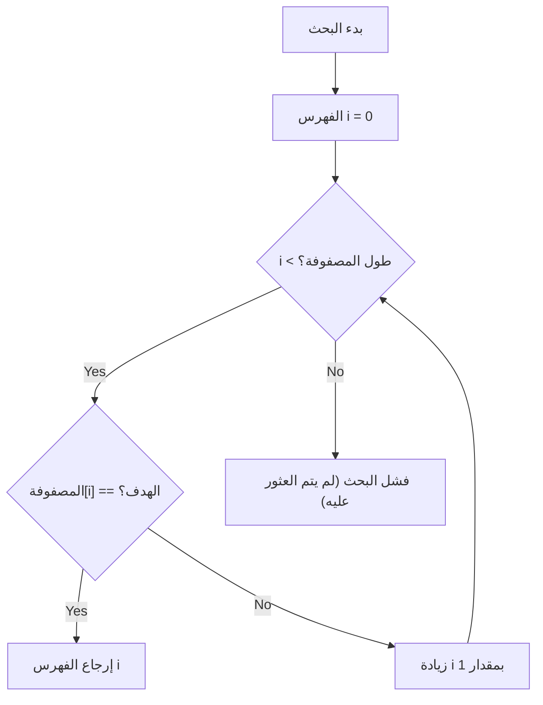
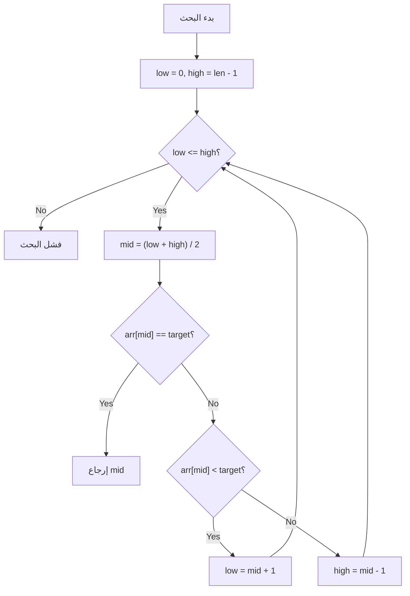
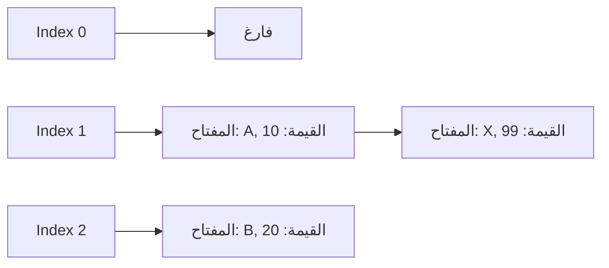

# أساسيات وأهمية خوارزميات البحث

في علوم الحاسوب الحديثة، تعتبر **خوارزميات البحث** التي تعثر بسرعة على القيمة المستهدفة من بين البيانات تقنية مهمة للغاية تشكل أساس أي برنامج أو نظام. نحن نستفيد من خوارزميات البحث بشكل يومي، مثل البحث في قواعد البيانات، والبحث عن الكلمات المفتاحية في متصفحات الويب، والبحث عن الأسماء في تطبيقات جهات الاتصال على الهواتف الذكية.

في هذه المقالة، سنشرح بالتفصيل خوارزميات "البحث الخطي (Linear Search)" و"البحث الثنائي (Binary Search)" التي تعتبر أساسيات علوم الحاسوب، إلى جانب آلياتها وتعقيدها وأمثلة لتنفيذها بلغة بايثون. علاوة على ذلك، سنتعمق في مبدأ "جداول التجزئة (Hash Table)" التي تتجاوز حدود هذه الخوارزميات وتحقق سرعات بحث هائلة، ودور وظائف التجزئة، وتقنيات حل تصادم التجزئة (Collision).


يعد تعميق الفهم لخوارزميات البحث أمرًا ضروريًا لرفع مستوى مهاراتك كمبرمج إلى المستوى التالي. قد يكون تأثير اختيار الخوارزمية على الأداء ضئيلًا عندما يكون حجم البيانات صغيرًا، ولكن في عصر البيانات الضخمة، يعد اختيار الخوارزمية وهيكل البيانات المناسبين أمرًا بالغ الأهمية للعثور على المعلومات المستهدفة على الفور من بين ملايين ومئات الملايين من البيانات. على وجه الخصوص، يعد فهم مفهوم **التعقيد الزمني** (مثل $O(n)$ و $O(\log n)$ و $O(1)$) عنصرًا أساسيًا في تصميم البرامج الفعالة.

يعد تعميق الفهم لخوارزميات البحث أمرًا ضروريًا لرفع مستوى مهاراتك كمبرمج إلى المستوى التالي. قد يكون تأثير اختيار الخوارزمية على الأداء ضئيلًا عندما يكون حجم البيانات صغيرًا، ولكن في عصر البيانات الضخمة، يعد اختيار الخوارزمية وهيكل البيانات المناسبين أمرًا بالغ الأهمية للعثور على المعلومات المستهدفة على الفور من بين ملايين ومئات الملايين من البيانات. على وجه الخصوص، يعد فهم مفهوم **التعقيد الزمني** (مثل $O(n)$ و $O(\log n)$ و $O(1)$) عنصرًا أساسيًا في تصميم البرامج الفعالة.

يعد تعميق الفهم لخوارزميات البحث أمرًا ضروريًا لرفع مستوى مهاراتك كمبرمج إلى المستوى التالي. قد يكون تأثير اختيار الخوارزمية على الأداء ضئيلًا عندما يكون حجم البيانات صغيرًا، ولكن في عصر البيانات الضخمة، يعد اختيار الخوارزمية وهيكل البيانات المناسبين أمرًا بالغ الأهمية للعثور على المعلومات المستهدفة على الفور من بين ملايين ومئات الملايين من البيانات. على وجه الخصوص، يعد فهم مفهوم **التعقيد الزمني** (مثل $O(n)$ و $O(\log n)$ و $O(1)$) عنصرًا أساسيًا في تصميم البرامج الفعالة.

يعد تعميق الفهم لخوارزميات البحث أمرًا ضروريًا لرفع مستوى مهاراتك كمبرمج إلى المستوى التالي. قد يكون تأثير اختيار الخوارزمية على الأداء ضئيلًا عندما يكون حجم البيانات صغيرًا، ولكن في عصر البيانات الضخمة، يعد اختيار الخوارزمية وهيكل البيانات المناسبين أمرًا بالغ الأهمية للعثور على المعلومات المستهدفة على الفور من بين ملايين ومئات الملايين من البيانات. على وجه الخصوص، يعد فهم مفهوم **التعقيد الزمني** (مثل $O(n)$ و $O(\log n)$ و $O(1)$) عنصرًا أساسيًا في تصميم البرامج الفعالة.

يعد تعميق الفهم لخوارزميات البحث أمرًا ضروريًا لرفع مستوى مهاراتك كمبرمج إلى المستوى التالي. قد يكون تأثير اختيار الخوارزمية على الأداء ضئيلًا عندما يكون حجم البيانات صغيرًا، ولكن في عصر البيانات الضخمة، يعد اختيار الخوارزمية وهيكل البيانات المناسبين أمرًا بالغ الأهمية للعثور على المعلومات المستهدفة على الفور من بين ملايين ومئات الملايين من البيانات. على وجه الخصوص، يعد فهم مفهوم **التعقيد الزمني** (مثل $O(n)$ و $O(\log n)$ و $O(1)$) عنصرًا أساسيًا في تصميم البرامج الفعالة.

يعد تعميق الفهم لخوارزميات البحث أمرًا ضروريًا لرفع مستوى مهاراتك كمبرمج إلى المستوى التالي. قد يكون تأثير اختيار الخوارزمية على الأداء ضئيلًا عندما يكون حجم البيانات صغيرًا، ولكن في عصر البيانات الضخمة، يعد اختيار الخوارزمية وهيكل البيانات المناسبين أمرًا بالغ الأهمية للعثور على المعلومات المستهدفة على الفور من بين ملايين ومئات الملايين من البيانات. على وجه الخصوص، يعد فهم مفهوم **التعقيد الزمني** (مثل $O(n)$ و $O(\log n)$ و $O(1)$) عنصرًا أساسيًا في تصميم البرامج الفعالة.

يعد تعميق الفهم لخوارزميات البحث أمرًا ضروريًا لرفع مستوى مهاراتك كمبرمج إلى المستوى التالي. قد يكون تأثير اختيار الخوارزمية على الأداء ضئيلًا عندما يكون حجم البيانات صغيرًا، ولكن في عصر البيانات الضخمة، يعد اختيار الخوارزمية وهيكل البيانات المناسبين أمرًا بالغ الأهمية للعثور على المعلومات المستهدفة على الفور من بين ملايين ومئات الملايين من البيانات. على وجه الخصوص، يعد فهم مفهوم **التعقيد الزمني** (مثل $O(n)$ و $O(\log n)$ و $O(1)$) عنصرًا أساسيًا في تصميم البرامج الفعالة.

يعد تعميق الفهم لخوارزميات البحث أمرًا ضروريًا لرفع مستوى مهاراتك كمبرمج إلى المستوى التالي. قد يكون تأثير اختيار الخوارزمية على الأداء ضئيلًا عندما يكون حجم البيانات صغيرًا، ولكن في عصر البيانات الضخمة، يعد اختيار الخوارزمية وهيكل البيانات المناسبين أمرًا بالغ الأهمية للعثور على المعلومات المستهدفة على الفور من بين ملايين ومئات الملايين من البيانات. على وجه الخصوص، يعد فهم مفهوم **التعقيد الزمني** (مثل $O(n)$ و $O(\log n)$ و $O(1)$) عنصرًا أساسيًا في تصميم البرامج الفعالة.

يعد تعميق الفهم لخوارزميات البحث أمرًا ضروريًا لرفع مستوى مهاراتك كمبرمج إلى المستوى التالي. قد يكون تأثير اختيار الخوارزمية على الأداء ضئيلًا عندما يكون حجم البيانات صغيرًا، ولكن في عصر البيانات الضخمة، يعد اختيار الخوارزمية وهيكل البيانات المناسبين أمرًا بالغ الأهمية للعثور على المعلومات المستهدفة على الفور من بين ملايين ومئات الملايين من البيانات. على وجه الخصوص، يعد فهم مفهوم **التعقيد الزمني** (مثل $O(n)$ و $O(\log n)$ و $O(1)$) عنصرًا أساسيًا في تصميم البرامج الفعالة.

يعد تعميق الفهم لخوارزميات البحث أمرًا ضروريًا لرفع مستوى مهاراتك كمبرمج إلى المستوى التالي. قد يكون تأثير اختيار الخوارزمية على الأداء ضئيلًا عندما يكون حجم البيانات صغيرًا، ولكن في عصر البيانات الضخمة، يعد اختيار الخوارزمية وهيكل البيانات المناسبين أمرًا بالغ الأهمية للعثور على المعلومات المستهدفة على الفور من بين ملايين ومئات الملايين من البيانات. على وجه الخصوص، يعد فهم مفهوم **التعقيد الزمني** (مثل $O(n)$ و $O(\log n)$ و $O(1)$) عنصرًا أساسيًا في تصميم البرامج الفعالة.

## 1. البحث الخطي (Linear Search)

البحث الخطي هو خوارزمية البحث الأبسط والأكثر بديهية التي تتحقق من العناصر واحدًا تلو الآخر بالترتيب من بداية هيكل البيانات (مثل مصفوفة أو قائمة) إلى نهايتها حتى يتم العثور على القيمة المستهدفة.

### 1.1 آلية البحث الخطي

تتقدم خوارزمية البحث الخطي وفقًا للخطوات التالية.

1. استخراج العنصر الأول من المصفوفة.
2. التحقق مما إذا كان العنصر المستخرج يتطابق مع القيمة المستهدفة (الهدف).
3. إذا كان هناك تطابق، فقم بإرجاع فهرس (موضع) ذلك العنصر وإنهاء البحث.
4. إذا لم يتطابق، فانتقل إلى العنصر التالي.
5. تحقق حتى نهاية المصفوفة، وإذا لم يتم العثور على الهدف، فقم بالإنهاء كفشل بحث (على سبيل المثال، إرجاع `-1` أو `None`).



### 1.2 تنفيذ البحث الخطي بلغة بايثون

فيما يلي مثال بسيط لتنفيذ البحث الخطي باستخدام بايثون.

```python
def linear_search(arr, target):
    """
    دالة لتنفيذ البحث الخطي
    :param arr: القائمة المراد البحث فيها
    :param target: القيمة المطلوب العثور عليها
    :return: فهرس القيمة إذا تم العثور عليها، و -1 إذا لم يتم العثور عليها
    """
    for i in range(len(arr)):
        if arr[i] == target:
            return i
    return -1

# بيانات الاختبار
numbers = [10, 23, 4, 15, 2, 7, 34, 11]
target_value = 7

result_index = linear_search(numbers, target_value)
if result_index != -1:
    print(f"تم العثور على العنصر {target_value} في الفهرس {result_index}.")
else:
    print(f"العنصر {target_value} غير موجود في القائمة.")
```


أكبر ميزة للبحث الخطي هي أن البيانات لا تحتاج إلى فرز (ترتيب). حتى إذا تم تخزين البيانات بترتيب عشوائي، يتم التحقق منها بالترتيب من البداية، بحيث يمكنك بالتأكيد العثور على القيمة المستهدفة (أو التأكد من عدم وجودها). ومع ذلك، فإن هذه الخاصية المتمثلة في "التحقق من كل شيء بالترتيب" هي العامل الأكبر في انخفاض الأداء عندما يصبح حجم البيانات كبيرًا.

أكبر ميزة للبحث الخطي هي أن البيانات لا تحتاج إلى فرز (ترتيب). حتى إذا تم تخزين البيانات بترتيب عشوائي، يتم التحقق منها بالترتيب من البداية، بحيث يمكنك بالتأكيد العثور على القيمة المستهدفة (أو التأكد من عدم وجودها). ومع ذلك، فإن هذه الخاصية المتمثلة في "التحقق من كل شيء بالترتيب" هي العامل الأكبر في انخفاض الأداء عندما يصبح حجم البيانات كبيرًا.

أكبر ميزة للبحث الخطي هي أن البيانات لا تحتاج إلى فرز (ترتيب). حتى إذا تم تخزين البيانات بترتيب عشوائي، يتم التحقق منها بالترتيب من البداية، بحيث يمكنك بالتأكيد العثور على القيمة المستهدفة (أو التأكد من عدم وجودها). ومع ذلك، فإن هذه الخاصية المتمثلة في "التحقق من كل شيء بالترتيب" هي العامل الأكبر في انخفاض الأداء عندما يصبح حجم البيانات كبيرًا.

أكبر ميزة للبحث الخطي هي أن البيانات لا تحتاج إلى فرز (ترتيب). حتى إذا تم تخزين البيانات بترتيب عشوائي، يتم التحقق منها بالترتيب من البداية، بحيث يمكنك بالتأكيد العثور على القيمة المستهدفة (أو التأكد من عدم وجودها). ومع ذلك، فإن هذه الخاصية المتمثلة في "التحقق من كل شيء بالترتيب" هي العامل الأكبر في انخفاض الأداء عندما يصبح حجم البيانات كبيرًا.

أكبر ميزة للبحث الخطي هي أن البيانات لا تحتاج إلى فرز (ترتيب). حتى إذا تم تخزين البيانات بترتيب عشوائي، يتم التحقق منها بالترتيب من البداية، بحيث يمكنك بالتأكيد العثور على القيمة المستهدفة (أو التأكد من عدم وجودها). ومع ذلك، فإن هذه الخاصية المتمثلة في "التحقق من كل شيء بالترتيب" هي العامل الأكبر في انخفاض الأداء عندما يصبح حجم البيانات كبيرًا.

أكبر ميزة للبحث الخطي هي أن البيانات لا تحتاج إلى فرز (ترتيب). حتى إذا تم تخزين البيانات بترتيب عشوائي، يتم التحقق منها بالترتيب من البداية، بحيث يمكنك بالتأكيد العثور على القيمة المستهدفة (أو التأكد من عدم وجودها). ومع ذلك، فإن هذه الخاصية المتمثلة في "التحقق من كل شيء بالترتيب" هي العامل الأكبر في انخفاض الأداء عندما يصبح حجم البيانات كبيرًا.

أكبر ميزة للبحث الخطي هي أن البيانات لا تحتاج إلى فرز (ترتيب). حتى إذا تم تخزين البيانات بترتيب عشوائي، يتم التحقق منها بالترتيب من البداية، بحيث يمكنك بالتأكيد العثور على القيمة المستهدفة (أو التأكد من عدم وجودها). ومع ذلك، فإن هذه الخاصية المتمثلة في "التحقق من كل شيء بالترتيب" هي العامل الأكبر في انخفاض الأداء عندما يصبح حجم البيانات كبيرًا.

أكبر ميزة للبحث الخطي هي أن البيانات لا تحتاج إلى فرز (ترتيب). حتى إذا تم تخزين البيانات بترتيب عشوائي، يتم التحقق منها بالترتيب من البداية، بحيث يمكنك بالتأكيد العثور على القيمة المستهدفة (أو التأكد من عدم وجودها). ومع ذلك، فإن هذه الخاصية المتمثلة في "التحقق من كل شيء بالترتيب" هي العامل الأكبر في انخفاض الأداء عندما يصبح حجم البيانات كبيرًا.

أكبر ميزة للبحث الخطي هي أن البيانات لا تحتاج إلى فرز (ترتيب). حتى إذا تم تخزين البيانات بترتيب عشوائي، يتم التحقق منها بالترتيب من البداية، بحيث يمكنك بالتأكيد العثور على القيمة المستهدفة (أو التأكد من عدم وجودها). ومع ذلك، فإن هذه الخاصية المتمثلة في "التحقق من كل شيء بالترتيب" هي العامل الأكبر في انخفاض الأداء عندما يصبح حجم البيانات كبيرًا.

أكبر ميزة للبحث الخطي هي أن البيانات لا تحتاج إلى فرز (ترتيب). حتى إذا تم تخزين البيانات بترتيب عشوائي، يتم التحقق منها بالترتيب من البداية، بحيث يمكنك بالتأكيد العثور على القيمة المستهدفة (أو التأكد من عدم وجودها). ومع ذلك، فإن هذه الخاصية المتمثلة في "التحقق من كل شيء بالترتيب" هي العامل الأكبر في انخفاض الأداء عندما يصبح حجم البيانات كبيرًا.

أكبر ميزة للبحث الخطي هي أن البيانات لا تحتاج إلى فرز (ترتيب). حتى إذا تم تخزين البيانات بترتيب عشوائي، يتم التحقق منها بالترتيب من البداية، بحيث يمكنك بالتأكيد العثور على القيمة المستهدفة (أو التأكد من عدم وجودها). ومع ذلك، فإن هذه الخاصية المتمثلة في "التحقق من كل شيء بالترتيب" هي العامل الأكبر في انخفاض الأداء عندما يصبح حجم البيانات كبيرًا.

أكبر ميزة للبحث الخطي هي أن البيانات لا تحتاج إلى فرز (ترتيب). حتى إذا تم تخزين البيانات بترتيب عشوائي، يتم التحقق منها بالترتيب من البداية، بحيث يمكنك بالتأكيد العثور على القيمة المستهدفة (أو التأكد من عدم وجودها). ومع ذلك، فإن هذه الخاصية المتمثلة في "التحقق من كل شيء بالترتيب" هي العامل الأكبر في انخفاض الأداء عندما يصبح حجم البيانات كبيرًا.

أكبر ميزة للبحث الخطي هي أن البيانات لا تحتاج إلى فرز (ترتيب). حتى إذا تم تخزين البيانات بترتيب عشوائي، يتم التحقق منها بالترتيب من البداية، بحيث يمكنك بالتأكيد العثور على القيمة المستهدفة (أو التأكد من عدم وجودها). ومع ذلك، فإن هذه الخاصية المتمثلة في "التحقق من كل شيء بالترتيب" هي العامل الأكبر في انخفاض الأداء عندما يصبح حجم البيانات كبيرًا.

أكبر ميزة للبحث الخطي هي أن البيانات لا تحتاج إلى فرز (ترتيب). حتى إذا تم تخزين البيانات بترتيب عشوائي، يتم التحقق منها بالترتيب من البداية، بحيث يمكنك بالتأكيد العثور على القيمة المستهدفة (أو التأكد من عدم وجودها). ومع ذلك، فإن هذه الخاصية المتمثلة في "التحقق من كل شيء بالترتيب" هي العامل الأكبر في انخفاض الأداء عندما يصبح حجم البيانات كبيرًا.

أكبر ميزة للبحث الخطي هي أن البيانات لا تحتاج إلى فرز (ترتيب). حتى إذا تم تخزين البيانات بترتيب عشوائي، يتم التحقق منها بالترتيب من البداية، بحيث يمكنك بالتأكيد العثور على القيمة المستهدفة (أو التأكد من عدم وجودها). ومع ذلك، فإن هذه الخاصية المتمثلة في "التحقق من كل شيء بالترتيب" هي العامل الأكبر في انخفاض الأداء عندما يصبح حجم البيانات كبيرًا.

أكبر ميزة للبحث الخطي هي أن البيانات لا تحتاج إلى فرز (ترتيب). حتى إذا تم تخزين البيانات بترتيب عشوائي، يتم التحقق منها بالترتيب من البداية، بحيث يمكنك بالتأكيد العثور على القيمة المستهدفة (أو التأكد من عدم وجودها). ومع ذلك، فإن هذه الخاصية المتمثلة في "التحقق من كل شيء بالترتيب" هي العامل الأكبر في انخفاض الأداء عندما يصبح حجم البيانات كبيرًا.

أكبر ميزة للبحث الخطي هي أن البيانات لا تحتاج إلى فرز (ترتيب). حتى إذا تم تخزين البيانات بترتيب عشوائي، يتم التحقق منها بالترتيب من البداية، بحيث يمكنك بالتأكيد العثور على القيمة المستهدفة (أو التأكد من عدم وجودها). ومع ذلك، فإن هذه الخاصية المتمثلة في "التحقق من كل شيء بالترتيب" هي العامل الأكبر في انخفاض الأداء عندما يصبح حجم البيانات كبيرًا.

أكبر ميزة للبحث الخطي هي أن البيانات لا تحتاج إلى فرز (ترتيب). حتى إذا تم تخزين البيانات بترتيب عشوائي، يتم التحقق منها بالترتيب من البداية، بحيث يمكنك بالتأكيد العثور على القيمة المستهدفة (أو التأكد من عدم وجودها). ومع ذلك، فإن هذه الخاصية المتمثلة في "التحقق من كل شيء بالترتيب" هي العامل الأكبر في انخفاض الأداء عندما يصبح حجم البيانات كبيرًا.

أكبر ميزة للبحث الخطي هي أن البيانات لا تحتاج إلى فرز (ترتيب). حتى إذا تم تخزين البيانات بترتيب عشوائي، يتم التحقق منها بالترتيب من البداية، بحيث يمكنك بالتأكيد العثور على القيمة المستهدفة (أو التأكد من عدم وجودها). ومع ذلك، فإن هذه الخاصية المتمثلة في "التحقق من كل شيء بالترتيب" هي العامل الأكبر في انخفاض الأداء عندما يصبح حجم البيانات كبيرًا.

أكبر ميزة للبحث الخطي هي أن البيانات لا تحتاج إلى فرز (ترتيب). حتى إذا تم تخزين البيانات بترتيب عشوائي، يتم التحقق منها بالترتيب من البداية، بحيث يمكنك بالتأكيد العثور على القيمة المستهدفة (أو التأكد من عدم وجودها). ومع ذلك، فإن هذه الخاصية المتمثلة في "التحقق من كل شيء بالترتيب" هي العامل الأكبر في انخفاض الأداء عندما يصبح حجم البيانات كبيرًا.

أكبر ميزة للبحث الخطي هي أن البيانات لا تحتاج إلى فرز (ترتيب). حتى إذا تم تخزين البيانات بترتيب عشوائي، يتم التحقق منها بالترتيب من البداية، بحيث يمكنك بالتأكيد العثور على القيمة المستهدفة (أو التأكد من عدم وجودها). ومع ذلك، فإن هذه الخاصية المتمثلة في "التحقق من كل شيء بالترتيب" هي العامل الأكبر في انخفاض الأداء عندما يصبح حجم البيانات كبيرًا.

أكبر ميزة للبحث الخطي هي أن البيانات لا تحتاج إلى فرز (ترتيب). حتى إذا تم تخزين البيانات بترتيب عشوائي، يتم التحقق منها بالترتيب من البداية، بحيث يمكنك بالتأكيد العثور على القيمة المستهدفة (أو التأكد من عدم وجودها). ومع ذلك، فإن هذه الخاصية المتمثلة في "التحقق من كل شيء بالترتيب" هي العامل الأكبر في انخفاض الأداء عندما يصبح حجم البيانات كبيرًا.

أكبر ميزة للبحث الخطي هي أن البيانات لا تحتاج إلى فرز (ترتيب). حتى إذا تم تخزين البيانات بترتيب عشوائي، يتم التحقق منها بالترتيب من البداية، بحيث يمكنك بالتأكيد العثور على القيمة المستهدفة (أو التأكد من عدم وجودها). ومع ذلك، فإن هذه الخاصية المتمثلة في "التحقق من كل شيء بالترتيب" هي العامل الأكبر في انخفاض الأداء عندما يصبح حجم البيانات كبيرًا.

أكبر ميزة للبحث الخطي هي أن البيانات لا تحتاج إلى فرز (ترتيب). حتى إذا تم تخزين البيانات بترتيب عشوائي، يتم التحقق منها بالترتيب من البداية، بحيث يمكنك بالتأكيد العثور على القيمة المستهدفة (أو التأكد من عدم وجودها). ومع ذلك، فإن هذه الخاصية المتمثلة في "التحقق من كل شيء بالترتيب" هي العامل الأكبر في انخفاض الأداء عندما يصبح حجم البيانات كبيرًا.

أكبر ميزة للبحث الخطي هي أن البيانات لا تحتاج إلى فرز (ترتيب). حتى إذا تم تخزين البيانات بترتيب عشوائي، يتم التحقق منها بالترتيب من البداية، بحيث يمكنك بالتأكيد العثور على القيمة المستهدفة (أو التأكد من عدم وجودها). ومع ذلك، فإن هذه الخاصية المتمثلة في "التحقق من كل شيء بالترتيب" هي العامل الأكبر في انخفاض الأداء عندما يصبح حجم البيانات كبيرًا.

أكبر ميزة للبحث الخطي هي أن البيانات لا تحتاج إلى فرز (ترتيب). حتى إذا تم تخزين البيانات بترتيب عشوائي، يتم التحقق منها بالترتيب من البداية، بحيث يمكنك بالتأكيد العثور على القيمة المستهدفة (أو التأكد من عدم وجودها). ومع ذلك، فإن هذه الخاصية المتمثلة في "التحقق من كل شيء بالترتيب" هي العامل الأكبر في انخفاض الأداء عندما يصبح حجم البيانات كبيرًا.

أكبر ميزة للبحث الخطي هي أن البيانات لا تحتاج إلى فرز (ترتيب). حتى إذا تم تخزين البيانات بترتيب عشوائي، يتم التحقق منها بالترتيب من البداية، بحيث يمكنك بالتأكيد العثور على القيمة المستهدفة (أو التأكد من عدم وجودها). ومع ذلك، فإن هذه الخاصية المتمثلة في "التحقق من كل شيء بالترتيب" هي العامل الأكبر في انخفاض الأداء عندما يصبح حجم البيانات كبيرًا.

أكبر ميزة للبحث الخطي هي أن البيانات لا تحتاج إلى فرز (ترتيب). حتى إذا تم تخزين البيانات بترتيب عشوائي، يتم التحقق منها بالترتيب من البداية، بحيث يمكنك بالتأكيد العثور على القيمة المستهدفة (أو التأكد من عدم وجودها). ومع ذلك، فإن هذه الخاصية المتمثلة في "التحقق من كل شيء بالترتيب" هي العامل الأكبر في انخفاض الأداء عندما يصبح حجم البيانات كبيرًا.

أكبر ميزة للبحث الخطي هي أن البيانات لا تحتاج إلى فرز (ترتيب). حتى إذا تم تخزين البيانات بترتيب عشوائي، يتم التحقق منها بالترتيب من البداية، بحيث يمكنك بالتأكيد العثور على القيمة المستهدفة (أو التأكد من عدم وجودها). ومع ذلك، فإن هذه الخاصية المتمثلة في "التحقق من كل شيء بالترتيب" هي العامل الأكبر في انخفاض الأداء عندما يصبح حجم البيانات كبيرًا.

أكبر ميزة للبحث الخطي هي أن البيانات لا تحتاج إلى فرز (ترتيب). حتى إذا تم تخزين البيانات بترتيب عشوائي، يتم التحقق منها بالترتيب من البداية، بحيث يمكنك بالتأكيد العثور على القيمة المستهدفة (أو التأكد من عدم وجودها). ومع ذلك، فإن هذه الخاصية المتمثلة في "التحقق من كل شيء بالترتيب" هي العامل الأكبر في انخفاض الأداء عندما يصبح حجم البيانات كبيرًا.

أكبر ميزة للبحث الخطي هي أن البيانات لا تحتاج إلى فرز (ترتيب). حتى إذا تم تخزين البيانات بترتيب عشوائي، يتم التحقق منها بالترتيب من البداية، بحيث يمكنك بالتأكيد العثور على القيمة المستهدفة (أو التأكد من عدم وجودها). ومع ذلك، فإن هذه الخاصية المتمثلة في "التحقق من كل شيء بالترتيب" هي العامل الأكبر في انخفاض الأداء عندما يصبح حجم البيانات كبيرًا.

أكبر ميزة للبحث الخطي هي أن البيانات لا تحتاج إلى فرز (ترتيب). حتى إذا تم تخزين البيانات بترتيب عشوائي، يتم التحقق منها بالترتيب من البداية، بحيث يمكنك بالتأكيد العثور على القيمة المستهدفة (أو التأكد من عدم وجودها). ومع ذلك، فإن هذه الخاصية المتمثلة في "التحقق من كل شيء بالترتيب" هي العامل الأكبر في انخفاض الأداء عندما يصبح حجم البيانات كبيرًا.

أكبر ميزة للبحث الخطي هي أن البيانات لا تحتاج إلى فرز (ترتيب). حتى إذا تم تخزين البيانات بترتيب عشوائي، يتم التحقق منها بالترتيب من البداية، بحيث يمكنك بالتأكيد العثور على القيمة المستهدفة (أو التأكد من عدم وجودها). ومع ذلك، فإن هذه الخاصية المتمثلة في "التحقق من كل شيء بالترتيب" هي العامل الأكبر في انخفاض الأداء عندما يصبح حجم البيانات كبيرًا.

أكبر ميزة للبحث الخطي هي أن البيانات لا تحتاج إلى فرز (ترتيب). حتى إذا تم تخزين البيانات بترتيب عشوائي، يتم التحقق منها بالترتيب من البداية، بحيث يمكنك بالتأكيد العثور على القيمة المستهدفة (أو التأكد من عدم وجودها). ومع ذلك، فإن هذه الخاصية المتمثلة في "التحقق من كل شيء بالترتيب" هي العامل الأكبر في انخفاض الأداء عندما يصبح حجم البيانات كبيرًا.

أكبر ميزة للبحث الخطي هي أن البيانات لا تحتاج إلى فرز (ترتيب). حتى إذا تم تخزين البيانات بترتيب عشوائي، يتم التحقق منها بالترتيب من البداية، بحيث يمكنك بالتأكيد العثور على القيمة المستهدفة (أو التأكد من عدم وجودها). ومع ذلك، فإن هذه الخاصية المتمثلة في "التحقق من كل شيء بالترتيب" هي العامل الأكبر في انخفاض الأداء عندما يصبح حجم البيانات كبيرًا.

أكبر ميزة للبحث الخطي هي أن البيانات لا تحتاج إلى فرز (ترتيب). حتى إذا تم تخزين البيانات بترتيب عشوائي، يتم التحقق منها بالترتيب من البداية، بحيث يمكنك بالتأكيد العثور على القيمة المستهدفة (أو التأكد من عدم وجودها). ومع ذلك، فإن هذه الخاصية المتمثلة في "التحقق من كل شيء بالترتيب" هي العامل الأكبر في انخفاض الأداء عندما يصبح حجم البيانات كبيرًا.

أكبر ميزة للبحث الخطي هي أن البيانات لا تحتاج إلى فرز (ترتيب). حتى إذا تم تخزين البيانات بترتيب عشوائي، يتم التحقق منها بالترتيب من البداية، بحيث يمكنك بالتأكيد العثور على القيمة المستهدفة (أو التأكد من عدم وجودها). ومع ذلك، فإن هذه الخاصية المتمثلة في "التحقق من كل شيء بالترتيب" هي العامل الأكبر في انخفاض الأداء عندما يصبح حجم البيانات كبيرًا.

أكبر ميزة للبحث الخطي هي أن البيانات لا تحتاج إلى فرز (ترتيب). حتى إذا تم تخزين البيانات بترتيب عشوائي، يتم التحقق منها بالترتيب من البداية، بحيث يمكنك بالتأكيد العثور على القيمة المستهدفة (أو التأكد من عدم وجودها). ومع ذلك، فإن هذه الخاصية المتمثلة في "التحقق من كل شيء بالترتيب" هي العامل الأكبر في انخفاض الأداء عندما يصبح حجم البيانات كبيرًا.

أكبر ميزة للبحث الخطي هي أن البيانات لا تحتاج إلى فرز (ترتيب). حتى إذا تم تخزين البيانات بترتيب عشوائي، يتم التحقق منها بالترتيب من البداية، بحيث يمكنك بالتأكيد العثور على القيمة المستهدفة (أو التأكد من عدم وجودها). ومع ذلك، فإن هذه الخاصية المتمثلة في "التحقق من كل شيء بالترتيب" هي العامل الأكبر في انخفاض الأداء عندما يصبح حجم البيانات كبيرًا.

أكبر ميزة للبحث الخطي هي أن البيانات لا تحتاج إلى فرز (ترتيب). حتى إذا تم تخزين البيانات بترتيب عشوائي، يتم التحقق منها بالترتيب من البداية، بحيث يمكنك بالتأكيد العثور على القيمة المستهدفة (أو التأكد من عدم وجودها). ومع ذلك، فإن هذه الخاصية المتمثلة في "التحقق من كل شيء بالترتيب" هي العامل الأكبر في انخفاض الأداء عندما يصبح حجم البيانات كبيرًا.

أكبر ميزة للبحث الخطي هي أن البيانات لا تحتاج إلى فرز (ترتيب). حتى إذا تم تخزين البيانات بترتيب عشوائي، يتم التحقق منها بالترتيب من البداية، بحيث يمكنك بالتأكيد العثور على القيمة المستهدفة (أو التأكد من عدم وجودها). ومع ذلك، فإن هذه الخاصية المتمثلة في "التحقق من كل شيء بالترتيب" هي العامل الأكبر في انخفاض الأداء عندما يصبح حجم البيانات كبيرًا.

أكبر ميزة للبحث الخطي هي أن البيانات لا تحتاج إلى فرز (ترتيب). حتى إذا تم تخزين البيانات بترتيب عشوائي، يتم التحقق منها بالترتيب من البداية، بحيث يمكنك بالتأكيد العثور على القيمة المستهدفة (أو التأكد من عدم وجودها). ومع ذلك، فإن هذه الخاصية المتمثلة في "التحقق من كل شيء بالترتيب" هي العامل الأكبر في انخفاض الأداء عندما يصبح حجم البيانات كبيرًا.

أكبر ميزة للبحث الخطي هي أن البيانات لا تحتاج إلى فرز (ترتيب). حتى إذا تم تخزين البيانات بترتيب عشوائي، يتم التحقق منها بالترتيب من البداية، بحيث يمكنك بالتأكيد العثور على القيمة المستهدفة (أو التأكد من عدم وجودها). ومع ذلك، فإن هذه الخاصية المتمثلة في "التحقق من كل شيء بالترتيب" هي العامل الأكبر في انخفاض الأداء عندما يصبح حجم البيانات كبيرًا.

أكبر ميزة للبحث الخطي هي أن البيانات لا تحتاج إلى فرز (ترتيب). حتى إذا تم تخزين البيانات بترتيب عشوائي، يتم التحقق منها بالترتيب من البداية، بحيث يمكنك بالتأكيد العثور على القيمة المستهدفة (أو التأكد من عدم وجودها). ومع ذلك، فإن هذه الخاصية المتمثلة في "التحقق من كل شيء بالترتيب" هي العامل الأكبر في انخفاض الأداء عندما يصبح حجم البيانات كبيرًا.

أكبر ميزة للبحث الخطي هي أن البيانات لا تحتاج إلى فرز (ترتيب). حتى إذا تم تخزين البيانات بترتيب عشوائي، يتم التحقق منها بالترتيب من البداية، بحيث يمكنك بالتأكيد العثور على القيمة المستهدفة (أو التأكد من عدم وجودها). ومع ذلك، فإن هذه الخاصية المتمثلة في "التحقق من كل شيء بالترتيب" هي العامل الأكبر في انخفاض الأداء عندما يصبح حجم البيانات كبيرًا.

أكبر ميزة للبحث الخطي هي أن البيانات لا تحتاج إلى فرز (ترتيب). حتى إذا تم تخزين البيانات بترتيب عشوائي، يتم التحقق منها بالترتيب من البداية، بحيث يمكنك بالتأكيد العثور على القيمة المستهدفة (أو التأكد من عدم وجودها). ومع ذلك، فإن هذه الخاصية المتمثلة في "التحقق من كل شيء بالترتيب" هي العامل الأكبر في انخفاض الأداء عندما يصبح حجم البيانات كبيرًا.

أكبر ميزة للبحث الخطي هي أن البيانات لا تحتاج إلى فرز (ترتيب). حتى إذا تم تخزين البيانات بترتيب عشوائي، يتم التحقق منها بالترتيب من البداية، بحيث يمكنك بالتأكيد العثور على القيمة المستهدفة (أو التأكد من عدم وجودها). ومع ذلك، فإن هذه الخاصية المتمثلة في "التحقق من كل شيء بالترتيب" هي العامل الأكبر في انخفاض الأداء عندما يصبح حجم البيانات كبيرًا.

أكبر ميزة للبحث الخطي هي أن البيانات لا تحتاج إلى فرز (ترتيب). حتى إذا تم تخزين البيانات بترتيب عشوائي، يتم التحقق منها بالترتيب من البداية، بحيث يمكنك بالتأكيد العثور على القيمة المستهدفة (أو التأكد من عدم وجودها). ومع ذلك، فإن هذه الخاصية المتمثلة في "التحقق من كل شيء بالترتيب" هي العامل الأكبر في انخفاض الأداء عندما يصبح حجم البيانات كبيرًا.

أكبر ميزة للبحث الخطي هي أن البيانات لا تحتاج إلى فرز (ترتيب). حتى إذا تم تخزين البيانات بترتيب عشوائي، يتم التحقق منها بالترتيب من البداية، بحيث يمكنك بالتأكيد العثور على القيمة المستهدفة (أو التأكد من عدم وجودها). ومع ذلك، فإن هذه الخاصية المتمثلة في "التحقق من كل شيء بالترتيب" هي العامل الأكبر في انخفاض الأداء عندما يصبح حجم البيانات كبيرًا.

أكبر ميزة للبحث الخطي هي أن البيانات لا تحتاج إلى فرز (ترتيب). حتى إذا تم تخزين البيانات بترتيب عشوائي، يتم التحقق منها بالترتيب من البداية، بحيث يمكنك بالتأكيد العثور على القيمة المستهدفة (أو التأكد من عدم وجودها). ومع ذلك، فإن هذه الخاصية المتمثلة في "التحقق من كل شيء بالترتيب" هي العامل الأكبر في انخفاض الأداء عندما يصبح حجم البيانات كبيرًا.

## 2. البحث الثنائي (Binary Search)

البحث الثنائي هو خوارزمية بحث سريعة وفعالة للغاية لا يمكن تطبيقها إلا على **البيانات المفرزة مسبقًا (مرتبة بترتيب تصاعدي أو تنازلي)**. من خلال تضييق نطاق البحث بمقدار النصف في كل مرة، يقلل التعقيد الحسابي بشكل كبير.

### 2.1 آلية البحث الثنائي

يتم إجراء البحث الثنائي في الخطوات التالية.

1. تهيئة فهارس "الطرف الأيسر (`low`)" و "الطرف الأيمن (`high`)" للمصفوفة المراد البحث فيها.
2. طالما أن نطاق البحث صالح (`low <= high`)، كرر العملية التالية.
3. احسب الفهرس المركزي (`mid`) لنطاق البحث.
4. قارن العنصر المركزي (`arr[mid]`) بالقيمة المستهدفة (الهدف).
5. إذا كان هناك تطابق، فقم بإرجاع `mid` وإنهاء.
6. إذا كان العنصر المركزي أصغر من الهدف، فإن الهدف موجود في النصف الأيمن من النطاق، لذلك قم بتحديث الطرف الأيسر إلى `mid + 1`.
7. إذا كان العنصر المركزي أكبر من الهدف، فإن الهدف موجود في النصف الأيسر من النطاق، لذلك قم بتحديث الطرف الأيمن إلى `mid - 1`.
8. إذا نفد نطاق البحث ولم يتم العثور عليه، فاعتبره فشل بحث.



### 2.2 تنفيذ البحث الثنائي بلغة بايثون (الطريقة التكرارية)

```python
def binary_search(arr, target):
    """
    دالة لتنفيذ البحث الثنائي (الطريقة التكرارية)
    :param arr: القائمة المرتبة المراد البحث فيها
    :param target: القيمة المطلوب العثور عليها
    :return: فهرس القيمة إذا تم العثور عليها، و -1 إذا لم يتم العثور عليها
    """
    low = 0
    high = len(arr) - 1

    while low <= high:
        mid = (low + high) // 2
        
        if arr[mid] == target:
            return mid
        elif arr[mid] < target:
            low = mid + 1
        else:
            high = mid - 1
            
    return -1

# بيانات الاختبار (يجب فرزها)
sorted_numbers = [2, 4, 7, 10, 11, 15, 23, 34]
target_value = 15

result_index = binary_search(sorted_numbers, target_value)
if result_index != -1:
    print(f"تم العثور على العنصر {target_value} في الفهرس {result_index}.")
else:
    print(f"العنصر {target_value} غير موجود في القائمة.")
```

يأتي الأداء المذهل للبحث الثنائي من طبيعته في تقسيم نطاق البحث إلى النصف في كل مرة. على سبيل المثال، إذا قمنا بإجراء بحث خطي على مصفوفة تحتوي على مليون عنصر، فسنحتاج إلى مليون مقارنة في أسوأ الحالات، ولكن باستخدام البحث الثنائي، يمكننا العثور على القيمة المستهدفة في حوالي 20 مقارنة فقط ($2^{20} \approx 1,000,000$). لهذا السبب، في عمليات البحث على مجموعات البيانات الكبيرة، يتمتع البحث الثنائي بتفوق ساحق مقارنة بالبحث الخطي. رياضيًا، يتم التعبير عن التعقيد الزمني للبحث الثنائي بـ $O(\log n)$.

يأتي الأداء المذهل للبحث الثنائي من طبيعته في تقسيم نطاق البحث إلى النصف في كل مرة. على سبيل المثال، إذا قمنا بإجراء بحث خطي على مصفوفة تحتوي على مليون عنصر، فسنحتاج إلى مليون مقارنة في أسوأ الحالات، ولكن باستخدام البحث الثنائي، يمكننا العثور على القيمة المستهدفة في حوالي 20 مقارنة فقط ($2^{20} \approx 1,000,000$). لهذا السبب، في عمليات البحث على مجموعات البيانات الكبيرة، يتمتع البحث الثنائي بتفوق ساحق مقارنة بالبحث الخطي. رياضيًا، يتم التعبير عن التعقيد الزمني للبحث الثنائي بـ $O(\log n)$.

يأتي الأداء المذهل للبحث الثنائي من طبيعته في تقسيم نطاق البحث إلى النصف في كل مرة. على سبيل المثال، إذا قمنا بإجراء بحث خطي على مصفوفة تحتوي على مليون عنصر، فسنحتاج إلى مليون مقارنة في أسوأ الحالات، ولكن باستخدام البحث الثنائي، يمكننا العثور على القيمة المستهدفة في حوالي 20 مقارنة فقط ($2^{20} \approx 1,000,000$). لهذا السبب، في عمليات البحث على مجموعات البيانات الكبيرة، يتمتع البحث الثنائي بتفوق ساحق مقارنة بالبحث الخطي. رياضيًا، يتم التعبير عن التعقيد الزمني للبحث الثنائي بـ $O(\log n)$.

يأتي الأداء المذهل للبحث الثنائي من طبيعته في تقسيم نطاق البحث إلى النصف في كل مرة. على سبيل المثال، إذا قمنا بإجراء بحث خطي على مصفوفة تحتوي على مليون عنصر، فسنحتاج إلى مليون مقارنة في أسوأ الحالات، ولكن باستخدام البحث الثنائي، يمكننا العثور على القيمة المستهدفة في حوالي 20 مقارنة فقط ($2^{20} \approx 1,000,000$). لهذا السبب، في عمليات البحث على مجموعات البيانات الكبيرة، يتمتع البحث الثنائي بتفوق ساحق مقارنة بالبحث الخطي. رياضيًا، يتم التعبير عن التعقيد الزمني للبحث الثنائي بـ $O(\log n)$.

يأتي الأداء المذهل للبحث الثنائي من طبيعته في تقسيم نطاق البحث إلى النصف في كل مرة. على سبيل المثال، إذا قمنا بإجراء بحث خطي على مصفوفة تحتوي على مليون عنصر، فسنحتاج إلى مليون مقارنة في أسوأ الحالات، ولكن باستخدام البحث الثنائي، يمكننا العثور على القيمة المستهدفة في حوالي 20 مقارنة فقط ($2^{20} \approx 1,000,000$). لهذا السبب، في عمليات البحث على مجموعات البيانات الكبيرة، يتمتع البحث الثنائي بتفوق ساحق مقارنة بالبحث الخطي. رياضيًا، يتم التعبير عن التعقيد الزمني للبحث الثنائي بـ $O(\log n)$.

يأتي الأداء المذهل للبحث الثنائي من طبيعته في تقسيم نطاق البحث إلى النصف في كل مرة. على سبيل المثال، إذا قمنا بإجراء بحث خطي على مصفوفة تحتوي على مليون عنصر، فسنحتاج إلى مليون مقارنة في أسوأ الحالات، ولكن باستخدام البحث الثنائي، يمكننا العثور على القيمة المستهدفة في حوالي 20 مقارنة فقط ($2^{20} \approx 1,000,000$). لهذا السبب، في عمليات البحث على مجموعات البيانات الكبيرة، يتمتع البحث الثنائي بتفوق ساحق مقارنة بالبحث الخطي. رياضيًا، يتم التعبير عن التعقيد الزمني للبحث الثنائي بـ $O(\log n)$.

يأتي الأداء المذهل للبحث الثنائي من طبيعته في تقسيم نطاق البحث إلى النصف في كل مرة. على سبيل المثال، إذا قمنا بإجراء بحث خطي على مصفوفة تحتوي على مليون عنصر، فسنحتاج إلى مليون مقارنة في أسوأ الحالات، ولكن باستخدام البحث الثنائي، يمكننا العثور على القيمة المستهدفة في حوالي 20 مقارنة فقط ($2^{20} \approx 1,000,000$). لهذا السبب، في عمليات البحث على مجموعات البيانات الكبيرة، يتمتع البحث الثنائي بتفوق ساحق مقارنة بالبحث الخطي. رياضيًا، يتم التعبير عن التعقيد الزمني للبحث الثنائي بـ $O(\log n)$.

يأتي الأداء المذهل للبحث الثنائي من طبيعته في تقسيم نطاق البحث إلى النصف في كل مرة. على سبيل المثال، إذا قمنا بإجراء بحث خطي على مصفوفة تحتوي على مليون عنصر، فسنحتاج إلى مليون مقارنة في أسوأ الحالات، ولكن باستخدام البحث الثنائي، يمكننا العثور على القيمة المستهدفة في حوالي 20 مقارنة فقط ($2^{20} \approx 1,000,000$). لهذا السبب، في عمليات البحث على مجموعات البيانات الكبيرة، يتمتع البحث الثنائي بتفوق ساحق مقارنة بالبحث الخطي. رياضيًا، يتم التعبير عن التعقيد الزمني للبحث الثنائي بـ $O(\log n)$.

يأتي الأداء المذهل للبحث الثنائي من طبيعته في تقسيم نطاق البحث إلى النصف في كل مرة. على سبيل المثال، إذا قمنا بإجراء بحث خطي على مصفوفة تحتوي على مليون عنصر، فسنحتاج إلى مليون مقارنة في أسوأ الحالات، ولكن باستخدام البحث الثنائي، يمكننا العثور على القيمة المستهدفة في حوالي 20 مقارنة فقط ($2^{20} \approx 1,000,000$). لهذا السبب، في عمليات البحث على مجموعات البيانات الكبيرة، يتمتع البحث الثنائي بتفوق ساحق مقارنة بالبحث الخطي. رياضيًا، يتم التعبير عن التعقيد الزمني للبحث الثنائي بـ $O(\log n)$.

يأتي الأداء المذهل للبحث الثنائي من طبيعته في تقسيم نطاق البحث إلى النصف في كل مرة. على سبيل المثال، إذا قمنا بإجراء بحث خطي على مصفوفة تحتوي على مليون عنصر، فسنحتاج إلى مليون مقارنة في أسوأ الحالات، ولكن باستخدام البحث الثنائي، يمكننا العثور على القيمة المستهدفة في حوالي 20 مقارنة فقط ($2^{20} \approx 1,000,000$). لهذا السبب، في عمليات البحث على مجموعات البيانات الكبيرة، يتمتع البحث الثنائي بتفوق ساحق مقارنة بالبحث الخطي. رياضيًا، يتم التعبير عن التعقيد الزمني للبحث الثنائي بـ $O(\log n)$.

يأتي الأداء المذهل للبحث الثنائي من طبيعته في تقسيم نطاق البحث إلى النصف في كل مرة. على سبيل المثال، إذا قمنا بإجراء بحث خطي على مصفوفة تحتوي على مليون عنصر، فسنحتاج إلى مليون مقارنة في أسوأ الحالات، ولكن باستخدام البحث الثنائي، يمكننا العثور على القيمة المستهدفة في حوالي 20 مقارنة فقط ($2^{20} \approx 1,000,000$). لهذا السبب، في عمليات البحث على مجموعات البيانات الكبيرة، يتمتع البحث الثنائي بتفوق ساحق مقارنة بالبحث الخطي. رياضيًا، يتم التعبير عن التعقيد الزمني للبحث الثنائي بـ $O(\log n)$.

يأتي الأداء المذهل للبحث الثنائي من طبيعته في تقسيم نطاق البحث إلى النصف في كل مرة. على سبيل المثال، إذا قمنا بإجراء بحث خطي على مصفوفة تحتوي على مليون عنصر، فسنحتاج إلى مليون مقارنة في أسوأ الحالات، ولكن باستخدام البحث الثنائي، يمكننا العثور على القيمة المستهدفة في حوالي 20 مقارنة فقط ($2^{20} \approx 1,000,000$). لهذا السبب، في عمليات البحث على مجموعات البيانات الكبيرة، يتمتع البحث الثنائي بتفوق ساحق مقارنة بالبحث الخطي. رياضيًا، يتم التعبير عن التعقيد الزمني للبحث الثنائي بـ $O(\log n)$.

يأتي الأداء المذهل للبحث الثنائي من طبيعته في تقسيم نطاق البحث إلى النصف في كل مرة. على سبيل المثال، إذا قمنا بإجراء بحث خطي على مصفوفة تحتوي على مليون عنصر، فسنحتاج إلى مليون مقارنة في أسوأ الحالات، ولكن باستخدام البحث الثنائي، يمكننا العثور على القيمة المستهدفة في حوالي 20 مقارنة فقط ($2^{20} \approx 1,000,000$). لهذا السبب، في عمليات البحث على مجموعات البيانات الكبيرة، يتمتع البحث الثنائي بتفوق ساحق مقارنة بالبحث الخطي. رياضيًا، يتم التعبير عن التعقيد الزمني للبحث الثنائي بـ $O(\log n)$.

يأتي الأداء المذهل للبحث الثنائي من طبيعته في تقسيم نطاق البحث إلى النصف في كل مرة. على سبيل المثال، إذا قمنا بإجراء بحث خطي على مصفوفة تحتوي على مليون عنصر، فسنحتاج إلى مليون مقارنة في أسوأ الحالات، ولكن باستخدام البحث الثنائي، يمكننا العثور على القيمة المستهدفة في حوالي 20 مقارنة فقط ($2^{20} \approx 1,000,000$). لهذا السبب، في عمليات البحث على مجموعات البيانات الكبيرة، يتمتع البحث الثنائي بتفوق ساحق مقارنة بالبحث الخطي. رياضيًا، يتم التعبير عن التعقيد الزمني للبحث الثنائي بـ $O(\log n)$.

يأتي الأداء المذهل للبحث الثنائي من طبيعته في تقسيم نطاق البحث إلى النصف في كل مرة. على سبيل المثال، إذا قمنا بإجراء بحث خطي على مصفوفة تحتوي على مليون عنصر، فسنحتاج إلى مليون مقارنة في أسوأ الحالات، ولكن باستخدام البحث الثنائي، يمكننا العثور على القيمة المستهدفة في حوالي 20 مقارنة فقط ($2^{20} \approx 1,000,000$). لهذا السبب، في عمليات البحث على مجموعات البيانات الكبيرة، يتمتع البحث الثنائي بتفوق ساحق مقارنة بالبحث الخطي. رياضيًا، يتم التعبير عن التعقيد الزمني للبحث الثنائي بـ $O(\log n)$.

يأتي الأداء المذهل للبحث الثنائي من طبيعته في تقسيم نطاق البحث إلى النصف في كل مرة. على سبيل المثال، إذا قمنا بإجراء بحث خطي على مصفوفة تحتوي على مليون عنصر، فسنحتاج إلى مليون مقارنة في أسوأ الحالات، ولكن باستخدام البحث الثنائي، يمكننا العثور على القيمة المستهدفة في حوالي 20 مقارنة فقط ($2^{20} \approx 1,000,000$). لهذا السبب، في عمليات البحث على مجموعات البيانات الكبيرة، يتمتع البحث الثنائي بتفوق ساحق مقارنة بالبحث الخطي. رياضيًا، يتم التعبير عن التعقيد الزمني للبحث الثنائي بـ $O(\log n)$.

يأتي الأداء المذهل للبحث الثنائي من طبيعته في تقسيم نطاق البحث إلى النصف في كل مرة. على سبيل المثال، إذا قمنا بإجراء بحث خطي على مصفوفة تحتوي على مليون عنصر، فسنحتاج إلى مليون مقارنة في أسوأ الحالات، ولكن باستخدام البحث الثنائي، يمكننا العثور على القيمة المستهدفة في حوالي 20 مقارنة فقط ($2^{20} \approx 1,000,000$). لهذا السبب، في عمليات البحث على مجموعات البيانات الكبيرة، يتمتع البحث الثنائي بتفوق ساحق مقارنة بالبحث الخطي. رياضيًا، يتم التعبير عن التعقيد الزمني للبحث الثنائي بـ $O(\log n)$.

يأتي الأداء المذهل للبحث الثنائي من طبيعته في تقسيم نطاق البحث إلى النصف في كل مرة. على سبيل المثال، إذا قمنا بإجراء بحث خطي على مصفوفة تحتوي على مليون عنصر، فسنحتاج إلى مليون مقارنة في أسوأ الحالات، ولكن باستخدام البحث الثنائي، يمكننا العثور على القيمة المستهدفة في حوالي 20 مقارنة فقط ($2^{20} \approx 1,000,000$). لهذا السبب، في عمليات البحث على مجموعات البيانات الكبيرة، يتمتع البحث الثنائي بتفوق ساحق مقارنة بالبحث الخطي. رياضيًا، يتم التعبير عن التعقيد الزمني للبحث الثنائي بـ $O(\log n)$.

يأتي الأداء المذهل للبحث الثنائي من طبيعته في تقسيم نطاق البحث إلى النصف في كل مرة. على سبيل المثال، إذا قمنا بإجراء بحث خطي على مصفوفة تحتوي على مليون عنصر، فسنحتاج إلى مليون مقارنة في أسوأ الحالات، ولكن باستخدام البحث الثنائي، يمكننا العثور على القيمة المستهدفة في حوالي 20 مقارنة فقط ($2^{20} \approx 1,000,000$). لهذا السبب، في عمليات البحث على مجموعات البيانات الكبيرة، يتمتع البحث الثنائي بتفوق ساحق مقارنة بالبحث الخطي. رياضيًا، يتم التعبير عن التعقيد الزمني للبحث الثنائي بـ $O(\log n)$.

يأتي الأداء المذهل للبحث الثنائي من طبيعته في تقسيم نطاق البحث إلى النصف في كل مرة. على سبيل المثال، إذا قمنا بإجراء بحث خطي على مصفوفة تحتوي على مليون عنصر، فسنحتاج إلى مليون مقارنة في أسوأ الحالات، ولكن باستخدام البحث الثنائي، يمكننا العثور على القيمة المستهدفة في حوالي 20 مقارنة فقط ($2^{20} \approx 1,000,000$). لهذا السبب، في عمليات البحث على مجموعات البيانات الكبيرة، يتمتع البحث الثنائي بتفوق ساحق مقارنة بالبحث الخطي. رياضيًا، يتم التعبير عن التعقيد الزمني للبحث الثنائي بـ $O(\log n)$.

يأتي الأداء المذهل للبحث الثنائي من طبيعته في تقسيم نطاق البحث إلى النصف في كل مرة. على سبيل المثال، إذا قمنا بإجراء بحث خطي على مصفوفة تحتوي على مليون عنصر، فسنحتاج إلى مليون مقارنة في أسوأ الحالات، ولكن باستخدام البحث الثنائي، يمكننا العثور على القيمة المستهدفة في حوالي 20 مقارنة فقط ($2^{20} \approx 1,000,000$). لهذا السبب، في عمليات البحث على مجموعات البيانات الكبيرة، يتمتع البحث الثنائي بتفوق ساحق مقارنة بالبحث الخطي. رياضيًا، يتم التعبير عن التعقيد الزمني للبحث الثنائي بـ $O(\log n)$.

يأتي الأداء المذهل للبحث الثنائي من طبيعته في تقسيم نطاق البحث إلى النصف في كل مرة. على سبيل المثال، إذا قمنا بإجراء بحث خطي على مصفوفة تحتوي على مليون عنصر، فسنحتاج إلى مليون مقارنة في أسوأ الحالات، ولكن باستخدام البحث الثنائي، يمكننا العثور على القيمة المستهدفة في حوالي 20 مقارنة فقط ($2^{20} \approx 1,000,000$). لهذا السبب، في عمليات البحث على مجموعات البيانات الكبيرة، يتمتع البحث الثنائي بتفوق ساحق مقارنة بالبحث الخطي. رياضيًا، يتم التعبير عن التعقيد الزمني للبحث الثنائي بـ $O(\log n)$.

يأتي الأداء المذهل للبحث الثنائي من طبيعته في تقسيم نطاق البحث إلى النصف في كل مرة. على سبيل المثال، إذا قمنا بإجراء بحث خطي على مصفوفة تحتوي على مليون عنصر، فسنحتاج إلى مليون مقارنة في أسوأ الحالات، ولكن باستخدام البحث الثنائي، يمكننا العثور على القيمة المستهدفة في حوالي 20 مقارنة فقط ($2^{20} \approx 1,000,000$). لهذا السبب، في عمليات البحث على مجموعات البيانات الكبيرة، يتمتع البحث الثنائي بتفوق ساحق مقارنة بالبحث الخطي. رياضيًا، يتم التعبير عن التعقيد الزمني للبحث الثنائي بـ $O(\log n)$.

يأتي الأداء المذهل للبحث الثنائي من طبيعته في تقسيم نطاق البحث إلى النصف في كل مرة. على سبيل المثال، إذا قمنا بإجراء بحث خطي على مصفوفة تحتوي على مليون عنصر، فسنحتاج إلى مليون مقارنة في أسوأ الحالات، ولكن باستخدام البحث الثنائي، يمكننا العثور على القيمة المستهدفة في حوالي 20 مقارنة فقط ($2^{20} \approx 1,000,000$). لهذا السبب، في عمليات البحث على مجموعات البيانات الكبيرة، يتمتع البحث الثنائي بتفوق ساحق مقارنة بالبحث الخطي. رياضيًا، يتم التعبير عن التعقيد الزمني للبحث الثنائي بـ $O(\log n)$.

يأتي الأداء المذهل للبحث الثنائي من طبيعته في تقسيم نطاق البحث إلى النصف في كل مرة. على سبيل المثال، إذا قمنا بإجراء بحث خطي على مصفوفة تحتوي على مليون عنصر، فسنحتاج إلى مليون مقارنة في أسوأ الحالات، ولكن باستخدام البحث الثنائي، يمكننا العثور على القيمة المستهدفة في حوالي 20 مقارنة فقط ($2^{20} \approx 1,000,000$). لهذا السبب، في عمليات البحث على مجموعات البيانات الكبيرة، يتمتع البحث الثنائي بتفوق ساحق مقارنة بالبحث الخطي. رياضيًا، يتم التعبير عن التعقيد الزمني للبحث الثنائي بـ $O(\log n)$.

يأتي الأداء المذهل للبحث الثنائي من طبيعته في تقسيم نطاق البحث إلى النصف في كل مرة. على سبيل المثال، إذا قمنا بإجراء بحث خطي على مصفوفة تحتوي على مليون عنصر، فسنحتاج إلى مليون مقارنة في أسوأ الحالات، ولكن باستخدام البحث الثنائي، يمكننا العثور على القيمة المستهدفة في حوالي 20 مقارنة فقط ($2^{20} \approx 1,000,000$). لهذا السبب، في عمليات البحث على مجموعات البيانات الكبيرة، يتمتع البحث الثنائي بتفوق ساحق مقارنة بالبحث الخطي. رياضيًا، يتم التعبير عن التعقيد الزمني للبحث الثنائي بـ $O(\log n)$.

يأتي الأداء المذهل للبحث الثنائي من طبيعته في تقسيم نطاق البحث إلى النصف في كل مرة. على سبيل المثال، إذا قمنا بإجراء بحث خطي على مصفوفة تحتوي على مليون عنصر، فسنحتاج إلى مليون مقارنة في أسوأ الحالات، ولكن باستخدام البحث الثنائي، يمكننا العثور على القيمة المستهدفة في حوالي 20 مقارنة فقط ($2^{20} \approx 1,000,000$). لهذا السبب، في عمليات البحث على مجموعات البيانات الكبيرة، يتمتع البحث الثنائي بتفوق ساحق مقارنة بالبحث الخطي. رياضيًا، يتم التعبير عن التعقيد الزمني للبحث الثنائي بـ $O(\log n)$.

يأتي الأداء المذهل للبحث الثنائي من طبيعته في تقسيم نطاق البحث إلى النصف في كل مرة. على سبيل المثال، إذا قمنا بإجراء بحث خطي على مصفوفة تحتوي على مليون عنصر، فسنحتاج إلى مليون مقارنة في أسوأ الحالات، ولكن باستخدام البحث الثنائي، يمكننا العثور على القيمة المستهدفة في حوالي 20 مقارنة فقط ($2^{20} \approx 1,000,000$). لهذا السبب، في عمليات البحث على مجموعات البيانات الكبيرة، يتمتع البحث الثنائي بتفوق ساحق مقارنة بالبحث الخطي. رياضيًا، يتم التعبير عن التعقيد الزمني للبحث الثنائي بـ $O(\log n)$.

يأتي الأداء المذهل للبحث الثنائي من طبيعته في تقسيم نطاق البحث إلى النصف في كل مرة. على سبيل المثال، إذا قمنا بإجراء بحث خطي على مصفوفة تحتوي على مليون عنصر، فسنحتاج إلى مليون مقارنة في أسوأ الحالات، ولكن باستخدام البحث الثنائي، يمكننا العثور على القيمة المستهدفة في حوالي 20 مقارنة فقط ($2^{20} \approx 1,000,000$). لهذا السبب، في عمليات البحث على مجموعات البيانات الكبيرة، يتمتع البحث الثنائي بتفوق ساحق مقارنة بالبحث الخطي. رياضيًا، يتم التعبير عن التعقيد الزمني للبحث الثنائي بـ $O(\log n)$.

يأتي الأداء المذهل للبحث الثنائي من طبيعته في تقسيم نطاق البحث إلى النصف في كل مرة. على سبيل المثال، إذا قمنا بإجراء بحث خطي على مصفوفة تحتوي على مليون عنصر، فسنحتاج إلى مليون مقارنة في أسوأ الحالات، ولكن باستخدام البحث الثنائي، يمكننا العثور على القيمة المستهدفة في حوالي 20 مقارنة فقط ($2^{20} \approx 1,000,000$). لهذا السبب، في عمليات البحث على مجموعات البيانات الكبيرة، يتمتع البحث الثنائي بتفوق ساحق مقارنة بالبحث الخطي. رياضيًا، يتم التعبير عن التعقيد الزمني للبحث الثنائي بـ $O(\log n)$.

يأتي الأداء المذهل للبحث الثنائي من طبيعته في تقسيم نطاق البحث إلى النصف في كل مرة. على سبيل المثال، إذا قمنا بإجراء بحث خطي على مصفوفة تحتوي على مليون عنصر، فسنحتاج إلى مليون مقارنة في أسوأ الحالات، ولكن باستخدام البحث الثنائي، يمكننا العثور على القيمة المستهدفة في حوالي 20 مقارنة فقط ($2^{20} \approx 1,000,000$). لهذا السبب، في عمليات البحث على مجموعات البيانات الكبيرة، يتمتع البحث الثنائي بتفوق ساحق مقارنة بالبحث الخطي. رياضيًا، يتم التعبير عن التعقيد الزمني للبحث الثنائي بـ $O(\log n)$.

يأتي الأداء المذهل للبحث الثنائي من طبيعته في تقسيم نطاق البحث إلى النصف في كل مرة. على سبيل المثال، إذا قمنا بإجراء بحث خطي على مصفوفة تحتوي على مليون عنصر، فسنحتاج إلى مليون مقارنة في أسوأ الحالات، ولكن باستخدام البحث الثنائي، يمكننا العثور على القيمة المستهدفة في حوالي 20 مقارنة فقط ($2^{20} \approx 1,000,000$). لهذا السبب، في عمليات البحث على مجموعات البيانات الكبيرة، يتمتع البحث الثنائي بتفوق ساحق مقارنة بالبحث الخطي. رياضيًا، يتم التعبير عن التعقيد الزمني للبحث الثنائي بـ $O(\log n)$.

يأتي الأداء المذهل للبحث الثنائي من طبيعته في تقسيم نطاق البحث إلى النصف في كل مرة. على سبيل المثال، إذا قمنا بإجراء بحث خطي على مصفوفة تحتوي على مليون عنصر، فسنحتاج إلى مليون مقارنة في أسوأ الحالات، ولكن باستخدام البحث الثنائي، يمكننا العثور على القيمة المستهدفة في حوالي 20 مقارنة فقط ($2^{20} \approx 1,000,000$). لهذا السبب، في عمليات البحث على مجموعات البيانات الكبيرة، يتمتع البحث الثنائي بتفوق ساحق مقارنة بالبحث الخطي. رياضيًا، يتم التعبير عن التعقيد الزمني للبحث الثنائي بـ $O(\log n)$.

يأتي الأداء المذهل للبحث الثنائي من طبيعته في تقسيم نطاق البحث إلى النصف في كل مرة. على سبيل المثال، إذا قمنا بإجراء بحث خطي على مصفوفة تحتوي على مليون عنصر، فسنحتاج إلى مليون مقارنة في أسوأ الحالات، ولكن باستخدام البحث الثنائي، يمكننا العثور على القيمة المستهدفة في حوالي 20 مقارنة فقط ($2^{20} \approx 1,000,000$). لهذا السبب، في عمليات البحث على مجموعات البيانات الكبيرة، يتمتع البحث الثنائي بتفوق ساحق مقارنة بالبحث الخطي. رياضيًا، يتم التعبير عن التعقيد الزمني للبحث الثنائي بـ $O(\log n)$.

يأتي الأداء المذهل للبحث الثنائي من طبيعته في تقسيم نطاق البحث إلى النصف في كل مرة. على سبيل المثال، إذا قمنا بإجراء بحث خطي على مصفوفة تحتوي على مليون عنصر، فسنحتاج إلى مليون مقارنة في أسوأ الحالات، ولكن باستخدام البحث الثنائي، يمكننا العثور على القيمة المستهدفة في حوالي 20 مقارنة فقط ($2^{20} \approx 1,000,000$). لهذا السبب، في عمليات البحث على مجموعات البيانات الكبيرة، يتمتع البحث الثنائي بتفوق ساحق مقارنة بالبحث الخطي. رياضيًا، يتم التعبير عن التعقيد الزمني للبحث الثنائي بـ $O(\log n)$.

يأتي الأداء المذهل للبحث الثنائي من طبيعته في تقسيم نطاق البحث إلى النصف في كل مرة. على سبيل المثال، إذا قمنا بإجراء بحث خطي على مصفوفة تحتوي على مليون عنصر، فسنحتاج إلى مليون مقارنة في أسوأ الحالات، ولكن باستخدام البحث الثنائي، يمكننا العثور على القيمة المستهدفة في حوالي 20 مقارنة فقط ($2^{20} \approx 1,000,000$). لهذا السبب، في عمليات البحث على مجموعات البيانات الكبيرة، يتمتع البحث الثنائي بتفوق ساحق مقارنة بالبحث الخطي. رياضيًا، يتم التعبير عن التعقيد الزمني للبحث الثنائي بـ $O(\log n)$.

يأتي الأداء المذهل للبحث الثنائي من طبيعته في تقسيم نطاق البحث إلى النصف في كل مرة. على سبيل المثال، إذا قمنا بإجراء بحث خطي على مصفوفة تحتوي على مليون عنصر، فسنحتاج إلى مليون مقارنة في أسوأ الحالات، ولكن باستخدام البحث الثنائي، يمكننا العثور على القيمة المستهدفة في حوالي 20 مقارنة فقط ($2^{20} \approx 1,000,000$). لهذا السبب، في عمليات البحث على مجموعات البيانات الكبيرة، يتمتع البحث الثنائي بتفوق ساحق مقارنة بالبحث الخطي. رياضيًا، يتم التعبير عن التعقيد الزمني للبحث الثنائي بـ $O(\log n)$.

يأتي الأداء المذهل للبحث الثنائي من طبيعته في تقسيم نطاق البحث إلى النصف في كل مرة. على سبيل المثال، إذا قمنا بإجراء بحث خطي على مصفوفة تحتوي على مليون عنصر، فسنحتاج إلى مليون مقارنة في أسوأ الحالات، ولكن باستخدام البحث الثنائي، يمكننا العثور على القيمة المستهدفة في حوالي 20 مقارنة فقط ($2^{20} \approx 1,000,000$). لهذا السبب، في عمليات البحث على مجموعات البيانات الكبيرة، يتمتع البحث الثنائي بتفوق ساحق مقارنة بالبحث الخطي. رياضيًا، يتم التعبير عن التعقيد الزمني للبحث الثنائي بـ $O(\log n)$.

يأتي الأداء المذهل للبحث الثنائي من طبيعته في تقسيم نطاق البحث إلى النصف في كل مرة. على سبيل المثال، إذا قمنا بإجراء بحث خطي على مصفوفة تحتوي على مليون عنصر، فسنحتاج إلى مليون مقارنة في أسوأ الحالات، ولكن باستخدام البحث الثنائي، يمكننا العثور على القيمة المستهدفة في حوالي 20 مقارنة فقط ($2^{20} \approx 1,000,000$). لهذا السبب، في عمليات البحث على مجموعات البيانات الكبيرة، يتمتع البحث الثنائي بتفوق ساحق مقارنة بالبحث الخطي. رياضيًا، يتم التعبير عن التعقيد الزمني للبحث الثنائي بـ $O(\log n)$.

يأتي الأداء المذهل للبحث الثنائي من طبيعته في تقسيم نطاق البحث إلى النصف في كل مرة. على سبيل المثال، إذا قمنا بإجراء بحث خطي على مصفوفة تحتوي على مليون عنصر، فسنحتاج إلى مليون مقارنة في أسوأ الحالات، ولكن باستخدام البحث الثنائي، يمكننا العثور على القيمة المستهدفة في حوالي 20 مقارنة فقط ($2^{20} \approx 1,000,000$). لهذا السبب، في عمليات البحث على مجموعات البيانات الكبيرة، يتمتع البحث الثنائي بتفوق ساحق مقارنة بالبحث الخطي. رياضيًا، يتم التعبير عن التعقيد الزمني للبحث الثنائي بـ $O(\log n)$.

يأتي الأداء المذهل للبحث الثنائي من طبيعته في تقسيم نطاق البحث إلى النصف في كل مرة. على سبيل المثال، إذا قمنا بإجراء بحث خطي على مصفوفة تحتوي على مليون عنصر، فسنحتاج إلى مليون مقارنة في أسوأ الحالات، ولكن باستخدام البحث الثنائي، يمكننا العثور على القيمة المستهدفة في حوالي 20 مقارنة فقط ($2^{20} \approx 1,000,000$). لهذا السبب، في عمليات البحث على مجموعات البيانات الكبيرة، يتمتع البحث الثنائي بتفوق ساحق مقارنة بالبحث الخطي. رياضيًا، يتم التعبير عن التعقيد الزمني للبحث الثنائي بـ $O(\log n)$.

يأتي الأداء المذهل للبحث الثنائي من طبيعته في تقسيم نطاق البحث إلى النصف في كل مرة. على سبيل المثال، إذا قمنا بإجراء بحث خطي على مصفوفة تحتوي على مليون عنصر، فسنحتاج إلى مليون مقارنة في أسوأ الحالات، ولكن باستخدام البحث الثنائي، يمكننا العثور على القيمة المستهدفة في حوالي 20 مقارنة فقط ($2^{20} \approx 1,000,000$). لهذا السبب، في عمليات البحث على مجموعات البيانات الكبيرة، يتمتع البحث الثنائي بتفوق ساحق مقارنة بالبحث الخطي. رياضيًا، يتم التعبير عن التعقيد الزمني للبحث الثنائي بـ $O(\log n)$.

يأتي الأداء المذهل للبحث الثنائي من طبيعته في تقسيم نطاق البحث إلى النصف في كل مرة. على سبيل المثال، إذا قمنا بإجراء بحث خطي على مصفوفة تحتوي على مليون عنصر، فسنحتاج إلى مليون مقارنة في أسوأ الحالات، ولكن باستخدام البحث الثنائي، يمكننا العثور على القيمة المستهدفة في حوالي 20 مقارنة فقط ($2^{20} \approx 1,000,000$). لهذا السبب، في عمليات البحث على مجموعات البيانات الكبيرة، يتمتع البحث الثنائي بتفوق ساحق مقارنة بالبحث الخطي. رياضيًا، يتم التعبير عن التعقيد الزمني للبحث الثنائي بـ $O(\log n)$.

يأتي الأداء المذهل للبحث الثنائي من طبيعته في تقسيم نطاق البحث إلى النصف في كل مرة. على سبيل المثال، إذا قمنا بإجراء بحث خطي على مصفوفة تحتوي على مليون عنصر، فسنحتاج إلى مليون مقارنة في أسوأ الحالات، ولكن باستخدام البحث الثنائي، يمكننا العثور على القيمة المستهدفة في حوالي 20 مقارنة فقط ($2^{20} \approx 1,000,000$). لهذا السبب، في عمليات البحث على مجموعات البيانات الكبيرة، يتمتع البحث الثنائي بتفوق ساحق مقارنة بالبحث الخطي. رياضيًا، يتم التعبير عن التعقيد الزمني للبحث الثنائي بـ $O(\log n)$.

يأتي الأداء المذهل للبحث الثنائي من طبيعته في تقسيم نطاق البحث إلى النصف في كل مرة. على سبيل المثال، إذا قمنا بإجراء بحث خطي على مصفوفة تحتوي على مليون عنصر، فسنحتاج إلى مليون مقارنة في أسوأ الحالات، ولكن باستخدام البحث الثنائي، يمكننا العثور على القيمة المستهدفة في حوالي 20 مقارنة فقط ($2^{20} \approx 1,000,000$). لهذا السبب، في عمليات البحث على مجموعات البيانات الكبيرة، يتمتع البحث الثنائي بتفوق ساحق مقارنة بالبحث الخطي. رياضيًا، يتم التعبير عن التعقيد الزمني للبحث الثنائي بـ $O(\log n)$.

يأتي الأداء المذهل للبحث الثنائي من طبيعته في تقسيم نطاق البحث إلى النصف في كل مرة. على سبيل المثال، إذا قمنا بإجراء بحث خطي على مصفوفة تحتوي على مليون عنصر، فسنحتاج إلى مليون مقارنة في أسوأ الحالات، ولكن باستخدام البحث الثنائي، يمكننا العثور على القيمة المستهدفة في حوالي 20 مقارنة فقط ($2^{20} \approx 1,000,000$). لهذا السبب، في عمليات البحث على مجموعات البيانات الكبيرة، يتمتع البحث الثنائي بتفوق ساحق مقارنة بالبحث الخطي. رياضيًا، يتم التعبير عن التعقيد الزمني للبحث الثنائي بـ $O(\log n)$.

يأتي الأداء المذهل للبحث الثنائي من طبيعته في تقسيم نطاق البحث إلى النصف في كل مرة. على سبيل المثال، إذا قمنا بإجراء بحث خطي على مصفوفة تحتوي على مليون عنصر، فسنحتاج إلى مليون مقارنة في أسوأ الحالات، ولكن باستخدام البحث الثنائي، يمكننا العثور على القيمة المستهدفة في حوالي 20 مقارنة فقط ($2^{20} \approx 1,000,000$). لهذا السبب، في عمليات البحث على مجموعات البيانات الكبيرة، يتمتع البحث الثنائي بتفوق ساحق مقارنة بالبحث الخطي. رياضيًا، يتم التعبير عن التعقيد الزمني للبحث الثنائي بـ $O(\log n)$.

يأتي الأداء المذهل للبحث الثنائي من طبيعته في تقسيم نطاق البحث إلى النصف في كل مرة. على سبيل المثال، إذا قمنا بإجراء بحث خطي على مصفوفة تحتوي على مليون عنصر، فسنحتاج إلى مليون مقارنة في أسوأ الحالات، ولكن باستخدام البحث الثنائي، يمكننا العثور على القيمة المستهدفة في حوالي 20 مقارنة فقط ($2^{20} \approx 1,000,000$). لهذا السبب، في عمليات البحث على مجموعات البيانات الكبيرة، يتمتع البحث الثنائي بتفوق ساحق مقارنة بالبحث الخطي. رياضيًا، يتم التعبير عن التعقيد الزمني للبحث الثنائي بـ $O(\log n)$.

يأتي الأداء المذهل للبحث الثنائي من طبيعته في تقسيم نطاق البحث إلى النصف في كل مرة. على سبيل المثال، إذا قمنا بإجراء بحث خطي على مصفوفة تحتوي على مليون عنصر، فسنحتاج إلى مليون مقارنة في أسوأ الحالات، ولكن باستخدام البحث الثنائي، يمكننا العثور على القيمة المستهدفة في حوالي 20 مقارنة فقط ($2^{20} \approx 1,000,000$). لهذا السبب، في عمليات البحث على مجموعات البيانات الكبيرة، يتمتع البحث الثنائي بتفوق ساحق مقارنة بالبحث الخطي. رياضيًا، يتم التعبير عن التعقيد الزمني للبحث الثنائي بـ $O(\log n)$.

يأتي الأداء المذهل للبحث الثنائي من طبيعته في تقسيم نطاق البحث إلى النصف في كل مرة. على سبيل المثال، إذا قمنا بإجراء بحث خطي على مصفوفة تحتوي على مليون عنصر، فسنحتاج إلى مليون مقارنة في أسوأ الحالات، ولكن باستخدام البحث الثنائي، يمكننا العثور على القيمة المستهدفة في حوالي 20 مقارنة فقط ($2^{20} \approx 1,000,000$). لهذا السبب، في عمليات البحث على مجموعات البيانات الكبيرة، يتمتع البحث الثنائي بتفوق ساحق مقارنة بالبحث الخطي. رياضيًا، يتم التعبير عن التعقيد الزمني للبحث الثنائي بـ $O(\log n)$.

## 3. مبدأ وهيكل جدول التجزئة (Hash Table)

مقارنة بـ $O(n)$ للبحث الخطي و $O(\log n)$ للبحث الثنائي، فإن هيكل البيانات الذي يهدف إلى بحث أسرع بـ $O(1)$ (وقت ثابت) هو **جدول التجزئة** (أو خريطة التجزئة). جدول التجزئة هو آلية قوية تخزن أزواجًا من "المفتاح (Key)" و"القيمة (Value)" وتسمح باسترجاع القيمة على الفور باستخدام المفتاح.

### 3.1 دور وظيفة التجزئة

يقع **دالة التجزئة** في قلب جدول التجزئة. وظيفة التجزئة هي وظيفة تأخذ بيانات عشوائية (مفتاح) كمدخل وتخرج قيمة عدد صحيح ذات طول ثابت (قيمة تجزئة). تُستخدم قيمة التجزئة هذه لتحديد الفهرس في المصفوفة (الدلو) حيث سيتم حفظ البيانات.

يجب أن تفي وظيفة التجزئة المثالية بالشروط التالية.
1. **سريعة الحساب**: إذا استغرق حساب قيمة التجزئة من المفتاح وقتًا، فسيتم تقليل أداء البحث الإجمالي.
2. **حتمية**: إذا أدخلت نفس المفتاح، يجب أن تخرج نفس قيمة التجزئة دائمًا.
3. **توزيع موحد**: عند إدخال مفاتيح مختلفة، يجب توزيع قيم التجزئة بالتساوي (بدون تحيز) عبر فهارس مختلفة في المصفوفة.


### 3.2 إضافة البيانات والبحث في جدول التجزئة

يتم إضافة البيانات (Insert) إلى جدول التجزئة في الخطوات التالية.
1. تمرير مفتاح البيانات المطلوب إضافتها إلى وظيفة التجزئة وحساب قيمة التجزئة.
2. ابحث عن باقي (عملية المعامل) لقيمة التجزئة المحسوبة مقسومة على حجم مصفوفة جدول التجزئة لتحديد الفهرس الفعلي.
   `index = hash(key) % array_size`
3. احفظ زوج المفتاح والقيمة في موقع الفهرس المحدد.

بالمثل، فإن البحث (Search) هو مجرد حساب قيمة التجزئة للمفتاح الذي تريد البحث عنه، والعثور على الفهرس، والتحقق من البيانات في ذلك الموقع. نظرًا لأنه يمكن حساب موقع التخزين مباشرة من المفتاح، يكتمل البحث على الفور بغض النظر عن حجم البيانات (وقت التعقيد $O(1)$).

### 3.3 تصادم التجزئة (Collision) وطرق حله

نظرًا لأن نطاق إخراج وظيفة التجزئة (حجم المصفوفة) محدود، فقد يتم إنشاء نفس قيمة التجزئة (نفس الفهرس) من مفاتيح مختلفة. يسمى هذا **تصادم التجزئة (Collision)**. نظرًا لأن تصادم التجزئة مشكلة لا مفر منها، فهناك حاجة إلى طرق مناسبة لحلها.

#### 3.3.1 طريقة السلسلة (Separate Chaining)

طريقة السلسلة هي تقنية يتم فيها تزويد كل فهرس في المصفوفة بـ "قائمة مرتبطة (Linked List)". في حالة حدوث تصادم تجزئة، تتم إضافة العنصر الجديد إلى القائمة المرتبطة في نفس الفهرس.



#### 3.3.2 طريقة العنونة المفتوحة (Open Addressing)

طريقة العنونة المفتوحة هي تقنية تخزن جميع البيانات في مصفوفة جدول التجزئة نفسها دون استخدام هياكل بيانات إضافية (مثل القوائم المرتبطة). عند حدوث تصادم، يتم البحث عن "فهرس آخر فارغ (دلو)" وفقًا لقواعد محددة مسبقًا ويتم تخزين البيانات هناك.

فيما يلي طرق نموذجية للعثور على مساحة فارغة (طرق الاستكشاف).
* **الاستكشاف الخطي (Linear Probing)**: يبحث عن المساحة الفارغة التالية بالترتيب (+1، +2، ...) من الفهرس الذي حدث فيه التصادم.
* **الاستكشاف التربيعي (Quadratic Probing)**: يبحث عن مساحة فارغة بزيادة الفاصل الزمني من الفهرس الذي حدث فيه التصادم: مربع 1، مربع 2، مربع 3، ...
* **التجزئة المزدوجة (Double Hashing)**: تستخدم وظيفة تجزئة ثانية مختلفة لتحديد الفاصل الزمني للعثور على المساحة الفارغة التالية.

### 3.4 تنفيذ جدول التجزئة بلغة بايثون (طريقة السلسلة)

فيما يلي تنفيذ جدول تجزئة بسيط مع حل تصادم التجزئة بطريقة السلسلة باستخدام بايثون.

```python
class Node:
    def __init__(self, key, value):
        self.key = key
        self.value = value
        self.next = None

class HashTable:
    def __init__(self, capacity=10):
        self.capacity = capacity
        self.size = 0
        self.table = [None] * self.capacity

    def _hash_function(self, key):
        return hash(key) % self.capacity

    def insert(self, key, value):
        index = self._hash_function(key)
        
        if self.table[index] is None:
            self.table[index] = Node(key, value)
            self.size += 1
        else:
            current = self.table[index]
            while current:
                if current.key == key:
                    current.value = value  # قم بتحديث القيمة إذا كان المفتاح موجودًا بالفعل
                    return
                if current.next is None:
                    break
                current = current.next
            current.next = Node(key, value)
            self.size += 1

    def search(self, key):
        index = self._hash_function(key)
        current = self.table[index]
        
        while current:
            if current.key == key:
                return current.value
            current = current.next
            
        return None  # إذا لم يتم العثور على المفتاح

# اختبار جدول التجزئة
ht = HashTable()
ht.insert("apple", 100)
ht.insert("banana", 200)
ht.insert("orange", 300)

print(f"سعر التفاح: {ht.search('apple')} ين")
print(f"سعر الموز: {ht.search('banana')} ين")
print(f"سعر العنب: {ht.search('grape')} ين")  # مفتاح غير موجود
```

في تصميم جدول التجزئة، تعد جودة وظيفة التجزئة وإدارة حجم المصفوفة (عامل التحميل: Load Factor) أمرًا بالغ الأهمية. إذا أصبح عدد عناصر البيانات كبيرًا جدًا بالنسبة لحجم المصفوفة (يصبح عامل التحميل مرتفعًا)، تحدث تصادمات التجزئة بشكل متكرر، وتصبح القائمة المرتبطة أطول في طريقة السلسلة، ويزداد عدد الاستكشافات للعثور على مساحة فارغة في طريقة العنونة المفتوحة. ونتيجة لذلك، يتدهور وقت البحث من $O(1)$ إلى $O(n)$. لمنع ذلك، تقوم العديد من تطبيقات جداول التجزئة (مثل قاموس بايثون المدمج `dict`) بتوسيع حجم المصفوفة تلقائيًا عند زيادة عدد العناصر، وإجراء عملية تُعرف باسم "إعادة التجزئة (Rehashing)" التي تعيد حساب قيم التجزئة لجميع العناصر وتعيد ترتيبها.

في تصميم جدول التجزئة، تعد جودة وظيفة التجزئة وإدارة حجم المصفوفة (عامل التحميل: Load Factor) أمرًا بالغ الأهمية. إذا أصبح عدد عناصر البيانات كبيرًا جدًا بالنسبة لحجم المصفوفة (يصبح عامل التحميل مرتفعًا)، تحدث تصادمات التجزئة بشكل متكرر، وتصبح القائمة المرتبطة أطول في طريقة السلسلة، ويزداد عدد الاستكشافات للعثور على مساحة فارغة في طريقة العنونة المفتوحة. ونتيجة لذلك، يتدهور وقت البحث من $O(1)$ إلى $O(n)$. لمنع ذلك، تقوم العديد من تطبيقات جداول التجزئة (مثل قاموس بايثون المدمج `dict`) بتوسيع حجم المصفوفة تلقائيًا عند زيادة عدد العناصر، وإجراء عملية تُعرف باسم "إعادة التجزئة (Rehashing)" التي تعيد حساب قيم التجزئة لجميع العناصر وتعيد ترتيبها.

في تصميم جدول التجزئة، تعد جودة وظيفة التجزئة وإدارة حجم المصفوفة (عامل التحميل: Load Factor) أمرًا بالغ الأهمية. إذا أصبح عدد عناصر البيانات كبيرًا جدًا بالنسبة لحجم المصفوفة (يصبح عامل التحميل مرتفعًا)، تحدث تصادمات التجزئة بشكل متكرر، وتصبح القائمة المرتبطة أطول في طريقة السلسلة، ويزداد عدد الاستكشافات للعثور على مساحة فارغة في طريقة العنونة المفتوحة. ونتيجة لذلك، يتدهور وقت البحث من $O(1)$ إلى $O(n)$. لمنع ذلك، تقوم العديد من تطبيقات جداول التجزئة (مثل قاموس بايثون المدمج `dict`) بتوسيع حجم المصفوفة تلقائيًا عند زيادة عدد العناصر، وإجراء عملية تُعرف باسم "إعادة التجزئة (Rehashing)" التي تعيد حساب قيم التجزئة لجميع العناصر وتعيد ترتيبها.

في تصميم جدول التجزئة، تعد جودة وظيفة التجزئة وإدارة حجم المصفوفة (عامل التحميل: Load Factor) أمرًا بالغ الأهمية. إذا أصبح عدد عناصر البيانات كبيرًا جدًا بالنسبة لحجم المصفوفة (يصبح عامل التحميل مرتفعًا)، تحدث تصادمات التجزئة بشكل متكرر، وتصبح القائمة المرتبطة أطول في طريقة السلسلة، ويزداد عدد الاستكشافات للعثور على مساحة فارغة في طريقة العنونة المفتوحة. ونتيجة لذلك، يتدهور وقت البحث من $O(1)$ إلى $O(n)$. لمنع ذلك، تقوم العديد من تطبيقات جداول التجزئة (مثل قاموس بايثون المدمج `dict`) بتوسيع حجم المصفوفة تلقائيًا عند زيادة عدد العناصر، وإجراء عملية تُعرف باسم "إعادة التجزئة (Rehashing)" التي تعيد حساب قيم التجزئة لجميع العناصر وتعيد ترتيبها.

في تصميم جدول التجزئة، تعد جودة وظيفة التجزئة وإدارة حجم المصفوفة (عامل التحميل: Load Factor) أمرًا بالغ الأهمية. إذا أصبح عدد عناصر البيانات كبيرًا جدًا بالنسبة لحجم المصفوفة (يصبح عامل التحميل مرتفعًا)، تحدث تصادمات التجزئة بشكل متكرر، وتصبح القائمة المرتبطة أطول في طريقة السلسلة، ويزداد عدد الاستكشافات للعثور على مساحة فارغة في طريقة العنونة المفتوحة. ونتيجة لذلك، يتدهور وقت البحث من $O(1)$ إلى $O(n)$. لمنع ذلك، تقوم العديد من تطبيقات جداول التجزئة (مثل قاموس بايثون المدمج `dict`) بتوسيع حجم المصفوفة تلقائيًا عند زيادة عدد العناصر، وإجراء عملية تُعرف باسم "إعادة التجزئة (Rehashing)" التي تعيد حساب قيم التجزئة لجميع العناصر وتعيد ترتيبها.

في تصميم جدول التجزئة، تعد جودة وظيفة التجزئة وإدارة حجم المصفوفة (عامل التحميل: Load Factor) أمرًا بالغ الأهمية. إذا أصبح عدد عناصر البيانات كبيرًا جدًا بالنسبة لحجم المصفوفة (يصبح عامل التحميل مرتفعًا)، تحدث تصادمات التجزئة بشكل متكرر، وتصبح القائمة المرتبطة أطول في طريقة السلسلة، ويزداد عدد الاستكشافات للعثور على مساحة فارغة في طريقة العنونة المفتوحة. ونتيجة لذلك، يتدهور وقت البحث من $O(1)$ إلى $O(n)$. لمنع ذلك، تقوم العديد من تطبيقات جداول التجزئة (مثل قاموس بايثون المدمج `dict`) بتوسيع حجم المصفوفة تلقائيًا عند زيادة عدد العناصر، وإجراء عملية تُعرف باسم "إعادة التجزئة (Rehashing)" التي تعيد حساب قيم التجزئة لجميع العناصر وتعيد ترتيبها.

في تصميم جدول التجزئة، تعد جودة وظيفة التجزئة وإدارة حجم المصفوفة (عامل التحميل: Load Factor) أمرًا بالغ الأهمية. إذا أصبح عدد عناصر البيانات كبيرًا جدًا بالنسبة لحجم المصفوفة (يصبح عامل التحميل مرتفعًا)، تحدث تصادمات التجزئة بشكل متكرر، وتصبح القائمة المرتبطة أطول في طريقة السلسلة، ويزداد عدد الاستكشافات للعثور على مساحة فارغة في طريقة العنونة المفتوحة. ونتيجة لذلك، يتدهور وقت البحث من $O(1)$ إلى $O(n)$. لمنع ذلك، تقوم العديد من تطبيقات جداول التجزئة (مثل قاموس بايثون المدمج `dict`) بتوسيع حجم المصفوفة تلقائيًا عند زيادة عدد العناصر، وإجراء عملية تُعرف باسم "إعادة التجزئة (Rehashing)" التي تعيد حساب قيم التجزئة لجميع العناصر وتعيد ترتيبها.

في تصميم جدول التجزئة، تعد جودة وظيفة التجزئة وإدارة حجم المصفوفة (عامل التحميل: Load Factor) أمرًا بالغ الأهمية. إذا أصبح عدد عناصر البيانات كبيرًا جدًا بالنسبة لحجم المصفوفة (يصبح عامل التحميل مرتفعًا)، تحدث تصادمات التجزئة بشكل متكرر، وتصبح القائمة المرتبطة أطول في طريقة السلسلة، ويزداد عدد الاستكشافات للعثور على مساحة فارغة في طريقة العنونة المفتوحة. ونتيجة لذلك، يتدهور وقت البحث من $O(1)$ إلى $O(n)$. لمنع ذلك، تقوم العديد من تطبيقات جداول التجزئة (مثل قاموس بايثون المدمج `dict`) بتوسيع حجم المصفوفة تلقائيًا عند زيادة عدد العناصر، وإجراء عملية تُعرف باسم "إعادة التجزئة (Rehashing)" التي تعيد حساب قيم التجزئة لجميع العناصر وتعيد ترتيبها.

في تصميم جدول التجزئة، تعد جودة وظيفة التجزئة وإدارة حجم المصفوفة (عامل التحميل: Load Factor) أمرًا بالغ الأهمية. إذا أصبح عدد عناصر البيانات كبيرًا جدًا بالنسبة لحجم المصفوفة (يصبح عامل التحميل مرتفعًا)، تحدث تصادمات التجزئة بشكل متكرر، وتصبح القائمة المرتبطة أطول في طريقة السلسلة، ويزداد عدد الاستكشافات للعثور على مساحة فارغة في طريقة العنونة المفتوحة. ونتيجة لذلك، يتدهور وقت البحث من $O(1)$ إلى $O(n)$. لمنع ذلك، تقوم العديد من تطبيقات جداول التجزئة (مثل قاموس بايثون المدمج `dict`) بتوسيع حجم المصفوفة تلقائيًا عند زيادة عدد العناصر، وإجراء عملية تُعرف باسم "إعادة التجزئة (Rehashing)" التي تعيد حساب قيم التجزئة لجميع العناصر وتعيد ترتيبها.

في تصميم جدول التجزئة، تعد جودة وظيفة التجزئة وإدارة حجم المصفوفة (عامل التحميل: Load Factor) أمرًا بالغ الأهمية. إذا أصبح عدد عناصر البيانات كبيرًا جدًا بالنسبة لحجم المصفوفة (يصبح عامل التحميل مرتفعًا)، تحدث تصادمات التجزئة بشكل متكرر، وتصبح القائمة المرتبطة أطول في طريقة السلسلة، ويزداد عدد الاستكشافات للعثور على مساحة فارغة في طريقة العنونة المفتوحة. ونتيجة لذلك، يتدهور وقت البحث من $O(1)$ إلى $O(n)$. لمنع ذلك، تقوم العديد من تطبيقات جداول التجزئة (مثل قاموس بايثون المدمج `dict`) بتوسيع حجم المصفوفة تلقائيًا عند زيادة عدد العناصر، وإجراء عملية تُعرف باسم "إعادة التجزئة (Rehashing)" التي تعيد حساب قيم التجزئة لجميع العناصر وتعيد ترتيبها.

في تصميم جدول التجزئة، تعد جودة وظيفة التجزئة وإدارة حجم المصفوفة (عامل التحميل: Load Factor) أمرًا بالغ الأهمية. إذا أصبح عدد عناصر البيانات كبيرًا جدًا بالنسبة لحجم المصفوفة (يصبح عامل التحميل مرتفعًا)، تحدث تصادمات التجزئة بشكل متكرر، وتصبح القائمة المرتبطة أطول في طريقة السلسلة، ويزداد عدد الاستكشافات للعثور على مساحة فارغة في طريقة العنونة المفتوحة. ونتيجة لذلك، يتدهور وقت البحث من $O(1)$ إلى $O(n)$. لمنع ذلك، تقوم العديد من تطبيقات جداول التجزئة (مثل قاموس بايثون المدمج `dict`) بتوسيع حجم المصفوفة تلقائيًا عند زيادة عدد العناصر، وإجراء عملية تُعرف باسم "إعادة التجزئة (Rehashing)" التي تعيد حساب قيم التجزئة لجميع العناصر وتعيد ترتيبها.

في تصميم جدول التجزئة، تعد جودة وظيفة التجزئة وإدارة حجم المصفوفة (عامل التحميل: Load Factor) أمرًا بالغ الأهمية. إذا أصبح عدد عناصر البيانات كبيرًا جدًا بالنسبة لحجم المصفوفة (يصبح عامل التحميل مرتفعًا)، تحدث تصادمات التجزئة بشكل متكرر، وتصبح القائمة المرتبطة أطول في طريقة السلسلة، ويزداد عدد الاستكشافات للعثور على مساحة فارغة في طريقة العنونة المفتوحة. ونتيجة لذلك، يتدهور وقت البحث من $O(1)$ إلى $O(n)$. لمنع ذلك، تقوم العديد من تطبيقات جداول التجزئة (مثل قاموس بايثون المدمج `dict`) بتوسيع حجم المصفوفة تلقائيًا عند زيادة عدد العناصر، وإجراء عملية تُعرف باسم "إعادة التجزئة (Rehashing)" التي تعيد حساب قيم التجزئة لجميع العناصر وتعيد ترتيبها.

في تصميم جدول التجزئة، تعد جودة وظيفة التجزئة وإدارة حجم المصفوفة (عامل التحميل: Load Factor) أمرًا بالغ الأهمية. إذا أصبح عدد عناصر البيانات كبيرًا جدًا بالنسبة لحجم المصفوفة (يصبح عامل التحميل مرتفعًا)، تحدث تصادمات التجزئة بشكل متكرر، وتصبح القائمة المرتبطة أطول في طريقة السلسلة، ويزداد عدد الاستكشافات للعثور على مساحة فارغة في طريقة العنونة المفتوحة. ونتيجة لذلك، يتدهور وقت البحث من $O(1)$ إلى $O(n)$. لمنع ذلك، تقوم العديد من تطبيقات جداول التجزئة (مثل قاموس بايثون المدمج `dict`) بتوسيع حجم المصفوفة تلقائيًا عند زيادة عدد العناصر، وإجراء عملية تُعرف باسم "إعادة التجزئة (Rehashing)" التي تعيد حساب قيم التجزئة لجميع العناصر وتعيد ترتيبها.

في تصميم جدول التجزئة، تعد جودة وظيفة التجزئة وإدارة حجم المصفوفة (عامل التحميل: Load Factor) أمرًا بالغ الأهمية. إذا أصبح عدد عناصر البيانات كبيرًا جدًا بالنسبة لحجم المصفوفة (يصبح عامل التحميل مرتفعًا)، تحدث تصادمات التجزئة بشكل متكرر، وتصبح القائمة المرتبطة أطول في طريقة السلسلة، ويزداد عدد الاستكشافات للعثور على مساحة فارغة في طريقة العنونة المفتوحة. ونتيجة لذلك، يتدهور وقت البحث من $O(1)$ إلى $O(n)$. لمنع ذلك، تقوم العديد من تطبيقات جداول التجزئة (مثل قاموس بايثون المدمج `dict`) بتوسيع حجم المصفوفة تلقائيًا عند زيادة عدد العناصر، وإجراء عملية تُعرف باسم "إعادة التجزئة (Rehashing)" التي تعيد حساب قيم التجزئة لجميع العناصر وتعيد ترتيبها.

في تصميم جدول التجزئة، تعد جودة وظيفة التجزئة وإدارة حجم المصفوفة (عامل التحميل: Load Factor) أمرًا بالغ الأهمية. إذا أصبح عدد عناصر البيانات كبيرًا جدًا بالنسبة لحجم المصفوفة (يصبح عامل التحميل مرتفعًا)، تحدث تصادمات التجزئة بشكل متكرر، وتصبح القائمة المرتبطة أطول في طريقة السلسلة، ويزداد عدد الاستكشافات للعثور على مساحة فارغة في طريقة العنونة المفتوحة. ونتيجة لذلك، يتدهور وقت البحث من $O(1)$ إلى $O(n)$. لمنع ذلك، تقوم العديد من تطبيقات جداول التجزئة (مثل قاموس بايثون المدمج `dict`) بتوسيع حجم المصفوفة تلقائيًا عند زيادة عدد العناصر، وإجراء عملية تُعرف باسم "إعادة التجزئة (Rehashing)" التي تعيد حساب قيم التجزئة لجميع العناصر وتعيد ترتيبها.

في تصميم جدول التجزئة، تعد جودة وظيفة التجزئة وإدارة حجم المصفوفة (عامل التحميل: Load Factor) أمرًا بالغ الأهمية. إذا أصبح عدد عناصر البيانات كبيرًا جدًا بالنسبة لحجم المصفوفة (يصبح عامل التحميل مرتفعًا)، تحدث تصادمات التجزئة بشكل متكرر، وتصبح القائمة المرتبطة أطول في طريقة السلسلة، ويزداد عدد الاستكشافات للعثور على مساحة فارغة في طريقة العنونة المفتوحة. ونتيجة لذلك، يتدهور وقت البحث من $O(1)$ إلى $O(n)$. لمنع ذلك، تقوم العديد من تطبيقات جداول التجزئة (مثل قاموس بايثون المدمج `dict`) بتوسيع حجم المصفوفة تلقائيًا عند زيادة عدد العناصر، وإجراء عملية تُعرف باسم "إعادة التجزئة (Rehashing)" التي تعيد حساب قيم التجزئة لجميع العناصر وتعيد ترتيبها.

في تصميم جدول التجزئة، تعد جودة وظيفة التجزئة وإدارة حجم المصفوفة (عامل التحميل: Load Factor) أمرًا بالغ الأهمية. إذا أصبح عدد عناصر البيانات كبيرًا جدًا بالنسبة لحجم المصفوفة (يصبح عامل التحميل مرتفعًا)، تحدث تصادمات التجزئة بشكل متكرر، وتصبح القائمة المرتبطة أطول في طريقة السلسلة، ويزداد عدد الاستكشافات للعثور على مساحة فارغة في طريقة العنونة المفتوحة. ونتيجة لذلك، يتدهور وقت البحث من $O(1)$ إلى $O(n)$. لمنع ذلك، تقوم العديد من تطبيقات جداول التجزئة (مثل قاموس بايثون المدمج `dict`) بتوسيع حجم المصفوفة تلقائيًا عند زيادة عدد العناصر، وإجراء عملية تُعرف باسم "إعادة التجزئة (Rehashing)" التي تعيد حساب قيم التجزئة لجميع العناصر وتعيد ترتيبها.

في تصميم جدول التجزئة، تعد جودة وظيفة التجزئة وإدارة حجم المصفوفة (عامل التحميل: Load Factor) أمرًا بالغ الأهمية. إذا أصبح عدد عناصر البيانات كبيرًا جدًا بالنسبة لحجم المصفوفة (يصبح عامل التحميل مرتفعًا)، تحدث تصادمات التجزئة بشكل متكرر، وتصبح القائمة المرتبطة أطول في طريقة السلسلة، ويزداد عدد الاستكشافات للعثور على مساحة فارغة في طريقة العنونة المفتوحة. ونتيجة لذلك، يتدهور وقت البحث من $O(1)$ إلى $O(n)$. لمنع ذلك، تقوم العديد من تطبيقات جداول التجزئة (مثل قاموس بايثون المدمج `dict`) بتوسيع حجم المصفوفة تلقائيًا عند زيادة عدد العناصر، وإجراء عملية تُعرف باسم "إعادة التجزئة (Rehashing)" التي تعيد حساب قيم التجزئة لجميع العناصر وتعيد ترتيبها.

في تصميم جدول التجزئة، تعد جودة وظيفة التجزئة وإدارة حجم المصفوفة (عامل التحميل: Load Factor) أمرًا بالغ الأهمية. إذا أصبح عدد عناصر البيانات كبيرًا جدًا بالنسبة لحجم المصفوفة (يصبح عامل التحميل مرتفعًا)، تحدث تصادمات التجزئة بشكل متكرر، وتصبح القائمة المرتبطة أطول في طريقة السلسلة، ويزداد عدد الاستكشافات للعثور على مساحة فارغة في طريقة العنونة المفتوحة. ونتيجة لذلك، يتدهور وقت البحث من $O(1)$ إلى $O(n)$. لمنع ذلك، تقوم العديد من تطبيقات جداول التجزئة (مثل قاموس بايثون المدمج `dict`) بتوسيع حجم المصفوفة تلقائيًا عند زيادة عدد العناصر، وإجراء عملية تُعرف باسم "إعادة التجزئة (Rehashing)" التي تعيد حساب قيم التجزئة لجميع العناصر وتعيد ترتيبها.

في تصميم جدول التجزئة، تعد جودة وظيفة التجزئة وإدارة حجم المصفوفة (عامل التحميل: Load Factor) أمرًا بالغ الأهمية. إذا أصبح عدد عناصر البيانات كبيرًا جدًا بالنسبة لحجم المصفوفة (يصبح عامل التحميل مرتفعًا)، تحدث تصادمات التجزئة بشكل متكرر، وتصبح القائمة المرتبطة أطول في طريقة السلسلة، ويزداد عدد الاستكشافات للعثور على مساحة فارغة في طريقة العنونة المفتوحة. ونتيجة لذلك، يتدهور وقت البحث من $O(1)$ إلى $O(n)$. لمنع ذلك، تقوم العديد من تطبيقات جداول التجزئة (مثل قاموس بايثون المدمج `dict`) بتوسيع حجم المصفوفة تلقائيًا عند زيادة عدد العناصر، وإجراء عملية تُعرف باسم "إعادة التجزئة (Rehashing)" التي تعيد حساب قيم التجزئة لجميع العناصر وتعيد ترتيبها.

في تصميم جدول التجزئة، تعد جودة وظيفة التجزئة وإدارة حجم المصفوفة (عامل التحميل: Load Factor) أمرًا بالغ الأهمية. إذا أصبح عدد عناصر البيانات كبيرًا جدًا بالنسبة لحجم المصفوفة (يصبح عامل التحميل مرتفعًا)، تحدث تصادمات التجزئة بشكل متكرر، وتصبح القائمة المرتبطة أطول في طريقة السلسلة، ويزداد عدد الاستكشافات للعثور على مساحة فارغة في طريقة العنونة المفتوحة. ونتيجة لذلك، يتدهور وقت البحث من $O(1)$ إلى $O(n)$. لمنع ذلك، تقوم العديد من تطبيقات جداول التجزئة (مثل قاموس بايثون المدمج `dict`) بتوسيع حجم المصفوفة تلقائيًا عند زيادة عدد العناصر، وإجراء عملية تُعرف باسم "إعادة التجزئة (Rehashing)" التي تعيد حساب قيم التجزئة لجميع العناصر وتعيد ترتيبها.

في تصميم جدول التجزئة، تعد جودة وظيفة التجزئة وإدارة حجم المصفوفة (عامل التحميل: Load Factor) أمرًا بالغ الأهمية. إذا أصبح عدد عناصر البيانات كبيرًا جدًا بالنسبة لحجم المصفوفة (يصبح عامل التحميل مرتفعًا)، تحدث تصادمات التجزئة بشكل متكرر، وتصبح القائمة المرتبطة أطول في طريقة السلسلة، ويزداد عدد الاستكشافات للعثور على مساحة فارغة في طريقة العنونة المفتوحة. ونتيجة لذلك، يتدهور وقت البحث من $O(1)$ إلى $O(n)$. لمنع ذلك، تقوم العديد من تطبيقات جداول التجزئة (مثل قاموس بايثون المدمج `dict`) بتوسيع حجم المصفوفة تلقائيًا عند زيادة عدد العناصر، وإجراء عملية تُعرف باسم "إعادة التجزئة (Rehashing)" التي تعيد حساب قيم التجزئة لجميع العناصر وتعيد ترتيبها.

في تصميم جدول التجزئة، تعد جودة وظيفة التجزئة وإدارة حجم المصفوفة (عامل التحميل: Load Factor) أمرًا بالغ الأهمية. إذا أصبح عدد عناصر البيانات كبيرًا جدًا بالنسبة لحجم المصفوفة (يصبح عامل التحميل مرتفعًا)، تحدث تصادمات التجزئة بشكل متكرر، وتصبح القائمة المرتبطة أطول في طريقة السلسلة، ويزداد عدد الاستكشافات للعثور على مساحة فارغة في طريقة العنونة المفتوحة. ونتيجة لذلك، يتدهور وقت البحث من $O(1)$ إلى $O(n)$. لمنع ذلك، تقوم العديد من تطبيقات جداول التجزئة (مثل قاموس بايثون المدمج `dict`) بتوسيع حجم المصفوفة تلقائيًا عند زيادة عدد العناصر، وإجراء عملية تُعرف باسم "إعادة التجزئة (Rehashing)" التي تعيد حساب قيم التجزئة لجميع العناصر وتعيد ترتيبها.

في تصميم جدول التجزئة، تعد جودة وظيفة التجزئة وإدارة حجم المصفوفة (عامل التحميل: Load Factor) أمرًا بالغ الأهمية. إذا أصبح عدد عناصر البيانات كبيرًا جدًا بالنسبة لحجم المصفوفة (يصبح عامل التحميل مرتفعًا)، تحدث تصادمات التجزئة بشكل متكرر، وتصبح القائمة المرتبطة أطول في طريقة السلسلة، ويزداد عدد الاستكشافات للعثور على مساحة فارغة في طريقة العنونة المفتوحة. ونتيجة لذلك، يتدهور وقت البحث من $O(1)$ إلى $O(n)$. لمنع ذلك، تقوم العديد من تطبيقات جداول التجزئة (مثل قاموس بايثون المدمج `dict`) بتوسيع حجم المصفوفة تلقائيًا عند زيادة عدد العناصر، وإجراء عملية تُعرف باسم "إعادة التجزئة (Rehashing)" التي تعيد حساب قيم التجزئة لجميع العناصر وتعيد ترتيبها.

في تصميم جدول التجزئة، تعد جودة وظيفة التجزئة وإدارة حجم المصفوفة (عامل التحميل: Load Factor) أمرًا بالغ الأهمية. إذا أصبح عدد عناصر البيانات كبيرًا جدًا بالنسبة لحجم المصفوفة (يصبح عامل التحميل مرتفعًا)، تحدث تصادمات التجزئة بشكل متكرر، وتصبح القائمة المرتبطة أطول في طريقة السلسلة، ويزداد عدد الاستكشافات للعثور على مساحة فارغة في طريقة العنونة المفتوحة. ونتيجة لذلك، يتدهور وقت البحث من $O(1)$ إلى $O(n)$. لمنع ذلك، تقوم العديد من تطبيقات جداول التجزئة (مثل قاموس بايثون المدمج `dict`) بتوسيع حجم المصفوفة تلقائيًا عند زيادة عدد العناصر، وإجراء عملية تُعرف باسم "إعادة التجزئة (Rehashing)" التي تعيد حساب قيم التجزئة لجميع العناصر وتعيد ترتيبها.

في تصميم جدول التجزئة، تعد جودة وظيفة التجزئة وإدارة حجم المصفوفة (عامل التحميل: Load Factor) أمرًا بالغ الأهمية. إذا أصبح عدد عناصر البيانات كبيرًا جدًا بالنسبة لحجم المصفوفة (يصبح عامل التحميل مرتفعًا)، تحدث تصادمات التجزئة بشكل متكرر، وتصبح القائمة المرتبطة أطول في طريقة السلسلة، ويزداد عدد الاستكشافات للعثور على مساحة فارغة في طريقة العنونة المفتوحة. ونتيجة لذلك، يتدهور وقت البحث من $O(1)$ إلى $O(n)$. لمنع ذلك، تقوم العديد من تطبيقات جداول التجزئة (مثل قاموس بايثون المدمج `dict`) بتوسيع حجم المصفوفة تلقائيًا عند زيادة عدد العناصر، وإجراء عملية تُعرف باسم "إعادة التجزئة (Rehashing)" التي تعيد حساب قيم التجزئة لجميع العناصر وتعيد ترتيبها.

في تصميم جدول التجزئة، تعد جودة وظيفة التجزئة وإدارة حجم المصفوفة (عامل التحميل: Load Factor) أمرًا بالغ الأهمية. إذا أصبح عدد عناصر البيانات كبيرًا جدًا بالنسبة لحجم المصفوفة (يصبح عامل التحميل مرتفعًا)، تحدث تصادمات التجزئة بشكل متكرر، وتصبح القائمة المرتبطة أطول في طريقة السلسلة، ويزداد عدد الاستكشافات للعثور على مساحة فارغة في طريقة العنونة المفتوحة. ونتيجة لذلك، يتدهور وقت البحث من $O(1)$ إلى $O(n)$. لمنع ذلك، تقوم العديد من تطبيقات جداول التجزئة (مثل قاموس بايثون المدمج `dict`) بتوسيع حجم المصفوفة تلقائيًا عند زيادة عدد العناصر، وإجراء عملية تُعرف باسم "إعادة التجزئة (Rehashing)" التي تعيد حساب قيم التجزئة لجميع العناصر وتعيد ترتيبها.

في تصميم جدول التجزئة، تعد جودة وظيفة التجزئة وإدارة حجم المصفوفة (عامل التحميل: Load Factor) أمرًا بالغ الأهمية. إذا أصبح عدد عناصر البيانات كبيرًا جدًا بالنسبة لحجم المصفوفة (يصبح عامل التحميل مرتفعًا)، تحدث تصادمات التجزئة بشكل متكرر، وتصبح القائمة المرتبطة أطول في طريقة السلسلة، ويزداد عدد الاستكشافات للعثور على مساحة فارغة في طريقة العنونة المفتوحة. ونتيجة لذلك، يتدهور وقت البحث من $O(1)$ إلى $O(n)$. لمنع ذلك، تقوم العديد من تطبيقات جداول التجزئة (مثل قاموس بايثون المدمج `dict`) بتوسيع حجم المصفوفة تلقائيًا عند زيادة عدد العناصر، وإجراء عملية تُعرف باسم "إعادة التجزئة (Rehashing)" التي تعيد حساب قيم التجزئة لجميع العناصر وتعيد ترتيبها.

في تصميم جدول التجزئة، تعد جودة وظيفة التجزئة وإدارة حجم المصفوفة (عامل التحميل: Load Factor) أمرًا بالغ الأهمية. إذا أصبح عدد عناصر البيانات كبيرًا جدًا بالنسبة لحجم المصفوفة (يصبح عامل التحميل مرتفعًا)، تحدث تصادمات التجزئة بشكل متكرر، وتصبح القائمة المرتبطة أطول في طريقة السلسلة، ويزداد عدد الاستكشافات للعثور على مساحة فارغة في طريقة العنونة المفتوحة. ونتيجة لذلك، يتدهور وقت البحث من $O(1)$ إلى $O(n)$. لمنع ذلك، تقوم العديد من تطبيقات جداول التجزئة (مثل قاموس بايثون المدمج `dict`) بتوسيع حجم المصفوفة تلقائيًا عند زيادة عدد العناصر، وإجراء عملية تُعرف باسم "إعادة التجزئة (Rehashing)" التي تعيد حساب قيم التجزئة لجميع العناصر وتعيد ترتيبها.

في تصميم جدول التجزئة، تعد جودة وظيفة التجزئة وإدارة حجم المصفوفة (عامل التحميل: Load Factor) أمرًا بالغ الأهمية. إذا أصبح عدد عناصر البيانات كبيرًا جدًا بالنسبة لحجم المصفوفة (يصبح عامل التحميل مرتفعًا)، تحدث تصادمات التجزئة بشكل متكرر، وتصبح القائمة المرتبطة أطول في طريقة السلسلة، ويزداد عدد الاستكشافات للعثور على مساحة فارغة في طريقة العنونة المفتوحة. ونتيجة لذلك، يتدهور وقت البحث من $O(1)$ إلى $O(n)$. لمنع ذلك، تقوم العديد من تطبيقات جداول التجزئة (مثل قاموس بايثون المدمج `dict`) بتوسيع حجم المصفوفة تلقائيًا عند زيادة عدد العناصر، وإجراء عملية تُعرف باسم "إعادة التجزئة (Rehashing)" التي تعيد حساب قيم التجزئة لجميع العناصر وتعيد ترتيبها.

في تصميم جدول التجزئة، تعد جودة وظيفة التجزئة وإدارة حجم المصفوفة (عامل التحميل: Load Factor) أمرًا بالغ الأهمية. إذا أصبح عدد عناصر البيانات كبيرًا جدًا بالنسبة لحجم المصفوفة (يصبح عامل التحميل مرتفعًا)، تحدث تصادمات التجزئة بشكل متكرر، وتصبح القائمة المرتبطة أطول في طريقة السلسلة، ويزداد عدد الاستكشافات للعثور على مساحة فارغة في طريقة العنونة المفتوحة. ونتيجة لذلك، يتدهور وقت البحث من $O(1)$ إلى $O(n)$. لمنع ذلك، تقوم العديد من تطبيقات جداول التجزئة (مثل قاموس بايثون المدمج `dict`) بتوسيع حجم المصفوفة تلقائيًا عند زيادة عدد العناصر، وإجراء عملية تُعرف باسم "إعادة التجزئة (Rehashing)" التي تعيد حساب قيم التجزئة لجميع العناصر وتعيد ترتيبها.

في تصميم جدول التجزئة، تعد جودة وظيفة التجزئة وإدارة حجم المصفوفة (عامل التحميل: Load Factor) أمرًا بالغ الأهمية. إذا أصبح عدد عناصر البيانات كبيرًا جدًا بالنسبة لحجم المصفوفة (يصبح عامل التحميل مرتفعًا)، تحدث تصادمات التجزئة بشكل متكرر، وتصبح القائمة المرتبطة أطول في طريقة السلسلة، ويزداد عدد الاستكشافات للعثور على مساحة فارغة في طريقة العنونة المفتوحة. ونتيجة لذلك، يتدهور وقت البحث من $O(1)$ إلى $O(n)$. لمنع ذلك، تقوم العديد من تطبيقات جداول التجزئة (مثل قاموس بايثون المدمج `dict`) بتوسيع حجم المصفوفة تلقائيًا عند زيادة عدد العناصر، وإجراء عملية تُعرف باسم "إعادة التجزئة (Rehashing)" التي تعيد حساب قيم التجزئة لجميع العناصر وتعيد ترتيبها.

في تصميم جدول التجزئة، تعد جودة وظيفة التجزئة وإدارة حجم المصفوفة (عامل التحميل: Load Factor) أمرًا بالغ الأهمية. إذا أصبح عدد عناصر البيانات كبيرًا جدًا بالنسبة لحجم المصفوفة (يصبح عامل التحميل مرتفعًا)، تحدث تصادمات التجزئة بشكل متكرر، وتصبح القائمة المرتبطة أطول في طريقة السلسلة، ويزداد عدد الاستكشافات للعثور على مساحة فارغة في طريقة العنونة المفتوحة. ونتيجة لذلك، يتدهور وقت البحث من $O(1)$ إلى $O(n)$. لمنع ذلك، تقوم العديد من تطبيقات جداول التجزئة (مثل قاموس بايثون المدمج `dict`) بتوسيع حجم المصفوفة تلقائيًا عند زيادة عدد العناصر، وإجراء عملية تُعرف باسم "إعادة التجزئة (Rehashing)" التي تعيد حساب قيم التجزئة لجميع العناصر وتعيد ترتيبها.

في تصميم جدول التجزئة، تعد جودة وظيفة التجزئة وإدارة حجم المصفوفة (عامل التحميل: Load Factor) أمرًا بالغ الأهمية. إذا أصبح عدد عناصر البيانات كبيرًا جدًا بالنسبة لحجم المصفوفة (يصبح عامل التحميل مرتفعًا)، تحدث تصادمات التجزئة بشكل متكرر، وتصبح القائمة المرتبطة أطول في طريقة السلسلة، ويزداد عدد الاستكشافات للعثور على مساحة فارغة في طريقة العنونة المفتوحة. ونتيجة لذلك، يتدهور وقت البحث من $O(1)$ إلى $O(n)$. لمنع ذلك، تقوم العديد من تطبيقات جداول التجزئة (مثل قاموس بايثون المدمج `dict`) بتوسيع حجم المصفوفة تلقائيًا عند زيادة عدد العناصر، وإجراء عملية تُعرف باسم "إعادة التجزئة (Rehashing)" التي تعيد حساب قيم التجزئة لجميع العناصر وتعيد ترتيبها.

في تصميم جدول التجزئة، تعد جودة وظيفة التجزئة وإدارة حجم المصفوفة (عامل التحميل: Load Factor) أمرًا بالغ الأهمية. إذا أصبح عدد عناصر البيانات كبيرًا جدًا بالنسبة لحجم المصفوفة (يصبح عامل التحميل مرتفعًا)، تحدث تصادمات التجزئة بشكل متكرر، وتصبح القائمة المرتبطة أطول في طريقة السلسلة، ويزداد عدد الاستكشافات للعثور على مساحة فارغة في طريقة العنونة المفتوحة. ونتيجة لذلك، يتدهور وقت البحث من $O(1)$ إلى $O(n)$. لمنع ذلك، تقوم العديد من تطبيقات جداول التجزئة (مثل قاموس بايثون المدمج `dict`) بتوسيع حجم المصفوفة تلقائيًا عند زيادة عدد العناصر، وإجراء عملية تُعرف باسم "إعادة التجزئة (Rehashing)" التي تعيد حساب قيم التجزئة لجميع العناصر وتعيد ترتيبها.

في تصميم جدول التجزئة، تعد جودة وظيفة التجزئة وإدارة حجم المصفوفة (عامل التحميل: Load Factor) أمرًا بالغ الأهمية. إذا أصبح عدد عناصر البيانات كبيرًا جدًا بالنسبة لحجم المصفوفة (يصبح عامل التحميل مرتفعًا)، تحدث تصادمات التجزئة بشكل متكرر، وتصبح القائمة المرتبطة أطول في طريقة السلسلة، ويزداد عدد الاستكشافات للعثور على مساحة فارغة في طريقة العنونة المفتوحة. ونتيجة لذلك، يتدهور وقت البحث من $O(1)$ إلى $O(n)$. لمنع ذلك، تقوم العديد من تطبيقات جداول التجزئة (مثل قاموس بايثون المدمج `dict`) بتوسيع حجم المصفوفة تلقائيًا عند زيادة عدد العناصر، وإجراء عملية تُعرف باسم "إعادة التجزئة (Rehashing)" التي تعيد حساب قيم التجزئة لجميع العناصر وتعيد ترتيبها.

في تصميم جدول التجزئة، تعد جودة وظيفة التجزئة وإدارة حجم المصفوفة (عامل التحميل: Load Factor) أمرًا بالغ الأهمية. إذا أصبح عدد عناصر البيانات كبيرًا جدًا بالنسبة لحجم المصفوفة (يصبح عامل التحميل مرتفعًا)، تحدث تصادمات التجزئة بشكل متكرر، وتصبح القائمة المرتبطة أطول في طريقة السلسلة، ويزداد عدد الاستكشافات للعثور على مساحة فارغة في طريقة العنونة المفتوحة. ونتيجة لذلك، يتدهور وقت البحث من $O(1)$ إلى $O(n)$. لمنع ذلك، تقوم العديد من تطبيقات جداول التجزئة (مثل قاموس بايثون المدمج `dict`) بتوسيع حجم المصفوفة تلقائيًا عند زيادة عدد العناصر، وإجراء عملية تُعرف باسم "إعادة التجزئة (Rehashing)" التي تعيد حساب قيم التجزئة لجميع العناصر وتعيد ترتيبها.

في تصميم جدول التجزئة، تعد جودة وظيفة التجزئة وإدارة حجم المصفوفة (عامل التحميل: Load Factor) أمرًا بالغ الأهمية. إذا أصبح عدد عناصر البيانات كبيرًا جدًا بالنسبة لحجم المصفوفة (يصبح عامل التحميل مرتفعًا)، تحدث تصادمات التجزئة بشكل متكرر، وتصبح القائمة المرتبطة أطول في طريقة السلسلة، ويزداد عدد الاستكشافات للعثور على مساحة فارغة في طريقة العنونة المفتوحة. ونتيجة لذلك، يتدهور وقت البحث من $O(1)$ إلى $O(n)$. لمنع ذلك، تقوم العديد من تطبيقات جداول التجزئة (مثل قاموس بايثون المدمج `dict`) بتوسيع حجم المصفوفة تلقائيًا عند زيادة عدد العناصر، وإجراء عملية تُعرف باسم "إعادة التجزئة (Rehashing)" التي تعيد حساب قيم التجزئة لجميع العناصر وتعيد ترتيبها.

في تصميم جدول التجزئة، تعد جودة وظيفة التجزئة وإدارة حجم المصفوفة (عامل التحميل: Load Factor) أمرًا بالغ الأهمية. إذا أصبح عدد عناصر البيانات كبيرًا جدًا بالنسبة لحجم المصفوفة (يصبح عامل التحميل مرتفعًا)، تحدث تصادمات التجزئة بشكل متكرر، وتصبح القائمة المرتبطة أطول في طريقة السلسلة، ويزداد عدد الاستكشافات للعثور على مساحة فارغة في طريقة العنونة المفتوحة. ونتيجة لذلك، يتدهور وقت البحث من $O(1)$ إلى $O(n)$. لمنع ذلك، تقوم العديد من تطبيقات جداول التجزئة (مثل قاموس بايثون المدمج `dict`) بتوسيع حجم المصفوفة تلقائيًا عند زيادة عدد العناصر، وإجراء عملية تُعرف باسم "إعادة التجزئة (Rehashing)" التي تعيد حساب قيم التجزئة لجميع العناصر وتعيد ترتيبها.

في تصميم جدول التجزئة، تعد جودة وظيفة التجزئة وإدارة حجم المصفوفة (عامل التحميل: Load Factor) أمرًا بالغ الأهمية. إذا أصبح عدد عناصر البيانات كبيرًا جدًا بالنسبة لحجم المصفوفة (يصبح عامل التحميل مرتفعًا)، تحدث تصادمات التجزئة بشكل متكرر، وتصبح القائمة المرتبطة أطول في طريقة السلسلة، ويزداد عدد الاستكشافات للعثور على مساحة فارغة في طريقة العنونة المفتوحة. ونتيجة لذلك، يتدهور وقت البحث من $O(1)$ إلى $O(n)$. لمنع ذلك، تقوم العديد من تطبيقات جداول التجزئة (مثل قاموس بايثون المدمج `dict`) بتوسيع حجم المصفوفة تلقائيًا عند زيادة عدد العناصر، وإجراء عملية تُعرف باسم "إعادة التجزئة (Rehashing)" التي تعيد حساب قيم التجزئة لجميع العناصر وتعيد ترتيبها.

في تصميم جدول التجزئة، تعد جودة وظيفة التجزئة وإدارة حجم المصفوفة (عامل التحميل: Load Factor) أمرًا بالغ الأهمية. إذا أصبح عدد عناصر البيانات كبيرًا جدًا بالنسبة لحجم المصفوفة (يصبح عامل التحميل مرتفعًا)، تحدث تصادمات التجزئة بشكل متكرر، وتصبح القائمة المرتبطة أطول في طريقة السلسلة، ويزداد عدد الاستكشافات للعثور على مساحة فارغة في طريقة العنونة المفتوحة. ونتيجة لذلك، يتدهور وقت البحث من $O(1)$ إلى $O(n)$. لمنع ذلك، تقوم العديد من تطبيقات جداول التجزئة (مثل قاموس بايثون المدمج `dict`) بتوسيع حجم المصفوفة تلقائيًا عند زيادة عدد العناصر، وإجراء عملية تُعرف باسم "إعادة التجزئة (Rehashing)" التي تعيد حساب قيم التجزئة لجميع العناصر وتعيد ترتيبها.

في تصميم جدول التجزئة، تعد جودة وظيفة التجزئة وإدارة حجم المصفوفة (عامل التحميل: Load Factor) أمرًا بالغ الأهمية. إذا أصبح عدد عناصر البيانات كبيرًا جدًا بالنسبة لحجم المصفوفة (يصبح عامل التحميل مرتفعًا)، تحدث تصادمات التجزئة بشكل متكرر، وتصبح القائمة المرتبطة أطول في طريقة السلسلة، ويزداد عدد الاستكشافات للعثور على مساحة فارغة في طريقة العنونة المفتوحة. ونتيجة لذلك، يتدهور وقت البحث من $O(1)$ إلى $O(n)$. لمنع ذلك، تقوم العديد من تطبيقات جداول التجزئة (مثل قاموس بايثون المدمج `dict`) بتوسيع حجم المصفوفة تلقائيًا عند زيادة عدد العناصر، وإجراء عملية تُعرف باسم "إعادة التجزئة (Rehashing)" التي تعيد حساب قيم التجزئة لجميع العناصر وتعيد ترتيبها.

في تصميم جدول التجزئة، تعد جودة وظيفة التجزئة وإدارة حجم المصفوفة (عامل التحميل: Load Factor) أمرًا بالغ الأهمية. إذا أصبح عدد عناصر البيانات كبيرًا جدًا بالنسبة لحجم المصفوفة (يصبح عامل التحميل مرتفعًا)، تحدث تصادمات التجزئة بشكل متكرر، وتصبح القائمة المرتبطة أطول في طريقة السلسلة، ويزداد عدد الاستكشافات للعثور على مساحة فارغة في طريقة العنونة المفتوحة. ونتيجة لذلك، يتدهور وقت البحث من $O(1)$ إلى $O(n)$. لمنع ذلك، تقوم العديد من تطبيقات جداول التجزئة (مثل قاموس بايثون المدمج `dict`) بتوسيع حجم المصفوفة تلقائيًا عند زيادة عدد العناصر، وإجراء عملية تُعرف باسم "إعادة التجزئة (Rehashing)" التي تعيد حساب قيم التجزئة لجميع العناصر وتعيد ترتيبها.

في تصميم جدول التجزئة، تعد جودة وظيفة التجزئة وإدارة حجم المصفوفة (عامل التحميل: Load Factor) أمرًا بالغ الأهمية. إذا أصبح عدد عناصر البيانات كبيرًا جدًا بالنسبة لحجم المصفوفة (يصبح عامل التحميل مرتفعًا)، تحدث تصادمات التجزئة بشكل متكرر، وتصبح القائمة المرتبطة أطول في طريقة السلسلة، ويزداد عدد الاستكشافات للعثور على مساحة فارغة في طريقة العنونة المفتوحة. ونتيجة لذلك، يتدهور وقت البحث من $O(1)$ إلى $O(n)$. لمنع ذلك، تقوم العديد من تطبيقات جداول التجزئة (مثل قاموس بايثون المدمج `dict`) بتوسيع حجم المصفوفة تلقائيًا عند زيادة عدد العناصر، وإجراء عملية تُعرف باسم "إعادة التجزئة (Rehashing)" التي تعيد حساب قيم التجزئة لجميع العناصر وتعيد ترتيبها.

في تصميم جدول التجزئة، تعد جودة وظيفة التجزئة وإدارة حجم المصفوفة (عامل التحميل: Load Factor) أمرًا بالغ الأهمية. إذا أصبح عدد عناصر البيانات كبيرًا جدًا بالنسبة لحجم المصفوفة (يصبح عامل التحميل مرتفعًا)، تحدث تصادمات التجزئة بشكل متكرر، وتصبح القائمة المرتبطة أطول في طريقة السلسلة، ويزداد عدد الاستكشافات للعثور على مساحة فارغة في طريقة العنونة المفتوحة. ونتيجة لذلك، يتدهور وقت البحث من $O(1)$ إلى $O(n)$. لمنع ذلك، تقوم العديد من تطبيقات جداول التجزئة (مثل قاموس بايثون المدمج `dict`) بتوسيع حجم المصفوفة تلقائيًا عند زيادة عدد العناصر، وإجراء عملية تُعرف باسم "إعادة التجزئة (Rehashing)" التي تعيد حساب قيم التجزئة لجميع العناصر وتعيد ترتيبها.

في تصميم جدول التجزئة، تعد جودة وظيفة التجزئة وإدارة حجم المصفوفة (عامل التحميل: Load Factor) أمرًا بالغ الأهمية. إذا أصبح عدد عناصر البيانات كبيرًا جدًا بالنسبة لحجم المصفوفة (يصبح عامل التحميل مرتفعًا)، تحدث تصادمات التجزئة بشكل متكرر، وتصبح القائمة المرتبطة أطول في طريقة السلسلة، ويزداد عدد الاستكشافات للعثور على مساحة فارغة في طريقة العنونة المفتوحة. ونتيجة لذلك، يتدهور وقت البحث من $O(1)$ إلى $O(n)$. لمنع ذلك، تقوم العديد من تطبيقات جداول التجزئة (مثل قاموس بايثون المدمج `dict`) بتوسيع حجم المصفوفة تلقائيًا عند زيادة عدد العناصر، وإجراء عملية تُعرف باسم "إعادة التجزئة (Rehashing)" التي تعيد حساب قيم التجزئة لجميع العناصر وتعيد ترتيبها.

في تصميم جدول التجزئة، تعد جودة وظيفة التجزئة وإدارة حجم المصفوفة (عامل التحميل: Load Factor) أمرًا بالغ الأهمية. إذا أصبح عدد عناصر البيانات كبيرًا جدًا بالنسبة لحجم المصفوفة (يصبح عامل التحميل مرتفعًا)، تحدث تصادمات التجزئة بشكل متكرر، وتصبح القائمة المرتبطة أطول في طريقة السلسلة، ويزداد عدد الاستكشافات للعثور على مساحة فارغة في طريقة العنونة المفتوحة. ونتيجة لذلك، يتدهور وقت البحث من $O(1)$ إلى $O(n)$. لمنع ذلك، تقوم العديد من تطبيقات جداول التجزئة (مثل قاموس بايثون المدمج `dict`) بتوسيع حجم المصفوفة تلقائيًا عند زيادة عدد العناصر، وإجراء عملية تُعرف باسم "إعادة التجزئة (Rehashing)" التي تعيد حساب قيم التجزئة لجميع العناصر وتعيد ترتيبها.

في تصميم جدول التجزئة، تعد جودة وظيفة التجزئة وإدارة حجم المصفوفة (عامل التحميل: Load Factor) أمرًا بالغ الأهمية. إذا أصبح عدد عناصر البيانات كبيرًا جدًا بالنسبة لحجم المصفوفة (يصبح عامل التحميل مرتفعًا)، تحدث تصادمات التجزئة بشكل متكرر، وتصبح القائمة المرتبطة أطول في طريقة السلسلة، ويزداد عدد الاستكشافات للعثور على مساحة فارغة في طريقة العنونة المفتوحة. ونتيجة لذلك، يتدهور وقت البحث من $O(1)$ إلى $O(n)$. لمنع ذلك، تقوم العديد من تطبيقات جداول التجزئة (مثل قاموس بايثون المدمج `dict`) بتوسيع حجم المصفوفة تلقائيًا عند زيادة عدد العناصر، وإجراء عملية تُعرف باسم "إعادة التجزئة (Rehashing)" التي تعيد حساب قيم التجزئة لجميع العناصر وتعيد ترتيبها.

في تصميم جدول التجزئة، تعد جودة وظيفة التجزئة وإدارة حجم المصفوفة (عامل التحميل: Load Factor) أمرًا بالغ الأهمية. إذا أصبح عدد عناصر البيانات كبيرًا جدًا بالنسبة لحجم المصفوفة (يصبح عامل التحميل مرتفعًا)، تحدث تصادمات التجزئة بشكل متكرر، وتصبح القائمة المرتبطة أطول في طريقة السلسلة، ويزداد عدد الاستكشافات للعثور على مساحة فارغة في طريقة العنونة المفتوحة. ونتيجة لذلك، يتدهور وقت البحث من $O(1)$ إلى $O(n)$. لمنع ذلك، تقوم العديد من تطبيقات جداول التجزئة (مثل قاموس بايثون المدمج `dict`) بتوسيع حجم المصفوفة تلقائيًا عند زيادة عدد العناصر، وإجراء عملية تُعرف باسم "إعادة التجزئة (Rehashing)" التي تعيد حساب قيم التجزئة لجميع العناصر وتعيد ترتيبها.

في تصميم جدول التجزئة، تعد جودة وظيفة التجزئة وإدارة حجم المصفوفة (عامل التحميل: Load Factor) أمرًا بالغ الأهمية. إذا أصبح عدد عناصر البيانات كبيرًا جدًا بالنسبة لحجم المصفوفة (يصبح عامل التحميل مرتفعًا)، تحدث تصادمات التجزئة بشكل متكرر، وتصبح القائمة المرتبطة أطول في طريقة السلسلة، ويزداد عدد الاستكشافات للعثور على مساحة فارغة في طريقة العنونة المفتوحة. ونتيجة لذلك، يتدهور وقت البحث من $O(1)$ إلى $O(n)$. لمنع ذلك، تقوم العديد من تطبيقات جداول التجزئة (مثل قاموس بايثون المدمج `dict`) بتوسيع حجم المصفوفة تلقائيًا عند زيادة عدد العناصر، وإجراء عملية تُعرف باسم "إعادة التجزئة (Rehashing)" التي تعيد حساب قيم التجزئة لجميع العناصر وتعيد ترتيبها.

في تصميم جدول التجزئة، تعد جودة وظيفة التجزئة وإدارة حجم المصفوفة (عامل التحميل: Load Factor) أمرًا بالغ الأهمية. إذا أصبح عدد عناصر البيانات كبيرًا جدًا بالنسبة لحجم المصفوفة (يصبح عامل التحميل مرتفعًا)، تحدث تصادمات التجزئة بشكل متكرر، وتصبح القائمة المرتبطة أطول في طريقة السلسلة، ويزداد عدد الاستكشافات للعثور على مساحة فارغة في طريقة العنونة المفتوحة. ونتيجة لذلك، يتدهور وقت البحث من $O(1)$ إلى $O(n)$. لمنع ذلك، تقوم العديد من تطبيقات جداول التجزئة (مثل قاموس بايثون المدمج `dict`) بتوسيع حجم المصفوفة تلقائيًا عند زيادة عدد العناصر، وإجراء عملية تُعرف باسم "إعادة التجزئة (Rehashing)" التي تعيد حساب قيم التجزئة لجميع العناصر وتعيد ترتيبها.

في تصميم جدول التجزئة، تعد جودة وظيفة التجزئة وإدارة حجم المصفوفة (عامل التحميل: Load Factor) أمرًا بالغ الأهمية. إذا أصبح عدد عناصر البيانات كبيرًا جدًا بالنسبة لحجم المصفوفة (يصبح عامل التحميل مرتفعًا)، تحدث تصادمات التجزئة بشكل متكرر، وتصبح القائمة المرتبطة أطول في طريقة السلسلة، ويزداد عدد الاستكشافات للعثور على مساحة فارغة في طريقة العنونة المفتوحة. ونتيجة لذلك، يتدهور وقت البحث من $O(1)$ إلى $O(n)$. لمنع ذلك، تقوم العديد من تطبيقات جداول التجزئة (مثل قاموس بايثون المدمج `dict`) بتوسيع حجم المصفوفة تلقائيًا عند زيادة عدد العناصر، وإجراء عملية تُعرف باسم "إعادة التجزئة (Rehashing)" التي تعيد حساب قيم التجزئة لجميع العناصر وتعيد ترتيبها.

في تصميم جدول التجزئة، تعد جودة وظيفة التجزئة وإدارة حجم المصفوفة (عامل التحميل: Load Factor) أمرًا بالغ الأهمية. إذا أصبح عدد عناصر البيانات كبيرًا جدًا بالنسبة لحجم المصفوفة (يصبح عامل التحميل مرتفعًا)، تحدث تصادمات التجزئة بشكل متكرر، وتصبح القائمة المرتبطة أطول في طريقة السلسلة، ويزداد عدد الاستكشافات للعثور على مساحة فارغة في طريقة العنونة المفتوحة. ونتيجة لذلك، يتدهور وقت البحث من $O(1)$ إلى $O(n)$. لمنع ذلك، تقوم العديد من تطبيقات جداول التجزئة (مثل قاموس بايثون المدمج `dict`) بتوسيع حجم المصفوفة تلقائيًا عند زيادة عدد العناصر، وإجراء عملية تُعرف باسم "إعادة التجزئة (Rehashing)" التي تعيد حساب قيم التجزئة لجميع العناصر وتعيد ترتيبها.

في تصميم جدول التجزئة، تعد جودة وظيفة التجزئة وإدارة حجم المصفوفة (عامل التحميل: Load Factor) أمرًا بالغ الأهمية. إذا أصبح عدد عناصر البيانات كبيرًا جدًا بالنسبة لحجم المصفوفة (يصبح عامل التحميل مرتفعًا)، تحدث تصادمات التجزئة بشكل متكرر، وتصبح القائمة المرتبطة أطول في طريقة السلسلة، ويزداد عدد الاستكشافات للعثور على مساحة فارغة في طريقة العنونة المفتوحة. ونتيجة لذلك، يتدهور وقت البحث من $O(1)$ إلى $O(n)$. لمنع ذلك، تقوم العديد من تطبيقات جداول التجزئة (مثل قاموس بايثون المدمج `dict`) بتوسيع حجم المصفوفة تلقائيًا عند زيادة عدد العناصر، وإجراء عملية تُعرف باسم "إعادة التجزئة (Rehashing)" التي تعيد حساب قيم التجزئة لجميع العناصر وتعيد ترتيبها.

في تصميم جدول التجزئة، تعد جودة وظيفة التجزئة وإدارة حجم المصفوفة (عامل التحميل: Load Factor) أمرًا بالغ الأهمية. إذا أصبح عدد عناصر البيانات كبيرًا جدًا بالنسبة لحجم المصفوفة (يصبح عامل التحميل مرتفعًا)، تحدث تصادمات التجزئة بشكل متكرر، وتصبح القائمة المرتبطة أطول في طريقة السلسلة، ويزداد عدد الاستكشافات للعثور على مساحة فارغة في طريقة العنونة المفتوحة. ونتيجة لذلك، يتدهور وقت البحث من $O(1)$ إلى $O(n)$. لمنع ذلك، تقوم العديد من تطبيقات جداول التجزئة (مثل قاموس بايثون المدمج `dict`) بتوسيع حجم المصفوفة تلقائيًا عند زيادة عدد العناصر، وإجراء عملية تُعرف باسم "إعادة التجزئة (Rehashing)" التي تعيد حساب قيم التجزئة لجميع العناصر وتعيد ترتيبها.

في تصميم جدول التجزئة، تعد جودة وظيفة التجزئة وإدارة حجم المصفوفة (عامل التحميل: Load Factor) أمرًا بالغ الأهمية. إذا أصبح عدد عناصر البيانات كبيرًا جدًا بالنسبة لحجم المصفوفة (يصبح عامل التحميل مرتفعًا)، تحدث تصادمات التجزئة بشكل متكرر، وتصبح القائمة المرتبطة أطول في طريقة السلسلة، ويزداد عدد الاستكشافات للعثور على مساحة فارغة في طريقة العنونة المفتوحة. ونتيجة لذلك، يتدهور وقت البحث من $O(1)$ إلى $O(n)$. لمنع ذلك، تقوم العديد من تطبيقات جداول التجزئة (مثل قاموس بايثون المدمج `dict`) بتوسيع حجم المصفوفة تلقائيًا عند زيادة عدد العناصر، وإجراء عملية تُعرف باسم "إعادة التجزئة (Rehashing)" التي تعيد حساب قيم التجزئة لجميع العناصر وتعيد ترتيبها.

في تصميم جدول التجزئة، تعد جودة وظيفة التجزئة وإدارة حجم المصفوفة (عامل التحميل: Load Factor) أمرًا بالغ الأهمية. إذا أصبح عدد عناصر البيانات كبيرًا جدًا بالنسبة لحجم المصفوفة (يصبح عامل التحميل مرتفعًا)، تحدث تصادمات التجزئة بشكل متكرر، وتصبح القائمة المرتبطة أطول في طريقة السلسلة، ويزداد عدد الاستكشافات للعثور على مساحة فارغة في طريقة العنونة المفتوحة. ونتيجة لذلك، يتدهور وقت البحث من $O(1)$ إلى $O(n)$. لمنع ذلك، تقوم العديد من تطبيقات جداول التجزئة (مثل قاموس بايثون المدمج `dict`) بتوسيع حجم المصفوفة تلقائيًا عند زيادة عدد العناصر، وإجراء عملية تُعرف باسم "إعادة التجزئة (Rehashing)" التي تعيد حساب قيم التجزئة لجميع العناصر وتعيد ترتيبها.

في تصميم جدول التجزئة، تعد جودة وظيفة التجزئة وإدارة حجم المصفوفة (عامل التحميل: Load Factor) أمرًا بالغ الأهمية. إذا أصبح عدد عناصر البيانات كبيرًا جدًا بالنسبة لحجم المصفوفة (يصبح عامل التحميل مرتفعًا)، تحدث تصادمات التجزئة بشكل متكرر، وتصبح القائمة المرتبطة أطول في طريقة السلسلة، ويزداد عدد الاستكشافات للعثور على مساحة فارغة في طريقة العنونة المفتوحة. ونتيجة لذلك، يتدهور وقت البحث من $O(1)$ إلى $O(n)$. لمنع ذلك، تقوم العديد من تطبيقات جداول التجزئة (مثل قاموس بايثون المدمج `dict`) بتوسيع حجم المصفوفة تلقائيًا عند زيادة عدد العناصر، وإجراء عملية تُعرف باسم "إعادة التجزئة (Rehashing)" التي تعيد حساب قيم التجزئة لجميع العناصر وتعيد ترتيبها.

في تصميم جدول التجزئة، تعد جودة وظيفة التجزئة وإدارة حجم المصفوفة (عامل التحميل: Load Factor) أمرًا بالغ الأهمية. إذا أصبح عدد عناصر البيانات كبيرًا جدًا بالنسبة لحجم المصفوفة (يصبح عامل التحميل مرتفعًا)، تحدث تصادمات التجزئة بشكل متكرر، وتصبح القائمة المرتبطة أطول في طريقة السلسلة، ويزداد عدد الاستكشافات للعثور على مساحة فارغة في طريقة العنونة المفتوحة. ونتيجة لذلك، يتدهور وقت البحث من $O(1)$ إلى $O(n)$. لمنع ذلك، تقوم العديد من تطبيقات جداول التجزئة (مثل قاموس بايثون المدمج `dict`) بتوسيع حجم المصفوفة تلقائيًا عند زيادة عدد العناصر، وإجراء عملية تُعرف باسم "إعادة التجزئة (Rehashing)" التي تعيد حساب قيم التجزئة لجميع العناصر وتعيد ترتيبها.

في تصميم جدول التجزئة، تعد جودة وظيفة التجزئة وإدارة حجم المصفوفة (عامل التحميل: Load Factor) أمرًا بالغ الأهمية. إذا أصبح عدد عناصر البيانات كبيرًا جدًا بالنسبة لحجم المصفوفة (يصبح عامل التحميل مرتفعًا)، تحدث تصادمات التجزئة بشكل متكرر، وتصبح القائمة المرتبطة أطول في طريقة السلسلة، ويزداد عدد الاستكشافات للعثور على مساحة فارغة في طريقة العنونة المفتوحة. ونتيجة لذلك، يتدهور وقت البحث من $O(1)$ إلى $O(n)$. لمنع ذلك، تقوم العديد من تطبيقات جداول التجزئة (مثل قاموس بايثون المدمج `dict`) بتوسيع حجم المصفوفة تلقائيًا عند زيادة عدد العناصر، وإجراء عملية تُعرف باسم "إعادة التجزئة (Rehashing)" التي تعيد حساب قيم التجزئة لجميع العناصر وتعيد ترتيبها.

في تصميم جدول التجزئة، تعد جودة وظيفة التجزئة وإدارة حجم المصفوفة (عامل التحميل: Load Factor) أمرًا بالغ الأهمية. إذا أصبح عدد عناصر البيانات كبيرًا جدًا بالنسبة لحجم المصفوفة (يصبح عامل التحميل مرتفعًا)، تحدث تصادمات التجزئة بشكل متكرر، وتصبح القائمة المرتبطة أطول في طريقة السلسلة، ويزداد عدد الاستكشافات للعثور على مساحة فارغة في طريقة العنونة المفتوحة. ونتيجة لذلك، يتدهور وقت البحث من $O(1)$ إلى $O(n)$. لمنع ذلك، تقوم العديد من تطبيقات جداول التجزئة (مثل قاموس بايثون المدمج `dict`) بتوسيع حجم المصفوفة تلقائيًا عند زيادة عدد العناصر، وإجراء عملية تُعرف باسم "إعادة التجزئة (Rehashing)" التي تعيد حساب قيم التجزئة لجميع العناصر وتعيد ترتيبها.

في تصميم جدول التجزئة، تعد جودة وظيفة التجزئة وإدارة حجم المصفوفة (عامل التحميل: Load Factor) أمرًا بالغ الأهمية. إذا أصبح عدد عناصر البيانات كبيرًا جدًا بالنسبة لحجم المصفوفة (يصبح عامل التحميل مرتفعًا)، تحدث تصادمات التجزئة بشكل متكرر، وتصبح القائمة المرتبطة أطول في طريقة السلسلة، ويزداد عدد الاستكشافات للعثور على مساحة فارغة في طريقة العنونة المفتوحة. ونتيجة لذلك، يتدهور وقت البحث من $O(1)$ إلى $O(n)$. لمنع ذلك، تقوم العديد من تطبيقات جداول التجزئة (مثل قاموس بايثون المدمج `dict`) بتوسيع حجم المصفوفة تلقائيًا عند زيادة عدد العناصر، وإجراء عملية تُعرف باسم "إعادة التجزئة (Rehashing)" التي تعيد حساب قيم التجزئة لجميع العناصر وتعيد ترتيبها.

في تصميم جدول التجزئة، تعد جودة وظيفة التجزئة وإدارة حجم المصفوفة (عامل التحميل: Load Factor) أمرًا بالغ الأهمية. إذا أصبح عدد عناصر البيانات كبيرًا جدًا بالنسبة لحجم المصفوفة (يصبح عامل التحميل مرتفعًا)، تحدث تصادمات التجزئة بشكل متكرر، وتصبح القائمة المرتبطة أطول في طريقة السلسلة، ويزداد عدد الاستكشافات للعثور على مساحة فارغة في طريقة العنونة المفتوحة. ونتيجة لذلك، يتدهور وقت البحث من $O(1)$ إلى $O(n)$. لمنع ذلك، تقوم العديد من تطبيقات جداول التجزئة (مثل قاموس بايثون المدمج `dict`) بتوسيع حجم المصفوفة تلقائيًا عند زيادة عدد العناصر، وإجراء عملية تُعرف باسم "إعادة التجزئة (Rehashing)" التي تعيد حساب قيم التجزئة لجميع العناصر وتعيد ترتيبها.

في تصميم جدول التجزئة، تعد جودة وظيفة التجزئة وإدارة حجم المصفوفة (عامل التحميل: Load Factor) أمرًا بالغ الأهمية. إذا أصبح عدد عناصر البيانات كبيرًا جدًا بالنسبة لحجم المصفوفة (يصبح عامل التحميل مرتفعًا)، تحدث تصادمات التجزئة بشكل متكرر، وتصبح القائمة المرتبطة أطول في طريقة السلسلة، ويزداد عدد الاستكشافات للعثور على مساحة فارغة في طريقة العنونة المفتوحة. ونتيجة لذلك، يتدهور وقت البحث من $O(1)$ إلى $O(n)$. لمنع ذلك، تقوم العديد من تطبيقات جداول التجزئة (مثل قاموس بايثون المدمج `dict`) بتوسيع حجم المصفوفة تلقائيًا عند زيادة عدد العناصر، وإجراء عملية تُعرف باسم "إعادة التجزئة (Rehashing)" التي تعيد حساب قيم التجزئة لجميع العناصر وتعيد ترتيبها.

في تصميم جدول التجزئة، تعد جودة وظيفة التجزئة وإدارة حجم المصفوفة (عامل التحميل: Load Factor) أمرًا بالغ الأهمية. إذا أصبح عدد عناصر البيانات كبيرًا جدًا بالنسبة لحجم المصفوفة (يصبح عامل التحميل مرتفعًا)، تحدث تصادمات التجزئة بشكل متكرر، وتصبح القائمة المرتبطة أطول في طريقة السلسلة، ويزداد عدد الاستكشافات للعثور على مساحة فارغة في طريقة العنونة المفتوحة. ونتيجة لذلك، يتدهور وقت البحث من $O(1)$ إلى $O(n)$. لمنع ذلك، تقوم العديد من تطبيقات جداول التجزئة (مثل قاموس بايثون المدمج `dict`) بتوسيع حجم المصفوفة تلقائيًا عند زيادة عدد العناصر، وإجراء عملية تُعرف باسم "إعادة التجزئة (Rehashing)" التي تعيد حساب قيم التجزئة لجميع العناصر وتعيد ترتيبها.

في تصميم جدول التجزئة، تعد جودة وظيفة التجزئة وإدارة حجم المصفوفة (عامل التحميل: Load Factor) أمرًا بالغ الأهمية. إذا أصبح عدد عناصر البيانات كبيرًا جدًا بالنسبة لحجم المصفوفة (يصبح عامل التحميل مرتفعًا)، تحدث تصادمات التجزئة بشكل متكرر، وتصبح القائمة المرتبطة أطول في طريقة السلسلة، ويزداد عدد الاستكشافات للعثور على مساحة فارغة في طريقة العنونة المفتوحة. ونتيجة لذلك، يتدهور وقت البحث من $O(1)$ إلى $O(n)$. لمنع ذلك، تقوم العديد من تطبيقات جداول التجزئة (مثل قاموس بايثون المدمج `dict`) بتوسيع حجم المصفوفة تلقائيًا عند زيادة عدد العناصر، وإجراء عملية تُعرف باسم "إعادة التجزئة (Rehashing)" التي تعيد حساب قيم التجزئة لجميع العناصر وتعيد ترتيبها.

في تصميم جدول التجزئة، تعد جودة وظيفة التجزئة وإدارة حجم المصفوفة (عامل التحميل: Load Factor) أمرًا بالغ الأهمية. إذا أصبح عدد عناصر البيانات كبيرًا جدًا بالنسبة لحجم المصفوفة (يصبح عامل التحميل مرتفعًا)، تحدث تصادمات التجزئة بشكل متكرر، وتصبح القائمة المرتبطة أطول في طريقة السلسلة، ويزداد عدد الاستكشافات للعثور على مساحة فارغة في طريقة العنونة المفتوحة. ونتيجة لذلك، يتدهور وقت البحث من $O(1)$ إلى $O(n)$. لمنع ذلك، تقوم العديد من تطبيقات جداول التجزئة (مثل قاموس بايثون المدمج `dict`) بتوسيع حجم المصفوفة تلقائيًا عند زيادة عدد العناصر، وإجراء عملية تُعرف باسم "إعادة التجزئة (Rehashing)" التي تعيد حساب قيم التجزئة لجميع العناصر وتعيد ترتيبها.

في تصميم جدول التجزئة، تعد جودة وظيفة التجزئة وإدارة حجم المصفوفة (عامل التحميل: Load Factor) أمرًا بالغ الأهمية. إذا أصبح عدد عناصر البيانات كبيرًا جدًا بالنسبة لحجم المصفوفة (يصبح عامل التحميل مرتفعًا)، تحدث تصادمات التجزئة بشكل متكرر، وتصبح القائمة المرتبطة أطول في طريقة السلسلة، ويزداد عدد الاستكشافات للعثور على مساحة فارغة في طريقة العنونة المفتوحة. ونتيجة لذلك، يتدهور وقت البحث من $O(1)$ إلى $O(n)$. لمنع ذلك، تقوم العديد من تطبيقات جداول التجزئة (مثل قاموس بايثون المدمج `dict`) بتوسيع حجم المصفوفة تلقائيًا عند زيادة عدد العناصر، وإجراء عملية تُعرف باسم "إعادة التجزئة (Rehashing)" التي تعيد حساب قيم التجزئة لجميع العناصر وتعيد ترتيبها.

في تصميم جدول التجزئة، تعد جودة وظيفة التجزئة وإدارة حجم المصفوفة (عامل التحميل: Load Factor) أمرًا بالغ الأهمية. إذا أصبح عدد عناصر البيانات كبيرًا جدًا بالنسبة لحجم المصفوفة (يصبح عامل التحميل مرتفعًا)، تحدث تصادمات التجزئة بشكل متكرر، وتصبح القائمة المرتبطة أطول في طريقة السلسلة، ويزداد عدد الاستكشافات للعثور على مساحة فارغة في طريقة العنونة المفتوحة. ونتيجة لذلك، يتدهور وقت البحث من $O(1)$ إلى $O(n)$. لمنع ذلك، تقوم العديد من تطبيقات جداول التجزئة (مثل قاموس بايثون المدمج `dict`) بتوسيع حجم المصفوفة تلقائيًا عند زيادة عدد العناصر، وإجراء عملية تُعرف باسم "إعادة التجزئة (Rehashing)" التي تعيد حساب قيم التجزئة لجميع العناصر وتعيد ترتيبها.

في تصميم جدول التجزئة، تعد جودة وظيفة التجزئة وإدارة حجم المصفوفة (عامل التحميل: Load Factor) أمرًا بالغ الأهمية. إذا أصبح عدد عناصر البيانات كبيرًا جدًا بالنسبة لحجم المصفوفة (يصبح عامل التحميل مرتفعًا)، تحدث تصادمات التجزئة بشكل متكرر، وتصبح القائمة المرتبطة أطول في طريقة السلسلة، ويزداد عدد الاستكشافات للعثور على مساحة فارغة في طريقة العنونة المفتوحة. ونتيجة لذلك، يتدهور وقت البحث من $O(1)$ إلى $O(n)$. لمنع ذلك، تقوم العديد من تطبيقات جداول التجزئة (مثل قاموس بايثون المدمج `dict`) بتوسيع حجم المصفوفة تلقائيًا عند زيادة عدد العناصر، وإجراء عملية تُعرف باسم "إعادة التجزئة (Rehashing)" التي تعيد حساب قيم التجزئة لجميع العناصر وتعيد ترتيبها.

في تصميم جدول التجزئة، تعد جودة وظيفة التجزئة وإدارة حجم المصفوفة (عامل التحميل: Load Factor) أمرًا بالغ الأهمية. إذا أصبح عدد عناصر البيانات كبيرًا جدًا بالنسبة لحجم المصفوفة (يصبح عامل التحميل مرتفعًا)، تحدث تصادمات التجزئة بشكل متكرر، وتصبح القائمة المرتبطة أطول في طريقة السلسلة، ويزداد عدد الاستكشافات للعثور على مساحة فارغة في طريقة العنونة المفتوحة. ونتيجة لذلك، يتدهور وقت البحث من $O(1)$ إلى $O(n)$. لمنع ذلك، تقوم العديد من تطبيقات جداول التجزئة (مثل قاموس بايثون المدمج `dict`) بتوسيع حجم المصفوفة تلقائيًا عند زيادة عدد العناصر، وإجراء عملية تُعرف باسم "إعادة التجزئة (Rehashing)" التي تعيد حساب قيم التجزئة لجميع العناصر وتعيد ترتيبها.

في تصميم جدول التجزئة، تعد جودة وظيفة التجزئة وإدارة حجم المصفوفة (عامل التحميل: Load Factor) أمرًا بالغ الأهمية. إذا أصبح عدد عناصر البيانات كبيرًا جدًا بالنسبة لحجم المصفوفة (يصبح عامل التحميل مرتفعًا)، تحدث تصادمات التجزئة بشكل متكرر، وتصبح القائمة المرتبطة أطول في طريقة السلسلة، ويزداد عدد الاستكشافات للعثور على مساحة فارغة في طريقة العنونة المفتوحة. ونتيجة لذلك، يتدهور وقت البحث من $O(1)$ إلى $O(n)$. لمنع ذلك، تقوم العديد من تطبيقات جداول التجزئة (مثل قاموس بايثون المدمج `dict`) بتوسيع حجم المصفوفة تلقائيًا عند زيادة عدد العناصر، وإجراء عملية تُعرف باسم "إعادة التجزئة (Rehashing)" التي تعيد حساب قيم التجزئة لجميع العناصر وتعيد ترتيبها.

في تصميم جدول التجزئة، تعد جودة وظيفة التجزئة وإدارة حجم المصفوفة (عامل التحميل: Load Factor) أمرًا بالغ الأهمية. إذا أصبح عدد عناصر البيانات كبيرًا جدًا بالنسبة لحجم المصفوفة (يصبح عامل التحميل مرتفعًا)، تحدث تصادمات التجزئة بشكل متكرر، وتصبح القائمة المرتبطة أطول في طريقة السلسلة، ويزداد عدد الاستكشافات للعثور على مساحة فارغة في طريقة العنونة المفتوحة. ونتيجة لذلك، يتدهور وقت البحث من $O(1)$ إلى $O(n)$. لمنع ذلك، تقوم العديد من تطبيقات جداول التجزئة (مثل قاموس بايثون المدمج `dict`) بتوسيع حجم المصفوفة تلقائيًا عند زيادة عدد العناصر، وإجراء عملية تُعرف باسم "إعادة التجزئة (Rehashing)" التي تعيد حساب قيم التجزئة لجميع العناصر وتعيد ترتيبها.

في تصميم جدول التجزئة، تعد جودة وظيفة التجزئة وإدارة حجم المصفوفة (عامل التحميل: Load Factor) أمرًا بالغ الأهمية. إذا أصبح عدد عناصر البيانات كبيرًا جدًا بالنسبة لحجم المصفوفة (يصبح عامل التحميل مرتفعًا)، تحدث تصادمات التجزئة بشكل متكرر، وتصبح القائمة المرتبطة أطول في طريقة السلسلة، ويزداد عدد الاستكشافات للعثور على مساحة فارغة في طريقة العنونة المفتوحة. ونتيجة لذلك، يتدهور وقت البحث من $O(1)$ إلى $O(n)$. لمنع ذلك، تقوم العديد من تطبيقات جداول التجزئة (مثل قاموس بايثون المدمج `dict`) بتوسيع حجم المصفوفة تلقائيًا عند زيادة عدد العناصر، وإجراء عملية تُعرف باسم "إعادة التجزئة (Rehashing)" التي تعيد حساب قيم التجزئة لجميع العناصر وتعيد ترتيبها.

في تصميم جدول التجزئة، تعد جودة وظيفة التجزئة وإدارة حجم المصفوفة (عامل التحميل: Load Factor) أمرًا بالغ الأهمية. إذا أصبح عدد عناصر البيانات كبيرًا جدًا بالنسبة لحجم المصفوفة (يصبح عامل التحميل مرتفعًا)، تحدث تصادمات التجزئة بشكل متكرر، وتصبح القائمة المرتبطة أطول في طريقة السلسلة، ويزداد عدد الاستكشافات للعثور على مساحة فارغة في طريقة العنونة المفتوحة. ونتيجة لذلك، يتدهور وقت البحث من $O(1)$ إلى $O(n)$. لمنع ذلك، تقوم العديد من تطبيقات جداول التجزئة (مثل قاموس بايثون المدمج `dict`) بتوسيع حجم المصفوفة تلقائيًا عند زيادة عدد العناصر، وإجراء عملية تُعرف باسم "إعادة التجزئة (Rehashing)" التي تعيد حساب قيم التجزئة لجميع العناصر وتعيد ترتيبها.

في تصميم جدول التجزئة، تعد جودة وظيفة التجزئة وإدارة حجم المصفوفة (عامل التحميل: Load Factor) أمرًا بالغ الأهمية. إذا أصبح عدد عناصر البيانات كبيرًا جدًا بالنسبة لحجم المصفوفة (يصبح عامل التحميل مرتفعًا)، تحدث تصادمات التجزئة بشكل متكرر، وتصبح القائمة المرتبطة أطول في طريقة السلسلة، ويزداد عدد الاستكشافات للعثور على مساحة فارغة في طريقة العنونة المفتوحة. ونتيجة لذلك، يتدهور وقت البحث من $O(1)$ إلى $O(n)$. لمنع ذلك، تقوم العديد من تطبيقات جداول التجزئة (مثل قاموس بايثون المدمج `dict`) بتوسيع حجم المصفوفة تلقائيًا عند زيادة عدد العناصر، وإجراء عملية تُعرف باسم "إعادة التجزئة (Rehashing)" التي تعيد حساب قيم التجزئة لجميع العناصر وتعيد ترتيبها.

في تصميم جدول التجزئة، تعد جودة وظيفة التجزئة وإدارة حجم المصفوفة (عامل التحميل: Load Factor) أمرًا بالغ الأهمية. إذا أصبح عدد عناصر البيانات كبيرًا جدًا بالنسبة لحجم المصفوفة (يصبح عامل التحميل مرتفعًا)، تحدث تصادمات التجزئة بشكل متكرر، وتصبح القائمة المرتبطة أطول في طريقة السلسلة، ويزداد عدد الاستكشافات للعثور على مساحة فارغة في طريقة العنونة المفتوحة. ونتيجة لذلك، يتدهور وقت البحث من $O(1)$ إلى $O(n)$. لمنع ذلك، تقوم العديد من تطبيقات جداول التجزئة (مثل قاموس بايثون المدمج `dict`) بتوسيع حجم المصفوفة تلقائيًا عند زيادة عدد العناصر، وإجراء عملية تُعرف باسم "إعادة التجزئة (Rehashing)" التي تعيد حساب قيم التجزئة لجميع العناصر وتعيد ترتيبها.

في تصميم جدول التجزئة، تعد جودة وظيفة التجزئة وإدارة حجم المصفوفة (عامل التحميل: Load Factor) أمرًا بالغ الأهمية. إذا أصبح عدد عناصر البيانات كبيرًا جدًا بالنسبة لحجم المصفوفة (يصبح عامل التحميل مرتفعًا)، تحدث تصادمات التجزئة بشكل متكرر، وتصبح القائمة المرتبطة أطول في طريقة السلسلة، ويزداد عدد الاستكشافات للعثور على مساحة فارغة في طريقة العنونة المفتوحة. ونتيجة لذلك، يتدهور وقت البحث من $O(1)$ إلى $O(n)$. لمنع ذلك، تقوم العديد من تطبيقات جداول التجزئة (مثل قاموس بايثون المدمج `dict`) بتوسيع حجم المصفوفة تلقائيًا عند زيادة عدد العناصر، وإجراء عملية تُعرف باسم "إعادة التجزئة (Rehashing)" التي تعيد حساب قيم التجزئة لجميع العناصر وتعيد ترتيبها.

في تصميم جدول التجزئة، تعد جودة وظيفة التجزئة وإدارة حجم المصفوفة (عامل التحميل: Load Factor) أمرًا بالغ الأهمية. إذا أصبح عدد عناصر البيانات كبيرًا جدًا بالنسبة لحجم المصفوفة (يصبح عامل التحميل مرتفعًا)، تحدث تصادمات التجزئة بشكل متكرر، وتصبح القائمة المرتبطة أطول في طريقة السلسلة، ويزداد عدد الاستكشافات للعثور على مساحة فارغة في طريقة العنونة المفتوحة. ونتيجة لذلك، يتدهور وقت البحث من $O(1)$ إلى $O(n)$. لمنع ذلك، تقوم العديد من تطبيقات جداول التجزئة (مثل قاموس بايثون المدمج `dict`) بتوسيع حجم المصفوفة تلقائيًا عند زيادة عدد العناصر، وإجراء عملية تُعرف باسم "إعادة التجزئة (Rehashing)" التي تعيد حساب قيم التجزئة لجميع العناصر وتعيد ترتيبها.

في تصميم جدول التجزئة، تعد جودة وظيفة التجزئة وإدارة حجم المصفوفة (عامل التحميل: Load Factor) أمرًا بالغ الأهمية. إذا أصبح عدد عناصر البيانات كبيرًا جدًا بالنسبة لحجم المصفوفة (يصبح عامل التحميل مرتفعًا)، تحدث تصادمات التجزئة بشكل متكرر، وتصبح القائمة المرتبطة أطول في طريقة السلسلة، ويزداد عدد الاستكشافات للعثور على مساحة فارغة في طريقة العنونة المفتوحة. ونتيجة لذلك، يتدهور وقت البحث من $O(1)$ إلى $O(n)$. لمنع ذلك، تقوم العديد من تطبيقات جداول التجزئة (مثل قاموس بايثون المدمج `dict`) بتوسيع حجم المصفوفة تلقائيًا عند زيادة عدد العناصر، وإجراء عملية تُعرف باسم "إعادة التجزئة (Rehashing)" التي تعيد حساب قيم التجزئة لجميع العناصر وتعيد ترتيبها.

في تصميم جدول التجزئة، تعد جودة وظيفة التجزئة وإدارة حجم المصفوفة (عامل التحميل: Load Factor) أمرًا بالغ الأهمية. إذا أصبح عدد عناصر البيانات كبيرًا جدًا بالنسبة لحجم المصفوفة (يصبح عامل التحميل مرتفعًا)، تحدث تصادمات التجزئة بشكل متكرر، وتصبح القائمة المرتبطة أطول في طريقة السلسلة، ويزداد عدد الاستكشافات للعثور على مساحة فارغة في طريقة العنونة المفتوحة. ونتيجة لذلك، يتدهور وقت البحث من $O(1)$ إلى $O(n)$. لمنع ذلك، تقوم العديد من تطبيقات جداول التجزئة (مثل قاموس بايثون المدمج `dict`) بتوسيع حجم المصفوفة تلقائيًا عند زيادة عدد العناصر، وإجراء عملية تُعرف باسم "إعادة التجزئة (Rehashing)" التي تعيد حساب قيم التجزئة لجميع العناصر وتعيد ترتيبها.

في تصميم جدول التجزئة، تعد جودة وظيفة التجزئة وإدارة حجم المصفوفة (عامل التحميل: Load Factor) أمرًا بالغ الأهمية. إذا أصبح عدد عناصر البيانات كبيرًا جدًا بالنسبة لحجم المصفوفة (يصبح عامل التحميل مرتفعًا)، تحدث تصادمات التجزئة بشكل متكرر، وتصبح القائمة المرتبطة أطول في طريقة السلسلة، ويزداد عدد الاستكشافات للعثور على مساحة فارغة في طريقة العنونة المفتوحة. ونتيجة لذلك، يتدهور وقت البحث من $O(1)$ إلى $O(n)$. لمنع ذلك، تقوم العديد من تطبيقات جداول التجزئة (مثل قاموس بايثون المدمج `dict`) بتوسيع حجم المصفوفة تلقائيًا عند زيادة عدد العناصر، وإجراء عملية تُعرف باسم "إعادة التجزئة (Rehashing)" التي تعيد حساب قيم التجزئة لجميع العناصر وتعيد ترتيبها.

في تصميم جدول التجزئة، تعد جودة وظيفة التجزئة وإدارة حجم المصفوفة (عامل التحميل: Load Factor) أمرًا بالغ الأهمية. إذا أصبح عدد عناصر البيانات كبيرًا جدًا بالنسبة لحجم المصفوفة (يصبح عامل التحميل مرتفعًا)، تحدث تصادمات التجزئة بشكل متكرر، وتصبح القائمة المرتبطة أطول في طريقة السلسلة، ويزداد عدد الاستكشافات للعثور على مساحة فارغة في طريقة العنونة المفتوحة. ونتيجة لذلك، يتدهور وقت البحث من $O(1)$ إلى $O(n)$. لمنع ذلك، تقوم العديد من تطبيقات جداول التجزئة (مثل قاموس بايثون المدمج `dict`) بتوسيع حجم المصفوفة تلقائيًا عند زيادة عدد العناصر، وإجراء عملية تُعرف باسم "إعادة التجزئة (Rehashing)" التي تعيد حساب قيم التجزئة لجميع العناصر وتعيد ترتيبها.

في تصميم جدول التجزئة، تعد جودة وظيفة التجزئة وإدارة حجم المصفوفة (عامل التحميل: Load Factor) أمرًا بالغ الأهمية. إذا أصبح عدد عناصر البيانات كبيرًا جدًا بالنسبة لحجم المصفوفة (يصبح عامل التحميل مرتفعًا)، تحدث تصادمات التجزئة بشكل متكرر، وتصبح القائمة المرتبطة أطول في طريقة السلسلة، ويزداد عدد الاستكشافات للعثور على مساحة فارغة في طريقة العنونة المفتوحة. ونتيجة لذلك، يتدهور وقت البحث من $O(1)$ إلى $O(n)$. لمنع ذلك، تقوم العديد من تطبيقات جداول التجزئة (مثل قاموس بايثون المدمج `dict`) بتوسيع حجم المصفوفة تلقائيًا عند زيادة عدد العناصر، وإجراء عملية تُعرف باسم "إعادة التجزئة (Rehashing)" التي تعيد حساب قيم التجزئة لجميع العناصر وتعيد ترتيبها.

في تصميم جدول التجزئة، تعد جودة وظيفة التجزئة وإدارة حجم المصفوفة (عامل التحميل: Load Factor) أمرًا بالغ الأهمية. إذا أصبح عدد عناصر البيانات كبيرًا جدًا بالنسبة لحجم المصفوفة (يصبح عامل التحميل مرتفعًا)، تحدث تصادمات التجزئة بشكل متكرر، وتصبح القائمة المرتبطة أطول في طريقة السلسلة، ويزداد عدد الاستكشافات للعثور على مساحة فارغة في طريقة العنونة المفتوحة. ونتيجة لذلك، يتدهور وقت البحث من $O(1)$ إلى $O(n)$. لمنع ذلك، تقوم العديد من تطبيقات جداول التجزئة (مثل قاموس بايثون المدمج `dict`) بتوسيع حجم المصفوفة تلقائيًا عند زيادة عدد العناصر، وإجراء عملية تُعرف باسم "إعادة التجزئة (Rehashing)" التي تعيد حساب قيم التجزئة لجميع العناصر وتعيد ترتيبها.

في تصميم جدول التجزئة، تعد جودة وظيفة التجزئة وإدارة حجم المصفوفة (عامل التحميل: Load Factor) أمرًا بالغ الأهمية. إذا أصبح عدد عناصر البيانات كبيرًا جدًا بالنسبة لحجم المصفوفة (يصبح عامل التحميل مرتفعًا)، تحدث تصادمات التجزئة بشكل متكرر، وتصبح القائمة المرتبطة أطول في طريقة السلسلة، ويزداد عدد الاستكشافات للعثور على مساحة فارغة في طريقة العنونة المفتوحة. ونتيجة لذلك، يتدهور وقت البحث من $O(1)$ إلى $O(n)$. لمنع ذلك، تقوم العديد من تطبيقات جداول التجزئة (مثل قاموس بايثون المدمج `dict`) بتوسيع حجم المصفوفة تلقائيًا عند زيادة عدد العناصر، وإجراء عملية تُعرف باسم "إعادة التجزئة (Rehashing)" التي تعيد حساب قيم التجزئة لجميع العناصر وتعيد ترتيبها.

في تصميم جدول التجزئة، تعد جودة وظيفة التجزئة وإدارة حجم المصفوفة (عامل التحميل: Load Factor) أمرًا بالغ الأهمية. إذا أصبح عدد عناصر البيانات كبيرًا جدًا بالنسبة لحجم المصفوفة (يصبح عامل التحميل مرتفعًا)، تحدث تصادمات التجزئة بشكل متكرر، وتصبح القائمة المرتبطة أطول في طريقة السلسلة، ويزداد عدد الاستكشافات للعثور على مساحة فارغة في طريقة العنونة المفتوحة. ونتيجة لذلك، يتدهور وقت البحث من $O(1)$ إلى $O(n)$. لمنع ذلك، تقوم العديد من تطبيقات جداول التجزئة (مثل قاموس بايثون المدمج `dict`) بتوسيع حجم المصفوفة تلقائيًا عند زيادة عدد العناصر، وإجراء عملية تُعرف باسم "إعادة التجزئة (Rehashing)" التي تعيد حساب قيم التجزئة لجميع العناصر وتعيد ترتيبها.

في تصميم جدول التجزئة، تعد جودة وظيفة التجزئة وإدارة حجم المصفوفة (عامل التحميل: Load Factor) أمرًا بالغ الأهمية. إذا أصبح عدد عناصر البيانات كبيرًا جدًا بالنسبة لحجم المصفوفة (يصبح عامل التحميل مرتفعًا)، تحدث تصادمات التجزئة بشكل متكرر، وتصبح القائمة المرتبطة أطول في طريقة السلسلة، ويزداد عدد الاستكشافات للعثور على مساحة فارغة في طريقة العنونة المفتوحة. ونتيجة لذلك، يتدهور وقت البحث من $O(1)$ إلى $O(n)$. لمنع ذلك، تقوم العديد من تطبيقات جداول التجزئة (مثل قاموس بايثون المدمج `dict`) بتوسيع حجم المصفوفة تلقائيًا عند زيادة عدد العناصر، وإجراء عملية تُعرف باسم "إعادة التجزئة (Rehashing)" التي تعيد حساب قيم التجزئة لجميع العناصر وتعيد ترتيبها.

في تصميم جدول التجزئة، تعد جودة وظيفة التجزئة وإدارة حجم المصفوفة (عامل التحميل: Load Factor) أمرًا بالغ الأهمية. إذا أصبح عدد عناصر البيانات كبيرًا جدًا بالنسبة لحجم المصفوفة (يصبح عامل التحميل مرتفعًا)، تحدث تصادمات التجزئة بشكل متكرر، وتصبح القائمة المرتبطة أطول في طريقة السلسلة، ويزداد عدد الاستكشافات للعثور على مساحة فارغة في طريقة العنونة المفتوحة. ونتيجة لذلك، يتدهور وقت البحث من $O(1)$ إلى $O(n)$. لمنع ذلك، تقوم العديد من تطبيقات جداول التجزئة (مثل قاموس بايثون المدمج `dict`) بتوسيع حجم المصفوفة تلقائيًا عند زيادة عدد العناصر، وإجراء عملية تُعرف باسم "إعادة التجزئة (Rehashing)" التي تعيد حساب قيم التجزئة لجميع العناصر وتعيد ترتيبها.

في تصميم جدول التجزئة، تعد جودة وظيفة التجزئة وإدارة حجم المصفوفة (عامل التحميل: Load Factor) أمرًا بالغ الأهمية. إذا أصبح عدد عناصر البيانات كبيرًا جدًا بالنسبة لحجم المصفوفة (يصبح عامل التحميل مرتفعًا)، تحدث تصادمات التجزئة بشكل متكرر، وتصبح القائمة المرتبطة أطول في طريقة السلسلة، ويزداد عدد الاستكشافات للعثور على مساحة فارغة في طريقة العنونة المفتوحة. ونتيجة لذلك، يتدهور وقت البحث من $O(1)$ إلى $O(n)$. لمنع ذلك، تقوم العديد من تطبيقات جداول التجزئة (مثل قاموس بايثون المدمج `dict`) بتوسيع حجم المصفوفة تلقائيًا عند زيادة عدد العناصر، وإجراء عملية تُعرف باسم "إعادة التجزئة (Rehashing)" التي تعيد حساب قيم التجزئة لجميع العناصر وتعيد ترتيبها.

في تصميم جدول التجزئة، تعد جودة وظيفة التجزئة وإدارة حجم المصفوفة (عامل التحميل: Load Factor) أمرًا بالغ الأهمية. إذا أصبح عدد عناصر البيانات كبيرًا جدًا بالنسبة لحجم المصفوفة (يصبح عامل التحميل مرتفعًا)، تحدث تصادمات التجزئة بشكل متكرر، وتصبح القائمة المرتبطة أطول في طريقة السلسلة، ويزداد عدد الاستكشافات للعثور على مساحة فارغة في طريقة العنونة المفتوحة. ونتيجة لذلك، يتدهور وقت البحث من $O(1)$ إلى $O(n)$. لمنع ذلك، تقوم العديد من تطبيقات جداول التجزئة (مثل قاموس بايثون المدمج `dict`) بتوسيع حجم المصفوفة تلقائيًا عند زيادة عدد العناصر، وإجراء عملية تُعرف باسم "إعادة التجزئة (Rehashing)" التي تعيد حساب قيم التجزئة لجميع العناصر وتعيد ترتيبها.

في تصميم جدول التجزئة، تعد جودة وظيفة التجزئة وإدارة حجم المصفوفة (عامل التحميل: Load Factor) أمرًا بالغ الأهمية. إذا أصبح عدد عناصر البيانات كبيرًا جدًا بالنسبة لحجم المصفوفة (يصبح عامل التحميل مرتفعًا)، تحدث تصادمات التجزئة بشكل متكرر، وتصبح القائمة المرتبطة أطول في طريقة السلسلة، ويزداد عدد الاستكشافات للعثور على مساحة فارغة في طريقة العنونة المفتوحة. ونتيجة لذلك، يتدهور وقت البحث من $O(1)$ إلى $O(n)$. لمنع ذلك، تقوم العديد من تطبيقات جداول التجزئة (مثل قاموس بايثون المدمج `dict`) بتوسيع حجم المصفوفة تلقائيًا عند زيادة عدد العناصر، وإجراء عملية تُعرف باسم "إعادة التجزئة (Rehashing)" التي تعيد حساب قيم التجزئة لجميع العناصر وتعيد ترتيبها.

في تصميم جدول التجزئة، تعد جودة وظيفة التجزئة وإدارة حجم المصفوفة (عامل التحميل: Load Factor) أمرًا بالغ الأهمية. إذا أصبح عدد عناصر البيانات كبيرًا جدًا بالنسبة لحجم المصفوفة (يصبح عامل التحميل مرتفعًا)، تحدث تصادمات التجزئة بشكل متكرر، وتصبح القائمة المرتبطة أطول في طريقة السلسلة، ويزداد عدد الاستكشافات للعثور على مساحة فارغة في طريقة العنونة المفتوحة. ونتيجة لذلك، يتدهور وقت البحث من $O(1)$ إلى $O(n)$. لمنع ذلك، تقوم العديد من تطبيقات جداول التجزئة (مثل قاموس بايثون المدمج `dict`) بتوسيع حجم المصفوفة تلقائيًا عند زيادة عدد العناصر، وإجراء عملية تُعرف باسم "إعادة التجزئة (Rehashing)" التي تعيد حساب قيم التجزئة لجميع العناصر وتعيد ترتيبها.

في تصميم جدول التجزئة، تعد جودة وظيفة التجزئة وإدارة حجم المصفوفة (عامل التحميل: Load Factor) أمرًا بالغ الأهمية. إذا أصبح عدد عناصر البيانات كبيرًا جدًا بالنسبة لحجم المصفوفة (يصبح عامل التحميل مرتفعًا)، تحدث تصادمات التجزئة بشكل متكرر، وتصبح القائمة المرتبطة أطول في طريقة السلسلة، ويزداد عدد الاستكشافات للعثور على مساحة فارغة في طريقة العنونة المفتوحة. ونتيجة لذلك، يتدهور وقت البحث من $O(1)$ إلى $O(n)$. لمنع ذلك، تقوم العديد من تطبيقات جداول التجزئة (مثل قاموس بايثون المدمج `dict`) بتوسيع حجم المصفوفة تلقائيًا عند زيادة عدد العناصر، وإجراء عملية تُعرف باسم "إعادة التجزئة (Rehashing)" التي تعيد حساب قيم التجزئة لجميع العناصر وتعيد ترتيبها.

في تصميم جدول التجزئة، تعد جودة وظيفة التجزئة وإدارة حجم المصفوفة (عامل التحميل: Load Factor) أمرًا بالغ الأهمية. إذا أصبح عدد عناصر البيانات كبيرًا جدًا بالنسبة لحجم المصفوفة (يصبح عامل التحميل مرتفعًا)، تحدث تصادمات التجزئة بشكل متكرر، وتصبح القائمة المرتبطة أطول في طريقة السلسلة، ويزداد عدد الاستكشافات للعثور على مساحة فارغة في طريقة العنونة المفتوحة. ونتيجة لذلك، يتدهور وقت البحث من $O(1)$ إلى $O(n)$. لمنع ذلك، تقوم العديد من تطبيقات جداول التجزئة (مثل قاموس بايثون المدمج `dict`) بتوسيع حجم المصفوفة تلقائيًا عند زيادة عدد العناصر، وإجراء عملية تُعرف باسم "إعادة التجزئة (Rehashing)" التي تعيد حساب قيم التجزئة لجميع العناصر وتعيد ترتيبها.

في تصميم جدول التجزئة، تعد جودة وظيفة التجزئة وإدارة حجم المصفوفة (عامل التحميل: Load Factor) أمرًا بالغ الأهمية. إذا أصبح عدد عناصر البيانات كبيرًا جدًا بالنسبة لحجم المصفوفة (يصبح عامل التحميل مرتفعًا)، تحدث تصادمات التجزئة بشكل متكرر، وتصبح القائمة المرتبطة أطول في طريقة السلسلة، ويزداد عدد الاستكشافات للعثور على مساحة فارغة في طريقة العنونة المفتوحة. ونتيجة لذلك، يتدهور وقت البحث من $O(1)$ إلى $O(n)$. لمنع ذلك، تقوم العديد من تطبيقات جداول التجزئة (مثل قاموس بايثون المدمج `dict`) بتوسيع حجم المصفوفة تلقائيًا عند زيادة عدد العناصر، وإجراء عملية تُعرف باسم "إعادة التجزئة (Rehashing)" التي تعيد حساب قيم التجزئة لجميع العناصر وتعيد ترتيبها.

في تصميم جدول التجزئة، تعد جودة وظيفة التجزئة وإدارة حجم المصفوفة (عامل التحميل: Load Factor) أمرًا بالغ الأهمية. إذا أصبح عدد عناصر البيانات كبيرًا جدًا بالنسبة لحجم المصفوفة (يصبح عامل التحميل مرتفعًا)، تحدث تصادمات التجزئة بشكل متكرر، وتصبح القائمة المرتبطة أطول في طريقة السلسلة، ويزداد عدد الاستكشافات للعثور على مساحة فارغة في طريقة العنونة المفتوحة. ونتيجة لذلك، يتدهور وقت البحث من $O(1)$ إلى $O(n)$. لمنع ذلك، تقوم العديد من تطبيقات جداول التجزئة (مثل قاموس بايثون المدمج `dict`) بتوسيع حجم المصفوفة تلقائيًا عند زيادة عدد العناصر، وإجراء عملية تُعرف باسم "إعادة التجزئة (Rehashing)" التي تعيد حساب قيم التجزئة لجميع العناصر وتعيد ترتيبها.

في تصميم جدول التجزئة، تعد جودة وظيفة التجزئة وإدارة حجم المصفوفة (عامل التحميل: Load Factor) أمرًا بالغ الأهمية. إذا أصبح عدد عناصر البيانات كبيرًا جدًا بالنسبة لحجم المصفوفة (يصبح عامل التحميل مرتفعًا)، تحدث تصادمات التجزئة بشكل متكرر، وتصبح القائمة المرتبطة أطول في طريقة السلسلة، ويزداد عدد الاستكشافات للعثور على مساحة فارغة في طريقة العنونة المفتوحة. ونتيجة لذلك، يتدهور وقت البحث من $O(1)$ إلى $O(n)$. لمنع ذلك، تقوم العديد من تطبيقات جداول التجزئة (مثل قاموس بايثون المدمج `dict`) بتوسيع حجم المصفوفة تلقائيًا عند زيادة عدد العناصر، وإجراء عملية تُعرف باسم "إعادة التجزئة (Rehashing)" التي تعيد حساب قيم التجزئة لجميع العناصر وتعيد ترتيبها.

في تصميم جدول التجزئة، تعد جودة وظيفة التجزئة وإدارة حجم المصفوفة (عامل التحميل: Load Factor) أمرًا بالغ الأهمية. إذا أصبح عدد عناصر البيانات كبيرًا جدًا بالنسبة لحجم المصفوفة (يصبح عامل التحميل مرتفعًا)، تحدث تصادمات التجزئة بشكل متكرر، وتصبح القائمة المرتبطة أطول في طريقة السلسلة، ويزداد عدد الاستكشافات للعثور على مساحة فارغة في طريقة العنونة المفتوحة. ونتيجة لذلك، يتدهور وقت البحث من $O(1)$ إلى $O(n)$. لمنع ذلك، تقوم العديد من تطبيقات جداول التجزئة (مثل قاموس بايثون المدمج `dict`) بتوسيع حجم المصفوفة تلقائيًا عند زيادة عدد العناصر، وإجراء عملية تُعرف باسم "إعادة التجزئة (Rehashing)" التي تعيد حساب قيم التجزئة لجميع العناصر وتعيد ترتيبها.

في تصميم جدول التجزئة، تعد جودة وظيفة التجزئة وإدارة حجم المصفوفة (عامل التحميل: Load Factor) أمرًا بالغ الأهمية. إذا أصبح عدد عناصر البيانات كبيرًا جدًا بالنسبة لحجم المصفوفة (يصبح عامل التحميل مرتفعًا)، تحدث تصادمات التجزئة بشكل متكرر، وتصبح القائمة المرتبطة أطول في طريقة السلسلة، ويزداد عدد الاستكشافات للعثور على مساحة فارغة في طريقة العنونة المفتوحة. ونتيجة لذلك، يتدهور وقت البحث من $O(1)$ إلى $O(n)$. لمنع ذلك، تقوم العديد من تطبيقات جداول التجزئة (مثل قاموس بايثون المدمج `dict`) بتوسيع حجم المصفوفة تلقائيًا عند زيادة عدد العناصر، وإجراء عملية تُعرف باسم "إعادة التجزئة (Rehashing)" التي تعيد حساب قيم التجزئة لجميع العناصر وتعيد ترتيبها.

في تصميم جدول التجزئة، تعد جودة وظيفة التجزئة وإدارة حجم المصفوفة (عامل التحميل: Load Factor) أمرًا بالغ الأهمية. إذا أصبح عدد عناصر البيانات كبيرًا جدًا بالنسبة لحجم المصفوفة (يصبح عامل التحميل مرتفعًا)، تحدث تصادمات التجزئة بشكل متكرر، وتصبح القائمة المرتبطة أطول في طريقة السلسلة، ويزداد عدد الاستكشافات للعثور على مساحة فارغة في طريقة العنونة المفتوحة. ونتيجة لذلك، يتدهور وقت البحث من $O(1)$ إلى $O(n)$. لمنع ذلك، تقوم العديد من تطبيقات جداول التجزئة (مثل قاموس بايثون المدمج `dict`) بتوسيع حجم المصفوفة تلقائيًا عند زيادة عدد العناصر، وإجراء عملية تُعرف باسم "إعادة التجزئة (Rehashing)" التي تعيد حساب قيم التجزئة لجميع العناصر وتعيد ترتيبها.

في تصميم جدول التجزئة، تعد جودة وظيفة التجزئة وإدارة حجم المصفوفة (عامل التحميل: Load Factor) أمرًا بالغ الأهمية. إذا أصبح عدد عناصر البيانات كبيرًا جدًا بالنسبة لحجم المصفوفة (يصبح عامل التحميل مرتفعًا)، تحدث تصادمات التجزئة بشكل متكرر، وتصبح القائمة المرتبطة أطول في طريقة السلسلة، ويزداد عدد الاستكشافات للعثور على مساحة فارغة في طريقة العنونة المفتوحة. ونتيجة لذلك، يتدهور وقت البحث من $O(1)$ إلى $O(n)$. لمنع ذلك، تقوم العديد من تطبيقات جداول التجزئة (مثل قاموس بايثون المدمج `dict`) بتوسيع حجم المصفوفة تلقائيًا عند زيادة عدد العناصر، وإجراء عملية تُعرف باسم "إعادة التجزئة (Rehashing)" التي تعيد حساب قيم التجزئة لجميع العناصر وتعيد ترتيبها.

في تصميم جدول التجزئة، تعد جودة وظيفة التجزئة وإدارة حجم المصفوفة (عامل التحميل: Load Factor) أمرًا بالغ الأهمية. إذا أصبح عدد عناصر البيانات كبيرًا جدًا بالنسبة لحجم المصفوفة (يصبح عامل التحميل مرتفعًا)، تحدث تصادمات التجزئة بشكل متكرر، وتصبح القائمة المرتبطة أطول في طريقة السلسلة، ويزداد عدد الاستكشافات للعثور على مساحة فارغة في طريقة العنونة المفتوحة. ونتيجة لذلك، يتدهور وقت البحث من $O(1)$ إلى $O(n)$. لمنع ذلك، تقوم العديد من تطبيقات جداول التجزئة (مثل قاموس بايثون المدمج `dict`) بتوسيع حجم المصفوفة تلقائيًا عند زيادة عدد العناصر، وإجراء عملية تُعرف باسم "إعادة التجزئة (Rehashing)" التي تعيد حساب قيم التجزئة لجميع العناصر وتعيد ترتيبها.

في تصميم جدول التجزئة، تعد جودة وظيفة التجزئة وإدارة حجم المصفوفة (عامل التحميل: Load Factor) أمرًا بالغ الأهمية. إذا أصبح عدد عناصر البيانات كبيرًا جدًا بالنسبة لحجم المصفوفة (يصبح عامل التحميل مرتفعًا)، تحدث تصادمات التجزئة بشكل متكرر، وتصبح القائمة المرتبطة أطول في طريقة السلسلة، ويزداد عدد الاستكشافات للعثور على مساحة فارغة في طريقة العنونة المفتوحة. ونتيجة لذلك، يتدهور وقت البحث من $O(1)$ إلى $O(n)$. لمنع ذلك، تقوم العديد من تطبيقات جداول التجزئة (مثل قاموس بايثون المدمج `dict`) بتوسيع حجم المصفوفة تلقائيًا عند زيادة عدد العناصر، وإجراء عملية تُعرف باسم "إعادة التجزئة (Rehashing)" التي تعيد حساب قيم التجزئة لجميع العناصر وتعيد ترتيبها.

في تصميم جدول التجزئة، تعد جودة وظيفة التجزئة وإدارة حجم المصفوفة (عامل التحميل: Load Factor) أمرًا بالغ الأهمية. إذا أصبح عدد عناصر البيانات كبيرًا جدًا بالنسبة لحجم المصفوفة (يصبح عامل التحميل مرتفعًا)، تحدث تصادمات التجزئة بشكل متكرر، وتصبح القائمة المرتبطة أطول في طريقة السلسلة، ويزداد عدد الاستكشافات للعثور على مساحة فارغة في طريقة العنونة المفتوحة. ونتيجة لذلك، يتدهور وقت البحث من $O(1)$ إلى $O(n)$. لمنع ذلك، تقوم العديد من تطبيقات جداول التجزئة (مثل قاموس بايثون المدمج `dict`) بتوسيع حجم المصفوفة تلقائيًا عند زيادة عدد العناصر، وإجراء عملية تُعرف باسم "إعادة التجزئة (Rehashing)" التي تعيد حساب قيم التجزئة لجميع العناصر وتعيد ترتيبها.

في تصميم جدول التجزئة، تعد جودة وظيفة التجزئة وإدارة حجم المصفوفة (عامل التحميل: Load Factor) أمرًا بالغ الأهمية. إذا أصبح عدد عناصر البيانات كبيرًا جدًا بالنسبة لحجم المصفوفة (يصبح عامل التحميل مرتفعًا)، تحدث تصادمات التجزئة بشكل متكرر، وتصبح القائمة المرتبطة أطول في طريقة السلسلة، ويزداد عدد الاستكشافات للعثور على مساحة فارغة في طريقة العنونة المفتوحة. ونتيجة لذلك، يتدهور وقت البحث من $O(1)$ إلى $O(n)$. لمنع ذلك، تقوم العديد من تطبيقات جداول التجزئة (مثل قاموس بايثون المدمج `dict`) بتوسيع حجم المصفوفة تلقائيًا عند زيادة عدد العناصر، وإجراء عملية تُعرف باسم "إعادة التجزئة (Rehashing)" التي تعيد حساب قيم التجزئة لجميع العناصر وتعيد ترتيبها.

في تصميم جدول التجزئة، تعد جودة وظيفة التجزئة وإدارة حجم المصفوفة (عامل التحميل: Load Factor) أمرًا بالغ الأهمية. إذا أصبح عدد عناصر البيانات كبيرًا جدًا بالنسبة لحجم المصفوفة (يصبح عامل التحميل مرتفعًا)، تحدث تصادمات التجزئة بشكل متكرر، وتصبح القائمة المرتبطة أطول في طريقة السلسلة، ويزداد عدد الاستكشافات للعثور على مساحة فارغة في طريقة العنونة المفتوحة. ونتيجة لذلك، يتدهور وقت البحث من $O(1)$ إلى $O(n)$. لمنع ذلك، تقوم العديد من تطبيقات جداول التجزئة (مثل قاموس بايثون المدمج `dict`) بتوسيع حجم المصفوفة تلقائيًا عند زيادة عدد العناصر، وإجراء عملية تُعرف باسم "إعادة التجزئة (Rehashing)" التي تعيد حساب قيم التجزئة لجميع العناصر وتعيد ترتيبها.

في تصميم جدول التجزئة، تعد جودة وظيفة التجزئة وإدارة حجم المصفوفة (عامل التحميل: Load Factor) أمرًا بالغ الأهمية. إذا أصبح عدد عناصر البيانات كبيرًا جدًا بالنسبة لحجم المصفوفة (يصبح عامل التحميل مرتفعًا)، تحدث تصادمات التجزئة بشكل متكرر، وتصبح القائمة المرتبطة أطول في طريقة السلسلة، ويزداد عدد الاستكشافات للعثور على مساحة فارغة في طريقة العنونة المفتوحة. ونتيجة لذلك، يتدهور وقت البحث من $O(1)$ إلى $O(n)$. لمنع ذلك، تقوم العديد من تطبيقات جداول التجزئة (مثل قاموس بايثون المدمج `dict`) بتوسيع حجم المصفوفة تلقائيًا عند زيادة عدد العناصر، وإجراء عملية تُعرف باسم "إعادة التجزئة (Rehashing)" التي تعيد حساب قيم التجزئة لجميع العناصر وتعيد ترتيبها.

في تصميم جدول التجزئة، تعد جودة وظيفة التجزئة وإدارة حجم المصفوفة (عامل التحميل: Load Factor) أمرًا بالغ الأهمية. إذا أصبح عدد عناصر البيانات كبيرًا جدًا بالنسبة لحجم المصفوفة (يصبح عامل التحميل مرتفعًا)، تحدث تصادمات التجزئة بشكل متكرر، وتصبح القائمة المرتبطة أطول في طريقة السلسلة، ويزداد عدد الاستكشافات للعثور على مساحة فارغة في طريقة العنونة المفتوحة. ونتيجة لذلك، يتدهور وقت البحث من $O(1)$ إلى $O(n)$. لمنع ذلك، تقوم العديد من تطبيقات جداول التجزئة (مثل قاموس بايثون المدمج `dict`) بتوسيع حجم المصفوفة تلقائيًا عند زيادة عدد العناصر، وإجراء عملية تُعرف باسم "إعادة التجزئة (Rehashing)" التي تعيد حساب قيم التجزئة لجميع العناصر وتعيد ترتيبها.

في تصميم جدول التجزئة، تعد جودة وظيفة التجزئة وإدارة حجم المصفوفة (عامل التحميل: Load Factor) أمرًا بالغ الأهمية. إذا أصبح عدد عناصر البيانات كبيرًا جدًا بالنسبة لحجم المصفوفة (يصبح عامل التحميل مرتفعًا)، تحدث تصادمات التجزئة بشكل متكرر، وتصبح القائمة المرتبطة أطول في طريقة السلسلة، ويزداد عدد الاستكشافات للعثور على مساحة فارغة في طريقة العنونة المفتوحة. ونتيجة لذلك، يتدهور وقت البحث من $O(1)$ إلى $O(n)$. لمنع ذلك، تقوم العديد من تطبيقات جداول التجزئة (مثل قاموس بايثون المدمج `dict`) بتوسيع حجم المصفوفة تلقائيًا عند زيادة عدد العناصر، وإجراء عملية تُعرف باسم "إعادة التجزئة (Rehashing)" التي تعيد حساب قيم التجزئة لجميع العناصر وتعيد ترتيبها.

في تصميم جدول التجزئة، تعد جودة وظيفة التجزئة وإدارة حجم المصفوفة (عامل التحميل: Load Factor) أمرًا بالغ الأهمية. إذا أصبح عدد عناصر البيانات كبيرًا جدًا بالنسبة لحجم المصفوفة (يصبح عامل التحميل مرتفعًا)، تحدث تصادمات التجزئة بشكل متكرر، وتصبح القائمة المرتبطة أطول في طريقة السلسلة، ويزداد عدد الاستكشافات للعثور على مساحة فارغة في طريقة العنونة المفتوحة. ونتيجة لذلك، يتدهور وقت البحث من $O(1)$ إلى $O(n)$. لمنع ذلك، تقوم العديد من تطبيقات جداول التجزئة (مثل قاموس بايثون المدمج `dict`) بتوسيع حجم المصفوفة تلقائيًا عند زيادة عدد العناصر، وإجراء عملية تُعرف باسم "إعادة التجزئة (Rehashing)" التي تعيد حساب قيم التجزئة لجميع العناصر وتعيد ترتيبها.

في تصميم جدول التجزئة، تعد جودة وظيفة التجزئة وإدارة حجم المصفوفة (عامل التحميل: Load Factor) أمرًا بالغ الأهمية. إذا أصبح عدد عناصر البيانات كبيرًا جدًا بالنسبة لحجم المصفوفة (يصبح عامل التحميل مرتفعًا)، تحدث تصادمات التجزئة بشكل متكرر، وتصبح القائمة المرتبطة أطول في طريقة السلسلة، ويزداد عدد الاستكشافات للعثور على مساحة فارغة في طريقة العنونة المفتوحة. ونتيجة لذلك، يتدهور وقت البحث من $O(1)$ إلى $O(n)$. لمنع ذلك، تقوم العديد من تطبيقات جداول التجزئة (مثل قاموس بايثون المدمج `dict`) بتوسيع حجم المصفوفة تلقائيًا عند زيادة عدد العناصر، وإجراء عملية تُعرف باسم "إعادة التجزئة (Rehashing)" التي تعيد حساب قيم التجزئة لجميع العناصر وتعيد ترتيبها.

في تصميم جدول التجزئة، تعد جودة وظيفة التجزئة وإدارة حجم المصفوفة (عامل التحميل: Load Factor) أمرًا بالغ الأهمية. إذا أصبح عدد عناصر البيانات كبيرًا جدًا بالنسبة لحجم المصفوفة (يصبح عامل التحميل مرتفعًا)، تحدث تصادمات التجزئة بشكل متكرر، وتصبح القائمة المرتبطة أطول في طريقة السلسلة، ويزداد عدد الاستكشافات للعثور على مساحة فارغة في طريقة العنونة المفتوحة. ونتيجة لذلك، يتدهور وقت البحث من $O(1)$ إلى $O(n)$. لمنع ذلك، تقوم العديد من تطبيقات جداول التجزئة (مثل قاموس بايثون المدمج `dict`) بتوسيع حجم المصفوفة تلقائيًا عند زيادة عدد العناصر، وإجراء عملية تُعرف باسم "إعادة التجزئة (Rehashing)" التي تعيد حساب قيم التجزئة لجميع العناصر وتعيد ترتيبها.

في تصميم جدول التجزئة، تعد جودة وظيفة التجزئة وإدارة حجم المصفوفة (عامل التحميل: Load Factor) أمرًا بالغ الأهمية. إذا أصبح عدد عناصر البيانات كبيرًا جدًا بالنسبة لحجم المصفوفة (يصبح عامل التحميل مرتفعًا)، تحدث تصادمات التجزئة بشكل متكرر، وتصبح القائمة المرتبطة أطول في طريقة السلسلة، ويزداد عدد الاستكشافات للعثور على مساحة فارغة في طريقة العنونة المفتوحة. ونتيجة لذلك، يتدهور وقت البحث من $O(1)$ إلى $O(n)$. لمنع ذلك، تقوم العديد من تطبيقات جداول التجزئة (مثل قاموس بايثون المدمج `dict`) بتوسيع حجم المصفوفة تلقائيًا عند زيادة عدد العناصر، وإجراء عملية تُعرف باسم "إعادة التجزئة (Rehashing)" التي تعيد حساب قيم التجزئة لجميع العناصر وتعيد ترتيبها.

في تصميم جدول التجزئة، تعد جودة وظيفة التجزئة وإدارة حجم المصفوفة (عامل التحميل: Load Factor) أمرًا بالغ الأهمية. إذا أصبح عدد عناصر البيانات كبيرًا جدًا بالنسبة لحجم المصفوفة (يصبح عامل التحميل مرتفعًا)، تحدث تصادمات التجزئة بشكل متكرر، وتصبح القائمة المرتبطة أطول في طريقة السلسلة، ويزداد عدد الاستكشافات للعثور على مساحة فارغة في طريقة العنونة المفتوحة. ونتيجة لذلك، يتدهور وقت البحث من $O(1)$ إلى $O(n)$. لمنع ذلك، تقوم العديد من تطبيقات جداول التجزئة (مثل قاموس بايثون المدمج `dict`) بتوسيع حجم المصفوفة تلقائيًا عند زيادة عدد العناصر، وإجراء عملية تُعرف باسم "إعادة التجزئة (Rehashing)" التي تعيد حساب قيم التجزئة لجميع العناصر وتعيد ترتيبها.

في تصميم جدول التجزئة، تعد جودة وظيفة التجزئة وإدارة حجم المصفوفة (عامل التحميل: Load Factor) أمرًا بالغ الأهمية. إذا أصبح عدد عناصر البيانات كبيرًا جدًا بالنسبة لحجم المصفوفة (يصبح عامل التحميل مرتفعًا)، تحدث تصادمات التجزئة بشكل متكرر، وتصبح القائمة المرتبطة أطول في طريقة السلسلة، ويزداد عدد الاستكشافات للعثور على مساحة فارغة في طريقة العنونة المفتوحة. ونتيجة لذلك، يتدهور وقت البحث من $O(1)$ إلى $O(n)$. لمنع ذلك، تقوم العديد من تطبيقات جداول التجزئة (مثل قاموس بايثون المدمج `dict`) بتوسيع حجم المصفوفة تلقائيًا عند زيادة عدد العناصر، وإجراء عملية تُعرف باسم "إعادة التجزئة (Rehashing)" التي تعيد حساب قيم التجزئة لجميع العناصر وتعيد ترتيبها.

في تصميم جدول التجزئة، تعد جودة وظيفة التجزئة وإدارة حجم المصفوفة (عامل التحميل: Load Factor) أمرًا بالغ الأهمية. إذا أصبح عدد عناصر البيانات كبيرًا جدًا بالنسبة لحجم المصفوفة (يصبح عامل التحميل مرتفعًا)، تحدث تصادمات التجزئة بشكل متكرر، وتصبح القائمة المرتبطة أطول في طريقة السلسلة، ويزداد عدد الاستكشافات للعثور على مساحة فارغة في طريقة العنونة المفتوحة. ونتيجة لذلك، يتدهور وقت البحث من $O(1)$ إلى $O(n)$. لمنع ذلك، تقوم العديد من تطبيقات جداول التجزئة (مثل قاموس بايثون المدمج `dict`) بتوسيع حجم المصفوفة تلقائيًا عند زيادة عدد العناصر، وإجراء عملية تُعرف باسم "إعادة التجزئة (Rehashing)" التي تعيد حساب قيم التجزئة لجميع العناصر وتعيد ترتيبها.

في تصميم جدول التجزئة، تعد جودة وظيفة التجزئة وإدارة حجم المصفوفة (عامل التحميل: Load Factor) أمرًا بالغ الأهمية. إذا أصبح عدد عناصر البيانات كبيرًا جدًا بالنسبة لحجم المصفوفة (يصبح عامل التحميل مرتفعًا)، تحدث تصادمات التجزئة بشكل متكرر، وتصبح القائمة المرتبطة أطول في طريقة السلسلة، ويزداد عدد الاستكشافات للعثور على مساحة فارغة في طريقة العنونة المفتوحة. ونتيجة لذلك، يتدهور وقت البحث من $O(1)$ إلى $O(n)$. لمنع ذلك، تقوم العديد من تطبيقات جداول التجزئة (مثل قاموس بايثون المدمج `dict`) بتوسيع حجم المصفوفة تلقائيًا عند زيادة عدد العناصر، وإجراء عملية تُعرف باسم "إعادة التجزئة (Rehashing)" التي تعيد حساب قيم التجزئة لجميع العناصر وتعيد ترتيبها.

في تصميم جدول التجزئة، تعد جودة وظيفة التجزئة وإدارة حجم المصفوفة (عامل التحميل: Load Factor) أمرًا بالغ الأهمية. إذا أصبح عدد عناصر البيانات كبيرًا جدًا بالنسبة لحجم المصفوفة (يصبح عامل التحميل مرتفعًا)، تحدث تصادمات التجزئة بشكل متكرر، وتصبح القائمة المرتبطة أطول في طريقة السلسلة، ويزداد عدد الاستكشافات للعثور على مساحة فارغة في طريقة العنونة المفتوحة. ونتيجة لذلك، يتدهور وقت البحث من $O(1)$ إلى $O(n)$. لمنع ذلك، تقوم العديد من تطبيقات جداول التجزئة (مثل قاموس بايثون المدمج `dict`) بتوسيع حجم المصفوفة تلقائيًا عند زيادة عدد العناصر، وإجراء عملية تُعرف باسم "إعادة التجزئة (Rehashing)" التي تعيد حساب قيم التجزئة لجميع العناصر وتعيد ترتيبها.

في تصميم جدول التجزئة، تعد جودة وظيفة التجزئة وإدارة حجم المصفوفة (عامل التحميل: Load Factor) أمرًا بالغ الأهمية. إذا أصبح عدد عناصر البيانات كبيرًا جدًا بالنسبة لحجم المصفوفة (يصبح عامل التحميل مرتفعًا)، تحدث تصادمات التجزئة بشكل متكرر، وتصبح القائمة المرتبطة أطول في طريقة السلسلة، ويزداد عدد الاستكشافات للعثور على مساحة فارغة في طريقة العنونة المفتوحة. ونتيجة لذلك، يتدهور وقت البحث من $O(1)$ إلى $O(n)$. لمنع ذلك، تقوم العديد من تطبيقات جداول التجزئة (مثل قاموس بايثون المدمج `dict`) بتوسيع حجم المصفوفة تلقائيًا عند زيادة عدد العناصر، وإجراء عملية تُعرف باسم "إعادة التجزئة (Rehashing)" التي تعيد حساب قيم التجزئة لجميع العناصر وتعيد ترتيبها.

## 4. مقارنة الخوارزميات والخلاصة

يتم تلخيص خصائص خوارزميات البحث الثلاث (البحث الخطي، البحث الثنائي، جدول التجزئة) الموضحة حتى الآن في جدول مقارنة.

| الخوارزمية | التعقيد الزمني (المتوسط) | التعقيد الزمني (الأسوأ) | التعقيد المكاني | المتطلبات | الخصائص |
| :--- | :---: | :---: | :---: | :--- | :--- |
| **البحث الخطي** | $O(n)$ | $O(n)$ | $O(1)$ | لا يوجد | سهل التنفيذ. ينطبق على البيانات الصغيرة الحجم أو غير المفرزة. |
| **البحث الثنائي** | $O(\log n)$ | $O(\log n)$ | $O(1)$ | أن تكون مفرزة | سريع. يتطلب هياكل بيانات قابلة للوصول العشوائي مثل المصفوفات. |
| **جدول التجزئة** | $O(1)$ | $O(n)$ | $O(n)$ | يتطلب وظيفة تجزئة | يتيح بحثًا سريعًا للغاية، لكنه يستهلك الكثير من الذاكرة، ويجب الحذر من تدهور الأداء في أسوأ الحالات. |

يعد اختيار الخوارزمية المناسبة وفقًا للموقف هو المفتاح لتحسين أداء النظام. إذا كان لديك مساحة كافية في الذاكرة وكانت سرعة البحث هي أولويتك القصوى، فإن جدول التجزئة هو الأفضل. إذا كانت هناك قيود على الذاكرة ويمكن الاحتفاظ بالبيانات دائمًا في حالة فرز، فإن البحث الثنائي يصبح خيارًا قويًا. عندما يكون عدد البيانات صغيرًا جدًا، أو عندما تكون إضافة وحذف البيانات متكررة وتكون تكلفة الحفاظ على الفرز عالية، فقد ينتهي الأمر بالبحث الخطي البسيط ليكون الخيار الأفضل.
