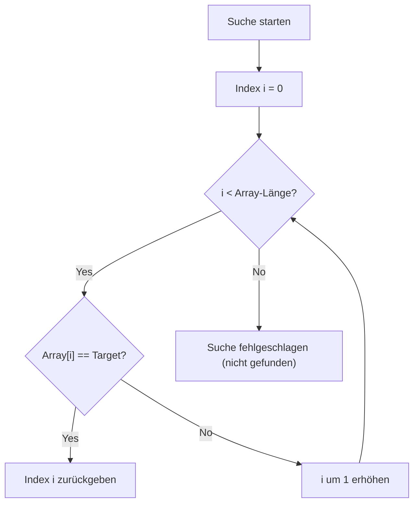
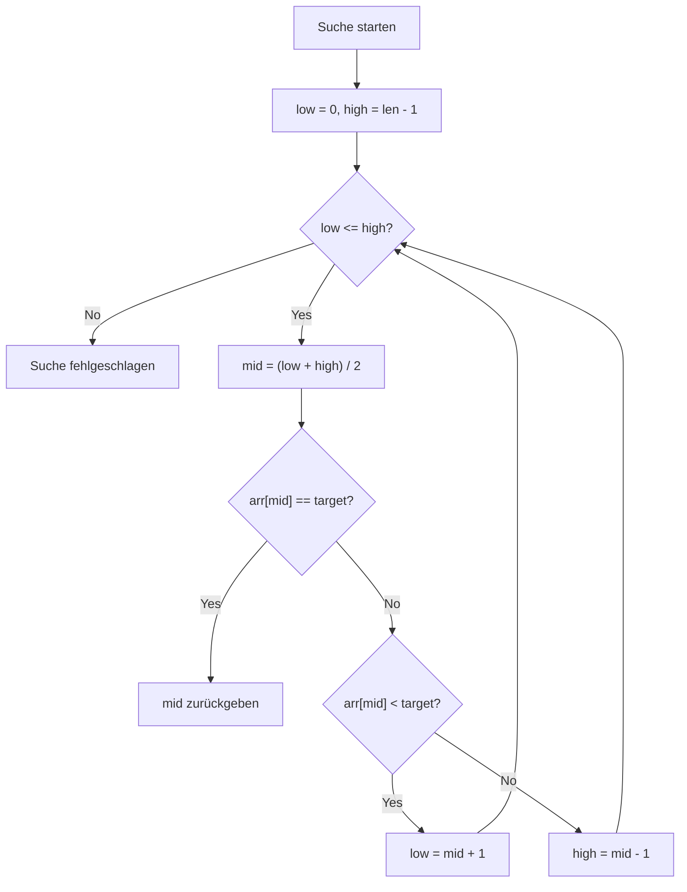
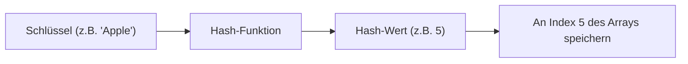
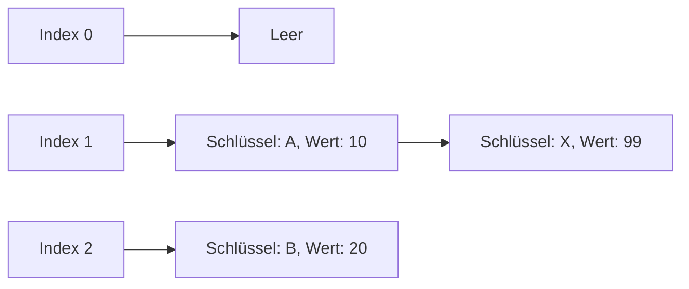

# Grundlagen und Bedeutung von Suchalgorithmen

In der modernen Informatik sind **Suchalgorithmen**, mit denen Zielwerte schnell in Daten gefunden werden können, eine äußerst wichtige Technologie, die die Grundlage jeglicher Software und Systeme bildet. Ob bei der Datenbanksuchen, der Stichwortsuche in Webbrowsern oder der Namenssuche in einer Kontakte-App auf dem Smartphone – wir profitieren täglich von Suchalgorithmen.

In diesem Artikel erklären wir detailliert die Algorithmen „Lineare Suche (Linear Search)“ und „Binäre Suche (Binary Search)“, die Grundlagen der Informatik sind, einschließlich ihrer Funktionsweise, Zeitkomplexität und Implementierungsbeispiele in Python. Darüber hinaus gehen wir tief in die Prinzipien von „Hash-Tabellen (Hash Table)“ ein, die die Grenzen dieser Algorithmen durchbrechen und eine überwältigende Suchgeschwindigkeit ermöglichen, sowie in die Rolle von Hash-Funktionen und Methoden zur Lösung von Hash-Kollisionen (Collision).


Ein tiefes Verständnis von Suchalgorithmen ist unerlässlich, um Ihre Fähigkeiten als Programmierer auf die nächste Stufe zu heben. Bei kleinen Datenmengen mag die Wahl des Algorithmus nur minimale Auswirkungen auf die Leistung haben, aber im Zeitalter von Big Data ist die Wahl des geeigneten Algorithmus und der richtigen Datenstruktur von entscheidender Bedeutung, um in Millionen oder Milliarden von Daten sofort die gewünschten Informationen zu finden. Insbesondere das Verständnis des Konzepts der **Zeitkomplexität** (wie $O(n)$, $O(\log n)$, $O(1)$) ist ein unverzichtbares Element für die Entwicklung effizienter Programme.

Ein tiefes Verständnis von Suchalgorithmen ist unerlässlich, um Ihre Fähigkeiten als Programmierer auf die nächste Stufe zu heben. Bei kleinen Datenmengen mag die Wahl des Algorithmus nur minimale Auswirkungen auf die Leistung haben, aber im Zeitalter von Big Data ist die Wahl des geeigneten Algorithmus und der richtigen Datenstruktur von entscheidender Bedeutung, um in Millionen oder Milliarden von Daten sofort die gewünschten Informationen zu finden. Insbesondere das Verständnis des Konzepts der **Zeitkomplexität** (wie $O(n)$, $O(\log n)$, $O(1)$) ist ein unverzichtbares Element für die Entwicklung effizienter Programme.

Ein tiefes Verständnis von Suchalgorithmen ist unerlässlich, um Ihre Fähigkeiten als Programmierer auf die nächste Stufe zu heben. Bei kleinen Datenmengen mag die Wahl des Algorithmus nur minimale Auswirkungen auf die Leistung haben, aber im Zeitalter von Big Data ist die Wahl des geeigneten Algorithmus und der richtigen Datenstruktur von entscheidender Bedeutung, um in Millionen oder Milliarden von Daten sofort die gewünschten Informationen zu finden. Insbesondere das Verständnis des Konzepts der **Zeitkomplexität** (wie $O(n)$, $O(\log n)$, $O(1)$) ist ein unverzichtbares Element für die Entwicklung effizienter Programme.

Ein tiefes Verständnis von Suchalgorithmen ist unerlässlich, um Ihre Fähigkeiten als Programmierer auf die nächste Stufe zu heben. Bei kleinen Datenmengen mag die Wahl des Algorithmus nur minimale Auswirkungen auf die Leistung haben, aber im Zeitalter von Big Data ist die Wahl des geeigneten Algorithmus und der richtigen Datenstruktur von entscheidender Bedeutung, um in Millionen oder Milliarden von Daten sofort die gewünschten Informationen zu finden. Insbesondere das Verständnis des Konzepts der **Zeitkomplexität** (wie $O(n)$, $O(\log n)$, $O(1)$) ist ein unverzichtbares Element für die Entwicklung effizienter Programme.

Ein tiefes Verständnis von Suchalgorithmen ist unerlässlich, um Ihre Fähigkeiten als Programmierer auf die nächste Stufe zu heben. Bei kleinen Datenmengen mag die Wahl des Algorithmus nur minimale Auswirkungen auf die Leistung haben, aber im Zeitalter von Big Data ist die Wahl des geeigneten Algorithmus und der richtigen Datenstruktur von entscheidender Bedeutung, um in Millionen oder Milliarden von Daten sofort die gewünschten Informationen zu finden. Insbesondere das Verständnis des Konzepts der **Zeitkomplexität** (wie $O(n)$, $O(\log n)$, $O(1)$) ist ein unverzichtbares Element für die Entwicklung effizienter Programme.

Ein tiefes Verständnis von Suchalgorithmen ist unerlässlich, um Ihre Fähigkeiten als Programmierer auf die nächste Stufe zu heben. Bei kleinen Datenmengen mag die Wahl des Algorithmus nur minimale Auswirkungen auf die Leistung haben, aber im Zeitalter von Big Data ist die Wahl des geeigneten Algorithmus und der richtigen Datenstruktur von entscheidender Bedeutung, um in Millionen oder Milliarden von Daten sofort die gewünschten Informationen zu finden. Insbesondere das Verständnis des Konzepts der **Zeitkomplexität** (wie $O(n)$, $O(\log n)$, $O(1)$) ist ein unverzichtbares Element für die Entwicklung effizienter Programme.

Ein tiefes Verständnis von Suchalgorithmen ist unerlässlich, um Ihre Fähigkeiten als Programmierer auf die nächste Stufe zu heben. Bei kleinen Datenmengen mag die Wahl des Algorithmus nur minimale Auswirkungen auf die Leistung haben, aber im Zeitalter von Big Data ist die Wahl des geeigneten Algorithmus und der richtigen Datenstruktur von entscheidender Bedeutung, um in Millionen oder Milliarden von Daten sofort die gewünschten Informationen zu finden. Insbesondere das Verständnis des Konzepts der **Zeitkomplexität** (wie $O(n)$, $O(\log n)$, $O(1)$) ist ein unverzichtbares Element für die Entwicklung effizienter Programme.

Ein tiefes Verständnis von Suchalgorithmen ist unerlässlich, um Ihre Fähigkeiten als Programmierer auf die nächste Stufe zu heben. Bei kleinen Datenmengen mag die Wahl des Algorithmus nur minimale Auswirkungen auf die Leistung haben, aber im Zeitalter von Big Data ist die Wahl des geeigneten Algorithmus und der richtigen Datenstruktur von entscheidender Bedeutung, um in Millionen oder Milliarden von Daten sofort die gewünschten Informationen zu finden. Insbesondere das Verständnis des Konzepts der **Zeitkomplexität** (wie $O(n)$, $O(\log n)$, $O(1)$) ist ein unverzichtbares Element für die Entwicklung effizienter Programme.

Ein tiefes Verständnis von Suchalgorithmen ist unerlässlich, um Ihre Fähigkeiten als Programmierer auf die nächste Stufe zu heben. Bei kleinen Datenmengen mag die Wahl des Algorithmus nur minimale Auswirkungen auf die Leistung haben, aber im Zeitalter von Big Data ist die Wahl des geeigneten Algorithmus und der richtigen Datenstruktur von entscheidender Bedeutung, um in Millionen oder Milliarden von Daten sofort die gewünschten Informationen zu finden. Insbesondere das Verständnis des Konzepts der **Zeitkomplexität** (wie $O(n)$, $O(\log n)$, $O(1)$) ist ein unverzichtbares Element für die Entwicklung effizienter Programme.

Ein tiefes Verständnis von Suchalgorithmen ist unerlässlich, um Ihre Fähigkeiten als Programmierer auf die nächste Stufe zu heben. Bei kleinen Datenmengen mag die Wahl des Algorithmus nur minimale Auswirkungen auf die Leistung haben, aber im Zeitalter von Big Data ist die Wahl des geeigneten Algorithmus und der richtigen Datenstruktur von entscheidender Bedeutung, um in Millionen oder Milliarden von Daten sofort die gewünschten Informationen zu finden. Insbesondere das Verständnis des Konzepts der **Zeitkomplexität** (wie $O(n)$, $O(\log n)$, $O(1)$) ist ein unverzichtbares Element für die Entwicklung effizienter Programme.

## 1. Lineare Suche (Linear Search)

Die lineare Suche ist der einfachste und intuitivste Suchalgorithmus. Sie überprüft nacheinander jedes Element einer Datenstruktur (wie eines Arrays oder einer Liste) vom Anfang bis zum Ende, bis der Zielwert gefunden ist.

### 1.1 Funktionsweise der linearen Suche

Der Algorithmus der linearen Suche verläuft in folgenden Schritten:

1. Entnehmen Sie das erste Element des Arrays.
2. Überprüfen Sie, ob das entnommene Element mit dem Zielwert (Target) übereinstimmt.
3. Wenn es übereinstimmt, wird der Index (die Position) des Elements zurückgegeben und die Suche beendet.
4. Wenn es nicht übereinstimmt, gehen Sie zum nächsten Element über.
5. Überprüfen Sie bis zum Ende des Arrays. Wenn das Ziel nicht gefunden wurde, wird die Suche als fehlgeschlagen beendet (z. B. durch Rückgabe von `-1` oder `None`).



### 1.2 Implementierung der linearen Suche in Python

Im Folgenden finden Sie ein einfaches Implementierungsbeispiel für die lineare Suche in Python.

```python
def linear_search(arr, target):
    """
    Funktion zur Ausführung der linearen Suche
    :param arr: Zu durchsuchende Liste
    :param target: Zu findender Wert
    :return: Index, falls gefunden, andernfalls -1
    """
    for i in range(len(arr)):
        if arr[i] == target:
            return i
    return -1

# Testdaten
numbers = [10, 23, 4, 15, 2, 7, 34, 11]
target_value = 7

result_index = linear_search(numbers, target_value)
if result_index != -1:
    print(f"Element {target_value} wurde an Index {result_index} gefunden.")
else:
    print(f"Element {target_value} ist nicht in der Liste vorhanden.")
```


Das Hauptmerkmal der linearen Suche ist, dass die Daten nicht sortiert sein müssen. Selbst wenn die Daten in zufälliger Reihenfolge gespeichert sind, kann der Zielwert sicher gefunden (oder sein Fehlen bestätigt) werden, da nacheinander vom Anfang an geprüft wird. Diese Eigenschaft, „alles der Reihe nach zu überprüfen“, ist jedoch der Hauptgrund für Leistungseinbußen, wenn die Datenmenge groß wird.

Das Hauptmerkmal der linearen Suche ist, dass die Daten nicht sortiert sein müssen. Selbst wenn die Daten in zufälliger Reihenfolge gespeichert sind, kann der Zielwert sicher gefunden (oder sein Fehlen bestätigt) werden, da nacheinander vom Anfang an geprüft wird. Diese Eigenschaft, „alles der Reihe nach zu überprüfen“, ist jedoch der Hauptgrund für Leistungseinbußen, wenn die Datenmenge groß wird.

Das Hauptmerkmal der linearen Suche ist, dass die Daten nicht sortiert sein müssen. Selbst wenn die Daten in zufälliger Reihenfolge gespeichert sind, kann der Zielwert sicher gefunden (oder sein Fehlen bestätigt) werden, da nacheinander vom Anfang an geprüft wird. Diese Eigenschaft, „alles der Reihe nach zu überprüfen“, ist jedoch der Hauptgrund für Leistungseinbußen, wenn die Datenmenge groß wird.

Das Hauptmerkmal der linearen Suche ist, dass die Daten nicht sortiert sein müssen. Selbst wenn die Daten in zufälliger Reihenfolge gespeichert sind, kann der Zielwert sicher gefunden (oder sein Fehlen bestätigt) werden, da nacheinander vom Anfang an geprüft wird. Diese Eigenschaft, „alles der Reihe nach zu überprüfen“, ist jedoch der Hauptgrund für Leistungseinbußen, wenn die Datenmenge groß wird.

Das Hauptmerkmal der linearen Suche ist, dass die Daten nicht sortiert sein müssen. Selbst wenn die Daten in zufälliger Reihenfolge gespeichert sind, kann der Zielwert sicher gefunden (oder sein Fehlen bestätigt) werden, da nacheinander vom Anfang an geprüft wird. Diese Eigenschaft, „alles der Reihe nach zu überprüfen“, ist jedoch der Hauptgrund für Leistungseinbußen, wenn die Datenmenge groß wird.

Das Hauptmerkmal der linearen Suche ist, dass die Daten nicht sortiert sein müssen. Selbst wenn die Daten in zufälliger Reihenfolge gespeichert sind, kann der Zielwert sicher gefunden (oder sein Fehlen bestätigt) werden, da nacheinander vom Anfang an geprüft wird. Diese Eigenschaft, „alles der Reihe nach zu überprüfen“, ist jedoch der Hauptgrund für Leistungseinbußen, wenn die Datenmenge groß wird.

Das Hauptmerkmal der linearen Suche ist, dass die Daten nicht sortiert sein müssen. Selbst wenn die Daten in zufälliger Reihenfolge gespeichert sind, kann der Zielwert sicher gefunden (oder sein Fehlen bestätigt) werden, da nacheinander vom Anfang an geprüft wird. Diese Eigenschaft, „alles der Reihe nach zu überprüfen“, ist jedoch der Hauptgrund für Leistungseinbußen, wenn die Datenmenge groß wird.

Das Hauptmerkmal der linearen Suche ist, dass die Daten nicht sortiert sein müssen. Selbst wenn die Daten in zufälliger Reihenfolge gespeichert sind, kann der Zielwert sicher gefunden (oder sein Fehlen bestätigt) werden, da nacheinander vom Anfang an geprüft wird. Diese Eigenschaft, „alles der Reihe nach zu überprüfen“, ist jedoch der Hauptgrund für Leistungseinbußen, wenn die Datenmenge groß wird.

Das Hauptmerkmal der linearen Suche ist, dass die Daten nicht sortiert sein müssen. Selbst wenn die Daten in zufälliger Reihenfolge gespeichert sind, kann der Zielwert sicher gefunden (oder sein Fehlen bestätigt) werden, da nacheinander vom Anfang an geprüft wird. Diese Eigenschaft, „alles der Reihe nach zu überprüfen“, ist jedoch der Hauptgrund für Leistungseinbußen, wenn die Datenmenge groß wird.

Das Hauptmerkmal der linearen Suche ist, dass die Daten nicht sortiert sein müssen. Selbst wenn die Daten in zufälliger Reihenfolge gespeichert sind, kann der Zielwert sicher gefunden (oder sein Fehlen bestätigt) werden, da nacheinander vom Anfang an geprüft wird. Diese Eigenschaft, „alles der Reihe nach zu überprüfen“, ist jedoch der Hauptgrund für Leistungseinbußen, wenn die Datenmenge groß wird.

Das Hauptmerkmal der linearen Suche ist, dass die Daten nicht sortiert sein müssen. Selbst wenn die Daten in zufälliger Reihenfolge gespeichert sind, kann der Zielwert sicher gefunden (oder sein Fehlen bestätigt) werden, da nacheinander vom Anfang an geprüft wird. Diese Eigenschaft, „alles der Reihe nach zu überprüfen“, ist jedoch der Hauptgrund für Leistungseinbußen, wenn die Datenmenge groß wird.

Das Hauptmerkmal der linearen Suche ist, dass die Daten nicht sortiert sein müssen. Selbst wenn die Daten in zufälliger Reihenfolge gespeichert sind, kann der Zielwert sicher gefunden (oder sein Fehlen bestätigt) werden, da nacheinander vom Anfang an geprüft wird. Diese Eigenschaft, „alles der Reihe nach zu überprüfen“, ist jedoch der Hauptgrund für Leistungseinbußen, wenn die Datenmenge groß wird.

Das Hauptmerkmal der linearen Suche ist, dass die Daten nicht sortiert sein müssen. Selbst wenn die Daten in zufälliger Reihenfolge gespeichert sind, kann der Zielwert sicher gefunden (oder sein Fehlen bestätigt) werden, da nacheinander vom Anfang an geprüft wird. Diese Eigenschaft, „alles der Reihe nach zu überprüfen“, ist jedoch der Hauptgrund für Leistungseinbußen, wenn die Datenmenge groß wird.

Das Hauptmerkmal der linearen Suche ist, dass die Daten nicht sortiert sein müssen. Selbst wenn die Daten in zufälliger Reihenfolge gespeichert sind, kann der Zielwert sicher gefunden (oder sein Fehlen bestätigt) werden, da nacheinander vom Anfang an geprüft wird. Diese Eigenschaft, „alles der Reihe nach zu überprüfen“, ist jedoch der Hauptgrund für Leistungseinbußen, wenn die Datenmenge groß wird.

Das Hauptmerkmal der linearen Suche ist, dass die Daten nicht sortiert sein müssen. Selbst wenn die Daten in zufälliger Reihenfolge gespeichert sind, kann der Zielwert sicher gefunden (oder sein Fehlen bestätigt) werden, da nacheinander vom Anfang an geprüft wird. Diese Eigenschaft, „alles der Reihe nach zu überprüfen“, ist jedoch der Hauptgrund für Leistungseinbußen, wenn die Datenmenge groß wird.

Das Hauptmerkmal der linearen Suche ist, dass die Daten nicht sortiert sein müssen. Selbst wenn die Daten in zufälliger Reihenfolge gespeichert sind, kann der Zielwert sicher gefunden (oder sein Fehlen bestätigt) werden, da nacheinander vom Anfang an geprüft wird. Diese Eigenschaft, „alles der Reihe nach zu überprüfen“, ist jedoch der Hauptgrund für Leistungseinbußen, wenn die Datenmenge groß wird.

Das Hauptmerkmal der linearen Suche ist, dass die Daten nicht sortiert sein müssen. Selbst wenn die Daten in zufälliger Reihenfolge gespeichert sind, kann der Zielwert sicher gefunden (oder sein Fehlen bestätigt) werden, da nacheinander vom Anfang an geprüft wird. Diese Eigenschaft, „alles der Reihe nach zu überprüfen“, ist jedoch der Hauptgrund für Leistungseinbußen, wenn die Datenmenge groß wird.

Das Hauptmerkmal der linearen Suche ist, dass die Daten nicht sortiert sein müssen. Selbst wenn die Daten in zufälliger Reihenfolge gespeichert sind, kann der Zielwert sicher gefunden (oder sein Fehlen bestätigt) werden, da nacheinander vom Anfang an geprüft wird. Diese Eigenschaft, „alles der Reihe nach zu überprüfen“, ist jedoch der Hauptgrund für Leistungseinbußen, wenn die Datenmenge groß wird.

Das Hauptmerkmal der linearen Suche ist, dass die Daten nicht sortiert sein müssen. Selbst wenn die Daten in zufälliger Reihenfolge gespeichert sind, kann der Zielwert sicher gefunden (oder sein Fehlen bestätigt) werden, da nacheinander vom Anfang an geprüft wird. Diese Eigenschaft, „alles der Reihe nach zu überprüfen“, ist jedoch der Hauptgrund für Leistungseinbußen, wenn die Datenmenge groß wird.

Das Hauptmerkmal der linearen Suche ist, dass die Daten nicht sortiert sein müssen. Selbst wenn die Daten in zufälliger Reihenfolge gespeichert sind, kann der Zielwert sicher gefunden (oder sein Fehlen bestätigt) werden, da nacheinander vom Anfang an geprüft wird. Diese Eigenschaft, „alles der Reihe nach zu überprüfen“, ist jedoch der Hauptgrund für Leistungseinbußen, wenn die Datenmenge groß wird.

Das Hauptmerkmal der linearen Suche ist, dass die Daten nicht sortiert sein müssen. Selbst wenn die Daten in zufälliger Reihenfolge gespeichert sind, kann der Zielwert sicher gefunden (oder sein Fehlen bestätigt) werden, da nacheinander vom Anfang an geprüft wird. Diese Eigenschaft, „alles der Reihe nach zu überprüfen“, ist jedoch der Hauptgrund für Leistungseinbußen, wenn die Datenmenge groß wird.

Das Hauptmerkmal der linearen Suche ist, dass die Daten nicht sortiert sein müssen. Selbst wenn die Daten in zufälliger Reihenfolge gespeichert sind, kann der Zielwert sicher gefunden (oder sein Fehlen bestätigt) werden, da nacheinander vom Anfang an geprüft wird. Diese Eigenschaft, „alles der Reihe nach zu überprüfen“, ist jedoch der Hauptgrund für Leistungseinbußen, wenn die Datenmenge groß wird.

Das Hauptmerkmal der linearen Suche ist, dass die Daten nicht sortiert sein müssen. Selbst wenn die Daten in zufälliger Reihenfolge gespeichert sind, kann der Zielwert sicher gefunden (oder sein Fehlen bestätigt) werden, da nacheinander vom Anfang an geprüft wird. Diese Eigenschaft, „alles der Reihe nach zu überprüfen“, ist jedoch der Hauptgrund für Leistungseinbußen, wenn die Datenmenge groß wird.

Das Hauptmerkmal der linearen Suche ist, dass die Daten nicht sortiert sein müssen. Selbst wenn die Daten in zufälliger Reihenfolge gespeichert sind, kann der Zielwert sicher gefunden (oder sein Fehlen bestätigt) werden, da nacheinander vom Anfang an geprüft wird. Diese Eigenschaft, „alles der Reihe nach zu überprüfen“, ist jedoch der Hauptgrund für Leistungseinbußen, wenn die Datenmenge groß wird.

Das Hauptmerkmal der linearen Suche ist, dass die Daten nicht sortiert sein müssen. Selbst wenn die Daten in zufälliger Reihenfolge gespeichert sind, kann der Zielwert sicher gefunden (oder sein Fehlen bestätigt) werden, da nacheinander vom Anfang an geprüft wird. Diese Eigenschaft, „alles der Reihe nach zu überprüfen“, ist jedoch der Hauptgrund für Leistungseinbußen, wenn die Datenmenge groß wird.

Das Hauptmerkmal der linearen Suche ist, dass die Daten nicht sortiert sein müssen. Selbst wenn die Daten in zufälliger Reihenfolge gespeichert sind, kann der Zielwert sicher gefunden (oder sein Fehlen bestätigt) werden, da nacheinander vom Anfang an geprüft wird. Diese Eigenschaft, „alles der Reihe nach zu überprüfen“, ist jedoch der Hauptgrund für Leistungseinbußen, wenn die Datenmenge groß wird.

Das Hauptmerkmal der linearen Suche ist, dass die Daten nicht sortiert sein müssen. Selbst wenn die Daten in zufälliger Reihenfolge gespeichert sind, kann der Zielwert sicher gefunden (oder sein Fehlen bestätigt) werden, da nacheinander vom Anfang an geprüft wird. Diese Eigenschaft, „alles der Reihe nach zu überprüfen“, ist jedoch der Hauptgrund für Leistungseinbußen, wenn die Datenmenge groß wird.

Das Hauptmerkmal der linearen Suche ist, dass die Daten nicht sortiert sein müssen. Selbst wenn die Daten in zufälliger Reihenfolge gespeichert sind, kann der Zielwert sicher gefunden (oder sein Fehlen bestätigt) werden, da nacheinander vom Anfang an geprüft wird. Diese Eigenschaft, „alles der Reihe nach zu überprüfen“, ist jedoch der Hauptgrund für Leistungseinbußen, wenn die Datenmenge groß wird.

Das Hauptmerkmal der linearen Suche ist, dass die Daten nicht sortiert sein müssen. Selbst wenn die Daten in zufälliger Reihenfolge gespeichert sind, kann der Zielwert sicher gefunden (oder sein Fehlen bestätigt) werden, da nacheinander vom Anfang an geprüft wird. Diese Eigenschaft, „alles der Reihe nach zu überprüfen“, ist jedoch der Hauptgrund für Leistungseinbußen, wenn die Datenmenge groß wird.

Das Hauptmerkmal der linearen Suche ist, dass die Daten nicht sortiert sein müssen. Selbst wenn die Daten in zufälliger Reihenfolge gespeichert sind, kann der Zielwert sicher gefunden (oder sein Fehlen bestätigt) werden, da nacheinander vom Anfang an geprüft wird. Diese Eigenschaft, „alles der Reihe nach zu überprüfen“, ist jedoch der Hauptgrund für Leistungseinbußen, wenn die Datenmenge groß wird.

Das Hauptmerkmal der linearen Suche ist, dass die Daten nicht sortiert sein müssen. Selbst wenn die Daten in zufälliger Reihenfolge gespeichert sind, kann der Zielwert sicher gefunden (oder sein Fehlen bestätigt) werden, da nacheinander vom Anfang an geprüft wird. Diese Eigenschaft, „alles der Reihe nach zu überprüfen“, ist jedoch der Hauptgrund für Leistungseinbußen, wenn die Datenmenge groß wird.

Das Hauptmerkmal der linearen Suche ist, dass die Daten nicht sortiert sein müssen. Selbst wenn die Daten in zufälliger Reihenfolge gespeichert sind, kann der Zielwert sicher gefunden (oder sein Fehlen bestätigt) werden, da nacheinander vom Anfang an geprüft wird. Diese Eigenschaft, „alles der Reihe nach zu überprüfen“, ist jedoch der Hauptgrund für Leistungseinbußen, wenn die Datenmenge groß wird.

Das Hauptmerkmal der linearen Suche ist, dass die Daten nicht sortiert sein müssen. Selbst wenn die Daten in zufälliger Reihenfolge gespeichert sind, kann der Zielwert sicher gefunden (oder sein Fehlen bestätigt) werden, da nacheinander vom Anfang an geprüft wird. Diese Eigenschaft, „alles der Reihe nach zu überprüfen“, ist jedoch der Hauptgrund für Leistungseinbußen, wenn die Datenmenge groß wird.

Das Hauptmerkmal der linearen Suche ist, dass die Daten nicht sortiert sein müssen. Selbst wenn die Daten in zufälliger Reihenfolge gespeichert sind, kann der Zielwert sicher gefunden (oder sein Fehlen bestätigt) werden, da nacheinander vom Anfang an geprüft wird. Diese Eigenschaft, „alles der Reihe nach zu überprüfen“, ist jedoch der Hauptgrund für Leistungseinbußen, wenn die Datenmenge groß wird.

Das Hauptmerkmal der linearen Suche ist, dass die Daten nicht sortiert sein müssen. Selbst wenn die Daten in zufälliger Reihenfolge gespeichert sind, kann der Zielwert sicher gefunden (oder sein Fehlen bestätigt) werden, da nacheinander vom Anfang an geprüft wird. Diese Eigenschaft, „alles der Reihe nach zu überprüfen“, ist jedoch der Hauptgrund für Leistungseinbußen, wenn die Datenmenge groß wird.

Das Hauptmerkmal der linearen Suche ist, dass die Daten nicht sortiert sein müssen. Selbst wenn die Daten in zufälliger Reihenfolge gespeichert sind, kann der Zielwert sicher gefunden (oder sein Fehlen bestätigt) werden, da nacheinander vom Anfang an geprüft wird. Diese Eigenschaft, „alles der Reihe nach zu überprüfen“, ist jedoch der Hauptgrund für Leistungseinbußen, wenn die Datenmenge groß wird.

Das Hauptmerkmal der linearen Suche ist, dass die Daten nicht sortiert sein müssen. Selbst wenn die Daten in zufälliger Reihenfolge gespeichert sind, kann der Zielwert sicher gefunden (oder sein Fehlen bestätigt) werden, da nacheinander vom Anfang an geprüft wird. Diese Eigenschaft, „alles der Reihe nach zu überprüfen“, ist jedoch der Hauptgrund für Leistungseinbußen, wenn die Datenmenge groß wird.

Das Hauptmerkmal der linearen Suche ist, dass die Daten nicht sortiert sein müssen. Selbst wenn die Daten in zufälliger Reihenfolge gespeichert sind, kann der Zielwert sicher gefunden (oder sein Fehlen bestätigt) werden, da nacheinander vom Anfang an geprüft wird. Diese Eigenschaft, „alles der Reihe nach zu überprüfen“, ist jedoch der Hauptgrund für Leistungseinbußen, wenn die Datenmenge groß wird.

Das Hauptmerkmal der linearen Suche ist, dass die Daten nicht sortiert sein müssen. Selbst wenn die Daten in zufälliger Reihenfolge gespeichert sind, kann der Zielwert sicher gefunden (oder sein Fehlen bestätigt) werden, da nacheinander vom Anfang an geprüft wird. Diese Eigenschaft, „alles der Reihe nach zu überprüfen“, ist jedoch der Hauptgrund für Leistungseinbußen, wenn die Datenmenge groß wird.

Das Hauptmerkmal der linearen Suche ist, dass die Daten nicht sortiert sein müssen. Selbst wenn die Daten in zufälliger Reihenfolge gespeichert sind, kann der Zielwert sicher gefunden (oder sein Fehlen bestätigt) werden, da nacheinander vom Anfang an geprüft wird. Diese Eigenschaft, „alles der Reihe nach zu überprüfen“, ist jedoch der Hauptgrund für Leistungseinbußen, wenn die Datenmenge groß wird.

Das Hauptmerkmal der linearen Suche ist, dass die Daten nicht sortiert sein müssen. Selbst wenn die Daten in zufälliger Reihenfolge gespeichert sind, kann der Zielwert sicher gefunden (oder sein Fehlen bestätigt) werden, da nacheinander vom Anfang an geprüft wird. Diese Eigenschaft, „alles der Reihe nach zu überprüfen“, ist jedoch der Hauptgrund für Leistungseinbußen, wenn die Datenmenge groß wird.

Das Hauptmerkmal der linearen Suche ist, dass die Daten nicht sortiert sein müssen. Selbst wenn die Daten in zufälliger Reihenfolge gespeichert sind, kann der Zielwert sicher gefunden (oder sein Fehlen bestätigt) werden, da nacheinander vom Anfang an geprüft wird. Diese Eigenschaft, „alles der Reihe nach zu überprüfen“, ist jedoch der Hauptgrund für Leistungseinbußen, wenn die Datenmenge groß wird.

Das Hauptmerkmal der linearen Suche ist, dass die Daten nicht sortiert sein müssen. Selbst wenn die Daten in zufälliger Reihenfolge gespeichert sind, kann der Zielwert sicher gefunden (oder sein Fehlen bestätigt) werden, da nacheinander vom Anfang an geprüft wird. Diese Eigenschaft, „alles der Reihe nach zu überprüfen“, ist jedoch der Hauptgrund für Leistungseinbußen, wenn die Datenmenge groß wird.

Das Hauptmerkmal der linearen Suche ist, dass die Daten nicht sortiert sein müssen. Selbst wenn die Daten in zufälliger Reihenfolge gespeichert sind, kann der Zielwert sicher gefunden (oder sein Fehlen bestätigt) werden, da nacheinander vom Anfang an geprüft wird. Diese Eigenschaft, „alles der Reihe nach zu überprüfen“, ist jedoch der Hauptgrund für Leistungseinbußen, wenn die Datenmenge groß wird.

Das Hauptmerkmal der linearen Suche ist, dass die Daten nicht sortiert sein müssen. Selbst wenn die Daten in zufälliger Reihenfolge gespeichert sind, kann der Zielwert sicher gefunden (oder sein Fehlen bestätigt) werden, da nacheinander vom Anfang an geprüft wird. Diese Eigenschaft, „alles der Reihe nach zu überprüfen“, ist jedoch der Hauptgrund für Leistungseinbußen, wenn die Datenmenge groß wird.

Das Hauptmerkmal der linearen Suche ist, dass die Daten nicht sortiert sein müssen. Selbst wenn die Daten in zufälliger Reihenfolge gespeichert sind, kann der Zielwert sicher gefunden (oder sein Fehlen bestätigt) werden, da nacheinander vom Anfang an geprüft wird. Diese Eigenschaft, „alles der Reihe nach zu überprüfen“, ist jedoch der Hauptgrund für Leistungseinbußen, wenn die Datenmenge groß wird.

Das Hauptmerkmal der linearen Suche ist, dass die Daten nicht sortiert sein müssen. Selbst wenn die Daten in zufälliger Reihenfolge gespeichert sind, kann der Zielwert sicher gefunden (oder sein Fehlen bestätigt) werden, da nacheinander vom Anfang an geprüft wird. Diese Eigenschaft, „alles der Reihe nach zu überprüfen“, ist jedoch der Hauptgrund für Leistungseinbußen, wenn die Datenmenge groß wird.

Das Hauptmerkmal der linearen Suche ist, dass die Daten nicht sortiert sein müssen. Selbst wenn die Daten in zufälliger Reihenfolge gespeichert sind, kann der Zielwert sicher gefunden (oder sein Fehlen bestätigt) werden, da nacheinander vom Anfang an geprüft wird. Diese Eigenschaft, „alles der Reihe nach zu überprüfen“, ist jedoch der Hauptgrund für Leistungseinbußen, wenn die Datenmenge groß wird.

Das Hauptmerkmal der linearen Suche ist, dass die Daten nicht sortiert sein müssen. Selbst wenn die Daten in zufälliger Reihenfolge gespeichert sind, kann der Zielwert sicher gefunden (oder sein Fehlen bestätigt) werden, da nacheinander vom Anfang an geprüft wird. Diese Eigenschaft, „alles der Reihe nach zu überprüfen“, ist jedoch der Hauptgrund für Leistungseinbußen, wenn die Datenmenge groß wird.

Das Hauptmerkmal der linearen Suche ist, dass die Daten nicht sortiert sein müssen. Selbst wenn die Daten in zufälliger Reihenfolge gespeichert sind, kann der Zielwert sicher gefunden (oder sein Fehlen bestätigt) werden, da nacheinander vom Anfang an geprüft wird. Diese Eigenschaft, „alles der Reihe nach zu überprüfen“, ist jedoch der Hauptgrund für Leistungseinbußen, wenn die Datenmenge groß wird.

## 2. Binäre Suche (Binary Search)

Die binäre Suche ist ein sehr schneller und effizienter Suchalgorithmus, der nur auf **vorab sortierte Daten (aufsteigend oder absteigend)** angewendet werden kann. Durch schrittweises Halbieren des Suchbereichs wird die Zeitkomplexität drastisch reduziert.

### 2.1 Funktionsweise der binären Suche

Die binäre Suche wird in folgenden Schritten durchgeführt:

1. Initialisieren Sie die Indizes für das „linke Ende (`low`)“ und das „rechte Ende (`high`)“ des zu durchsuchenden Arrays.
2. Solange der Suchbereich gültig ist (`low <= high`), wiederholen Sie die folgenden Schritte.
3. Berechnen Sie den Index in der Mitte (`mid`) des Suchbereichs.
4. Vergleichen Sie das mittlere Element (`arr[mid]`) mit dem Zielwert (Target).
5. Wenn es übereinstimmt, geben Sie `mid` zurück und beenden Sie den Vorgang.
6. Wenn das mittlere Element kleiner als das Target ist, muss sich das Target in der rechten Hälfte befinden. Aktualisieren Sie daher das linke Ende auf `mid + 1`.
7. Wenn das mittlere Element größer als das Target ist, muss sich das Target in der linken Hälfte befinden. Aktualisieren Sie daher das rechte Ende auf `mid - 1`.
8. Wenn der Suchbereich aufgebraucht ist und nichts gefunden wurde, schlägt die Suche fehl.



### 2.2 Implementierung der binären Suche in Python (Iterativer Ansatz)

```python
def binary_search(arr, target):
    """
    Funktion zur Ausführung der binären Suche (iterativ)
    :param arr: Sortierte, zu durchsuchende Liste
    :param target: Zu findender Wert
    :return: Index, falls gefunden, andernfalls -1
    """
    low = 0
    high = len(arr) - 1

    while low <= high:
        mid = (low + high) // 2
        
        if arr[mid] == target:
            return mid
        elif arr[mid] < target:
            low = mid + 1
        else:
            high = mid - 1
            
    return -1

# Testdaten（ソート済みである必要がある）
sorted_numbers = [2, 4, 7, 10, 11, 15, 23, 34]
target_value = 15

result_index = binary_search(sorted_numbers, target_value)
if result_index != -1:
    print(f"Element {target_value} wurde an Index {result_index} gefunden.")
else:
    print(f"Element {target_value} ist nicht in der Liste vorhanden.")
```

Die erstaunliche Leistung der binären Suche resultiert aus der Eigenschaft, den Suchbereich bei jedem Schritt in zwei Hälften zu teilen. Beispielsweise erfordert eine lineare Suche in einem Array mit 1 Million Elementen im schlimmsten Fall 1 Million Vergleiche. Mit der binären Suche kann der Zielwert jedoch in nur etwa 20 Vergleichen gefunden werden ($2^{20} \approx 1.000.000$). Daher ist die binäre Suche bei Suchoperationen in großen Datensätzen der linearen Suche haushoch überlegen. Mathematisch ausgedrückt beträgt die Zeitkomplexität der binären Suche $O(\log n)$.

Die erstaunliche Leistung der binären Suche resultiert aus der Eigenschaft, den Suchbereich bei jedem Schritt in zwei Hälften zu teilen. Beispielsweise erfordert eine lineare Suche in einem Array mit 1 Million Elementen im schlimmsten Fall 1 Million Vergleiche. Mit der binären Suche kann der Zielwert jedoch in nur etwa 20 Vergleichen gefunden werden ($2^{20} \approx 1.000.000$). Daher ist die binäre Suche bei Suchoperationen in großen Datensätzen der linearen Suche haushoch überlegen. Mathematisch ausgedrückt beträgt die Zeitkomplexität der binären Suche $O(\log n)$.

Die erstaunliche Leistung der binären Suche resultiert aus der Eigenschaft, den Suchbereich bei jedem Schritt in zwei Hälften zu teilen. Beispielsweise erfordert eine lineare Suche in einem Array mit 1 Million Elementen im schlimmsten Fall 1 Million Vergleiche. Mit der binären Suche kann der Zielwert jedoch in nur etwa 20 Vergleichen gefunden werden ($2^{20} \approx 1.000.000$). Daher ist die binäre Suche bei Suchoperationen in großen Datensätzen der linearen Suche haushoch überlegen. Mathematisch ausgedrückt beträgt die Zeitkomplexität der binären Suche $O(\log n)$.

Die erstaunliche Leistung der binären Suche resultiert aus der Eigenschaft, den Suchbereich bei jedem Schritt in zwei Hälften zu teilen. Beispielsweise erfordert eine lineare Suche in einem Array mit 1 Million Elementen im schlimmsten Fall 1 Million Vergleiche. Mit der binären Suche kann der Zielwert jedoch in nur etwa 20 Vergleichen gefunden werden ($2^{20} \approx 1.000.000$). Daher ist die binäre Suche bei Suchoperationen in großen Datensätzen der linearen Suche haushoch überlegen. Mathematisch ausgedrückt beträgt die Zeitkomplexität der binären Suche $O(\log n)$.

Die erstaunliche Leistung der binären Suche resultiert aus der Eigenschaft, den Suchbereich bei jedem Schritt in zwei Hälften zu teilen. Beispielsweise erfordert eine lineare Suche in einem Array mit 1 Million Elementen im schlimmsten Fall 1 Million Vergleiche. Mit der binären Suche kann der Zielwert jedoch in nur etwa 20 Vergleichen gefunden werden ($2^{20} \approx 1.000.000$). Daher ist die binäre Suche bei Suchoperationen in großen Datensätzen der linearen Suche haushoch überlegen. Mathematisch ausgedrückt beträgt die Zeitkomplexität der binären Suche $O(\log n)$.

Die erstaunliche Leistung der binären Suche resultiert aus der Eigenschaft, den Suchbereich bei jedem Schritt in zwei Hälften zu teilen. Beispielsweise erfordert eine lineare Suche in einem Array mit 1 Million Elementen im schlimmsten Fall 1 Million Vergleiche. Mit der binären Suche kann der Zielwert jedoch in nur etwa 20 Vergleichen gefunden werden ($2^{20} \approx 1.000.000$). Daher ist die binäre Suche bei Suchoperationen in großen Datensätzen der linearen Suche haushoch überlegen. Mathematisch ausgedrückt beträgt die Zeitkomplexität der binären Suche $O(\log n)$.

Die erstaunliche Leistung der binären Suche resultiert aus der Eigenschaft, den Suchbereich bei jedem Schritt in zwei Hälften zu teilen. Beispielsweise erfordert eine lineare Suche in einem Array mit 1 Million Elementen im schlimmsten Fall 1 Million Vergleiche. Mit der binären Suche kann der Zielwert jedoch in nur etwa 20 Vergleichen gefunden werden ($2^{20} \approx 1.000.000$). Daher ist die binäre Suche bei Suchoperationen in großen Datensätzen der linearen Suche haushoch überlegen. Mathematisch ausgedrückt beträgt die Zeitkomplexität der binären Suche $O(\log n)$.

Die erstaunliche Leistung der binären Suche resultiert aus der Eigenschaft, den Suchbereich bei jedem Schritt in zwei Hälften zu teilen. Beispielsweise erfordert eine lineare Suche in einem Array mit 1 Million Elementen im schlimmsten Fall 1 Million Vergleiche. Mit der binären Suche kann der Zielwert jedoch in nur etwa 20 Vergleichen gefunden werden ($2^{20} \approx 1.000.000$). Daher ist die binäre Suche bei Suchoperationen in großen Datensätzen der linearen Suche haushoch überlegen. Mathematisch ausgedrückt beträgt die Zeitkomplexität der binären Suche $O(\log n)$.

Die erstaunliche Leistung der binären Suche resultiert aus der Eigenschaft, den Suchbereich bei jedem Schritt in zwei Hälften zu teilen. Beispielsweise erfordert eine lineare Suche in einem Array mit 1 Million Elementen im schlimmsten Fall 1 Million Vergleiche. Mit der binären Suche kann der Zielwert jedoch in nur etwa 20 Vergleichen gefunden werden ($2^{20} \approx 1.000.000$). Daher ist die binäre Suche bei Suchoperationen in großen Datensätzen der linearen Suche haushoch überlegen. Mathematisch ausgedrückt beträgt die Zeitkomplexität der binären Suche $O(\log n)$.

Die erstaunliche Leistung der binären Suche resultiert aus der Eigenschaft, den Suchbereich bei jedem Schritt in zwei Hälften zu teilen. Beispielsweise erfordert eine lineare Suche in einem Array mit 1 Million Elementen im schlimmsten Fall 1 Million Vergleiche. Mit der binären Suche kann der Zielwert jedoch in nur etwa 20 Vergleichen gefunden werden ($2^{20} \approx 1.000.000$). Daher ist die binäre Suche bei Suchoperationen in großen Datensätzen der linearen Suche haushoch überlegen. Mathematisch ausgedrückt beträgt die Zeitkomplexität der binären Suche $O(\log n)$.

Die erstaunliche Leistung der binären Suche resultiert aus der Eigenschaft, den Suchbereich bei jedem Schritt in zwei Hälften zu teilen. Beispielsweise erfordert eine lineare Suche in einem Array mit 1 Million Elementen im schlimmsten Fall 1 Million Vergleiche. Mit der binären Suche kann der Zielwert jedoch in nur etwa 20 Vergleichen gefunden werden ($2^{20} \approx 1.000.000$). Daher ist die binäre Suche bei Suchoperationen in großen Datensätzen der linearen Suche haushoch überlegen. Mathematisch ausgedrückt beträgt die Zeitkomplexität der binären Suche $O(\log n)$.

Die erstaunliche Leistung der binären Suche resultiert aus der Eigenschaft, den Suchbereich bei jedem Schritt in zwei Hälften zu teilen. Beispielsweise erfordert eine lineare Suche in einem Array mit 1 Million Elementen im schlimmsten Fall 1 Million Vergleiche. Mit der binären Suche kann der Zielwert jedoch in nur etwa 20 Vergleichen gefunden werden ($2^{20} \approx 1.000.000$). Daher ist die binäre Suche bei Suchoperationen in großen Datensätzen der linearen Suche haushoch überlegen. Mathematisch ausgedrückt beträgt die Zeitkomplexität der binären Suche $O(\log n)$.

Die erstaunliche Leistung der binären Suche resultiert aus der Eigenschaft, den Suchbereich bei jedem Schritt in zwei Hälften zu teilen. Beispielsweise erfordert eine lineare Suche in einem Array mit 1 Million Elementen im schlimmsten Fall 1 Million Vergleiche. Mit der binären Suche kann der Zielwert jedoch in nur etwa 20 Vergleichen gefunden werden ($2^{20} \approx 1.000.000$). Daher ist die binäre Suche bei Suchoperationen in großen Datensätzen der linearen Suche haushoch überlegen. Mathematisch ausgedrückt beträgt die Zeitkomplexität der binären Suche $O(\log n)$.

Die erstaunliche Leistung der binären Suche resultiert aus der Eigenschaft, den Suchbereich bei jedem Schritt in zwei Hälften zu teilen. Beispielsweise erfordert eine lineare Suche in einem Array mit 1 Million Elementen im schlimmsten Fall 1 Million Vergleiche. Mit der binären Suche kann der Zielwert jedoch in nur etwa 20 Vergleichen gefunden werden ($2^{20} \approx 1.000.000$). Daher ist die binäre Suche bei Suchoperationen in großen Datensätzen der linearen Suche haushoch überlegen. Mathematisch ausgedrückt beträgt die Zeitkomplexität der binären Suche $O(\log n)$.

Die erstaunliche Leistung der binären Suche resultiert aus der Eigenschaft, den Suchbereich bei jedem Schritt in zwei Hälften zu teilen. Beispielsweise erfordert eine lineare Suche in einem Array mit 1 Million Elementen im schlimmsten Fall 1 Million Vergleiche. Mit der binären Suche kann der Zielwert jedoch in nur etwa 20 Vergleichen gefunden werden ($2^{20} \approx 1.000.000$). Daher ist die binäre Suche bei Suchoperationen in großen Datensätzen der linearen Suche haushoch überlegen. Mathematisch ausgedrückt beträgt die Zeitkomplexität der binären Suche $O(\log n)$.

Die erstaunliche Leistung der binären Suche resultiert aus der Eigenschaft, den Suchbereich bei jedem Schritt in zwei Hälften zu teilen. Beispielsweise erfordert eine lineare Suche in einem Array mit 1 Million Elementen im schlimmsten Fall 1 Million Vergleiche. Mit der binären Suche kann der Zielwert jedoch in nur etwa 20 Vergleichen gefunden werden ($2^{20} \approx 1.000.000$). Daher ist die binäre Suche bei Suchoperationen in großen Datensätzen der linearen Suche haushoch überlegen. Mathematisch ausgedrückt beträgt die Zeitkomplexität der binären Suche $O(\log n)$.

Die erstaunliche Leistung der binären Suche resultiert aus der Eigenschaft, den Suchbereich bei jedem Schritt in zwei Hälften zu teilen. Beispielsweise erfordert eine lineare Suche in einem Array mit 1 Million Elementen im schlimmsten Fall 1 Million Vergleiche. Mit der binären Suche kann der Zielwert jedoch in nur etwa 20 Vergleichen gefunden werden ($2^{20} \approx 1.000.000$). Daher ist die binäre Suche bei Suchoperationen in großen Datensätzen der linearen Suche haushoch überlegen. Mathematisch ausgedrückt beträgt die Zeitkomplexität der binären Suche $O(\log n)$.

Die erstaunliche Leistung der binären Suche resultiert aus der Eigenschaft, den Suchbereich bei jedem Schritt in zwei Hälften zu teilen. Beispielsweise erfordert eine lineare Suche in einem Array mit 1 Million Elementen im schlimmsten Fall 1 Million Vergleiche. Mit der binären Suche kann der Zielwert jedoch in nur etwa 20 Vergleichen gefunden werden ($2^{20} \approx 1.000.000$). Daher ist die binäre Suche bei Suchoperationen in großen Datensätzen der linearen Suche haushoch überlegen. Mathematisch ausgedrückt beträgt die Zeitkomplexität der binären Suche $O(\log n)$.

Die erstaunliche Leistung der binären Suche resultiert aus der Eigenschaft, den Suchbereich bei jedem Schritt in zwei Hälften zu teilen. Beispielsweise erfordert eine lineare Suche in einem Array mit 1 Million Elementen im schlimmsten Fall 1 Million Vergleiche. Mit der binären Suche kann der Zielwert jedoch in nur etwa 20 Vergleichen gefunden werden ($2^{20} \approx 1.000.000$). Daher ist die binäre Suche bei Suchoperationen in großen Datensätzen der linearen Suche haushoch überlegen. Mathematisch ausgedrückt beträgt die Zeitkomplexität der binären Suche $O(\log n)$.

Die erstaunliche Leistung der binären Suche resultiert aus der Eigenschaft, den Suchbereich bei jedem Schritt in zwei Hälften zu teilen. Beispielsweise erfordert eine lineare Suche in einem Array mit 1 Million Elementen im schlimmsten Fall 1 Million Vergleiche. Mit der binären Suche kann der Zielwert jedoch in nur etwa 20 Vergleichen gefunden werden ($2^{20} \approx 1.000.000$). Daher ist die binäre Suche bei Suchoperationen in großen Datensätzen der linearen Suche haushoch überlegen. Mathematisch ausgedrückt beträgt die Zeitkomplexität der binären Suche $O(\log n)$.

Die erstaunliche Leistung der binären Suche resultiert aus der Eigenschaft, den Suchbereich bei jedem Schritt in zwei Hälften zu teilen. Beispielsweise erfordert eine lineare Suche in einem Array mit 1 Million Elementen im schlimmsten Fall 1 Million Vergleiche. Mit der binären Suche kann der Zielwert jedoch in nur etwa 20 Vergleichen gefunden werden ($2^{20} \approx 1.000.000$). Daher ist die binäre Suche bei Suchoperationen in großen Datensätzen der linearen Suche haushoch überlegen. Mathematisch ausgedrückt beträgt die Zeitkomplexität der binären Suche $O(\log n)$.

Die erstaunliche Leistung der binären Suche resultiert aus der Eigenschaft, den Suchbereich bei jedem Schritt in zwei Hälften zu teilen. Beispielsweise erfordert eine lineare Suche in einem Array mit 1 Million Elementen im schlimmsten Fall 1 Million Vergleiche. Mit der binären Suche kann der Zielwert jedoch in nur etwa 20 Vergleichen gefunden werden ($2^{20} \approx 1.000.000$). Daher ist die binäre Suche bei Suchoperationen in großen Datensätzen der linearen Suche haushoch überlegen. Mathematisch ausgedrückt beträgt die Zeitkomplexität der binären Suche $O(\log n)$.

Die erstaunliche Leistung der binären Suche resultiert aus der Eigenschaft, den Suchbereich bei jedem Schritt in zwei Hälften zu teilen. Beispielsweise erfordert eine lineare Suche in einem Array mit 1 Million Elementen im schlimmsten Fall 1 Million Vergleiche. Mit der binären Suche kann der Zielwert jedoch in nur etwa 20 Vergleichen gefunden werden ($2^{20} \approx 1.000.000$). Daher ist die binäre Suche bei Suchoperationen in großen Datensätzen der linearen Suche haushoch überlegen. Mathematisch ausgedrückt beträgt die Zeitkomplexität der binären Suche $O(\log n)$.

Die erstaunliche Leistung der binären Suche resultiert aus der Eigenschaft, den Suchbereich bei jedem Schritt in zwei Hälften zu teilen. Beispielsweise erfordert eine lineare Suche in einem Array mit 1 Million Elementen im schlimmsten Fall 1 Million Vergleiche. Mit der binären Suche kann der Zielwert jedoch in nur etwa 20 Vergleichen gefunden werden ($2^{20} \approx 1.000.000$). Daher ist die binäre Suche bei Suchoperationen in großen Datensätzen der linearen Suche haushoch überlegen. Mathematisch ausgedrückt beträgt die Zeitkomplexität der binären Suche $O(\log n)$.

Die erstaunliche Leistung der binären Suche resultiert aus der Eigenschaft, den Suchbereich bei jedem Schritt in zwei Hälften zu teilen. Beispielsweise erfordert eine lineare Suche in einem Array mit 1 Million Elementen im schlimmsten Fall 1 Million Vergleiche. Mit der binären Suche kann der Zielwert jedoch in nur etwa 20 Vergleichen gefunden werden ($2^{20} \approx 1.000.000$). Daher ist die binäre Suche bei Suchoperationen in großen Datensätzen der linearen Suche haushoch überlegen. Mathematisch ausgedrückt beträgt die Zeitkomplexität der binären Suche $O(\log n)$.

Die erstaunliche Leistung der binären Suche resultiert aus der Eigenschaft, den Suchbereich bei jedem Schritt in zwei Hälften zu teilen. Beispielsweise erfordert eine lineare Suche in einem Array mit 1 Million Elementen im schlimmsten Fall 1 Million Vergleiche. Mit der binären Suche kann der Zielwert jedoch in nur etwa 20 Vergleichen gefunden werden ($2^{20} \approx 1.000.000$). Daher ist die binäre Suche bei Suchoperationen in großen Datensätzen der linearen Suche haushoch überlegen. Mathematisch ausgedrückt beträgt die Zeitkomplexität der binären Suche $O(\log n)$.

Die erstaunliche Leistung der binären Suche resultiert aus der Eigenschaft, den Suchbereich bei jedem Schritt in zwei Hälften zu teilen. Beispielsweise erfordert eine lineare Suche in einem Array mit 1 Million Elementen im schlimmsten Fall 1 Million Vergleiche. Mit der binären Suche kann der Zielwert jedoch in nur etwa 20 Vergleichen gefunden werden ($2^{20} \approx 1.000.000$). Daher ist die binäre Suche bei Suchoperationen in großen Datensätzen der linearen Suche haushoch überlegen. Mathematisch ausgedrückt beträgt die Zeitkomplexität der binären Suche $O(\log n)$.

Die erstaunliche Leistung der binären Suche resultiert aus der Eigenschaft, den Suchbereich bei jedem Schritt in zwei Hälften zu teilen. Beispielsweise erfordert eine lineare Suche in einem Array mit 1 Million Elementen im schlimmsten Fall 1 Million Vergleiche. Mit der binären Suche kann der Zielwert jedoch in nur etwa 20 Vergleichen gefunden werden ($2^{20} \approx 1.000.000$). Daher ist die binäre Suche bei Suchoperationen in großen Datensätzen der linearen Suche haushoch überlegen. Mathematisch ausgedrückt beträgt die Zeitkomplexität der binären Suche $O(\log n)$.

Die erstaunliche Leistung der binären Suche resultiert aus der Eigenschaft, den Suchbereich bei jedem Schritt in zwei Hälften zu teilen. Beispielsweise erfordert eine lineare Suche in einem Array mit 1 Million Elementen im schlimmsten Fall 1 Million Vergleiche. Mit der binären Suche kann der Zielwert jedoch in nur etwa 20 Vergleichen gefunden werden ($2^{20} \approx 1.000.000$). Daher ist die binäre Suche bei Suchoperationen in großen Datensätzen der linearen Suche haushoch überlegen. Mathematisch ausgedrückt beträgt die Zeitkomplexität der binären Suche $O(\log n)$.

Die erstaunliche Leistung der binären Suche resultiert aus der Eigenschaft, den Suchbereich bei jedem Schritt in zwei Hälften zu teilen. Beispielsweise erfordert eine lineare Suche in einem Array mit 1 Million Elementen im schlimmsten Fall 1 Million Vergleiche. Mit der binären Suche kann der Zielwert jedoch in nur etwa 20 Vergleichen gefunden werden ($2^{20} \approx 1.000.000$). Daher ist die binäre Suche bei Suchoperationen in großen Datensätzen der linearen Suche haushoch überlegen. Mathematisch ausgedrückt beträgt die Zeitkomplexität der binären Suche $O(\log n)$.

Die erstaunliche Leistung der binären Suche resultiert aus der Eigenschaft, den Suchbereich bei jedem Schritt in zwei Hälften zu teilen. Beispielsweise erfordert eine lineare Suche in einem Array mit 1 Million Elementen im schlimmsten Fall 1 Million Vergleiche. Mit der binären Suche kann der Zielwert jedoch in nur etwa 20 Vergleichen gefunden werden ($2^{20} \approx 1.000.000$). Daher ist die binäre Suche bei Suchoperationen in großen Datensätzen der linearen Suche haushoch überlegen. Mathematisch ausgedrückt beträgt die Zeitkomplexität der binären Suche $O(\log n)$.

Die erstaunliche Leistung der binären Suche resultiert aus der Eigenschaft, den Suchbereich bei jedem Schritt in zwei Hälften zu teilen. Beispielsweise erfordert eine lineare Suche in einem Array mit 1 Million Elementen im schlimmsten Fall 1 Million Vergleiche. Mit der binären Suche kann der Zielwert jedoch in nur etwa 20 Vergleichen gefunden werden ($2^{20} \approx 1.000.000$). Daher ist die binäre Suche bei Suchoperationen in großen Datensätzen der linearen Suche haushoch überlegen. Mathematisch ausgedrückt beträgt die Zeitkomplexität der binären Suche $O(\log n)$.

Die erstaunliche Leistung der binären Suche resultiert aus der Eigenschaft, den Suchbereich bei jedem Schritt in zwei Hälften zu teilen. Beispielsweise erfordert eine lineare Suche in einem Array mit 1 Million Elementen im schlimmsten Fall 1 Million Vergleiche. Mit der binären Suche kann der Zielwert jedoch in nur etwa 20 Vergleichen gefunden werden ($2^{20} \approx 1.000.000$). Daher ist die binäre Suche bei Suchoperationen in großen Datensätzen der linearen Suche haushoch überlegen. Mathematisch ausgedrückt beträgt die Zeitkomplexität der binären Suche $O(\log n)$.

Die erstaunliche Leistung der binären Suche resultiert aus der Eigenschaft, den Suchbereich bei jedem Schritt in zwei Hälften zu teilen. Beispielsweise erfordert eine lineare Suche in einem Array mit 1 Million Elementen im schlimmsten Fall 1 Million Vergleiche. Mit der binären Suche kann der Zielwert jedoch in nur etwa 20 Vergleichen gefunden werden ($2^{20} \approx 1.000.000$). Daher ist die binäre Suche bei Suchoperationen in großen Datensätzen der linearen Suche haushoch überlegen. Mathematisch ausgedrückt beträgt die Zeitkomplexität der binären Suche $O(\log n)$.

Die erstaunliche Leistung der binären Suche resultiert aus der Eigenschaft, den Suchbereich bei jedem Schritt in zwei Hälften zu teilen. Beispielsweise erfordert eine lineare Suche in einem Array mit 1 Million Elementen im schlimmsten Fall 1 Million Vergleiche. Mit der binären Suche kann der Zielwert jedoch in nur etwa 20 Vergleichen gefunden werden ($2^{20} \approx 1.000.000$). Daher ist die binäre Suche bei Suchoperationen in großen Datensätzen der linearen Suche haushoch überlegen. Mathematisch ausgedrückt beträgt die Zeitkomplexität der binären Suche $O(\log n)$.

Die erstaunliche Leistung der binären Suche resultiert aus der Eigenschaft, den Suchbereich bei jedem Schritt in zwei Hälften zu teilen. Beispielsweise erfordert eine lineare Suche in einem Array mit 1 Million Elementen im schlimmsten Fall 1 Million Vergleiche. Mit der binären Suche kann der Zielwert jedoch in nur etwa 20 Vergleichen gefunden werden ($2^{20} \approx 1.000.000$). Daher ist die binäre Suche bei Suchoperationen in großen Datensätzen der linearen Suche haushoch überlegen. Mathematisch ausgedrückt beträgt die Zeitkomplexität der binären Suche $O(\log n)$.

Die erstaunliche Leistung der binären Suche resultiert aus der Eigenschaft, den Suchbereich bei jedem Schritt in zwei Hälften zu teilen. Beispielsweise erfordert eine lineare Suche in einem Array mit 1 Million Elementen im schlimmsten Fall 1 Million Vergleiche. Mit der binären Suche kann der Zielwert jedoch in nur etwa 20 Vergleichen gefunden werden ($2^{20} \approx 1.000.000$). Daher ist die binäre Suche bei Suchoperationen in großen Datensätzen der linearen Suche haushoch überlegen. Mathematisch ausgedrückt beträgt die Zeitkomplexität der binären Suche $O(\log n)$.

Die erstaunliche Leistung der binären Suche resultiert aus der Eigenschaft, den Suchbereich bei jedem Schritt in zwei Hälften zu teilen. Beispielsweise erfordert eine lineare Suche in einem Array mit 1 Million Elementen im schlimmsten Fall 1 Million Vergleiche. Mit der binären Suche kann der Zielwert jedoch in nur etwa 20 Vergleichen gefunden werden ($2^{20} \approx 1.000.000$). Daher ist die binäre Suche bei Suchoperationen in großen Datensätzen der linearen Suche haushoch überlegen. Mathematisch ausgedrückt beträgt die Zeitkomplexität der binären Suche $O(\log n)$.

Die erstaunliche Leistung der binären Suche resultiert aus der Eigenschaft, den Suchbereich bei jedem Schritt in zwei Hälften zu teilen. Beispielsweise erfordert eine lineare Suche in einem Array mit 1 Million Elementen im schlimmsten Fall 1 Million Vergleiche. Mit der binären Suche kann der Zielwert jedoch in nur etwa 20 Vergleichen gefunden werden ($2^{20} \approx 1.000.000$). Daher ist die binäre Suche bei Suchoperationen in großen Datensätzen der linearen Suche haushoch überlegen. Mathematisch ausgedrückt beträgt die Zeitkomplexität der binären Suche $O(\log n)$.

Die erstaunliche Leistung der binären Suche resultiert aus der Eigenschaft, den Suchbereich bei jedem Schritt in zwei Hälften zu teilen. Beispielsweise erfordert eine lineare Suche in einem Array mit 1 Million Elementen im schlimmsten Fall 1 Million Vergleiche. Mit der binären Suche kann der Zielwert jedoch in nur etwa 20 Vergleichen gefunden werden ($2^{20} \approx 1.000.000$). Daher ist die binäre Suche bei Suchoperationen in großen Datensätzen der linearen Suche haushoch überlegen. Mathematisch ausgedrückt beträgt die Zeitkomplexität der binären Suche $O(\log n)$.

Die erstaunliche Leistung der binären Suche resultiert aus der Eigenschaft, den Suchbereich bei jedem Schritt in zwei Hälften zu teilen. Beispielsweise erfordert eine lineare Suche in einem Array mit 1 Million Elementen im schlimmsten Fall 1 Million Vergleiche. Mit der binären Suche kann der Zielwert jedoch in nur etwa 20 Vergleichen gefunden werden ($2^{20} \approx 1.000.000$). Daher ist die binäre Suche bei Suchoperationen in großen Datensätzen der linearen Suche haushoch überlegen. Mathematisch ausgedrückt beträgt die Zeitkomplexität der binären Suche $O(\log n)$.

Die erstaunliche Leistung der binären Suche resultiert aus der Eigenschaft, den Suchbereich bei jedem Schritt in zwei Hälften zu teilen. Beispielsweise erfordert eine lineare Suche in einem Array mit 1 Million Elementen im schlimmsten Fall 1 Million Vergleiche. Mit der binären Suche kann der Zielwert jedoch in nur etwa 20 Vergleichen gefunden werden ($2^{20} \approx 1.000.000$). Daher ist die binäre Suche bei Suchoperationen in großen Datensätzen der linearen Suche haushoch überlegen. Mathematisch ausgedrückt beträgt die Zeitkomplexität der binären Suche $O(\log n)$.

Die erstaunliche Leistung der binären Suche resultiert aus der Eigenschaft, den Suchbereich bei jedem Schritt in zwei Hälften zu teilen. Beispielsweise erfordert eine lineare Suche in einem Array mit 1 Million Elementen im schlimmsten Fall 1 Million Vergleiche. Mit der binären Suche kann der Zielwert jedoch in nur etwa 20 Vergleichen gefunden werden ($2^{20} \approx 1.000.000$). Daher ist die binäre Suche bei Suchoperationen in großen Datensätzen der linearen Suche haushoch überlegen. Mathematisch ausgedrückt beträgt die Zeitkomplexität der binären Suche $O(\log n)$.

Die erstaunliche Leistung der binären Suche resultiert aus der Eigenschaft, den Suchbereich bei jedem Schritt in zwei Hälften zu teilen. Beispielsweise erfordert eine lineare Suche in einem Array mit 1 Million Elementen im schlimmsten Fall 1 Million Vergleiche. Mit der binären Suche kann der Zielwert jedoch in nur etwa 20 Vergleichen gefunden werden ($2^{20} \approx 1.000.000$). Daher ist die binäre Suche bei Suchoperationen in großen Datensätzen der linearen Suche haushoch überlegen. Mathematisch ausgedrückt beträgt die Zeitkomplexität der binären Suche $O(\log n)$.

Die erstaunliche Leistung der binären Suche resultiert aus der Eigenschaft, den Suchbereich bei jedem Schritt in zwei Hälften zu teilen. Beispielsweise erfordert eine lineare Suche in einem Array mit 1 Million Elementen im schlimmsten Fall 1 Million Vergleiche. Mit der binären Suche kann der Zielwert jedoch in nur etwa 20 Vergleichen gefunden werden ($2^{20} \approx 1.000.000$). Daher ist die binäre Suche bei Suchoperationen in großen Datensätzen der linearen Suche haushoch überlegen. Mathematisch ausgedrückt beträgt die Zeitkomplexität der binären Suche $O(\log n)$.

Die erstaunliche Leistung der binären Suche resultiert aus der Eigenschaft, den Suchbereich bei jedem Schritt in zwei Hälften zu teilen. Beispielsweise erfordert eine lineare Suche in einem Array mit 1 Million Elementen im schlimmsten Fall 1 Million Vergleiche. Mit der binären Suche kann der Zielwert jedoch in nur etwa 20 Vergleichen gefunden werden ($2^{20} \approx 1.000.000$). Daher ist die binäre Suche bei Suchoperationen in großen Datensätzen der linearen Suche haushoch überlegen. Mathematisch ausgedrückt beträgt die Zeitkomplexität der binären Suche $O(\log n)$.

Die erstaunliche Leistung der binären Suche resultiert aus der Eigenschaft, den Suchbereich bei jedem Schritt in zwei Hälften zu teilen. Beispielsweise erfordert eine lineare Suche in einem Array mit 1 Million Elementen im schlimmsten Fall 1 Million Vergleiche. Mit der binären Suche kann der Zielwert jedoch in nur etwa 20 Vergleichen gefunden werden ($2^{20} \approx 1.000.000$). Daher ist die binäre Suche bei Suchoperationen in großen Datensätzen der linearen Suche haushoch überlegen. Mathematisch ausgedrückt beträgt die Zeitkomplexität der binären Suche $O(\log n)$.

Die erstaunliche Leistung der binären Suche resultiert aus der Eigenschaft, den Suchbereich bei jedem Schritt in zwei Hälften zu teilen. Beispielsweise erfordert eine lineare Suche in einem Array mit 1 Million Elementen im schlimmsten Fall 1 Million Vergleiche. Mit der binären Suche kann der Zielwert jedoch in nur etwa 20 Vergleichen gefunden werden ($2^{20} \approx 1.000.000$). Daher ist die binäre Suche bei Suchoperationen in großen Datensätzen der linearen Suche haushoch überlegen. Mathematisch ausgedrückt beträgt die Zeitkomplexität der binären Suche $O(\log n)$.

Die erstaunliche Leistung der binären Suche resultiert aus der Eigenschaft, den Suchbereich bei jedem Schritt in zwei Hälften zu teilen. Beispielsweise erfordert eine lineare Suche in einem Array mit 1 Million Elementen im schlimmsten Fall 1 Million Vergleiche. Mit der binären Suche kann der Zielwert jedoch in nur etwa 20 Vergleichen gefunden werden ($2^{20} \approx 1.000.000$). Daher ist die binäre Suche bei Suchoperationen in großen Datensätzen der linearen Suche haushoch überlegen. Mathematisch ausgedrückt beträgt die Zeitkomplexität der binären Suche $O(\log n)$.

Die erstaunliche Leistung der binären Suche resultiert aus der Eigenschaft, den Suchbereich bei jedem Schritt in zwei Hälften zu teilen. Beispielsweise erfordert eine lineare Suche in einem Array mit 1 Million Elementen im schlimmsten Fall 1 Million Vergleiche. Mit der binären Suche kann der Zielwert jedoch in nur etwa 20 Vergleichen gefunden werden ($2^{20} \approx 1.000.000$). Daher ist die binäre Suche bei Suchoperationen in großen Datensätzen der linearen Suche haushoch überlegen. Mathematisch ausgedrückt beträgt die Zeitkomplexität der binären Suche $O(\log n)$.

## 3. Prinzip und Struktur von Hash-Tabellen (Hash Table)

Im Gegensatz zu $O(n)$ bei der linearen Suche und $O(\log n)$ bei der binären Suche ist die **Hash-Tabelle** (oder Hash-Map) eine Datenstruktur, die eine noch schnellere Suche in $O(1)$ (konstante Zeit) anstrebt. Eine Hash-Tabelle ist ein leistungsstarker Mechanismus, der Paare von „Schlüssel (Key)“ und „Wert (Value)“ speichert und es ermöglicht, den Wert mithilfe des Schlüssels sofort abzurufen.

### 3.1 Die Rolle der Hash-Funktion

Das Herzstück einer Hash-Tabelle ist die **Hash-Funktion**. Eine Hash-Funktion nimmt beliebige Daten (Schlüssel) als Eingabe und gibt einen ganzzahligen Wert fester Länge (Hash-Wert) aus. Mit diesem Hash-Wert wird bestimmt, an welchem Index eines Arrays (Buckets) die Daten gespeichert werden.

Eine ideale Hash-Funktion muss folgende Bedingungen erfüllen:
1. **Schnelle Berechnung**: Wenn die Berechnung des Hash-Werts aus dem Schlüssel zu lange dauert, verringert sich die Leistung der gesamten Suche.
2. **Deterministisch**: Die Eingabe desselben Schlüssels muss immer denselben Hash-Wert ergeben.
3. **Gleichmäßige Verteilung**: Es ist erforderlich, dass die Hash-Werte bei Eingabe unterschiedlicher Schlüssel gleichmäßig über die verschiedenen Indizes des Arrays verteilt werden (keine Verzerrung).



### 3.2 Hinzufügen und Suchen von Daten in einer Hash-Tabelle

Das Hinzufügen (Insert) von Daten zu einer Hash-Tabelle erfolgt in diesen Schritten:
1. Übergeben Sie den Schlüssel der hinzuzufügenden Daten an die Hash-Funktion und berechnen Sie den Hash-Wert.
2. Bestimmen Sie den tatsächlichen Index, indem Sie den Rest der Division (Modulo-Operation) des berechneten Hash-Werts durch die Größe des Arrays der Hash-Tabelle berechnen.
   `index = hash(key) % array_size`
3. Speichern Sie das Schlüssel-Wert-Paar am ermittelten Index.

Bei der Suche (Search) wird auf die gleiche Weise der Hash-Wert des gesuchten Schlüssels berechnet, der Index ermittelt und die Daten an diesem Ort überprüft. Da der Speicherort direkt aus dem Schlüssel berechnet werden kann, ist die Suche unabhängig von der Datenmenge sofort abgeschlossen (Zeitkomplexität von $O(1)$).

### 3.3 Hash-Kollision (Collision) und deren Lösung

Da der Ausgabebereich der Hash-Funktion (die Array-Größe) begrenzt ist, kann es vorkommen, dass für unterschiedliche Schlüssel derselbe Hash-Wert (derselbe Index) generiert wird. Dies wird als **Hash-Kollision (Collision)** bezeichnet. Da Hash-Kollisionen unvermeidlich sind, sind geeignete Methoden zu ihrer Lösung erforderlich.

#### 3.3.1 Chaining-Methode (Separate Chaining)

Die Chaining-Methode ist ein Ansatz, bei dem jeder Index des Arrays eine „verkettete Liste (Linked List)“ erhält. Wenn eine Hash-Kollision auftritt, wird das neue Element der verketteten Liste desselben Index hinzugefügt.



#### 3.3.2 Offene Adressierung (Open Addressing)

Die offene Adressierung ist eine Methode, bei der alle Daten im Array der Hash-Tabelle selbst gespeichert werden, ohne zusätzliche Datenstrukturen (wie verkettete Listen) zu verwenden. Bei einer Kollision wird nach bestimmten Regeln ein „anderer freier Index (Bucket)“ gesucht, um die Daten dort zu speichern.

Typische Methoden zur Suche nach einem freien Platz (Sondierungsverfahren) sind:
* **Lineares Sondieren (Linear Probing)**: Sucht ausgehend vom kollidierten Index nacheinander (+1, +2, ...) nach dem nächsten freien Platz.
* **Quadratisches Sondieren (Quadratic Probing)**: Sucht nach einem freien Platz, indem das Intervall ausgehend vom kollidierten Index vergrößert wird: $1^2$, $2^2$, $3^2$...
* **Double Hashing**: Verwendet eine zweite, andere Hash-Funktion, um das Intervall für die Suche nach dem nächsten freien Platz zu bestimmen.

### 3.4 Implementierung einer Hash-Tabelle in Python (Chaining-Methode)

Im Folgenden implementieren wir eine einfache Hash-Tabelle mit Lösung von Hash-Kollisionen durch die Chaining-Methode in Python.

```python
class Node:
    def __init__(self, key, value):
        self.key = key
        self.value = value
        self.next = None

class HashTable:
    def __init__(self, capacity=10):
        self.capacity = capacity
        self.size = 0
        self.table = [None] * self.capacity

    def _hash_function(self, key):
        return hash(key) % self.capacity

    def insert(self, key, value):
        index = self._hash_function(key)
        
        if self.table[index] is None:
            self.table[index] = Node(key, value)
            self.size += 1
        else:
            current = self.table[index]
            while current:
                if current.key == key:
                    current.value = value  # Wert aktualisieren, falls der Schlüssel bereits existiert
                    return
                if current.next is None:
                    break
                current = current.next
            current.next = Node(key, value)
            self.size += 1

    def search(self, key):
        index = self._hash_function(key)
        current = self.table[index]
        
        while current:
            if current.key == key:
                return current.value
            current = current.next
            
        return None  # Wenn der Schlüssel nicht gefunden wird

# Test der Hash-Tabelle
ht = HashTable()
ht.insert("apple", 100)
ht.insert("banana", 200)
ht.insert("orange", 300)

print(f"Preis von apple: {ht.search('apple')} Yen")
print(f"Preis von banana: {ht.search('banana')} Yen")
print(f"Preis von grape: {ht.search('grape')} Yen")  # Nicht vorhandener Schlüssel
```

Beim Entwurf einer Hash-Tabelle ist das Management der Qualität der Hash-Funktion und der Array-Größe (Auslastungsfaktor: Load Factor) von entscheidender Bedeutung. Wenn die Anzahl der Datenelemente im Verhältnis zur Array-Größe zu groß wird (der Auslastungsfaktor steigt), treten häufig Hash-Kollisionen auf; bei der Chaining-Methode werden die verketteten Listen lang, und bei der offenen Adressierung steigt die Anzahl der Suchvorgänge (Sondierungen) nach freien Plätzen. Infolgedessen verschlechtert sich die Suchzeit von $O(1)$ zu $O(n)$. Um dies zu verhindern, führen viele Hash-Tabellen-Implementierungen (wie das eingebaute `dict` in Python) ein sogenanntes „Rehashing“ durch, wenn die Anzahl der Elemente zunimmt: Die Array-Größe wird automatisch erweitert und die Hash-Werte aller Elemente werden neu berechnet und neu positioniert.

Beim Entwurf einer Hash-Tabelle ist das Management der Qualität der Hash-Funktion und der Array-Größe (Auslastungsfaktor: Load Factor) von entscheidender Bedeutung. Wenn die Anzahl der Datenelemente im Verhältnis zur Array-Größe zu groß wird (der Auslastungsfaktor steigt), treten häufig Hash-Kollisionen auf; bei der Chaining-Methode werden die verketteten Listen lang, und bei der offenen Adressierung steigt die Anzahl der Suchvorgänge (Sondierungen) nach freien Plätzen. Infolgedessen verschlechtert sich die Suchzeit von $O(1)$ zu $O(n)$. Um dies zu verhindern, führen viele Hash-Tabellen-Implementierungen (wie das eingebaute `dict` in Python) ein sogenanntes „Rehashing“ durch, wenn die Anzahl der Elemente zunimmt: Die Array-Größe wird automatisch erweitert und die Hash-Werte aller Elemente werden neu berechnet und neu positioniert.

Beim Entwurf einer Hash-Tabelle ist das Management der Qualität der Hash-Funktion und der Array-Größe (Auslastungsfaktor: Load Factor) von entscheidender Bedeutung. Wenn die Anzahl der Datenelemente im Verhältnis zur Array-Größe zu groß wird (der Auslastungsfaktor steigt), treten häufig Hash-Kollisionen auf; bei der Chaining-Methode werden die verketteten Listen lang, und bei der offenen Adressierung steigt die Anzahl der Suchvorgänge (Sondierungen) nach freien Plätzen. Infolgedessen verschlechtert sich die Suchzeit von $O(1)$ zu $O(n)$. Um dies zu verhindern, führen viele Hash-Tabellen-Implementierungen (wie das eingebaute `dict` in Python) ein sogenanntes „Rehashing“ durch, wenn die Anzahl der Elemente zunimmt: Die Array-Größe wird automatisch erweitert und die Hash-Werte aller Elemente werden neu berechnet und neu positioniert.

Beim Entwurf einer Hash-Tabelle ist das Management der Qualität der Hash-Funktion und der Array-Größe (Auslastungsfaktor: Load Factor) von entscheidender Bedeutung. Wenn die Anzahl der Datenelemente im Verhältnis zur Array-Größe zu groß wird (der Auslastungsfaktor steigt), treten häufig Hash-Kollisionen auf; bei der Chaining-Methode werden die verketteten Listen lang, und bei der offenen Adressierung steigt die Anzahl der Suchvorgänge (Sondierungen) nach freien Plätzen. Infolgedessen verschlechtert sich die Suchzeit von $O(1)$ zu $O(n)$. Um dies zu verhindern, führen viele Hash-Tabellen-Implementierungen (wie das eingebaute `dict` in Python) ein sogenanntes „Rehashing“ durch, wenn die Anzahl der Elemente zunimmt: Die Array-Größe wird automatisch erweitert und die Hash-Werte aller Elemente werden neu berechnet und neu positioniert.

Beim Entwurf einer Hash-Tabelle ist das Management der Qualität der Hash-Funktion und der Array-Größe (Auslastungsfaktor: Load Factor) von entscheidender Bedeutung. Wenn die Anzahl der Datenelemente im Verhältnis zur Array-Größe zu groß wird (der Auslastungsfaktor steigt), treten häufig Hash-Kollisionen auf; bei der Chaining-Methode werden die verketteten Listen lang, und bei der offenen Adressierung steigt die Anzahl der Suchvorgänge (Sondierungen) nach freien Plätzen. Infolgedessen verschlechtert sich die Suchzeit von $O(1)$ zu $O(n)$. Um dies zu verhindern, führen viele Hash-Tabellen-Implementierungen (wie das eingebaute `dict` in Python) ein sogenanntes „Rehashing“ durch, wenn die Anzahl der Elemente zunimmt: Die Array-Größe wird automatisch erweitert und die Hash-Werte aller Elemente werden neu berechnet und neu positioniert.

Beim Entwurf einer Hash-Tabelle ist das Management der Qualität der Hash-Funktion und der Array-Größe (Auslastungsfaktor: Load Factor) von entscheidender Bedeutung. Wenn die Anzahl der Datenelemente im Verhältnis zur Array-Größe zu groß wird (der Auslastungsfaktor steigt), treten häufig Hash-Kollisionen auf; bei der Chaining-Methode werden die verketteten Listen lang, und bei der offenen Adressierung steigt die Anzahl der Suchvorgänge (Sondierungen) nach freien Plätzen. Infolgedessen verschlechtert sich die Suchzeit von $O(1)$ zu $O(n)$. Um dies zu verhindern, führen viele Hash-Tabellen-Implementierungen (wie das eingebaute `dict` in Python) ein sogenanntes „Rehashing“ durch, wenn die Anzahl der Elemente zunimmt: Die Array-Größe wird automatisch erweitert und die Hash-Werte aller Elemente werden neu berechnet und neu positioniert.

Beim Entwurf einer Hash-Tabelle ist das Management der Qualität der Hash-Funktion und der Array-Größe (Auslastungsfaktor: Load Factor) von entscheidender Bedeutung. Wenn die Anzahl der Datenelemente im Verhältnis zur Array-Größe zu groß wird (der Auslastungsfaktor steigt), treten häufig Hash-Kollisionen auf; bei der Chaining-Methode werden die verketteten Listen lang, und bei der offenen Adressierung steigt die Anzahl der Suchvorgänge (Sondierungen) nach freien Plätzen. Infolgedessen verschlechtert sich die Suchzeit von $O(1)$ zu $O(n)$. Um dies zu verhindern, führen viele Hash-Tabellen-Implementierungen (wie das eingebaute `dict` in Python) ein sogenanntes „Rehashing“ durch, wenn die Anzahl der Elemente zunimmt: Die Array-Größe wird automatisch erweitert und die Hash-Werte aller Elemente werden neu berechnet und neu positioniert.

Beim Entwurf einer Hash-Tabelle ist das Management der Qualität der Hash-Funktion und der Array-Größe (Auslastungsfaktor: Load Factor) von entscheidender Bedeutung. Wenn die Anzahl der Datenelemente im Verhältnis zur Array-Größe zu groß wird (der Auslastungsfaktor steigt), treten häufig Hash-Kollisionen auf; bei der Chaining-Methode werden die verketteten Listen lang, und bei der offenen Adressierung steigt die Anzahl der Suchvorgänge (Sondierungen) nach freien Plätzen. Infolgedessen verschlechtert sich die Suchzeit von $O(1)$ zu $O(n)$. Um dies zu verhindern, führen viele Hash-Tabellen-Implementierungen (wie das eingebaute `dict` in Python) ein sogenanntes „Rehashing“ durch, wenn die Anzahl der Elemente zunimmt: Die Array-Größe wird automatisch erweitert und die Hash-Werte aller Elemente werden neu berechnet und neu positioniert.

Beim Entwurf einer Hash-Tabelle ist das Management der Qualität der Hash-Funktion und der Array-Größe (Auslastungsfaktor: Load Factor) von entscheidender Bedeutung. Wenn die Anzahl der Datenelemente im Verhältnis zur Array-Größe zu groß wird (der Auslastungsfaktor steigt), treten häufig Hash-Kollisionen auf; bei der Chaining-Methode werden die verketteten Listen lang, und bei der offenen Adressierung steigt die Anzahl der Suchvorgänge (Sondierungen) nach freien Plätzen. Infolgedessen verschlechtert sich die Suchzeit von $O(1)$ zu $O(n)$. Um dies zu verhindern, führen viele Hash-Tabellen-Implementierungen (wie das eingebaute `dict` in Python) ein sogenanntes „Rehashing“ durch, wenn die Anzahl der Elemente zunimmt: Die Array-Größe wird automatisch erweitert und die Hash-Werte aller Elemente werden neu berechnet und neu positioniert.

Beim Entwurf einer Hash-Tabelle ist das Management der Qualität der Hash-Funktion und der Array-Größe (Auslastungsfaktor: Load Factor) von entscheidender Bedeutung. Wenn die Anzahl der Datenelemente im Verhältnis zur Array-Größe zu groß wird (der Auslastungsfaktor steigt), treten häufig Hash-Kollisionen auf; bei der Chaining-Methode werden die verketteten Listen lang, und bei der offenen Adressierung steigt die Anzahl der Suchvorgänge (Sondierungen) nach freien Plätzen. Infolgedessen verschlechtert sich die Suchzeit von $O(1)$ zu $O(n)$. Um dies zu verhindern, führen viele Hash-Tabellen-Implementierungen (wie das eingebaute `dict` in Python) ein sogenanntes „Rehashing“ durch, wenn die Anzahl der Elemente zunimmt: Die Array-Größe wird automatisch erweitert und die Hash-Werte aller Elemente werden neu berechnet und neu positioniert.

Beim Entwurf einer Hash-Tabelle ist das Management der Qualität der Hash-Funktion und der Array-Größe (Auslastungsfaktor: Load Factor) von entscheidender Bedeutung. Wenn die Anzahl der Datenelemente im Verhältnis zur Array-Größe zu groß wird (der Auslastungsfaktor steigt), treten häufig Hash-Kollisionen auf; bei der Chaining-Methode werden die verketteten Listen lang, und bei der offenen Adressierung steigt die Anzahl der Suchvorgänge (Sondierungen) nach freien Plätzen. Infolgedessen verschlechtert sich die Suchzeit von $O(1)$ zu $O(n)$. Um dies zu verhindern, führen viele Hash-Tabellen-Implementierungen (wie das eingebaute `dict` in Python) ein sogenanntes „Rehashing“ durch, wenn die Anzahl der Elemente zunimmt: Die Array-Größe wird automatisch erweitert und die Hash-Werte aller Elemente werden neu berechnet und neu positioniert.

Beim Entwurf einer Hash-Tabelle ist das Management der Qualität der Hash-Funktion und der Array-Größe (Auslastungsfaktor: Load Factor) von entscheidender Bedeutung. Wenn die Anzahl der Datenelemente im Verhältnis zur Array-Größe zu groß wird (der Auslastungsfaktor steigt), treten häufig Hash-Kollisionen auf; bei der Chaining-Methode werden die verketteten Listen lang, und bei der offenen Adressierung steigt die Anzahl der Suchvorgänge (Sondierungen) nach freien Plätzen. Infolgedessen verschlechtert sich die Suchzeit von $O(1)$ zu $O(n)$. Um dies zu verhindern, führen viele Hash-Tabellen-Implementierungen (wie das eingebaute `dict` in Python) ein sogenanntes „Rehashing“ durch, wenn die Anzahl der Elemente zunimmt: Die Array-Größe wird automatisch erweitert und die Hash-Werte aller Elemente werden neu berechnet und neu positioniert.

Beim Entwurf einer Hash-Tabelle ist das Management der Qualität der Hash-Funktion und der Array-Größe (Auslastungsfaktor: Load Factor) von entscheidender Bedeutung. Wenn die Anzahl der Datenelemente im Verhältnis zur Array-Größe zu groß wird (der Auslastungsfaktor steigt), treten häufig Hash-Kollisionen auf; bei der Chaining-Methode werden die verketteten Listen lang, und bei der offenen Adressierung steigt die Anzahl der Suchvorgänge (Sondierungen) nach freien Plätzen. Infolgedessen verschlechtert sich die Suchzeit von $O(1)$ zu $O(n)$. Um dies zu verhindern, führen viele Hash-Tabellen-Implementierungen (wie das eingebaute `dict` in Python) ein sogenanntes „Rehashing“ durch, wenn die Anzahl der Elemente zunimmt: Die Array-Größe wird automatisch erweitert und die Hash-Werte aller Elemente werden neu berechnet und neu positioniert.

Beim Entwurf einer Hash-Tabelle ist das Management der Qualität der Hash-Funktion und der Array-Größe (Auslastungsfaktor: Load Factor) von entscheidender Bedeutung. Wenn die Anzahl der Datenelemente im Verhältnis zur Array-Größe zu groß wird (der Auslastungsfaktor steigt), treten häufig Hash-Kollisionen auf; bei der Chaining-Methode werden die verketteten Listen lang, und bei der offenen Adressierung steigt die Anzahl der Suchvorgänge (Sondierungen) nach freien Plätzen. Infolgedessen verschlechtert sich die Suchzeit von $O(1)$ zu $O(n)$. Um dies zu verhindern, führen viele Hash-Tabellen-Implementierungen (wie das eingebaute `dict` in Python) ein sogenanntes „Rehashing“ durch, wenn die Anzahl der Elemente zunimmt: Die Array-Größe wird automatisch erweitert und die Hash-Werte aller Elemente werden neu berechnet und neu positioniert.

Beim Entwurf einer Hash-Tabelle ist das Management der Qualität der Hash-Funktion und der Array-Größe (Auslastungsfaktor: Load Factor) von entscheidender Bedeutung. Wenn die Anzahl der Datenelemente im Verhältnis zur Array-Größe zu groß wird (der Auslastungsfaktor steigt), treten häufig Hash-Kollisionen auf; bei der Chaining-Methode werden die verketteten Listen lang, und bei der offenen Adressierung steigt die Anzahl der Suchvorgänge (Sondierungen) nach freien Plätzen. Infolgedessen verschlechtert sich die Suchzeit von $O(1)$ zu $O(n)$. Um dies zu verhindern, führen viele Hash-Tabellen-Implementierungen (wie das eingebaute `dict` in Python) ein sogenanntes „Rehashing“ durch, wenn die Anzahl der Elemente zunimmt: Die Array-Größe wird automatisch erweitert und die Hash-Werte aller Elemente werden neu berechnet und neu positioniert.

Beim Entwurf einer Hash-Tabelle ist das Management der Qualität der Hash-Funktion und der Array-Größe (Auslastungsfaktor: Load Factor) von entscheidender Bedeutung. Wenn die Anzahl der Datenelemente im Verhältnis zur Array-Größe zu groß wird (der Auslastungsfaktor steigt), treten häufig Hash-Kollisionen auf; bei der Chaining-Methode werden die verketteten Listen lang, und bei der offenen Adressierung steigt die Anzahl der Suchvorgänge (Sondierungen) nach freien Plätzen. Infolgedessen verschlechtert sich die Suchzeit von $O(1)$ zu $O(n)$. Um dies zu verhindern, führen viele Hash-Tabellen-Implementierungen (wie das eingebaute `dict` in Python) ein sogenanntes „Rehashing“ durch, wenn die Anzahl der Elemente zunimmt: Die Array-Größe wird automatisch erweitert und die Hash-Werte aller Elemente werden neu berechnet und neu positioniert.

Beim Entwurf einer Hash-Tabelle ist das Management der Qualität der Hash-Funktion und der Array-Größe (Auslastungsfaktor: Load Factor) von entscheidender Bedeutung. Wenn die Anzahl der Datenelemente im Verhältnis zur Array-Größe zu groß wird (der Auslastungsfaktor steigt), treten häufig Hash-Kollisionen auf; bei der Chaining-Methode werden die verketteten Listen lang, und bei der offenen Adressierung steigt die Anzahl der Suchvorgänge (Sondierungen) nach freien Plätzen. Infolgedessen verschlechtert sich die Suchzeit von $O(1)$ zu $O(n)$. Um dies zu verhindern, führen viele Hash-Tabellen-Implementierungen (wie das eingebaute `dict` in Python) ein sogenanntes „Rehashing“ durch, wenn die Anzahl der Elemente zunimmt: Die Array-Größe wird automatisch erweitert und die Hash-Werte aller Elemente werden neu berechnet und neu positioniert.

Beim Entwurf einer Hash-Tabelle ist das Management der Qualität der Hash-Funktion und der Array-Größe (Auslastungsfaktor: Load Factor) von entscheidender Bedeutung. Wenn die Anzahl der Datenelemente im Verhältnis zur Array-Größe zu groß wird (der Auslastungsfaktor steigt), treten häufig Hash-Kollisionen auf; bei der Chaining-Methode werden die verketteten Listen lang, und bei der offenen Adressierung steigt die Anzahl der Suchvorgänge (Sondierungen) nach freien Plätzen. Infolgedessen verschlechtert sich die Suchzeit von $O(1)$ zu $O(n)$. Um dies zu verhindern, führen viele Hash-Tabellen-Implementierungen (wie das eingebaute `dict` in Python) ein sogenanntes „Rehashing“ durch, wenn die Anzahl der Elemente zunimmt: Die Array-Größe wird automatisch erweitert und die Hash-Werte aller Elemente werden neu berechnet und neu positioniert.

Beim Entwurf einer Hash-Tabelle ist das Management der Qualität der Hash-Funktion und der Array-Größe (Auslastungsfaktor: Load Factor) von entscheidender Bedeutung. Wenn die Anzahl der Datenelemente im Verhältnis zur Array-Größe zu groß wird (der Auslastungsfaktor steigt), treten häufig Hash-Kollisionen auf; bei der Chaining-Methode werden die verketteten Listen lang, und bei der offenen Adressierung steigt die Anzahl der Suchvorgänge (Sondierungen) nach freien Plätzen. Infolgedessen verschlechtert sich die Suchzeit von $O(1)$ zu $O(n)$. Um dies zu verhindern, führen viele Hash-Tabellen-Implementierungen (wie das eingebaute `dict` in Python) ein sogenanntes „Rehashing“ durch, wenn die Anzahl der Elemente zunimmt: Die Array-Größe wird automatisch erweitert und die Hash-Werte aller Elemente werden neu berechnet und neu positioniert.

Beim Entwurf einer Hash-Tabelle ist das Management der Qualität der Hash-Funktion und der Array-Größe (Auslastungsfaktor: Load Factor) von entscheidender Bedeutung. Wenn die Anzahl der Datenelemente im Verhältnis zur Array-Größe zu groß wird (der Auslastungsfaktor steigt), treten häufig Hash-Kollisionen auf; bei der Chaining-Methode werden die verketteten Listen lang, und bei der offenen Adressierung steigt die Anzahl der Suchvorgänge (Sondierungen) nach freien Plätzen. Infolgedessen verschlechtert sich die Suchzeit von $O(1)$ zu $O(n)$. Um dies zu verhindern, führen viele Hash-Tabellen-Implementierungen (wie das eingebaute `dict` in Python) ein sogenanntes „Rehashing“ durch, wenn die Anzahl der Elemente zunimmt: Die Array-Größe wird automatisch erweitert und die Hash-Werte aller Elemente werden neu berechnet und neu positioniert.

Beim Entwurf einer Hash-Tabelle ist das Management der Qualität der Hash-Funktion und der Array-Größe (Auslastungsfaktor: Load Factor) von entscheidender Bedeutung. Wenn die Anzahl der Datenelemente im Verhältnis zur Array-Größe zu groß wird (der Auslastungsfaktor steigt), treten häufig Hash-Kollisionen auf; bei der Chaining-Methode werden die verketteten Listen lang, und bei der offenen Adressierung steigt die Anzahl der Suchvorgänge (Sondierungen) nach freien Plätzen. Infolgedessen verschlechtert sich die Suchzeit von $O(1)$ zu $O(n)$. Um dies zu verhindern, führen viele Hash-Tabellen-Implementierungen (wie das eingebaute `dict` in Python) ein sogenanntes „Rehashing“ durch, wenn die Anzahl der Elemente zunimmt: Die Array-Größe wird automatisch erweitert und die Hash-Werte aller Elemente werden neu berechnet und neu positioniert.

Beim Entwurf einer Hash-Tabelle ist das Management der Qualität der Hash-Funktion und der Array-Größe (Auslastungsfaktor: Load Factor) von entscheidender Bedeutung. Wenn die Anzahl der Datenelemente im Verhältnis zur Array-Größe zu groß wird (der Auslastungsfaktor steigt), treten häufig Hash-Kollisionen auf; bei der Chaining-Methode werden die verketteten Listen lang, und bei der offenen Adressierung steigt die Anzahl der Suchvorgänge (Sondierungen) nach freien Plätzen. Infolgedessen verschlechtert sich die Suchzeit von $O(1)$ zu $O(n)$. Um dies zu verhindern, führen viele Hash-Tabellen-Implementierungen (wie das eingebaute `dict` in Python) ein sogenanntes „Rehashing“ durch, wenn die Anzahl der Elemente zunimmt: Die Array-Größe wird automatisch erweitert und die Hash-Werte aller Elemente werden neu berechnet und neu positioniert.

Beim Entwurf einer Hash-Tabelle ist das Management der Qualität der Hash-Funktion und der Array-Größe (Auslastungsfaktor: Load Factor) von entscheidender Bedeutung. Wenn die Anzahl der Datenelemente im Verhältnis zur Array-Größe zu groß wird (der Auslastungsfaktor steigt), treten häufig Hash-Kollisionen auf; bei der Chaining-Methode werden die verketteten Listen lang, und bei der offenen Adressierung steigt die Anzahl der Suchvorgänge (Sondierungen) nach freien Plätzen. Infolgedessen verschlechtert sich die Suchzeit von $O(1)$ zu $O(n)$. Um dies zu verhindern, führen viele Hash-Tabellen-Implementierungen (wie das eingebaute `dict` in Python) ein sogenanntes „Rehashing“ durch, wenn die Anzahl der Elemente zunimmt: Die Array-Größe wird automatisch erweitert und die Hash-Werte aller Elemente werden neu berechnet und neu positioniert.

Beim Entwurf einer Hash-Tabelle ist das Management der Qualität der Hash-Funktion und der Array-Größe (Auslastungsfaktor: Load Factor) von entscheidender Bedeutung. Wenn die Anzahl der Datenelemente im Verhältnis zur Array-Größe zu groß wird (der Auslastungsfaktor steigt), treten häufig Hash-Kollisionen auf; bei der Chaining-Methode werden die verketteten Listen lang, und bei der offenen Adressierung steigt die Anzahl der Suchvorgänge (Sondierungen) nach freien Plätzen. Infolgedessen verschlechtert sich die Suchzeit von $O(1)$ zu $O(n)$. Um dies zu verhindern, führen viele Hash-Tabellen-Implementierungen (wie das eingebaute `dict` in Python) ein sogenanntes „Rehashing“ durch, wenn die Anzahl der Elemente zunimmt: Die Array-Größe wird automatisch erweitert und die Hash-Werte aller Elemente werden neu berechnet und neu positioniert.

Beim Entwurf einer Hash-Tabelle ist das Management der Qualität der Hash-Funktion und der Array-Größe (Auslastungsfaktor: Load Factor) von entscheidender Bedeutung. Wenn die Anzahl der Datenelemente im Verhältnis zur Array-Größe zu groß wird (der Auslastungsfaktor steigt), treten häufig Hash-Kollisionen auf; bei der Chaining-Methode werden die verketteten Listen lang, und bei der offenen Adressierung steigt die Anzahl der Suchvorgänge (Sondierungen) nach freien Plätzen. Infolgedessen verschlechtert sich die Suchzeit von $O(1)$ zu $O(n)$. Um dies zu verhindern, führen viele Hash-Tabellen-Implementierungen (wie das eingebaute `dict` in Python) ein sogenanntes „Rehashing“ durch, wenn die Anzahl der Elemente zunimmt: Die Array-Größe wird automatisch erweitert und die Hash-Werte aller Elemente werden neu berechnet und neu positioniert.

Beim Entwurf einer Hash-Tabelle ist das Management der Qualität der Hash-Funktion und der Array-Größe (Auslastungsfaktor: Load Factor) von entscheidender Bedeutung. Wenn die Anzahl der Datenelemente im Verhältnis zur Array-Größe zu groß wird (der Auslastungsfaktor steigt), treten häufig Hash-Kollisionen auf; bei der Chaining-Methode werden die verketteten Listen lang, und bei der offenen Adressierung steigt die Anzahl der Suchvorgänge (Sondierungen) nach freien Plätzen. Infolgedessen verschlechtert sich die Suchzeit von $O(1)$ zu $O(n)$. Um dies zu verhindern, führen viele Hash-Tabellen-Implementierungen (wie das eingebaute `dict` in Python) ein sogenanntes „Rehashing“ durch, wenn die Anzahl der Elemente zunimmt: Die Array-Größe wird automatisch erweitert und die Hash-Werte aller Elemente werden neu berechnet und neu positioniert.

Beim Entwurf einer Hash-Tabelle ist das Management der Qualität der Hash-Funktion und der Array-Größe (Auslastungsfaktor: Load Factor) von entscheidender Bedeutung. Wenn die Anzahl der Datenelemente im Verhältnis zur Array-Größe zu groß wird (der Auslastungsfaktor steigt), treten häufig Hash-Kollisionen auf; bei der Chaining-Methode werden die verketteten Listen lang, und bei der offenen Adressierung steigt die Anzahl der Suchvorgänge (Sondierungen) nach freien Plätzen. Infolgedessen verschlechtert sich die Suchzeit von $O(1)$ zu $O(n)$. Um dies zu verhindern, führen viele Hash-Tabellen-Implementierungen (wie das eingebaute `dict` in Python) ein sogenanntes „Rehashing“ durch, wenn die Anzahl der Elemente zunimmt: Die Array-Größe wird automatisch erweitert und die Hash-Werte aller Elemente werden neu berechnet und neu positioniert.

Beim Entwurf einer Hash-Tabelle ist das Management der Qualität der Hash-Funktion und der Array-Größe (Auslastungsfaktor: Load Factor) von entscheidender Bedeutung. Wenn die Anzahl der Datenelemente im Verhältnis zur Array-Größe zu groß wird (der Auslastungsfaktor steigt), treten häufig Hash-Kollisionen auf; bei der Chaining-Methode werden die verketteten Listen lang, und bei der offenen Adressierung steigt die Anzahl der Suchvorgänge (Sondierungen) nach freien Plätzen. Infolgedessen verschlechtert sich die Suchzeit von $O(1)$ zu $O(n)$. Um dies zu verhindern, führen viele Hash-Tabellen-Implementierungen (wie das eingebaute `dict` in Python) ein sogenanntes „Rehashing“ durch, wenn die Anzahl der Elemente zunimmt: Die Array-Größe wird automatisch erweitert und die Hash-Werte aller Elemente werden neu berechnet und neu positioniert.

Beim Entwurf einer Hash-Tabelle ist das Management der Qualität der Hash-Funktion und der Array-Größe (Auslastungsfaktor: Load Factor) von entscheidender Bedeutung. Wenn die Anzahl der Datenelemente im Verhältnis zur Array-Größe zu groß wird (der Auslastungsfaktor steigt), treten häufig Hash-Kollisionen auf; bei der Chaining-Methode werden die verketteten Listen lang, und bei der offenen Adressierung steigt die Anzahl der Suchvorgänge (Sondierungen) nach freien Plätzen. Infolgedessen verschlechtert sich die Suchzeit von $O(1)$ zu $O(n)$. Um dies zu verhindern, führen viele Hash-Tabellen-Implementierungen (wie das eingebaute `dict` in Python) ein sogenanntes „Rehashing“ durch, wenn die Anzahl der Elemente zunimmt: Die Array-Größe wird automatisch erweitert und die Hash-Werte aller Elemente werden neu berechnet und neu positioniert.

Beim Entwurf einer Hash-Tabelle ist das Management der Qualität der Hash-Funktion und der Array-Größe (Auslastungsfaktor: Load Factor) von entscheidender Bedeutung. Wenn die Anzahl der Datenelemente im Verhältnis zur Array-Größe zu groß wird (der Auslastungsfaktor steigt), treten häufig Hash-Kollisionen auf; bei der Chaining-Methode werden die verketteten Listen lang, und bei der offenen Adressierung steigt die Anzahl der Suchvorgänge (Sondierungen) nach freien Plätzen. Infolgedessen verschlechtert sich die Suchzeit von $O(1)$ zu $O(n)$. Um dies zu verhindern, führen viele Hash-Tabellen-Implementierungen (wie das eingebaute `dict` in Python) ein sogenanntes „Rehashing“ durch, wenn die Anzahl der Elemente zunimmt: Die Array-Größe wird automatisch erweitert und die Hash-Werte aller Elemente werden neu berechnet und neu positioniert.

Beim Entwurf einer Hash-Tabelle ist das Management der Qualität der Hash-Funktion und der Array-Größe (Auslastungsfaktor: Load Factor) von entscheidender Bedeutung. Wenn die Anzahl der Datenelemente im Verhältnis zur Array-Größe zu groß wird (der Auslastungsfaktor steigt), treten häufig Hash-Kollisionen auf; bei der Chaining-Methode werden die verketteten Listen lang, und bei der offenen Adressierung steigt die Anzahl der Suchvorgänge (Sondierungen) nach freien Plätzen. Infolgedessen verschlechtert sich die Suchzeit von $O(1)$ zu $O(n)$. Um dies zu verhindern, führen viele Hash-Tabellen-Implementierungen (wie das eingebaute `dict` in Python) ein sogenanntes „Rehashing“ durch, wenn die Anzahl der Elemente zunimmt: Die Array-Größe wird automatisch erweitert und die Hash-Werte aller Elemente werden neu berechnet und neu positioniert.

Beim Entwurf einer Hash-Tabelle ist das Management der Qualität der Hash-Funktion und der Array-Größe (Auslastungsfaktor: Load Factor) von entscheidender Bedeutung. Wenn die Anzahl der Datenelemente im Verhältnis zur Array-Größe zu groß wird (der Auslastungsfaktor steigt), treten häufig Hash-Kollisionen auf; bei der Chaining-Methode werden die verketteten Listen lang, und bei der offenen Adressierung steigt die Anzahl der Suchvorgänge (Sondierungen) nach freien Plätzen. Infolgedessen verschlechtert sich die Suchzeit von $O(1)$ zu $O(n)$. Um dies zu verhindern, führen viele Hash-Tabellen-Implementierungen (wie das eingebaute `dict` in Python) ein sogenanntes „Rehashing“ durch, wenn die Anzahl der Elemente zunimmt: Die Array-Größe wird automatisch erweitert und die Hash-Werte aller Elemente werden neu berechnet und neu positioniert.

Beim Entwurf einer Hash-Tabelle ist das Management der Qualität der Hash-Funktion und der Array-Größe (Auslastungsfaktor: Load Factor) von entscheidender Bedeutung. Wenn die Anzahl der Datenelemente im Verhältnis zur Array-Größe zu groß wird (der Auslastungsfaktor steigt), treten häufig Hash-Kollisionen auf; bei der Chaining-Methode werden die verketteten Listen lang, und bei der offenen Adressierung steigt die Anzahl der Suchvorgänge (Sondierungen) nach freien Plätzen. Infolgedessen verschlechtert sich die Suchzeit von $O(1)$ zu $O(n)$. Um dies zu verhindern, führen viele Hash-Tabellen-Implementierungen (wie das eingebaute `dict` in Python) ein sogenanntes „Rehashing“ durch, wenn die Anzahl der Elemente zunimmt: Die Array-Größe wird automatisch erweitert und die Hash-Werte aller Elemente werden neu berechnet und neu positioniert.

Beim Entwurf einer Hash-Tabelle ist das Management der Qualität der Hash-Funktion und der Array-Größe (Auslastungsfaktor: Load Factor) von entscheidender Bedeutung. Wenn die Anzahl der Datenelemente im Verhältnis zur Array-Größe zu groß wird (der Auslastungsfaktor steigt), treten häufig Hash-Kollisionen auf; bei der Chaining-Methode werden die verketteten Listen lang, und bei der offenen Adressierung steigt die Anzahl der Suchvorgänge (Sondierungen) nach freien Plätzen. Infolgedessen verschlechtert sich die Suchzeit von $O(1)$ zu $O(n)$. Um dies zu verhindern, führen viele Hash-Tabellen-Implementierungen (wie das eingebaute `dict` in Python) ein sogenanntes „Rehashing“ durch, wenn die Anzahl der Elemente zunimmt: Die Array-Größe wird automatisch erweitert und die Hash-Werte aller Elemente werden neu berechnet und neu positioniert.

Beim Entwurf einer Hash-Tabelle ist das Management der Qualität der Hash-Funktion und der Array-Größe (Auslastungsfaktor: Load Factor) von entscheidender Bedeutung. Wenn die Anzahl der Datenelemente im Verhältnis zur Array-Größe zu groß wird (der Auslastungsfaktor steigt), treten häufig Hash-Kollisionen auf; bei der Chaining-Methode werden die verketteten Listen lang, und bei der offenen Adressierung steigt die Anzahl der Suchvorgänge (Sondierungen) nach freien Plätzen. Infolgedessen verschlechtert sich die Suchzeit von $O(1)$ zu $O(n)$. Um dies zu verhindern, führen viele Hash-Tabellen-Implementierungen (wie das eingebaute `dict` in Python) ein sogenanntes „Rehashing“ durch, wenn die Anzahl der Elemente zunimmt: Die Array-Größe wird automatisch erweitert und die Hash-Werte aller Elemente werden neu berechnet und neu positioniert.

Beim Entwurf einer Hash-Tabelle ist das Management der Qualität der Hash-Funktion und der Array-Größe (Auslastungsfaktor: Load Factor) von entscheidender Bedeutung. Wenn die Anzahl der Datenelemente im Verhältnis zur Array-Größe zu groß wird (der Auslastungsfaktor steigt), treten häufig Hash-Kollisionen auf; bei der Chaining-Methode werden die verketteten Listen lang, und bei der offenen Adressierung steigt die Anzahl der Suchvorgänge (Sondierungen) nach freien Plätzen. Infolgedessen verschlechtert sich die Suchzeit von $O(1)$ zu $O(n)$. Um dies zu verhindern, führen viele Hash-Tabellen-Implementierungen (wie das eingebaute `dict` in Python) ein sogenanntes „Rehashing“ durch, wenn die Anzahl der Elemente zunimmt: Die Array-Größe wird automatisch erweitert und die Hash-Werte aller Elemente werden neu berechnet und neu positioniert.

Beim Entwurf einer Hash-Tabelle ist das Management der Qualität der Hash-Funktion und der Array-Größe (Auslastungsfaktor: Load Factor) von entscheidender Bedeutung. Wenn die Anzahl der Datenelemente im Verhältnis zur Array-Größe zu groß wird (der Auslastungsfaktor steigt), treten häufig Hash-Kollisionen auf; bei der Chaining-Methode werden die verketteten Listen lang, und bei der offenen Adressierung steigt die Anzahl der Suchvorgänge (Sondierungen) nach freien Plätzen. Infolgedessen verschlechtert sich die Suchzeit von $O(1)$ zu $O(n)$. Um dies zu verhindern, führen viele Hash-Tabellen-Implementierungen (wie das eingebaute `dict` in Python) ein sogenanntes „Rehashing“ durch, wenn die Anzahl der Elemente zunimmt: Die Array-Größe wird automatisch erweitert und die Hash-Werte aller Elemente werden neu berechnet und neu positioniert.

Beim Entwurf einer Hash-Tabelle ist das Management der Qualität der Hash-Funktion und der Array-Größe (Auslastungsfaktor: Load Factor) von entscheidender Bedeutung. Wenn die Anzahl der Datenelemente im Verhältnis zur Array-Größe zu groß wird (der Auslastungsfaktor steigt), treten häufig Hash-Kollisionen auf; bei der Chaining-Methode werden die verketteten Listen lang, und bei der offenen Adressierung steigt die Anzahl der Suchvorgänge (Sondierungen) nach freien Plätzen. Infolgedessen verschlechtert sich die Suchzeit von $O(1)$ zu $O(n)$. Um dies zu verhindern, führen viele Hash-Tabellen-Implementierungen (wie das eingebaute `dict` in Python) ein sogenanntes „Rehashing“ durch, wenn die Anzahl der Elemente zunimmt: Die Array-Größe wird automatisch erweitert und die Hash-Werte aller Elemente werden neu berechnet und neu positioniert.

Beim Entwurf einer Hash-Tabelle ist das Management der Qualität der Hash-Funktion und der Array-Größe (Auslastungsfaktor: Load Factor) von entscheidender Bedeutung. Wenn die Anzahl der Datenelemente im Verhältnis zur Array-Größe zu groß wird (der Auslastungsfaktor steigt), treten häufig Hash-Kollisionen auf; bei der Chaining-Methode werden die verketteten Listen lang, und bei der offenen Adressierung steigt die Anzahl der Suchvorgänge (Sondierungen) nach freien Plätzen. Infolgedessen verschlechtert sich die Suchzeit von $O(1)$ zu $O(n)$. Um dies zu verhindern, führen viele Hash-Tabellen-Implementierungen (wie das eingebaute `dict` in Python) ein sogenanntes „Rehashing“ durch, wenn die Anzahl der Elemente zunimmt: Die Array-Größe wird automatisch erweitert und die Hash-Werte aller Elemente werden neu berechnet und neu positioniert.

Beim Entwurf einer Hash-Tabelle ist das Management der Qualität der Hash-Funktion und der Array-Größe (Auslastungsfaktor: Load Factor) von entscheidender Bedeutung. Wenn die Anzahl der Datenelemente im Verhältnis zur Array-Größe zu groß wird (der Auslastungsfaktor steigt), treten häufig Hash-Kollisionen auf; bei der Chaining-Methode werden die verketteten Listen lang, und bei der offenen Adressierung steigt die Anzahl der Suchvorgänge (Sondierungen) nach freien Plätzen. Infolgedessen verschlechtert sich die Suchzeit von $O(1)$ zu $O(n)$. Um dies zu verhindern, führen viele Hash-Tabellen-Implementierungen (wie das eingebaute `dict` in Python) ein sogenanntes „Rehashing“ durch, wenn die Anzahl der Elemente zunimmt: Die Array-Größe wird automatisch erweitert und die Hash-Werte aller Elemente werden neu berechnet und neu positioniert.

Beim Entwurf einer Hash-Tabelle ist das Management der Qualität der Hash-Funktion und der Array-Größe (Auslastungsfaktor: Load Factor) von entscheidender Bedeutung. Wenn die Anzahl der Datenelemente im Verhältnis zur Array-Größe zu groß wird (der Auslastungsfaktor steigt), treten häufig Hash-Kollisionen auf; bei der Chaining-Methode werden die verketteten Listen lang, und bei der offenen Adressierung steigt die Anzahl der Suchvorgänge (Sondierungen) nach freien Plätzen. Infolgedessen verschlechtert sich die Suchzeit von $O(1)$ zu $O(n)$. Um dies zu verhindern, führen viele Hash-Tabellen-Implementierungen (wie das eingebaute `dict` in Python) ein sogenanntes „Rehashing“ durch, wenn die Anzahl der Elemente zunimmt: Die Array-Größe wird automatisch erweitert und die Hash-Werte aller Elemente werden neu berechnet und neu positioniert.

Beim Entwurf einer Hash-Tabelle ist das Management der Qualität der Hash-Funktion und der Array-Größe (Auslastungsfaktor: Load Factor) von entscheidender Bedeutung. Wenn die Anzahl der Datenelemente im Verhältnis zur Array-Größe zu groß wird (der Auslastungsfaktor steigt), treten häufig Hash-Kollisionen auf; bei der Chaining-Methode werden die verketteten Listen lang, und bei der offenen Adressierung steigt die Anzahl der Suchvorgänge (Sondierungen) nach freien Plätzen. Infolgedessen verschlechtert sich die Suchzeit von $O(1)$ zu $O(n)$. Um dies zu verhindern, führen viele Hash-Tabellen-Implementierungen (wie das eingebaute `dict` in Python) ein sogenanntes „Rehashing“ durch, wenn die Anzahl der Elemente zunimmt: Die Array-Größe wird automatisch erweitert und die Hash-Werte aller Elemente werden neu berechnet und neu positioniert.

Beim Entwurf einer Hash-Tabelle ist das Management der Qualität der Hash-Funktion und der Array-Größe (Auslastungsfaktor: Load Factor) von entscheidender Bedeutung. Wenn die Anzahl der Datenelemente im Verhältnis zur Array-Größe zu groß wird (der Auslastungsfaktor steigt), treten häufig Hash-Kollisionen auf; bei der Chaining-Methode werden die verketteten Listen lang, und bei der offenen Adressierung steigt die Anzahl der Suchvorgänge (Sondierungen) nach freien Plätzen. Infolgedessen verschlechtert sich die Suchzeit von $O(1)$ zu $O(n)$. Um dies zu verhindern, führen viele Hash-Tabellen-Implementierungen (wie das eingebaute `dict` in Python) ein sogenanntes „Rehashing“ durch, wenn die Anzahl der Elemente zunimmt: Die Array-Größe wird automatisch erweitert und die Hash-Werte aller Elemente werden neu berechnet und neu positioniert.

Beim Entwurf einer Hash-Tabelle ist das Management der Qualität der Hash-Funktion und der Array-Größe (Auslastungsfaktor: Load Factor) von entscheidender Bedeutung. Wenn die Anzahl der Datenelemente im Verhältnis zur Array-Größe zu groß wird (der Auslastungsfaktor steigt), treten häufig Hash-Kollisionen auf; bei der Chaining-Methode werden die verketteten Listen lang, und bei der offenen Adressierung steigt die Anzahl der Suchvorgänge (Sondierungen) nach freien Plätzen. Infolgedessen verschlechtert sich die Suchzeit von $O(1)$ zu $O(n)$. Um dies zu verhindern, führen viele Hash-Tabellen-Implementierungen (wie das eingebaute `dict` in Python) ein sogenanntes „Rehashing“ durch, wenn die Anzahl der Elemente zunimmt: Die Array-Größe wird automatisch erweitert und die Hash-Werte aller Elemente werden neu berechnet und neu positioniert.

Beim Entwurf einer Hash-Tabelle ist das Management der Qualität der Hash-Funktion und der Array-Größe (Auslastungsfaktor: Load Factor) von entscheidender Bedeutung. Wenn die Anzahl der Datenelemente im Verhältnis zur Array-Größe zu groß wird (der Auslastungsfaktor steigt), treten häufig Hash-Kollisionen auf; bei der Chaining-Methode werden die verketteten Listen lang, und bei der offenen Adressierung steigt die Anzahl der Suchvorgänge (Sondierungen) nach freien Plätzen. Infolgedessen verschlechtert sich die Suchzeit von $O(1)$ zu $O(n)$. Um dies zu verhindern, führen viele Hash-Tabellen-Implementierungen (wie das eingebaute `dict` in Python) ein sogenanntes „Rehashing“ durch, wenn die Anzahl der Elemente zunimmt: Die Array-Größe wird automatisch erweitert und die Hash-Werte aller Elemente werden neu berechnet und neu positioniert.

Beim Entwurf einer Hash-Tabelle ist das Management der Qualität der Hash-Funktion und der Array-Größe (Auslastungsfaktor: Load Factor) von entscheidender Bedeutung. Wenn die Anzahl der Datenelemente im Verhältnis zur Array-Größe zu groß wird (der Auslastungsfaktor steigt), treten häufig Hash-Kollisionen auf; bei der Chaining-Methode werden die verketteten Listen lang, und bei der offenen Adressierung steigt die Anzahl der Suchvorgänge (Sondierungen) nach freien Plätzen. Infolgedessen verschlechtert sich die Suchzeit von $O(1)$ zu $O(n)$. Um dies zu verhindern, führen viele Hash-Tabellen-Implementierungen (wie das eingebaute `dict` in Python) ein sogenanntes „Rehashing“ durch, wenn die Anzahl der Elemente zunimmt: Die Array-Größe wird automatisch erweitert und die Hash-Werte aller Elemente werden neu berechnet und neu positioniert.

Beim Entwurf einer Hash-Tabelle ist das Management der Qualität der Hash-Funktion und der Array-Größe (Auslastungsfaktor: Load Factor) von entscheidender Bedeutung. Wenn die Anzahl der Datenelemente im Verhältnis zur Array-Größe zu groß wird (der Auslastungsfaktor steigt), treten häufig Hash-Kollisionen auf; bei der Chaining-Methode werden die verketteten Listen lang, und bei der offenen Adressierung steigt die Anzahl der Suchvorgänge (Sondierungen) nach freien Plätzen. Infolgedessen verschlechtert sich die Suchzeit von $O(1)$ zu $O(n)$. Um dies zu verhindern, führen viele Hash-Tabellen-Implementierungen (wie das eingebaute `dict` in Python) ein sogenanntes „Rehashing“ durch, wenn die Anzahl der Elemente zunimmt: Die Array-Größe wird automatisch erweitert und die Hash-Werte aller Elemente werden neu berechnet und neu positioniert.

Beim Entwurf einer Hash-Tabelle ist das Management der Qualität der Hash-Funktion und der Array-Größe (Auslastungsfaktor: Load Factor) von entscheidender Bedeutung. Wenn die Anzahl der Datenelemente im Verhältnis zur Array-Größe zu groß wird (der Auslastungsfaktor steigt), treten häufig Hash-Kollisionen auf; bei der Chaining-Methode werden die verketteten Listen lang, und bei der offenen Adressierung steigt die Anzahl der Suchvorgänge (Sondierungen) nach freien Plätzen. Infolgedessen verschlechtert sich die Suchzeit von $O(1)$ zu $O(n)$. Um dies zu verhindern, führen viele Hash-Tabellen-Implementierungen (wie das eingebaute `dict` in Python) ein sogenanntes „Rehashing“ durch, wenn die Anzahl der Elemente zunimmt: Die Array-Größe wird automatisch erweitert und die Hash-Werte aller Elemente werden neu berechnet und neu positioniert.

Beim Entwurf einer Hash-Tabelle ist das Management der Qualität der Hash-Funktion und der Array-Größe (Auslastungsfaktor: Load Factor) von entscheidender Bedeutung. Wenn die Anzahl der Datenelemente im Verhältnis zur Array-Größe zu groß wird (der Auslastungsfaktor steigt), treten häufig Hash-Kollisionen auf; bei der Chaining-Methode werden die verketteten Listen lang, und bei der offenen Adressierung steigt die Anzahl der Suchvorgänge (Sondierungen) nach freien Plätzen. Infolgedessen verschlechtert sich die Suchzeit von $O(1)$ zu $O(n)$. Um dies zu verhindern, führen viele Hash-Tabellen-Implementierungen (wie das eingebaute `dict` in Python) ein sogenanntes „Rehashing“ durch, wenn die Anzahl der Elemente zunimmt: Die Array-Größe wird automatisch erweitert und die Hash-Werte aller Elemente werden neu berechnet und neu positioniert.

Beim Entwurf einer Hash-Tabelle ist das Management der Qualität der Hash-Funktion und der Array-Größe (Auslastungsfaktor: Load Factor) von entscheidender Bedeutung. Wenn die Anzahl der Datenelemente im Verhältnis zur Array-Größe zu groß wird (der Auslastungsfaktor steigt), treten häufig Hash-Kollisionen auf; bei der Chaining-Methode werden die verketteten Listen lang, und bei der offenen Adressierung steigt die Anzahl der Suchvorgänge (Sondierungen) nach freien Plätzen. Infolgedessen verschlechtert sich die Suchzeit von $O(1)$ zu $O(n)$. Um dies zu verhindern, führen viele Hash-Tabellen-Implementierungen (wie das eingebaute `dict` in Python) ein sogenanntes „Rehashing“ durch, wenn die Anzahl der Elemente zunimmt: Die Array-Größe wird automatisch erweitert und die Hash-Werte aller Elemente werden neu berechnet und neu positioniert.

Beim Entwurf einer Hash-Tabelle ist das Management der Qualität der Hash-Funktion und der Array-Größe (Auslastungsfaktor: Load Factor) von entscheidender Bedeutung. Wenn die Anzahl der Datenelemente im Verhältnis zur Array-Größe zu groß wird (der Auslastungsfaktor steigt), treten häufig Hash-Kollisionen auf; bei der Chaining-Methode werden die verketteten Listen lang, und bei der offenen Adressierung steigt die Anzahl der Suchvorgänge (Sondierungen) nach freien Plätzen. Infolgedessen verschlechtert sich die Suchzeit von $O(1)$ zu $O(n)$. Um dies zu verhindern, führen viele Hash-Tabellen-Implementierungen (wie das eingebaute `dict` in Python) ein sogenanntes „Rehashing“ durch, wenn die Anzahl der Elemente zunimmt: Die Array-Größe wird automatisch erweitert und die Hash-Werte aller Elemente werden neu berechnet und neu positioniert.

Beim Entwurf einer Hash-Tabelle ist das Management der Qualität der Hash-Funktion und der Array-Größe (Auslastungsfaktor: Load Factor) von entscheidender Bedeutung. Wenn die Anzahl der Datenelemente im Verhältnis zur Array-Größe zu groß wird (der Auslastungsfaktor steigt), treten häufig Hash-Kollisionen auf; bei der Chaining-Methode werden die verketteten Listen lang, und bei der offenen Adressierung steigt die Anzahl der Suchvorgänge (Sondierungen) nach freien Plätzen. Infolgedessen verschlechtert sich die Suchzeit von $O(1)$ zu $O(n)$. Um dies zu verhindern, führen viele Hash-Tabellen-Implementierungen (wie das eingebaute `dict` in Python) ein sogenanntes „Rehashing“ durch, wenn die Anzahl der Elemente zunimmt: Die Array-Größe wird automatisch erweitert und die Hash-Werte aller Elemente werden neu berechnet und neu positioniert.

Beim Entwurf einer Hash-Tabelle ist das Management der Qualität der Hash-Funktion und der Array-Größe (Auslastungsfaktor: Load Factor) von entscheidender Bedeutung. Wenn die Anzahl der Datenelemente im Verhältnis zur Array-Größe zu groß wird (der Auslastungsfaktor steigt), treten häufig Hash-Kollisionen auf; bei der Chaining-Methode werden die verketteten Listen lang, und bei der offenen Adressierung steigt die Anzahl der Suchvorgänge (Sondierungen) nach freien Plätzen. Infolgedessen verschlechtert sich die Suchzeit von $O(1)$ zu $O(n)$. Um dies zu verhindern, führen viele Hash-Tabellen-Implementierungen (wie das eingebaute `dict` in Python) ein sogenanntes „Rehashing“ durch, wenn die Anzahl der Elemente zunimmt: Die Array-Größe wird automatisch erweitert und die Hash-Werte aller Elemente werden neu berechnet und neu positioniert.

Beim Entwurf einer Hash-Tabelle ist das Management der Qualität der Hash-Funktion und der Array-Größe (Auslastungsfaktor: Load Factor) von entscheidender Bedeutung. Wenn die Anzahl der Datenelemente im Verhältnis zur Array-Größe zu groß wird (der Auslastungsfaktor steigt), treten häufig Hash-Kollisionen auf; bei der Chaining-Methode werden die verketteten Listen lang, und bei der offenen Adressierung steigt die Anzahl der Suchvorgänge (Sondierungen) nach freien Plätzen. Infolgedessen verschlechtert sich die Suchzeit von $O(1)$ zu $O(n)$. Um dies zu verhindern, führen viele Hash-Tabellen-Implementierungen (wie das eingebaute `dict` in Python) ein sogenanntes „Rehashing“ durch, wenn die Anzahl der Elemente zunimmt: Die Array-Größe wird automatisch erweitert und die Hash-Werte aller Elemente werden neu berechnet und neu positioniert.

Beim Entwurf einer Hash-Tabelle ist das Management der Qualität der Hash-Funktion und der Array-Größe (Auslastungsfaktor: Load Factor) von entscheidender Bedeutung. Wenn die Anzahl der Datenelemente im Verhältnis zur Array-Größe zu groß wird (der Auslastungsfaktor steigt), treten häufig Hash-Kollisionen auf; bei der Chaining-Methode werden die verketteten Listen lang, und bei der offenen Adressierung steigt die Anzahl der Suchvorgänge (Sondierungen) nach freien Plätzen. Infolgedessen verschlechtert sich die Suchzeit von $O(1)$ zu $O(n)$. Um dies zu verhindern, führen viele Hash-Tabellen-Implementierungen (wie das eingebaute `dict` in Python) ein sogenanntes „Rehashing“ durch, wenn die Anzahl der Elemente zunimmt: Die Array-Größe wird automatisch erweitert und die Hash-Werte aller Elemente werden neu berechnet und neu positioniert.

Beim Entwurf einer Hash-Tabelle ist das Management der Qualität der Hash-Funktion und der Array-Größe (Auslastungsfaktor: Load Factor) von entscheidender Bedeutung. Wenn die Anzahl der Datenelemente im Verhältnis zur Array-Größe zu groß wird (der Auslastungsfaktor steigt), treten häufig Hash-Kollisionen auf; bei der Chaining-Methode werden die verketteten Listen lang, und bei der offenen Adressierung steigt die Anzahl der Suchvorgänge (Sondierungen) nach freien Plätzen. Infolgedessen verschlechtert sich die Suchzeit von $O(1)$ zu $O(n)$. Um dies zu verhindern, führen viele Hash-Tabellen-Implementierungen (wie das eingebaute `dict` in Python) ein sogenanntes „Rehashing“ durch, wenn die Anzahl der Elemente zunimmt: Die Array-Größe wird automatisch erweitert und die Hash-Werte aller Elemente werden neu berechnet und neu positioniert.

Beim Entwurf einer Hash-Tabelle ist das Management der Qualität der Hash-Funktion und der Array-Größe (Auslastungsfaktor: Load Factor) von entscheidender Bedeutung. Wenn die Anzahl der Datenelemente im Verhältnis zur Array-Größe zu groß wird (der Auslastungsfaktor steigt), treten häufig Hash-Kollisionen auf; bei der Chaining-Methode werden die verketteten Listen lang, und bei der offenen Adressierung steigt die Anzahl der Suchvorgänge (Sondierungen) nach freien Plätzen. Infolgedessen verschlechtert sich die Suchzeit von $O(1)$ zu $O(n)$. Um dies zu verhindern, führen viele Hash-Tabellen-Implementierungen (wie das eingebaute `dict` in Python) ein sogenanntes „Rehashing“ durch, wenn die Anzahl der Elemente zunimmt: Die Array-Größe wird automatisch erweitert und die Hash-Werte aller Elemente werden neu berechnet und neu positioniert.

Beim Entwurf einer Hash-Tabelle ist das Management der Qualität der Hash-Funktion und der Array-Größe (Auslastungsfaktor: Load Factor) von entscheidender Bedeutung. Wenn die Anzahl der Datenelemente im Verhältnis zur Array-Größe zu groß wird (der Auslastungsfaktor steigt), treten häufig Hash-Kollisionen auf; bei der Chaining-Methode werden die verketteten Listen lang, und bei der offenen Adressierung steigt die Anzahl der Suchvorgänge (Sondierungen) nach freien Plätzen. Infolgedessen verschlechtert sich die Suchzeit von $O(1)$ zu $O(n)$. Um dies zu verhindern, führen viele Hash-Tabellen-Implementierungen (wie das eingebaute `dict` in Python) ein sogenanntes „Rehashing“ durch, wenn die Anzahl der Elemente zunimmt: Die Array-Größe wird automatisch erweitert und die Hash-Werte aller Elemente werden neu berechnet und neu positioniert.

Beim Entwurf einer Hash-Tabelle ist das Management der Qualität der Hash-Funktion und der Array-Größe (Auslastungsfaktor: Load Factor) von entscheidender Bedeutung. Wenn die Anzahl der Datenelemente im Verhältnis zur Array-Größe zu groß wird (der Auslastungsfaktor steigt), treten häufig Hash-Kollisionen auf; bei der Chaining-Methode werden die verketteten Listen lang, und bei der offenen Adressierung steigt die Anzahl der Suchvorgänge (Sondierungen) nach freien Plätzen. Infolgedessen verschlechtert sich die Suchzeit von $O(1)$ zu $O(n)$. Um dies zu verhindern, führen viele Hash-Tabellen-Implementierungen (wie das eingebaute `dict` in Python) ein sogenanntes „Rehashing“ durch, wenn die Anzahl der Elemente zunimmt: Die Array-Größe wird automatisch erweitert und die Hash-Werte aller Elemente werden neu berechnet und neu positioniert.

Beim Entwurf einer Hash-Tabelle ist das Management der Qualität der Hash-Funktion und der Array-Größe (Auslastungsfaktor: Load Factor) von entscheidender Bedeutung. Wenn die Anzahl der Datenelemente im Verhältnis zur Array-Größe zu groß wird (der Auslastungsfaktor steigt), treten häufig Hash-Kollisionen auf; bei der Chaining-Methode werden die verketteten Listen lang, und bei der offenen Adressierung steigt die Anzahl der Suchvorgänge (Sondierungen) nach freien Plätzen. Infolgedessen verschlechtert sich die Suchzeit von $O(1)$ zu $O(n)$. Um dies zu verhindern, führen viele Hash-Tabellen-Implementierungen (wie das eingebaute `dict` in Python) ein sogenanntes „Rehashing“ durch, wenn die Anzahl der Elemente zunimmt: Die Array-Größe wird automatisch erweitert und die Hash-Werte aller Elemente werden neu berechnet und neu positioniert.

Beim Entwurf einer Hash-Tabelle ist das Management der Qualität der Hash-Funktion und der Array-Größe (Auslastungsfaktor: Load Factor) von entscheidender Bedeutung. Wenn die Anzahl der Datenelemente im Verhältnis zur Array-Größe zu groß wird (der Auslastungsfaktor steigt), treten häufig Hash-Kollisionen auf; bei der Chaining-Methode werden die verketteten Listen lang, und bei der offenen Adressierung steigt die Anzahl der Suchvorgänge (Sondierungen) nach freien Plätzen. Infolgedessen verschlechtert sich die Suchzeit von $O(1)$ zu $O(n)$. Um dies zu verhindern, führen viele Hash-Tabellen-Implementierungen (wie das eingebaute `dict` in Python) ein sogenanntes „Rehashing“ durch, wenn die Anzahl der Elemente zunimmt: Die Array-Größe wird automatisch erweitert und die Hash-Werte aller Elemente werden neu berechnet und neu positioniert.

Beim Entwurf einer Hash-Tabelle ist das Management der Qualität der Hash-Funktion und der Array-Größe (Auslastungsfaktor: Load Factor) von entscheidender Bedeutung. Wenn die Anzahl der Datenelemente im Verhältnis zur Array-Größe zu groß wird (der Auslastungsfaktor steigt), treten häufig Hash-Kollisionen auf; bei der Chaining-Methode werden die verketteten Listen lang, und bei der offenen Adressierung steigt die Anzahl der Suchvorgänge (Sondierungen) nach freien Plätzen. Infolgedessen verschlechtert sich die Suchzeit von $O(1)$ zu $O(n)$. Um dies zu verhindern, führen viele Hash-Tabellen-Implementierungen (wie das eingebaute `dict` in Python) ein sogenanntes „Rehashing“ durch, wenn die Anzahl der Elemente zunimmt: Die Array-Größe wird automatisch erweitert und die Hash-Werte aller Elemente werden neu berechnet und neu positioniert.

Beim Entwurf einer Hash-Tabelle ist das Management der Qualität der Hash-Funktion und der Array-Größe (Auslastungsfaktor: Load Factor) von entscheidender Bedeutung. Wenn die Anzahl der Datenelemente im Verhältnis zur Array-Größe zu groß wird (der Auslastungsfaktor steigt), treten häufig Hash-Kollisionen auf; bei der Chaining-Methode werden die verketteten Listen lang, und bei der offenen Adressierung steigt die Anzahl der Suchvorgänge (Sondierungen) nach freien Plätzen. Infolgedessen verschlechtert sich die Suchzeit von $O(1)$ zu $O(n)$. Um dies zu verhindern, führen viele Hash-Tabellen-Implementierungen (wie das eingebaute `dict` in Python) ein sogenanntes „Rehashing“ durch, wenn die Anzahl der Elemente zunimmt: Die Array-Größe wird automatisch erweitert und die Hash-Werte aller Elemente werden neu berechnet und neu positioniert.

Beim Entwurf einer Hash-Tabelle ist das Management der Qualität der Hash-Funktion und der Array-Größe (Auslastungsfaktor: Load Factor) von entscheidender Bedeutung. Wenn die Anzahl der Datenelemente im Verhältnis zur Array-Größe zu groß wird (der Auslastungsfaktor steigt), treten häufig Hash-Kollisionen auf; bei der Chaining-Methode werden die verketteten Listen lang, und bei der offenen Adressierung steigt die Anzahl der Suchvorgänge (Sondierungen) nach freien Plätzen. Infolgedessen verschlechtert sich die Suchzeit von $O(1)$ zu $O(n)$. Um dies zu verhindern, führen viele Hash-Tabellen-Implementierungen (wie das eingebaute `dict` in Python) ein sogenanntes „Rehashing“ durch, wenn die Anzahl der Elemente zunimmt: Die Array-Größe wird automatisch erweitert und die Hash-Werte aller Elemente werden neu berechnet und neu positioniert.

Beim Entwurf einer Hash-Tabelle ist das Management der Qualität der Hash-Funktion und der Array-Größe (Auslastungsfaktor: Load Factor) von entscheidender Bedeutung. Wenn die Anzahl der Datenelemente im Verhältnis zur Array-Größe zu groß wird (der Auslastungsfaktor steigt), treten häufig Hash-Kollisionen auf; bei der Chaining-Methode werden die verketteten Listen lang, und bei der offenen Adressierung steigt die Anzahl der Suchvorgänge (Sondierungen) nach freien Plätzen. Infolgedessen verschlechtert sich die Suchzeit von $O(1)$ zu $O(n)$. Um dies zu verhindern, führen viele Hash-Tabellen-Implementierungen (wie das eingebaute `dict` in Python) ein sogenanntes „Rehashing“ durch, wenn die Anzahl der Elemente zunimmt: Die Array-Größe wird automatisch erweitert und die Hash-Werte aller Elemente werden neu berechnet und neu positioniert.

Beim Entwurf einer Hash-Tabelle ist das Management der Qualität der Hash-Funktion und der Array-Größe (Auslastungsfaktor: Load Factor) von entscheidender Bedeutung. Wenn die Anzahl der Datenelemente im Verhältnis zur Array-Größe zu groß wird (der Auslastungsfaktor steigt), treten häufig Hash-Kollisionen auf; bei der Chaining-Methode werden die verketteten Listen lang, und bei der offenen Adressierung steigt die Anzahl der Suchvorgänge (Sondierungen) nach freien Plätzen. Infolgedessen verschlechtert sich die Suchzeit von $O(1)$ zu $O(n)$. Um dies zu verhindern, führen viele Hash-Tabellen-Implementierungen (wie das eingebaute `dict` in Python) ein sogenanntes „Rehashing“ durch, wenn die Anzahl der Elemente zunimmt: Die Array-Größe wird automatisch erweitert und die Hash-Werte aller Elemente werden neu berechnet und neu positioniert.

Beim Entwurf einer Hash-Tabelle ist das Management der Qualität der Hash-Funktion und der Array-Größe (Auslastungsfaktor: Load Factor) von entscheidender Bedeutung. Wenn die Anzahl der Datenelemente im Verhältnis zur Array-Größe zu groß wird (der Auslastungsfaktor steigt), treten häufig Hash-Kollisionen auf; bei der Chaining-Methode werden die verketteten Listen lang, und bei der offenen Adressierung steigt die Anzahl der Suchvorgänge (Sondierungen) nach freien Plätzen. Infolgedessen verschlechtert sich die Suchzeit von $O(1)$ zu $O(n)$. Um dies zu verhindern, führen viele Hash-Tabellen-Implementierungen (wie das eingebaute `dict` in Python) ein sogenanntes „Rehashing“ durch, wenn die Anzahl der Elemente zunimmt: Die Array-Größe wird automatisch erweitert und die Hash-Werte aller Elemente werden neu berechnet und neu positioniert.

Beim Entwurf einer Hash-Tabelle ist das Management der Qualität der Hash-Funktion und der Array-Größe (Auslastungsfaktor: Load Factor) von entscheidender Bedeutung. Wenn die Anzahl der Datenelemente im Verhältnis zur Array-Größe zu groß wird (der Auslastungsfaktor steigt), treten häufig Hash-Kollisionen auf; bei der Chaining-Methode werden die verketteten Listen lang, und bei der offenen Adressierung steigt die Anzahl der Suchvorgänge (Sondierungen) nach freien Plätzen. Infolgedessen verschlechtert sich die Suchzeit von $O(1)$ zu $O(n)$. Um dies zu verhindern, führen viele Hash-Tabellen-Implementierungen (wie das eingebaute `dict` in Python) ein sogenanntes „Rehashing“ durch, wenn die Anzahl der Elemente zunimmt: Die Array-Größe wird automatisch erweitert und die Hash-Werte aller Elemente werden neu berechnet und neu positioniert.

Beim Entwurf einer Hash-Tabelle ist das Management der Qualität der Hash-Funktion und der Array-Größe (Auslastungsfaktor: Load Factor) von entscheidender Bedeutung. Wenn die Anzahl der Datenelemente im Verhältnis zur Array-Größe zu groß wird (der Auslastungsfaktor steigt), treten häufig Hash-Kollisionen auf; bei der Chaining-Methode werden die verketteten Listen lang, und bei der offenen Adressierung steigt die Anzahl der Suchvorgänge (Sondierungen) nach freien Plätzen. Infolgedessen verschlechtert sich die Suchzeit von $O(1)$ zu $O(n)$. Um dies zu verhindern, führen viele Hash-Tabellen-Implementierungen (wie das eingebaute `dict` in Python) ein sogenanntes „Rehashing“ durch, wenn die Anzahl der Elemente zunimmt: Die Array-Größe wird automatisch erweitert und die Hash-Werte aller Elemente werden neu berechnet und neu positioniert.

Beim Entwurf einer Hash-Tabelle ist das Management der Qualität der Hash-Funktion und der Array-Größe (Auslastungsfaktor: Load Factor) von entscheidender Bedeutung. Wenn die Anzahl der Datenelemente im Verhältnis zur Array-Größe zu groß wird (der Auslastungsfaktor steigt), treten häufig Hash-Kollisionen auf; bei der Chaining-Methode werden die verketteten Listen lang, und bei der offenen Adressierung steigt die Anzahl der Suchvorgänge (Sondierungen) nach freien Plätzen. Infolgedessen verschlechtert sich die Suchzeit von $O(1)$ zu $O(n)$. Um dies zu verhindern, führen viele Hash-Tabellen-Implementierungen (wie das eingebaute `dict` in Python) ein sogenanntes „Rehashing“ durch, wenn die Anzahl der Elemente zunimmt: Die Array-Größe wird automatisch erweitert und die Hash-Werte aller Elemente werden neu berechnet und neu positioniert.

Beim Entwurf einer Hash-Tabelle ist das Management der Qualität der Hash-Funktion und der Array-Größe (Auslastungsfaktor: Load Factor) von entscheidender Bedeutung. Wenn die Anzahl der Datenelemente im Verhältnis zur Array-Größe zu groß wird (der Auslastungsfaktor steigt), treten häufig Hash-Kollisionen auf; bei der Chaining-Methode werden die verketteten Listen lang, und bei der offenen Adressierung steigt die Anzahl der Suchvorgänge (Sondierungen) nach freien Plätzen. Infolgedessen verschlechtert sich die Suchzeit von $O(1)$ zu $O(n)$. Um dies zu verhindern, führen viele Hash-Tabellen-Implementierungen (wie das eingebaute `dict` in Python) ein sogenanntes „Rehashing“ durch, wenn die Anzahl der Elemente zunimmt: Die Array-Größe wird automatisch erweitert und die Hash-Werte aller Elemente werden neu berechnet und neu positioniert.

Beim Entwurf einer Hash-Tabelle ist das Management der Qualität der Hash-Funktion und der Array-Größe (Auslastungsfaktor: Load Factor) von entscheidender Bedeutung. Wenn die Anzahl der Datenelemente im Verhältnis zur Array-Größe zu groß wird (der Auslastungsfaktor steigt), treten häufig Hash-Kollisionen auf; bei der Chaining-Methode werden die verketteten Listen lang, und bei der offenen Adressierung steigt die Anzahl der Suchvorgänge (Sondierungen) nach freien Plätzen. Infolgedessen verschlechtert sich die Suchzeit von $O(1)$ zu $O(n)$. Um dies zu verhindern, führen viele Hash-Tabellen-Implementierungen (wie das eingebaute `dict` in Python) ein sogenanntes „Rehashing“ durch, wenn die Anzahl der Elemente zunimmt: Die Array-Größe wird automatisch erweitert und die Hash-Werte aller Elemente werden neu berechnet und neu positioniert.

Beim Entwurf einer Hash-Tabelle ist das Management der Qualität der Hash-Funktion und der Array-Größe (Auslastungsfaktor: Load Factor) von entscheidender Bedeutung. Wenn die Anzahl der Datenelemente im Verhältnis zur Array-Größe zu groß wird (der Auslastungsfaktor steigt), treten häufig Hash-Kollisionen auf; bei der Chaining-Methode werden die verketteten Listen lang, und bei der offenen Adressierung steigt die Anzahl der Suchvorgänge (Sondierungen) nach freien Plätzen. Infolgedessen verschlechtert sich die Suchzeit von $O(1)$ zu $O(n)$. Um dies zu verhindern, führen viele Hash-Tabellen-Implementierungen (wie das eingebaute `dict` in Python) ein sogenanntes „Rehashing“ durch, wenn die Anzahl der Elemente zunimmt: Die Array-Größe wird automatisch erweitert und die Hash-Werte aller Elemente werden neu berechnet und neu positioniert.

Beim Entwurf einer Hash-Tabelle ist das Management der Qualität der Hash-Funktion und der Array-Größe (Auslastungsfaktor: Load Factor) von entscheidender Bedeutung. Wenn die Anzahl der Datenelemente im Verhältnis zur Array-Größe zu groß wird (der Auslastungsfaktor steigt), treten häufig Hash-Kollisionen auf; bei der Chaining-Methode werden die verketteten Listen lang, und bei der offenen Adressierung steigt die Anzahl der Suchvorgänge (Sondierungen) nach freien Plätzen. Infolgedessen verschlechtert sich die Suchzeit von $O(1)$ zu $O(n)$. Um dies zu verhindern, führen viele Hash-Tabellen-Implementierungen (wie das eingebaute `dict` in Python) ein sogenanntes „Rehashing“ durch, wenn die Anzahl der Elemente zunimmt: Die Array-Größe wird automatisch erweitert und die Hash-Werte aller Elemente werden neu berechnet und neu positioniert.

Beim Entwurf einer Hash-Tabelle ist das Management der Qualität der Hash-Funktion und der Array-Größe (Auslastungsfaktor: Load Factor) von entscheidender Bedeutung. Wenn die Anzahl der Datenelemente im Verhältnis zur Array-Größe zu groß wird (der Auslastungsfaktor steigt), treten häufig Hash-Kollisionen auf; bei der Chaining-Methode werden die verketteten Listen lang, und bei der offenen Adressierung steigt die Anzahl der Suchvorgänge (Sondierungen) nach freien Plätzen. Infolgedessen verschlechtert sich die Suchzeit von $O(1)$ zu $O(n)$. Um dies zu verhindern, führen viele Hash-Tabellen-Implementierungen (wie das eingebaute `dict` in Python) ein sogenanntes „Rehashing“ durch, wenn die Anzahl der Elemente zunimmt: Die Array-Größe wird automatisch erweitert und die Hash-Werte aller Elemente werden neu berechnet und neu positioniert.

Beim Entwurf einer Hash-Tabelle ist das Management der Qualität der Hash-Funktion und der Array-Größe (Auslastungsfaktor: Load Factor) von entscheidender Bedeutung. Wenn die Anzahl der Datenelemente im Verhältnis zur Array-Größe zu groß wird (der Auslastungsfaktor steigt), treten häufig Hash-Kollisionen auf; bei der Chaining-Methode werden die verketteten Listen lang, und bei der offenen Adressierung steigt die Anzahl der Suchvorgänge (Sondierungen) nach freien Plätzen. Infolgedessen verschlechtert sich die Suchzeit von $O(1)$ zu $O(n)$. Um dies zu verhindern, führen viele Hash-Tabellen-Implementierungen (wie das eingebaute `dict` in Python) ein sogenanntes „Rehashing“ durch, wenn die Anzahl der Elemente zunimmt: Die Array-Größe wird automatisch erweitert und die Hash-Werte aller Elemente werden neu berechnet und neu positioniert.

Beim Entwurf einer Hash-Tabelle ist das Management der Qualität der Hash-Funktion und der Array-Größe (Auslastungsfaktor: Load Factor) von entscheidender Bedeutung. Wenn die Anzahl der Datenelemente im Verhältnis zur Array-Größe zu groß wird (der Auslastungsfaktor steigt), treten häufig Hash-Kollisionen auf; bei der Chaining-Methode werden die verketteten Listen lang, und bei der offenen Adressierung steigt die Anzahl der Suchvorgänge (Sondierungen) nach freien Plätzen. Infolgedessen verschlechtert sich die Suchzeit von $O(1)$ zu $O(n)$. Um dies zu verhindern, führen viele Hash-Tabellen-Implementierungen (wie das eingebaute `dict` in Python) ein sogenanntes „Rehashing“ durch, wenn die Anzahl der Elemente zunimmt: Die Array-Größe wird automatisch erweitert und die Hash-Werte aller Elemente werden neu berechnet und neu positioniert.

Beim Entwurf einer Hash-Tabelle ist das Management der Qualität der Hash-Funktion und der Array-Größe (Auslastungsfaktor: Load Factor) von entscheidender Bedeutung. Wenn die Anzahl der Datenelemente im Verhältnis zur Array-Größe zu groß wird (der Auslastungsfaktor steigt), treten häufig Hash-Kollisionen auf; bei der Chaining-Methode werden die verketteten Listen lang, und bei der offenen Adressierung steigt die Anzahl der Suchvorgänge (Sondierungen) nach freien Plätzen. Infolgedessen verschlechtert sich die Suchzeit von $O(1)$ zu $O(n)$. Um dies zu verhindern, führen viele Hash-Tabellen-Implementierungen (wie das eingebaute `dict` in Python) ein sogenanntes „Rehashing“ durch, wenn die Anzahl der Elemente zunimmt: Die Array-Größe wird automatisch erweitert und die Hash-Werte aller Elemente werden neu berechnet und neu positioniert.

Beim Entwurf einer Hash-Tabelle ist das Management der Qualität der Hash-Funktion und der Array-Größe (Auslastungsfaktor: Load Factor) von entscheidender Bedeutung. Wenn die Anzahl der Datenelemente im Verhältnis zur Array-Größe zu groß wird (der Auslastungsfaktor steigt), treten häufig Hash-Kollisionen auf; bei der Chaining-Methode werden die verketteten Listen lang, und bei der offenen Adressierung steigt die Anzahl der Suchvorgänge (Sondierungen) nach freien Plätzen. Infolgedessen verschlechtert sich die Suchzeit von $O(1)$ zu $O(n)$. Um dies zu verhindern, führen viele Hash-Tabellen-Implementierungen (wie das eingebaute `dict` in Python) ein sogenanntes „Rehashing“ durch, wenn die Anzahl der Elemente zunimmt: Die Array-Größe wird automatisch erweitert und die Hash-Werte aller Elemente werden neu berechnet und neu positioniert.

Beim Entwurf einer Hash-Tabelle ist das Management der Qualität der Hash-Funktion und der Array-Größe (Auslastungsfaktor: Load Factor) von entscheidender Bedeutung. Wenn die Anzahl der Datenelemente im Verhältnis zur Array-Größe zu groß wird (der Auslastungsfaktor steigt), treten häufig Hash-Kollisionen auf; bei der Chaining-Methode werden die verketteten Listen lang, und bei der offenen Adressierung steigt die Anzahl der Suchvorgänge (Sondierungen) nach freien Plätzen. Infolgedessen verschlechtert sich die Suchzeit von $O(1)$ zu $O(n)$. Um dies zu verhindern, führen viele Hash-Tabellen-Implementierungen (wie das eingebaute `dict` in Python) ein sogenanntes „Rehashing“ durch, wenn die Anzahl der Elemente zunimmt: Die Array-Größe wird automatisch erweitert und die Hash-Werte aller Elemente werden neu berechnet und neu positioniert.

Beim Entwurf einer Hash-Tabelle ist das Management der Qualität der Hash-Funktion und der Array-Größe (Auslastungsfaktor: Load Factor) von entscheidender Bedeutung. Wenn die Anzahl der Datenelemente im Verhältnis zur Array-Größe zu groß wird (der Auslastungsfaktor steigt), treten häufig Hash-Kollisionen auf; bei der Chaining-Methode werden die verketteten Listen lang, und bei der offenen Adressierung steigt die Anzahl der Suchvorgänge (Sondierungen) nach freien Plätzen. Infolgedessen verschlechtert sich die Suchzeit von $O(1)$ zu $O(n)$. Um dies zu verhindern, führen viele Hash-Tabellen-Implementierungen (wie das eingebaute `dict` in Python) ein sogenanntes „Rehashing“ durch, wenn die Anzahl der Elemente zunimmt: Die Array-Größe wird automatisch erweitert und die Hash-Werte aller Elemente werden neu berechnet und neu positioniert.

Beim Entwurf einer Hash-Tabelle ist das Management der Qualität der Hash-Funktion und der Array-Größe (Auslastungsfaktor: Load Factor) von entscheidender Bedeutung. Wenn die Anzahl der Datenelemente im Verhältnis zur Array-Größe zu groß wird (der Auslastungsfaktor steigt), treten häufig Hash-Kollisionen auf; bei der Chaining-Methode werden die verketteten Listen lang, und bei der offenen Adressierung steigt die Anzahl der Suchvorgänge (Sondierungen) nach freien Plätzen. Infolgedessen verschlechtert sich die Suchzeit von $O(1)$ zu $O(n)$. Um dies zu verhindern, führen viele Hash-Tabellen-Implementierungen (wie das eingebaute `dict` in Python) ein sogenanntes „Rehashing“ durch, wenn die Anzahl der Elemente zunimmt: Die Array-Größe wird automatisch erweitert und die Hash-Werte aller Elemente werden neu berechnet und neu positioniert.

Beim Entwurf einer Hash-Tabelle ist das Management der Qualität der Hash-Funktion und der Array-Größe (Auslastungsfaktor: Load Factor) von entscheidender Bedeutung. Wenn die Anzahl der Datenelemente im Verhältnis zur Array-Größe zu groß wird (der Auslastungsfaktor steigt), treten häufig Hash-Kollisionen auf; bei der Chaining-Methode werden die verketteten Listen lang, und bei der offenen Adressierung steigt die Anzahl der Suchvorgänge (Sondierungen) nach freien Plätzen. Infolgedessen verschlechtert sich die Suchzeit von $O(1)$ zu $O(n)$. Um dies zu verhindern, führen viele Hash-Tabellen-Implementierungen (wie das eingebaute `dict` in Python) ein sogenanntes „Rehashing“ durch, wenn die Anzahl der Elemente zunimmt: Die Array-Größe wird automatisch erweitert und die Hash-Werte aller Elemente werden neu berechnet und neu positioniert.

Beim Entwurf einer Hash-Tabelle ist das Management der Qualität der Hash-Funktion und der Array-Größe (Auslastungsfaktor: Load Factor) von entscheidender Bedeutung. Wenn die Anzahl der Datenelemente im Verhältnis zur Array-Größe zu groß wird (der Auslastungsfaktor steigt), treten häufig Hash-Kollisionen auf; bei der Chaining-Methode werden die verketteten Listen lang, und bei der offenen Adressierung steigt die Anzahl der Suchvorgänge (Sondierungen) nach freien Plätzen. Infolgedessen verschlechtert sich die Suchzeit von $O(1)$ zu $O(n)$. Um dies zu verhindern, führen viele Hash-Tabellen-Implementierungen (wie das eingebaute `dict` in Python) ein sogenanntes „Rehashing“ durch, wenn die Anzahl der Elemente zunimmt: Die Array-Größe wird automatisch erweitert und die Hash-Werte aller Elemente werden neu berechnet und neu positioniert.

Beim Entwurf einer Hash-Tabelle ist das Management der Qualität der Hash-Funktion und der Array-Größe (Auslastungsfaktor: Load Factor) von entscheidender Bedeutung. Wenn die Anzahl der Datenelemente im Verhältnis zur Array-Größe zu groß wird (der Auslastungsfaktor steigt), treten häufig Hash-Kollisionen auf; bei der Chaining-Methode werden die verketteten Listen lang, und bei der offenen Adressierung steigt die Anzahl der Suchvorgänge (Sondierungen) nach freien Plätzen. Infolgedessen verschlechtert sich die Suchzeit von $O(1)$ zu $O(n)$. Um dies zu verhindern, führen viele Hash-Tabellen-Implementierungen (wie das eingebaute `dict` in Python) ein sogenanntes „Rehashing“ durch, wenn die Anzahl der Elemente zunimmt: Die Array-Größe wird automatisch erweitert und die Hash-Werte aller Elemente werden neu berechnet und neu positioniert.

Beim Entwurf einer Hash-Tabelle ist das Management der Qualität der Hash-Funktion und der Array-Größe (Auslastungsfaktor: Load Factor) von entscheidender Bedeutung. Wenn die Anzahl der Datenelemente im Verhältnis zur Array-Größe zu groß wird (der Auslastungsfaktor steigt), treten häufig Hash-Kollisionen auf; bei der Chaining-Methode werden die verketteten Listen lang, und bei der offenen Adressierung steigt die Anzahl der Suchvorgänge (Sondierungen) nach freien Plätzen. Infolgedessen verschlechtert sich die Suchzeit von $O(1)$ zu $O(n)$. Um dies zu verhindern, führen viele Hash-Tabellen-Implementierungen (wie das eingebaute `dict` in Python) ein sogenanntes „Rehashing“ durch, wenn die Anzahl der Elemente zunimmt: Die Array-Größe wird automatisch erweitert und die Hash-Werte aller Elemente werden neu berechnet und neu positioniert.

Beim Entwurf einer Hash-Tabelle ist das Management der Qualität der Hash-Funktion und der Array-Größe (Auslastungsfaktor: Load Factor) von entscheidender Bedeutung. Wenn die Anzahl der Datenelemente im Verhältnis zur Array-Größe zu groß wird (der Auslastungsfaktor steigt), treten häufig Hash-Kollisionen auf; bei der Chaining-Methode werden die verketteten Listen lang, und bei der offenen Adressierung steigt die Anzahl der Suchvorgänge (Sondierungen) nach freien Plätzen. Infolgedessen verschlechtert sich die Suchzeit von $O(1)$ zu $O(n)$. Um dies zu verhindern, führen viele Hash-Tabellen-Implementierungen (wie das eingebaute `dict` in Python) ein sogenanntes „Rehashing“ durch, wenn die Anzahl der Elemente zunimmt: Die Array-Größe wird automatisch erweitert und die Hash-Werte aller Elemente werden neu berechnet und neu positioniert.

Beim Entwurf einer Hash-Tabelle ist das Management der Qualität der Hash-Funktion und der Array-Größe (Auslastungsfaktor: Load Factor) von entscheidender Bedeutung. Wenn die Anzahl der Datenelemente im Verhältnis zur Array-Größe zu groß wird (der Auslastungsfaktor steigt), treten häufig Hash-Kollisionen auf; bei der Chaining-Methode werden die verketteten Listen lang, und bei der offenen Adressierung steigt die Anzahl der Suchvorgänge (Sondierungen) nach freien Plätzen. Infolgedessen verschlechtert sich die Suchzeit von $O(1)$ zu $O(n)$. Um dies zu verhindern, führen viele Hash-Tabellen-Implementierungen (wie das eingebaute `dict` in Python) ein sogenanntes „Rehashing“ durch, wenn die Anzahl der Elemente zunimmt: Die Array-Größe wird automatisch erweitert und die Hash-Werte aller Elemente werden neu berechnet und neu positioniert.

Beim Entwurf einer Hash-Tabelle ist das Management der Qualität der Hash-Funktion und der Array-Größe (Auslastungsfaktor: Load Factor) von entscheidender Bedeutung. Wenn die Anzahl der Datenelemente im Verhältnis zur Array-Größe zu groß wird (der Auslastungsfaktor steigt), treten häufig Hash-Kollisionen auf; bei der Chaining-Methode werden die verketteten Listen lang, und bei der offenen Adressierung steigt die Anzahl der Suchvorgänge (Sondierungen) nach freien Plätzen. Infolgedessen verschlechtert sich die Suchzeit von $O(1)$ zu $O(n)$. Um dies zu verhindern, führen viele Hash-Tabellen-Implementierungen (wie das eingebaute `dict` in Python) ein sogenanntes „Rehashing“ durch, wenn die Anzahl der Elemente zunimmt: Die Array-Größe wird automatisch erweitert und die Hash-Werte aller Elemente werden neu berechnet und neu positioniert.

Beim Entwurf einer Hash-Tabelle ist das Management der Qualität der Hash-Funktion und der Array-Größe (Auslastungsfaktor: Load Factor) von entscheidender Bedeutung. Wenn die Anzahl der Datenelemente im Verhältnis zur Array-Größe zu groß wird (der Auslastungsfaktor steigt), treten häufig Hash-Kollisionen auf; bei der Chaining-Methode werden die verketteten Listen lang, und bei der offenen Adressierung steigt die Anzahl der Suchvorgänge (Sondierungen) nach freien Plätzen. Infolgedessen verschlechtert sich die Suchzeit von $O(1)$ zu $O(n)$. Um dies zu verhindern, führen viele Hash-Tabellen-Implementierungen (wie das eingebaute `dict` in Python) ein sogenanntes „Rehashing“ durch, wenn die Anzahl der Elemente zunimmt: Die Array-Größe wird automatisch erweitert und die Hash-Werte aller Elemente werden neu berechnet und neu positioniert.

Beim Entwurf einer Hash-Tabelle ist das Management der Qualität der Hash-Funktion und der Array-Größe (Auslastungsfaktor: Load Factor) von entscheidender Bedeutung. Wenn die Anzahl der Datenelemente im Verhältnis zur Array-Größe zu groß wird (der Auslastungsfaktor steigt), treten häufig Hash-Kollisionen auf; bei der Chaining-Methode werden die verketteten Listen lang, und bei der offenen Adressierung steigt die Anzahl der Suchvorgänge (Sondierungen) nach freien Plätzen. Infolgedessen verschlechtert sich die Suchzeit von $O(1)$ zu $O(n)$. Um dies zu verhindern, führen viele Hash-Tabellen-Implementierungen (wie das eingebaute `dict` in Python) ein sogenanntes „Rehashing“ durch, wenn die Anzahl der Elemente zunimmt: Die Array-Größe wird automatisch erweitert und die Hash-Werte aller Elemente werden neu berechnet und neu positioniert.

Beim Entwurf einer Hash-Tabelle ist das Management der Qualität der Hash-Funktion und der Array-Größe (Auslastungsfaktor: Load Factor) von entscheidender Bedeutung. Wenn die Anzahl der Datenelemente im Verhältnis zur Array-Größe zu groß wird (der Auslastungsfaktor steigt), treten häufig Hash-Kollisionen auf; bei der Chaining-Methode werden die verketteten Listen lang, und bei der offenen Adressierung steigt die Anzahl der Suchvorgänge (Sondierungen) nach freien Plätzen. Infolgedessen verschlechtert sich die Suchzeit von $O(1)$ zu $O(n)$. Um dies zu verhindern, führen viele Hash-Tabellen-Implementierungen (wie das eingebaute `dict` in Python) ein sogenanntes „Rehashing“ durch, wenn die Anzahl der Elemente zunimmt: Die Array-Größe wird automatisch erweitert und die Hash-Werte aller Elemente werden neu berechnet und neu positioniert.

Beim Entwurf einer Hash-Tabelle ist das Management der Qualität der Hash-Funktion und der Array-Größe (Auslastungsfaktor: Load Factor) von entscheidender Bedeutung. Wenn die Anzahl der Datenelemente im Verhältnis zur Array-Größe zu groß wird (der Auslastungsfaktor steigt), treten häufig Hash-Kollisionen auf; bei der Chaining-Methode werden die verketteten Listen lang, und bei der offenen Adressierung steigt die Anzahl der Suchvorgänge (Sondierungen) nach freien Plätzen. Infolgedessen verschlechtert sich die Suchzeit von $O(1)$ zu $O(n)$. Um dies zu verhindern, führen viele Hash-Tabellen-Implementierungen (wie das eingebaute `dict` in Python) ein sogenanntes „Rehashing“ durch, wenn die Anzahl der Elemente zunimmt: Die Array-Größe wird automatisch erweitert und die Hash-Werte aller Elemente werden neu berechnet und neu positioniert.

Beim Entwurf einer Hash-Tabelle ist das Management der Qualität der Hash-Funktion und der Array-Größe (Auslastungsfaktor: Load Factor) von entscheidender Bedeutung. Wenn die Anzahl der Datenelemente im Verhältnis zur Array-Größe zu groß wird (der Auslastungsfaktor steigt), treten häufig Hash-Kollisionen auf; bei der Chaining-Methode werden die verketteten Listen lang, und bei der offenen Adressierung steigt die Anzahl der Suchvorgänge (Sondierungen) nach freien Plätzen. Infolgedessen verschlechtert sich die Suchzeit von $O(1)$ zu $O(n)$. Um dies zu verhindern, führen viele Hash-Tabellen-Implementierungen (wie das eingebaute `dict` in Python) ein sogenanntes „Rehashing“ durch, wenn die Anzahl der Elemente zunimmt: Die Array-Größe wird automatisch erweitert und die Hash-Werte aller Elemente werden neu berechnet und neu positioniert.

Beim Entwurf einer Hash-Tabelle ist das Management der Qualität der Hash-Funktion und der Array-Größe (Auslastungsfaktor: Load Factor) von entscheidender Bedeutung. Wenn die Anzahl der Datenelemente im Verhältnis zur Array-Größe zu groß wird (der Auslastungsfaktor steigt), treten häufig Hash-Kollisionen auf; bei der Chaining-Methode werden die verketteten Listen lang, und bei der offenen Adressierung steigt die Anzahl der Suchvorgänge (Sondierungen) nach freien Plätzen. Infolgedessen verschlechtert sich die Suchzeit von $O(1)$ zu $O(n)$. Um dies zu verhindern, führen viele Hash-Tabellen-Implementierungen (wie das eingebaute `dict` in Python) ein sogenanntes „Rehashing“ durch, wenn die Anzahl der Elemente zunimmt: Die Array-Größe wird automatisch erweitert und die Hash-Werte aller Elemente werden neu berechnet und neu positioniert.

Beim Entwurf einer Hash-Tabelle ist das Management der Qualität der Hash-Funktion und der Array-Größe (Auslastungsfaktor: Load Factor) von entscheidender Bedeutung. Wenn die Anzahl der Datenelemente im Verhältnis zur Array-Größe zu groß wird (der Auslastungsfaktor steigt), treten häufig Hash-Kollisionen auf; bei der Chaining-Methode werden die verketteten Listen lang, und bei der offenen Adressierung steigt die Anzahl der Suchvorgänge (Sondierungen) nach freien Plätzen. Infolgedessen verschlechtert sich die Suchzeit von $O(1)$ zu $O(n)$. Um dies zu verhindern, führen viele Hash-Tabellen-Implementierungen (wie das eingebaute `dict` in Python) ein sogenanntes „Rehashing“ durch, wenn die Anzahl der Elemente zunimmt: Die Array-Größe wird automatisch erweitert und die Hash-Werte aller Elemente werden neu berechnet und neu positioniert.

Beim Entwurf einer Hash-Tabelle ist das Management der Qualität der Hash-Funktion und der Array-Größe (Auslastungsfaktor: Load Factor) von entscheidender Bedeutung. Wenn die Anzahl der Datenelemente im Verhältnis zur Array-Größe zu groß wird (der Auslastungsfaktor steigt), treten häufig Hash-Kollisionen auf; bei der Chaining-Methode werden die verketteten Listen lang, und bei der offenen Adressierung steigt die Anzahl der Suchvorgänge (Sondierungen) nach freien Plätzen. Infolgedessen verschlechtert sich die Suchzeit von $O(1)$ zu $O(n)$. Um dies zu verhindern, führen viele Hash-Tabellen-Implementierungen (wie das eingebaute `dict` in Python) ein sogenanntes „Rehashing“ durch, wenn die Anzahl der Elemente zunimmt: Die Array-Größe wird automatisch erweitert und die Hash-Werte aller Elemente werden neu berechnet und neu positioniert.

Beim Entwurf einer Hash-Tabelle ist das Management der Qualität der Hash-Funktion und der Array-Größe (Auslastungsfaktor: Load Factor) von entscheidender Bedeutung. Wenn die Anzahl der Datenelemente im Verhältnis zur Array-Größe zu groß wird (der Auslastungsfaktor steigt), treten häufig Hash-Kollisionen auf; bei der Chaining-Methode werden die verketteten Listen lang, und bei der offenen Adressierung steigt die Anzahl der Suchvorgänge (Sondierungen) nach freien Plätzen. Infolgedessen verschlechtert sich die Suchzeit von $O(1)$ zu $O(n)$. Um dies zu verhindern, führen viele Hash-Tabellen-Implementierungen (wie das eingebaute `dict` in Python) ein sogenanntes „Rehashing“ durch, wenn die Anzahl der Elemente zunimmt: Die Array-Größe wird automatisch erweitert und die Hash-Werte aller Elemente werden neu berechnet und neu positioniert.

Beim Entwurf einer Hash-Tabelle ist das Management der Qualität der Hash-Funktion und der Array-Größe (Auslastungsfaktor: Load Factor) von entscheidender Bedeutung. Wenn die Anzahl der Datenelemente im Verhältnis zur Array-Größe zu groß wird (der Auslastungsfaktor steigt), treten häufig Hash-Kollisionen auf; bei der Chaining-Methode werden die verketteten Listen lang, und bei der offenen Adressierung steigt die Anzahl der Suchvorgänge (Sondierungen) nach freien Plätzen. Infolgedessen verschlechtert sich die Suchzeit von $O(1)$ zu $O(n)$. Um dies zu verhindern, führen viele Hash-Tabellen-Implementierungen (wie das eingebaute `dict` in Python) ein sogenanntes „Rehashing“ durch, wenn die Anzahl der Elemente zunimmt: Die Array-Größe wird automatisch erweitert und die Hash-Werte aller Elemente werden neu berechnet und neu positioniert.

Beim Entwurf einer Hash-Tabelle ist das Management der Qualität der Hash-Funktion und der Array-Größe (Auslastungsfaktor: Load Factor) von entscheidender Bedeutung. Wenn die Anzahl der Datenelemente im Verhältnis zur Array-Größe zu groß wird (der Auslastungsfaktor steigt), treten häufig Hash-Kollisionen auf; bei der Chaining-Methode werden die verketteten Listen lang, und bei der offenen Adressierung steigt die Anzahl der Suchvorgänge (Sondierungen) nach freien Plätzen. Infolgedessen verschlechtert sich die Suchzeit von $O(1)$ zu $O(n)$. Um dies zu verhindern, führen viele Hash-Tabellen-Implementierungen (wie das eingebaute `dict` in Python) ein sogenanntes „Rehashing“ durch, wenn die Anzahl der Elemente zunimmt: Die Array-Größe wird automatisch erweitert und die Hash-Werte aller Elemente werden neu berechnet und neu positioniert.

Beim Entwurf einer Hash-Tabelle ist das Management der Qualität der Hash-Funktion und der Array-Größe (Auslastungsfaktor: Load Factor) von entscheidender Bedeutung. Wenn die Anzahl der Datenelemente im Verhältnis zur Array-Größe zu groß wird (der Auslastungsfaktor steigt), treten häufig Hash-Kollisionen auf; bei der Chaining-Methode werden die verketteten Listen lang, und bei der offenen Adressierung steigt die Anzahl der Suchvorgänge (Sondierungen) nach freien Plätzen. Infolgedessen verschlechtert sich die Suchzeit von $O(1)$ zu $O(n)$. Um dies zu verhindern, führen viele Hash-Tabellen-Implementierungen (wie das eingebaute `dict` in Python) ein sogenanntes „Rehashing“ durch, wenn die Anzahl der Elemente zunimmt: Die Array-Größe wird automatisch erweitert und die Hash-Werte aller Elemente werden neu berechnet und neu positioniert.

Beim Entwurf einer Hash-Tabelle ist das Management der Qualität der Hash-Funktion und der Array-Größe (Auslastungsfaktor: Load Factor) von entscheidender Bedeutung. Wenn die Anzahl der Datenelemente im Verhältnis zur Array-Größe zu groß wird (der Auslastungsfaktor steigt), treten häufig Hash-Kollisionen auf; bei der Chaining-Methode werden die verketteten Listen lang, und bei der offenen Adressierung steigt die Anzahl der Suchvorgänge (Sondierungen) nach freien Plätzen. Infolgedessen verschlechtert sich die Suchzeit von $O(1)$ zu $O(n)$. Um dies zu verhindern, führen viele Hash-Tabellen-Implementierungen (wie das eingebaute `dict` in Python) ein sogenanntes „Rehashing“ durch, wenn die Anzahl der Elemente zunimmt: Die Array-Größe wird automatisch erweitert und die Hash-Werte aller Elemente werden neu berechnet und neu positioniert.

Beim Entwurf einer Hash-Tabelle ist das Management der Qualität der Hash-Funktion und der Array-Größe (Auslastungsfaktor: Load Factor) von entscheidender Bedeutung. Wenn die Anzahl der Datenelemente im Verhältnis zur Array-Größe zu groß wird (der Auslastungsfaktor steigt), treten häufig Hash-Kollisionen auf; bei der Chaining-Methode werden die verketteten Listen lang, und bei der offenen Adressierung steigt die Anzahl der Suchvorgänge (Sondierungen) nach freien Plätzen. Infolgedessen verschlechtert sich die Suchzeit von $O(1)$ zu $O(n)$. Um dies zu verhindern, führen viele Hash-Tabellen-Implementierungen (wie das eingebaute `dict` in Python) ein sogenanntes „Rehashing“ durch, wenn die Anzahl der Elemente zunimmt: Die Array-Größe wird automatisch erweitert und die Hash-Werte aller Elemente werden neu berechnet und neu positioniert.

Beim Entwurf einer Hash-Tabelle ist das Management der Qualität der Hash-Funktion und der Array-Größe (Auslastungsfaktor: Load Factor) von entscheidender Bedeutung. Wenn die Anzahl der Datenelemente im Verhältnis zur Array-Größe zu groß wird (der Auslastungsfaktor steigt), treten häufig Hash-Kollisionen auf; bei der Chaining-Methode werden die verketteten Listen lang, und bei der offenen Adressierung steigt die Anzahl der Suchvorgänge (Sondierungen) nach freien Plätzen. Infolgedessen verschlechtert sich die Suchzeit von $O(1)$ zu $O(n)$. Um dies zu verhindern, führen viele Hash-Tabellen-Implementierungen (wie das eingebaute `dict` in Python) ein sogenanntes „Rehashing“ durch, wenn die Anzahl der Elemente zunimmt: Die Array-Größe wird automatisch erweitert und die Hash-Werte aller Elemente werden neu berechnet und neu positioniert.

Beim Entwurf einer Hash-Tabelle ist das Management der Qualität der Hash-Funktion und der Array-Größe (Auslastungsfaktor: Load Factor) von entscheidender Bedeutung. Wenn die Anzahl der Datenelemente im Verhältnis zur Array-Größe zu groß wird (der Auslastungsfaktor steigt), treten häufig Hash-Kollisionen auf; bei der Chaining-Methode werden die verketteten Listen lang, und bei der offenen Adressierung steigt die Anzahl der Suchvorgänge (Sondierungen) nach freien Plätzen. Infolgedessen verschlechtert sich die Suchzeit von $O(1)$ zu $O(n)$. Um dies zu verhindern, führen viele Hash-Tabellen-Implementierungen (wie das eingebaute `dict` in Python) ein sogenanntes „Rehashing“ durch, wenn die Anzahl der Elemente zunimmt: Die Array-Größe wird automatisch erweitert und die Hash-Werte aller Elemente werden neu berechnet und neu positioniert.

Beim Entwurf einer Hash-Tabelle ist das Management der Qualität der Hash-Funktion und der Array-Größe (Auslastungsfaktor: Load Factor) von entscheidender Bedeutung. Wenn die Anzahl der Datenelemente im Verhältnis zur Array-Größe zu groß wird (der Auslastungsfaktor steigt), treten häufig Hash-Kollisionen auf; bei der Chaining-Methode werden die verketteten Listen lang, und bei der offenen Adressierung steigt die Anzahl der Suchvorgänge (Sondierungen) nach freien Plätzen. Infolgedessen verschlechtert sich die Suchzeit von $O(1)$ zu $O(n)$. Um dies zu verhindern, führen viele Hash-Tabellen-Implementierungen (wie das eingebaute `dict` in Python) ein sogenanntes „Rehashing“ durch, wenn die Anzahl der Elemente zunimmt: Die Array-Größe wird automatisch erweitert und die Hash-Werte aller Elemente werden neu berechnet und neu positioniert.

Beim Entwurf einer Hash-Tabelle ist das Management der Qualität der Hash-Funktion und der Array-Größe (Auslastungsfaktor: Load Factor) von entscheidender Bedeutung. Wenn die Anzahl der Datenelemente im Verhältnis zur Array-Größe zu groß wird (der Auslastungsfaktor steigt), treten häufig Hash-Kollisionen auf; bei der Chaining-Methode werden die verketteten Listen lang, und bei der offenen Adressierung steigt die Anzahl der Suchvorgänge (Sondierungen) nach freien Plätzen. Infolgedessen verschlechtert sich die Suchzeit von $O(1)$ zu $O(n)$. Um dies zu verhindern, führen viele Hash-Tabellen-Implementierungen (wie das eingebaute `dict` in Python) ein sogenanntes „Rehashing“ durch, wenn die Anzahl der Elemente zunimmt: Die Array-Größe wird automatisch erweitert und die Hash-Werte aller Elemente werden neu berechnet und neu positioniert.

Beim Entwurf einer Hash-Tabelle ist das Management der Qualität der Hash-Funktion und der Array-Größe (Auslastungsfaktor: Load Factor) von entscheidender Bedeutung. Wenn die Anzahl der Datenelemente im Verhältnis zur Array-Größe zu groß wird (der Auslastungsfaktor steigt), treten häufig Hash-Kollisionen auf; bei der Chaining-Methode werden die verketteten Listen lang, und bei der offenen Adressierung steigt die Anzahl der Suchvorgänge (Sondierungen) nach freien Plätzen. Infolgedessen verschlechtert sich die Suchzeit von $O(1)$ zu $O(n)$. Um dies zu verhindern, führen viele Hash-Tabellen-Implementierungen (wie das eingebaute `dict` in Python) ein sogenanntes „Rehashing“ durch, wenn die Anzahl der Elemente zunimmt: Die Array-Größe wird automatisch erweitert und die Hash-Werte aller Elemente werden neu berechnet und neu positioniert.

Beim Entwurf einer Hash-Tabelle ist das Management der Qualität der Hash-Funktion und der Array-Größe (Auslastungsfaktor: Load Factor) von entscheidender Bedeutung. Wenn die Anzahl der Datenelemente im Verhältnis zur Array-Größe zu groß wird (der Auslastungsfaktor steigt), treten häufig Hash-Kollisionen auf; bei der Chaining-Methode werden die verketteten Listen lang, und bei der offenen Adressierung steigt die Anzahl der Suchvorgänge (Sondierungen) nach freien Plätzen. Infolgedessen verschlechtert sich die Suchzeit von $O(1)$ zu $O(n)$. Um dies zu verhindern, führen viele Hash-Tabellen-Implementierungen (wie das eingebaute `dict` in Python) ein sogenanntes „Rehashing“ durch, wenn die Anzahl der Elemente zunimmt: Die Array-Größe wird automatisch erweitert und die Hash-Werte aller Elemente werden neu berechnet und neu positioniert.

Beim Entwurf einer Hash-Tabelle ist das Management der Qualität der Hash-Funktion und der Array-Größe (Auslastungsfaktor: Load Factor) von entscheidender Bedeutung. Wenn die Anzahl der Datenelemente im Verhältnis zur Array-Größe zu groß wird (der Auslastungsfaktor steigt), treten häufig Hash-Kollisionen auf; bei der Chaining-Methode werden die verketteten Listen lang, und bei der offenen Adressierung steigt die Anzahl der Suchvorgänge (Sondierungen) nach freien Plätzen. Infolgedessen verschlechtert sich die Suchzeit von $O(1)$ zu $O(n)$. Um dies zu verhindern, führen viele Hash-Tabellen-Implementierungen (wie das eingebaute `dict` in Python) ein sogenanntes „Rehashing“ durch, wenn die Anzahl der Elemente zunimmt: Die Array-Größe wird automatisch erweitert und die Hash-Werte aller Elemente werden neu berechnet und neu positioniert.

Beim Entwurf einer Hash-Tabelle ist das Management der Qualität der Hash-Funktion und der Array-Größe (Auslastungsfaktor: Load Factor) von entscheidender Bedeutung. Wenn die Anzahl der Datenelemente im Verhältnis zur Array-Größe zu groß wird (der Auslastungsfaktor steigt), treten häufig Hash-Kollisionen auf; bei der Chaining-Methode werden die verketteten Listen lang, und bei der offenen Adressierung steigt die Anzahl der Suchvorgänge (Sondierungen) nach freien Plätzen. Infolgedessen verschlechtert sich die Suchzeit von $O(1)$ zu $O(n)$. Um dies zu verhindern, führen viele Hash-Tabellen-Implementierungen (wie das eingebaute `dict` in Python) ein sogenanntes „Rehashing“ durch, wenn die Anzahl der Elemente zunimmt: Die Array-Größe wird automatisch erweitert und die Hash-Werte aller Elemente werden neu berechnet und neu positioniert.

Beim Entwurf einer Hash-Tabelle ist das Management der Qualität der Hash-Funktion und der Array-Größe (Auslastungsfaktor: Load Factor) von entscheidender Bedeutung. Wenn die Anzahl der Datenelemente im Verhältnis zur Array-Größe zu groß wird (der Auslastungsfaktor steigt), treten häufig Hash-Kollisionen auf; bei der Chaining-Methode werden die verketteten Listen lang, und bei der offenen Adressierung steigt die Anzahl der Suchvorgänge (Sondierungen) nach freien Plätzen. Infolgedessen verschlechtert sich die Suchzeit von $O(1)$ zu $O(n)$. Um dies zu verhindern, führen viele Hash-Tabellen-Implementierungen (wie das eingebaute `dict` in Python) ein sogenanntes „Rehashing“ durch, wenn die Anzahl der Elemente zunimmt: Die Array-Größe wird automatisch erweitert und die Hash-Werte aller Elemente werden neu berechnet und neu positioniert.

Beim Entwurf einer Hash-Tabelle ist das Management der Qualität der Hash-Funktion und der Array-Größe (Auslastungsfaktor: Load Factor) von entscheidender Bedeutung. Wenn die Anzahl der Datenelemente im Verhältnis zur Array-Größe zu groß wird (der Auslastungsfaktor steigt), treten häufig Hash-Kollisionen auf; bei der Chaining-Methode werden die verketteten Listen lang, und bei der offenen Adressierung steigt die Anzahl der Suchvorgänge (Sondierungen) nach freien Plätzen. Infolgedessen verschlechtert sich die Suchzeit von $O(1)$ zu $O(n)$. Um dies zu verhindern, führen viele Hash-Tabellen-Implementierungen (wie das eingebaute `dict` in Python) ein sogenanntes „Rehashing“ durch, wenn die Anzahl der Elemente zunimmt: Die Array-Größe wird automatisch erweitert und die Hash-Werte aller Elemente werden neu berechnet und neu positioniert.

Beim Entwurf einer Hash-Tabelle ist das Management der Qualität der Hash-Funktion und der Array-Größe (Auslastungsfaktor: Load Factor) von entscheidender Bedeutung. Wenn die Anzahl der Datenelemente im Verhältnis zur Array-Größe zu groß wird (der Auslastungsfaktor steigt), treten häufig Hash-Kollisionen auf; bei der Chaining-Methode werden die verketteten Listen lang, und bei der offenen Adressierung steigt die Anzahl der Suchvorgänge (Sondierungen) nach freien Plätzen. Infolgedessen verschlechtert sich die Suchzeit von $O(1)$ zu $O(n)$. Um dies zu verhindern, führen viele Hash-Tabellen-Implementierungen (wie das eingebaute `dict` in Python) ein sogenanntes „Rehashing“ durch, wenn die Anzahl der Elemente zunimmt: Die Array-Größe wird automatisch erweitert und die Hash-Werte aller Elemente werden neu berechnet und neu positioniert.

Beim Entwurf einer Hash-Tabelle ist das Management der Qualität der Hash-Funktion und der Array-Größe (Auslastungsfaktor: Load Factor) von entscheidender Bedeutung. Wenn die Anzahl der Datenelemente im Verhältnis zur Array-Größe zu groß wird (der Auslastungsfaktor steigt), treten häufig Hash-Kollisionen auf; bei der Chaining-Methode werden die verketteten Listen lang, und bei der offenen Adressierung steigt die Anzahl der Suchvorgänge (Sondierungen) nach freien Plätzen. Infolgedessen verschlechtert sich die Suchzeit von $O(1)$ zu $O(n)$. Um dies zu verhindern, führen viele Hash-Tabellen-Implementierungen (wie das eingebaute `dict` in Python) ein sogenanntes „Rehashing“ durch, wenn die Anzahl der Elemente zunimmt: Die Array-Größe wird automatisch erweitert und die Hash-Werte aller Elemente werden neu berechnet und neu positioniert.

Beim Entwurf einer Hash-Tabelle ist das Management der Qualität der Hash-Funktion und der Array-Größe (Auslastungsfaktor: Load Factor) von entscheidender Bedeutung. Wenn die Anzahl der Datenelemente im Verhältnis zur Array-Größe zu groß wird (der Auslastungsfaktor steigt), treten häufig Hash-Kollisionen auf; bei der Chaining-Methode werden die verketteten Listen lang, und bei der offenen Adressierung steigt die Anzahl der Suchvorgänge (Sondierungen) nach freien Plätzen. Infolgedessen verschlechtert sich die Suchzeit von $O(1)$ zu $O(n)$. Um dies zu verhindern, führen viele Hash-Tabellen-Implementierungen (wie das eingebaute `dict` in Python) ein sogenanntes „Rehashing“ durch, wenn die Anzahl der Elemente zunimmt: Die Array-Größe wird automatisch erweitert und die Hash-Werte aller Elemente werden neu berechnet und neu positioniert.

Beim Entwurf einer Hash-Tabelle ist das Management der Qualität der Hash-Funktion und der Array-Größe (Auslastungsfaktor: Load Factor) von entscheidender Bedeutung. Wenn die Anzahl der Datenelemente im Verhältnis zur Array-Größe zu groß wird (der Auslastungsfaktor steigt), treten häufig Hash-Kollisionen auf; bei der Chaining-Methode werden die verketteten Listen lang, und bei der offenen Adressierung steigt die Anzahl der Suchvorgänge (Sondierungen) nach freien Plätzen. Infolgedessen verschlechtert sich die Suchzeit von $O(1)$ zu $O(n)$. Um dies zu verhindern, führen viele Hash-Tabellen-Implementierungen (wie das eingebaute `dict` in Python) ein sogenanntes „Rehashing“ durch, wenn die Anzahl der Elemente zunimmt: Die Array-Größe wird automatisch erweitert und die Hash-Werte aller Elemente werden neu berechnet und neu positioniert.

Beim Entwurf einer Hash-Tabelle ist das Management der Qualität der Hash-Funktion und der Array-Größe (Auslastungsfaktor: Load Factor) von entscheidender Bedeutung. Wenn die Anzahl der Datenelemente im Verhältnis zur Array-Größe zu groß wird (der Auslastungsfaktor steigt), treten häufig Hash-Kollisionen auf; bei der Chaining-Methode werden die verketteten Listen lang, und bei der offenen Adressierung steigt die Anzahl der Suchvorgänge (Sondierungen) nach freien Plätzen. Infolgedessen verschlechtert sich die Suchzeit von $O(1)$ zu $O(n)$. Um dies zu verhindern, führen viele Hash-Tabellen-Implementierungen (wie das eingebaute `dict` in Python) ein sogenanntes „Rehashing“ durch, wenn die Anzahl der Elemente zunimmt: Die Array-Größe wird automatisch erweitert und die Hash-Werte aller Elemente werden neu berechnet und neu positioniert.

Beim Entwurf einer Hash-Tabelle ist das Management der Qualität der Hash-Funktion und der Array-Größe (Auslastungsfaktor: Load Factor) von entscheidender Bedeutung. Wenn die Anzahl der Datenelemente im Verhältnis zur Array-Größe zu groß wird (der Auslastungsfaktor steigt), treten häufig Hash-Kollisionen auf; bei der Chaining-Methode werden die verketteten Listen lang, und bei der offenen Adressierung steigt die Anzahl der Suchvorgänge (Sondierungen) nach freien Plätzen. Infolgedessen verschlechtert sich die Suchzeit von $O(1)$ zu $O(n)$. Um dies zu verhindern, führen viele Hash-Tabellen-Implementierungen (wie das eingebaute `dict` in Python) ein sogenanntes „Rehashing“ durch, wenn die Anzahl der Elemente zunimmt: Die Array-Größe wird automatisch erweitert und die Hash-Werte aller Elemente werden neu berechnet und neu positioniert.

Beim Entwurf einer Hash-Tabelle ist das Management der Qualität der Hash-Funktion und der Array-Größe (Auslastungsfaktor: Load Factor) von entscheidender Bedeutung. Wenn die Anzahl der Datenelemente im Verhältnis zur Array-Größe zu groß wird (der Auslastungsfaktor steigt), treten häufig Hash-Kollisionen auf; bei der Chaining-Methode werden die verketteten Listen lang, und bei der offenen Adressierung steigt die Anzahl der Suchvorgänge (Sondierungen) nach freien Plätzen. Infolgedessen verschlechtert sich die Suchzeit von $O(1)$ zu $O(n)$. Um dies zu verhindern, führen viele Hash-Tabellen-Implementierungen (wie das eingebaute `dict` in Python) ein sogenanntes „Rehashing“ durch, wenn die Anzahl der Elemente zunimmt: Die Array-Größe wird automatisch erweitert und die Hash-Werte aller Elemente werden neu berechnet und neu positioniert.

## 4. Vergleich und Zusammenfassung der Algorithmen

Die Eigenschaften der drei bisher erläuterten Suchalgorithmen (Lineare Suche, Binäre Suche, Hash-Tabelle) sind in der folgenden Vergleichstabelle zusammengefasst.

| Algorithmus | Zeitkomplexität (Durchschnitt) | Zeitkomplexität (Schlimmster Fall) | Platzkomplexität | Voraussetzungen | Merkmale |
| :--- | :---: | :---: | :---: | :--- | :--- |
| **Lineare Suche** | $O(n)$ | $O(n)$ | $O(1)$ | Keine | Einfach zu implementieren. Für kleine Datenmengen oder unsortierte Daten anwendbar. |
| **Binäre Suche** | $O(\log n)$ | $O(\log n)$ | $O(1)$ | Muss sortiert sein | Schnell. Erfordert eine Datenstruktur mit wahlfreiem Zugriff wie ein Array. |
| **Hash-Tabelle** | $O(1)$ | $O(n)$ | $O(n)$ | Hash-Funktion erforderlich | Ermöglicht extrem schnelle Suche, verbraucht aber viel Speicher; Vorsicht vor Leistungsabfall im schlimmsten Fall. |

Die Wahl des richtigen Algorithmus je nach Situation ist der Schlüssel zur Optimierung der Systemleistung. Wenn genügend Speicherplatz vorhanden ist und die Suchgeschwindigkeit höchste Priorität hat, ist eine Hash-Tabelle optimal. Wenn Speicherbeschränkungen bestehen und die Daten immer in einem sortierten Zustand gehalten werden können, ist die binäre Suche eine starke Option. Wenn die Datenmenge sehr klein ist oder wenn das Hinzufügen und Löschen von Daten häufig erfolgt und die Kosten für die Aufrechterhaltung der Sortierung hoch sind, kann die einfache lineare Suche letztendlich die beste Wahl sein.
