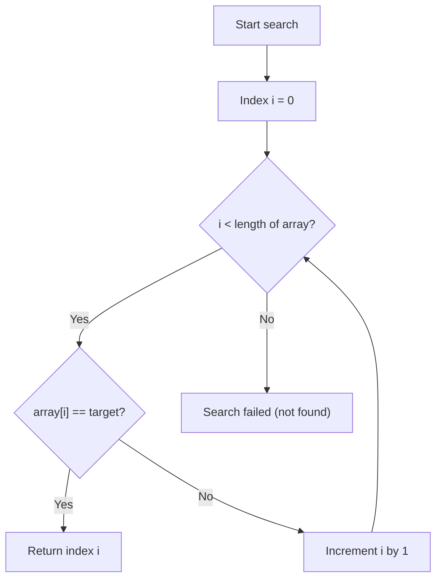
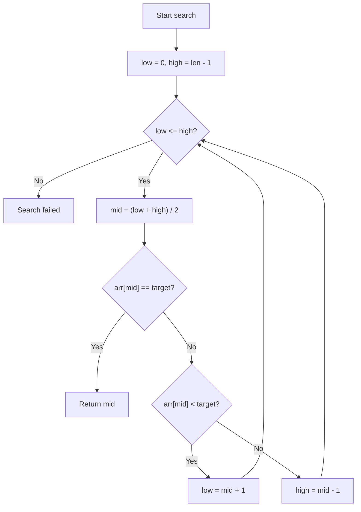
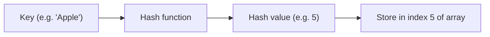
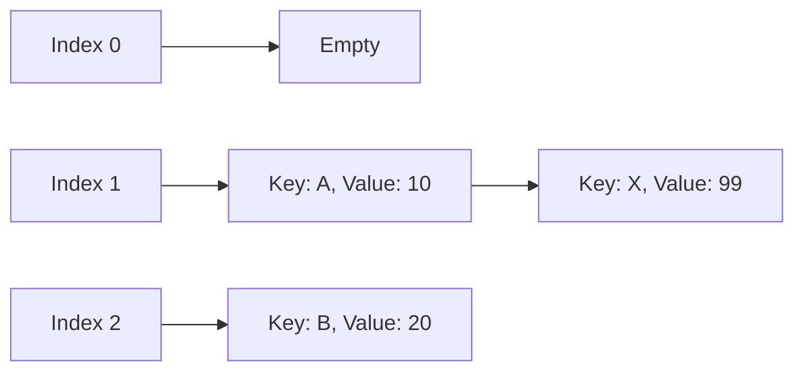

# Basics and Importance of Search Algorithms

In modern computer science, **search algorithms**, which quickly find a target value within data, are an extremely important technology that forms the foundation of all software and systems. We benefit from search algorithms daily, such as in database searches, keyword searches in web browsers, and name searches in smartphone contact apps.

In this article, we will explain in detail the basics of computer science, "Linear Search" and "Binary Search" algorithms, their mechanisms, time complexities, and implementation examples in Python. Furthermore, we will delve deeply into the principles of the "Hash Table", which breaks through the limits of these algorithms to achieve overwhelming search speeds, the role of hash functions, and methods for resolving hash collisions.


Deepening your understanding of search algorithms is essential to elevate your skills as a programmer to the next level. When the amount of data is small, the algorithm choice might have a negligible impact on performance, but in the era of big data, selecting the appropriate algorithm and data structure is extremely important to instantly find target information among millions or billions of pieces of data. In particular, understanding the concept of **time complexity** (such as $O(n)$, $O(\log n)$, $O(1)$) is an indispensable element in designing efficient programs.

Deepening your understanding of search algorithms is essential to elevate your skills as a programmer to the next level. When the amount of data is small, the algorithm choice might have a negligible impact on performance, but in the era of big data, selecting the appropriate algorithm and data structure is extremely important to instantly find target information among millions or billions of pieces of data. In particular, understanding the concept of **time complexity** (such as $O(n)$, $O(\log n)$, $O(1)$) is an indispensable element in designing efficient programs.

Deepening your understanding of search algorithms is essential to elevate your skills as a programmer to the next level. When the amount of data is small, the algorithm choice might have a negligible impact on performance, but in the era of big data, selecting the appropriate algorithm and data structure is extremely important to instantly find target information among millions or billions of pieces of data. In particular, understanding the concept of **time complexity** (such as $O(n)$, $O(\log n)$, $O(1)$) is an indispensable element in designing efficient programs.

Deepening your understanding of search algorithms is essential to elevate your skills as a programmer to the next level. When the amount of data is small, the algorithm choice might have a negligible impact on performance, but in the era of big data, selecting the appropriate algorithm and data structure is extremely important to instantly find target information among millions or billions of pieces of data. In particular, understanding the concept of **time complexity** (such as $O(n)$, $O(\log n)$, $O(1)$) is an indispensable element in designing efficient programs.

Deepening your understanding of search algorithms is essential to elevate your skills as a programmer to the next level. When the amount of data is small, the algorithm choice might have a negligible impact on performance, but in the era of big data, selecting the appropriate algorithm and data structure is extremely important to instantly find target information among millions or billions of pieces of data. In particular, understanding the concept of **time complexity** (such as $O(n)$, $O(\log n)$, $O(1)$) is an indispensable element in designing efficient programs.

Deepening your understanding of search algorithms is essential to elevate your skills as a programmer to the next level. When the amount of data is small, the algorithm choice might have a negligible impact on performance, but in the era of big data, selecting the appropriate algorithm and data structure is extremely important to instantly find target information among millions or billions of pieces of data. In particular, understanding the concept of **time complexity** (such as $O(n)$, $O(\log n)$, $O(1)$) is an indispensable element in designing efficient programs.

Deepening your understanding of search algorithms is essential to elevate your skills as a programmer to the next level. When the amount of data is small, the algorithm choice might have a negligible impact on performance, but in the era of big data, selecting the appropriate algorithm and data structure is extremely important to instantly find target information among millions or billions of pieces of data. In particular, understanding the concept of **time complexity** (such as $O(n)$, $O(\log n)$, $O(1)$) is an indispensable element in designing efficient programs.

Deepening your understanding of search algorithms is essential to elevate your skills as a programmer to the next level. When the amount of data is small, the algorithm choice might have a negligible impact on performance, but in the era of big data, selecting the appropriate algorithm and data structure is extremely important to instantly find target information among millions or billions of pieces of data. In particular, understanding the concept of **time complexity** (such as $O(n)$, $O(\log n)$, $O(1)$) is an indispensable element in designing efficient programs.

Deepening your understanding of search algorithms is essential to elevate your skills as a programmer to the next level. When the amount of data is small, the algorithm choice might have a negligible impact on performance, but in the era of big data, selecting the appropriate algorithm and data structure is extremely important to instantly find target information among millions or billions of pieces of data. In particular, understanding the concept of **time complexity** (such as $O(n)$, $O(\log n)$, $O(1)$) is an indispensable element in designing efficient programs.

Deepening your understanding of search algorithms is essential to elevate your skills as a programmer to the next level. When the amount of data is small, the algorithm choice might have a negligible impact on performance, but in the era of big data, selecting the appropriate algorithm and data structure is extremely important to instantly find target information among millions or billions of pieces of data. In particular, understanding the concept of **time complexity** (such as $O(n)$, $O(\log n)$, $O(1)$) is an indispensable element in designing efficient programs.

## 1. Linear Search

Linear search is the simplest and most intuitive search algorithm, checking elements one by one in order from the beginning to the end of a data structure (such as an array or list) until the target value is found.

### 1.1 Mechanism of Linear Search

The linear search algorithm proceeds with the following steps:

1. Retrieve the first element of the array.
2. Check whether the retrieved element matches the target value.
3. If it matches, return the index (position) of that element and terminate the search.
4. If it does not match, proceed to the next element.
5. Check until the end of the array, and if the target is not found, terminate as a search failure (for example, returning `-1` or `None`).



### 1.2 Python Implementation of Linear Search

Below is a simple implementation example of linear search using Python.

```python
def linear_search(arr, target):
    """
    Function to execute linear search
    :param arr: List to be searched
    :param target: Value to find
    :return: Index if found, -1 if not found
    """
    for i in range(len(arr)):
        if arr[i] == target:
            return i
    return -1

# Test data
numbers = [10, 23, 4, 15, 2, 7, 34, 11]
target_value = 7

result_index = linear_search(numbers, target_value)
if result_index != -1:
    print(f"Element {target_value} was found at index {result_index}.")
else:
    print(f"Element {target_value} does not exist in the list.")
```


The greatest feature of linear search is that the data does not need to be sorted. Even if the data is stored in random order, because it checks sequentially from the beginning, it can reliably find the target value (or confirm its absence). However, this property of "checking everything in order" becomes the biggest factor in performance degradation when the amount of data is large.

The greatest feature of linear search is that the data does not need to be sorted. Even if the data is stored in random order, because it checks sequentially from the beginning, it can reliably find the target value (or confirm its absence). However, this property of "checking everything in order" becomes the biggest factor in performance degradation when the amount of data is large.

The greatest feature of linear search is that the data does not need to be sorted. Even if the data is stored in random order, because it checks sequentially from the beginning, it can reliably find the target value (or confirm its absence). However, this property of "checking everything in order" becomes the biggest factor in performance degradation when the amount of data is large.

The greatest feature of linear search is that the data does not need to be sorted. Even if the data is stored in random order, because it checks sequentially from the beginning, it can reliably find the target value (or confirm its absence). However, this property of "checking everything in order" becomes the biggest factor in performance degradation when the amount of data is large.

The greatest feature of linear search is that the data does not need to be sorted. Even if the data is stored in random order, because it checks sequentially from the beginning, it can reliably find the target value (or confirm its absence). However, this property of "checking everything in order" becomes the biggest factor in performance degradation when the amount of data is large.

The greatest feature of linear search is that the data does not need to be sorted. Even if the data is stored in random order, because it checks sequentially from the beginning, it can reliably find the target value (or confirm its absence). However, this property of "checking everything in order" becomes the biggest factor in performance degradation when the amount of data is large.

The greatest feature of linear search is that the data does not need to be sorted. Even if the data is stored in random order, because it checks sequentially from the beginning, it can reliably find the target value (or confirm its absence). However, this property of "checking everything in order" becomes the biggest factor in performance degradation when the amount of data is large.

The greatest feature of linear search is that the data does not need to be sorted. Even if the data is stored in random order, because it checks sequentially from the beginning, it can reliably find the target value (or confirm its absence). However, this property of "checking everything in order" becomes the biggest factor in performance degradation when the amount of data is large.

The greatest feature of linear search is that the data does not need to be sorted. Even if the data is stored in random order, because it checks sequentially from the beginning, it can reliably find the target value (or confirm its absence). However, this property of "checking everything in order" becomes the biggest factor in performance degradation when the amount of data is large.

The greatest feature of linear search is that the data does not need to be sorted. Even if the data is stored in random order, because it checks sequentially from the beginning, it can reliably find the target value (or confirm its absence). However, this property of "checking everything in order" becomes the biggest factor in performance degradation when the amount of data is large.

The greatest feature of linear search is that the data does not need to be sorted. Even if the data is stored in random order, because it checks sequentially from the beginning, it can reliably find the target value (or confirm its absence). However, this property of "checking everything in order" becomes the biggest factor in performance degradation when the amount of data is large.

The greatest feature of linear search is that the data does not need to be sorted. Even if the data is stored in random order, because it checks sequentially from the beginning, it can reliably find the target value (or confirm its absence). However, this property of "checking everything in order" becomes the biggest factor in performance degradation when the amount of data is large.

The greatest feature of linear search is that the data does not need to be sorted. Even if the data is stored in random order, because it checks sequentially from the beginning, it can reliably find the target value (or confirm its absence). However, this property of "checking everything in order" becomes the biggest factor in performance degradation when the amount of data is large.

The greatest feature of linear search is that the data does not need to be sorted. Even if the data is stored in random order, because it checks sequentially from the beginning, it can reliably find the target value (or confirm its absence). However, this property of "checking everything in order" becomes the biggest factor in performance degradation when the amount of data is large.

The greatest feature of linear search is that the data does not need to be sorted. Even if the data is stored in random order, because it checks sequentially from the beginning, it can reliably find the target value (or confirm its absence). However, this property of "checking everything in order" becomes the biggest factor in performance degradation when the amount of data is large.

The greatest feature of linear search is that the data does not need to be sorted. Even if the data is stored in random order, because it checks sequentially from the beginning, it can reliably find the target value (or confirm its absence). However, this property of "checking everything in order" becomes the biggest factor in performance degradation when the amount of data is large.

The greatest feature of linear search is that the data does not need to be sorted. Even if the data is stored in random order, because it checks sequentially from the beginning, it can reliably find the target value (or confirm its absence). However, this property of "checking everything in order" becomes the biggest factor in performance degradation when the amount of data is large.

The greatest feature of linear search is that the data does not need to be sorted. Even if the data is stored in random order, because it checks sequentially from the beginning, it can reliably find the target value (or confirm its absence). However, this property of "checking everything in order" becomes the biggest factor in performance degradation when the amount of data is large.

The greatest feature of linear search is that the data does not need to be sorted. Even if the data is stored in random order, because it checks sequentially from the beginning, it can reliably find the target value (or confirm its absence). However, this property of "checking everything in order" becomes the biggest factor in performance degradation when the amount of data is large.

The greatest feature of linear search is that the data does not need to be sorted. Even if the data is stored in random order, because it checks sequentially from the beginning, it can reliably find the target value (or confirm its absence). However, this property of "checking everything in order" becomes the biggest factor in performance degradation when the amount of data is large.

The greatest feature of linear search is that the data does not need to be sorted. Even if the data is stored in random order, because it checks sequentially from the beginning, it can reliably find the target value (or confirm its absence). However, this property of "checking everything in order" becomes the biggest factor in performance degradation when the amount of data is large.

The greatest feature of linear search is that the data does not need to be sorted. Even if the data is stored in random order, because it checks sequentially from the beginning, it can reliably find the target value (or confirm its absence). However, this property of "checking everything in order" becomes the biggest factor in performance degradation when the amount of data is large.

The greatest feature of linear search is that the data does not need to be sorted. Even if the data is stored in random order, because it checks sequentially from the beginning, it can reliably find the target value (or confirm its absence). However, this property of "checking everything in order" becomes the biggest factor in performance degradation when the amount of data is large.

The greatest feature of linear search is that the data does not need to be sorted. Even if the data is stored in random order, because it checks sequentially from the beginning, it can reliably find the target value (or confirm its absence). However, this property of "checking everything in order" becomes the biggest factor in performance degradation when the amount of data is large.

The greatest feature of linear search is that the data does not need to be sorted. Even if the data is stored in random order, because it checks sequentially from the beginning, it can reliably find the target value (or confirm its absence). However, this property of "checking everything in order" becomes the biggest factor in performance degradation when the amount of data is large.

The greatest feature of linear search is that the data does not need to be sorted. Even if the data is stored in random order, because it checks sequentially from the beginning, it can reliably find the target value (or confirm its absence). However, this property of "checking everything in order" becomes the biggest factor in performance degradation when the amount of data is large.

The greatest feature of linear search is that the data does not need to be sorted. Even if the data is stored in random order, because it checks sequentially from the beginning, it can reliably find the target value (or confirm its absence). However, this property of "checking everything in order" becomes the biggest factor in performance degradation when the amount of data is large.

The greatest feature of linear search is that the data does not need to be sorted. Even if the data is stored in random order, because it checks sequentially from the beginning, it can reliably find the target value (or confirm its absence). However, this property of "checking everything in order" becomes the biggest factor in performance degradation when the amount of data is large.

The greatest feature of linear search is that the data does not need to be sorted. Even if the data is stored in random order, because it checks sequentially from the beginning, it can reliably find the target value (or confirm its absence). However, this property of "checking everything in order" becomes the biggest factor in performance degradation when the amount of data is large.

The greatest feature of linear search is that the data does not need to be sorted. Even if the data is stored in random order, because it checks sequentially from the beginning, it can reliably find the target value (or confirm its absence). However, this property of "checking everything in order" becomes the biggest factor in performance degradation when the amount of data is large.

The greatest feature of linear search is that the data does not need to be sorted. Even if the data is stored in random order, because it checks sequentially from the beginning, it can reliably find the target value (or confirm its absence). However, this property of "checking everything in order" becomes the biggest factor in performance degradation when the amount of data is large.

The greatest feature of linear search is that the data does not need to be sorted. Even if the data is stored in random order, because it checks sequentially from the beginning, it can reliably find the target value (or confirm its absence). However, this property of "checking everything in order" becomes the biggest factor in performance degradation when the amount of data is large.

The greatest feature of linear search is that the data does not need to be sorted. Even if the data is stored in random order, because it checks sequentially from the beginning, it can reliably find the target value (or confirm its absence). However, this property of "checking everything in order" becomes the biggest factor in performance degradation when the amount of data is large.

The greatest feature of linear search is that the data does not need to be sorted. Even if the data is stored in random order, because it checks sequentially from the beginning, it can reliably find the target value (or confirm its absence). However, this property of "checking everything in order" becomes the biggest factor in performance degradation when the amount of data is large.

The greatest feature of linear search is that the data does not need to be sorted. Even if the data is stored in random order, because it checks sequentially from the beginning, it can reliably find the target value (or confirm its absence). However, this property of "checking everything in order" becomes the biggest factor in performance degradation when the amount of data is large.

The greatest feature of linear search is that the data does not need to be sorted. Even if the data is stored in random order, because it checks sequentially from the beginning, it can reliably find the target value (or confirm its absence). However, this property of "checking everything in order" becomes the biggest factor in performance degradation when the amount of data is large.

The greatest feature of linear search is that the data does not need to be sorted. Even if the data is stored in random order, because it checks sequentially from the beginning, it can reliably find the target value (or confirm its absence). However, this property of "checking everything in order" becomes the biggest factor in performance degradation when the amount of data is large.

The greatest feature of linear search is that the data does not need to be sorted. Even if the data is stored in random order, because it checks sequentially from the beginning, it can reliably find the target value (or confirm its absence). However, this property of "checking everything in order" becomes the biggest factor in performance degradation when the amount of data is large.

The greatest feature of linear search is that the data does not need to be sorted. Even if the data is stored in random order, because it checks sequentially from the beginning, it can reliably find the target value (or confirm its absence). However, this property of "checking everything in order" becomes the biggest factor in performance degradation when the amount of data is large.

The greatest feature of linear search is that the data does not need to be sorted. Even if the data is stored in random order, because it checks sequentially from the beginning, it can reliably find the target value (or confirm its absence). However, this property of "checking everything in order" becomes the biggest factor in performance degradation when the amount of data is large.

The greatest feature of linear search is that the data does not need to be sorted. Even if the data is stored in random order, because it checks sequentially from the beginning, it can reliably find the target value (or confirm its absence). However, this property of "checking everything in order" becomes the biggest factor in performance degradation when the amount of data is large.

The greatest feature of linear search is that the data does not need to be sorted. Even if the data is stored in random order, because it checks sequentially from the beginning, it can reliably find the target value (or confirm its absence). However, this property of "checking everything in order" becomes the biggest factor in performance degradation when the amount of data is large.

The greatest feature of linear search is that the data does not need to be sorted. Even if the data is stored in random order, because it checks sequentially from the beginning, it can reliably find the target value (or confirm its absence). However, this property of "checking everything in order" becomes the biggest factor in performance degradation when the amount of data is large.

The greatest feature of linear search is that the data does not need to be sorted. Even if the data is stored in random order, because it checks sequentially from the beginning, it can reliably find the target value (or confirm its absence). However, this property of "checking everything in order" becomes the biggest factor in performance degradation when the amount of data is large.

The greatest feature of linear search is that the data does not need to be sorted. Even if the data is stored in random order, because it checks sequentially from the beginning, it can reliably find the target value (or confirm its absence). However, this property of "checking everything in order" becomes the biggest factor in performance degradation when the amount of data is large.

The greatest feature of linear search is that the data does not need to be sorted. Even if the data is stored in random order, because it checks sequentially from the beginning, it can reliably find the target value (or confirm its absence). However, this property of "checking everything in order" becomes the biggest factor in performance degradation when the amount of data is large.

The greatest feature of linear search is that the data does not need to be sorted. Even if the data is stored in random order, because it checks sequentially from the beginning, it can reliably find the target value (or confirm its absence). However, this property of "checking everything in order" becomes the biggest factor in performance degradation when the amount of data is large.

The greatest feature of linear search is that the data does not need to be sorted. Even if the data is stored in random order, because it checks sequentially from the beginning, it can reliably find the target value (or confirm its absence). However, this property of "checking everything in order" becomes the biggest factor in performance degradation when the amount of data is large.

The greatest feature of linear search is that the data does not need to be sorted. Even if the data is stored in random order, because it checks sequentially from the beginning, it can reliably find the target value (or confirm its absence). However, this property of "checking everything in order" becomes the biggest factor in performance degradation when the amount of data is large.

The greatest feature of linear search is that the data does not need to be sorted. Even if the data is stored in random order, because it checks sequentially from the beginning, it can reliably find the target value (or confirm its absence). However, this property of "checking everything in order" becomes the biggest factor in performance degradation when the amount of data is large.

## 2. Binary Search

Binary search is an extremely fast and efficient search algorithm that can only be applied to **pre-sorted data (arranged in ascending or descending order)**. It dramatically reduces computational complexity by narrowing the search range in half each time.

### 2.1 Mechanism of Binary Search

Binary search is performed with the following steps:

1. Initialize the indices for the "left end (`low`)" and "right end (`high`)" of the array to be searched.
2. As long as the search range is valid (`low <= high`), repeat the following process.
3. Calculate the central index (`mid`) of the search range.
4. Compare the central element (`arr[mid]`) with the target value.
5. If they match, return `mid` and terminate.
6. If the central element is smaller than the target, the target must exist in the right half range, so update the left end to `mid + 1`.
7. If the central element is larger than the target, the target must exist in the left half range, so update the right end to `mid - 1`.
8. If the search range is exhausted and it is not found, treat it as a search failure.



### 2.2 Python Implementation of Binary Search (Iterative Method)

```python
def binary_search(arr, target):
    """
    Function to execute binary search (iterative method)
    :param arr: Sorted list to be searched
    :param target: Value to find
    :return: Index if found, -1 if not found
    """
    low = 0
    high = len(arr) - 1

    while low <= high:
        mid = (low + high) // 2
        
        if arr[mid] == target:
            return mid
        elif arr[mid] < target:
            low = mid + 1
        else:
            high = mid - 1
            
    return -1

# Test data (needs to be sorted)
sorted_numbers = [2, 4, 7, 10, 11, 15, 23, 34]
target_value = 15

result_index = binary_search(sorted_numbers, target_value)
if result_index != -1:
    print(f"Element {target_value} was found at index {result_index}.")
else:
    print(f"Element {target_value} does not exist in the list.")
```

The astounding performance of binary search comes from its property of dividing the search range in half every time. For example, performing a linear search on an array of 1 million elements requires 1 million comparisons in the worst case, but using binary search allows finding the target value with only about 20 comparisons ($2^{20} \approx 1,000,000$). Therefore, for search operations on large-scale datasets, binary search boasts an overwhelming superiority over linear search. Mathematically, the time complexity of binary search is expressed as $O(\log n)$.

The astounding performance of binary search comes from its property of dividing the search range in half every time. For example, performing a linear search on an array of 1 million elements requires 1 million comparisons in the worst case, but using binary search allows finding the target value with only about 20 comparisons ($2^{20} \approx 1,000,000$). Therefore, for search operations on large-scale datasets, binary search boasts an overwhelming superiority over linear search. Mathematically, the time complexity of binary search is expressed as $O(\log n)$.

The astounding performance of binary search comes from its property of dividing the search range in half every time. For example, performing a linear search on an array of 1 million elements requires 1 million comparisons in the worst case, but using binary search allows finding the target value with only about 20 comparisons ($2^{20} \approx 1,000,000$). Therefore, for search operations on large-scale datasets, binary search boasts an overwhelming superiority over linear search. Mathematically, the time complexity of binary search is expressed as $O(\log n)$.

The astounding performance of binary search comes from its property of dividing the search range in half every time. For example, performing a linear search on an array of 1 million elements requires 1 million comparisons in the worst case, but using binary search allows finding the target value with only about 20 comparisons ($2^{20} \approx 1,000,000$). Therefore, for search operations on large-scale datasets, binary search boasts an overwhelming superiority over linear search. Mathematically, the time complexity of binary search is expressed as $O(\log n)$.

The astounding performance of binary search comes from its property of dividing the search range in half every time. For example, performing a linear search on an array of 1 million elements requires 1 million comparisons in the worst case, but using binary search allows finding the target value with only about 20 comparisons ($2^{20} \approx 1,000,000$). Therefore, for search operations on large-scale datasets, binary search boasts an overwhelming superiority over linear search. Mathematically, the time complexity of binary search is expressed as $O(\log n)$.

The astounding performance of binary search comes from its property of dividing the search range in half every time. For example, performing a linear search on an array of 1 million elements requires 1 million comparisons in the worst case, but using binary search allows finding the target value with only about 20 comparisons ($2^{20} \approx 1,000,000$). Therefore, for search operations on large-scale datasets, binary search boasts an overwhelming superiority over linear search. Mathematically, the time complexity of binary search is expressed as $O(\log n)$.

The astounding performance of binary search comes from its property of dividing the search range in half every time. For example, performing a linear search on an array of 1 million elements requires 1 million comparisons in the worst case, but using binary search allows finding the target value with only about 20 comparisons ($2^{20} \approx 1,000,000$). Therefore, for search operations on large-scale datasets, binary search boasts an overwhelming superiority over linear search. Mathematically, the time complexity of binary search is expressed as $O(\log n)$.

The astounding performance of binary search comes from its property of dividing the search range in half every time. For example, performing a linear search on an array of 1 million elements requires 1 million comparisons in the worst case, but using binary search allows finding the target value with only about 20 comparisons ($2^{20} \approx 1,000,000$). Therefore, for search operations on large-scale datasets, binary search boasts an overwhelming superiority over linear search. Mathematically, the time complexity of binary search is expressed as $O(\log n)$.

The astounding performance of binary search comes from its property of dividing the search range in half every time. For example, performing a linear search on an array of 1 million elements requires 1 million comparisons in the worst case, but using binary search allows finding the target value with only about 20 comparisons ($2^{20} \approx 1,000,000$). Therefore, for search operations on large-scale datasets, binary search boasts an overwhelming superiority over linear search. Mathematically, the time complexity of binary search is expressed as $O(\log n)$.

The astounding performance of binary search comes from its property of dividing the search range in half every time. For example, performing a linear search on an array of 1 million elements requires 1 million comparisons in the worst case, but using binary search allows finding the target value with only about 20 comparisons ($2^{20} \approx 1,000,000$). Therefore, for search operations on large-scale datasets, binary search boasts an overwhelming superiority over linear search. Mathematically, the time complexity of binary search is expressed as $O(\log n)$.

The astounding performance of binary search comes from its property of dividing the search range in half every time. For example, performing a linear search on an array of 1 million elements requires 1 million comparisons in the worst case, but using binary search allows finding the target value with only about 20 comparisons ($2^{20} \approx 1,000,000$). Therefore, for search operations on large-scale datasets, binary search boasts an overwhelming superiority over linear search. Mathematically, the time complexity of binary search is expressed as $O(\log n)$.

The astounding performance of binary search comes from its property of dividing the search range in half every time. For example, performing a linear search on an array of 1 million elements requires 1 million comparisons in the worst case, but using binary search allows finding the target value with only about 20 comparisons ($2^{20} \approx 1,000,000$). Therefore, for search operations on large-scale datasets, binary search boasts an overwhelming superiority over linear search. Mathematically, the time complexity of binary search is expressed as $O(\log n)$.

The astounding performance of binary search comes from its property of dividing the search range in half every time. For example, performing a linear search on an array of 1 million elements requires 1 million comparisons in the worst case, but using binary search allows finding the target value with only about 20 comparisons ($2^{20} \approx 1,000,000$). Therefore, for search operations on large-scale datasets, binary search boasts an overwhelming superiority over linear search. Mathematically, the time complexity of binary search is expressed as $O(\log n)$.

The astounding performance of binary search comes from its property of dividing the search range in half every time. For example, performing a linear search on an array of 1 million elements requires 1 million comparisons in the worst case, but using binary search allows finding the target value with only about 20 comparisons ($2^{20} \approx 1,000,000$). Therefore, for search operations on large-scale datasets, binary search boasts an overwhelming superiority over linear search. Mathematically, the time complexity of binary search is expressed as $O(\log n)$.

The astounding performance of binary search comes from its property of dividing the search range in half every time. For example, performing a linear search on an array of 1 million elements requires 1 million comparisons in the worst case, but using binary search allows finding the target value with only about 20 comparisons ($2^{20} \approx 1,000,000$). Therefore, for search operations on large-scale datasets, binary search boasts an overwhelming superiority over linear search. Mathematically, the time complexity of binary search is expressed as $O(\log n)$.

The astounding performance of binary search comes from its property of dividing the search range in half every time. For example, performing a linear search on an array of 1 million elements requires 1 million comparisons in the worst case, but using binary search allows finding the target value with only about 20 comparisons ($2^{20} \approx 1,000,000$). Therefore, for search operations on large-scale datasets, binary search boasts an overwhelming superiority over linear search. Mathematically, the time complexity of binary search is expressed as $O(\log n)$.

The astounding performance of binary search comes from its property of dividing the search range in half every time. For example, performing a linear search on an array of 1 million elements requires 1 million comparisons in the worst case, but using binary search allows finding the target value with only about 20 comparisons ($2^{20} \approx 1,000,000$). Therefore, for search operations on large-scale datasets, binary search boasts an overwhelming superiority over linear search. Mathematically, the time complexity of binary search is expressed as $O(\log n)$.

The astounding performance of binary search comes from its property of dividing the search range in half every time. For example, performing a linear search on an array of 1 million elements requires 1 million comparisons in the worst case, but using binary search allows finding the target value with only about 20 comparisons ($2^{20} \approx 1,000,000$). Therefore, for search operations on large-scale datasets, binary search boasts an overwhelming superiority over linear search. Mathematically, the time complexity of binary search is expressed as $O(\log n)$.

The astounding performance of binary search comes from its property of dividing the search range in half every time. For example, performing a linear search on an array of 1 million elements requires 1 million comparisons in the worst case, but using binary search allows finding the target value with only about 20 comparisons ($2^{20} \approx 1,000,000$). Therefore, for search operations on large-scale datasets, binary search boasts an overwhelming superiority over linear search. Mathematically, the time complexity of binary search is expressed as $O(\log n)$.

The astounding performance of binary search comes from its property of dividing the search range in half every time. For example, performing a linear search on an array of 1 million elements requires 1 million comparisons in the worst case, but using binary search allows finding the target value with only about 20 comparisons ($2^{20} \approx 1,000,000$). Therefore, for search operations on large-scale datasets, binary search boasts an overwhelming superiority over linear search. Mathematically, the time complexity of binary search is expressed as $O(\log n)$.

The astounding performance of binary search comes from its property of dividing the search range in half every time. For example, performing a linear search on an array of 1 million elements requires 1 million comparisons in the worst case, but using binary search allows finding the target value with only about 20 comparisons ($2^{20} \approx 1,000,000$). Therefore, for search operations on large-scale datasets, binary search boasts an overwhelming superiority over linear search. Mathematically, the time complexity of binary search is expressed as $O(\log n)$.

The astounding performance of binary search comes from its property of dividing the search range in half every time. For example, performing a linear search on an array of 1 million elements requires 1 million comparisons in the worst case, but using binary search allows finding the target value with only about 20 comparisons ($2^{20} \approx 1,000,000$). Therefore, for search operations on large-scale datasets, binary search boasts an overwhelming superiority over linear search. Mathematically, the time complexity of binary search is expressed as $O(\log n)$.

The astounding performance of binary search comes from its property of dividing the search range in half every time. For example, performing a linear search on an array of 1 million elements requires 1 million comparisons in the worst case, but using binary search allows finding the target value with only about 20 comparisons ($2^{20} \approx 1,000,000$). Therefore, for search operations on large-scale datasets, binary search boasts an overwhelming superiority over linear search. Mathematically, the time complexity of binary search is expressed as $O(\log n)$.

The astounding performance of binary search comes from its property of dividing the search range in half every time. For example, performing a linear search on an array of 1 million elements requires 1 million comparisons in the worst case, but using binary search allows finding the target value with only about 20 comparisons ($2^{20} \approx 1,000,000$). Therefore, for search operations on large-scale datasets, binary search boasts an overwhelming superiority over linear search. Mathematically, the time complexity of binary search is expressed as $O(\log n)$.

The astounding performance of binary search comes from its property of dividing the search range in half every time. For example, performing a linear search on an array of 1 million elements requires 1 million comparisons in the worst case, but using binary search allows finding the target value with only about 20 comparisons ($2^{20} \approx 1,000,000$). Therefore, for search operations on large-scale datasets, binary search boasts an overwhelming superiority over linear search. Mathematically, the time complexity of binary search is expressed as $O(\log n)$.

The astounding performance of binary search comes from its property of dividing the search range in half every time. For example, performing a linear search on an array of 1 million elements requires 1 million comparisons in the worst case, but using binary search allows finding the target value with only about 20 comparisons ($2^{20} \approx 1,000,000$). Therefore, for search operations on large-scale datasets, binary search boasts an overwhelming superiority over linear search. Mathematically, the time complexity of binary search is expressed as $O(\log n)$.

The astounding performance of binary search comes from its property of dividing the search range in half every time. For example, performing a linear search on an array of 1 million elements requires 1 million comparisons in the worst case, but using binary search allows finding the target value with only about 20 comparisons ($2^{20} \approx 1,000,000$). Therefore, for search operations on large-scale datasets, binary search boasts an overwhelming superiority over linear search. Mathematically, the time complexity of binary search is expressed as $O(\log n)$.

The astounding performance of binary search comes from its property of dividing the search range in half every time. For example, performing a linear search on an array of 1 million elements requires 1 million comparisons in the worst case, but using binary search allows finding the target value with only about 20 comparisons ($2^{20} \approx 1,000,000$). Therefore, for search operations on large-scale datasets, binary search boasts an overwhelming superiority over linear search. Mathematically, the time complexity of binary search is expressed as $O(\log n)$.

The astounding performance of binary search comes from its property of dividing the search range in half every time. For example, performing a linear search on an array of 1 million elements requires 1 million comparisons in the worst case, but using binary search allows finding the target value with only about 20 comparisons ($2^{20} \approx 1,000,000$). Therefore, for search operations on large-scale datasets, binary search boasts an overwhelming superiority over linear search. Mathematically, the time complexity of binary search is expressed as $O(\log n)$.

The astounding performance of binary search comes from its property of dividing the search range in half every time. For example, performing a linear search on an array of 1 million elements requires 1 million comparisons in the worst case, but using binary search allows finding the target value with only about 20 comparisons ($2^{20} \approx 1,000,000$). Therefore, for search operations on large-scale datasets, binary search boasts an overwhelming superiority over linear search. Mathematically, the time complexity of binary search is expressed as $O(\log n)$.

The astounding performance of binary search comes from its property of dividing the search range in half every time. For example, performing a linear search on an array of 1 million elements requires 1 million comparisons in the worst case, but using binary search allows finding the target value with only about 20 comparisons ($2^{20} \approx 1,000,000$). Therefore, for search operations on large-scale datasets, binary search boasts an overwhelming superiority over linear search. Mathematically, the time complexity of binary search is expressed as $O(\log n)$.

The astounding performance of binary search comes from its property of dividing the search range in half every time. For example, performing a linear search on an array of 1 million elements requires 1 million comparisons in the worst case, but using binary search allows finding the target value with only about 20 comparisons ($2^{20} \approx 1,000,000$). Therefore, for search operations on large-scale datasets, binary search boasts an overwhelming superiority over linear search. Mathematically, the time complexity of binary search is expressed as $O(\log n)$.

The astounding performance of binary search comes from its property of dividing the search range in half every time. For example, performing a linear search on an array of 1 million elements requires 1 million comparisons in the worst case, but using binary search allows finding the target value with only about 20 comparisons ($2^{20} \approx 1,000,000$). Therefore, for search operations on large-scale datasets, binary search boasts an overwhelming superiority over linear search. Mathematically, the time complexity of binary search is expressed as $O(\log n)$.

The astounding performance of binary search comes from its property of dividing the search range in half every time. For example, performing a linear search on an array of 1 million elements requires 1 million comparisons in the worst case, but using binary search allows finding the target value with only about 20 comparisons ($2^{20} \approx 1,000,000$). Therefore, for search operations on large-scale datasets, binary search boasts an overwhelming superiority over linear search. Mathematically, the time complexity of binary search is expressed as $O(\log n)$.

The astounding performance of binary search comes from its property of dividing the search range in half every time. For example, performing a linear search on an array of 1 million elements requires 1 million comparisons in the worst case, but using binary search allows finding the target value with only about 20 comparisons ($2^{20} \approx 1,000,000$). Therefore, for search operations on large-scale datasets, binary search boasts an overwhelming superiority over linear search. Mathematically, the time complexity of binary search is expressed as $O(\log n)$.

The astounding performance of binary search comes from its property of dividing the search range in half every time. For example, performing a linear search on an array of 1 million elements requires 1 million comparisons in the worst case, but using binary search allows finding the target value with only about 20 comparisons ($2^{20} \approx 1,000,000$). Therefore, for search operations on large-scale datasets, binary search boasts an overwhelming superiority over linear search. Mathematically, the time complexity of binary search is expressed as $O(\log n)$.

The astounding performance of binary search comes from its property of dividing the search range in half every time. For example, performing a linear search on an array of 1 million elements requires 1 million comparisons in the worst case, but using binary search allows finding the target value with only about 20 comparisons ($2^{20} \approx 1,000,000$). Therefore, for search operations on large-scale datasets, binary search boasts an overwhelming superiority over linear search. Mathematically, the time complexity of binary search is expressed as $O(\log n)$.

The astounding performance of binary search comes from its property of dividing the search range in half every time. For example, performing a linear search on an array of 1 million elements requires 1 million comparisons in the worst case, but using binary search allows finding the target value with only about 20 comparisons ($2^{20} \approx 1,000,000$). Therefore, for search operations on large-scale datasets, binary search boasts an overwhelming superiority over linear search. Mathematically, the time complexity of binary search is expressed as $O(\log n)$.

The astounding performance of binary search comes from its property of dividing the search range in half every time. For example, performing a linear search on an array of 1 million elements requires 1 million comparisons in the worst case, but using binary search allows finding the target value with only about 20 comparisons ($2^{20} \approx 1,000,000$). Therefore, for search operations on large-scale datasets, binary search boasts an overwhelming superiority over linear search. Mathematically, the time complexity of binary search is expressed as $O(\log n)$.

The astounding performance of binary search comes from its property of dividing the search range in half every time. For example, performing a linear search on an array of 1 million elements requires 1 million comparisons in the worst case, but using binary search allows finding the target value with only about 20 comparisons ($2^{20} \approx 1,000,000$). Therefore, for search operations on large-scale datasets, binary search boasts an overwhelming superiority over linear search. Mathematically, the time complexity of binary search is expressed as $O(\log n)$.

The astounding performance of binary search comes from its property of dividing the search range in half every time. For example, performing a linear search on an array of 1 million elements requires 1 million comparisons in the worst case, but using binary search allows finding the target value with only about 20 comparisons ($2^{20} \approx 1,000,000$). Therefore, for search operations on large-scale datasets, binary search boasts an overwhelming superiority over linear search. Mathematically, the time complexity of binary search is expressed as $O(\log n)$.

The astounding performance of binary search comes from its property of dividing the search range in half every time. For example, performing a linear search on an array of 1 million elements requires 1 million comparisons in the worst case, but using binary search allows finding the target value with only about 20 comparisons ($2^{20} \approx 1,000,000$). Therefore, for search operations on large-scale datasets, binary search boasts an overwhelming superiority over linear search. Mathematically, the time complexity of binary search is expressed as $O(\log n)$.

The astounding performance of binary search comes from its property of dividing the search range in half every time. For example, performing a linear search on an array of 1 million elements requires 1 million comparisons in the worst case, but using binary search allows finding the target value with only about 20 comparisons ($2^{20} \approx 1,000,000$). Therefore, for search operations on large-scale datasets, binary search boasts an overwhelming superiority over linear search. Mathematically, the time complexity of binary search is expressed as $O(\log n)$.

The astounding performance of binary search comes from its property of dividing the search range in half every time. For example, performing a linear search on an array of 1 million elements requires 1 million comparisons in the worst case, but using binary search allows finding the target value with only about 20 comparisons ($2^{20} \approx 1,000,000$). Therefore, for search operations on large-scale datasets, binary search boasts an overwhelming superiority over linear search. Mathematically, the time complexity of binary search is expressed as $O(\log n)$.

The astounding performance of binary search comes from its property of dividing the search range in half every time. For example, performing a linear search on an array of 1 million elements requires 1 million comparisons in the worst case, but using binary search allows finding the target value with only about 20 comparisons ($2^{20} \approx 1,000,000$). Therefore, for search operations on large-scale datasets, binary search boasts an overwhelming superiority over linear search. Mathematically, the time complexity of binary search is expressed as $O(\log n)$.

The astounding performance of binary search comes from its property of dividing the search range in half every time. For example, performing a linear search on an array of 1 million elements requires 1 million comparisons in the worst case, but using binary search allows finding the target value with only about 20 comparisons ($2^{20} \approx 1,000,000$). Therefore, for search operations on large-scale datasets, binary search boasts an overwhelming superiority over linear search. Mathematically, the time complexity of binary search is expressed as $O(\log n)$.

The astounding performance of binary search comes from its property of dividing the search range in half every time. For example, performing a linear search on an array of 1 million elements requires 1 million comparisons in the worst case, but using binary search allows finding the target value with only about 20 comparisons ($2^{20} \approx 1,000,000$). Therefore, for search operations on large-scale datasets, binary search boasts an overwhelming superiority over linear search. Mathematically, the time complexity of binary search is expressed as $O(\log n)$.

The astounding performance of binary search comes from its property of dividing the search range in half every time. For example, performing a linear search on an array of 1 million elements requires 1 million comparisons in the worst case, but using binary search allows finding the target value with only about 20 comparisons ($2^{20} \approx 1,000,000$). Therefore, for search operations on large-scale datasets, binary search boasts an overwhelming superiority over linear search. Mathematically, the time complexity of binary search is expressed as $O(\log n)$.

The astounding performance of binary search comes from its property of dividing the search range in half every time. For example, performing a linear search on an array of 1 million elements requires 1 million comparisons in the worst case, but using binary search allows finding the target value with only about 20 comparisons ($2^{20} \approx 1,000,000$). Therefore, for search operations on large-scale datasets, binary search boasts an overwhelming superiority over linear search. Mathematically, the time complexity of binary search is expressed as $O(\log n)$.

The astounding performance of binary search comes from its property of dividing the search range in half every time. For example, performing a linear search on an array of 1 million elements requires 1 million comparisons in the worst case, but using binary search allows finding the target value with only about 20 comparisons ($2^{20} \approx 1,000,000$). Therefore, for search operations on large-scale datasets, binary search boasts an overwhelming superiority over linear search. Mathematically, the time complexity of binary search is expressed as $O(\log n)$.

## 3. Principles and Structure of Hash Tables

Aiming for an even faster search in $O(1)$ (constant time) compared to the $O(n)$ of linear search and $O(\log n)$ of binary search, a **hash table** (or hash map) is the data structure. A hash table is a powerful mechanism that stores "Key" and "Value" pairs and allows instantaneous retrieval of values using the keys.

### 3.1 The Role of Hash Functions

The **hash function** plays the core role in a hash table. A hash function receives arbitrary data (key) as input and outputs a fixed-length integer value (hash value). Using this hash value, it determines which index in the array (bucket) to store the data.

An ideal hash function needs to satisfy the following conditions:
1. **Fast calculation**: If the process of obtaining a hash value from a key takes time, the overall performance of the search degrades.
2. **Deterministic**: Inputting the same key must always output the same hash value.
3. **Uniform distribution**: When different keys are input, hash values should be evenly distributed (without bias) across various indices of the array.



### 3.2 Adding and Searching Data in Hash Tables

Adding (Insert) data to a hash table is performed through the following steps:
1. Pass the key of the data you want to add to the hash function to calculate the hash value.
2. Find the remainder (modulo operation) of the calculated hash value divided by the size of the hash table's array to determine the actual index.
   `index = hash(key) % array_size`
3. Store the key-value pair at the determined index location.

Searching (Search) works similarly; you calculate the hash value of the key to search, find the index, and simply check the data at that location. Because the storage location can be calculated directly from the key, the search completes instantly regardless of the amount of data (time complexity of $O(1)$).

### 3.3 Hash Collisions and Their Solutions

Because the output range of a hash function (array size) is limited, it is possible for different keys to generate the same hash value (the same index). This is called a **hash collision**. Since hash collisions are an unavoidable problem, appropriate methods are required to resolve them.

#### 3.3.1 Separate Chaining

Separate chaining is a method that gives each index of the array a "Linked List". When a hash collision occurs, new elements are added to the linked list at the same index.



#### 3.3.2 Open Addressing

Open addressing is a method that stores all data within the hash table's array itself, without using additional data structures (like linked lists). When a collision occurs, it searches for "another empty index (bucket)" according to a predetermined rule and stores the data there.

Typical methods for finding empty locations (probing methods) include the following:
* **Linear Probing**: Searches for the next empty spot sequentially (+1, +2, ...) starting from the collided index.
* **Quadratic Probing**: Searches for an empty spot by increasing the interval as 1 squared, 2 squared, 3 squared... from the collided index.
* **Double Hashing**: Determines the interval for finding the next empty spot using a second, different hash function.

### 3.4 Python Implementation of Hash Tables (Chaining Method)

Below is a simple hash table implementation equipped with hash collision resolution using the chaining method in Python.

```python
class Node:
    def __init__(self, key, value):
        self.key = key
        self.value = value
        self.next = None

class HashTable:
    def __init__(self, capacity=10):
        self.capacity = capacity
        self.size = 0
        self.table = [None] * self.capacity

    def _hash_function(self, key):
        return hash(key) % self.capacity

    def insert(self, key, value):
        index = self._hash_function(key)
        
        if self.table[index] is None:
            self.table[index] = Node(key, value)
            self.size += 1
        else:
            current = self.table[index]
            while current:
                if current.key == key:
                    current.value = value  # Update value if key already exists
                    return
                if current.next is None:
                    break
                current = current.next
            current.next = Node(key, value)
            self.size += 1

    def search(self, key):
        index = self._hash_function(key)
        current = self.table[index]
        
        while current:
            if current.key == key:
                return current.value
            current = current.next
            
        return None  # If key is not found

# Testing the hash table
ht = HashTable()
ht.insert("apple", 100)
ht.insert("banana", 200)
ht.insert("orange", 300)

print(f"Price of apple: {ht.search('apple')} yen")
print(f"Price of banana: {ht.search('banana')} yen")
print(f"Price of grape: {ht.search('grape')} yen")  # Non-existent key
```

In designing a hash table, managing the quality of the hash function and the size of the array (Load Factor) is extremely important. If the number of data elements becomes too large relative to the array size (the load factor gets high), hash collisions occur frequently; in the chaining method, the linked lists become longer, and in open addressing, the number of probes to find an empty spot increases. As a result, the search time degrades from $O(1)$ to $O(n)$. To prevent this, many hash table implementations (like Python's built-in dictionary `dict`) perform a process called "Rehashing", where the array size is automatically expanded and the hash values of all elements are recalculated and repositioned as the number of elements increases.

In designing a hash table, managing the quality of the hash function and the size of the array (Load Factor) is extremely important. If the number of data elements becomes too large relative to the array size (the load factor gets high), hash collisions occur frequently; in the chaining method, the linked lists become longer, and in open addressing, the number of probes to find an empty spot increases. As a result, the search time degrades from $O(1)$ to $O(n)$. To prevent this, many hash table implementations (like Python's built-in dictionary `dict`) perform a process called "Rehashing", where the array size is automatically expanded and the hash values of all elements are recalculated and repositioned as the number of elements increases.

In designing a hash table, managing the quality of the hash function and the size of the array (Load Factor) is extremely important. If the number of data elements becomes too large relative to the array size (the load factor gets high), hash collisions occur frequently; in the chaining method, the linked lists become longer, and in open addressing, the number of probes to find an empty spot increases. As a result, the search time degrades from $O(1)$ to $O(n)$. To prevent this, many hash table implementations (like Python's built-in dictionary `dict`) perform a process called "Rehashing", where the array size is automatically expanded and the hash values of all elements are recalculated and repositioned as the number of elements increases.

In designing a hash table, managing the quality of the hash function and the size of the array (Load Factor) is extremely important. If the number of data elements becomes too large relative to the array size (the load factor gets high), hash collisions occur frequently; in the chaining method, the linked lists become longer, and in open addressing, the number of probes to find an empty spot increases. As a result, the search time degrades from $O(1)$ to $O(n)$. To prevent this, many hash table implementations (like Python's built-in dictionary `dict`) perform a process called "Rehashing", where the array size is automatically expanded and the hash values of all elements are recalculated and repositioned as the number of elements increases.

In designing a hash table, managing the quality of the hash function and the size of the array (Load Factor) is extremely important. If the number of data elements becomes too large relative to the array size (the load factor gets high), hash collisions occur frequently; in the chaining method, the linked lists become longer, and in open addressing, the number of probes to find an empty spot increases. As a result, the search time degrades from $O(1)$ to $O(n)$. To prevent this, many hash table implementations (like Python's built-in dictionary `dict`) perform a process called "Rehashing", where the array size is automatically expanded and the hash values of all elements are recalculated and repositioned as the number of elements increases.

In designing a hash table, managing the quality of the hash function and the size of the array (Load Factor) is extremely important. If the number of data elements becomes too large relative to the array size (the load factor gets high), hash collisions occur frequently; in the chaining method, the linked lists become longer, and in open addressing, the number of probes to find an empty spot increases. As a result, the search time degrades from $O(1)$ to $O(n)$. To prevent this, many hash table implementations (like Python's built-in dictionary `dict`) perform a process called "Rehashing", where the array size is automatically expanded and the hash values of all elements are recalculated and repositioned as the number of elements increases.

In designing a hash table, managing the quality of the hash function and the size of the array (Load Factor) is extremely important. If the number of data elements becomes too large relative to the array size (the load factor gets high), hash collisions occur frequently; in the chaining method, the linked lists become longer, and in open addressing, the number of probes to find an empty spot increases. As a result, the search time degrades from $O(1)$ to $O(n)$. To prevent this, many hash table implementations (like Python's built-in dictionary `dict`) perform a process called "Rehashing", where the array size is automatically expanded and the hash values of all elements are recalculated and repositioned as the number of elements increases.

In designing a hash table, managing the quality of the hash function and the size of the array (Load Factor) is extremely important. If the number of data elements becomes too large relative to the array size (the load factor gets high), hash collisions occur frequently; in the chaining method, the linked lists become longer, and in open addressing, the number of probes to find an empty spot increases. As a result, the search time degrades from $O(1)$ to $O(n)$. To prevent this, many hash table implementations (like Python's built-in dictionary `dict`) perform a process called "Rehashing", where the array size is automatically expanded and the hash values of all elements are recalculated and repositioned as the number of elements increases.

In designing a hash table, managing the quality of the hash function and the size of the array (Load Factor) is extremely important. If the number of data elements becomes too large relative to the array size (the load factor gets high), hash collisions occur frequently; in the chaining method, the linked lists become longer, and in open addressing, the number of probes to find an empty spot increases. As a result, the search time degrades from $O(1)$ to $O(n)$. To prevent this, many hash table implementations (like Python's built-in dictionary `dict`) perform a process called "Rehashing", where the array size is automatically expanded and the hash values of all elements are recalculated and repositioned as the number of elements increases.

In designing a hash table, managing the quality of the hash function and the size of the array (Load Factor) is extremely important. If the number of data elements becomes too large relative to the array size (the load factor gets high), hash collisions occur frequently; in the chaining method, the linked lists become longer, and in open addressing, the number of probes to find an empty spot increases. As a result, the search time degrades from $O(1)$ to $O(n)$. To prevent this, many hash table implementations (like Python's built-in dictionary `dict`) perform a process called "Rehashing", where the array size is automatically expanded and the hash values of all elements are recalculated and repositioned as the number of elements increases.

In designing a hash table, managing the quality of the hash function and the size of the array (Load Factor) is extremely important. If the number of data elements becomes too large relative to the array size (the load factor gets high), hash collisions occur frequently; in the chaining method, the linked lists become longer, and in open addressing, the number of probes to find an empty spot increases. As a result, the search time degrades from $O(1)$ to $O(n)$. To prevent this, many hash table implementations (like Python's built-in dictionary `dict`) perform a process called "Rehashing", where the array size is automatically expanded and the hash values of all elements are recalculated and repositioned as the number of elements increases.

In designing a hash table, managing the quality of the hash function and the size of the array (Load Factor) is extremely important. If the number of data elements becomes too large relative to the array size (the load factor gets high), hash collisions occur frequently; in the chaining method, the linked lists become longer, and in open addressing, the number of probes to find an empty spot increases. As a result, the search time degrades from $O(1)$ to $O(n)$. To prevent this, many hash table implementations (like Python's built-in dictionary `dict`) perform a process called "Rehashing", where the array size is automatically expanded and the hash values of all elements are recalculated and repositioned as the number of elements increases.

In designing a hash table, managing the quality of the hash function and the size of the array (Load Factor) is extremely important. If the number of data elements becomes too large relative to the array size (the load factor gets high), hash collisions occur frequently; in the chaining method, the linked lists become longer, and in open addressing, the number of probes to find an empty spot increases. As a result, the search time degrades from $O(1)$ to $O(n)$. To prevent this, many hash table implementations (like Python's built-in dictionary `dict`) perform a process called "Rehashing", where the array size is automatically expanded and the hash values of all elements are recalculated and repositioned as the number of elements increases.

In designing a hash table, managing the quality of the hash function and the size of the array (Load Factor) is extremely important. If the number of data elements becomes too large relative to the array size (the load factor gets high), hash collisions occur frequently; in the chaining method, the linked lists become longer, and in open addressing, the number of probes to find an empty spot increases. As a result, the search time degrades from $O(1)$ to $O(n)$. To prevent this, many hash table implementations (like Python's built-in dictionary `dict`) perform a process called "Rehashing", where the array size is automatically expanded and the hash values of all elements are recalculated and repositioned as the number of elements increases.

In designing a hash table, managing the quality of the hash function and the size of the array (Load Factor) is extremely important. If the number of data elements becomes too large relative to the array size (the load factor gets high), hash collisions occur frequently; in the chaining method, the linked lists become longer, and in open addressing, the number of probes to find an empty spot increases. As a result, the search time degrades from $O(1)$ to $O(n)$. To prevent this, many hash table implementations (like Python's built-in dictionary `dict`) perform a process called "Rehashing", where the array size is automatically expanded and the hash values of all elements are recalculated and repositioned as the number of elements increases.

In designing a hash table, managing the quality of the hash function and the size of the array (Load Factor) is extremely important. If the number of data elements becomes too large relative to the array size (the load factor gets high), hash collisions occur frequently; in the chaining method, the linked lists become longer, and in open addressing, the number of probes to find an empty spot increases. As a result, the search time degrades from $O(1)$ to $O(n)$. To prevent this, many hash table implementations (like Python's built-in dictionary `dict`) perform a process called "Rehashing", where the array size is automatically expanded and the hash values of all elements are recalculated and repositioned as the number of elements increases.

In designing a hash table, managing the quality of the hash function and the size of the array (Load Factor) is extremely important. If the number of data elements becomes too large relative to the array size (the load factor gets high), hash collisions occur frequently; in the chaining method, the linked lists become longer, and in open addressing, the number of probes to find an empty spot increases. As a result, the search time degrades from $O(1)$ to $O(n)$. To prevent this, many hash table implementations (like Python's built-in dictionary `dict`) perform a process called "Rehashing", where the array size is automatically expanded and the hash values of all elements are recalculated and repositioned as the number of elements increases.

In designing a hash table, managing the quality of the hash function and the size of the array (Load Factor) is extremely important. If the number of data elements becomes too large relative to the array size (the load factor gets high), hash collisions occur frequently; in the chaining method, the linked lists become longer, and in open addressing, the number of probes to find an empty spot increases. As a result, the search time degrades from $O(1)$ to $O(n)$. To prevent this, many hash table implementations (like Python's built-in dictionary `dict`) perform a process called "Rehashing", where the array size is automatically expanded and the hash values of all elements are recalculated and repositioned as the number of elements increases.

In designing a hash table, managing the quality of the hash function and the size of the array (Load Factor) is extremely important. If the number of data elements becomes too large relative to the array size (the load factor gets high), hash collisions occur frequently; in the chaining method, the linked lists become longer, and in open addressing, the number of probes to find an empty spot increases. As a result, the search time degrades from $O(1)$ to $O(n)$. To prevent this, many hash table implementations (like Python's built-in dictionary `dict`) perform a process called "Rehashing", where the array size is automatically expanded and the hash values of all elements are recalculated and repositioned as the number of elements increases.

In designing a hash table, managing the quality of the hash function and the size of the array (Load Factor) is extremely important. If the number of data elements becomes too large relative to the array size (the load factor gets high), hash collisions occur frequently; in the chaining method, the linked lists become longer, and in open addressing, the number of probes to find an empty spot increases. As a result, the search time degrades from $O(1)$ to $O(n)$. To prevent this, many hash table implementations (like Python's built-in dictionary `dict`) perform a process called "Rehashing", where the array size is automatically expanded and the hash values of all elements are recalculated and repositioned as the number of elements increases.

In designing a hash table, managing the quality of the hash function and the size of the array (Load Factor) is extremely important. If the number of data elements becomes too large relative to the array size (the load factor gets high), hash collisions occur frequently; in the chaining method, the linked lists become longer, and in open addressing, the number of probes to find an empty spot increases. As a result, the search time degrades from $O(1)$ to $O(n)$. To prevent this, many hash table implementations (like Python's built-in dictionary `dict`) perform a process called "Rehashing", where the array size is automatically expanded and the hash values of all elements are recalculated and repositioned as the number of elements increases.

In designing a hash table, managing the quality of the hash function and the size of the array (Load Factor) is extremely important. If the number of data elements becomes too large relative to the array size (the load factor gets high), hash collisions occur frequently; in the chaining method, the linked lists become longer, and in open addressing, the number of probes to find an empty spot increases. As a result, the search time degrades from $O(1)$ to $O(n)$. To prevent this, many hash table implementations (like Python's built-in dictionary `dict`) perform a process called "Rehashing", where the array size is automatically expanded and the hash values of all elements are recalculated and repositioned as the number of elements increases.

In designing a hash table, managing the quality of the hash function and the size of the array (Load Factor) is extremely important. If the number of data elements becomes too large relative to the array size (the load factor gets high), hash collisions occur frequently; in the chaining method, the linked lists become longer, and in open addressing, the number of probes to find an empty spot increases. As a result, the search time degrades from $O(1)$ to $O(n)$. To prevent this, many hash table implementations (like Python's built-in dictionary `dict`) perform a process called "Rehashing", where the array size is automatically expanded and the hash values of all elements are recalculated and repositioned as the number of elements increases.

In designing a hash table, managing the quality of the hash function and the size of the array (Load Factor) is extremely important. If the number of data elements becomes too large relative to the array size (the load factor gets high), hash collisions occur frequently; in the chaining method, the linked lists become longer, and in open addressing, the number of probes to find an empty spot increases. As a result, the search time degrades from $O(1)$ to $O(n)$. To prevent this, many hash table implementations (like Python's built-in dictionary `dict`) perform a process called "Rehashing", where the array size is automatically expanded and the hash values of all elements are recalculated and repositioned as the number of elements increases.

In designing a hash table, managing the quality of the hash function and the size of the array (Load Factor) is extremely important. If the number of data elements becomes too large relative to the array size (the load factor gets high), hash collisions occur frequently; in the chaining method, the linked lists become longer, and in open addressing, the number of probes to find an empty spot increases. As a result, the search time degrades from $O(1)$ to $O(n)$. To prevent this, many hash table implementations (like Python's built-in dictionary `dict`) perform a process called "Rehashing", where the array size is automatically expanded and the hash values of all elements are recalculated and repositioned as the number of elements increases.

In designing a hash table, managing the quality of the hash function and the size of the array (Load Factor) is extremely important. If the number of data elements becomes too large relative to the array size (the load factor gets high), hash collisions occur frequently; in the chaining method, the linked lists become longer, and in open addressing, the number of probes to find an empty spot increases. As a result, the search time degrades from $O(1)$ to $O(n)$. To prevent this, many hash table implementations (like Python's built-in dictionary `dict`) perform a process called "Rehashing", where the array size is automatically expanded and the hash values of all elements are recalculated and repositioned as the number of elements increases.

In designing a hash table, managing the quality of the hash function and the size of the array (Load Factor) is extremely important. If the number of data elements becomes too large relative to the array size (the load factor gets high), hash collisions occur frequently; in the chaining method, the linked lists become longer, and in open addressing, the number of probes to find an empty spot increases. As a result, the search time degrades from $O(1)$ to $O(n)$. To prevent this, many hash table implementations (like Python's built-in dictionary `dict`) perform a process called "Rehashing", where the array size is automatically expanded and the hash values of all elements are recalculated and repositioned as the number of elements increases.

In designing a hash table, managing the quality of the hash function and the size of the array (Load Factor) is extremely important. If the number of data elements becomes too large relative to the array size (the load factor gets high), hash collisions occur frequently; in the chaining method, the linked lists become longer, and in open addressing, the number of probes to find an empty spot increases. As a result, the search time degrades from $O(1)$ to $O(n)$. To prevent this, many hash table implementations (like Python's built-in dictionary `dict`) perform a process called "Rehashing", where the array size is automatically expanded and the hash values of all elements are recalculated and repositioned as the number of elements increases.

In designing a hash table, managing the quality of the hash function and the size of the array (Load Factor) is extremely important. If the number of data elements becomes too large relative to the array size (the load factor gets high), hash collisions occur frequently; in the chaining method, the linked lists become longer, and in open addressing, the number of probes to find an empty spot increases. As a result, the search time degrades from $O(1)$ to $O(n)$. To prevent this, many hash table implementations (like Python's built-in dictionary `dict`) perform a process called "Rehashing", where the array size is automatically expanded and the hash values of all elements are recalculated and repositioned as the number of elements increases.

In designing a hash table, managing the quality of the hash function and the size of the array (Load Factor) is extremely important. If the number of data elements becomes too large relative to the array size (the load factor gets high), hash collisions occur frequently; in the chaining method, the linked lists become longer, and in open addressing, the number of probes to find an empty spot increases. As a result, the search time degrades from $O(1)$ to $O(n)$. To prevent this, many hash table implementations (like Python's built-in dictionary `dict`) perform a process called "Rehashing", where the array size is automatically expanded and the hash values of all elements are recalculated and repositioned as the number of elements increases.

In designing a hash table, managing the quality of the hash function and the size of the array (Load Factor) is extremely important. If the number of data elements becomes too large relative to the array size (the load factor gets high), hash collisions occur frequently; in the chaining method, the linked lists become longer, and in open addressing, the number of probes to find an empty spot increases. As a result, the search time degrades from $O(1)$ to $O(n)$. To prevent this, many hash table implementations (like Python's built-in dictionary `dict`) perform a process called "Rehashing", where the array size is automatically expanded and the hash values of all elements are recalculated and repositioned as the number of elements increases.

In designing a hash table, managing the quality of the hash function and the size of the array (Load Factor) is extremely important. If the number of data elements becomes too large relative to the array size (the load factor gets high), hash collisions occur frequently; in the chaining method, the linked lists become longer, and in open addressing, the number of probes to find an empty spot increases. As a result, the search time degrades from $O(1)$ to $O(n)$. To prevent this, many hash table implementations (like Python's built-in dictionary `dict`) perform a process called "Rehashing", where the array size is automatically expanded and the hash values of all elements are recalculated and repositioned as the number of elements increases.

In designing a hash table, managing the quality of the hash function and the size of the array (Load Factor) is extremely important. If the number of data elements becomes too large relative to the array size (the load factor gets high), hash collisions occur frequently; in the chaining method, the linked lists become longer, and in open addressing, the number of probes to find an empty spot increases. As a result, the search time degrades from $O(1)$ to $O(n)$. To prevent this, many hash table implementations (like Python's built-in dictionary `dict`) perform a process called "Rehashing", where the array size is automatically expanded and the hash values of all elements are recalculated and repositioned as the number of elements increases.

In designing a hash table, managing the quality of the hash function and the size of the array (Load Factor) is extremely important. If the number of data elements becomes too large relative to the array size (the load factor gets high), hash collisions occur frequently; in the chaining method, the linked lists become longer, and in open addressing, the number of probes to find an empty spot increases. As a result, the search time degrades from $O(1)$ to $O(n)$. To prevent this, many hash table implementations (like Python's built-in dictionary `dict`) perform a process called "Rehashing", where the array size is automatically expanded and the hash values of all elements are recalculated and repositioned as the number of elements increases.

In designing a hash table, managing the quality of the hash function and the size of the array (Load Factor) is extremely important. If the number of data elements becomes too large relative to the array size (the load factor gets high), hash collisions occur frequently; in the chaining method, the linked lists become longer, and in open addressing, the number of probes to find an empty spot increases. As a result, the search time degrades from $O(1)$ to $O(n)$. To prevent this, many hash table implementations (like Python's built-in dictionary `dict`) perform a process called "Rehashing", where the array size is automatically expanded and the hash values of all elements are recalculated and repositioned as the number of elements increases.

In designing a hash table, managing the quality of the hash function and the size of the array (Load Factor) is extremely important. If the number of data elements becomes too large relative to the array size (the load factor gets high), hash collisions occur frequently; in the chaining method, the linked lists become longer, and in open addressing, the number of probes to find an empty spot increases. As a result, the search time degrades from $O(1)$ to $O(n)$. To prevent this, many hash table implementations (like Python's built-in dictionary `dict`) perform a process called "Rehashing", where the array size is automatically expanded and the hash values of all elements are recalculated and repositioned as the number of elements increases.

In designing a hash table, managing the quality of the hash function and the size of the array (Load Factor) is extremely important. If the number of data elements becomes too large relative to the array size (the load factor gets high), hash collisions occur frequently; in the chaining method, the linked lists become longer, and in open addressing, the number of probes to find an empty spot increases. As a result, the search time degrades from $O(1)$ to $O(n)$. To prevent this, many hash table implementations (like Python's built-in dictionary `dict`) perform a process called "Rehashing", where the array size is automatically expanded and the hash values of all elements are recalculated and repositioned as the number of elements increases.

In designing a hash table, managing the quality of the hash function and the size of the array (Load Factor) is extremely important. If the number of data elements becomes too large relative to the array size (the load factor gets high), hash collisions occur frequently; in the chaining method, the linked lists become longer, and in open addressing, the number of probes to find an empty spot increases. As a result, the search time degrades from $O(1)$ to $O(n)$. To prevent this, many hash table implementations (like Python's built-in dictionary `dict`) perform a process called "Rehashing", where the array size is automatically expanded and the hash values of all elements are recalculated and repositioned as the number of elements increases.

In designing a hash table, managing the quality of the hash function and the size of the array (Load Factor) is extremely important. If the number of data elements becomes too large relative to the array size (the load factor gets high), hash collisions occur frequently; in the chaining method, the linked lists become longer, and in open addressing, the number of probes to find an empty spot increases. As a result, the search time degrades from $O(1)$ to $O(n)$. To prevent this, many hash table implementations (like Python's built-in dictionary `dict`) perform a process called "Rehashing", where the array size is automatically expanded and the hash values of all elements are recalculated and repositioned as the number of elements increases.

In designing a hash table, managing the quality of the hash function and the size of the array (Load Factor) is extremely important. If the number of data elements becomes too large relative to the array size (the load factor gets high), hash collisions occur frequently; in the chaining method, the linked lists become longer, and in open addressing, the number of probes to find an empty spot increases. As a result, the search time degrades from $O(1)$ to $O(n)$. To prevent this, many hash table implementations (like Python's built-in dictionary `dict`) perform a process called "Rehashing", where the array size is automatically expanded and the hash values of all elements are recalculated and repositioned as the number of elements increases.

In designing a hash table, managing the quality of the hash function and the size of the array (Load Factor) is extremely important. If the number of data elements becomes too large relative to the array size (the load factor gets high), hash collisions occur frequently; in the chaining method, the linked lists become longer, and in open addressing, the number of probes to find an empty spot increases. As a result, the search time degrades from $O(1)$ to $O(n)$. To prevent this, many hash table implementations (like Python's built-in dictionary `dict`) perform a process called "Rehashing", where the array size is automatically expanded and the hash values of all elements are recalculated and repositioned as the number of elements increases.

In designing a hash table, managing the quality of the hash function and the size of the array (Load Factor) is extremely important. If the number of data elements becomes too large relative to the array size (the load factor gets high), hash collisions occur frequently; in the chaining method, the linked lists become longer, and in open addressing, the number of probes to find an empty spot increases. As a result, the search time degrades from $O(1)$ to $O(n)$. To prevent this, many hash table implementations (like Python's built-in dictionary `dict`) perform a process called "Rehashing", where the array size is automatically expanded and the hash values of all elements are recalculated and repositioned as the number of elements increases.

In designing a hash table, managing the quality of the hash function and the size of the array (Load Factor) is extremely important. If the number of data elements becomes too large relative to the array size (the load factor gets high), hash collisions occur frequently; in the chaining method, the linked lists become longer, and in open addressing, the number of probes to find an empty spot increases. As a result, the search time degrades from $O(1)$ to $O(n)$. To prevent this, many hash table implementations (like Python's built-in dictionary `dict`) perform a process called "Rehashing", where the array size is automatically expanded and the hash values of all elements are recalculated and repositioned as the number of elements increases.

In designing a hash table, managing the quality of the hash function and the size of the array (Load Factor) is extremely important. If the number of data elements becomes too large relative to the array size (the load factor gets high), hash collisions occur frequently; in the chaining method, the linked lists become longer, and in open addressing, the number of probes to find an empty spot increases. As a result, the search time degrades from $O(1)$ to $O(n)$. To prevent this, many hash table implementations (like Python's built-in dictionary `dict`) perform a process called "Rehashing", where the array size is automatically expanded and the hash values of all elements are recalculated and repositioned as the number of elements increases.

In designing a hash table, managing the quality of the hash function and the size of the array (Load Factor) is extremely important. If the number of data elements becomes too large relative to the array size (the load factor gets high), hash collisions occur frequently; in the chaining method, the linked lists become longer, and in open addressing, the number of probes to find an empty spot increases. As a result, the search time degrades from $O(1)$ to $O(n)$. To prevent this, many hash table implementations (like Python's built-in dictionary `dict`) perform a process called "Rehashing", where the array size is automatically expanded and the hash values of all elements are recalculated and repositioned as the number of elements increases.

In designing a hash table, managing the quality of the hash function and the size of the array (Load Factor) is extremely important. If the number of data elements becomes too large relative to the array size (the load factor gets high), hash collisions occur frequently; in the chaining method, the linked lists become longer, and in open addressing, the number of probes to find an empty spot increases. As a result, the search time degrades from $O(1)$ to $O(n)$. To prevent this, many hash table implementations (like Python's built-in dictionary `dict`) perform a process called "Rehashing", where the array size is automatically expanded and the hash values of all elements are recalculated and repositioned as the number of elements increases.

In designing a hash table, managing the quality of the hash function and the size of the array (Load Factor) is extremely important. If the number of data elements becomes too large relative to the array size (the load factor gets high), hash collisions occur frequently; in the chaining method, the linked lists become longer, and in open addressing, the number of probes to find an empty spot increases. As a result, the search time degrades from $O(1)$ to $O(n)$. To prevent this, many hash table implementations (like Python's built-in dictionary `dict`) perform a process called "Rehashing", where the array size is automatically expanded and the hash values of all elements are recalculated and repositioned as the number of elements increases.

In designing a hash table, managing the quality of the hash function and the size of the array (Load Factor) is extremely important. If the number of data elements becomes too large relative to the array size (the load factor gets high), hash collisions occur frequently; in the chaining method, the linked lists become longer, and in open addressing, the number of probes to find an empty spot increases. As a result, the search time degrades from $O(1)$ to $O(n)$. To prevent this, many hash table implementations (like Python's built-in dictionary `dict`) perform a process called "Rehashing", where the array size is automatically expanded and the hash values of all elements are recalculated and repositioned as the number of elements increases.

In designing a hash table, managing the quality of the hash function and the size of the array (Load Factor) is extremely important. If the number of data elements becomes too large relative to the array size (the load factor gets high), hash collisions occur frequently; in the chaining method, the linked lists become longer, and in open addressing, the number of probes to find an empty spot increases. As a result, the search time degrades from $O(1)$ to $O(n)$. To prevent this, many hash table implementations (like Python's built-in dictionary `dict`) perform a process called "Rehashing", where the array size is automatically expanded and the hash values of all elements are recalculated and repositioned as the number of elements increases.

In designing a hash table, managing the quality of the hash function and the size of the array (Load Factor) is extremely important. If the number of data elements becomes too large relative to the array size (the load factor gets high), hash collisions occur frequently; in the chaining method, the linked lists become longer, and in open addressing, the number of probes to find an empty spot increases. As a result, the search time degrades from $O(1)$ to $O(n)$. To prevent this, many hash table implementations (like Python's built-in dictionary `dict`) perform a process called "Rehashing", where the array size is automatically expanded and the hash values of all elements are recalculated and repositioned as the number of elements increases.

In designing a hash table, managing the quality of the hash function and the size of the array (Load Factor) is extremely important. If the number of data elements becomes too large relative to the array size (the load factor gets high), hash collisions occur frequently; in the chaining method, the linked lists become longer, and in open addressing, the number of probes to find an empty spot increases. As a result, the search time degrades from $O(1)$ to $O(n)$. To prevent this, many hash table implementations (like Python's built-in dictionary `dict`) perform a process called "Rehashing", where the array size is automatically expanded and the hash values of all elements are recalculated and repositioned as the number of elements increases.

In designing a hash table, managing the quality of the hash function and the size of the array (Load Factor) is extremely important. If the number of data elements becomes too large relative to the array size (the load factor gets high), hash collisions occur frequently; in the chaining method, the linked lists become longer, and in open addressing, the number of probes to find an empty spot increases. As a result, the search time degrades from $O(1)$ to $O(n)$. To prevent this, many hash table implementations (like Python's built-in dictionary `dict`) perform a process called "Rehashing", where the array size is automatically expanded and the hash values of all elements are recalculated and repositioned as the number of elements increases.

In designing a hash table, managing the quality of the hash function and the size of the array (Load Factor) is extremely important. If the number of data elements becomes too large relative to the array size (the load factor gets high), hash collisions occur frequently; in the chaining method, the linked lists become longer, and in open addressing, the number of probes to find an empty spot increases. As a result, the search time degrades from $O(1)$ to $O(n)$. To prevent this, many hash table implementations (like Python's built-in dictionary `dict`) perform a process called "Rehashing", where the array size is automatically expanded and the hash values of all elements are recalculated and repositioned as the number of elements increases.

In designing a hash table, managing the quality of the hash function and the size of the array (Load Factor) is extremely important. If the number of data elements becomes too large relative to the array size (the load factor gets high), hash collisions occur frequently; in the chaining method, the linked lists become longer, and in open addressing, the number of probes to find an empty spot increases. As a result, the search time degrades from $O(1)$ to $O(n)$. To prevent this, many hash table implementations (like Python's built-in dictionary `dict`) perform a process called "Rehashing", where the array size is automatically expanded and the hash values of all elements are recalculated and repositioned as the number of elements increases.

In designing a hash table, managing the quality of the hash function and the size of the array (Load Factor) is extremely important. If the number of data elements becomes too large relative to the array size (the load factor gets high), hash collisions occur frequently; in the chaining method, the linked lists become longer, and in open addressing, the number of probes to find an empty spot increases. As a result, the search time degrades from $O(1)$ to $O(n)$. To prevent this, many hash table implementations (like Python's built-in dictionary `dict`) perform a process called "Rehashing", where the array size is automatically expanded and the hash values of all elements are recalculated and repositioned as the number of elements increases.

In designing a hash table, managing the quality of the hash function and the size of the array (Load Factor) is extremely important. If the number of data elements becomes too large relative to the array size (the load factor gets high), hash collisions occur frequently; in the chaining method, the linked lists become longer, and in open addressing, the number of probes to find an empty spot increases. As a result, the search time degrades from $O(1)$ to $O(n)$. To prevent this, many hash table implementations (like Python's built-in dictionary `dict`) perform a process called "Rehashing", where the array size is automatically expanded and the hash values of all elements are recalculated and repositioned as the number of elements increases.

In designing a hash table, managing the quality of the hash function and the size of the array (Load Factor) is extremely important. If the number of data elements becomes too large relative to the array size (the load factor gets high), hash collisions occur frequently; in the chaining method, the linked lists become longer, and in open addressing, the number of probes to find an empty spot increases. As a result, the search time degrades from $O(1)$ to $O(n)$. To prevent this, many hash table implementations (like Python's built-in dictionary `dict`) perform a process called "Rehashing", where the array size is automatically expanded and the hash values of all elements are recalculated and repositioned as the number of elements increases.

In designing a hash table, managing the quality of the hash function and the size of the array (Load Factor) is extremely important. If the number of data elements becomes too large relative to the array size (the load factor gets high), hash collisions occur frequently; in the chaining method, the linked lists become longer, and in open addressing, the number of probes to find an empty spot increases. As a result, the search time degrades from $O(1)$ to $O(n)$. To prevent this, many hash table implementations (like Python's built-in dictionary `dict`) perform a process called "Rehashing", where the array size is automatically expanded and the hash values of all elements are recalculated and repositioned as the number of elements increases.

In designing a hash table, managing the quality of the hash function and the size of the array (Load Factor) is extremely important. If the number of data elements becomes too large relative to the array size (the load factor gets high), hash collisions occur frequently; in the chaining method, the linked lists become longer, and in open addressing, the number of probes to find an empty spot increases. As a result, the search time degrades from $O(1)$ to $O(n)$. To prevent this, many hash table implementations (like Python's built-in dictionary `dict`) perform a process called "Rehashing", where the array size is automatically expanded and the hash values of all elements are recalculated and repositioned as the number of elements increases.

In designing a hash table, managing the quality of the hash function and the size of the array (Load Factor) is extremely important. If the number of data elements becomes too large relative to the array size (the load factor gets high), hash collisions occur frequently; in the chaining method, the linked lists become longer, and in open addressing, the number of probes to find an empty spot increases. As a result, the search time degrades from $O(1)$ to $O(n)$. To prevent this, many hash table implementations (like Python's built-in dictionary `dict`) perform a process called "Rehashing", where the array size is automatically expanded and the hash values of all elements are recalculated and repositioned as the number of elements increases.

In designing a hash table, managing the quality of the hash function and the size of the array (Load Factor) is extremely important. If the number of data elements becomes too large relative to the array size (the load factor gets high), hash collisions occur frequently; in the chaining method, the linked lists become longer, and in open addressing, the number of probes to find an empty spot increases. As a result, the search time degrades from $O(1)$ to $O(n)$. To prevent this, many hash table implementations (like Python's built-in dictionary `dict`) perform a process called "Rehashing", where the array size is automatically expanded and the hash values of all elements are recalculated and repositioned as the number of elements increases.

In designing a hash table, managing the quality of the hash function and the size of the array (Load Factor) is extremely important. If the number of data elements becomes too large relative to the array size (the load factor gets high), hash collisions occur frequently; in the chaining method, the linked lists become longer, and in open addressing, the number of probes to find an empty spot increases. As a result, the search time degrades from $O(1)$ to $O(n)$. To prevent this, many hash table implementations (like Python's built-in dictionary `dict`) perform a process called "Rehashing", where the array size is automatically expanded and the hash values of all elements are recalculated and repositioned as the number of elements increases.

In designing a hash table, managing the quality of the hash function and the size of the array (Load Factor) is extremely important. If the number of data elements becomes too large relative to the array size (the load factor gets high), hash collisions occur frequently; in the chaining method, the linked lists become longer, and in open addressing, the number of probes to find an empty spot increases. As a result, the search time degrades from $O(1)$ to $O(n)$. To prevent this, many hash table implementations (like Python's built-in dictionary `dict`) perform a process called "Rehashing", where the array size is automatically expanded and the hash values of all elements are recalculated and repositioned as the number of elements increases.

In designing a hash table, managing the quality of the hash function and the size of the array (Load Factor) is extremely important. If the number of data elements becomes too large relative to the array size (the load factor gets high), hash collisions occur frequently; in the chaining method, the linked lists become longer, and in open addressing, the number of probes to find an empty spot increases. As a result, the search time degrades from $O(1)$ to $O(n)$. To prevent this, many hash table implementations (like Python's built-in dictionary `dict`) perform a process called "Rehashing", where the array size is automatically expanded and the hash values of all elements are recalculated and repositioned as the number of elements increases.

In designing a hash table, managing the quality of the hash function and the size of the array (Load Factor) is extremely important. If the number of data elements becomes too large relative to the array size (the load factor gets high), hash collisions occur frequently; in the chaining method, the linked lists become longer, and in open addressing, the number of probes to find an empty spot increases. As a result, the search time degrades from $O(1)$ to $O(n)$. To prevent this, many hash table implementations (like Python's built-in dictionary `dict`) perform a process called "Rehashing", where the array size is automatically expanded and the hash values of all elements are recalculated and repositioned as the number of elements increases.

In designing a hash table, managing the quality of the hash function and the size of the array (Load Factor) is extremely important. If the number of data elements becomes too large relative to the array size (the load factor gets high), hash collisions occur frequently; in the chaining method, the linked lists become longer, and in open addressing, the number of probes to find an empty spot increases. As a result, the search time degrades from $O(1)$ to $O(n)$. To prevent this, many hash table implementations (like Python's built-in dictionary `dict`) perform a process called "Rehashing", where the array size is automatically expanded and the hash values of all elements are recalculated and repositioned as the number of elements increases.

In designing a hash table, managing the quality of the hash function and the size of the array (Load Factor) is extremely important. If the number of data elements becomes too large relative to the array size (the load factor gets high), hash collisions occur frequently; in the chaining method, the linked lists become longer, and in open addressing, the number of probes to find an empty spot increases. As a result, the search time degrades from $O(1)$ to $O(n)$. To prevent this, many hash table implementations (like Python's built-in dictionary `dict`) perform a process called "Rehashing", where the array size is automatically expanded and the hash values of all elements are recalculated and repositioned as the number of elements increases.

In designing a hash table, managing the quality of the hash function and the size of the array (Load Factor) is extremely important. If the number of data elements becomes too large relative to the array size (the load factor gets high), hash collisions occur frequently; in the chaining method, the linked lists become longer, and in open addressing, the number of probes to find an empty spot increases. As a result, the search time degrades from $O(1)$ to $O(n)$. To prevent this, many hash table implementations (like Python's built-in dictionary `dict`) perform a process called "Rehashing", where the array size is automatically expanded and the hash values of all elements are recalculated and repositioned as the number of elements increases.

In designing a hash table, managing the quality of the hash function and the size of the array (Load Factor) is extremely important. If the number of data elements becomes too large relative to the array size (the load factor gets high), hash collisions occur frequently; in the chaining method, the linked lists become longer, and in open addressing, the number of probes to find an empty spot increases. As a result, the search time degrades from $O(1)$ to $O(n)$. To prevent this, many hash table implementations (like Python's built-in dictionary `dict`) perform a process called "Rehashing", where the array size is automatically expanded and the hash values of all elements are recalculated and repositioned as the number of elements increases.

In designing a hash table, managing the quality of the hash function and the size of the array (Load Factor) is extremely important. If the number of data elements becomes too large relative to the array size (the load factor gets high), hash collisions occur frequently; in the chaining method, the linked lists become longer, and in open addressing, the number of probes to find an empty spot increases. As a result, the search time degrades from $O(1)$ to $O(n)$. To prevent this, many hash table implementations (like Python's built-in dictionary `dict`) perform a process called "Rehashing", where the array size is automatically expanded and the hash values of all elements are recalculated and repositioned as the number of elements increases.

In designing a hash table, managing the quality of the hash function and the size of the array (Load Factor) is extremely important. If the number of data elements becomes too large relative to the array size (the load factor gets high), hash collisions occur frequently; in the chaining method, the linked lists become longer, and in open addressing, the number of probes to find an empty spot increases. As a result, the search time degrades from $O(1)$ to $O(n)$. To prevent this, many hash table implementations (like Python's built-in dictionary `dict`) perform a process called "Rehashing", where the array size is automatically expanded and the hash values of all elements are recalculated and repositioned as the number of elements increases.

In designing a hash table, managing the quality of the hash function and the size of the array (Load Factor) is extremely important. If the number of data elements becomes too large relative to the array size (the load factor gets high), hash collisions occur frequently; in the chaining method, the linked lists become longer, and in open addressing, the number of probes to find an empty spot increases. As a result, the search time degrades from $O(1)$ to $O(n)$. To prevent this, many hash table implementations (like Python's built-in dictionary `dict`) perform a process called "Rehashing", where the array size is automatically expanded and the hash values of all elements are recalculated and repositioned as the number of elements increases.

In designing a hash table, managing the quality of the hash function and the size of the array (Load Factor) is extremely important. If the number of data elements becomes too large relative to the array size (the load factor gets high), hash collisions occur frequently; in the chaining method, the linked lists become longer, and in open addressing, the number of probes to find an empty spot increases. As a result, the search time degrades from $O(1)$ to $O(n)$. To prevent this, many hash table implementations (like Python's built-in dictionary `dict`) perform a process called "Rehashing", where the array size is automatically expanded and the hash values of all elements are recalculated and repositioned as the number of elements increases.

In designing a hash table, managing the quality of the hash function and the size of the array (Load Factor) is extremely important. If the number of data elements becomes too large relative to the array size (the load factor gets high), hash collisions occur frequently; in the chaining method, the linked lists become longer, and in open addressing, the number of probes to find an empty spot increases. As a result, the search time degrades from $O(1)$ to $O(n)$. To prevent this, many hash table implementations (like Python's built-in dictionary `dict`) perform a process called "Rehashing", where the array size is automatically expanded and the hash values of all elements are recalculated and repositioned as the number of elements increases.

In designing a hash table, managing the quality of the hash function and the size of the array (Load Factor) is extremely important. If the number of data elements becomes too large relative to the array size (the load factor gets high), hash collisions occur frequently; in the chaining method, the linked lists become longer, and in open addressing, the number of probes to find an empty spot increases. As a result, the search time degrades from $O(1)$ to $O(n)$. To prevent this, many hash table implementations (like Python's built-in dictionary `dict`) perform a process called "Rehashing", where the array size is automatically expanded and the hash values of all elements are recalculated and repositioned as the number of elements increases.

In designing a hash table, managing the quality of the hash function and the size of the array (Load Factor) is extremely important. If the number of data elements becomes too large relative to the array size (the load factor gets high), hash collisions occur frequently; in the chaining method, the linked lists become longer, and in open addressing, the number of probes to find an empty spot increases. As a result, the search time degrades from $O(1)$ to $O(n)$. To prevent this, many hash table implementations (like Python's built-in dictionary `dict`) perform a process called "Rehashing", where the array size is automatically expanded and the hash values of all elements are recalculated and repositioned as the number of elements increases.

In designing a hash table, managing the quality of the hash function and the size of the array (Load Factor) is extremely important. If the number of data elements becomes too large relative to the array size (the load factor gets high), hash collisions occur frequently; in the chaining method, the linked lists become longer, and in open addressing, the number of probes to find an empty spot increases. As a result, the search time degrades from $O(1)$ to $O(n)$. To prevent this, many hash table implementations (like Python's built-in dictionary `dict`) perform a process called "Rehashing", where the array size is automatically expanded and the hash values of all elements are recalculated and repositioned as the number of elements increases.

In designing a hash table, managing the quality of the hash function and the size of the array (Load Factor) is extremely important. If the number of data elements becomes too large relative to the array size (the load factor gets high), hash collisions occur frequently; in the chaining method, the linked lists become longer, and in open addressing, the number of probes to find an empty spot increases. As a result, the search time degrades from $O(1)$ to $O(n)$. To prevent this, many hash table implementations (like Python's built-in dictionary `dict`) perform a process called "Rehashing", where the array size is automatically expanded and the hash values of all elements are recalculated and repositioned as the number of elements increases.

In designing a hash table, managing the quality of the hash function and the size of the array (Load Factor) is extremely important. If the number of data elements becomes too large relative to the array size (the load factor gets high), hash collisions occur frequently; in the chaining method, the linked lists become longer, and in open addressing, the number of probes to find an empty spot increases. As a result, the search time degrades from $O(1)$ to $O(n)$. To prevent this, many hash table implementations (like Python's built-in dictionary `dict`) perform a process called "Rehashing", where the array size is automatically expanded and the hash values of all elements are recalculated and repositioned as the number of elements increases.

In designing a hash table, managing the quality of the hash function and the size of the array (Load Factor) is extremely important. If the number of data elements becomes too large relative to the array size (the load factor gets high), hash collisions occur frequently; in the chaining method, the linked lists become longer, and in open addressing, the number of probes to find an empty spot increases. As a result, the search time degrades from $O(1)$ to $O(n)$. To prevent this, many hash table implementations (like Python's built-in dictionary `dict`) perform a process called "Rehashing", where the array size is automatically expanded and the hash values of all elements are recalculated and repositioned as the number of elements increases.

In designing a hash table, managing the quality of the hash function and the size of the array (Load Factor) is extremely important. If the number of data elements becomes too large relative to the array size (the load factor gets high), hash collisions occur frequently; in the chaining method, the linked lists become longer, and in open addressing, the number of probes to find an empty spot increases. As a result, the search time degrades from $O(1)$ to $O(n)$. To prevent this, many hash table implementations (like Python's built-in dictionary `dict`) perform a process called "Rehashing", where the array size is automatically expanded and the hash values of all elements are recalculated and repositioned as the number of elements increases.

In designing a hash table, managing the quality of the hash function and the size of the array (Load Factor) is extremely important. If the number of data elements becomes too large relative to the array size (the load factor gets high), hash collisions occur frequently; in the chaining method, the linked lists become longer, and in open addressing, the number of probes to find an empty spot increases. As a result, the search time degrades from $O(1)$ to $O(n)$. To prevent this, many hash table implementations (like Python's built-in dictionary `dict`) perform a process called "Rehashing", where the array size is automatically expanded and the hash values of all elements are recalculated and repositioned as the number of elements increases.

In designing a hash table, managing the quality of the hash function and the size of the array (Load Factor) is extremely important. If the number of data elements becomes too large relative to the array size (the load factor gets high), hash collisions occur frequently; in the chaining method, the linked lists become longer, and in open addressing, the number of probes to find an empty spot increases. As a result, the search time degrades from $O(1)$ to $O(n)$. To prevent this, many hash table implementations (like Python's built-in dictionary `dict`) perform a process called "Rehashing", where the array size is automatically expanded and the hash values of all elements are recalculated and repositioned as the number of elements increases.

In designing a hash table, managing the quality of the hash function and the size of the array (Load Factor) is extremely important. If the number of data elements becomes too large relative to the array size (the load factor gets high), hash collisions occur frequently; in the chaining method, the linked lists become longer, and in open addressing, the number of probes to find an empty spot increases. As a result, the search time degrades from $O(1)$ to $O(n)$. To prevent this, many hash table implementations (like Python's built-in dictionary `dict`) perform a process called "Rehashing", where the array size is automatically expanded and the hash values of all elements are recalculated and repositioned as the number of elements increases.

In designing a hash table, managing the quality of the hash function and the size of the array (Load Factor) is extremely important. If the number of data elements becomes too large relative to the array size (the load factor gets high), hash collisions occur frequently; in the chaining method, the linked lists become longer, and in open addressing, the number of probes to find an empty spot increases. As a result, the search time degrades from $O(1)$ to $O(n)$. To prevent this, many hash table implementations (like Python's built-in dictionary `dict`) perform a process called "Rehashing", where the array size is automatically expanded and the hash values of all elements are recalculated and repositioned as the number of elements increases.

In designing a hash table, managing the quality of the hash function and the size of the array (Load Factor) is extremely important. If the number of data elements becomes too large relative to the array size (the load factor gets high), hash collisions occur frequently; in the chaining method, the linked lists become longer, and in open addressing, the number of probes to find an empty spot increases. As a result, the search time degrades from $O(1)$ to $O(n)$. To prevent this, many hash table implementations (like Python's built-in dictionary `dict`) perform a process called "Rehashing", where the array size is automatically expanded and the hash values of all elements are recalculated and repositioned as the number of elements increases.

In designing a hash table, managing the quality of the hash function and the size of the array (Load Factor) is extremely important. If the number of data elements becomes too large relative to the array size (the load factor gets high), hash collisions occur frequently; in the chaining method, the linked lists become longer, and in open addressing, the number of probes to find an empty spot increases. As a result, the search time degrades from $O(1)$ to $O(n)$. To prevent this, many hash table implementations (like Python's built-in dictionary `dict`) perform a process called "Rehashing", where the array size is automatically expanded and the hash values of all elements are recalculated and repositioned as the number of elements increases.

In designing a hash table, managing the quality of the hash function and the size of the array (Load Factor) is extremely important. If the number of data elements becomes too large relative to the array size (the load factor gets high), hash collisions occur frequently; in the chaining method, the linked lists become longer, and in open addressing, the number of probes to find an empty spot increases. As a result, the search time degrades from $O(1)$ to $O(n)$. To prevent this, many hash table implementations (like Python's built-in dictionary `dict`) perform a process called "Rehashing", where the array size is automatically expanded and the hash values of all elements are recalculated and repositioned as the number of elements increases.

In designing a hash table, managing the quality of the hash function and the size of the array (Load Factor) is extremely important. If the number of data elements becomes too large relative to the array size (the load factor gets high), hash collisions occur frequently; in the chaining method, the linked lists become longer, and in open addressing, the number of probes to find an empty spot increases. As a result, the search time degrades from $O(1)$ to $O(n)$. To prevent this, many hash table implementations (like Python's built-in dictionary `dict`) perform a process called "Rehashing", where the array size is automatically expanded and the hash values of all elements are recalculated and repositioned as the number of elements increases.

In designing a hash table, managing the quality of the hash function and the size of the array (Load Factor) is extremely important. If the number of data elements becomes too large relative to the array size (the load factor gets high), hash collisions occur frequently; in the chaining method, the linked lists become longer, and in open addressing, the number of probes to find an empty spot increases. As a result, the search time degrades from $O(1)$ to $O(n)$. To prevent this, many hash table implementations (like Python's built-in dictionary `dict`) perform a process called "Rehashing", where the array size is automatically expanded and the hash values of all elements are recalculated and repositioned as the number of elements increases.

In designing a hash table, managing the quality of the hash function and the size of the array (Load Factor) is extremely important. If the number of data elements becomes too large relative to the array size (the load factor gets high), hash collisions occur frequently; in the chaining method, the linked lists become longer, and in open addressing, the number of probes to find an empty spot increases. As a result, the search time degrades from $O(1)$ to $O(n)$. To prevent this, many hash table implementations (like Python's built-in dictionary `dict`) perform a process called "Rehashing", where the array size is automatically expanded and the hash values of all elements are recalculated and repositioned as the number of elements increases.

In designing a hash table, managing the quality of the hash function and the size of the array (Load Factor) is extremely important. If the number of data elements becomes too large relative to the array size (the load factor gets high), hash collisions occur frequently; in the chaining method, the linked lists become longer, and in open addressing, the number of probes to find an empty spot increases. As a result, the search time degrades from $O(1)$ to $O(n)$. To prevent this, many hash table implementations (like Python's built-in dictionary `dict`) perform a process called "Rehashing", where the array size is automatically expanded and the hash values of all elements are recalculated and repositioned as the number of elements increases.

In designing a hash table, managing the quality of the hash function and the size of the array (Load Factor) is extremely important. If the number of data elements becomes too large relative to the array size (the load factor gets high), hash collisions occur frequently; in the chaining method, the linked lists become longer, and in open addressing, the number of probes to find an empty spot increases. As a result, the search time degrades from $O(1)$ to $O(n)$. To prevent this, many hash table implementations (like Python's built-in dictionary `dict`) perform a process called "Rehashing", where the array size is automatically expanded and the hash values of all elements are recalculated and repositioned as the number of elements increases.

In designing a hash table, managing the quality of the hash function and the size of the array (Load Factor) is extremely important. If the number of data elements becomes too large relative to the array size (the load factor gets high), hash collisions occur frequently; in the chaining method, the linked lists become longer, and in open addressing, the number of probes to find an empty spot increases. As a result, the search time degrades from $O(1)$ to $O(n)$. To prevent this, many hash table implementations (like Python's built-in dictionary `dict`) perform a process called "Rehashing", where the array size is automatically expanded and the hash values of all elements are recalculated and repositioned as the number of elements increases.

In designing a hash table, managing the quality of the hash function and the size of the array (Load Factor) is extremely important. If the number of data elements becomes too large relative to the array size (the load factor gets high), hash collisions occur frequently; in the chaining method, the linked lists become longer, and in open addressing, the number of probes to find an empty spot increases. As a result, the search time degrades from $O(1)$ to $O(n)$. To prevent this, many hash table implementations (like Python's built-in dictionary `dict`) perform a process called "Rehashing", where the array size is automatically expanded and the hash values of all elements are recalculated and repositioned as the number of elements increases.

In designing a hash table, managing the quality of the hash function and the size of the array (Load Factor) is extremely important. If the number of data elements becomes too large relative to the array size (the load factor gets high), hash collisions occur frequently; in the chaining method, the linked lists become longer, and in open addressing, the number of probes to find an empty spot increases. As a result, the search time degrades from $O(1)$ to $O(n)$. To prevent this, many hash table implementations (like Python's built-in dictionary `dict`) perform a process called "Rehashing", where the array size is automatically expanded and the hash values of all elements are recalculated and repositioned as the number of elements increases.

In designing a hash table, managing the quality of the hash function and the size of the array (Load Factor) is extremely important. If the number of data elements becomes too large relative to the array size (the load factor gets high), hash collisions occur frequently; in the chaining method, the linked lists become longer, and in open addressing, the number of probes to find an empty spot increases. As a result, the search time degrades from $O(1)$ to $O(n)$. To prevent this, many hash table implementations (like Python's built-in dictionary `dict`) perform a process called "Rehashing", where the array size is automatically expanded and the hash values of all elements are recalculated and repositioned as the number of elements increases.

In designing a hash table, managing the quality of the hash function and the size of the array (Load Factor) is extremely important. If the number of data elements becomes too large relative to the array size (the load factor gets high), hash collisions occur frequently; in the chaining method, the linked lists become longer, and in open addressing, the number of probes to find an empty spot increases. As a result, the search time degrades from $O(1)$ to $O(n)$. To prevent this, many hash table implementations (like Python's built-in dictionary `dict`) perform a process called "Rehashing", where the array size is automatically expanded and the hash values of all elements are recalculated and repositioned as the number of elements increases.

In designing a hash table, managing the quality of the hash function and the size of the array (Load Factor) is extremely important. If the number of data elements becomes too large relative to the array size (the load factor gets high), hash collisions occur frequently; in the chaining method, the linked lists become longer, and in open addressing, the number of probes to find an empty spot increases. As a result, the search time degrades from $O(1)$ to $O(n)$. To prevent this, many hash table implementations (like Python's built-in dictionary `dict`) perform a process called "Rehashing", where the array size is automatically expanded and the hash values of all elements are recalculated and repositioned as the number of elements increases.

In designing a hash table, managing the quality of the hash function and the size of the array (Load Factor) is extremely important. If the number of data elements becomes too large relative to the array size (the load factor gets high), hash collisions occur frequently; in the chaining method, the linked lists become longer, and in open addressing, the number of probes to find an empty spot increases. As a result, the search time degrades from $O(1)$ to $O(n)$. To prevent this, many hash table implementations (like Python's built-in dictionary `dict`) perform a process called "Rehashing", where the array size is automatically expanded and the hash values of all elements are recalculated and repositioned as the number of elements increases.

In designing a hash table, managing the quality of the hash function and the size of the array (Load Factor) is extremely important. If the number of data elements becomes too large relative to the array size (the load factor gets high), hash collisions occur frequently; in the chaining method, the linked lists become longer, and in open addressing, the number of probes to find an empty spot increases. As a result, the search time degrades from $O(1)$ to $O(n)$. To prevent this, many hash table implementations (like Python's built-in dictionary `dict`) perform a process called "Rehashing", where the array size is automatically expanded and the hash values of all elements are recalculated and repositioned as the number of elements increases.

In designing a hash table, managing the quality of the hash function and the size of the array (Load Factor) is extremely important. If the number of data elements becomes too large relative to the array size (the load factor gets high), hash collisions occur frequently; in the chaining method, the linked lists become longer, and in open addressing, the number of probes to find an empty spot increases. As a result, the search time degrades from $O(1)$ to $O(n)$. To prevent this, many hash table implementations (like Python's built-in dictionary `dict`) perform a process called "Rehashing", where the array size is automatically expanded and the hash values of all elements are recalculated and repositioned as the number of elements increases.

In designing a hash table, managing the quality of the hash function and the size of the array (Load Factor) is extremely important. If the number of data elements becomes too large relative to the array size (the load factor gets high), hash collisions occur frequently; in the chaining method, the linked lists become longer, and in open addressing, the number of probes to find an empty spot increases. As a result, the search time degrades from $O(1)$ to $O(n)$. To prevent this, many hash table implementations (like Python's built-in dictionary `dict`) perform a process called "Rehashing", where the array size is automatically expanded and the hash values of all elements are recalculated and repositioned as the number of elements increases.

In designing a hash table, managing the quality of the hash function and the size of the array (Load Factor) is extremely important. If the number of data elements becomes too large relative to the array size (the load factor gets high), hash collisions occur frequently; in the chaining method, the linked lists become longer, and in open addressing, the number of probes to find an empty spot increases. As a result, the search time degrades from $O(1)$ to $O(n)$. To prevent this, many hash table implementations (like Python's built-in dictionary `dict`) perform a process called "Rehashing", where the array size is automatically expanded and the hash values of all elements are recalculated and repositioned as the number of elements increases.

In designing a hash table, managing the quality of the hash function and the size of the array (Load Factor) is extremely important. If the number of data elements becomes too large relative to the array size (the load factor gets high), hash collisions occur frequently; in the chaining method, the linked lists become longer, and in open addressing, the number of probes to find an empty spot increases. As a result, the search time degrades from $O(1)$ to $O(n)$. To prevent this, many hash table implementations (like Python's built-in dictionary `dict`) perform a process called "Rehashing", where the array size is automatically expanded and the hash values of all elements are recalculated and repositioned as the number of elements increases.

In designing a hash table, managing the quality of the hash function and the size of the array (Load Factor) is extremely important. If the number of data elements becomes too large relative to the array size (the load factor gets high), hash collisions occur frequently; in the chaining method, the linked lists become longer, and in open addressing, the number of probes to find an empty spot increases. As a result, the search time degrades from $O(1)$ to $O(n)$. To prevent this, many hash table implementations (like Python's built-in dictionary `dict`) perform a process called "Rehashing", where the array size is automatically expanded and the hash values of all elements are recalculated and repositioned as the number of elements increases.

In designing a hash table, managing the quality of the hash function and the size of the array (Load Factor) is extremely important. If the number of data elements becomes too large relative to the array size (the load factor gets high), hash collisions occur frequently; in the chaining method, the linked lists become longer, and in open addressing, the number of probes to find an empty spot increases. As a result, the search time degrades from $O(1)$ to $O(n)$. To prevent this, many hash table implementations (like Python's built-in dictionary `dict`) perform a process called "Rehashing", where the array size is automatically expanded and the hash values of all elements are recalculated and repositioned as the number of elements increases.

In designing a hash table, managing the quality of the hash function and the size of the array (Load Factor) is extremely important. If the number of data elements becomes too large relative to the array size (the load factor gets high), hash collisions occur frequently; in the chaining method, the linked lists become longer, and in open addressing, the number of probes to find an empty spot increases. As a result, the search time degrades from $O(1)$ to $O(n)$. To prevent this, many hash table implementations (like Python's built-in dictionary `dict`) perform a process called "Rehashing", where the array size is automatically expanded and the hash values of all elements are recalculated and repositioned as the number of elements increases.

In designing a hash table, managing the quality of the hash function and the size of the array (Load Factor) is extremely important. If the number of data elements becomes too large relative to the array size (the load factor gets high), hash collisions occur frequently; in the chaining method, the linked lists become longer, and in open addressing, the number of probes to find an empty spot increases. As a result, the search time degrades from $O(1)$ to $O(n)$. To prevent this, many hash table implementations (like Python's built-in dictionary `dict`) perform a process called "Rehashing", where the array size is automatically expanded and the hash values of all elements are recalculated and repositioned as the number of elements increases.

In designing a hash table, managing the quality of the hash function and the size of the array (Load Factor) is extremely important. If the number of data elements becomes too large relative to the array size (the load factor gets high), hash collisions occur frequently; in the chaining method, the linked lists become longer, and in open addressing, the number of probes to find an empty spot increases. As a result, the search time degrades from $O(1)$ to $O(n)$. To prevent this, many hash table implementations (like Python's built-in dictionary `dict`) perform a process called "Rehashing", where the array size is automatically expanded and the hash values of all elements are recalculated and repositioned as the number of elements increases.

In designing a hash table, managing the quality of the hash function and the size of the array (Load Factor) is extremely important. If the number of data elements becomes too large relative to the array size (the load factor gets high), hash collisions occur frequently; in the chaining method, the linked lists become longer, and in open addressing, the number of probes to find an empty spot increases. As a result, the search time degrades from $O(1)$ to $O(n)$. To prevent this, many hash table implementations (like Python's built-in dictionary `dict`) perform a process called "Rehashing", where the array size is automatically expanded and the hash values of all elements are recalculated and repositioned as the number of elements increases.

In designing a hash table, managing the quality of the hash function and the size of the array (Load Factor) is extremely important. If the number of data elements becomes too large relative to the array size (the load factor gets high), hash collisions occur frequently; in the chaining method, the linked lists become longer, and in open addressing, the number of probes to find an empty spot increases. As a result, the search time degrades from $O(1)$ to $O(n)$. To prevent this, many hash table implementations (like Python's built-in dictionary `dict`) perform a process called "Rehashing", where the array size is automatically expanded and the hash values of all elements are recalculated and repositioned as the number of elements increases.

In designing a hash table, managing the quality of the hash function and the size of the array (Load Factor) is extremely important. If the number of data elements becomes too large relative to the array size (the load factor gets high), hash collisions occur frequently; in the chaining method, the linked lists become longer, and in open addressing, the number of probes to find an empty spot increases. As a result, the search time degrades from $O(1)$ to $O(n)$. To prevent this, many hash table implementations (like Python's built-in dictionary `dict`) perform a process called "Rehashing", where the array size is automatically expanded and the hash values of all elements are recalculated and repositioned as the number of elements increases.

In designing a hash table, managing the quality of the hash function and the size of the array (Load Factor) is extremely important. If the number of data elements becomes too large relative to the array size (the load factor gets high), hash collisions occur frequently; in the chaining method, the linked lists become longer, and in open addressing, the number of probes to find an empty spot increases. As a result, the search time degrades from $O(1)$ to $O(n)$. To prevent this, many hash table implementations (like Python's built-in dictionary `dict`) perform a process called "Rehashing", where the array size is automatically expanded and the hash values of all elements are recalculated and repositioned as the number of elements increases.

In designing a hash table, managing the quality of the hash function and the size of the array (Load Factor) is extremely important. If the number of data elements becomes too large relative to the array size (the load factor gets high), hash collisions occur frequently; in the chaining method, the linked lists become longer, and in open addressing, the number of probes to find an empty spot increases. As a result, the search time degrades from $O(1)$ to $O(n)$. To prevent this, many hash table implementations (like Python's built-in dictionary `dict`) perform a process called "Rehashing", where the array size is automatically expanded and the hash values of all elements are recalculated and repositioned as the number of elements increases.

In designing a hash table, managing the quality of the hash function and the size of the array (Load Factor) is extremely important. If the number of data elements becomes too large relative to the array size (the load factor gets high), hash collisions occur frequently; in the chaining method, the linked lists become longer, and in open addressing, the number of probes to find an empty spot increases. As a result, the search time degrades from $O(1)$ to $O(n)$. To prevent this, many hash table implementations (like Python's built-in dictionary `dict`) perform a process called "Rehashing", where the array size is automatically expanded and the hash values of all elements are recalculated and repositioned as the number of elements increases.

In designing a hash table, managing the quality of the hash function and the size of the array (Load Factor) is extremely important. If the number of data elements becomes too large relative to the array size (the load factor gets high), hash collisions occur frequently; in the chaining method, the linked lists become longer, and in open addressing, the number of probes to find an empty spot increases. As a result, the search time degrades from $O(1)$ to $O(n)$. To prevent this, many hash table implementations (like Python's built-in dictionary `dict`) perform a process called "Rehashing", where the array size is automatically expanded and the hash values of all elements are recalculated and repositioned as the number of elements increases.

In designing a hash table, managing the quality of the hash function and the size of the array (Load Factor) is extremely important. If the number of data elements becomes too large relative to the array size (the load factor gets high), hash collisions occur frequently; in the chaining method, the linked lists become longer, and in open addressing, the number of probes to find an empty spot increases. As a result, the search time degrades from $O(1)$ to $O(n)$. To prevent this, many hash table implementations (like Python's built-in dictionary `dict`) perform a process called "Rehashing", where the array size is automatically expanded and the hash values of all elements are recalculated and repositioned as the number of elements increases.

In designing a hash table, managing the quality of the hash function and the size of the array (Load Factor) is extremely important. If the number of data elements becomes too large relative to the array size (the load factor gets high), hash collisions occur frequently; in the chaining method, the linked lists become longer, and in open addressing, the number of probes to find an empty spot increases. As a result, the search time degrades from $O(1)$ to $O(n)$. To prevent this, many hash table implementations (like Python's built-in dictionary `dict`) perform a process called "Rehashing", where the array size is automatically expanded and the hash values of all elements are recalculated and repositioned as the number of elements increases.

In designing a hash table, managing the quality of the hash function and the size of the array (Load Factor) is extremely important. If the number of data elements becomes too large relative to the array size (the load factor gets high), hash collisions occur frequently; in the chaining method, the linked lists become longer, and in open addressing, the number of probes to find an empty spot increases. As a result, the search time degrades from $O(1)$ to $O(n)$. To prevent this, many hash table implementations (like Python's built-in dictionary `dict`) perform a process called "Rehashing", where the array size is automatically expanded and the hash values of all elements are recalculated and repositioned as the number of elements increases.

## 4. Algorithm Comparison and Conclusion

Let's summarize the characteristics of the three search algorithms explained so far (linear search, binary search, hash table) in a comparison table.

| Algorithm | Time Complexity (Average) | Time Complexity (Worst) | Space Complexity | Prerequisites | Characteristics |
| :--- | :---: | :---: | :---: | :--- | :--- |
| **Linear Search** | $O(n)$ | $O(n)$ | $O(1)$ | None | Simple implementation. Applicable to small-scale or unsorted data. |
| **Binary Search** | $O(\log n)$ | $O(\log n)$ | $O(1)$ | Must be sorted | Fast. Requires a data structure capable of random access, like an array. |
| **Hash Table** | $O(1)$ | $O(n)$ | $O(n)$ | Hash function required | Overwhelmingly fast searches are possible, but it consumes a lot of memory; beware of performance degradation in the worst case. |

Selecting the appropriate algorithm based on the situation is the key to optimizing system performance. If memory is sufficient and search speed is the top priority, a hash table is optimal. If there are memory constraints and the data can always be maintained in a sorted state, binary search becomes a powerful option. When the amount of data is extremely small, or when data additions/deletions are frequent and the cost of maintaining the sorted order is high, the simple linear search may ultimately be the best choice.