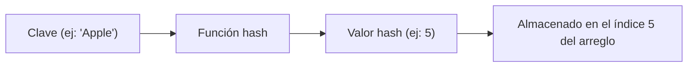
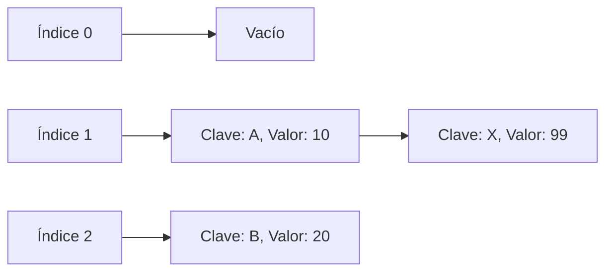

# Conceptos básicos e importancia de los algoritmos de búsqueda

En la informática moderna, los **algoritmos de búsqueda** para encontrar rápidamente valores deseados dentro de los datos son una tecnología de suma importancia que constituye la base de todos los softwares y sistemas. Nos beneficiamos de los algoritmos de búsqueda a diario, como en las búsquedas de bases de datos, búsquedas por palabras clave en navegadores web y búsquedas de nombres en aplicaciones de contactos de teléfonos inteligentes.

En este artículo, explicaremos en detalle los algoritmos fundamentales de la informática, "búsqueda lineal (Linear Search)" y "búsqueda binaria (Binary Search)", incluyendo su funcionamiento, complejidad computacional y ejemplos de implementación en Python. Además, profundizaremos hasta superar las limitaciones de estos algoritmos, llegando a los principios de la "tabla hash (Hash Table)", que logra una velocidad de búsqueda abrumadora, el papel de las funciones hash y los métodos de resolución de colisiones hash (Collision).


Profundizar en la comprensión de los algoritmos de búsqueda es indispensable para elevar sus habilidades como programador. Cuando la cantidad de datos es pequeña, el impacto de elegir un algoritmo sobre el rendimiento puede ser mínimo, pero en la era de los grandes datos, seleccionar el algoritmo y la estructura de datos adecuados es extremadamente importante para encontrar información deseada al instante entre millones o cientos de millones de datos. En particular, comprender el concepto de **complejidad temporal** ($O(n)$, $O(\log n)$, $O(1)$, etc.) es un elemento esencial para diseñar programas eficientes.

Profundizar en la comprensión de los algoritmos de búsqueda es indispensable para elevar sus habilidades como programador. Cuando la cantidad de datos es pequeña, el impacto de elegir un algoritmo sobre el rendimiento puede ser mínimo, pero en la era de los grandes datos, seleccionar el algoritmo y la estructura de datos adecuados es extremadamente importante para encontrar información deseada al instante entre millones o cientos de millones de datos. En particular, comprender el concepto de **complejidad temporal** ($O(n)$, $O(\log n)$, $O(1)$, etc.) es un elemento esencial para diseñar programas eficientes.

Profundizar en la comprensión de los algoritmos de búsqueda es indispensable para elevar sus habilidades como programador. Cuando la cantidad de datos es pequeña, el impacto de elegir un algoritmo sobre el rendimiento puede ser mínimo, pero en la era de los grandes datos, seleccionar el algoritmo y la estructura de datos adecuados es extremadamente importante para encontrar información deseada al instante entre millones o cientos de millones de datos. En particular, comprender el concepto de **complejidad temporal** ($O(n)$, $O(\log n)$, $O(1)$, etc.) es un elemento esencial para diseñar programas eficientes.

Profundizar en la comprensión de los algoritmos de búsqueda es indispensable para elevar sus habilidades como programador. Cuando la cantidad de datos es pequeña, el impacto de elegir un algoritmo sobre el rendimiento puede ser mínimo, pero en la era de los grandes datos, seleccionar el algoritmo y la estructura de datos adecuados es extremadamente importante para encontrar información deseada al instante entre millones o cientos de millones de datos. En particular, comprender el concepto de **complejidad temporal** ($O(n)$, $O(\log n)$, $O(1)$, etc.) es un elemento esencial para diseñar programas eficientes.

Profundizar en la comprensión de los algoritmos de búsqueda es indispensable para elevar sus habilidades como programador. Cuando la cantidad de datos es pequeña, el impacto de elegir un algoritmo sobre el rendimiento puede ser mínimo, pero en la era de los grandes datos, seleccionar el algoritmo y la estructura de datos adecuados es extremadamente importante para encontrar información deseada al instante entre millones o cientos de millones de datos. En particular, comprender el concepto de **complejidad temporal** ($O(n)$, $O(\log n)$, $O(1)$, etc.) es un elemento esencial para diseñar programas eficientes.

Profundizar en la comprensión de los algoritmos de búsqueda es indispensable para elevar sus habilidades como programador. Cuando la cantidad de datos es pequeña, el impacto de elegir un algoritmo sobre el rendimiento puede ser mínimo, pero en la era de los grandes datos, seleccionar el algoritmo y la estructura de datos adecuados es extremadamente importante para encontrar información deseada al instante entre millones o cientos de millones de datos. En particular, comprender el concepto de **complejidad temporal** ($O(n)$, $O(\log n)$, $O(1)$, etc.) es un elemento esencial para diseñar programas eficientes.

Profundizar en la comprensión de los algoritmos de búsqueda es indispensable para elevar sus habilidades como programador. Cuando la cantidad de datos es pequeña, el impacto de elegir un algoritmo sobre el rendimiento puede ser mínimo, pero en la era de los grandes datos, seleccionar el algoritmo y la estructura de datos adecuados es extremadamente importante para encontrar información deseada al instante entre millones o cientos de millones de datos. En particular, comprender el concepto de **complejidad temporal** ($O(n)$, $O(\log n)$, $O(1)$, etc.) es un elemento esencial para diseñar programas eficientes.

Profundizar en la comprensión de los algoritmos de búsqueda es indispensable para elevar sus habilidades como programador. Cuando la cantidad de datos es pequeña, el impacto de elegir un algoritmo sobre el rendimiento puede ser mínimo, pero en la era de los grandes datos, seleccionar el algoritmo y la estructura de datos adecuados es extremadamente importante para encontrar información deseada al instante entre millones o cientos de millones de datos. En particular, comprender el concepto de **complejidad temporal** ($O(n)$, $O(\log n)$, $O(1)$, etc.) es un elemento esencial para diseñar programas eficientes.

Profundizar en la comprensión de los algoritmos de búsqueda es indispensable para elevar sus habilidades como programador. Cuando la cantidad de datos es pequeña, el impacto de elegir un algoritmo sobre el rendimiento puede ser mínimo, pero en la era de los grandes datos, seleccionar el algoritmo y la estructura de datos adecuados es extremadamente importante para encontrar información deseada al instante entre millones o cientos de millones de datos. En particular, comprender el concepto de **complejidad temporal** ($O(n)$, $O(\log n)$, $O(1)$, etc.) es un elemento esencial para diseñar programas eficientes.

Profundizar en la comprensión de los algoritmos de búsqueda es indispensable para elevar sus habilidades como programador. Cuando la cantidad de datos es pequeña, el impacto de elegir un algoritmo sobre el rendimiento puede ser mínimo, pero en la era de los grandes datos, seleccionar el algoritmo y la estructura de datos adecuados es extremadamente importante para encontrar información deseada al instante entre millones o cientos de millones de datos. En particular, comprender el concepto de **complejidad temporal** ($O(n)$, $O(\log n)$, $O(1)$, etc.) es un elemento esencial para diseñar programas eficientes.

## 1. Búsqueda lineal (Linear Search)

La búsqueda lineal es el algoritmo de búsqueda más simple e intuitivo, en el que se verifican los elementos uno por uno en orden desde el principio hasta el final de una estructura de datos (como un arreglo o lista) hasta que se encuentra el valor deseado.

### 1.1 Funcionamiento de la búsqueda lineal

El algoritmo de búsqueda lineal procede con los siguientes pasos.

1. Extraer el primer elemento del arreglo.
2. Comprobar si el elemento extraído coincide con el valor deseado (objetivo).
3. Si coincide, devuelve el índice (posición) de ese elemento y finaliza la búsqueda.
4. Si no coincide, pasa al siguiente elemento.
5. Si se comprueba hasta el final del arreglo y no se encuentra el objetivo, termina como búsqueda fallida (por ejemplo, devolviendo `-1` o `None`).

```mermaid
flowchart TD
    A["Inicio de búsqueda"] --> B["Índice i = 0"]
    B --> C{"¿i < longitud del arreglo?"}
    C -- "Sí" --> D{"¿arreglo["i"] == objetivo?"}
    C -- "No" --> E["Búsqueda fallida (no encontrado)"]
    D -- "Sí" --> F["Devolver índice i"]
    D -- "No" --> G["Incrementar i en 1"]
    G --> C
```

### 1.2 Implementación de la búsqueda lineal en Python

A continuación se muestra un ejemplo de implementación simple de la búsqueda lineal en Python.

```python
def linear_search(arr, target):
    """
    Función que ejecuta la búsqueda lineal
    :param arr: Lista a buscar
    :param target: Valor a encontrar
    :return: Su índice si se encuentra, -1 si no se encuentra
    """
    for i in range(len(arr)):
        if arr[i] == target:
            return i
    return -1

# Datos de prueba
numbers = [10, 23, 4, 15, 2, 7, 34, 11]
target_value = 7

result_index = linear_search(numbers, target_value)
if result_index != -1:
    print(f"El elemento {target_value} se encontró en el índice {result_index}.")
else:
    print(f"El elemento {target_value} no existe en la lista.")
```


La mayor característica de la búsqueda lineal es que los datos no necesitan estar ordenados. Incluso si los datos están almacenados en orden aleatorio, se verifican secuencialmente desde el principio, por lo que seguramente podrá encontrar el valor deseado (o confirmar que no existe). Sin embargo, esta naturaleza de "verificar todo en orden" es el mayor factor de disminución del rendimiento cuando la cantidad de datos es grande.

La mayor característica de la búsqueda lineal es que los datos no necesitan estar ordenados. Incluso si los datos están almacenados en orden aleatorio, se verifican secuencialmente desde el principio, por lo que seguramente podrá encontrar el valor deseado (o confirmar que no existe). Sin embargo, esta naturaleza de "verificar todo en orden" es el mayor factor de disminución del rendimiento cuando la cantidad de datos es grande.

La mayor característica de la búsqueda lineal es que los datos no necesitan estar ordenados. Incluso si los datos están almacenados en orden aleatorio, se verifican secuencialmente desde el principio, por lo que seguramente podrá encontrar el valor deseado (o confirmar que no existe). Sin embargo, esta naturaleza de "verificar todo en orden" es el mayor factor de disminución del rendimiento cuando la cantidad de datos es grande.

La mayor característica de la búsqueda lineal es que los datos no necesitan estar ordenados. Incluso si los datos están almacenados en orden aleatorio, se verifican secuencialmente desde el principio, por lo que seguramente podrá encontrar el valor deseado (o confirmar que no existe). Sin embargo, esta naturaleza de "verificar todo en orden" es el mayor factor de disminución del rendimiento cuando la cantidad de datos es grande.

La mayor característica de la búsqueda lineal es que los datos no necesitan estar ordenados. Incluso si los datos están almacenados en orden aleatorio, se verifican secuencialmente desde el principio, por lo que seguramente podrá encontrar el valor deseado (o confirmar que no existe). Sin embargo, esta naturaleza de "verificar todo en orden" es el mayor factor de disminución del rendimiento cuando la cantidad de datos es grande.

La mayor característica de la búsqueda lineal es que los datos no necesitan estar ordenados. Incluso si los datos están almacenados en orden aleatorio, se verifican secuencialmente desde el principio, por lo que seguramente podrá encontrar el valor deseado (o confirmar que no existe). Sin embargo, esta naturaleza de "verificar todo en orden" es el mayor factor de disminución del rendimiento cuando la cantidad de datos es grande.

La mayor característica de la búsqueda lineal es que los datos no necesitan estar ordenados. Incluso si los datos están almacenados en orden aleatorio, se verifican secuencialmente desde el principio, por lo que seguramente podrá encontrar el valor deseado (o confirmar que no existe). Sin embargo, esta naturaleza de "verificar todo en orden" es el mayor factor de disminución del rendimiento cuando la cantidad de datos es grande.

La mayor característica de la búsqueda lineal es que los datos no necesitan estar ordenados. Incluso si los datos están almacenados en orden aleatorio, se verifican secuencialmente desde el principio, por lo que seguramente podrá encontrar el valor deseado (o confirmar que no existe). Sin embargo, esta naturaleza de "verificar todo en orden" es el mayor factor de disminución del rendimiento cuando la cantidad de datos es grande.

La mayor característica de la búsqueda lineal es que los datos no necesitan estar ordenados. Incluso si los datos están almacenados en orden aleatorio, se verifican secuencialmente desde el principio, por lo que seguramente podrá encontrar el valor deseado (o confirmar que no existe). Sin embargo, esta naturaleza de "verificar todo en orden" es el mayor factor de disminución del rendimiento cuando la cantidad de datos es grande.

La mayor característica de la búsqueda lineal es que los datos no necesitan estar ordenados. Incluso si los datos están almacenados en orden aleatorio, se verifican secuencialmente desde el principio, por lo que seguramente podrá encontrar el valor deseado (o confirmar que no existe). Sin embargo, esta naturaleza de "verificar todo en orden" es el mayor factor de disminución del rendimiento cuando la cantidad de datos es grande.

La mayor característica de la búsqueda lineal es que los datos no necesitan estar ordenados. Incluso si los datos están almacenados en orden aleatorio, se verifican secuencialmente desde el principio, por lo que seguramente podrá encontrar el valor deseado (o confirmar que no existe). Sin embargo, esta naturaleza de "verificar todo en orden" es el mayor factor de disminución del rendimiento cuando la cantidad de datos es grande.

La mayor característica de la búsqueda lineal es que los datos no necesitan estar ordenados. Incluso si los datos están almacenados en orden aleatorio, se verifican secuencialmente desde el principio, por lo que seguramente podrá encontrar el valor deseado (o confirmar que no existe). Sin embargo, esta naturaleza de "verificar todo en orden" es el mayor factor de disminución del rendimiento cuando la cantidad de datos es grande.

La mayor característica de la búsqueda lineal es que los datos no necesitan estar ordenados. Incluso si los datos están almacenados en orden aleatorio, se verifican secuencialmente desde el principio, por lo que seguramente podrá encontrar el valor deseado (o confirmar que no existe). Sin embargo, esta naturaleza de "verificar todo en orden" es el mayor factor de disminución del rendimiento cuando la cantidad de datos es grande.

La mayor característica de la búsqueda lineal es que los datos no necesitan estar ordenados. Incluso si los datos están almacenados en orden aleatorio, se verifican secuencialmente desde el principio, por lo que seguramente podrá encontrar el valor deseado (o confirmar que no existe). Sin embargo, esta naturaleza de "verificar todo en orden" es el mayor factor de disminución del rendimiento cuando la cantidad de datos es grande.

La mayor característica de la búsqueda lineal es que los datos no necesitan estar ordenados. Incluso si los datos están almacenados en orden aleatorio, se verifican secuencialmente desde el principio, por lo que seguramente podrá encontrar el valor deseado (o confirmar que no existe). Sin embargo, esta naturaleza de "verificar todo en orden" es el mayor factor de disminución del rendimiento cuando la cantidad de datos es grande.

La mayor característica de la búsqueda lineal es que los datos no necesitan estar ordenados. Incluso si los datos están almacenados en orden aleatorio, se verifican secuencialmente desde el principio, por lo que seguramente podrá encontrar el valor deseado (o confirmar que no existe). Sin embargo, esta naturaleza de "verificar todo en orden" es el mayor factor de disminución del rendimiento cuando la cantidad de datos es grande.

La mayor característica de la búsqueda lineal es que los datos no necesitan estar ordenados. Incluso si los datos están almacenados en orden aleatorio, se verifican secuencialmente desde el principio, por lo que seguramente podrá encontrar el valor deseado (o confirmar que no existe). Sin embargo, esta naturaleza de "verificar todo en orden" es el mayor factor de disminución del rendimiento cuando la cantidad de datos es grande.

La mayor característica de la búsqueda lineal es que los datos no necesitan estar ordenados. Incluso si los datos están almacenados en orden aleatorio, se verifican secuencialmente desde el principio, por lo que seguramente podrá encontrar el valor deseado (o confirmar que no existe). Sin embargo, esta naturaleza de "verificar todo en orden" es el mayor factor de disminución del rendimiento cuando la cantidad de datos es grande.

La mayor característica de la búsqueda lineal es que los datos no necesitan estar ordenados. Incluso si los datos están almacenados en orden aleatorio, se verifican secuencialmente desde el principio, por lo que seguramente podrá encontrar el valor deseado (o confirmar que no existe). Sin embargo, esta naturaleza de "verificar todo en orden" es el mayor factor de disminución del rendimiento cuando la cantidad de datos es grande.

La mayor característica de la búsqueda lineal es que los datos no necesitan estar ordenados. Incluso si los datos están almacenados en orden aleatorio, se verifican secuencialmente desde el principio, por lo que seguramente podrá encontrar el valor deseado (o confirmar que no existe). Sin embargo, esta naturaleza de "verificar todo en orden" es el mayor factor de disminución del rendimiento cuando la cantidad de datos es grande.

La mayor característica de la búsqueda lineal es que los datos no necesitan estar ordenados. Incluso si los datos están almacenados en orden aleatorio, se verifican secuencialmente desde el principio, por lo que seguramente podrá encontrar el valor deseado (o confirmar que no existe). Sin embargo, esta naturaleza de "verificar todo en orden" es el mayor factor de disminución del rendimiento cuando la cantidad de datos es grande.

La mayor característica de la búsqueda lineal es que los datos no necesitan estar ordenados. Incluso si los datos están almacenados en orden aleatorio, se verifican secuencialmente desde el principio, por lo que seguramente podrá encontrar el valor deseado (o confirmar que no existe). Sin embargo, esta naturaleza de "verificar todo en orden" es el mayor factor de disminución del rendimiento cuando la cantidad de datos es grande.

La mayor característica de la búsqueda lineal es que los datos no necesitan estar ordenados. Incluso si los datos están almacenados en orden aleatorio, se verifican secuencialmente desde el principio, por lo que seguramente podrá encontrar el valor deseado (o confirmar que no existe). Sin embargo, esta naturaleza de "verificar todo en orden" es el mayor factor de disminución del rendimiento cuando la cantidad de datos es grande.

La mayor característica de la búsqueda lineal es que los datos no necesitan estar ordenados. Incluso si los datos están almacenados en orden aleatorio, se verifican secuencialmente desde el principio, por lo que seguramente podrá encontrar el valor deseado (o confirmar que no existe). Sin embargo, esta naturaleza de "verificar todo en orden" es el mayor factor de disminución del rendimiento cuando la cantidad de datos es grande.

La mayor característica de la búsqueda lineal es que los datos no necesitan estar ordenados. Incluso si los datos están almacenados en orden aleatorio, se verifican secuencialmente desde el principio, por lo que seguramente podrá encontrar el valor deseado (o confirmar que no existe). Sin embargo, esta naturaleza de "verificar todo en orden" es el mayor factor de disminución del rendimiento cuando la cantidad de datos es grande.

La mayor característica de la búsqueda lineal es que los datos no necesitan estar ordenados. Incluso si los datos están almacenados en orden aleatorio, se verifican secuencialmente desde el principio, por lo que seguramente podrá encontrar el valor deseado (o confirmar que no existe). Sin embargo, esta naturaleza de "verificar todo en orden" es el mayor factor de disminución del rendimiento cuando la cantidad de datos es grande.

La mayor característica de la búsqueda lineal es que los datos no necesitan estar ordenados. Incluso si los datos están almacenados en orden aleatorio, se verifican secuencialmente desde el principio, por lo que seguramente podrá encontrar el valor deseado (o confirmar que no existe). Sin embargo, esta naturaleza de "verificar todo en orden" es el mayor factor de disminución del rendimiento cuando la cantidad de datos es grande.

La mayor característica de la búsqueda lineal es que los datos no necesitan estar ordenados. Incluso si los datos están almacenados en orden aleatorio, se verifican secuencialmente desde el principio, por lo que seguramente podrá encontrar el valor deseado (o confirmar que no existe). Sin embargo, esta naturaleza de "verificar todo en orden" es el mayor factor de disminución del rendimiento cuando la cantidad de datos es grande.

La mayor característica de la búsqueda lineal es que los datos no necesitan estar ordenados. Incluso si los datos están almacenados en orden aleatorio, se verifican secuencialmente desde el principio, por lo que seguramente podrá encontrar el valor deseado (o confirmar que no existe). Sin embargo, esta naturaleza de "verificar todo en orden" es el mayor factor de disminución del rendimiento cuando la cantidad de datos es grande.

La mayor característica de la búsqueda lineal es que los datos no necesitan estar ordenados. Incluso si los datos están almacenados en orden aleatorio, se verifican secuencialmente desde el principio, por lo que seguramente podrá encontrar el valor deseado (o confirmar que no existe). Sin embargo, esta naturaleza de "verificar todo en orden" es el mayor factor de disminución del rendimiento cuando la cantidad de datos es grande.

La mayor característica de la búsqueda lineal es que los datos no necesitan estar ordenados. Incluso si los datos están almacenados en orden aleatorio, se verifican secuencialmente desde el principio, por lo que seguramente podrá encontrar el valor deseado (o confirmar que no existe). Sin embargo, esta naturaleza de "verificar todo en orden" es el mayor factor de disminución del rendimiento cuando la cantidad de datos es grande.

La mayor característica de la búsqueda lineal es que los datos no necesitan estar ordenados. Incluso si los datos están almacenados en orden aleatorio, se verifican secuencialmente desde el principio, por lo que seguramente podrá encontrar el valor deseado (o confirmar que no existe). Sin embargo, esta naturaleza de "verificar todo en orden" es el mayor factor de disminución del rendimiento cuando la cantidad de datos es grande.

La mayor característica de la búsqueda lineal es que los datos no necesitan estar ordenados. Incluso si los datos están almacenados en orden aleatorio, se verifican secuencialmente desde el principio, por lo que seguramente podrá encontrar el valor deseado (o confirmar que no existe). Sin embargo, esta naturaleza de "verificar todo en orden" es el mayor factor de disminución del rendimiento cuando la cantidad de datos es grande.

La mayor característica de la búsqueda lineal es que los datos no necesitan estar ordenados. Incluso si los datos están almacenados en orden aleatorio, se verifican secuencialmente desde el principio, por lo que seguramente podrá encontrar el valor deseado (o confirmar que no existe). Sin embargo, esta naturaleza de "verificar todo en orden" es el mayor factor de disminución del rendimiento cuando la cantidad de datos es grande.

La mayor característica de la búsqueda lineal es que los datos no necesitan estar ordenados. Incluso si los datos están almacenados en orden aleatorio, se verifican secuencialmente desde el principio, por lo que seguramente podrá encontrar el valor deseado (o confirmar que no existe). Sin embargo, esta naturaleza de "verificar todo en orden" es el mayor factor de disminución del rendimiento cuando la cantidad de datos es grande.

La mayor característica de la búsqueda lineal es que los datos no necesitan estar ordenados. Incluso si los datos están almacenados en orden aleatorio, se verifican secuencialmente desde el principio, por lo que seguramente podrá encontrar el valor deseado (o confirmar que no existe). Sin embargo, esta naturaleza de "verificar todo en orden" es el mayor factor de disminución del rendimiento cuando la cantidad de datos es grande.

La mayor característica de la búsqueda lineal es que los datos no necesitan estar ordenados. Incluso si los datos están almacenados en orden aleatorio, se verifican secuencialmente desde el principio, por lo que seguramente podrá encontrar el valor deseado (o confirmar que no existe). Sin embargo, esta naturaleza de "verificar todo en orden" es el mayor factor de disminución del rendimiento cuando la cantidad de datos es grande.

La mayor característica de la búsqueda lineal es que los datos no necesitan estar ordenados. Incluso si los datos están almacenados en orden aleatorio, se verifican secuencialmente desde el principio, por lo que seguramente podrá encontrar el valor deseado (o confirmar que no existe). Sin embargo, esta naturaleza de "verificar todo en orden" es el mayor factor de disminución del rendimiento cuando la cantidad de datos es grande.

La mayor característica de la búsqueda lineal es que los datos no necesitan estar ordenados. Incluso si los datos están almacenados en orden aleatorio, se verifican secuencialmente desde el principio, por lo que seguramente podrá encontrar el valor deseado (o confirmar que no existe). Sin embargo, esta naturaleza de "verificar todo en orden" es el mayor factor de disminución del rendimiento cuando la cantidad de datos es grande.

La mayor característica de la búsqueda lineal es que los datos no necesitan estar ordenados. Incluso si los datos están almacenados en orden aleatorio, se verifican secuencialmente desde el principio, por lo que seguramente podrá encontrar el valor deseado (o confirmar que no existe). Sin embargo, esta naturaleza de "verificar todo en orden" es el mayor factor de disminución del rendimiento cuando la cantidad de datos es grande.

La mayor característica de la búsqueda lineal es que los datos no necesitan estar ordenados. Incluso si los datos están almacenados en orden aleatorio, se verifican secuencialmente desde el principio, por lo que seguramente podrá encontrar el valor deseado (o confirmar que no existe). Sin embargo, esta naturaleza de "verificar todo en orden" es el mayor factor de disminución del rendimiento cuando la cantidad de datos es grande.

La mayor característica de la búsqueda lineal es que los datos no necesitan estar ordenados. Incluso si los datos están almacenados en orden aleatorio, se verifican secuencialmente desde el principio, por lo que seguramente podrá encontrar el valor deseado (o confirmar que no existe). Sin embargo, esta naturaleza de "verificar todo en orden" es el mayor factor de disminución del rendimiento cuando la cantidad de datos es grande.

La mayor característica de la búsqueda lineal es que los datos no necesitan estar ordenados. Incluso si los datos están almacenados en orden aleatorio, se verifican secuencialmente desde el principio, por lo que seguramente podrá encontrar el valor deseado (o confirmar que no existe). Sin embargo, esta naturaleza de "verificar todo en orden" es el mayor factor de disminución del rendimiento cuando la cantidad de datos es grande.

La mayor característica de la búsqueda lineal es que los datos no necesitan estar ordenados. Incluso si los datos están almacenados en orden aleatorio, se verifican secuencialmente desde el principio, por lo que seguramente podrá encontrar el valor deseado (o confirmar que no existe). Sin embargo, esta naturaleza de "verificar todo en orden" es el mayor factor de disminución del rendimiento cuando la cantidad de datos es grande.

La mayor característica de la búsqueda lineal es que los datos no necesitan estar ordenados. Incluso si los datos están almacenados en orden aleatorio, se verifican secuencialmente desde el principio, por lo que seguramente podrá encontrar el valor deseado (o confirmar que no existe). Sin embargo, esta naturaleza de "verificar todo en orden" es el mayor factor de disminución del rendimiento cuando la cantidad de datos es grande.

La mayor característica de la búsqueda lineal es que los datos no necesitan estar ordenados. Incluso si los datos están almacenados en orden aleatorio, se verifican secuencialmente desde el principio, por lo que seguramente podrá encontrar el valor deseado (o confirmar que no existe). Sin embargo, esta naturaleza de "verificar todo en orden" es el mayor factor de disminución del rendimiento cuando la cantidad de datos es grande.

La mayor característica de la búsqueda lineal es que los datos no necesitan estar ordenados. Incluso si los datos están almacenados en orden aleatorio, se verifican secuencialmente desde el principio, por lo que seguramente podrá encontrar el valor deseado (o confirmar que no existe). Sin embargo, esta naturaleza de "verificar todo en orden" es el mayor factor de disminución del rendimiento cuando la cantidad de datos es grande.

La mayor característica de la búsqueda lineal es que los datos no necesitan estar ordenados. Incluso si los datos están almacenados en orden aleatorio, se verifican secuencialmente desde el principio, por lo que seguramente podrá encontrar el valor deseado (o confirmar que no existe). Sin embargo, esta naturaleza de "verificar todo en orden" es el mayor factor de disminución del rendimiento cuando la cantidad de datos es grande.

La mayor característica de la búsqueda lineal es que los datos no necesitan estar ordenados. Incluso si los datos están almacenados en orden aleatorio, se verifican secuencialmente desde el principio, por lo que seguramente podrá encontrar el valor deseado (o confirmar que no existe). Sin embargo, esta naturaleza de "verificar todo en orden" es el mayor factor de disminución del rendimiento cuando la cantidad de datos es grande.

La mayor característica de la búsqueda lineal es que los datos no necesitan estar ordenados. Incluso si los datos están almacenados en orden aleatorio, se verifican secuencialmente desde el principio, por lo que seguramente podrá encontrar el valor deseado (o confirmar que no existe). Sin embargo, esta naturaleza de "verificar todo en orden" es el mayor factor de disminución del rendimiento cuando la cantidad de datos es grande.

## 2. Búsqueda binaria (Binary Search)

La búsqueda binaria es un algoritmo de búsqueda muy rápido y eficiente que solo se puede aplicar a **datos previamente ordenados (ascendente o descendente)**. Al reducir el rango de búsqueda a la mitad cada vez, la complejidad computacional se reduce drásticamente.

### 2.1 Funcionamiento de la búsqueda binaria

La búsqueda binaria se realiza con los siguientes pasos.

1. Inicializar los índices "extremo izquierdo (`low`)" y "extremo derecho (`high`)" del arreglo a buscar.
2. Mientras el rango de búsqueda sea válido (`low <= high`), repita el siguiente proceso.
3. Calcular el índice central (`mid`) del rango de búsqueda.
4. Comparar el elemento central (`arr[mid]`) con el valor deseado (objetivo).
5. Si coinciden, devuelva `mid` y finalice.
6. Si el elemento central es menor que el objetivo, el objetivo existirá en la mitad derecha, así que actualice el extremo izquierdo a `mid + 1`.
7. Si el elemento central es mayor que el objetivo, el objetivo existirá en la mitad izquierda, así que actualice el extremo derecho a `mid - 1`.
8. Si se agota el rango de búsqueda y no se encuentra, se considera una búsqueda fallida.

```mermaid
flowchart TD
    A["Inicio de búsqueda"] --> B["low = 0, high = len - 1"]
    B --> C{"¿low <= high?"}
    C -- "No" --> D["Búsqueda fallida"]
    C -- "Yes" --> E["mid = (low + high) / 2"]
    E --> F{"¿arr["mid"] == target?"}
    F -- "Sí" --> G["Devolver mid"]
    F -- "No" --> H{"¿arr["mid"] < target?"}
    H -- "Yes" --> I["low = mid + 1"]
    H -- "No" --> J["high = mid - 1"]
    I --> C
    J --> C
```

### 2.2 Implementación de la búsqueda binaria en Python (Método iterativo)

```python
def binary_search(arr, target):
    """
    Función que ejecuta la búsqueda binaria (método iterativo)
    :param arr: Lista ordenada a buscar
    :param target: Valor a encontrar
    :return: Su índice si se encuentra, -1 si no se encuentra
    """
    low = 0
    high = len(arr) - 1

    while low <= high:
        mid = (low + high) // 2
        
        if arr[mid] == target:
            return mid
        elif arr[mid] < target:
            low = mid + 1
        else:
            high = mid - 1
            
    return -1

# Datos de prueba（debe estar ordenado）
sorted_numbers = [2, 4, 7, 10, 11, 15, 23, 34]
target_value = 15

result_index = binary_search(sorted_numbers, target_value)
if result_index != -1:
    print(f"El elemento {target_value} se encontró en el índice {result_index}.")
else:
    print(f"El elemento {target_value} no existe en la lista.")
```

El increíble rendimiento de la búsqueda binaria proviene de la propiedad de dividir el rango de búsqueda a la mitad cada vez. Por ejemplo, al realizar una búsqueda lineal en un arreglo de 1 millón de elementos, en el peor de los casos se requieren 1 millón de comparaciones, pero con la búsqueda binaria, se puede encontrar el valor deseado con solo unas 20 comparaciones ($2^{20} \approx 1,000,000$). Por lo tanto, en operaciones de búsqueda en grandes conjuntos de datos, la búsqueda binaria cuenta con una abrumadora ventaja sobre la búsqueda lineal. Matemáticamente, la complejidad temporal de la búsqueda binaria se expresa como $O(\log n)$.

El increíble rendimiento de la búsqueda binaria proviene de la propiedad de dividir el rango de búsqueda a la mitad cada vez. Por ejemplo, al realizar una búsqueda lineal en un arreglo de 1 millón de elementos, en el peor de los casos se requieren 1 millón de comparaciones, pero con la búsqueda binaria, se puede encontrar el valor deseado con solo unas 20 comparaciones ($2^{20} \approx 1,000,000$). Por lo tanto, en operaciones de búsqueda en grandes conjuntos de datos, la búsqueda binaria cuenta con una abrumadora ventaja sobre la búsqueda lineal. Matemáticamente, la complejidad temporal de la búsqueda binaria se expresa como $O(\log n)$.

El increíble rendimiento de la búsqueda binaria proviene de la propiedad de dividir el rango de búsqueda a la mitad cada vez. Por ejemplo, al realizar una búsqueda lineal en un arreglo de 1 millón de elementos, en el peor de los casos se requieren 1 millón de comparaciones, pero con la búsqueda binaria, se puede encontrar el valor deseado con solo unas 20 comparaciones ($2^{20} \approx 1,000,000$). Por lo tanto, en operaciones de búsqueda en grandes conjuntos de datos, la búsqueda binaria cuenta con una abrumadora ventaja sobre la búsqueda lineal. Matemáticamente, la complejidad temporal de la búsqueda binaria se expresa como $O(\log n)$.

El increíble rendimiento de la búsqueda binaria proviene de la propiedad de dividir el rango de búsqueda a la mitad cada vez. Por ejemplo, al realizar una búsqueda lineal en un arreglo de 1 millón de elementos, en el peor de los casos se requieren 1 millón de comparaciones, pero con la búsqueda binaria, se puede encontrar el valor deseado con solo unas 20 comparaciones ($2^{20} \approx 1,000,000$). Por lo tanto, en operaciones de búsqueda en grandes conjuntos de datos, la búsqueda binaria cuenta con una abrumadora ventaja sobre la búsqueda lineal. Matemáticamente, la complejidad temporal de la búsqueda binaria se expresa como $O(\log n)$.

El increíble rendimiento de la búsqueda binaria proviene de la propiedad de dividir el rango de búsqueda a la mitad cada vez. Por ejemplo, al realizar una búsqueda lineal en un arreglo de 1 millón de elementos, en el peor de los casos se requieren 1 millón de comparaciones, pero con la búsqueda binaria, se puede encontrar el valor deseado con solo unas 20 comparaciones ($2^{20} \approx 1,000,000$). Por lo tanto, en operaciones de búsqueda en grandes conjuntos de datos, la búsqueda binaria cuenta con una abrumadora ventaja sobre la búsqueda lineal. Matemáticamente, la complejidad temporal de la búsqueda binaria se expresa como $O(\log n)$.

El increíble rendimiento de la búsqueda binaria proviene de la propiedad de dividir el rango de búsqueda a la mitad cada vez. Por ejemplo, al realizar una búsqueda lineal en un arreglo de 1 millón de elementos, en el peor de los casos se requieren 1 millón de comparaciones, pero con la búsqueda binaria, se puede encontrar el valor deseado con solo unas 20 comparaciones ($2^{20} \approx 1,000,000$). Por lo tanto, en operaciones de búsqueda en grandes conjuntos de datos, la búsqueda binaria cuenta con una abrumadora ventaja sobre la búsqueda lineal. Matemáticamente, la complejidad temporal de la búsqueda binaria se expresa como $O(\log n)$.

El increíble rendimiento de la búsqueda binaria proviene de la propiedad de dividir el rango de búsqueda a la mitad cada vez. Por ejemplo, al realizar una búsqueda lineal en un arreglo de 1 millón de elementos, en el peor de los casos se requieren 1 millón de comparaciones, pero con la búsqueda binaria, se puede encontrar el valor deseado con solo unas 20 comparaciones ($2^{20} \approx 1,000,000$). Por lo tanto, en operaciones de búsqueda en grandes conjuntos de datos, la búsqueda binaria cuenta con una abrumadora ventaja sobre la búsqueda lineal. Matemáticamente, la complejidad temporal de la búsqueda binaria se expresa como $O(\log n)$.

El increíble rendimiento de la búsqueda binaria proviene de la propiedad de dividir el rango de búsqueda a la mitad cada vez. Por ejemplo, al realizar una búsqueda lineal en un arreglo de 1 millón de elementos, en el peor de los casos se requieren 1 millón de comparaciones, pero con la búsqueda binaria, se puede encontrar el valor deseado con solo unas 20 comparaciones ($2^{20} \approx 1,000,000$). Por lo tanto, en operaciones de búsqueda en grandes conjuntos de datos, la búsqueda binaria cuenta con una abrumadora ventaja sobre la búsqueda lineal. Matemáticamente, la complejidad temporal de la búsqueda binaria se expresa como $O(\log n)$.

El increíble rendimiento de la búsqueda binaria proviene de la propiedad de dividir el rango de búsqueda a la mitad cada vez. Por ejemplo, al realizar una búsqueda lineal en un arreglo de 1 millón de elementos, en el peor de los casos se requieren 1 millón de comparaciones, pero con la búsqueda binaria, se puede encontrar el valor deseado con solo unas 20 comparaciones ($2^{20} \approx 1,000,000$). Por lo tanto, en operaciones de búsqueda en grandes conjuntos de datos, la búsqueda binaria cuenta con una abrumadora ventaja sobre la búsqueda lineal. Matemáticamente, la complejidad temporal de la búsqueda binaria se expresa como $O(\log n)$.

El increíble rendimiento de la búsqueda binaria proviene de la propiedad de dividir el rango de búsqueda a la mitad cada vez. Por ejemplo, al realizar una búsqueda lineal en un arreglo de 1 millón de elementos, en el peor de los casos se requieren 1 millón de comparaciones, pero con la búsqueda binaria, se puede encontrar el valor deseado con solo unas 20 comparaciones ($2^{20} \approx 1,000,000$). Por lo tanto, en operaciones de búsqueda en grandes conjuntos de datos, la búsqueda binaria cuenta con una abrumadora ventaja sobre la búsqueda lineal. Matemáticamente, la complejidad temporal de la búsqueda binaria se expresa como $O(\log n)$.

El increíble rendimiento de la búsqueda binaria proviene de la propiedad de dividir el rango de búsqueda a la mitad cada vez. Por ejemplo, al realizar una búsqueda lineal en un arreglo de 1 millón de elementos, en el peor de los casos se requieren 1 millón de comparaciones, pero con la búsqueda binaria, se puede encontrar el valor deseado con solo unas 20 comparaciones ($2^{20} \approx 1,000,000$). Por lo tanto, en operaciones de búsqueda en grandes conjuntos de datos, la búsqueda binaria cuenta con una abrumadora ventaja sobre la búsqueda lineal. Matemáticamente, la complejidad temporal de la búsqueda binaria se expresa como $O(\log n)$.

El increíble rendimiento de la búsqueda binaria proviene de la propiedad de dividir el rango de búsqueda a la mitad cada vez. Por ejemplo, al realizar una búsqueda lineal en un arreglo de 1 millón de elementos, en el peor de los casos se requieren 1 millón de comparaciones, pero con la búsqueda binaria, se puede encontrar el valor deseado con solo unas 20 comparaciones ($2^{20} \approx 1,000,000$). Por lo tanto, en operaciones de búsqueda en grandes conjuntos de datos, la búsqueda binaria cuenta con una abrumadora ventaja sobre la búsqueda lineal. Matemáticamente, la complejidad temporal de la búsqueda binaria se expresa como $O(\log n)$.

El increíble rendimiento de la búsqueda binaria proviene de la propiedad de dividir el rango de búsqueda a la mitad cada vez. Por ejemplo, al realizar una búsqueda lineal en un arreglo de 1 millón de elementos, en el peor de los casos se requieren 1 millón de comparaciones, pero con la búsqueda binaria, se puede encontrar el valor deseado con solo unas 20 comparaciones ($2^{20} \approx 1,000,000$). Por lo tanto, en operaciones de búsqueda en grandes conjuntos de datos, la búsqueda binaria cuenta con una abrumadora ventaja sobre la búsqueda lineal. Matemáticamente, la complejidad temporal de la búsqueda binaria se expresa como $O(\log n)$.

El increíble rendimiento de la búsqueda binaria proviene de la propiedad de dividir el rango de búsqueda a la mitad cada vez. Por ejemplo, al realizar una búsqueda lineal en un arreglo de 1 millón de elementos, en el peor de los casos se requieren 1 millón de comparaciones, pero con la búsqueda binaria, se puede encontrar el valor deseado con solo unas 20 comparaciones ($2^{20} \approx 1,000,000$). Por lo tanto, en operaciones de búsqueda en grandes conjuntos de datos, la búsqueda binaria cuenta con una abrumadora ventaja sobre la búsqueda lineal. Matemáticamente, la complejidad temporal de la búsqueda binaria se expresa como $O(\log n)$.

El increíble rendimiento de la búsqueda binaria proviene de la propiedad de dividir el rango de búsqueda a la mitad cada vez. Por ejemplo, al realizar una búsqueda lineal en un arreglo de 1 millón de elementos, en el peor de los casos se requieren 1 millón de comparaciones, pero con la búsqueda binaria, se puede encontrar el valor deseado con solo unas 20 comparaciones ($2^{20} \approx 1,000,000$). Por lo tanto, en operaciones de búsqueda en grandes conjuntos de datos, la búsqueda binaria cuenta con una abrumadora ventaja sobre la búsqueda lineal. Matemáticamente, la complejidad temporal de la búsqueda binaria se expresa como $O(\log n)$.

El increíble rendimiento de la búsqueda binaria proviene de la propiedad de dividir el rango de búsqueda a la mitad cada vez. Por ejemplo, al realizar una búsqueda lineal en un arreglo de 1 millón de elementos, en el peor de los casos se requieren 1 millón de comparaciones, pero con la búsqueda binaria, se puede encontrar el valor deseado con solo unas 20 comparaciones ($2^{20} \approx 1,000,000$). Por lo tanto, en operaciones de búsqueda en grandes conjuntos de datos, la búsqueda binaria cuenta con una abrumadora ventaja sobre la búsqueda lineal. Matemáticamente, la complejidad temporal de la búsqueda binaria se expresa como $O(\log n)$.

El increíble rendimiento de la búsqueda binaria proviene de la propiedad de dividir el rango de búsqueda a la mitad cada vez. Por ejemplo, al realizar una búsqueda lineal en un arreglo de 1 millón de elementos, en el peor de los casos se requieren 1 millón de comparaciones, pero con la búsqueda binaria, se puede encontrar el valor deseado con solo unas 20 comparaciones ($2^{20} \approx 1,000,000$). Por lo tanto, en operaciones de búsqueda en grandes conjuntos de datos, la búsqueda binaria cuenta con una abrumadora ventaja sobre la búsqueda lineal. Matemáticamente, la complejidad temporal de la búsqueda binaria se expresa como $O(\log n)$.

El increíble rendimiento de la búsqueda binaria proviene de la propiedad de dividir el rango de búsqueda a la mitad cada vez. Por ejemplo, al realizar una búsqueda lineal en un arreglo de 1 millón de elementos, en el peor de los casos se requieren 1 millón de comparaciones, pero con la búsqueda binaria, se puede encontrar el valor deseado con solo unas 20 comparaciones ($2^{20} \approx 1,000,000$). Por lo tanto, en operaciones de búsqueda en grandes conjuntos de datos, la búsqueda binaria cuenta con una abrumadora ventaja sobre la búsqueda lineal. Matemáticamente, la complejidad temporal de la búsqueda binaria se expresa como $O(\log n)$.

El increíble rendimiento de la búsqueda binaria proviene de la propiedad de dividir el rango de búsqueda a la mitad cada vez. Por ejemplo, al realizar una búsqueda lineal en un arreglo de 1 millón de elementos, en el peor de los casos se requieren 1 millón de comparaciones, pero con la búsqueda binaria, se puede encontrar el valor deseado con solo unas 20 comparaciones ($2^{20} \approx 1,000,000$). Por lo tanto, en operaciones de búsqueda en grandes conjuntos de datos, la búsqueda binaria cuenta con una abrumadora ventaja sobre la búsqueda lineal. Matemáticamente, la complejidad temporal de la búsqueda binaria se expresa como $O(\log n)$.

El increíble rendimiento de la búsqueda binaria proviene de la propiedad de dividir el rango de búsqueda a la mitad cada vez. Por ejemplo, al realizar una búsqueda lineal en un arreglo de 1 millón de elementos, en el peor de los casos se requieren 1 millón de comparaciones, pero con la búsqueda binaria, se puede encontrar el valor deseado con solo unas 20 comparaciones ($2^{20} \approx 1,000,000$). Por lo tanto, en operaciones de búsqueda en grandes conjuntos de datos, la búsqueda binaria cuenta con una abrumadora ventaja sobre la búsqueda lineal. Matemáticamente, la complejidad temporal de la búsqueda binaria se expresa como $O(\log n)$.

El increíble rendimiento de la búsqueda binaria proviene de la propiedad de dividir el rango de búsqueda a la mitad cada vez. Por ejemplo, al realizar una búsqueda lineal en un arreglo de 1 millón de elementos, en el peor de los casos se requieren 1 millón de comparaciones, pero con la búsqueda binaria, se puede encontrar el valor deseado con solo unas 20 comparaciones ($2^{20} \approx 1,000,000$). Por lo tanto, en operaciones de búsqueda en grandes conjuntos de datos, la búsqueda binaria cuenta con una abrumadora ventaja sobre la búsqueda lineal. Matemáticamente, la complejidad temporal de la búsqueda binaria se expresa como $O(\log n)$.

El increíble rendimiento de la búsqueda binaria proviene de la propiedad de dividir el rango de búsqueda a la mitad cada vez. Por ejemplo, al realizar una búsqueda lineal en un arreglo de 1 millón de elementos, en el peor de los casos se requieren 1 millón de comparaciones, pero con la búsqueda binaria, se puede encontrar el valor deseado con solo unas 20 comparaciones ($2^{20} \approx 1,000,000$). Por lo tanto, en operaciones de búsqueda en grandes conjuntos de datos, la búsqueda binaria cuenta con una abrumadora ventaja sobre la búsqueda lineal. Matemáticamente, la complejidad temporal de la búsqueda binaria se expresa como $O(\log n)$.

El increíble rendimiento de la búsqueda binaria proviene de la propiedad de dividir el rango de búsqueda a la mitad cada vez. Por ejemplo, al realizar una búsqueda lineal en un arreglo de 1 millón de elementos, en el peor de los casos se requieren 1 millón de comparaciones, pero con la búsqueda binaria, se puede encontrar el valor deseado con solo unas 20 comparaciones ($2^{20} \approx 1,000,000$). Por lo tanto, en operaciones de búsqueda en grandes conjuntos de datos, la búsqueda binaria cuenta con una abrumadora ventaja sobre la búsqueda lineal. Matemáticamente, la complejidad temporal de la búsqueda binaria se expresa como $O(\log n)$.

El increíble rendimiento de la búsqueda binaria proviene de la propiedad de dividir el rango de búsqueda a la mitad cada vez. Por ejemplo, al realizar una búsqueda lineal en un arreglo de 1 millón de elementos, en el peor de los casos se requieren 1 millón de comparaciones, pero con la búsqueda binaria, se puede encontrar el valor deseado con solo unas 20 comparaciones ($2^{20} \approx 1,000,000$). Por lo tanto, en operaciones de búsqueda en grandes conjuntos de datos, la búsqueda binaria cuenta con una abrumadora ventaja sobre la búsqueda lineal. Matemáticamente, la complejidad temporal de la búsqueda binaria se expresa como $O(\log n)$.

El increíble rendimiento de la búsqueda binaria proviene de la propiedad de dividir el rango de búsqueda a la mitad cada vez. Por ejemplo, al realizar una búsqueda lineal en un arreglo de 1 millón de elementos, en el peor de los casos se requieren 1 millón de comparaciones, pero con la búsqueda binaria, se puede encontrar el valor deseado con solo unas 20 comparaciones ($2^{20} \approx 1,000,000$). Por lo tanto, en operaciones de búsqueda en grandes conjuntos de datos, la búsqueda binaria cuenta con una abrumadora ventaja sobre la búsqueda lineal. Matemáticamente, la complejidad temporal de la búsqueda binaria se expresa como $O(\log n)$.

El increíble rendimiento de la búsqueda binaria proviene de la propiedad de dividir el rango de búsqueda a la mitad cada vez. Por ejemplo, al realizar una búsqueda lineal en un arreglo de 1 millón de elementos, en el peor de los casos se requieren 1 millón de comparaciones, pero con la búsqueda binaria, se puede encontrar el valor deseado con solo unas 20 comparaciones ($2^{20} \approx 1,000,000$). Por lo tanto, en operaciones de búsqueda en grandes conjuntos de datos, la búsqueda binaria cuenta con una abrumadora ventaja sobre la búsqueda lineal. Matemáticamente, la complejidad temporal de la búsqueda binaria se expresa como $O(\log n)$.

El increíble rendimiento de la búsqueda binaria proviene de la propiedad de dividir el rango de búsqueda a la mitad cada vez. Por ejemplo, al realizar una búsqueda lineal en un arreglo de 1 millón de elementos, en el peor de los casos se requieren 1 millón de comparaciones, pero con la búsqueda binaria, se puede encontrar el valor deseado con solo unas 20 comparaciones ($2^{20} \approx 1,000,000$). Por lo tanto, en operaciones de búsqueda en grandes conjuntos de datos, la búsqueda binaria cuenta con una abrumadora ventaja sobre la búsqueda lineal. Matemáticamente, la complejidad temporal de la búsqueda binaria se expresa como $O(\log n)$.

El increíble rendimiento de la búsqueda binaria proviene de la propiedad de dividir el rango de búsqueda a la mitad cada vez. Por ejemplo, al realizar una búsqueda lineal en un arreglo de 1 millón de elementos, en el peor de los casos se requieren 1 millón de comparaciones, pero con la búsqueda binaria, se puede encontrar el valor deseado con solo unas 20 comparaciones ($2^{20} \approx 1,000,000$). Por lo tanto, en operaciones de búsqueda en grandes conjuntos de datos, la búsqueda binaria cuenta con una abrumadora ventaja sobre la búsqueda lineal. Matemáticamente, la complejidad temporal de la búsqueda binaria se expresa como $O(\log n)$.

El increíble rendimiento de la búsqueda binaria proviene de la propiedad de dividir el rango de búsqueda a la mitad cada vez. Por ejemplo, al realizar una búsqueda lineal en un arreglo de 1 millón de elementos, en el peor de los casos se requieren 1 millón de comparaciones, pero con la búsqueda binaria, se puede encontrar el valor deseado con solo unas 20 comparaciones ($2^{20} \approx 1,000,000$). Por lo tanto, en operaciones de búsqueda en grandes conjuntos de datos, la búsqueda binaria cuenta con una abrumadora ventaja sobre la búsqueda lineal. Matemáticamente, la complejidad temporal de la búsqueda binaria se expresa como $O(\log n)$.

El increíble rendimiento de la búsqueda binaria proviene de la propiedad de dividir el rango de búsqueda a la mitad cada vez. Por ejemplo, al realizar una búsqueda lineal en un arreglo de 1 millón de elementos, en el peor de los casos se requieren 1 millón de comparaciones, pero con la búsqueda binaria, se puede encontrar el valor deseado con solo unas 20 comparaciones ($2^{20} \approx 1,000,000$). Por lo tanto, en operaciones de búsqueda en grandes conjuntos de datos, la búsqueda binaria cuenta con una abrumadora ventaja sobre la búsqueda lineal. Matemáticamente, la complejidad temporal de la búsqueda binaria se expresa como $O(\log n)$.

El increíble rendimiento de la búsqueda binaria proviene de la propiedad de dividir el rango de búsqueda a la mitad cada vez. Por ejemplo, al realizar una búsqueda lineal en un arreglo de 1 millón de elementos, en el peor de los casos se requieren 1 millón de comparaciones, pero con la búsqueda binaria, se puede encontrar el valor deseado con solo unas 20 comparaciones ($2^{20} \approx 1,000,000$). Por lo tanto, en operaciones de búsqueda en grandes conjuntos de datos, la búsqueda binaria cuenta con una abrumadora ventaja sobre la búsqueda lineal. Matemáticamente, la complejidad temporal de la búsqueda binaria se expresa como $O(\log n)$.

El increíble rendimiento de la búsqueda binaria proviene de la propiedad de dividir el rango de búsqueda a la mitad cada vez. Por ejemplo, al realizar una búsqueda lineal en un arreglo de 1 millón de elementos, en el peor de los casos se requieren 1 millón de comparaciones, pero con la búsqueda binaria, se puede encontrar el valor deseado con solo unas 20 comparaciones ($2^{20} \approx 1,000,000$). Por lo tanto, en operaciones de búsqueda en grandes conjuntos de datos, la búsqueda binaria cuenta con una abrumadora ventaja sobre la búsqueda lineal. Matemáticamente, la complejidad temporal de la búsqueda binaria se expresa como $O(\log n)$.

El increíble rendimiento de la búsqueda binaria proviene de la propiedad de dividir el rango de búsqueda a la mitad cada vez. Por ejemplo, al realizar una búsqueda lineal en un arreglo de 1 millón de elementos, en el peor de los casos se requieren 1 millón de comparaciones, pero con la búsqueda binaria, se puede encontrar el valor deseado con solo unas 20 comparaciones ($2^{20} \approx 1,000,000$). Por lo tanto, en operaciones de búsqueda en grandes conjuntos de datos, la búsqueda binaria cuenta con una abrumadora ventaja sobre la búsqueda lineal. Matemáticamente, la complejidad temporal de la búsqueda binaria se expresa como $O(\log n)$.

El increíble rendimiento de la búsqueda binaria proviene de la propiedad de dividir el rango de búsqueda a la mitad cada vez. Por ejemplo, al realizar una búsqueda lineal en un arreglo de 1 millón de elementos, en el peor de los casos se requieren 1 millón de comparaciones, pero con la búsqueda binaria, se puede encontrar el valor deseado con solo unas 20 comparaciones ($2^{20} \approx 1,000,000$). Por lo tanto, en operaciones de búsqueda en grandes conjuntos de datos, la búsqueda binaria cuenta con una abrumadora ventaja sobre la búsqueda lineal. Matemáticamente, la complejidad temporal de la búsqueda binaria se expresa como $O(\log n)$.

El increíble rendimiento de la búsqueda binaria proviene de la propiedad de dividir el rango de búsqueda a la mitad cada vez. Por ejemplo, al realizar una búsqueda lineal en un arreglo de 1 millón de elementos, en el peor de los casos se requieren 1 millón de comparaciones, pero con la búsqueda binaria, se puede encontrar el valor deseado con solo unas 20 comparaciones ($2^{20} \approx 1,000,000$). Por lo tanto, en operaciones de búsqueda en grandes conjuntos de datos, la búsqueda binaria cuenta con una abrumadora ventaja sobre la búsqueda lineal. Matemáticamente, la complejidad temporal de la búsqueda binaria se expresa como $O(\log n)$.

El increíble rendimiento de la búsqueda binaria proviene de la propiedad de dividir el rango de búsqueda a la mitad cada vez. Por ejemplo, al realizar una búsqueda lineal en un arreglo de 1 millón de elementos, en el peor de los casos se requieren 1 millón de comparaciones, pero con la búsqueda binaria, se puede encontrar el valor deseado con solo unas 20 comparaciones ($2^{20} \approx 1,000,000$). Por lo tanto, en operaciones de búsqueda en grandes conjuntos de datos, la búsqueda binaria cuenta con una abrumadora ventaja sobre la búsqueda lineal. Matemáticamente, la complejidad temporal de la búsqueda binaria se expresa como $O(\log n)$.

El increíble rendimiento de la búsqueda binaria proviene de la propiedad de dividir el rango de búsqueda a la mitad cada vez. Por ejemplo, al realizar una búsqueda lineal en un arreglo de 1 millón de elementos, en el peor de los casos se requieren 1 millón de comparaciones, pero con la búsqueda binaria, se puede encontrar el valor deseado con solo unas 20 comparaciones ($2^{20} \approx 1,000,000$). Por lo tanto, en operaciones de búsqueda en grandes conjuntos de datos, la búsqueda binaria cuenta con una abrumadora ventaja sobre la búsqueda lineal. Matemáticamente, la complejidad temporal de la búsqueda binaria se expresa como $O(\log n)$.

El increíble rendimiento de la búsqueda binaria proviene de la propiedad de dividir el rango de búsqueda a la mitad cada vez. Por ejemplo, al realizar una búsqueda lineal en un arreglo de 1 millón de elementos, en el peor de los casos se requieren 1 millón de comparaciones, pero con la búsqueda binaria, se puede encontrar el valor deseado con solo unas 20 comparaciones ($2^{20} \approx 1,000,000$). Por lo tanto, en operaciones de búsqueda en grandes conjuntos de datos, la búsqueda binaria cuenta con una abrumadora ventaja sobre la búsqueda lineal. Matemáticamente, la complejidad temporal de la búsqueda binaria se expresa como $O(\log n)$.

El increíble rendimiento de la búsqueda binaria proviene de la propiedad de dividir el rango de búsqueda a la mitad cada vez. Por ejemplo, al realizar una búsqueda lineal en un arreglo de 1 millón de elementos, en el peor de los casos se requieren 1 millón de comparaciones, pero con la búsqueda binaria, se puede encontrar el valor deseado con solo unas 20 comparaciones ($2^{20} \approx 1,000,000$). Por lo tanto, en operaciones de búsqueda en grandes conjuntos de datos, la búsqueda binaria cuenta con una abrumadora ventaja sobre la búsqueda lineal. Matemáticamente, la complejidad temporal de la búsqueda binaria se expresa como $O(\log n)$.

El increíble rendimiento de la búsqueda binaria proviene de la propiedad de dividir el rango de búsqueda a la mitad cada vez. Por ejemplo, al realizar una búsqueda lineal en un arreglo de 1 millón de elementos, en el peor de los casos se requieren 1 millón de comparaciones, pero con la búsqueda binaria, se puede encontrar el valor deseado con solo unas 20 comparaciones ($2^{20} \approx 1,000,000$). Por lo tanto, en operaciones de búsqueda en grandes conjuntos de datos, la búsqueda binaria cuenta con una abrumadora ventaja sobre la búsqueda lineal. Matemáticamente, la complejidad temporal de la búsqueda binaria se expresa como $O(\log n)$.

El increíble rendimiento de la búsqueda binaria proviene de la propiedad de dividir el rango de búsqueda a la mitad cada vez. Por ejemplo, al realizar una búsqueda lineal en un arreglo de 1 millón de elementos, en el peor de los casos se requieren 1 millón de comparaciones, pero con la búsqueda binaria, se puede encontrar el valor deseado con solo unas 20 comparaciones ($2^{20} \approx 1,000,000$). Por lo tanto, en operaciones de búsqueda en grandes conjuntos de datos, la búsqueda binaria cuenta con una abrumadora ventaja sobre la búsqueda lineal. Matemáticamente, la complejidad temporal de la búsqueda binaria se expresa como $O(\log n)$.

El increíble rendimiento de la búsqueda binaria proviene de la propiedad de dividir el rango de búsqueda a la mitad cada vez. Por ejemplo, al realizar una búsqueda lineal en un arreglo de 1 millón de elementos, en el peor de los casos se requieren 1 millón de comparaciones, pero con la búsqueda binaria, se puede encontrar el valor deseado con solo unas 20 comparaciones ($2^{20} \approx 1,000,000$). Por lo tanto, en operaciones de búsqueda en grandes conjuntos de datos, la búsqueda binaria cuenta con una abrumadora ventaja sobre la búsqueda lineal. Matemáticamente, la complejidad temporal de la búsqueda binaria se expresa como $O(\log n)$.

El increíble rendimiento de la búsqueda binaria proviene de la propiedad de dividir el rango de búsqueda a la mitad cada vez. Por ejemplo, al realizar una búsqueda lineal en un arreglo de 1 millón de elementos, en el peor de los casos se requieren 1 millón de comparaciones, pero con la búsqueda binaria, se puede encontrar el valor deseado con solo unas 20 comparaciones ($2^{20} \approx 1,000,000$). Por lo tanto, en operaciones de búsqueda en grandes conjuntos de datos, la búsqueda binaria cuenta con una abrumadora ventaja sobre la búsqueda lineal. Matemáticamente, la complejidad temporal de la búsqueda binaria se expresa como $O(\log n)$.

El increíble rendimiento de la búsqueda binaria proviene de la propiedad de dividir el rango de búsqueda a la mitad cada vez. Por ejemplo, al realizar una búsqueda lineal en un arreglo de 1 millón de elementos, en el peor de los casos se requieren 1 millón de comparaciones, pero con la búsqueda binaria, se puede encontrar el valor deseado con solo unas 20 comparaciones ($2^{20} \approx 1,000,000$). Por lo tanto, en operaciones de búsqueda en grandes conjuntos de datos, la búsqueda binaria cuenta con una abrumadora ventaja sobre la búsqueda lineal. Matemáticamente, la complejidad temporal de la búsqueda binaria se expresa como $O(\log n)$.

El increíble rendimiento de la búsqueda binaria proviene de la propiedad de dividir el rango de búsqueda a la mitad cada vez. Por ejemplo, al realizar una búsqueda lineal en un arreglo de 1 millón de elementos, en el peor de los casos se requieren 1 millón de comparaciones, pero con la búsqueda binaria, se puede encontrar el valor deseado con solo unas 20 comparaciones ($2^{20} \approx 1,000,000$). Por lo tanto, en operaciones de búsqueda en grandes conjuntos de datos, la búsqueda binaria cuenta con una abrumadora ventaja sobre la búsqueda lineal. Matemáticamente, la complejidad temporal de la búsqueda binaria se expresa como $O(\log n)$.

El increíble rendimiento de la búsqueda binaria proviene de la propiedad de dividir el rango de búsqueda a la mitad cada vez. Por ejemplo, al realizar una búsqueda lineal en un arreglo de 1 millón de elementos, en el peor de los casos se requieren 1 millón de comparaciones, pero con la búsqueda binaria, se puede encontrar el valor deseado con solo unas 20 comparaciones ($2^{20} \approx 1,000,000$). Por lo tanto, en operaciones de búsqueda en grandes conjuntos de datos, la búsqueda binaria cuenta con una abrumadora ventaja sobre la búsqueda lineal. Matemáticamente, la complejidad temporal de la búsqueda binaria se expresa como $O(\log n)$.

El increíble rendimiento de la búsqueda binaria proviene de la propiedad de dividir el rango de búsqueda a la mitad cada vez. Por ejemplo, al realizar una búsqueda lineal en un arreglo de 1 millón de elementos, en el peor de los casos se requieren 1 millón de comparaciones, pero con la búsqueda binaria, se puede encontrar el valor deseado con solo unas 20 comparaciones ($2^{20} \approx 1,000,000$). Por lo tanto, en operaciones de búsqueda en grandes conjuntos de datos, la búsqueda binaria cuenta con una abrumadora ventaja sobre la búsqueda lineal. Matemáticamente, la complejidad temporal de la búsqueda binaria se expresa como $O(\log n)$.

El increíble rendimiento de la búsqueda binaria proviene de la propiedad de dividir el rango de búsqueda a la mitad cada vez. Por ejemplo, al realizar una búsqueda lineal en un arreglo de 1 millón de elementos, en el peor de los casos se requieren 1 millón de comparaciones, pero con la búsqueda binaria, se puede encontrar el valor deseado con solo unas 20 comparaciones ($2^{20} \approx 1,000,000$). Por lo tanto, en operaciones de búsqueda en grandes conjuntos de datos, la búsqueda binaria cuenta con una abrumadora ventaja sobre la búsqueda lineal. Matemáticamente, la complejidad temporal de la búsqueda binaria se expresa como $O(\log n)$.

El increíble rendimiento de la búsqueda binaria proviene de la propiedad de dividir el rango de búsqueda a la mitad cada vez. Por ejemplo, al realizar una búsqueda lineal en un arreglo de 1 millón de elementos, en el peor de los casos se requieren 1 millón de comparaciones, pero con la búsqueda binaria, se puede encontrar el valor deseado con solo unas 20 comparaciones ($2^{20} \approx 1,000,000$). Por lo tanto, en operaciones de búsqueda en grandes conjuntos de datos, la búsqueda binaria cuenta con una abrumadora ventaja sobre la búsqueda lineal. Matemáticamente, la complejidad temporal de la búsqueda binaria se expresa como $O(\log n)$.

El increíble rendimiento de la búsqueda binaria proviene de la propiedad de dividir el rango de búsqueda a la mitad cada vez. Por ejemplo, al realizar una búsqueda lineal en un arreglo de 1 millón de elementos, en el peor de los casos se requieren 1 millón de comparaciones, pero con la búsqueda binaria, se puede encontrar el valor deseado con solo unas 20 comparaciones ($2^{20} \approx 1,000,000$). Por lo tanto, en operaciones de búsqueda en grandes conjuntos de datos, la búsqueda binaria cuenta con una abrumadora ventaja sobre la búsqueda lineal. Matemáticamente, la complejidad temporal de la búsqueda binaria se expresa como $O(\log n)$.

## 3. Principios y estructura de la tabla hash (Hash Table)

Frente al $O(n)$ de la búsqueda lineal y el $O(\log n)$ de la búsqueda binaria, la estructura de datos que busca búsquedas aún más rápidas en $O(1)$ (tiempo constante) es la **tabla hash** (o mapa hash). Una tabla hash es un poderoso mecanismo que almacena pares de "clave (Key)" y "valor (Value)", y puede recuperar valores instantáneamente usando la clave.

### 3.1 El papel de la función hash

El núcleo de una tabla hash es la **función hash**. Una función hash es una función que toma datos arbitrarios (clave) como entrada y genera un valor entero de longitud fija (valor hash). Usando este valor hash, se determina en qué índice del arreglo (bucket) se almacenarán los datos.

Una función hash ideal debe cumplir las siguientes condiciones.
1. **Cálculo rápido**: Si el proceso de obtener el valor hash a partir de la clave toma mucho tiempo, el rendimiento general de la búsqueda disminuirá.
2. **Determinista**: Si se ingresa la misma clave, siempre debe generarse el mismo valor hash.
3. **Distribución uniforme**: Cuando se ingresan diferentes claves, se requiere que los valores hash se distribuyan uniformemente (sin sesgos) en los distintos índices del arreglo.



### 3.2 Agregar y buscar datos en la tabla hash

La adición de datos (Insert) a una tabla hash se realiza con los siguientes pasos.
1. Pasar la clave de los datos que desea agregar a la función hash y calcular el valor hash.
2. Obtener el resto (operación módulo) del valor hash calculado dividido por el tamaño del arreglo de la tabla hash para determinar el índice real.
   `index = hash(key) % array_size`
3. Guardar el par clave y valor en la ubicación del índice determinado.

De igual manera, la búsqueda (Search) consiste simplemente en calcular el valor hash de la clave que desea buscar, encontrar el índice y verificar los datos en esa ubicación. Dado que la ubicación de almacenamiento se puede calcular directamente desde la clave, la búsqueda se completa instantáneamente independientemente de la cantidad de datos (complejidad temporal de $O(1)$).

### 3.3 Colisión hash (Collision) y su resolución

Debido a que el rango de salida de la función hash (tamaño del arreglo) es limitado, se puede generar el mismo valor hash (el mismo índice) a partir de diferentes claves. Esto se llama **colisión hash (Collision)**. Como las colisiones hash son un problema inevitable, se requieren métodos adecuados para resolverlas.

#### 3.3.1 Método de encadenamiento (Separate Chaining)

El método de encadenamiento es una técnica en la que cada índice del arreglo tiene una "lista enlazada (Linked List)". Si se produce una colisión hash, se agregan nuevos elementos a la lista enlazada del mismo índice.



#### 3.3.2 Direccionamiento abierto (Open Addressing)

El direccionamiento abierto es una técnica que almacena todos los datos en el propio arreglo de la tabla hash sin utilizar estructuras de datos adicionales (como listas enlazadas). Si se produce una colisión, busca "otro índice vacío (bucket)" siguiendo reglas predeterminadas y almacena los datos allí.

Los métodos típicos para encontrar espacios vacíos (métodos de sondeo) son los siguientes.
* **Sondeo lineal (Linear Probing)**: Busca el siguiente espacio vacío de forma secuencial (+1, +2, ...) desde el índice donde ocurrió la colisión.
* **Sondeo cuadrático (Quadratic Probing)**: Busca espacios vacíos ampliando el intervalo al cuadrado de 1, cuadrado de 2, cuadrado de 3... desde el índice donde ocurrió la colisión.
* **Doble hash (Double Hashing)**: Utiliza una segunda función hash diferente para determinar el intervalo para encontrar el siguiente espacio vacío.

### 3.4 Implementación de una tabla hash en Python (Método de encadenamiento)

A continuación se implementa una tabla hash simple con resolución de colisiones hash mediante el método de encadenamiento utilizando Python.

```python
class Node:
    def __init__(self, key, value):
        self.key = key
        self.value = value
        self.next = None

class HashTable:
    def __init__(self, capacity=10):
        self.capacity = capacity
        self.size = 0
        self.table = [None] * self.capacity

    def _hash_function(self, key):
        return hash(key) % self.capacity

    def insert(self, key, value):
        index = self._hash_function(key)
        
        if self.table[index] is None:
            self.table[index] = Node(key, value)
            self.size += 1
        else:
            current = self.table[index]
            while current:
                if current.key == key:
                    current.value = value  # Si la clave ya existe, actualiza el valor
                    return
                if current.next is None:
                    break
                current = current.next
            current.next = Node(key, value)
            self.size += 1

    def search(self, key):
        index = self._hash_function(key)
        current = self.table[index]
        
        while current:
            if current.key == key:
                return current.value
            current = current.next
            
        return None  # Si no se encuentra la clave

# Prueba de la tabla hash
ht = HashTable()
ht.insert("apple", 100)
ht.insert("banana", 200)
ht.insert("orange", 300)

print(f"Precio de apple: {ht.search('apple')} yenes")
print(f"Precio de banana: {ht.search('banana')} yenes")
print(f"Precio de grape: {ht.search('grape')} yenes")  # Clave inexistente
```

En el diseño de una tabla hash, la calidad de la función hash y la gestión del tamaño del arreglo (factor de carga: Load Factor) son extremadamente importantes. Cuando la cantidad de elementos de datos es demasiado grande en relación con el tamaño del arreglo (el factor de carga es alto), las colisiones hash ocurren con frecuencia, las listas enlazadas se vuelven más largas en el método de encadenamiento y la cantidad de sondeos para buscar espacios vacíos aumenta en el direccionamiento abierto. Como resultado, el tiempo de búsqueda se degrada de $O(1)$ a $O(n)$. Para evitar esto, muchas implementaciones de tablas hash (como el diccionario incorporado `dict` de Python) expanden automáticamente el tamaño del arreglo cuando aumenta el número de elementos y realizan un proceso llamado "Rehashing", que recalcula y reubica los valores hash de todos los elementos.

En el diseño de una tabla hash, la calidad de la función hash y la gestión del tamaño del arreglo (factor de carga: Load Factor) son extremadamente importantes. Cuando la cantidad de elementos de datos es demasiado grande en relación con el tamaño del arreglo (el factor de carga es alto), las colisiones hash ocurren con frecuencia, las listas enlazadas se vuelven más largas en el método de encadenamiento y la cantidad de sondeos para buscar espacios vacíos aumenta en el direccionamiento abierto. Como resultado, el tiempo de búsqueda se degrada de $O(1)$ a $O(n)$. Para evitar esto, muchas implementaciones de tablas hash (como el diccionario incorporado `dict` de Python) expanden automáticamente el tamaño del arreglo cuando aumenta el número de elementos y realizan un proceso llamado "Rehashing", que recalcula y reubica los valores hash de todos los elementos.

En el diseño de una tabla hash, la calidad de la función hash y la gestión del tamaño del arreglo (factor de carga: Load Factor) son extremadamente importantes. Cuando la cantidad de elementos de datos es demasiado grande en relación con el tamaño del arreglo (el factor de carga es alto), las colisiones hash ocurren con frecuencia, las listas enlazadas se vuelven más largas en el método de encadenamiento y la cantidad de sondeos para buscar espacios vacíos aumenta en el direccionamiento abierto. Como resultado, el tiempo de búsqueda se degrada de $O(1)$ a $O(n)$. Para evitar esto, muchas implementaciones de tablas hash (como el diccionario incorporado `dict` de Python) expanden automáticamente el tamaño del arreglo cuando aumenta el número de elementos y realizan un proceso llamado "Rehashing", que recalcula y reubica los valores hash de todos los elementos.

En el diseño de una tabla hash, la calidad de la función hash y la gestión del tamaño del arreglo (factor de carga: Load Factor) son extremadamente importantes. Cuando la cantidad de elementos de datos es demasiado grande en relación con el tamaño del arreglo (el factor de carga es alto), las colisiones hash ocurren con frecuencia, las listas enlazadas se vuelven más largas en el método de encadenamiento y la cantidad de sondeos para buscar espacios vacíos aumenta en el direccionamiento abierto. Como resultado, el tiempo de búsqueda se degrada de $O(1)$ a $O(n)$. Para evitar esto, muchas implementaciones de tablas hash (como el diccionario incorporado `dict` de Python) expanden automáticamente el tamaño del arreglo cuando aumenta el número de elementos y realizan un proceso llamado "Rehashing", que recalcula y reubica los valores hash de todos los elementos.

En el diseño de una tabla hash, la calidad de la función hash y la gestión del tamaño del arreglo (factor de carga: Load Factor) son extremadamente importantes. Cuando la cantidad de elementos de datos es demasiado grande en relación con el tamaño del arreglo (el factor de carga es alto), las colisiones hash ocurren con frecuencia, las listas enlazadas se vuelven más largas en el método de encadenamiento y la cantidad de sondeos para buscar espacios vacíos aumenta en el direccionamiento abierto. Como resultado, el tiempo de búsqueda se degrada de $O(1)$ a $O(n)$. Para evitar esto, muchas implementaciones de tablas hash (como el diccionario incorporado `dict` de Python) expanden automáticamente el tamaño del arreglo cuando aumenta el número de elementos y realizan un proceso llamado "Rehashing", que recalcula y reubica los valores hash de todos los elementos.

En el diseño de una tabla hash, la calidad de la función hash y la gestión del tamaño del arreglo (factor de carga: Load Factor) son extremadamente importantes. Cuando la cantidad de elementos de datos es demasiado grande en relación con el tamaño del arreglo (el factor de carga es alto), las colisiones hash ocurren con frecuencia, las listas enlazadas se vuelven más largas en el método de encadenamiento y la cantidad de sondeos para buscar espacios vacíos aumenta en el direccionamiento abierto. Como resultado, el tiempo de búsqueda se degrada de $O(1)$ a $O(n)$. Para evitar esto, muchas implementaciones de tablas hash (como el diccionario incorporado `dict` de Python) expanden automáticamente el tamaño del arreglo cuando aumenta el número de elementos y realizan un proceso llamado "Rehashing", que recalcula y reubica los valores hash de todos los elementos.

En el diseño de una tabla hash, la calidad de la función hash y la gestión del tamaño del arreglo (factor de carga: Load Factor) son extremadamente importantes. Cuando la cantidad de elementos de datos es demasiado grande en relación con el tamaño del arreglo (el factor de carga es alto), las colisiones hash ocurren con frecuencia, las listas enlazadas se vuelven más largas en el método de encadenamiento y la cantidad de sondeos para buscar espacios vacíos aumenta en el direccionamiento abierto. Como resultado, el tiempo de búsqueda se degrada de $O(1)$ a $O(n)$. Para evitar esto, muchas implementaciones de tablas hash (como el diccionario incorporado `dict` de Python) expanden automáticamente el tamaño del arreglo cuando aumenta el número de elementos y realizan un proceso llamado "Rehashing", que recalcula y reubica los valores hash de todos los elementos.

En el diseño de una tabla hash, la calidad de la función hash y la gestión del tamaño del arreglo (factor de carga: Load Factor) son extremadamente importantes. Cuando la cantidad de elementos de datos es demasiado grande en relación con el tamaño del arreglo (el factor de carga es alto), las colisiones hash ocurren con frecuencia, las listas enlazadas se vuelven más largas en el método de encadenamiento y la cantidad de sondeos para buscar espacios vacíos aumenta en el direccionamiento abierto. Como resultado, el tiempo de búsqueda se degrada de $O(1)$ a $O(n)$. Para evitar esto, muchas implementaciones de tablas hash (como el diccionario incorporado `dict` de Python) expanden automáticamente el tamaño del arreglo cuando aumenta el número de elementos y realizan un proceso llamado "Rehashing", que recalcula y reubica los valores hash de todos los elementos.

En el diseño de una tabla hash, la calidad de la función hash y la gestión del tamaño del arreglo (factor de carga: Load Factor) son extremadamente importantes. Cuando la cantidad de elementos de datos es demasiado grande en relación con el tamaño del arreglo (el factor de carga es alto), las colisiones hash ocurren con frecuencia, las listas enlazadas se vuelven más largas en el método de encadenamiento y la cantidad de sondeos para buscar espacios vacíos aumenta en el direccionamiento abierto. Como resultado, el tiempo de búsqueda se degrada de $O(1)$ a $O(n)$. Para evitar esto, muchas implementaciones de tablas hash (como el diccionario incorporado `dict` de Python) expanden automáticamente el tamaño del arreglo cuando aumenta el número de elementos y realizan un proceso llamado "Rehashing", que recalcula y reubica los valores hash de todos los elementos.

En el diseño de una tabla hash, la calidad de la función hash y la gestión del tamaño del arreglo (factor de carga: Load Factor) son extremadamente importantes. Cuando la cantidad de elementos de datos es demasiado grande en relación con el tamaño del arreglo (el factor de carga es alto), las colisiones hash ocurren con frecuencia, las listas enlazadas se vuelven más largas en el método de encadenamiento y la cantidad de sondeos para buscar espacios vacíos aumenta en el direccionamiento abierto. Como resultado, el tiempo de búsqueda se degrada de $O(1)$ a $O(n)$. Para evitar esto, muchas implementaciones de tablas hash (como el diccionario incorporado `dict` de Python) expanden automáticamente el tamaño del arreglo cuando aumenta el número de elementos y realizan un proceso llamado "Rehashing", que recalcula y reubica los valores hash de todos los elementos.

En el diseño de una tabla hash, la calidad de la función hash y la gestión del tamaño del arreglo (factor de carga: Load Factor) son extremadamente importantes. Cuando la cantidad de elementos de datos es demasiado grande en relación con el tamaño del arreglo (el factor de carga es alto), las colisiones hash ocurren con frecuencia, las listas enlazadas se vuelven más largas en el método de encadenamiento y la cantidad de sondeos para buscar espacios vacíos aumenta en el direccionamiento abierto. Como resultado, el tiempo de búsqueda se degrada de $O(1)$ a $O(n)$. Para evitar esto, muchas implementaciones de tablas hash (como el diccionario incorporado `dict` de Python) expanden automáticamente el tamaño del arreglo cuando aumenta el número de elementos y realizan un proceso llamado "Rehashing", que recalcula y reubica los valores hash de todos los elementos.

En el diseño de una tabla hash, la calidad de la función hash y la gestión del tamaño del arreglo (factor de carga: Load Factor) son extremadamente importantes. Cuando la cantidad de elementos de datos es demasiado grande en relación con el tamaño del arreglo (el factor de carga es alto), las colisiones hash ocurren con frecuencia, las listas enlazadas se vuelven más largas en el método de encadenamiento y la cantidad de sondeos para buscar espacios vacíos aumenta en el direccionamiento abierto. Como resultado, el tiempo de búsqueda se degrada de $O(1)$ a $O(n)$. Para evitar esto, muchas implementaciones de tablas hash (como el diccionario incorporado `dict` de Python) expanden automáticamente el tamaño del arreglo cuando aumenta el número de elementos y realizan un proceso llamado "Rehashing", que recalcula y reubica los valores hash de todos los elementos.

En el diseño de una tabla hash, la calidad de la función hash y la gestión del tamaño del arreglo (factor de carga: Load Factor) son extremadamente importantes. Cuando la cantidad de elementos de datos es demasiado grande en relación con el tamaño del arreglo (el factor de carga es alto), las colisiones hash ocurren con frecuencia, las listas enlazadas se vuelven más largas en el método de encadenamiento y la cantidad de sondeos para buscar espacios vacíos aumenta en el direccionamiento abierto. Como resultado, el tiempo de búsqueda se degrada de $O(1)$ a $O(n)$. Para evitar esto, muchas implementaciones de tablas hash (como el diccionario incorporado `dict` de Python) expanden automáticamente el tamaño del arreglo cuando aumenta el número de elementos y realizan un proceso llamado "Rehashing", que recalcula y reubica los valores hash de todos los elementos.

En el diseño de una tabla hash, la calidad de la función hash y la gestión del tamaño del arreglo (factor de carga: Load Factor) son extremadamente importantes. Cuando la cantidad de elementos de datos es demasiado grande en relación con el tamaño del arreglo (el factor de carga es alto), las colisiones hash ocurren con frecuencia, las listas enlazadas se vuelven más largas en el método de encadenamiento y la cantidad de sondeos para buscar espacios vacíos aumenta en el direccionamiento abierto. Como resultado, el tiempo de búsqueda se degrada de $O(1)$ a $O(n)$. Para evitar esto, muchas implementaciones de tablas hash (como el diccionario incorporado `dict` de Python) expanden automáticamente el tamaño del arreglo cuando aumenta el número de elementos y realizan un proceso llamado "Rehashing", que recalcula y reubica los valores hash de todos los elementos.

En el diseño de una tabla hash, la calidad de la función hash y la gestión del tamaño del arreglo (factor de carga: Load Factor) son extremadamente importantes. Cuando la cantidad de elementos de datos es demasiado grande en relación con el tamaño del arreglo (el factor de carga es alto), las colisiones hash ocurren con frecuencia, las listas enlazadas se vuelven más largas en el método de encadenamiento y la cantidad de sondeos para buscar espacios vacíos aumenta en el direccionamiento abierto. Como resultado, el tiempo de búsqueda se degrada de $O(1)$ a $O(n)$. Para evitar esto, muchas implementaciones de tablas hash (como el diccionario incorporado `dict` de Python) expanden automáticamente el tamaño del arreglo cuando aumenta el número de elementos y realizan un proceso llamado "Rehashing", que recalcula y reubica los valores hash de todos los elementos.

En el diseño de una tabla hash, la calidad de la función hash y la gestión del tamaño del arreglo (factor de carga: Load Factor) son extremadamente importantes. Cuando la cantidad de elementos de datos es demasiado grande en relación con el tamaño del arreglo (el factor de carga es alto), las colisiones hash ocurren con frecuencia, las listas enlazadas se vuelven más largas en el método de encadenamiento y la cantidad de sondeos para buscar espacios vacíos aumenta en el direccionamiento abierto. Como resultado, el tiempo de búsqueda se degrada de $O(1)$ a $O(n)$. Para evitar esto, muchas implementaciones de tablas hash (como el diccionario incorporado `dict` de Python) expanden automáticamente el tamaño del arreglo cuando aumenta el número de elementos y realizan un proceso llamado "Rehashing", que recalcula y reubica los valores hash de todos los elementos.

En el diseño de una tabla hash, la calidad de la función hash y la gestión del tamaño del arreglo (factor de carga: Load Factor) son extremadamente importantes. Cuando la cantidad de elementos de datos es demasiado grande en relación con el tamaño del arreglo (el factor de carga es alto), las colisiones hash ocurren con frecuencia, las listas enlazadas se vuelven más largas en el método de encadenamiento y la cantidad de sondeos para buscar espacios vacíos aumenta en el direccionamiento abierto. Como resultado, el tiempo de búsqueda se degrada de $O(1)$ a $O(n)$. Para evitar esto, muchas implementaciones de tablas hash (como el diccionario incorporado `dict` de Python) expanden automáticamente el tamaño del arreglo cuando aumenta el número de elementos y realizan un proceso llamado "Rehashing", que recalcula y reubica los valores hash de todos los elementos.

En el diseño de una tabla hash, la calidad de la función hash y la gestión del tamaño del arreglo (factor de carga: Load Factor) son extremadamente importantes. Cuando la cantidad de elementos de datos es demasiado grande en relación con el tamaño del arreglo (el factor de carga es alto), las colisiones hash ocurren con frecuencia, las listas enlazadas se vuelven más largas en el método de encadenamiento y la cantidad de sondeos para buscar espacios vacíos aumenta en el direccionamiento abierto. Como resultado, el tiempo de búsqueda se degrada de $O(1)$ a $O(n)$. Para evitar esto, muchas implementaciones de tablas hash (como el diccionario incorporado `dict` de Python) expanden automáticamente el tamaño del arreglo cuando aumenta el número de elementos y realizan un proceso llamado "Rehashing", que recalcula y reubica los valores hash de todos los elementos.

En el diseño de una tabla hash, la calidad de la función hash y la gestión del tamaño del arreglo (factor de carga: Load Factor) son extremadamente importantes. Cuando la cantidad de elementos de datos es demasiado grande en relación con el tamaño del arreglo (el factor de carga es alto), las colisiones hash ocurren con frecuencia, las listas enlazadas se vuelven más largas en el método de encadenamiento y la cantidad de sondeos para buscar espacios vacíos aumenta en el direccionamiento abierto. Como resultado, el tiempo de búsqueda se degrada de $O(1)$ a $O(n)$. Para evitar esto, muchas implementaciones de tablas hash (como el diccionario incorporado `dict` de Python) expanden automáticamente el tamaño del arreglo cuando aumenta el número de elementos y realizan un proceso llamado "Rehashing", que recalcula y reubica los valores hash de todos los elementos.

En el diseño de una tabla hash, la calidad de la función hash y la gestión del tamaño del arreglo (factor de carga: Load Factor) son extremadamente importantes. Cuando la cantidad de elementos de datos es demasiado grande en relación con el tamaño del arreglo (el factor de carga es alto), las colisiones hash ocurren con frecuencia, las listas enlazadas se vuelven más largas en el método de encadenamiento y la cantidad de sondeos para buscar espacios vacíos aumenta en el direccionamiento abierto. Como resultado, el tiempo de búsqueda se degrada de $O(1)$ a $O(n)$. Para evitar esto, muchas implementaciones de tablas hash (como el diccionario incorporado `dict` de Python) expanden automáticamente el tamaño del arreglo cuando aumenta el número de elementos y realizan un proceso llamado "Rehashing", que recalcula y reubica los valores hash de todos los elementos.

En el diseño de una tabla hash, la calidad de la función hash y la gestión del tamaño del arreglo (factor de carga: Load Factor) son extremadamente importantes. Cuando la cantidad de elementos de datos es demasiado grande en relación con el tamaño del arreglo (el factor de carga es alto), las colisiones hash ocurren con frecuencia, las listas enlazadas se vuelven más largas en el método de encadenamiento y la cantidad de sondeos para buscar espacios vacíos aumenta en el direccionamiento abierto. Como resultado, el tiempo de búsqueda se degrada de $O(1)$ a $O(n)$. Para evitar esto, muchas implementaciones de tablas hash (como el diccionario incorporado `dict` de Python) expanden automáticamente el tamaño del arreglo cuando aumenta el número de elementos y realizan un proceso llamado "Rehashing", que recalcula y reubica los valores hash de todos los elementos.

En el diseño de una tabla hash, la calidad de la función hash y la gestión del tamaño del arreglo (factor de carga: Load Factor) son extremadamente importantes. Cuando la cantidad de elementos de datos es demasiado grande en relación con el tamaño del arreglo (el factor de carga es alto), las colisiones hash ocurren con frecuencia, las listas enlazadas se vuelven más largas en el método de encadenamiento y la cantidad de sondeos para buscar espacios vacíos aumenta en el direccionamiento abierto. Como resultado, el tiempo de búsqueda se degrada de $O(1)$ a $O(n)$. Para evitar esto, muchas implementaciones de tablas hash (como el diccionario incorporado `dict` de Python) expanden automáticamente el tamaño del arreglo cuando aumenta el número de elementos y realizan un proceso llamado "Rehashing", que recalcula y reubica los valores hash de todos los elementos.

En el diseño de una tabla hash, la calidad de la función hash y la gestión del tamaño del arreglo (factor de carga: Load Factor) son extremadamente importantes. Cuando la cantidad de elementos de datos es demasiado grande en relación con el tamaño del arreglo (el factor de carga es alto), las colisiones hash ocurren con frecuencia, las listas enlazadas se vuelven más largas en el método de encadenamiento y la cantidad de sondeos para buscar espacios vacíos aumenta en el direccionamiento abierto. Como resultado, el tiempo de búsqueda se degrada de $O(1)$ a $O(n)$. Para evitar esto, muchas implementaciones de tablas hash (como el diccionario incorporado `dict` de Python) expanden automáticamente el tamaño del arreglo cuando aumenta el número de elementos y realizan un proceso llamado "Rehashing", que recalcula y reubica los valores hash de todos los elementos.

En el diseño de una tabla hash, la calidad de la función hash y la gestión del tamaño del arreglo (factor de carga: Load Factor) son extremadamente importantes. Cuando la cantidad de elementos de datos es demasiado grande en relación con el tamaño del arreglo (el factor de carga es alto), las colisiones hash ocurren con frecuencia, las listas enlazadas se vuelven más largas en el método de encadenamiento y la cantidad de sondeos para buscar espacios vacíos aumenta en el direccionamiento abierto. Como resultado, el tiempo de búsqueda se degrada de $O(1)$ a $O(n)$. Para evitar esto, muchas implementaciones de tablas hash (como el diccionario incorporado `dict` de Python) expanden automáticamente el tamaño del arreglo cuando aumenta el número de elementos y realizan un proceso llamado "Rehashing", que recalcula y reubica los valores hash de todos los elementos.

En el diseño de una tabla hash, la calidad de la función hash y la gestión del tamaño del arreglo (factor de carga: Load Factor) son extremadamente importantes. Cuando la cantidad de elementos de datos es demasiado grande en relación con el tamaño del arreglo (el factor de carga es alto), las colisiones hash ocurren con frecuencia, las listas enlazadas se vuelven más largas en el método de encadenamiento y la cantidad de sondeos para buscar espacios vacíos aumenta en el direccionamiento abierto. Como resultado, el tiempo de búsqueda se degrada de $O(1)$ a $O(n)$. Para evitar esto, muchas implementaciones de tablas hash (como el diccionario incorporado `dict` de Python) expanden automáticamente el tamaño del arreglo cuando aumenta el número de elementos y realizan un proceso llamado "Rehashing", que recalcula y reubica los valores hash de todos los elementos.

En el diseño de una tabla hash, la calidad de la función hash y la gestión del tamaño del arreglo (factor de carga: Load Factor) son extremadamente importantes. Cuando la cantidad de elementos de datos es demasiado grande en relación con el tamaño del arreglo (el factor de carga es alto), las colisiones hash ocurren con frecuencia, las listas enlazadas se vuelven más largas en el método de encadenamiento y la cantidad de sondeos para buscar espacios vacíos aumenta en el direccionamiento abierto. Como resultado, el tiempo de búsqueda se degrada de $O(1)$ a $O(n)$. Para evitar esto, muchas implementaciones de tablas hash (como el diccionario incorporado `dict` de Python) expanden automáticamente el tamaño del arreglo cuando aumenta el número de elementos y realizan un proceso llamado "Rehashing", que recalcula y reubica los valores hash de todos los elementos.

En el diseño de una tabla hash, la calidad de la función hash y la gestión del tamaño del arreglo (factor de carga: Load Factor) son extremadamente importantes. Cuando la cantidad de elementos de datos es demasiado grande en relación con el tamaño del arreglo (el factor de carga es alto), las colisiones hash ocurren con frecuencia, las listas enlazadas se vuelven más largas en el método de encadenamiento y la cantidad de sondeos para buscar espacios vacíos aumenta en el direccionamiento abierto. Como resultado, el tiempo de búsqueda se degrada de $O(1)$ a $O(n)$. Para evitar esto, muchas implementaciones de tablas hash (como el diccionario incorporado `dict` de Python) expanden automáticamente el tamaño del arreglo cuando aumenta el número de elementos y realizan un proceso llamado "Rehashing", que recalcula y reubica los valores hash de todos los elementos.

En el diseño de una tabla hash, la calidad de la función hash y la gestión del tamaño del arreglo (factor de carga: Load Factor) son extremadamente importantes. Cuando la cantidad de elementos de datos es demasiado grande en relación con el tamaño del arreglo (el factor de carga es alto), las colisiones hash ocurren con frecuencia, las listas enlazadas se vuelven más largas en el método de encadenamiento y la cantidad de sondeos para buscar espacios vacíos aumenta en el direccionamiento abierto. Como resultado, el tiempo de búsqueda se degrada de $O(1)$ a $O(n)$. Para evitar esto, muchas implementaciones de tablas hash (como el diccionario incorporado `dict` de Python) expanden automáticamente el tamaño del arreglo cuando aumenta el número de elementos y realizan un proceso llamado "Rehashing", que recalcula y reubica los valores hash de todos los elementos.

En el diseño de una tabla hash, la calidad de la función hash y la gestión del tamaño del arreglo (factor de carga: Load Factor) son extremadamente importantes. Cuando la cantidad de elementos de datos es demasiado grande en relación con el tamaño del arreglo (el factor de carga es alto), las colisiones hash ocurren con frecuencia, las listas enlazadas se vuelven más largas en el método de encadenamiento y la cantidad de sondeos para buscar espacios vacíos aumenta en el direccionamiento abierto. Como resultado, el tiempo de búsqueda se degrada de $O(1)$ a $O(n)$. Para evitar esto, muchas implementaciones de tablas hash (como el diccionario incorporado `dict` de Python) expanden automáticamente el tamaño del arreglo cuando aumenta el número de elementos y realizan un proceso llamado "Rehashing", que recalcula y reubica los valores hash de todos los elementos.

En el diseño de una tabla hash, la calidad de la función hash y la gestión del tamaño del arreglo (factor de carga: Load Factor) son extremadamente importantes. Cuando la cantidad de elementos de datos es demasiado grande en relación con el tamaño del arreglo (el factor de carga es alto), las colisiones hash ocurren con frecuencia, las listas enlazadas se vuelven más largas en el método de encadenamiento y la cantidad de sondeos para buscar espacios vacíos aumenta en el direccionamiento abierto. Como resultado, el tiempo de búsqueda se degrada de $O(1)$ a $O(n)$. Para evitar esto, muchas implementaciones de tablas hash (como el diccionario incorporado `dict` de Python) expanden automáticamente el tamaño del arreglo cuando aumenta el número de elementos y realizan un proceso llamado "Rehashing", que recalcula y reubica los valores hash de todos los elementos.

En el diseño de una tabla hash, la calidad de la función hash y la gestión del tamaño del arreglo (factor de carga: Load Factor) son extremadamente importantes. Cuando la cantidad de elementos de datos es demasiado grande en relación con el tamaño del arreglo (el factor de carga es alto), las colisiones hash ocurren con frecuencia, las listas enlazadas se vuelven más largas en el método de encadenamiento y la cantidad de sondeos para buscar espacios vacíos aumenta en el direccionamiento abierto. Como resultado, el tiempo de búsqueda se degrada de $O(1)$ a $O(n)$. Para evitar esto, muchas implementaciones de tablas hash (como el diccionario incorporado `dict` de Python) expanden automáticamente el tamaño del arreglo cuando aumenta el número de elementos y realizan un proceso llamado "Rehashing", que recalcula y reubica los valores hash de todos los elementos.

En el diseño de una tabla hash, la calidad de la función hash y la gestión del tamaño del arreglo (factor de carga: Load Factor) son extremadamente importantes. Cuando la cantidad de elementos de datos es demasiado grande en relación con el tamaño del arreglo (el factor de carga es alto), las colisiones hash ocurren con frecuencia, las listas enlazadas se vuelven más largas en el método de encadenamiento y la cantidad de sondeos para buscar espacios vacíos aumenta en el direccionamiento abierto. Como resultado, el tiempo de búsqueda se degrada de $O(1)$ a $O(n)$. Para evitar esto, muchas implementaciones de tablas hash (como el diccionario incorporado `dict` de Python) expanden automáticamente el tamaño del arreglo cuando aumenta el número de elementos y realizan un proceso llamado "Rehashing", que recalcula y reubica los valores hash de todos los elementos.

En el diseño de una tabla hash, la calidad de la función hash y la gestión del tamaño del arreglo (factor de carga: Load Factor) son extremadamente importantes. Cuando la cantidad de elementos de datos es demasiado grande en relación con el tamaño del arreglo (el factor de carga es alto), las colisiones hash ocurren con frecuencia, las listas enlazadas se vuelven más largas en el método de encadenamiento y la cantidad de sondeos para buscar espacios vacíos aumenta en el direccionamiento abierto. Como resultado, el tiempo de búsqueda se degrada de $O(1)$ a $O(n)$. Para evitar esto, muchas implementaciones de tablas hash (como el diccionario incorporado `dict` de Python) expanden automáticamente el tamaño del arreglo cuando aumenta el número de elementos y realizan un proceso llamado "Rehashing", que recalcula y reubica los valores hash de todos los elementos.

En el diseño de una tabla hash, la calidad de la función hash y la gestión del tamaño del arreglo (factor de carga: Load Factor) son extremadamente importantes. Cuando la cantidad de elementos de datos es demasiado grande en relación con el tamaño del arreglo (el factor de carga es alto), las colisiones hash ocurren con frecuencia, las listas enlazadas se vuelven más largas en el método de encadenamiento y la cantidad de sondeos para buscar espacios vacíos aumenta en el direccionamiento abierto. Como resultado, el tiempo de búsqueda se degrada de $O(1)$ a $O(n)$. Para evitar esto, muchas implementaciones de tablas hash (como el diccionario incorporado `dict` de Python) expanden automáticamente el tamaño del arreglo cuando aumenta el número de elementos y realizan un proceso llamado "Rehashing", que recalcula y reubica los valores hash de todos los elementos.

En el diseño de una tabla hash, la calidad de la función hash y la gestión del tamaño del arreglo (factor de carga: Load Factor) son extremadamente importantes. Cuando la cantidad de elementos de datos es demasiado grande en relación con el tamaño del arreglo (el factor de carga es alto), las colisiones hash ocurren con frecuencia, las listas enlazadas se vuelven más largas en el método de encadenamiento y la cantidad de sondeos para buscar espacios vacíos aumenta en el direccionamiento abierto. Como resultado, el tiempo de búsqueda se degrada de $O(1)$ a $O(n)$. Para evitar esto, muchas implementaciones de tablas hash (como el diccionario incorporado `dict` de Python) expanden automáticamente el tamaño del arreglo cuando aumenta el número de elementos y realizan un proceso llamado "Rehashing", que recalcula y reubica los valores hash de todos los elementos.

En el diseño de una tabla hash, la calidad de la función hash y la gestión del tamaño del arreglo (factor de carga: Load Factor) son extremadamente importantes. Cuando la cantidad de elementos de datos es demasiado grande en relación con el tamaño del arreglo (el factor de carga es alto), las colisiones hash ocurren con frecuencia, las listas enlazadas se vuelven más largas en el método de encadenamiento y la cantidad de sondeos para buscar espacios vacíos aumenta en el direccionamiento abierto. Como resultado, el tiempo de búsqueda se degrada de $O(1)$ a $O(n)$. Para evitar esto, muchas implementaciones de tablas hash (como el diccionario incorporado `dict` de Python) expanden automáticamente el tamaño del arreglo cuando aumenta el número de elementos y realizan un proceso llamado "Rehashing", que recalcula y reubica los valores hash de todos los elementos.

En el diseño de una tabla hash, la calidad de la función hash y la gestión del tamaño del arreglo (factor de carga: Load Factor) son extremadamente importantes. Cuando la cantidad de elementos de datos es demasiado grande en relación con el tamaño del arreglo (el factor de carga es alto), las colisiones hash ocurren con frecuencia, las listas enlazadas se vuelven más largas en el método de encadenamiento y la cantidad de sondeos para buscar espacios vacíos aumenta en el direccionamiento abierto. Como resultado, el tiempo de búsqueda se degrada de $O(1)$ a $O(n)$. Para evitar esto, muchas implementaciones de tablas hash (como el diccionario incorporado `dict` de Python) expanden automáticamente el tamaño del arreglo cuando aumenta el número de elementos y realizan un proceso llamado "Rehashing", que recalcula y reubica los valores hash de todos los elementos.

En el diseño de una tabla hash, la calidad de la función hash y la gestión del tamaño del arreglo (factor de carga: Load Factor) son extremadamente importantes. Cuando la cantidad de elementos de datos es demasiado grande en relación con el tamaño del arreglo (el factor de carga es alto), las colisiones hash ocurren con frecuencia, las listas enlazadas se vuelven más largas en el método de encadenamiento y la cantidad de sondeos para buscar espacios vacíos aumenta en el direccionamiento abierto. Como resultado, el tiempo de búsqueda se degrada de $O(1)$ a $O(n)$. Para evitar esto, muchas implementaciones de tablas hash (como el diccionario incorporado `dict` de Python) expanden automáticamente el tamaño del arreglo cuando aumenta el número de elementos y realizan un proceso llamado "Rehashing", que recalcula y reubica los valores hash de todos los elementos.

En el diseño de una tabla hash, la calidad de la función hash y la gestión del tamaño del arreglo (factor de carga: Load Factor) son extremadamente importantes. Cuando la cantidad de elementos de datos es demasiado grande en relación con el tamaño del arreglo (el factor de carga es alto), las colisiones hash ocurren con frecuencia, las listas enlazadas se vuelven más largas en el método de encadenamiento y la cantidad de sondeos para buscar espacios vacíos aumenta en el direccionamiento abierto. Como resultado, el tiempo de búsqueda se degrada de $O(1)$ a $O(n)$. Para evitar esto, muchas implementaciones de tablas hash (como el diccionario incorporado `dict` de Python) expanden automáticamente el tamaño del arreglo cuando aumenta el número de elementos y realizan un proceso llamado "Rehashing", que recalcula y reubica los valores hash de todos los elementos.

En el diseño de una tabla hash, la calidad de la función hash y la gestión del tamaño del arreglo (factor de carga: Load Factor) son extremadamente importantes. Cuando la cantidad de elementos de datos es demasiado grande en relación con el tamaño del arreglo (el factor de carga es alto), las colisiones hash ocurren con frecuencia, las listas enlazadas se vuelven más largas en el método de encadenamiento y la cantidad de sondeos para buscar espacios vacíos aumenta en el direccionamiento abierto. Como resultado, el tiempo de búsqueda se degrada de $O(1)$ a $O(n)$. Para evitar esto, muchas implementaciones de tablas hash (como el diccionario incorporado `dict` de Python) expanden automáticamente el tamaño del arreglo cuando aumenta el número de elementos y realizan un proceso llamado "Rehashing", que recalcula y reubica los valores hash de todos los elementos.

En el diseño de una tabla hash, la calidad de la función hash y la gestión del tamaño del arreglo (factor de carga: Load Factor) son extremadamente importantes. Cuando la cantidad de elementos de datos es demasiado grande en relación con el tamaño del arreglo (el factor de carga es alto), las colisiones hash ocurren con frecuencia, las listas enlazadas se vuelven más largas en el método de encadenamiento y la cantidad de sondeos para buscar espacios vacíos aumenta en el direccionamiento abierto. Como resultado, el tiempo de búsqueda se degrada de $O(1)$ a $O(n)$. Para evitar esto, muchas implementaciones de tablas hash (como el diccionario incorporado `dict` de Python) expanden automáticamente el tamaño del arreglo cuando aumenta el número de elementos y realizan un proceso llamado "Rehashing", que recalcula y reubica los valores hash de todos los elementos.

En el diseño de una tabla hash, la calidad de la función hash y la gestión del tamaño del arreglo (factor de carga: Load Factor) son extremadamente importantes. Cuando la cantidad de elementos de datos es demasiado grande en relación con el tamaño del arreglo (el factor de carga es alto), las colisiones hash ocurren con frecuencia, las listas enlazadas se vuelven más largas en el método de encadenamiento y la cantidad de sondeos para buscar espacios vacíos aumenta en el direccionamiento abierto. Como resultado, el tiempo de búsqueda se degrada de $O(1)$ a $O(n)$. Para evitar esto, muchas implementaciones de tablas hash (como el diccionario incorporado `dict` de Python) expanden automáticamente el tamaño del arreglo cuando aumenta el número de elementos y realizan un proceso llamado "Rehashing", que recalcula y reubica los valores hash de todos los elementos.

En el diseño de una tabla hash, la calidad de la función hash y la gestión del tamaño del arreglo (factor de carga: Load Factor) son extremadamente importantes. Cuando la cantidad de elementos de datos es demasiado grande en relación con el tamaño del arreglo (el factor de carga es alto), las colisiones hash ocurren con frecuencia, las listas enlazadas se vuelven más largas en el método de encadenamiento y la cantidad de sondeos para buscar espacios vacíos aumenta en el direccionamiento abierto. Como resultado, el tiempo de búsqueda se degrada de $O(1)$ a $O(n)$. Para evitar esto, muchas implementaciones de tablas hash (como el diccionario incorporado `dict` de Python) expanden automáticamente el tamaño del arreglo cuando aumenta el número de elementos y realizan un proceso llamado "Rehashing", que recalcula y reubica los valores hash de todos los elementos.

En el diseño de una tabla hash, la calidad de la función hash y la gestión del tamaño del arreglo (factor de carga: Load Factor) son extremadamente importantes. Cuando la cantidad de elementos de datos es demasiado grande en relación con el tamaño del arreglo (el factor de carga es alto), las colisiones hash ocurren con frecuencia, las listas enlazadas se vuelven más largas en el método de encadenamiento y la cantidad de sondeos para buscar espacios vacíos aumenta en el direccionamiento abierto. Como resultado, el tiempo de búsqueda se degrada de $O(1)$ a $O(n)$. Para evitar esto, muchas implementaciones de tablas hash (como el diccionario incorporado `dict` de Python) expanden automáticamente el tamaño del arreglo cuando aumenta el número de elementos y realizan un proceso llamado "Rehashing", que recalcula y reubica los valores hash de todos los elementos.

En el diseño de una tabla hash, la calidad de la función hash y la gestión del tamaño del arreglo (factor de carga: Load Factor) son extremadamente importantes. Cuando la cantidad de elementos de datos es demasiado grande en relación con el tamaño del arreglo (el factor de carga es alto), las colisiones hash ocurren con frecuencia, las listas enlazadas se vuelven más largas en el método de encadenamiento y la cantidad de sondeos para buscar espacios vacíos aumenta en el direccionamiento abierto. Como resultado, el tiempo de búsqueda se degrada de $O(1)$ a $O(n)$. Para evitar esto, muchas implementaciones de tablas hash (como el diccionario incorporado `dict` de Python) expanden automáticamente el tamaño del arreglo cuando aumenta el número de elementos y realizan un proceso llamado "Rehashing", que recalcula y reubica los valores hash de todos los elementos.

En el diseño de una tabla hash, la calidad de la función hash y la gestión del tamaño del arreglo (factor de carga: Load Factor) son extremadamente importantes. Cuando la cantidad de elementos de datos es demasiado grande en relación con el tamaño del arreglo (el factor de carga es alto), las colisiones hash ocurren con frecuencia, las listas enlazadas se vuelven más largas en el método de encadenamiento y la cantidad de sondeos para buscar espacios vacíos aumenta en el direccionamiento abierto. Como resultado, el tiempo de búsqueda se degrada de $O(1)$ a $O(n)$. Para evitar esto, muchas implementaciones de tablas hash (como el diccionario incorporado `dict` de Python) expanden automáticamente el tamaño del arreglo cuando aumenta el número de elementos y realizan un proceso llamado "Rehashing", que recalcula y reubica los valores hash de todos los elementos.

En el diseño de una tabla hash, la calidad de la función hash y la gestión del tamaño del arreglo (factor de carga: Load Factor) son extremadamente importantes. Cuando la cantidad de elementos de datos es demasiado grande en relación con el tamaño del arreglo (el factor de carga es alto), las colisiones hash ocurren con frecuencia, las listas enlazadas se vuelven más largas en el método de encadenamiento y la cantidad de sondeos para buscar espacios vacíos aumenta en el direccionamiento abierto. Como resultado, el tiempo de búsqueda se degrada de $O(1)$ a $O(n)$. Para evitar esto, muchas implementaciones de tablas hash (como el diccionario incorporado `dict` de Python) expanden automáticamente el tamaño del arreglo cuando aumenta el número de elementos y realizan un proceso llamado "Rehashing", que recalcula y reubica los valores hash de todos los elementos.

En el diseño de una tabla hash, la calidad de la función hash y la gestión del tamaño del arreglo (factor de carga: Load Factor) son extremadamente importantes. Cuando la cantidad de elementos de datos es demasiado grande en relación con el tamaño del arreglo (el factor de carga es alto), las colisiones hash ocurren con frecuencia, las listas enlazadas se vuelven más largas en el método de encadenamiento y la cantidad de sondeos para buscar espacios vacíos aumenta en el direccionamiento abierto. Como resultado, el tiempo de búsqueda se degrada de $O(1)$ a $O(n)$. Para evitar esto, muchas implementaciones de tablas hash (como el diccionario incorporado `dict` de Python) expanden automáticamente el tamaño del arreglo cuando aumenta el número de elementos y realizan un proceso llamado "Rehashing", que recalcula y reubica los valores hash de todos los elementos.

En el diseño de una tabla hash, la calidad de la función hash y la gestión del tamaño del arreglo (factor de carga: Load Factor) son extremadamente importantes. Cuando la cantidad de elementos de datos es demasiado grande en relación con el tamaño del arreglo (el factor de carga es alto), las colisiones hash ocurren con frecuencia, las listas enlazadas se vuelven más largas en el método de encadenamiento y la cantidad de sondeos para buscar espacios vacíos aumenta en el direccionamiento abierto. Como resultado, el tiempo de búsqueda se degrada de $O(1)$ a $O(n)$. Para evitar esto, muchas implementaciones de tablas hash (como el diccionario incorporado `dict` de Python) expanden automáticamente el tamaño del arreglo cuando aumenta el número de elementos y realizan un proceso llamado "Rehashing", que recalcula y reubica los valores hash de todos los elementos.

En el diseño de una tabla hash, la calidad de la función hash y la gestión del tamaño del arreglo (factor de carga: Load Factor) son extremadamente importantes. Cuando la cantidad de elementos de datos es demasiado grande en relación con el tamaño del arreglo (el factor de carga es alto), las colisiones hash ocurren con frecuencia, las listas enlazadas se vuelven más largas en el método de encadenamiento y la cantidad de sondeos para buscar espacios vacíos aumenta en el direccionamiento abierto. Como resultado, el tiempo de búsqueda se degrada de $O(1)$ a $O(n)$. Para evitar esto, muchas implementaciones de tablas hash (como el diccionario incorporado `dict` de Python) expanden automáticamente el tamaño del arreglo cuando aumenta el número de elementos y realizan un proceso llamado "Rehashing", que recalcula y reubica los valores hash de todos los elementos.

En el diseño de una tabla hash, la calidad de la función hash y la gestión del tamaño del arreglo (factor de carga: Load Factor) son extremadamente importantes. Cuando la cantidad de elementos de datos es demasiado grande en relación con el tamaño del arreglo (el factor de carga es alto), las colisiones hash ocurren con frecuencia, las listas enlazadas se vuelven más largas en el método de encadenamiento y la cantidad de sondeos para buscar espacios vacíos aumenta en el direccionamiento abierto. Como resultado, el tiempo de búsqueda se degrada de $O(1)$ a $O(n)$. Para evitar esto, muchas implementaciones de tablas hash (como el diccionario incorporado `dict` de Python) expanden automáticamente el tamaño del arreglo cuando aumenta el número de elementos y realizan un proceso llamado "Rehashing", que recalcula y reubica los valores hash de todos los elementos.

En el diseño de una tabla hash, la calidad de la función hash y la gestión del tamaño del arreglo (factor de carga: Load Factor) son extremadamente importantes. Cuando la cantidad de elementos de datos es demasiado grande en relación con el tamaño del arreglo (el factor de carga es alto), las colisiones hash ocurren con frecuencia, las listas enlazadas se vuelven más largas en el método de encadenamiento y la cantidad de sondeos para buscar espacios vacíos aumenta en el direccionamiento abierto. Como resultado, el tiempo de búsqueda se degrada de $O(1)$ a $O(n)$. Para evitar esto, muchas implementaciones de tablas hash (como el diccionario incorporado `dict` de Python) expanden automáticamente el tamaño del arreglo cuando aumenta el número de elementos y realizan un proceso llamado "Rehashing", que recalcula y reubica los valores hash de todos los elementos.

En el diseño de una tabla hash, la calidad de la función hash y la gestión del tamaño del arreglo (factor de carga: Load Factor) son extremadamente importantes. Cuando la cantidad de elementos de datos es demasiado grande en relación con el tamaño del arreglo (el factor de carga es alto), las colisiones hash ocurren con frecuencia, las listas enlazadas se vuelven más largas en el método de encadenamiento y la cantidad de sondeos para buscar espacios vacíos aumenta en el direccionamiento abierto. Como resultado, el tiempo de búsqueda se degrada de $O(1)$ a $O(n)$. Para evitar esto, muchas implementaciones de tablas hash (como el diccionario incorporado `dict` de Python) expanden automáticamente el tamaño del arreglo cuando aumenta el número de elementos y realizan un proceso llamado "Rehashing", que recalcula y reubica los valores hash de todos los elementos.

En el diseño de una tabla hash, la calidad de la función hash y la gestión del tamaño del arreglo (factor de carga: Load Factor) son extremadamente importantes. Cuando la cantidad de elementos de datos es demasiado grande en relación con el tamaño del arreglo (el factor de carga es alto), las colisiones hash ocurren con frecuencia, las listas enlazadas se vuelven más largas en el método de encadenamiento y la cantidad de sondeos para buscar espacios vacíos aumenta en el direccionamiento abierto. Como resultado, el tiempo de búsqueda se degrada de $O(1)$ a $O(n)$. Para evitar esto, muchas implementaciones de tablas hash (como el diccionario incorporado `dict` de Python) expanden automáticamente el tamaño del arreglo cuando aumenta el número de elementos y realizan un proceso llamado "Rehashing", que recalcula y reubica los valores hash de todos los elementos.

En el diseño de una tabla hash, la calidad de la función hash y la gestión del tamaño del arreglo (factor de carga: Load Factor) son extremadamente importantes. Cuando la cantidad de elementos de datos es demasiado grande en relación con el tamaño del arreglo (el factor de carga es alto), las colisiones hash ocurren con frecuencia, las listas enlazadas se vuelven más largas en el método de encadenamiento y la cantidad de sondeos para buscar espacios vacíos aumenta en el direccionamiento abierto. Como resultado, el tiempo de búsqueda se degrada de $O(1)$ a $O(n)$. Para evitar esto, muchas implementaciones de tablas hash (como el diccionario incorporado `dict` de Python) expanden automáticamente el tamaño del arreglo cuando aumenta el número de elementos y realizan un proceso llamado "Rehashing", que recalcula y reubica los valores hash de todos los elementos.

En el diseño de una tabla hash, la calidad de la función hash y la gestión del tamaño del arreglo (factor de carga: Load Factor) son extremadamente importantes. Cuando la cantidad de elementos de datos es demasiado grande en relación con el tamaño del arreglo (el factor de carga es alto), las colisiones hash ocurren con frecuencia, las listas enlazadas se vuelven más largas en el método de encadenamiento y la cantidad de sondeos para buscar espacios vacíos aumenta en el direccionamiento abierto. Como resultado, el tiempo de búsqueda se degrada de $O(1)$ a $O(n)$. Para evitar esto, muchas implementaciones de tablas hash (como el diccionario incorporado `dict` de Python) expanden automáticamente el tamaño del arreglo cuando aumenta el número de elementos y realizan un proceso llamado "Rehashing", que recalcula y reubica los valores hash de todos los elementos.

En el diseño de una tabla hash, la calidad de la función hash y la gestión del tamaño del arreglo (factor de carga: Load Factor) son extremadamente importantes. Cuando la cantidad de elementos de datos es demasiado grande en relación con el tamaño del arreglo (el factor de carga es alto), las colisiones hash ocurren con frecuencia, las listas enlazadas se vuelven más largas en el método de encadenamiento y la cantidad de sondeos para buscar espacios vacíos aumenta en el direccionamiento abierto. Como resultado, el tiempo de búsqueda se degrada de $O(1)$ a $O(n)$. Para evitar esto, muchas implementaciones de tablas hash (como el diccionario incorporado `dict` de Python) expanden automáticamente el tamaño del arreglo cuando aumenta el número de elementos y realizan un proceso llamado "Rehashing", que recalcula y reubica los valores hash de todos los elementos.

En el diseño de una tabla hash, la calidad de la función hash y la gestión del tamaño del arreglo (factor de carga: Load Factor) son extremadamente importantes. Cuando la cantidad de elementos de datos es demasiado grande en relación con el tamaño del arreglo (el factor de carga es alto), las colisiones hash ocurren con frecuencia, las listas enlazadas se vuelven más largas en el método de encadenamiento y la cantidad de sondeos para buscar espacios vacíos aumenta en el direccionamiento abierto. Como resultado, el tiempo de búsqueda se degrada de $O(1)$ a $O(n)$. Para evitar esto, muchas implementaciones de tablas hash (como el diccionario incorporado `dict` de Python) expanden automáticamente el tamaño del arreglo cuando aumenta el número de elementos y realizan un proceso llamado "Rehashing", que recalcula y reubica los valores hash de todos los elementos.

En el diseño de una tabla hash, la calidad de la función hash y la gestión del tamaño del arreglo (factor de carga: Load Factor) son extremadamente importantes. Cuando la cantidad de elementos de datos es demasiado grande en relación con el tamaño del arreglo (el factor de carga es alto), las colisiones hash ocurren con frecuencia, las listas enlazadas se vuelven más largas en el método de encadenamiento y la cantidad de sondeos para buscar espacios vacíos aumenta en el direccionamiento abierto. Como resultado, el tiempo de búsqueda se degrada de $O(1)$ a $O(n)$. Para evitar esto, muchas implementaciones de tablas hash (como el diccionario incorporado `dict` de Python) expanden automáticamente el tamaño del arreglo cuando aumenta el número de elementos y realizan un proceso llamado "Rehashing", que recalcula y reubica los valores hash de todos los elementos.

En el diseño de una tabla hash, la calidad de la función hash y la gestión del tamaño del arreglo (factor de carga: Load Factor) son extremadamente importantes. Cuando la cantidad de elementos de datos es demasiado grande en relación con el tamaño del arreglo (el factor de carga es alto), las colisiones hash ocurren con frecuencia, las listas enlazadas se vuelven más largas en el método de encadenamiento y la cantidad de sondeos para buscar espacios vacíos aumenta en el direccionamiento abierto. Como resultado, el tiempo de búsqueda se degrada de $O(1)$ a $O(n)$. Para evitar esto, muchas implementaciones de tablas hash (como el diccionario incorporado `dict` de Python) expanden automáticamente el tamaño del arreglo cuando aumenta el número de elementos y realizan un proceso llamado "Rehashing", que recalcula y reubica los valores hash de todos los elementos.

En el diseño de una tabla hash, la calidad de la función hash y la gestión del tamaño del arreglo (factor de carga: Load Factor) son extremadamente importantes. Cuando la cantidad de elementos de datos es demasiado grande en relación con el tamaño del arreglo (el factor de carga es alto), las colisiones hash ocurren con frecuencia, las listas enlazadas se vuelven más largas en el método de encadenamiento y la cantidad de sondeos para buscar espacios vacíos aumenta en el direccionamiento abierto. Como resultado, el tiempo de búsqueda se degrada de $O(1)$ a $O(n)$. Para evitar esto, muchas implementaciones de tablas hash (como el diccionario incorporado `dict` de Python) expanden automáticamente el tamaño del arreglo cuando aumenta el número de elementos y realizan un proceso llamado "Rehashing", que recalcula y reubica los valores hash de todos los elementos.

En el diseño de una tabla hash, la calidad de la función hash y la gestión del tamaño del arreglo (factor de carga: Load Factor) son extremadamente importantes. Cuando la cantidad de elementos de datos es demasiado grande en relación con el tamaño del arreglo (el factor de carga es alto), las colisiones hash ocurren con frecuencia, las listas enlazadas se vuelven más largas en el método de encadenamiento y la cantidad de sondeos para buscar espacios vacíos aumenta en el direccionamiento abierto. Como resultado, el tiempo de búsqueda se degrada de $O(1)$ a $O(n)$. Para evitar esto, muchas implementaciones de tablas hash (como el diccionario incorporado `dict` de Python) expanden automáticamente el tamaño del arreglo cuando aumenta el número de elementos y realizan un proceso llamado "Rehashing", que recalcula y reubica los valores hash de todos los elementos.

En el diseño de una tabla hash, la calidad de la función hash y la gestión del tamaño del arreglo (factor de carga: Load Factor) son extremadamente importantes. Cuando la cantidad de elementos de datos es demasiado grande en relación con el tamaño del arreglo (el factor de carga es alto), las colisiones hash ocurren con frecuencia, las listas enlazadas se vuelven más largas en el método de encadenamiento y la cantidad de sondeos para buscar espacios vacíos aumenta en el direccionamiento abierto. Como resultado, el tiempo de búsqueda se degrada de $O(1)$ a $O(n)$. Para evitar esto, muchas implementaciones de tablas hash (como el diccionario incorporado `dict` de Python) expanden automáticamente el tamaño del arreglo cuando aumenta el número de elementos y realizan un proceso llamado "Rehashing", que recalcula y reubica los valores hash de todos los elementos.

En el diseño de una tabla hash, la calidad de la función hash y la gestión del tamaño del arreglo (factor de carga: Load Factor) son extremadamente importantes. Cuando la cantidad de elementos de datos es demasiado grande en relación con el tamaño del arreglo (el factor de carga es alto), las colisiones hash ocurren con frecuencia, las listas enlazadas se vuelven más largas en el método de encadenamiento y la cantidad de sondeos para buscar espacios vacíos aumenta en el direccionamiento abierto. Como resultado, el tiempo de búsqueda se degrada de $O(1)$ a $O(n)$. Para evitar esto, muchas implementaciones de tablas hash (como el diccionario incorporado `dict` de Python) expanden automáticamente el tamaño del arreglo cuando aumenta el número de elementos y realizan un proceso llamado "Rehashing", que recalcula y reubica los valores hash de todos los elementos.

En el diseño de una tabla hash, la calidad de la función hash y la gestión del tamaño del arreglo (factor de carga: Load Factor) son extremadamente importantes. Cuando la cantidad de elementos de datos es demasiado grande en relación con el tamaño del arreglo (el factor de carga es alto), las colisiones hash ocurren con frecuencia, las listas enlazadas se vuelven más largas en el método de encadenamiento y la cantidad de sondeos para buscar espacios vacíos aumenta en el direccionamiento abierto. Como resultado, el tiempo de búsqueda se degrada de $O(1)$ a $O(n)$. Para evitar esto, muchas implementaciones de tablas hash (como el diccionario incorporado `dict` de Python) expanden automáticamente el tamaño del arreglo cuando aumenta el número de elementos y realizan un proceso llamado "Rehashing", que recalcula y reubica los valores hash de todos los elementos.

En el diseño de una tabla hash, la calidad de la función hash y la gestión del tamaño del arreglo (factor de carga: Load Factor) son extremadamente importantes. Cuando la cantidad de elementos de datos es demasiado grande en relación con el tamaño del arreglo (el factor de carga es alto), las colisiones hash ocurren con frecuencia, las listas enlazadas se vuelven más largas en el método de encadenamiento y la cantidad de sondeos para buscar espacios vacíos aumenta en el direccionamiento abierto. Como resultado, el tiempo de búsqueda se degrada de $O(1)$ a $O(n)$. Para evitar esto, muchas implementaciones de tablas hash (como el diccionario incorporado `dict` de Python) expanden automáticamente el tamaño del arreglo cuando aumenta el número de elementos y realizan un proceso llamado "Rehashing", que recalcula y reubica los valores hash de todos los elementos.

En el diseño de una tabla hash, la calidad de la función hash y la gestión del tamaño del arreglo (factor de carga: Load Factor) son extremadamente importantes. Cuando la cantidad de elementos de datos es demasiado grande en relación con el tamaño del arreglo (el factor de carga es alto), las colisiones hash ocurren con frecuencia, las listas enlazadas se vuelven más largas en el método de encadenamiento y la cantidad de sondeos para buscar espacios vacíos aumenta en el direccionamiento abierto. Como resultado, el tiempo de búsqueda se degrada de $O(1)$ a $O(n)$. Para evitar esto, muchas implementaciones de tablas hash (como el diccionario incorporado `dict` de Python) expanden automáticamente el tamaño del arreglo cuando aumenta el número de elementos y realizan un proceso llamado "Rehashing", que recalcula y reubica los valores hash de todos los elementos.

En el diseño de una tabla hash, la calidad de la función hash y la gestión del tamaño del arreglo (factor de carga: Load Factor) son extremadamente importantes. Cuando la cantidad de elementos de datos es demasiado grande en relación con el tamaño del arreglo (el factor de carga es alto), las colisiones hash ocurren con frecuencia, las listas enlazadas se vuelven más largas en el método de encadenamiento y la cantidad de sondeos para buscar espacios vacíos aumenta en el direccionamiento abierto. Como resultado, el tiempo de búsqueda se degrada de $O(1)$ a $O(n)$. Para evitar esto, muchas implementaciones de tablas hash (como el diccionario incorporado `dict` de Python) expanden automáticamente el tamaño del arreglo cuando aumenta el número de elementos y realizan un proceso llamado "Rehashing", que recalcula y reubica los valores hash de todos los elementos.

En el diseño de una tabla hash, la calidad de la función hash y la gestión del tamaño del arreglo (factor de carga: Load Factor) son extremadamente importantes. Cuando la cantidad de elementos de datos es demasiado grande en relación con el tamaño del arreglo (el factor de carga es alto), las colisiones hash ocurren con frecuencia, las listas enlazadas se vuelven más largas en el método de encadenamiento y la cantidad de sondeos para buscar espacios vacíos aumenta en el direccionamiento abierto. Como resultado, el tiempo de búsqueda se degrada de $O(1)$ a $O(n)$. Para evitar esto, muchas implementaciones de tablas hash (como el diccionario incorporado `dict` de Python) expanden automáticamente el tamaño del arreglo cuando aumenta el número de elementos y realizan un proceso llamado "Rehashing", que recalcula y reubica los valores hash de todos los elementos.

En el diseño de una tabla hash, la calidad de la función hash y la gestión del tamaño del arreglo (factor de carga: Load Factor) son extremadamente importantes. Cuando la cantidad de elementos de datos es demasiado grande en relación con el tamaño del arreglo (el factor de carga es alto), las colisiones hash ocurren con frecuencia, las listas enlazadas se vuelven más largas en el método de encadenamiento y la cantidad de sondeos para buscar espacios vacíos aumenta en el direccionamiento abierto. Como resultado, el tiempo de búsqueda se degrada de $O(1)$ a $O(n)$. Para evitar esto, muchas implementaciones de tablas hash (como el diccionario incorporado `dict` de Python) expanden automáticamente el tamaño del arreglo cuando aumenta el número de elementos y realizan un proceso llamado "Rehashing", que recalcula y reubica los valores hash de todos los elementos.

En el diseño de una tabla hash, la calidad de la función hash y la gestión del tamaño del arreglo (factor de carga: Load Factor) son extremadamente importantes. Cuando la cantidad de elementos de datos es demasiado grande en relación con el tamaño del arreglo (el factor de carga es alto), las colisiones hash ocurren con frecuencia, las listas enlazadas se vuelven más largas en el método de encadenamiento y la cantidad de sondeos para buscar espacios vacíos aumenta en el direccionamiento abierto. Como resultado, el tiempo de búsqueda se degrada de $O(1)$ a $O(n)$. Para evitar esto, muchas implementaciones de tablas hash (como el diccionario incorporado `dict` de Python) expanden automáticamente el tamaño del arreglo cuando aumenta el número de elementos y realizan un proceso llamado "Rehashing", que recalcula y reubica los valores hash de todos los elementos.

En el diseño de una tabla hash, la calidad de la función hash y la gestión del tamaño del arreglo (factor de carga: Load Factor) son extremadamente importantes. Cuando la cantidad de elementos de datos es demasiado grande en relación con el tamaño del arreglo (el factor de carga es alto), las colisiones hash ocurren con frecuencia, las listas enlazadas se vuelven más largas en el método de encadenamiento y la cantidad de sondeos para buscar espacios vacíos aumenta en el direccionamiento abierto. Como resultado, el tiempo de búsqueda se degrada de $O(1)$ a $O(n)$. Para evitar esto, muchas implementaciones de tablas hash (como el diccionario incorporado `dict` de Python) expanden automáticamente el tamaño del arreglo cuando aumenta el número de elementos y realizan un proceso llamado "Rehashing", que recalcula y reubica los valores hash de todos los elementos.

En el diseño de una tabla hash, la calidad de la función hash y la gestión del tamaño del arreglo (factor de carga: Load Factor) son extremadamente importantes. Cuando la cantidad de elementos de datos es demasiado grande en relación con el tamaño del arreglo (el factor de carga es alto), las colisiones hash ocurren con frecuencia, las listas enlazadas se vuelven más largas en el método de encadenamiento y la cantidad de sondeos para buscar espacios vacíos aumenta en el direccionamiento abierto. Como resultado, el tiempo de búsqueda se degrada de $O(1)$ a $O(n)$. Para evitar esto, muchas implementaciones de tablas hash (como el diccionario incorporado `dict` de Python) expanden automáticamente el tamaño del arreglo cuando aumenta el número de elementos y realizan un proceso llamado "Rehashing", que recalcula y reubica los valores hash de todos los elementos.

En el diseño de una tabla hash, la calidad de la función hash y la gestión del tamaño del arreglo (factor de carga: Load Factor) son extremadamente importantes. Cuando la cantidad de elementos de datos es demasiado grande en relación con el tamaño del arreglo (el factor de carga es alto), las colisiones hash ocurren con frecuencia, las listas enlazadas se vuelven más largas en el método de encadenamiento y la cantidad de sondeos para buscar espacios vacíos aumenta en el direccionamiento abierto. Como resultado, el tiempo de búsqueda se degrada de $O(1)$ a $O(n)$. Para evitar esto, muchas implementaciones de tablas hash (como el diccionario incorporado `dict` de Python) expanden automáticamente el tamaño del arreglo cuando aumenta el número de elementos y realizan un proceso llamado "Rehashing", que recalcula y reubica los valores hash de todos los elementos.

En el diseño de una tabla hash, la calidad de la función hash y la gestión del tamaño del arreglo (factor de carga: Load Factor) son extremadamente importantes. Cuando la cantidad de elementos de datos es demasiado grande en relación con el tamaño del arreglo (el factor de carga es alto), las colisiones hash ocurren con frecuencia, las listas enlazadas se vuelven más largas en el método de encadenamiento y la cantidad de sondeos para buscar espacios vacíos aumenta en el direccionamiento abierto. Como resultado, el tiempo de búsqueda se degrada de $O(1)$ a $O(n)$. Para evitar esto, muchas implementaciones de tablas hash (como el diccionario incorporado `dict` de Python) expanden automáticamente el tamaño del arreglo cuando aumenta el número de elementos y realizan un proceso llamado "Rehashing", que recalcula y reubica los valores hash de todos los elementos.

En el diseño de una tabla hash, la calidad de la función hash y la gestión del tamaño del arreglo (factor de carga: Load Factor) son extremadamente importantes. Cuando la cantidad de elementos de datos es demasiado grande en relación con el tamaño del arreglo (el factor de carga es alto), las colisiones hash ocurren con frecuencia, las listas enlazadas se vuelven más largas en el método de encadenamiento y la cantidad de sondeos para buscar espacios vacíos aumenta en el direccionamiento abierto. Como resultado, el tiempo de búsqueda se degrada de $O(1)$ a $O(n)$. Para evitar esto, muchas implementaciones de tablas hash (como el diccionario incorporado `dict` de Python) expanden automáticamente el tamaño del arreglo cuando aumenta el número de elementos y realizan un proceso llamado "Rehashing", que recalcula y reubica los valores hash de todos los elementos.

En el diseño de una tabla hash, la calidad de la función hash y la gestión del tamaño del arreglo (factor de carga: Load Factor) son extremadamente importantes. Cuando la cantidad de elementos de datos es demasiado grande en relación con el tamaño del arreglo (el factor de carga es alto), las colisiones hash ocurren con frecuencia, las listas enlazadas se vuelven más largas en el método de encadenamiento y la cantidad de sondeos para buscar espacios vacíos aumenta en el direccionamiento abierto. Como resultado, el tiempo de búsqueda se degrada de $O(1)$ a $O(n)$. Para evitar esto, muchas implementaciones de tablas hash (como el diccionario incorporado `dict` de Python) expanden automáticamente el tamaño del arreglo cuando aumenta el número de elementos y realizan un proceso llamado "Rehashing", que recalcula y reubica los valores hash de todos los elementos.

En el diseño de una tabla hash, la calidad de la función hash y la gestión del tamaño del arreglo (factor de carga: Load Factor) son extremadamente importantes. Cuando la cantidad de elementos de datos es demasiado grande en relación con el tamaño del arreglo (el factor de carga es alto), las colisiones hash ocurren con frecuencia, las listas enlazadas se vuelven más largas en el método de encadenamiento y la cantidad de sondeos para buscar espacios vacíos aumenta en el direccionamiento abierto. Como resultado, el tiempo de búsqueda se degrada de $O(1)$ a $O(n)$. Para evitar esto, muchas implementaciones de tablas hash (como el diccionario incorporado `dict` de Python) expanden automáticamente el tamaño del arreglo cuando aumenta el número de elementos y realizan un proceso llamado "Rehashing", que recalcula y reubica los valores hash de todos los elementos.

En el diseño de una tabla hash, la calidad de la función hash y la gestión del tamaño del arreglo (factor de carga: Load Factor) son extremadamente importantes. Cuando la cantidad de elementos de datos es demasiado grande en relación con el tamaño del arreglo (el factor de carga es alto), las colisiones hash ocurren con frecuencia, las listas enlazadas se vuelven más largas en el método de encadenamiento y la cantidad de sondeos para buscar espacios vacíos aumenta en el direccionamiento abierto. Como resultado, el tiempo de búsqueda se degrada de $O(1)$ a $O(n)$. Para evitar esto, muchas implementaciones de tablas hash (como el diccionario incorporado `dict` de Python) expanden automáticamente el tamaño del arreglo cuando aumenta el número de elementos y realizan un proceso llamado "Rehashing", que recalcula y reubica los valores hash de todos los elementos.

En el diseño de una tabla hash, la calidad de la función hash y la gestión del tamaño del arreglo (factor de carga: Load Factor) son extremadamente importantes. Cuando la cantidad de elementos de datos es demasiado grande en relación con el tamaño del arreglo (el factor de carga es alto), las colisiones hash ocurren con frecuencia, las listas enlazadas se vuelven más largas en el método de encadenamiento y la cantidad de sondeos para buscar espacios vacíos aumenta en el direccionamiento abierto. Como resultado, el tiempo de búsqueda se degrada de $O(1)$ a $O(n)$. Para evitar esto, muchas implementaciones de tablas hash (como el diccionario incorporado `dict` de Python) expanden automáticamente el tamaño del arreglo cuando aumenta el número de elementos y realizan un proceso llamado "Rehashing", que recalcula y reubica los valores hash de todos los elementos.

En el diseño de una tabla hash, la calidad de la función hash y la gestión del tamaño del arreglo (factor de carga: Load Factor) son extremadamente importantes. Cuando la cantidad de elementos de datos es demasiado grande en relación con el tamaño del arreglo (el factor de carga es alto), las colisiones hash ocurren con frecuencia, las listas enlazadas se vuelven más largas en el método de encadenamiento y la cantidad de sondeos para buscar espacios vacíos aumenta en el direccionamiento abierto. Como resultado, el tiempo de búsqueda se degrada de $O(1)$ a $O(n)$. Para evitar esto, muchas implementaciones de tablas hash (como el diccionario incorporado `dict` de Python) expanden automáticamente el tamaño del arreglo cuando aumenta el número de elementos y realizan un proceso llamado "Rehashing", que recalcula y reubica los valores hash de todos los elementos.

En el diseño de una tabla hash, la calidad de la función hash y la gestión del tamaño del arreglo (factor de carga: Load Factor) son extremadamente importantes. Cuando la cantidad de elementos de datos es demasiado grande en relación con el tamaño del arreglo (el factor de carga es alto), las colisiones hash ocurren con frecuencia, las listas enlazadas se vuelven más largas en el método de encadenamiento y la cantidad de sondeos para buscar espacios vacíos aumenta en el direccionamiento abierto. Como resultado, el tiempo de búsqueda se degrada de $O(1)$ a $O(n)$. Para evitar esto, muchas implementaciones de tablas hash (como el diccionario incorporado `dict` de Python) expanden automáticamente el tamaño del arreglo cuando aumenta el número de elementos y realizan un proceso llamado "Rehashing", que recalcula y reubica los valores hash de todos los elementos.

En el diseño de una tabla hash, la calidad de la función hash y la gestión del tamaño del arreglo (factor de carga: Load Factor) son extremadamente importantes. Cuando la cantidad de elementos de datos es demasiado grande en relación con el tamaño del arreglo (el factor de carga es alto), las colisiones hash ocurren con frecuencia, las listas enlazadas se vuelven más largas en el método de encadenamiento y la cantidad de sondeos para buscar espacios vacíos aumenta en el direccionamiento abierto. Como resultado, el tiempo de búsqueda se degrada de $O(1)$ a $O(n)$. Para evitar esto, muchas implementaciones de tablas hash (como el diccionario incorporado `dict` de Python) expanden automáticamente el tamaño del arreglo cuando aumenta el número de elementos y realizan un proceso llamado "Rehashing", que recalcula y reubica los valores hash de todos los elementos.

En el diseño de una tabla hash, la calidad de la función hash y la gestión del tamaño del arreglo (factor de carga: Load Factor) son extremadamente importantes. Cuando la cantidad de elementos de datos es demasiado grande en relación con el tamaño del arreglo (el factor de carga es alto), las colisiones hash ocurren con frecuencia, las listas enlazadas se vuelven más largas en el método de encadenamiento y la cantidad de sondeos para buscar espacios vacíos aumenta en el direccionamiento abierto. Como resultado, el tiempo de búsqueda se degrada de $O(1)$ a $O(n)$. Para evitar esto, muchas implementaciones de tablas hash (como el diccionario incorporado `dict` de Python) expanden automáticamente el tamaño del arreglo cuando aumenta el número de elementos y realizan un proceso llamado "Rehashing", que recalcula y reubica los valores hash de todos los elementos.

En el diseño de una tabla hash, la calidad de la función hash y la gestión del tamaño del arreglo (factor de carga: Load Factor) son extremadamente importantes. Cuando la cantidad de elementos de datos es demasiado grande en relación con el tamaño del arreglo (el factor de carga es alto), las colisiones hash ocurren con frecuencia, las listas enlazadas se vuelven más largas en el método de encadenamiento y la cantidad de sondeos para buscar espacios vacíos aumenta en el direccionamiento abierto. Como resultado, el tiempo de búsqueda se degrada de $O(1)$ a $O(n)$. Para evitar esto, muchas implementaciones de tablas hash (como el diccionario incorporado `dict` de Python) expanden automáticamente el tamaño del arreglo cuando aumenta el número de elementos y realizan un proceso llamado "Rehashing", que recalcula y reubica los valores hash de todos los elementos.

En el diseño de una tabla hash, la calidad de la función hash y la gestión del tamaño del arreglo (factor de carga: Load Factor) son extremadamente importantes. Cuando la cantidad de elementos de datos es demasiado grande en relación con el tamaño del arreglo (el factor de carga es alto), las colisiones hash ocurren con frecuencia, las listas enlazadas se vuelven más largas en el método de encadenamiento y la cantidad de sondeos para buscar espacios vacíos aumenta en el direccionamiento abierto. Como resultado, el tiempo de búsqueda se degrada de $O(1)$ a $O(n)$. Para evitar esto, muchas implementaciones de tablas hash (como el diccionario incorporado `dict` de Python) expanden automáticamente el tamaño del arreglo cuando aumenta el número de elementos y realizan un proceso llamado "Rehashing", que recalcula y reubica los valores hash de todos los elementos.

En el diseño de una tabla hash, la calidad de la función hash y la gestión del tamaño del arreglo (factor de carga: Load Factor) son extremadamente importantes. Cuando la cantidad de elementos de datos es demasiado grande en relación con el tamaño del arreglo (el factor de carga es alto), las colisiones hash ocurren con frecuencia, las listas enlazadas se vuelven más largas en el método de encadenamiento y la cantidad de sondeos para buscar espacios vacíos aumenta en el direccionamiento abierto. Como resultado, el tiempo de búsqueda se degrada de $O(1)$ a $O(n)$. Para evitar esto, muchas implementaciones de tablas hash (como el diccionario incorporado `dict` de Python) expanden automáticamente el tamaño del arreglo cuando aumenta el número de elementos y realizan un proceso llamado "Rehashing", que recalcula y reubica los valores hash de todos los elementos.

En el diseño de una tabla hash, la calidad de la función hash y la gestión del tamaño del arreglo (factor de carga: Load Factor) son extremadamente importantes. Cuando la cantidad de elementos de datos es demasiado grande en relación con el tamaño del arreglo (el factor de carga es alto), las colisiones hash ocurren con frecuencia, las listas enlazadas se vuelven más largas en el método de encadenamiento y la cantidad de sondeos para buscar espacios vacíos aumenta en el direccionamiento abierto. Como resultado, el tiempo de búsqueda se degrada de $O(1)$ a $O(n)$. Para evitar esto, muchas implementaciones de tablas hash (como el diccionario incorporado `dict` de Python) expanden automáticamente el tamaño del arreglo cuando aumenta el número de elementos y realizan un proceso llamado "Rehashing", que recalcula y reubica los valores hash de todos los elementos.

En el diseño de una tabla hash, la calidad de la función hash y la gestión del tamaño del arreglo (factor de carga: Load Factor) son extremadamente importantes. Cuando la cantidad de elementos de datos es demasiado grande en relación con el tamaño del arreglo (el factor de carga es alto), las colisiones hash ocurren con frecuencia, las listas enlazadas se vuelven más largas en el método de encadenamiento y la cantidad de sondeos para buscar espacios vacíos aumenta en el direccionamiento abierto. Como resultado, el tiempo de búsqueda se degrada de $O(1)$ a $O(n)$. Para evitar esto, muchas implementaciones de tablas hash (como el diccionario incorporado `dict` de Python) expanden automáticamente el tamaño del arreglo cuando aumenta el número de elementos y realizan un proceso llamado "Rehashing", que recalcula y reubica los valores hash de todos los elementos.

En el diseño de una tabla hash, la calidad de la función hash y la gestión del tamaño del arreglo (factor de carga: Load Factor) son extremadamente importantes. Cuando la cantidad de elementos de datos es demasiado grande en relación con el tamaño del arreglo (el factor de carga es alto), las colisiones hash ocurren con frecuencia, las listas enlazadas se vuelven más largas en el método de encadenamiento y la cantidad de sondeos para buscar espacios vacíos aumenta en el direccionamiento abierto. Como resultado, el tiempo de búsqueda se degrada de $O(1)$ a $O(n)$. Para evitar esto, muchas implementaciones de tablas hash (como el diccionario incorporado `dict` de Python) expanden automáticamente el tamaño del arreglo cuando aumenta el número de elementos y realizan un proceso llamado "Rehashing", que recalcula y reubica los valores hash de todos los elementos.

En el diseño de una tabla hash, la calidad de la función hash y la gestión del tamaño del arreglo (factor de carga: Load Factor) son extremadamente importantes. Cuando la cantidad de elementos de datos es demasiado grande en relación con el tamaño del arreglo (el factor de carga es alto), las colisiones hash ocurren con frecuencia, las listas enlazadas se vuelven más largas en el método de encadenamiento y la cantidad de sondeos para buscar espacios vacíos aumenta en el direccionamiento abierto. Como resultado, el tiempo de búsqueda se degrada de $O(1)$ a $O(n)$. Para evitar esto, muchas implementaciones de tablas hash (como el diccionario incorporado `dict` de Python) expanden automáticamente el tamaño del arreglo cuando aumenta el número de elementos y realizan un proceso llamado "Rehashing", que recalcula y reubica los valores hash de todos los elementos.

En el diseño de una tabla hash, la calidad de la función hash y la gestión del tamaño del arreglo (factor de carga: Load Factor) son extremadamente importantes. Cuando la cantidad de elementos de datos es demasiado grande en relación con el tamaño del arreglo (el factor de carga es alto), las colisiones hash ocurren con frecuencia, las listas enlazadas se vuelven más largas en el método de encadenamiento y la cantidad de sondeos para buscar espacios vacíos aumenta en el direccionamiento abierto. Como resultado, el tiempo de búsqueda se degrada de $O(1)$ a $O(n)$. Para evitar esto, muchas implementaciones de tablas hash (como el diccionario incorporado `dict` de Python) expanden automáticamente el tamaño del arreglo cuando aumenta el número de elementos y realizan un proceso llamado "Rehashing", que recalcula y reubica los valores hash de todos los elementos.

En el diseño de una tabla hash, la calidad de la función hash y la gestión del tamaño del arreglo (factor de carga: Load Factor) son extremadamente importantes. Cuando la cantidad de elementos de datos es demasiado grande en relación con el tamaño del arreglo (el factor de carga es alto), las colisiones hash ocurren con frecuencia, las listas enlazadas se vuelven más largas en el método de encadenamiento y la cantidad de sondeos para buscar espacios vacíos aumenta en el direccionamiento abierto. Como resultado, el tiempo de búsqueda se degrada de $O(1)$ a $O(n)$. Para evitar esto, muchas implementaciones de tablas hash (como el diccionario incorporado `dict` de Python) expanden automáticamente el tamaño del arreglo cuando aumenta el número de elementos y realizan un proceso llamado "Rehashing", que recalcula y reubica los valores hash de todos los elementos.

En el diseño de una tabla hash, la calidad de la función hash y la gestión del tamaño del arreglo (factor de carga: Load Factor) son extremadamente importantes. Cuando la cantidad de elementos de datos es demasiado grande en relación con el tamaño del arreglo (el factor de carga es alto), las colisiones hash ocurren con frecuencia, las listas enlazadas se vuelven más largas en el método de encadenamiento y la cantidad de sondeos para buscar espacios vacíos aumenta en el direccionamiento abierto. Como resultado, el tiempo de búsqueda se degrada de $O(1)$ a $O(n)$. Para evitar esto, muchas implementaciones de tablas hash (como el diccionario incorporado `dict` de Python) expanden automáticamente el tamaño del arreglo cuando aumenta el número de elementos y realizan un proceso llamado "Rehashing", que recalcula y reubica los valores hash de todos los elementos.

En el diseño de una tabla hash, la calidad de la función hash y la gestión del tamaño del arreglo (factor de carga: Load Factor) son extremadamente importantes. Cuando la cantidad de elementos de datos es demasiado grande en relación con el tamaño del arreglo (el factor de carga es alto), las colisiones hash ocurren con frecuencia, las listas enlazadas se vuelven más largas en el método de encadenamiento y la cantidad de sondeos para buscar espacios vacíos aumenta en el direccionamiento abierto. Como resultado, el tiempo de búsqueda se degrada de $O(1)$ a $O(n)$. Para evitar esto, muchas implementaciones de tablas hash (como el diccionario incorporado `dict` de Python) expanden automáticamente el tamaño del arreglo cuando aumenta el número de elementos y realizan un proceso llamado "Rehashing", que recalcula y reubica los valores hash de todos los elementos.

En el diseño de una tabla hash, la calidad de la función hash y la gestión del tamaño del arreglo (factor de carga: Load Factor) son extremadamente importantes. Cuando la cantidad de elementos de datos es demasiado grande en relación con el tamaño del arreglo (el factor de carga es alto), las colisiones hash ocurren con frecuencia, las listas enlazadas se vuelven más largas en el método de encadenamiento y la cantidad de sondeos para buscar espacios vacíos aumenta en el direccionamiento abierto. Como resultado, el tiempo de búsqueda se degrada de $O(1)$ a $O(n)$. Para evitar esto, muchas implementaciones de tablas hash (como el diccionario incorporado `dict` de Python) expanden automáticamente el tamaño del arreglo cuando aumenta el número de elementos y realizan un proceso llamado "Rehashing", que recalcula y reubica los valores hash de todos los elementos.

En el diseño de una tabla hash, la calidad de la función hash y la gestión del tamaño del arreglo (factor de carga: Load Factor) son extremadamente importantes. Cuando la cantidad de elementos de datos es demasiado grande en relación con el tamaño del arreglo (el factor de carga es alto), las colisiones hash ocurren con frecuencia, las listas enlazadas se vuelven más largas en el método de encadenamiento y la cantidad de sondeos para buscar espacios vacíos aumenta en el direccionamiento abierto. Como resultado, el tiempo de búsqueda se degrada de $O(1)$ a $O(n)$. Para evitar esto, muchas implementaciones de tablas hash (como el diccionario incorporado `dict` de Python) expanden automáticamente el tamaño del arreglo cuando aumenta el número de elementos y realizan un proceso llamado "Rehashing", que recalcula y reubica los valores hash de todos los elementos.

En el diseño de una tabla hash, la calidad de la función hash y la gestión del tamaño del arreglo (factor de carga: Load Factor) son extremadamente importantes. Cuando la cantidad de elementos de datos es demasiado grande en relación con el tamaño del arreglo (el factor de carga es alto), las colisiones hash ocurren con frecuencia, las listas enlazadas se vuelven más largas en el método de encadenamiento y la cantidad de sondeos para buscar espacios vacíos aumenta en el direccionamiento abierto. Como resultado, el tiempo de búsqueda se degrada de $O(1)$ a $O(n)$. Para evitar esto, muchas implementaciones de tablas hash (como el diccionario incorporado `dict` de Python) expanden automáticamente el tamaño del arreglo cuando aumenta el número de elementos y realizan un proceso llamado "Rehashing", que recalcula y reubica los valores hash de todos los elementos.

En el diseño de una tabla hash, la calidad de la función hash y la gestión del tamaño del arreglo (factor de carga: Load Factor) son extremadamente importantes. Cuando la cantidad de elementos de datos es demasiado grande en relación con el tamaño del arreglo (el factor de carga es alto), las colisiones hash ocurren con frecuencia, las listas enlazadas se vuelven más largas en el método de encadenamiento y la cantidad de sondeos para buscar espacios vacíos aumenta en el direccionamiento abierto. Como resultado, el tiempo de búsqueda se degrada de $O(1)$ a $O(n)$. Para evitar esto, muchas implementaciones de tablas hash (como el diccionario incorporado `dict` de Python) expanden automáticamente el tamaño del arreglo cuando aumenta el número de elementos y realizan un proceso llamado "Rehashing", que recalcula y reubica los valores hash de todos los elementos.

En el diseño de una tabla hash, la calidad de la función hash y la gestión del tamaño del arreglo (factor de carga: Load Factor) son extremadamente importantes. Cuando la cantidad de elementos de datos es demasiado grande en relación con el tamaño del arreglo (el factor de carga es alto), las colisiones hash ocurren con frecuencia, las listas enlazadas se vuelven más largas en el método de encadenamiento y la cantidad de sondeos para buscar espacios vacíos aumenta en el direccionamiento abierto. Como resultado, el tiempo de búsqueda se degrada de $O(1)$ a $O(n)$. Para evitar esto, muchas implementaciones de tablas hash (como el diccionario incorporado `dict` de Python) expanden automáticamente el tamaño del arreglo cuando aumenta el número de elementos y realizan un proceso llamado "Rehashing", que recalcula y reubica los valores hash de todos los elementos.

En el diseño de una tabla hash, la calidad de la función hash y la gestión del tamaño del arreglo (factor de carga: Load Factor) son extremadamente importantes. Cuando la cantidad de elementos de datos es demasiado grande en relación con el tamaño del arreglo (el factor de carga es alto), las colisiones hash ocurren con frecuencia, las listas enlazadas se vuelven más largas en el método de encadenamiento y la cantidad de sondeos para buscar espacios vacíos aumenta en el direccionamiento abierto. Como resultado, el tiempo de búsqueda se degrada de $O(1)$ a $O(n)$. Para evitar esto, muchas implementaciones de tablas hash (como el diccionario incorporado `dict` de Python) expanden automáticamente el tamaño del arreglo cuando aumenta el número de elementos y realizan un proceso llamado "Rehashing", que recalcula y reubica los valores hash de todos los elementos.

En el diseño de una tabla hash, la calidad de la función hash y la gestión del tamaño del arreglo (factor de carga: Load Factor) son extremadamente importantes. Cuando la cantidad de elementos de datos es demasiado grande en relación con el tamaño del arreglo (el factor de carga es alto), las colisiones hash ocurren con frecuencia, las listas enlazadas se vuelven más largas en el método de encadenamiento y la cantidad de sondeos para buscar espacios vacíos aumenta en el direccionamiento abierto. Como resultado, el tiempo de búsqueda se degrada de $O(1)$ a $O(n)$. Para evitar esto, muchas implementaciones de tablas hash (como el diccionario incorporado `dict` de Python) expanden automáticamente el tamaño del arreglo cuando aumenta el número de elementos y realizan un proceso llamado "Rehashing", que recalcula y reubica los valores hash de todos los elementos.

En el diseño de una tabla hash, la calidad de la función hash y la gestión del tamaño del arreglo (factor de carga: Load Factor) son extremadamente importantes. Cuando la cantidad de elementos de datos es demasiado grande en relación con el tamaño del arreglo (el factor de carga es alto), las colisiones hash ocurren con frecuencia, las listas enlazadas se vuelven más largas en el método de encadenamiento y la cantidad de sondeos para buscar espacios vacíos aumenta en el direccionamiento abierto. Como resultado, el tiempo de búsqueda se degrada de $O(1)$ a $O(n)$. Para evitar esto, muchas implementaciones de tablas hash (como el diccionario incorporado `dict` de Python) expanden automáticamente el tamaño del arreglo cuando aumenta el número de elementos y realizan un proceso llamado "Rehashing", que recalcula y reubica los valores hash de todos los elementos.

En el diseño de una tabla hash, la calidad de la función hash y la gestión del tamaño del arreglo (factor de carga: Load Factor) son extremadamente importantes. Cuando la cantidad de elementos de datos es demasiado grande en relación con el tamaño del arreglo (el factor de carga es alto), las colisiones hash ocurren con frecuencia, las listas enlazadas se vuelven más largas en el método de encadenamiento y la cantidad de sondeos para buscar espacios vacíos aumenta en el direccionamiento abierto. Como resultado, el tiempo de búsqueda se degrada de $O(1)$ a $O(n)$. Para evitar esto, muchas implementaciones de tablas hash (como el diccionario incorporado `dict` de Python) expanden automáticamente el tamaño del arreglo cuando aumenta el número de elementos y realizan un proceso llamado "Rehashing", que recalcula y reubica los valores hash de todos los elementos.

En el diseño de una tabla hash, la calidad de la función hash y la gestión del tamaño del arreglo (factor de carga: Load Factor) son extremadamente importantes. Cuando la cantidad de elementos de datos es demasiado grande en relación con el tamaño del arreglo (el factor de carga es alto), las colisiones hash ocurren con frecuencia, las listas enlazadas se vuelven más largas en el método de encadenamiento y la cantidad de sondeos para buscar espacios vacíos aumenta en el direccionamiento abierto. Como resultado, el tiempo de búsqueda se degrada de $O(1)$ a $O(n)$. Para evitar esto, muchas implementaciones de tablas hash (como el diccionario incorporado `dict` de Python) expanden automáticamente el tamaño del arreglo cuando aumenta el número de elementos y realizan un proceso llamado "Rehashing", que recalcula y reubica los valores hash de todos los elementos.

En el diseño de una tabla hash, la calidad de la función hash y la gestión del tamaño del arreglo (factor de carga: Load Factor) son extremadamente importantes. Cuando la cantidad de elementos de datos es demasiado grande en relación con el tamaño del arreglo (el factor de carga es alto), las colisiones hash ocurren con frecuencia, las listas enlazadas se vuelven más largas en el método de encadenamiento y la cantidad de sondeos para buscar espacios vacíos aumenta en el direccionamiento abierto. Como resultado, el tiempo de búsqueda se degrada de $O(1)$ a $O(n)$. Para evitar esto, muchas implementaciones de tablas hash (como el diccionario incorporado `dict` de Python) expanden automáticamente el tamaño del arreglo cuando aumenta el número de elementos y realizan un proceso llamado "Rehashing", que recalcula y reubica los valores hash de todos los elementos.

En el diseño de una tabla hash, la calidad de la función hash y la gestión del tamaño del arreglo (factor de carga: Load Factor) son extremadamente importantes. Cuando la cantidad de elementos de datos es demasiado grande en relación con el tamaño del arreglo (el factor de carga es alto), las colisiones hash ocurren con frecuencia, las listas enlazadas se vuelven más largas en el método de encadenamiento y la cantidad de sondeos para buscar espacios vacíos aumenta en el direccionamiento abierto. Como resultado, el tiempo de búsqueda se degrada de $O(1)$ a $O(n)$. Para evitar esto, muchas implementaciones de tablas hash (como el diccionario incorporado `dict` de Python) expanden automáticamente el tamaño del arreglo cuando aumenta el número de elementos y realizan un proceso llamado "Rehashing", que recalcula y reubica los valores hash de todos los elementos.

En el diseño de una tabla hash, la calidad de la función hash y la gestión del tamaño del arreglo (factor de carga: Load Factor) son extremadamente importantes. Cuando la cantidad de elementos de datos es demasiado grande en relación con el tamaño del arreglo (el factor de carga es alto), las colisiones hash ocurren con frecuencia, las listas enlazadas se vuelven más largas en el método de encadenamiento y la cantidad de sondeos para buscar espacios vacíos aumenta en el direccionamiento abierto. Como resultado, el tiempo de búsqueda se degrada de $O(1)$ a $O(n)$. Para evitar esto, muchas implementaciones de tablas hash (como el diccionario incorporado `dict` de Python) expanden automáticamente el tamaño del arreglo cuando aumenta el número de elementos y realizan un proceso llamado "Rehashing", que recalcula y reubica los valores hash de todos los elementos.

En el diseño de una tabla hash, la calidad de la función hash y la gestión del tamaño del arreglo (factor de carga: Load Factor) son extremadamente importantes. Cuando la cantidad de elementos de datos es demasiado grande en relación con el tamaño del arreglo (el factor de carga es alto), las colisiones hash ocurren con frecuencia, las listas enlazadas se vuelven más largas en el método de encadenamiento y la cantidad de sondeos para buscar espacios vacíos aumenta en el direccionamiento abierto. Como resultado, el tiempo de búsqueda se degrada de $O(1)$ a $O(n)$. Para evitar esto, muchas implementaciones de tablas hash (como el diccionario incorporado `dict` de Python) expanden automáticamente el tamaño del arreglo cuando aumenta el número de elementos y realizan un proceso llamado "Rehashing", que recalcula y reubica los valores hash de todos los elementos.

En el diseño de una tabla hash, la calidad de la función hash y la gestión del tamaño del arreglo (factor de carga: Load Factor) son extremadamente importantes. Cuando la cantidad de elementos de datos es demasiado grande en relación con el tamaño del arreglo (el factor de carga es alto), las colisiones hash ocurren con frecuencia, las listas enlazadas se vuelven más largas en el método de encadenamiento y la cantidad de sondeos para buscar espacios vacíos aumenta en el direccionamiento abierto. Como resultado, el tiempo de búsqueda se degrada de $O(1)$ a $O(n)$. Para evitar esto, muchas implementaciones de tablas hash (como el diccionario incorporado `dict` de Python) expanden automáticamente el tamaño del arreglo cuando aumenta el número de elementos y realizan un proceso llamado "Rehashing", que recalcula y reubica los valores hash de todos los elementos.

En el diseño de una tabla hash, la calidad de la función hash y la gestión del tamaño del arreglo (factor de carga: Load Factor) son extremadamente importantes. Cuando la cantidad de elementos de datos es demasiado grande en relación con el tamaño del arreglo (el factor de carga es alto), las colisiones hash ocurren con frecuencia, las listas enlazadas se vuelven más largas en el método de encadenamiento y la cantidad de sondeos para buscar espacios vacíos aumenta en el direccionamiento abierto. Como resultado, el tiempo de búsqueda se degrada de $O(1)$ a $O(n)$. Para evitar esto, muchas implementaciones de tablas hash (como el diccionario incorporado `dict` de Python) expanden automáticamente el tamaño del arreglo cuando aumenta el número de elementos y realizan un proceso llamado "Rehashing", que recalcula y reubica los valores hash de todos los elementos.

En el diseño de una tabla hash, la calidad de la función hash y la gestión del tamaño del arreglo (factor de carga: Load Factor) son extremadamente importantes. Cuando la cantidad de elementos de datos es demasiado grande en relación con el tamaño del arreglo (el factor de carga es alto), las colisiones hash ocurren con frecuencia, las listas enlazadas se vuelven más largas en el método de encadenamiento y la cantidad de sondeos para buscar espacios vacíos aumenta en el direccionamiento abierto. Como resultado, el tiempo de búsqueda se degrada de $O(1)$ a $O(n)$. Para evitar esto, muchas implementaciones de tablas hash (como el diccionario incorporado `dict` de Python) expanden automáticamente el tamaño del arreglo cuando aumenta el número de elementos y realizan un proceso llamado "Rehashing", que recalcula y reubica los valores hash de todos los elementos.

En el diseño de una tabla hash, la calidad de la función hash y la gestión del tamaño del arreglo (factor de carga: Load Factor) son extremadamente importantes. Cuando la cantidad de elementos de datos es demasiado grande en relación con el tamaño del arreglo (el factor de carga es alto), las colisiones hash ocurren con frecuencia, las listas enlazadas se vuelven más largas en el método de encadenamiento y la cantidad de sondeos para buscar espacios vacíos aumenta en el direccionamiento abierto. Como resultado, el tiempo de búsqueda se degrada de $O(1)$ a $O(n)$. Para evitar esto, muchas implementaciones de tablas hash (como el diccionario incorporado `dict` de Python) expanden automáticamente el tamaño del arreglo cuando aumenta el número de elementos y realizan un proceso llamado "Rehashing", que recalcula y reubica los valores hash de todos los elementos.

En el diseño de una tabla hash, la calidad de la función hash y la gestión del tamaño del arreglo (factor de carga: Load Factor) son extremadamente importantes. Cuando la cantidad de elementos de datos es demasiado grande en relación con el tamaño del arreglo (el factor de carga es alto), las colisiones hash ocurren con frecuencia, las listas enlazadas se vuelven más largas en el método de encadenamiento y la cantidad de sondeos para buscar espacios vacíos aumenta en el direccionamiento abierto. Como resultado, el tiempo de búsqueda se degrada de $O(1)$ a $O(n)$. Para evitar esto, muchas implementaciones de tablas hash (como el diccionario incorporado `dict` de Python) expanden automáticamente el tamaño del arreglo cuando aumenta el número de elementos y realizan un proceso llamado "Rehashing", que recalcula y reubica los valores hash de todos los elementos.

En el diseño de una tabla hash, la calidad de la función hash y la gestión del tamaño del arreglo (factor de carga: Load Factor) son extremadamente importantes. Cuando la cantidad de elementos de datos es demasiado grande en relación con el tamaño del arreglo (el factor de carga es alto), las colisiones hash ocurren con frecuencia, las listas enlazadas se vuelven más largas en el método de encadenamiento y la cantidad de sondeos para buscar espacios vacíos aumenta en el direccionamiento abierto. Como resultado, el tiempo de búsqueda se degrada de $O(1)$ a $O(n)$. Para evitar esto, muchas implementaciones de tablas hash (como el diccionario incorporado `dict` de Python) expanden automáticamente el tamaño del arreglo cuando aumenta el número de elementos y realizan un proceso llamado "Rehashing", que recalcula y reubica los valores hash de todos los elementos.

En el diseño de una tabla hash, la calidad de la función hash y la gestión del tamaño del arreglo (factor de carga: Load Factor) son extremadamente importantes. Cuando la cantidad de elementos de datos es demasiado grande en relación con el tamaño del arreglo (el factor de carga es alto), las colisiones hash ocurren con frecuencia, las listas enlazadas se vuelven más largas en el método de encadenamiento y la cantidad de sondeos para buscar espacios vacíos aumenta en el direccionamiento abierto. Como resultado, el tiempo de búsqueda se degrada de $O(1)$ a $O(n)$. Para evitar esto, muchas implementaciones de tablas hash (como el diccionario incorporado `dict` de Python) expanden automáticamente el tamaño del arreglo cuando aumenta el número de elementos y realizan un proceso llamado "Rehashing", que recalcula y reubica los valores hash de todos los elementos.

En el diseño de una tabla hash, la calidad de la función hash y la gestión del tamaño del arreglo (factor de carga: Load Factor) son extremadamente importantes. Cuando la cantidad de elementos de datos es demasiado grande en relación con el tamaño del arreglo (el factor de carga es alto), las colisiones hash ocurren con frecuencia, las listas enlazadas se vuelven más largas en el método de encadenamiento y la cantidad de sondeos para buscar espacios vacíos aumenta en el direccionamiento abierto. Como resultado, el tiempo de búsqueda se degrada de $O(1)$ a $O(n)$. Para evitar esto, muchas implementaciones de tablas hash (como el diccionario incorporado `dict` de Python) expanden automáticamente el tamaño del arreglo cuando aumenta el número de elementos y realizan un proceso llamado "Rehashing", que recalcula y reubica los valores hash de todos los elementos.

En el diseño de una tabla hash, la calidad de la función hash y la gestión del tamaño del arreglo (factor de carga: Load Factor) son extremadamente importantes. Cuando la cantidad de elementos de datos es demasiado grande en relación con el tamaño del arreglo (el factor de carga es alto), las colisiones hash ocurren con frecuencia, las listas enlazadas se vuelven más largas en el método de encadenamiento y la cantidad de sondeos para buscar espacios vacíos aumenta en el direccionamiento abierto. Como resultado, el tiempo de búsqueda se degrada de $O(1)$ a $O(n)$. Para evitar esto, muchas implementaciones de tablas hash (como el diccionario incorporado `dict` de Python) expanden automáticamente el tamaño del arreglo cuando aumenta el número de elementos y realizan un proceso llamado "Rehashing", que recalcula y reubica los valores hash de todos los elementos.

En el diseño de una tabla hash, la calidad de la función hash y la gestión del tamaño del arreglo (factor de carga: Load Factor) son extremadamente importantes. Cuando la cantidad de elementos de datos es demasiado grande en relación con el tamaño del arreglo (el factor de carga es alto), las colisiones hash ocurren con frecuencia, las listas enlazadas se vuelven más largas en el método de encadenamiento y la cantidad de sondeos para buscar espacios vacíos aumenta en el direccionamiento abierto. Como resultado, el tiempo de búsqueda se degrada de $O(1)$ a $O(n)$. Para evitar esto, muchas implementaciones de tablas hash (como el diccionario incorporado `dict` de Python) expanden automáticamente el tamaño del arreglo cuando aumenta el número de elementos y realizan un proceso llamado "Rehashing", que recalcula y reubica los valores hash de todos los elementos.

En el diseño de una tabla hash, la calidad de la función hash y la gestión del tamaño del arreglo (factor de carga: Load Factor) son extremadamente importantes. Cuando la cantidad de elementos de datos es demasiado grande en relación con el tamaño del arreglo (el factor de carga es alto), las colisiones hash ocurren con frecuencia, las listas enlazadas se vuelven más largas en el método de encadenamiento y la cantidad de sondeos para buscar espacios vacíos aumenta en el direccionamiento abierto. Como resultado, el tiempo de búsqueda se degrada de $O(1)$ a $O(n)$. Para evitar esto, muchas implementaciones de tablas hash (como el diccionario incorporado `dict` de Python) expanden automáticamente el tamaño del arreglo cuando aumenta el número de elementos y realizan un proceso llamado "Rehashing", que recalcula y reubica los valores hash de todos los elementos.

## 4. Comparación de algoritmos y resumen

Las características de los tres algoritmos de búsqueda explicados hasta ahora (búsqueda lineal, búsqueda binaria y tabla hash) se resumen en la siguiente tabla comparativa.

| Algoritmo | Complejidad temporal (Promedio) | Complejidad temporal (Peor) | Complejidad espacial | Condiciones previas | Características |
| :--- | :---: | :---: | :---: | :--- | :--- |
| **Búsqueda lineal** | $O(n)$ | $O(n)$ | $O(1)$ | Ninguna | Fácil de implementar. Se aplica a datos a pequeña escala o no ordenados. |
| **Búsqueda binaria** | $O(\log n)$ | $O(\log n)$ | $O(1)$ | Debe estar ordenado | Rápido. Requiere una estructura de datos accesible aleatoriamente como un arreglo. |
| **Tabla hash** | $O(1)$ | $O(n)$ | $O(n)$ | Requiere función hash | Búsqueda abrumadoramente rápida, pero consume mucha memoria. Cuidado con la degradación del rendimiento en el peor de los casos. |

Elegir el algoritmo adecuado según la situación es clave para la optimización del rendimiento del sistema. Si hay suficiente memoria y la velocidad de búsqueda es la máxima prioridad, una tabla hash es ideal. Si hay restricciones de memoria y los datos siempre se pueden mantener ordenados, la búsqueda binaria es una poderosa opción. Si la cantidad de datos es muy pequeña, o si las adiciones y eliminaciones de datos son frecuentes y el costo de mantener el orden es alto, una simple búsqueda lineal puede resultar siendo la mejor opción.
