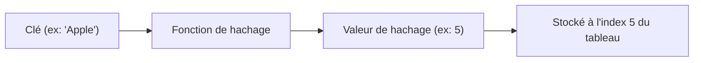
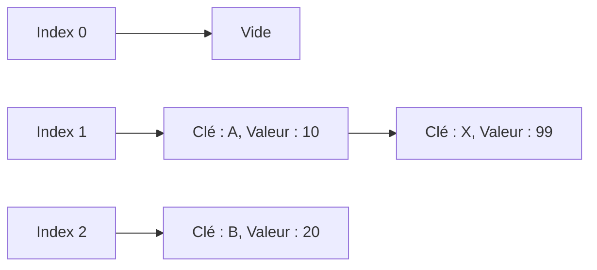

# Les bases et l'importance des algorithmes de recherche

Dans l'informatique moderne, un **algorithme de recherche** , qui permet de trouver rapidement une valeur cible parmi des données, est une technologie cruciale au cœur de tout logiciel ou système. Nous bénéficions quotidiennement des algorithmes de recherche, que ce soit pour la recherche dans une base de données, la recherche par mots-clés sur un navigateur web, ou la recherche de noms dans l'application de contacts d'un smartphone.

Dans cet article, nous expliquerons en détail les algorithmes de base de l'informatique, à savoir la "recherche linéaire (Linear Search)" et la "recherche dichotomique (Binary Search)", en abordant leur fonctionnement, leur complexité algorithmique et des exemples d'implémentation en Python. De plus, nous approfondirons les principes de la "table de hachage (Hash Table)", qui dépasse les limites de ces algorithmes pour offrir une vitesse de recherche écrasante, ainsi que le rôle de la fonction de hachage et les méthodes de résolution des collisions de hachage (Collision).


Approfondir sa compréhension des algorithmes de recherche est indispensable pour élever ses compétences en tant que programmeur d'un cran. Lorsque la quantité de données est faible, le choix de l'algorithme peut avoir un impact mineur sur les performances, mais à l'ère du Big Data, il est extrêmement important de choisir l'algorithme et la structure de données appropriés pour trouver instantanément l'information cible parmi des millions ou des milliards de données. En particulier, la compréhension du concept de **complexité temporelle** (comme $O(n)$, $O(\log n)$, ou $O(1)$) est un élément essentiel pour concevoir des programmes efficaces.

Approfondir sa compréhension des algorithmes de recherche est indispensable pour élever ses compétences en tant que programmeur d'un cran. Lorsque la quantité de données est faible, le choix de l'algorithme peut avoir un impact mineur sur les performances, mais à l'ère du Big Data, il est extrêmement important de choisir l'algorithme et la structure de données appropriés pour trouver instantanément l'information cible parmi des millions ou des milliards de données. En particulier, la compréhension du concept de **complexité temporelle** (comme $O(n)$, $O(\log n)$, ou $O(1)$) est un élément essentiel pour concevoir des programmes efficaces.

Approfondir sa compréhension des algorithmes de recherche est indispensable pour élever ses compétences en tant que programmeur d'un cran. Lorsque la quantité de données est faible, le choix de l'algorithme peut avoir un impact mineur sur les performances, mais à l'ère du Big Data, il est extrêmement important de choisir l'algorithme et la structure de données appropriés pour trouver instantanément l'information cible parmi des millions ou des milliards de données. En particulier, la compréhension du concept de **complexité temporelle** (comme $O(n)$, $O(\log n)$, ou $O(1)$) est un élément essentiel pour concevoir des programmes efficaces.

Approfondir sa compréhension des algorithmes de recherche est indispensable pour élever ses compétences en tant que programmeur d'un cran. Lorsque la quantité de données est faible, le choix de l'algorithme peut avoir un impact mineur sur les performances, mais à l'ère du Big Data, il est extrêmement important de choisir l'algorithme et la structure de données appropriés pour trouver instantanément l'information cible parmi des millions ou des milliards de données. En particulier, la compréhension du concept de **complexité temporelle** (comme $O(n)$, $O(\log n)$, ou $O(1)$) est un élément essentiel pour concevoir des programmes efficaces.

Approfondir sa compréhension des algorithmes de recherche est indispensable pour élever ses compétences en tant que programmeur d'un cran. Lorsque la quantité de données est faible, le choix de l'algorithme peut avoir un impact mineur sur les performances, mais à l'ère du Big Data, il est extrêmement important de choisir l'algorithme et la structure de données appropriés pour trouver instantanément l'information cible parmi des millions ou des milliards de données. En particulier, la compréhension du concept de **complexité temporelle** (comme $O(n)$, $O(\log n)$, ou $O(1)$) est un élément essentiel pour concevoir des programmes efficaces.

Approfondir sa compréhension des algorithmes de recherche est indispensable pour élever ses compétences en tant que programmeur d'un cran. Lorsque la quantité de données est faible, le choix de l'algorithme peut avoir un impact mineur sur les performances, mais à l'ère du Big Data, il est extrêmement important de choisir l'algorithme et la structure de données appropriés pour trouver instantanément l'information cible parmi des millions ou des milliards de données. En particulier, la compréhension du concept de **complexité temporelle** (comme $O(n)$, $O(\log n)$, ou $O(1)$) est un élément essentiel pour concevoir des programmes efficaces.

Approfondir sa compréhension des algorithmes de recherche est indispensable pour élever ses compétences en tant que programmeur d'un cran. Lorsque la quantité de données est faible, le choix de l'algorithme peut avoir un impact mineur sur les performances, mais à l'ère du Big Data, il est extrêmement important de choisir l'algorithme et la structure de données appropriés pour trouver instantanément l'information cible parmi des millions ou des milliards de données. En particulier, la compréhension du concept de **complexité temporelle** (comme $O(n)$, $O(\log n)$, ou $O(1)$) est un élément essentiel pour concevoir des programmes efficaces.

Approfondir sa compréhension des algorithmes de recherche est indispensable pour élever ses compétences en tant que programmeur d'un cran. Lorsque la quantité de données est faible, le choix de l'algorithme peut avoir un impact mineur sur les performances, mais à l'ère du Big Data, il est extrêmement important de choisir l'algorithme et la structure de données appropriés pour trouver instantanément l'information cible parmi des millions ou des milliards de données. En particulier, la compréhension du concept de **complexité temporelle** (comme $O(n)$, $O(\log n)$, ou $O(1)$) est un élément essentiel pour concevoir des programmes efficaces.

Approfondir sa compréhension des algorithmes de recherche est indispensable pour élever ses compétences en tant que programmeur d'un cran. Lorsque la quantité de données est faible, le choix de l'algorithme peut avoir un impact mineur sur les performances, mais à l'ère du Big Data, il est extrêmement important de choisir l'algorithme et la structure de données appropriés pour trouver instantanément l'information cible parmi des millions ou des milliards de données. En particulier, la compréhension du concept de **complexité temporelle** (comme $O(n)$, $O(\log n)$, ou $O(1)$) est un élément essentiel pour concevoir des programmes efficaces.

Approfondir sa compréhension des algorithmes de recherche est indispensable pour élever ses compétences en tant que programmeur d'un cran. Lorsque la quantité de données est faible, le choix de l'algorithme peut avoir un impact mineur sur les performances, mais à l'ère du Big Data, il est extrêmement important de choisir l'algorithme et la structure de données appropriés pour trouver instantanément l'information cible parmi des millions ou des milliards de données. En particulier, la compréhension du concept de **complexité temporelle** (comme $O(n)$, $O(\log n)$, ou $O(1)$) est un élément essentiel pour concevoir des programmes efficaces.

## 1. Recherche linéaire (Linear Search)

La recherche linéaire est l'algorithme de recherche le plus simple et intuitif, qui vérifie les éléments un par un dans l'ordre, du début à la fin d'une structure de données (comme un tableau ou une liste), jusqu'à ce que la valeur cible soit trouvée.

### 1.1 Fonctionnement de la recherche linéaire

L'algorithme de recherche linéaire procède selon les étapes suivantes :

1. Extraire le premier élément du tableau.
2. Vérifier si l'élément extrait correspond à la valeur cible (target).
3. S'il y a correspondance, renvoyer l'index (position) de cet élément et terminer la recherche.
4. S'il n'y a pas de correspondance, passer à l'élément suivant.
5. Vérifier jusqu'à la fin du tableau, et si la cible n'est pas trouvée, terminer la recherche par un échec (par exemple, en renvoyant `-1` ou `None`).

```mermaid
flowchart TD
    A["Début de la recherche"] --> B["Index i = 0"]
    B --> C{"i < longueur du tableau ?"}
    C -- "Oui" --> D{"tableau["i"] == cible ?"}
    C -- "Non" --> E["Échec de la recherche (non trouvé)"]
    D -- "Oui" --> F["Renvoyer l'index i"]
    D -- "Non" --> G["Incrémenter i de 1"]
    G --> C
```

### 1.2 Implémentation de la recherche linéaire en Python

Voici un exemple simple d'implémentation de la recherche linéaire à l'aide de Python.

```python
def linear_search(arr, target):
    """
    Fonction exécutant une recherche linéaire
    :param arr: La liste dans laquelle chercher
    :param target: La valeur à trouver
    :return: L'index s'il est trouvé, -1 s'il ne l'est pas
    """
    for i in range(len(arr)):
        if arr[i] == target:
            return i
    return -1

# Données de test
numbers = [10, 23, 4, 15, 2, 7, 34, 11]
target_value = 7

result_index = linear_search(numbers, target_value)
if result_index != -1:
    print(f"L'élément {target_value} a été trouvé à l'index {result_index}.")
else:
    print(f"L'élément {target_value} n'existe pas dans la liste.")
```


La principale caractéristique de la recherche linéaire est que les données n'ont pas besoin d'être triées. Même si les données sont stockées dans un ordre aléatoire, en vérifiant séquentiellement depuis le début, vous êtes assuré de trouver la valeur cible (ou de confirmer son absence). Cependant, cette nature de "tout vérifier dans l'ordre" est le principal facteur de dégradation des performances lorsque la quantité de données devient importante.

La principale caractéristique de la recherche linéaire est que les données n'ont pas besoin d'être triées. Même si les données sont stockées dans un ordre aléatoire, en vérifiant séquentiellement depuis le début, vous êtes assuré de trouver la valeur cible (ou de confirmer son absence). Cependant, cette nature de "tout vérifier dans l'ordre" est le principal facteur de dégradation des performances lorsque la quantité de données devient importante.

La principale caractéristique de la recherche linéaire est que les données n'ont pas besoin d'être triées. Même si les données sont stockées dans un ordre aléatoire, en vérifiant séquentiellement depuis le début, vous êtes assuré de trouver la valeur cible (ou de confirmer son absence). Cependant, cette nature de "tout vérifier dans l'ordre" est le principal facteur de dégradation des performances lorsque la quantité de données devient importante.

La principale caractéristique de la recherche linéaire est que les données n'ont pas besoin d'être triées. Même si les données sont stockées dans un ordre aléatoire, en vérifiant séquentiellement depuis le début, vous êtes assuré de trouver la valeur cible (ou de confirmer son absence). Cependant, cette nature de "tout vérifier dans l'ordre" est le principal facteur de dégradation des performances lorsque la quantité de données devient importante.

La principale caractéristique de la recherche linéaire est que les données n'ont pas besoin d'être triées. Même si les données sont stockées dans un ordre aléatoire, en vérifiant séquentiellement depuis le début, vous êtes assuré de trouver la valeur cible (ou de confirmer son absence). Cependant, cette nature de "tout vérifier dans l'ordre" est le principal facteur de dégradation des performances lorsque la quantité de données devient importante.

La principale caractéristique de la recherche linéaire est que les données n'ont pas besoin d'être triées. Même si les données sont stockées dans un ordre aléatoire, en vérifiant séquentiellement depuis le début, vous êtes assuré de trouver la valeur cible (ou de confirmer son absence). Cependant, cette nature de "tout vérifier dans l'ordre" est le principal facteur de dégradation des performances lorsque la quantité de données devient importante.

La principale caractéristique de la recherche linéaire est que les données n'ont pas besoin d'être triées. Même si les données sont stockées dans un ordre aléatoire, en vérifiant séquentiellement depuis le début, vous êtes assuré de trouver la valeur cible (ou de confirmer son absence). Cependant, cette nature de "tout vérifier dans l'ordre" est le principal facteur de dégradation des performances lorsque la quantité de données devient importante.

La principale caractéristique de la recherche linéaire est que les données n'ont pas besoin d'être triées. Même si les données sont stockées dans un ordre aléatoire, en vérifiant séquentiellement depuis le début, vous êtes assuré de trouver la valeur cible (ou de confirmer son absence). Cependant, cette nature de "tout vérifier dans l'ordre" est le principal facteur de dégradation des performances lorsque la quantité de données devient importante.

La principale caractéristique de la recherche linéaire est que les données n'ont pas besoin d'être triées. Même si les données sont stockées dans un ordre aléatoire, en vérifiant séquentiellement depuis le début, vous êtes assuré de trouver la valeur cible (ou de confirmer son absence). Cependant, cette nature de "tout vérifier dans l'ordre" est le principal facteur de dégradation des performances lorsque la quantité de données devient importante.

La principale caractéristique de la recherche linéaire est que les données n'ont pas besoin d'être triées. Même si les données sont stockées dans un ordre aléatoire, en vérifiant séquentiellement depuis le début, vous êtes assuré de trouver la valeur cible (ou de confirmer son absence). Cependant, cette nature de "tout vérifier dans l'ordre" est le principal facteur de dégradation des performances lorsque la quantité de données devient importante.

La principale caractéristique de la recherche linéaire est que les données n'ont pas besoin d'être triées. Même si les données sont stockées dans un ordre aléatoire, en vérifiant séquentiellement depuis le début, vous êtes assuré de trouver la valeur cible (ou de confirmer son absence). Cependant, cette nature de "tout vérifier dans l'ordre" est le principal facteur de dégradation des performances lorsque la quantité de données devient importante.

La principale caractéristique de la recherche linéaire est que les données n'ont pas besoin d'être triées. Même si les données sont stockées dans un ordre aléatoire, en vérifiant séquentiellement depuis le début, vous êtes assuré de trouver la valeur cible (ou de confirmer son absence). Cependant, cette nature de "tout vérifier dans l'ordre" est le principal facteur de dégradation des performances lorsque la quantité de données devient importante.

La principale caractéristique de la recherche linéaire est que les données n'ont pas besoin d'être triées. Même si les données sont stockées dans un ordre aléatoire, en vérifiant séquentiellement depuis le début, vous êtes assuré de trouver la valeur cible (ou de confirmer son absence). Cependant, cette nature de "tout vérifier dans l'ordre" est le principal facteur de dégradation des performances lorsque la quantité de données devient importante.

La principale caractéristique de la recherche linéaire est que les données n'ont pas besoin d'être triées. Même si les données sont stockées dans un ordre aléatoire, en vérifiant séquentiellement depuis le début, vous êtes assuré de trouver la valeur cible (ou de confirmer son absence). Cependant, cette nature de "tout vérifier dans l'ordre" est le principal facteur de dégradation des performances lorsque la quantité de données devient importante.

La principale caractéristique de la recherche linéaire est que les données n'ont pas besoin d'être triées. Même si les données sont stockées dans un ordre aléatoire, en vérifiant séquentiellement depuis le début, vous êtes assuré de trouver la valeur cible (ou de confirmer son absence). Cependant, cette nature de "tout vérifier dans l'ordre" est le principal facteur de dégradation des performances lorsque la quantité de données devient importante.

La principale caractéristique de la recherche linéaire est que les données n'ont pas besoin d'être triées. Même si les données sont stockées dans un ordre aléatoire, en vérifiant séquentiellement depuis le début, vous êtes assuré de trouver la valeur cible (ou de confirmer son absence). Cependant, cette nature de "tout vérifier dans l'ordre" est le principal facteur de dégradation des performances lorsque la quantité de données devient importante.

La principale caractéristique de la recherche linéaire est que les données n'ont pas besoin d'être triées. Même si les données sont stockées dans un ordre aléatoire, en vérifiant séquentiellement depuis le début, vous êtes assuré de trouver la valeur cible (ou de confirmer son absence). Cependant, cette nature de "tout vérifier dans l'ordre" est le principal facteur de dégradation des performances lorsque la quantité de données devient importante.

La principale caractéristique de la recherche linéaire est que les données n'ont pas besoin d'être triées. Même si les données sont stockées dans un ordre aléatoire, en vérifiant séquentiellement depuis le début, vous êtes assuré de trouver la valeur cible (ou de confirmer son absence). Cependant, cette nature de "tout vérifier dans l'ordre" est le principal facteur de dégradation des performances lorsque la quantité de données devient importante.

La principale caractéristique de la recherche linéaire est que les données n'ont pas besoin d'être triées. Même si les données sont stockées dans un ordre aléatoire, en vérifiant séquentiellement depuis le début, vous êtes assuré de trouver la valeur cible (ou de confirmer son absence). Cependant, cette nature de "tout vérifier dans l'ordre" est le principal facteur de dégradation des performances lorsque la quantité de données devient importante.

La principale caractéristique de la recherche linéaire est que les données n'ont pas besoin d'être triées. Même si les données sont stockées dans un ordre aléatoire, en vérifiant séquentiellement depuis le début, vous êtes assuré de trouver la valeur cible (ou de confirmer son absence). Cependant, cette nature de "tout vérifier dans l'ordre" est le principal facteur de dégradation des performances lorsque la quantité de données devient importante.

La principale caractéristique de la recherche linéaire est que les données n'ont pas besoin d'être triées. Même si les données sont stockées dans un ordre aléatoire, en vérifiant séquentiellement depuis le début, vous êtes assuré de trouver la valeur cible (ou de confirmer son absence). Cependant, cette nature de "tout vérifier dans l'ordre" est le principal facteur de dégradation des performances lorsque la quantité de données devient importante.

La principale caractéristique de la recherche linéaire est que les données n'ont pas besoin d'être triées. Même si les données sont stockées dans un ordre aléatoire, en vérifiant séquentiellement depuis le début, vous êtes assuré de trouver la valeur cible (ou de confirmer son absence). Cependant, cette nature de "tout vérifier dans l'ordre" est le principal facteur de dégradation des performances lorsque la quantité de données devient importante.

La principale caractéristique de la recherche linéaire est que les données n'ont pas besoin d'être triées. Même si les données sont stockées dans un ordre aléatoire, en vérifiant séquentiellement depuis le début, vous êtes assuré de trouver la valeur cible (ou de confirmer son absence). Cependant, cette nature de "tout vérifier dans l'ordre" est le principal facteur de dégradation des performances lorsque la quantité de données devient importante.

La principale caractéristique de la recherche linéaire est que les données n'ont pas besoin d'être triées. Même si les données sont stockées dans un ordre aléatoire, en vérifiant séquentiellement depuis le début, vous êtes assuré de trouver la valeur cible (ou de confirmer son absence). Cependant, cette nature de "tout vérifier dans l'ordre" est le principal facteur de dégradation des performances lorsque la quantité de données devient importante.

La principale caractéristique de la recherche linéaire est que les données n'ont pas besoin d'être triées. Même si les données sont stockées dans un ordre aléatoire, en vérifiant séquentiellement depuis le début, vous êtes assuré de trouver la valeur cible (ou de confirmer son absence). Cependant, cette nature de "tout vérifier dans l'ordre" est le principal facteur de dégradation des performances lorsque la quantité de données devient importante.

La principale caractéristique de la recherche linéaire est que les données n'ont pas besoin d'être triées. Même si les données sont stockées dans un ordre aléatoire, en vérifiant séquentiellement depuis le début, vous êtes assuré de trouver la valeur cible (ou de confirmer son absence). Cependant, cette nature de "tout vérifier dans l'ordre" est le principal facteur de dégradation des performances lorsque la quantité de données devient importante.

La principale caractéristique de la recherche linéaire est que les données n'ont pas besoin d'être triées. Même si les données sont stockées dans un ordre aléatoire, en vérifiant séquentiellement depuis le début, vous êtes assuré de trouver la valeur cible (ou de confirmer son absence). Cependant, cette nature de "tout vérifier dans l'ordre" est le principal facteur de dégradation des performances lorsque la quantité de données devient importante.

La principale caractéristique de la recherche linéaire est que les données n'ont pas besoin d'être triées. Même si les données sont stockées dans un ordre aléatoire, en vérifiant séquentiellement depuis le début, vous êtes assuré de trouver la valeur cible (ou de confirmer son absence). Cependant, cette nature de "tout vérifier dans l'ordre" est le principal facteur de dégradation des performances lorsque la quantité de données devient importante.

La principale caractéristique de la recherche linéaire est que les données n'ont pas besoin d'être triées. Même si les données sont stockées dans un ordre aléatoire, en vérifiant séquentiellement depuis le début, vous êtes assuré de trouver la valeur cible (ou de confirmer son absence). Cependant, cette nature de "tout vérifier dans l'ordre" est le principal facteur de dégradation des performances lorsque la quantité de données devient importante.

La principale caractéristique de la recherche linéaire est que les données n'ont pas besoin d'être triées. Même si les données sont stockées dans un ordre aléatoire, en vérifiant séquentiellement depuis le début, vous êtes assuré de trouver la valeur cible (ou de confirmer son absence). Cependant, cette nature de "tout vérifier dans l'ordre" est le principal facteur de dégradation des performances lorsque la quantité de données devient importante.

La principale caractéristique de la recherche linéaire est que les données n'ont pas besoin d'être triées. Même si les données sont stockées dans un ordre aléatoire, en vérifiant séquentiellement depuis le début, vous êtes assuré de trouver la valeur cible (ou de confirmer son absence). Cependant, cette nature de "tout vérifier dans l'ordre" est le principal facteur de dégradation des performances lorsque la quantité de données devient importante.

La principale caractéristique de la recherche linéaire est que les données n'ont pas besoin d'être triées. Même si les données sont stockées dans un ordre aléatoire, en vérifiant séquentiellement depuis le début, vous êtes assuré de trouver la valeur cible (ou de confirmer son absence). Cependant, cette nature de "tout vérifier dans l'ordre" est le principal facteur de dégradation des performances lorsque la quantité de données devient importante.

La principale caractéristique de la recherche linéaire est que les données n'ont pas besoin d'être triées. Même si les données sont stockées dans un ordre aléatoire, en vérifiant séquentiellement depuis le début, vous êtes assuré de trouver la valeur cible (ou de confirmer son absence). Cependant, cette nature de "tout vérifier dans l'ordre" est le principal facteur de dégradation des performances lorsque la quantité de données devient importante.

La principale caractéristique de la recherche linéaire est que les données n'ont pas besoin d'être triées. Même si les données sont stockées dans un ordre aléatoire, en vérifiant séquentiellement depuis le début, vous êtes assuré de trouver la valeur cible (ou de confirmer son absence). Cependant, cette nature de "tout vérifier dans l'ordre" est le principal facteur de dégradation des performances lorsque la quantité de données devient importante.

La principale caractéristique de la recherche linéaire est que les données n'ont pas besoin d'être triées. Même si les données sont stockées dans un ordre aléatoire, en vérifiant séquentiellement depuis le début, vous êtes assuré de trouver la valeur cible (ou de confirmer son absence). Cependant, cette nature de "tout vérifier dans l'ordre" est le principal facteur de dégradation des performances lorsque la quantité de données devient importante.

La principale caractéristique de la recherche linéaire est que les données n'ont pas besoin d'être triées. Même si les données sont stockées dans un ordre aléatoire, en vérifiant séquentiellement depuis le début, vous êtes assuré de trouver la valeur cible (ou de confirmer son absence). Cependant, cette nature de "tout vérifier dans l'ordre" est le principal facteur de dégradation des performances lorsque la quantité de données devient importante.

La principale caractéristique de la recherche linéaire est que les données n'ont pas besoin d'être triées. Même si les données sont stockées dans un ordre aléatoire, en vérifiant séquentiellement depuis le début, vous êtes assuré de trouver la valeur cible (ou de confirmer son absence). Cependant, cette nature de "tout vérifier dans l'ordre" est le principal facteur de dégradation des performances lorsque la quantité de données devient importante.

La principale caractéristique de la recherche linéaire est que les données n'ont pas besoin d'être triées. Même si les données sont stockées dans un ordre aléatoire, en vérifiant séquentiellement depuis le début, vous êtes assuré de trouver la valeur cible (ou de confirmer son absence). Cependant, cette nature de "tout vérifier dans l'ordre" est le principal facteur de dégradation des performances lorsque la quantité de données devient importante.

La principale caractéristique de la recherche linéaire est que les données n'ont pas besoin d'être triées. Même si les données sont stockées dans un ordre aléatoire, en vérifiant séquentiellement depuis le début, vous êtes assuré de trouver la valeur cible (ou de confirmer son absence). Cependant, cette nature de "tout vérifier dans l'ordre" est le principal facteur de dégradation des performances lorsque la quantité de données devient importante.

La principale caractéristique de la recherche linéaire est que les données n'ont pas besoin d'être triées. Même si les données sont stockées dans un ordre aléatoire, en vérifiant séquentiellement depuis le début, vous êtes assuré de trouver la valeur cible (ou de confirmer son absence). Cependant, cette nature de "tout vérifier dans l'ordre" est le principal facteur de dégradation des performances lorsque la quantité de données devient importante.

La principale caractéristique de la recherche linéaire est que les données n'ont pas besoin d'être triées. Même si les données sont stockées dans un ordre aléatoire, en vérifiant séquentiellement depuis le début, vous êtes assuré de trouver la valeur cible (ou de confirmer son absence). Cependant, cette nature de "tout vérifier dans l'ordre" est le principal facteur de dégradation des performances lorsque la quantité de données devient importante.

La principale caractéristique de la recherche linéaire est que les données n'ont pas besoin d'être triées. Même si les données sont stockées dans un ordre aléatoire, en vérifiant séquentiellement depuis le début, vous êtes assuré de trouver la valeur cible (ou de confirmer son absence). Cependant, cette nature de "tout vérifier dans l'ordre" est le principal facteur de dégradation des performances lorsque la quantité de données devient importante.

La principale caractéristique de la recherche linéaire est que les données n'ont pas besoin d'être triées. Même si les données sont stockées dans un ordre aléatoire, en vérifiant séquentiellement depuis le début, vous êtes assuré de trouver la valeur cible (ou de confirmer son absence). Cependant, cette nature de "tout vérifier dans l'ordre" est le principal facteur de dégradation des performances lorsque la quantité de données devient importante.

La principale caractéristique de la recherche linéaire est que les données n'ont pas besoin d'être triées. Même si les données sont stockées dans un ordre aléatoire, en vérifiant séquentiellement depuis le début, vous êtes assuré de trouver la valeur cible (ou de confirmer son absence). Cependant, cette nature de "tout vérifier dans l'ordre" est le principal facteur de dégradation des performances lorsque la quantité de données devient importante.

La principale caractéristique de la recherche linéaire est que les données n'ont pas besoin d'être triées. Même si les données sont stockées dans un ordre aléatoire, en vérifiant séquentiellement depuis le début, vous êtes assuré de trouver la valeur cible (ou de confirmer son absence). Cependant, cette nature de "tout vérifier dans l'ordre" est le principal facteur de dégradation des performances lorsque la quantité de données devient importante.

La principale caractéristique de la recherche linéaire est que les données n'ont pas besoin d'être triées. Même si les données sont stockées dans un ordre aléatoire, en vérifiant séquentiellement depuis le début, vous êtes assuré de trouver la valeur cible (ou de confirmer son absence). Cependant, cette nature de "tout vérifier dans l'ordre" est le principal facteur de dégradation des performances lorsque la quantité de données devient importante.

La principale caractéristique de la recherche linéaire est que les données n'ont pas besoin d'être triées. Même si les données sont stockées dans un ordre aléatoire, en vérifiant séquentiellement depuis le début, vous êtes assuré de trouver la valeur cible (ou de confirmer son absence). Cependant, cette nature de "tout vérifier dans l'ordre" est le principal facteur de dégradation des performances lorsque la quantité de données devient importante.

La principale caractéristique de la recherche linéaire est que les données n'ont pas besoin d'être triées. Même si les données sont stockées dans un ordre aléatoire, en vérifiant séquentiellement depuis le début, vous êtes assuré de trouver la valeur cible (ou de confirmer son absence). Cependant, cette nature de "tout vérifier dans l'ordre" est le principal facteur de dégradation des performances lorsque la quantité de données devient importante.

La principale caractéristique de la recherche linéaire est que les données n'ont pas besoin d'être triées. Même si les données sont stockées dans un ordre aléatoire, en vérifiant séquentiellement depuis le début, vous êtes assuré de trouver la valeur cible (ou de confirmer son absence). Cependant, cette nature de "tout vérifier dans l'ordre" est le principal facteur de dégradation des performances lorsque la quantité de données devient importante.

La principale caractéristique de la recherche linéaire est que les données n'ont pas besoin d'être triées. Même si les données sont stockées dans un ordre aléatoire, en vérifiant séquentiellement depuis le début, vous êtes assuré de trouver la valeur cible (ou de confirmer son absence). Cependant, cette nature de "tout vérifier dans l'ordre" est le principal facteur de dégradation des performances lorsque la quantité de données devient importante.

## 2. Recherche dichotomique (Binary Search)

La recherche dichotomique est un algorithme de recherche très rapide et efficace qui ne peut être appliqué qu'aux **données préalablement triées (par ordre croissant ou décroissant)** . En réduisant la plage de recherche de moitié à chaque étape, la complexité de calcul est considérablement réduite.

### 2.1 Fonctionnement de la recherche dichotomique

La recherche dichotomique se déroule selon les étapes suivantes :

1. Initialiser les index de l'"extrémité gauche (`low`)" et de l'"extrémité droite (`high`)" du tableau de recherche.
2. Tant que la plage de recherche est valide (`low <= high`), répéter les opérations suivantes :
3. Calculer l'index central (`mid`) de la plage de recherche.
4. Comparer l'élément central (`arr[mid]`) avec la valeur cible (target).
5. S'il y a correspondance, renvoyer `mid` et terminer.
6. Si l'élément central est inférieur à la cible, la cible se trouve dans la moitié droite, donc mettre à jour l'extrémité gauche à `mid + 1`.
7. Si l'élément central est supérieur à la cible, la cible se trouve dans la moitié gauche, donc mettre à jour l'extrémité droite à `mid - 1`.
8. Si la plage de recherche est épuisée sans être trouvée, la recherche échoue.

```mermaid
flowchart TD
    A["Début de la recherche"] --> B["low = 0, high = len - 1"]
    B --> C{"low <= high ?"}
    C -- "Non" --> D["Échec de la recherche"]
    C -- "Oui" --> E["mid = (low + high) / 2"]
    E --> F{"arr["mid"] == target ?"}
    F -- "Oui" --> G["Renvoyer mid"]
    F -- "Non" --> H{"arr["mid"] < target ?"}
    H -- "Oui" --> I["low = mid + 1"]
    H -- "Non" --> J["high = mid - 1"]
    I --> C
    J --> C
```

### 2.2 Implémentation de la recherche dichotomique en Python (Méthode itérative)

```python
def binary_search(arr, target):
    """
    Fonction exécutant une recherche dichotomique (méthode itérative)
    :param arr: Liste de recherche triée
    :param target: La valeur à trouver
    :return: L'index s'il est trouvé, -1 s'il ne l'est pas
    """
    low = 0
    high = len(arr) - 1

    while low <= high:
        mid = (low + high) // 2
        
        if arr[mid] == target:
            return mid
        elif arr[mid] < target:
            low = mid + 1
        else:
            high = mid - 1
            
    return -1

# Données de test（ソート済みである必要がある）
sorted_numbers = [2, 4, 7, 10, 11, 15, 23, 34]
target_value = 15

result_index = binary_search(sorted_numbers, target_value)
if result_index != -1:
    print(f"L'élément {target_value} a été trouvé à l'index {result_index}.")
else:
    print(f"L'élément {target_value} n'existe pas dans la liste.")
```

Les performances incroyables de la recherche dichotomique proviennent de sa nature consistant à diviser la plage de recherche par deux à chaque fois. Par exemple, une recherche linéaire sur un tableau de 1 million d'éléments nécessitera 1 million de comparaisons dans le pire des cas, mais avec la recherche dichotomique, vous pouvez trouver la valeur cible en seulement environ 20 comparaisons ($2^{20} \approx 1 000 000$). Par conséquent, pour les opérations de recherche sur des ensembles de données massifs, la recherche dichotomique présente un avantage écrasant par rapport à la recherche linéaire. Mathématiquement, la complexité temporelle de la recherche dichotomique s'exprime par $O(\log n)$.

Les performances incroyables de la recherche dichotomique proviennent de sa nature consistant à diviser la plage de recherche par deux à chaque fois. Par exemple, une recherche linéaire sur un tableau de 1 million d'éléments nécessitera 1 million de comparaisons dans le pire des cas, mais avec la recherche dichotomique, vous pouvez trouver la valeur cible en seulement environ 20 comparaisons ($2^{20} \approx 1 000 000$). Par conséquent, pour les opérations de recherche sur des ensembles de données massifs, la recherche dichotomique présente un avantage écrasant par rapport à la recherche linéaire. Mathématiquement, la complexité temporelle de la recherche dichotomique s'exprime par $O(\log n)$.

Les performances incroyables de la recherche dichotomique proviennent de sa nature consistant à diviser la plage de recherche par deux à chaque fois. Par exemple, une recherche linéaire sur un tableau de 1 million d'éléments nécessitera 1 million de comparaisons dans le pire des cas, mais avec la recherche dichotomique, vous pouvez trouver la valeur cible en seulement environ 20 comparaisons ($2^{20} \approx 1 000 000$). Par conséquent, pour les opérations de recherche sur des ensembles de données massifs, la recherche dichotomique présente un avantage écrasant par rapport à la recherche linéaire. Mathématiquement, la complexité temporelle de la recherche dichotomique s'exprime par $O(\log n)$.

Les performances incroyables de la recherche dichotomique proviennent de sa nature consistant à diviser la plage de recherche par deux à chaque fois. Par exemple, une recherche linéaire sur un tableau de 1 million d'éléments nécessitera 1 million de comparaisons dans le pire des cas, mais avec la recherche dichotomique, vous pouvez trouver la valeur cible en seulement environ 20 comparaisons ($2^{20} \approx 1 000 000$). Par conséquent, pour les opérations de recherche sur des ensembles de données massifs, la recherche dichotomique présente un avantage écrasant par rapport à la recherche linéaire. Mathématiquement, la complexité temporelle de la recherche dichotomique s'exprime par $O(\log n)$.

Les performances incroyables de la recherche dichotomique proviennent de sa nature consistant à diviser la plage de recherche par deux à chaque fois. Par exemple, une recherche linéaire sur un tableau de 1 million d'éléments nécessitera 1 million de comparaisons dans le pire des cas, mais avec la recherche dichotomique, vous pouvez trouver la valeur cible en seulement environ 20 comparaisons ($2^{20} \approx 1 000 000$). Par conséquent, pour les opérations de recherche sur des ensembles de données massifs, la recherche dichotomique présente un avantage écrasant par rapport à la recherche linéaire. Mathématiquement, la complexité temporelle de la recherche dichotomique s'exprime par $O(\log n)$.

Les performances incroyables de la recherche dichotomique proviennent de sa nature consistant à diviser la plage de recherche par deux à chaque fois. Par exemple, une recherche linéaire sur un tableau de 1 million d'éléments nécessitera 1 million de comparaisons dans le pire des cas, mais avec la recherche dichotomique, vous pouvez trouver la valeur cible en seulement environ 20 comparaisons ($2^{20} \approx 1 000 000$). Par conséquent, pour les opérations de recherche sur des ensembles de données massifs, la recherche dichotomique présente un avantage écrasant par rapport à la recherche linéaire. Mathématiquement, la complexité temporelle de la recherche dichotomique s'exprime par $O(\log n)$.

Les performances incroyables de la recherche dichotomique proviennent de sa nature consistant à diviser la plage de recherche par deux à chaque fois. Par exemple, une recherche linéaire sur un tableau de 1 million d'éléments nécessitera 1 million de comparaisons dans le pire des cas, mais avec la recherche dichotomique, vous pouvez trouver la valeur cible en seulement environ 20 comparaisons ($2^{20} \approx 1 000 000$). Par conséquent, pour les opérations de recherche sur des ensembles de données massifs, la recherche dichotomique présente un avantage écrasant par rapport à la recherche linéaire. Mathématiquement, la complexité temporelle de la recherche dichotomique s'exprime par $O(\log n)$.

Les performances incroyables de la recherche dichotomique proviennent de sa nature consistant à diviser la plage de recherche par deux à chaque fois. Par exemple, une recherche linéaire sur un tableau de 1 million d'éléments nécessitera 1 million de comparaisons dans le pire des cas, mais avec la recherche dichotomique, vous pouvez trouver la valeur cible en seulement environ 20 comparaisons ($2^{20} \approx 1 000 000$). Par conséquent, pour les opérations de recherche sur des ensembles de données massifs, la recherche dichotomique présente un avantage écrasant par rapport à la recherche linéaire. Mathématiquement, la complexité temporelle de la recherche dichotomique s'exprime par $O(\log n)$.

Les performances incroyables de la recherche dichotomique proviennent de sa nature consistant à diviser la plage de recherche par deux à chaque fois. Par exemple, une recherche linéaire sur un tableau de 1 million d'éléments nécessitera 1 million de comparaisons dans le pire des cas, mais avec la recherche dichotomique, vous pouvez trouver la valeur cible en seulement environ 20 comparaisons ($2^{20} \approx 1 000 000$). Par conséquent, pour les opérations de recherche sur des ensembles de données massifs, la recherche dichotomique présente un avantage écrasant par rapport à la recherche linéaire. Mathématiquement, la complexité temporelle de la recherche dichotomique s'exprime par $O(\log n)$.

Les performances incroyables de la recherche dichotomique proviennent de sa nature consistant à diviser la plage de recherche par deux à chaque fois. Par exemple, une recherche linéaire sur un tableau de 1 million d'éléments nécessitera 1 million de comparaisons dans le pire des cas, mais avec la recherche dichotomique, vous pouvez trouver la valeur cible en seulement environ 20 comparaisons ($2^{20} \approx 1 000 000$). Par conséquent, pour les opérations de recherche sur des ensembles de données massifs, la recherche dichotomique présente un avantage écrasant par rapport à la recherche linéaire. Mathématiquement, la complexité temporelle de la recherche dichotomique s'exprime par $O(\log n)$.

Les performances incroyables de la recherche dichotomique proviennent de sa nature consistant à diviser la plage de recherche par deux à chaque fois. Par exemple, une recherche linéaire sur un tableau de 1 million d'éléments nécessitera 1 million de comparaisons dans le pire des cas, mais avec la recherche dichotomique, vous pouvez trouver la valeur cible en seulement environ 20 comparaisons ($2^{20} \approx 1 000 000$). Par conséquent, pour les opérations de recherche sur des ensembles de données massifs, la recherche dichotomique présente un avantage écrasant par rapport à la recherche linéaire. Mathématiquement, la complexité temporelle de la recherche dichotomique s'exprime par $O(\log n)$.

Les performances incroyables de la recherche dichotomique proviennent de sa nature consistant à diviser la plage de recherche par deux à chaque fois. Par exemple, une recherche linéaire sur un tableau de 1 million d'éléments nécessitera 1 million de comparaisons dans le pire des cas, mais avec la recherche dichotomique, vous pouvez trouver la valeur cible en seulement environ 20 comparaisons ($2^{20} \approx 1 000 000$). Par conséquent, pour les opérations de recherche sur des ensembles de données massifs, la recherche dichotomique présente un avantage écrasant par rapport à la recherche linéaire. Mathématiquement, la complexité temporelle de la recherche dichotomique s'exprime par $O(\log n)$.

Les performances incroyables de la recherche dichotomique proviennent de sa nature consistant à diviser la plage de recherche par deux à chaque fois. Par exemple, une recherche linéaire sur un tableau de 1 million d'éléments nécessitera 1 million de comparaisons dans le pire des cas, mais avec la recherche dichotomique, vous pouvez trouver la valeur cible en seulement environ 20 comparaisons ($2^{20} \approx 1 000 000$). Par conséquent, pour les opérations de recherche sur des ensembles de données massifs, la recherche dichotomique présente un avantage écrasant par rapport à la recherche linéaire. Mathématiquement, la complexité temporelle de la recherche dichotomique s'exprime par $O(\log n)$.

Les performances incroyables de la recherche dichotomique proviennent de sa nature consistant à diviser la plage de recherche par deux à chaque fois. Par exemple, une recherche linéaire sur un tableau de 1 million d'éléments nécessitera 1 million de comparaisons dans le pire des cas, mais avec la recherche dichotomique, vous pouvez trouver la valeur cible en seulement environ 20 comparaisons ($2^{20} \approx 1 000 000$). Par conséquent, pour les opérations de recherche sur des ensembles de données massifs, la recherche dichotomique présente un avantage écrasant par rapport à la recherche linéaire. Mathématiquement, la complexité temporelle de la recherche dichotomique s'exprime par $O(\log n)$.

Les performances incroyables de la recherche dichotomique proviennent de sa nature consistant à diviser la plage de recherche par deux à chaque fois. Par exemple, une recherche linéaire sur un tableau de 1 million d'éléments nécessitera 1 million de comparaisons dans le pire des cas, mais avec la recherche dichotomique, vous pouvez trouver la valeur cible en seulement environ 20 comparaisons ($2^{20} \approx 1 000 000$). Par conséquent, pour les opérations de recherche sur des ensembles de données massifs, la recherche dichotomique présente un avantage écrasant par rapport à la recherche linéaire. Mathématiquement, la complexité temporelle de la recherche dichotomique s'exprime par $O(\log n)$.

Les performances incroyables de la recherche dichotomique proviennent de sa nature consistant à diviser la plage de recherche par deux à chaque fois. Par exemple, une recherche linéaire sur un tableau de 1 million d'éléments nécessitera 1 million de comparaisons dans le pire des cas, mais avec la recherche dichotomique, vous pouvez trouver la valeur cible en seulement environ 20 comparaisons ($2^{20} \approx 1 000 000$). Par conséquent, pour les opérations de recherche sur des ensembles de données massifs, la recherche dichotomique présente un avantage écrasant par rapport à la recherche linéaire. Mathématiquement, la complexité temporelle de la recherche dichotomique s'exprime par $O(\log n)$.

Les performances incroyables de la recherche dichotomique proviennent de sa nature consistant à diviser la plage de recherche par deux à chaque fois. Par exemple, une recherche linéaire sur un tableau de 1 million d'éléments nécessitera 1 million de comparaisons dans le pire des cas, mais avec la recherche dichotomique, vous pouvez trouver la valeur cible en seulement environ 20 comparaisons ($2^{20} \approx 1 000 000$). Par conséquent, pour les opérations de recherche sur des ensembles de données massifs, la recherche dichotomique présente un avantage écrasant par rapport à la recherche linéaire. Mathématiquement, la complexité temporelle de la recherche dichotomique s'exprime par $O(\log n)$.

Les performances incroyables de la recherche dichotomique proviennent de sa nature consistant à diviser la plage de recherche par deux à chaque fois. Par exemple, une recherche linéaire sur un tableau de 1 million d'éléments nécessitera 1 million de comparaisons dans le pire des cas, mais avec la recherche dichotomique, vous pouvez trouver la valeur cible en seulement environ 20 comparaisons ($2^{20} \approx 1 000 000$). Par conséquent, pour les opérations de recherche sur des ensembles de données massifs, la recherche dichotomique présente un avantage écrasant par rapport à la recherche linéaire. Mathématiquement, la complexité temporelle de la recherche dichotomique s'exprime par $O(\log n)$.

Les performances incroyables de la recherche dichotomique proviennent de sa nature consistant à diviser la plage de recherche par deux à chaque fois. Par exemple, une recherche linéaire sur un tableau de 1 million d'éléments nécessitera 1 million de comparaisons dans le pire des cas, mais avec la recherche dichotomique, vous pouvez trouver la valeur cible en seulement environ 20 comparaisons ($2^{20} \approx 1 000 000$). Par conséquent, pour les opérations de recherche sur des ensembles de données massifs, la recherche dichotomique présente un avantage écrasant par rapport à la recherche linéaire. Mathématiquement, la complexité temporelle de la recherche dichotomique s'exprime par $O(\log n)$.

Les performances incroyables de la recherche dichotomique proviennent de sa nature consistant à diviser la plage de recherche par deux à chaque fois. Par exemple, une recherche linéaire sur un tableau de 1 million d'éléments nécessitera 1 million de comparaisons dans le pire des cas, mais avec la recherche dichotomique, vous pouvez trouver la valeur cible en seulement environ 20 comparaisons ($2^{20} \approx 1 000 000$). Par conséquent, pour les opérations de recherche sur des ensembles de données massifs, la recherche dichotomique présente un avantage écrasant par rapport à la recherche linéaire. Mathématiquement, la complexité temporelle de la recherche dichotomique s'exprime par $O(\log n)$.

Les performances incroyables de la recherche dichotomique proviennent de sa nature consistant à diviser la plage de recherche par deux à chaque fois. Par exemple, une recherche linéaire sur un tableau de 1 million d'éléments nécessitera 1 million de comparaisons dans le pire des cas, mais avec la recherche dichotomique, vous pouvez trouver la valeur cible en seulement environ 20 comparaisons ($2^{20} \approx 1 000 000$). Par conséquent, pour les opérations de recherche sur des ensembles de données massifs, la recherche dichotomique présente un avantage écrasant par rapport à la recherche linéaire. Mathématiquement, la complexité temporelle de la recherche dichotomique s'exprime par $O(\log n)$.

Les performances incroyables de la recherche dichotomique proviennent de sa nature consistant à diviser la plage de recherche par deux à chaque fois. Par exemple, une recherche linéaire sur un tableau de 1 million d'éléments nécessitera 1 million de comparaisons dans le pire des cas, mais avec la recherche dichotomique, vous pouvez trouver la valeur cible en seulement environ 20 comparaisons ($2^{20} \approx 1 000 000$). Par conséquent, pour les opérations de recherche sur des ensembles de données massifs, la recherche dichotomique présente un avantage écrasant par rapport à la recherche linéaire. Mathématiquement, la complexité temporelle de la recherche dichotomique s'exprime par $O(\log n)$.

Les performances incroyables de la recherche dichotomique proviennent de sa nature consistant à diviser la plage de recherche par deux à chaque fois. Par exemple, une recherche linéaire sur un tableau de 1 million d'éléments nécessitera 1 million de comparaisons dans le pire des cas, mais avec la recherche dichotomique, vous pouvez trouver la valeur cible en seulement environ 20 comparaisons ($2^{20} \approx 1 000 000$). Par conséquent, pour les opérations de recherche sur des ensembles de données massifs, la recherche dichotomique présente un avantage écrasant par rapport à la recherche linéaire. Mathématiquement, la complexité temporelle de la recherche dichotomique s'exprime par $O(\log n)$.

Les performances incroyables de la recherche dichotomique proviennent de sa nature consistant à diviser la plage de recherche par deux à chaque fois. Par exemple, une recherche linéaire sur un tableau de 1 million d'éléments nécessitera 1 million de comparaisons dans le pire des cas, mais avec la recherche dichotomique, vous pouvez trouver la valeur cible en seulement environ 20 comparaisons ($2^{20} \approx 1 000 000$). Par conséquent, pour les opérations de recherche sur des ensembles de données massifs, la recherche dichotomique présente un avantage écrasant par rapport à la recherche linéaire. Mathématiquement, la complexité temporelle de la recherche dichotomique s'exprime par $O(\log n)$.

Les performances incroyables de la recherche dichotomique proviennent de sa nature consistant à diviser la plage de recherche par deux à chaque fois. Par exemple, une recherche linéaire sur un tableau de 1 million d'éléments nécessitera 1 million de comparaisons dans le pire des cas, mais avec la recherche dichotomique, vous pouvez trouver la valeur cible en seulement environ 20 comparaisons ($2^{20} \approx 1 000 000$). Par conséquent, pour les opérations de recherche sur des ensembles de données massifs, la recherche dichotomique présente un avantage écrasant par rapport à la recherche linéaire. Mathématiquement, la complexité temporelle de la recherche dichotomique s'exprime par $O(\log n)$.

Les performances incroyables de la recherche dichotomique proviennent de sa nature consistant à diviser la plage de recherche par deux à chaque fois. Par exemple, une recherche linéaire sur un tableau de 1 million d'éléments nécessitera 1 million de comparaisons dans le pire des cas, mais avec la recherche dichotomique, vous pouvez trouver la valeur cible en seulement environ 20 comparaisons ($2^{20} \approx 1 000 000$). Par conséquent, pour les opérations de recherche sur des ensembles de données massifs, la recherche dichotomique présente un avantage écrasant par rapport à la recherche linéaire. Mathématiquement, la complexité temporelle de la recherche dichotomique s'exprime par $O(\log n)$.

Les performances incroyables de la recherche dichotomique proviennent de sa nature consistant à diviser la plage de recherche par deux à chaque fois. Par exemple, une recherche linéaire sur un tableau de 1 million d'éléments nécessitera 1 million de comparaisons dans le pire des cas, mais avec la recherche dichotomique, vous pouvez trouver la valeur cible en seulement environ 20 comparaisons ($2^{20} \approx 1 000 000$). Par conséquent, pour les opérations de recherche sur des ensembles de données massifs, la recherche dichotomique présente un avantage écrasant par rapport à la recherche linéaire. Mathématiquement, la complexité temporelle de la recherche dichotomique s'exprime par $O(\log n)$.

Les performances incroyables de la recherche dichotomique proviennent de sa nature consistant à diviser la plage de recherche par deux à chaque fois. Par exemple, une recherche linéaire sur un tableau de 1 million d'éléments nécessitera 1 million de comparaisons dans le pire des cas, mais avec la recherche dichotomique, vous pouvez trouver la valeur cible en seulement environ 20 comparaisons ($2^{20} \approx 1 000 000$). Par conséquent, pour les opérations de recherche sur des ensembles de données massifs, la recherche dichotomique présente un avantage écrasant par rapport à la recherche linéaire. Mathématiquement, la complexité temporelle de la recherche dichotomique s'exprime par $O(\log n)$.

Les performances incroyables de la recherche dichotomique proviennent de sa nature consistant à diviser la plage de recherche par deux à chaque fois. Par exemple, une recherche linéaire sur un tableau de 1 million d'éléments nécessitera 1 million de comparaisons dans le pire des cas, mais avec la recherche dichotomique, vous pouvez trouver la valeur cible en seulement environ 20 comparaisons ($2^{20} \approx 1 000 000$). Par conséquent, pour les opérations de recherche sur des ensembles de données massifs, la recherche dichotomique présente un avantage écrasant par rapport à la recherche linéaire. Mathématiquement, la complexité temporelle de la recherche dichotomique s'exprime par $O(\log n)$.

Les performances incroyables de la recherche dichotomique proviennent de sa nature consistant à diviser la plage de recherche par deux à chaque fois. Par exemple, une recherche linéaire sur un tableau de 1 million d'éléments nécessitera 1 million de comparaisons dans le pire des cas, mais avec la recherche dichotomique, vous pouvez trouver la valeur cible en seulement environ 20 comparaisons ($2^{20} \approx 1 000 000$). Par conséquent, pour les opérations de recherche sur des ensembles de données massifs, la recherche dichotomique présente un avantage écrasant par rapport à la recherche linéaire. Mathématiquement, la complexité temporelle de la recherche dichotomique s'exprime par $O(\log n)$.

Les performances incroyables de la recherche dichotomique proviennent de sa nature consistant à diviser la plage de recherche par deux à chaque fois. Par exemple, une recherche linéaire sur un tableau de 1 million d'éléments nécessitera 1 million de comparaisons dans le pire des cas, mais avec la recherche dichotomique, vous pouvez trouver la valeur cible en seulement environ 20 comparaisons ($2^{20} \approx 1 000 000$). Par conséquent, pour les opérations de recherche sur des ensembles de données massifs, la recherche dichotomique présente un avantage écrasant par rapport à la recherche linéaire. Mathématiquement, la complexité temporelle de la recherche dichotomique s'exprime par $O(\log n)$.

Les performances incroyables de la recherche dichotomique proviennent de sa nature consistant à diviser la plage de recherche par deux à chaque fois. Par exemple, une recherche linéaire sur un tableau de 1 million d'éléments nécessitera 1 million de comparaisons dans le pire des cas, mais avec la recherche dichotomique, vous pouvez trouver la valeur cible en seulement environ 20 comparaisons ($2^{20} \approx 1 000 000$). Par conséquent, pour les opérations de recherche sur des ensembles de données massifs, la recherche dichotomique présente un avantage écrasant par rapport à la recherche linéaire. Mathématiquement, la complexité temporelle de la recherche dichotomique s'exprime par $O(\log n)$.

Les performances incroyables de la recherche dichotomique proviennent de sa nature consistant à diviser la plage de recherche par deux à chaque fois. Par exemple, une recherche linéaire sur un tableau de 1 million d'éléments nécessitera 1 million de comparaisons dans le pire des cas, mais avec la recherche dichotomique, vous pouvez trouver la valeur cible en seulement environ 20 comparaisons ($2^{20} \approx 1 000 000$). Par conséquent, pour les opérations de recherche sur des ensembles de données massifs, la recherche dichotomique présente un avantage écrasant par rapport à la recherche linéaire. Mathématiquement, la complexité temporelle de la recherche dichotomique s'exprime par $O(\log n)$.

Les performances incroyables de la recherche dichotomique proviennent de sa nature consistant à diviser la plage de recherche par deux à chaque fois. Par exemple, une recherche linéaire sur un tableau de 1 million d'éléments nécessitera 1 million de comparaisons dans le pire des cas, mais avec la recherche dichotomique, vous pouvez trouver la valeur cible en seulement environ 20 comparaisons ($2^{20} \approx 1 000 000$). Par conséquent, pour les opérations de recherche sur des ensembles de données massifs, la recherche dichotomique présente un avantage écrasant par rapport à la recherche linéaire. Mathématiquement, la complexité temporelle de la recherche dichotomique s'exprime par $O(\log n)$.

Les performances incroyables de la recherche dichotomique proviennent de sa nature consistant à diviser la plage de recherche par deux à chaque fois. Par exemple, une recherche linéaire sur un tableau de 1 million d'éléments nécessitera 1 million de comparaisons dans le pire des cas, mais avec la recherche dichotomique, vous pouvez trouver la valeur cible en seulement environ 20 comparaisons ($2^{20} \approx 1 000 000$). Par conséquent, pour les opérations de recherche sur des ensembles de données massifs, la recherche dichotomique présente un avantage écrasant par rapport à la recherche linéaire. Mathématiquement, la complexité temporelle de la recherche dichotomique s'exprime par $O(\log n)$.

Les performances incroyables de la recherche dichotomique proviennent de sa nature consistant à diviser la plage de recherche par deux à chaque fois. Par exemple, une recherche linéaire sur un tableau de 1 million d'éléments nécessitera 1 million de comparaisons dans le pire des cas, mais avec la recherche dichotomique, vous pouvez trouver la valeur cible en seulement environ 20 comparaisons ($2^{20} \approx 1 000 000$). Par conséquent, pour les opérations de recherche sur des ensembles de données massifs, la recherche dichotomique présente un avantage écrasant par rapport à la recherche linéaire. Mathématiquement, la complexité temporelle de la recherche dichotomique s'exprime par $O(\log n)$.

Les performances incroyables de la recherche dichotomique proviennent de sa nature consistant à diviser la plage de recherche par deux à chaque fois. Par exemple, une recherche linéaire sur un tableau de 1 million d'éléments nécessitera 1 million de comparaisons dans le pire des cas, mais avec la recherche dichotomique, vous pouvez trouver la valeur cible en seulement environ 20 comparaisons ($2^{20} \approx 1 000 000$). Par conséquent, pour les opérations de recherche sur des ensembles de données massifs, la recherche dichotomique présente un avantage écrasant par rapport à la recherche linéaire. Mathématiquement, la complexité temporelle de la recherche dichotomique s'exprime par $O(\log n)$.

Les performances incroyables de la recherche dichotomique proviennent de sa nature consistant à diviser la plage de recherche par deux à chaque fois. Par exemple, une recherche linéaire sur un tableau de 1 million d'éléments nécessitera 1 million de comparaisons dans le pire des cas, mais avec la recherche dichotomique, vous pouvez trouver la valeur cible en seulement environ 20 comparaisons ($2^{20} \approx 1 000 000$). Par conséquent, pour les opérations de recherche sur des ensembles de données massifs, la recherche dichotomique présente un avantage écrasant par rapport à la recherche linéaire. Mathématiquement, la complexité temporelle de la recherche dichotomique s'exprime par $O(\log n)$.

Les performances incroyables de la recherche dichotomique proviennent de sa nature consistant à diviser la plage de recherche par deux à chaque fois. Par exemple, une recherche linéaire sur un tableau de 1 million d'éléments nécessitera 1 million de comparaisons dans le pire des cas, mais avec la recherche dichotomique, vous pouvez trouver la valeur cible en seulement environ 20 comparaisons ($2^{20} \approx 1 000 000$). Par conséquent, pour les opérations de recherche sur des ensembles de données massifs, la recherche dichotomique présente un avantage écrasant par rapport à la recherche linéaire. Mathématiquement, la complexité temporelle de la recherche dichotomique s'exprime par $O(\log n)$.

Les performances incroyables de la recherche dichotomique proviennent de sa nature consistant à diviser la plage de recherche par deux à chaque fois. Par exemple, une recherche linéaire sur un tableau de 1 million d'éléments nécessitera 1 million de comparaisons dans le pire des cas, mais avec la recherche dichotomique, vous pouvez trouver la valeur cible en seulement environ 20 comparaisons ($2^{20} \approx 1 000 000$). Par conséquent, pour les opérations de recherche sur des ensembles de données massifs, la recherche dichotomique présente un avantage écrasant par rapport à la recherche linéaire. Mathématiquement, la complexité temporelle de la recherche dichotomique s'exprime par $O(\log n)$.

Les performances incroyables de la recherche dichotomique proviennent de sa nature consistant à diviser la plage de recherche par deux à chaque fois. Par exemple, une recherche linéaire sur un tableau de 1 million d'éléments nécessitera 1 million de comparaisons dans le pire des cas, mais avec la recherche dichotomique, vous pouvez trouver la valeur cible en seulement environ 20 comparaisons ($2^{20} \approx 1 000 000$). Par conséquent, pour les opérations de recherche sur des ensembles de données massifs, la recherche dichotomique présente un avantage écrasant par rapport à la recherche linéaire. Mathématiquement, la complexité temporelle de la recherche dichotomique s'exprime par $O(\log n)$.

Les performances incroyables de la recherche dichotomique proviennent de sa nature consistant à diviser la plage de recherche par deux à chaque fois. Par exemple, une recherche linéaire sur un tableau de 1 million d'éléments nécessitera 1 million de comparaisons dans le pire des cas, mais avec la recherche dichotomique, vous pouvez trouver la valeur cible en seulement environ 20 comparaisons ($2^{20} \approx 1 000 000$). Par conséquent, pour les opérations de recherche sur des ensembles de données massifs, la recherche dichotomique présente un avantage écrasant par rapport à la recherche linéaire. Mathématiquement, la complexité temporelle de la recherche dichotomique s'exprime par $O(\log n)$.

Les performances incroyables de la recherche dichotomique proviennent de sa nature consistant à diviser la plage de recherche par deux à chaque fois. Par exemple, une recherche linéaire sur un tableau de 1 million d'éléments nécessitera 1 million de comparaisons dans le pire des cas, mais avec la recherche dichotomique, vous pouvez trouver la valeur cible en seulement environ 20 comparaisons ($2^{20} \approx 1 000 000$). Par conséquent, pour les opérations de recherche sur des ensembles de données massifs, la recherche dichotomique présente un avantage écrasant par rapport à la recherche linéaire. Mathématiquement, la complexité temporelle de la recherche dichotomique s'exprime par $O(\log n)$.

Les performances incroyables de la recherche dichotomique proviennent de sa nature consistant à diviser la plage de recherche par deux à chaque fois. Par exemple, une recherche linéaire sur un tableau de 1 million d'éléments nécessitera 1 million de comparaisons dans le pire des cas, mais avec la recherche dichotomique, vous pouvez trouver la valeur cible en seulement environ 20 comparaisons ($2^{20} \approx 1 000 000$). Par conséquent, pour les opérations de recherche sur des ensembles de données massifs, la recherche dichotomique présente un avantage écrasant par rapport à la recherche linéaire. Mathématiquement, la complexité temporelle de la recherche dichotomique s'exprime par $O(\log n)$.

Les performances incroyables de la recherche dichotomique proviennent de sa nature consistant à diviser la plage de recherche par deux à chaque fois. Par exemple, une recherche linéaire sur un tableau de 1 million d'éléments nécessitera 1 million de comparaisons dans le pire des cas, mais avec la recherche dichotomique, vous pouvez trouver la valeur cible en seulement environ 20 comparaisons ($2^{20} \approx 1 000 000$). Par conséquent, pour les opérations de recherche sur des ensembles de données massifs, la recherche dichotomique présente un avantage écrasant par rapport à la recherche linéaire. Mathématiquement, la complexité temporelle de la recherche dichotomique s'exprime par $O(\log n)$.

Les performances incroyables de la recherche dichotomique proviennent de sa nature consistant à diviser la plage de recherche par deux à chaque fois. Par exemple, une recherche linéaire sur un tableau de 1 million d'éléments nécessitera 1 million de comparaisons dans le pire des cas, mais avec la recherche dichotomique, vous pouvez trouver la valeur cible en seulement environ 20 comparaisons ($2^{20} \approx 1 000 000$). Par conséquent, pour les opérations de recherche sur des ensembles de données massifs, la recherche dichotomique présente un avantage écrasant par rapport à la recherche linéaire. Mathématiquement, la complexité temporelle de la recherche dichotomique s'exprime par $O(\log n)$.

Les performances incroyables de la recherche dichotomique proviennent de sa nature consistant à diviser la plage de recherche par deux à chaque fois. Par exemple, une recherche linéaire sur un tableau de 1 million d'éléments nécessitera 1 million de comparaisons dans le pire des cas, mais avec la recherche dichotomique, vous pouvez trouver la valeur cible en seulement environ 20 comparaisons ($2^{20} \approx 1 000 000$). Par conséquent, pour les opérations de recherche sur des ensembles de données massifs, la recherche dichotomique présente un avantage écrasant par rapport à la recherche linéaire. Mathématiquement, la complexité temporelle de la recherche dichotomique s'exprime par $O(\log n)$.

Les performances incroyables de la recherche dichotomique proviennent de sa nature consistant à diviser la plage de recherche par deux à chaque fois. Par exemple, une recherche linéaire sur un tableau de 1 million d'éléments nécessitera 1 million de comparaisons dans le pire des cas, mais avec la recherche dichotomique, vous pouvez trouver la valeur cible en seulement environ 20 comparaisons ($2^{20} \approx 1 000 000$). Par conséquent, pour les opérations de recherche sur des ensembles de données massifs, la recherche dichotomique présente un avantage écrasant par rapport à la recherche linéaire. Mathématiquement, la complexité temporelle de la recherche dichotomique s'exprime par $O(\log n)$.

Les performances incroyables de la recherche dichotomique proviennent de sa nature consistant à diviser la plage de recherche par deux à chaque fois. Par exemple, une recherche linéaire sur un tableau de 1 million d'éléments nécessitera 1 million de comparaisons dans le pire des cas, mais avec la recherche dichotomique, vous pouvez trouver la valeur cible en seulement environ 20 comparaisons ($2^{20} \approx 1 000 000$). Par conséquent, pour les opérations de recherche sur des ensembles de données massifs, la recherche dichotomique présente un avantage écrasant par rapport à la recherche linéaire. Mathématiquement, la complexité temporelle de la recherche dichotomique s'exprime par $O(\log n)$.

Les performances incroyables de la recherche dichotomique proviennent de sa nature consistant à diviser la plage de recherche par deux à chaque fois. Par exemple, une recherche linéaire sur un tableau de 1 million d'éléments nécessitera 1 million de comparaisons dans le pire des cas, mais avec la recherche dichotomique, vous pouvez trouver la valeur cible en seulement environ 20 comparaisons ($2^{20} \approx 1 000 000$). Par conséquent, pour les opérations de recherche sur des ensembles de données massifs, la recherche dichotomique présente un avantage écrasant par rapport à la recherche linéaire. Mathématiquement, la complexité temporelle de la recherche dichotomique s'exprime par $O(\log n)$.

## 3. Principes et structure de la table de hachage (Hash Table)

Par rapport au $O(n)$ de la recherche linéaire et au $O(\log n)$ de la recherche dichotomique, la structure de données visant une recherche encore plus rapide en $O(1)$ (temps constant) est la **table de hachage** (ou carte de hachage). Une table de hachage est un mécanisme puissant qui stocke des paires de "Clés (Key)" et de "Valeurs (Value)", et permet de récupérer instantanément la valeur en utilisant la clé.

### 3.1 Rôle de la fonction de hachage

Le cœur d'une table de hachage est la **fonction de hachage**. Une fonction de hachage est une fonction qui prend des données arbitraires (clé) en entrée et produit une valeur entière de longueur fixe (valeur de hachage). Cette valeur de hachage est utilisée pour déterminer à quel index du tableau (seau) stocker les données.

Une fonction de hachage idéale doit remplir les conditions suivantes :
1. **Calcul rapide** : Si le processus de détermination de la valeur de hachage à partir de la clé prend du temps, les performances globales de la recherche chuteront.
2. **Déterministe** : Saisir la même clé doit toujours produire la même valeur de hachage.
3. **Distribution uniforme** : Lorsqu'on saisit différentes clés, les valeurs de hachage doivent être réparties uniformément (sans biais) sur les différents index du tableau.



### 3.2 Ajout et recherche de données dans la table de hachage

L'ajout (Insert) de données dans une table de hachage s'effectue selon les étapes suivantes :
1. Passer la clé des données à ajouter à la fonction de hachage et calculer la valeur de hachage.
2. Diviser la valeur de hachage calculée par la taille du tableau de la table de hachage pour obtenir le reste (opération modulo), ce qui détermine l'index réel.
   `index = hash(key) % array_size`
3. Stocker la paire clé-valeur à l'emplacement de l'index déterminé.

La recherche (Search) se fait de la même manière : il suffit de calculer la valeur de hachage de la clé à rechercher, de trouver l'index et de vérifier les données à cet emplacement. Étant donné que l'emplacement de stockage peut être calculé directement à partir de la clé, la recherche est complétée instantanément, quelle que soit la quantité de données (complexité temporelle de $O(1)$).

### 3.3 Collisions de hachage (Collision) et leurs solutions

Étant donné que la plage de sortie d'une fonction de hachage (la taille du tableau) est limitée, il peut arriver que différentes clés génèrent la même valeur de hachage (le même index). Cela s'appelle une **collision de hachage (Collision)** . Les collisions de hachage étant inévitables, une méthode appropriée pour les résoudre est nécessaire.

#### 3.3.1 Méthode de chaînage (Separate Chaining)

La méthode de chaînage est une technique consistant à donner à chaque index du tableau une "liste chaînée (Linked List)". Lorsqu'une collision de hachage se produit, de nouveaux éléments sont ajoutés à la liste chaînée du même index.



#### 3.3.2 Adressage ouvert (Open Addressing)

L'adressage ouvert est une méthode qui stocke toutes les données dans le tableau de la table de hachage elle-même, sans utiliser de structure de données supplémentaire (comme une liste chaînée). En cas de collision, on cherche un "autre index (seau) vide" selon une règle prédéterminée pour y stocker les données.

Les méthodes typiques pour trouver un espace vide (techniques de sondage) comprennent :
* **Sondage linéaire (Linear Probing)** : Cherche le prochain espace vide séquentiellement (+1, +2, ...) à partir de l'index où la collision s'est produite.
* **Sondage quadratique (Quadratic Probing)** : Cherche un espace vide en élargissant l'intervalle à partir de l'index de collision, soit le carré de 1, le carré de 2, le carré de 3...
* **Double hachage (Double Hashing)** : Utilise une deuxième fonction de hachage différente pour déterminer l'intervalle de recherche du prochain espace vide.

### 3.4 Implémentation d'une table de hachage en Python (Méthode de chaînage)

Voici l'implémentation en Python d'une table de hachage simple avec résolution des collisions par la méthode de chaînage.

```python
class Node:
    def __init__(self, key, value):
        self.key = key
        self.value = value
        self.next = None

class HashTable:
    def __init__(self, capacity=10):
        self.capacity = capacity
        self.size = 0
        self.table = [None] * self.capacity

    def _hash_function(self, key):
        return hash(key) % self.capacity

    def insert(self, key, value):
        index = self._hash_function(key)
        
        if self.table[index] is None:
            self.table[index] = Node(key, value)
            self.size += 1
        else:
            current = self.table[index]
            while current:
                if current.key == key:
                    current.value = value  # Met à jour la valeur si la clé existe déjà
                    return
                if current.next is None:
                    break
                current = current.next
            current.next = Node(key, value)
            self.size += 1

    def search(self, key):
        index = self._hash_function(key)
        current = self.table[index]
        
        while current:
            if current.key == key:
                return current.value
            current = current.next
            
        return None  # Si la clé n'est pas trouvée

# Test de la table de hachage
ht = HashTable()
ht.insert("apple", 100)
ht.insert("banana", 200)
ht.insert("orange", 300)

print(f"Prix de apple : {ht.search('apple')} yens")
print(f"Prix de banana : {ht.search('banana')} yens")
print(f"Prix de grape : {ht.search('grape')} yens")  # Clé inexistante
```

Dans la conception d'une table de hachage, la qualité de la fonction de hachage et la gestion de la taille du tableau (facteur de charge : Load Factor) sont extrêmement importantes. Si le nombre d'éléments de données devient trop grand par rapport à la taille du tableau (le facteur de charge devient élevé), les collisions de hachage se produisent fréquemment : les listes chaînées s'allongent dans la méthode de chaînage, et le nombre de sondages pour trouver des espaces vides augmente dans l'adressage ouvert. En conséquence, le temps de recherche se dégrade de $O(1)$ à $O(n)$. Pour éviter cela, de nombreuses implémentations de tables de hachage (comme le dictionnaire intégré `dict` de Python) effectuent un processus appelé "Rehachage (Rehashing)" qui augmente automatiquement la taille du tableau lorsque le nombre d'éléments augmente, recalcule la valeur de hachage de tous les éléments et les repositionne.

Dans la conception d'une table de hachage, la qualité de la fonction de hachage et la gestion de la taille du tableau (facteur de charge : Load Factor) sont extrêmement importantes. Si le nombre d'éléments de données devient trop grand par rapport à la taille du tableau (le facteur de charge devient élevé), les collisions de hachage se produisent fréquemment : les listes chaînées s'allongent dans la méthode de chaînage, et le nombre de sondages pour trouver des espaces vides augmente dans l'adressage ouvert. En conséquence, le temps de recherche se dégrade de $O(1)$ à $O(n)$. Pour éviter cela, de nombreuses implémentations de tables de hachage (comme le dictionnaire intégré `dict` de Python) effectuent un processus appelé "Rehachage (Rehashing)" qui augmente automatiquement la taille du tableau lorsque le nombre d'éléments augmente, recalcule la valeur de hachage de tous les éléments et les repositionne.

Dans la conception d'une table de hachage, la qualité de la fonction de hachage et la gestion de la taille du tableau (facteur de charge : Load Factor) sont extrêmement importantes. Si le nombre d'éléments de données devient trop grand par rapport à la taille du tableau (le facteur de charge devient élevé), les collisions de hachage se produisent fréquemment : les listes chaînées s'allongent dans la méthode de chaînage, et le nombre de sondages pour trouver des espaces vides augmente dans l'adressage ouvert. En conséquence, le temps de recherche se dégrade de $O(1)$ à $O(n)$. Pour éviter cela, de nombreuses implémentations de tables de hachage (comme le dictionnaire intégré `dict` de Python) effectuent un processus appelé "Rehachage (Rehashing)" qui augmente automatiquement la taille du tableau lorsque le nombre d'éléments augmente, recalcule la valeur de hachage de tous les éléments et les repositionne.

Dans la conception d'une table de hachage, la qualité de la fonction de hachage et la gestion de la taille du tableau (facteur de charge : Load Factor) sont extrêmement importantes. Si le nombre d'éléments de données devient trop grand par rapport à la taille du tableau (le facteur de charge devient élevé), les collisions de hachage se produisent fréquemment : les listes chaînées s'allongent dans la méthode de chaînage, et le nombre de sondages pour trouver des espaces vides augmente dans l'adressage ouvert. En conséquence, le temps de recherche se dégrade de $O(1)$ à $O(n)$. Pour éviter cela, de nombreuses implémentations de tables de hachage (comme le dictionnaire intégré `dict` de Python) effectuent un processus appelé "Rehachage (Rehashing)" qui augmente automatiquement la taille du tableau lorsque le nombre d'éléments augmente, recalcule la valeur de hachage de tous les éléments et les repositionne.

Dans la conception d'une table de hachage, la qualité de la fonction de hachage et la gestion de la taille du tableau (facteur de charge : Load Factor) sont extrêmement importantes. Si le nombre d'éléments de données devient trop grand par rapport à la taille du tableau (le facteur de charge devient élevé), les collisions de hachage se produisent fréquemment : les listes chaînées s'allongent dans la méthode de chaînage, et le nombre de sondages pour trouver des espaces vides augmente dans l'adressage ouvert. En conséquence, le temps de recherche se dégrade de $O(1)$ à $O(n)$. Pour éviter cela, de nombreuses implémentations de tables de hachage (comme le dictionnaire intégré `dict` de Python) effectuent un processus appelé "Rehachage (Rehashing)" qui augmente automatiquement la taille du tableau lorsque le nombre d'éléments augmente, recalcule la valeur de hachage de tous les éléments et les repositionne.

Dans la conception d'une table de hachage, la qualité de la fonction de hachage et la gestion de la taille du tableau (facteur de charge : Load Factor) sont extrêmement importantes. Si le nombre d'éléments de données devient trop grand par rapport à la taille du tableau (le facteur de charge devient élevé), les collisions de hachage se produisent fréquemment : les listes chaînées s'allongent dans la méthode de chaînage, et le nombre de sondages pour trouver des espaces vides augmente dans l'adressage ouvert. En conséquence, le temps de recherche se dégrade de $O(1)$ à $O(n)$. Pour éviter cela, de nombreuses implémentations de tables de hachage (comme le dictionnaire intégré `dict` de Python) effectuent un processus appelé "Rehachage (Rehashing)" qui augmente automatiquement la taille du tableau lorsque le nombre d'éléments augmente, recalcule la valeur de hachage de tous les éléments et les repositionne.

Dans la conception d'une table de hachage, la qualité de la fonction de hachage et la gestion de la taille du tableau (facteur de charge : Load Factor) sont extrêmement importantes. Si le nombre d'éléments de données devient trop grand par rapport à la taille du tableau (le facteur de charge devient élevé), les collisions de hachage se produisent fréquemment : les listes chaînées s'allongent dans la méthode de chaînage, et le nombre de sondages pour trouver des espaces vides augmente dans l'adressage ouvert. En conséquence, le temps de recherche se dégrade de $O(1)$ à $O(n)$. Pour éviter cela, de nombreuses implémentations de tables de hachage (comme le dictionnaire intégré `dict` de Python) effectuent un processus appelé "Rehachage (Rehashing)" qui augmente automatiquement la taille du tableau lorsque le nombre d'éléments augmente, recalcule la valeur de hachage de tous les éléments et les repositionne.

Dans la conception d'une table de hachage, la qualité de la fonction de hachage et la gestion de la taille du tableau (facteur de charge : Load Factor) sont extrêmement importantes. Si le nombre d'éléments de données devient trop grand par rapport à la taille du tableau (le facteur de charge devient élevé), les collisions de hachage se produisent fréquemment : les listes chaînées s'allongent dans la méthode de chaînage, et le nombre de sondages pour trouver des espaces vides augmente dans l'adressage ouvert. En conséquence, le temps de recherche se dégrade de $O(1)$ à $O(n)$. Pour éviter cela, de nombreuses implémentations de tables de hachage (comme le dictionnaire intégré `dict` de Python) effectuent un processus appelé "Rehachage (Rehashing)" qui augmente automatiquement la taille du tableau lorsque le nombre d'éléments augmente, recalcule la valeur de hachage de tous les éléments et les repositionne.

Dans la conception d'une table de hachage, la qualité de la fonction de hachage et la gestion de la taille du tableau (facteur de charge : Load Factor) sont extrêmement importantes. Si le nombre d'éléments de données devient trop grand par rapport à la taille du tableau (le facteur de charge devient élevé), les collisions de hachage se produisent fréquemment : les listes chaînées s'allongent dans la méthode de chaînage, et le nombre de sondages pour trouver des espaces vides augmente dans l'adressage ouvert. En conséquence, le temps de recherche se dégrade de $O(1)$ à $O(n)$. Pour éviter cela, de nombreuses implémentations de tables de hachage (comme le dictionnaire intégré `dict` de Python) effectuent un processus appelé "Rehachage (Rehashing)" qui augmente automatiquement la taille du tableau lorsque le nombre d'éléments augmente, recalcule la valeur de hachage de tous les éléments et les repositionne.

Dans la conception d'une table de hachage, la qualité de la fonction de hachage et la gestion de la taille du tableau (facteur de charge : Load Factor) sont extrêmement importantes. Si le nombre d'éléments de données devient trop grand par rapport à la taille du tableau (le facteur de charge devient élevé), les collisions de hachage se produisent fréquemment : les listes chaînées s'allongent dans la méthode de chaînage, et le nombre de sondages pour trouver des espaces vides augmente dans l'adressage ouvert. En conséquence, le temps de recherche se dégrade de $O(1)$ à $O(n)$. Pour éviter cela, de nombreuses implémentations de tables de hachage (comme le dictionnaire intégré `dict` de Python) effectuent un processus appelé "Rehachage (Rehashing)" qui augmente automatiquement la taille du tableau lorsque le nombre d'éléments augmente, recalcule la valeur de hachage de tous les éléments et les repositionne.

Dans la conception d'une table de hachage, la qualité de la fonction de hachage et la gestion de la taille du tableau (facteur de charge : Load Factor) sont extrêmement importantes. Si le nombre d'éléments de données devient trop grand par rapport à la taille du tableau (le facteur de charge devient élevé), les collisions de hachage se produisent fréquemment : les listes chaînées s'allongent dans la méthode de chaînage, et le nombre de sondages pour trouver des espaces vides augmente dans l'adressage ouvert. En conséquence, le temps de recherche se dégrade de $O(1)$ à $O(n)$. Pour éviter cela, de nombreuses implémentations de tables de hachage (comme le dictionnaire intégré `dict` de Python) effectuent un processus appelé "Rehachage (Rehashing)" qui augmente automatiquement la taille du tableau lorsque le nombre d'éléments augmente, recalcule la valeur de hachage de tous les éléments et les repositionne.

Dans la conception d'une table de hachage, la qualité de la fonction de hachage et la gestion de la taille du tableau (facteur de charge : Load Factor) sont extrêmement importantes. Si le nombre d'éléments de données devient trop grand par rapport à la taille du tableau (le facteur de charge devient élevé), les collisions de hachage se produisent fréquemment : les listes chaînées s'allongent dans la méthode de chaînage, et le nombre de sondages pour trouver des espaces vides augmente dans l'adressage ouvert. En conséquence, le temps de recherche se dégrade de $O(1)$ à $O(n)$. Pour éviter cela, de nombreuses implémentations de tables de hachage (comme le dictionnaire intégré `dict` de Python) effectuent un processus appelé "Rehachage (Rehashing)" qui augmente automatiquement la taille du tableau lorsque le nombre d'éléments augmente, recalcule la valeur de hachage de tous les éléments et les repositionne.

Dans la conception d'une table de hachage, la qualité de la fonction de hachage et la gestion de la taille du tableau (facteur de charge : Load Factor) sont extrêmement importantes. Si le nombre d'éléments de données devient trop grand par rapport à la taille du tableau (le facteur de charge devient élevé), les collisions de hachage se produisent fréquemment : les listes chaînées s'allongent dans la méthode de chaînage, et le nombre de sondages pour trouver des espaces vides augmente dans l'adressage ouvert. En conséquence, le temps de recherche se dégrade de $O(1)$ à $O(n)$. Pour éviter cela, de nombreuses implémentations de tables de hachage (comme le dictionnaire intégré `dict` de Python) effectuent un processus appelé "Rehachage (Rehashing)" qui augmente automatiquement la taille du tableau lorsque le nombre d'éléments augmente, recalcule la valeur de hachage de tous les éléments et les repositionne.

Dans la conception d'une table de hachage, la qualité de la fonction de hachage et la gestion de la taille du tableau (facteur de charge : Load Factor) sont extrêmement importantes. Si le nombre d'éléments de données devient trop grand par rapport à la taille du tableau (le facteur de charge devient élevé), les collisions de hachage se produisent fréquemment : les listes chaînées s'allongent dans la méthode de chaînage, et le nombre de sondages pour trouver des espaces vides augmente dans l'adressage ouvert. En conséquence, le temps de recherche se dégrade de $O(1)$ à $O(n)$. Pour éviter cela, de nombreuses implémentations de tables de hachage (comme le dictionnaire intégré `dict` de Python) effectuent un processus appelé "Rehachage (Rehashing)" qui augmente automatiquement la taille du tableau lorsque le nombre d'éléments augmente, recalcule la valeur de hachage de tous les éléments et les repositionne.

Dans la conception d'une table de hachage, la qualité de la fonction de hachage et la gestion de la taille du tableau (facteur de charge : Load Factor) sont extrêmement importantes. Si le nombre d'éléments de données devient trop grand par rapport à la taille du tableau (le facteur de charge devient élevé), les collisions de hachage se produisent fréquemment : les listes chaînées s'allongent dans la méthode de chaînage, et le nombre de sondages pour trouver des espaces vides augmente dans l'adressage ouvert. En conséquence, le temps de recherche se dégrade de $O(1)$ à $O(n)$. Pour éviter cela, de nombreuses implémentations de tables de hachage (comme le dictionnaire intégré `dict` de Python) effectuent un processus appelé "Rehachage (Rehashing)" qui augmente automatiquement la taille du tableau lorsque le nombre d'éléments augmente, recalcule la valeur de hachage de tous les éléments et les repositionne.

Dans la conception d'une table de hachage, la qualité de la fonction de hachage et la gestion de la taille du tableau (facteur de charge : Load Factor) sont extrêmement importantes. Si le nombre d'éléments de données devient trop grand par rapport à la taille du tableau (le facteur de charge devient élevé), les collisions de hachage se produisent fréquemment : les listes chaînées s'allongent dans la méthode de chaînage, et le nombre de sondages pour trouver des espaces vides augmente dans l'adressage ouvert. En conséquence, le temps de recherche se dégrade de $O(1)$ à $O(n)$. Pour éviter cela, de nombreuses implémentations de tables de hachage (comme le dictionnaire intégré `dict` de Python) effectuent un processus appelé "Rehachage (Rehashing)" qui augmente automatiquement la taille du tableau lorsque le nombre d'éléments augmente, recalcule la valeur de hachage de tous les éléments et les repositionne.

Dans la conception d'une table de hachage, la qualité de la fonction de hachage et la gestion de la taille du tableau (facteur de charge : Load Factor) sont extrêmement importantes. Si le nombre d'éléments de données devient trop grand par rapport à la taille du tableau (le facteur de charge devient élevé), les collisions de hachage se produisent fréquemment : les listes chaînées s'allongent dans la méthode de chaînage, et le nombre de sondages pour trouver des espaces vides augmente dans l'adressage ouvert. En conséquence, le temps de recherche se dégrade de $O(1)$ à $O(n)$. Pour éviter cela, de nombreuses implémentations de tables de hachage (comme le dictionnaire intégré `dict` de Python) effectuent un processus appelé "Rehachage (Rehashing)" qui augmente automatiquement la taille du tableau lorsque le nombre d'éléments augmente, recalcule la valeur de hachage de tous les éléments et les repositionne.

Dans la conception d'une table de hachage, la qualité de la fonction de hachage et la gestion de la taille du tableau (facteur de charge : Load Factor) sont extrêmement importantes. Si le nombre d'éléments de données devient trop grand par rapport à la taille du tableau (le facteur de charge devient élevé), les collisions de hachage se produisent fréquemment : les listes chaînées s'allongent dans la méthode de chaînage, et le nombre de sondages pour trouver des espaces vides augmente dans l'adressage ouvert. En conséquence, le temps de recherche se dégrade de $O(1)$ à $O(n)$. Pour éviter cela, de nombreuses implémentations de tables de hachage (comme le dictionnaire intégré `dict` de Python) effectuent un processus appelé "Rehachage (Rehashing)" qui augmente automatiquement la taille du tableau lorsque le nombre d'éléments augmente, recalcule la valeur de hachage de tous les éléments et les repositionne.

Dans la conception d'une table de hachage, la qualité de la fonction de hachage et la gestion de la taille du tableau (facteur de charge : Load Factor) sont extrêmement importantes. Si le nombre d'éléments de données devient trop grand par rapport à la taille du tableau (le facteur de charge devient élevé), les collisions de hachage se produisent fréquemment : les listes chaînées s'allongent dans la méthode de chaînage, et le nombre de sondages pour trouver des espaces vides augmente dans l'adressage ouvert. En conséquence, le temps de recherche se dégrade de $O(1)$ à $O(n)$. Pour éviter cela, de nombreuses implémentations de tables de hachage (comme le dictionnaire intégré `dict` de Python) effectuent un processus appelé "Rehachage (Rehashing)" qui augmente automatiquement la taille du tableau lorsque le nombre d'éléments augmente, recalcule la valeur de hachage de tous les éléments et les repositionne.

Dans la conception d'une table de hachage, la qualité de la fonction de hachage et la gestion de la taille du tableau (facteur de charge : Load Factor) sont extrêmement importantes. Si le nombre d'éléments de données devient trop grand par rapport à la taille du tableau (le facteur de charge devient élevé), les collisions de hachage se produisent fréquemment : les listes chaînées s'allongent dans la méthode de chaînage, et le nombre de sondages pour trouver des espaces vides augmente dans l'adressage ouvert. En conséquence, le temps de recherche se dégrade de $O(1)$ à $O(n)$. Pour éviter cela, de nombreuses implémentations de tables de hachage (comme le dictionnaire intégré `dict` de Python) effectuent un processus appelé "Rehachage (Rehashing)" qui augmente automatiquement la taille du tableau lorsque le nombre d'éléments augmente, recalcule la valeur de hachage de tous les éléments et les repositionne.

Dans la conception d'une table de hachage, la qualité de la fonction de hachage et la gestion de la taille du tableau (facteur de charge : Load Factor) sont extrêmement importantes. Si le nombre d'éléments de données devient trop grand par rapport à la taille du tableau (le facteur de charge devient élevé), les collisions de hachage se produisent fréquemment : les listes chaînées s'allongent dans la méthode de chaînage, et le nombre de sondages pour trouver des espaces vides augmente dans l'adressage ouvert. En conséquence, le temps de recherche se dégrade de $O(1)$ à $O(n)$. Pour éviter cela, de nombreuses implémentations de tables de hachage (comme le dictionnaire intégré `dict` de Python) effectuent un processus appelé "Rehachage (Rehashing)" qui augmente automatiquement la taille du tableau lorsque le nombre d'éléments augmente, recalcule la valeur de hachage de tous les éléments et les repositionne.

Dans la conception d'une table de hachage, la qualité de la fonction de hachage et la gestion de la taille du tableau (facteur de charge : Load Factor) sont extrêmement importantes. Si le nombre d'éléments de données devient trop grand par rapport à la taille du tableau (le facteur de charge devient élevé), les collisions de hachage se produisent fréquemment : les listes chaînées s'allongent dans la méthode de chaînage, et le nombre de sondages pour trouver des espaces vides augmente dans l'adressage ouvert. En conséquence, le temps de recherche se dégrade de $O(1)$ à $O(n)$. Pour éviter cela, de nombreuses implémentations de tables de hachage (comme le dictionnaire intégré `dict` de Python) effectuent un processus appelé "Rehachage (Rehashing)" qui augmente automatiquement la taille du tableau lorsque le nombre d'éléments augmente, recalcule la valeur de hachage de tous les éléments et les repositionne.

Dans la conception d'une table de hachage, la qualité de la fonction de hachage et la gestion de la taille du tableau (facteur de charge : Load Factor) sont extrêmement importantes. Si le nombre d'éléments de données devient trop grand par rapport à la taille du tableau (le facteur de charge devient élevé), les collisions de hachage se produisent fréquemment : les listes chaînées s'allongent dans la méthode de chaînage, et le nombre de sondages pour trouver des espaces vides augmente dans l'adressage ouvert. En conséquence, le temps de recherche se dégrade de $O(1)$ à $O(n)$. Pour éviter cela, de nombreuses implémentations de tables de hachage (comme le dictionnaire intégré `dict` de Python) effectuent un processus appelé "Rehachage (Rehashing)" qui augmente automatiquement la taille du tableau lorsque le nombre d'éléments augmente, recalcule la valeur de hachage de tous les éléments et les repositionne.

Dans la conception d'une table de hachage, la qualité de la fonction de hachage et la gestion de la taille du tableau (facteur de charge : Load Factor) sont extrêmement importantes. Si le nombre d'éléments de données devient trop grand par rapport à la taille du tableau (le facteur de charge devient élevé), les collisions de hachage se produisent fréquemment : les listes chaînées s'allongent dans la méthode de chaînage, et le nombre de sondages pour trouver des espaces vides augmente dans l'adressage ouvert. En conséquence, le temps de recherche se dégrade de $O(1)$ à $O(n)$. Pour éviter cela, de nombreuses implémentations de tables de hachage (comme le dictionnaire intégré `dict` de Python) effectuent un processus appelé "Rehachage (Rehashing)" qui augmente automatiquement la taille du tableau lorsque le nombre d'éléments augmente, recalcule la valeur de hachage de tous les éléments et les repositionne.

Dans la conception d'une table de hachage, la qualité de la fonction de hachage et la gestion de la taille du tableau (facteur de charge : Load Factor) sont extrêmement importantes. Si le nombre d'éléments de données devient trop grand par rapport à la taille du tableau (le facteur de charge devient élevé), les collisions de hachage se produisent fréquemment : les listes chaînées s'allongent dans la méthode de chaînage, et le nombre de sondages pour trouver des espaces vides augmente dans l'adressage ouvert. En conséquence, le temps de recherche se dégrade de $O(1)$ à $O(n)$. Pour éviter cela, de nombreuses implémentations de tables de hachage (comme le dictionnaire intégré `dict` de Python) effectuent un processus appelé "Rehachage (Rehashing)" qui augmente automatiquement la taille du tableau lorsque le nombre d'éléments augmente, recalcule la valeur de hachage de tous les éléments et les repositionne.

Dans la conception d'une table de hachage, la qualité de la fonction de hachage et la gestion de la taille du tableau (facteur de charge : Load Factor) sont extrêmement importantes. Si le nombre d'éléments de données devient trop grand par rapport à la taille du tableau (le facteur de charge devient élevé), les collisions de hachage se produisent fréquemment : les listes chaînées s'allongent dans la méthode de chaînage, et le nombre de sondages pour trouver des espaces vides augmente dans l'adressage ouvert. En conséquence, le temps de recherche se dégrade de $O(1)$ à $O(n)$. Pour éviter cela, de nombreuses implémentations de tables de hachage (comme le dictionnaire intégré `dict` de Python) effectuent un processus appelé "Rehachage (Rehashing)" qui augmente automatiquement la taille du tableau lorsque le nombre d'éléments augmente, recalcule la valeur de hachage de tous les éléments et les repositionne.

Dans la conception d'une table de hachage, la qualité de la fonction de hachage et la gestion de la taille du tableau (facteur de charge : Load Factor) sont extrêmement importantes. Si le nombre d'éléments de données devient trop grand par rapport à la taille du tableau (le facteur de charge devient élevé), les collisions de hachage se produisent fréquemment : les listes chaînées s'allongent dans la méthode de chaînage, et le nombre de sondages pour trouver des espaces vides augmente dans l'adressage ouvert. En conséquence, le temps de recherche se dégrade de $O(1)$ à $O(n)$. Pour éviter cela, de nombreuses implémentations de tables de hachage (comme le dictionnaire intégré `dict` de Python) effectuent un processus appelé "Rehachage (Rehashing)" qui augmente automatiquement la taille du tableau lorsque le nombre d'éléments augmente, recalcule la valeur de hachage de tous les éléments et les repositionne.

Dans la conception d'une table de hachage, la qualité de la fonction de hachage et la gestion de la taille du tableau (facteur de charge : Load Factor) sont extrêmement importantes. Si le nombre d'éléments de données devient trop grand par rapport à la taille du tableau (le facteur de charge devient élevé), les collisions de hachage se produisent fréquemment : les listes chaînées s'allongent dans la méthode de chaînage, et le nombre de sondages pour trouver des espaces vides augmente dans l'adressage ouvert. En conséquence, le temps de recherche se dégrade de $O(1)$ à $O(n)$. Pour éviter cela, de nombreuses implémentations de tables de hachage (comme le dictionnaire intégré `dict` de Python) effectuent un processus appelé "Rehachage (Rehashing)" qui augmente automatiquement la taille du tableau lorsque le nombre d'éléments augmente, recalcule la valeur de hachage de tous les éléments et les repositionne.

Dans la conception d'une table de hachage, la qualité de la fonction de hachage et la gestion de la taille du tableau (facteur de charge : Load Factor) sont extrêmement importantes. Si le nombre d'éléments de données devient trop grand par rapport à la taille du tableau (le facteur de charge devient élevé), les collisions de hachage se produisent fréquemment : les listes chaînées s'allongent dans la méthode de chaînage, et le nombre de sondages pour trouver des espaces vides augmente dans l'adressage ouvert. En conséquence, le temps de recherche se dégrade de $O(1)$ à $O(n)$. Pour éviter cela, de nombreuses implémentations de tables de hachage (comme le dictionnaire intégré `dict` de Python) effectuent un processus appelé "Rehachage (Rehashing)" qui augmente automatiquement la taille du tableau lorsque le nombre d'éléments augmente, recalcule la valeur de hachage de tous les éléments et les repositionne.

Dans la conception d'une table de hachage, la qualité de la fonction de hachage et la gestion de la taille du tableau (facteur de charge : Load Factor) sont extrêmement importantes. Si le nombre d'éléments de données devient trop grand par rapport à la taille du tableau (le facteur de charge devient élevé), les collisions de hachage se produisent fréquemment : les listes chaînées s'allongent dans la méthode de chaînage, et le nombre de sondages pour trouver des espaces vides augmente dans l'adressage ouvert. En conséquence, le temps de recherche se dégrade de $O(1)$ à $O(n)$. Pour éviter cela, de nombreuses implémentations de tables de hachage (comme le dictionnaire intégré `dict` de Python) effectuent un processus appelé "Rehachage (Rehashing)" qui augmente automatiquement la taille du tableau lorsque le nombre d'éléments augmente, recalcule la valeur de hachage de tous les éléments et les repositionne.

Dans la conception d'une table de hachage, la qualité de la fonction de hachage et la gestion de la taille du tableau (facteur de charge : Load Factor) sont extrêmement importantes. Si le nombre d'éléments de données devient trop grand par rapport à la taille du tableau (le facteur de charge devient élevé), les collisions de hachage se produisent fréquemment : les listes chaînées s'allongent dans la méthode de chaînage, et le nombre de sondages pour trouver des espaces vides augmente dans l'adressage ouvert. En conséquence, le temps de recherche se dégrade de $O(1)$ à $O(n)$. Pour éviter cela, de nombreuses implémentations de tables de hachage (comme le dictionnaire intégré `dict` de Python) effectuent un processus appelé "Rehachage (Rehashing)" qui augmente automatiquement la taille du tableau lorsque le nombre d'éléments augmente, recalcule la valeur de hachage de tous les éléments et les repositionne.

Dans la conception d'une table de hachage, la qualité de la fonction de hachage et la gestion de la taille du tableau (facteur de charge : Load Factor) sont extrêmement importantes. Si le nombre d'éléments de données devient trop grand par rapport à la taille du tableau (le facteur de charge devient élevé), les collisions de hachage se produisent fréquemment : les listes chaînées s'allongent dans la méthode de chaînage, et le nombre de sondages pour trouver des espaces vides augmente dans l'adressage ouvert. En conséquence, le temps de recherche se dégrade de $O(1)$ à $O(n)$. Pour éviter cela, de nombreuses implémentations de tables de hachage (comme le dictionnaire intégré `dict` de Python) effectuent un processus appelé "Rehachage (Rehashing)" qui augmente automatiquement la taille du tableau lorsque le nombre d'éléments augmente, recalcule la valeur de hachage de tous les éléments et les repositionne.

Dans la conception d'une table de hachage, la qualité de la fonction de hachage et la gestion de la taille du tableau (facteur de charge : Load Factor) sont extrêmement importantes. Si le nombre d'éléments de données devient trop grand par rapport à la taille du tableau (le facteur de charge devient élevé), les collisions de hachage se produisent fréquemment : les listes chaînées s'allongent dans la méthode de chaînage, et le nombre de sondages pour trouver des espaces vides augmente dans l'adressage ouvert. En conséquence, le temps de recherche se dégrade de $O(1)$ à $O(n)$. Pour éviter cela, de nombreuses implémentations de tables de hachage (comme le dictionnaire intégré `dict` de Python) effectuent un processus appelé "Rehachage (Rehashing)" qui augmente automatiquement la taille du tableau lorsque le nombre d'éléments augmente, recalcule la valeur de hachage de tous les éléments et les repositionne.

Dans la conception d'une table de hachage, la qualité de la fonction de hachage et la gestion de la taille du tableau (facteur de charge : Load Factor) sont extrêmement importantes. Si le nombre d'éléments de données devient trop grand par rapport à la taille du tableau (le facteur de charge devient élevé), les collisions de hachage se produisent fréquemment : les listes chaînées s'allongent dans la méthode de chaînage, et le nombre de sondages pour trouver des espaces vides augmente dans l'adressage ouvert. En conséquence, le temps de recherche se dégrade de $O(1)$ à $O(n)$. Pour éviter cela, de nombreuses implémentations de tables de hachage (comme le dictionnaire intégré `dict` de Python) effectuent un processus appelé "Rehachage (Rehashing)" qui augmente automatiquement la taille du tableau lorsque le nombre d'éléments augmente, recalcule la valeur de hachage de tous les éléments et les repositionne.

Dans la conception d'une table de hachage, la qualité de la fonction de hachage et la gestion de la taille du tableau (facteur de charge : Load Factor) sont extrêmement importantes. Si le nombre d'éléments de données devient trop grand par rapport à la taille du tableau (le facteur de charge devient élevé), les collisions de hachage se produisent fréquemment : les listes chaînées s'allongent dans la méthode de chaînage, et le nombre de sondages pour trouver des espaces vides augmente dans l'adressage ouvert. En conséquence, le temps de recherche se dégrade de $O(1)$ à $O(n)$. Pour éviter cela, de nombreuses implémentations de tables de hachage (comme le dictionnaire intégré `dict` de Python) effectuent un processus appelé "Rehachage (Rehashing)" qui augmente automatiquement la taille du tableau lorsque le nombre d'éléments augmente, recalcule la valeur de hachage de tous les éléments et les repositionne.

Dans la conception d'une table de hachage, la qualité de la fonction de hachage et la gestion de la taille du tableau (facteur de charge : Load Factor) sont extrêmement importantes. Si le nombre d'éléments de données devient trop grand par rapport à la taille du tableau (le facteur de charge devient élevé), les collisions de hachage se produisent fréquemment : les listes chaînées s'allongent dans la méthode de chaînage, et le nombre de sondages pour trouver des espaces vides augmente dans l'adressage ouvert. En conséquence, le temps de recherche se dégrade de $O(1)$ à $O(n)$. Pour éviter cela, de nombreuses implémentations de tables de hachage (comme le dictionnaire intégré `dict` de Python) effectuent un processus appelé "Rehachage (Rehashing)" qui augmente automatiquement la taille du tableau lorsque le nombre d'éléments augmente, recalcule la valeur de hachage de tous les éléments et les repositionne.

Dans la conception d'une table de hachage, la qualité de la fonction de hachage et la gestion de la taille du tableau (facteur de charge : Load Factor) sont extrêmement importantes. Si le nombre d'éléments de données devient trop grand par rapport à la taille du tableau (le facteur de charge devient élevé), les collisions de hachage se produisent fréquemment : les listes chaînées s'allongent dans la méthode de chaînage, et le nombre de sondages pour trouver des espaces vides augmente dans l'adressage ouvert. En conséquence, le temps de recherche se dégrade de $O(1)$ à $O(n)$. Pour éviter cela, de nombreuses implémentations de tables de hachage (comme le dictionnaire intégré `dict` de Python) effectuent un processus appelé "Rehachage (Rehashing)" qui augmente automatiquement la taille du tableau lorsque le nombre d'éléments augmente, recalcule la valeur de hachage de tous les éléments et les repositionne.

Dans la conception d'une table de hachage, la qualité de la fonction de hachage et la gestion de la taille du tableau (facteur de charge : Load Factor) sont extrêmement importantes. Si le nombre d'éléments de données devient trop grand par rapport à la taille du tableau (le facteur de charge devient élevé), les collisions de hachage se produisent fréquemment : les listes chaînées s'allongent dans la méthode de chaînage, et le nombre de sondages pour trouver des espaces vides augmente dans l'adressage ouvert. En conséquence, le temps de recherche se dégrade de $O(1)$ à $O(n)$. Pour éviter cela, de nombreuses implémentations de tables de hachage (comme le dictionnaire intégré `dict` de Python) effectuent un processus appelé "Rehachage (Rehashing)" qui augmente automatiquement la taille du tableau lorsque le nombre d'éléments augmente, recalcule la valeur de hachage de tous les éléments et les repositionne.

Dans la conception d'une table de hachage, la qualité de la fonction de hachage et la gestion de la taille du tableau (facteur de charge : Load Factor) sont extrêmement importantes. Si le nombre d'éléments de données devient trop grand par rapport à la taille du tableau (le facteur de charge devient élevé), les collisions de hachage se produisent fréquemment : les listes chaînées s'allongent dans la méthode de chaînage, et le nombre de sondages pour trouver des espaces vides augmente dans l'adressage ouvert. En conséquence, le temps de recherche se dégrade de $O(1)$ à $O(n)$. Pour éviter cela, de nombreuses implémentations de tables de hachage (comme le dictionnaire intégré `dict` de Python) effectuent un processus appelé "Rehachage (Rehashing)" qui augmente automatiquement la taille du tableau lorsque le nombre d'éléments augmente, recalcule la valeur de hachage de tous les éléments et les repositionne.

Dans la conception d'une table de hachage, la qualité de la fonction de hachage et la gestion de la taille du tableau (facteur de charge : Load Factor) sont extrêmement importantes. Si le nombre d'éléments de données devient trop grand par rapport à la taille du tableau (le facteur de charge devient élevé), les collisions de hachage se produisent fréquemment : les listes chaînées s'allongent dans la méthode de chaînage, et le nombre de sondages pour trouver des espaces vides augmente dans l'adressage ouvert. En conséquence, le temps de recherche se dégrade de $O(1)$ à $O(n)$. Pour éviter cela, de nombreuses implémentations de tables de hachage (comme le dictionnaire intégré `dict` de Python) effectuent un processus appelé "Rehachage (Rehashing)" qui augmente automatiquement la taille du tableau lorsque le nombre d'éléments augmente, recalcule la valeur de hachage de tous les éléments et les repositionne.

Dans la conception d'une table de hachage, la qualité de la fonction de hachage et la gestion de la taille du tableau (facteur de charge : Load Factor) sont extrêmement importantes. Si le nombre d'éléments de données devient trop grand par rapport à la taille du tableau (le facteur de charge devient élevé), les collisions de hachage se produisent fréquemment : les listes chaînées s'allongent dans la méthode de chaînage, et le nombre de sondages pour trouver des espaces vides augmente dans l'adressage ouvert. En conséquence, le temps de recherche se dégrade de $O(1)$ à $O(n)$. Pour éviter cela, de nombreuses implémentations de tables de hachage (comme le dictionnaire intégré `dict` de Python) effectuent un processus appelé "Rehachage (Rehashing)" qui augmente automatiquement la taille du tableau lorsque le nombre d'éléments augmente, recalcule la valeur de hachage de tous les éléments et les repositionne.

Dans la conception d'une table de hachage, la qualité de la fonction de hachage et la gestion de la taille du tableau (facteur de charge : Load Factor) sont extrêmement importantes. Si le nombre d'éléments de données devient trop grand par rapport à la taille du tableau (le facteur de charge devient élevé), les collisions de hachage se produisent fréquemment : les listes chaînées s'allongent dans la méthode de chaînage, et le nombre de sondages pour trouver des espaces vides augmente dans l'adressage ouvert. En conséquence, le temps de recherche se dégrade de $O(1)$ à $O(n)$. Pour éviter cela, de nombreuses implémentations de tables de hachage (comme le dictionnaire intégré `dict` de Python) effectuent un processus appelé "Rehachage (Rehashing)" qui augmente automatiquement la taille du tableau lorsque le nombre d'éléments augmente, recalcule la valeur de hachage de tous les éléments et les repositionne.

Dans la conception d'une table de hachage, la qualité de la fonction de hachage et la gestion de la taille du tableau (facteur de charge : Load Factor) sont extrêmement importantes. Si le nombre d'éléments de données devient trop grand par rapport à la taille du tableau (le facteur de charge devient élevé), les collisions de hachage se produisent fréquemment : les listes chaînées s'allongent dans la méthode de chaînage, et le nombre de sondages pour trouver des espaces vides augmente dans l'adressage ouvert. En conséquence, le temps de recherche se dégrade de $O(1)$ à $O(n)$. Pour éviter cela, de nombreuses implémentations de tables de hachage (comme le dictionnaire intégré `dict` de Python) effectuent un processus appelé "Rehachage (Rehashing)" qui augmente automatiquement la taille du tableau lorsque le nombre d'éléments augmente, recalcule la valeur de hachage de tous les éléments et les repositionne.

Dans la conception d'une table de hachage, la qualité de la fonction de hachage et la gestion de la taille du tableau (facteur de charge : Load Factor) sont extrêmement importantes. Si le nombre d'éléments de données devient trop grand par rapport à la taille du tableau (le facteur de charge devient élevé), les collisions de hachage se produisent fréquemment : les listes chaînées s'allongent dans la méthode de chaînage, et le nombre de sondages pour trouver des espaces vides augmente dans l'adressage ouvert. En conséquence, le temps de recherche se dégrade de $O(1)$ à $O(n)$. Pour éviter cela, de nombreuses implémentations de tables de hachage (comme le dictionnaire intégré `dict` de Python) effectuent un processus appelé "Rehachage (Rehashing)" qui augmente automatiquement la taille du tableau lorsque le nombre d'éléments augmente, recalcule la valeur de hachage de tous les éléments et les repositionne.

Dans la conception d'une table de hachage, la qualité de la fonction de hachage et la gestion de la taille du tableau (facteur de charge : Load Factor) sont extrêmement importantes. Si le nombre d'éléments de données devient trop grand par rapport à la taille du tableau (le facteur de charge devient élevé), les collisions de hachage se produisent fréquemment : les listes chaînées s'allongent dans la méthode de chaînage, et le nombre de sondages pour trouver des espaces vides augmente dans l'adressage ouvert. En conséquence, le temps de recherche se dégrade de $O(1)$ à $O(n)$. Pour éviter cela, de nombreuses implémentations de tables de hachage (comme le dictionnaire intégré `dict` de Python) effectuent un processus appelé "Rehachage (Rehashing)" qui augmente automatiquement la taille du tableau lorsque le nombre d'éléments augmente, recalcule la valeur de hachage de tous les éléments et les repositionne.

Dans la conception d'une table de hachage, la qualité de la fonction de hachage et la gestion de la taille du tableau (facteur de charge : Load Factor) sont extrêmement importantes. Si le nombre d'éléments de données devient trop grand par rapport à la taille du tableau (le facteur de charge devient élevé), les collisions de hachage se produisent fréquemment : les listes chaînées s'allongent dans la méthode de chaînage, et le nombre de sondages pour trouver des espaces vides augmente dans l'adressage ouvert. En conséquence, le temps de recherche se dégrade de $O(1)$ à $O(n)$. Pour éviter cela, de nombreuses implémentations de tables de hachage (comme le dictionnaire intégré `dict` de Python) effectuent un processus appelé "Rehachage (Rehashing)" qui augmente automatiquement la taille du tableau lorsque le nombre d'éléments augmente, recalcule la valeur de hachage de tous les éléments et les repositionne.

Dans la conception d'une table de hachage, la qualité de la fonction de hachage et la gestion de la taille du tableau (facteur de charge : Load Factor) sont extrêmement importantes. Si le nombre d'éléments de données devient trop grand par rapport à la taille du tableau (le facteur de charge devient élevé), les collisions de hachage se produisent fréquemment : les listes chaînées s'allongent dans la méthode de chaînage, et le nombre de sondages pour trouver des espaces vides augmente dans l'adressage ouvert. En conséquence, le temps de recherche se dégrade de $O(1)$ à $O(n)$. Pour éviter cela, de nombreuses implémentations de tables de hachage (comme le dictionnaire intégré `dict` de Python) effectuent un processus appelé "Rehachage (Rehashing)" qui augmente automatiquement la taille du tableau lorsque le nombre d'éléments augmente, recalcule la valeur de hachage de tous les éléments et les repositionne.

Dans la conception d'une table de hachage, la qualité de la fonction de hachage et la gestion de la taille du tableau (facteur de charge : Load Factor) sont extrêmement importantes. Si le nombre d'éléments de données devient trop grand par rapport à la taille du tableau (le facteur de charge devient élevé), les collisions de hachage se produisent fréquemment : les listes chaînées s'allongent dans la méthode de chaînage, et le nombre de sondages pour trouver des espaces vides augmente dans l'adressage ouvert. En conséquence, le temps de recherche se dégrade de $O(1)$ à $O(n)$. Pour éviter cela, de nombreuses implémentations de tables de hachage (comme le dictionnaire intégré `dict` de Python) effectuent un processus appelé "Rehachage (Rehashing)" qui augmente automatiquement la taille du tableau lorsque le nombre d'éléments augmente, recalcule la valeur de hachage de tous les éléments et les repositionne.

Dans la conception d'une table de hachage, la qualité de la fonction de hachage et la gestion de la taille du tableau (facteur de charge : Load Factor) sont extrêmement importantes. Si le nombre d'éléments de données devient trop grand par rapport à la taille du tableau (le facteur de charge devient élevé), les collisions de hachage se produisent fréquemment : les listes chaînées s'allongent dans la méthode de chaînage, et le nombre de sondages pour trouver des espaces vides augmente dans l'adressage ouvert. En conséquence, le temps de recherche se dégrade de $O(1)$ à $O(n)$. Pour éviter cela, de nombreuses implémentations de tables de hachage (comme le dictionnaire intégré `dict` de Python) effectuent un processus appelé "Rehachage (Rehashing)" qui augmente automatiquement la taille du tableau lorsque le nombre d'éléments augmente, recalcule la valeur de hachage de tous les éléments et les repositionne.

Dans la conception d'une table de hachage, la qualité de la fonction de hachage et la gestion de la taille du tableau (facteur de charge : Load Factor) sont extrêmement importantes. Si le nombre d'éléments de données devient trop grand par rapport à la taille du tableau (le facteur de charge devient élevé), les collisions de hachage se produisent fréquemment : les listes chaînées s'allongent dans la méthode de chaînage, et le nombre de sondages pour trouver des espaces vides augmente dans l'adressage ouvert. En conséquence, le temps de recherche se dégrade de $O(1)$ à $O(n)$. Pour éviter cela, de nombreuses implémentations de tables de hachage (comme le dictionnaire intégré `dict` de Python) effectuent un processus appelé "Rehachage (Rehashing)" qui augmente automatiquement la taille du tableau lorsque le nombre d'éléments augmente, recalcule la valeur de hachage de tous les éléments et les repositionne.

Dans la conception d'une table de hachage, la qualité de la fonction de hachage et la gestion de la taille du tableau (facteur de charge : Load Factor) sont extrêmement importantes. Si le nombre d'éléments de données devient trop grand par rapport à la taille du tableau (le facteur de charge devient élevé), les collisions de hachage se produisent fréquemment : les listes chaînées s'allongent dans la méthode de chaînage, et le nombre de sondages pour trouver des espaces vides augmente dans l'adressage ouvert. En conséquence, le temps de recherche se dégrade de $O(1)$ à $O(n)$. Pour éviter cela, de nombreuses implémentations de tables de hachage (comme le dictionnaire intégré `dict` de Python) effectuent un processus appelé "Rehachage (Rehashing)" qui augmente automatiquement la taille du tableau lorsque le nombre d'éléments augmente, recalcule la valeur de hachage de tous les éléments et les repositionne.

Dans la conception d'une table de hachage, la qualité de la fonction de hachage et la gestion de la taille du tableau (facteur de charge : Load Factor) sont extrêmement importantes. Si le nombre d'éléments de données devient trop grand par rapport à la taille du tableau (le facteur de charge devient élevé), les collisions de hachage se produisent fréquemment : les listes chaînées s'allongent dans la méthode de chaînage, et le nombre de sondages pour trouver des espaces vides augmente dans l'adressage ouvert. En conséquence, le temps de recherche se dégrade de $O(1)$ à $O(n)$. Pour éviter cela, de nombreuses implémentations de tables de hachage (comme le dictionnaire intégré `dict` de Python) effectuent un processus appelé "Rehachage (Rehashing)" qui augmente automatiquement la taille du tableau lorsque le nombre d'éléments augmente, recalcule la valeur de hachage de tous les éléments et les repositionne.

Dans la conception d'une table de hachage, la qualité de la fonction de hachage et la gestion de la taille du tableau (facteur de charge : Load Factor) sont extrêmement importantes. Si le nombre d'éléments de données devient trop grand par rapport à la taille du tableau (le facteur de charge devient élevé), les collisions de hachage se produisent fréquemment : les listes chaînées s'allongent dans la méthode de chaînage, et le nombre de sondages pour trouver des espaces vides augmente dans l'adressage ouvert. En conséquence, le temps de recherche se dégrade de $O(1)$ à $O(n)$. Pour éviter cela, de nombreuses implémentations de tables de hachage (comme le dictionnaire intégré `dict` de Python) effectuent un processus appelé "Rehachage (Rehashing)" qui augmente automatiquement la taille du tableau lorsque le nombre d'éléments augmente, recalcule la valeur de hachage de tous les éléments et les repositionne.

Dans la conception d'une table de hachage, la qualité de la fonction de hachage et la gestion de la taille du tableau (facteur de charge : Load Factor) sont extrêmement importantes. Si le nombre d'éléments de données devient trop grand par rapport à la taille du tableau (le facteur de charge devient élevé), les collisions de hachage se produisent fréquemment : les listes chaînées s'allongent dans la méthode de chaînage, et le nombre de sondages pour trouver des espaces vides augmente dans l'adressage ouvert. En conséquence, le temps de recherche se dégrade de $O(1)$ à $O(n)$. Pour éviter cela, de nombreuses implémentations de tables de hachage (comme le dictionnaire intégré `dict` de Python) effectuent un processus appelé "Rehachage (Rehashing)" qui augmente automatiquement la taille du tableau lorsque le nombre d'éléments augmente, recalcule la valeur de hachage de tous les éléments et les repositionne.

Dans la conception d'une table de hachage, la qualité de la fonction de hachage et la gestion de la taille du tableau (facteur de charge : Load Factor) sont extrêmement importantes. Si le nombre d'éléments de données devient trop grand par rapport à la taille du tableau (le facteur de charge devient élevé), les collisions de hachage se produisent fréquemment : les listes chaînées s'allongent dans la méthode de chaînage, et le nombre de sondages pour trouver des espaces vides augmente dans l'adressage ouvert. En conséquence, le temps de recherche se dégrade de $O(1)$ à $O(n)$. Pour éviter cela, de nombreuses implémentations de tables de hachage (comme le dictionnaire intégré `dict` de Python) effectuent un processus appelé "Rehachage (Rehashing)" qui augmente automatiquement la taille du tableau lorsque le nombre d'éléments augmente, recalcule la valeur de hachage de tous les éléments et les repositionne.

Dans la conception d'une table de hachage, la qualité de la fonction de hachage et la gestion de la taille du tableau (facteur de charge : Load Factor) sont extrêmement importantes. Si le nombre d'éléments de données devient trop grand par rapport à la taille du tableau (le facteur de charge devient élevé), les collisions de hachage se produisent fréquemment : les listes chaînées s'allongent dans la méthode de chaînage, et le nombre de sondages pour trouver des espaces vides augmente dans l'adressage ouvert. En conséquence, le temps de recherche se dégrade de $O(1)$ à $O(n)$. Pour éviter cela, de nombreuses implémentations de tables de hachage (comme le dictionnaire intégré `dict` de Python) effectuent un processus appelé "Rehachage (Rehashing)" qui augmente automatiquement la taille du tableau lorsque le nombre d'éléments augmente, recalcule la valeur de hachage de tous les éléments et les repositionne.

Dans la conception d'une table de hachage, la qualité de la fonction de hachage et la gestion de la taille du tableau (facteur de charge : Load Factor) sont extrêmement importantes. Si le nombre d'éléments de données devient trop grand par rapport à la taille du tableau (le facteur de charge devient élevé), les collisions de hachage se produisent fréquemment : les listes chaînées s'allongent dans la méthode de chaînage, et le nombre de sondages pour trouver des espaces vides augmente dans l'adressage ouvert. En conséquence, le temps de recherche se dégrade de $O(1)$ à $O(n)$. Pour éviter cela, de nombreuses implémentations de tables de hachage (comme le dictionnaire intégré `dict` de Python) effectuent un processus appelé "Rehachage (Rehashing)" qui augmente automatiquement la taille du tableau lorsque le nombre d'éléments augmente, recalcule la valeur de hachage de tous les éléments et les repositionne.

Dans la conception d'une table de hachage, la qualité de la fonction de hachage et la gestion de la taille du tableau (facteur de charge : Load Factor) sont extrêmement importantes. Si le nombre d'éléments de données devient trop grand par rapport à la taille du tableau (le facteur de charge devient élevé), les collisions de hachage se produisent fréquemment : les listes chaînées s'allongent dans la méthode de chaînage, et le nombre de sondages pour trouver des espaces vides augmente dans l'adressage ouvert. En conséquence, le temps de recherche se dégrade de $O(1)$ à $O(n)$. Pour éviter cela, de nombreuses implémentations de tables de hachage (comme le dictionnaire intégré `dict` de Python) effectuent un processus appelé "Rehachage (Rehashing)" qui augmente automatiquement la taille du tableau lorsque le nombre d'éléments augmente, recalcule la valeur de hachage de tous les éléments et les repositionne.

Dans la conception d'une table de hachage, la qualité de la fonction de hachage et la gestion de la taille du tableau (facteur de charge : Load Factor) sont extrêmement importantes. Si le nombre d'éléments de données devient trop grand par rapport à la taille du tableau (le facteur de charge devient élevé), les collisions de hachage se produisent fréquemment : les listes chaînées s'allongent dans la méthode de chaînage, et le nombre de sondages pour trouver des espaces vides augmente dans l'adressage ouvert. En conséquence, le temps de recherche se dégrade de $O(1)$ à $O(n)$. Pour éviter cela, de nombreuses implémentations de tables de hachage (comme le dictionnaire intégré `dict` de Python) effectuent un processus appelé "Rehachage (Rehashing)" qui augmente automatiquement la taille du tableau lorsque le nombre d'éléments augmente, recalcule la valeur de hachage de tous les éléments et les repositionne.

Dans la conception d'une table de hachage, la qualité de la fonction de hachage et la gestion de la taille du tableau (facteur de charge : Load Factor) sont extrêmement importantes. Si le nombre d'éléments de données devient trop grand par rapport à la taille du tableau (le facteur de charge devient élevé), les collisions de hachage se produisent fréquemment : les listes chaînées s'allongent dans la méthode de chaînage, et le nombre de sondages pour trouver des espaces vides augmente dans l'adressage ouvert. En conséquence, le temps de recherche se dégrade de $O(1)$ à $O(n)$. Pour éviter cela, de nombreuses implémentations de tables de hachage (comme le dictionnaire intégré `dict` de Python) effectuent un processus appelé "Rehachage (Rehashing)" qui augmente automatiquement la taille du tableau lorsque le nombre d'éléments augmente, recalcule la valeur de hachage de tous les éléments et les repositionne.

Dans la conception d'une table de hachage, la qualité de la fonction de hachage et la gestion de la taille du tableau (facteur de charge : Load Factor) sont extrêmement importantes. Si le nombre d'éléments de données devient trop grand par rapport à la taille du tableau (le facteur de charge devient élevé), les collisions de hachage se produisent fréquemment : les listes chaînées s'allongent dans la méthode de chaînage, et le nombre de sondages pour trouver des espaces vides augmente dans l'adressage ouvert. En conséquence, le temps de recherche se dégrade de $O(1)$ à $O(n)$. Pour éviter cela, de nombreuses implémentations de tables de hachage (comme le dictionnaire intégré `dict` de Python) effectuent un processus appelé "Rehachage (Rehashing)" qui augmente automatiquement la taille du tableau lorsque le nombre d'éléments augmente, recalcule la valeur de hachage de tous les éléments et les repositionne.

Dans la conception d'une table de hachage, la qualité de la fonction de hachage et la gestion de la taille du tableau (facteur de charge : Load Factor) sont extrêmement importantes. Si le nombre d'éléments de données devient trop grand par rapport à la taille du tableau (le facteur de charge devient élevé), les collisions de hachage se produisent fréquemment : les listes chaînées s'allongent dans la méthode de chaînage, et le nombre de sondages pour trouver des espaces vides augmente dans l'adressage ouvert. En conséquence, le temps de recherche se dégrade de $O(1)$ à $O(n)$. Pour éviter cela, de nombreuses implémentations de tables de hachage (comme le dictionnaire intégré `dict` de Python) effectuent un processus appelé "Rehachage (Rehashing)" qui augmente automatiquement la taille du tableau lorsque le nombre d'éléments augmente, recalcule la valeur de hachage de tous les éléments et les repositionne.

Dans la conception d'une table de hachage, la qualité de la fonction de hachage et la gestion de la taille du tableau (facteur de charge : Load Factor) sont extrêmement importantes. Si le nombre d'éléments de données devient trop grand par rapport à la taille du tableau (le facteur de charge devient élevé), les collisions de hachage se produisent fréquemment : les listes chaînées s'allongent dans la méthode de chaînage, et le nombre de sondages pour trouver des espaces vides augmente dans l'adressage ouvert. En conséquence, le temps de recherche se dégrade de $O(1)$ à $O(n)$. Pour éviter cela, de nombreuses implémentations de tables de hachage (comme le dictionnaire intégré `dict` de Python) effectuent un processus appelé "Rehachage (Rehashing)" qui augmente automatiquement la taille du tableau lorsque le nombre d'éléments augmente, recalcule la valeur de hachage de tous les éléments et les repositionne.

Dans la conception d'une table de hachage, la qualité de la fonction de hachage et la gestion de la taille du tableau (facteur de charge : Load Factor) sont extrêmement importantes. Si le nombre d'éléments de données devient trop grand par rapport à la taille du tableau (le facteur de charge devient élevé), les collisions de hachage se produisent fréquemment : les listes chaînées s'allongent dans la méthode de chaînage, et le nombre de sondages pour trouver des espaces vides augmente dans l'adressage ouvert. En conséquence, le temps de recherche se dégrade de $O(1)$ à $O(n)$. Pour éviter cela, de nombreuses implémentations de tables de hachage (comme le dictionnaire intégré `dict` de Python) effectuent un processus appelé "Rehachage (Rehashing)" qui augmente automatiquement la taille du tableau lorsque le nombre d'éléments augmente, recalcule la valeur de hachage de tous les éléments et les repositionne.

Dans la conception d'une table de hachage, la qualité de la fonction de hachage et la gestion de la taille du tableau (facteur de charge : Load Factor) sont extrêmement importantes. Si le nombre d'éléments de données devient trop grand par rapport à la taille du tableau (le facteur de charge devient élevé), les collisions de hachage se produisent fréquemment : les listes chaînées s'allongent dans la méthode de chaînage, et le nombre de sondages pour trouver des espaces vides augmente dans l'adressage ouvert. En conséquence, le temps de recherche se dégrade de $O(1)$ à $O(n)$. Pour éviter cela, de nombreuses implémentations de tables de hachage (comme le dictionnaire intégré `dict` de Python) effectuent un processus appelé "Rehachage (Rehashing)" qui augmente automatiquement la taille du tableau lorsque le nombre d'éléments augmente, recalcule la valeur de hachage de tous les éléments et les repositionne.

Dans la conception d'une table de hachage, la qualité de la fonction de hachage et la gestion de la taille du tableau (facteur de charge : Load Factor) sont extrêmement importantes. Si le nombre d'éléments de données devient trop grand par rapport à la taille du tableau (le facteur de charge devient élevé), les collisions de hachage se produisent fréquemment : les listes chaînées s'allongent dans la méthode de chaînage, et le nombre de sondages pour trouver des espaces vides augmente dans l'adressage ouvert. En conséquence, le temps de recherche se dégrade de $O(1)$ à $O(n)$. Pour éviter cela, de nombreuses implémentations de tables de hachage (comme le dictionnaire intégré `dict` de Python) effectuent un processus appelé "Rehachage (Rehashing)" qui augmente automatiquement la taille du tableau lorsque le nombre d'éléments augmente, recalcule la valeur de hachage de tous les éléments et les repositionne.

Dans la conception d'une table de hachage, la qualité de la fonction de hachage et la gestion de la taille du tableau (facteur de charge : Load Factor) sont extrêmement importantes. Si le nombre d'éléments de données devient trop grand par rapport à la taille du tableau (le facteur de charge devient élevé), les collisions de hachage se produisent fréquemment : les listes chaînées s'allongent dans la méthode de chaînage, et le nombre de sondages pour trouver des espaces vides augmente dans l'adressage ouvert. En conséquence, le temps de recherche se dégrade de $O(1)$ à $O(n)$. Pour éviter cela, de nombreuses implémentations de tables de hachage (comme le dictionnaire intégré `dict` de Python) effectuent un processus appelé "Rehachage (Rehashing)" qui augmente automatiquement la taille du tableau lorsque le nombre d'éléments augmente, recalcule la valeur de hachage de tous les éléments et les repositionne.

Dans la conception d'une table de hachage, la qualité de la fonction de hachage et la gestion de la taille du tableau (facteur de charge : Load Factor) sont extrêmement importantes. Si le nombre d'éléments de données devient trop grand par rapport à la taille du tableau (le facteur de charge devient élevé), les collisions de hachage se produisent fréquemment : les listes chaînées s'allongent dans la méthode de chaînage, et le nombre de sondages pour trouver des espaces vides augmente dans l'adressage ouvert. En conséquence, le temps de recherche se dégrade de $O(1)$ à $O(n)$. Pour éviter cela, de nombreuses implémentations de tables de hachage (comme le dictionnaire intégré `dict` de Python) effectuent un processus appelé "Rehachage (Rehashing)" qui augmente automatiquement la taille du tableau lorsque le nombre d'éléments augmente, recalcule la valeur de hachage de tous les éléments et les repositionne.

Dans la conception d'une table de hachage, la qualité de la fonction de hachage et la gestion de la taille du tableau (facteur de charge : Load Factor) sont extrêmement importantes. Si le nombre d'éléments de données devient trop grand par rapport à la taille du tableau (le facteur de charge devient élevé), les collisions de hachage se produisent fréquemment : les listes chaînées s'allongent dans la méthode de chaînage, et le nombre de sondages pour trouver des espaces vides augmente dans l'adressage ouvert. En conséquence, le temps de recherche se dégrade de $O(1)$ à $O(n)$. Pour éviter cela, de nombreuses implémentations de tables de hachage (comme le dictionnaire intégré `dict` de Python) effectuent un processus appelé "Rehachage (Rehashing)" qui augmente automatiquement la taille du tableau lorsque le nombre d'éléments augmente, recalcule la valeur de hachage de tous les éléments et les repositionne.

Dans la conception d'une table de hachage, la qualité de la fonction de hachage et la gestion de la taille du tableau (facteur de charge : Load Factor) sont extrêmement importantes. Si le nombre d'éléments de données devient trop grand par rapport à la taille du tableau (le facteur de charge devient élevé), les collisions de hachage se produisent fréquemment : les listes chaînées s'allongent dans la méthode de chaînage, et le nombre de sondages pour trouver des espaces vides augmente dans l'adressage ouvert. En conséquence, le temps de recherche se dégrade de $O(1)$ à $O(n)$. Pour éviter cela, de nombreuses implémentations de tables de hachage (comme le dictionnaire intégré `dict` de Python) effectuent un processus appelé "Rehachage (Rehashing)" qui augmente automatiquement la taille du tableau lorsque le nombre d'éléments augmente, recalcule la valeur de hachage de tous les éléments et les repositionne.

Dans la conception d'une table de hachage, la qualité de la fonction de hachage et la gestion de la taille du tableau (facteur de charge : Load Factor) sont extrêmement importantes. Si le nombre d'éléments de données devient trop grand par rapport à la taille du tableau (le facteur de charge devient élevé), les collisions de hachage se produisent fréquemment : les listes chaînées s'allongent dans la méthode de chaînage, et le nombre de sondages pour trouver des espaces vides augmente dans l'adressage ouvert. En conséquence, le temps de recherche se dégrade de $O(1)$ à $O(n)$. Pour éviter cela, de nombreuses implémentations de tables de hachage (comme le dictionnaire intégré `dict` de Python) effectuent un processus appelé "Rehachage (Rehashing)" qui augmente automatiquement la taille du tableau lorsque le nombre d'éléments augmente, recalcule la valeur de hachage de tous les éléments et les repositionne.

Dans la conception d'une table de hachage, la qualité de la fonction de hachage et la gestion de la taille du tableau (facteur de charge : Load Factor) sont extrêmement importantes. Si le nombre d'éléments de données devient trop grand par rapport à la taille du tableau (le facteur de charge devient élevé), les collisions de hachage se produisent fréquemment : les listes chaînées s'allongent dans la méthode de chaînage, et le nombre de sondages pour trouver des espaces vides augmente dans l'adressage ouvert. En conséquence, le temps de recherche se dégrade de $O(1)$ à $O(n)$. Pour éviter cela, de nombreuses implémentations de tables de hachage (comme le dictionnaire intégré `dict` de Python) effectuent un processus appelé "Rehachage (Rehashing)" qui augmente automatiquement la taille du tableau lorsque le nombre d'éléments augmente, recalcule la valeur de hachage de tous les éléments et les repositionne.

Dans la conception d'une table de hachage, la qualité de la fonction de hachage et la gestion de la taille du tableau (facteur de charge : Load Factor) sont extrêmement importantes. Si le nombre d'éléments de données devient trop grand par rapport à la taille du tableau (le facteur de charge devient élevé), les collisions de hachage se produisent fréquemment : les listes chaînées s'allongent dans la méthode de chaînage, et le nombre de sondages pour trouver des espaces vides augmente dans l'adressage ouvert. En conséquence, le temps de recherche se dégrade de $O(1)$ à $O(n)$. Pour éviter cela, de nombreuses implémentations de tables de hachage (comme le dictionnaire intégré `dict` de Python) effectuent un processus appelé "Rehachage (Rehashing)" qui augmente automatiquement la taille du tableau lorsque le nombre d'éléments augmente, recalcule la valeur de hachage de tous les éléments et les repositionne.

Dans la conception d'une table de hachage, la qualité de la fonction de hachage et la gestion de la taille du tableau (facteur de charge : Load Factor) sont extrêmement importantes. Si le nombre d'éléments de données devient trop grand par rapport à la taille du tableau (le facteur de charge devient élevé), les collisions de hachage se produisent fréquemment : les listes chaînées s'allongent dans la méthode de chaînage, et le nombre de sondages pour trouver des espaces vides augmente dans l'adressage ouvert. En conséquence, le temps de recherche se dégrade de $O(1)$ à $O(n)$. Pour éviter cela, de nombreuses implémentations de tables de hachage (comme le dictionnaire intégré `dict` de Python) effectuent un processus appelé "Rehachage (Rehashing)" qui augmente automatiquement la taille du tableau lorsque le nombre d'éléments augmente, recalcule la valeur de hachage de tous les éléments et les repositionne.

Dans la conception d'une table de hachage, la qualité de la fonction de hachage et la gestion de la taille du tableau (facteur de charge : Load Factor) sont extrêmement importantes. Si le nombre d'éléments de données devient trop grand par rapport à la taille du tableau (le facteur de charge devient élevé), les collisions de hachage se produisent fréquemment : les listes chaînées s'allongent dans la méthode de chaînage, et le nombre de sondages pour trouver des espaces vides augmente dans l'adressage ouvert. En conséquence, le temps de recherche se dégrade de $O(1)$ à $O(n)$. Pour éviter cela, de nombreuses implémentations de tables de hachage (comme le dictionnaire intégré `dict` de Python) effectuent un processus appelé "Rehachage (Rehashing)" qui augmente automatiquement la taille du tableau lorsque le nombre d'éléments augmente, recalcule la valeur de hachage de tous les éléments et les repositionne.

Dans la conception d'une table de hachage, la qualité de la fonction de hachage et la gestion de la taille du tableau (facteur de charge : Load Factor) sont extrêmement importantes. Si le nombre d'éléments de données devient trop grand par rapport à la taille du tableau (le facteur de charge devient élevé), les collisions de hachage se produisent fréquemment : les listes chaînées s'allongent dans la méthode de chaînage, et le nombre de sondages pour trouver des espaces vides augmente dans l'adressage ouvert. En conséquence, le temps de recherche se dégrade de $O(1)$ à $O(n)$. Pour éviter cela, de nombreuses implémentations de tables de hachage (comme le dictionnaire intégré `dict` de Python) effectuent un processus appelé "Rehachage (Rehashing)" qui augmente automatiquement la taille du tableau lorsque le nombre d'éléments augmente, recalcule la valeur de hachage de tous les éléments et les repositionne.

Dans la conception d'une table de hachage, la qualité de la fonction de hachage et la gestion de la taille du tableau (facteur de charge : Load Factor) sont extrêmement importantes. Si le nombre d'éléments de données devient trop grand par rapport à la taille du tableau (le facteur de charge devient élevé), les collisions de hachage se produisent fréquemment : les listes chaînées s'allongent dans la méthode de chaînage, et le nombre de sondages pour trouver des espaces vides augmente dans l'adressage ouvert. En conséquence, le temps de recherche se dégrade de $O(1)$ à $O(n)$. Pour éviter cela, de nombreuses implémentations de tables de hachage (comme le dictionnaire intégré `dict` de Python) effectuent un processus appelé "Rehachage (Rehashing)" qui augmente automatiquement la taille du tableau lorsque le nombre d'éléments augmente, recalcule la valeur de hachage de tous les éléments et les repositionne.

Dans la conception d'une table de hachage, la qualité de la fonction de hachage et la gestion de la taille du tableau (facteur de charge : Load Factor) sont extrêmement importantes. Si le nombre d'éléments de données devient trop grand par rapport à la taille du tableau (le facteur de charge devient élevé), les collisions de hachage se produisent fréquemment : les listes chaînées s'allongent dans la méthode de chaînage, et le nombre de sondages pour trouver des espaces vides augmente dans l'adressage ouvert. En conséquence, le temps de recherche se dégrade de $O(1)$ à $O(n)$. Pour éviter cela, de nombreuses implémentations de tables de hachage (comme le dictionnaire intégré `dict` de Python) effectuent un processus appelé "Rehachage (Rehashing)" qui augmente automatiquement la taille du tableau lorsque le nombre d'éléments augmente, recalcule la valeur de hachage de tous les éléments et les repositionne.

Dans la conception d'une table de hachage, la qualité de la fonction de hachage et la gestion de la taille du tableau (facteur de charge : Load Factor) sont extrêmement importantes. Si le nombre d'éléments de données devient trop grand par rapport à la taille du tableau (le facteur de charge devient élevé), les collisions de hachage se produisent fréquemment : les listes chaînées s'allongent dans la méthode de chaînage, et le nombre de sondages pour trouver des espaces vides augmente dans l'adressage ouvert. En conséquence, le temps de recherche se dégrade de $O(1)$ à $O(n)$. Pour éviter cela, de nombreuses implémentations de tables de hachage (comme le dictionnaire intégré `dict` de Python) effectuent un processus appelé "Rehachage (Rehashing)" qui augmente automatiquement la taille du tableau lorsque le nombre d'éléments augmente, recalcule la valeur de hachage de tous les éléments et les repositionne.

Dans la conception d'une table de hachage, la qualité de la fonction de hachage et la gestion de la taille du tableau (facteur de charge : Load Factor) sont extrêmement importantes. Si le nombre d'éléments de données devient trop grand par rapport à la taille du tableau (le facteur de charge devient élevé), les collisions de hachage se produisent fréquemment : les listes chaînées s'allongent dans la méthode de chaînage, et le nombre de sondages pour trouver des espaces vides augmente dans l'adressage ouvert. En conséquence, le temps de recherche se dégrade de $O(1)$ à $O(n)$. Pour éviter cela, de nombreuses implémentations de tables de hachage (comme le dictionnaire intégré `dict` de Python) effectuent un processus appelé "Rehachage (Rehashing)" qui augmente automatiquement la taille du tableau lorsque le nombre d'éléments augmente, recalcule la valeur de hachage de tous les éléments et les repositionne.

Dans la conception d'une table de hachage, la qualité de la fonction de hachage et la gestion de la taille du tableau (facteur de charge : Load Factor) sont extrêmement importantes. Si le nombre d'éléments de données devient trop grand par rapport à la taille du tableau (le facteur de charge devient élevé), les collisions de hachage se produisent fréquemment : les listes chaînées s'allongent dans la méthode de chaînage, et le nombre de sondages pour trouver des espaces vides augmente dans l'adressage ouvert. En conséquence, le temps de recherche se dégrade de $O(1)$ à $O(n)$. Pour éviter cela, de nombreuses implémentations de tables de hachage (comme le dictionnaire intégré `dict` de Python) effectuent un processus appelé "Rehachage (Rehashing)" qui augmente automatiquement la taille du tableau lorsque le nombre d'éléments augmente, recalcule la valeur de hachage de tous les éléments et les repositionne.

Dans la conception d'une table de hachage, la qualité de la fonction de hachage et la gestion de la taille du tableau (facteur de charge : Load Factor) sont extrêmement importantes. Si le nombre d'éléments de données devient trop grand par rapport à la taille du tableau (le facteur de charge devient élevé), les collisions de hachage se produisent fréquemment : les listes chaînées s'allongent dans la méthode de chaînage, et le nombre de sondages pour trouver des espaces vides augmente dans l'adressage ouvert. En conséquence, le temps de recherche se dégrade de $O(1)$ à $O(n)$. Pour éviter cela, de nombreuses implémentations de tables de hachage (comme le dictionnaire intégré `dict` de Python) effectuent un processus appelé "Rehachage (Rehashing)" qui augmente automatiquement la taille du tableau lorsque le nombre d'éléments augmente, recalcule la valeur de hachage de tous les éléments et les repositionne.

Dans la conception d'une table de hachage, la qualité de la fonction de hachage et la gestion de la taille du tableau (facteur de charge : Load Factor) sont extrêmement importantes. Si le nombre d'éléments de données devient trop grand par rapport à la taille du tableau (le facteur de charge devient élevé), les collisions de hachage se produisent fréquemment : les listes chaînées s'allongent dans la méthode de chaînage, et le nombre de sondages pour trouver des espaces vides augmente dans l'adressage ouvert. En conséquence, le temps de recherche se dégrade de $O(1)$ à $O(n)$. Pour éviter cela, de nombreuses implémentations de tables de hachage (comme le dictionnaire intégré `dict` de Python) effectuent un processus appelé "Rehachage (Rehashing)" qui augmente automatiquement la taille du tableau lorsque le nombre d'éléments augmente, recalcule la valeur de hachage de tous les éléments et les repositionne.

Dans la conception d'une table de hachage, la qualité de la fonction de hachage et la gestion de la taille du tableau (facteur de charge : Load Factor) sont extrêmement importantes. Si le nombre d'éléments de données devient trop grand par rapport à la taille du tableau (le facteur de charge devient élevé), les collisions de hachage se produisent fréquemment : les listes chaînées s'allongent dans la méthode de chaînage, et le nombre de sondages pour trouver des espaces vides augmente dans l'adressage ouvert. En conséquence, le temps de recherche se dégrade de $O(1)$ à $O(n)$. Pour éviter cela, de nombreuses implémentations de tables de hachage (comme le dictionnaire intégré `dict` de Python) effectuent un processus appelé "Rehachage (Rehashing)" qui augmente automatiquement la taille du tableau lorsque le nombre d'éléments augmente, recalcule la valeur de hachage de tous les éléments et les repositionne.

Dans la conception d'une table de hachage, la qualité de la fonction de hachage et la gestion de la taille du tableau (facteur de charge : Load Factor) sont extrêmement importantes. Si le nombre d'éléments de données devient trop grand par rapport à la taille du tableau (le facteur de charge devient élevé), les collisions de hachage se produisent fréquemment : les listes chaînées s'allongent dans la méthode de chaînage, et le nombre de sondages pour trouver des espaces vides augmente dans l'adressage ouvert. En conséquence, le temps de recherche se dégrade de $O(1)$ à $O(n)$. Pour éviter cela, de nombreuses implémentations de tables de hachage (comme le dictionnaire intégré `dict` de Python) effectuent un processus appelé "Rehachage (Rehashing)" qui augmente automatiquement la taille du tableau lorsque le nombre d'éléments augmente, recalcule la valeur de hachage de tous les éléments et les repositionne.

Dans la conception d'une table de hachage, la qualité de la fonction de hachage et la gestion de la taille du tableau (facteur de charge : Load Factor) sont extrêmement importantes. Si le nombre d'éléments de données devient trop grand par rapport à la taille du tableau (le facteur de charge devient élevé), les collisions de hachage se produisent fréquemment : les listes chaînées s'allongent dans la méthode de chaînage, et le nombre de sondages pour trouver des espaces vides augmente dans l'adressage ouvert. En conséquence, le temps de recherche se dégrade de $O(1)$ à $O(n)$. Pour éviter cela, de nombreuses implémentations de tables de hachage (comme le dictionnaire intégré `dict` de Python) effectuent un processus appelé "Rehachage (Rehashing)" qui augmente automatiquement la taille du tableau lorsque le nombre d'éléments augmente, recalcule la valeur de hachage de tous les éléments et les repositionne.

Dans la conception d'une table de hachage, la qualité de la fonction de hachage et la gestion de la taille du tableau (facteur de charge : Load Factor) sont extrêmement importantes. Si le nombre d'éléments de données devient trop grand par rapport à la taille du tableau (le facteur de charge devient élevé), les collisions de hachage se produisent fréquemment : les listes chaînées s'allongent dans la méthode de chaînage, et le nombre de sondages pour trouver des espaces vides augmente dans l'adressage ouvert. En conséquence, le temps de recherche se dégrade de $O(1)$ à $O(n)$. Pour éviter cela, de nombreuses implémentations de tables de hachage (comme le dictionnaire intégré `dict` de Python) effectuent un processus appelé "Rehachage (Rehashing)" qui augmente automatiquement la taille du tableau lorsque le nombre d'éléments augmente, recalcule la valeur de hachage de tous les éléments et les repositionne.

Dans la conception d'une table de hachage, la qualité de la fonction de hachage et la gestion de la taille du tableau (facteur de charge : Load Factor) sont extrêmement importantes. Si le nombre d'éléments de données devient trop grand par rapport à la taille du tableau (le facteur de charge devient élevé), les collisions de hachage se produisent fréquemment : les listes chaînées s'allongent dans la méthode de chaînage, et le nombre de sondages pour trouver des espaces vides augmente dans l'adressage ouvert. En conséquence, le temps de recherche se dégrade de $O(1)$ à $O(n)$. Pour éviter cela, de nombreuses implémentations de tables de hachage (comme le dictionnaire intégré `dict` de Python) effectuent un processus appelé "Rehachage (Rehashing)" qui augmente automatiquement la taille du tableau lorsque le nombre d'éléments augmente, recalcule la valeur de hachage de tous les éléments et les repositionne.

Dans la conception d'une table de hachage, la qualité de la fonction de hachage et la gestion de la taille du tableau (facteur de charge : Load Factor) sont extrêmement importantes. Si le nombre d'éléments de données devient trop grand par rapport à la taille du tableau (le facteur de charge devient élevé), les collisions de hachage se produisent fréquemment : les listes chaînées s'allongent dans la méthode de chaînage, et le nombre de sondages pour trouver des espaces vides augmente dans l'adressage ouvert. En conséquence, le temps de recherche se dégrade de $O(1)$ à $O(n)$. Pour éviter cela, de nombreuses implémentations de tables de hachage (comme le dictionnaire intégré `dict` de Python) effectuent un processus appelé "Rehachage (Rehashing)" qui augmente automatiquement la taille du tableau lorsque le nombre d'éléments augmente, recalcule la valeur de hachage de tous les éléments et les repositionne.

Dans la conception d'une table de hachage, la qualité de la fonction de hachage et la gestion de la taille du tableau (facteur de charge : Load Factor) sont extrêmement importantes. Si le nombre d'éléments de données devient trop grand par rapport à la taille du tableau (le facteur de charge devient élevé), les collisions de hachage se produisent fréquemment : les listes chaînées s'allongent dans la méthode de chaînage, et le nombre de sondages pour trouver des espaces vides augmente dans l'adressage ouvert. En conséquence, le temps de recherche se dégrade de $O(1)$ à $O(n)$. Pour éviter cela, de nombreuses implémentations de tables de hachage (comme le dictionnaire intégré `dict` de Python) effectuent un processus appelé "Rehachage (Rehashing)" qui augmente automatiquement la taille du tableau lorsque le nombre d'éléments augmente, recalcule la valeur de hachage de tous les éléments et les repositionne.

Dans la conception d'une table de hachage, la qualité de la fonction de hachage et la gestion de la taille du tableau (facteur de charge : Load Factor) sont extrêmement importantes. Si le nombre d'éléments de données devient trop grand par rapport à la taille du tableau (le facteur de charge devient élevé), les collisions de hachage se produisent fréquemment : les listes chaînées s'allongent dans la méthode de chaînage, et le nombre de sondages pour trouver des espaces vides augmente dans l'adressage ouvert. En conséquence, le temps de recherche se dégrade de $O(1)$ à $O(n)$. Pour éviter cela, de nombreuses implémentations de tables de hachage (comme le dictionnaire intégré `dict` de Python) effectuent un processus appelé "Rehachage (Rehashing)" qui augmente automatiquement la taille du tableau lorsque le nombre d'éléments augmente, recalcule la valeur de hachage de tous les éléments et les repositionne.

Dans la conception d'une table de hachage, la qualité de la fonction de hachage et la gestion de la taille du tableau (facteur de charge : Load Factor) sont extrêmement importantes. Si le nombre d'éléments de données devient trop grand par rapport à la taille du tableau (le facteur de charge devient élevé), les collisions de hachage se produisent fréquemment : les listes chaînées s'allongent dans la méthode de chaînage, et le nombre de sondages pour trouver des espaces vides augmente dans l'adressage ouvert. En conséquence, le temps de recherche se dégrade de $O(1)$ à $O(n)$. Pour éviter cela, de nombreuses implémentations de tables de hachage (comme le dictionnaire intégré `dict` de Python) effectuent un processus appelé "Rehachage (Rehashing)" qui augmente automatiquement la taille du tableau lorsque le nombre d'éléments augmente, recalcule la valeur de hachage de tous les éléments et les repositionne.

Dans la conception d'une table de hachage, la qualité de la fonction de hachage et la gestion de la taille du tableau (facteur de charge : Load Factor) sont extrêmement importantes. Si le nombre d'éléments de données devient trop grand par rapport à la taille du tableau (le facteur de charge devient élevé), les collisions de hachage se produisent fréquemment : les listes chaînées s'allongent dans la méthode de chaînage, et le nombre de sondages pour trouver des espaces vides augmente dans l'adressage ouvert. En conséquence, le temps de recherche se dégrade de $O(1)$ à $O(n)$. Pour éviter cela, de nombreuses implémentations de tables de hachage (comme le dictionnaire intégré `dict` de Python) effectuent un processus appelé "Rehachage (Rehashing)" qui augmente automatiquement la taille du tableau lorsque le nombre d'éléments augmente, recalcule la valeur de hachage de tous les éléments et les repositionne.

Dans la conception d'une table de hachage, la qualité de la fonction de hachage et la gestion de la taille du tableau (facteur de charge : Load Factor) sont extrêmement importantes. Si le nombre d'éléments de données devient trop grand par rapport à la taille du tableau (le facteur de charge devient élevé), les collisions de hachage se produisent fréquemment : les listes chaînées s'allongent dans la méthode de chaînage, et le nombre de sondages pour trouver des espaces vides augmente dans l'adressage ouvert. En conséquence, le temps de recherche se dégrade de $O(1)$ à $O(n)$. Pour éviter cela, de nombreuses implémentations de tables de hachage (comme le dictionnaire intégré `dict` de Python) effectuent un processus appelé "Rehachage (Rehashing)" qui augmente automatiquement la taille du tableau lorsque le nombre d'éléments augmente, recalcule la valeur de hachage de tous les éléments et les repositionne.

Dans la conception d'une table de hachage, la qualité de la fonction de hachage et la gestion de la taille du tableau (facteur de charge : Load Factor) sont extrêmement importantes. Si le nombre d'éléments de données devient trop grand par rapport à la taille du tableau (le facteur de charge devient élevé), les collisions de hachage se produisent fréquemment : les listes chaînées s'allongent dans la méthode de chaînage, et le nombre de sondages pour trouver des espaces vides augmente dans l'adressage ouvert. En conséquence, le temps de recherche se dégrade de $O(1)$ à $O(n)$. Pour éviter cela, de nombreuses implémentations de tables de hachage (comme le dictionnaire intégré `dict` de Python) effectuent un processus appelé "Rehachage (Rehashing)" qui augmente automatiquement la taille du tableau lorsque le nombre d'éléments augmente, recalcule la valeur de hachage de tous les éléments et les repositionne.

Dans la conception d'une table de hachage, la qualité de la fonction de hachage et la gestion de la taille du tableau (facteur de charge : Load Factor) sont extrêmement importantes. Si le nombre d'éléments de données devient trop grand par rapport à la taille du tableau (le facteur de charge devient élevé), les collisions de hachage se produisent fréquemment : les listes chaînées s'allongent dans la méthode de chaînage, et le nombre de sondages pour trouver des espaces vides augmente dans l'adressage ouvert. En conséquence, le temps de recherche se dégrade de $O(1)$ à $O(n)$. Pour éviter cela, de nombreuses implémentations de tables de hachage (comme le dictionnaire intégré `dict` de Python) effectuent un processus appelé "Rehachage (Rehashing)" qui augmente automatiquement la taille du tableau lorsque le nombre d'éléments augmente, recalcule la valeur de hachage de tous les éléments et les repositionne.

Dans la conception d'une table de hachage, la qualité de la fonction de hachage et la gestion de la taille du tableau (facteur de charge : Load Factor) sont extrêmement importantes. Si le nombre d'éléments de données devient trop grand par rapport à la taille du tableau (le facteur de charge devient élevé), les collisions de hachage se produisent fréquemment : les listes chaînées s'allongent dans la méthode de chaînage, et le nombre de sondages pour trouver des espaces vides augmente dans l'adressage ouvert. En conséquence, le temps de recherche se dégrade de $O(1)$ à $O(n)$. Pour éviter cela, de nombreuses implémentations de tables de hachage (comme le dictionnaire intégré `dict` de Python) effectuent un processus appelé "Rehachage (Rehashing)" qui augmente automatiquement la taille du tableau lorsque le nombre d'éléments augmente, recalcule la valeur de hachage de tous les éléments et les repositionne.

Dans la conception d'une table de hachage, la qualité de la fonction de hachage et la gestion de la taille du tableau (facteur de charge : Load Factor) sont extrêmement importantes. Si le nombre d'éléments de données devient trop grand par rapport à la taille du tableau (le facteur de charge devient élevé), les collisions de hachage se produisent fréquemment : les listes chaînées s'allongent dans la méthode de chaînage, et le nombre de sondages pour trouver des espaces vides augmente dans l'adressage ouvert. En conséquence, le temps de recherche se dégrade de $O(1)$ à $O(n)$. Pour éviter cela, de nombreuses implémentations de tables de hachage (comme le dictionnaire intégré `dict` de Python) effectuent un processus appelé "Rehachage (Rehashing)" qui augmente automatiquement la taille du tableau lorsque le nombre d'éléments augmente, recalcule la valeur de hachage de tous les éléments et les repositionne.

Dans la conception d'une table de hachage, la qualité de la fonction de hachage et la gestion de la taille du tableau (facteur de charge : Load Factor) sont extrêmement importantes. Si le nombre d'éléments de données devient trop grand par rapport à la taille du tableau (le facteur de charge devient élevé), les collisions de hachage se produisent fréquemment : les listes chaînées s'allongent dans la méthode de chaînage, et le nombre de sondages pour trouver des espaces vides augmente dans l'adressage ouvert. En conséquence, le temps de recherche se dégrade de $O(1)$ à $O(n)$. Pour éviter cela, de nombreuses implémentations de tables de hachage (comme le dictionnaire intégré `dict` de Python) effectuent un processus appelé "Rehachage (Rehashing)" qui augmente automatiquement la taille du tableau lorsque le nombre d'éléments augmente, recalcule la valeur de hachage de tous les éléments et les repositionne.

Dans la conception d'une table de hachage, la qualité de la fonction de hachage et la gestion de la taille du tableau (facteur de charge : Load Factor) sont extrêmement importantes. Si le nombre d'éléments de données devient trop grand par rapport à la taille du tableau (le facteur de charge devient élevé), les collisions de hachage se produisent fréquemment : les listes chaînées s'allongent dans la méthode de chaînage, et le nombre de sondages pour trouver des espaces vides augmente dans l'adressage ouvert. En conséquence, le temps de recherche se dégrade de $O(1)$ à $O(n)$. Pour éviter cela, de nombreuses implémentations de tables de hachage (comme le dictionnaire intégré `dict` de Python) effectuent un processus appelé "Rehachage (Rehashing)" qui augmente automatiquement la taille du tableau lorsque le nombre d'éléments augmente, recalcule la valeur de hachage de tous les éléments et les repositionne.

Dans la conception d'une table de hachage, la qualité de la fonction de hachage et la gestion de la taille du tableau (facteur de charge : Load Factor) sont extrêmement importantes. Si le nombre d'éléments de données devient trop grand par rapport à la taille du tableau (le facteur de charge devient élevé), les collisions de hachage se produisent fréquemment : les listes chaînées s'allongent dans la méthode de chaînage, et le nombre de sondages pour trouver des espaces vides augmente dans l'adressage ouvert. En conséquence, le temps de recherche se dégrade de $O(1)$ à $O(n)$. Pour éviter cela, de nombreuses implémentations de tables de hachage (comme le dictionnaire intégré `dict` de Python) effectuent un processus appelé "Rehachage (Rehashing)" qui augmente automatiquement la taille du tableau lorsque le nombre d'éléments augmente, recalcule la valeur de hachage de tous les éléments et les repositionne.

Dans la conception d'une table de hachage, la qualité de la fonction de hachage et la gestion de la taille du tableau (facteur de charge : Load Factor) sont extrêmement importantes. Si le nombre d'éléments de données devient trop grand par rapport à la taille du tableau (le facteur de charge devient élevé), les collisions de hachage se produisent fréquemment : les listes chaînées s'allongent dans la méthode de chaînage, et le nombre de sondages pour trouver des espaces vides augmente dans l'adressage ouvert. En conséquence, le temps de recherche se dégrade de $O(1)$ à $O(n)$. Pour éviter cela, de nombreuses implémentations de tables de hachage (comme le dictionnaire intégré `dict` de Python) effectuent un processus appelé "Rehachage (Rehashing)" qui augmente automatiquement la taille du tableau lorsque le nombre d'éléments augmente, recalcule la valeur de hachage de tous les éléments et les repositionne.

Dans la conception d'une table de hachage, la qualité de la fonction de hachage et la gestion de la taille du tableau (facteur de charge : Load Factor) sont extrêmement importantes. Si le nombre d'éléments de données devient trop grand par rapport à la taille du tableau (le facteur de charge devient élevé), les collisions de hachage se produisent fréquemment : les listes chaînées s'allongent dans la méthode de chaînage, et le nombre de sondages pour trouver des espaces vides augmente dans l'adressage ouvert. En conséquence, le temps de recherche se dégrade de $O(1)$ à $O(n)$. Pour éviter cela, de nombreuses implémentations de tables de hachage (comme le dictionnaire intégré `dict` de Python) effectuent un processus appelé "Rehachage (Rehashing)" qui augmente automatiquement la taille du tableau lorsque le nombre d'éléments augmente, recalcule la valeur de hachage de tous les éléments et les repositionne.

Dans la conception d'une table de hachage, la qualité de la fonction de hachage et la gestion de la taille du tableau (facteur de charge : Load Factor) sont extrêmement importantes. Si le nombre d'éléments de données devient trop grand par rapport à la taille du tableau (le facteur de charge devient élevé), les collisions de hachage se produisent fréquemment : les listes chaînées s'allongent dans la méthode de chaînage, et le nombre de sondages pour trouver des espaces vides augmente dans l'adressage ouvert. En conséquence, le temps de recherche se dégrade de $O(1)$ à $O(n)$. Pour éviter cela, de nombreuses implémentations de tables de hachage (comme le dictionnaire intégré `dict` de Python) effectuent un processus appelé "Rehachage (Rehashing)" qui augmente automatiquement la taille du tableau lorsque le nombre d'éléments augmente, recalcule la valeur de hachage de tous les éléments et les repositionne.

Dans la conception d'une table de hachage, la qualité de la fonction de hachage et la gestion de la taille du tableau (facteur de charge : Load Factor) sont extrêmement importantes. Si le nombre d'éléments de données devient trop grand par rapport à la taille du tableau (le facteur de charge devient élevé), les collisions de hachage se produisent fréquemment : les listes chaînées s'allongent dans la méthode de chaînage, et le nombre de sondages pour trouver des espaces vides augmente dans l'adressage ouvert. En conséquence, le temps de recherche se dégrade de $O(1)$ à $O(n)$. Pour éviter cela, de nombreuses implémentations de tables de hachage (comme le dictionnaire intégré `dict` de Python) effectuent un processus appelé "Rehachage (Rehashing)" qui augmente automatiquement la taille du tableau lorsque le nombre d'éléments augmente, recalcule la valeur de hachage de tous les éléments et les repositionne.

Dans la conception d'une table de hachage, la qualité de la fonction de hachage et la gestion de la taille du tableau (facteur de charge : Load Factor) sont extrêmement importantes. Si le nombre d'éléments de données devient trop grand par rapport à la taille du tableau (le facteur de charge devient élevé), les collisions de hachage se produisent fréquemment : les listes chaînées s'allongent dans la méthode de chaînage, et le nombre de sondages pour trouver des espaces vides augmente dans l'adressage ouvert. En conséquence, le temps de recherche se dégrade de $O(1)$ à $O(n)$. Pour éviter cela, de nombreuses implémentations de tables de hachage (comme le dictionnaire intégré `dict` de Python) effectuent un processus appelé "Rehachage (Rehashing)" qui augmente automatiquement la taille du tableau lorsque le nombre d'éléments augmente, recalcule la valeur de hachage de tous les éléments et les repositionne.

Dans la conception d'une table de hachage, la qualité de la fonction de hachage et la gestion de la taille du tableau (facteur de charge : Load Factor) sont extrêmement importantes. Si le nombre d'éléments de données devient trop grand par rapport à la taille du tableau (le facteur de charge devient élevé), les collisions de hachage se produisent fréquemment : les listes chaînées s'allongent dans la méthode de chaînage, et le nombre de sondages pour trouver des espaces vides augmente dans l'adressage ouvert. En conséquence, le temps de recherche se dégrade de $O(1)$ à $O(n)$. Pour éviter cela, de nombreuses implémentations de tables de hachage (comme le dictionnaire intégré `dict` de Python) effectuent un processus appelé "Rehachage (Rehashing)" qui augmente automatiquement la taille du tableau lorsque le nombre d'éléments augmente, recalcule la valeur de hachage de tous les éléments et les repositionne.

Dans la conception d'une table de hachage, la qualité de la fonction de hachage et la gestion de la taille du tableau (facteur de charge : Load Factor) sont extrêmement importantes. Si le nombre d'éléments de données devient trop grand par rapport à la taille du tableau (le facteur de charge devient élevé), les collisions de hachage se produisent fréquemment : les listes chaînées s'allongent dans la méthode de chaînage, et le nombre de sondages pour trouver des espaces vides augmente dans l'adressage ouvert. En conséquence, le temps de recherche se dégrade de $O(1)$ à $O(n)$. Pour éviter cela, de nombreuses implémentations de tables de hachage (comme le dictionnaire intégré `dict` de Python) effectuent un processus appelé "Rehachage (Rehashing)" qui augmente automatiquement la taille du tableau lorsque le nombre d'éléments augmente, recalcule la valeur de hachage de tous les éléments et les repositionne.

Dans la conception d'une table de hachage, la qualité de la fonction de hachage et la gestion de la taille du tableau (facteur de charge : Load Factor) sont extrêmement importantes. Si le nombre d'éléments de données devient trop grand par rapport à la taille du tableau (le facteur de charge devient élevé), les collisions de hachage se produisent fréquemment : les listes chaînées s'allongent dans la méthode de chaînage, et le nombre de sondages pour trouver des espaces vides augmente dans l'adressage ouvert. En conséquence, le temps de recherche se dégrade de $O(1)$ à $O(n)$. Pour éviter cela, de nombreuses implémentations de tables de hachage (comme le dictionnaire intégré `dict` de Python) effectuent un processus appelé "Rehachage (Rehashing)" qui augmente automatiquement la taille du tableau lorsque le nombre d'éléments augmente, recalcule la valeur de hachage de tous les éléments et les repositionne.

Dans la conception d'une table de hachage, la qualité de la fonction de hachage et la gestion de la taille du tableau (facteur de charge : Load Factor) sont extrêmement importantes. Si le nombre d'éléments de données devient trop grand par rapport à la taille du tableau (le facteur de charge devient élevé), les collisions de hachage se produisent fréquemment : les listes chaînées s'allongent dans la méthode de chaînage, et le nombre de sondages pour trouver des espaces vides augmente dans l'adressage ouvert. En conséquence, le temps de recherche se dégrade de $O(1)$ à $O(n)$. Pour éviter cela, de nombreuses implémentations de tables de hachage (comme le dictionnaire intégré `dict` de Python) effectuent un processus appelé "Rehachage (Rehashing)" qui augmente automatiquement la taille du tableau lorsque le nombre d'éléments augmente, recalcule la valeur de hachage de tous les éléments et les repositionne.

Dans la conception d'une table de hachage, la qualité de la fonction de hachage et la gestion de la taille du tableau (facteur de charge : Load Factor) sont extrêmement importantes. Si le nombre d'éléments de données devient trop grand par rapport à la taille du tableau (le facteur de charge devient élevé), les collisions de hachage se produisent fréquemment : les listes chaînées s'allongent dans la méthode de chaînage, et le nombre de sondages pour trouver des espaces vides augmente dans l'adressage ouvert. En conséquence, le temps de recherche se dégrade de $O(1)$ à $O(n)$. Pour éviter cela, de nombreuses implémentations de tables de hachage (comme le dictionnaire intégré `dict` de Python) effectuent un processus appelé "Rehachage (Rehashing)" qui augmente automatiquement la taille du tableau lorsque le nombre d'éléments augmente, recalcule la valeur de hachage de tous les éléments et les repositionne.

Dans la conception d'une table de hachage, la qualité de la fonction de hachage et la gestion de la taille du tableau (facteur de charge : Load Factor) sont extrêmement importantes. Si le nombre d'éléments de données devient trop grand par rapport à la taille du tableau (le facteur de charge devient élevé), les collisions de hachage se produisent fréquemment : les listes chaînées s'allongent dans la méthode de chaînage, et le nombre de sondages pour trouver des espaces vides augmente dans l'adressage ouvert. En conséquence, le temps de recherche se dégrade de $O(1)$ à $O(n)$. Pour éviter cela, de nombreuses implémentations de tables de hachage (comme le dictionnaire intégré `dict` de Python) effectuent un processus appelé "Rehachage (Rehashing)" qui augmente automatiquement la taille du tableau lorsque le nombre d'éléments augmente, recalcule la valeur de hachage de tous les éléments et les repositionne.

Dans la conception d'une table de hachage, la qualité de la fonction de hachage et la gestion de la taille du tableau (facteur de charge : Load Factor) sont extrêmement importantes. Si le nombre d'éléments de données devient trop grand par rapport à la taille du tableau (le facteur de charge devient élevé), les collisions de hachage se produisent fréquemment : les listes chaînées s'allongent dans la méthode de chaînage, et le nombre de sondages pour trouver des espaces vides augmente dans l'adressage ouvert. En conséquence, le temps de recherche se dégrade de $O(1)$ à $O(n)$. Pour éviter cela, de nombreuses implémentations de tables de hachage (comme le dictionnaire intégré `dict` de Python) effectuent un processus appelé "Rehachage (Rehashing)" qui augmente automatiquement la taille du tableau lorsque le nombre d'éléments augmente, recalcule la valeur de hachage de tous les éléments et les repositionne.

Dans la conception d'une table de hachage, la qualité de la fonction de hachage et la gestion de la taille du tableau (facteur de charge : Load Factor) sont extrêmement importantes. Si le nombre d'éléments de données devient trop grand par rapport à la taille du tableau (le facteur de charge devient élevé), les collisions de hachage se produisent fréquemment : les listes chaînées s'allongent dans la méthode de chaînage, et le nombre de sondages pour trouver des espaces vides augmente dans l'adressage ouvert. En conséquence, le temps de recherche se dégrade de $O(1)$ à $O(n)$. Pour éviter cela, de nombreuses implémentations de tables de hachage (comme le dictionnaire intégré `dict` de Python) effectuent un processus appelé "Rehachage (Rehashing)" qui augmente automatiquement la taille du tableau lorsque le nombre d'éléments augmente, recalcule la valeur de hachage de tous les éléments et les repositionne.

Dans la conception d'une table de hachage, la qualité de la fonction de hachage et la gestion de la taille du tableau (facteur de charge : Load Factor) sont extrêmement importantes. Si le nombre d'éléments de données devient trop grand par rapport à la taille du tableau (le facteur de charge devient élevé), les collisions de hachage se produisent fréquemment : les listes chaînées s'allongent dans la méthode de chaînage, et le nombre de sondages pour trouver des espaces vides augmente dans l'adressage ouvert. En conséquence, le temps de recherche se dégrade de $O(1)$ à $O(n)$. Pour éviter cela, de nombreuses implémentations de tables de hachage (comme le dictionnaire intégré `dict` de Python) effectuent un processus appelé "Rehachage (Rehashing)" qui augmente automatiquement la taille du tableau lorsque le nombre d'éléments augmente, recalcule la valeur de hachage de tous les éléments et les repositionne.

Dans la conception d'une table de hachage, la qualité de la fonction de hachage et la gestion de la taille du tableau (facteur de charge : Load Factor) sont extrêmement importantes. Si le nombre d'éléments de données devient trop grand par rapport à la taille du tableau (le facteur de charge devient élevé), les collisions de hachage se produisent fréquemment : les listes chaînées s'allongent dans la méthode de chaînage, et le nombre de sondages pour trouver des espaces vides augmente dans l'adressage ouvert. En conséquence, le temps de recherche se dégrade de $O(1)$ à $O(n)$. Pour éviter cela, de nombreuses implémentations de tables de hachage (comme le dictionnaire intégré `dict` de Python) effectuent un processus appelé "Rehachage (Rehashing)" qui augmente automatiquement la taille du tableau lorsque le nombre d'éléments augmente, recalcule la valeur de hachage de tous les éléments et les repositionne.

Dans la conception d'une table de hachage, la qualité de la fonction de hachage et la gestion de la taille du tableau (facteur de charge : Load Factor) sont extrêmement importantes. Si le nombre d'éléments de données devient trop grand par rapport à la taille du tableau (le facteur de charge devient élevé), les collisions de hachage se produisent fréquemment : les listes chaînées s'allongent dans la méthode de chaînage, et le nombre de sondages pour trouver des espaces vides augmente dans l'adressage ouvert. En conséquence, le temps de recherche se dégrade de $O(1)$ à $O(n)$. Pour éviter cela, de nombreuses implémentations de tables de hachage (comme le dictionnaire intégré `dict` de Python) effectuent un processus appelé "Rehachage (Rehashing)" qui augmente automatiquement la taille du tableau lorsque le nombre d'éléments augmente, recalcule la valeur de hachage de tous les éléments et les repositionne.

Dans la conception d'une table de hachage, la qualité de la fonction de hachage et la gestion de la taille du tableau (facteur de charge : Load Factor) sont extrêmement importantes. Si le nombre d'éléments de données devient trop grand par rapport à la taille du tableau (le facteur de charge devient élevé), les collisions de hachage se produisent fréquemment : les listes chaînées s'allongent dans la méthode de chaînage, et le nombre de sondages pour trouver des espaces vides augmente dans l'adressage ouvert. En conséquence, le temps de recherche se dégrade de $O(1)$ à $O(n)$. Pour éviter cela, de nombreuses implémentations de tables de hachage (comme le dictionnaire intégré `dict` de Python) effectuent un processus appelé "Rehachage (Rehashing)" qui augmente automatiquement la taille du tableau lorsque le nombre d'éléments augmente, recalcule la valeur de hachage de tous les éléments et les repositionne.

Dans la conception d'une table de hachage, la qualité de la fonction de hachage et la gestion de la taille du tableau (facteur de charge : Load Factor) sont extrêmement importantes. Si le nombre d'éléments de données devient trop grand par rapport à la taille du tableau (le facteur de charge devient élevé), les collisions de hachage se produisent fréquemment : les listes chaînées s'allongent dans la méthode de chaînage, et le nombre de sondages pour trouver des espaces vides augmente dans l'adressage ouvert. En conséquence, le temps de recherche se dégrade de $O(1)$ à $O(n)$. Pour éviter cela, de nombreuses implémentations de tables de hachage (comme le dictionnaire intégré `dict` de Python) effectuent un processus appelé "Rehachage (Rehashing)" qui augmente automatiquement la taille du tableau lorsque le nombre d'éléments augmente, recalcule la valeur de hachage de tous les éléments et les repositionne.

Dans la conception d'une table de hachage, la qualité de la fonction de hachage et la gestion de la taille du tableau (facteur de charge : Load Factor) sont extrêmement importantes. Si le nombre d'éléments de données devient trop grand par rapport à la taille du tableau (le facteur de charge devient élevé), les collisions de hachage se produisent fréquemment : les listes chaînées s'allongent dans la méthode de chaînage, et le nombre de sondages pour trouver des espaces vides augmente dans l'adressage ouvert. En conséquence, le temps de recherche se dégrade de $O(1)$ à $O(n)$. Pour éviter cela, de nombreuses implémentations de tables de hachage (comme le dictionnaire intégré `dict` de Python) effectuent un processus appelé "Rehachage (Rehashing)" qui augmente automatiquement la taille du tableau lorsque le nombre d'éléments augmente, recalcule la valeur de hachage de tous les éléments et les repositionne.

## 4. Comparaison des algorithmes et conclusion

Nous résumons dans un tableau comparatif les caractéristiques des 3 algorithmes de recherche expliqués jusqu'ici (recherche linéaire, recherche dichotomique et table de hachage).

| Algorithme | Complexité temporelle (Moyenne) | Complexité temporelle (Pire) | Complexité spatiale | Prérequis | Caractéristiques |
| :--- | :---: | :---: | :---: | :--- | :--- |
| **Recherche linéaire** | $O(n)$ | $O(n)$ | $O(1)$ | Aucun | Facile à implémenter. Applicable aux petites données ou aux données non triées. |
| **Recherche dichotomique** | $O(\log n)$ | $O(\log n)$ | $O(1)$ | Doit être trié | Rapide. Nécessite une structure de données avec accès aléatoire, comme un tableau. |
| **Table de hachage** | $O(1)$ | $O(n)$ | $O(n)$ | Nécessite une fonction de hachage | Permet une recherche extrêmement rapide, mais consomme plus de mémoire ; attention à la dégradation des performances dans le pire des cas. |

Choisir le bon algorithme en fonction de la situation est la clé de l'optimisation des performances du système. S'il y a suffisamment de mémoire et que la vitesse de recherche est la priorité absolue, la table de hachage est le meilleur choix. S'il y a des contraintes de mémoire et que les données peuvent toujours être maintenues dans un état trié, la recherche dichotomique devient une option puissante. Si le nombre de données est très petit, ou si l'ajout/suppression de données est fréquent et que le coût du maintien du tri est élevé, une simple recherche linéaire peut s'avérer être le meilleur choix en fin de compte.
