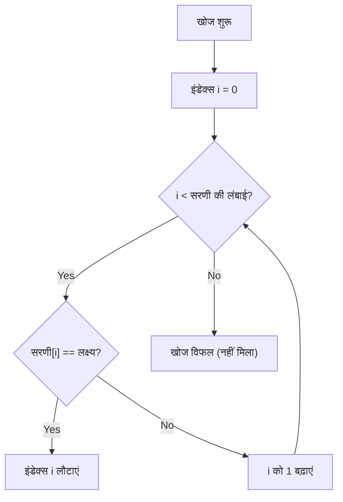
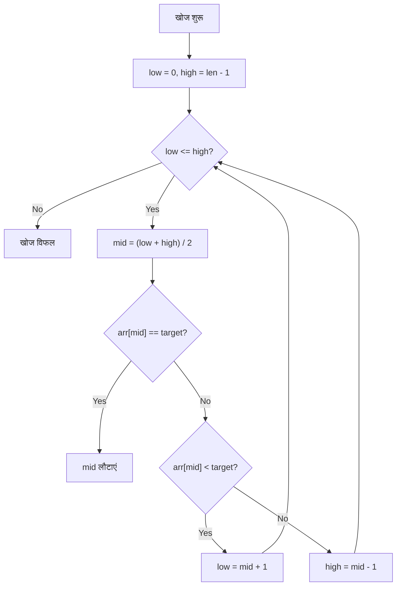
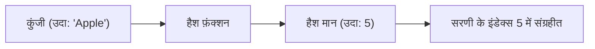
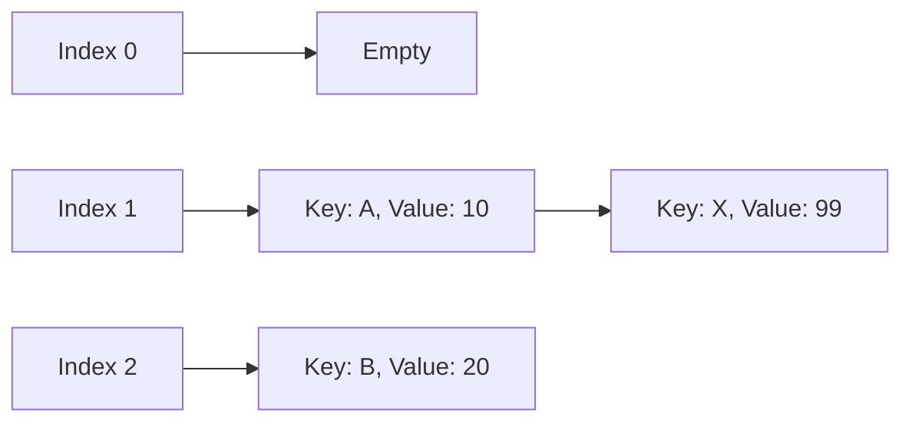

# खोज एल्गोरिदम के मूल सिद्धांत और महत्व

आधुनिक कंप्यूटर विज्ञान में, डेटा से वांछित मानों को तुरंत खोजने वाले **खोज एल्गोरिदम** किसी भी सॉफ़्टवेयर और सिस्टम का आधार बनाने वाली एक अत्यंत महत्वपूर्ण तकनीक है। हम रोज़मर्रा के जीवन में खोज एल्गोरिदम से लाभान्वित होते हैं, जैसे डेटाबेस खोजना, वेब ब्राउज़र में कीवर्ड खोजना, और स्मार्टफ़ोन के संपर्क ऐप में नाम खोजना。

इस लेख में, हम 'लीनियर सर्च (Linear Search)' और 'बाइनरी सर्च (Binary Search)' एल्गोरिदम, जो कंप्यूटर विज्ञान के मूल सिद्धांत हैं, को उनके तंत्र, समय जटिलता और Python कार्यान्वयन उदाहरणों के साथ विस्तार से समझाएंगे। इसके अलावा, हम इन एल्गोरिदम की सीमाओं को पार करने और अत्यधिक खोज गति को प्राप्त करने वाले 'हैश टेबल (Hash Table)' के सिद्धांतों, हैश फ़ंक्शंस की भूमिका और हैश टक्कर (Collision) समाधान विधियों में गहराई से उतरेंगे。


एक प्रोग्रामर के रूप में अपने कौशल को अगले स्तर तक ले जाने के लिए खोज एल्गोरिदम की अपनी समझ को गहरा करना आवश्यक है। जब डेटा की मात्रा कम होती है तो एल्गोरिदम के चुनाव का प्रदर्शन पर प्रभाव न्यूनतम हो सकता है, लेकिन बड़े डेटा के युग में, लाखों या करोड़ों डेटा टुकड़ों में से वांछित जानकारी को तुरंत खोजने के लिए उपयुक्त एल्गोरिदम और डेटा संरचनाओं का चयन अत्यंत महत्वपूर्ण हो जाता है। विशेष रूप से, **समय जटिलता** ($O(n)$, $O(\log n)$, $O(1)$, आदि) की अवधारणाओं को समझना कुशल कार्यक्रमों को डिज़ाइन करने के लिए एक आवश्यक तत्व है。

एक प्रोग्रामर के रूप में अपने कौशल को अगले स्तर तक ले जाने के लिए खोज एल्गोरिदम की अपनी समझ को गहरा करना आवश्यक है। जब डेटा की मात्रा कम होती है तो एल्गोरिदम के चुनाव का प्रदर्शन पर प्रभाव न्यूनतम हो सकता है, लेकिन बड़े डेटा के युग में, लाखों या करोड़ों डेटा टुकड़ों में से वांछित जानकारी को तुरंत खोजने के लिए उपयुक्त एल्गोरिदम और डेटा संरचनाओं का चयन अत्यंत महत्वपूर्ण हो जाता है। विशेष रूप से, **समय जटिलता** ($O(n)$, $O(\log n)$, $O(1)$, आदि) की अवधारणाओं को समझना कुशल कार्यक्रमों को डिज़ाइन करने के लिए एक आवश्यक तत्व है。

एक प्रोग्रामर के रूप में अपने कौशल को अगले स्तर तक ले जाने के लिए खोज एल्गोरिदम की अपनी समझ को गहरा करना आवश्यक है। जब डेटा की मात्रा कम होती है तो एल्गोरिदम के चुनाव का प्रदर्शन पर प्रभाव न्यूनतम हो सकता है, लेकिन बड़े डेटा के युग में, लाखों या करोड़ों डेटा टुकड़ों में से वांछित जानकारी को तुरंत खोजने के लिए उपयुक्त एल्गोरिदम और डेटा संरचनाओं का चयन अत्यंत महत्वपूर्ण हो जाता है। विशेष रूप से, **समय जटिलता** ($O(n)$, $O(\log n)$, $O(1)$, आदि) की अवधारणाओं को समझना कुशल कार्यक्रमों को डिज़ाइन करने के लिए एक आवश्यक तत्व है。

एक प्रोग्रामर के रूप में अपने कौशल को अगले स्तर तक ले जाने के लिए खोज एल्गोरिदम की अपनी समझ को गहरा करना आवश्यक है। जब डेटा की मात्रा कम होती है तो एल्गोरिदम के चुनाव का प्रदर्शन पर प्रभाव न्यूनतम हो सकता है, लेकिन बड़े डेटा के युग में, लाखों या करोड़ों डेटा टुकड़ों में से वांछित जानकारी को तुरंत खोजने के लिए उपयुक्त एल्गोरिदम और डेटा संरचनाओं का चयन अत्यंत महत्वपूर्ण हो जाता है। विशेष रूप से, **समय जटिलता** ($O(n)$, $O(\log n)$, $O(1)$, आदि) की अवधारणाओं को समझना कुशल कार्यक्रमों को डिज़ाइन करने के लिए एक आवश्यक तत्व है。

एक प्रोग्रामर के रूप में अपने कौशल को अगले स्तर तक ले जाने के लिए खोज एल्गोरिदम की अपनी समझ को गहरा करना आवश्यक है। जब डेटा की मात्रा कम होती है तो एल्गोरिदम के चुनाव का प्रदर्शन पर प्रभाव न्यूनतम हो सकता है, लेकिन बड़े डेटा के युग में, लाखों या करोड़ों डेटा टुकड़ों में से वांछित जानकारी को तुरंत खोजने के लिए उपयुक्त एल्गोरिदम और डेटा संरचनाओं का चयन अत्यंत महत्वपूर्ण हो जाता है। विशेष रूप से, **समय जटिलता** ($O(n)$, $O(\log n)$, $O(1)$, आदि) की अवधारणाओं को समझना कुशल कार्यक्रमों को डिज़ाइन करने के लिए एक आवश्यक तत्व है。

एक प्रोग्रामर के रूप में अपने कौशल को अगले स्तर तक ले जाने के लिए खोज एल्गोरिदम की अपनी समझ को गहरा करना आवश्यक है। जब डेटा की मात्रा कम होती है तो एल्गोरिदम के चुनाव का प्रदर्शन पर प्रभाव न्यूनतम हो सकता है, लेकिन बड़े डेटा के युग में, लाखों या करोड़ों डेटा टुकड़ों में से वांछित जानकारी को तुरंत खोजने के लिए उपयुक्त एल्गोरिदम और डेटा संरचनाओं का चयन अत्यंत महत्वपूर्ण हो जाता है। विशेष रूप से, **समय जटिलता** ($O(n)$, $O(\log n)$, $O(1)$, आदि) की अवधारणाओं को समझना कुशल कार्यक्रमों को डिज़ाइन करने के लिए एक आवश्यक तत्व है。

एक प्रोग्रामर के रूप में अपने कौशल को अगले स्तर तक ले जाने के लिए खोज एल्गोरिदम की अपनी समझ को गहरा करना आवश्यक है। जब डेटा की मात्रा कम होती है तो एल्गोरिदम के चुनाव का प्रदर्शन पर प्रभाव न्यूनतम हो सकता है, लेकिन बड़े डेटा के युग में, लाखों या करोड़ों डेटा टुकड़ों में से वांछित जानकारी को तुरंत खोजने के लिए उपयुक्त एल्गोरिदम और डेटा संरचनाओं का चयन अत्यंत महत्वपूर्ण हो जाता है। विशेष रूप से, **समय जटिलता** ($O(n)$, $O(\log n)$, $O(1)$, आदि) की अवधारणाओं को समझना कुशल कार्यक्रमों को डिज़ाइन करने के लिए एक आवश्यक तत्व है。

एक प्रोग्रामर के रूप में अपने कौशल को अगले स्तर तक ले जाने के लिए खोज एल्गोरिदम की अपनी समझ को गहरा करना आवश्यक है। जब डेटा की मात्रा कम होती है तो एल्गोरिदम के चुनाव का प्रदर्शन पर प्रभाव न्यूनतम हो सकता है, लेकिन बड़े डेटा के युग में, लाखों या करोड़ों डेटा टुकड़ों में से वांछित जानकारी को तुरंत खोजने के लिए उपयुक्त एल्गोरिदम और डेटा संरचनाओं का चयन अत्यंत महत्वपूर्ण हो जाता है। विशेष रूप से, **समय जटिलता** ($O(n)$, $O(\log n)$, $O(1)$, आदि) की अवधारणाओं को समझना कुशल कार्यक्रमों को डिज़ाइन करने के लिए एक आवश्यक तत्व है。

एक प्रोग्रामर के रूप में अपने कौशल को अगले स्तर तक ले जाने के लिए खोज एल्गोरिदम की अपनी समझ को गहरा करना आवश्यक है। जब डेटा की मात्रा कम होती है तो एल्गोरिदम के चुनाव का प्रदर्शन पर प्रभाव न्यूनतम हो सकता है, लेकिन बड़े डेटा के युग में, लाखों या करोड़ों डेटा टुकड़ों में से वांछित जानकारी को तुरंत खोजने के लिए उपयुक्त एल्गोरिदम और डेटा संरचनाओं का चयन अत्यंत महत्वपूर्ण हो जाता है। विशेष रूप से, **समय जटिलता** ($O(n)$, $O(\log n)$, $O(1)$, आदि) की अवधारणाओं को समझना कुशल कार्यक्रमों को डिज़ाइन करने के लिए एक आवश्यक तत्व है。

एक प्रोग्रामर के रूप में अपने कौशल को अगले स्तर तक ले जाने के लिए खोज एल्गोरिदम की अपनी समझ को गहरा करना आवश्यक है। जब डेटा की मात्रा कम होती है तो एल्गोरिदम के चुनाव का प्रदर्शन पर प्रभाव न्यूनतम हो सकता है, लेकिन बड़े डेटा के युग में, लाखों या करोड़ों डेटा टुकड़ों में से वांछित जानकारी को तुरंत खोजने के लिए उपयुक्त एल्गोरिदम और डेटा संरचनाओं का चयन अत्यंत महत्वपूर्ण हो जाता है। विशेष रूप से, **समय जटिलता** ($O(n)$, $O(\log n)$, $O(1)$, आदि) की अवधारणाओं को समझना कुशल कार्यक्रमों को डिज़ाइन करने के लिए एक आवश्यक तत्व है。

## 1. लीनियर सर्च (Linear Search)

लीनियर सर्च सबसे सरल और सबसे सहज खोज एल्गोरिदम है, जो डेटा संरचना (जैसे सरणी या सूची) की शुरुआत से अंत तक एक-एक करके तत्वों की जाँच करता है, जब तक कि वांछित मान नहीं मिल जाता。

### 1.1 लीनियर सर्च कैसे काम करता है

लीनियर सर्च एल्गोरिदम निम्नलिखित चरणों में आगे बढ़ता है:

1. सरणी का पहला तत्व निकालें。
2. जांचें कि निकाला गया तत्व वांछित मान (लक्ष्य) से मेल खाता है या नहीं。
3. यदि यह मेल खाता है, तो उस तत्व का इंडेक्स (स्थान) लौटाएं और खोज समाप्त करें。
4. यदि यह मेल नहीं खाता है, तो अगले तत्व पर जाएँ。
5. सरणी के अंत तक जाँच करें, और यदि लक्ष्य नहीं मिलता है, तो खोज विफलता (उदाहरण के लिए, `-1` या `None` लौटाता है) के रूप में समाप्त करें。



### 1.2 Python का उपयोग करके लीनियर सर्च का कार्यान्वयन

नीचे Python का उपयोग करके लीनियर सर्च के कार्यान्वयन का एक सरल उदाहरण दिया गया है。

```python
def linear_search(arr, target):
    """
    लीनियर सर्च निष्पादित करने वाला फ़ंक्शन
    :param arr: खोजने के लिए सूची
    :param target: खोजने के लिए मान
    :return: मिलने पर इसका इंडेक्स, नहीं मिलने पर -1
    """
    for i in range(len(arr)):
        if arr[i] == target:
            return i
    return -1

# परीक्षण डेटा
numbers = [10, 23, 4, 15, 2, 7, 34, 11]
target_value = 7

result_index = linear_search(numbers, target_value)
if result_index != -1:
    print(f"तत्व {target_value} इंडेक्स {result_index} पर मिला।")
else:
    print(f"तत्व {target_value} सूची में मौजूद नहीं है।")
```


लीनियर सर्च की सबसे बड़ी विशेषता यह है कि डेटा को सॉर्ट करने की आवश्यकता नहीं है। भले ही डेटा यादृच्छिक क्रम में संग्रहीत हो, यह शुरुआत से क्रम में जाँच करता है, इसलिए यह निश्चित रूप से वांछित मान (या पुष्टि कर सकता है कि यह मौजूद नहीं है) ढूंढ सकता है। हालाँकि, यह 'क्रम में सब कुछ जांचने' की प्रकृति डेटा की मात्रा बढ़ने पर प्रदर्शन में गिरावट का सबसे बड़ा कारक बन जाती है。

लीनियर सर्च की सबसे बड़ी विशेषता यह है कि डेटा को सॉर्ट करने की आवश्यकता नहीं है। भले ही डेटा यादृच्छिक क्रम में संग्रहीत हो, यह शुरुआत से क्रम में जाँच करता है, इसलिए यह निश्चित रूप से वांछित मान (या पुष्टि कर सकता है कि यह मौजूद नहीं है) ढूंढ सकता है। हालाँकि, यह 'क्रम में सब कुछ जांचने' की प्रकृति डेटा की मात्रा बढ़ने पर प्रदर्शन में गिरावट का सबसे बड़ा कारक बन जाती है。

लीनियर सर्च की सबसे बड़ी विशेषता यह है कि डेटा को सॉर्ट करने की आवश्यकता नहीं है। भले ही डेटा यादृच्छिक क्रम में संग्रहीत हो, यह शुरुआत से क्रम में जाँच करता है, इसलिए यह निश्चित रूप से वांछित मान (या पुष्टि कर सकता है कि यह मौजूद नहीं है) ढूंढ सकता है। हालाँकि, यह 'क्रम में सब कुछ जांचने' की प्रकृति डेटा की मात्रा बढ़ने पर प्रदर्शन में गिरावट का सबसे बड़ा कारक बन जाती है。

लीनियर सर्च की सबसे बड़ी विशेषता यह है कि डेटा को सॉर्ट करने की आवश्यकता नहीं है। भले ही डेटा यादृच्छिक क्रम में संग्रहीत हो, यह शुरुआत से क्रम में जाँच करता है, इसलिए यह निश्चित रूप से वांछित मान (या पुष्टि कर सकता है कि यह मौजूद नहीं है) ढूंढ सकता है। हालाँकि, यह 'क्रम में सब कुछ जांचने' की प्रकृति डेटा की मात्रा बढ़ने पर प्रदर्शन में गिरावट का सबसे बड़ा कारक बन जाती है。

लीनियर सर्च की सबसे बड़ी विशेषता यह है कि डेटा को सॉर्ट करने की आवश्यकता नहीं है। भले ही डेटा यादृच्छिक क्रम में संग्रहीत हो, यह शुरुआत से क्रम में जाँच करता है, इसलिए यह निश्चित रूप से वांछित मान (या पुष्टि कर सकता है कि यह मौजूद नहीं है) ढूंढ सकता है। हालाँकि, यह 'क्रम में सब कुछ जांचने' की प्रकृति डेटा की मात्रा बढ़ने पर प्रदर्शन में गिरावट का सबसे बड़ा कारक बन जाती है。

लीनियर सर्च की सबसे बड़ी विशेषता यह है कि डेटा को सॉर्ट करने की आवश्यकता नहीं है। भले ही डेटा यादृच्छिक क्रम में संग्रहीत हो, यह शुरुआत से क्रम में जाँच करता है, इसलिए यह निश्चित रूप से वांछित मान (या पुष्टि कर सकता है कि यह मौजूद नहीं है) ढूंढ सकता है। हालाँकि, यह 'क्रम में सब कुछ जांचने' की प्रकृति डेटा की मात्रा बढ़ने पर प्रदर्शन में गिरावट का सबसे बड़ा कारक बन जाती है。

लीनियर सर्च की सबसे बड़ी विशेषता यह है कि डेटा को सॉर्ट करने की आवश्यकता नहीं है। भले ही डेटा यादृच्छिक क्रम में संग्रहीत हो, यह शुरुआत से क्रम में जाँच करता है, इसलिए यह निश्चित रूप से वांछित मान (या पुष्टि कर सकता है कि यह मौजूद नहीं है) ढूंढ सकता है। हालाँकि, यह 'क्रम में सब कुछ जांचने' की प्रकृति डेटा की मात्रा बढ़ने पर प्रदर्शन में गिरावट का सबसे बड़ा कारक बन जाती है。

लीनियर सर्च की सबसे बड़ी विशेषता यह है कि डेटा को सॉर्ट करने की आवश्यकता नहीं है। भले ही डेटा यादृच्छिक क्रम में संग्रहीत हो, यह शुरुआत से क्रम में जाँच करता है, इसलिए यह निश्चित रूप से वांछित मान (या पुष्टि कर सकता है कि यह मौजूद नहीं है) ढूंढ सकता है। हालाँकि, यह 'क्रम में सब कुछ जांचने' की प्रकृति डेटा की मात्रा बढ़ने पर प्रदर्शन में गिरावट का सबसे बड़ा कारक बन जाती है。

लीनियर सर्च की सबसे बड़ी विशेषता यह है कि डेटा को सॉर्ट करने की आवश्यकता नहीं है। भले ही डेटा यादृच्छिक क्रम में संग्रहीत हो, यह शुरुआत से क्रम में जाँच करता है, इसलिए यह निश्चित रूप से वांछित मान (या पुष्टि कर सकता है कि यह मौजूद नहीं है) ढूंढ सकता है। हालाँकि, यह 'क्रम में सब कुछ जांचने' की प्रकृति डेटा की मात्रा बढ़ने पर प्रदर्शन में गिरावट का सबसे बड़ा कारक बन जाती है。

लीनियर सर्च की सबसे बड़ी विशेषता यह है कि डेटा को सॉर्ट करने की आवश्यकता नहीं है। भले ही डेटा यादृच्छिक क्रम में संग्रहीत हो, यह शुरुआत से क्रम में जाँच करता है, इसलिए यह निश्चित रूप से वांछित मान (या पुष्टि कर सकता है कि यह मौजूद नहीं है) ढूंढ सकता है। हालाँकि, यह 'क्रम में सब कुछ जांचने' की प्रकृति डेटा की मात्रा बढ़ने पर प्रदर्शन में गिरावट का सबसे बड़ा कारक बन जाती है。

लीनियर सर्च की सबसे बड़ी विशेषता यह है कि डेटा को सॉर्ट करने की आवश्यकता नहीं है। भले ही डेटा यादृच्छिक क्रम में संग्रहीत हो, यह शुरुआत से क्रम में जाँच करता है, इसलिए यह निश्चित रूप से वांछित मान (या पुष्टि कर सकता है कि यह मौजूद नहीं है) ढूंढ सकता है। हालाँकि, यह 'क्रम में सब कुछ जांचने' की प्रकृति डेटा की मात्रा बढ़ने पर प्रदर्शन में गिरावट का सबसे बड़ा कारक बन जाती है。

लीनियर सर्च की सबसे बड़ी विशेषता यह है कि डेटा को सॉर्ट करने की आवश्यकता नहीं है। भले ही डेटा यादृच्छिक क्रम में संग्रहीत हो, यह शुरुआत से क्रम में जाँच करता है, इसलिए यह निश्चित रूप से वांछित मान (या पुष्टि कर सकता है कि यह मौजूद नहीं है) ढूंढ सकता है। हालाँकि, यह 'क्रम में सब कुछ जांचने' की प्रकृति डेटा की मात्रा बढ़ने पर प्रदर्शन में गिरावट का सबसे बड़ा कारक बन जाती है。

लीनियर सर्च की सबसे बड़ी विशेषता यह है कि डेटा को सॉर्ट करने की आवश्यकता नहीं है। भले ही डेटा यादृच्छिक क्रम में संग्रहीत हो, यह शुरुआत से क्रम में जाँच करता है, इसलिए यह निश्चित रूप से वांछित मान (या पुष्टि कर सकता है कि यह मौजूद नहीं है) ढूंढ सकता है। हालाँकि, यह 'क्रम में सब कुछ जांचने' की प्रकृति डेटा की मात्रा बढ़ने पर प्रदर्शन में गिरावट का सबसे बड़ा कारक बन जाती है。

लीनियर सर्च की सबसे बड़ी विशेषता यह है कि डेटा को सॉर्ट करने की आवश्यकता नहीं है। भले ही डेटा यादृच्छिक क्रम में संग्रहीत हो, यह शुरुआत से क्रम में जाँच करता है, इसलिए यह निश्चित रूप से वांछित मान (या पुष्टि कर सकता है कि यह मौजूद नहीं है) ढूंढ सकता है। हालाँकि, यह 'क्रम में सब कुछ जांचने' की प्रकृति डेटा की मात्रा बढ़ने पर प्रदर्शन में गिरावट का सबसे बड़ा कारक बन जाती है。

लीनियर सर्च की सबसे बड़ी विशेषता यह है कि डेटा को सॉर्ट करने की आवश्यकता नहीं है। भले ही डेटा यादृच्छिक क्रम में संग्रहीत हो, यह शुरुआत से क्रम में जाँच करता है, इसलिए यह निश्चित रूप से वांछित मान (या पुष्टि कर सकता है कि यह मौजूद नहीं है) ढूंढ सकता है। हालाँकि, यह 'क्रम में सब कुछ जांचने' की प्रकृति डेटा की मात्रा बढ़ने पर प्रदर्शन में गिरावट का सबसे बड़ा कारक बन जाती है。

लीनियर सर्च की सबसे बड़ी विशेषता यह है कि डेटा को सॉर्ट करने की आवश्यकता नहीं है। भले ही डेटा यादृच्छिक क्रम में संग्रहीत हो, यह शुरुआत से क्रम में जाँच करता है, इसलिए यह निश्चित रूप से वांछित मान (या पुष्टि कर सकता है कि यह मौजूद नहीं है) ढूंढ सकता है। हालाँकि, यह 'क्रम में सब कुछ जांचने' की प्रकृति डेटा की मात्रा बढ़ने पर प्रदर्शन में गिरावट का सबसे बड़ा कारक बन जाती है。

लीनियर सर्च की सबसे बड़ी विशेषता यह है कि डेटा को सॉर्ट करने की आवश्यकता नहीं है। भले ही डेटा यादृच्छिक क्रम में संग्रहीत हो, यह शुरुआत से क्रम में जाँच करता है, इसलिए यह निश्चित रूप से वांछित मान (या पुष्टि कर सकता है कि यह मौजूद नहीं है) ढूंढ सकता है। हालाँकि, यह 'क्रम में सब कुछ जांचने' की प्रकृति डेटा की मात्रा बढ़ने पर प्रदर्शन में गिरावट का सबसे बड़ा कारक बन जाती है。

लीनियर सर्च की सबसे बड़ी विशेषता यह है कि डेटा को सॉर्ट करने की आवश्यकता नहीं है। भले ही डेटा यादृच्छिक क्रम में संग्रहीत हो, यह शुरुआत से क्रम में जाँच करता है, इसलिए यह निश्चित रूप से वांछित मान (या पुष्टि कर सकता है कि यह मौजूद नहीं है) ढूंढ सकता है। हालाँकि, यह 'क्रम में सब कुछ जांचने' की प्रकृति डेटा की मात्रा बढ़ने पर प्रदर्शन में गिरावट का सबसे बड़ा कारक बन जाती है。

लीनियर सर्च की सबसे बड़ी विशेषता यह है कि डेटा को सॉर्ट करने की आवश्यकता नहीं है। भले ही डेटा यादृच्छिक क्रम में संग्रहीत हो, यह शुरुआत से क्रम में जाँच करता है, इसलिए यह निश्चित रूप से वांछित मान (या पुष्टि कर सकता है कि यह मौजूद नहीं है) ढूंढ सकता है। हालाँकि, यह 'क्रम में सब कुछ जांचने' की प्रकृति डेटा की मात्रा बढ़ने पर प्रदर्शन में गिरावट का सबसे बड़ा कारक बन जाती है。

लीनियर सर्च की सबसे बड़ी विशेषता यह है कि डेटा को सॉर्ट करने की आवश्यकता नहीं है। भले ही डेटा यादृच्छिक क्रम में संग्रहीत हो, यह शुरुआत से क्रम में जाँच करता है, इसलिए यह निश्चित रूप से वांछित मान (या पुष्टि कर सकता है कि यह मौजूद नहीं है) ढूंढ सकता है। हालाँकि, यह 'क्रम में सब कुछ जांचने' की प्रकृति डेटा की मात्रा बढ़ने पर प्रदर्शन में गिरावट का सबसे बड़ा कारक बन जाती है。

लीनियर सर्च की सबसे बड़ी विशेषता यह है कि डेटा को सॉर्ट करने की आवश्यकता नहीं है। भले ही डेटा यादृच्छिक क्रम में संग्रहीत हो, यह शुरुआत से क्रम में जाँच करता है, इसलिए यह निश्चित रूप से वांछित मान (या पुष्टि कर सकता है कि यह मौजूद नहीं है) ढूंढ सकता है। हालाँकि, यह 'क्रम में सब कुछ जांचने' की प्रकृति डेटा की मात्रा बढ़ने पर प्रदर्शन में गिरावट का सबसे बड़ा कारक बन जाती है。

लीनियर सर्च की सबसे बड़ी विशेषता यह है कि डेटा को सॉर्ट करने की आवश्यकता नहीं है। भले ही डेटा यादृच्छिक क्रम में संग्रहीत हो, यह शुरुआत से क्रम में जाँच करता है, इसलिए यह निश्चित रूप से वांछित मान (या पुष्टि कर सकता है कि यह मौजूद नहीं है) ढूंढ सकता है। हालाँकि, यह 'क्रम में सब कुछ जांचने' की प्रकृति डेटा की मात्रा बढ़ने पर प्रदर्शन में गिरावट का सबसे बड़ा कारक बन जाती है。

लीनियर सर्च की सबसे बड़ी विशेषता यह है कि डेटा को सॉर्ट करने की आवश्यकता नहीं है। भले ही डेटा यादृच्छिक क्रम में संग्रहीत हो, यह शुरुआत से क्रम में जाँच करता है, इसलिए यह निश्चित रूप से वांछित मान (या पुष्टि कर सकता है कि यह मौजूद नहीं है) ढूंढ सकता है। हालाँकि, यह 'क्रम में सब कुछ जांचने' की प्रकृति डेटा की मात्रा बढ़ने पर प्रदर्शन में गिरावट का सबसे बड़ा कारक बन जाती है。

लीनियर सर्च की सबसे बड़ी विशेषता यह है कि डेटा को सॉर्ट करने की आवश्यकता नहीं है। भले ही डेटा यादृच्छिक क्रम में संग्रहीत हो, यह शुरुआत से क्रम में जाँच करता है, इसलिए यह निश्चित रूप से वांछित मान (या पुष्टि कर सकता है कि यह मौजूद नहीं है) ढूंढ सकता है। हालाँकि, यह 'क्रम में सब कुछ जांचने' की प्रकृति डेटा की मात्रा बढ़ने पर प्रदर्शन में गिरावट का सबसे बड़ा कारक बन जाती है。

लीनियर सर्च की सबसे बड़ी विशेषता यह है कि डेटा को सॉर्ट करने की आवश्यकता नहीं है। भले ही डेटा यादृच्छिक क्रम में संग्रहीत हो, यह शुरुआत से क्रम में जाँच करता है, इसलिए यह निश्चित रूप से वांछित मान (या पुष्टि कर सकता है कि यह मौजूद नहीं है) ढूंढ सकता है। हालाँकि, यह 'क्रम में सब कुछ जांचने' की प्रकृति डेटा की मात्रा बढ़ने पर प्रदर्शन में गिरावट का सबसे बड़ा कारक बन जाती है。

लीनियर सर्च की सबसे बड़ी विशेषता यह है कि डेटा को सॉर्ट करने की आवश्यकता नहीं है। भले ही डेटा यादृच्छिक क्रम में संग्रहीत हो, यह शुरुआत से क्रम में जाँच करता है, इसलिए यह निश्चित रूप से वांछित मान (या पुष्टि कर सकता है कि यह मौजूद नहीं है) ढूंढ सकता है। हालाँकि, यह 'क्रम में सब कुछ जांचने' की प्रकृति डेटा की मात्रा बढ़ने पर प्रदर्शन में गिरावट का सबसे बड़ा कारक बन जाती है。

लीनियर सर्च की सबसे बड़ी विशेषता यह है कि डेटा को सॉर्ट करने की आवश्यकता नहीं है। भले ही डेटा यादृच्छिक क्रम में संग्रहीत हो, यह शुरुआत से क्रम में जाँच करता है, इसलिए यह निश्चित रूप से वांछित मान (या पुष्टि कर सकता है कि यह मौजूद नहीं है) ढूंढ सकता है। हालाँकि, यह 'क्रम में सब कुछ जांचने' की प्रकृति डेटा की मात्रा बढ़ने पर प्रदर्शन में गिरावट का सबसे बड़ा कारक बन जाती है。

लीनियर सर्च की सबसे बड़ी विशेषता यह है कि डेटा को सॉर्ट करने की आवश्यकता नहीं है। भले ही डेटा यादृच्छिक क्रम में संग्रहीत हो, यह शुरुआत से क्रम में जाँच करता है, इसलिए यह निश्चित रूप से वांछित मान (या पुष्टि कर सकता है कि यह मौजूद नहीं है) ढूंढ सकता है। हालाँकि, यह 'क्रम में सब कुछ जांचने' की प्रकृति डेटा की मात्रा बढ़ने पर प्रदर्शन में गिरावट का सबसे बड़ा कारक बन जाती है。

लीनियर सर्च की सबसे बड़ी विशेषता यह है कि डेटा को सॉर्ट करने की आवश्यकता नहीं है। भले ही डेटा यादृच्छिक क्रम में संग्रहीत हो, यह शुरुआत से क्रम में जाँच करता है, इसलिए यह निश्चित रूप से वांछित मान (या पुष्टि कर सकता है कि यह मौजूद नहीं है) ढूंढ सकता है। हालाँकि, यह 'क्रम में सब कुछ जांचने' की प्रकृति डेटा की मात्रा बढ़ने पर प्रदर्शन में गिरावट का सबसे बड़ा कारक बन जाती है。

लीनियर सर्च की सबसे बड़ी विशेषता यह है कि डेटा को सॉर्ट करने की आवश्यकता नहीं है। भले ही डेटा यादृच्छिक क्रम में संग्रहीत हो, यह शुरुआत से क्रम में जाँच करता है, इसलिए यह निश्चित रूप से वांछित मान (या पुष्टि कर सकता है कि यह मौजूद नहीं है) ढूंढ सकता है। हालाँकि, यह 'क्रम में सब कुछ जांचने' की प्रकृति डेटा की मात्रा बढ़ने पर प्रदर्शन में गिरावट का सबसे बड़ा कारक बन जाती है。

लीनियर सर्च की सबसे बड़ी विशेषता यह है कि डेटा को सॉर्ट करने की आवश्यकता नहीं है। भले ही डेटा यादृच्छिक क्रम में संग्रहीत हो, यह शुरुआत से क्रम में जाँच करता है, इसलिए यह निश्चित रूप से वांछित मान (या पुष्टि कर सकता है कि यह मौजूद नहीं है) ढूंढ सकता है। हालाँकि, यह 'क्रम में सब कुछ जांचने' की प्रकृति डेटा की मात्रा बढ़ने पर प्रदर्शन में गिरावट का सबसे बड़ा कारक बन जाती है。

लीनियर सर्च की सबसे बड़ी विशेषता यह है कि डेटा को सॉर्ट करने की आवश्यकता नहीं है। भले ही डेटा यादृच्छिक क्रम में संग्रहीत हो, यह शुरुआत से क्रम में जाँच करता है, इसलिए यह निश्चित रूप से वांछित मान (या पुष्टि कर सकता है कि यह मौजूद नहीं है) ढूंढ सकता है। हालाँकि, यह 'क्रम में सब कुछ जांचने' की प्रकृति डेटा की मात्रा बढ़ने पर प्रदर्शन में गिरावट का सबसे बड़ा कारक बन जाती है。

लीनियर सर्च की सबसे बड़ी विशेषता यह है कि डेटा को सॉर्ट करने की आवश्यकता नहीं है। भले ही डेटा यादृच्छिक क्रम में संग्रहीत हो, यह शुरुआत से क्रम में जाँच करता है, इसलिए यह निश्चित रूप से वांछित मान (या पुष्टि कर सकता है कि यह मौजूद नहीं है) ढूंढ सकता है। हालाँकि, यह 'क्रम में सब कुछ जांचने' की प्रकृति डेटा की मात्रा बढ़ने पर प्रदर्शन में गिरावट का सबसे बड़ा कारक बन जाती है。

लीनियर सर्च की सबसे बड़ी विशेषता यह है कि डेटा को सॉर्ट करने की आवश्यकता नहीं है। भले ही डेटा यादृच्छिक क्रम में संग्रहीत हो, यह शुरुआत से क्रम में जाँच करता है, इसलिए यह निश्चित रूप से वांछित मान (या पुष्टि कर सकता है कि यह मौजूद नहीं है) ढूंढ सकता है। हालाँकि, यह 'क्रम में सब कुछ जांचने' की प्रकृति डेटा की मात्रा बढ़ने पर प्रदर्शन में गिरावट का सबसे बड़ा कारक बन जाती है。

लीनियर सर्च की सबसे बड़ी विशेषता यह है कि डेटा को सॉर्ट करने की आवश्यकता नहीं है। भले ही डेटा यादृच्छिक क्रम में संग्रहीत हो, यह शुरुआत से क्रम में जाँच करता है, इसलिए यह निश्चित रूप से वांछित मान (या पुष्टि कर सकता है कि यह मौजूद नहीं है) ढूंढ सकता है। हालाँकि, यह 'क्रम में सब कुछ जांचने' की प्रकृति डेटा की मात्रा बढ़ने पर प्रदर्शन में गिरावट का सबसे बड़ा कारक बन जाती है。

लीनियर सर्च की सबसे बड़ी विशेषता यह है कि डेटा को सॉर्ट करने की आवश्यकता नहीं है। भले ही डेटा यादृच्छिक क्रम में संग्रहीत हो, यह शुरुआत से क्रम में जाँच करता है, इसलिए यह निश्चित रूप से वांछित मान (या पुष्टि कर सकता है कि यह मौजूद नहीं है) ढूंढ सकता है। हालाँकि, यह 'क्रम में सब कुछ जांचने' की प्रकृति डेटा की मात्रा बढ़ने पर प्रदर्शन में गिरावट का सबसे बड़ा कारक बन जाती है。

लीनियर सर्च की सबसे बड़ी विशेषता यह है कि डेटा को सॉर्ट करने की आवश्यकता नहीं है। भले ही डेटा यादृच्छिक क्रम में संग्रहीत हो, यह शुरुआत से क्रम में जाँच करता है, इसलिए यह निश्चित रूप से वांछित मान (या पुष्टि कर सकता है कि यह मौजूद नहीं है) ढूंढ सकता है। हालाँकि, यह 'क्रम में सब कुछ जांचने' की प्रकृति डेटा की मात्रा बढ़ने पर प्रदर्शन में गिरावट का सबसे बड़ा कारक बन जाती है。

लीनियर सर्च की सबसे बड़ी विशेषता यह है कि डेटा को सॉर्ट करने की आवश्यकता नहीं है। भले ही डेटा यादृच्छिक क्रम में संग्रहीत हो, यह शुरुआत से क्रम में जाँच करता है, इसलिए यह निश्चित रूप से वांछित मान (या पुष्टि कर सकता है कि यह मौजूद नहीं है) ढूंढ सकता है। हालाँकि, यह 'क्रम में सब कुछ जांचने' की प्रकृति डेटा की मात्रा बढ़ने पर प्रदर्शन में गिरावट का सबसे बड़ा कारक बन जाती है。

लीनियर सर्च की सबसे बड़ी विशेषता यह है कि डेटा को सॉर्ट करने की आवश्यकता नहीं है। भले ही डेटा यादृच्छिक क्रम में संग्रहीत हो, यह शुरुआत से क्रम में जाँच करता है, इसलिए यह निश्चित रूप से वांछित मान (या पुष्टि कर सकता है कि यह मौजूद नहीं है) ढूंढ सकता है। हालाँकि, यह 'क्रम में सब कुछ जांचने' की प्रकृति डेटा की मात्रा बढ़ने पर प्रदर्शन में गिरावट का सबसे बड़ा कारक बन जाती है。

लीनियर सर्च की सबसे बड़ी विशेषता यह है कि डेटा को सॉर्ट करने की आवश्यकता नहीं है। भले ही डेटा यादृच्छिक क्रम में संग्रहीत हो, यह शुरुआत से क्रम में जाँच करता है, इसलिए यह निश्चित रूप से वांछित मान (या पुष्टि कर सकता है कि यह मौजूद नहीं है) ढूंढ सकता है। हालाँकि, यह 'क्रम में सब कुछ जांचने' की प्रकृति डेटा की मात्रा बढ़ने पर प्रदर्शन में गिरावट का सबसे बड़ा कारक बन जाती है。

लीनियर सर्च की सबसे बड़ी विशेषता यह है कि डेटा को सॉर्ट करने की आवश्यकता नहीं है। भले ही डेटा यादृच्छिक क्रम में संग्रहीत हो, यह शुरुआत से क्रम में जाँच करता है, इसलिए यह निश्चित रूप से वांछित मान (या पुष्टि कर सकता है कि यह मौजूद नहीं है) ढूंढ सकता है। हालाँकि, यह 'क्रम में सब कुछ जांचने' की प्रकृति डेटा की मात्रा बढ़ने पर प्रदर्शन में गिरावट का सबसे बड़ा कारक बन जाती है。

लीनियर सर्च की सबसे बड़ी विशेषता यह है कि डेटा को सॉर्ट करने की आवश्यकता नहीं है। भले ही डेटा यादृच्छिक क्रम में संग्रहीत हो, यह शुरुआत से क्रम में जाँच करता है, इसलिए यह निश्चित रूप से वांछित मान (या पुष्टि कर सकता है कि यह मौजूद नहीं है) ढूंढ सकता है। हालाँकि, यह 'क्रम में सब कुछ जांचने' की प्रकृति डेटा की मात्रा बढ़ने पर प्रदर्शन में गिरावट का सबसे बड़ा कारक बन जाती है。

लीनियर सर्च की सबसे बड़ी विशेषता यह है कि डेटा को सॉर्ट करने की आवश्यकता नहीं है। भले ही डेटा यादृच्छिक क्रम में संग्रहीत हो, यह शुरुआत से क्रम में जाँच करता है, इसलिए यह निश्चित रूप से वांछित मान (या पुष्टि कर सकता है कि यह मौजूद नहीं है) ढूंढ सकता है। हालाँकि, यह 'क्रम में सब कुछ जांचने' की प्रकृति डेटा की मात्रा बढ़ने पर प्रदर्शन में गिरावट का सबसे बड़ा कारक बन जाती है。

लीनियर सर्च की सबसे बड़ी विशेषता यह है कि डेटा को सॉर्ट करने की आवश्यकता नहीं है। भले ही डेटा यादृच्छिक क्रम में संग्रहीत हो, यह शुरुआत से क्रम में जाँच करता है, इसलिए यह निश्चित रूप से वांछित मान (या पुष्टि कर सकता है कि यह मौजूद नहीं है) ढूंढ सकता है। हालाँकि, यह 'क्रम में सब कुछ जांचने' की प्रकृति डेटा की मात्रा बढ़ने पर प्रदर्शन में गिरावट का सबसे बड़ा कारक बन जाती है。

लीनियर सर्च की सबसे बड़ी विशेषता यह है कि डेटा को सॉर्ट करने की आवश्यकता नहीं है। भले ही डेटा यादृच्छिक क्रम में संग्रहीत हो, यह शुरुआत से क्रम में जाँच करता है, इसलिए यह निश्चित रूप से वांछित मान (या पुष्टि कर सकता है कि यह मौजूद नहीं है) ढूंढ सकता है। हालाँकि, यह 'क्रम में सब कुछ जांचने' की प्रकृति डेटा की मात्रा बढ़ने पर प्रदर्शन में गिरावट का सबसे बड़ा कारक बन जाती है。

लीनियर सर्च की सबसे बड़ी विशेषता यह है कि डेटा को सॉर्ट करने की आवश्यकता नहीं है। भले ही डेटा यादृच्छिक क्रम में संग्रहीत हो, यह शुरुआत से क्रम में जाँच करता है, इसलिए यह निश्चित रूप से वांछित मान (या पुष्टि कर सकता है कि यह मौजूद नहीं है) ढूंढ सकता है। हालाँकि, यह 'क्रम में सब कुछ जांचने' की प्रकृति डेटा की मात्रा बढ़ने पर प्रदर्शन में गिरावट का सबसे बड़ा कारक बन जाती है。

लीनियर सर्च की सबसे बड़ी विशेषता यह है कि डेटा को सॉर्ट करने की आवश्यकता नहीं है। भले ही डेटा यादृच्छिक क्रम में संग्रहीत हो, यह शुरुआत से क्रम में जाँच करता है, इसलिए यह निश्चित रूप से वांछित मान (या पुष्टि कर सकता है कि यह मौजूद नहीं है) ढूंढ सकता है। हालाँकि, यह 'क्रम में सब कुछ जांचने' की प्रकृति डेटा की मात्रा बढ़ने पर प्रदर्शन में गिरावट का सबसे बड़ा कारक बन जाती है。

लीनियर सर्च की सबसे बड़ी विशेषता यह है कि डेटा को सॉर्ट करने की आवश्यकता नहीं है। भले ही डेटा यादृच्छिक क्रम में संग्रहीत हो, यह शुरुआत से क्रम में जाँच करता है, इसलिए यह निश्चित रूप से वांछित मान (या पुष्टि कर सकता है कि यह मौजूद नहीं है) ढूंढ सकता है। हालाँकि, यह 'क्रम में सब कुछ जांचने' की प्रकृति डेटा की मात्रा बढ़ने पर प्रदर्शन में गिरावट का सबसे बड़ा कारक बन जाती है。

लीनियर सर्च की सबसे बड़ी विशेषता यह है कि डेटा को सॉर्ट करने की आवश्यकता नहीं है। भले ही डेटा यादृच्छिक क्रम में संग्रहीत हो, यह शुरुआत से क्रम में जाँच करता है, इसलिए यह निश्चित रूप से वांछित मान (या पुष्टि कर सकता है कि यह मौजूद नहीं है) ढूंढ सकता है। हालाँकि, यह 'क्रम में सब कुछ जांचने' की प्रकृति डेटा की मात्रा बढ़ने पर प्रदर्शन में गिरावट का सबसे बड़ा कारक बन जाती है。

लीनियर सर्च की सबसे बड़ी विशेषता यह है कि डेटा को सॉर्ट करने की आवश्यकता नहीं है। भले ही डेटा यादृच्छिक क्रम में संग्रहीत हो, यह शुरुआत से क्रम में जाँच करता है, इसलिए यह निश्चित रूप से वांछित मान (या पुष्टि कर सकता है कि यह मौजूद नहीं है) ढूंढ सकता है। हालाँकि, यह 'क्रम में सब कुछ जांचने' की प्रकृति डेटा की मात्रा बढ़ने पर प्रदर्शन में गिरावट का सबसे बड़ा कारक बन जाती है。

## 2. बाइनरी सर्च (Binary Search)

बाइनरी सर्च एक बहुत ही तेज़ और कुशल खोज एल्गोरिदम है जिसे केवल **पूर्व-सॉर्ट किए गए डेटा (आरोही या अवरोही क्रम में)** पर लागू किया जा सकता है। खोज सीमा को आधा-आधा करके, यह संगणना की मात्रा को काफी कम कर देता है。

### 2.1 बाइनरी सर्च कैसे काम करता है

बाइनरी सर्च निम्नलिखित चरणों में किया जाता है:

1. खोजे जाने वाली सरणी के 'बाएँ छोर (`low`)' और 'दाएँ छोर (`high`)' के इंडेक्स को प्रारंभ करें。
2. जब तक खोज सीमा मान्य है (`low <= high`), तब तक निम्नलिखित प्रक्रिया दोहराएं。
3. खोज सीमा के मध्य इंडेक्स (`mid`) की गणना करें。
4. मध्य तत्व (`arr[mid]`) की तुलना वांछित मान (लक्ष्य) से करें。
5. यदि यह मेल खाता है, तो `mid` लौटाएं और समाप्त करें。
6. यदि मध्य तत्व लक्ष्य से छोटा है, तो लक्ष्य दाएँ आधे भाग में मौजूद होगा, इसलिए बाएँ छोर को `mid + 1` पर अपडेट करें。
7. यदि मध्य तत्व लक्ष्य से बड़ा है, तो लक्ष्य बाएँ आधे भाग में मौजूद होगा, इसलिए दाएँ छोर को `mid - 1` पर अपडेट करें。
8. यदि खोज सीमा समाप्त होने के बाद भी यह नहीं मिलता है, तो इसे खोज विफलता माना जाता है。



### 2.2 Python का उपयोग करके बाइनरी सर्च का कार्यान्वयन (पुनरावृत्त विधि)

```python
def binary_search(arr, target):
    """
    बाइनरी सर्च (पुनरावृत्त विधि) निष्पादित करने वाला फ़ंक्शन
    :param arr: सॉर्ट की गई खोज सूची
    :param target: खोजने के लिए मान
    :return: मिलने पर इसका इंडेक्स, नहीं मिलने पर -1
    """
    low = 0
    high = len(arr) - 1

    while low <= high:
        mid = (low + high) // 2
        
        if arr[mid] == target:
            return mid
        elif arr[mid] < target:
            low = mid + 1
        else:
            high = mid - 1
            
    return -1

# परीक्षण डेटा (सॉर्ट किया हुआ होना चाहिए)
sorted_numbers = [2, 4, 7, 10, 11, 15, 23, 34]
target_value = 15

result_index = binary_search(sorted_numbers, target_value)
if result_index != -1:
    print(f"तत्व {target_value} इंडेक्स {result_index} पर मिला।")
else:
    print(f"तत्व {target_value} सूची में मौजूद नहीं है।")
```

बाइनरी सर्च का अद्भुत प्रदर्शन इसकी हर बार खोज सीमा को आधे में विभाजित करने की संपत्ति से आता है। उदाहरण के लिए, यदि आप 10 लाख तत्वों वाली सरणी पर लीनियर सर्च करते हैं, तो सबसे खराब स्थिति में 10 लाख तुलनाओं की आवश्यकता होगी, लेकिन बाइनरी सर्च के साथ, आप केवल लगभग 20 तुलनाओं के साथ वांछित मान पा सकते हैं ($2^{20} \approx 1,000,000$)। इस कारण से, बड़े डेटासेट पर खोज कार्यों के लिए लीनियर सर्च की तुलना में बाइनरी सर्च को भारी लाभ होता है। गणितीय रूप से, बाइनरी सर्च की समय जटिलता को $O(\log n)$ के रूप में व्यक्त किया जाता है。

बाइनरी सर्च का अद्भुत प्रदर्शन इसकी हर बार खोज सीमा को आधे में विभाजित करने की संपत्ति से आता है। उदाहरण के लिए, यदि आप 10 लाख तत्वों वाली सरणी पर लीनियर सर्च करते हैं, तो सबसे खराब स्थिति में 10 लाख तुलनाओं की आवश्यकता होगी, लेकिन बाइनरी सर्च के साथ, आप केवल लगभग 20 तुलनाओं के साथ वांछित मान पा सकते हैं ($2^{20} \approx 1,000,000$)। इस कारण से, बड़े डेटासेट पर खोज कार्यों के लिए लीनियर सर्च की तुलना में बाइनरी सर्च को भारी लाभ होता है। गणितीय रूप से, बाइनरी सर्च की समय जटिलता को $O(\log n)$ के रूप में व्यक्त किया जाता है。

बाइनरी सर्च का अद्भुत प्रदर्शन इसकी हर बार खोज सीमा को आधे में विभाजित करने की संपत्ति से आता है। उदाहरण के लिए, यदि आप 10 लाख तत्वों वाली सरणी पर लीनियर सर्च करते हैं, तो सबसे खराब स्थिति में 10 लाख तुलनाओं की आवश्यकता होगी, लेकिन बाइनरी सर्च के साथ, आप केवल लगभग 20 तुलनाओं के साथ वांछित मान पा सकते हैं ($2^{20} \approx 1,000,000$)। इस कारण से, बड़े डेटासेट पर खोज कार्यों के लिए लीनियर सर्च की तुलना में बाइनरी सर्च को भारी लाभ होता है। गणितीय रूप से, बाइनरी सर्च की समय जटिलता को $O(\log n)$ के रूप में व्यक्त किया जाता है。

बाइनरी सर्च का अद्भुत प्रदर्शन इसकी हर बार खोज सीमा को आधे में विभाजित करने की संपत्ति से आता है। उदाहरण के लिए, यदि आप 10 लाख तत्वों वाली सरणी पर लीनियर सर्च करते हैं, तो सबसे खराब स्थिति में 10 लाख तुलनाओं की आवश्यकता होगी, लेकिन बाइनरी सर्च के साथ, आप केवल लगभग 20 तुलनाओं के साथ वांछित मान पा सकते हैं ($2^{20} \approx 1,000,000$)। इस कारण से, बड़े डेटासेट पर खोज कार्यों के लिए लीनियर सर्च की तुलना में बाइनरी सर्च को भारी लाभ होता है। गणितीय रूप से, बाइनरी सर्च की समय जटिलता को $O(\log n)$ के रूप में व्यक्त किया जाता है。

बाइनरी सर्च का अद्भुत प्रदर्शन इसकी हर बार खोज सीमा को आधे में विभाजित करने की संपत्ति से आता है। उदाहरण के लिए, यदि आप 10 लाख तत्वों वाली सरणी पर लीनियर सर्च करते हैं, तो सबसे खराब स्थिति में 10 लाख तुलनाओं की आवश्यकता होगी, लेकिन बाइनरी सर्च के साथ, आप केवल लगभग 20 तुलनाओं के साथ वांछित मान पा सकते हैं ($2^{20} \approx 1,000,000$)। इस कारण से, बड़े डेटासेट पर खोज कार्यों के लिए लीनियर सर्च की तुलना में बाइनरी सर्च को भारी लाभ होता है। गणितीय रूप से, बाइनरी सर्च की समय जटिलता को $O(\log n)$ के रूप में व्यक्त किया जाता है。

बाइनरी सर्च का अद्भुत प्रदर्शन इसकी हर बार खोज सीमा को आधे में विभाजित करने की संपत्ति से आता है। उदाहरण के लिए, यदि आप 10 लाख तत्वों वाली सरणी पर लीनियर सर्च करते हैं, तो सबसे खराब स्थिति में 10 लाख तुलनाओं की आवश्यकता होगी, लेकिन बाइनरी सर्च के साथ, आप केवल लगभग 20 तुलनाओं के साथ वांछित मान पा सकते हैं ($2^{20} \approx 1,000,000$)। इस कारण से, बड़े डेटासेट पर खोज कार्यों के लिए लीनियर सर्च की तुलना में बाइनरी सर्च को भारी लाभ होता है। गणितीय रूप से, बाइनरी सर्च की समय जटिलता को $O(\log n)$ के रूप में व्यक्त किया जाता है。

बाइनरी सर्च का अद्भुत प्रदर्शन इसकी हर बार खोज सीमा को आधे में विभाजित करने की संपत्ति से आता है। उदाहरण के लिए, यदि आप 10 लाख तत्वों वाली सरणी पर लीनियर सर्च करते हैं, तो सबसे खराब स्थिति में 10 लाख तुलनाओं की आवश्यकता होगी, लेकिन बाइनरी सर्च के साथ, आप केवल लगभग 20 तुलनाओं के साथ वांछित मान पा सकते हैं ($2^{20} \approx 1,000,000$)। इस कारण से, बड़े डेटासेट पर खोज कार्यों के लिए लीनियर सर्च की तुलना में बाइनरी सर्च को भारी लाभ होता है। गणितीय रूप से, बाइनरी सर्च की समय जटिलता को $O(\log n)$ के रूप में व्यक्त किया जाता है。

बाइनरी सर्च का अद्भुत प्रदर्शन इसकी हर बार खोज सीमा को आधे में विभाजित करने की संपत्ति से आता है। उदाहरण के लिए, यदि आप 10 लाख तत्वों वाली सरणी पर लीनियर सर्च करते हैं, तो सबसे खराब स्थिति में 10 लाख तुलनाओं की आवश्यकता होगी, लेकिन बाइनरी सर्च के साथ, आप केवल लगभग 20 तुलनाओं के साथ वांछित मान पा सकते हैं ($2^{20} \approx 1,000,000$)। इस कारण से, बड़े डेटासेट पर खोज कार्यों के लिए लीनियर सर्च की तुलना में बाइनरी सर्च को भारी लाभ होता है। गणितीय रूप से, बाइनरी सर्च की समय जटिलता को $O(\log n)$ के रूप में व्यक्त किया जाता है。

बाइनरी सर्च का अद्भुत प्रदर्शन इसकी हर बार खोज सीमा को आधे में विभाजित करने की संपत्ति से आता है। उदाहरण के लिए, यदि आप 10 लाख तत्वों वाली सरणी पर लीनियर सर्च करते हैं, तो सबसे खराब स्थिति में 10 लाख तुलनाओं की आवश्यकता होगी, लेकिन बाइनरी सर्च के साथ, आप केवल लगभग 20 तुलनाओं के साथ वांछित मान पा सकते हैं ($2^{20} \approx 1,000,000$)। इस कारण से, बड़े डेटासेट पर खोज कार्यों के लिए लीनियर सर्च की तुलना में बाइनरी सर्च को भारी लाभ होता है। गणितीय रूप से, बाइनरी सर्च की समय जटिलता को $O(\log n)$ के रूप में व्यक्त किया जाता है。

बाइनरी सर्च का अद्भुत प्रदर्शन इसकी हर बार खोज सीमा को आधे में विभाजित करने की संपत्ति से आता है। उदाहरण के लिए, यदि आप 10 लाख तत्वों वाली सरणी पर लीनियर सर्च करते हैं, तो सबसे खराब स्थिति में 10 लाख तुलनाओं की आवश्यकता होगी, लेकिन बाइनरी सर्च के साथ, आप केवल लगभग 20 तुलनाओं के साथ वांछित मान पा सकते हैं ($2^{20} \approx 1,000,000$)। इस कारण से, बड़े डेटासेट पर खोज कार्यों के लिए लीनियर सर्च की तुलना में बाइनरी सर्च को भारी लाभ होता है। गणितीय रूप से, बाइनरी सर्च की समय जटिलता को $O(\log n)$ के रूप में व्यक्त किया जाता है。

बाइनरी सर्च का अद्भुत प्रदर्शन इसकी हर बार खोज सीमा को आधे में विभाजित करने की संपत्ति से आता है। उदाहरण के लिए, यदि आप 10 लाख तत्वों वाली सरणी पर लीनियर सर्च करते हैं, तो सबसे खराब स्थिति में 10 लाख तुलनाओं की आवश्यकता होगी, लेकिन बाइनरी सर्च के साथ, आप केवल लगभग 20 तुलनाओं के साथ वांछित मान पा सकते हैं ($2^{20} \approx 1,000,000$)। इस कारण से, बड़े डेटासेट पर खोज कार्यों के लिए लीनियर सर्च की तुलना में बाइनरी सर्च को भारी लाभ होता है। गणितीय रूप से, बाइनरी सर्च की समय जटिलता को $O(\log n)$ के रूप में व्यक्त किया जाता है。

बाइनरी सर्च का अद्भुत प्रदर्शन इसकी हर बार खोज सीमा को आधे में विभाजित करने की संपत्ति से आता है। उदाहरण के लिए, यदि आप 10 लाख तत्वों वाली सरणी पर लीनियर सर्च करते हैं, तो सबसे खराब स्थिति में 10 लाख तुलनाओं की आवश्यकता होगी, लेकिन बाइनरी सर्च के साथ, आप केवल लगभग 20 तुलनाओं के साथ वांछित मान पा सकते हैं ($2^{20} \approx 1,000,000$)। इस कारण से, बड़े डेटासेट पर खोज कार्यों के लिए लीनियर सर्च की तुलना में बाइनरी सर्च को भारी लाभ होता है। गणितीय रूप से, बाइनरी सर्च की समय जटिलता को $O(\log n)$ के रूप में व्यक्त किया जाता है。

बाइनरी सर्च का अद्भुत प्रदर्शन इसकी हर बार खोज सीमा को आधे में विभाजित करने की संपत्ति से आता है। उदाहरण के लिए, यदि आप 10 लाख तत्वों वाली सरणी पर लीनियर सर्च करते हैं, तो सबसे खराब स्थिति में 10 लाख तुलनाओं की आवश्यकता होगी, लेकिन बाइनरी सर्च के साथ, आप केवल लगभग 20 तुलनाओं के साथ वांछित मान पा सकते हैं ($2^{20} \approx 1,000,000$)। इस कारण से, बड़े डेटासेट पर खोज कार्यों के लिए लीनियर सर्च की तुलना में बाइनरी सर्च को भारी लाभ होता है। गणितीय रूप से, बाइनरी सर्च की समय जटिलता को $O(\log n)$ के रूप में व्यक्त किया जाता है。

बाइनरी सर्च का अद्भुत प्रदर्शन इसकी हर बार खोज सीमा को आधे में विभाजित करने की संपत्ति से आता है। उदाहरण के लिए, यदि आप 10 लाख तत्वों वाली सरणी पर लीनियर सर्च करते हैं, तो सबसे खराब स्थिति में 10 लाख तुलनाओं की आवश्यकता होगी, लेकिन बाइनरी सर्च के साथ, आप केवल लगभग 20 तुलनाओं के साथ वांछित मान पा सकते हैं ($2^{20} \approx 1,000,000$)। इस कारण से, बड़े डेटासेट पर खोज कार्यों के लिए लीनियर सर्च की तुलना में बाइनरी सर्च को भारी लाभ होता है। गणितीय रूप से, बाइनरी सर्च की समय जटिलता को $O(\log n)$ के रूप में व्यक्त किया जाता है。

बाइनरी सर्च का अद्भुत प्रदर्शन इसकी हर बार खोज सीमा को आधे में विभाजित करने की संपत्ति से आता है। उदाहरण के लिए, यदि आप 10 लाख तत्वों वाली सरणी पर लीनियर सर्च करते हैं, तो सबसे खराब स्थिति में 10 लाख तुलनाओं की आवश्यकता होगी, लेकिन बाइनरी सर्च के साथ, आप केवल लगभग 20 तुलनाओं के साथ वांछित मान पा सकते हैं ($2^{20} \approx 1,000,000$)। इस कारण से, बड़े डेटासेट पर खोज कार्यों के लिए लीनियर सर्च की तुलना में बाइनरी सर्च को भारी लाभ होता है। गणितीय रूप से, बाइनरी सर्च की समय जटिलता को $O(\log n)$ के रूप में व्यक्त किया जाता है。

बाइनरी सर्च का अद्भुत प्रदर्शन इसकी हर बार खोज सीमा को आधे में विभाजित करने की संपत्ति से आता है। उदाहरण के लिए, यदि आप 10 लाख तत्वों वाली सरणी पर लीनियर सर्च करते हैं, तो सबसे खराब स्थिति में 10 लाख तुलनाओं की आवश्यकता होगी, लेकिन बाइनरी सर्च के साथ, आप केवल लगभग 20 तुलनाओं के साथ वांछित मान पा सकते हैं ($2^{20} \approx 1,000,000$)। इस कारण से, बड़े डेटासेट पर खोज कार्यों के लिए लीनियर सर्च की तुलना में बाइनरी सर्च को भारी लाभ होता है। गणितीय रूप से, बाइनरी सर्च की समय जटिलता को $O(\log n)$ के रूप में व्यक्त किया जाता है。

बाइनरी सर्च का अद्भुत प्रदर्शन इसकी हर बार खोज सीमा को आधे में विभाजित करने की संपत्ति से आता है। उदाहरण के लिए, यदि आप 10 लाख तत्वों वाली सरणी पर लीनियर सर्च करते हैं, तो सबसे खराब स्थिति में 10 लाख तुलनाओं की आवश्यकता होगी, लेकिन बाइनरी सर्च के साथ, आप केवल लगभग 20 तुलनाओं के साथ वांछित मान पा सकते हैं ($2^{20} \approx 1,000,000$)। इस कारण से, बड़े डेटासेट पर खोज कार्यों के लिए लीनियर सर्च की तुलना में बाइनरी सर्च को भारी लाभ होता है। गणितीय रूप से, बाइनरी सर्च की समय जटिलता को $O(\log n)$ के रूप में व्यक्त किया जाता है。

बाइनरी सर्च का अद्भुत प्रदर्शन इसकी हर बार खोज सीमा को आधे में विभाजित करने की संपत्ति से आता है। उदाहरण के लिए, यदि आप 10 लाख तत्वों वाली सरणी पर लीनियर सर्च करते हैं, तो सबसे खराब स्थिति में 10 लाख तुलनाओं की आवश्यकता होगी, लेकिन बाइनरी सर्च के साथ, आप केवल लगभग 20 तुलनाओं के साथ वांछित मान पा सकते हैं ($2^{20} \approx 1,000,000$)। इस कारण से, बड़े डेटासेट पर खोज कार्यों के लिए लीनियर सर्च की तुलना में बाइनरी सर्च को भारी लाभ होता है। गणितीय रूप से, बाइनरी सर्च की समय जटिलता को $O(\log n)$ के रूप में व्यक्त किया जाता है。

बाइनरी सर्च का अद्भुत प्रदर्शन इसकी हर बार खोज सीमा को आधे में विभाजित करने की संपत्ति से आता है। उदाहरण के लिए, यदि आप 10 लाख तत्वों वाली सरणी पर लीनियर सर्च करते हैं, तो सबसे खराब स्थिति में 10 लाख तुलनाओं की आवश्यकता होगी, लेकिन बाइनरी सर्च के साथ, आप केवल लगभग 20 तुलनाओं के साथ वांछित मान पा सकते हैं ($2^{20} \approx 1,000,000$)। इस कारण से, बड़े डेटासेट पर खोज कार्यों के लिए लीनियर सर्च की तुलना में बाइनरी सर्च को भारी लाभ होता है। गणितीय रूप से, बाइनरी सर्च की समय जटिलता को $O(\log n)$ के रूप में व्यक्त किया जाता है。

बाइनरी सर्च का अद्भुत प्रदर्शन इसकी हर बार खोज सीमा को आधे में विभाजित करने की संपत्ति से आता है। उदाहरण के लिए, यदि आप 10 लाख तत्वों वाली सरणी पर लीनियर सर्च करते हैं, तो सबसे खराब स्थिति में 10 लाख तुलनाओं की आवश्यकता होगी, लेकिन बाइनरी सर्च के साथ, आप केवल लगभग 20 तुलनाओं के साथ वांछित मान पा सकते हैं ($2^{20} \approx 1,000,000$)। इस कारण से, बड़े डेटासेट पर खोज कार्यों के लिए लीनियर सर्च की तुलना में बाइनरी सर्च को भारी लाभ होता है। गणितीय रूप से, बाइनरी सर्च की समय जटिलता को $O(\log n)$ के रूप में व्यक्त किया जाता है。

बाइनरी सर्च का अद्भुत प्रदर्शन इसकी हर बार खोज सीमा को आधे में विभाजित करने की संपत्ति से आता है। उदाहरण के लिए, यदि आप 10 लाख तत्वों वाली सरणी पर लीनियर सर्च करते हैं, तो सबसे खराब स्थिति में 10 लाख तुलनाओं की आवश्यकता होगी, लेकिन बाइनरी सर्च के साथ, आप केवल लगभग 20 तुलनाओं के साथ वांछित मान पा सकते हैं ($2^{20} \approx 1,000,000$)। इस कारण से, बड़े डेटासेट पर खोज कार्यों के लिए लीनियर सर्च की तुलना में बाइनरी सर्च को भारी लाभ होता है। गणितीय रूप से, बाइनरी सर्च की समय जटिलता को $O(\log n)$ के रूप में व्यक्त किया जाता है。

बाइनरी सर्च का अद्भुत प्रदर्शन इसकी हर बार खोज सीमा को आधे में विभाजित करने की संपत्ति से आता है। उदाहरण के लिए, यदि आप 10 लाख तत्वों वाली सरणी पर लीनियर सर्च करते हैं, तो सबसे खराब स्थिति में 10 लाख तुलनाओं की आवश्यकता होगी, लेकिन बाइनरी सर्च के साथ, आप केवल लगभग 20 तुलनाओं के साथ वांछित मान पा सकते हैं ($2^{20} \approx 1,000,000$)। इस कारण से, बड़े डेटासेट पर खोज कार्यों के लिए लीनियर सर्च की तुलना में बाइनरी सर्च को भारी लाभ होता है। गणितीय रूप से, बाइनरी सर्च की समय जटिलता को $O(\log n)$ के रूप में व्यक्त किया जाता है。

बाइनरी सर्च का अद्भुत प्रदर्शन इसकी हर बार खोज सीमा को आधे में विभाजित करने की संपत्ति से आता है। उदाहरण के लिए, यदि आप 10 लाख तत्वों वाली सरणी पर लीनियर सर्च करते हैं, तो सबसे खराब स्थिति में 10 लाख तुलनाओं की आवश्यकता होगी, लेकिन बाइनरी सर्च के साथ, आप केवल लगभग 20 तुलनाओं के साथ वांछित मान पा सकते हैं ($2^{20} \approx 1,000,000$)। इस कारण से, बड़े डेटासेट पर खोज कार्यों के लिए लीनियर सर्च की तुलना में बाइनरी सर्च को भारी लाभ होता है। गणितीय रूप से, बाइनरी सर्च की समय जटिलता को $O(\log n)$ के रूप में व्यक्त किया जाता है。

बाइनरी सर्च का अद्भुत प्रदर्शन इसकी हर बार खोज सीमा को आधे में विभाजित करने की संपत्ति से आता है। उदाहरण के लिए, यदि आप 10 लाख तत्वों वाली सरणी पर लीनियर सर्च करते हैं, तो सबसे खराब स्थिति में 10 लाख तुलनाओं की आवश्यकता होगी, लेकिन बाइनरी सर्च के साथ, आप केवल लगभग 20 तुलनाओं के साथ वांछित मान पा सकते हैं ($2^{20} \approx 1,000,000$)। इस कारण से, बड़े डेटासेट पर खोज कार्यों के लिए लीनियर सर्च की तुलना में बाइनरी सर्च को भारी लाभ होता है। गणितीय रूप से, बाइनरी सर्च की समय जटिलता को $O(\log n)$ के रूप में व्यक्त किया जाता है。

बाइनरी सर्च का अद्भुत प्रदर्शन इसकी हर बार खोज सीमा को आधे में विभाजित करने की संपत्ति से आता है। उदाहरण के लिए, यदि आप 10 लाख तत्वों वाली सरणी पर लीनियर सर्च करते हैं, तो सबसे खराब स्थिति में 10 लाख तुलनाओं की आवश्यकता होगी, लेकिन बाइनरी सर्च के साथ, आप केवल लगभग 20 तुलनाओं के साथ वांछित मान पा सकते हैं ($2^{20} \approx 1,000,000$)। इस कारण से, बड़े डेटासेट पर खोज कार्यों के लिए लीनियर सर्च की तुलना में बाइनरी सर्च को भारी लाभ होता है। गणितीय रूप से, बाइनरी सर्च की समय जटिलता को $O(\log n)$ के रूप में व्यक्त किया जाता है。

बाइनरी सर्च का अद्भुत प्रदर्शन इसकी हर बार खोज सीमा को आधे में विभाजित करने की संपत्ति से आता है। उदाहरण के लिए, यदि आप 10 लाख तत्वों वाली सरणी पर लीनियर सर्च करते हैं, तो सबसे खराब स्थिति में 10 लाख तुलनाओं की आवश्यकता होगी, लेकिन बाइनरी सर्च के साथ, आप केवल लगभग 20 तुलनाओं के साथ वांछित मान पा सकते हैं ($2^{20} \approx 1,000,000$)। इस कारण से, बड़े डेटासेट पर खोज कार्यों के लिए लीनियर सर्च की तुलना में बाइनरी सर्च को भारी लाभ होता है। गणितीय रूप से, बाइनरी सर्च की समय जटिलता को $O(\log n)$ के रूप में व्यक्त किया जाता है。

बाइनरी सर्च का अद्भुत प्रदर्शन इसकी हर बार खोज सीमा को आधे में विभाजित करने की संपत्ति से आता है। उदाहरण के लिए, यदि आप 10 लाख तत्वों वाली सरणी पर लीनियर सर्च करते हैं, तो सबसे खराब स्थिति में 10 लाख तुलनाओं की आवश्यकता होगी, लेकिन बाइनरी सर्च के साथ, आप केवल लगभग 20 तुलनाओं के साथ वांछित मान पा सकते हैं ($2^{20} \approx 1,000,000$)। इस कारण से, बड़े डेटासेट पर खोज कार्यों के लिए लीनियर सर्च की तुलना में बाइनरी सर्च को भारी लाभ होता है। गणितीय रूप से, बाइनरी सर्च की समय जटिलता को $O(\log n)$ के रूप में व्यक्त किया जाता है。

बाइनरी सर्च का अद्भुत प्रदर्शन इसकी हर बार खोज सीमा को आधे में विभाजित करने की संपत्ति से आता है। उदाहरण के लिए, यदि आप 10 लाख तत्वों वाली सरणी पर लीनियर सर्च करते हैं, तो सबसे खराब स्थिति में 10 लाख तुलनाओं की आवश्यकता होगी, लेकिन बाइनरी सर्च के साथ, आप केवल लगभग 20 तुलनाओं के साथ वांछित मान पा सकते हैं ($2^{20} \approx 1,000,000$)। इस कारण से, बड़े डेटासेट पर खोज कार्यों के लिए लीनियर सर्च की तुलना में बाइनरी सर्च को भारी लाभ होता है। गणितीय रूप से, बाइनरी सर्च की समय जटिलता को $O(\log n)$ के रूप में व्यक्त किया जाता है。

बाइनरी सर्च का अद्भुत प्रदर्शन इसकी हर बार खोज सीमा को आधे में विभाजित करने की संपत्ति से आता है। उदाहरण के लिए, यदि आप 10 लाख तत्वों वाली सरणी पर लीनियर सर्च करते हैं, तो सबसे खराब स्थिति में 10 लाख तुलनाओं की आवश्यकता होगी, लेकिन बाइनरी सर्च के साथ, आप केवल लगभग 20 तुलनाओं के साथ वांछित मान पा सकते हैं ($2^{20} \approx 1,000,000$)। इस कारण से, बड़े डेटासेट पर खोज कार्यों के लिए लीनियर सर्च की तुलना में बाइनरी सर्च को भारी लाभ होता है। गणितीय रूप से, बाइनरी सर्च की समय जटिलता को $O(\log n)$ के रूप में व्यक्त किया जाता है。

बाइनरी सर्च का अद्भुत प्रदर्शन इसकी हर बार खोज सीमा को आधे में विभाजित करने की संपत्ति से आता है। उदाहरण के लिए, यदि आप 10 लाख तत्वों वाली सरणी पर लीनियर सर्च करते हैं, तो सबसे खराब स्थिति में 10 लाख तुलनाओं की आवश्यकता होगी, लेकिन बाइनरी सर्च के साथ, आप केवल लगभग 20 तुलनाओं के साथ वांछित मान पा सकते हैं ($2^{20} \approx 1,000,000$)। इस कारण से, बड़े डेटासेट पर खोज कार्यों के लिए लीनियर सर्च की तुलना में बाइनरी सर्च को भारी लाभ होता है। गणितीय रूप से, बाइनरी सर्च की समय जटिलता को $O(\log n)$ के रूप में व्यक्त किया जाता है。

बाइनरी सर्च का अद्भुत प्रदर्शन इसकी हर बार खोज सीमा को आधे में विभाजित करने की संपत्ति से आता है। उदाहरण के लिए, यदि आप 10 लाख तत्वों वाली सरणी पर लीनियर सर्च करते हैं, तो सबसे खराब स्थिति में 10 लाख तुलनाओं की आवश्यकता होगी, लेकिन बाइनरी सर्च के साथ, आप केवल लगभग 20 तुलनाओं के साथ वांछित मान पा सकते हैं ($2^{20} \approx 1,000,000$)। इस कारण से, बड़े डेटासेट पर खोज कार्यों के लिए लीनियर सर्च की तुलना में बाइनरी सर्च को भारी लाभ होता है। गणितीय रूप से, बाइनरी सर्च की समय जटिलता को $O(\log n)$ के रूप में व्यक्त किया जाता है。

बाइनरी सर्च का अद्भुत प्रदर्शन इसकी हर बार खोज सीमा को आधे में विभाजित करने की संपत्ति से आता है। उदाहरण के लिए, यदि आप 10 लाख तत्वों वाली सरणी पर लीनियर सर्च करते हैं, तो सबसे खराब स्थिति में 10 लाख तुलनाओं की आवश्यकता होगी, लेकिन बाइनरी सर्च के साथ, आप केवल लगभग 20 तुलनाओं के साथ वांछित मान पा सकते हैं ($2^{20} \approx 1,000,000$)। इस कारण से, बड़े डेटासेट पर खोज कार्यों के लिए लीनियर सर्च की तुलना में बाइनरी सर्च को भारी लाभ होता है। गणितीय रूप से, बाइनरी सर्च की समय जटिलता को $O(\log n)$ के रूप में व्यक्त किया जाता है。

बाइनरी सर्च का अद्भुत प्रदर्शन इसकी हर बार खोज सीमा को आधे में विभाजित करने की संपत्ति से आता है। उदाहरण के लिए, यदि आप 10 लाख तत्वों वाली सरणी पर लीनियर सर्च करते हैं, तो सबसे खराब स्थिति में 10 लाख तुलनाओं की आवश्यकता होगी, लेकिन बाइनरी सर्च के साथ, आप केवल लगभग 20 तुलनाओं के साथ वांछित मान पा सकते हैं ($2^{20} \approx 1,000,000$)। इस कारण से, बड़े डेटासेट पर खोज कार्यों के लिए लीनियर सर्च की तुलना में बाइनरी सर्च को भारी लाभ होता है। गणितीय रूप से, बाइनरी सर्च की समय जटिलता को $O(\log n)$ के रूप में व्यक्त किया जाता है。

बाइनरी सर्च का अद्भुत प्रदर्शन इसकी हर बार खोज सीमा को आधे में विभाजित करने की संपत्ति से आता है। उदाहरण के लिए, यदि आप 10 लाख तत्वों वाली सरणी पर लीनियर सर्च करते हैं, तो सबसे खराब स्थिति में 10 लाख तुलनाओं की आवश्यकता होगी, लेकिन बाइनरी सर्च के साथ, आप केवल लगभग 20 तुलनाओं के साथ वांछित मान पा सकते हैं ($2^{20} \approx 1,000,000$)। इस कारण से, बड़े डेटासेट पर खोज कार्यों के लिए लीनियर सर्च की तुलना में बाइनरी सर्च को भारी लाभ होता है। गणितीय रूप से, बाइनरी सर्च की समय जटिलता को $O(\log n)$ के रूप में व्यक्त किया जाता है。

बाइनरी सर्च का अद्भुत प्रदर्शन इसकी हर बार खोज सीमा को आधे में विभाजित करने की संपत्ति से आता है। उदाहरण के लिए, यदि आप 10 लाख तत्वों वाली सरणी पर लीनियर सर्च करते हैं, तो सबसे खराब स्थिति में 10 लाख तुलनाओं की आवश्यकता होगी, लेकिन बाइनरी सर्च के साथ, आप केवल लगभग 20 तुलनाओं के साथ वांछित मान पा सकते हैं ($2^{20} \approx 1,000,000$)। इस कारण से, बड़े डेटासेट पर खोज कार्यों के लिए लीनियर सर्च की तुलना में बाइनरी सर्च को भारी लाभ होता है। गणितीय रूप से, बाइनरी सर्च की समय जटिलता को $O(\log n)$ के रूप में व्यक्त किया जाता है。

बाइनरी सर्च का अद्भुत प्रदर्शन इसकी हर बार खोज सीमा को आधे में विभाजित करने की संपत्ति से आता है। उदाहरण के लिए, यदि आप 10 लाख तत्वों वाली सरणी पर लीनियर सर्च करते हैं, तो सबसे खराब स्थिति में 10 लाख तुलनाओं की आवश्यकता होगी, लेकिन बाइनरी सर्च के साथ, आप केवल लगभग 20 तुलनाओं के साथ वांछित मान पा सकते हैं ($2^{20} \approx 1,000,000$)। इस कारण से, बड़े डेटासेट पर खोज कार्यों के लिए लीनियर सर्च की तुलना में बाइनरी सर्च को भारी लाभ होता है। गणितीय रूप से, बाइनरी सर्च की समय जटिलता को $O(\log n)$ के रूप में व्यक्त किया जाता है。

बाइनरी सर्च का अद्भुत प्रदर्शन इसकी हर बार खोज सीमा को आधे में विभाजित करने की संपत्ति से आता है। उदाहरण के लिए, यदि आप 10 लाख तत्वों वाली सरणी पर लीनियर सर्च करते हैं, तो सबसे खराब स्थिति में 10 लाख तुलनाओं की आवश्यकता होगी, लेकिन बाइनरी सर्च के साथ, आप केवल लगभग 20 तुलनाओं के साथ वांछित मान पा सकते हैं ($2^{20} \approx 1,000,000$)। इस कारण से, बड़े डेटासेट पर खोज कार्यों के लिए लीनियर सर्च की तुलना में बाइनरी सर्च को भारी लाभ होता है। गणितीय रूप से, बाइनरी सर्च की समय जटिलता को $O(\log n)$ के रूप में व्यक्त किया जाता है。

बाइनरी सर्च का अद्भुत प्रदर्शन इसकी हर बार खोज सीमा को आधे में विभाजित करने की संपत्ति से आता है। उदाहरण के लिए, यदि आप 10 लाख तत्वों वाली सरणी पर लीनियर सर्च करते हैं, तो सबसे खराब स्थिति में 10 लाख तुलनाओं की आवश्यकता होगी, लेकिन बाइनरी सर्च के साथ, आप केवल लगभग 20 तुलनाओं के साथ वांछित मान पा सकते हैं ($2^{20} \approx 1,000,000$)। इस कारण से, बड़े डेटासेट पर खोज कार्यों के लिए लीनियर सर्च की तुलना में बाइनरी सर्च को भारी लाभ होता है। गणितीय रूप से, बाइनरी सर्च की समय जटिलता को $O(\log n)$ के रूप में व्यक्त किया जाता है。

बाइनरी सर्च का अद्भुत प्रदर्शन इसकी हर बार खोज सीमा को आधे में विभाजित करने की संपत्ति से आता है। उदाहरण के लिए, यदि आप 10 लाख तत्वों वाली सरणी पर लीनियर सर्च करते हैं, तो सबसे खराब स्थिति में 10 लाख तुलनाओं की आवश्यकता होगी, लेकिन बाइनरी सर्च के साथ, आप केवल लगभग 20 तुलनाओं के साथ वांछित मान पा सकते हैं ($2^{20} \approx 1,000,000$)। इस कारण से, बड़े डेटासेट पर खोज कार्यों के लिए लीनियर सर्च की तुलना में बाइनरी सर्च को भारी लाभ होता है। गणितीय रूप से, बाइनरी सर्च की समय जटिलता को $O(\log n)$ के रूप में व्यक्त किया जाता है。

बाइनरी सर्च का अद्भुत प्रदर्शन इसकी हर बार खोज सीमा को आधे में विभाजित करने की संपत्ति से आता है। उदाहरण के लिए, यदि आप 10 लाख तत्वों वाली सरणी पर लीनियर सर्च करते हैं, तो सबसे खराब स्थिति में 10 लाख तुलनाओं की आवश्यकता होगी, लेकिन बाइनरी सर्च के साथ, आप केवल लगभग 20 तुलनाओं के साथ वांछित मान पा सकते हैं ($2^{20} \approx 1,000,000$)। इस कारण से, बड़े डेटासेट पर खोज कार्यों के लिए लीनियर सर्च की तुलना में बाइनरी सर्च को भारी लाभ होता है। गणितीय रूप से, बाइनरी सर्च की समय जटिलता को $O(\log n)$ के रूप में व्यक्त किया जाता है。

बाइनरी सर्च का अद्भुत प्रदर्शन इसकी हर बार खोज सीमा को आधे में विभाजित करने की संपत्ति से आता है। उदाहरण के लिए, यदि आप 10 लाख तत्वों वाली सरणी पर लीनियर सर्च करते हैं, तो सबसे खराब स्थिति में 10 लाख तुलनाओं की आवश्यकता होगी, लेकिन बाइनरी सर्च के साथ, आप केवल लगभग 20 तुलनाओं के साथ वांछित मान पा सकते हैं ($2^{20} \approx 1,000,000$)। इस कारण से, बड़े डेटासेट पर खोज कार्यों के लिए लीनियर सर्च की तुलना में बाइनरी सर्च को भारी लाभ होता है। गणितीय रूप से, बाइनरी सर्च की समय जटिलता को $O(\log n)$ के रूप में व्यक्त किया जाता है。

बाइनरी सर्च का अद्भुत प्रदर्शन इसकी हर बार खोज सीमा को आधे में विभाजित करने की संपत्ति से आता है। उदाहरण के लिए, यदि आप 10 लाख तत्वों वाली सरणी पर लीनियर सर्च करते हैं, तो सबसे खराब स्थिति में 10 लाख तुलनाओं की आवश्यकता होगी, लेकिन बाइनरी सर्च के साथ, आप केवल लगभग 20 तुलनाओं के साथ वांछित मान पा सकते हैं ($2^{20} \approx 1,000,000$)। इस कारण से, बड़े डेटासेट पर खोज कार्यों के लिए लीनियर सर्च की तुलना में बाइनरी सर्च को भारी लाभ होता है। गणितीय रूप से, बाइनरी सर्च की समय जटिलता को $O(\log n)$ के रूप में व्यक्त किया जाता है。

बाइनरी सर्च का अद्भुत प्रदर्शन इसकी हर बार खोज सीमा को आधे में विभाजित करने की संपत्ति से आता है। उदाहरण के लिए, यदि आप 10 लाख तत्वों वाली सरणी पर लीनियर सर्च करते हैं, तो सबसे खराब स्थिति में 10 लाख तुलनाओं की आवश्यकता होगी, लेकिन बाइनरी सर्च के साथ, आप केवल लगभग 20 तुलनाओं के साथ वांछित मान पा सकते हैं ($2^{20} \approx 1,000,000$)। इस कारण से, बड़े डेटासेट पर खोज कार्यों के लिए लीनियर सर्च की तुलना में बाइनरी सर्च को भारी लाभ होता है। गणितीय रूप से, बाइनरी सर्च की समय जटिलता को $O(\log n)$ के रूप में व्यक्त किया जाता है。

बाइनरी सर्च का अद्भुत प्रदर्शन इसकी हर बार खोज सीमा को आधे में विभाजित करने की संपत्ति से आता है। उदाहरण के लिए, यदि आप 10 लाख तत्वों वाली सरणी पर लीनियर सर्च करते हैं, तो सबसे खराब स्थिति में 10 लाख तुलनाओं की आवश्यकता होगी, लेकिन बाइनरी सर्च के साथ, आप केवल लगभग 20 तुलनाओं के साथ वांछित मान पा सकते हैं ($2^{20} \approx 1,000,000$)। इस कारण से, बड़े डेटासेट पर खोज कार्यों के लिए लीनियर सर्च की तुलना में बाइनरी सर्च को भारी लाभ होता है। गणितीय रूप से, बाइनरी सर्च की समय जटिलता को $O(\log n)$ के रूप में व्यक्त किया जाता है。

बाइनरी सर्च का अद्भुत प्रदर्शन इसकी हर बार खोज सीमा को आधे में विभाजित करने की संपत्ति से आता है। उदाहरण के लिए, यदि आप 10 लाख तत्वों वाली सरणी पर लीनियर सर्च करते हैं, तो सबसे खराब स्थिति में 10 लाख तुलनाओं की आवश्यकता होगी, लेकिन बाइनरी सर्च के साथ, आप केवल लगभग 20 तुलनाओं के साथ वांछित मान पा सकते हैं ($2^{20} \approx 1,000,000$)। इस कारण से, बड़े डेटासेट पर खोज कार्यों के लिए लीनियर सर्च की तुलना में बाइनरी सर्च को भारी लाभ होता है। गणितीय रूप से, बाइनरी सर्च की समय जटिलता को $O(\log n)$ के रूप में व्यक्त किया जाता है。

बाइनरी सर्च का अद्भुत प्रदर्शन इसकी हर बार खोज सीमा को आधे में विभाजित करने की संपत्ति से आता है। उदाहरण के लिए, यदि आप 10 लाख तत्वों वाली सरणी पर लीनियर सर्च करते हैं, तो सबसे खराब स्थिति में 10 लाख तुलनाओं की आवश्यकता होगी, लेकिन बाइनरी सर्च के साथ, आप केवल लगभग 20 तुलनाओं के साथ वांछित मान पा सकते हैं ($2^{20} \approx 1,000,000$)। इस कारण से, बड़े डेटासेट पर खोज कार्यों के लिए लीनियर सर्च की तुलना में बाइनरी सर्च को भारी लाभ होता है। गणितीय रूप से, बाइनरी सर्च की समय जटिलता को $O(\log n)$ के रूप में व्यक्त किया जाता है。

बाइनरी सर्च का अद्भुत प्रदर्शन इसकी हर बार खोज सीमा को आधे में विभाजित करने की संपत्ति से आता है। उदाहरण के लिए, यदि आप 10 लाख तत्वों वाली सरणी पर लीनियर सर्च करते हैं, तो सबसे खराब स्थिति में 10 लाख तुलनाओं की आवश्यकता होगी, लेकिन बाइनरी सर्च के साथ, आप केवल लगभग 20 तुलनाओं के साथ वांछित मान पा सकते हैं ($2^{20} \approx 1,000,000$)। इस कारण से, बड़े डेटासेट पर खोज कार्यों के लिए लीनियर सर्च की तुलना में बाइनरी सर्च को भारी लाभ होता है। गणितीय रूप से, बाइनरी सर्च की समय जटिलता को $O(\log n)$ के रूप में व्यक्त किया जाता है。

बाइनरी सर्च का अद्भुत प्रदर्शन इसकी हर बार खोज सीमा को आधे में विभाजित करने की संपत्ति से आता है। उदाहरण के लिए, यदि आप 10 लाख तत्वों वाली सरणी पर लीनियर सर्च करते हैं, तो सबसे खराब स्थिति में 10 लाख तुलनाओं की आवश्यकता होगी, लेकिन बाइनरी सर्च के साथ, आप केवल लगभग 20 तुलनाओं के साथ वांछित मान पा सकते हैं ($2^{20} \approx 1,000,000$)। इस कारण से, बड़े डेटासेट पर खोज कार्यों के लिए लीनियर सर्च की तुलना में बाइनरी सर्च को भारी लाभ होता है। गणितीय रूप से, बाइनरी सर्च की समय जटिलता को $O(\log n)$ के रूप में व्यक्त किया जाता है。

बाइनरी सर्च का अद्भुत प्रदर्शन इसकी हर बार खोज सीमा को आधे में विभाजित करने की संपत्ति से आता है। उदाहरण के लिए, यदि आप 10 लाख तत्वों वाली सरणी पर लीनियर सर्च करते हैं, तो सबसे खराब स्थिति में 10 लाख तुलनाओं की आवश्यकता होगी, लेकिन बाइनरी सर्च के साथ, आप केवल लगभग 20 तुलनाओं के साथ वांछित मान पा सकते हैं ($2^{20} \approx 1,000,000$)। इस कारण से, बड़े डेटासेट पर खोज कार्यों के लिए लीनियर सर्च की तुलना में बाइनरी सर्च को भारी लाभ होता है। गणितीय रूप से, बाइनरी सर्च की समय जटिलता को $O(\log n)$ के रूप में व्यक्त किया जाता है。

बाइनरी सर्च का अद्भुत प्रदर्शन इसकी हर बार खोज सीमा को आधे में विभाजित करने की संपत्ति से आता है। उदाहरण के लिए, यदि आप 10 लाख तत्वों वाली सरणी पर लीनियर सर्च करते हैं, तो सबसे खराब स्थिति में 10 लाख तुलनाओं की आवश्यकता होगी, लेकिन बाइनरी सर्च के साथ, आप केवल लगभग 20 तुलनाओं के साथ वांछित मान पा सकते हैं ($2^{20} \approx 1,000,000$)। इस कारण से, बड़े डेटासेट पर खोज कार्यों के लिए लीनियर सर्च की तुलना में बाइनरी सर्च को भारी लाभ होता है। गणितीय रूप से, बाइनरी सर्च की समय जटिलता को $O(\log n)$ के रूप में व्यक्त किया जाता है。

## 3. हैश टेबल (Hash Table) के सिद्धांत और संरचना

लीनियर सर्च के $O(n)$ और बाइनरी सर्च के $O(\log n)$ के विपरीत, **हैश टेबल** (या हैश मैप) एक डेटा संरचना है जिसका उद्देश्य $O(1)$ (निरंतर समय) पर और भी तेज़ खोज करना है। हैश टेबल 'कुंजी (Key)' और 'मूल्य (Value)' के जोड़े को सहेजने और कुंजी का उपयोग करके तुरंत मूल्य प्राप्त करने के लिए एक शक्तिशाली तंत्र है。

### 3.1 हैश फ़ंक्शन की भूमिका

हैश टेबल का मूल **हैश फ़ंक्शन** है। एक हैश फ़ंक्शन एक ऐसा फ़ंक्शन है जो मनमाने डेटा (कुंजी) को इनपुट के रूप में लेता है और एक निश्चित लंबाई का पूर्णांक मान (हैश मान) आउटपुट करता है। इस हैश मान का उपयोग यह निर्धारित करने के लिए किया जाता है कि डेटा को सरणी (बाल्टी) के किस इंडेक्स में सहेजना है。

एक आदर्श हैश फ़ंक्शन को निम्नलिखित शर्तों को पूरा करना चाहिए:
1. **तेज़ गणना** : यदि कुंजी से हैश मान की गणना करने में बहुत अधिक समय लगता है, तो समग्र खोज प्रदर्शन कम हो जाएगा。
2. **नियतात्मक (Deterministic)** : यदि एक ही कुंजी दर्ज की जाती है, तो हमेशा वही हैश मान आउटपुट होना चाहिए。
3. **समान वितरण** : जब अलग-अलग कुंजियाँ दर्ज की जाती हैं, तो हैश मानों को सरणी के विभिन्न इंडेक्स पर समान रूप से वितरित (बिना किसी पूर्वाग्रह के) किया जाना चाहिए。



### 3.2 हैश टेबल में डेटा जोड़ना और खोजना

हैश टेबल में डेटा जोड़ना (Insert) निम्नलिखित चरणों में किया जाता है:
1. जोड़े जाने वाले डेटा की कुंजी को हैश फ़ंक्शन में पास करें और हैश मान की गणना करें。
2. गणना किए गए हैश मान को हैश टेबल की सरणी के आकार से विभाजित करके शेषफल (मॉड्यूलो ऑपरेशन) खोजें, और वास्तविक इंडेक्स निर्धारित करें。
   `index = hash(key) % array_size`
3. निर्धारित इंडेक्स स्थान पर कुंजी-मूल्य जोड़ी को सहेजें。

खोज (Search) भी इसी तरह, खोजने के लिए कुंजी के हैश मान की गणना करता है, इंडेक्स ढूंढता है, और उस स्थान पर डेटा की जांच करता है। चूंकि भंडारण स्थान की गणना सीधे कुंजी से की जा सकती है, इसलिए डेटा की मात्रा की परवाह किए बिना खोज तुरंत पूरी हो जाती है ( $O(1)$ की समय जटिलता)।

### 3.3 हैश टक्कर (Collision) और उसका समाधान

चूंकि हैश फ़ंक्शन की आउटपुट सीमा (सरणी का आकार) सीमित है, इसलिए अलग-अलग कुंजियों से समान हैश मान (समान इंडेक्स) उत्पन्न हो सकते हैं। इसे **हैश टक्कर (Collision)** कहा जाता है। चूंकि हैश टक्कर एक अपरिहार्य समस्या है, इसलिए इसे हल करने के लिए उपयुक्त तरीकों की आवश्यकता है。

#### 3.3.1 चेनिंग विधि (Separate Chaining)

चेनिंग विधि एक ऐसी तकनीक है जिसमें सरणी के प्रत्येक इंडेक्स में 'लिंक्ड लिस्ट (Linked List)' होती है। यदि कोई हैश टक्कर होती है, तो उसी इंडेक्स पर लिंक्ड लिस्ट में एक नया तत्व जोड़ा जाता है。



#### 3.3.2 ओपन एड्रेसिंग (Open Addressing)

ओपन एड्रेसिंग विधि एक ऐसी तकनीक है जो अतिरिक्त डेटा संरचनाओं (जैसे लिंक्ड सूची) का उपयोग किए बिना सभी डेटा को हैश टेबल की सरणी में ही संग्रहीत करती है। यदि कोई टकराव होता है, तो यह पूर्व निर्धारित नियमों के अनुसार 'एक और खाली इंडेक्स (बाल्टी)' खोजता है और वहां डेटा संग्रहीत करता है。

खाली स्थान खोजने के विशिष्ट तरीके (अन्वेषण विधियाँ) इस प्रकार हैं:
* **लीनियर प्रोबिंग (Linear Probing)** : टक्कर वाले इंडेक्स से क्रम में (+1, +2, ...) अगला खाली स्थान खोजता है。
* **क्वाड्रेटिक प्रोबिंग (Quadratic Probing)** : टक्कर वाले इंडेक्स से 1 का वर्ग, 2 का वर्ग, 3 का वर्ग... अंतराल बढ़ाते हुए खाली स्थान खोजता है。
* **डबल हैशिंग (Double Hashing)** : अगला खाली स्थान खोजने के लिए अंतराल निर्धारित करने हेतु एक दूसरे, भिन्न हैश फ़ंक्शन का उपयोग करता है。

### 3.4 Python का उपयोग करके हैश टेबल का कार्यान्वयन (चेनिंग विधि)

नीचे हम Python का उपयोग करके चेनिंग विधि द्वारा हैश टक्कर समाधान के साथ एक सरल हैश टेबल लागू करते हैं。

```python
class Node:
    def __init__(self, key, value):
        self.key = key
        self.value = value
        self.next = None

class HashTable:
    def __init__(self, capacity=10):
        self.capacity = capacity
        self.size = 0
        self.table = [None] * self.capacity

    def _hash_function(self, key):
        return hash(key) % self.capacity

    def insert(self, key, value):
        index = self._hash_function(key)
        
        if self.table[index] is None:
            self.table[index] = Node(key, value)
            self.size += 1
        else:
            current = self.table[index]
            while current:
                if current.key == key:
                    current.value = value  # यदि कुंजी पहले से मौजूद है तो मान अपडेट करें
                    return
                if current.next is None:
                    break
                current = current.next
            current.next = Node(key, value)
            self.size += 1

    def search(self, key):
        index = self._hash_function(key)
        current = self.table[index]
        
        while current:
            if current.key == key:
                return current.value
            current = current.next
            
        return None  # यदि कुंजी नहीं मिलती है

# हैश टेबल परीक्षण
ht = HashTable()
ht.insert("apple", 100)
ht.insert("banana", 200)
ht.insert("orange", 300)

print(f"apple की कीमत: {ht.search('apple')} येन")
print(f"banana की कीमत: {ht.search('banana')} येन")
print(f"grape की कीमत: {ht.search('grape')} येन")  # गैर-मौजूद कुंजी
```

हैश टेबल के डिज़ाइन में, हैश फ़ंक्शन की गुणवत्ता और सरणी आकार (लोड फैक्टर) का प्रबंधन अत्यंत महत्वपूर्ण है। यदि डेटा तत्वों की संख्या सरणी के आकार (उच्च लोड फैक्टर) के सापेक्ष बहुत बड़ी हो जाती है, तो हैश टकराव बार-बार होंगे, चेनिंग विधि में लिंक्ड सूचियाँ लंबी हो जाएँगी, और ओपन एड्रेसिंग विधि में खाली स्थानों को खोजने के लिए अन्वेषणों की संख्या बढ़ जाएगी। परिणामस्वरूप, खोज का समय $O(1)$ से $O(n)$ तक गिर जाता है। इसे रोकने के लिए, कई हैश टेबल कार्यान्वयन (जैसे Python का अंतर्निहित शब्दकोश `dict`) स्वचालित रूप से सरणी के आकार का विस्तार करते हैं जब तत्वों की संख्या बढ़ जाती है, और 'रिहैशिंग (Rehashing)' नामक एक प्रक्रिया निष्पादित करते हैं जो सभी तत्वों के हैश मानों की पुनर्गणना और पुनर्व्यवस्थित करती है。

हैश टेबल के डिज़ाइन में, हैश फ़ंक्शन की गुणवत्ता और सरणी आकार (लोड फैक्टर) का प्रबंधन अत्यंत महत्वपूर्ण है। यदि डेटा तत्वों की संख्या सरणी के आकार (उच्च लोड फैक्टर) के सापेक्ष बहुत बड़ी हो जाती है, तो हैश टकराव बार-बार होंगे, चेनिंग विधि में लिंक्ड सूचियाँ लंबी हो जाएँगी, और ओपन एड्रेसिंग विधि में खाली स्थानों को खोजने के लिए अन्वेषणों की संख्या बढ़ जाएगी। परिणामस्वरूप, खोज का समय $O(1)$ से $O(n)$ तक गिर जाता है। इसे रोकने के लिए, कई हैश टेबल कार्यान्वयन (जैसे Python का अंतर्निहित शब्दकोश `dict`) स्वचालित रूप से सरणी के आकार का विस्तार करते हैं जब तत्वों की संख्या बढ़ जाती है, और 'रिहैशिंग (Rehashing)' नामक एक प्रक्रिया निष्पादित करते हैं जो सभी तत्वों के हैश मानों की पुनर्गणना और पुनर्व्यवस्थित करती है。

हैश टेबल के डिज़ाइन में, हैश फ़ंक्शन की गुणवत्ता और सरणी आकार (लोड फैक्टर) का प्रबंधन अत्यंत महत्वपूर्ण है। यदि डेटा तत्वों की संख्या सरणी के आकार (उच्च लोड फैक्टर) के सापेक्ष बहुत बड़ी हो जाती है, तो हैश टकराव बार-बार होंगे, चेनिंग विधि में लिंक्ड सूचियाँ लंबी हो जाएँगी, और ओपन एड्रेसिंग विधि में खाली स्थानों को खोजने के लिए अन्वेषणों की संख्या बढ़ जाएगी। परिणामस्वरूप, खोज का समय $O(1)$ से $O(n)$ तक गिर जाता है। इसे रोकने के लिए, कई हैश टेबल कार्यान्वयन (जैसे Python का अंतर्निहित शब्दकोश `dict`) स्वचालित रूप से सरणी के आकार का विस्तार करते हैं जब तत्वों की संख्या बढ़ जाती है, और 'रिहैशिंग (Rehashing)' नामक एक प्रक्रिया निष्पादित करते हैं जो सभी तत्वों के हैश मानों की पुनर्गणना और पुनर्व्यवस्थित करती है。

हैश टेबल के डिज़ाइन में, हैश फ़ंक्शन की गुणवत्ता और सरणी आकार (लोड फैक्टर) का प्रबंधन अत्यंत महत्वपूर्ण है। यदि डेटा तत्वों की संख्या सरणी के आकार (उच्च लोड फैक्टर) के सापेक्ष बहुत बड़ी हो जाती है, तो हैश टकराव बार-बार होंगे, चेनिंग विधि में लिंक्ड सूचियाँ लंबी हो जाएँगी, और ओपन एड्रेसिंग विधि में खाली स्थानों को खोजने के लिए अन्वेषणों की संख्या बढ़ जाएगी। परिणामस्वरूप, खोज का समय $O(1)$ से $O(n)$ तक गिर जाता है। इसे रोकने के लिए, कई हैश टेबल कार्यान्वयन (जैसे Python का अंतर्निहित शब्दकोश `dict`) स्वचालित रूप से सरणी के आकार का विस्तार करते हैं जब तत्वों की संख्या बढ़ जाती है, और 'रिहैशिंग (Rehashing)' नामक एक प्रक्रिया निष्पादित करते हैं जो सभी तत्वों के हैश मानों की पुनर्गणना और पुनर्व्यवस्थित करती है。

हैश टेबल के डिज़ाइन में, हैश फ़ंक्शन की गुणवत्ता और सरणी आकार (लोड फैक्टर) का प्रबंधन अत्यंत महत्वपूर्ण है। यदि डेटा तत्वों की संख्या सरणी के आकार (उच्च लोड फैक्टर) के सापेक्ष बहुत बड़ी हो जाती है, तो हैश टकराव बार-बार होंगे, चेनिंग विधि में लिंक्ड सूचियाँ लंबी हो जाएँगी, और ओपन एड्रेसिंग विधि में खाली स्थानों को खोजने के लिए अन्वेषणों की संख्या बढ़ जाएगी। परिणामस्वरूप, खोज का समय $O(1)$ से $O(n)$ तक गिर जाता है। इसे रोकने के लिए, कई हैश टेबल कार्यान्वयन (जैसे Python का अंतर्निहित शब्दकोश `dict`) स्वचालित रूप से सरणी के आकार का विस्तार करते हैं जब तत्वों की संख्या बढ़ जाती है, और 'रिहैशिंग (Rehashing)' नामक एक प्रक्रिया निष्पादित करते हैं जो सभी तत्वों के हैश मानों की पुनर्गणना और पुनर्व्यवस्थित करती है。

हैश टेबल के डिज़ाइन में, हैश फ़ंक्शन की गुणवत्ता और सरणी आकार (लोड फैक्टर) का प्रबंधन अत्यंत महत्वपूर्ण है। यदि डेटा तत्वों की संख्या सरणी के आकार (उच्च लोड फैक्टर) के सापेक्ष बहुत बड़ी हो जाती है, तो हैश टकराव बार-बार होंगे, चेनिंग विधि में लिंक्ड सूचियाँ लंबी हो जाएँगी, और ओपन एड्रेसिंग विधि में खाली स्थानों को खोजने के लिए अन्वेषणों की संख्या बढ़ जाएगी। परिणामस्वरूप, खोज का समय $O(1)$ से $O(n)$ तक गिर जाता है। इसे रोकने के लिए, कई हैश टेबल कार्यान्वयन (जैसे Python का अंतर्निहित शब्दकोश `dict`) स्वचालित रूप से सरणी के आकार का विस्तार करते हैं जब तत्वों की संख्या बढ़ जाती है, और 'रिहैशिंग (Rehashing)' नामक एक प्रक्रिया निष्पादित करते हैं जो सभी तत्वों के हैश मानों की पुनर्गणना और पुनर्व्यवस्थित करती है。

हैश टेबल के डिज़ाइन में, हैश फ़ंक्शन की गुणवत्ता और सरणी आकार (लोड फैक्टर) का प्रबंधन अत्यंत महत्वपूर्ण है। यदि डेटा तत्वों की संख्या सरणी के आकार (उच्च लोड फैक्टर) के सापेक्ष बहुत बड़ी हो जाती है, तो हैश टकराव बार-बार होंगे, चेनिंग विधि में लिंक्ड सूचियाँ लंबी हो जाएँगी, और ओपन एड्रेसिंग विधि में खाली स्थानों को खोजने के लिए अन्वेषणों की संख्या बढ़ जाएगी। परिणामस्वरूप, खोज का समय $O(1)$ से $O(n)$ तक गिर जाता है। इसे रोकने के लिए, कई हैश टेबल कार्यान्वयन (जैसे Python का अंतर्निहित शब्दकोश `dict`) स्वचालित रूप से सरणी के आकार का विस्तार करते हैं जब तत्वों की संख्या बढ़ जाती है, और 'रिहैशिंग (Rehashing)' नामक एक प्रक्रिया निष्पादित करते हैं जो सभी तत्वों के हैश मानों की पुनर्गणना और पुनर्व्यवस्थित करती है。

हैश टेबल के डिज़ाइन में, हैश फ़ंक्शन की गुणवत्ता और सरणी आकार (लोड फैक्टर) का प्रबंधन अत्यंत महत्वपूर्ण है। यदि डेटा तत्वों की संख्या सरणी के आकार (उच्च लोड फैक्टर) के सापेक्ष बहुत बड़ी हो जाती है, तो हैश टकराव बार-बार होंगे, चेनिंग विधि में लिंक्ड सूचियाँ लंबी हो जाएँगी, और ओपन एड्रेसिंग विधि में खाली स्थानों को खोजने के लिए अन्वेषणों की संख्या बढ़ जाएगी। परिणामस्वरूप, खोज का समय $O(1)$ से $O(n)$ तक गिर जाता है। इसे रोकने के लिए, कई हैश टेबल कार्यान्वयन (जैसे Python का अंतर्निहित शब्दकोश `dict`) स्वचालित रूप से सरणी के आकार का विस्तार करते हैं जब तत्वों की संख्या बढ़ जाती है, और 'रिहैशिंग (Rehashing)' नामक एक प्रक्रिया निष्पादित करते हैं जो सभी तत्वों के हैश मानों की पुनर्गणना और पुनर्व्यवस्थित करती है。

हैश टेबल के डिज़ाइन में, हैश फ़ंक्शन की गुणवत्ता और सरणी आकार (लोड फैक्टर) का प्रबंधन अत्यंत महत्वपूर्ण है। यदि डेटा तत्वों की संख्या सरणी के आकार (उच्च लोड फैक्टर) के सापेक्ष बहुत बड़ी हो जाती है, तो हैश टकराव बार-बार होंगे, चेनिंग विधि में लिंक्ड सूचियाँ लंबी हो जाएँगी, और ओपन एड्रेसिंग विधि में खाली स्थानों को खोजने के लिए अन्वेषणों की संख्या बढ़ जाएगी। परिणामस्वरूप, खोज का समय $O(1)$ से $O(n)$ तक गिर जाता है। इसे रोकने के लिए, कई हैश टेबल कार्यान्वयन (जैसे Python का अंतर्निहित शब्दकोश `dict`) स्वचालित रूप से सरणी के आकार का विस्तार करते हैं जब तत्वों की संख्या बढ़ जाती है, और 'रिहैशिंग (Rehashing)' नामक एक प्रक्रिया निष्पादित करते हैं जो सभी तत्वों के हैश मानों की पुनर्गणना और पुनर्व्यवस्थित करती है。

हैश टेबल के डिज़ाइन में, हैश फ़ंक्शन की गुणवत्ता और सरणी आकार (लोड फैक्टर) का प्रबंधन अत्यंत महत्वपूर्ण है। यदि डेटा तत्वों की संख्या सरणी के आकार (उच्च लोड फैक्टर) के सापेक्ष बहुत बड़ी हो जाती है, तो हैश टकराव बार-बार होंगे, चेनिंग विधि में लिंक्ड सूचियाँ लंबी हो जाएँगी, और ओपन एड्रेसिंग विधि में खाली स्थानों को खोजने के लिए अन्वेषणों की संख्या बढ़ जाएगी। परिणामस्वरूप, खोज का समय $O(1)$ से $O(n)$ तक गिर जाता है। इसे रोकने के लिए, कई हैश टेबल कार्यान्वयन (जैसे Python का अंतर्निहित शब्दकोश `dict`) स्वचालित रूप से सरणी के आकार का विस्तार करते हैं जब तत्वों की संख्या बढ़ जाती है, और 'रिहैशिंग (Rehashing)' नामक एक प्रक्रिया निष्पादित करते हैं जो सभी तत्वों के हैश मानों की पुनर्गणना और पुनर्व्यवस्थित करती है。

हैश टेबल के डिज़ाइन में, हैश फ़ंक्शन की गुणवत्ता और सरणी आकार (लोड फैक्टर) का प्रबंधन अत्यंत महत्वपूर्ण है। यदि डेटा तत्वों की संख्या सरणी के आकार (उच्च लोड फैक्टर) के सापेक्ष बहुत बड़ी हो जाती है, तो हैश टकराव बार-बार होंगे, चेनिंग विधि में लिंक्ड सूचियाँ लंबी हो जाएँगी, और ओपन एड्रेसिंग विधि में खाली स्थानों को खोजने के लिए अन्वेषणों की संख्या बढ़ जाएगी। परिणामस्वरूप, खोज का समय $O(1)$ से $O(n)$ तक गिर जाता है। इसे रोकने के लिए, कई हैश टेबल कार्यान्वयन (जैसे Python का अंतर्निहित शब्दकोश `dict`) स्वचालित रूप से सरणी के आकार का विस्तार करते हैं जब तत्वों की संख्या बढ़ जाती है, और 'रिहैशिंग (Rehashing)' नामक एक प्रक्रिया निष्पादित करते हैं जो सभी तत्वों के हैश मानों की पुनर्गणना और पुनर्व्यवस्थित करती है。

हैश टेबल के डिज़ाइन में, हैश फ़ंक्शन की गुणवत्ता और सरणी आकार (लोड फैक्टर) का प्रबंधन अत्यंत महत्वपूर्ण है। यदि डेटा तत्वों की संख्या सरणी के आकार (उच्च लोड फैक्टर) के सापेक्ष बहुत बड़ी हो जाती है, तो हैश टकराव बार-बार होंगे, चेनिंग विधि में लिंक्ड सूचियाँ लंबी हो जाएँगी, और ओपन एड्रेसिंग विधि में खाली स्थानों को खोजने के लिए अन्वेषणों की संख्या बढ़ जाएगी। परिणामस्वरूप, खोज का समय $O(1)$ से $O(n)$ तक गिर जाता है। इसे रोकने के लिए, कई हैश टेबल कार्यान्वयन (जैसे Python का अंतर्निहित शब्दकोश `dict`) स्वचालित रूप से सरणी के आकार का विस्तार करते हैं जब तत्वों की संख्या बढ़ जाती है, और 'रिहैशिंग (Rehashing)' नामक एक प्रक्रिया निष्पादित करते हैं जो सभी तत्वों के हैश मानों की पुनर्गणना और पुनर्व्यवस्थित करती है。

हैश टेबल के डिज़ाइन में, हैश फ़ंक्शन की गुणवत्ता और सरणी आकार (लोड फैक्टर) का प्रबंधन अत्यंत महत्वपूर्ण है। यदि डेटा तत्वों की संख्या सरणी के आकार (उच्च लोड फैक्टर) के सापेक्ष बहुत बड़ी हो जाती है, तो हैश टकराव बार-बार होंगे, चेनिंग विधि में लिंक्ड सूचियाँ लंबी हो जाएँगी, और ओपन एड्रेसिंग विधि में खाली स्थानों को खोजने के लिए अन्वेषणों की संख्या बढ़ जाएगी। परिणामस्वरूप, खोज का समय $O(1)$ से $O(n)$ तक गिर जाता है। इसे रोकने के लिए, कई हैश टेबल कार्यान्वयन (जैसे Python का अंतर्निहित शब्दकोश `dict`) स्वचालित रूप से सरणी के आकार का विस्तार करते हैं जब तत्वों की संख्या बढ़ जाती है, और 'रिहैशिंग (Rehashing)' नामक एक प्रक्रिया निष्पादित करते हैं जो सभी तत्वों के हैश मानों की पुनर्गणना और पुनर्व्यवस्थित करती है。

हैश टेबल के डिज़ाइन में, हैश फ़ंक्शन की गुणवत्ता और सरणी आकार (लोड फैक्टर) का प्रबंधन अत्यंत महत्वपूर्ण है। यदि डेटा तत्वों की संख्या सरणी के आकार (उच्च लोड फैक्टर) के सापेक्ष बहुत बड़ी हो जाती है, तो हैश टकराव बार-बार होंगे, चेनिंग विधि में लिंक्ड सूचियाँ लंबी हो जाएँगी, और ओपन एड्रेसिंग विधि में खाली स्थानों को खोजने के लिए अन्वेषणों की संख्या बढ़ जाएगी। परिणामस्वरूप, खोज का समय $O(1)$ से $O(n)$ तक गिर जाता है। इसे रोकने के लिए, कई हैश टेबल कार्यान्वयन (जैसे Python का अंतर्निहित शब्दकोश `dict`) स्वचालित रूप से सरणी के आकार का विस्तार करते हैं जब तत्वों की संख्या बढ़ जाती है, और 'रिहैशिंग (Rehashing)' नामक एक प्रक्रिया निष्पादित करते हैं जो सभी तत्वों के हैश मानों की पुनर्गणना और पुनर्व्यवस्थित करती है。

हैश टेबल के डिज़ाइन में, हैश फ़ंक्शन की गुणवत्ता और सरणी आकार (लोड फैक्टर) का प्रबंधन अत्यंत महत्वपूर्ण है। यदि डेटा तत्वों की संख्या सरणी के आकार (उच्च लोड फैक्टर) के सापेक्ष बहुत बड़ी हो जाती है, तो हैश टकराव बार-बार होंगे, चेनिंग विधि में लिंक्ड सूचियाँ लंबी हो जाएँगी, और ओपन एड्रेसिंग विधि में खाली स्थानों को खोजने के लिए अन्वेषणों की संख्या बढ़ जाएगी। परिणामस्वरूप, खोज का समय $O(1)$ से $O(n)$ तक गिर जाता है। इसे रोकने के लिए, कई हैश टेबल कार्यान्वयन (जैसे Python का अंतर्निहित शब्दकोश `dict`) स्वचालित रूप से सरणी के आकार का विस्तार करते हैं जब तत्वों की संख्या बढ़ जाती है, और 'रिहैशिंग (Rehashing)' नामक एक प्रक्रिया निष्पादित करते हैं जो सभी तत्वों के हैश मानों की पुनर्गणना और पुनर्व्यवस्थित करती है。

हैश टेबल के डिज़ाइन में, हैश फ़ंक्शन की गुणवत्ता और सरणी आकार (लोड फैक्टर) का प्रबंधन अत्यंत महत्वपूर्ण है। यदि डेटा तत्वों की संख्या सरणी के आकार (उच्च लोड फैक्टर) के सापेक्ष बहुत बड़ी हो जाती है, तो हैश टकराव बार-बार होंगे, चेनिंग विधि में लिंक्ड सूचियाँ लंबी हो जाएँगी, और ओपन एड्रेसिंग विधि में खाली स्थानों को खोजने के लिए अन्वेषणों की संख्या बढ़ जाएगी। परिणामस्वरूप, खोज का समय $O(1)$ से $O(n)$ तक गिर जाता है। इसे रोकने के लिए, कई हैश टेबल कार्यान्वयन (जैसे Python का अंतर्निहित शब्दकोश `dict`) स्वचालित रूप से सरणी के आकार का विस्तार करते हैं जब तत्वों की संख्या बढ़ जाती है, और 'रिहैशिंग (Rehashing)' नामक एक प्रक्रिया निष्पादित करते हैं जो सभी तत्वों के हैश मानों की पुनर्गणना और पुनर्व्यवस्थित करती है。

हैश टेबल के डिज़ाइन में, हैश फ़ंक्शन की गुणवत्ता और सरणी आकार (लोड फैक्टर) का प्रबंधन अत्यंत महत्वपूर्ण है। यदि डेटा तत्वों की संख्या सरणी के आकार (उच्च लोड फैक्टर) के सापेक्ष बहुत बड़ी हो जाती है, तो हैश टकराव बार-बार होंगे, चेनिंग विधि में लिंक्ड सूचियाँ लंबी हो जाएँगी, और ओपन एड्रेसिंग विधि में खाली स्थानों को खोजने के लिए अन्वेषणों की संख्या बढ़ जाएगी। परिणामस्वरूप, खोज का समय $O(1)$ से $O(n)$ तक गिर जाता है। इसे रोकने के लिए, कई हैश टेबल कार्यान्वयन (जैसे Python का अंतर्निहित शब्दकोश `dict`) स्वचालित रूप से सरणी के आकार का विस्तार करते हैं जब तत्वों की संख्या बढ़ जाती है, और 'रिहैशिंग (Rehashing)' नामक एक प्रक्रिया निष्पादित करते हैं जो सभी तत्वों के हैश मानों की पुनर्गणना और पुनर्व्यवस्थित करती है。

हैश टेबल के डिज़ाइन में, हैश फ़ंक्शन की गुणवत्ता और सरणी आकार (लोड फैक्टर) का प्रबंधन अत्यंत महत्वपूर्ण है। यदि डेटा तत्वों की संख्या सरणी के आकार (उच्च लोड फैक्टर) के सापेक्ष बहुत बड़ी हो जाती है, तो हैश टकराव बार-बार होंगे, चेनिंग विधि में लिंक्ड सूचियाँ लंबी हो जाएँगी, और ओपन एड्रेसिंग विधि में खाली स्थानों को खोजने के लिए अन्वेषणों की संख्या बढ़ जाएगी। परिणामस्वरूप, खोज का समय $O(1)$ से $O(n)$ तक गिर जाता है। इसे रोकने के लिए, कई हैश टेबल कार्यान्वयन (जैसे Python का अंतर्निहित शब्दकोश `dict`) स्वचालित रूप से सरणी के आकार का विस्तार करते हैं जब तत्वों की संख्या बढ़ जाती है, और 'रिहैशिंग (Rehashing)' नामक एक प्रक्रिया निष्पादित करते हैं जो सभी तत्वों के हैश मानों की पुनर्गणना और पुनर्व्यवस्थित करती है。

हैश टेबल के डिज़ाइन में, हैश फ़ंक्शन की गुणवत्ता और सरणी आकार (लोड फैक्टर) का प्रबंधन अत्यंत महत्वपूर्ण है। यदि डेटा तत्वों की संख्या सरणी के आकार (उच्च लोड फैक्टर) के सापेक्ष बहुत बड़ी हो जाती है, तो हैश टकराव बार-बार होंगे, चेनिंग विधि में लिंक्ड सूचियाँ लंबी हो जाएँगी, और ओपन एड्रेसिंग विधि में खाली स्थानों को खोजने के लिए अन्वेषणों की संख्या बढ़ जाएगी। परिणामस्वरूप, खोज का समय $O(1)$ से $O(n)$ तक गिर जाता है। इसे रोकने के लिए, कई हैश टेबल कार्यान्वयन (जैसे Python का अंतर्निहित शब्दकोश `dict`) स्वचालित रूप से सरणी के आकार का विस्तार करते हैं जब तत्वों की संख्या बढ़ जाती है, और 'रिहैशिंग (Rehashing)' नामक एक प्रक्रिया निष्पादित करते हैं जो सभी तत्वों के हैश मानों की पुनर्गणना और पुनर्व्यवस्थित करती है。

हैश टेबल के डिज़ाइन में, हैश फ़ंक्शन की गुणवत्ता और सरणी आकार (लोड फैक्टर) का प्रबंधन अत्यंत महत्वपूर्ण है। यदि डेटा तत्वों की संख्या सरणी के आकार (उच्च लोड फैक्टर) के सापेक्ष बहुत बड़ी हो जाती है, तो हैश टकराव बार-बार होंगे, चेनिंग विधि में लिंक्ड सूचियाँ लंबी हो जाएँगी, और ओपन एड्रेसिंग विधि में खाली स्थानों को खोजने के लिए अन्वेषणों की संख्या बढ़ जाएगी। परिणामस्वरूप, खोज का समय $O(1)$ से $O(n)$ तक गिर जाता है। इसे रोकने के लिए, कई हैश टेबल कार्यान्वयन (जैसे Python का अंतर्निहित शब्दकोश `dict`) स्वचालित रूप से सरणी के आकार का विस्तार करते हैं जब तत्वों की संख्या बढ़ जाती है, और 'रिहैशिंग (Rehashing)' नामक एक प्रक्रिया निष्पादित करते हैं जो सभी तत्वों के हैश मानों की पुनर्गणना और पुनर्व्यवस्थित करती है。

हैश टेबल के डिज़ाइन में, हैश फ़ंक्शन की गुणवत्ता और सरणी आकार (लोड फैक्टर) का प्रबंधन अत्यंत महत्वपूर्ण है। यदि डेटा तत्वों की संख्या सरणी के आकार (उच्च लोड फैक्टर) के सापेक्ष बहुत बड़ी हो जाती है, तो हैश टकराव बार-बार होंगे, चेनिंग विधि में लिंक्ड सूचियाँ लंबी हो जाएँगी, और ओपन एड्रेसिंग विधि में खाली स्थानों को खोजने के लिए अन्वेषणों की संख्या बढ़ जाएगी। परिणामस्वरूप, खोज का समय $O(1)$ से $O(n)$ तक गिर जाता है। इसे रोकने के लिए, कई हैश टेबल कार्यान्वयन (जैसे Python का अंतर्निहित शब्दकोश `dict`) स्वचालित रूप से सरणी के आकार का विस्तार करते हैं जब तत्वों की संख्या बढ़ जाती है, और 'रिहैशिंग (Rehashing)' नामक एक प्रक्रिया निष्पादित करते हैं जो सभी तत्वों के हैश मानों की पुनर्गणना और पुनर्व्यवस्थित करती है。

हैश टेबल के डिज़ाइन में, हैश फ़ंक्शन की गुणवत्ता और सरणी आकार (लोड फैक्टर) का प्रबंधन अत्यंत महत्वपूर्ण है। यदि डेटा तत्वों की संख्या सरणी के आकार (उच्च लोड फैक्टर) के सापेक्ष बहुत बड़ी हो जाती है, तो हैश टकराव बार-बार होंगे, चेनिंग विधि में लिंक्ड सूचियाँ लंबी हो जाएँगी, और ओपन एड्रेसिंग विधि में खाली स्थानों को खोजने के लिए अन्वेषणों की संख्या बढ़ जाएगी। परिणामस्वरूप, खोज का समय $O(1)$ से $O(n)$ तक गिर जाता है। इसे रोकने के लिए, कई हैश टेबल कार्यान्वयन (जैसे Python का अंतर्निहित शब्दकोश `dict`) स्वचालित रूप से सरणी के आकार का विस्तार करते हैं जब तत्वों की संख्या बढ़ जाती है, और 'रिहैशिंग (Rehashing)' नामक एक प्रक्रिया निष्पादित करते हैं जो सभी तत्वों के हैश मानों की पुनर्गणना और पुनर्व्यवस्थित करती है。

हैश टेबल के डिज़ाइन में, हैश फ़ंक्शन की गुणवत्ता और सरणी आकार (लोड फैक्टर) का प्रबंधन अत्यंत महत्वपूर्ण है। यदि डेटा तत्वों की संख्या सरणी के आकार (उच्च लोड फैक्टर) के सापेक्ष बहुत बड़ी हो जाती है, तो हैश टकराव बार-बार होंगे, चेनिंग विधि में लिंक्ड सूचियाँ लंबी हो जाएँगी, और ओपन एड्रेसिंग विधि में खाली स्थानों को खोजने के लिए अन्वेषणों की संख्या बढ़ जाएगी। परिणामस्वरूप, खोज का समय $O(1)$ से $O(n)$ तक गिर जाता है। इसे रोकने के लिए, कई हैश टेबल कार्यान्वयन (जैसे Python का अंतर्निहित शब्दकोश `dict`) स्वचालित रूप से सरणी के आकार का विस्तार करते हैं जब तत्वों की संख्या बढ़ जाती है, और 'रिहैशिंग (Rehashing)' नामक एक प्रक्रिया निष्पादित करते हैं जो सभी तत्वों के हैश मानों की पुनर्गणना और पुनर्व्यवस्थित करती है。

हैश टेबल के डिज़ाइन में, हैश फ़ंक्शन की गुणवत्ता और सरणी आकार (लोड फैक्टर) का प्रबंधन अत्यंत महत्वपूर्ण है। यदि डेटा तत्वों की संख्या सरणी के आकार (उच्च लोड फैक्टर) के सापेक्ष बहुत बड़ी हो जाती है, तो हैश टकराव बार-बार होंगे, चेनिंग विधि में लिंक्ड सूचियाँ लंबी हो जाएँगी, और ओपन एड्रेसिंग विधि में खाली स्थानों को खोजने के लिए अन्वेषणों की संख्या बढ़ जाएगी। परिणामस्वरूप, खोज का समय $O(1)$ से $O(n)$ तक गिर जाता है। इसे रोकने के लिए, कई हैश टेबल कार्यान्वयन (जैसे Python का अंतर्निहित शब्दकोश `dict`) स्वचालित रूप से सरणी के आकार का विस्तार करते हैं जब तत्वों की संख्या बढ़ जाती है, और 'रिहैशिंग (Rehashing)' नामक एक प्रक्रिया निष्पादित करते हैं जो सभी तत्वों के हैश मानों की पुनर्गणना और पुनर्व्यवस्थित करती है。

हैश टेबल के डिज़ाइन में, हैश फ़ंक्शन की गुणवत्ता और सरणी आकार (लोड फैक्टर) का प्रबंधन अत्यंत महत्वपूर्ण है। यदि डेटा तत्वों की संख्या सरणी के आकार (उच्च लोड फैक्टर) के सापेक्ष बहुत बड़ी हो जाती है, तो हैश टकराव बार-बार होंगे, चेनिंग विधि में लिंक्ड सूचियाँ लंबी हो जाएँगी, और ओपन एड्रेसिंग विधि में खाली स्थानों को खोजने के लिए अन्वेषणों की संख्या बढ़ जाएगी। परिणामस्वरूप, खोज का समय $O(1)$ से $O(n)$ तक गिर जाता है। इसे रोकने के लिए, कई हैश टेबल कार्यान्वयन (जैसे Python का अंतर्निहित शब्दकोश `dict`) स्वचालित रूप से सरणी के आकार का विस्तार करते हैं जब तत्वों की संख्या बढ़ जाती है, और 'रिहैशिंग (Rehashing)' नामक एक प्रक्रिया निष्पादित करते हैं जो सभी तत्वों के हैश मानों की पुनर्गणना और पुनर्व्यवस्थित करती है。

हैश टेबल के डिज़ाइन में, हैश फ़ंक्शन की गुणवत्ता और सरणी आकार (लोड फैक्टर) का प्रबंधन अत्यंत महत्वपूर्ण है। यदि डेटा तत्वों की संख्या सरणी के आकार (उच्च लोड फैक्टर) के सापेक्ष बहुत बड़ी हो जाती है, तो हैश टकराव बार-बार होंगे, चेनिंग विधि में लिंक्ड सूचियाँ लंबी हो जाएँगी, और ओपन एड्रेसिंग विधि में खाली स्थानों को खोजने के लिए अन्वेषणों की संख्या बढ़ जाएगी। परिणामस्वरूप, खोज का समय $O(1)$ से $O(n)$ तक गिर जाता है। इसे रोकने के लिए, कई हैश टेबल कार्यान्वयन (जैसे Python का अंतर्निहित शब्दकोश `dict`) स्वचालित रूप से सरणी के आकार का विस्तार करते हैं जब तत्वों की संख्या बढ़ जाती है, और 'रिहैशिंग (Rehashing)' नामक एक प्रक्रिया निष्पादित करते हैं जो सभी तत्वों के हैश मानों की पुनर्गणना और पुनर्व्यवस्थित करती है。

हैश टेबल के डिज़ाइन में, हैश फ़ंक्शन की गुणवत्ता और सरणी आकार (लोड फैक्टर) का प्रबंधन अत्यंत महत्वपूर्ण है। यदि डेटा तत्वों की संख्या सरणी के आकार (उच्च लोड फैक्टर) के सापेक्ष बहुत बड़ी हो जाती है, तो हैश टकराव बार-बार होंगे, चेनिंग विधि में लिंक्ड सूचियाँ लंबी हो जाएँगी, और ओपन एड्रेसिंग विधि में खाली स्थानों को खोजने के लिए अन्वेषणों की संख्या बढ़ जाएगी। परिणामस्वरूप, खोज का समय $O(1)$ से $O(n)$ तक गिर जाता है। इसे रोकने के लिए, कई हैश टेबल कार्यान्वयन (जैसे Python का अंतर्निहित शब्दकोश `dict`) स्वचालित रूप से सरणी के आकार का विस्तार करते हैं जब तत्वों की संख्या बढ़ जाती है, और 'रिहैशिंग (Rehashing)' नामक एक प्रक्रिया निष्पादित करते हैं जो सभी तत्वों के हैश मानों की पुनर्गणना और पुनर्व्यवस्थित करती है。

हैश टेबल के डिज़ाइन में, हैश फ़ंक्शन की गुणवत्ता और सरणी आकार (लोड फैक्टर) का प्रबंधन अत्यंत महत्वपूर्ण है। यदि डेटा तत्वों की संख्या सरणी के आकार (उच्च लोड फैक्टर) के सापेक्ष बहुत बड़ी हो जाती है, तो हैश टकराव बार-बार होंगे, चेनिंग विधि में लिंक्ड सूचियाँ लंबी हो जाएँगी, और ओपन एड्रेसिंग विधि में खाली स्थानों को खोजने के लिए अन्वेषणों की संख्या बढ़ जाएगी। परिणामस्वरूप, खोज का समय $O(1)$ से $O(n)$ तक गिर जाता है। इसे रोकने के लिए, कई हैश टेबल कार्यान्वयन (जैसे Python का अंतर्निहित शब्दकोश `dict`) स्वचालित रूप से सरणी के आकार का विस्तार करते हैं जब तत्वों की संख्या बढ़ जाती है, और 'रिहैशिंग (Rehashing)' नामक एक प्रक्रिया निष्पादित करते हैं जो सभी तत्वों के हैश मानों की पुनर्गणना और पुनर्व्यवस्थित करती है。

हैश टेबल के डिज़ाइन में, हैश फ़ंक्शन की गुणवत्ता और सरणी आकार (लोड फैक्टर) का प्रबंधन अत्यंत महत्वपूर्ण है। यदि डेटा तत्वों की संख्या सरणी के आकार (उच्च लोड फैक्टर) के सापेक्ष बहुत बड़ी हो जाती है, तो हैश टकराव बार-बार होंगे, चेनिंग विधि में लिंक्ड सूचियाँ लंबी हो जाएँगी, और ओपन एड्रेसिंग विधि में खाली स्थानों को खोजने के लिए अन्वेषणों की संख्या बढ़ जाएगी। परिणामस्वरूप, खोज का समय $O(1)$ से $O(n)$ तक गिर जाता है। इसे रोकने के लिए, कई हैश टेबल कार्यान्वयन (जैसे Python का अंतर्निहित शब्दकोश `dict`) स्वचालित रूप से सरणी के आकार का विस्तार करते हैं जब तत्वों की संख्या बढ़ जाती है, और 'रिहैशिंग (Rehashing)' नामक एक प्रक्रिया निष्पादित करते हैं जो सभी तत्वों के हैश मानों की पुनर्गणना और पुनर्व्यवस्थित करती है。

हैश टेबल के डिज़ाइन में, हैश फ़ंक्शन की गुणवत्ता और सरणी आकार (लोड फैक्टर) का प्रबंधन अत्यंत महत्वपूर्ण है। यदि डेटा तत्वों की संख्या सरणी के आकार (उच्च लोड फैक्टर) के सापेक्ष बहुत बड़ी हो जाती है, तो हैश टकराव बार-बार होंगे, चेनिंग विधि में लिंक्ड सूचियाँ लंबी हो जाएँगी, और ओपन एड्रेसिंग विधि में खाली स्थानों को खोजने के लिए अन्वेषणों की संख्या बढ़ जाएगी। परिणामस्वरूप, खोज का समय $O(1)$ से $O(n)$ तक गिर जाता है। इसे रोकने के लिए, कई हैश टेबल कार्यान्वयन (जैसे Python का अंतर्निहित शब्दकोश `dict`) स्वचालित रूप से सरणी के आकार का विस्तार करते हैं जब तत्वों की संख्या बढ़ जाती है, और 'रिहैशिंग (Rehashing)' नामक एक प्रक्रिया निष्पादित करते हैं जो सभी तत्वों के हैश मानों की पुनर्गणना और पुनर्व्यवस्थित करती है。

हैश टेबल के डिज़ाइन में, हैश फ़ंक्शन की गुणवत्ता और सरणी आकार (लोड फैक्टर) का प्रबंधन अत्यंत महत्वपूर्ण है। यदि डेटा तत्वों की संख्या सरणी के आकार (उच्च लोड फैक्टर) के सापेक्ष बहुत बड़ी हो जाती है, तो हैश टकराव बार-बार होंगे, चेनिंग विधि में लिंक्ड सूचियाँ लंबी हो जाएँगी, और ओपन एड्रेसिंग विधि में खाली स्थानों को खोजने के लिए अन्वेषणों की संख्या बढ़ जाएगी। परिणामस्वरूप, खोज का समय $O(1)$ से $O(n)$ तक गिर जाता है। इसे रोकने के लिए, कई हैश टेबल कार्यान्वयन (जैसे Python का अंतर्निहित शब्दकोश `dict`) स्वचालित रूप से सरणी के आकार का विस्तार करते हैं जब तत्वों की संख्या बढ़ जाती है, और 'रिहैशिंग (Rehashing)' नामक एक प्रक्रिया निष्पादित करते हैं जो सभी तत्वों के हैश मानों की पुनर्गणना और पुनर्व्यवस्थित करती है。

हैश टेबल के डिज़ाइन में, हैश फ़ंक्शन की गुणवत्ता और सरणी आकार (लोड फैक्टर) का प्रबंधन अत्यंत महत्वपूर्ण है। यदि डेटा तत्वों की संख्या सरणी के आकार (उच्च लोड फैक्टर) के सापेक्ष बहुत बड़ी हो जाती है, तो हैश टकराव बार-बार होंगे, चेनिंग विधि में लिंक्ड सूचियाँ लंबी हो जाएँगी, और ओपन एड्रेसिंग विधि में खाली स्थानों को खोजने के लिए अन्वेषणों की संख्या बढ़ जाएगी। परिणामस्वरूप, खोज का समय $O(1)$ से $O(n)$ तक गिर जाता है। इसे रोकने के लिए, कई हैश टेबल कार्यान्वयन (जैसे Python का अंतर्निहित शब्दकोश `dict`) स्वचालित रूप से सरणी के आकार का विस्तार करते हैं जब तत्वों की संख्या बढ़ जाती है, और 'रिहैशिंग (Rehashing)' नामक एक प्रक्रिया निष्पादित करते हैं जो सभी तत्वों के हैश मानों की पुनर्गणना और पुनर्व्यवस्थित करती है。

हैश टेबल के डिज़ाइन में, हैश फ़ंक्शन की गुणवत्ता और सरणी आकार (लोड फैक्टर) का प्रबंधन अत्यंत महत्वपूर्ण है। यदि डेटा तत्वों की संख्या सरणी के आकार (उच्च लोड फैक्टर) के सापेक्ष बहुत बड़ी हो जाती है, तो हैश टकराव बार-बार होंगे, चेनिंग विधि में लिंक्ड सूचियाँ लंबी हो जाएँगी, और ओपन एड्रेसिंग विधि में खाली स्थानों को खोजने के लिए अन्वेषणों की संख्या बढ़ जाएगी। परिणामस्वरूप, खोज का समय $O(1)$ से $O(n)$ तक गिर जाता है। इसे रोकने के लिए, कई हैश टेबल कार्यान्वयन (जैसे Python का अंतर्निहित शब्दकोश `dict`) स्वचालित रूप से सरणी के आकार का विस्तार करते हैं जब तत्वों की संख्या बढ़ जाती है, और 'रिहैशिंग (Rehashing)' नामक एक प्रक्रिया निष्पादित करते हैं जो सभी तत्वों के हैश मानों की पुनर्गणना और पुनर्व्यवस्थित करती है。

हैश टेबल के डिज़ाइन में, हैश फ़ंक्शन की गुणवत्ता और सरणी आकार (लोड फैक्टर) का प्रबंधन अत्यंत महत्वपूर्ण है। यदि डेटा तत्वों की संख्या सरणी के आकार (उच्च लोड फैक्टर) के सापेक्ष बहुत बड़ी हो जाती है, तो हैश टकराव बार-बार होंगे, चेनिंग विधि में लिंक्ड सूचियाँ लंबी हो जाएँगी, और ओपन एड्रेसिंग विधि में खाली स्थानों को खोजने के लिए अन्वेषणों की संख्या बढ़ जाएगी। परिणामस्वरूप, खोज का समय $O(1)$ से $O(n)$ तक गिर जाता है। इसे रोकने के लिए, कई हैश टेबल कार्यान्वयन (जैसे Python का अंतर्निहित शब्दकोश `dict`) स्वचालित रूप से सरणी के आकार का विस्तार करते हैं जब तत्वों की संख्या बढ़ जाती है, और 'रिहैशिंग (Rehashing)' नामक एक प्रक्रिया निष्पादित करते हैं जो सभी तत्वों के हैश मानों की पुनर्गणना और पुनर्व्यवस्थित करती है。

हैश टेबल के डिज़ाइन में, हैश फ़ंक्शन की गुणवत्ता और सरणी आकार (लोड फैक्टर) का प्रबंधन अत्यंत महत्वपूर्ण है। यदि डेटा तत्वों की संख्या सरणी के आकार (उच्च लोड फैक्टर) के सापेक्ष बहुत बड़ी हो जाती है, तो हैश टकराव बार-बार होंगे, चेनिंग विधि में लिंक्ड सूचियाँ लंबी हो जाएँगी, और ओपन एड्रेसिंग विधि में खाली स्थानों को खोजने के लिए अन्वेषणों की संख्या बढ़ जाएगी। परिणामस्वरूप, खोज का समय $O(1)$ से $O(n)$ तक गिर जाता है। इसे रोकने के लिए, कई हैश टेबल कार्यान्वयन (जैसे Python का अंतर्निहित शब्दकोश `dict`) स्वचालित रूप से सरणी के आकार का विस्तार करते हैं जब तत्वों की संख्या बढ़ जाती है, और 'रिहैशिंग (Rehashing)' नामक एक प्रक्रिया निष्पादित करते हैं जो सभी तत्वों के हैश मानों की पुनर्गणना और पुनर्व्यवस्थित करती है。

हैश टेबल के डिज़ाइन में, हैश फ़ंक्शन की गुणवत्ता और सरणी आकार (लोड फैक्टर) का प्रबंधन अत्यंत महत्वपूर्ण है। यदि डेटा तत्वों की संख्या सरणी के आकार (उच्च लोड फैक्टर) के सापेक्ष बहुत बड़ी हो जाती है, तो हैश टकराव बार-बार होंगे, चेनिंग विधि में लिंक्ड सूचियाँ लंबी हो जाएँगी, और ओपन एड्रेसिंग विधि में खाली स्थानों को खोजने के लिए अन्वेषणों की संख्या बढ़ जाएगी। परिणामस्वरूप, खोज का समय $O(1)$ से $O(n)$ तक गिर जाता है। इसे रोकने के लिए, कई हैश टेबल कार्यान्वयन (जैसे Python का अंतर्निहित शब्दकोश `dict`) स्वचालित रूप से सरणी के आकार का विस्तार करते हैं जब तत्वों की संख्या बढ़ जाती है, और 'रिहैशिंग (Rehashing)' नामक एक प्रक्रिया निष्पादित करते हैं जो सभी तत्वों के हैश मानों की पुनर्गणना और पुनर्व्यवस्थित करती है。

हैश टेबल के डिज़ाइन में, हैश फ़ंक्शन की गुणवत्ता और सरणी आकार (लोड फैक्टर) का प्रबंधन अत्यंत महत्वपूर्ण है। यदि डेटा तत्वों की संख्या सरणी के आकार (उच्च लोड फैक्टर) के सापेक्ष बहुत बड़ी हो जाती है, तो हैश टकराव बार-बार होंगे, चेनिंग विधि में लिंक्ड सूचियाँ लंबी हो जाएँगी, और ओपन एड्रेसिंग विधि में खाली स्थानों को खोजने के लिए अन्वेषणों की संख्या बढ़ जाएगी। परिणामस्वरूप, खोज का समय $O(1)$ से $O(n)$ तक गिर जाता है। इसे रोकने के लिए, कई हैश टेबल कार्यान्वयन (जैसे Python का अंतर्निहित शब्दकोश `dict`) स्वचालित रूप से सरणी के आकार का विस्तार करते हैं जब तत्वों की संख्या बढ़ जाती है, और 'रिहैशिंग (Rehashing)' नामक एक प्रक्रिया निष्पादित करते हैं जो सभी तत्वों के हैश मानों की पुनर्गणना और पुनर्व्यवस्थित करती है。

हैश टेबल के डिज़ाइन में, हैश फ़ंक्शन की गुणवत्ता और सरणी आकार (लोड फैक्टर) का प्रबंधन अत्यंत महत्वपूर्ण है। यदि डेटा तत्वों की संख्या सरणी के आकार (उच्च लोड फैक्टर) के सापेक्ष बहुत बड़ी हो जाती है, तो हैश टकराव बार-बार होंगे, चेनिंग विधि में लिंक्ड सूचियाँ लंबी हो जाएँगी, और ओपन एड्रेसिंग विधि में खाली स्थानों को खोजने के लिए अन्वेषणों की संख्या बढ़ जाएगी। परिणामस्वरूप, खोज का समय $O(1)$ से $O(n)$ तक गिर जाता है। इसे रोकने के लिए, कई हैश टेबल कार्यान्वयन (जैसे Python का अंतर्निहित शब्दकोश `dict`) स्वचालित रूप से सरणी के आकार का विस्तार करते हैं जब तत्वों की संख्या बढ़ जाती है, और 'रिहैशिंग (Rehashing)' नामक एक प्रक्रिया निष्पादित करते हैं जो सभी तत्वों के हैश मानों की पुनर्गणना और पुनर्व्यवस्थित करती है。

हैश टेबल के डिज़ाइन में, हैश फ़ंक्शन की गुणवत्ता और सरणी आकार (लोड फैक्टर) का प्रबंधन अत्यंत महत्वपूर्ण है। यदि डेटा तत्वों की संख्या सरणी के आकार (उच्च लोड फैक्टर) के सापेक्ष बहुत बड़ी हो जाती है, तो हैश टकराव बार-बार होंगे, चेनिंग विधि में लिंक्ड सूचियाँ लंबी हो जाएँगी, और ओपन एड्रेसिंग विधि में खाली स्थानों को खोजने के लिए अन्वेषणों की संख्या बढ़ जाएगी। परिणामस्वरूप, खोज का समय $O(1)$ से $O(n)$ तक गिर जाता है। इसे रोकने के लिए, कई हैश टेबल कार्यान्वयन (जैसे Python का अंतर्निहित शब्दकोश `dict`) स्वचालित रूप से सरणी के आकार का विस्तार करते हैं जब तत्वों की संख्या बढ़ जाती है, और 'रिहैशिंग (Rehashing)' नामक एक प्रक्रिया निष्पादित करते हैं जो सभी तत्वों के हैश मानों की पुनर्गणना और पुनर्व्यवस्थित करती है。

हैश टेबल के डिज़ाइन में, हैश फ़ंक्शन की गुणवत्ता और सरणी आकार (लोड फैक्टर) का प्रबंधन अत्यंत महत्वपूर्ण है। यदि डेटा तत्वों की संख्या सरणी के आकार (उच्च लोड फैक्टर) के सापेक्ष बहुत बड़ी हो जाती है, तो हैश टकराव बार-बार होंगे, चेनिंग विधि में लिंक्ड सूचियाँ लंबी हो जाएँगी, और ओपन एड्रेसिंग विधि में खाली स्थानों को खोजने के लिए अन्वेषणों की संख्या बढ़ जाएगी। परिणामस्वरूप, खोज का समय $O(1)$ से $O(n)$ तक गिर जाता है। इसे रोकने के लिए, कई हैश टेबल कार्यान्वयन (जैसे Python का अंतर्निहित शब्दकोश `dict`) स्वचालित रूप से सरणी के आकार का विस्तार करते हैं जब तत्वों की संख्या बढ़ जाती है, और 'रिहैशिंग (Rehashing)' नामक एक प्रक्रिया निष्पादित करते हैं जो सभी तत्वों के हैश मानों की पुनर्गणना और पुनर्व्यवस्थित करती है。

हैश टेबल के डिज़ाइन में, हैश फ़ंक्शन की गुणवत्ता और सरणी आकार (लोड फैक्टर) का प्रबंधन अत्यंत महत्वपूर्ण है। यदि डेटा तत्वों की संख्या सरणी के आकार (उच्च लोड फैक्टर) के सापेक्ष बहुत बड़ी हो जाती है, तो हैश टकराव बार-बार होंगे, चेनिंग विधि में लिंक्ड सूचियाँ लंबी हो जाएँगी, और ओपन एड्रेसिंग विधि में खाली स्थानों को खोजने के लिए अन्वेषणों की संख्या बढ़ जाएगी। परिणामस्वरूप, खोज का समय $O(1)$ से $O(n)$ तक गिर जाता है। इसे रोकने के लिए, कई हैश टेबल कार्यान्वयन (जैसे Python का अंतर्निहित शब्दकोश `dict`) स्वचालित रूप से सरणी के आकार का विस्तार करते हैं जब तत्वों की संख्या बढ़ जाती है, और 'रिहैशिंग (Rehashing)' नामक एक प्रक्रिया निष्पादित करते हैं जो सभी तत्वों के हैश मानों की पुनर्गणना और पुनर्व्यवस्थित करती है。

हैश टेबल के डिज़ाइन में, हैश फ़ंक्शन की गुणवत्ता और सरणी आकार (लोड फैक्टर) का प्रबंधन अत्यंत महत्वपूर्ण है। यदि डेटा तत्वों की संख्या सरणी के आकार (उच्च लोड फैक्टर) के सापेक्ष बहुत बड़ी हो जाती है, तो हैश टकराव बार-बार होंगे, चेनिंग विधि में लिंक्ड सूचियाँ लंबी हो जाएँगी, और ओपन एड्रेसिंग विधि में खाली स्थानों को खोजने के लिए अन्वेषणों की संख्या बढ़ जाएगी। परिणामस्वरूप, खोज का समय $O(1)$ से $O(n)$ तक गिर जाता है। इसे रोकने के लिए, कई हैश टेबल कार्यान्वयन (जैसे Python का अंतर्निहित शब्दकोश `dict`) स्वचालित रूप से सरणी के आकार का विस्तार करते हैं जब तत्वों की संख्या बढ़ जाती है, और 'रिहैशिंग (Rehashing)' नामक एक प्रक्रिया निष्पादित करते हैं जो सभी तत्वों के हैश मानों की पुनर्गणना और पुनर्व्यवस्थित करती है。

हैश टेबल के डिज़ाइन में, हैश फ़ंक्शन की गुणवत्ता और सरणी आकार (लोड फैक्टर) का प्रबंधन अत्यंत महत्वपूर्ण है। यदि डेटा तत्वों की संख्या सरणी के आकार (उच्च लोड फैक्टर) के सापेक्ष बहुत बड़ी हो जाती है, तो हैश टकराव बार-बार होंगे, चेनिंग विधि में लिंक्ड सूचियाँ लंबी हो जाएँगी, और ओपन एड्रेसिंग विधि में खाली स्थानों को खोजने के लिए अन्वेषणों की संख्या बढ़ जाएगी। परिणामस्वरूप, खोज का समय $O(1)$ से $O(n)$ तक गिर जाता है। इसे रोकने के लिए, कई हैश टेबल कार्यान्वयन (जैसे Python का अंतर्निहित शब्दकोश `dict`) स्वचालित रूप से सरणी के आकार का विस्तार करते हैं जब तत्वों की संख्या बढ़ जाती है, और 'रिहैशिंग (Rehashing)' नामक एक प्रक्रिया निष्पादित करते हैं जो सभी तत्वों के हैश मानों की पुनर्गणना और पुनर्व्यवस्थित करती है。

हैश टेबल के डिज़ाइन में, हैश फ़ंक्शन की गुणवत्ता और सरणी आकार (लोड फैक्टर) का प्रबंधन अत्यंत महत्वपूर्ण है। यदि डेटा तत्वों की संख्या सरणी के आकार (उच्च लोड फैक्टर) के सापेक्ष बहुत बड़ी हो जाती है, तो हैश टकराव बार-बार होंगे, चेनिंग विधि में लिंक्ड सूचियाँ लंबी हो जाएँगी, और ओपन एड्रेसिंग विधि में खाली स्थानों को खोजने के लिए अन्वेषणों की संख्या बढ़ जाएगी। परिणामस्वरूप, खोज का समय $O(1)$ से $O(n)$ तक गिर जाता है। इसे रोकने के लिए, कई हैश टेबल कार्यान्वयन (जैसे Python का अंतर्निहित शब्दकोश `dict`) स्वचालित रूप से सरणी के आकार का विस्तार करते हैं जब तत्वों की संख्या बढ़ जाती है, और 'रिहैशिंग (Rehashing)' नामक एक प्रक्रिया निष्पादित करते हैं जो सभी तत्वों के हैश मानों की पुनर्गणना और पुनर्व्यवस्थित करती है。

हैश टेबल के डिज़ाइन में, हैश फ़ंक्शन की गुणवत्ता और सरणी आकार (लोड फैक्टर) का प्रबंधन अत्यंत महत्वपूर्ण है। यदि डेटा तत्वों की संख्या सरणी के आकार (उच्च लोड फैक्टर) के सापेक्ष बहुत बड़ी हो जाती है, तो हैश टकराव बार-बार होंगे, चेनिंग विधि में लिंक्ड सूचियाँ लंबी हो जाएँगी, और ओपन एड्रेसिंग विधि में खाली स्थानों को खोजने के लिए अन्वेषणों की संख्या बढ़ जाएगी। परिणामस्वरूप, खोज का समय $O(1)$ से $O(n)$ तक गिर जाता है। इसे रोकने के लिए, कई हैश टेबल कार्यान्वयन (जैसे Python का अंतर्निहित शब्दकोश `dict`) स्वचालित रूप से सरणी के आकार का विस्तार करते हैं जब तत्वों की संख्या बढ़ जाती है, और 'रिहैशिंग (Rehashing)' नामक एक प्रक्रिया निष्पादित करते हैं जो सभी तत्वों के हैश मानों की पुनर्गणना और पुनर्व्यवस्थित करती है。

हैश टेबल के डिज़ाइन में, हैश फ़ंक्शन की गुणवत्ता और सरणी आकार (लोड फैक्टर) का प्रबंधन अत्यंत महत्वपूर्ण है। यदि डेटा तत्वों की संख्या सरणी के आकार (उच्च लोड फैक्टर) के सापेक्ष बहुत बड़ी हो जाती है, तो हैश टकराव बार-बार होंगे, चेनिंग विधि में लिंक्ड सूचियाँ लंबी हो जाएँगी, और ओपन एड्रेसिंग विधि में खाली स्थानों को खोजने के लिए अन्वेषणों की संख्या बढ़ जाएगी। परिणामस्वरूप, खोज का समय $O(1)$ से $O(n)$ तक गिर जाता है। इसे रोकने के लिए, कई हैश टेबल कार्यान्वयन (जैसे Python का अंतर्निहित शब्दकोश `dict`) स्वचालित रूप से सरणी के आकार का विस्तार करते हैं जब तत्वों की संख्या बढ़ जाती है, और 'रिहैशिंग (Rehashing)' नामक एक प्रक्रिया निष्पादित करते हैं जो सभी तत्वों के हैश मानों की पुनर्गणना और पुनर्व्यवस्थित करती है。

हैश टेबल के डिज़ाइन में, हैश फ़ंक्शन की गुणवत्ता और सरणी आकार (लोड फैक्टर) का प्रबंधन अत्यंत महत्वपूर्ण है। यदि डेटा तत्वों की संख्या सरणी के आकार (उच्च लोड फैक्टर) के सापेक्ष बहुत बड़ी हो जाती है, तो हैश टकराव बार-बार होंगे, चेनिंग विधि में लिंक्ड सूचियाँ लंबी हो जाएँगी, और ओपन एड्रेसिंग विधि में खाली स्थानों को खोजने के लिए अन्वेषणों की संख्या बढ़ जाएगी। परिणामस्वरूप, खोज का समय $O(1)$ से $O(n)$ तक गिर जाता है। इसे रोकने के लिए, कई हैश टेबल कार्यान्वयन (जैसे Python का अंतर्निहित शब्दकोश `dict`) स्वचालित रूप से सरणी के आकार का विस्तार करते हैं जब तत्वों की संख्या बढ़ जाती है, और 'रिहैशिंग (Rehashing)' नामक एक प्रक्रिया निष्पादित करते हैं जो सभी तत्वों के हैश मानों की पुनर्गणना और पुनर्व्यवस्थित करती है。

हैश टेबल के डिज़ाइन में, हैश फ़ंक्शन की गुणवत्ता और सरणी आकार (लोड फैक्टर) का प्रबंधन अत्यंत महत्वपूर्ण है। यदि डेटा तत्वों की संख्या सरणी के आकार (उच्च लोड फैक्टर) के सापेक्ष बहुत बड़ी हो जाती है, तो हैश टकराव बार-बार होंगे, चेनिंग विधि में लिंक्ड सूचियाँ लंबी हो जाएँगी, और ओपन एड्रेसिंग विधि में खाली स्थानों को खोजने के लिए अन्वेषणों की संख्या बढ़ जाएगी। परिणामस्वरूप, खोज का समय $O(1)$ से $O(n)$ तक गिर जाता है। इसे रोकने के लिए, कई हैश टेबल कार्यान्वयन (जैसे Python का अंतर्निहित शब्दकोश `dict`) स्वचालित रूप से सरणी के आकार का विस्तार करते हैं जब तत्वों की संख्या बढ़ जाती है, और 'रिहैशिंग (Rehashing)' नामक एक प्रक्रिया निष्पादित करते हैं जो सभी तत्वों के हैश मानों की पुनर्गणना और पुनर्व्यवस्थित करती है。

हैश टेबल के डिज़ाइन में, हैश फ़ंक्शन की गुणवत्ता और सरणी आकार (लोड फैक्टर) का प्रबंधन अत्यंत महत्वपूर्ण है। यदि डेटा तत्वों की संख्या सरणी के आकार (उच्च लोड फैक्टर) के सापेक्ष बहुत बड़ी हो जाती है, तो हैश टकराव बार-बार होंगे, चेनिंग विधि में लिंक्ड सूचियाँ लंबी हो जाएँगी, और ओपन एड्रेसिंग विधि में खाली स्थानों को खोजने के लिए अन्वेषणों की संख्या बढ़ जाएगी। परिणामस्वरूप, खोज का समय $O(1)$ से $O(n)$ तक गिर जाता है। इसे रोकने के लिए, कई हैश टेबल कार्यान्वयन (जैसे Python का अंतर्निहित शब्दकोश `dict`) स्वचालित रूप से सरणी के आकार का विस्तार करते हैं जब तत्वों की संख्या बढ़ जाती है, और 'रिहैशिंग (Rehashing)' नामक एक प्रक्रिया निष्पादित करते हैं जो सभी तत्वों के हैश मानों की पुनर्गणना और पुनर्व्यवस्थित करती है。

हैश टेबल के डिज़ाइन में, हैश फ़ंक्शन की गुणवत्ता और सरणी आकार (लोड फैक्टर) का प्रबंधन अत्यंत महत्वपूर्ण है। यदि डेटा तत्वों की संख्या सरणी के आकार (उच्च लोड फैक्टर) के सापेक्ष बहुत बड़ी हो जाती है, तो हैश टकराव बार-बार होंगे, चेनिंग विधि में लिंक्ड सूचियाँ लंबी हो जाएँगी, और ओपन एड्रेसिंग विधि में खाली स्थानों को खोजने के लिए अन्वेषणों की संख्या बढ़ जाएगी। परिणामस्वरूप, खोज का समय $O(1)$ से $O(n)$ तक गिर जाता है। इसे रोकने के लिए, कई हैश टेबल कार्यान्वयन (जैसे Python का अंतर्निहित शब्दकोश `dict`) स्वचालित रूप से सरणी के आकार का विस्तार करते हैं जब तत्वों की संख्या बढ़ जाती है, और 'रिहैशिंग (Rehashing)' नामक एक प्रक्रिया निष्पादित करते हैं जो सभी तत्वों के हैश मानों की पुनर्गणना और पुनर्व्यवस्थित करती है。

हैश टेबल के डिज़ाइन में, हैश फ़ंक्शन की गुणवत्ता और सरणी आकार (लोड फैक्टर) का प्रबंधन अत्यंत महत्वपूर्ण है। यदि डेटा तत्वों की संख्या सरणी के आकार (उच्च लोड फैक्टर) के सापेक्ष बहुत बड़ी हो जाती है, तो हैश टकराव बार-बार होंगे, चेनिंग विधि में लिंक्ड सूचियाँ लंबी हो जाएँगी, और ओपन एड्रेसिंग विधि में खाली स्थानों को खोजने के लिए अन्वेषणों की संख्या बढ़ जाएगी। परिणामस्वरूप, खोज का समय $O(1)$ से $O(n)$ तक गिर जाता है। इसे रोकने के लिए, कई हैश टेबल कार्यान्वयन (जैसे Python का अंतर्निहित शब्दकोश `dict`) स्वचालित रूप से सरणी के आकार का विस्तार करते हैं जब तत्वों की संख्या बढ़ जाती है, और 'रिहैशिंग (Rehashing)' नामक एक प्रक्रिया निष्पादित करते हैं जो सभी तत्वों के हैश मानों की पुनर्गणना और पुनर्व्यवस्थित करती है。

हैश टेबल के डिज़ाइन में, हैश फ़ंक्शन की गुणवत्ता और सरणी आकार (लोड फैक्टर) का प्रबंधन अत्यंत महत्वपूर्ण है। यदि डेटा तत्वों की संख्या सरणी के आकार (उच्च लोड फैक्टर) के सापेक्ष बहुत बड़ी हो जाती है, तो हैश टकराव बार-बार होंगे, चेनिंग विधि में लिंक्ड सूचियाँ लंबी हो जाएँगी, और ओपन एड्रेसिंग विधि में खाली स्थानों को खोजने के लिए अन्वेषणों की संख्या बढ़ जाएगी। परिणामस्वरूप, खोज का समय $O(1)$ से $O(n)$ तक गिर जाता है। इसे रोकने के लिए, कई हैश टेबल कार्यान्वयन (जैसे Python का अंतर्निहित शब्दकोश `dict`) स्वचालित रूप से सरणी के आकार का विस्तार करते हैं जब तत्वों की संख्या बढ़ जाती है, और 'रिहैशिंग (Rehashing)' नामक एक प्रक्रिया निष्पादित करते हैं जो सभी तत्वों के हैश मानों की पुनर्गणना और पुनर्व्यवस्थित करती है。

हैश टेबल के डिज़ाइन में, हैश फ़ंक्शन की गुणवत्ता और सरणी आकार (लोड फैक्टर) का प्रबंधन अत्यंत महत्वपूर्ण है। यदि डेटा तत्वों की संख्या सरणी के आकार (उच्च लोड फैक्टर) के सापेक्ष बहुत बड़ी हो जाती है, तो हैश टकराव बार-बार होंगे, चेनिंग विधि में लिंक्ड सूचियाँ लंबी हो जाएँगी, और ओपन एड्रेसिंग विधि में खाली स्थानों को खोजने के लिए अन्वेषणों की संख्या बढ़ जाएगी। परिणामस्वरूप, खोज का समय $O(1)$ से $O(n)$ तक गिर जाता है। इसे रोकने के लिए, कई हैश टेबल कार्यान्वयन (जैसे Python का अंतर्निहित शब्दकोश `dict`) स्वचालित रूप से सरणी के आकार का विस्तार करते हैं जब तत्वों की संख्या बढ़ जाती है, और 'रिहैशिंग (Rehashing)' नामक एक प्रक्रिया निष्पादित करते हैं जो सभी तत्वों के हैश मानों की पुनर्गणना और पुनर्व्यवस्थित करती है。

हैश टेबल के डिज़ाइन में, हैश फ़ंक्शन की गुणवत्ता और सरणी आकार (लोड फैक्टर) का प्रबंधन अत्यंत महत्वपूर्ण है। यदि डेटा तत्वों की संख्या सरणी के आकार (उच्च लोड फैक्टर) के सापेक्ष बहुत बड़ी हो जाती है, तो हैश टकराव बार-बार होंगे, चेनिंग विधि में लिंक्ड सूचियाँ लंबी हो जाएँगी, और ओपन एड्रेसिंग विधि में खाली स्थानों को खोजने के लिए अन्वेषणों की संख्या बढ़ जाएगी। परिणामस्वरूप, खोज का समय $O(1)$ से $O(n)$ तक गिर जाता है। इसे रोकने के लिए, कई हैश टेबल कार्यान्वयन (जैसे Python का अंतर्निहित शब्दकोश `dict`) स्वचालित रूप से सरणी के आकार का विस्तार करते हैं जब तत्वों की संख्या बढ़ जाती है, और 'रिहैशिंग (Rehashing)' नामक एक प्रक्रिया निष्पादित करते हैं जो सभी तत्वों के हैश मानों की पुनर्गणना और पुनर्व्यवस्थित करती है。

हैश टेबल के डिज़ाइन में, हैश फ़ंक्शन की गुणवत्ता और सरणी आकार (लोड फैक्टर) का प्रबंधन अत्यंत महत्वपूर्ण है। यदि डेटा तत्वों की संख्या सरणी के आकार (उच्च लोड फैक्टर) के सापेक्ष बहुत बड़ी हो जाती है, तो हैश टकराव बार-बार होंगे, चेनिंग विधि में लिंक्ड सूचियाँ लंबी हो जाएँगी, और ओपन एड्रेसिंग विधि में खाली स्थानों को खोजने के लिए अन्वेषणों की संख्या बढ़ जाएगी। परिणामस्वरूप, खोज का समय $O(1)$ से $O(n)$ तक गिर जाता है। इसे रोकने के लिए, कई हैश टेबल कार्यान्वयन (जैसे Python का अंतर्निहित शब्दकोश `dict`) स्वचालित रूप से सरणी के आकार का विस्तार करते हैं जब तत्वों की संख्या बढ़ जाती है, और 'रिहैशिंग (Rehashing)' नामक एक प्रक्रिया निष्पादित करते हैं जो सभी तत्वों के हैश मानों की पुनर्गणना और पुनर्व्यवस्थित करती है。

हैश टेबल के डिज़ाइन में, हैश फ़ंक्शन की गुणवत्ता और सरणी आकार (लोड फैक्टर) का प्रबंधन अत्यंत महत्वपूर्ण है। यदि डेटा तत्वों की संख्या सरणी के आकार (उच्च लोड फैक्टर) के सापेक्ष बहुत बड़ी हो जाती है, तो हैश टकराव बार-बार होंगे, चेनिंग विधि में लिंक्ड सूचियाँ लंबी हो जाएँगी, और ओपन एड्रेसिंग विधि में खाली स्थानों को खोजने के लिए अन्वेषणों की संख्या बढ़ जाएगी। परिणामस्वरूप, खोज का समय $O(1)$ से $O(n)$ तक गिर जाता है। इसे रोकने के लिए, कई हैश टेबल कार्यान्वयन (जैसे Python का अंतर्निहित शब्दकोश `dict`) स्वचालित रूप से सरणी के आकार का विस्तार करते हैं जब तत्वों की संख्या बढ़ जाती है, और 'रिहैशिंग (Rehashing)' नामक एक प्रक्रिया निष्पादित करते हैं जो सभी तत्वों के हैश मानों की पुनर्गणना और पुनर्व्यवस्थित करती है。

हैश टेबल के डिज़ाइन में, हैश फ़ंक्शन की गुणवत्ता और सरणी आकार (लोड फैक्टर) का प्रबंधन अत्यंत महत्वपूर्ण है। यदि डेटा तत्वों की संख्या सरणी के आकार (उच्च लोड फैक्टर) के सापेक्ष बहुत बड़ी हो जाती है, तो हैश टकराव बार-बार होंगे, चेनिंग विधि में लिंक्ड सूचियाँ लंबी हो जाएँगी, और ओपन एड्रेसिंग विधि में खाली स्थानों को खोजने के लिए अन्वेषणों की संख्या बढ़ जाएगी। परिणामस्वरूप, खोज का समय $O(1)$ से $O(n)$ तक गिर जाता है। इसे रोकने के लिए, कई हैश टेबल कार्यान्वयन (जैसे Python का अंतर्निहित शब्दकोश `dict`) स्वचालित रूप से सरणी के आकार का विस्तार करते हैं जब तत्वों की संख्या बढ़ जाती है, और 'रिहैशिंग (Rehashing)' नामक एक प्रक्रिया निष्पादित करते हैं जो सभी तत्वों के हैश मानों की पुनर्गणना और पुनर्व्यवस्थित करती है。

हैश टेबल के डिज़ाइन में, हैश फ़ंक्शन की गुणवत्ता और सरणी आकार (लोड फैक्टर) का प्रबंधन अत्यंत महत्वपूर्ण है। यदि डेटा तत्वों की संख्या सरणी के आकार (उच्च लोड फैक्टर) के सापेक्ष बहुत बड़ी हो जाती है, तो हैश टकराव बार-बार होंगे, चेनिंग विधि में लिंक्ड सूचियाँ लंबी हो जाएँगी, और ओपन एड्रेसिंग विधि में खाली स्थानों को खोजने के लिए अन्वेषणों की संख्या बढ़ जाएगी। परिणामस्वरूप, खोज का समय $O(1)$ से $O(n)$ तक गिर जाता है। इसे रोकने के लिए, कई हैश टेबल कार्यान्वयन (जैसे Python का अंतर्निहित शब्दकोश `dict`) स्वचालित रूप से सरणी के आकार का विस्तार करते हैं जब तत्वों की संख्या बढ़ जाती है, और 'रिहैशिंग (Rehashing)' नामक एक प्रक्रिया निष्पादित करते हैं जो सभी तत्वों के हैश मानों की पुनर्गणना और पुनर्व्यवस्थित करती है。

हैश टेबल के डिज़ाइन में, हैश फ़ंक्शन की गुणवत्ता और सरणी आकार (लोड फैक्टर) का प्रबंधन अत्यंत महत्वपूर्ण है। यदि डेटा तत्वों की संख्या सरणी के आकार (उच्च लोड फैक्टर) के सापेक्ष बहुत बड़ी हो जाती है, तो हैश टकराव बार-बार होंगे, चेनिंग विधि में लिंक्ड सूचियाँ लंबी हो जाएँगी, और ओपन एड्रेसिंग विधि में खाली स्थानों को खोजने के लिए अन्वेषणों की संख्या बढ़ जाएगी। परिणामस्वरूप, खोज का समय $O(1)$ से $O(n)$ तक गिर जाता है। इसे रोकने के लिए, कई हैश टेबल कार्यान्वयन (जैसे Python का अंतर्निहित शब्दकोश `dict`) स्वचालित रूप से सरणी के आकार का विस्तार करते हैं जब तत्वों की संख्या बढ़ जाती है, और 'रिहैशिंग (Rehashing)' नामक एक प्रक्रिया निष्पादित करते हैं जो सभी तत्वों के हैश मानों की पुनर्गणना और पुनर्व्यवस्थित करती है。

हैश टेबल के डिज़ाइन में, हैश फ़ंक्शन की गुणवत्ता और सरणी आकार (लोड फैक्टर) का प्रबंधन अत्यंत महत्वपूर्ण है। यदि डेटा तत्वों की संख्या सरणी के आकार (उच्च लोड फैक्टर) के सापेक्ष बहुत बड़ी हो जाती है, तो हैश टकराव बार-बार होंगे, चेनिंग विधि में लिंक्ड सूचियाँ लंबी हो जाएँगी, और ओपन एड्रेसिंग विधि में खाली स्थानों को खोजने के लिए अन्वेषणों की संख्या बढ़ जाएगी। परिणामस्वरूप, खोज का समय $O(1)$ से $O(n)$ तक गिर जाता है। इसे रोकने के लिए, कई हैश टेबल कार्यान्वयन (जैसे Python का अंतर्निहित शब्दकोश `dict`) स्वचालित रूप से सरणी के आकार का विस्तार करते हैं जब तत्वों की संख्या बढ़ जाती है, और 'रिहैशिंग (Rehashing)' नामक एक प्रक्रिया निष्पादित करते हैं जो सभी तत्वों के हैश मानों की पुनर्गणना और पुनर्व्यवस्थित करती है。

हैश टेबल के डिज़ाइन में, हैश फ़ंक्शन की गुणवत्ता और सरणी आकार (लोड फैक्टर) का प्रबंधन अत्यंत महत्वपूर्ण है। यदि डेटा तत्वों की संख्या सरणी के आकार (उच्च लोड फैक्टर) के सापेक्ष बहुत बड़ी हो जाती है, तो हैश टकराव बार-बार होंगे, चेनिंग विधि में लिंक्ड सूचियाँ लंबी हो जाएँगी, और ओपन एड्रेसिंग विधि में खाली स्थानों को खोजने के लिए अन्वेषणों की संख्या बढ़ जाएगी। परिणामस्वरूप, खोज का समय $O(1)$ से $O(n)$ तक गिर जाता है। इसे रोकने के लिए, कई हैश टेबल कार्यान्वयन (जैसे Python का अंतर्निहित शब्दकोश `dict`) स्वचालित रूप से सरणी के आकार का विस्तार करते हैं जब तत्वों की संख्या बढ़ जाती है, और 'रिहैशिंग (Rehashing)' नामक एक प्रक्रिया निष्पादित करते हैं जो सभी तत्वों के हैश मानों की पुनर्गणना और पुनर्व्यवस्थित करती है。

हैश टेबल के डिज़ाइन में, हैश फ़ंक्शन की गुणवत्ता और सरणी आकार (लोड फैक्टर) का प्रबंधन अत्यंत महत्वपूर्ण है। यदि डेटा तत्वों की संख्या सरणी के आकार (उच्च लोड फैक्टर) के सापेक्ष बहुत बड़ी हो जाती है, तो हैश टकराव बार-बार होंगे, चेनिंग विधि में लिंक्ड सूचियाँ लंबी हो जाएँगी, और ओपन एड्रेसिंग विधि में खाली स्थानों को खोजने के लिए अन्वेषणों की संख्या बढ़ जाएगी। परिणामस्वरूप, खोज का समय $O(1)$ से $O(n)$ तक गिर जाता है। इसे रोकने के लिए, कई हैश टेबल कार्यान्वयन (जैसे Python का अंतर्निहित शब्दकोश `dict`) स्वचालित रूप से सरणी के आकार का विस्तार करते हैं जब तत्वों की संख्या बढ़ जाती है, और 'रिहैशिंग (Rehashing)' नामक एक प्रक्रिया निष्पादित करते हैं जो सभी तत्वों के हैश मानों की पुनर्गणना और पुनर्व्यवस्थित करती है。

हैश टेबल के डिज़ाइन में, हैश फ़ंक्शन की गुणवत्ता और सरणी आकार (लोड फैक्टर) का प्रबंधन अत्यंत महत्वपूर्ण है। यदि डेटा तत्वों की संख्या सरणी के आकार (उच्च लोड फैक्टर) के सापेक्ष बहुत बड़ी हो जाती है, तो हैश टकराव बार-बार होंगे, चेनिंग विधि में लिंक्ड सूचियाँ लंबी हो जाएँगी, और ओपन एड्रेसिंग विधि में खाली स्थानों को खोजने के लिए अन्वेषणों की संख्या बढ़ जाएगी। परिणामस्वरूप, खोज का समय $O(1)$ से $O(n)$ तक गिर जाता है। इसे रोकने के लिए, कई हैश टेबल कार्यान्वयन (जैसे Python का अंतर्निहित शब्दकोश `dict`) स्वचालित रूप से सरणी के आकार का विस्तार करते हैं जब तत्वों की संख्या बढ़ जाती है, और 'रिहैशिंग (Rehashing)' नामक एक प्रक्रिया निष्पादित करते हैं जो सभी तत्वों के हैश मानों की पुनर्गणना और पुनर्व्यवस्थित करती है。

हैश टेबल के डिज़ाइन में, हैश फ़ंक्शन की गुणवत्ता और सरणी आकार (लोड फैक्टर) का प्रबंधन अत्यंत महत्वपूर्ण है। यदि डेटा तत्वों की संख्या सरणी के आकार (उच्च लोड फैक्टर) के सापेक्ष बहुत बड़ी हो जाती है, तो हैश टकराव बार-बार होंगे, चेनिंग विधि में लिंक्ड सूचियाँ लंबी हो जाएँगी, और ओपन एड्रेसिंग विधि में खाली स्थानों को खोजने के लिए अन्वेषणों की संख्या बढ़ जाएगी। परिणामस्वरूप, खोज का समय $O(1)$ से $O(n)$ तक गिर जाता है। इसे रोकने के लिए, कई हैश टेबल कार्यान्वयन (जैसे Python का अंतर्निहित शब्दकोश `dict`) स्वचालित रूप से सरणी के आकार का विस्तार करते हैं जब तत्वों की संख्या बढ़ जाती है, और 'रिहैशिंग (Rehashing)' नामक एक प्रक्रिया निष्पादित करते हैं जो सभी तत्वों के हैश मानों की पुनर्गणना और पुनर्व्यवस्थित करती है。

हैश टेबल के डिज़ाइन में, हैश फ़ंक्शन की गुणवत्ता और सरणी आकार (लोड फैक्टर) का प्रबंधन अत्यंत महत्वपूर्ण है। यदि डेटा तत्वों की संख्या सरणी के आकार (उच्च लोड फैक्टर) के सापेक्ष बहुत बड़ी हो जाती है, तो हैश टकराव बार-बार होंगे, चेनिंग विधि में लिंक्ड सूचियाँ लंबी हो जाएँगी, और ओपन एड्रेसिंग विधि में खाली स्थानों को खोजने के लिए अन्वेषणों की संख्या बढ़ जाएगी। परिणामस्वरूप, खोज का समय $O(1)$ से $O(n)$ तक गिर जाता है। इसे रोकने के लिए, कई हैश टेबल कार्यान्वयन (जैसे Python का अंतर्निहित शब्दकोश `dict`) स्वचालित रूप से सरणी के आकार का विस्तार करते हैं जब तत्वों की संख्या बढ़ जाती है, और 'रिहैशिंग (Rehashing)' नामक एक प्रक्रिया निष्पादित करते हैं जो सभी तत्वों के हैश मानों की पुनर्गणना और पुनर्व्यवस्थित करती है。

हैश टेबल के डिज़ाइन में, हैश फ़ंक्शन की गुणवत्ता और सरणी आकार (लोड फैक्टर) का प्रबंधन अत्यंत महत्वपूर्ण है। यदि डेटा तत्वों की संख्या सरणी के आकार (उच्च लोड फैक्टर) के सापेक्ष बहुत बड़ी हो जाती है, तो हैश टकराव बार-बार होंगे, चेनिंग विधि में लिंक्ड सूचियाँ लंबी हो जाएँगी, और ओपन एड्रेसिंग विधि में खाली स्थानों को खोजने के लिए अन्वेषणों की संख्या बढ़ जाएगी। परिणामस्वरूप, खोज का समय $O(1)$ से $O(n)$ तक गिर जाता है। इसे रोकने के लिए, कई हैश टेबल कार्यान्वयन (जैसे Python का अंतर्निहित शब्दकोश `dict`) स्वचालित रूप से सरणी के आकार का विस्तार करते हैं जब तत्वों की संख्या बढ़ जाती है, और 'रिहैशिंग (Rehashing)' नामक एक प्रक्रिया निष्पादित करते हैं जो सभी तत्वों के हैश मानों की पुनर्गणना और पुनर्व्यवस्थित करती है。

हैश टेबल के डिज़ाइन में, हैश फ़ंक्शन की गुणवत्ता और सरणी आकार (लोड फैक्टर) का प्रबंधन अत्यंत महत्वपूर्ण है। यदि डेटा तत्वों की संख्या सरणी के आकार (उच्च लोड फैक्टर) के सापेक्ष बहुत बड़ी हो जाती है, तो हैश टकराव बार-बार होंगे, चेनिंग विधि में लिंक्ड सूचियाँ लंबी हो जाएँगी, और ओपन एड्रेसिंग विधि में खाली स्थानों को खोजने के लिए अन्वेषणों की संख्या बढ़ जाएगी। परिणामस्वरूप, खोज का समय $O(1)$ से $O(n)$ तक गिर जाता है। इसे रोकने के लिए, कई हैश टेबल कार्यान्वयन (जैसे Python का अंतर्निहित शब्दकोश `dict`) स्वचालित रूप से सरणी के आकार का विस्तार करते हैं जब तत्वों की संख्या बढ़ जाती है, और 'रिहैशिंग (Rehashing)' नामक एक प्रक्रिया निष्पादित करते हैं जो सभी तत्वों के हैश मानों की पुनर्गणना और पुनर्व्यवस्थित करती है。

हैश टेबल के डिज़ाइन में, हैश फ़ंक्शन की गुणवत्ता और सरणी आकार (लोड फैक्टर) का प्रबंधन अत्यंत महत्वपूर्ण है। यदि डेटा तत्वों की संख्या सरणी के आकार (उच्च लोड फैक्टर) के सापेक्ष बहुत बड़ी हो जाती है, तो हैश टकराव बार-बार होंगे, चेनिंग विधि में लिंक्ड सूचियाँ लंबी हो जाएँगी, और ओपन एड्रेसिंग विधि में खाली स्थानों को खोजने के लिए अन्वेषणों की संख्या बढ़ जाएगी। परिणामस्वरूप, खोज का समय $O(1)$ से $O(n)$ तक गिर जाता है। इसे रोकने के लिए, कई हैश टेबल कार्यान्वयन (जैसे Python का अंतर्निहित शब्दकोश `dict`) स्वचालित रूप से सरणी के आकार का विस्तार करते हैं जब तत्वों की संख्या बढ़ जाती है, और 'रिहैशिंग (Rehashing)' नामक एक प्रक्रिया निष्पादित करते हैं जो सभी तत्वों के हैश मानों की पुनर्गणना और पुनर्व्यवस्थित करती है。

हैश टेबल के डिज़ाइन में, हैश फ़ंक्शन की गुणवत्ता और सरणी आकार (लोड फैक्टर) का प्रबंधन अत्यंत महत्वपूर्ण है। यदि डेटा तत्वों की संख्या सरणी के आकार (उच्च लोड फैक्टर) के सापेक्ष बहुत बड़ी हो जाती है, तो हैश टकराव बार-बार होंगे, चेनिंग विधि में लिंक्ड सूचियाँ लंबी हो जाएँगी, और ओपन एड्रेसिंग विधि में खाली स्थानों को खोजने के लिए अन्वेषणों की संख्या बढ़ जाएगी। परिणामस्वरूप, खोज का समय $O(1)$ से $O(n)$ तक गिर जाता है। इसे रोकने के लिए, कई हैश टेबल कार्यान्वयन (जैसे Python का अंतर्निहित शब्दकोश `dict`) स्वचालित रूप से सरणी के आकार का विस्तार करते हैं जब तत्वों की संख्या बढ़ जाती है, और 'रिहैशिंग (Rehashing)' नामक एक प्रक्रिया निष्पादित करते हैं जो सभी तत्वों के हैश मानों की पुनर्गणना और पुनर्व्यवस्थित करती है。

हैश टेबल के डिज़ाइन में, हैश फ़ंक्शन की गुणवत्ता और सरणी आकार (लोड फैक्टर) का प्रबंधन अत्यंत महत्वपूर्ण है। यदि डेटा तत्वों की संख्या सरणी के आकार (उच्च लोड फैक्टर) के सापेक्ष बहुत बड़ी हो जाती है, तो हैश टकराव बार-बार होंगे, चेनिंग विधि में लिंक्ड सूचियाँ लंबी हो जाएँगी, और ओपन एड्रेसिंग विधि में खाली स्थानों को खोजने के लिए अन्वेषणों की संख्या बढ़ जाएगी। परिणामस्वरूप, खोज का समय $O(1)$ से $O(n)$ तक गिर जाता है। इसे रोकने के लिए, कई हैश टेबल कार्यान्वयन (जैसे Python का अंतर्निहित शब्दकोश `dict`) स्वचालित रूप से सरणी के आकार का विस्तार करते हैं जब तत्वों की संख्या बढ़ जाती है, और 'रिहैशिंग (Rehashing)' नामक एक प्रक्रिया निष्पादित करते हैं जो सभी तत्वों के हैश मानों की पुनर्गणना और पुनर्व्यवस्थित करती है。

हैश टेबल के डिज़ाइन में, हैश फ़ंक्शन की गुणवत्ता और सरणी आकार (लोड फैक्टर) का प्रबंधन अत्यंत महत्वपूर्ण है। यदि डेटा तत्वों की संख्या सरणी के आकार (उच्च लोड फैक्टर) के सापेक्ष बहुत बड़ी हो जाती है, तो हैश टकराव बार-बार होंगे, चेनिंग विधि में लिंक्ड सूचियाँ लंबी हो जाएँगी, और ओपन एड्रेसिंग विधि में खाली स्थानों को खोजने के लिए अन्वेषणों की संख्या बढ़ जाएगी। परिणामस्वरूप, खोज का समय $O(1)$ से $O(n)$ तक गिर जाता है। इसे रोकने के लिए, कई हैश टेबल कार्यान्वयन (जैसे Python का अंतर्निहित शब्दकोश `dict`) स्वचालित रूप से सरणी के आकार का विस्तार करते हैं जब तत्वों की संख्या बढ़ जाती है, और 'रिहैशिंग (Rehashing)' नामक एक प्रक्रिया निष्पादित करते हैं जो सभी तत्वों के हैश मानों की पुनर्गणना और पुनर्व्यवस्थित करती है。

हैश टेबल के डिज़ाइन में, हैश फ़ंक्शन की गुणवत्ता और सरणी आकार (लोड फैक्टर) का प्रबंधन अत्यंत महत्वपूर्ण है। यदि डेटा तत्वों की संख्या सरणी के आकार (उच्च लोड फैक्टर) के सापेक्ष बहुत बड़ी हो जाती है, तो हैश टकराव बार-बार होंगे, चेनिंग विधि में लिंक्ड सूचियाँ लंबी हो जाएँगी, और ओपन एड्रेसिंग विधि में खाली स्थानों को खोजने के लिए अन्वेषणों की संख्या बढ़ जाएगी। परिणामस्वरूप, खोज का समय $O(1)$ से $O(n)$ तक गिर जाता है। इसे रोकने के लिए, कई हैश टेबल कार्यान्वयन (जैसे Python का अंतर्निहित शब्दकोश `dict`) स्वचालित रूप से सरणी के आकार का विस्तार करते हैं जब तत्वों की संख्या बढ़ जाती है, और 'रिहैशिंग (Rehashing)' नामक एक प्रक्रिया निष्पादित करते हैं जो सभी तत्वों के हैश मानों की पुनर्गणना और पुनर्व्यवस्थित करती है。

हैश टेबल के डिज़ाइन में, हैश फ़ंक्शन की गुणवत्ता और सरणी आकार (लोड फैक्टर) का प्रबंधन अत्यंत महत्वपूर्ण है। यदि डेटा तत्वों की संख्या सरणी के आकार (उच्च लोड फैक्टर) के सापेक्ष बहुत बड़ी हो जाती है, तो हैश टकराव बार-बार होंगे, चेनिंग विधि में लिंक्ड सूचियाँ लंबी हो जाएँगी, और ओपन एड्रेसिंग विधि में खाली स्थानों को खोजने के लिए अन्वेषणों की संख्या बढ़ जाएगी। परिणामस्वरूप, खोज का समय $O(1)$ से $O(n)$ तक गिर जाता है। इसे रोकने के लिए, कई हैश टेबल कार्यान्वयन (जैसे Python का अंतर्निहित शब्दकोश `dict`) स्वचालित रूप से सरणी के आकार का विस्तार करते हैं जब तत्वों की संख्या बढ़ जाती है, और 'रिहैशिंग (Rehashing)' नामक एक प्रक्रिया निष्पादित करते हैं जो सभी तत्वों के हैश मानों की पुनर्गणना और पुनर्व्यवस्थित करती है。

हैश टेबल के डिज़ाइन में, हैश फ़ंक्शन की गुणवत्ता और सरणी आकार (लोड फैक्टर) का प्रबंधन अत्यंत महत्वपूर्ण है। यदि डेटा तत्वों की संख्या सरणी के आकार (उच्च लोड फैक्टर) के सापेक्ष बहुत बड़ी हो जाती है, तो हैश टकराव बार-बार होंगे, चेनिंग विधि में लिंक्ड सूचियाँ लंबी हो जाएँगी, और ओपन एड्रेसिंग विधि में खाली स्थानों को खोजने के लिए अन्वेषणों की संख्या बढ़ जाएगी। परिणामस्वरूप, खोज का समय $O(1)$ से $O(n)$ तक गिर जाता है। इसे रोकने के लिए, कई हैश टेबल कार्यान्वयन (जैसे Python का अंतर्निहित शब्दकोश `dict`) स्वचालित रूप से सरणी के आकार का विस्तार करते हैं जब तत्वों की संख्या बढ़ जाती है, और 'रिहैशिंग (Rehashing)' नामक एक प्रक्रिया निष्पादित करते हैं जो सभी तत्वों के हैश मानों की पुनर्गणना और पुनर्व्यवस्थित करती है。

हैश टेबल के डिज़ाइन में, हैश फ़ंक्शन की गुणवत्ता और सरणी आकार (लोड फैक्टर) का प्रबंधन अत्यंत महत्वपूर्ण है। यदि डेटा तत्वों की संख्या सरणी के आकार (उच्च लोड फैक्टर) के सापेक्ष बहुत बड़ी हो जाती है, तो हैश टकराव बार-बार होंगे, चेनिंग विधि में लिंक्ड सूचियाँ लंबी हो जाएँगी, और ओपन एड्रेसिंग विधि में खाली स्थानों को खोजने के लिए अन्वेषणों की संख्या बढ़ जाएगी। परिणामस्वरूप, खोज का समय $O(1)$ से $O(n)$ तक गिर जाता है। इसे रोकने के लिए, कई हैश टेबल कार्यान्वयन (जैसे Python का अंतर्निहित शब्दकोश `dict`) स्वचालित रूप से सरणी के आकार का विस्तार करते हैं जब तत्वों की संख्या बढ़ जाती है, और 'रिहैशिंग (Rehashing)' नामक एक प्रक्रिया निष्पादित करते हैं जो सभी तत्वों के हैश मानों की पुनर्गणना और पुनर्व्यवस्थित करती है。

हैश टेबल के डिज़ाइन में, हैश फ़ंक्शन की गुणवत्ता और सरणी आकार (लोड फैक्टर) का प्रबंधन अत्यंत महत्वपूर्ण है। यदि डेटा तत्वों की संख्या सरणी के आकार (उच्च लोड फैक्टर) के सापेक्ष बहुत बड़ी हो जाती है, तो हैश टकराव बार-बार होंगे, चेनिंग विधि में लिंक्ड सूचियाँ लंबी हो जाएँगी, और ओपन एड्रेसिंग विधि में खाली स्थानों को खोजने के लिए अन्वेषणों की संख्या बढ़ जाएगी। परिणामस्वरूप, खोज का समय $O(1)$ से $O(n)$ तक गिर जाता है। इसे रोकने के लिए, कई हैश टेबल कार्यान्वयन (जैसे Python का अंतर्निहित शब्दकोश `dict`) स्वचालित रूप से सरणी के आकार का विस्तार करते हैं जब तत्वों की संख्या बढ़ जाती है, और 'रिहैशिंग (Rehashing)' नामक एक प्रक्रिया निष्पादित करते हैं जो सभी तत्वों के हैश मानों की पुनर्गणना और पुनर्व्यवस्थित करती है。

हैश टेबल के डिज़ाइन में, हैश फ़ंक्शन की गुणवत्ता और सरणी आकार (लोड फैक्टर) का प्रबंधन अत्यंत महत्वपूर्ण है। यदि डेटा तत्वों की संख्या सरणी के आकार (उच्च लोड फैक्टर) के सापेक्ष बहुत बड़ी हो जाती है, तो हैश टकराव बार-बार होंगे, चेनिंग विधि में लिंक्ड सूचियाँ लंबी हो जाएँगी, और ओपन एड्रेसिंग विधि में खाली स्थानों को खोजने के लिए अन्वेषणों की संख्या बढ़ जाएगी। परिणामस्वरूप, खोज का समय $O(1)$ से $O(n)$ तक गिर जाता है। इसे रोकने के लिए, कई हैश टेबल कार्यान्वयन (जैसे Python का अंतर्निहित शब्दकोश `dict`) स्वचालित रूप से सरणी के आकार का विस्तार करते हैं जब तत्वों की संख्या बढ़ जाती है, और 'रिहैशिंग (Rehashing)' नामक एक प्रक्रिया निष्पादित करते हैं जो सभी तत्वों के हैश मानों की पुनर्गणना और पुनर्व्यवस्थित करती है。

हैश टेबल के डिज़ाइन में, हैश फ़ंक्शन की गुणवत्ता और सरणी आकार (लोड फैक्टर) का प्रबंधन अत्यंत महत्वपूर्ण है। यदि डेटा तत्वों की संख्या सरणी के आकार (उच्च लोड फैक्टर) के सापेक्ष बहुत बड़ी हो जाती है, तो हैश टकराव बार-बार होंगे, चेनिंग विधि में लिंक्ड सूचियाँ लंबी हो जाएँगी, और ओपन एड्रेसिंग विधि में खाली स्थानों को खोजने के लिए अन्वेषणों की संख्या बढ़ जाएगी। परिणामस्वरूप, खोज का समय $O(1)$ से $O(n)$ तक गिर जाता है। इसे रोकने के लिए, कई हैश टेबल कार्यान्वयन (जैसे Python का अंतर्निहित शब्दकोश `dict`) स्वचालित रूप से सरणी के आकार का विस्तार करते हैं जब तत्वों की संख्या बढ़ जाती है, और 'रिहैशिंग (Rehashing)' नामक एक प्रक्रिया निष्पादित करते हैं जो सभी तत्वों के हैश मानों की पुनर्गणना और पुनर्व्यवस्थित करती है。

हैश टेबल के डिज़ाइन में, हैश फ़ंक्शन की गुणवत्ता और सरणी आकार (लोड फैक्टर) का प्रबंधन अत्यंत महत्वपूर्ण है। यदि डेटा तत्वों की संख्या सरणी के आकार (उच्च लोड फैक्टर) के सापेक्ष बहुत बड़ी हो जाती है, तो हैश टकराव बार-बार होंगे, चेनिंग विधि में लिंक्ड सूचियाँ लंबी हो जाएँगी, और ओपन एड्रेसिंग विधि में खाली स्थानों को खोजने के लिए अन्वेषणों की संख्या बढ़ जाएगी। परिणामस्वरूप, खोज का समय $O(1)$ से $O(n)$ तक गिर जाता है। इसे रोकने के लिए, कई हैश टेबल कार्यान्वयन (जैसे Python का अंतर्निहित शब्दकोश `dict`) स्वचालित रूप से सरणी के आकार का विस्तार करते हैं जब तत्वों की संख्या बढ़ जाती है, और 'रिहैशिंग (Rehashing)' नामक एक प्रक्रिया निष्पादित करते हैं जो सभी तत्वों के हैश मानों की पुनर्गणना और पुनर्व्यवस्थित करती है。

हैश टेबल के डिज़ाइन में, हैश फ़ंक्शन की गुणवत्ता और सरणी आकार (लोड फैक्टर) का प्रबंधन अत्यंत महत्वपूर्ण है। यदि डेटा तत्वों की संख्या सरणी के आकार (उच्च लोड फैक्टर) के सापेक्ष बहुत बड़ी हो जाती है, तो हैश टकराव बार-बार होंगे, चेनिंग विधि में लिंक्ड सूचियाँ लंबी हो जाएँगी, और ओपन एड्रेसिंग विधि में खाली स्थानों को खोजने के लिए अन्वेषणों की संख्या बढ़ जाएगी। परिणामस्वरूप, खोज का समय $O(1)$ से $O(n)$ तक गिर जाता है। इसे रोकने के लिए, कई हैश टेबल कार्यान्वयन (जैसे Python का अंतर्निहित शब्दकोश `dict`) स्वचालित रूप से सरणी के आकार का विस्तार करते हैं जब तत्वों की संख्या बढ़ जाती है, और 'रिहैशिंग (Rehashing)' नामक एक प्रक्रिया निष्पादित करते हैं जो सभी तत्वों के हैश मानों की पुनर्गणना और पुनर्व्यवस्थित करती है。

हैश टेबल के डिज़ाइन में, हैश फ़ंक्शन की गुणवत्ता और सरणी आकार (लोड फैक्टर) का प्रबंधन अत्यंत महत्वपूर्ण है। यदि डेटा तत्वों की संख्या सरणी के आकार (उच्च लोड फैक्टर) के सापेक्ष बहुत बड़ी हो जाती है, तो हैश टकराव बार-बार होंगे, चेनिंग विधि में लिंक्ड सूचियाँ लंबी हो जाएँगी, और ओपन एड्रेसिंग विधि में खाली स्थानों को खोजने के लिए अन्वेषणों की संख्या बढ़ जाएगी। परिणामस्वरूप, खोज का समय $O(1)$ से $O(n)$ तक गिर जाता है। इसे रोकने के लिए, कई हैश टेबल कार्यान्वयन (जैसे Python का अंतर्निहित शब्दकोश `dict`) स्वचालित रूप से सरणी के आकार का विस्तार करते हैं जब तत्वों की संख्या बढ़ जाती है, और 'रिहैशिंग (Rehashing)' नामक एक प्रक्रिया निष्पादित करते हैं जो सभी तत्वों के हैश मानों की पुनर्गणना और पुनर्व्यवस्थित करती है。

हैश टेबल के डिज़ाइन में, हैश फ़ंक्शन की गुणवत्ता और सरणी आकार (लोड फैक्टर) का प्रबंधन अत्यंत महत्वपूर्ण है। यदि डेटा तत्वों की संख्या सरणी के आकार (उच्च लोड फैक्टर) के सापेक्ष बहुत बड़ी हो जाती है, तो हैश टकराव बार-बार होंगे, चेनिंग विधि में लिंक्ड सूचियाँ लंबी हो जाएँगी, और ओपन एड्रेसिंग विधि में खाली स्थानों को खोजने के लिए अन्वेषणों की संख्या बढ़ जाएगी। परिणामस्वरूप, खोज का समय $O(1)$ से $O(n)$ तक गिर जाता है। इसे रोकने के लिए, कई हैश टेबल कार्यान्वयन (जैसे Python का अंतर्निहित शब्दकोश `dict`) स्वचालित रूप से सरणी के आकार का विस्तार करते हैं जब तत्वों की संख्या बढ़ जाती है, और 'रिहैशिंग (Rehashing)' नामक एक प्रक्रिया निष्पादित करते हैं जो सभी तत्वों के हैश मानों की पुनर्गणना और पुनर्व्यवस्थित करती है。

हैश टेबल के डिज़ाइन में, हैश फ़ंक्शन की गुणवत्ता और सरणी आकार (लोड फैक्टर) का प्रबंधन अत्यंत महत्वपूर्ण है। यदि डेटा तत्वों की संख्या सरणी के आकार (उच्च लोड फैक्टर) के सापेक्ष बहुत बड़ी हो जाती है, तो हैश टकराव बार-बार होंगे, चेनिंग विधि में लिंक्ड सूचियाँ लंबी हो जाएँगी, और ओपन एड्रेसिंग विधि में खाली स्थानों को खोजने के लिए अन्वेषणों की संख्या बढ़ जाएगी। परिणामस्वरूप, खोज का समय $O(1)$ से $O(n)$ तक गिर जाता है। इसे रोकने के लिए, कई हैश टेबल कार्यान्वयन (जैसे Python का अंतर्निहित शब्दकोश `dict`) स्वचालित रूप से सरणी के आकार का विस्तार करते हैं जब तत्वों की संख्या बढ़ जाती है, और 'रिहैशिंग (Rehashing)' नामक एक प्रक्रिया निष्पादित करते हैं जो सभी तत्वों के हैश मानों की पुनर्गणना और पुनर्व्यवस्थित करती है。

हैश टेबल के डिज़ाइन में, हैश फ़ंक्शन की गुणवत्ता और सरणी आकार (लोड फैक्टर) का प्रबंधन अत्यंत महत्वपूर्ण है। यदि डेटा तत्वों की संख्या सरणी के आकार (उच्च लोड फैक्टर) के सापेक्ष बहुत बड़ी हो जाती है, तो हैश टकराव बार-बार होंगे, चेनिंग विधि में लिंक्ड सूचियाँ लंबी हो जाएँगी, और ओपन एड्रेसिंग विधि में खाली स्थानों को खोजने के लिए अन्वेषणों की संख्या बढ़ जाएगी। परिणामस्वरूप, खोज का समय $O(1)$ से $O(n)$ तक गिर जाता है। इसे रोकने के लिए, कई हैश टेबल कार्यान्वयन (जैसे Python का अंतर्निहित शब्दकोश `dict`) स्वचालित रूप से सरणी के आकार का विस्तार करते हैं जब तत्वों की संख्या बढ़ जाती है, और 'रिहैशिंग (Rehashing)' नामक एक प्रक्रिया निष्पादित करते हैं जो सभी तत्वों के हैश मानों की पुनर्गणना और पुनर्व्यवस्थित करती है。

हैश टेबल के डिज़ाइन में, हैश फ़ंक्शन की गुणवत्ता और सरणी आकार (लोड फैक्टर) का प्रबंधन अत्यंत महत्वपूर्ण है। यदि डेटा तत्वों की संख्या सरणी के आकार (उच्च लोड फैक्टर) के सापेक्ष बहुत बड़ी हो जाती है, तो हैश टकराव बार-बार होंगे, चेनिंग विधि में लिंक्ड सूचियाँ लंबी हो जाएँगी, और ओपन एड्रेसिंग विधि में खाली स्थानों को खोजने के लिए अन्वेषणों की संख्या बढ़ जाएगी। परिणामस्वरूप, खोज का समय $O(1)$ से $O(n)$ तक गिर जाता है। इसे रोकने के लिए, कई हैश टेबल कार्यान्वयन (जैसे Python का अंतर्निहित शब्दकोश `dict`) स्वचालित रूप से सरणी के आकार का विस्तार करते हैं जब तत्वों की संख्या बढ़ जाती है, और 'रिहैशिंग (Rehashing)' नामक एक प्रक्रिया निष्पादित करते हैं जो सभी तत्वों के हैश मानों की पुनर्गणना और पुनर्व्यवस्थित करती है。

हैश टेबल के डिज़ाइन में, हैश फ़ंक्शन की गुणवत्ता और सरणी आकार (लोड फैक्टर) का प्रबंधन अत्यंत महत्वपूर्ण है। यदि डेटा तत्वों की संख्या सरणी के आकार (उच्च लोड फैक्टर) के सापेक्ष बहुत बड़ी हो जाती है, तो हैश टकराव बार-बार होंगे, चेनिंग विधि में लिंक्ड सूचियाँ लंबी हो जाएँगी, और ओपन एड्रेसिंग विधि में खाली स्थानों को खोजने के लिए अन्वेषणों की संख्या बढ़ जाएगी। परिणामस्वरूप, खोज का समय $O(1)$ से $O(n)$ तक गिर जाता है। इसे रोकने के लिए, कई हैश टेबल कार्यान्वयन (जैसे Python का अंतर्निहित शब्दकोश `dict`) स्वचालित रूप से सरणी के आकार का विस्तार करते हैं जब तत्वों की संख्या बढ़ जाती है, और 'रिहैशिंग (Rehashing)' नामक एक प्रक्रिया निष्पादित करते हैं जो सभी तत्वों के हैश मानों की पुनर्गणना और पुनर्व्यवस्थित करती है。

हैश टेबल के डिज़ाइन में, हैश फ़ंक्शन की गुणवत्ता और सरणी आकार (लोड फैक्टर) का प्रबंधन अत्यंत महत्वपूर्ण है। यदि डेटा तत्वों की संख्या सरणी के आकार (उच्च लोड फैक्टर) के सापेक्ष बहुत बड़ी हो जाती है, तो हैश टकराव बार-बार होंगे, चेनिंग विधि में लिंक्ड सूचियाँ लंबी हो जाएँगी, और ओपन एड्रेसिंग विधि में खाली स्थानों को खोजने के लिए अन्वेषणों की संख्या बढ़ जाएगी। परिणामस्वरूप, खोज का समय $O(1)$ से $O(n)$ तक गिर जाता है। इसे रोकने के लिए, कई हैश टेबल कार्यान्वयन (जैसे Python का अंतर्निहित शब्दकोश `dict`) स्वचालित रूप से सरणी के आकार का विस्तार करते हैं जब तत्वों की संख्या बढ़ जाती है, और 'रिहैशिंग (Rehashing)' नामक एक प्रक्रिया निष्पादित करते हैं जो सभी तत्वों के हैश मानों की पुनर्गणना और पुनर्व्यवस्थित करती है。

हैश टेबल के डिज़ाइन में, हैश फ़ंक्शन की गुणवत्ता और सरणी आकार (लोड फैक्टर) का प्रबंधन अत्यंत महत्वपूर्ण है। यदि डेटा तत्वों की संख्या सरणी के आकार (उच्च लोड फैक्टर) के सापेक्ष बहुत बड़ी हो जाती है, तो हैश टकराव बार-बार होंगे, चेनिंग विधि में लिंक्ड सूचियाँ लंबी हो जाएँगी, और ओपन एड्रेसिंग विधि में खाली स्थानों को खोजने के लिए अन्वेषणों की संख्या बढ़ जाएगी। परिणामस्वरूप, खोज का समय $O(1)$ से $O(n)$ तक गिर जाता है। इसे रोकने के लिए, कई हैश टेबल कार्यान्वयन (जैसे Python का अंतर्निहित शब्दकोश `dict`) स्वचालित रूप से सरणी के आकार का विस्तार करते हैं जब तत्वों की संख्या बढ़ जाती है, और 'रिहैशिंग (Rehashing)' नामक एक प्रक्रिया निष्पादित करते हैं जो सभी तत्वों के हैश मानों की पुनर्गणना और पुनर्व्यवस्थित करती है。

हैश टेबल के डिज़ाइन में, हैश फ़ंक्शन की गुणवत्ता और सरणी आकार (लोड फैक्टर) का प्रबंधन अत्यंत महत्वपूर्ण है। यदि डेटा तत्वों की संख्या सरणी के आकार (उच्च लोड फैक्टर) के सापेक्ष बहुत बड़ी हो जाती है, तो हैश टकराव बार-बार होंगे, चेनिंग विधि में लिंक्ड सूचियाँ लंबी हो जाएँगी, और ओपन एड्रेसिंग विधि में खाली स्थानों को खोजने के लिए अन्वेषणों की संख्या बढ़ जाएगी। परिणामस्वरूप, खोज का समय $O(1)$ से $O(n)$ तक गिर जाता है। इसे रोकने के लिए, कई हैश टेबल कार्यान्वयन (जैसे Python का अंतर्निहित शब्दकोश `dict`) स्वचालित रूप से सरणी के आकार का विस्तार करते हैं जब तत्वों की संख्या बढ़ जाती है, और 'रिहैशिंग (Rehashing)' नामक एक प्रक्रिया निष्पादित करते हैं जो सभी तत्वों के हैश मानों की पुनर्गणना और पुनर्व्यवस्थित करती है。

हैश टेबल के डिज़ाइन में, हैश फ़ंक्शन की गुणवत्ता और सरणी आकार (लोड फैक्टर) का प्रबंधन अत्यंत महत्वपूर्ण है। यदि डेटा तत्वों की संख्या सरणी के आकार (उच्च लोड फैक्टर) के सापेक्ष बहुत बड़ी हो जाती है, तो हैश टकराव बार-बार होंगे, चेनिंग विधि में लिंक्ड सूचियाँ लंबी हो जाएँगी, और ओपन एड्रेसिंग विधि में खाली स्थानों को खोजने के लिए अन्वेषणों की संख्या बढ़ जाएगी। परिणामस्वरूप, खोज का समय $O(1)$ से $O(n)$ तक गिर जाता है। इसे रोकने के लिए, कई हैश टेबल कार्यान्वयन (जैसे Python का अंतर्निहित शब्दकोश `dict`) स्वचालित रूप से सरणी के आकार का विस्तार करते हैं जब तत्वों की संख्या बढ़ जाती है, और 'रिहैशिंग (Rehashing)' नामक एक प्रक्रिया निष्पादित करते हैं जो सभी तत्वों के हैश मानों की पुनर्गणना और पुनर्व्यवस्थित करती है。

हैश टेबल के डिज़ाइन में, हैश फ़ंक्शन की गुणवत्ता और सरणी आकार (लोड फैक्टर) का प्रबंधन अत्यंत महत्वपूर्ण है। यदि डेटा तत्वों की संख्या सरणी के आकार (उच्च लोड फैक्टर) के सापेक्ष बहुत बड़ी हो जाती है, तो हैश टकराव बार-बार होंगे, चेनिंग विधि में लिंक्ड सूचियाँ लंबी हो जाएँगी, और ओपन एड्रेसिंग विधि में खाली स्थानों को खोजने के लिए अन्वेषणों की संख्या बढ़ जाएगी। परिणामस्वरूप, खोज का समय $O(1)$ से $O(n)$ तक गिर जाता है। इसे रोकने के लिए, कई हैश टेबल कार्यान्वयन (जैसे Python का अंतर्निहित शब्दकोश `dict`) स्वचालित रूप से सरणी के आकार का विस्तार करते हैं जब तत्वों की संख्या बढ़ जाती है, और 'रिहैशिंग (Rehashing)' नामक एक प्रक्रिया निष्पादित करते हैं जो सभी तत्वों के हैश मानों की पुनर्गणना और पुनर्व्यवस्थित करती है。

हैश टेबल के डिज़ाइन में, हैश फ़ंक्शन की गुणवत्ता और सरणी आकार (लोड फैक्टर) का प्रबंधन अत्यंत महत्वपूर्ण है। यदि डेटा तत्वों की संख्या सरणी के आकार (उच्च लोड फैक्टर) के सापेक्ष बहुत बड़ी हो जाती है, तो हैश टकराव बार-बार होंगे, चेनिंग विधि में लिंक्ड सूचियाँ लंबी हो जाएँगी, और ओपन एड्रेसिंग विधि में खाली स्थानों को खोजने के लिए अन्वेषणों की संख्या बढ़ जाएगी। परिणामस्वरूप, खोज का समय $O(1)$ से $O(n)$ तक गिर जाता है। इसे रोकने के लिए, कई हैश टेबल कार्यान्वयन (जैसे Python का अंतर्निहित शब्दकोश `dict`) स्वचालित रूप से सरणी के आकार का विस्तार करते हैं जब तत्वों की संख्या बढ़ जाती है, और 'रिहैशिंग (Rehashing)' नामक एक प्रक्रिया निष्पादित करते हैं जो सभी तत्वों के हैश मानों की पुनर्गणना और पुनर्व्यवस्थित करती है。

हैश टेबल के डिज़ाइन में, हैश फ़ंक्शन की गुणवत्ता और सरणी आकार (लोड फैक्टर) का प्रबंधन अत्यंत महत्वपूर्ण है। यदि डेटा तत्वों की संख्या सरणी के आकार (उच्च लोड फैक्टर) के सापेक्ष बहुत बड़ी हो जाती है, तो हैश टकराव बार-बार होंगे, चेनिंग विधि में लिंक्ड सूचियाँ लंबी हो जाएँगी, और ओपन एड्रेसिंग विधि में खाली स्थानों को खोजने के लिए अन्वेषणों की संख्या बढ़ जाएगी। परिणामस्वरूप, खोज का समय $O(1)$ से $O(n)$ तक गिर जाता है। इसे रोकने के लिए, कई हैश टेबल कार्यान्वयन (जैसे Python का अंतर्निहित शब्दकोश `dict`) स्वचालित रूप से सरणी के आकार का विस्तार करते हैं जब तत्वों की संख्या बढ़ जाती है, और 'रिहैशिंग (Rehashing)' नामक एक प्रक्रिया निष्पादित करते हैं जो सभी तत्वों के हैश मानों की पुनर्गणना और पुनर्व्यवस्थित करती है。

हैश टेबल के डिज़ाइन में, हैश फ़ंक्शन की गुणवत्ता और सरणी आकार (लोड फैक्टर) का प्रबंधन अत्यंत महत्वपूर्ण है। यदि डेटा तत्वों की संख्या सरणी के आकार (उच्च लोड फैक्टर) के सापेक्ष बहुत बड़ी हो जाती है, तो हैश टकराव बार-बार होंगे, चेनिंग विधि में लिंक्ड सूचियाँ लंबी हो जाएँगी, और ओपन एड्रेसिंग विधि में खाली स्थानों को खोजने के लिए अन्वेषणों की संख्या बढ़ जाएगी। परिणामस्वरूप, खोज का समय $O(1)$ से $O(n)$ तक गिर जाता है। इसे रोकने के लिए, कई हैश टेबल कार्यान्वयन (जैसे Python का अंतर्निहित शब्दकोश `dict`) स्वचालित रूप से सरणी के आकार का विस्तार करते हैं जब तत्वों की संख्या बढ़ जाती है, और 'रिहैशिंग (Rehashing)' नामक एक प्रक्रिया निष्पादित करते हैं जो सभी तत्वों के हैश मानों की पुनर्गणना और पुनर्व्यवस्थित करती है。

हैश टेबल के डिज़ाइन में, हैश फ़ंक्शन की गुणवत्ता और सरणी आकार (लोड फैक्टर) का प्रबंधन अत्यंत महत्वपूर्ण है। यदि डेटा तत्वों की संख्या सरणी के आकार (उच्च लोड फैक्टर) के सापेक्ष बहुत बड़ी हो जाती है, तो हैश टकराव बार-बार होंगे, चेनिंग विधि में लिंक्ड सूचियाँ लंबी हो जाएँगी, और ओपन एड्रेसिंग विधि में खाली स्थानों को खोजने के लिए अन्वेषणों की संख्या बढ़ जाएगी। परिणामस्वरूप, खोज का समय $O(1)$ से $O(n)$ तक गिर जाता है। इसे रोकने के लिए, कई हैश टेबल कार्यान्वयन (जैसे Python का अंतर्निहित शब्दकोश `dict`) स्वचालित रूप से सरणी के आकार का विस्तार करते हैं जब तत्वों की संख्या बढ़ जाती है, और 'रिहैशिंग (Rehashing)' नामक एक प्रक्रिया निष्पादित करते हैं जो सभी तत्वों के हैश मानों की पुनर्गणना और पुनर्व्यवस्थित करती है。

हैश टेबल के डिज़ाइन में, हैश फ़ंक्शन की गुणवत्ता और सरणी आकार (लोड फैक्टर) का प्रबंधन अत्यंत महत्वपूर्ण है। यदि डेटा तत्वों की संख्या सरणी के आकार (उच्च लोड फैक्टर) के सापेक्ष बहुत बड़ी हो जाती है, तो हैश टकराव बार-बार होंगे, चेनिंग विधि में लिंक्ड सूचियाँ लंबी हो जाएँगी, और ओपन एड्रेसिंग विधि में खाली स्थानों को खोजने के लिए अन्वेषणों की संख्या बढ़ जाएगी। परिणामस्वरूप, खोज का समय $O(1)$ से $O(n)$ तक गिर जाता है। इसे रोकने के लिए, कई हैश टेबल कार्यान्वयन (जैसे Python का अंतर्निहित शब्दकोश `dict`) स्वचालित रूप से सरणी के आकार का विस्तार करते हैं जब तत्वों की संख्या बढ़ जाती है, और 'रिहैशिंग (Rehashing)' नामक एक प्रक्रिया निष्पादित करते हैं जो सभी तत्वों के हैश मानों की पुनर्गणना और पुनर्व्यवस्थित करती है。

हैश टेबल के डिज़ाइन में, हैश फ़ंक्शन की गुणवत्ता और सरणी आकार (लोड फैक्टर) का प्रबंधन अत्यंत महत्वपूर्ण है। यदि डेटा तत्वों की संख्या सरणी के आकार (उच्च लोड फैक्टर) के सापेक्ष बहुत बड़ी हो जाती है, तो हैश टकराव बार-बार होंगे, चेनिंग विधि में लिंक्ड सूचियाँ लंबी हो जाएँगी, और ओपन एड्रेसिंग विधि में खाली स्थानों को खोजने के लिए अन्वेषणों की संख्या बढ़ जाएगी। परिणामस्वरूप, खोज का समय $O(1)$ से $O(n)$ तक गिर जाता है। इसे रोकने के लिए, कई हैश टेबल कार्यान्वयन (जैसे Python का अंतर्निहित शब्दकोश `dict`) स्वचालित रूप से सरणी के आकार का विस्तार करते हैं जब तत्वों की संख्या बढ़ जाती है, और 'रिहैशिंग (Rehashing)' नामक एक प्रक्रिया निष्पादित करते हैं जो सभी तत्वों के हैश मानों की पुनर्गणना और पुनर्व्यवस्थित करती है。

हैश टेबल के डिज़ाइन में, हैश फ़ंक्शन की गुणवत्ता और सरणी आकार (लोड फैक्टर) का प्रबंधन अत्यंत महत्वपूर्ण है। यदि डेटा तत्वों की संख्या सरणी के आकार (उच्च लोड फैक्टर) के सापेक्ष बहुत बड़ी हो जाती है, तो हैश टकराव बार-बार होंगे, चेनिंग विधि में लिंक्ड सूचियाँ लंबी हो जाएँगी, और ओपन एड्रेसिंग विधि में खाली स्थानों को खोजने के लिए अन्वेषणों की संख्या बढ़ जाएगी। परिणामस्वरूप, खोज का समय $O(1)$ से $O(n)$ तक गिर जाता है। इसे रोकने के लिए, कई हैश टेबल कार्यान्वयन (जैसे Python का अंतर्निहित शब्दकोश `dict`) स्वचालित रूप से सरणी के आकार का विस्तार करते हैं जब तत्वों की संख्या बढ़ जाती है, और 'रिहैशिंग (Rehashing)' नामक एक प्रक्रिया निष्पादित करते हैं जो सभी तत्वों के हैश मानों की पुनर्गणना और पुनर्व्यवस्थित करती है。

हैश टेबल के डिज़ाइन में, हैश फ़ंक्शन की गुणवत्ता और सरणी आकार (लोड फैक्टर) का प्रबंधन अत्यंत महत्वपूर्ण है। यदि डेटा तत्वों की संख्या सरणी के आकार (उच्च लोड फैक्टर) के सापेक्ष बहुत बड़ी हो जाती है, तो हैश टकराव बार-बार होंगे, चेनिंग विधि में लिंक्ड सूचियाँ लंबी हो जाएँगी, और ओपन एड्रेसिंग विधि में खाली स्थानों को खोजने के लिए अन्वेषणों की संख्या बढ़ जाएगी। परिणामस्वरूप, खोज का समय $O(1)$ से $O(n)$ तक गिर जाता है। इसे रोकने के लिए, कई हैश टेबल कार्यान्वयन (जैसे Python का अंतर्निहित शब्दकोश `dict`) स्वचालित रूप से सरणी के आकार का विस्तार करते हैं जब तत्वों की संख्या बढ़ जाती है, और 'रिहैशिंग (Rehashing)' नामक एक प्रक्रिया निष्पादित करते हैं जो सभी तत्वों के हैश मानों की पुनर्गणना और पुनर्व्यवस्थित करती है。

हैश टेबल के डिज़ाइन में, हैश फ़ंक्शन की गुणवत्ता और सरणी आकार (लोड फैक्टर) का प्रबंधन अत्यंत महत्वपूर्ण है। यदि डेटा तत्वों की संख्या सरणी के आकार (उच्च लोड फैक्टर) के सापेक्ष बहुत बड़ी हो जाती है, तो हैश टकराव बार-बार होंगे, चेनिंग विधि में लिंक्ड सूचियाँ लंबी हो जाएँगी, और ओपन एड्रेसिंग विधि में खाली स्थानों को खोजने के लिए अन्वेषणों की संख्या बढ़ जाएगी। परिणामस्वरूप, खोज का समय $O(1)$ से $O(n)$ तक गिर जाता है। इसे रोकने के लिए, कई हैश टेबल कार्यान्वयन (जैसे Python का अंतर्निहित शब्दकोश `dict`) स्वचालित रूप से सरणी के आकार का विस्तार करते हैं जब तत्वों की संख्या बढ़ जाती है, और 'रिहैशिंग (Rehashing)' नामक एक प्रक्रिया निष्पादित करते हैं जो सभी तत्वों के हैश मानों की पुनर्गणना और पुनर्व्यवस्थित करती है。

हैश टेबल के डिज़ाइन में, हैश फ़ंक्शन की गुणवत्ता और सरणी आकार (लोड फैक्टर) का प्रबंधन अत्यंत महत्वपूर्ण है। यदि डेटा तत्वों की संख्या सरणी के आकार (उच्च लोड फैक्टर) के सापेक्ष बहुत बड़ी हो जाती है, तो हैश टकराव बार-बार होंगे, चेनिंग विधि में लिंक्ड सूचियाँ लंबी हो जाएँगी, और ओपन एड्रेसिंग विधि में खाली स्थानों को खोजने के लिए अन्वेषणों की संख्या बढ़ जाएगी। परिणामस्वरूप, खोज का समय $O(1)$ से $O(n)$ तक गिर जाता है। इसे रोकने के लिए, कई हैश टेबल कार्यान्वयन (जैसे Python का अंतर्निहित शब्दकोश `dict`) स्वचालित रूप से सरणी के आकार का विस्तार करते हैं जब तत्वों की संख्या बढ़ जाती है, और 'रिहैशिंग (Rehashing)' नामक एक प्रक्रिया निष्पादित करते हैं जो सभी तत्वों के हैश मानों की पुनर्गणना और पुनर्व्यवस्थित करती है。

हैश टेबल के डिज़ाइन में, हैश फ़ंक्शन की गुणवत्ता और सरणी आकार (लोड फैक्टर) का प्रबंधन अत्यंत महत्वपूर्ण है। यदि डेटा तत्वों की संख्या सरणी के आकार (उच्च लोड फैक्टर) के सापेक्ष बहुत बड़ी हो जाती है, तो हैश टकराव बार-बार होंगे, चेनिंग विधि में लिंक्ड सूचियाँ लंबी हो जाएँगी, और ओपन एड्रेसिंग विधि में खाली स्थानों को खोजने के लिए अन्वेषणों की संख्या बढ़ जाएगी। परिणामस्वरूप, खोज का समय $O(1)$ से $O(n)$ तक गिर जाता है। इसे रोकने के लिए, कई हैश टेबल कार्यान्वयन (जैसे Python का अंतर्निहित शब्दकोश `dict`) स्वचालित रूप से सरणी के आकार का विस्तार करते हैं जब तत्वों की संख्या बढ़ जाती है, और 'रिहैशिंग (Rehashing)' नामक एक प्रक्रिया निष्पादित करते हैं जो सभी तत्वों के हैश मानों की पुनर्गणना और पुनर्व्यवस्थित करती है。

हैश टेबल के डिज़ाइन में, हैश फ़ंक्शन की गुणवत्ता और सरणी आकार (लोड फैक्टर) का प्रबंधन अत्यंत महत्वपूर्ण है। यदि डेटा तत्वों की संख्या सरणी के आकार (उच्च लोड फैक्टर) के सापेक्ष बहुत बड़ी हो जाती है, तो हैश टकराव बार-बार होंगे, चेनिंग विधि में लिंक्ड सूचियाँ लंबी हो जाएँगी, और ओपन एड्रेसिंग विधि में खाली स्थानों को खोजने के लिए अन्वेषणों की संख्या बढ़ जाएगी। परिणामस्वरूप, खोज का समय $O(1)$ से $O(n)$ तक गिर जाता है। इसे रोकने के लिए, कई हैश टेबल कार्यान्वयन (जैसे Python का अंतर्निहित शब्दकोश `dict`) स्वचालित रूप से सरणी के आकार का विस्तार करते हैं जब तत्वों की संख्या बढ़ जाती है, और 'रिहैशिंग (Rehashing)' नामक एक प्रक्रिया निष्पादित करते हैं जो सभी तत्वों के हैश मानों की पुनर्गणना और पुनर्व्यवस्थित करती है。

हैश टेबल के डिज़ाइन में, हैश फ़ंक्शन की गुणवत्ता और सरणी आकार (लोड फैक्टर) का प्रबंधन अत्यंत महत्वपूर्ण है। यदि डेटा तत्वों की संख्या सरणी के आकार (उच्च लोड फैक्टर) के सापेक्ष बहुत बड़ी हो जाती है, तो हैश टकराव बार-बार होंगे, चेनिंग विधि में लिंक्ड सूचियाँ लंबी हो जाएँगी, और ओपन एड्रेसिंग विधि में खाली स्थानों को खोजने के लिए अन्वेषणों की संख्या बढ़ जाएगी। परिणामस्वरूप, खोज का समय $O(1)$ से $O(n)$ तक गिर जाता है। इसे रोकने के लिए, कई हैश टेबल कार्यान्वयन (जैसे Python का अंतर्निहित शब्दकोश `dict`) स्वचालित रूप से सरणी के आकार का विस्तार करते हैं जब तत्वों की संख्या बढ़ जाती है, और 'रिहैशिंग (Rehashing)' नामक एक प्रक्रिया निष्पादित करते हैं जो सभी तत्वों के हैश मानों की पुनर्गणना और पुनर्व्यवस्थित करती है。

हैश टेबल के डिज़ाइन में, हैश फ़ंक्शन की गुणवत्ता और सरणी आकार (लोड फैक्टर) का प्रबंधन अत्यंत महत्वपूर्ण है। यदि डेटा तत्वों की संख्या सरणी के आकार (उच्च लोड फैक्टर) के सापेक्ष बहुत बड़ी हो जाती है, तो हैश टकराव बार-बार होंगे, चेनिंग विधि में लिंक्ड सूचियाँ लंबी हो जाएँगी, और ओपन एड्रेसिंग विधि में खाली स्थानों को खोजने के लिए अन्वेषणों की संख्या बढ़ जाएगी। परिणामस्वरूप, खोज का समय $O(1)$ से $O(n)$ तक गिर जाता है। इसे रोकने के लिए, कई हैश टेबल कार्यान्वयन (जैसे Python का अंतर्निहित शब्दकोश `dict`) स्वचालित रूप से सरणी के आकार का विस्तार करते हैं जब तत्वों की संख्या बढ़ जाती है, और 'रिहैशिंग (Rehashing)' नामक एक प्रक्रिया निष्पादित करते हैं जो सभी तत्वों के हैश मानों की पुनर्गणना और पुनर्व्यवस्थित करती है。

हैश टेबल के डिज़ाइन में, हैश फ़ंक्शन की गुणवत्ता और सरणी आकार (लोड फैक्टर) का प्रबंधन अत्यंत महत्वपूर्ण है। यदि डेटा तत्वों की संख्या सरणी के आकार (उच्च लोड फैक्टर) के सापेक्ष बहुत बड़ी हो जाती है, तो हैश टकराव बार-बार होंगे, चेनिंग विधि में लिंक्ड सूचियाँ लंबी हो जाएँगी, और ओपन एड्रेसिंग विधि में खाली स्थानों को खोजने के लिए अन्वेषणों की संख्या बढ़ जाएगी। परिणामस्वरूप, खोज का समय $O(1)$ से $O(n)$ तक गिर जाता है। इसे रोकने के लिए, कई हैश टेबल कार्यान्वयन (जैसे Python का अंतर्निहित शब्दकोश `dict`) स्वचालित रूप से सरणी के आकार का विस्तार करते हैं जब तत्वों की संख्या बढ़ जाती है, और 'रिहैशिंग (Rehashing)' नामक एक प्रक्रिया निष्पादित करते हैं जो सभी तत्वों के हैश मानों की पुनर्गणना और पुनर्व्यवस्थित करती है。

हैश टेबल के डिज़ाइन में, हैश फ़ंक्शन की गुणवत्ता और सरणी आकार (लोड फैक्टर) का प्रबंधन अत्यंत महत्वपूर्ण है। यदि डेटा तत्वों की संख्या सरणी के आकार (उच्च लोड फैक्टर) के सापेक्ष बहुत बड़ी हो जाती है, तो हैश टकराव बार-बार होंगे, चेनिंग विधि में लिंक्ड सूचियाँ लंबी हो जाएँगी, और ओपन एड्रेसिंग विधि में खाली स्थानों को खोजने के लिए अन्वेषणों की संख्या बढ़ जाएगी। परिणामस्वरूप, खोज का समय $O(1)$ से $O(n)$ तक गिर जाता है। इसे रोकने के लिए, कई हैश टेबल कार्यान्वयन (जैसे Python का अंतर्निहित शब्दकोश `dict`) स्वचालित रूप से सरणी के आकार का विस्तार करते हैं जब तत्वों की संख्या बढ़ जाती है, और 'रिहैशिंग (Rehashing)' नामक एक प्रक्रिया निष्पादित करते हैं जो सभी तत्वों के हैश मानों की पुनर्गणना और पुनर्व्यवस्थित करती है。

हैश टेबल के डिज़ाइन में, हैश फ़ंक्शन की गुणवत्ता और सरणी आकार (लोड फैक्टर) का प्रबंधन अत्यंत महत्वपूर्ण है। यदि डेटा तत्वों की संख्या सरणी के आकार (उच्च लोड फैक्टर) के सापेक्ष बहुत बड़ी हो जाती है, तो हैश टकराव बार-बार होंगे, चेनिंग विधि में लिंक्ड सूचियाँ लंबी हो जाएँगी, और ओपन एड्रेसिंग विधि में खाली स्थानों को खोजने के लिए अन्वेषणों की संख्या बढ़ जाएगी। परिणामस्वरूप, खोज का समय $O(1)$ से $O(n)$ तक गिर जाता है। इसे रोकने के लिए, कई हैश टेबल कार्यान्वयन (जैसे Python का अंतर्निहित शब्दकोश `dict`) स्वचालित रूप से सरणी के आकार का विस्तार करते हैं जब तत्वों की संख्या बढ़ जाती है, और 'रिहैशिंग (Rehashing)' नामक एक प्रक्रिया निष्पादित करते हैं जो सभी तत्वों के हैश मानों की पुनर्गणना और पुनर्व्यवस्थित करती है。

हैश टेबल के डिज़ाइन में, हैश फ़ंक्शन की गुणवत्ता और सरणी आकार (लोड फैक्टर) का प्रबंधन अत्यंत महत्वपूर्ण है। यदि डेटा तत्वों की संख्या सरणी के आकार (उच्च लोड फैक्टर) के सापेक्ष बहुत बड़ी हो जाती है, तो हैश टकराव बार-बार होंगे, चेनिंग विधि में लिंक्ड सूचियाँ लंबी हो जाएँगी, और ओपन एड्रेसिंग विधि में खाली स्थानों को खोजने के लिए अन्वेषणों की संख्या बढ़ जाएगी। परिणामस्वरूप, खोज का समय $O(1)$ से $O(n)$ तक गिर जाता है। इसे रोकने के लिए, कई हैश टेबल कार्यान्वयन (जैसे Python का अंतर्निहित शब्दकोश `dict`) स्वचालित रूप से सरणी के आकार का विस्तार करते हैं जब तत्वों की संख्या बढ़ जाती है, और 'रिहैशिंग (Rehashing)' नामक एक प्रक्रिया निष्पादित करते हैं जो सभी तत्वों के हैश मानों की पुनर्गणना और पुनर्व्यवस्थित करती है。

हैश टेबल के डिज़ाइन में, हैश फ़ंक्शन की गुणवत्ता और सरणी आकार (लोड फैक्टर) का प्रबंधन अत्यंत महत्वपूर्ण है। यदि डेटा तत्वों की संख्या सरणी के आकार (उच्च लोड फैक्टर) के सापेक्ष बहुत बड़ी हो जाती है, तो हैश टकराव बार-बार होंगे, चेनिंग विधि में लिंक्ड सूचियाँ लंबी हो जाएँगी, और ओपन एड्रेसिंग विधि में खाली स्थानों को खोजने के लिए अन्वेषणों की संख्या बढ़ जाएगी। परिणामस्वरूप, खोज का समय $O(1)$ से $O(n)$ तक गिर जाता है। इसे रोकने के लिए, कई हैश टेबल कार्यान्वयन (जैसे Python का अंतर्निहित शब्दकोश `dict`) स्वचालित रूप से सरणी के आकार का विस्तार करते हैं जब तत्वों की संख्या बढ़ जाती है, और 'रिहैशिंग (Rehashing)' नामक एक प्रक्रिया निष्पादित करते हैं जो सभी तत्वों के हैश मानों की पुनर्गणना और पुनर्व्यवस्थित करती है。

हैश टेबल के डिज़ाइन में, हैश फ़ंक्शन की गुणवत्ता और सरणी आकार (लोड फैक्टर) का प्रबंधन अत्यंत महत्वपूर्ण है। यदि डेटा तत्वों की संख्या सरणी के आकार (उच्च लोड फैक्टर) के सापेक्ष बहुत बड़ी हो जाती है, तो हैश टकराव बार-बार होंगे, चेनिंग विधि में लिंक्ड सूचियाँ लंबी हो जाएँगी, और ओपन एड्रेसिंग विधि में खाली स्थानों को खोजने के लिए अन्वेषणों की संख्या बढ़ जाएगी। परिणामस्वरूप, खोज का समय $O(1)$ से $O(n)$ तक गिर जाता है। इसे रोकने के लिए, कई हैश टेबल कार्यान्वयन (जैसे Python का अंतर्निहित शब्दकोश `dict`) स्वचालित रूप से सरणी के आकार का विस्तार करते हैं जब तत्वों की संख्या बढ़ जाती है, और 'रिहैशिंग (Rehashing)' नामक एक प्रक्रिया निष्पादित करते हैं जो सभी तत्वों के हैश मानों की पुनर्गणना और पुनर्व्यवस्थित करती है。

हैश टेबल के डिज़ाइन में, हैश फ़ंक्शन की गुणवत्ता और सरणी आकार (लोड फैक्टर) का प्रबंधन अत्यंत महत्वपूर्ण है। यदि डेटा तत्वों की संख्या सरणी के आकार (उच्च लोड फैक्टर) के सापेक्ष बहुत बड़ी हो जाती है, तो हैश टकराव बार-बार होंगे, चेनिंग विधि में लिंक्ड सूचियाँ लंबी हो जाएँगी, और ओपन एड्रेसिंग विधि में खाली स्थानों को खोजने के लिए अन्वेषणों की संख्या बढ़ जाएगी। परिणामस्वरूप, खोज का समय $O(1)$ से $O(n)$ तक गिर जाता है। इसे रोकने के लिए, कई हैश टेबल कार्यान्वयन (जैसे Python का अंतर्निहित शब्दकोश `dict`) स्वचालित रूप से सरणी के आकार का विस्तार करते हैं जब तत्वों की संख्या बढ़ जाती है, और 'रिहैशिंग (Rehashing)' नामक एक प्रक्रिया निष्पादित करते हैं जो सभी तत्वों के हैश मानों की पुनर्गणना और पुनर्व्यवस्थित करती है。

हैश टेबल के डिज़ाइन में, हैश फ़ंक्शन की गुणवत्ता और सरणी आकार (लोड फैक्टर) का प्रबंधन अत्यंत महत्वपूर्ण है। यदि डेटा तत्वों की संख्या सरणी के आकार (उच्च लोड फैक्टर) के सापेक्ष बहुत बड़ी हो जाती है, तो हैश टकराव बार-बार होंगे, चेनिंग विधि में लिंक्ड सूचियाँ लंबी हो जाएँगी, और ओपन एड्रेसिंग विधि में खाली स्थानों को खोजने के लिए अन्वेषणों की संख्या बढ़ जाएगी। परिणामस्वरूप, खोज का समय $O(1)$ से $O(n)$ तक गिर जाता है। इसे रोकने के लिए, कई हैश टेबल कार्यान्वयन (जैसे Python का अंतर्निहित शब्दकोश `dict`) स्वचालित रूप से सरणी के आकार का विस्तार करते हैं जब तत्वों की संख्या बढ़ जाती है, और 'रिहैशिंग (Rehashing)' नामक एक प्रक्रिया निष्पादित करते हैं जो सभी तत्वों के हैश मानों की पुनर्गणना और पुनर्व्यवस्थित करती है。

हैश टेबल के डिज़ाइन में, हैश फ़ंक्शन की गुणवत्ता और सरणी आकार (लोड फैक्टर) का प्रबंधन अत्यंत महत्वपूर्ण है। यदि डेटा तत्वों की संख्या सरणी के आकार (उच्च लोड फैक्टर) के सापेक्ष बहुत बड़ी हो जाती है, तो हैश टकराव बार-बार होंगे, चेनिंग विधि में लिंक्ड सूचियाँ लंबी हो जाएँगी, और ओपन एड्रेसिंग विधि में खाली स्थानों को खोजने के लिए अन्वेषणों की संख्या बढ़ जाएगी। परिणामस्वरूप, खोज का समय $O(1)$ से $O(n)$ तक गिर जाता है। इसे रोकने के लिए, कई हैश टेबल कार्यान्वयन (जैसे Python का अंतर्निहित शब्दकोश `dict`) स्वचालित रूप से सरणी के आकार का विस्तार करते हैं जब तत्वों की संख्या बढ़ जाती है, और 'रिहैशिंग (Rehashing)' नामक एक प्रक्रिया निष्पादित करते हैं जो सभी तत्वों के हैश मानों की पुनर्गणना और पुनर्व्यवस्थित करती है。

हैश टेबल के डिज़ाइन में, हैश फ़ंक्शन की गुणवत्ता और सरणी आकार (लोड फैक्टर) का प्रबंधन अत्यंत महत्वपूर्ण है। यदि डेटा तत्वों की संख्या सरणी के आकार (उच्च लोड फैक्टर) के सापेक्ष बहुत बड़ी हो जाती है, तो हैश टकराव बार-बार होंगे, चेनिंग विधि में लिंक्ड सूचियाँ लंबी हो जाएँगी, और ओपन एड्रेसिंग विधि में खाली स्थानों को खोजने के लिए अन्वेषणों की संख्या बढ़ जाएगी। परिणामस्वरूप, खोज का समय $O(1)$ से $O(n)$ तक गिर जाता है। इसे रोकने के लिए, कई हैश टेबल कार्यान्वयन (जैसे Python का अंतर्निहित शब्दकोश `dict`) स्वचालित रूप से सरणी के आकार का विस्तार करते हैं जब तत्वों की संख्या बढ़ जाती है, और 'रिहैशिंग (Rehashing)' नामक एक प्रक्रिया निष्पादित करते हैं जो सभी तत्वों के हैश मानों की पुनर्गणना और पुनर्व्यवस्थित करती है。

हैश टेबल के डिज़ाइन में, हैश फ़ंक्शन की गुणवत्ता और सरणी आकार (लोड फैक्टर) का प्रबंधन अत्यंत महत्वपूर्ण है। यदि डेटा तत्वों की संख्या सरणी के आकार (उच्च लोड फैक्टर) के सापेक्ष बहुत बड़ी हो जाती है, तो हैश टकराव बार-बार होंगे, चेनिंग विधि में लिंक्ड सूचियाँ लंबी हो जाएँगी, और ओपन एड्रेसिंग विधि में खाली स्थानों को खोजने के लिए अन्वेषणों की संख्या बढ़ जाएगी। परिणामस्वरूप, खोज का समय $O(1)$ से $O(n)$ तक गिर जाता है। इसे रोकने के लिए, कई हैश टेबल कार्यान्वयन (जैसे Python का अंतर्निहित शब्दकोश `dict`) स्वचालित रूप से सरणी के आकार का विस्तार करते हैं जब तत्वों की संख्या बढ़ जाती है, और 'रिहैशिंग (Rehashing)' नामक एक प्रक्रिया निष्पादित करते हैं जो सभी तत्वों के हैश मानों की पुनर्गणना और पुनर्व्यवस्थित करती है。

हैश टेबल के डिज़ाइन में, हैश फ़ंक्शन की गुणवत्ता और सरणी आकार (लोड फैक्टर) का प्रबंधन अत्यंत महत्वपूर्ण है। यदि डेटा तत्वों की संख्या सरणी के आकार (उच्च लोड फैक्टर) के सापेक्ष बहुत बड़ी हो जाती है, तो हैश टकराव बार-बार होंगे, चेनिंग विधि में लिंक्ड सूचियाँ लंबी हो जाएँगी, और ओपन एड्रेसिंग विधि में खाली स्थानों को खोजने के लिए अन्वेषणों की संख्या बढ़ जाएगी। परिणामस्वरूप, खोज का समय $O(1)$ से $O(n)$ तक गिर जाता है। इसे रोकने के लिए, कई हैश टेबल कार्यान्वयन (जैसे Python का अंतर्निहित शब्दकोश `dict`) स्वचालित रूप से सरणी के आकार का विस्तार करते हैं जब तत्वों की संख्या बढ़ जाती है, और 'रिहैशिंग (Rehashing)' नामक एक प्रक्रिया निष्पादित करते हैं जो सभी तत्वों के हैश मानों की पुनर्गणना और पुनर्व्यवस्थित करती है。

हैश टेबल के डिज़ाइन में, हैश फ़ंक्शन की गुणवत्ता और सरणी आकार (लोड फैक्टर) का प्रबंधन अत्यंत महत्वपूर्ण है। यदि डेटा तत्वों की संख्या सरणी के आकार (उच्च लोड फैक्टर) के सापेक्ष बहुत बड़ी हो जाती है, तो हैश टकराव बार-बार होंगे, चेनिंग विधि में लिंक्ड सूचियाँ लंबी हो जाएँगी, और ओपन एड्रेसिंग विधि में खाली स्थानों को खोजने के लिए अन्वेषणों की संख्या बढ़ जाएगी। परिणामस्वरूप, खोज का समय $O(1)$ से $O(n)$ तक गिर जाता है। इसे रोकने के लिए, कई हैश टेबल कार्यान्वयन (जैसे Python का अंतर्निहित शब्दकोश `dict`) स्वचालित रूप से सरणी के आकार का विस्तार करते हैं जब तत्वों की संख्या बढ़ जाती है, और 'रिहैशिंग (Rehashing)' नामक एक प्रक्रिया निष्पादित करते हैं जो सभी तत्वों के हैश मानों की पुनर्गणना और पुनर्व्यवस्थित करती है。

हैश टेबल के डिज़ाइन में, हैश फ़ंक्शन की गुणवत्ता और सरणी आकार (लोड फैक्टर) का प्रबंधन अत्यंत महत्वपूर्ण है। यदि डेटा तत्वों की संख्या सरणी के आकार (उच्च लोड फैक्टर) के सापेक्ष बहुत बड़ी हो जाती है, तो हैश टकराव बार-बार होंगे, चेनिंग विधि में लिंक्ड सूचियाँ लंबी हो जाएँगी, और ओपन एड्रेसिंग विधि में खाली स्थानों को खोजने के लिए अन्वेषणों की संख्या बढ़ जाएगी। परिणामस्वरूप, खोज का समय $O(1)$ से $O(n)$ तक गिर जाता है। इसे रोकने के लिए, कई हैश टेबल कार्यान्वयन (जैसे Python का अंतर्निहित शब्दकोश `dict`) स्वचालित रूप से सरणी के आकार का विस्तार करते हैं जब तत्वों की संख्या बढ़ जाती है, और 'रिहैशिंग (Rehashing)' नामक एक प्रक्रिया निष्पादित करते हैं जो सभी तत्वों के हैश मानों की पुनर्गणना और पुनर्व्यवस्थित करती है。

हैश टेबल के डिज़ाइन में, हैश फ़ंक्शन की गुणवत्ता और सरणी आकार (लोड फैक्टर) का प्रबंधन अत्यंत महत्वपूर्ण है। यदि डेटा तत्वों की संख्या सरणी के आकार (उच्च लोड फैक्टर) के सापेक्ष बहुत बड़ी हो जाती है, तो हैश टकराव बार-बार होंगे, चेनिंग विधि में लिंक्ड सूचियाँ लंबी हो जाएँगी, और ओपन एड्रेसिंग विधि में खाली स्थानों को खोजने के लिए अन्वेषणों की संख्या बढ़ जाएगी। परिणामस्वरूप, खोज का समय $O(1)$ से $O(n)$ तक गिर जाता है। इसे रोकने के लिए, कई हैश टेबल कार्यान्वयन (जैसे Python का अंतर्निहित शब्दकोश `dict`) स्वचालित रूप से सरणी के आकार का विस्तार करते हैं जब तत्वों की संख्या बढ़ जाती है, और 'रिहैशिंग (Rehashing)' नामक एक प्रक्रिया निष्पादित करते हैं जो सभी तत्वों के हैश मानों की पुनर्गणना और पुनर्व्यवस्थित करती है。

## 4. एल्गोरिदम की तुलना और सारांश

यहाँ तक बताए गए 3 खोज एल्गोरिदम (लीनियर सर्च, बाइनरी सर्च और हैश टेबल) की विशेषताओं को एक तुलना तालिका में संक्षेपित किया गया है。

| एल्गोरिदम | समय जटिलता (औसत) | समय जटिलता (सबसे खराब) | अंतरिक्ष जटिलता | पूर्वापेक्षाएँ | विशेषताएँ |
| :--- | :---: | :---: | :---: | :--- | :--- |
| **लीनियर सर्च** | $O(n)$ | $O(n)$ | $O(1)$ | कोई नहीं | लागू करने में आसान। छोटे पैमाने के डेटा और बिना सॉर्ट किए गए डेटा पर लागू। |
| **बाइनरी सर्च** | $O(\log n)$ | $O(\log n)$ | $O(1)$ | सॉर्ट किया हुआ होना चाहिए | उच्च गति। सरणियों जैसी यादृच्छिक रूप से सुलभ डेटा संरचनाओं की आवश्यकता है। |
| **हैश टेबल** | $O(1)$ | $O(n)$ | $O(n)$ | हैश फ़ंक्शन की आवश्यकता है | अत्यधिक उच्च गति खोज संभव है, लेकिन यह बहुत अधिक मेमोरी की खपत करता है और सबसे खराब स्थिति में प्रदर्शन में गिरावट से सावधान रहें। |

स्थिति के आधार पर उचित एल्गोरिदम का चयन करना सिस्टम प्रदर्शन अनुकूलन की कुंजी है। यदि मेमोरी उपलब्ध है और खोज गति सर्वोच्च प्राथमिकता है, तो हैश टेबल सबसे अच्छा विकल्प है। यदि मेमोरी की कमी है और डेटा को हमेशा सॉर्ट रखा जा सकता है, तो बाइनरी सर्च एक शक्तिशाली विकल्प है। यदि डेटा की मात्रा बहुत कम है, या यदि डेटा बार-बार जोड़ा/हटाया जाता है और सॉर्टिंग बनाए रखने की लागत अधिक है, तो अंततः एक सरल लीनियर सर्च सबसे अच्छा विकल्प हो सकता है。
