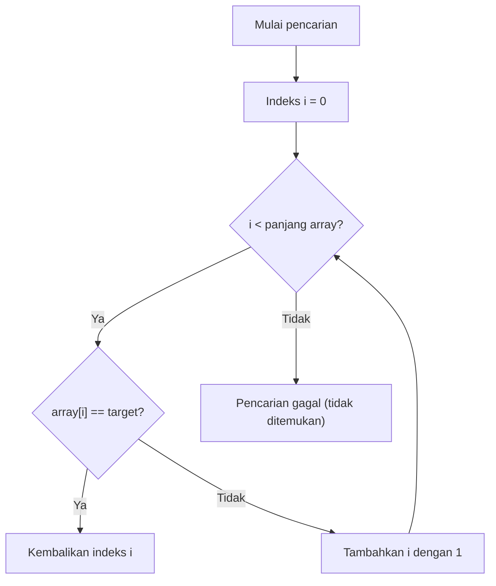
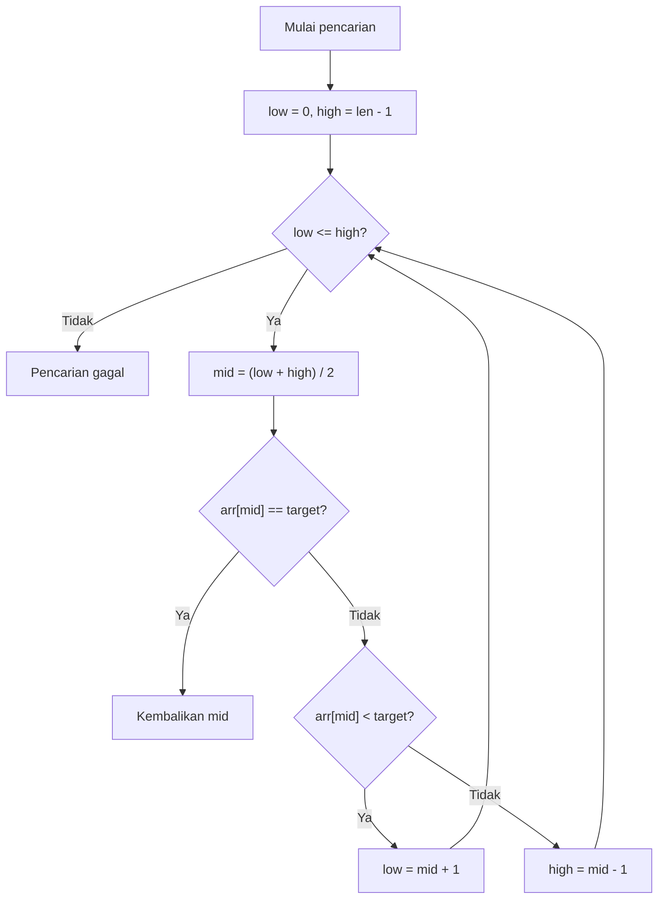
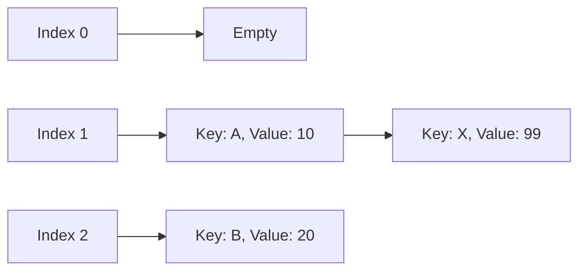

# Dasar dan Pentingnya Algoritma Pencarian

Dalam ilmu komputer modern, **algoritma pencarian** untuk menemukan nilai yang diinginkan dari dalam data dengan cepat merupakan teknologi yang sangat penting dan menjadi dasar dari berbagai perangkat lunak dan sistem. Kita setiap hari menerima manfaat dari algoritma pencarian, seperti pencarian basis data, pencarian kata kunci di peramban web, hingga pencarian nama di aplikasi kontak ponsel pintar.

Pada artikel ini, kita akan membahas secara detail algoritma yang menjadi dasar ilmu komputer, yaitu "Pencarian Linear (Linear Search)" dan "Pencarian Biner (Binary Search)", beserta cara kerja, kompleksitas waktu, dan contoh implementasinya dengan Python. Lebih jauh lagi, kita akan menggali lebih dalam mengenai prinsip "Hash Table" yang menembus batas algoritma-algoritma tersebut dan mewujudkan kecepatan pencarian yang luar biasa, peran fungsi hash, serta metode penyelesaian bentrokan hash (Collision).


Memperdalam pemahaman tentang algoritma pencarian adalah hal yang tak terpisahkan untuk meningkatkan kemampuan sebagai seorang pemrogram ke tingkat yang lebih tinggi. Jika jumlah data sedikit, pilihan algoritma mungkin memiliki dampak yang kecil terhadap performa, tetapi di era big data ini, untuk mencari informasi yang diinginkan secara instan dari jutaan atau miliaran data, pemilihan algoritma dan struktur data yang tepat menjadi sangat krusial. Terutama, memahami konsep **kompleksitas waktu** (seperti $O(n)$, $O(\log n)$, dan $O(1)$) adalah elemen yang sangat penting dalam mendesain program yang efisien.

Memperdalam pemahaman tentang algoritma pencarian adalah hal yang tak terpisahkan untuk meningkatkan kemampuan sebagai seorang pemrogram ke tingkat yang lebih tinggi. Jika jumlah data sedikit, pilihan algoritma mungkin memiliki dampak yang kecil terhadap performa, tetapi di era big data ini, untuk mencari informasi yang diinginkan secara instan dari jutaan atau miliaran data, pemilihan algoritma dan struktur data yang tepat menjadi sangat krusial. Terutama, memahami konsep **kompleksitas waktu** (seperti $O(n)$, $O(\log n)$, dan $O(1)$) adalah elemen yang sangat penting dalam mendesain program yang efisien.

Memperdalam pemahaman tentang algoritma pencarian adalah hal yang tak terpisahkan untuk meningkatkan kemampuan sebagai seorang pemrogram ke tingkat yang lebih tinggi. Jika jumlah data sedikit, pilihan algoritma mungkin memiliki dampak yang kecil terhadap performa, tetapi di era big data ini, untuk mencari informasi yang diinginkan secara instan dari jutaan atau miliaran data, pemilihan algoritma dan struktur data yang tepat menjadi sangat krusial. Terutama, memahami konsep **kompleksitas waktu** (seperti $O(n)$, $O(\log n)$, dan $O(1)$) adalah elemen yang sangat penting dalam mendesain program yang efisien.

Memperdalam pemahaman tentang algoritma pencarian adalah hal yang tak terpisahkan untuk meningkatkan kemampuan sebagai seorang pemrogram ke tingkat yang lebih tinggi. Jika jumlah data sedikit, pilihan algoritma mungkin memiliki dampak yang kecil terhadap performa, tetapi di era big data ini, untuk mencari informasi yang diinginkan secara instan dari jutaan atau miliaran data, pemilihan algoritma dan struktur data yang tepat menjadi sangat krusial. Terutama, memahami konsep **kompleksitas waktu** (seperti $O(n)$, $O(\log n)$, dan $O(1)$) adalah elemen yang sangat penting dalam mendesain program yang efisien.

Memperdalam pemahaman tentang algoritma pencarian adalah hal yang tak terpisahkan untuk meningkatkan kemampuan sebagai seorang pemrogram ke tingkat yang lebih tinggi. Jika jumlah data sedikit, pilihan algoritma mungkin memiliki dampak yang kecil terhadap performa, tetapi di era big data ini, untuk mencari informasi yang diinginkan secara instan dari jutaan atau miliaran data, pemilihan algoritma dan struktur data yang tepat menjadi sangat krusial. Terutama, memahami konsep **kompleksitas waktu** (seperti $O(n)$, $O(\log n)$, dan $O(1)$) adalah elemen yang sangat penting dalam mendesain program yang efisien.

Memperdalam pemahaman tentang algoritma pencarian adalah hal yang tak terpisahkan untuk meningkatkan kemampuan sebagai seorang pemrogram ke tingkat yang lebih tinggi. Jika jumlah data sedikit, pilihan algoritma mungkin memiliki dampak yang kecil terhadap performa, tetapi di era big data ini, untuk mencari informasi yang diinginkan secara instan dari jutaan atau miliaran data, pemilihan algoritma dan struktur data yang tepat menjadi sangat krusial. Terutama, memahami konsep **kompleksitas waktu** (seperti $O(n)$, $O(\log n)$, dan $O(1)$) adalah elemen yang sangat penting dalam mendesain program yang efisien.

Memperdalam pemahaman tentang algoritma pencarian adalah hal yang tak terpisahkan untuk meningkatkan kemampuan sebagai seorang pemrogram ke tingkat yang lebih tinggi. Jika jumlah data sedikit, pilihan algoritma mungkin memiliki dampak yang kecil terhadap performa, tetapi di era big data ini, untuk mencari informasi yang diinginkan secara instan dari jutaan atau miliaran data, pemilihan algoritma dan struktur data yang tepat menjadi sangat krusial. Terutama, memahami konsep **kompleksitas waktu** (seperti $O(n)$, $O(\log n)$, dan $O(1)$) adalah elemen yang sangat penting dalam mendesain program yang efisien.

Memperdalam pemahaman tentang algoritma pencarian adalah hal yang tak terpisahkan untuk meningkatkan kemampuan sebagai seorang pemrogram ke tingkat yang lebih tinggi. Jika jumlah data sedikit, pilihan algoritma mungkin memiliki dampak yang kecil terhadap performa, tetapi di era big data ini, untuk mencari informasi yang diinginkan secara instan dari jutaan atau miliaran data, pemilihan algoritma dan struktur data yang tepat menjadi sangat krusial. Terutama, memahami konsep **kompleksitas waktu** (seperti $O(n)$, $O(\log n)$, dan $O(1)$) adalah elemen yang sangat penting dalam mendesain program yang efisien.

Memperdalam pemahaman tentang algoritma pencarian adalah hal yang tak terpisahkan untuk meningkatkan kemampuan sebagai seorang pemrogram ke tingkat yang lebih tinggi. Jika jumlah data sedikit, pilihan algoritma mungkin memiliki dampak yang kecil terhadap performa, tetapi di era big data ini, untuk mencari informasi yang diinginkan secara instan dari jutaan atau miliaran data, pemilihan algoritma dan struktur data yang tepat menjadi sangat krusial. Terutama, memahami konsep **kompleksitas waktu** (seperti $O(n)$, $O(\log n)$, dan $O(1)$) adalah elemen yang sangat penting dalam mendesain program yang efisien.

Memperdalam pemahaman tentang algoritma pencarian adalah hal yang tak terpisahkan untuk meningkatkan kemampuan sebagai seorang pemrogram ke tingkat yang lebih tinggi. Jika jumlah data sedikit, pilihan algoritma mungkin memiliki dampak yang kecil terhadap performa, tetapi di era big data ini, untuk mencari informasi yang diinginkan secara instan dari jutaan atau miliaran data, pemilihan algoritma dan struktur data yang tepat menjadi sangat krusial. Terutama, memahami konsep **kompleksitas waktu** (seperti $O(n)$, $O(\log n)$, dan $O(1)$) adalah elemen yang sangat penting dalam mendesain program yang efisien.

## 1. Pencarian Linear (Linear Search)

Pencarian linear adalah algoritma pencarian yang paling sederhana dan intuitif, yang mengecek elemen satu per satu secara berurutan dari awal hingga akhir struktur data (seperti array atau list) sampai menemukan nilai yang diinginkan.

### 1.1 Cara Kerja Pencarian Linear

Algoritma pencarian linear berjalan dengan langkah-langkah berikut:

1. Mengambil elemen pertama dari array.
2. Memeriksa apakah elemen yang diambil cocok dengan nilai yang dicari (target).
3. Jika cocok, mengembalikan indeks (posisi) elemen tersebut dan mengakhiri pencarian.
4. Jika tidak cocok, melanjutkan ke elemen berikutnya.
5. Memeriksa hingga akhir array, dan jika target tidak ditemukan, mengakhiri pencarian sebagai kegagalan (misalnya mengembalikan `-1` atau `None`).



### 1.2 Implementasi Pencarian Linear dengan Python

Berikut ini adalah contoh implementasi sederhana pencarian linear menggunakan Python.

```python
def linear_search(arr, target):
    """
    Fungsi untuk menjalankan pencarian linear
    :param arr: List target pencarian
    :param target: Nilai yang ingin dicari
    :return: Indeksnya jika ditemukan, atau -1 jika tidak ditemukan
    """
    for i in range(len(arr)):
        if arr[i] == target:
            return i
    return -1

# Data pengujian
numbers = [10, 23, 4, 15, 2, 7, 34, 11]
target_value = 7

result_index = linear_search(numbers, target_value)
if result_index != -1:
    print(f"Elemen {target_value} ditemukan pada indeks {result_index}.")
else:
    print(f"Elemen {target_value} tidak ada di dalam list.")
```


Karakteristik utama dari pencarian linear adalah tidak memerlukannya data untuk disortir (diurutkan). Meskipun data disimpan dalam urutan yang acak, pencarian ini mengecek dari awal secara berurutan, sehingga pasti dapat menemukan nilai yang diinginkan (atau memastikan ketiadaannya). Namun, sifat "mengecek semuanya secara berurutan" ini menjadi faktor terbesar dari penurunan performa ketika jumlah data menjadi banyak.

Karakteristik utama dari pencarian linear adalah tidak memerlukannya data untuk disortir (diurutkan). Meskipun data disimpan dalam urutan yang acak, pencarian ini mengecek dari awal secara berurutan, sehingga pasti dapat menemukan nilai yang diinginkan (atau memastikan ketiadaannya). Namun, sifat "mengecek semuanya secara berurutan" ini menjadi faktor terbesar dari penurunan performa ketika jumlah data menjadi banyak.

Karakteristik utama dari pencarian linear adalah tidak memerlukannya data untuk disortir (diurutkan). Meskipun data disimpan dalam urutan yang acak, pencarian ini mengecek dari awal secara berurutan, sehingga pasti dapat menemukan nilai yang diinginkan (atau memastikan ketiadaannya). Namun, sifat "mengecek semuanya secara berurutan" ini menjadi faktor terbesar dari penurunan performa ketika jumlah data menjadi banyak.

Karakteristik utama dari pencarian linear adalah tidak memerlukannya data untuk disortir (diurutkan). Meskipun data disimpan dalam urutan yang acak, pencarian ini mengecek dari awal secara berurutan, sehingga pasti dapat menemukan nilai yang diinginkan (atau memastikan ketiadaannya). Namun, sifat "mengecek semuanya secara berurutan" ini menjadi faktor terbesar dari penurunan performa ketika jumlah data menjadi banyak.

Karakteristik utama dari pencarian linear adalah tidak memerlukannya data untuk disortir (diurutkan). Meskipun data disimpan dalam urutan yang acak, pencarian ini mengecek dari awal secara berurutan, sehingga pasti dapat menemukan nilai yang diinginkan (atau memastikan ketiadaannya). Namun, sifat "mengecek semuanya secara berurutan" ini menjadi faktor terbesar dari penurunan performa ketika jumlah data menjadi banyak.

Karakteristik utama dari pencarian linear adalah tidak memerlukannya data untuk disortir (diurutkan). Meskipun data disimpan dalam urutan yang acak, pencarian ini mengecek dari awal secara berurutan, sehingga pasti dapat menemukan nilai yang diinginkan (atau memastikan ketiadaannya). Namun, sifat "mengecek semuanya secara berurutan" ini menjadi faktor terbesar dari penurunan performa ketika jumlah data menjadi banyak.

Karakteristik utama dari pencarian linear adalah tidak memerlukannya data untuk disortir (diurutkan). Meskipun data disimpan dalam urutan yang acak, pencarian ini mengecek dari awal secara berurutan, sehingga pasti dapat menemukan nilai yang diinginkan (atau memastikan ketiadaannya). Namun, sifat "mengecek semuanya secara berurutan" ini menjadi faktor terbesar dari penurunan performa ketika jumlah data menjadi banyak.

Karakteristik utama dari pencarian linear adalah tidak memerlukannya data untuk disortir (diurutkan). Meskipun data disimpan dalam urutan yang acak, pencarian ini mengecek dari awal secara berurutan, sehingga pasti dapat menemukan nilai yang diinginkan (atau memastikan ketiadaannya). Namun, sifat "mengecek semuanya secara berurutan" ini menjadi faktor terbesar dari penurunan performa ketika jumlah data menjadi banyak.

Karakteristik utama dari pencarian linear adalah tidak memerlukannya data untuk disortir (diurutkan). Meskipun data disimpan dalam urutan yang acak, pencarian ini mengecek dari awal secara berurutan, sehingga pasti dapat menemukan nilai yang diinginkan (atau memastikan ketiadaannya). Namun, sifat "mengecek semuanya secara berurutan" ini menjadi faktor terbesar dari penurunan performa ketika jumlah data menjadi banyak.

Karakteristik utama dari pencarian linear adalah tidak memerlukannya data untuk disortir (diurutkan). Meskipun data disimpan dalam urutan yang acak, pencarian ini mengecek dari awal secara berurutan, sehingga pasti dapat menemukan nilai yang diinginkan (atau memastikan ketiadaannya). Namun, sifat "mengecek semuanya secara berurutan" ini menjadi faktor terbesar dari penurunan performa ketika jumlah data menjadi banyak.

Karakteristik utama dari pencarian linear adalah tidak memerlukannya data untuk disortir (diurutkan). Meskipun data disimpan dalam urutan yang acak, pencarian ini mengecek dari awal secara berurutan, sehingga pasti dapat menemukan nilai yang diinginkan (atau memastikan ketiadaannya). Namun, sifat "mengecek semuanya secara berurutan" ini menjadi faktor terbesar dari penurunan performa ketika jumlah data menjadi banyak.

Karakteristik utama dari pencarian linear adalah tidak memerlukannya data untuk disortir (diurutkan). Meskipun data disimpan dalam urutan yang acak, pencarian ini mengecek dari awal secara berurutan, sehingga pasti dapat menemukan nilai yang diinginkan (atau memastikan ketiadaannya). Namun, sifat "mengecek semuanya secara berurutan" ini menjadi faktor terbesar dari penurunan performa ketika jumlah data menjadi banyak.

Karakteristik utama dari pencarian linear adalah tidak memerlukannya data untuk disortir (diurutkan). Meskipun data disimpan dalam urutan yang acak, pencarian ini mengecek dari awal secara berurutan, sehingga pasti dapat menemukan nilai yang diinginkan (atau memastikan ketiadaannya). Namun, sifat "mengecek semuanya secara berurutan" ini menjadi faktor terbesar dari penurunan performa ketika jumlah data menjadi banyak.

Karakteristik utama dari pencarian linear adalah tidak memerlukannya data untuk disortir (diurutkan). Meskipun data disimpan dalam urutan yang acak, pencarian ini mengecek dari awal secara berurutan, sehingga pasti dapat menemukan nilai yang diinginkan (atau memastikan ketiadaannya). Namun, sifat "mengecek semuanya secara berurutan" ini menjadi faktor terbesar dari penurunan performa ketika jumlah data menjadi banyak.

Karakteristik utama dari pencarian linear adalah tidak memerlukannya data untuk disortir (diurutkan). Meskipun data disimpan dalam urutan yang acak, pencarian ini mengecek dari awal secara berurutan, sehingga pasti dapat menemukan nilai yang diinginkan (atau memastikan ketiadaannya). Namun, sifat "mengecek semuanya secara berurutan" ini menjadi faktor terbesar dari penurunan performa ketika jumlah data menjadi banyak.

Karakteristik utama dari pencarian linear adalah tidak memerlukannya data untuk disortir (diurutkan). Meskipun data disimpan dalam urutan yang acak, pencarian ini mengecek dari awal secara berurutan, sehingga pasti dapat menemukan nilai yang diinginkan (atau memastikan ketiadaannya). Namun, sifat "mengecek semuanya secara berurutan" ini menjadi faktor terbesar dari penurunan performa ketika jumlah data menjadi banyak.

Karakteristik utama dari pencarian linear adalah tidak memerlukannya data untuk disortir (diurutkan). Meskipun data disimpan dalam urutan yang acak, pencarian ini mengecek dari awal secara berurutan, sehingga pasti dapat menemukan nilai yang diinginkan (atau memastikan ketiadaannya). Namun, sifat "mengecek semuanya secara berurutan" ini menjadi faktor terbesar dari penurunan performa ketika jumlah data menjadi banyak.

Karakteristik utama dari pencarian linear adalah tidak memerlukannya data untuk disortir (diurutkan). Meskipun data disimpan dalam urutan yang acak, pencarian ini mengecek dari awal secara berurutan, sehingga pasti dapat menemukan nilai yang diinginkan (atau memastikan ketiadaannya). Namun, sifat "mengecek semuanya secara berurutan" ini menjadi faktor terbesar dari penurunan performa ketika jumlah data menjadi banyak.

Karakteristik utama dari pencarian linear adalah tidak memerlukannya data untuk disortir (diurutkan). Meskipun data disimpan dalam urutan yang acak, pencarian ini mengecek dari awal secara berurutan, sehingga pasti dapat menemukan nilai yang diinginkan (atau memastikan ketiadaannya). Namun, sifat "mengecek semuanya secara berurutan" ini menjadi faktor terbesar dari penurunan performa ketika jumlah data menjadi banyak.

Karakteristik utama dari pencarian linear adalah tidak memerlukannya data untuk disortir (diurutkan). Meskipun data disimpan dalam urutan yang acak, pencarian ini mengecek dari awal secara berurutan, sehingga pasti dapat menemukan nilai yang diinginkan (atau memastikan ketiadaannya). Namun, sifat "mengecek semuanya secara berurutan" ini menjadi faktor terbesar dari penurunan performa ketika jumlah data menjadi banyak.

Karakteristik utama dari pencarian linear adalah tidak memerlukannya data untuk disortir (diurutkan). Meskipun data disimpan dalam urutan yang acak, pencarian ini mengecek dari awal secara berurutan, sehingga pasti dapat menemukan nilai yang diinginkan (atau memastikan ketiadaannya). Namun, sifat "mengecek semuanya secara berurutan" ini menjadi faktor terbesar dari penurunan performa ketika jumlah data menjadi banyak.

Karakteristik utama dari pencarian linear adalah tidak memerlukannya data untuk disortir (diurutkan). Meskipun data disimpan dalam urutan yang acak, pencarian ini mengecek dari awal secara berurutan, sehingga pasti dapat menemukan nilai yang diinginkan (atau memastikan ketiadaannya). Namun, sifat "mengecek semuanya secara berurutan" ini menjadi faktor terbesar dari penurunan performa ketika jumlah data menjadi banyak.

Karakteristik utama dari pencarian linear adalah tidak memerlukannya data untuk disortir (diurutkan). Meskipun data disimpan dalam urutan yang acak, pencarian ini mengecek dari awal secara berurutan, sehingga pasti dapat menemukan nilai yang diinginkan (atau memastikan ketiadaannya). Namun, sifat "mengecek semuanya secara berurutan" ini menjadi faktor terbesar dari penurunan performa ketika jumlah data menjadi banyak.

Karakteristik utama dari pencarian linear adalah tidak memerlukannya data untuk disortir (diurutkan). Meskipun data disimpan dalam urutan yang acak, pencarian ini mengecek dari awal secara berurutan, sehingga pasti dapat menemukan nilai yang diinginkan (atau memastikan ketiadaannya). Namun, sifat "mengecek semuanya secara berurutan" ini menjadi faktor terbesar dari penurunan performa ketika jumlah data menjadi banyak.

Karakteristik utama dari pencarian linear adalah tidak memerlukannya data untuk disortir (diurutkan). Meskipun data disimpan dalam urutan yang acak, pencarian ini mengecek dari awal secara berurutan, sehingga pasti dapat menemukan nilai yang diinginkan (atau memastikan ketiadaannya). Namun, sifat "mengecek semuanya secara berurutan" ini menjadi faktor terbesar dari penurunan performa ketika jumlah data menjadi banyak.

Karakteristik utama dari pencarian linear adalah tidak memerlukannya data untuk disortir (diurutkan). Meskipun data disimpan dalam urutan yang acak, pencarian ini mengecek dari awal secara berurutan, sehingga pasti dapat menemukan nilai yang diinginkan (atau memastikan ketiadaannya). Namun, sifat "mengecek semuanya secara berurutan" ini menjadi faktor terbesar dari penurunan performa ketika jumlah data menjadi banyak.

Karakteristik utama dari pencarian linear adalah tidak memerlukannya data untuk disortir (diurutkan). Meskipun data disimpan dalam urutan yang acak, pencarian ini mengecek dari awal secara berurutan, sehingga pasti dapat menemukan nilai yang diinginkan (atau memastikan ketiadaannya). Namun, sifat "mengecek semuanya secara berurutan" ini menjadi faktor terbesar dari penurunan performa ketika jumlah data menjadi banyak.

Karakteristik utama dari pencarian linear adalah tidak memerlukannya data untuk disortir (diurutkan). Meskipun data disimpan dalam urutan yang acak, pencarian ini mengecek dari awal secara berurutan, sehingga pasti dapat menemukan nilai yang diinginkan (atau memastikan ketiadaannya). Namun, sifat "mengecek semuanya secara berurutan" ini menjadi faktor terbesar dari penurunan performa ketika jumlah data menjadi banyak.

Karakteristik utama dari pencarian linear adalah tidak memerlukannya data untuk disortir (diurutkan). Meskipun data disimpan dalam urutan yang acak, pencarian ini mengecek dari awal secara berurutan, sehingga pasti dapat menemukan nilai yang diinginkan (atau memastikan ketiadaannya). Namun, sifat "mengecek semuanya secara berurutan" ini menjadi faktor terbesar dari penurunan performa ketika jumlah data menjadi banyak.

Karakteristik utama dari pencarian linear adalah tidak memerlukannya data untuk disortir (diurutkan). Meskipun data disimpan dalam urutan yang acak, pencarian ini mengecek dari awal secara berurutan, sehingga pasti dapat menemukan nilai yang diinginkan (atau memastikan ketiadaannya). Namun, sifat "mengecek semuanya secara berurutan" ini menjadi faktor terbesar dari penurunan performa ketika jumlah data menjadi banyak.

Karakteristik utama dari pencarian linear adalah tidak memerlukannya data untuk disortir (diurutkan). Meskipun data disimpan dalam urutan yang acak, pencarian ini mengecek dari awal secara berurutan, sehingga pasti dapat menemukan nilai yang diinginkan (atau memastikan ketiadaannya). Namun, sifat "mengecek semuanya secara berurutan" ini menjadi faktor terbesar dari penurunan performa ketika jumlah data menjadi banyak.

Karakteristik utama dari pencarian linear adalah tidak memerlukannya data untuk disortir (diurutkan). Meskipun data disimpan dalam urutan yang acak, pencarian ini mengecek dari awal secara berurutan, sehingga pasti dapat menemukan nilai yang diinginkan (atau memastikan ketiadaannya). Namun, sifat "mengecek semuanya secara berurutan" ini menjadi faktor terbesar dari penurunan performa ketika jumlah data menjadi banyak.

Karakteristik utama dari pencarian linear adalah tidak memerlukannya data untuk disortir (diurutkan). Meskipun data disimpan dalam urutan yang acak, pencarian ini mengecek dari awal secara berurutan, sehingga pasti dapat menemukan nilai yang diinginkan (atau memastikan ketiadaannya). Namun, sifat "mengecek semuanya secara berurutan" ini menjadi faktor terbesar dari penurunan performa ketika jumlah data menjadi banyak.

Karakteristik utama dari pencarian linear adalah tidak memerlukannya data untuk disortir (diurutkan). Meskipun data disimpan dalam urutan yang acak, pencarian ini mengecek dari awal secara berurutan, sehingga pasti dapat menemukan nilai yang diinginkan (atau memastikan ketiadaannya). Namun, sifat "mengecek semuanya secara berurutan" ini menjadi faktor terbesar dari penurunan performa ketika jumlah data menjadi banyak.

Karakteristik utama dari pencarian linear adalah tidak memerlukannya data untuk disortir (diurutkan). Meskipun data disimpan dalam urutan yang acak, pencarian ini mengecek dari awal secara berurutan, sehingga pasti dapat menemukan nilai yang diinginkan (atau memastikan ketiadaannya). Namun, sifat "mengecek semuanya secara berurutan" ini menjadi faktor terbesar dari penurunan performa ketika jumlah data menjadi banyak.

Karakteristik utama dari pencarian linear adalah tidak memerlukannya data untuk disortir (diurutkan). Meskipun data disimpan dalam urutan yang acak, pencarian ini mengecek dari awal secara berurutan, sehingga pasti dapat menemukan nilai yang diinginkan (atau memastikan ketiadaannya). Namun, sifat "mengecek semuanya secara berurutan" ini menjadi faktor terbesar dari penurunan performa ketika jumlah data menjadi banyak.

Karakteristik utama dari pencarian linear adalah tidak memerlukannya data untuk disortir (diurutkan). Meskipun data disimpan dalam urutan yang acak, pencarian ini mengecek dari awal secara berurutan, sehingga pasti dapat menemukan nilai yang diinginkan (atau memastikan ketiadaannya). Namun, sifat "mengecek semuanya secara berurutan" ini menjadi faktor terbesar dari penurunan performa ketika jumlah data menjadi banyak.

Karakteristik utama dari pencarian linear adalah tidak memerlukannya data untuk disortir (diurutkan). Meskipun data disimpan dalam urutan yang acak, pencarian ini mengecek dari awal secara berurutan, sehingga pasti dapat menemukan nilai yang diinginkan (atau memastikan ketiadaannya). Namun, sifat "mengecek semuanya secara berurutan" ini menjadi faktor terbesar dari penurunan performa ketika jumlah data menjadi banyak.

Karakteristik utama dari pencarian linear adalah tidak memerlukannya data untuk disortir (diurutkan). Meskipun data disimpan dalam urutan yang acak, pencarian ini mengecek dari awal secara berurutan, sehingga pasti dapat menemukan nilai yang diinginkan (atau memastikan ketiadaannya). Namun, sifat "mengecek semuanya secara berurutan" ini menjadi faktor terbesar dari penurunan performa ketika jumlah data menjadi banyak.

Karakteristik utama dari pencarian linear adalah tidak memerlukannya data untuk disortir (diurutkan). Meskipun data disimpan dalam urutan yang acak, pencarian ini mengecek dari awal secara berurutan, sehingga pasti dapat menemukan nilai yang diinginkan (atau memastikan ketiadaannya). Namun, sifat "mengecek semuanya secara berurutan" ini menjadi faktor terbesar dari penurunan performa ketika jumlah data menjadi banyak.

Karakteristik utama dari pencarian linear adalah tidak memerlukannya data untuk disortir (diurutkan). Meskipun data disimpan dalam urutan yang acak, pencarian ini mengecek dari awal secara berurutan, sehingga pasti dapat menemukan nilai yang diinginkan (atau memastikan ketiadaannya). Namun, sifat "mengecek semuanya secara berurutan" ini menjadi faktor terbesar dari penurunan performa ketika jumlah data menjadi banyak.

Karakteristik utama dari pencarian linear adalah tidak memerlukannya data untuk disortir (diurutkan). Meskipun data disimpan dalam urutan yang acak, pencarian ini mengecek dari awal secara berurutan, sehingga pasti dapat menemukan nilai yang diinginkan (atau memastikan ketiadaannya). Namun, sifat "mengecek semuanya secara berurutan" ini menjadi faktor terbesar dari penurunan performa ketika jumlah data menjadi banyak.

Karakteristik utama dari pencarian linear adalah tidak memerlukannya data untuk disortir (diurutkan). Meskipun data disimpan dalam urutan yang acak, pencarian ini mengecek dari awal secara berurutan, sehingga pasti dapat menemukan nilai yang diinginkan (atau memastikan ketiadaannya). Namun, sifat "mengecek semuanya secara berurutan" ini menjadi faktor terbesar dari penurunan performa ketika jumlah data menjadi banyak.

Karakteristik utama dari pencarian linear adalah tidak memerlukannya data untuk disortir (diurutkan). Meskipun data disimpan dalam urutan yang acak, pencarian ini mengecek dari awal secara berurutan, sehingga pasti dapat menemukan nilai yang diinginkan (atau memastikan ketiadaannya). Namun, sifat "mengecek semuanya secara berurutan" ini menjadi faktor terbesar dari penurunan performa ketika jumlah data menjadi banyak.

Karakteristik utama dari pencarian linear adalah tidak memerlukannya data untuk disortir (diurutkan). Meskipun data disimpan dalam urutan yang acak, pencarian ini mengecek dari awal secara berurutan, sehingga pasti dapat menemukan nilai yang diinginkan (atau memastikan ketiadaannya). Namun, sifat "mengecek semuanya secara berurutan" ini menjadi faktor terbesar dari penurunan performa ketika jumlah data menjadi banyak.

Karakteristik utama dari pencarian linear adalah tidak memerlukannya data untuk disortir (diurutkan). Meskipun data disimpan dalam urutan yang acak, pencarian ini mengecek dari awal secara berurutan, sehingga pasti dapat menemukan nilai yang diinginkan (atau memastikan ketiadaannya). Namun, sifat "mengecek semuanya secara berurutan" ini menjadi faktor terbesar dari penurunan performa ketika jumlah data menjadi banyak.

Karakteristik utama dari pencarian linear adalah tidak memerlukannya data untuk disortir (diurutkan). Meskipun data disimpan dalam urutan yang acak, pencarian ini mengecek dari awal secara berurutan, sehingga pasti dapat menemukan nilai yang diinginkan (atau memastikan ketiadaannya). Namun, sifat "mengecek semuanya secara berurutan" ini menjadi faktor terbesar dari penurunan performa ketika jumlah data menjadi banyak.

Karakteristik utama dari pencarian linear adalah tidak memerlukannya data untuk disortir (diurutkan). Meskipun data disimpan dalam urutan yang acak, pencarian ini mengecek dari awal secara berurutan, sehingga pasti dapat menemukan nilai yang diinginkan (atau memastikan ketiadaannya). Namun, sifat "mengecek semuanya secara berurutan" ini menjadi faktor terbesar dari penurunan performa ketika jumlah data menjadi banyak.

Karakteristik utama dari pencarian linear adalah tidak memerlukannya data untuk disortir (diurutkan). Meskipun data disimpan dalam urutan yang acak, pencarian ini mengecek dari awal secara berurutan, sehingga pasti dapat menemukan nilai yang diinginkan (atau memastikan ketiadaannya). Namun, sifat "mengecek semuanya secara berurutan" ini menjadi faktor terbesar dari penurunan performa ketika jumlah data menjadi banyak.

Karakteristik utama dari pencarian linear adalah tidak memerlukannya data untuk disortir (diurutkan). Meskipun data disimpan dalam urutan yang acak, pencarian ini mengecek dari awal secara berurutan, sehingga pasti dapat menemukan nilai yang diinginkan (atau memastikan ketiadaannya). Namun, sifat "mengecek semuanya secara berurutan" ini menjadi faktor terbesar dari penurunan performa ketika jumlah data menjadi banyak.

## 2. Pencarian Biner (Binary Search)

Pencarian biner adalah algoritma pencarian yang sangat cepat dan efisien, yang hanya dapat diterapkan pada **data yang sudah disortir sebelumnya (diurutkan secara menaik atau menurun)**. Dengan mempersempit rentang pencarian menjadi setengahnya pada setiap langkah, kompleksitas waktu dapat dikurangi secara drastis.

### 2.1 Cara Kerja Pencarian Biner

Pencarian biner dilakukan dengan langkah-langkah berikut:

1. Menginisialisasi indeks "ujung kiri (`low`)" dan "ujung kanan (`high`)" dari array yang menjadi target pencarian.
2. Selama rentang pencarian masih valid (`low <= high`), langkah-langkah berikut diulangi.
3. Menghitung indeks tengah dari rentang pencarian (`mid`).
4. Membandingkan elemen tengah (`arr[mid]`) dengan nilai yang dicari (target).
5. Jika cocok, mengembalikan `mid` dan mengakhiri pencarian.
6. Jika elemen tengah lebih kecil dari target, maka target pasti berada di rentang setengah bagian kanan, sehingga ujung kiri diperbarui menjadi `mid + 1`.
7. Jika elemen tengah lebih besar dari target, maka target pasti berada di rentang setengah bagian kiri, sehingga ujung kanan diperbarui menjadi `mid - 1`.
8. Jika rentang pencarian habis namun target belum ditemukan, maka pencarian dianggap gagal.



### 2.2 Implementasi Pencarian Biner dengan Python (Metode Iteratif)

```python
def binary_search(arr, target):
    """
    Fungsi untuk menjalankan pencarian biner (metode iteratif)
    :param arr: List target pencarian yang sudah disortir
    :param target: Nilai yang ingin dicari
    :return: Indeksnya jika ditemukan, atau -1 jika tidak ditemukan
    """
    low = 0
    high = len(arr) - 1

    while low <= high:
        mid = (low + high) // 2
        
        if arr[mid] == target:
            return mid
        elif arr[mid] < target:
            low = mid + 1
        else:
            high = mid - 1
            
    return -1

# Data pengujian (harus sudah disortir)
sorted_numbers = [2, 4, 7, 10, 11, 15, 23, 34]
target_value = 15

result_index = binary_search(sorted_numbers, target_value)
if result_index != -1:
    print(f"Elemen {target_value} ditemukan pada indeks {result_index}.")
else:
    print(f"Elemen {target_value} tidak ada di dalam list.")
```

Performa luar biasa dari pencarian biner berasal dari sifatnya yang membagi rentang pencarian menjadi setengahnya setiap saat. Misalnya, jika pencarian linear dilakukan terhadap array dengan 1 juta elemen, paling buruk akan dibutuhkan 1 juta perbandingan, tetapi jika menggunakan pencarian biner, nilai yang diinginkan dapat ditemukan hanya dengan sekitar 20 kali perbandingan ($2^{20} \approx 1,000,000$). Oleh karena itu, dalam operasi pencarian terhadap set data berskala besar, pencarian biner membanggakan keunggulan yang mutlak dibandingkan dengan pencarian linear. Secara matematis, kompleksitas waktu pencarian biner diekspresikan sebagai $O(\log n)$.

Performa luar biasa dari pencarian biner berasal dari sifatnya yang membagi rentang pencarian menjadi setengahnya setiap saat. Misalnya, jika pencarian linear dilakukan terhadap array dengan 1 juta elemen, paling buruk akan dibutuhkan 1 juta perbandingan, tetapi jika menggunakan pencarian biner, nilai yang diinginkan dapat ditemukan hanya dengan sekitar 20 kali perbandingan ($2^{20} \approx 1,000,000$). Oleh karena itu, dalam operasi pencarian terhadap set data berskala besar, pencarian biner membanggakan keunggulan yang mutlak dibandingkan dengan pencarian linear. Secara matematis, kompleksitas waktu pencarian biner diekspresikan sebagai $O(\log n)$.

Performa luar biasa dari pencarian biner berasal dari sifatnya yang membagi rentang pencarian menjadi setengahnya setiap saat. Misalnya, jika pencarian linear dilakukan terhadap array dengan 1 juta elemen, paling buruk akan dibutuhkan 1 juta perbandingan, tetapi jika menggunakan pencarian biner, nilai yang diinginkan dapat ditemukan hanya dengan sekitar 20 kali perbandingan ($2^{20} \approx 1,000,000$). Oleh karena itu, dalam operasi pencarian terhadap set data berskala besar, pencarian biner membanggakan keunggulan yang mutlak dibandingkan dengan pencarian linear. Secara matematis, kompleksitas waktu pencarian biner diekspresikan sebagai $O(\log n)$.

Performa luar biasa dari pencarian biner berasal dari sifatnya yang membagi rentang pencarian menjadi setengahnya setiap saat. Misalnya, jika pencarian linear dilakukan terhadap array dengan 1 juta elemen, paling buruk akan dibutuhkan 1 juta perbandingan, tetapi jika menggunakan pencarian biner, nilai yang diinginkan dapat ditemukan hanya dengan sekitar 20 kali perbandingan ($2^{20} \approx 1,000,000$). Oleh karena itu, dalam operasi pencarian terhadap set data berskala besar, pencarian biner membanggakan keunggulan yang mutlak dibandingkan dengan pencarian linear. Secara matematis, kompleksitas waktu pencarian biner diekspresikan sebagai $O(\log n)$.

Performa luar biasa dari pencarian biner berasal dari sifatnya yang membagi rentang pencarian menjadi setengahnya setiap saat. Misalnya, jika pencarian linear dilakukan terhadap array dengan 1 juta elemen, paling buruk akan dibutuhkan 1 juta perbandingan, tetapi jika menggunakan pencarian biner, nilai yang diinginkan dapat ditemukan hanya dengan sekitar 20 kali perbandingan ($2^{20} \approx 1,000,000$). Oleh karena itu, dalam operasi pencarian terhadap set data berskala besar, pencarian biner membanggakan keunggulan yang mutlak dibandingkan dengan pencarian linear. Secara matematis, kompleksitas waktu pencarian biner diekspresikan sebagai $O(\log n)$.

Performa luar biasa dari pencarian biner berasal dari sifatnya yang membagi rentang pencarian menjadi setengahnya setiap saat. Misalnya, jika pencarian linear dilakukan terhadap array dengan 1 juta elemen, paling buruk akan dibutuhkan 1 juta perbandingan, tetapi jika menggunakan pencarian biner, nilai yang diinginkan dapat ditemukan hanya dengan sekitar 20 kali perbandingan ($2^{20} \approx 1,000,000$). Oleh karena itu, dalam operasi pencarian terhadap set data berskala besar, pencarian biner membanggakan keunggulan yang mutlak dibandingkan dengan pencarian linear. Secara matematis, kompleksitas waktu pencarian biner diekspresikan sebagai $O(\log n)$.

Performa luar biasa dari pencarian biner berasal dari sifatnya yang membagi rentang pencarian menjadi setengahnya setiap saat. Misalnya, jika pencarian linear dilakukan terhadap array dengan 1 juta elemen, paling buruk akan dibutuhkan 1 juta perbandingan, tetapi jika menggunakan pencarian biner, nilai yang diinginkan dapat ditemukan hanya dengan sekitar 20 kali perbandingan ($2^{20} \approx 1,000,000$). Oleh karena itu, dalam operasi pencarian terhadap set data berskala besar, pencarian biner membanggakan keunggulan yang mutlak dibandingkan dengan pencarian linear. Secara matematis, kompleksitas waktu pencarian biner diekspresikan sebagai $O(\log n)$.

Performa luar biasa dari pencarian biner berasal dari sifatnya yang membagi rentang pencarian menjadi setengahnya setiap saat. Misalnya, jika pencarian linear dilakukan terhadap array dengan 1 juta elemen, paling buruk akan dibutuhkan 1 juta perbandingan, tetapi jika menggunakan pencarian biner, nilai yang diinginkan dapat ditemukan hanya dengan sekitar 20 kali perbandingan ($2^{20} \approx 1,000,000$). Oleh karena itu, dalam operasi pencarian terhadap set data berskala besar, pencarian biner membanggakan keunggulan yang mutlak dibandingkan dengan pencarian linear. Secara matematis, kompleksitas waktu pencarian biner diekspresikan sebagai $O(\log n)$.

Performa luar biasa dari pencarian biner berasal dari sifatnya yang membagi rentang pencarian menjadi setengahnya setiap saat. Misalnya, jika pencarian linear dilakukan terhadap array dengan 1 juta elemen, paling buruk akan dibutuhkan 1 juta perbandingan, tetapi jika menggunakan pencarian biner, nilai yang diinginkan dapat ditemukan hanya dengan sekitar 20 kali perbandingan ($2^{20} \approx 1,000,000$). Oleh karena itu, dalam operasi pencarian terhadap set data berskala besar, pencarian biner membanggakan keunggulan yang mutlak dibandingkan dengan pencarian linear. Secara matematis, kompleksitas waktu pencarian biner diekspresikan sebagai $O(\log n)$.

Performa luar biasa dari pencarian biner berasal dari sifatnya yang membagi rentang pencarian menjadi setengahnya setiap saat. Misalnya, jika pencarian linear dilakukan terhadap array dengan 1 juta elemen, paling buruk akan dibutuhkan 1 juta perbandingan, tetapi jika menggunakan pencarian biner, nilai yang diinginkan dapat ditemukan hanya dengan sekitar 20 kali perbandingan ($2^{20} \approx 1,000,000$). Oleh karena itu, dalam operasi pencarian terhadap set data berskala besar, pencarian biner membanggakan keunggulan yang mutlak dibandingkan dengan pencarian linear. Secara matematis, kompleksitas waktu pencarian biner diekspresikan sebagai $O(\log n)$.

Performa luar biasa dari pencarian biner berasal dari sifatnya yang membagi rentang pencarian menjadi setengahnya setiap saat. Misalnya, jika pencarian linear dilakukan terhadap array dengan 1 juta elemen, paling buruk akan dibutuhkan 1 juta perbandingan, tetapi jika menggunakan pencarian biner, nilai yang diinginkan dapat ditemukan hanya dengan sekitar 20 kali perbandingan ($2^{20} \approx 1,000,000$). Oleh karena itu, dalam operasi pencarian terhadap set data berskala besar, pencarian biner membanggakan keunggulan yang mutlak dibandingkan dengan pencarian linear. Secara matematis, kompleksitas waktu pencarian biner diekspresikan sebagai $O(\log n)$.

Performa luar biasa dari pencarian biner berasal dari sifatnya yang membagi rentang pencarian menjadi setengahnya setiap saat. Misalnya, jika pencarian linear dilakukan terhadap array dengan 1 juta elemen, paling buruk akan dibutuhkan 1 juta perbandingan, tetapi jika menggunakan pencarian biner, nilai yang diinginkan dapat ditemukan hanya dengan sekitar 20 kali perbandingan ($2^{20} \approx 1,000,000$). Oleh karena itu, dalam operasi pencarian terhadap set data berskala besar, pencarian biner membanggakan keunggulan yang mutlak dibandingkan dengan pencarian linear. Secara matematis, kompleksitas waktu pencarian biner diekspresikan sebagai $O(\log n)$.

Performa luar biasa dari pencarian biner berasal dari sifatnya yang membagi rentang pencarian menjadi setengahnya setiap saat. Misalnya, jika pencarian linear dilakukan terhadap array dengan 1 juta elemen, paling buruk akan dibutuhkan 1 juta perbandingan, tetapi jika menggunakan pencarian biner, nilai yang diinginkan dapat ditemukan hanya dengan sekitar 20 kali perbandingan ($2^{20} \approx 1,000,000$). Oleh karena itu, dalam operasi pencarian terhadap set data berskala besar, pencarian biner membanggakan keunggulan yang mutlak dibandingkan dengan pencarian linear. Secara matematis, kompleksitas waktu pencarian biner diekspresikan sebagai $O(\log n)$.

Performa luar biasa dari pencarian biner berasal dari sifatnya yang membagi rentang pencarian menjadi setengahnya setiap saat. Misalnya, jika pencarian linear dilakukan terhadap array dengan 1 juta elemen, paling buruk akan dibutuhkan 1 juta perbandingan, tetapi jika menggunakan pencarian biner, nilai yang diinginkan dapat ditemukan hanya dengan sekitar 20 kali perbandingan ($2^{20} \approx 1,000,000$). Oleh karena itu, dalam operasi pencarian terhadap set data berskala besar, pencarian biner membanggakan keunggulan yang mutlak dibandingkan dengan pencarian linear. Secara matematis, kompleksitas waktu pencarian biner diekspresikan sebagai $O(\log n)$.

Performa luar biasa dari pencarian biner berasal dari sifatnya yang membagi rentang pencarian menjadi setengahnya setiap saat. Misalnya, jika pencarian linear dilakukan terhadap array dengan 1 juta elemen, paling buruk akan dibutuhkan 1 juta perbandingan, tetapi jika menggunakan pencarian biner, nilai yang diinginkan dapat ditemukan hanya dengan sekitar 20 kali perbandingan ($2^{20} \approx 1,000,000$). Oleh karena itu, dalam operasi pencarian terhadap set data berskala besar, pencarian biner membanggakan keunggulan yang mutlak dibandingkan dengan pencarian linear. Secara matematis, kompleksitas waktu pencarian biner diekspresikan sebagai $O(\log n)$.

Performa luar biasa dari pencarian biner berasal dari sifatnya yang membagi rentang pencarian menjadi setengahnya setiap saat. Misalnya, jika pencarian linear dilakukan terhadap array dengan 1 juta elemen, paling buruk akan dibutuhkan 1 juta perbandingan, tetapi jika menggunakan pencarian biner, nilai yang diinginkan dapat ditemukan hanya dengan sekitar 20 kali perbandingan ($2^{20} \approx 1,000,000$). Oleh karena itu, dalam operasi pencarian terhadap set data berskala besar, pencarian biner membanggakan keunggulan yang mutlak dibandingkan dengan pencarian linear. Secara matematis, kompleksitas waktu pencarian biner diekspresikan sebagai $O(\log n)$.

Performa luar biasa dari pencarian biner berasal dari sifatnya yang membagi rentang pencarian menjadi setengahnya setiap saat. Misalnya, jika pencarian linear dilakukan terhadap array dengan 1 juta elemen, paling buruk akan dibutuhkan 1 juta perbandingan, tetapi jika menggunakan pencarian biner, nilai yang diinginkan dapat ditemukan hanya dengan sekitar 20 kali perbandingan ($2^{20} \approx 1,000,000$). Oleh karena itu, dalam operasi pencarian terhadap set data berskala besar, pencarian biner membanggakan keunggulan yang mutlak dibandingkan dengan pencarian linear. Secara matematis, kompleksitas waktu pencarian biner diekspresikan sebagai $O(\log n)$.

Performa luar biasa dari pencarian biner berasal dari sifatnya yang membagi rentang pencarian menjadi setengahnya setiap saat. Misalnya, jika pencarian linear dilakukan terhadap array dengan 1 juta elemen, paling buruk akan dibutuhkan 1 juta perbandingan, tetapi jika menggunakan pencarian biner, nilai yang diinginkan dapat ditemukan hanya dengan sekitar 20 kali perbandingan ($2^{20} \approx 1,000,000$). Oleh karena itu, dalam operasi pencarian terhadap set data berskala besar, pencarian biner membanggakan keunggulan yang mutlak dibandingkan dengan pencarian linear. Secara matematis, kompleksitas waktu pencarian biner diekspresikan sebagai $O(\log n)$.

Performa luar biasa dari pencarian biner berasal dari sifatnya yang membagi rentang pencarian menjadi setengahnya setiap saat. Misalnya, jika pencarian linear dilakukan terhadap array dengan 1 juta elemen, paling buruk akan dibutuhkan 1 juta perbandingan, tetapi jika menggunakan pencarian biner, nilai yang diinginkan dapat ditemukan hanya dengan sekitar 20 kali perbandingan ($2^{20} \approx 1,000,000$). Oleh karena itu, dalam operasi pencarian terhadap set data berskala besar, pencarian biner membanggakan keunggulan yang mutlak dibandingkan dengan pencarian linear. Secara matematis, kompleksitas waktu pencarian biner diekspresikan sebagai $O(\log n)$.

Performa luar biasa dari pencarian biner berasal dari sifatnya yang membagi rentang pencarian menjadi setengahnya setiap saat. Misalnya, jika pencarian linear dilakukan terhadap array dengan 1 juta elemen, paling buruk akan dibutuhkan 1 juta perbandingan, tetapi jika menggunakan pencarian biner, nilai yang diinginkan dapat ditemukan hanya dengan sekitar 20 kali perbandingan ($2^{20} \approx 1,000,000$). Oleh karena itu, dalam operasi pencarian terhadap set data berskala besar, pencarian biner membanggakan keunggulan yang mutlak dibandingkan dengan pencarian linear. Secara matematis, kompleksitas waktu pencarian biner diekspresikan sebagai $O(\log n)$.

Performa luar biasa dari pencarian biner berasal dari sifatnya yang membagi rentang pencarian menjadi setengahnya setiap saat. Misalnya, jika pencarian linear dilakukan terhadap array dengan 1 juta elemen, paling buruk akan dibutuhkan 1 juta perbandingan, tetapi jika menggunakan pencarian biner, nilai yang diinginkan dapat ditemukan hanya dengan sekitar 20 kali perbandingan ($2^{20} \approx 1,000,000$). Oleh karena itu, dalam operasi pencarian terhadap set data berskala besar, pencarian biner membanggakan keunggulan yang mutlak dibandingkan dengan pencarian linear. Secara matematis, kompleksitas waktu pencarian biner diekspresikan sebagai $O(\log n)$.

Performa luar biasa dari pencarian biner berasal dari sifatnya yang membagi rentang pencarian menjadi setengahnya setiap saat. Misalnya, jika pencarian linear dilakukan terhadap array dengan 1 juta elemen, paling buruk akan dibutuhkan 1 juta perbandingan, tetapi jika menggunakan pencarian biner, nilai yang diinginkan dapat ditemukan hanya dengan sekitar 20 kali perbandingan ($2^{20} \approx 1,000,000$). Oleh karena itu, dalam operasi pencarian terhadap set data berskala besar, pencarian biner membanggakan keunggulan yang mutlak dibandingkan dengan pencarian linear. Secara matematis, kompleksitas waktu pencarian biner diekspresikan sebagai $O(\log n)$.

Performa luar biasa dari pencarian biner berasal dari sifatnya yang membagi rentang pencarian menjadi setengahnya setiap saat. Misalnya, jika pencarian linear dilakukan terhadap array dengan 1 juta elemen, paling buruk akan dibutuhkan 1 juta perbandingan, tetapi jika menggunakan pencarian biner, nilai yang diinginkan dapat ditemukan hanya dengan sekitar 20 kali perbandingan ($2^{20} \approx 1,000,000$). Oleh karena itu, dalam operasi pencarian terhadap set data berskala besar, pencarian biner membanggakan keunggulan yang mutlak dibandingkan dengan pencarian linear. Secara matematis, kompleksitas waktu pencarian biner diekspresikan sebagai $O(\log n)$.

Performa luar biasa dari pencarian biner berasal dari sifatnya yang membagi rentang pencarian menjadi setengahnya setiap saat. Misalnya, jika pencarian linear dilakukan terhadap array dengan 1 juta elemen, paling buruk akan dibutuhkan 1 juta perbandingan, tetapi jika menggunakan pencarian biner, nilai yang diinginkan dapat ditemukan hanya dengan sekitar 20 kali perbandingan ($2^{20} \approx 1,000,000$). Oleh karena itu, dalam operasi pencarian terhadap set data berskala besar, pencarian biner membanggakan keunggulan yang mutlak dibandingkan dengan pencarian linear. Secara matematis, kompleksitas waktu pencarian biner diekspresikan sebagai $O(\log n)$.

Performa luar biasa dari pencarian biner berasal dari sifatnya yang membagi rentang pencarian menjadi setengahnya setiap saat. Misalnya, jika pencarian linear dilakukan terhadap array dengan 1 juta elemen, paling buruk akan dibutuhkan 1 juta perbandingan, tetapi jika menggunakan pencarian biner, nilai yang diinginkan dapat ditemukan hanya dengan sekitar 20 kali perbandingan ($2^{20} \approx 1,000,000$). Oleh karena itu, dalam operasi pencarian terhadap set data berskala besar, pencarian biner membanggakan keunggulan yang mutlak dibandingkan dengan pencarian linear. Secara matematis, kompleksitas waktu pencarian biner diekspresikan sebagai $O(\log n)$.

Performa luar biasa dari pencarian biner berasal dari sifatnya yang membagi rentang pencarian menjadi setengahnya setiap saat. Misalnya, jika pencarian linear dilakukan terhadap array dengan 1 juta elemen, paling buruk akan dibutuhkan 1 juta perbandingan, tetapi jika menggunakan pencarian biner, nilai yang diinginkan dapat ditemukan hanya dengan sekitar 20 kali perbandingan ($2^{20} \approx 1,000,000$). Oleh karena itu, dalam operasi pencarian terhadap set data berskala besar, pencarian biner membanggakan keunggulan yang mutlak dibandingkan dengan pencarian linear. Secara matematis, kompleksitas waktu pencarian biner diekspresikan sebagai $O(\log n)$.

Performa luar biasa dari pencarian biner berasal dari sifatnya yang membagi rentang pencarian menjadi setengahnya setiap saat. Misalnya, jika pencarian linear dilakukan terhadap array dengan 1 juta elemen, paling buruk akan dibutuhkan 1 juta perbandingan, tetapi jika menggunakan pencarian biner, nilai yang diinginkan dapat ditemukan hanya dengan sekitar 20 kali perbandingan ($2^{20} \approx 1,000,000$). Oleh karena itu, dalam operasi pencarian terhadap set data berskala besar, pencarian biner membanggakan keunggulan yang mutlak dibandingkan dengan pencarian linear. Secara matematis, kompleksitas waktu pencarian biner diekspresikan sebagai $O(\log n)$.

Performa luar biasa dari pencarian biner berasal dari sifatnya yang membagi rentang pencarian menjadi setengahnya setiap saat. Misalnya, jika pencarian linear dilakukan terhadap array dengan 1 juta elemen, paling buruk akan dibutuhkan 1 juta perbandingan, tetapi jika menggunakan pencarian biner, nilai yang diinginkan dapat ditemukan hanya dengan sekitar 20 kali perbandingan ($2^{20} \approx 1,000,000$). Oleh karena itu, dalam operasi pencarian terhadap set data berskala besar, pencarian biner membanggakan keunggulan yang mutlak dibandingkan dengan pencarian linear. Secara matematis, kompleksitas waktu pencarian biner diekspresikan sebagai $O(\log n)$.

Performa luar biasa dari pencarian biner berasal dari sifatnya yang membagi rentang pencarian menjadi setengahnya setiap saat. Misalnya, jika pencarian linear dilakukan terhadap array dengan 1 juta elemen, paling buruk akan dibutuhkan 1 juta perbandingan, tetapi jika menggunakan pencarian biner, nilai yang diinginkan dapat ditemukan hanya dengan sekitar 20 kali perbandingan ($2^{20} \approx 1,000,000$). Oleh karena itu, dalam operasi pencarian terhadap set data berskala besar, pencarian biner membanggakan keunggulan yang mutlak dibandingkan dengan pencarian linear. Secara matematis, kompleksitas waktu pencarian biner diekspresikan sebagai $O(\log n)$.

Performa luar biasa dari pencarian biner berasal dari sifatnya yang membagi rentang pencarian menjadi setengahnya setiap saat. Misalnya, jika pencarian linear dilakukan terhadap array dengan 1 juta elemen, paling buruk akan dibutuhkan 1 juta perbandingan, tetapi jika menggunakan pencarian biner, nilai yang diinginkan dapat ditemukan hanya dengan sekitar 20 kali perbandingan ($2^{20} \approx 1,000,000$). Oleh karena itu, dalam operasi pencarian terhadap set data berskala besar, pencarian biner membanggakan keunggulan yang mutlak dibandingkan dengan pencarian linear. Secara matematis, kompleksitas waktu pencarian biner diekspresikan sebagai $O(\log n)$.

Performa luar biasa dari pencarian biner berasal dari sifatnya yang membagi rentang pencarian menjadi setengahnya setiap saat. Misalnya, jika pencarian linear dilakukan terhadap array dengan 1 juta elemen, paling buruk akan dibutuhkan 1 juta perbandingan, tetapi jika menggunakan pencarian biner, nilai yang diinginkan dapat ditemukan hanya dengan sekitar 20 kali perbandingan ($2^{20} \approx 1,000,000$). Oleh karena itu, dalam operasi pencarian terhadap set data berskala besar, pencarian biner membanggakan keunggulan yang mutlak dibandingkan dengan pencarian linear. Secara matematis, kompleksitas waktu pencarian biner diekspresikan sebagai $O(\log n)$.

Performa luar biasa dari pencarian biner berasal dari sifatnya yang membagi rentang pencarian menjadi setengahnya setiap saat. Misalnya, jika pencarian linear dilakukan terhadap array dengan 1 juta elemen, paling buruk akan dibutuhkan 1 juta perbandingan, tetapi jika menggunakan pencarian biner, nilai yang diinginkan dapat ditemukan hanya dengan sekitar 20 kali perbandingan ($2^{20} \approx 1,000,000$). Oleh karena itu, dalam operasi pencarian terhadap set data berskala besar, pencarian biner membanggakan keunggulan yang mutlak dibandingkan dengan pencarian linear. Secara matematis, kompleksitas waktu pencarian biner diekspresikan sebagai $O(\log n)$.

Performa luar biasa dari pencarian biner berasal dari sifatnya yang membagi rentang pencarian menjadi setengahnya setiap saat. Misalnya, jika pencarian linear dilakukan terhadap array dengan 1 juta elemen, paling buruk akan dibutuhkan 1 juta perbandingan, tetapi jika menggunakan pencarian biner, nilai yang diinginkan dapat ditemukan hanya dengan sekitar 20 kali perbandingan ($2^{20} \approx 1,000,000$). Oleh karena itu, dalam operasi pencarian terhadap set data berskala besar, pencarian biner membanggakan keunggulan yang mutlak dibandingkan dengan pencarian linear. Secara matematis, kompleksitas waktu pencarian biner diekspresikan sebagai $O(\log n)$.

Performa luar biasa dari pencarian biner berasal dari sifatnya yang membagi rentang pencarian menjadi setengahnya setiap saat. Misalnya, jika pencarian linear dilakukan terhadap array dengan 1 juta elemen, paling buruk akan dibutuhkan 1 juta perbandingan, tetapi jika menggunakan pencarian biner, nilai yang diinginkan dapat ditemukan hanya dengan sekitar 20 kali perbandingan ($2^{20} \approx 1,000,000$). Oleh karena itu, dalam operasi pencarian terhadap set data berskala besar, pencarian biner membanggakan keunggulan yang mutlak dibandingkan dengan pencarian linear. Secara matematis, kompleksitas waktu pencarian biner diekspresikan sebagai $O(\log n)$.

Performa luar biasa dari pencarian biner berasal dari sifatnya yang membagi rentang pencarian menjadi setengahnya setiap saat. Misalnya, jika pencarian linear dilakukan terhadap array dengan 1 juta elemen, paling buruk akan dibutuhkan 1 juta perbandingan, tetapi jika menggunakan pencarian biner, nilai yang diinginkan dapat ditemukan hanya dengan sekitar 20 kali perbandingan ($2^{20} \approx 1,000,000$). Oleh karena itu, dalam operasi pencarian terhadap set data berskala besar, pencarian biner membanggakan keunggulan yang mutlak dibandingkan dengan pencarian linear. Secara matematis, kompleksitas waktu pencarian biner diekspresikan sebagai $O(\log n)$.

Performa luar biasa dari pencarian biner berasal dari sifatnya yang membagi rentang pencarian menjadi setengahnya setiap saat. Misalnya, jika pencarian linear dilakukan terhadap array dengan 1 juta elemen, paling buruk akan dibutuhkan 1 juta perbandingan, tetapi jika menggunakan pencarian biner, nilai yang diinginkan dapat ditemukan hanya dengan sekitar 20 kali perbandingan ($2^{20} \approx 1,000,000$). Oleh karena itu, dalam operasi pencarian terhadap set data berskala besar, pencarian biner membanggakan keunggulan yang mutlak dibandingkan dengan pencarian linear. Secara matematis, kompleksitas waktu pencarian biner diekspresikan sebagai $O(\log n)$.

Performa luar biasa dari pencarian biner berasal dari sifatnya yang membagi rentang pencarian menjadi setengahnya setiap saat. Misalnya, jika pencarian linear dilakukan terhadap array dengan 1 juta elemen, paling buruk akan dibutuhkan 1 juta perbandingan, tetapi jika menggunakan pencarian biner, nilai yang diinginkan dapat ditemukan hanya dengan sekitar 20 kali perbandingan ($2^{20} \approx 1,000,000$). Oleh karena itu, dalam operasi pencarian terhadap set data berskala besar, pencarian biner membanggakan keunggulan yang mutlak dibandingkan dengan pencarian linear. Secara matematis, kompleksitas waktu pencarian biner diekspresikan sebagai $O(\log n)$.

Performa luar biasa dari pencarian biner berasal dari sifatnya yang membagi rentang pencarian menjadi setengahnya setiap saat. Misalnya, jika pencarian linear dilakukan terhadap array dengan 1 juta elemen, paling buruk akan dibutuhkan 1 juta perbandingan, tetapi jika menggunakan pencarian biner, nilai yang diinginkan dapat ditemukan hanya dengan sekitar 20 kali perbandingan ($2^{20} \approx 1,000,000$). Oleh karena itu, dalam operasi pencarian terhadap set data berskala besar, pencarian biner membanggakan keunggulan yang mutlak dibandingkan dengan pencarian linear. Secara matematis, kompleksitas waktu pencarian biner diekspresikan sebagai $O(\log n)$.

Performa luar biasa dari pencarian biner berasal dari sifatnya yang membagi rentang pencarian menjadi setengahnya setiap saat. Misalnya, jika pencarian linear dilakukan terhadap array dengan 1 juta elemen, paling buruk akan dibutuhkan 1 juta perbandingan, tetapi jika menggunakan pencarian biner, nilai yang diinginkan dapat ditemukan hanya dengan sekitar 20 kali perbandingan ($2^{20} \approx 1,000,000$). Oleh karena itu, dalam operasi pencarian terhadap set data berskala besar, pencarian biner membanggakan keunggulan yang mutlak dibandingkan dengan pencarian linear. Secara matematis, kompleksitas waktu pencarian biner diekspresikan sebagai $O(\log n)$.

Performa luar biasa dari pencarian biner berasal dari sifatnya yang membagi rentang pencarian menjadi setengahnya setiap saat. Misalnya, jika pencarian linear dilakukan terhadap array dengan 1 juta elemen, paling buruk akan dibutuhkan 1 juta perbandingan, tetapi jika menggunakan pencarian biner, nilai yang diinginkan dapat ditemukan hanya dengan sekitar 20 kali perbandingan ($2^{20} \approx 1,000,000$). Oleh karena itu, dalam operasi pencarian terhadap set data berskala besar, pencarian biner membanggakan keunggulan yang mutlak dibandingkan dengan pencarian linear. Secara matematis, kompleksitas waktu pencarian biner diekspresikan sebagai $O(\log n)$.

Performa luar biasa dari pencarian biner berasal dari sifatnya yang membagi rentang pencarian menjadi setengahnya setiap saat. Misalnya, jika pencarian linear dilakukan terhadap array dengan 1 juta elemen, paling buruk akan dibutuhkan 1 juta perbandingan, tetapi jika menggunakan pencarian biner, nilai yang diinginkan dapat ditemukan hanya dengan sekitar 20 kali perbandingan ($2^{20} \approx 1,000,000$). Oleh karena itu, dalam operasi pencarian terhadap set data berskala besar, pencarian biner membanggakan keunggulan yang mutlak dibandingkan dengan pencarian linear. Secara matematis, kompleksitas waktu pencarian biner diekspresikan sebagai $O(\log n)$.

Performa luar biasa dari pencarian biner berasal dari sifatnya yang membagi rentang pencarian menjadi setengahnya setiap saat. Misalnya, jika pencarian linear dilakukan terhadap array dengan 1 juta elemen, paling buruk akan dibutuhkan 1 juta perbandingan, tetapi jika menggunakan pencarian biner, nilai yang diinginkan dapat ditemukan hanya dengan sekitar 20 kali perbandingan ($2^{20} \approx 1,000,000$). Oleh karena itu, dalam operasi pencarian terhadap set data berskala besar, pencarian biner membanggakan keunggulan yang mutlak dibandingkan dengan pencarian linear. Secara matematis, kompleksitas waktu pencarian biner diekspresikan sebagai $O(\log n)$.

Performa luar biasa dari pencarian biner berasal dari sifatnya yang membagi rentang pencarian menjadi setengahnya setiap saat. Misalnya, jika pencarian linear dilakukan terhadap array dengan 1 juta elemen, paling buruk akan dibutuhkan 1 juta perbandingan, tetapi jika menggunakan pencarian biner, nilai yang diinginkan dapat ditemukan hanya dengan sekitar 20 kali perbandingan ($2^{20} \approx 1,000,000$). Oleh karena itu, dalam operasi pencarian terhadap set data berskala besar, pencarian biner membanggakan keunggulan yang mutlak dibandingkan dengan pencarian linear. Secara matematis, kompleksitas waktu pencarian biner diekspresikan sebagai $O(\log n)$.

Performa luar biasa dari pencarian biner berasal dari sifatnya yang membagi rentang pencarian menjadi setengahnya setiap saat. Misalnya, jika pencarian linear dilakukan terhadap array dengan 1 juta elemen, paling buruk akan dibutuhkan 1 juta perbandingan, tetapi jika menggunakan pencarian biner, nilai yang diinginkan dapat ditemukan hanya dengan sekitar 20 kali perbandingan ($2^{20} \approx 1,000,000$). Oleh karena itu, dalam operasi pencarian terhadap set data berskala besar, pencarian biner membanggakan keunggulan yang mutlak dibandingkan dengan pencarian linear. Secara matematis, kompleksitas waktu pencarian biner diekspresikan sebagai $O(\log n)$.

Performa luar biasa dari pencarian biner berasal dari sifatnya yang membagi rentang pencarian menjadi setengahnya setiap saat. Misalnya, jika pencarian linear dilakukan terhadap array dengan 1 juta elemen, paling buruk akan dibutuhkan 1 juta perbandingan, tetapi jika menggunakan pencarian biner, nilai yang diinginkan dapat ditemukan hanya dengan sekitar 20 kali perbandingan ($2^{20} \approx 1,000,000$). Oleh karena itu, dalam operasi pencarian terhadap set data berskala besar, pencarian biner membanggakan keunggulan yang mutlak dibandingkan dengan pencarian linear. Secara matematis, kompleksitas waktu pencarian biner diekspresikan sebagai $O(\log n)$.

Performa luar biasa dari pencarian biner berasal dari sifatnya yang membagi rentang pencarian menjadi setengahnya setiap saat. Misalnya, jika pencarian linear dilakukan terhadap array dengan 1 juta elemen, paling buruk akan dibutuhkan 1 juta perbandingan, tetapi jika menggunakan pencarian biner, nilai yang diinginkan dapat ditemukan hanya dengan sekitar 20 kali perbandingan ($2^{20} \approx 1,000,000$). Oleh karena itu, dalam operasi pencarian terhadap set data berskala besar, pencarian biner membanggakan keunggulan yang mutlak dibandingkan dengan pencarian linear. Secara matematis, kompleksitas waktu pencarian biner diekspresikan sebagai $O(\log n)$.

Performa luar biasa dari pencarian biner berasal dari sifatnya yang membagi rentang pencarian menjadi setengahnya setiap saat. Misalnya, jika pencarian linear dilakukan terhadap array dengan 1 juta elemen, paling buruk akan dibutuhkan 1 juta perbandingan, tetapi jika menggunakan pencarian biner, nilai yang diinginkan dapat ditemukan hanya dengan sekitar 20 kali perbandingan ($2^{20} \approx 1,000,000$). Oleh karena itu, dalam operasi pencarian terhadap set data berskala besar, pencarian biner membanggakan keunggulan yang mutlak dibandingkan dengan pencarian linear. Secara matematis, kompleksitas waktu pencarian biner diekspresikan sebagai $O(\log n)$.

Performa luar biasa dari pencarian biner berasal dari sifatnya yang membagi rentang pencarian menjadi setengahnya setiap saat. Misalnya, jika pencarian linear dilakukan terhadap array dengan 1 juta elemen, paling buruk akan dibutuhkan 1 juta perbandingan, tetapi jika menggunakan pencarian biner, nilai yang diinginkan dapat ditemukan hanya dengan sekitar 20 kali perbandingan ($2^{20} \approx 1,000,000$). Oleh karena itu, dalam operasi pencarian terhadap set data berskala besar, pencarian biner membanggakan keunggulan yang mutlak dibandingkan dengan pencarian linear. Secara matematis, kompleksitas waktu pencarian biner diekspresikan sebagai $O(\log n)$.

Performa luar biasa dari pencarian biner berasal dari sifatnya yang membagi rentang pencarian menjadi setengahnya setiap saat. Misalnya, jika pencarian linear dilakukan terhadap array dengan 1 juta elemen, paling buruk akan dibutuhkan 1 juta perbandingan, tetapi jika menggunakan pencarian biner, nilai yang diinginkan dapat ditemukan hanya dengan sekitar 20 kali perbandingan ($2^{20} \approx 1,000,000$). Oleh karena itu, dalam operasi pencarian terhadap set data berskala besar, pencarian biner membanggakan keunggulan yang mutlak dibandingkan dengan pencarian linear. Secara matematis, kompleksitas waktu pencarian biner diekspresikan sebagai $O(\log n)$.

Performa luar biasa dari pencarian biner berasal dari sifatnya yang membagi rentang pencarian menjadi setengahnya setiap saat. Misalnya, jika pencarian linear dilakukan terhadap array dengan 1 juta elemen, paling buruk akan dibutuhkan 1 juta perbandingan, tetapi jika menggunakan pencarian biner, nilai yang diinginkan dapat ditemukan hanya dengan sekitar 20 kali perbandingan ($2^{20} \approx 1,000,000$). Oleh karena itu, dalam operasi pencarian terhadap set data berskala besar, pencarian biner membanggakan keunggulan yang mutlak dibandingkan dengan pencarian linear. Secara matematis, kompleksitas waktu pencarian biner diekspresikan sebagai $O(\log n)$.

## 3. Prinsip dan Struktur Hash Table

Berbeda dengan pencarian linear yang $O(n)$ dan pencarian biner yang $O(\log n)$, struktur data yang bertujuan untuk pencarian $O(1)$ (waktu konstan) yang lebih cepat lagi adalah **Hash Table** (atau Hash Map). Hash table adalah mekanisme kuat yang menyimpan pasangan "Kunci (Key)" dan "Nilai (Value)", dan memungkinkan pengambilan nilai secara instan menggunakan kunci tersebut.

### 3.1 Peran Fungsi Hash

Inti dari hash table adalah **Fungsi Hash**. Fungsi hash adalah fungsi yang menerima sembarang data (kunci) sebagai masukan dan menghasilkan nilai bilangan bulat dengan panjang tetap (nilai hash) sebagai keluaran. Menggunakan nilai hash ini, diputuskan di indeks array (bucket) mana data akan disimpan.

Fungsi hash yang ideal harus memenuhi kondisi-kondisi berikut:
1. **Perhitungannya cepat**: Jika proses pencarian nilai hash dari kunci memakan waktu lama, keseluruhan performa pencarian akan menurun.
2. **Bersifat deterministik**: Memasukkan kunci yang sama harus selalu menghasilkan nilai hash yang sama.
3. **Distribusinya merata**: Ketika memasukkan kunci-kunci yang berbeda, nilai hash harus disebar merata di berbagai indeks array (tidak boleh condong pada indeks tertentu).


### 3.2 Penambahan dan Pencarian Data pada Hash Table

Penambahan (Insert) data ke dalam hash table dilakukan dengan langkah-langkah berikut:
1. Memberikan kunci dari data yang ingin ditambahkan ke fungsi hash untuk menghitung nilai hash.
2. Mencari sisa bagi (operasi modulo) dari nilai hash yang dihitung dengan ukuran array hash table untuk menentukan indeks aktualnya.
   `index = hash(key) % array_size`
3. Menyimpan pasangan kunci dan nilai di lokasi indeks yang ditentukan tersebut.

Pencarian (Search) juga serupa, cukup menghitung nilai hash dari kunci yang dicari, menemukan indeksnya, dan mengecek data di lokasi tersebut. Karena tempat penyimpanan dapat dihitung langsung dari kunci, pencarian akan selesai seketika terlepas dari jumlah datanya (kompleksitas waktu $O(1)$).

### 3.3 Bentrokan Hash (Collision) dan Cara Mengatasinya

Karena rentang keluaran fungsi hash (ukuran array) terbatas, ada kemungkinan nilai hash (indeks) yang sama dihasilkan dari kunci-kunci yang berbeda. Hal ini disebut **Bentrokan Hash (Collision)**. Bentrokan hash adalah masalah yang tak terhindarkan, sehingga diperlukan metode yang tepat untuk menyelesaikannya.

#### 3.3.1 Metode Chaining (Separate Chaining)

Metode chaining adalah teknik memberikan "Senarai Berantai (Linked List)" pada setiap indeks array. Jika terjadi bentrokan hash, elemen baru akan ditambahkan ke senarai berantai di indeks yang sama tersebut.



#### 3.3.2 Metode Open Addressing

Metode open addressing adalah teknik yang menyimpan semua data langsung pada array hash table itu sendiri, tanpa menggunakan struktur data tambahan (seperti senarai berantai). Jika terjadi bentrokan, akan dicari "indeks lain yang kosong (bucket)" mengikuti aturan yang telah ditentukan sebelumnya untuk menyimpan data di sana.

Teknik mencari tempat kosong yang umum digunakan antara lain:
* **Pencarian Linear (Linear Probing)** : Mencari tempat kosong berikutnya secara berurutan (+1, +2, ...) dari indeks tempat terjadinya bentrokan.
* **Pencarian Kuadratik (Quadratic Probing)** : Mencari tempat kosong sambil melebarkan jarak menjadi pangkat dua dari 1, pangkat dua dari 2, pangkat dua dari 3, dan seterusnya, dari indeks tempat terjadinya bentrokan.
* **Double Hashing** : Menggunakan fungsi hash kedua yang berbeda untuk menentukan interval pencarian tempat kosong berikutnya.

### 3.4 Implementasi Hash Table dengan Python (Metode Chaining)

Berikut adalah contoh implementasi hash table sederhana menggunakan metode chaining untuk menyelesaikan bentrokan hash dengan Python.

```python
class Node:
    def __init__(self, key, value):
        self.key = key
        self.value = value
        self.next = None

class HashTable:
    def __init__(self, capacity=10):
        self.capacity = capacity
        self.size = 0
        self.table = [None] * self.capacity

    def _hash_function(self, key):
        return hash(key) % self.capacity

    def insert(self, key, value):
        index = self._hash_function(key)
        
        if self.table[index] is None:
            self.table[index] = Node(key, value)
            self.size += 1
        else:
            current = self.table[index]
            while current:
                if current.key == key:
                    current.value = value  # Memperbarui nilai jika kunci sudah ada
                    return
                if current.next is None:
                    break
                current = current.next
            current.next = Node(key, value)
            self.size += 1

    def search(self, key):
        index = self._hash_function(key)
        current = self.table[index]
        
        while current:
            if current.key == key:
                return current.value
            current = current.next
            
        return None  # Jika kunci tidak ditemukan

# Pengujian Hash Table
ht = HashTable()
ht.insert("apple", 100)
ht.insert("banana", 200)
ht.insert("orange", 300)

print(f"Harga apple: {ht.search('apple')} yen")
print(f"Harga banana: {ht.search('banana')} yen")
print(f"Harga grape: {ht.search('grape')} yen")  # Kunci yang tidak ada
```

Dalam desain hash table, kualitas fungsi hash dan pengelolaan ukuran array (Faktor Beban / Load Factor) sangat penting. Jika jumlah elemen data menjadi terlalu banyak dibandingkan ukuran array (faktor beban tinggi), bentrokan hash akan sering terjadi; pada metode chaining, senarai berantai akan memanjang, dan pada metode open addressing, jumlah percobaan pencarian tempat kosong akan bertambah. Hasilnya, waktu pencarian akan memburuk dari $O(1)$ menjadi $O(n)$. Untuk mencegah hal ini, banyak implementasi hash table (seperti dictionary bawaan Python `dict`) akan melakukan proses yang disebut "Rehashing", yaitu secara otomatis memperbesar ukuran array dan menghitung ulang nilai hash dari seluruh elemen serta menempatkannya kembali jika jumlah elemen bertambah.

Dalam desain hash table, kualitas fungsi hash dan pengelolaan ukuran array (Faktor Beban / Load Factor) sangat penting. Jika jumlah elemen data menjadi terlalu banyak dibandingkan ukuran array (faktor beban tinggi), bentrokan hash akan sering terjadi; pada metode chaining, senarai berantai akan memanjang, dan pada metode open addressing, jumlah percobaan pencarian tempat kosong akan bertambah. Hasilnya, waktu pencarian akan memburuk dari $O(1)$ menjadi $O(n)$. Untuk mencegah hal ini, banyak implementasi hash table (seperti dictionary bawaan Python `dict`) akan melakukan proses yang disebut "Rehashing", yaitu secara otomatis memperbesar ukuran array dan menghitung ulang nilai hash dari seluruh elemen serta menempatkannya kembali jika jumlah elemen bertambah.

Dalam desain hash table, kualitas fungsi hash dan pengelolaan ukuran array (Faktor Beban / Load Factor) sangat penting. Jika jumlah elemen data menjadi terlalu banyak dibandingkan ukuran array (faktor beban tinggi), bentrokan hash akan sering terjadi; pada metode chaining, senarai berantai akan memanjang, dan pada metode open addressing, jumlah percobaan pencarian tempat kosong akan bertambah. Hasilnya, waktu pencarian akan memburuk dari $O(1)$ menjadi $O(n)$. Untuk mencegah hal ini, banyak implementasi hash table (seperti dictionary bawaan Python `dict`) akan melakukan proses yang disebut "Rehashing", yaitu secara otomatis memperbesar ukuran array dan menghitung ulang nilai hash dari seluruh elemen serta menempatkannya kembali jika jumlah elemen bertambah.

Dalam desain hash table, kualitas fungsi hash dan pengelolaan ukuran array (Faktor Beban / Load Factor) sangat penting. Jika jumlah elemen data menjadi terlalu banyak dibandingkan ukuran array (faktor beban tinggi), bentrokan hash akan sering terjadi; pada metode chaining, senarai berantai akan memanjang, dan pada metode open addressing, jumlah percobaan pencarian tempat kosong akan bertambah. Hasilnya, waktu pencarian akan memburuk dari $O(1)$ menjadi $O(n)$. Untuk mencegah hal ini, banyak implementasi hash table (seperti dictionary bawaan Python `dict`) akan melakukan proses yang disebut "Rehashing", yaitu secara otomatis memperbesar ukuran array dan menghitung ulang nilai hash dari seluruh elemen serta menempatkannya kembali jika jumlah elemen bertambah.

Dalam desain hash table, kualitas fungsi hash dan pengelolaan ukuran array (Faktor Beban / Load Factor) sangat penting. Jika jumlah elemen data menjadi terlalu banyak dibandingkan ukuran array (faktor beban tinggi), bentrokan hash akan sering terjadi; pada metode chaining, senarai berantai akan memanjang, dan pada metode open addressing, jumlah percobaan pencarian tempat kosong akan bertambah. Hasilnya, waktu pencarian akan memburuk dari $O(1)$ menjadi $O(n)$. Untuk mencegah hal ini, banyak implementasi hash table (seperti dictionary bawaan Python `dict`) akan melakukan proses yang disebut "Rehashing", yaitu secara otomatis memperbesar ukuran array dan menghitung ulang nilai hash dari seluruh elemen serta menempatkannya kembali jika jumlah elemen bertambah.

Dalam desain hash table, kualitas fungsi hash dan pengelolaan ukuran array (Faktor Beban / Load Factor) sangat penting. Jika jumlah elemen data menjadi terlalu banyak dibandingkan ukuran array (faktor beban tinggi), bentrokan hash akan sering terjadi; pada metode chaining, senarai berantai akan memanjang, dan pada metode open addressing, jumlah percobaan pencarian tempat kosong akan bertambah. Hasilnya, waktu pencarian akan memburuk dari $O(1)$ menjadi $O(n)$. Untuk mencegah hal ini, banyak implementasi hash table (seperti dictionary bawaan Python `dict`) akan melakukan proses yang disebut "Rehashing", yaitu secara otomatis memperbesar ukuran array dan menghitung ulang nilai hash dari seluruh elemen serta menempatkannya kembali jika jumlah elemen bertambah.

Dalam desain hash table, kualitas fungsi hash dan pengelolaan ukuran array (Faktor Beban / Load Factor) sangat penting. Jika jumlah elemen data menjadi terlalu banyak dibandingkan ukuran array (faktor beban tinggi), bentrokan hash akan sering terjadi; pada metode chaining, senarai berantai akan memanjang, dan pada metode open addressing, jumlah percobaan pencarian tempat kosong akan bertambah. Hasilnya, waktu pencarian akan memburuk dari $O(1)$ menjadi $O(n)$. Untuk mencegah hal ini, banyak implementasi hash table (seperti dictionary bawaan Python `dict`) akan melakukan proses yang disebut "Rehashing", yaitu secara otomatis memperbesar ukuran array dan menghitung ulang nilai hash dari seluruh elemen serta menempatkannya kembali jika jumlah elemen bertambah.

Dalam desain hash table, kualitas fungsi hash dan pengelolaan ukuran array (Faktor Beban / Load Factor) sangat penting. Jika jumlah elemen data menjadi terlalu banyak dibandingkan ukuran array (faktor beban tinggi), bentrokan hash akan sering terjadi; pada metode chaining, senarai berantai akan memanjang, dan pada metode open addressing, jumlah percobaan pencarian tempat kosong akan bertambah. Hasilnya, waktu pencarian akan memburuk dari $O(1)$ menjadi $O(n)$. Untuk mencegah hal ini, banyak implementasi hash table (seperti dictionary bawaan Python `dict`) akan melakukan proses yang disebut "Rehashing", yaitu secara otomatis memperbesar ukuran array dan menghitung ulang nilai hash dari seluruh elemen serta menempatkannya kembali jika jumlah elemen bertambah.

Dalam desain hash table, kualitas fungsi hash dan pengelolaan ukuran array (Faktor Beban / Load Factor) sangat penting. Jika jumlah elemen data menjadi terlalu banyak dibandingkan ukuran array (faktor beban tinggi), bentrokan hash akan sering terjadi; pada metode chaining, senarai berantai akan memanjang, dan pada metode open addressing, jumlah percobaan pencarian tempat kosong akan bertambah. Hasilnya, waktu pencarian akan memburuk dari $O(1)$ menjadi $O(n)$. Untuk mencegah hal ini, banyak implementasi hash table (seperti dictionary bawaan Python `dict`) akan melakukan proses yang disebut "Rehashing", yaitu secara otomatis memperbesar ukuran array dan menghitung ulang nilai hash dari seluruh elemen serta menempatkannya kembali jika jumlah elemen bertambah.

Dalam desain hash table, kualitas fungsi hash dan pengelolaan ukuran array (Faktor Beban / Load Factor) sangat penting. Jika jumlah elemen data menjadi terlalu banyak dibandingkan ukuran array (faktor beban tinggi), bentrokan hash akan sering terjadi; pada metode chaining, senarai berantai akan memanjang, dan pada metode open addressing, jumlah percobaan pencarian tempat kosong akan bertambah. Hasilnya, waktu pencarian akan memburuk dari $O(1)$ menjadi $O(n)$. Untuk mencegah hal ini, banyak implementasi hash table (seperti dictionary bawaan Python `dict`) akan melakukan proses yang disebut "Rehashing", yaitu secara otomatis memperbesar ukuran array dan menghitung ulang nilai hash dari seluruh elemen serta menempatkannya kembali jika jumlah elemen bertambah.

Dalam desain hash table, kualitas fungsi hash dan pengelolaan ukuran array (Faktor Beban / Load Factor) sangat penting. Jika jumlah elemen data menjadi terlalu banyak dibandingkan ukuran array (faktor beban tinggi), bentrokan hash akan sering terjadi; pada metode chaining, senarai berantai akan memanjang, dan pada metode open addressing, jumlah percobaan pencarian tempat kosong akan bertambah. Hasilnya, waktu pencarian akan memburuk dari $O(1)$ menjadi $O(n)$. Untuk mencegah hal ini, banyak implementasi hash table (seperti dictionary bawaan Python `dict`) akan melakukan proses yang disebut "Rehashing", yaitu secara otomatis memperbesar ukuran array dan menghitung ulang nilai hash dari seluruh elemen serta menempatkannya kembali jika jumlah elemen bertambah.

Dalam desain hash table, kualitas fungsi hash dan pengelolaan ukuran array (Faktor Beban / Load Factor) sangat penting. Jika jumlah elemen data menjadi terlalu banyak dibandingkan ukuran array (faktor beban tinggi), bentrokan hash akan sering terjadi; pada metode chaining, senarai berantai akan memanjang, dan pada metode open addressing, jumlah percobaan pencarian tempat kosong akan bertambah. Hasilnya, waktu pencarian akan memburuk dari $O(1)$ menjadi $O(n)$. Untuk mencegah hal ini, banyak implementasi hash table (seperti dictionary bawaan Python `dict`) akan melakukan proses yang disebut "Rehashing", yaitu secara otomatis memperbesar ukuran array dan menghitung ulang nilai hash dari seluruh elemen serta menempatkannya kembali jika jumlah elemen bertambah.

Dalam desain hash table, kualitas fungsi hash dan pengelolaan ukuran array (Faktor Beban / Load Factor) sangat penting. Jika jumlah elemen data menjadi terlalu banyak dibandingkan ukuran array (faktor beban tinggi), bentrokan hash akan sering terjadi; pada metode chaining, senarai berantai akan memanjang, dan pada metode open addressing, jumlah percobaan pencarian tempat kosong akan bertambah. Hasilnya, waktu pencarian akan memburuk dari $O(1)$ menjadi $O(n)$. Untuk mencegah hal ini, banyak implementasi hash table (seperti dictionary bawaan Python `dict`) akan melakukan proses yang disebut "Rehashing", yaitu secara otomatis memperbesar ukuran array dan menghitung ulang nilai hash dari seluruh elemen serta menempatkannya kembali jika jumlah elemen bertambah.

Dalam desain hash table, kualitas fungsi hash dan pengelolaan ukuran array (Faktor Beban / Load Factor) sangat penting. Jika jumlah elemen data menjadi terlalu banyak dibandingkan ukuran array (faktor beban tinggi), bentrokan hash akan sering terjadi; pada metode chaining, senarai berantai akan memanjang, dan pada metode open addressing, jumlah percobaan pencarian tempat kosong akan bertambah. Hasilnya, waktu pencarian akan memburuk dari $O(1)$ menjadi $O(n)$. Untuk mencegah hal ini, banyak implementasi hash table (seperti dictionary bawaan Python `dict`) akan melakukan proses yang disebut "Rehashing", yaitu secara otomatis memperbesar ukuran array dan menghitung ulang nilai hash dari seluruh elemen serta menempatkannya kembali jika jumlah elemen bertambah.

Dalam desain hash table, kualitas fungsi hash dan pengelolaan ukuran array (Faktor Beban / Load Factor) sangat penting. Jika jumlah elemen data menjadi terlalu banyak dibandingkan ukuran array (faktor beban tinggi), bentrokan hash akan sering terjadi; pada metode chaining, senarai berantai akan memanjang, dan pada metode open addressing, jumlah percobaan pencarian tempat kosong akan bertambah. Hasilnya, waktu pencarian akan memburuk dari $O(1)$ menjadi $O(n)$. Untuk mencegah hal ini, banyak implementasi hash table (seperti dictionary bawaan Python `dict`) akan melakukan proses yang disebut "Rehashing", yaitu secara otomatis memperbesar ukuran array dan menghitung ulang nilai hash dari seluruh elemen serta menempatkannya kembali jika jumlah elemen bertambah.

Dalam desain hash table, kualitas fungsi hash dan pengelolaan ukuran array (Faktor Beban / Load Factor) sangat penting. Jika jumlah elemen data menjadi terlalu banyak dibandingkan ukuran array (faktor beban tinggi), bentrokan hash akan sering terjadi; pada metode chaining, senarai berantai akan memanjang, dan pada metode open addressing, jumlah percobaan pencarian tempat kosong akan bertambah. Hasilnya, waktu pencarian akan memburuk dari $O(1)$ menjadi $O(n)$. Untuk mencegah hal ini, banyak implementasi hash table (seperti dictionary bawaan Python `dict`) akan melakukan proses yang disebut "Rehashing", yaitu secara otomatis memperbesar ukuran array dan menghitung ulang nilai hash dari seluruh elemen serta menempatkannya kembali jika jumlah elemen bertambah.

Dalam desain hash table, kualitas fungsi hash dan pengelolaan ukuran array (Faktor Beban / Load Factor) sangat penting. Jika jumlah elemen data menjadi terlalu banyak dibandingkan ukuran array (faktor beban tinggi), bentrokan hash akan sering terjadi; pada metode chaining, senarai berantai akan memanjang, dan pada metode open addressing, jumlah percobaan pencarian tempat kosong akan bertambah. Hasilnya, waktu pencarian akan memburuk dari $O(1)$ menjadi $O(n)$. Untuk mencegah hal ini, banyak implementasi hash table (seperti dictionary bawaan Python `dict`) akan melakukan proses yang disebut "Rehashing", yaitu secara otomatis memperbesar ukuran array dan menghitung ulang nilai hash dari seluruh elemen serta menempatkannya kembali jika jumlah elemen bertambah.

Dalam desain hash table, kualitas fungsi hash dan pengelolaan ukuran array (Faktor Beban / Load Factor) sangat penting. Jika jumlah elemen data menjadi terlalu banyak dibandingkan ukuran array (faktor beban tinggi), bentrokan hash akan sering terjadi; pada metode chaining, senarai berantai akan memanjang, dan pada metode open addressing, jumlah percobaan pencarian tempat kosong akan bertambah. Hasilnya, waktu pencarian akan memburuk dari $O(1)$ menjadi $O(n)$. Untuk mencegah hal ini, banyak implementasi hash table (seperti dictionary bawaan Python `dict`) akan melakukan proses yang disebut "Rehashing", yaitu secara otomatis memperbesar ukuran array dan menghitung ulang nilai hash dari seluruh elemen serta menempatkannya kembali jika jumlah elemen bertambah.

Dalam desain hash table, kualitas fungsi hash dan pengelolaan ukuran array (Faktor Beban / Load Factor) sangat penting. Jika jumlah elemen data menjadi terlalu banyak dibandingkan ukuran array (faktor beban tinggi), bentrokan hash akan sering terjadi; pada metode chaining, senarai berantai akan memanjang, dan pada metode open addressing, jumlah percobaan pencarian tempat kosong akan bertambah. Hasilnya, waktu pencarian akan memburuk dari $O(1)$ menjadi $O(n)$. Untuk mencegah hal ini, banyak implementasi hash table (seperti dictionary bawaan Python `dict`) akan melakukan proses yang disebut "Rehashing", yaitu secara otomatis memperbesar ukuran array dan menghitung ulang nilai hash dari seluruh elemen serta menempatkannya kembali jika jumlah elemen bertambah.

Dalam desain hash table, kualitas fungsi hash dan pengelolaan ukuran array (Faktor Beban / Load Factor) sangat penting. Jika jumlah elemen data menjadi terlalu banyak dibandingkan ukuran array (faktor beban tinggi), bentrokan hash akan sering terjadi; pada metode chaining, senarai berantai akan memanjang, dan pada metode open addressing, jumlah percobaan pencarian tempat kosong akan bertambah. Hasilnya, waktu pencarian akan memburuk dari $O(1)$ menjadi $O(n)$. Untuk mencegah hal ini, banyak implementasi hash table (seperti dictionary bawaan Python `dict`) akan melakukan proses yang disebut "Rehashing", yaitu secara otomatis memperbesar ukuran array dan menghitung ulang nilai hash dari seluruh elemen serta menempatkannya kembali jika jumlah elemen bertambah.

Dalam desain hash table, kualitas fungsi hash dan pengelolaan ukuran array (Faktor Beban / Load Factor) sangat penting. Jika jumlah elemen data menjadi terlalu banyak dibandingkan ukuran array (faktor beban tinggi), bentrokan hash akan sering terjadi; pada metode chaining, senarai berantai akan memanjang, dan pada metode open addressing, jumlah percobaan pencarian tempat kosong akan bertambah. Hasilnya, waktu pencarian akan memburuk dari $O(1)$ menjadi $O(n)$. Untuk mencegah hal ini, banyak implementasi hash table (seperti dictionary bawaan Python `dict`) akan melakukan proses yang disebut "Rehashing", yaitu secara otomatis memperbesar ukuran array dan menghitung ulang nilai hash dari seluruh elemen serta menempatkannya kembali jika jumlah elemen bertambah.

Dalam desain hash table, kualitas fungsi hash dan pengelolaan ukuran array (Faktor Beban / Load Factor) sangat penting. Jika jumlah elemen data menjadi terlalu banyak dibandingkan ukuran array (faktor beban tinggi), bentrokan hash akan sering terjadi; pada metode chaining, senarai berantai akan memanjang, dan pada metode open addressing, jumlah percobaan pencarian tempat kosong akan bertambah. Hasilnya, waktu pencarian akan memburuk dari $O(1)$ menjadi $O(n)$. Untuk mencegah hal ini, banyak implementasi hash table (seperti dictionary bawaan Python `dict`) akan melakukan proses yang disebut "Rehashing", yaitu secara otomatis memperbesar ukuran array dan menghitung ulang nilai hash dari seluruh elemen serta menempatkannya kembali jika jumlah elemen bertambah.

Dalam desain hash table, kualitas fungsi hash dan pengelolaan ukuran array (Faktor Beban / Load Factor) sangat penting. Jika jumlah elemen data menjadi terlalu banyak dibandingkan ukuran array (faktor beban tinggi), bentrokan hash akan sering terjadi; pada metode chaining, senarai berantai akan memanjang, dan pada metode open addressing, jumlah percobaan pencarian tempat kosong akan bertambah. Hasilnya, waktu pencarian akan memburuk dari $O(1)$ menjadi $O(n)$. Untuk mencegah hal ini, banyak implementasi hash table (seperti dictionary bawaan Python `dict`) akan melakukan proses yang disebut "Rehashing", yaitu secara otomatis memperbesar ukuran array dan menghitung ulang nilai hash dari seluruh elemen serta menempatkannya kembali jika jumlah elemen bertambah.

Dalam desain hash table, kualitas fungsi hash dan pengelolaan ukuran array (Faktor Beban / Load Factor) sangat penting. Jika jumlah elemen data menjadi terlalu banyak dibandingkan ukuran array (faktor beban tinggi), bentrokan hash akan sering terjadi; pada metode chaining, senarai berantai akan memanjang, dan pada metode open addressing, jumlah percobaan pencarian tempat kosong akan bertambah. Hasilnya, waktu pencarian akan memburuk dari $O(1)$ menjadi $O(n)$. Untuk mencegah hal ini, banyak implementasi hash table (seperti dictionary bawaan Python `dict`) akan melakukan proses yang disebut "Rehashing", yaitu secara otomatis memperbesar ukuran array dan menghitung ulang nilai hash dari seluruh elemen serta menempatkannya kembali jika jumlah elemen bertambah.

Dalam desain hash table, kualitas fungsi hash dan pengelolaan ukuran array (Faktor Beban / Load Factor) sangat penting. Jika jumlah elemen data menjadi terlalu banyak dibandingkan ukuran array (faktor beban tinggi), bentrokan hash akan sering terjadi; pada metode chaining, senarai berantai akan memanjang, dan pada metode open addressing, jumlah percobaan pencarian tempat kosong akan bertambah. Hasilnya, waktu pencarian akan memburuk dari $O(1)$ menjadi $O(n)$. Untuk mencegah hal ini, banyak implementasi hash table (seperti dictionary bawaan Python `dict`) akan melakukan proses yang disebut "Rehashing", yaitu secara otomatis memperbesar ukuran array dan menghitung ulang nilai hash dari seluruh elemen serta menempatkannya kembali jika jumlah elemen bertambah.

Dalam desain hash table, kualitas fungsi hash dan pengelolaan ukuran array (Faktor Beban / Load Factor) sangat penting. Jika jumlah elemen data menjadi terlalu banyak dibandingkan ukuran array (faktor beban tinggi), bentrokan hash akan sering terjadi; pada metode chaining, senarai berantai akan memanjang, dan pada metode open addressing, jumlah percobaan pencarian tempat kosong akan bertambah. Hasilnya, waktu pencarian akan memburuk dari $O(1)$ menjadi $O(n)$. Untuk mencegah hal ini, banyak implementasi hash table (seperti dictionary bawaan Python `dict`) akan melakukan proses yang disebut "Rehashing", yaitu secara otomatis memperbesar ukuran array dan menghitung ulang nilai hash dari seluruh elemen serta menempatkannya kembali jika jumlah elemen bertambah.

Dalam desain hash table, kualitas fungsi hash dan pengelolaan ukuran array (Faktor Beban / Load Factor) sangat penting. Jika jumlah elemen data menjadi terlalu banyak dibandingkan ukuran array (faktor beban tinggi), bentrokan hash akan sering terjadi; pada metode chaining, senarai berantai akan memanjang, dan pada metode open addressing, jumlah percobaan pencarian tempat kosong akan bertambah. Hasilnya, waktu pencarian akan memburuk dari $O(1)$ menjadi $O(n)$. Untuk mencegah hal ini, banyak implementasi hash table (seperti dictionary bawaan Python `dict`) akan melakukan proses yang disebut "Rehashing", yaitu secara otomatis memperbesar ukuran array dan menghitung ulang nilai hash dari seluruh elemen serta menempatkannya kembali jika jumlah elemen bertambah.

Dalam desain hash table, kualitas fungsi hash dan pengelolaan ukuran array (Faktor Beban / Load Factor) sangat penting. Jika jumlah elemen data menjadi terlalu banyak dibandingkan ukuran array (faktor beban tinggi), bentrokan hash akan sering terjadi; pada metode chaining, senarai berantai akan memanjang, dan pada metode open addressing, jumlah percobaan pencarian tempat kosong akan bertambah. Hasilnya, waktu pencarian akan memburuk dari $O(1)$ menjadi $O(n)$. Untuk mencegah hal ini, banyak implementasi hash table (seperti dictionary bawaan Python `dict`) akan melakukan proses yang disebut "Rehashing", yaitu secara otomatis memperbesar ukuran array dan menghitung ulang nilai hash dari seluruh elemen serta menempatkannya kembali jika jumlah elemen bertambah.

Dalam desain hash table, kualitas fungsi hash dan pengelolaan ukuran array (Faktor Beban / Load Factor) sangat penting. Jika jumlah elemen data menjadi terlalu banyak dibandingkan ukuran array (faktor beban tinggi), bentrokan hash akan sering terjadi; pada metode chaining, senarai berantai akan memanjang, dan pada metode open addressing, jumlah percobaan pencarian tempat kosong akan bertambah. Hasilnya, waktu pencarian akan memburuk dari $O(1)$ menjadi $O(n)$. Untuk mencegah hal ini, banyak implementasi hash table (seperti dictionary bawaan Python `dict`) akan melakukan proses yang disebut "Rehashing", yaitu secara otomatis memperbesar ukuran array dan menghitung ulang nilai hash dari seluruh elemen serta menempatkannya kembali jika jumlah elemen bertambah.

Dalam desain hash table, kualitas fungsi hash dan pengelolaan ukuran array (Faktor Beban / Load Factor) sangat penting. Jika jumlah elemen data menjadi terlalu banyak dibandingkan ukuran array (faktor beban tinggi), bentrokan hash akan sering terjadi; pada metode chaining, senarai berantai akan memanjang, dan pada metode open addressing, jumlah percobaan pencarian tempat kosong akan bertambah. Hasilnya, waktu pencarian akan memburuk dari $O(1)$ menjadi $O(n)$. Untuk mencegah hal ini, banyak implementasi hash table (seperti dictionary bawaan Python `dict`) akan melakukan proses yang disebut "Rehashing", yaitu secara otomatis memperbesar ukuran array dan menghitung ulang nilai hash dari seluruh elemen serta menempatkannya kembali jika jumlah elemen bertambah.

Dalam desain hash table, kualitas fungsi hash dan pengelolaan ukuran array (Faktor Beban / Load Factor) sangat penting. Jika jumlah elemen data menjadi terlalu banyak dibandingkan ukuran array (faktor beban tinggi), bentrokan hash akan sering terjadi; pada metode chaining, senarai berantai akan memanjang, dan pada metode open addressing, jumlah percobaan pencarian tempat kosong akan bertambah. Hasilnya, waktu pencarian akan memburuk dari $O(1)$ menjadi $O(n)$. Untuk mencegah hal ini, banyak implementasi hash table (seperti dictionary bawaan Python `dict`) akan melakukan proses yang disebut "Rehashing", yaitu secara otomatis memperbesar ukuran array dan menghitung ulang nilai hash dari seluruh elemen serta menempatkannya kembali jika jumlah elemen bertambah.

Dalam desain hash table, kualitas fungsi hash dan pengelolaan ukuran array (Faktor Beban / Load Factor) sangat penting. Jika jumlah elemen data menjadi terlalu banyak dibandingkan ukuran array (faktor beban tinggi), bentrokan hash akan sering terjadi; pada metode chaining, senarai berantai akan memanjang, dan pada metode open addressing, jumlah percobaan pencarian tempat kosong akan bertambah. Hasilnya, waktu pencarian akan memburuk dari $O(1)$ menjadi $O(n)$. Untuk mencegah hal ini, banyak implementasi hash table (seperti dictionary bawaan Python `dict`) akan melakukan proses yang disebut "Rehashing", yaitu secara otomatis memperbesar ukuran array dan menghitung ulang nilai hash dari seluruh elemen serta menempatkannya kembali jika jumlah elemen bertambah.

Dalam desain hash table, kualitas fungsi hash dan pengelolaan ukuran array (Faktor Beban / Load Factor) sangat penting. Jika jumlah elemen data menjadi terlalu banyak dibandingkan ukuran array (faktor beban tinggi), bentrokan hash akan sering terjadi; pada metode chaining, senarai berantai akan memanjang, dan pada metode open addressing, jumlah percobaan pencarian tempat kosong akan bertambah. Hasilnya, waktu pencarian akan memburuk dari $O(1)$ menjadi $O(n)$. Untuk mencegah hal ini, banyak implementasi hash table (seperti dictionary bawaan Python `dict`) akan melakukan proses yang disebut "Rehashing", yaitu secara otomatis memperbesar ukuran array dan menghitung ulang nilai hash dari seluruh elemen serta menempatkannya kembali jika jumlah elemen bertambah.

Dalam desain hash table, kualitas fungsi hash dan pengelolaan ukuran array (Faktor Beban / Load Factor) sangat penting. Jika jumlah elemen data menjadi terlalu banyak dibandingkan ukuran array (faktor beban tinggi), bentrokan hash akan sering terjadi; pada metode chaining, senarai berantai akan memanjang, dan pada metode open addressing, jumlah percobaan pencarian tempat kosong akan bertambah. Hasilnya, waktu pencarian akan memburuk dari $O(1)$ menjadi $O(n)$. Untuk mencegah hal ini, banyak implementasi hash table (seperti dictionary bawaan Python `dict`) akan melakukan proses yang disebut "Rehashing", yaitu secara otomatis memperbesar ukuran array dan menghitung ulang nilai hash dari seluruh elemen serta menempatkannya kembali jika jumlah elemen bertambah.

Dalam desain hash table, kualitas fungsi hash dan pengelolaan ukuran array (Faktor Beban / Load Factor) sangat penting. Jika jumlah elemen data menjadi terlalu banyak dibandingkan ukuran array (faktor beban tinggi), bentrokan hash akan sering terjadi; pada metode chaining, senarai berantai akan memanjang, dan pada metode open addressing, jumlah percobaan pencarian tempat kosong akan bertambah. Hasilnya, waktu pencarian akan memburuk dari $O(1)$ menjadi $O(n)$. Untuk mencegah hal ini, banyak implementasi hash table (seperti dictionary bawaan Python `dict`) akan melakukan proses yang disebut "Rehashing", yaitu secara otomatis memperbesar ukuran array dan menghitung ulang nilai hash dari seluruh elemen serta menempatkannya kembali jika jumlah elemen bertambah.

Dalam desain hash table, kualitas fungsi hash dan pengelolaan ukuran array (Faktor Beban / Load Factor) sangat penting. Jika jumlah elemen data menjadi terlalu banyak dibandingkan ukuran array (faktor beban tinggi), bentrokan hash akan sering terjadi; pada metode chaining, senarai berantai akan memanjang, dan pada metode open addressing, jumlah percobaan pencarian tempat kosong akan bertambah. Hasilnya, waktu pencarian akan memburuk dari $O(1)$ menjadi $O(n)$. Untuk mencegah hal ini, banyak implementasi hash table (seperti dictionary bawaan Python `dict`) akan melakukan proses yang disebut "Rehashing", yaitu secara otomatis memperbesar ukuran array dan menghitung ulang nilai hash dari seluruh elemen serta menempatkannya kembali jika jumlah elemen bertambah.

Dalam desain hash table, kualitas fungsi hash dan pengelolaan ukuran array (Faktor Beban / Load Factor) sangat penting. Jika jumlah elemen data menjadi terlalu banyak dibandingkan ukuran array (faktor beban tinggi), bentrokan hash akan sering terjadi; pada metode chaining, senarai berantai akan memanjang, dan pada metode open addressing, jumlah percobaan pencarian tempat kosong akan bertambah. Hasilnya, waktu pencarian akan memburuk dari $O(1)$ menjadi $O(n)$. Untuk mencegah hal ini, banyak implementasi hash table (seperti dictionary bawaan Python `dict`) akan melakukan proses yang disebut "Rehashing", yaitu secara otomatis memperbesar ukuran array dan menghitung ulang nilai hash dari seluruh elemen serta menempatkannya kembali jika jumlah elemen bertambah.

Dalam desain hash table, kualitas fungsi hash dan pengelolaan ukuran array (Faktor Beban / Load Factor) sangat penting. Jika jumlah elemen data menjadi terlalu banyak dibandingkan ukuran array (faktor beban tinggi), bentrokan hash akan sering terjadi; pada metode chaining, senarai berantai akan memanjang, dan pada metode open addressing, jumlah percobaan pencarian tempat kosong akan bertambah. Hasilnya, waktu pencarian akan memburuk dari $O(1)$ menjadi $O(n)$. Untuk mencegah hal ini, banyak implementasi hash table (seperti dictionary bawaan Python `dict`) akan melakukan proses yang disebut "Rehashing", yaitu secara otomatis memperbesar ukuran array dan menghitung ulang nilai hash dari seluruh elemen serta menempatkannya kembali jika jumlah elemen bertambah.

Dalam desain hash table, kualitas fungsi hash dan pengelolaan ukuran array (Faktor Beban / Load Factor) sangat penting. Jika jumlah elemen data menjadi terlalu banyak dibandingkan ukuran array (faktor beban tinggi), bentrokan hash akan sering terjadi; pada metode chaining, senarai berantai akan memanjang, dan pada metode open addressing, jumlah percobaan pencarian tempat kosong akan bertambah. Hasilnya, waktu pencarian akan memburuk dari $O(1)$ menjadi $O(n)$. Untuk mencegah hal ini, banyak implementasi hash table (seperti dictionary bawaan Python `dict`) akan melakukan proses yang disebut "Rehashing", yaitu secara otomatis memperbesar ukuran array dan menghitung ulang nilai hash dari seluruh elemen serta menempatkannya kembali jika jumlah elemen bertambah.

Dalam desain hash table, kualitas fungsi hash dan pengelolaan ukuran array (Faktor Beban / Load Factor) sangat penting. Jika jumlah elemen data menjadi terlalu banyak dibandingkan ukuran array (faktor beban tinggi), bentrokan hash akan sering terjadi; pada metode chaining, senarai berantai akan memanjang, dan pada metode open addressing, jumlah percobaan pencarian tempat kosong akan bertambah. Hasilnya, waktu pencarian akan memburuk dari $O(1)$ menjadi $O(n)$. Untuk mencegah hal ini, banyak implementasi hash table (seperti dictionary bawaan Python `dict`) akan melakukan proses yang disebut "Rehashing", yaitu secara otomatis memperbesar ukuran array dan menghitung ulang nilai hash dari seluruh elemen serta menempatkannya kembali jika jumlah elemen bertambah.

Dalam desain hash table, kualitas fungsi hash dan pengelolaan ukuran array (Faktor Beban / Load Factor) sangat penting. Jika jumlah elemen data menjadi terlalu banyak dibandingkan ukuran array (faktor beban tinggi), bentrokan hash akan sering terjadi; pada metode chaining, senarai berantai akan memanjang, dan pada metode open addressing, jumlah percobaan pencarian tempat kosong akan bertambah. Hasilnya, waktu pencarian akan memburuk dari $O(1)$ menjadi $O(n)$. Untuk mencegah hal ini, banyak implementasi hash table (seperti dictionary bawaan Python `dict`) akan melakukan proses yang disebut "Rehashing", yaitu secara otomatis memperbesar ukuran array dan menghitung ulang nilai hash dari seluruh elemen serta menempatkannya kembali jika jumlah elemen bertambah.

Dalam desain hash table, kualitas fungsi hash dan pengelolaan ukuran array (Faktor Beban / Load Factor) sangat penting. Jika jumlah elemen data menjadi terlalu banyak dibandingkan ukuran array (faktor beban tinggi), bentrokan hash akan sering terjadi; pada metode chaining, senarai berantai akan memanjang, dan pada metode open addressing, jumlah percobaan pencarian tempat kosong akan bertambah. Hasilnya, waktu pencarian akan memburuk dari $O(1)$ menjadi $O(n)$. Untuk mencegah hal ini, banyak implementasi hash table (seperti dictionary bawaan Python `dict`) akan melakukan proses yang disebut "Rehashing", yaitu secara otomatis memperbesar ukuran array dan menghitung ulang nilai hash dari seluruh elemen serta menempatkannya kembali jika jumlah elemen bertambah.

Dalam desain hash table, kualitas fungsi hash dan pengelolaan ukuran array (Faktor Beban / Load Factor) sangat penting. Jika jumlah elemen data menjadi terlalu banyak dibandingkan ukuran array (faktor beban tinggi), bentrokan hash akan sering terjadi; pada metode chaining, senarai berantai akan memanjang, dan pada metode open addressing, jumlah percobaan pencarian tempat kosong akan bertambah. Hasilnya, waktu pencarian akan memburuk dari $O(1)$ menjadi $O(n)$. Untuk mencegah hal ini, banyak implementasi hash table (seperti dictionary bawaan Python `dict`) akan melakukan proses yang disebut "Rehashing", yaitu secara otomatis memperbesar ukuran array dan menghitung ulang nilai hash dari seluruh elemen serta menempatkannya kembali jika jumlah elemen bertambah.

Dalam desain hash table, kualitas fungsi hash dan pengelolaan ukuran array (Faktor Beban / Load Factor) sangat penting. Jika jumlah elemen data menjadi terlalu banyak dibandingkan ukuran array (faktor beban tinggi), bentrokan hash akan sering terjadi; pada metode chaining, senarai berantai akan memanjang, dan pada metode open addressing, jumlah percobaan pencarian tempat kosong akan bertambah. Hasilnya, waktu pencarian akan memburuk dari $O(1)$ menjadi $O(n)$. Untuk mencegah hal ini, banyak implementasi hash table (seperti dictionary bawaan Python `dict`) akan melakukan proses yang disebut "Rehashing", yaitu secara otomatis memperbesar ukuran array dan menghitung ulang nilai hash dari seluruh elemen serta menempatkannya kembali jika jumlah elemen bertambah.

Dalam desain hash table, kualitas fungsi hash dan pengelolaan ukuran array (Faktor Beban / Load Factor) sangat penting. Jika jumlah elemen data menjadi terlalu banyak dibandingkan ukuran array (faktor beban tinggi), bentrokan hash akan sering terjadi; pada metode chaining, senarai berantai akan memanjang, dan pada metode open addressing, jumlah percobaan pencarian tempat kosong akan bertambah. Hasilnya, waktu pencarian akan memburuk dari $O(1)$ menjadi $O(n)$. Untuk mencegah hal ini, banyak implementasi hash table (seperti dictionary bawaan Python `dict`) akan melakukan proses yang disebut "Rehashing", yaitu secara otomatis memperbesar ukuran array dan menghitung ulang nilai hash dari seluruh elemen serta menempatkannya kembali jika jumlah elemen bertambah.

Dalam desain hash table, kualitas fungsi hash dan pengelolaan ukuran array (Faktor Beban / Load Factor) sangat penting. Jika jumlah elemen data menjadi terlalu banyak dibandingkan ukuran array (faktor beban tinggi), bentrokan hash akan sering terjadi; pada metode chaining, senarai berantai akan memanjang, dan pada metode open addressing, jumlah percobaan pencarian tempat kosong akan bertambah. Hasilnya, waktu pencarian akan memburuk dari $O(1)$ menjadi $O(n)$. Untuk mencegah hal ini, banyak implementasi hash table (seperti dictionary bawaan Python `dict`) akan melakukan proses yang disebut "Rehashing", yaitu secara otomatis memperbesar ukuran array dan menghitung ulang nilai hash dari seluruh elemen serta menempatkannya kembali jika jumlah elemen bertambah.

Dalam desain hash table, kualitas fungsi hash dan pengelolaan ukuran array (Faktor Beban / Load Factor) sangat penting. Jika jumlah elemen data menjadi terlalu banyak dibandingkan ukuran array (faktor beban tinggi), bentrokan hash akan sering terjadi; pada metode chaining, senarai berantai akan memanjang, dan pada metode open addressing, jumlah percobaan pencarian tempat kosong akan bertambah. Hasilnya, waktu pencarian akan memburuk dari $O(1)$ menjadi $O(n)$. Untuk mencegah hal ini, banyak implementasi hash table (seperti dictionary bawaan Python `dict`) akan melakukan proses yang disebut "Rehashing", yaitu secara otomatis memperbesar ukuran array dan menghitung ulang nilai hash dari seluruh elemen serta menempatkannya kembali jika jumlah elemen bertambah.

Dalam desain hash table, kualitas fungsi hash dan pengelolaan ukuran array (Faktor Beban / Load Factor) sangat penting. Jika jumlah elemen data menjadi terlalu banyak dibandingkan ukuran array (faktor beban tinggi), bentrokan hash akan sering terjadi; pada metode chaining, senarai berantai akan memanjang, dan pada metode open addressing, jumlah percobaan pencarian tempat kosong akan bertambah. Hasilnya, waktu pencarian akan memburuk dari $O(1)$ menjadi $O(n)$. Untuk mencegah hal ini, banyak implementasi hash table (seperti dictionary bawaan Python `dict`) akan melakukan proses yang disebut "Rehashing", yaitu secara otomatis memperbesar ukuran array dan menghitung ulang nilai hash dari seluruh elemen serta menempatkannya kembali jika jumlah elemen bertambah.

Dalam desain hash table, kualitas fungsi hash dan pengelolaan ukuran array (Faktor Beban / Load Factor) sangat penting. Jika jumlah elemen data menjadi terlalu banyak dibandingkan ukuran array (faktor beban tinggi), bentrokan hash akan sering terjadi; pada metode chaining, senarai berantai akan memanjang, dan pada metode open addressing, jumlah percobaan pencarian tempat kosong akan bertambah. Hasilnya, waktu pencarian akan memburuk dari $O(1)$ menjadi $O(n)$. Untuk mencegah hal ini, banyak implementasi hash table (seperti dictionary bawaan Python `dict`) akan melakukan proses yang disebut "Rehashing", yaitu secara otomatis memperbesar ukuran array dan menghitung ulang nilai hash dari seluruh elemen serta menempatkannya kembali jika jumlah elemen bertambah.

Dalam desain hash table, kualitas fungsi hash dan pengelolaan ukuran array (Faktor Beban / Load Factor) sangat penting. Jika jumlah elemen data menjadi terlalu banyak dibandingkan ukuran array (faktor beban tinggi), bentrokan hash akan sering terjadi; pada metode chaining, senarai berantai akan memanjang, dan pada metode open addressing, jumlah percobaan pencarian tempat kosong akan bertambah. Hasilnya, waktu pencarian akan memburuk dari $O(1)$ menjadi $O(n)$. Untuk mencegah hal ini, banyak implementasi hash table (seperti dictionary bawaan Python `dict`) akan melakukan proses yang disebut "Rehashing", yaitu secara otomatis memperbesar ukuran array dan menghitung ulang nilai hash dari seluruh elemen serta menempatkannya kembali jika jumlah elemen bertambah.

Dalam desain hash table, kualitas fungsi hash dan pengelolaan ukuran array (Faktor Beban / Load Factor) sangat penting. Jika jumlah elemen data menjadi terlalu banyak dibandingkan ukuran array (faktor beban tinggi), bentrokan hash akan sering terjadi; pada metode chaining, senarai berantai akan memanjang, dan pada metode open addressing, jumlah percobaan pencarian tempat kosong akan bertambah. Hasilnya, waktu pencarian akan memburuk dari $O(1)$ menjadi $O(n)$. Untuk mencegah hal ini, banyak implementasi hash table (seperti dictionary bawaan Python `dict`) akan melakukan proses yang disebut "Rehashing", yaitu secara otomatis memperbesar ukuran array dan menghitung ulang nilai hash dari seluruh elemen serta menempatkannya kembali jika jumlah elemen bertambah.

Dalam desain hash table, kualitas fungsi hash dan pengelolaan ukuran array (Faktor Beban / Load Factor) sangat penting. Jika jumlah elemen data menjadi terlalu banyak dibandingkan ukuran array (faktor beban tinggi), bentrokan hash akan sering terjadi; pada metode chaining, senarai berantai akan memanjang, dan pada metode open addressing, jumlah percobaan pencarian tempat kosong akan bertambah. Hasilnya, waktu pencarian akan memburuk dari $O(1)$ menjadi $O(n)$. Untuk mencegah hal ini, banyak implementasi hash table (seperti dictionary bawaan Python `dict`) akan melakukan proses yang disebut "Rehashing", yaitu secara otomatis memperbesar ukuran array dan menghitung ulang nilai hash dari seluruh elemen serta menempatkannya kembali jika jumlah elemen bertambah.

Dalam desain hash table, kualitas fungsi hash dan pengelolaan ukuran array (Faktor Beban / Load Factor) sangat penting. Jika jumlah elemen data menjadi terlalu banyak dibandingkan ukuran array (faktor beban tinggi), bentrokan hash akan sering terjadi; pada metode chaining, senarai berantai akan memanjang, dan pada metode open addressing, jumlah percobaan pencarian tempat kosong akan bertambah. Hasilnya, waktu pencarian akan memburuk dari $O(1)$ menjadi $O(n)$. Untuk mencegah hal ini, banyak implementasi hash table (seperti dictionary bawaan Python `dict`) akan melakukan proses yang disebut "Rehashing", yaitu secara otomatis memperbesar ukuran array dan menghitung ulang nilai hash dari seluruh elemen serta menempatkannya kembali jika jumlah elemen bertambah.

Dalam desain hash table, kualitas fungsi hash dan pengelolaan ukuran array (Faktor Beban / Load Factor) sangat penting. Jika jumlah elemen data menjadi terlalu banyak dibandingkan ukuran array (faktor beban tinggi), bentrokan hash akan sering terjadi; pada metode chaining, senarai berantai akan memanjang, dan pada metode open addressing, jumlah percobaan pencarian tempat kosong akan bertambah. Hasilnya, waktu pencarian akan memburuk dari $O(1)$ menjadi $O(n)$. Untuk mencegah hal ini, banyak implementasi hash table (seperti dictionary bawaan Python `dict`) akan melakukan proses yang disebut "Rehashing", yaitu secara otomatis memperbesar ukuran array dan menghitung ulang nilai hash dari seluruh elemen serta menempatkannya kembali jika jumlah elemen bertambah.

Dalam desain hash table, kualitas fungsi hash dan pengelolaan ukuran array (Faktor Beban / Load Factor) sangat penting. Jika jumlah elemen data menjadi terlalu banyak dibandingkan ukuran array (faktor beban tinggi), bentrokan hash akan sering terjadi; pada metode chaining, senarai berantai akan memanjang, dan pada metode open addressing, jumlah percobaan pencarian tempat kosong akan bertambah. Hasilnya, waktu pencarian akan memburuk dari $O(1)$ menjadi $O(n)$. Untuk mencegah hal ini, banyak implementasi hash table (seperti dictionary bawaan Python `dict`) akan melakukan proses yang disebut "Rehashing", yaitu secara otomatis memperbesar ukuran array dan menghitung ulang nilai hash dari seluruh elemen serta menempatkannya kembali jika jumlah elemen bertambah.

Dalam desain hash table, kualitas fungsi hash dan pengelolaan ukuran array (Faktor Beban / Load Factor) sangat penting. Jika jumlah elemen data menjadi terlalu banyak dibandingkan ukuran array (faktor beban tinggi), bentrokan hash akan sering terjadi; pada metode chaining, senarai berantai akan memanjang, dan pada metode open addressing, jumlah percobaan pencarian tempat kosong akan bertambah. Hasilnya, waktu pencarian akan memburuk dari $O(1)$ menjadi $O(n)$. Untuk mencegah hal ini, banyak implementasi hash table (seperti dictionary bawaan Python `dict`) akan melakukan proses yang disebut "Rehashing", yaitu secara otomatis memperbesar ukuran array dan menghitung ulang nilai hash dari seluruh elemen serta menempatkannya kembali jika jumlah elemen bertambah.

Dalam desain hash table, kualitas fungsi hash dan pengelolaan ukuran array (Faktor Beban / Load Factor) sangat penting. Jika jumlah elemen data menjadi terlalu banyak dibandingkan ukuran array (faktor beban tinggi), bentrokan hash akan sering terjadi; pada metode chaining, senarai berantai akan memanjang, dan pada metode open addressing, jumlah percobaan pencarian tempat kosong akan bertambah. Hasilnya, waktu pencarian akan memburuk dari $O(1)$ menjadi $O(n)$. Untuk mencegah hal ini, banyak implementasi hash table (seperti dictionary bawaan Python `dict`) akan melakukan proses yang disebut "Rehashing", yaitu secara otomatis memperbesar ukuran array dan menghitung ulang nilai hash dari seluruh elemen serta menempatkannya kembali jika jumlah elemen bertambah.

Dalam desain hash table, kualitas fungsi hash dan pengelolaan ukuran array (Faktor Beban / Load Factor) sangat penting. Jika jumlah elemen data menjadi terlalu banyak dibandingkan ukuran array (faktor beban tinggi), bentrokan hash akan sering terjadi; pada metode chaining, senarai berantai akan memanjang, dan pada metode open addressing, jumlah percobaan pencarian tempat kosong akan bertambah. Hasilnya, waktu pencarian akan memburuk dari $O(1)$ menjadi $O(n)$. Untuk mencegah hal ini, banyak implementasi hash table (seperti dictionary bawaan Python `dict`) akan melakukan proses yang disebut "Rehashing", yaitu secara otomatis memperbesar ukuran array dan menghitung ulang nilai hash dari seluruh elemen serta menempatkannya kembali jika jumlah elemen bertambah.

Dalam desain hash table, kualitas fungsi hash dan pengelolaan ukuran array (Faktor Beban / Load Factor) sangat penting. Jika jumlah elemen data menjadi terlalu banyak dibandingkan ukuran array (faktor beban tinggi), bentrokan hash akan sering terjadi; pada metode chaining, senarai berantai akan memanjang, dan pada metode open addressing, jumlah percobaan pencarian tempat kosong akan bertambah. Hasilnya, waktu pencarian akan memburuk dari $O(1)$ menjadi $O(n)$. Untuk mencegah hal ini, banyak implementasi hash table (seperti dictionary bawaan Python `dict`) akan melakukan proses yang disebut "Rehashing", yaitu secara otomatis memperbesar ukuran array dan menghitung ulang nilai hash dari seluruh elemen serta menempatkannya kembali jika jumlah elemen bertambah.

Dalam desain hash table, kualitas fungsi hash dan pengelolaan ukuran array (Faktor Beban / Load Factor) sangat penting. Jika jumlah elemen data menjadi terlalu banyak dibandingkan ukuran array (faktor beban tinggi), bentrokan hash akan sering terjadi; pada metode chaining, senarai berantai akan memanjang, dan pada metode open addressing, jumlah percobaan pencarian tempat kosong akan bertambah. Hasilnya, waktu pencarian akan memburuk dari $O(1)$ menjadi $O(n)$. Untuk mencegah hal ini, banyak implementasi hash table (seperti dictionary bawaan Python `dict`) akan melakukan proses yang disebut "Rehashing", yaitu secara otomatis memperbesar ukuran array dan menghitung ulang nilai hash dari seluruh elemen serta menempatkannya kembali jika jumlah elemen bertambah.

Dalam desain hash table, kualitas fungsi hash dan pengelolaan ukuran array (Faktor Beban / Load Factor) sangat penting. Jika jumlah elemen data menjadi terlalu banyak dibandingkan ukuran array (faktor beban tinggi), bentrokan hash akan sering terjadi; pada metode chaining, senarai berantai akan memanjang, dan pada metode open addressing, jumlah percobaan pencarian tempat kosong akan bertambah. Hasilnya, waktu pencarian akan memburuk dari $O(1)$ menjadi $O(n)$. Untuk mencegah hal ini, banyak implementasi hash table (seperti dictionary bawaan Python `dict`) akan melakukan proses yang disebut "Rehashing", yaitu secara otomatis memperbesar ukuran array dan menghitung ulang nilai hash dari seluruh elemen serta menempatkannya kembali jika jumlah elemen bertambah.

Dalam desain hash table, kualitas fungsi hash dan pengelolaan ukuran array (Faktor Beban / Load Factor) sangat penting. Jika jumlah elemen data menjadi terlalu banyak dibandingkan ukuran array (faktor beban tinggi), bentrokan hash akan sering terjadi; pada metode chaining, senarai berantai akan memanjang, dan pada metode open addressing, jumlah percobaan pencarian tempat kosong akan bertambah. Hasilnya, waktu pencarian akan memburuk dari $O(1)$ menjadi $O(n)$. Untuk mencegah hal ini, banyak implementasi hash table (seperti dictionary bawaan Python `dict`) akan melakukan proses yang disebut "Rehashing", yaitu secara otomatis memperbesar ukuran array dan menghitung ulang nilai hash dari seluruh elemen serta menempatkannya kembali jika jumlah elemen bertambah.

Dalam desain hash table, kualitas fungsi hash dan pengelolaan ukuran array (Faktor Beban / Load Factor) sangat penting. Jika jumlah elemen data menjadi terlalu banyak dibandingkan ukuran array (faktor beban tinggi), bentrokan hash akan sering terjadi; pada metode chaining, senarai berantai akan memanjang, dan pada metode open addressing, jumlah percobaan pencarian tempat kosong akan bertambah. Hasilnya, waktu pencarian akan memburuk dari $O(1)$ menjadi $O(n)$. Untuk mencegah hal ini, banyak implementasi hash table (seperti dictionary bawaan Python `dict`) akan melakukan proses yang disebut "Rehashing", yaitu secara otomatis memperbesar ukuran array dan menghitung ulang nilai hash dari seluruh elemen serta menempatkannya kembali jika jumlah elemen bertambah.

Dalam desain hash table, kualitas fungsi hash dan pengelolaan ukuran array (Faktor Beban / Load Factor) sangat penting. Jika jumlah elemen data menjadi terlalu banyak dibandingkan ukuran array (faktor beban tinggi), bentrokan hash akan sering terjadi; pada metode chaining, senarai berantai akan memanjang, dan pada metode open addressing, jumlah percobaan pencarian tempat kosong akan bertambah. Hasilnya, waktu pencarian akan memburuk dari $O(1)$ menjadi $O(n)$. Untuk mencegah hal ini, banyak implementasi hash table (seperti dictionary bawaan Python `dict`) akan melakukan proses yang disebut "Rehashing", yaitu secara otomatis memperbesar ukuran array dan menghitung ulang nilai hash dari seluruh elemen serta menempatkannya kembali jika jumlah elemen bertambah.

Dalam desain hash table, kualitas fungsi hash dan pengelolaan ukuran array (Faktor Beban / Load Factor) sangat penting. Jika jumlah elemen data menjadi terlalu banyak dibandingkan ukuran array (faktor beban tinggi), bentrokan hash akan sering terjadi; pada metode chaining, senarai berantai akan memanjang, dan pada metode open addressing, jumlah percobaan pencarian tempat kosong akan bertambah. Hasilnya, waktu pencarian akan memburuk dari $O(1)$ menjadi $O(n)$. Untuk mencegah hal ini, banyak implementasi hash table (seperti dictionary bawaan Python `dict`) akan melakukan proses yang disebut "Rehashing", yaitu secara otomatis memperbesar ukuran array dan menghitung ulang nilai hash dari seluruh elemen serta menempatkannya kembali jika jumlah elemen bertambah.

Dalam desain hash table, kualitas fungsi hash dan pengelolaan ukuran array (Faktor Beban / Load Factor) sangat penting. Jika jumlah elemen data menjadi terlalu banyak dibandingkan ukuran array (faktor beban tinggi), bentrokan hash akan sering terjadi; pada metode chaining, senarai berantai akan memanjang, dan pada metode open addressing, jumlah percobaan pencarian tempat kosong akan bertambah. Hasilnya, waktu pencarian akan memburuk dari $O(1)$ menjadi $O(n)$. Untuk mencegah hal ini, banyak implementasi hash table (seperti dictionary bawaan Python `dict`) akan melakukan proses yang disebut "Rehashing", yaitu secara otomatis memperbesar ukuran array dan menghitung ulang nilai hash dari seluruh elemen serta menempatkannya kembali jika jumlah elemen bertambah.

Dalam desain hash table, kualitas fungsi hash dan pengelolaan ukuran array (Faktor Beban / Load Factor) sangat penting. Jika jumlah elemen data menjadi terlalu banyak dibandingkan ukuran array (faktor beban tinggi), bentrokan hash akan sering terjadi; pada metode chaining, senarai berantai akan memanjang, dan pada metode open addressing, jumlah percobaan pencarian tempat kosong akan bertambah. Hasilnya, waktu pencarian akan memburuk dari $O(1)$ menjadi $O(n)$. Untuk mencegah hal ini, banyak implementasi hash table (seperti dictionary bawaan Python `dict`) akan melakukan proses yang disebut "Rehashing", yaitu secara otomatis memperbesar ukuran array dan menghitung ulang nilai hash dari seluruh elemen serta menempatkannya kembali jika jumlah elemen bertambah.

Dalam desain hash table, kualitas fungsi hash dan pengelolaan ukuran array (Faktor Beban / Load Factor) sangat penting. Jika jumlah elemen data menjadi terlalu banyak dibandingkan ukuran array (faktor beban tinggi), bentrokan hash akan sering terjadi; pada metode chaining, senarai berantai akan memanjang, dan pada metode open addressing, jumlah percobaan pencarian tempat kosong akan bertambah. Hasilnya, waktu pencarian akan memburuk dari $O(1)$ menjadi $O(n)$. Untuk mencegah hal ini, banyak implementasi hash table (seperti dictionary bawaan Python `dict`) akan melakukan proses yang disebut "Rehashing", yaitu secara otomatis memperbesar ukuran array dan menghitung ulang nilai hash dari seluruh elemen serta menempatkannya kembali jika jumlah elemen bertambah.

Dalam desain hash table, kualitas fungsi hash dan pengelolaan ukuran array (Faktor Beban / Load Factor) sangat penting. Jika jumlah elemen data menjadi terlalu banyak dibandingkan ukuran array (faktor beban tinggi), bentrokan hash akan sering terjadi; pada metode chaining, senarai berantai akan memanjang, dan pada metode open addressing, jumlah percobaan pencarian tempat kosong akan bertambah. Hasilnya, waktu pencarian akan memburuk dari $O(1)$ menjadi $O(n)$. Untuk mencegah hal ini, banyak implementasi hash table (seperti dictionary bawaan Python `dict`) akan melakukan proses yang disebut "Rehashing", yaitu secara otomatis memperbesar ukuran array dan menghitung ulang nilai hash dari seluruh elemen serta menempatkannya kembali jika jumlah elemen bertambah.

Dalam desain hash table, kualitas fungsi hash dan pengelolaan ukuran array (Faktor Beban / Load Factor) sangat penting. Jika jumlah elemen data menjadi terlalu banyak dibandingkan ukuran array (faktor beban tinggi), bentrokan hash akan sering terjadi; pada metode chaining, senarai berantai akan memanjang, dan pada metode open addressing, jumlah percobaan pencarian tempat kosong akan bertambah. Hasilnya, waktu pencarian akan memburuk dari $O(1)$ menjadi $O(n)$. Untuk mencegah hal ini, banyak implementasi hash table (seperti dictionary bawaan Python `dict`) akan melakukan proses yang disebut "Rehashing", yaitu secara otomatis memperbesar ukuran array dan menghitung ulang nilai hash dari seluruh elemen serta menempatkannya kembali jika jumlah elemen bertambah.

Dalam desain hash table, kualitas fungsi hash dan pengelolaan ukuran array (Faktor Beban / Load Factor) sangat penting. Jika jumlah elemen data menjadi terlalu banyak dibandingkan ukuran array (faktor beban tinggi), bentrokan hash akan sering terjadi; pada metode chaining, senarai berantai akan memanjang, dan pada metode open addressing, jumlah percobaan pencarian tempat kosong akan bertambah. Hasilnya, waktu pencarian akan memburuk dari $O(1)$ menjadi $O(n)$. Untuk mencegah hal ini, banyak implementasi hash table (seperti dictionary bawaan Python `dict`) akan melakukan proses yang disebut "Rehashing", yaitu secara otomatis memperbesar ukuran array dan menghitung ulang nilai hash dari seluruh elemen serta menempatkannya kembali jika jumlah elemen bertambah.

Dalam desain hash table, kualitas fungsi hash dan pengelolaan ukuran array (Faktor Beban / Load Factor) sangat penting. Jika jumlah elemen data menjadi terlalu banyak dibandingkan ukuran array (faktor beban tinggi), bentrokan hash akan sering terjadi; pada metode chaining, senarai berantai akan memanjang, dan pada metode open addressing, jumlah percobaan pencarian tempat kosong akan bertambah. Hasilnya, waktu pencarian akan memburuk dari $O(1)$ menjadi $O(n)$. Untuk mencegah hal ini, banyak implementasi hash table (seperti dictionary bawaan Python `dict`) akan melakukan proses yang disebut "Rehashing", yaitu secara otomatis memperbesar ukuran array dan menghitung ulang nilai hash dari seluruh elemen serta menempatkannya kembali jika jumlah elemen bertambah.

Dalam desain hash table, kualitas fungsi hash dan pengelolaan ukuran array (Faktor Beban / Load Factor) sangat penting. Jika jumlah elemen data menjadi terlalu banyak dibandingkan ukuran array (faktor beban tinggi), bentrokan hash akan sering terjadi; pada metode chaining, senarai berantai akan memanjang, dan pada metode open addressing, jumlah percobaan pencarian tempat kosong akan bertambah. Hasilnya, waktu pencarian akan memburuk dari $O(1)$ menjadi $O(n)$. Untuk mencegah hal ini, banyak implementasi hash table (seperti dictionary bawaan Python `dict`) akan melakukan proses yang disebut "Rehashing", yaitu secara otomatis memperbesar ukuran array dan menghitung ulang nilai hash dari seluruh elemen serta menempatkannya kembali jika jumlah elemen bertambah.

Dalam desain hash table, kualitas fungsi hash dan pengelolaan ukuran array (Faktor Beban / Load Factor) sangat penting. Jika jumlah elemen data menjadi terlalu banyak dibandingkan ukuran array (faktor beban tinggi), bentrokan hash akan sering terjadi; pada metode chaining, senarai berantai akan memanjang, dan pada metode open addressing, jumlah percobaan pencarian tempat kosong akan bertambah. Hasilnya, waktu pencarian akan memburuk dari $O(1)$ menjadi $O(n)$. Untuk mencegah hal ini, banyak implementasi hash table (seperti dictionary bawaan Python `dict`) akan melakukan proses yang disebut "Rehashing", yaitu secara otomatis memperbesar ukuran array dan menghitung ulang nilai hash dari seluruh elemen serta menempatkannya kembali jika jumlah elemen bertambah.

Dalam desain hash table, kualitas fungsi hash dan pengelolaan ukuran array (Faktor Beban / Load Factor) sangat penting. Jika jumlah elemen data menjadi terlalu banyak dibandingkan ukuran array (faktor beban tinggi), bentrokan hash akan sering terjadi; pada metode chaining, senarai berantai akan memanjang, dan pada metode open addressing, jumlah percobaan pencarian tempat kosong akan bertambah. Hasilnya, waktu pencarian akan memburuk dari $O(1)$ menjadi $O(n)$. Untuk mencegah hal ini, banyak implementasi hash table (seperti dictionary bawaan Python `dict`) akan melakukan proses yang disebut "Rehashing", yaitu secara otomatis memperbesar ukuran array dan menghitung ulang nilai hash dari seluruh elemen serta menempatkannya kembali jika jumlah elemen bertambah.

Dalam desain hash table, kualitas fungsi hash dan pengelolaan ukuran array (Faktor Beban / Load Factor) sangat penting. Jika jumlah elemen data menjadi terlalu banyak dibandingkan ukuran array (faktor beban tinggi), bentrokan hash akan sering terjadi; pada metode chaining, senarai berantai akan memanjang, dan pada metode open addressing, jumlah percobaan pencarian tempat kosong akan bertambah. Hasilnya, waktu pencarian akan memburuk dari $O(1)$ menjadi $O(n)$. Untuk mencegah hal ini, banyak implementasi hash table (seperti dictionary bawaan Python `dict`) akan melakukan proses yang disebut "Rehashing", yaitu secara otomatis memperbesar ukuran array dan menghitung ulang nilai hash dari seluruh elemen serta menempatkannya kembali jika jumlah elemen bertambah.

Dalam desain hash table, kualitas fungsi hash dan pengelolaan ukuran array (Faktor Beban / Load Factor) sangat penting. Jika jumlah elemen data menjadi terlalu banyak dibandingkan ukuran array (faktor beban tinggi), bentrokan hash akan sering terjadi; pada metode chaining, senarai berantai akan memanjang, dan pada metode open addressing, jumlah percobaan pencarian tempat kosong akan bertambah. Hasilnya, waktu pencarian akan memburuk dari $O(1)$ menjadi $O(n)$. Untuk mencegah hal ini, banyak implementasi hash table (seperti dictionary bawaan Python `dict`) akan melakukan proses yang disebut "Rehashing", yaitu secara otomatis memperbesar ukuran array dan menghitung ulang nilai hash dari seluruh elemen serta menempatkannya kembali jika jumlah elemen bertambah.

Dalam desain hash table, kualitas fungsi hash dan pengelolaan ukuran array (Faktor Beban / Load Factor) sangat penting. Jika jumlah elemen data menjadi terlalu banyak dibandingkan ukuran array (faktor beban tinggi), bentrokan hash akan sering terjadi; pada metode chaining, senarai berantai akan memanjang, dan pada metode open addressing, jumlah percobaan pencarian tempat kosong akan bertambah. Hasilnya, waktu pencarian akan memburuk dari $O(1)$ menjadi $O(n)$. Untuk mencegah hal ini, banyak implementasi hash table (seperti dictionary bawaan Python `dict`) akan melakukan proses yang disebut "Rehashing", yaitu secara otomatis memperbesar ukuran array dan menghitung ulang nilai hash dari seluruh elemen serta menempatkannya kembali jika jumlah elemen bertambah.

Dalam desain hash table, kualitas fungsi hash dan pengelolaan ukuran array (Faktor Beban / Load Factor) sangat penting. Jika jumlah elemen data menjadi terlalu banyak dibandingkan ukuran array (faktor beban tinggi), bentrokan hash akan sering terjadi; pada metode chaining, senarai berantai akan memanjang, dan pada metode open addressing, jumlah percobaan pencarian tempat kosong akan bertambah. Hasilnya, waktu pencarian akan memburuk dari $O(1)$ menjadi $O(n)$. Untuk mencegah hal ini, banyak implementasi hash table (seperti dictionary bawaan Python `dict`) akan melakukan proses yang disebut "Rehashing", yaitu secara otomatis memperbesar ukuran array dan menghitung ulang nilai hash dari seluruh elemen serta menempatkannya kembali jika jumlah elemen bertambah.

Dalam desain hash table, kualitas fungsi hash dan pengelolaan ukuran array (Faktor Beban / Load Factor) sangat penting. Jika jumlah elemen data menjadi terlalu banyak dibandingkan ukuran array (faktor beban tinggi), bentrokan hash akan sering terjadi; pada metode chaining, senarai berantai akan memanjang, dan pada metode open addressing, jumlah percobaan pencarian tempat kosong akan bertambah. Hasilnya, waktu pencarian akan memburuk dari $O(1)$ menjadi $O(n)$. Untuk mencegah hal ini, banyak implementasi hash table (seperti dictionary bawaan Python `dict`) akan melakukan proses yang disebut "Rehashing", yaitu secara otomatis memperbesar ukuran array dan menghitung ulang nilai hash dari seluruh elemen serta menempatkannya kembali jika jumlah elemen bertambah.

Dalam desain hash table, kualitas fungsi hash dan pengelolaan ukuran array (Faktor Beban / Load Factor) sangat penting. Jika jumlah elemen data menjadi terlalu banyak dibandingkan ukuran array (faktor beban tinggi), bentrokan hash akan sering terjadi; pada metode chaining, senarai berantai akan memanjang, dan pada metode open addressing, jumlah percobaan pencarian tempat kosong akan bertambah. Hasilnya, waktu pencarian akan memburuk dari $O(1)$ menjadi $O(n)$. Untuk mencegah hal ini, banyak implementasi hash table (seperti dictionary bawaan Python `dict`) akan melakukan proses yang disebut "Rehashing", yaitu secara otomatis memperbesar ukuran array dan menghitung ulang nilai hash dari seluruh elemen serta menempatkannya kembali jika jumlah elemen bertambah.

Dalam desain hash table, kualitas fungsi hash dan pengelolaan ukuran array (Faktor Beban / Load Factor) sangat penting. Jika jumlah elemen data menjadi terlalu banyak dibandingkan ukuran array (faktor beban tinggi), bentrokan hash akan sering terjadi; pada metode chaining, senarai berantai akan memanjang, dan pada metode open addressing, jumlah percobaan pencarian tempat kosong akan bertambah. Hasilnya, waktu pencarian akan memburuk dari $O(1)$ menjadi $O(n)$. Untuk mencegah hal ini, banyak implementasi hash table (seperti dictionary bawaan Python `dict`) akan melakukan proses yang disebut "Rehashing", yaitu secara otomatis memperbesar ukuran array dan menghitung ulang nilai hash dari seluruh elemen serta menempatkannya kembali jika jumlah elemen bertambah.

Dalam desain hash table, kualitas fungsi hash dan pengelolaan ukuran array (Faktor Beban / Load Factor) sangat penting. Jika jumlah elemen data menjadi terlalu banyak dibandingkan ukuran array (faktor beban tinggi), bentrokan hash akan sering terjadi; pada metode chaining, senarai berantai akan memanjang, dan pada metode open addressing, jumlah percobaan pencarian tempat kosong akan bertambah. Hasilnya, waktu pencarian akan memburuk dari $O(1)$ menjadi $O(n)$. Untuk mencegah hal ini, banyak implementasi hash table (seperti dictionary bawaan Python `dict`) akan melakukan proses yang disebut "Rehashing", yaitu secara otomatis memperbesar ukuran array dan menghitung ulang nilai hash dari seluruh elemen serta menempatkannya kembali jika jumlah elemen bertambah.

Dalam desain hash table, kualitas fungsi hash dan pengelolaan ukuran array (Faktor Beban / Load Factor) sangat penting. Jika jumlah elemen data menjadi terlalu banyak dibandingkan ukuran array (faktor beban tinggi), bentrokan hash akan sering terjadi; pada metode chaining, senarai berantai akan memanjang, dan pada metode open addressing, jumlah percobaan pencarian tempat kosong akan bertambah. Hasilnya, waktu pencarian akan memburuk dari $O(1)$ menjadi $O(n)$. Untuk mencegah hal ini, banyak implementasi hash table (seperti dictionary bawaan Python `dict`) akan melakukan proses yang disebut "Rehashing", yaitu secara otomatis memperbesar ukuran array dan menghitung ulang nilai hash dari seluruh elemen serta menempatkannya kembali jika jumlah elemen bertambah.

Dalam desain hash table, kualitas fungsi hash dan pengelolaan ukuran array (Faktor Beban / Load Factor) sangat penting. Jika jumlah elemen data menjadi terlalu banyak dibandingkan ukuran array (faktor beban tinggi), bentrokan hash akan sering terjadi; pada metode chaining, senarai berantai akan memanjang, dan pada metode open addressing, jumlah percobaan pencarian tempat kosong akan bertambah. Hasilnya, waktu pencarian akan memburuk dari $O(1)$ menjadi $O(n)$. Untuk mencegah hal ini, banyak implementasi hash table (seperti dictionary bawaan Python `dict`) akan melakukan proses yang disebut "Rehashing", yaitu secara otomatis memperbesar ukuran array dan menghitung ulang nilai hash dari seluruh elemen serta menempatkannya kembali jika jumlah elemen bertambah.

Dalam desain hash table, kualitas fungsi hash dan pengelolaan ukuran array (Faktor Beban / Load Factor) sangat penting. Jika jumlah elemen data menjadi terlalu banyak dibandingkan ukuran array (faktor beban tinggi), bentrokan hash akan sering terjadi; pada metode chaining, senarai berantai akan memanjang, dan pada metode open addressing, jumlah percobaan pencarian tempat kosong akan bertambah. Hasilnya, waktu pencarian akan memburuk dari $O(1)$ menjadi $O(n)$. Untuk mencegah hal ini, banyak implementasi hash table (seperti dictionary bawaan Python `dict`) akan melakukan proses yang disebut "Rehashing", yaitu secara otomatis memperbesar ukuran array dan menghitung ulang nilai hash dari seluruh elemen serta menempatkannya kembali jika jumlah elemen bertambah.

Dalam desain hash table, kualitas fungsi hash dan pengelolaan ukuran array (Faktor Beban / Load Factor) sangat penting. Jika jumlah elemen data menjadi terlalu banyak dibandingkan ukuran array (faktor beban tinggi), bentrokan hash akan sering terjadi; pada metode chaining, senarai berantai akan memanjang, dan pada metode open addressing, jumlah percobaan pencarian tempat kosong akan bertambah. Hasilnya, waktu pencarian akan memburuk dari $O(1)$ menjadi $O(n)$. Untuk mencegah hal ini, banyak implementasi hash table (seperti dictionary bawaan Python `dict`) akan melakukan proses yang disebut "Rehashing", yaitu secara otomatis memperbesar ukuran array dan menghitung ulang nilai hash dari seluruh elemen serta menempatkannya kembali jika jumlah elemen bertambah.

Dalam desain hash table, kualitas fungsi hash dan pengelolaan ukuran array (Faktor Beban / Load Factor) sangat penting. Jika jumlah elemen data menjadi terlalu banyak dibandingkan ukuran array (faktor beban tinggi), bentrokan hash akan sering terjadi; pada metode chaining, senarai berantai akan memanjang, dan pada metode open addressing, jumlah percobaan pencarian tempat kosong akan bertambah. Hasilnya, waktu pencarian akan memburuk dari $O(1)$ menjadi $O(n)$. Untuk mencegah hal ini, banyak implementasi hash table (seperti dictionary bawaan Python `dict`) akan melakukan proses yang disebut "Rehashing", yaitu secara otomatis memperbesar ukuran array dan menghitung ulang nilai hash dari seluruh elemen serta menempatkannya kembali jika jumlah elemen bertambah.

Dalam desain hash table, kualitas fungsi hash dan pengelolaan ukuran array (Faktor Beban / Load Factor) sangat penting. Jika jumlah elemen data menjadi terlalu banyak dibandingkan ukuran array (faktor beban tinggi), bentrokan hash akan sering terjadi; pada metode chaining, senarai berantai akan memanjang, dan pada metode open addressing, jumlah percobaan pencarian tempat kosong akan bertambah. Hasilnya, waktu pencarian akan memburuk dari $O(1)$ menjadi $O(n)$. Untuk mencegah hal ini, banyak implementasi hash table (seperti dictionary bawaan Python `dict`) akan melakukan proses yang disebut "Rehashing", yaitu secara otomatis memperbesar ukuran array dan menghitung ulang nilai hash dari seluruh elemen serta menempatkannya kembali jika jumlah elemen bertambah.

Dalam desain hash table, kualitas fungsi hash dan pengelolaan ukuran array (Faktor Beban / Load Factor) sangat penting. Jika jumlah elemen data menjadi terlalu banyak dibandingkan ukuran array (faktor beban tinggi), bentrokan hash akan sering terjadi; pada metode chaining, senarai berantai akan memanjang, dan pada metode open addressing, jumlah percobaan pencarian tempat kosong akan bertambah. Hasilnya, waktu pencarian akan memburuk dari $O(1)$ menjadi $O(n)$. Untuk mencegah hal ini, banyak implementasi hash table (seperti dictionary bawaan Python `dict`) akan melakukan proses yang disebut "Rehashing", yaitu secara otomatis memperbesar ukuran array dan menghitung ulang nilai hash dari seluruh elemen serta menempatkannya kembali jika jumlah elemen bertambah.

Dalam desain hash table, kualitas fungsi hash dan pengelolaan ukuran array (Faktor Beban / Load Factor) sangat penting. Jika jumlah elemen data menjadi terlalu banyak dibandingkan ukuran array (faktor beban tinggi), bentrokan hash akan sering terjadi; pada metode chaining, senarai berantai akan memanjang, dan pada metode open addressing, jumlah percobaan pencarian tempat kosong akan bertambah. Hasilnya, waktu pencarian akan memburuk dari $O(1)$ menjadi $O(n)$. Untuk mencegah hal ini, banyak implementasi hash table (seperti dictionary bawaan Python `dict`) akan melakukan proses yang disebut "Rehashing", yaitu secara otomatis memperbesar ukuran array dan menghitung ulang nilai hash dari seluruh elemen serta menempatkannya kembali jika jumlah elemen bertambah.

Dalam desain hash table, kualitas fungsi hash dan pengelolaan ukuran array (Faktor Beban / Load Factor) sangat penting. Jika jumlah elemen data menjadi terlalu banyak dibandingkan ukuran array (faktor beban tinggi), bentrokan hash akan sering terjadi; pada metode chaining, senarai berantai akan memanjang, dan pada metode open addressing, jumlah percobaan pencarian tempat kosong akan bertambah. Hasilnya, waktu pencarian akan memburuk dari $O(1)$ menjadi $O(n)$. Untuk mencegah hal ini, banyak implementasi hash table (seperti dictionary bawaan Python `dict`) akan melakukan proses yang disebut "Rehashing", yaitu secara otomatis memperbesar ukuran array dan menghitung ulang nilai hash dari seluruh elemen serta menempatkannya kembali jika jumlah elemen bertambah.

Dalam desain hash table, kualitas fungsi hash dan pengelolaan ukuran array (Faktor Beban / Load Factor) sangat penting. Jika jumlah elemen data menjadi terlalu banyak dibandingkan ukuran array (faktor beban tinggi), bentrokan hash akan sering terjadi; pada metode chaining, senarai berantai akan memanjang, dan pada metode open addressing, jumlah percobaan pencarian tempat kosong akan bertambah. Hasilnya, waktu pencarian akan memburuk dari $O(1)$ menjadi $O(n)$. Untuk mencegah hal ini, banyak implementasi hash table (seperti dictionary bawaan Python `dict`) akan melakukan proses yang disebut "Rehashing", yaitu secara otomatis memperbesar ukuran array dan menghitung ulang nilai hash dari seluruh elemen serta menempatkannya kembali jika jumlah elemen bertambah.

Dalam desain hash table, kualitas fungsi hash dan pengelolaan ukuran array (Faktor Beban / Load Factor) sangat penting. Jika jumlah elemen data menjadi terlalu banyak dibandingkan ukuran array (faktor beban tinggi), bentrokan hash akan sering terjadi; pada metode chaining, senarai berantai akan memanjang, dan pada metode open addressing, jumlah percobaan pencarian tempat kosong akan bertambah. Hasilnya, waktu pencarian akan memburuk dari $O(1)$ menjadi $O(n)$. Untuk mencegah hal ini, banyak implementasi hash table (seperti dictionary bawaan Python `dict`) akan melakukan proses yang disebut "Rehashing", yaitu secara otomatis memperbesar ukuran array dan menghitung ulang nilai hash dari seluruh elemen serta menempatkannya kembali jika jumlah elemen bertambah.

Dalam desain hash table, kualitas fungsi hash dan pengelolaan ukuran array (Faktor Beban / Load Factor) sangat penting. Jika jumlah elemen data menjadi terlalu banyak dibandingkan ukuran array (faktor beban tinggi), bentrokan hash akan sering terjadi; pada metode chaining, senarai berantai akan memanjang, dan pada metode open addressing, jumlah percobaan pencarian tempat kosong akan bertambah. Hasilnya, waktu pencarian akan memburuk dari $O(1)$ menjadi $O(n)$. Untuk mencegah hal ini, banyak implementasi hash table (seperti dictionary bawaan Python `dict`) akan melakukan proses yang disebut "Rehashing", yaitu secara otomatis memperbesar ukuran array dan menghitung ulang nilai hash dari seluruh elemen serta menempatkannya kembali jika jumlah elemen bertambah.

Dalam desain hash table, kualitas fungsi hash dan pengelolaan ukuran array (Faktor Beban / Load Factor) sangat penting. Jika jumlah elemen data menjadi terlalu banyak dibandingkan ukuran array (faktor beban tinggi), bentrokan hash akan sering terjadi; pada metode chaining, senarai berantai akan memanjang, dan pada metode open addressing, jumlah percobaan pencarian tempat kosong akan bertambah. Hasilnya, waktu pencarian akan memburuk dari $O(1)$ menjadi $O(n)$. Untuk mencegah hal ini, banyak implementasi hash table (seperti dictionary bawaan Python `dict`) akan melakukan proses yang disebut "Rehashing", yaitu secara otomatis memperbesar ukuran array dan menghitung ulang nilai hash dari seluruh elemen serta menempatkannya kembali jika jumlah elemen bertambah.

Dalam desain hash table, kualitas fungsi hash dan pengelolaan ukuran array (Faktor Beban / Load Factor) sangat penting. Jika jumlah elemen data menjadi terlalu banyak dibandingkan ukuran array (faktor beban tinggi), bentrokan hash akan sering terjadi; pada metode chaining, senarai berantai akan memanjang, dan pada metode open addressing, jumlah percobaan pencarian tempat kosong akan bertambah. Hasilnya, waktu pencarian akan memburuk dari $O(1)$ menjadi $O(n)$. Untuk mencegah hal ini, banyak implementasi hash table (seperti dictionary bawaan Python `dict`) akan melakukan proses yang disebut "Rehashing", yaitu secara otomatis memperbesar ukuran array dan menghitung ulang nilai hash dari seluruh elemen serta menempatkannya kembali jika jumlah elemen bertambah.

Dalam desain hash table, kualitas fungsi hash dan pengelolaan ukuran array (Faktor Beban / Load Factor) sangat penting. Jika jumlah elemen data menjadi terlalu banyak dibandingkan ukuran array (faktor beban tinggi), bentrokan hash akan sering terjadi; pada metode chaining, senarai berantai akan memanjang, dan pada metode open addressing, jumlah percobaan pencarian tempat kosong akan bertambah. Hasilnya, waktu pencarian akan memburuk dari $O(1)$ menjadi $O(n)$. Untuk mencegah hal ini, banyak implementasi hash table (seperti dictionary bawaan Python `dict`) akan melakukan proses yang disebut "Rehashing", yaitu secara otomatis memperbesar ukuran array dan menghitung ulang nilai hash dari seluruh elemen serta menempatkannya kembali jika jumlah elemen bertambah.

Dalam desain hash table, kualitas fungsi hash dan pengelolaan ukuran array (Faktor Beban / Load Factor) sangat penting. Jika jumlah elemen data menjadi terlalu banyak dibandingkan ukuran array (faktor beban tinggi), bentrokan hash akan sering terjadi; pada metode chaining, senarai berantai akan memanjang, dan pada metode open addressing, jumlah percobaan pencarian tempat kosong akan bertambah. Hasilnya, waktu pencarian akan memburuk dari $O(1)$ menjadi $O(n)$. Untuk mencegah hal ini, banyak implementasi hash table (seperti dictionary bawaan Python `dict`) akan melakukan proses yang disebut "Rehashing", yaitu secara otomatis memperbesar ukuran array dan menghitung ulang nilai hash dari seluruh elemen serta menempatkannya kembali jika jumlah elemen bertambah.

Dalam desain hash table, kualitas fungsi hash dan pengelolaan ukuran array (Faktor Beban / Load Factor) sangat penting. Jika jumlah elemen data menjadi terlalu banyak dibandingkan ukuran array (faktor beban tinggi), bentrokan hash akan sering terjadi; pada metode chaining, senarai berantai akan memanjang, dan pada metode open addressing, jumlah percobaan pencarian tempat kosong akan bertambah. Hasilnya, waktu pencarian akan memburuk dari $O(1)$ menjadi $O(n)$. Untuk mencegah hal ini, banyak implementasi hash table (seperti dictionary bawaan Python `dict`) akan melakukan proses yang disebut "Rehashing", yaitu secara otomatis memperbesar ukuran array dan menghitung ulang nilai hash dari seluruh elemen serta menempatkannya kembali jika jumlah elemen bertambah.

Dalam desain hash table, kualitas fungsi hash dan pengelolaan ukuran array (Faktor Beban / Load Factor) sangat penting. Jika jumlah elemen data menjadi terlalu banyak dibandingkan ukuran array (faktor beban tinggi), bentrokan hash akan sering terjadi; pada metode chaining, senarai berantai akan memanjang, dan pada metode open addressing, jumlah percobaan pencarian tempat kosong akan bertambah. Hasilnya, waktu pencarian akan memburuk dari $O(1)$ menjadi $O(n)$. Untuk mencegah hal ini, banyak implementasi hash table (seperti dictionary bawaan Python `dict`) akan melakukan proses yang disebut "Rehashing", yaitu secara otomatis memperbesar ukuran array dan menghitung ulang nilai hash dari seluruh elemen serta menempatkannya kembali jika jumlah elemen bertambah.

Dalam desain hash table, kualitas fungsi hash dan pengelolaan ukuran array (Faktor Beban / Load Factor) sangat penting. Jika jumlah elemen data menjadi terlalu banyak dibandingkan ukuran array (faktor beban tinggi), bentrokan hash akan sering terjadi; pada metode chaining, senarai berantai akan memanjang, dan pada metode open addressing, jumlah percobaan pencarian tempat kosong akan bertambah. Hasilnya, waktu pencarian akan memburuk dari $O(1)$ menjadi $O(n)$. Untuk mencegah hal ini, banyak implementasi hash table (seperti dictionary bawaan Python `dict`) akan melakukan proses yang disebut "Rehashing", yaitu secara otomatis memperbesar ukuran array dan menghitung ulang nilai hash dari seluruh elemen serta menempatkannya kembali jika jumlah elemen bertambah.

Dalam desain hash table, kualitas fungsi hash dan pengelolaan ukuran array (Faktor Beban / Load Factor) sangat penting. Jika jumlah elemen data menjadi terlalu banyak dibandingkan ukuran array (faktor beban tinggi), bentrokan hash akan sering terjadi; pada metode chaining, senarai berantai akan memanjang, dan pada metode open addressing, jumlah percobaan pencarian tempat kosong akan bertambah. Hasilnya, waktu pencarian akan memburuk dari $O(1)$ menjadi $O(n)$. Untuk mencegah hal ini, banyak implementasi hash table (seperti dictionary bawaan Python `dict`) akan melakukan proses yang disebut "Rehashing", yaitu secara otomatis memperbesar ukuran array dan menghitung ulang nilai hash dari seluruh elemen serta menempatkannya kembali jika jumlah elemen bertambah.

Dalam desain hash table, kualitas fungsi hash dan pengelolaan ukuran array (Faktor Beban / Load Factor) sangat penting. Jika jumlah elemen data menjadi terlalu banyak dibandingkan ukuran array (faktor beban tinggi), bentrokan hash akan sering terjadi; pada metode chaining, senarai berantai akan memanjang, dan pada metode open addressing, jumlah percobaan pencarian tempat kosong akan bertambah. Hasilnya, waktu pencarian akan memburuk dari $O(1)$ menjadi $O(n)$. Untuk mencegah hal ini, banyak implementasi hash table (seperti dictionary bawaan Python `dict`) akan melakukan proses yang disebut "Rehashing", yaitu secara otomatis memperbesar ukuran array dan menghitung ulang nilai hash dari seluruh elemen serta menempatkannya kembali jika jumlah elemen bertambah.

Dalam desain hash table, kualitas fungsi hash dan pengelolaan ukuran array (Faktor Beban / Load Factor) sangat penting. Jika jumlah elemen data menjadi terlalu banyak dibandingkan ukuran array (faktor beban tinggi), bentrokan hash akan sering terjadi; pada metode chaining, senarai berantai akan memanjang, dan pada metode open addressing, jumlah percobaan pencarian tempat kosong akan bertambah. Hasilnya, waktu pencarian akan memburuk dari $O(1)$ menjadi $O(n)$. Untuk mencegah hal ini, banyak implementasi hash table (seperti dictionary bawaan Python `dict`) akan melakukan proses yang disebut "Rehashing", yaitu secara otomatis memperbesar ukuran array dan menghitung ulang nilai hash dari seluruh elemen serta menempatkannya kembali jika jumlah elemen bertambah.

Dalam desain hash table, kualitas fungsi hash dan pengelolaan ukuran array (Faktor Beban / Load Factor) sangat penting. Jika jumlah elemen data menjadi terlalu banyak dibandingkan ukuran array (faktor beban tinggi), bentrokan hash akan sering terjadi; pada metode chaining, senarai berantai akan memanjang, dan pada metode open addressing, jumlah percobaan pencarian tempat kosong akan bertambah. Hasilnya, waktu pencarian akan memburuk dari $O(1)$ menjadi $O(n)$. Untuk mencegah hal ini, banyak implementasi hash table (seperti dictionary bawaan Python `dict`) akan melakukan proses yang disebut "Rehashing", yaitu secara otomatis memperbesar ukuran array dan menghitung ulang nilai hash dari seluruh elemen serta menempatkannya kembali jika jumlah elemen bertambah.

Dalam desain hash table, kualitas fungsi hash dan pengelolaan ukuran array (Faktor Beban / Load Factor) sangat penting. Jika jumlah elemen data menjadi terlalu banyak dibandingkan ukuran array (faktor beban tinggi), bentrokan hash akan sering terjadi; pada metode chaining, senarai berantai akan memanjang, dan pada metode open addressing, jumlah percobaan pencarian tempat kosong akan bertambah. Hasilnya, waktu pencarian akan memburuk dari $O(1)$ menjadi $O(n)$. Untuk mencegah hal ini, banyak implementasi hash table (seperti dictionary bawaan Python `dict`) akan melakukan proses yang disebut "Rehashing", yaitu secara otomatis memperbesar ukuran array dan menghitung ulang nilai hash dari seluruh elemen serta menempatkannya kembali jika jumlah elemen bertambah.

Dalam desain hash table, kualitas fungsi hash dan pengelolaan ukuran array (Faktor Beban / Load Factor) sangat penting. Jika jumlah elemen data menjadi terlalu banyak dibandingkan ukuran array (faktor beban tinggi), bentrokan hash akan sering terjadi; pada metode chaining, senarai berantai akan memanjang, dan pada metode open addressing, jumlah percobaan pencarian tempat kosong akan bertambah. Hasilnya, waktu pencarian akan memburuk dari $O(1)$ menjadi $O(n)$. Untuk mencegah hal ini, banyak implementasi hash table (seperti dictionary bawaan Python `dict`) akan melakukan proses yang disebut "Rehashing", yaitu secara otomatis memperbesar ukuran array dan menghitung ulang nilai hash dari seluruh elemen serta menempatkannya kembali jika jumlah elemen bertambah.

Dalam desain hash table, kualitas fungsi hash dan pengelolaan ukuran array (Faktor Beban / Load Factor) sangat penting. Jika jumlah elemen data menjadi terlalu banyak dibandingkan ukuran array (faktor beban tinggi), bentrokan hash akan sering terjadi; pada metode chaining, senarai berantai akan memanjang, dan pada metode open addressing, jumlah percobaan pencarian tempat kosong akan bertambah. Hasilnya, waktu pencarian akan memburuk dari $O(1)$ menjadi $O(n)$. Untuk mencegah hal ini, banyak implementasi hash table (seperti dictionary bawaan Python `dict`) akan melakukan proses yang disebut "Rehashing", yaitu secara otomatis memperbesar ukuran array dan menghitung ulang nilai hash dari seluruh elemen serta menempatkannya kembali jika jumlah elemen bertambah.

Dalam desain hash table, kualitas fungsi hash dan pengelolaan ukuran array (Faktor Beban / Load Factor) sangat penting. Jika jumlah elemen data menjadi terlalu banyak dibandingkan ukuran array (faktor beban tinggi), bentrokan hash akan sering terjadi; pada metode chaining, senarai berantai akan memanjang, dan pada metode open addressing, jumlah percobaan pencarian tempat kosong akan bertambah. Hasilnya, waktu pencarian akan memburuk dari $O(1)$ menjadi $O(n)$. Untuk mencegah hal ini, banyak implementasi hash table (seperti dictionary bawaan Python `dict`) akan melakukan proses yang disebut "Rehashing", yaitu secara otomatis memperbesar ukuran array dan menghitung ulang nilai hash dari seluruh elemen serta menempatkannya kembali jika jumlah elemen bertambah.

Dalam desain hash table, kualitas fungsi hash dan pengelolaan ukuran array (Faktor Beban / Load Factor) sangat penting. Jika jumlah elemen data menjadi terlalu banyak dibandingkan ukuran array (faktor beban tinggi), bentrokan hash akan sering terjadi; pada metode chaining, senarai berantai akan memanjang, dan pada metode open addressing, jumlah percobaan pencarian tempat kosong akan bertambah. Hasilnya, waktu pencarian akan memburuk dari $O(1)$ menjadi $O(n)$. Untuk mencegah hal ini, banyak implementasi hash table (seperti dictionary bawaan Python `dict`) akan melakukan proses yang disebut "Rehashing", yaitu secara otomatis memperbesar ukuran array dan menghitung ulang nilai hash dari seluruh elemen serta menempatkannya kembali jika jumlah elemen bertambah.

Dalam desain hash table, kualitas fungsi hash dan pengelolaan ukuran array (Faktor Beban / Load Factor) sangat penting. Jika jumlah elemen data menjadi terlalu banyak dibandingkan ukuran array (faktor beban tinggi), bentrokan hash akan sering terjadi; pada metode chaining, senarai berantai akan memanjang, dan pada metode open addressing, jumlah percobaan pencarian tempat kosong akan bertambah. Hasilnya, waktu pencarian akan memburuk dari $O(1)$ menjadi $O(n)$. Untuk mencegah hal ini, banyak implementasi hash table (seperti dictionary bawaan Python `dict`) akan melakukan proses yang disebut "Rehashing", yaitu secara otomatis memperbesar ukuran array dan menghitung ulang nilai hash dari seluruh elemen serta menempatkannya kembali jika jumlah elemen bertambah.

Dalam desain hash table, kualitas fungsi hash dan pengelolaan ukuran array (Faktor Beban / Load Factor) sangat penting. Jika jumlah elemen data menjadi terlalu banyak dibandingkan ukuran array (faktor beban tinggi), bentrokan hash akan sering terjadi; pada metode chaining, senarai berantai akan memanjang, dan pada metode open addressing, jumlah percobaan pencarian tempat kosong akan bertambah. Hasilnya, waktu pencarian akan memburuk dari $O(1)$ menjadi $O(n)$. Untuk mencegah hal ini, banyak implementasi hash table (seperti dictionary bawaan Python `dict`) akan melakukan proses yang disebut "Rehashing", yaitu secara otomatis memperbesar ukuran array dan menghitung ulang nilai hash dari seluruh elemen serta menempatkannya kembali jika jumlah elemen bertambah.

Dalam desain hash table, kualitas fungsi hash dan pengelolaan ukuran array (Faktor Beban / Load Factor) sangat penting. Jika jumlah elemen data menjadi terlalu banyak dibandingkan ukuran array (faktor beban tinggi), bentrokan hash akan sering terjadi; pada metode chaining, senarai berantai akan memanjang, dan pada metode open addressing, jumlah percobaan pencarian tempat kosong akan bertambah. Hasilnya, waktu pencarian akan memburuk dari $O(1)$ menjadi $O(n)$. Untuk mencegah hal ini, banyak implementasi hash table (seperti dictionary bawaan Python `dict`) akan melakukan proses yang disebut "Rehashing", yaitu secara otomatis memperbesar ukuran array dan menghitung ulang nilai hash dari seluruh elemen serta menempatkannya kembali jika jumlah elemen bertambah.

Dalam desain hash table, kualitas fungsi hash dan pengelolaan ukuran array (Faktor Beban / Load Factor) sangat penting. Jika jumlah elemen data menjadi terlalu banyak dibandingkan ukuran array (faktor beban tinggi), bentrokan hash akan sering terjadi; pada metode chaining, senarai berantai akan memanjang, dan pada metode open addressing, jumlah percobaan pencarian tempat kosong akan bertambah. Hasilnya, waktu pencarian akan memburuk dari $O(1)$ menjadi $O(n)$. Untuk mencegah hal ini, banyak implementasi hash table (seperti dictionary bawaan Python `dict`) akan melakukan proses yang disebut "Rehashing", yaitu secara otomatis memperbesar ukuran array dan menghitung ulang nilai hash dari seluruh elemen serta menempatkannya kembali jika jumlah elemen bertambah.

Dalam desain hash table, kualitas fungsi hash dan pengelolaan ukuran array (Faktor Beban / Load Factor) sangat penting. Jika jumlah elemen data menjadi terlalu banyak dibandingkan ukuran array (faktor beban tinggi), bentrokan hash akan sering terjadi; pada metode chaining, senarai berantai akan memanjang, dan pada metode open addressing, jumlah percobaan pencarian tempat kosong akan bertambah. Hasilnya, waktu pencarian akan memburuk dari $O(1)$ menjadi $O(n)$. Untuk mencegah hal ini, banyak implementasi hash table (seperti dictionary bawaan Python `dict`) akan melakukan proses yang disebut "Rehashing", yaitu secara otomatis memperbesar ukuran array dan menghitung ulang nilai hash dari seluruh elemen serta menempatkannya kembali jika jumlah elemen bertambah.

Dalam desain hash table, kualitas fungsi hash dan pengelolaan ukuran array (Faktor Beban / Load Factor) sangat penting. Jika jumlah elemen data menjadi terlalu banyak dibandingkan ukuran array (faktor beban tinggi), bentrokan hash akan sering terjadi; pada metode chaining, senarai berantai akan memanjang, dan pada metode open addressing, jumlah percobaan pencarian tempat kosong akan bertambah. Hasilnya, waktu pencarian akan memburuk dari $O(1)$ menjadi $O(n)$. Untuk mencegah hal ini, banyak implementasi hash table (seperti dictionary bawaan Python `dict`) akan melakukan proses yang disebut "Rehashing", yaitu secara otomatis memperbesar ukuran array dan menghitung ulang nilai hash dari seluruh elemen serta menempatkannya kembali jika jumlah elemen bertambah.

Dalam desain hash table, kualitas fungsi hash dan pengelolaan ukuran array (Faktor Beban / Load Factor) sangat penting. Jika jumlah elemen data menjadi terlalu banyak dibandingkan ukuran array (faktor beban tinggi), bentrokan hash akan sering terjadi; pada metode chaining, senarai berantai akan memanjang, dan pada metode open addressing, jumlah percobaan pencarian tempat kosong akan bertambah. Hasilnya, waktu pencarian akan memburuk dari $O(1)$ menjadi $O(n)$. Untuk mencegah hal ini, banyak implementasi hash table (seperti dictionary bawaan Python `dict`) akan melakukan proses yang disebut "Rehashing", yaitu secara otomatis memperbesar ukuran array dan menghitung ulang nilai hash dari seluruh elemen serta menempatkannya kembali jika jumlah elemen bertambah.

Dalam desain hash table, kualitas fungsi hash dan pengelolaan ukuran array (Faktor Beban / Load Factor) sangat penting. Jika jumlah elemen data menjadi terlalu banyak dibandingkan ukuran array (faktor beban tinggi), bentrokan hash akan sering terjadi; pada metode chaining, senarai berantai akan memanjang, dan pada metode open addressing, jumlah percobaan pencarian tempat kosong akan bertambah. Hasilnya, waktu pencarian akan memburuk dari $O(1)$ menjadi $O(n)$. Untuk mencegah hal ini, banyak implementasi hash table (seperti dictionary bawaan Python `dict`) akan melakukan proses yang disebut "Rehashing", yaitu secara otomatis memperbesar ukuran array dan menghitung ulang nilai hash dari seluruh elemen serta menempatkannya kembali jika jumlah elemen bertambah.

Dalam desain hash table, kualitas fungsi hash dan pengelolaan ukuran array (Faktor Beban / Load Factor) sangat penting. Jika jumlah elemen data menjadi terlalu banyak dibandingkan ukuran array (faktor beban tinggi), bentrokan hash akan sering terjadi; pada metode chaining, senarai berantai akan memanjang, dan pada metode open addressing, jumlah percobaan pencarian tempat kosong akan bertambah. Hasilnya, waktu pencarian akan memburuk dari $O(1)$ menjadi $O(n)$. Untuk mencegah hal ini, banyak implementasi hash table (seperti dictionary bawaan Python `dict`) akan melakukan proses yang disebut "Rehashing", yaitu secara otomatis memperbesar ukuran array dan menghitung ulang nilai hash dari seluruh elemen serta menempatkannya kembali jika jumlah elemen bertambah.

## 4. Perbandingan Algoritma dan Kesimpulan

Tabel berikut merangkum karakteristik dari ketiga algoritma pencarian yang telah dibahas (Pencarian Linear, Pencarian Biner, dan Hash Table).

| Algoritma | Kompleksitas Waktu (Rata-rata) | Kompleksitas Waktu (Terburuk) | Kompleksitas Ruang | Prasyarat | Karakteristik |
| :--- | :---: | :---: | :---: | :--- | :--- |
| **Pencarian Linear** | $O(n)$ | $O(n)$ | $O(1)$ | Tidak ada | Implementasi sederhana. Diterapkan pada data berskala kecil atau belum disortir. |
| **Pencarian Biner** | $O(\log n)$ | $O(\log n)$ | $O(1)$ | Harus sudah disortir | Cepat. Membutuhkan struktur data yang bisa diakses secara acak (seperti array). |
| **Hash Table** | $O(1)$ | $O(n)$ | $O(n)$ | Membutuhkan fungsi hash | Memungkinkan pencarian luar biasa cepat, namun mengonsumsi banyak memori dan rentan memburuk di kasus terburuk. |

Memilih algoritma yang tepat berdasarkan situasinya merupakan kunci pengoptimalan performa sebuah sistem. Jika kapasitas memori cukup dan kecepatan pencarian adalah prioritas utama, maka hash table adalah yang terbaik. Jika terdapat batasan memori dan data bisa terus dipertahankan dalam kondisi tersortir, maka pencarian biner menjadi opsi yang kuat. Jika jumlah datanya sangat sedikit, atau intensitas penambahan/penghapusan data sangat tinggi sehingga biaya penyortiran mahal, menggunakan pencarian linear yang sederhana bisa saja menjadi pilihan terbaik.