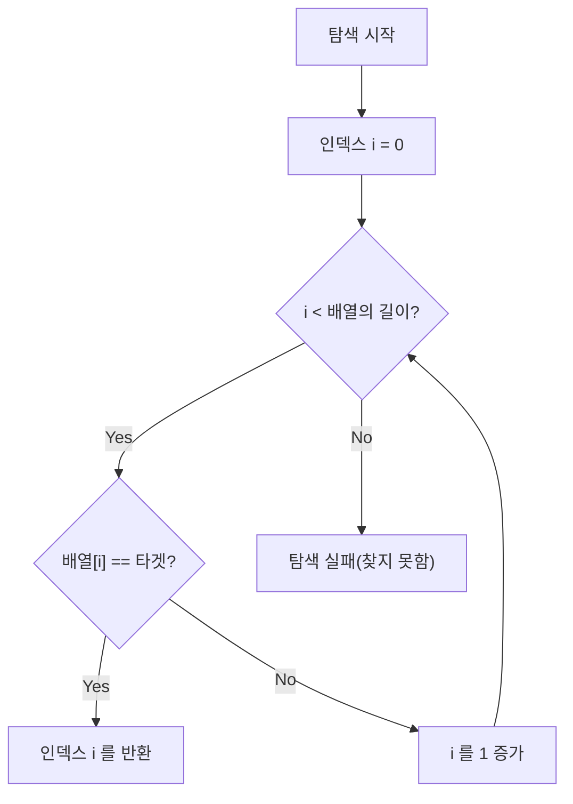
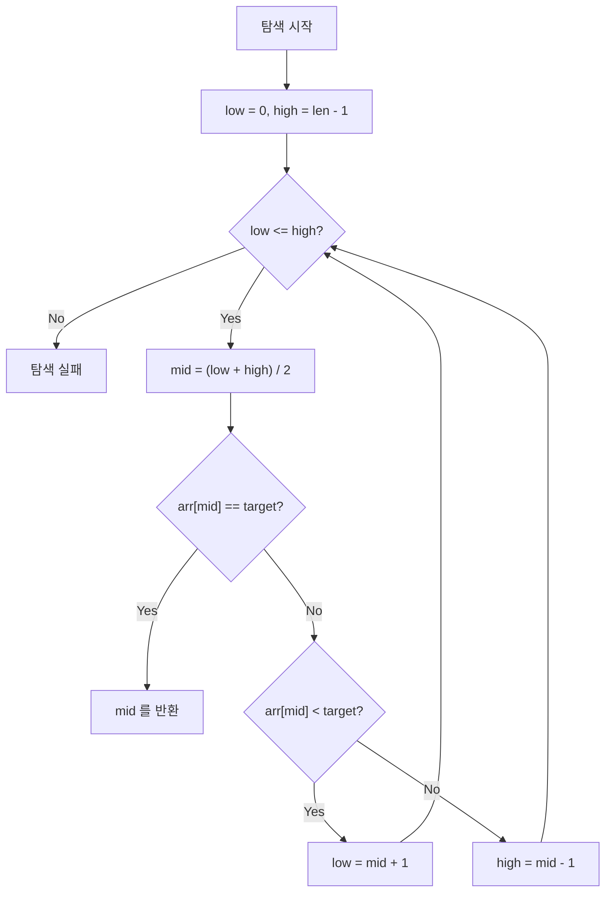
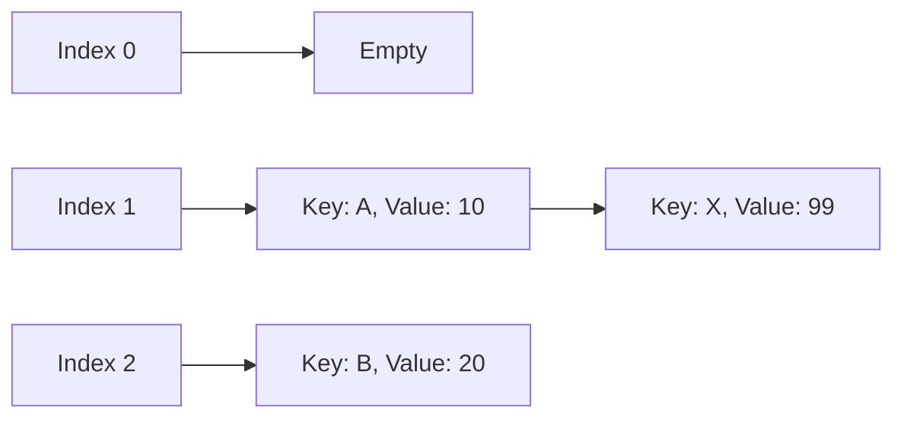

# 탐색 알고리즘의 기초와 중요성

현대의 컴퓨터 과학에 있어서, 데이터 중에서 목적하는 값을 신속하게 찾아내는 **탐색 알고리즘** 은 모든 소프트웨어나 시스템의 근간을 이루는 매우 중요한 기술입니다. 데이터베이스 검색, 웹 브라우저에서의 키워드 검색, 스마트폰 연락처 앱에서의 이름 검색 등, 우리는 일상적으로 탐색 알고리즘의 혜택을 받고 있습니다.

본 기사에서는 컴퓨터 과학의 기초인 「선형 탐색(Linear Search)」과 「이진 탐색(Binary Search)」 알고리즘에 대해 그 원리와 계산 복잡도, Python을 통한 구현 예제를 섞어 상세히 해설합니다. 나아가 이러한 알고리즘의 한계를 돌파하고 압도적인 검색 속도를 실현하는 「해시 테이블(Hash Table)」의 원리, 해시 함수의 역할, 그리고 해시 충돌(Collision)의 해결 방법론까지 깊게 파헤쳐 보겠습니다.


탐색 알고리즘의 이해를 깊게 하는 것은 프로그래머로서의 스킬을 한 단계 끌어올리기 위해 필수적입니다. 데이터 양이 적을 경우에는 알고리즘의 선택이 성능에 미치는 영향이 미미할지도 모르지만, 빅데이터 시대에 수백만, 수억 개의 데이터 중에서 순식간에 목적하는 정보를 찾아내기 위해서는 적절한 알고리즘과 자료 구조의 선택이 극히 중요해집니다. 특히, **시간 복잡도** ($O(n)$ 이나 $O(\log n)$, $O(1)$ 등) 의 개념을 이해하는 것은 효율적인 프로그램을 설계하는 데 있어 빼놓을 수 없는 요소입니다.

탐색 알고리즘의 이해를 깊게 하는 것은 프로그래머로서의 스킬을 한 단계 끌어올리기 위해 필수적입니다. 데이터 양이 적을 경우에는 알고리즘의 선택이 성능에 미치는 영향이 미미할지도 모르지만, 빅데이터 시대에 수백만, 수억 개의 데이터 중에서 순식간에 목적하는 정보를 찾아내기 위해서는 적절한 알고리즘과 자료 구조의 선택이 극히 중요해집니다. 특히, **시간 복잡도** ($O(n)$ 이나 $O(\log n)$, $O(1)$ 등) 의 개념을 이해하는 것은 효율적인 프로그램을 설계하는 데 있어 빼놓을 수 없는 요소입니다.

탐색 알고리즘의 이해를 깊게 하는 것은 프로그래머로서의 스킬을 한 단계 끌어올리기 위해 필수적입니다. 데이터 양이 적을 경우에는 알고리즘의 선택이 성능에 미치는 영향이 미미할지도 모르지만, 빅데이터 시대에 수백만, 수억 개의 데이터 중에서 순식간에 목적하는 정보를 찾아내기 위해서는 적절한 알고리즘과 자료 구조의 선택이 극히 중요해집니다. 특히, **시간 복잡도** ($O(n)$ 이나 $O(\log n)$, $O(1)$ 등) 의 개념을 이해하는 것은 효율적인 프로그램을 설계하는 데 있어 빼놓을 수 없는 요소입니다.

탐색 알고리즘의 이해를 깊게 하는 것은 프로그래머로서의 스킬을 한 단계 끌어올리기 위해 필수적입니다. 데이터 양이 적을 경우에는 알고리즘의 선택이 성능에 미치는 영향이 미미할지도 모르지만, 빅데이터 시대에 수백만, 수억 개의 데이터 중에서 순식간에 목적하는 정보를 찾아내기 위해서는 적절한 알고리즘과 자료 구조의 선택이 극히 중요해집니다. 특히, **시간 복잡도** ($O(n)$ 이나 $O(\log n)$, $O(1)$ 등) 의 개념을 이해하는 것은 효율적인 프로그램을 설계하는 데 있어 빼놓을 수 없는 요소입니다.

탐색 알고리즘의 이해를 깊게 하는 것은 프로그래머로서의 스킬을 한 단계 끌어올리기 위해 필수적입니다. 데이터 양이 적을 경우에는 알고리즘의 선택이 성능에 미치는 영향이 미미할지도 모르지만, 빅데이터 시대에 수백만, 수억 개의 데이터 중에서 순식간에 목적하는 정보를 찾아내기 위해서는 적절한 알고리즘과 자료 구조의 선택이 극히 중요해집니다. 특히, **시간 복잡도** ($O(n)$ 이나 $O(\log n)$, $O(1)$ 등) 의 개념을 이해하는 것은 효율적인 프로그램을 설계하는 데 있어 빼놓을 수 없는 요소입니다.

탐색 알고리즘의 이해를 깊게 하는 것은 프로그래머로서의 스킬을 한 단계 끌어올리기 위해 필수적입니다. 데이터 양이 적을 경우에는 알고리즘의 선택이 성능에 미치는 영향이 미미할지도 모르지만, 빅데이터 시대에 수백만, 수억 개의 데이터 중에서 순식간에 목적하는 정보를 찾아내기 위해서는 적절한 알고리즘과 자료 구조의 선택이 극히 중요해집니다. 특히, **시간 복잡도** ($O(n)$ 이나 $O(\log n)$, $O(1)$ 등) 의 개념을 이해하는 것은 효율적인 프로그램을 설계하는 데 있어 빼놓을 수 없는 요소입니다.

탐색 알고리즘의 이해를 깊게 하는 것은 프로그래머로서의 스킬을 한 단계 끌어올리기 위해 필수적입니다. 데이터 양이 적을 경우에는 알고리즘의 선택이 성능에 미치는 영향이 미미할지도 모르지만, 빅데이터 시대에 수백만, 수억 개의 데이터 중에서 순식간에 목적하는 정보를 찾아내기 위해서는 적절한 알고리즘과 자료 구조의 선택이 극히 중요해집니다. 특히, **시간 복잡도** ($O(n)$ 이나 $O(\log n)$, $O(1)$ 등) 의 개념을 이해하는 것은 효율적인 프로그램을 설계하는 데 있어 빼놓을 수 없는 요소입니다.

탐색 알고리즘의 이해를 깊게 하는 것은 프로그래머로서의 스킬을 한 단계 끌어올리기 위해 필수적입니다. 데이터 양이 적을 경우에는 알고리즘의 선택이 성능에 미치는 영향이 미미할지도 모르지만, 빅데이터 시대에 수백만, 수억 개의 데이터 중에서 순식간에 목적하는 정보를 찾아내기 위해서는 적절한 알고리즘과 자료 구조의 선택이 극히 중요해집니다. 특히, **시간 복잡도** ($O(n)$ 이나 $O(\log n)$, $O(1)$ 등) 의 개념을 이해하는 것은 효율적인 프로그램을 설계하는 데 있어 빼놓을 수 없는 요소입니다.

탐색 알고리즘의 이해를 깊게 하는 것은 프로그래머로서의 스킬을 한 단계 끌어올리기 위해 필수적입니다. 데이터 양이 적을 경우에는 알고리즘의 선택이 성능에 미치는 영향이 미미할지도 모르지만, 빅데이터 시대에 수백만, 수억 개의 데이터 중에서 순식간에 목적하는 정보를 찾아내기 위해서는 적절한 알고리즘과 자료 구조의 선택이 극히 중요해집니다. 특히, **시간 복잡도** ($O(n)$ 이나 $O(\log n)$, $O(1)$ 등) 의 개념을 이해하는 것은 효율적인 프로그램을 설계하는 데 있어 빼놓을 수 없는 요소입니다.

탐색 알고리즘의 이해를 깊게 하는 것은 프로그래머로서의 스킬을 한 단계 끌어올리기 위해 필수적입니다. 데이터 양이 적을 경우에는 알고리즘의 선택이 성능에 미치는 영향이 미미할지도 모르지만, 빅데이터 시대에 수백만, 수억 개의 데이터 중에서 순식간에 목적하는 정보를 찾아내기 위해서는 적절한 알고리즘과 자료 구조의 선택이 극히 중요해집니다. 특히, **시간 복잡도** ($O(n)$ 이나 $O(\log n)$, $O(1)$ 등) 의 개념을 이해하는 것은 효율적인 프로그램을 설계하는 데 있어 빼놓을 수 없는 요소입니다.

## 1. 선형 탐색 (Linear Search)

선형 탐색은 자료 구조(배열이나 리스트 등)의 처음부터 끝을 향해 목적하는 값을 찾을 때까지 순서대로 하나씩 요소를 확인해 나가는, 가장 간단하고 직관적인 탐색 알고리즘입니다.

### 1.1 선형 탐색의 원리

선형 탐색 알고리즘은 다음의 순서로 진행됩니다.

1. 배열의 첫 번째 요소를 꺼냅니다.
2. 꺼낸 요소가 목적하는 값(타겟)과 일치하는지 여부를 확인합니다.
3. 일치한 경우에는 그 요소의 인덱스(위치)를 반환하고 탐색을 종료합니다.
4. 일치하지 않은 경우에는 다음 요소로 넘어갑니다.
5. 배열의 마지막까지 확인하고, 타겟을 찾지 못한 경우에는 탐색 실패(예를 들어 `-1` 이나 `None` 을 반환)로서 종료합니다.



### 1.2 Python을 이용한 선형 탐색의 구현

아래에 Python을 사용한 선형 탐색의 간단한 구현 예를 제시합니다.

```python
def linear_search(arr, target):
    """
    선형 탐색을 실행하는 함수
    :param arr: 탐색 대상 리스트
    :param target: 찾아내고 싶은 값
    :return: 찾은 경우에는 그 인덱스, 찾지 못한 경우에는 -1
    """
    for i in range(len(arr)):
        if arr[i] == target:
            return i
    return -1

# 테스트 데이터
numbers = [10, 23, 4, 15, 2, 7, 34, 11]
target_value = 7

result_index = linear_search(numbers, target_value)
if result_index != -1:
    print(f"요소 {target_value} 는 인덱스 {result_index} 에서 찾았습니다.")
else:
    print(f"요소 {target_value} 는 리스트 내에 존재하지 않습니다.")
```


선형 탐색의 최대 특징은 데이터가 정렬되어 있을 필요가 없다는 점입니다. 데이터가 흩어진 순서로 저장되어 있어도 처음부터 순서대로 확인해 나가기 때문에 확실하게 목적하는 값을 찾아낼 수 있습니다(또는 존재하지 않음을 확인할 수 있습니다). 그러나 이 "순서대로 모든 것을 확인한다"는 성질이, 데이터 양이 많아졌을 경우 성능 저하의 최대 요인이 됩니다.

선형 탐색의 최대 특징은 데이터가 정렬되어 있을 필요가 없다는 점입니다. 데이터가 흩어진 순서로 저장되어 있어도 처음부터 순서대로 확인해 나가기 때문에 확실하게 목적하는 값을 찾아낼 수 있습니다(또는 존재하지 않음을 확인할 수 있습니다). 그러나 이 "순서대로 모든 것을 확인한다"는 성질이, 데이터 양이 많아졌을 경우 성능 저하의 최대 요인이 됩니다.

선형 탐색의 최대 특징은 데이터가 정렬되어 있을 필요가 없다는 점입니다. 데이터가 흩어진 순서로 저장되어 있어도 처음부터 순서대로 확인해 나가기 때문에 확실하게 목적하는 값을 찾아낼 수 있습니다(또는 존재하지 않음을 확인할 수 있습니다). 그러나 이 "순서대로 모든 것을 확인한다"는 성질이, 데이터 양이 많아졌을 경우 성능 저하의 최대 요인이 됩니다.

선형 탐색의 최대 특징은 데이터가 정렬되어 있을 필요가 없다는 점입니다. 데이터가 흩어진 순서로 저장되어 있어도 처음부터 순서대로 확인해 나가기 때문에 확실하게 목적하는 값을 찾아낼 수 있습니다(또는 존재하지 않음을 확인할 수 있습니다). 그러나 이 "순서대로 모든 것을 확인한다"는 성질이, 데이터 양이 많아졌을 경우 성능 저하의 최대 요인이 됩니다.

선형 탐색의 최대 특징은 데이터가 정렬되어 있을 필요가 없다는 점입니다. 데이터가 흩어진 순서로 저장되어 있어도 처음부터 순서대로 확인해 나가기 때문에 확실하게 목적하는 값을 찾아낼 수 있습니다(또는 존재하지 않음을 확인할 수 있습니다). 그러나 이 "순서대로 모든 것을 확인한다"는 성질이, 데이터 양이 많아졌을 경우 성능 저하의 최대 요인이 됩니다.

선형 탐색의 최대 특징은 데이터가 정렬되어 있을 필요가 없다는 점입니다. 데이터가 흩어진 순서로 저장되어 있어도 처음부터 순서대로 확인해 나가기 때문에 확실하게 목적하는 값을 찾아낼 수 있습니다(또는 존재하지 않음을 확인할 수 있습니다). 그러나 이 "순서대로 모든 것을 확인한다"는 성질이, 데이터 양이 많아졌을 경우 성능 저하의 최대 요인이 됩니다.

선형 탐색의 최대 특징은 데이터가 정렬되어 있을 필요가 없다는 점입니다. 데이터가 흩어진 순서로 저장되어 있어도 처음부터 순서대로 확인해 나가기 때문에 확실하게 목적하는 값을 찾아낼 수 있습니다(또는 존재하지 않음을 확인할 수 있습니다). 그러나 이 "순서대로 모든 것을 확인한다"는 성질이, 데이터 양이 많아졌을 경우 성능 저하의 최대 요인이 됩니다.

선형 탐색의 최대 특징은 데이터가 정렬되어 있을 필요가 없다는 점입니다. 데이터가 흩어진 순서로 저장되어 있어도 처음부터 순서대로 확인해 나가기 때문에 확실하게 목적하는 값을 찾아낼 수 있습니다(또는 존재하지 않음을 확인할 수 있습니다). 그러나 이 "순서대로 모든 것을 확인한다"는 성질이, 데이터 양이 많아졌을 경우 성능 저하의 최대 요인이 됩니다.

선형 탐색의 최대 특징은 데이터가 정렬되어 있을 필요가 없다는 점입니다. 데이터가 흩어진 순서로 저장되어 있어도 처음부터 순서대로 확인해 나가기 때문에 확실하게 목적하는 값을 찾아낼 수 있습니다(또는 존재하지 않음을 확인할 수 있습니다). 그러나 이 "순서대로 모든 것을 확인한다"는 성질이, 데이터 양이 많아졌을 경우 성능 저하의 최대 요인이 됩니다.

선형 탐색의 최대 특징은 데이터가 정렬되어 있을 필요가 없다는 점입니다. 데이터가 흩어진 순서로 저장되어 있어도 처음부터 순서대로 확인해 나가기 때문에 확실하게 목적하는 값을 찾아낼 수 있습니다(또는 존재하지 않음을 확인할 수 있습니다). 그러나 이 "순서대로 모든 것을 확인한다"는 성질이, 데이터 양이 많아졌을 경우 성능 저하의 최대 요인이 됩니다.

선형 탐색의 최대 특징은 데이터가 정렬되어 있을 필요가 없다는 점입니다. 데이터가 흩어진 순서로 저장되어 있어도 처음부터 순서대로 확인해 나가기 때문에 확실하게 목적하는 값을 찾아낼 수 있습니다(또는 존재하지 않음을 확인할 수 있습니다). 그러나 이 "순서대로 모든 것을 확인한다"는 성질이, 데이터 양이 많아졌을 경우 성능 저하의 최대 요인이 됩니다.

선형 탐색의 최대 특징은 데이터가 정렬되어 있을 필요가 없다는 점입니다. 데이터가 흩어진 순서로 저장되어 있어도 처음부터 순서대로 확인해 나가기 때문에 확실하게 목적하는 값을 찾아낼 수 있습니다(또는 존재하지 않음을 확인할 수 있습니다). 그러나 이 "순서대로 모든 것을 확인한다"는 성질이, 데이터 양이 많아졌을 경우 성능 저하의 최대 요인이 됩니다.

선형 탐색의 최대 특징은 데이터가 정렬되어 있을 필요가 없다는 점입니다. 데이터가 흩어진 순서로 저장되어 있어도 처음부터 순서대로 확인해 나가기 때문에 확실하게 목적하는 값을 찾아낼 수 있습니다(또는 존재하지 않음을 확인할 수 있습니다). 그러나 이 "순서대로 모든 것을 확인한다"는 성질이, 데이터 양이 많아졌을 경우 성능 저하의 최대 요인이 됩니다.

선형 탐색의 최대 특징은 데이터가 정렬되어 있을 필요가 없다는 점입니다. 데이터가 흩어진 순서로 저장되어 있어도 처음부터 순서대로 확인해 나가기 때문에 확실하게 목적하는 값을 찾아낼 수 있습니다(또는 존재하지 않음을 확인할 수 있습니다). 그러나 이 "순서대로 모든 것을 확인한다"는 성질이, 데이터 양이 많아졌을 경우 성능 저하의 최대 요인이 됩니다.

선형 탐색의 최대 특징은 데이터가 정렬되어 있을 필요가 없다는 점입니다. 데이터가 흩어진 순서로 저장되어 있어도 처음부터 순서대로 확인해 나가기 때문에 확실하게 목적하는 값을 찾아낼 수 있습니다(또는 존재하지 않음을 확인할 수 있습니다). 그러나 이 "순서대로 모든 것을 확인한다"는 성질이, 데이터 양이 많아졌을 경우 성능 저하의 최대 요인이 됩니다.

선형 탐색의 최대 특징은 데이터가 정렬되어 있을 필요가 없다는 점입니다. 데이터가 흩어진 순서로 저장되어 있어도 처음부터 순서대로 확인해 나가기 때문에 확실하게 목적하는 값을 찾아낼 수 있습니다(또는 존재하지 않음을 확인할 수 있습니다). 그러나 이 "순서대로 모든 것을 확인한다"는 성질이, 데이터 양이 많아졌을 경우 성능 저하의 최대 요인이 됩니다.

선형 탐색의 최대 특징은 데이터가 정렬되어 있을 필요가 없다는 점입니다. 데이터가 흩어진 순서로 저장되어 있어도 처음부터 순서대로 확인해 나가기 때문에 확실하게 목적하는 값을 찾아낼 수 있습니다(또는 존재하지 않음을 확인할 수 있습니다). 그러나 이 "순서대로 모든 것을 확인한다"는 성질이, 데이터 양이 많아졌을 경우 성능 저하의 최대 요인이 됩니다.

선형 탐색의 최대 특징은 데이터가 정렬되어 있을 필요가 없다는 점입니다. 데이터가 흩어진 순서로 저장되어 있어도 처음부터 순서대로 확인해 나가기 때문에 확실하게 목적하는 값을 찾아낼 수 있습니다(또는 존재하지 않음을 확인할 수 있습니다). 그러나 이 "순서대로 모든 것을 확인한다"는 성질이, 데이터 양이 많아졌을 경우 성능 저하의 최대 요인이 됩니다.

선형 탐색의 최대 특징은 데이터가 정렬되어 있을 필요가 없다는 점입니다. 데이터가 흩어진 순서로 저장되어 있어도 처음부터 순서대로 확인해 나가기 때문에 확실하게 목적하는 값을 찾아낼 수 있습니다(또는 존재하지 않음을 확인할 수 있습니다). 그러나 이 "순서대로 모든 것을 확인한다"는 성질이, 데이터 양이 많아졌을 경우 성능 저하의 최대 요인이 됩니다.

선형 탐색의 최대 특징은 데이터가 정렬되어 있을 필요가 없다는 점입니다. 데이터가 흩어진 순서로 저장되어 있어도 처음부터 순서대로 확인해 나가기 때문에 확실하게 목적하는 값을 찾아낼 수 있습니다(또는 존재하지 않음을 확인할 수 있습니다). 그러나 이 "순서대로 모든 것을 확인한다"는 성질이, 데이터 양이 많아졌을 경우 성능 저하의 최대 요인이 됩니다.

선형 탐색의 최대 특징은 데이터가 정렬되어 있을 필요가 없다는 점입니다. 데이터가 흩어진 순서로 저장되어 있어도 처음부터 순서대로 확인해 나가기 때문에 확실하게 목적하는 값을 찾아낼 수 있습니다(또는 존재하지 않음을 확인할 수 있습니다). 그러나 이 "순서대로 모든 것을 확인한다"는 성질이, 데이터 양이 많아졌을 경우 성능 저하의 최대 요인이 됩니다.

선형 탐색의 최대 특징은 데이터가 정렬되어 있을 필요가 없다는 점입니다. 데이터가 흩어진 순서로 저장되어 있어도 처음부터 순서대로 확인해 나가기 때문에 확실하게 목적하는 값을 찾아낼 수 있습니다(또는 존재하지 않음을 확인할 수 있습니다). 그러나 이 "순서대로 모든 것을 확인한다"는 성질이, 데이터 양이 많아졌을 경우 성능 저하의 최대 요인이 됩니다.

선형 탐색의 최대 특징은 데이터가 정렬되어 있을 필요가 없다는 점입니다. 데이터가 흩어진 순서로 저장되어 있어도 처음부터 순서대로 확인해 나가기 때문에 확실하게 목적하는 값을 찾아낼 수 있습니다(또는 존재하지 않음을 확인할 수 있습니다). 그러나 이 "순서대로 모든 것을 확인한다"는 성질이, 데이터 양이 많아졌을 경우 성능 저하의 최대 요인이 됩니다.

선형 탐색의 최대 특징은 데이터가 정렬되어 있을 필요가 없다는 점입니다. 데이터가 흩어진 순서로 저장되어 있어도 처음부터 순서대로 확인해 나가기 때문에 확실하게 목적하는 값을 찾아낼 수 있습니다(또는 존재하지 않음을 확인할 수 있습니다). 그러나 이 "순서대로 모든 것을 확인한다"는 성질이, 데이터 양이 많아졌을 경우 성능 저하의 최대 요인이 됩니다.

선형 탐색의 최대 특징은 데이터가 정렬되어 있을 필요가 없다는 점입니다. 데이터가 흩어진 순서로 저장되어 있어도 처음부터 순서대로 확인해 나가기 때문에 확실하게 목적하는 값을 찾아낼 수 있습니다(또는 존재하지 않음을 확인할 수 있습니다). 그러나 이 "순서대로 모든 것을 확인한다"는 성질이, 데이터 양이 많아졌을 경우 성능 저하의 최대 요인이 됩니다.

선형 탐색의 최대 특징은 데이터가 정렬되어 있을 필요가 없다는 점입니다. 데이터가 흩어진 순서로 저장되어 있어도 처음부터 순서대로 확인해 나가기 때문에 확실하게 목적하는 값을 찾아낼 수 있습니다(또는 존재하지 않음을 확인할 수 있습니다). 그러나 이 "순서대로 모든 것을 확인한다"는 성질이, 데이터 양이 많아졌을 경우 성능 저하의 최대 요인이 됩니다.

선형 탐색의 최대 특징은 데이터가 정렬되어 있을 필요가 없다는 점입니다. 데이터가 흩어진 순서로 저장되어 있어도 처음부터 순서대로 확인해 나가기 때문에 확실하게 목적하는 값을 찾아낼 수 있습니다(또는 존재하지 않음을 확인할 수 있습니다). 그러나 이 "순서대로 모든 것을 확인한다"는 성질이, 데이터 양이 많아졌을 경우 성능 저하의 최대 요인이 됩니다.

선형 탐색의 최대 특징은 데이터가 정렬되어 있을 필요가 없다는 점입니다. 데이터가 흩어진 순서로 저장되어 있어도 처음부터 순서대로 확인해 나가기 때문에 확실하게 목적하는 값을 찾아낼 수 있습니다(또는 존재하지 않음을 확인할 수 있습니다). 그러나 이 "순서대로 모든 것을 확인한다"는 성질이, 데이터 양이 많아졌을 경우 성능 저하의 최대 요인이 됩니다.

선형 탐색의 최대 특징은 데이터가 정렬되어 있을 필요가 없다는 점입니다. 데이터가 흩어진 순서로 저장되어 있어도 처음부터 순서대로 확인해 나가기 때문에 확실하게 목적하는 값을 찾아낼 수 있습니다(또는 존재하지 않음을 확인할 수 있습니다). 그러나 이 "순서대로 모든 것을 확인한다"는 성질이, 데이터 양이 많아졌을 경우 성능 저하의 최대 요인이 됩니다.

선형 탐색의 최대 특징은 데이터가 정렬되어 있을 필요가 없다는 점입니다. 데이터가 흩어진 순서로 저장되어 있어도 처음부터 순서대로 확인해 나가기 때문에 확실하게 목적하는 값을 찾아낼 수 있습니다(또는 존재하지 않음을 확인할 수 있습니다). 그러나 이 "순서대로 모든 것을 확인한다"는 성질이, 데이터 양이 많아졌을 경우 성능 저하의 최대 요인이 됩니다.

선형 탐색의 최대 특징은 데이터가 정렬되어 있을 필요가 없다는 점입니다. 데이터가 흩어진 순서로 저장되어 있어도 처음부터 순서대로 확인해 나가기 때문에 확실하게 목적하는 값을 찾아낼 수 있습니다(또는 존재하지 않음을 확인할 수 있습니다). 그러나 이 "순서대로 모든 것을 확인한다"는 성질이, 데이터 양이 많아졌을 경우 성능 저하의 최대 요인이 됩니다.

선형 탐색의 최대 특징은 데이터가 정렬되어 있을 필요가 없다는 점입니다. 데이터가 흩어진 순서로 저장되어 있어도 처음부터 순서대로 확인해 나가기 때문에 확실하게 목적하는 값을 찾아낼 수 있습니다(또는 존재하지 않음을 확인할 수 있습니다). 그러나 이 "순서대로 모든 것을 확인한다"는 성질이, 데이터 양이 많아졌을 경우 성능 저하의 최대 요인이 됩니다.

선형 탐색의 최대 특징은 데이터가 정렬되어 있을 필요가 없다는 점입니다. 데이터가 흩어진 순서로 저장되어 있어도 처음부터 순서대로 확인해 나가기 때문에 확실하게 목적하는 값을 찾아낼 수 있습니다(또는 존재하지 않음을 확인할 수 있습니다). 그러나 이 "순서대로 모든 것을 확인한다"는 성질이, 데이터 양이 많아졌을 경우 성능 저하의 최대 요인이 됩니다.

선형 탐색의 최대 특징은 데이터가 정렬되어 있을 필요가 없다는 점입니다. 데이터가 흩어진 순서로 저장되어 있어도 처음부터 순서대로 확인해 나가기 때문에 확실하게 목적하는 값을 찾아낼 수 있습니다(또는 존재하지 않음을 확인할 수 있습니다). 그러나 이 "순서대로 모든 것을 확인한다"는 성질이, 데이터 양이 많아졌을 경우 성능 저하의 최대 요인이 됩니다.

선형 탐색의 최대 특징은 데이터가 정렬되어 있을 필요가 없다는 점입니다. 데이터가 흩어진 순서로 저장되어 있어도 처음부터 순서대로 확인해 나가기 때문에 확실하게 목적하는 값을 찾아낼 수 있습니다(또는 존재하지 않음을 확인할 수 있습니다). 그러나 이 "순서대로 모든 것을 확인한다"는 성질이, 데이터 양이 많아졌을 경우 성능 저하의 최대 요인이 됩니다.

선형 탐색의 최대 특징은 데이터가 정렬되어 있을 필요가 없다는 점입니다. 데이터가 흩어진 순서로 저장되어 있어도 처음부터 순서대로 확인해 나가기 때문에 확실하게 목적하는 값을 찾아낼 수 있습니다(또는 존재하지 않음을 확인할 수 있습니다). 그러나 이 "순서대로 모든 것을 확인한다"는 성질이, 데이터 양이 많아졌을 경우 성능 저하의 최대 요인이 됩니다.

선형 탐색의 최대 특징은 데이터가 정렬되어 있을 필요가 없다는 점입니다. 데이터가 흩어진 순서로 저장되어 있어도 처음부터 순서대로 확인해 나가기 때문에 확실하게 목적하는 값을 찾아낼 수 있습니다(또는 존재하지 않음을 확인할 수 있습니다). 그러나 이 "순서대로 모든 것을 확인한다"는 성질이, 데이터 양이 많아졌을 경우 성능 저하의 최대 요인이 됩니다.

선형 탐색의 최대 특징은 데이터가 정렬되어 있을 필요가 없다는 점입니다. 데이터가 흩어진 순서로 저장되어 있어도 처음부터 순서대로 확인해 나가기 때문에 확실하게 목적하는 값을 찾아낼 수 있습니다(또는 존재하지 않음을 확인할 수 있습니다). 그러나 이 "순서대로 모든 것을 확인한다"는 성질이, 데이터 양이 많아졌을 경우 성능 저하의 최대 요인이 됩니다.

선형 탐색의 최대 특징은 데이터가 정렬되어 있을 필요가 없다는 점입니다. 데이터가 흩어진 순서로 저장되어 있어도 처음부터 순서대로 확인해 나가기 때문에 확실하게 목적하는 값을 찾아낼 수 있습니다(또는 존재하지 않음을 확인할 수 있습니다). 그러나 이 "순서대로 모든 것을 확인한다"는 성질이, 데이터 양이 많아졌을 경우 성능 저하의 최대 요인이 됩니다.

선형 탐색의 최대 특징은 데이터가 정렬되어 있을 필요가 없다는 점입니다. 데이터가 흩어진 순서로 저장되어 있어도 처음부터 순서대로 확인해 나가기 때문에 확실하게 목적하는 값을 찾아낼 수 있습니다(또는 존재하지 않음을 확인할 수 있습니다). 그러나 이 "순서대로 모든 것을 확인한다"는 성질이, 데이터 양이 많아졌을 경우 성능 저하의 최대 요인이 됩니다.

선형 탐색의 최대 특징은 데이터가 정렬되어 있을 필요가 없다는 점입니다. 데이터가 흩어진 순서로 저장되어 있어도 처음부터 순서대로 확인해 나가기 때문에 확실하게 목적하는 값을 찾아낼 수 있습니다(또는 존재하지 않음을 확인할 수 있습니다). 그러나 이 "순서대로 모든 것을 확인한다"는 성질이, 데이터 양이 많아졌을 경우 성능 저하의 최대 요인이 됩니다.

선형 탐색의 최대 특징은 데이터가 정렬되어 있을 필요가 없다는 점입니다. 데이터가 흩어진 순서로 저장되어 있어도 처음부터 순서대로 확인해 나가기 때문에 확실하게 목적하는 값을 찾아낼 수 있습니다(또는 존재하지 않음을 확인할 수 있습니다). 그러나 이 "순서대로 모든 것을 확인한다"는 성질이, 데이터 양이 많아졌을 경우 성능 저하의 최대 요인이 됩니다.

선형 탐색의 최대 특징은 데이터가 정렬되어 있을 필요가 없다는 점입니다. 데이터가 흩어진 순서로 저장되어 있어도 처음부터 순서대로 확인해 나가기 때문에 확실하게 목적하는 값을 찾아낼 수 있습니다(또는 존재하지 않음을 확인할 수 있습니다). 그러나 이 "순서대로 모든 것을 확인한다"는 성질이, 데이터 양이 많아졌을 경우 성능 저하의 최대 요인이 됩니다.

선형 탐색의 최대 특징은 데이터가 정렬되어 있을 필요가 없다는 점입니다. 데이터가 흩어진 순서로 저장되어 있어도 처음부터 순서대로 확인해 나가기 때문에 확실하게 목적하는 값을 찾아낼 수 있습니다(또는 존재하지 않음을 확인할 수 있습니다). 그러나 이 "순서대로 모든 것을 확인한다"는 성질이, 데이터 양이 많아졌을 경우 성능 저하의 최대 요인이 됩니다.

선형 탐색의 최대 특징은 데이터가 정렬되어 있을 필요가 없다는 점입니다. 데이터가 흩어진 순서로 저장되어 있어도 처음부터 순서대로 확인해 나가기 때문에 확실하게 목적하는 값을 찾아낼 수 있습니다(또는 존재하지 않음을 확인할 수 있습니다). 그러나 이 "순서대로 모든 것을 확인한다"는 성질이, 데이터 양이 많아졌을 경우 성능 저하의 최대 요인이 됩니다.

선형 탐색의 최대 특징은 데이터가 정렬되어 있을 필요가 없다는 점입니다. 데이터가 흩어진 순서로 저장되어 있어도 처음부터 순서대로 확인해 나가기 때문에 확실하게 목적하는 값을 찾아낼 수 있습니다(또는 존재하지 않음을 확인할 수 있습니다). 그러나 이 "순서대로 모든 것을 확인한다"는 성질이, 데이터 양이 많아졌을 경우 성능 저하의 최대 요인이 됩니다.

선형 탐색의 최대 특징은 데이터가 정렬되어 있을 필요가 없다는 점입니다. 데이터가 흩어진 순서로 저장되어 있어도 처음부터 순서대로 확인해 나가기 때문에 확실하게 목적하는 값을 찾아낼 수 있습니다(또는 존재하지 않음을 확인할 수 있습니다). 그러나 이 "순서대로 모든 것을 확인한다"는 성질이, 데이터 양이 많아졌을 경우 성능 저하의 최대 요인이 됩니다.

선형 탐색의 최대 특징은 데이터가 정렬되어 있을 필요가 없다는 점입니다. 데이터가 흩어진 순서로 저장되어 있어도 처음부터 순서대로 확인해 나가기 때문에 확실하게 목적하는 값을 찾아낼 수 있습니다(또는 존재하지 않음을 확인할 수 있습니다). 그러나 이 "순서대로 모든 것을 확인한다"는 성질이, 데이터 양이 많아졌을 경우 성능 저하의 최대 요인이 됩니다.

선형 탐색의 최대 특징은 데이터가 정렬되어 있을 필요가 없다는 점입니다. 데이터가 흩어진 순서로 저장되어 있어도 처음부터 순서대로 확인해 나가기 때문에 확실하게 목적하는 값을 찾아낼 수 있습니다(또는 존재하지 않음을 확인할 수 있습니다). 그러나 이 "순서대로 모든 것을 확인한다"는 성질이, 데이터 양이 많아졌을 경우 성능 저하의 최대 요인이 됩니다.

선형 탐색의 최대 특징은 데이터가 정렬되어 있을 필요가 없다는 점입니다. 데이터가 흩어진 순서로 저장되어 있어도 처음부터 순서대로 확인해 나가기 때문에 확실하게 목적하는 값을 찾아낼 수 있습니다(또는 존재하지 않음을 확인할 수 있습니다). 그러나 이 "순서대로 모든 것을 확인한다"는 성질이, 데이터 양이 많아졌을 경우 성능 저하의 최대 요인이 됩니다.

## 2. 이진 탐색 (Binary Search)

이진 탐색은 **미리 정렬(오름차순 또는 내림차순으로 정렬)된 데이터** 에 대해서만 적용할 수 있는, 매우 빠르고 효율적인 탐색 알고리즘입니다. 탐색 범위를 절반씩 좁혀나감으로써 계산 복잡도를 극적으로 줄입니다.

### 2.1 이진 탐색의 원리

이진 탐색은 다음의 순서로 진행됩니다.

1. 탐색 대상 배열의 "왼쪽 끝(`low`)"과 "오른쪽 끝(`high`)"의 인덱스를 초기화합니다.
2. 탐색 범위가 유효한 한(`low <= high`), 다음의 처리를 반복합니다.
3. 탐색 범위의 중앙 인덱스(`mid`)를 계산합니다.
4. 중앙 요소(`arr[mid]`)와 목적하는 값(타겟)을 비교합니다.
5. 일치한 경우에는 `mid` 를 반환하고 종료합니다.
6. 중앙 요소가 타겟보다 작을 경우에는 타겟은 오른쪽 절반의 범위에 존재하게 되므로, 왼쪽 끝을 `mid + 1` 로 갱신합니다.
7. 중앙 요소가 타겟보다 클 경우에는 타겟은 왼쪽 절반의 범위에 존재하게 되므로, 오른쪽 끝을 `mid - 1` 로 갱신합니다.
8. 탐색 범위가 없어져도 찾지 못한 경우에는 탐색 실패로 간주합니다.



### 2.2 Python을 이용한 이진 탐색의 구현 (반복법)

```python
def binary_search(arr, target):
    """
    이진 탐색(반복법)을 실행하는 함수
    :param arr: 정렬된 탐색 대상 리스트
    :param target: 찾아내고 싶은 값
    :return: 찾은 경우에는 그 인덱스, 찾지 못한 경우에는 -1
    """
    low = 0
    high = len(arr) - 1

    while low <= high:
        mid = (low + high) // 2
        
        if arr[mid] == target:
            return mid
        elif arr[mid] < target:
            low = mid + 1
        else:
            high = mid - 1
            
    return -1

# 테스트 데이터（ソート済みである必要がある）
sorted_numbers = [2, 4, 7, 10, 11, 15, 23, 34]
target_value = 15

result_index = binary_search(sorted_numbers, target_value)
if result_index != -1:
    print(f"요소 {target_value} 는 인덱스 {result_index} 에서 찾았습니다.")
else:
    print(f"요소 {target_value} 는 리스트 내에 존재하지 않습니다.")
```

이진 탐색의 경이적인 성능은 탐색 범위를 매번 절반으로 분할한다는 성질에서 비롯됩니다. 예를 들어 요소 수가 100만 개인 배열에 대해 선형 탐색을 수행하면 최악의 경우 100만 번의 비교가 필요하게 되지만, 이진 탐색을 사용하면 불과 20번 정도의 비교로 목적하는 값을 찾아낼 수 있습니다($2^{20} \approx 1,000,000$). 이 때문에 대규모 데이터셋에 대한 검색 작업에 있어서, 이진 탐색은 선형 탐색과 비교해 압도적인 우위성을 자랑합니다. 수학적으로, 이진 탐색의 시간 복잡도는 $O(\log n)$ 으로 표현됩니다.

이진 탐색의 경이적인 성능은 탐색 범위를 매번 절반으로 분할한다는 성질에서 비롯됩니다. 예를 들어 요소 수가 100만 개인 배열에 대해 선형 탐색을 수행하면 최악의 경우 100만 번의 비교가 필요하게 되지만, 이진 탐색을 사용하면 불과 20번 정도의 비교로 목적하는 값을 찾아낼 수 있습니다($2^{20} \approx 1,000,000$). 이 때문에 대규모 데이터셋에 대한 검색 작업에 있어서, 이진 탐색은 선형 탐색과 비교해 압도적인 우위성을 자랑합니다. 수학적으로, 이진 탐색의 시간 복잡도는 $O(\log n)$ 으로 표현됩니다.

이진 탐색의 경이적인 성능은 탐색 범위를 매번 절반으로 분할한다는 성질에서 비롯됩니다. 예를 들어 요소 수가 100만 개인 배열에 대해 선형 탐색을 수행하면 최악의 경우 100만 번의 비교가 필요하게 되지만, 이진 탐색을 사용하면 불과 20번 정도의 비교로 목적하는 값을 찾아낼 수 있습니다($2^{20} \approx 1,000,000$). 이 때문에 대규모 데이터셋에 대한 검색 작업에 있어서, 이진 탐색은 선형 탐색과 비교해 압도적인 우위성을 자랑합니다. 수학적으로, 이진 탐색의 시간 복잡도는 $O(\log n)$ 으로 표현됩니다.

이진 탐색의 경이적인 성능은 탐색 범위를 매번 절반으로 분할한다는 성질에서 비롯됩니다. 예를 들어 요소 수가 100만 개인 배열에 대해 선형 탐색을 수행하면 최악의 경우 100만 번의 비교가 필요하게 되지만, 이진 탐색을 사용하면 불과 20번 정도의 비교로 목적하는 값을 찾아낼 수 있습니다($2^{20} \approx 1,000,000$). 이 때문에 대규모 데이터셋에 대한 검색 작업에 있어서, 이진 탐색은 선형 탐색과 비교해 압도적인 우위성을 자랑합니다. 수학적으로, 이진 탐색의 시간 복잡도는 $O(\log n)$ 으로 표현됩니다.

이진 탐색의 경이적인 성능은 탐색 범위를 매번 절반으로 분할한다는 성질에서 비롯됩니다. 예를 들어 요소 수가 100만 개인 배열에 대해 선형 탐색을 수행하면 최악의 경우 100만 번의 비교가 필요하게 되지만, 이진 탐색을 사용하면 불과 20번 정도의 비교로 목적하는 값을 찾아낼 수 있습니다($2^{20} \approx 1,000,000$). 이 때문에 대규모 데이터셋에 대한 검색 작업에 있어서, 이진 탐색은 선형 탐색과 비교해 압도적인 우위성을 자랑합니다. 수학적으로, 이진 탐색의 시간 복잡도는 $O(\log n)$ 으로 표현됩니다.

이진 탐색의 경이적인 성능은 탐색 범위를 매번 절반으로 분할한다는 성질에서 비롯됩니다. 예를 들어 요소 수가 100만 개인 배열에 대해 선형 탐색을 수행하면 최악의 경우 100만 번의 비교가 필요하게 되지만, 이진 탐색을 사용하면 불과 20번 정도의 비교로 목적하는 값을 찾아낼 수 있습니다($2^{20} \approx 1,000,000$). 이 때문에 대규모 데이터셋에 대한 검색 작업에 있어서, 이진 탐색은 선형 탐색과 비교해 압도적인 우위성을 자랑합니다. 수학적으로, 이진 탐색의 시간 복잡도는 $O(\log n)$ 으로 표현됩니다.

이진 탐색의 경이적인 성능은 탐색 범위를 매번 절반으로 분할한다는 성질에서 비롯됩니다. 예를 들어 요소 수가 100만 개인 배열에 대해 선형 탐색을 수행하면 최악의 경우 100만 번의 비교가 필요하게 되지만, 이진 탐색을 사용하면 불과 20번 정도의 비교로 목적하는 값을 찾아낼 수 있습니다($2^{20} \approx 1,000,000$). 이 때문에 대규모 데이터셋에 대한 검색 작업에 있어서, 이진 탐색은 선형 탐색과 비교해 압도적인 우위성을 자랑합니다. 수학적으로, 이진 탐색의 시간 복잡도는 $O(\log n)$ 으로 표현됩니다.

이진 탐색의 경이적인 성능은 탐색 범위를 매번 절반으로 분할한다는 성질에서 비롯됩니다. 예를 들어 요소 수가 100만 개인 배열에 대해 선형 탐색을 수행하면 최악의 경우 100만 번의 비교가 필요하게 되지만, 이진 탐색을 사용하면 불과 20번 정도의 비교로 목적하는 값을 찾아낼 수 있습니다($2^{20} \approx 1,000,000$). 이 때문에 대규모 데이터셋에 대한 검색 작업에 있어서, 이진 탐색은 선형 탐색과 비교해 압도적인 우위성을 자랑합니다. 수학적으로, 이진 탐색의 시간 복잡도는 $O(\log n)$ 으로 표현됩니다.

이진 탐색의 경이적인 성능은 탐색 범위를 매번 절반으로 분할한다는 성질에서 비롯됩니다. 예를 들어 요소 수가 100만 개인 배열에 대해 선형 탐색을 수행하면 최악의 경우 100만 번의 비교가 필요하게 되지만, 이진 탐색을 사용하면 불과 20번 정도의 비교로 목적하는 값을 찾아낼 수 있습니다($2^{20} \approx 1,000,000$). 이 때문에 대규모 데이터셋에 대한 검색 작업에 있어서, 이진 탐색은 선형 탐색과 비교해 압도적인 우위성을 자랑합니다. 수학적으로, 이진 탐색의 시간 복잡도는 $O(\log n)$ 으로 표현됩니다.

이진 탐색의 경이적인 성능은 탐색 범위를 매번 절반으로 분할한다는 성질에서 비롯됩니다. 예를 들어 요소 수가 100만 개인 배열에 대해 선형 탐색을 수행하면 최악의 경우 100만 번의 비교가 필요하게 되지만, 이진 탐색을 사용하면 불과 20번 정도의 비교로 목적하는 값을 찾아낼 수 있습니다($2^{20} \approx 1,000,000$). 이 때문에 대규모 데이터셋에 대한 검색 작업에 있어서, 이진 탐색은 선형 탐색과 비교해 압도적인 우위성을 자랑합니다. 수학적으로, 이진 탐색의 시간 복잡도는 $O(\log n)$ 으로 표현됩니다.

이진 탐색의 경이적인 성능은 탐색 범위를 매번 절반으로 분할한다는 성질에서 비롯됩니다. 예를 들어 요소 수가 100만 개인 배열에 대해 선형 탐색을 수행하면 최악의 경우 100만 번의 비교가 필요하게 되지만, 이진 탐색을 사용하면 불과 20번 정도의 비교로 목적하는 값을 찾아낼 수 있습니다($2^{20} \approx 1,000,000$). 이 때문에 대규모 데이터셋에 대한 검색 작업에 있어서, 이진 탐색은 선형 탐색과 비교해 압도적인 우위성을 자랑합니다. 수학적으로, 이진 탐색의 시간 복잡도는 $O(\log n)$ 으로 표현됩니다.

이진 탐색의 경이적인 성능은 탐색 범위를 매번 절반으로 분할한다는 성질에서 비롯됩니다. 예를 들어 요소 수가 100만 개인 배열에 대해 선형 탐색을 수행하면 최악의 경우 100만 번의 비교가 필요하게 되지만, 이진 탐색을 사용하면 불과 20번 정도의 비교로 목적하는 값을 찾아낼 수 있습니다($2^{20} \approx 1,000,000$). 이 때문에 대규모 데이터셋에 대한 검색 작업에 있어서, 이진 탐색은 선형 탐색과 비교해 압도적인 우위성을 자랑합니다. 수학적으로, 이진 탐색의 시간 복잡도는 $O(\log n)$ 으로 표현됩니다.

이진 탐색의 경이적인 성능은 탐색 범위를 매번 절반으로 분할한다는 성질에서 비롯됩니다. 예를 들어 요소 수가 100만 개인 배열에 대해 선형 탐색을 수행하면 최악의 경우 100만 번의 비교가 필요하게 되지만, 이진 탐색을 사용하면 불과 20번 정도의 비교로 목적하는 값을 찾아낼 수 있습니다($2^{20} \approx 1,000,000$). 이 때문에 대규모 데이터셋에 대한 검색 작업에 있어서, 이진 탐색은 선형 탐색과 비교해 압도적인 우위성을 자랑합니다. 수학적으로, 이진 탐색의 시간 복잡도는 $O(\log n)$ 으로 표현됩니다.

이진 탐색의 경이적인 성능은 탐색 범위를 매번 절반으로 분할한다는 성질에서 비롯됩니다. 예를 들어 요소 수가 100만 개인 배열에 대해 선형 탐색을 수행하면 최악의 경우 100만 번의 비교가 필요하게 되지만, 이진 탐색을 사용하면 불과 20번 정도의 비교로 목적하는 값을 찾아낼 수 있습니다($2^{20} \approx 1,000,000$). 이 때문에 대규모 데이터셋에 대한 검색 작업에 있어서, 이진 탐색은 선형 탐색과 비교해 압도적인 우위성을 자랑합니다. 수학적으로, 이진 탐색의 시간 복잡도는 $O(\log n)$ 으로 표현됩니다.

이진 탐색의 경이적인 성능은 탐색 범위를 매번 절반으로 분할한다는 성질에서 비롯됩니다. 예를 들어 요소 수가 100만 개인 배열에 대해 선형 탐색을 수행하면 최악의 경우 100만 번의 비교가 필요하게 되지만, 이진 탐색을 사용하면 불과 20번 정도의 비교로 목적하는 값을 찾아낼 수 있습니다($2^{20} \approx 1,000,000$). 이 때문에 대규모 데이터셋에 대한 검색 작업에 있어서, 이진 탐색은 선형 탐색과 비교해 압도적인 우위성을 자랑합니다. 수학적으로, 이진 탐색의 시간 복잡도는 $O(\log n)$ 으로 표현됩니다.

이진 탐색의 경이적인 성능은 탐색 범위를 매번 절반으로 분할한다는 성질에서 비롯됩니다. 예를 들어 요소 수가 100만 개인 배열에 대해 선형 탐색을 수행하면 최악의 경우 100만 번의 비교가 필요하게 되지만, 이진 탐색을 사용하면 불과 20번 정도의 비교로 목적하는 값을 찾아낼 수 있습니다($2^{20} \approx 1,000,000$). 이 때문에 대규모 데이터셋에 대한 검색 작업에 있어서, 이진 탐색은 선형 탐색과 비교해 압도적인 우위성을 자랑합니다. 수학적으로, 이진 탐색의 시간 복잡도는 $O(\log n)$ 으로 표현됩니다.

이진 탐색의 경이적인 성능은 탐색 범위를 매번 절반으로 분할한다는 성질에서 비롯됩니다. 예를 들어 요소 수가 100만 개인 배열에 대해 선형 탐색을 수행하면 최악의 경우 100만 번의 비교가 필요하게 되지만, 이진 탐색을 사용하면 불과 20번 정도의 비교로 목적하는 값을 찾아낼 수 있습니다($2^{20} \approx 1,000,000$). 이 때문에 대규모 데이터셋에 대한 검색 작업에 있어서, 이진 탐색은 선형 탐색과 비교해 압도적인 우위성을 자랑합니다. 수학적으로, 이진 탐색의 시간 복잡도는 $O(\log n)$ 으로 표현됩니다.

이진 탐색의 경이적인 성능은 탐색 범위를 매번 절반으로 분할한다는 성질에서 비롯됩니다. 예를 들어 요소 수가 100만 개인 배열에 대해 선형 탐색을 수행하면 최악의 경우 100만 번의 비교가 필요하게 되지만, 이진 탐색을 사용하면 불과 20번 정도의 비교로 목적하는 값을 찾아낼 수 있습니다($2^{20} \approx 1,000,000$). 이 때문에 대규모 데이터셋에 대한 검색 작업에 있어서, 이진 탐색은 선형 탐색과 비교해 압도적인 우위성을 자랑합니다. 수학적으로, 이진 탐색의 시간 복잡도는 $O(\log n)$ 으로 표현됩니다.

이진 탐색의 경이적인 성능은 탐색 범위를 매번 절반으로 분할한다는 성질에서 비롯됩니다. 예를 들어 요소 수가 100만 개인 배열에 대해 선형 탐색을 수행하면 최악의 경우 100만 번의 비교가 필요하게 되지만, 이진 탐색을 사용하면 불과 20번 정도의 비교로 목적하는 값을 찾아낼 수 있습니다($2^{20} \approx 1,000,000$). 이 때문에 대규모 데이터셋에 대한 검색 작업에 있어서, 이진 탐색은 선형 탐색과 비교해 압도적인 우위성을 자랑합니다. 수학적으로, 이진 탐색의 시간 복잡도는 $O(\log n)$ 으로 표현됩니다.

이진 탐색의 경이적인 성능은 탐색 범위를 매번 절반으로 분할한다는 성질에서 비롯됩니다. 예를 들어 요소 수가 100만 개인 배열에 대해 선형 탐색을 수행하면 최악의 경우 100만 번의 비교가 필요하게 되지만, 이진 탐색을 사용하면 불과 20번 정도의 비교로 목적하는 값을 찾아낼 수 있습니다($2^{20} \approx 1,000,000$). 이 때문에 대규모 데이터셋에 대한 검색 작업에 있어서, 이진 탐색은 선형 탐색과 비교해 압도적인 우위성을 자랑합니다. 수학적으로, 이진 탐색의 시간 복잡도는 $O(\log n)$ 으로 표현됩니다.

이진 탐색의 경이적인 성능은 탐색 범위를 매번 절반으로 분할한다는 성질에서 비롯됩니다. 예를 들어 요소 수가 100만 개인 배열에 대해 선형 탐색을 수행하면 최악의 경우 100만 번의 비교가 필요하게 되지만, 이진 탐색을 사용하면 불과 20번 정도의 비교로 목적하는 값을 찾아낼 수 있습니다($2^{20} \approx 1,000,000$). 이 때문에 대규모 데이터셋에 대한 검색 작업에 있어서, 이진 탐색은 선형 탐색과 비교해 압도적인 우위성을 자랑합니다. 수학적으로, 이진 탐색의 시간 복잡도는 $O(\log n)$ 으로 표현됩니다.

이진 탐색의 경이적인 성능은 탐색 범위를 매번 절반으로 분할한다는 성질에서 비롯됩니다. 예를 들어 요소 수가 100만 개인 배열에 대해 선형 탐색을 수행하면 최악의 경우 100만 번의 비교가 필요하게 되지만, 이진 탐색을 사용하면 불과 20번 정도의 비교로 목적하는 값을 찾아낼 수 있습니다($2^{20} \approx 1,000,000$). 이 때문에 대규모 데이터셋에 대한 검색 작업에 있어서, 이진 탐색은 선형 탐색과 비교해 압도적인 우위성을 자랑합니다. 수학적으로, 이진 탐색의 시간 복잡도는 $O(\log n)$ 으로 표현됩니다.

이진 탐색의 경이적인 성능은 탐색 범위를 매번 절반으로 분할한다는 성질에서 비롯됩니다. 예를 들어 요소 수가 100만 개인 배열에 대해 선형 탐색을 수행하면 최악의 경우 100만 번의 비교가 필요하게 되지만, 이진 탐색을 사용하면 불과 20번 정도의 비교로 목적하는 값을 찾아낼 수 있습니다($2^{20} \approx 1,000,000$). 이 때문에 대규모 데이터셋에 대한 검색 작업에 있어서, 이진 탐색은 선형 탐색과 비교해 압도적인 우위성을 자랑합니다. 수학적으로, 이진 탐색의 시간 복잡도는 $O(\log n)$ 으로 표현됩니다.

이진 탐색의 경이적인 성능은 탐색 범위를 매번 절반으로 분할한다는 성질에서 비롯됩니다. 예를 들어 요소 수가 100만 개인 배열에 대해 선형 탐색을 수행하면 최악의 경우 100만 번의 비교가 필요하게 되지만, 이진 탐색을 사용하면 불과 20번 정도의 비교로 목적하는 값을 찾아낼 수 있습니다($2^{20} \approx 1,000,000$). 이 때문에 대규모 데이터셋에 대한 검색 작업에 있어서, 이진 탐색은 선형 탐색과 비교해 압도적인 우위성을 자랑합니다. 수학적으로, 이진 탐색의 시간 복잡도는 $O(\log n)$ 으로 표현됩니다.

이진 탐색의 경이적인 성능은 탐색 범위를 매번 절반으로 분할한다는 성질에서 비롯됩니다. 예를 들어 요소 수가 100만 개인 배열에 대해 선형 탐색을 수행하면 최악의 경우 100만 번의 비교가 필요하게 되지만, 이진 탐색을 사용하면 불과 20번 정도의 비교로 목적하는 값을 찾아낼 수 있습니다($2^{20} \approx 1,000,000$). 이 때문에 대규모 데이터셋에 대한 검색 작업에 있어서, 이진 탐색은 선형 탐색과 비교해 압도적인 우위성을 자랑합니다. 수학적으로, 이진 탐색의 시간 복잡도는 $O(\log n)$ 으로 표현됩니다.

이진 탐색의 경이적인 성능은 탐색 범위를 매번 절반으로 분할한다는 성질에서 비롯됩니다. 예를 들어 요소 수가 100만 개인 배열에 대해 선형 탐색을 수행하면 최악의 경우 100만 번의 비교가 필요하게 되지만, 이진 탐색을 사용하면 불과 20번 정도의 비교로 목적하는 값을 찾아낼 수 있습니다($2^{20} \approx 1,000,000$). 이 때문에 대규모 데이터셋에 대한 검색 작업에 있어서, 이진 탐색은 선형 탐색과 비교해 압도적인 우위성을 자랑합니다. 수학적으로, 이진 탐색의 시간 복잡도는 $O(\log n)$ 으로 표현됩니다.

이진 탐색의 경이적인 성능은 탐색 범위를 매번 절반으로 분할한다는 성질에서 비롯됩니다. 예를 들어 요소 수가 100만 개인 배열에 대해 선형 탐색을 수행하면 최악의 경우 100만 번의 비교가 필요하게 되지만, 이진 탐색을 사용하면 불과 20번 정도의 비교로 목적하는 값을 찾아낼 수 있습니다($2^{20} \approx 1,000,000$). 이 때문에 대규모 데이터셋에 대한 검색 작업에 있어서, 이진 탐색은 선형 탐색과 비교해 압도적인 우위성을 자랑합니다. 수학적으로, 이진 탐색의 시간 복잡도는 $O(\log n)$ 으로 표현됩니다.

이진 탐색의 경이적인 성능은 탐색 범위를 매번 절반으로 분할한다는 성질에서 비롯됩니다. 예를 들어 요소 수가 100만 개인 배열에 대해 선형 탐색을 수행하면 최악의 경우 100만 번의 비교가 필요하게 되지만, 이진 탐색을 사용하면 불과 20번 정도의 비교로 목적하는 값을 찾아낼 수 있습니다($2^{20} \approx 1,000,000$). 이 때문에 대규모 데이터셋에 대한 검색 작업에 있어서, 이진 탐색은 선형 탐색과 비교해 압도적인 우위성을 자랑합니다. 수학적으로, 이진 탐색의 시간 복잡도는 $O(\log n)$ 으로 표현됩니다.

이진 탐색의 경이적인 성능은 탐색 범위를 매번 절반으로 분할한다는 성질에서 비롯됩니다. 예를 들어 요소 수가 100만 개인 배열에 대해 선형 탐색을 수행하면 최악의 경우 100만 번의 비교가 필요하게 되지만, 이진 탐색을 사용하면 불과 20번 정도의 비교로 목적하는 값을 찾아낼 수 있습니다($2^{20} \approx 1,000,000$). 이 때문에 대규모 데이터셋에 대한 검색 작업에 있어서, 이진 탐색은 선형 탐색과 비교해 압도적인 우위성을 자랑합니다. 수학적으로, 이진 탐색의 시간 복잡도는 $O(\log n)$ 으로 표현됩니다.

이진 탐색의 경이적인 성능은 탐색 범위를 매번 절반으로 분할한다는 성질에서 비롯됩니다. 예를 들어 요소 수가 100만 개인 배열에 대해 선형 탐색을 수행하면 최악의 경우 100만 번의 비교가 필요하게 되지만, 이진 탐색을 사용하면 불과 20번 정도의 비교로 목적하는 값을 찾아낼 수 있습니다($2^{20} \approx 1,000,000$). 이 때문에 대규모 데이터셋에 대한 검색 작업에 있어서, 이진 탐색은 선형 탐색과 비교해 압도적인 우위성을 자랑합니다. 수학적으로, 이진 탐색의 시간 복잡도는 $O(\log n)$ 으로 표현됩니다.

이진 탐색의 경이적인 성능은 탐색 범위를 매번 절반으로 분할한다는 성질에서 비롯됩니다. 예를 들어 요소 수가 100만 개인 배열에 대해 선형 탐색을 수행하면 최악의 경우 100만 번의 비교가 필요하게 되지만, 이진 탐색을 사용하면 불과 20번 정도의 비교로 목적하는 값을 찾아낼 수 있습니다($2^{20} \approx 1,000,000$). 이 때문에 대규모 데이터셋에 대한 검색 작업에 있어서, 이진 탐색은 선형 탐색과 비교해 압도적인 우위성을 자랑합니다. 수학적으로, 이진 탐색의 시간 복잡도는 $O(\log n)$ 으로 표현됩니다.

이진 탐색의 경이적인 성능은 탐색 범위를 매번 절반으로 분할한다는 성질에서 비롯됩니다. 예를 들어 요소 수가 100만 개인 배열에 대해 선형 탐색을 수행하면 최악의 경우 100만 번의 비교가 필요하게 되지만, 이진 탐색을 사용하면 불과 20번 정도의 비교로 목적하는 값을 찾아낼 수 있습니다($2^{20} \approx 1,000,000$). 이 때문에 대규모 데이터셋에 대한 검색 작업에 있어서, 이진 탐색은 선형 탐색과 비교해 압도적인 우위성을 자랑합니다. 수학적으로, 이진 탐색의 시간 복잡도는 $O(\log n)$ 으로 표현됩니다.

이진 탐색의 경이적인 성능은 탐색 범위를 매번 절반으로 분할한다는 성질에서 비롯됩니다. 예를 들어 요소 수가 100만 개인 배열에 대해 선형 탐색을 수행하면 최악의 경우 100만 번의 비교가 필요하게 되지만, 이진 탐색을 사용하면 불과 20번 정도의 비교로 목적하는 값을 찾아낼 수 있습니다($2^{20} \approx 1,000,000$). 이 때문에 대규모 데이터셋에 대한 검색 작업에 있어서, 이진 탐색은 선형 탐색과 비교해 압도적인 우위성을 자랑합니다. 수학적으로, 이진 탐색의 시간 복잡도는 $O(\log n)$ 으로 표현됩니다.

이진 탐색의 경이적인 성능은 탐색 범위를 매번 절반으로 분할한다는 성질에서 비롯됩니다. 예를 들어 요소 수가 100만 개인 배열에 대해 선형 탐색을 수행하면 최악의 경우 100만 번의 비교가 필요하게 되지만, 이진 탐색을 사용하면 불과 20번 정도의 비교로 목적하는 값을 찾아낼 수 있습니다($2^{20} \approx 1,000,000$). 이 때문에 대규모 데이터셋에 대한 검색 작업에 있어서, 이진 탐색은 선형 탐색과 비교해 압도적인 우위성을 자랑합니다. 수학적으로, 이진 탐색의 시간 복잡도는 $O(\log n)$ 으로 표현됩니다.

이진 탐색의 경이적인 성능은 탐색 범위를 매번 절반으로 분할한다는 성질에서 비롯됩니다. 예를 들어 요소 수가 100만 개인 배열에 대해 선형 탐색을 수행하면 최악의 경우 100만 번의 비교가 필요하게 되지만, 이진 탐색을 사용하면 불과 20번 정도의 비교로 목적하는 값을 찾아낼 수 있습니다($2^{20} \approx 1,000,000$). 이 때문에 대규모 데이터셋에 대한 검색 작업에 있어서, 이진 탐색은 선형 탐색과 비교해 압도적인 우위성을 자랑합니다. 수학적으로, 이진 탐색의 시간 복잡도는 $O(\log n)$ 으로 표현됩니다.

이진 탐색의 경이적인 성능은 탐색 범위를 매번 절반으로 분할한다는 성질에서 비롯됩니다. 예를 들어 요소 수가 100만 개인 배열에 대해 선형 탐색을 수행하면 최악의 경우 100만 번의 비교가 필요하게 되지만, 이진 탐색을 사용하면 불과 20번 정도의 비교로 목적하는 값을 찾아낼 수 있습니다($2^{20} \approx 1,000,000$). 이 때문에 대규모 데이터셋에 대한 검색 작업에 있어서, 이진 탐색은 선형 탐색과 비교해 압도적인 우위성을 자랑합니다. 수학적으로, 이진 탐색의 시간 복잡도는 $O(\log n)$ 으로 표현됩니다.

이진 탐색의 경이적인 성능은 탐색 범위를 매번 절반으로 분할한다는 성질에서 비롯됩니다. 예를 들어 요소 수가 100만 개인 배열에 대해 선형 탐색을 수행하면 최악의 경우 100만 번의 비교가 필요하게 되지만, 이진 탐색을 사용하면 불과 20번 정도의 비교로 목적하는 값을 찾아낼 수 있습니다($2^{20} \approx 1,000,000$). 이 때문에 대규모 데이터셋에 대한 검색 작업에 있어서, 이진 탐색은 선형 탐색과 비교해 압도적인 우위성을 자랑합니다. 수학적으로, 이진 탐색의 시간 복잡도는 $O(\log n)$ 으로 표현됩니다.

이진 탐색의 경이적인 성능은 탐색 범위를 매번 절반으로 분할한다는 성질에서 비롯됩니다. 예를 들어 요소 수가 100만 개인 배열에 대해 선형 탐색을 수행하면 최악의 경우 100만 번의 비교가 필요하게 되지만, 이진 탐색을 사용하면 불과 20번 정도의 비교로 목적하는 값을 찾아낼 수 있습니다($2^{20} \approx 1,000,000$). 이 때문에 대규모 데이터셋에 대한 검색 작업에 있어서, 이진 탐색은 선형 탐색과 비교해 압도적인 우위성을 자랑합니다. 수학적으로, 이진 탐색의 시간 복잡도는 $O(\log n)$ 으로 표현됩니다.

이진 탐색의 경이적인 성능은 탐색 범위를 매번 절반으로 분할한다는 성질에서 비롯됩니다. 예를 들어 요소 수가 100만 개인 배열에 대해 선형 탐색을 수행하면 최악의 경우 100만 번의 비교가 필요하게 되지만, 이진 탐색을 사용하면 불과 20번 정도의 비교로 목적하는 값을 찾아낼 수 있습니다($2^{20} \approx 1,000,000$). 이 때문에 대규모 데이터셋에 대한 검색 작업에 있어서, 이진 탐색은 선형 탐색과 비교해 압도적인 우위성을 자랑합니다. 수학적으로, 이진 탐색의 시간 복잡도는 $O(\log n)$ 으로 표현됩니다.

이진 탐색의 경이적인 성능은 탐색 범위를 매번 절반으로 분할한다는 성질에서 비롯됩니다. 예를 들어 요소 수가 100만 개인 배열에 대해 선형 탐색을 수행하면 최악의 경우 100만 번의 비교가 필요하게 되지만, 이진 탐색을 사용하면 불과 20번 정도의 비교로 목적하는 값을 찾아낼 수 있습니다($2^{20} \approx 1,000,000$). 이 때문에 대규모 데이터셋에 대한 검색 작업에 있어서, 이진 탐색은 선형 탐색과 비교해 압도적인 우위성을 자랑합니다. 수학적으로, 이진 탐색의 시간 복잡도는 $O(\log n)$ 으로 표현됩니다.

이진 탐색의 경이적인 성능은 탐색 범위를 매번 절반으로 분할한다는 성질에서 비롯됩니다. 예를 들어 요소 수가 100만 개인 배열에 대해 선형 탐색을 수행하면 최악의 경우 100만 번의 비교가 필요하게 되지만, 이진 탐색을 사용하면 불과 20번 정도의 비교로 목적하는 값을 찾아낼 수 있습니다($2^{20} \approx 1,000,000$). 이 때문에 대규모 데이터셋에 대한 검색 작업에 있어서, 이진 탐색은 선형 탐색과 비교해 압도적인 우위성을 자랑합니다. 수학적으로, 이진 탐색의 시간 복잡도는 $O(\log n)$ 으로 표현됩니다.

이진 탐색의 경이적인 성능은 탐색 범위를 매번 절반으로 분할한다는 성질에서 비롯됩니다. 예를 들어 요소 수가 100만 개인 배열에 대해 선형 탐색을 수행하면 최악의 경우 100만 번의 비교가 필요하게 되지만, 이진 탐색을 사용하면 불과 20번 정도의 비교로 목적하는 값을 찾아낼 수 있습니다($2^{20} \approx 1,000,000$). 이 때문에 대규모 데이터셋에 대한 검색 작업에 있어서, 이진 탐색은 선형 탐색과 비교해 압도적인 우위성을 자랑합니다. 수학적으로, 이진 탐색의 시간 복잡도는 $O(\log n)$ 으로 표현됩니다.

이진 탐색의 경이적인 성능은 탐색 범위를 매번 절반으로 분할한다는 성질에서 비롯됩니다. 예를 들어 요소 수가 100만 개인 배열에 대해 선형 탐색을 수행하면 최악의 경우 100만 번의 비교가 필요하게 되지만, 이진 탐색을 사용하면 불과 20번 정도의 비교로 목적하는 값을 찾아낼 수 있습니다($2^{20} \approx 1,000,000$). 이 때문에 대규모 데이터셋에 대한 검색 작업에 있어서, 이진 탐색은 선형 탐색과 비교해 압도적인 우위성을 자랑합니다. 수학적으로, 이진 탐색의 시간 복잡도는 $O(\log n)$ 으로 표현됩니다.

이진 탐색의 경이적인 성능은 탐색 범위를 매번 절반으로 분할한다는 성질에서 비롯됩니다. 예를 들어 요소 수가 100만 개인 배열에 대해 선형 탐색을 수행하면 최악의 경우 100만 번의 비교가 필요하게 되지만, 이진 탐색을 사용하면 불과 20번 정도의 비교로 목적하는 값을 찾아낼 수 있습니다($2^{20} \approx 1,000,000$). 이 때문에 대규모 데이터셋에 대한 검색 작업에 있어서, 이진 탐색은 선형 탐색과 비교해 압도적인 우위성을 자랑합니다. 수학적으로, 이진 탐색의 시간 복잡도는 $O(\log n)$ 으로 표현됩니다.

이진 탐색의 경이적인 성능은 탐색 범위를 매번 절반으로 분할한다는 성질에서 비롯됩니다. 예를 들어 요소 수가 100만 개인 배열에 대해 선형 탐색을 수행하면 최악의 경우 100만 번의 비교가 필요하게 되지만, 이진 탐색을 사용하면 불과 20번 정도의 비교로 목적하는 값을 찾아낼 수 있습니다($2^{20} \approx 1,000,000$). 이 때문에 대규모 데이터셋에 대한 검색 작업에 있어서, 이진 탐색은 선형 탐색과 비교해 압도적인 우위성을 자랑합니다. 수학적으로, 이진 탐색의 시간 복잡도는 $O(\log n)$ 으로 표현됩니다.

이진 탐색의 경이적인 성능은 탐색 범위를 매번 절반으로 분할한다는 성질에서 비롯됩니다. 예를 들어 요소 수가 100만 개인 배열에 대해 선형 탐색을 수행하면 최악의 경우 100만 번의 비교가 필요하게 되지만, 이진 탐색을 사용하면 불과 20번 정도의 비교로 목적하는 값을 찾아낼 수 있습니다($2^{20} \approx 1,000,000$). 이 때문에 대규모 데이터셋에 대한 검색 작업에 있어서, 이진 탐색은 선형 탐색과 비교해 압도적인 우위성을 자랑합니다. 수학적으로, 이진 탐색의 시간 복잡도는 $O(\log n)$ 으로 표현됩니다.

이진 탐색의 경이적인 성능은 탐색 범위를 매번 절반으로 분할한다는 성질에서 비롯됩니다. 예를 들어 요소 수가 100만 개인 배열에 대해 선형 탐색을 수행하면 최악의 경우 100만 번의 비교가 필요하게 되지만, 이진 탐색을 사용하면 불과 20번 정도의 비교로 목적하는 값을 찾아낼 수 있습니다($2^{20} \approx 1,000,000$). 이 때문에 대규모 데이터셋에 대한 검색 작업에 있어서, 이진 탐색은 선형 탐색과 비교해 압도적인 우위성을 자랑합니다. 수학적으로, 이진 탐색의 시간 복잡도는 $O(\log n)$ 으로 표현됩니다.

이진 탐색의 경이적인 성능은 탐색 범위를 매번 절반으로 분할한다는 성질에서 비롯됩니다. 예를 들어 요소 수가 100만 개인 배열에 대해 선형 탐색을 수행하면 최악의 경우 100만 번의 비교가 필요하게 되지만, 이진 탐색을 사용하면 불과 20번 정도의 비교로 목적하는 값을 찾아낼 수 있습니다($2^{20} \approx 1,000,000$). 이 때문에 대규모 데이터셋에 대한 검색 작업에 있어서, 이진 탐색은 선형 탐색과 비교해 압도적인 우위성을 자랑합니다. 수학적으로, 이진 탐색의 시간 복잡도는 $O(\log n)$ 으로 표현됩니다.

이진 탐색의 경이적인 성능은 탐색 범위를 매번 절반으로 분할한다는 성질에서 비롯됩니다. 예를 들어 요소 수가 100만 개인 배열에 대해 선형 탐색을 수행하면 최악의 경우 100만 번의 비교가 필요하게 되지만, 이진 탐색을 사용하면 불과 20번 정도의 비교로 목적하는 값을 찾아낼 수 있습니다($2^{20} \approx 1,000,000$). 이 때문에 대규모 데이터셋에 대한 검색 작업에 있어서, 이진 탐색은 선형 탐색과 비교해 압도적인 우위성을 자랑합니다. 수학적으로, 이진 탐색의 시간 복잡도는 $O(\log n)$ 으로 표현됩니다.

이진 탐색의 경이적인 성능은 탐색 범위를 매번 절반으로 분할한다는 성질에서 비롯됩니다. 예를 들어 요소 수가 100만 개인 배열에 대해 선형 탐색을 수행하면 최악의 경우 100만 번의 비교가 필요하게 되지만, 이진 탐색을 사용하면 불과 20번 정도의 비교로 목적하는 값을 찾아낼 수 있습니다($2^{20} \approx 1,000,000$). 이 때문에 대규모 데이터셋에 대한 검색 작업에 있어서, 이진 탐색은 선형 탐색과 비교해 압도적인 우위성을 자랑합니다. 수학적으로, 이진 탐색의 시간 복잡도는 $O(\log n)$ 으로 표현됩니다.

## 3. 해시 테이블 (Hash Table)의 원리와 구조

선형 탐색의 $O(n)$, 이진 탐색의 $O(\log n)$ 에 대해 한층 더 고속인 $O(1)$ (상수 시간) 의 탐색을 목표로 하는 자료 구조가 **해시 테이블** (또는 해시 맵)입니다. 해시 테이블은 "키(Key)"와 "값(Value)"의 쌍을 저장하고, 키를 사용하여 값을 순식간에 꺼낼 수 있는 강력한 구조입니다.

### 3.1 해시 함수의 역할

해시 테이블의 핵심을 담당하는 것이 **해시 함수** 입니다. 해시 함수는 임의의 데이터(키)를 입력으로 받아, 고정된 길이의 정수값(해시값)을 출력하는 함수입니다. 이 해시값을 이용하여, 데이터를 배열(버킷)의 어느 인덱스에 저장할지를 결정합니다.

이상적인 해시 함수는 다음의 조건을 충족해야 합니다.
1. **계산이 빠를 것** : 키에서 해시값을 구하는 처리에 시간이 걸려서는 검색 전체의 성능이 저하됩니다.
2. **결정론적일 것** : 같은 키를 입력하면 반드시 동일한 해시값이 출력되어야 합니다.
3. **분포가 균일할 것** : 서로 다른 키를 입력했을 때, 해시값이 배열의 다양한 인덱스에 균등하게 분산되는(편중이 없는) 것이 요구됩니다.


### 3.2 해시 테이블에 데이터 추가 및 검색

해시 테이블에 데이터를 추가(Insert)하는 작업은 다음의 순서로 진행됩니다.
1. 추가하고 싶은 데이터의 키를 해시 함수에 전달하여 해시값을 계산합니다.
2. 계산된 해시값을 해시 테이블의 배열 크기로 나눈 나머지(모듈러 연산)를 구하여, 실제 인덱스를 결정합니다.
   `index = hash(key) % array_size`
3. 결정된 인덱스의 위치에 키와 값의 쌍을 저장합니다.

검색(Search)도 마찬가지로 검색하고 싶은 키의 해시값을 계산하고, 인덱스를 구해 그 위치의 데이터를 확인하기만 하면 됩니다. 키로부터 저장 위치를 직접 계산할 수 있기 때문에 데이터의 양과 관계없이 순식간에 검색이 완료됩니다( $O(1)$ 의 시간 복잡도).

### 3.3 해시 충돌(Collision)과 그 해결 방법

해시 함수의 출력 범위(배열의 크기)에는 한계가 있기 때문에, 서로 다른 키에서 같은 해시값(같은 인덱스)이 생성되어 버리는 경우가 있습니다. 이것을 **해시 충돌(Collision)** 이라고 부릅니다. 해시 충돌은 피할 수 없는 문제이기 때문에, 이를 해결하기 위한 적절한 기법이 필요해집니다.

#### 3.3.1 체이닝 기법(Separate Chaining)

체이닝 기법은 배열의 각 인덱스에 "연결 리스트(Linked List)"를 가지게 하는 방법입니다. 해시 충돌이 발생한 경우 동일한 인덱스의 연결 리스트에 새로운 요소를 추가해 나갑니다.



#### 3.3.2 오픈 어드레싱 기법(Open Addressing)

오픈 어드레싱 기법은 추가적인 자료 구조(연결 리스트 등)를 사용하지 않고, 해시 테이블의 배열 자체에 모든 데이터를 저장하는 방법입니다. 충돌이 발생한 경우 미리 정해진 규칙에 따라 "비어 있는 다른 인덱스(버킷)"를 찾아 그곳에 데이터를 저장합니다.

대표적인 빈자리 찾는 법(탐사 기법)에는 다음과 같은 것들이 있습니다.
* **선형 탐사(Linear Probing)** : 충돌이 일어난 인덱스부터 순서대로(+1, +2, ...) 다음 빈자리를 찾습니다.
* **제곱 탐사(Quadratic Probing)** : 충돌이 일어난 인덱스부터 1의 제곱, 2의 제곱, 3의 제곱... 으로 간격을 넓혀가며 빈자리를 찾습니다.
* **이중 해싱(Double Hashing)** : 두 번째 서로 다른 해시 함수를 사용하여 다음 빈자리를 찾는 간격을 결정합니다.

### 3.4 Python을 이용한 해시 테이블의 구현 (체이닝 기법)

아래에 Python을 사용하여 체이닝 기법에 의한 해시 충돌 해결 기능을 갖춘 간단한 해시 테이블을 구현합니다.

```python
class Node:
    def __init__(self, key, value):
        self.key = key
        self.value = value
        self.next = None

class HashTable:
    def __init__(self, capacity=10):
        self.capacity = capacity
        self.size = 0
        self.table = [None] * self.capacity

    def _hash_function(self, key):
        return hash(key) % self.capacity

    def insert(self, key, value):
        index = self._hash_function(key)
        
        if self.table[index] is None:
            self.table[index] = Node(key, value)
            self.size += 1
        else:
            current = self.table[index]
            while current:
                if current.key == key:
                    current.value = value  # 키가 이미 존재하는 경우에는 값을 갱신
                    return
                if current.next is None:
                    break
                current = current.next
            current.next = Node(key, value)
            self.size += 1

    def search(self, key):
        index = self._hash_function(key)
        current = self.table[index]
        
        while current:
            if current.key == key:
                return current.value
            current = current.next
            
        return None  # 키를 찾지 못한 경우

# 해시 테이블의 테스트
ht = HashTable()
ht.insert("apple", 100)
ht.insert("banana", 200)
ht.insert("orange", 300)

print(f"apple의 가격: {ht.search('apple')}엔")
print(f"banana의 가격: {ht.search('banana')}엔")
print(f"grape의 가격: {ht.search('grape')}엔")  # 존재하지 않는 키
```

해시 테이블의 설계에 있어 해시 함수의 품질과 배열의 크기(적재율: Load Factor) 관리는 극히 중요합니다. 데이터 요소의 수가 배열의 크기에 비해 너무 많아지면(적재율이 높아지면) 해시 충돌이 빈발하고, 체이닝 기법에서는 연결 리스트가 길어지며, 오픈 어드레싱 기법에서는 빈자리를 찾기 위한 탐사 횟수가 증가합니다. 결과적으로 탐색 시간이 $O(1)$ 에서 $O(n)$ 으로 악화되어 버립니다. 이를 방지하기 위해 많은 해시 테이블 구현(Python의 내장 딕셔너리 `dict` 등)에서는 요소 수가 늘어나면 자동으로 배열의 크기를 확장하고 모든 요소의 해시값을 재계산하여 다시 배치하는 "리해싱(Rehashing)"이라는 처리가 수행됩니다.

해시 테이블의 설계에 있어 해시 함수의 품질과 배열의 크기(적재율: Load Factor) 관리는 극히 중요합니다. 데이터 요소의 수가 배열의 크기에 비해 너무 많아지면(적재율이 높아지면) 해시 충돌이 빈발하고, 체이닝 기법에서는 연결 리스트가 길어지며, 오픈 어드레싱 기법에서는 빈자리를 찾기 위한 탐사 횟수가 증가합니다. 결과적으로 탐색 시간이 $O(1)$ 에서 $O(n)$ 으로 악화되어 버립니다. 이를 방지하기 위해 많은 해시 테이블 구현(Python의 내장 딕셔너리 `dict` 등)에서는 요소 수가 늘어나면 자동으로 배열의 크기를 확장하고 모든 요소의 해시값을 재계산하여 다시 배치하는 "리해싱(Rehashing)"이라는 처리가 수행됩니다.

해시 테이블의 설계에 있어 해시 함수의 품질과 배열의 크기(적재율: Load Factor) 관리는 극히 중요합니다. 데이터 요소의 수가 배열의 크기에 비해 너무 많아지면(적재율이 높아지면) 해시 충돌이 빈발하고, 체이닝 기법에서는 연결 리스트가 길어지며, 오픈 어드레싱 기법에서는 빈자리를 찾기 위한 탐사 횟수가 증가합니다. 결과적으로 탐색 시간이 $O(1)$ 에서 $O(n)$ 으로 악화되어 버립니다. 이를 방지하기 위해 많은 해시 테이블 구현(Python의 내장 딕셔너리 `dict` 등)에서는 요소 수가 늘어나면 자동으로 배열의 크기를 확장하고 모든 요소의 해시값을 재계산하여 다시 배치하는 "리해싱(Rehashing)"이라는 처리가 수행됩니다.

해시 테이블의 설계에 있어 해시 함수의 품질과 배열의 크기(적재율: Load Factor) 관리는 극히 중요합니다. 데이터 요소의 수가 배열의 크기에 비해 너무 많아지면(적재율이 높아지면) 해시 충돌이 빈발하고, 체이닝 기법에서는 연결 리스트가 길어지며, 오픈 어드레싱 기법에서는 빈자리를 찾기 위한 탐사 횟수가 증가합니다. 결과적으로 탐색 시간이 $O(1)$ 에서 $O(n)$ 으로 악화되어 버립니다. 이를 방지하기 위해 많은 해시 테이블 구현(Python의 내장 딕셔너리 `dict` 등)에서는 요소 수가 늘어나면 자동으로 배열의 크기를 확장하고 모든 요소의 해시값을 재계산하여 다시 배치하는 "리해싱(Rehashing)"이라는 처리가 수행됩니다.

해시 테이블의 설계에 있어 해시 함수의 품질과 배열의 크기(적재율: Load Factor) 관리는 극히 중요합니다. 데이터 요소의 수가 배열의 크기에 비해 너무 많아지면(적재율이 높아지면) 해시 충돌이 빈발하고, 체이닝 기법에서는 연결 리스트가 길어지며, 오픈 어드레싱 기법에서는 빈자리를 찾기 위한 탐사 횟수가 증가합니다. 결과적으로 탐색 시간이 $O(1)$ 에서 $O(n)$ 으로 악화되어 버립니다. 이를 방지하기 위해 많은 해시 테이블 구현(Python의 내장 딕셔너리 `dict` 등)에서는 요소 수가 늘어나면 자동으로 배열의 크기를 확장하고 모든 요소의 해시값을 재계산하여 다시 배치하는 "리해싱(Rehashing)"이라는 처리가 수행됩니다.

해시 테이블의 설계에 있어 해시 함수의 품질과 배열의 크기(적재율: Load Factor) 관리는 극히 중요합니다. 데이터 요소의 수가 배열의 크기에 비해 너무 많아지면(적재율이 높아지면) 해시 충돌이 빈발하고, 체이닝 기법에서는 연결 리스트가 길어지며, 오픈 어드레싱 기법에서는 빈자리를 찾기 위한 탐사 횟수가 증가합니다. 결과적으로 탐색 시간이 $O(1)$ 에서 $O(n)$ 으로 악화되어 버립니다. 이를 방지하기 위해 많은 해시 테이블 구현(Python의 내장 딕셔너리 `dict` 등)에서는 요소 수가 늘어나면 자동으로 배열의 크기를 확장하고 모든 요소의 해시값을 재계산하여 다시 배치하는 "리해싱(Rehashing)"이라는 처리가 수행됩니다.

해시 테이블의 설계에 있어 해시 함수의 품질과 배열의 크기(적재율: Load Factor) 관리는 극히 중요합니다. 데이터 요소의 수가 배열의 크기에 비해 너무 많아지면(적재율이 높아지면) 해시 충돌이 빈발하고, 체이닝 기법에서는 연결 리스트가 길어지며, 오픈 어드레싱 기법에서는 빈자리를 찾기 위한 탐사 횟수가 증가합니다. 결과적으로 탐색 시간이 $O(1)$ 에서 $O(n)$ 으로 악화되어 버립니다. 이를 방지하기 위해 많은 해시 테이블 구현(Python의 내장 딕셔너리 `dict` 등)에서는 요소 수가 늘어나면 자동으로 배열의 크기를 확장하고 모든 요소의 해시값을 재계산하여 다시 배치하는 "리해싱(Rehashing)"이라는 처리가 수행됩니다.

해시 테이블의 설계에 있어 해시 함수의 품질과 배열의 크기(적재율: Load Factor) 관리는 극히 중요합니다. 데이터 요소의 수가 배열의 크기에 비해 너무 많아지면(적재율이 높아지면) 해시 충돌이 빈발하고, 체이닝 기법에서는 연결 리스트가 길어지며, 오픈 어드레싱 기법에서는 빈자리를 찾기 위한 탐사 횟수가 증가합니다. 결과적으로 탐색 시간이 $O(1)$ 에서 $O(n)$ 으로 악화되어 버립니다. 이를 방지하기 위해 많은 해시 테이블 구현(Python의 내장 딕셔너리 `dict` 등)에서는 요소 수가 늘어나면 자동으로 배열의 크기를 확장하고 모든 요소의 해시값을 재계산하여 다시 배치하는 "리해싱(Rehashing)"이라는 처리가 수행됩니다.

해시 테이블의 설계에 있어 해시 함수의 품질과 배열의 크기(적재율: Load Factor) 관리는 극히 중요합니다. 데이터 요소의 수가 배열의 크기에 비해 너무 많아지면(적재율이 높아지면) 해시 충돌이 빈발하고, 체이닝 기법에서는 연결 리스트가 길어지며, 오픈 어드레싱 기법에서는 빈자리를 찾기 위한 탐사 횟수가 증가합니다. 결과적으로 탐색 시간이 $O(1)$ 에서 $O(n)$ 으로 악화되어 버립니다. 이를 방지하기 위해 많은 해시 테이블 구현(Python의 내장 딕셔너리 `dict` 등)에서는 요소 수가 늘어나면 자동으로 배열의 크기를 확장하고 모든 요소의 해시값을 재계산하여 다시 배치하는 "리해싱(Rehashing)"이라는 처리가 수행됩니다.

해시 테이블의 설계에 있어 해시 함수의 품질과 배열의 크기(적재율: Load Factor) 관리는 극히 중요합니다. 데이터 요소의 수가 배열의 크기에 비해 너무 많아지면(적재율이 높아지면) 해시 충돌이 빈발하고, 체이닝 기법에서는 연결 리스트가 길어지며, 오픈 어드레싱 기법에서는 빈자리를 찾기 위한 탐사 횟수가 증가합니다. 결과적으로 탐색 시간이 $O(1)$ 에서 $O(n)$ 으로 악화되어 버립니다. 이를 방지하기 위해 많은 해시 테이블 구현(Python의 내장 딕셔너리 `dict` 등)에서는 요소 수가 늘어나면 자동으로 배열의 크기를 확장하고 모든 요소의 해시값을 재계산하여 다시 배치하는 "리해싱(Rehashing)"이라는 처리가 수행됩니다.

해시 테이블의 설계에 있어 해시 함수의 품질과 배열의 크기(적재율: Load Factor) 관리는 극히 중요합니다. 데이터 요소의 수가 배열의 크기에 비해 너무 많아지면(적재율이 높아지면) 해시 충돌이 빈발하고, 체이닝 기법에서는 연결 리스트가 길어지며, 오픈 어드레싱 기법에서는 빈자리를 찾기 위한 탐사 횟수가 증가합니다. 결과적으로 탐색 시간이 $O(1)$ 에서 $O(n)$ 으로 악화되어 버립니다. 이를 방지하기 위해 많은 해시 테이블 구현(Python의 내장 딕셔너리 `dict` 등)에서는 요소 수가 늘어나면 자동으로 배열의 크기를 확장하고 모든 요소의 해시값을 재계산하여 다시 배치하는 "리해싱(Rehashing)"이라는 처리가 수행됩니다.

해시 테이블의 설계에 있어 해시 함수의 품질과 배열의 크기(적재율: Load Factor) 관리는 극히 중요합니다. 데이터 요소의 수가 배열의 크기에 비해 너무 많아지면(적재율이 높아지면) 해시 충돌이 빈발하고, 체이닝 기법에서는 연결 리스트가 길어지며, 오픈 어드레싱 기법에서는 빈자리를 찾기 위한 탐사 횟수가 증가합니다. 결과적으로 탐색 시간이 $O(1)$ 에서 $O(n)$ 으로 악화되어 버립니다. 이를 방지하기 위해 많은 해시 테이블 구현(Python의 내장 딕셔너리 `dict` 등)에서는 요소 수가 늘어나면 자동으로 배열의 크기를 확장하고 모든 요소의 해시값을 재계산하여 다시 배치하는 "리해싱(Rehashing)"이라는 처리가 수행됩니다.

해시 테이블의 설계에 있어 해시 함수의 품질과 배열의 크기(적재율: Load Factor) 관리는 극히 중요합니다. 데이터 요소의 수가 배열의 크기에 비해 너무 많아지면(적재율이 높아지면) 해시 충돌이 빈발하고, 체이닝 기법에서는 연결 리스트가 길어지며, 오픈 어드레싱 기법에서는 빈자리를 찾기 위한 탐사 횟수가 증가합니다. 결과적으로 탐색 시간이 $O(1)$ 에서 $O(n)$ 으로 악화되어 버립니다. 이를 방지하기 위해 많은 해시 테이블 구현(Python의 내장 딕셔너리 `dict` 등)에서는 요소 수가 늘어나면 자동으로 배열의 크기를 확장하고 모든 요소의 해시값을 재계산하여 다시 배치하는 "리해싱(Rehashing)"이라는 처리가 수행됩니다.

해시 테이블의 설계에 있어 해시 함수의 품질과 배열의 크기(적재율: Load Factor) 관리는 극히 중요합니다. 데이터 요소의 수가 배열의 크기에 비해 너무 많아지면(적재율이 높아지면) 해시 충돌이 빈발하고, 체이닝 기법에서는 연결 리스트가 길어지며, 오픈 어드레싱 기법에서는 빈자리를 찾기 위한 탐사 횟수가 증가합니다. 결과적으로 탐색 시간이 $O(1)$ 에서 $O(n)$ 으로 악화되어 버립니다. 이를 방지하기 위해 많은 해시 테이블 구현(Python의 내장 딕셔너리 `dict` 등)에서는 요소 수가 늘어나면 자동으로 배열의 크기를 확장하고 모든 요소의 해시값을 재계산하여 다시 배치하는 "리해싱(Rehashing)"이라는 처리가 수행됩니다.

해시 테이블의 설계에 있어 해시 함수의 품질과 배열의 크기(적재율: Load Factor) 관리는 극히 중요합니다. 데이터 요소의 수가 배열의 크기에 비해 너무 많아지면(적재율이 높아지면) 해시 충돌이 빈발하고, 체이닝 기법에서는 연결 리스트가 길어지며, 오픈 어드레싱 기법에서는 빈자리를 찾기 위한 탐사 횟수가 증가합니다. 결과적으로 탐색 시간이 $O(1)$ 에서 $O(n)$ 으로 악화되어 버립니다. 이를 방지하기 위해 많은 해시 테이블 구현(Python의 내장 딕셔너리 `dict` 등)에서는 요소 수가 늘어나면 자동으로 배열의 크기를 확장하고 모든 요소의 해시값을 재계산하여 다시 배치하는 "리해싱(Rehashing)"이라는 처리가 수행됩니다.

해시 테이블의 설계에 있어 해시 함수의 품질과 배열의 크기(적재율: Load Factor) 관리는 극히 중요합니다. 데이터 요소의 수가 배열의 크기에 비해 너무 많아지면(적재율이 높아지면) 해시 충돌이 빈발하고, 체이닝 기법에서는 연결 리스트가 길어지며, 오픈 어드레싱 기법에서는 빈자리를 찾기 위한 탐사 횟수가 증가합니다. 결과적으로 탐색 시간이 $O(1)$ 에서 $O(n)$ 으로 악화되어 버립니다. 이를 방지하기 위해 많은 해시 테이블 구현(Python의 내장 딕셔너리 `dict` 등)에서는 요소 수가 늘어나면 자동으로 배열의 크기를 확장하고 모든 요소의 해시값을 재계산하여 다시 배치하는 "리해싱(Rehashing)"이라는 처리가 수행됩니다.

해시 테이블의 설계에 있어 해시 함수의 품질과 배열의 크기(적재율: Load Factor) 관리는 극히 중요합니다. 데이터 요소의 수가 배열의 크기에 비해 너무 많아지면(적재율이 높아지면) 해시 충돌이 빈발하고, 체이닝 기법에서는 연결 리스트가 길어지며, 오픈 어드레싱 기법에서는 빈자리를 찾기 위한 탐사 횟수가 증가합니다. 결과적으로 탐색 시간이 $O(1)$ 에서 $O(n)$ 으로 악화되어 버립니다. 이를 방지하기 위해 많은 해시 테이블 구현(Python의 내장 딕셔너리 `dict` 등)에서는 요소 수가 늘어나면 자동으로 배열의 크기를 확장하고 모든 요소의 해시값을 재계산하여 다시 배치하는 "리해싱(Rehashing)"이라는 처리가 수행됩니다.

해시 테이블의 설계에 있어 해시 함수의 품질과 배열의 크기(적재율: Load Factor) 관리는 극히 중요합니다. 데이터 요소의 수가 배열의 크기에 비해 너무 많아지면(적재율이 높아지면) 해시 충돌이 빈발하고, 체이닝 기법에서는 연결 리스트가 길어지며, 오픈 어드레싱 기법에서는 빈자리를 찾기 위한 탐사 횟수가 증가합니다. 결과적으로 탐색 시간이 $O(1)$ 에서 $O(n)$ 으로 악화되어 버립니다. 이를 방지하기 위해 많은 해시 테이블 구현(Python의 내장 딕셔너리 `dict` 등)에서는 요소 수가 늘어나면 자동으로 배열의 크기를 확장하고 모든 요소의 해시값을 재계산하여 다시 배치하는 "리해싱(Rehashing)"이라는 처리가 수행됩니다.

해시 테이블의 설계에 있어 해시 함수의 품질과 배열의 크기(적재율: Load Factor) 관리는 극히 중요합니다. 데이터 요소의 수가 배열의 크기에 비해 너무 많아지면(적재율이 높아지면) 해시 충돌이 빈발하고, 체이닝 기법에서는 연결 리스트가 길어지며, 오픈 어드레싱 기법에서는 빈자리를 찾기 위한 탐사 횟수가 증가합니다. 결과적으로 탐색 시간이 $O(1)$ 에서 $O(n)$ 으로 악화되어 버립니다. 이를 방지하기 위해 많은 해시 테이블 구현(Python의 내장 딕셔너리 `dict` 등)에서는 요소 수가 늘어나면 자동으로 배열의 크기를 확장하고 모든 요소의 해시값을 재계산하여 다시 배치하는 "리해싱(Rehashing)"이라는 처리가 수행됩니다.

해시 테이블의 설계에 있어 해시 함수의 품질과 배열의 크기(적재율: Load Factor) 관리는 극히 중요합니다. 데이터 요소의 수가 배열의 크기에 비해 너무 많아지면(적재율이 높아지면) 해시 충돌이 빈발하고, 체이닝 기법에서는 연결 리스트가 길어지며, 오픈 어드레싱 기법에서는 빈자리를 찾기 위한 탐사 횟수가 증가합니다. 결과적으로 탐색 시간이 $O(1)$ 에서 $O(n)$ 으로 악화되어 버립니다. 이를 방지하기 위해 많은 해시 테이블 구현(Python의 내장 딕셔너리 `dict` 등)에서는 요소 수가 늘어나면 자동으로 배열의 크기를 확장하고 모든 요소의 해시값을 재계산하여 다시 배치하는 "리해싱(Rehashing)"이라는 처리가 수행됩니다.

해시 테이블의 설계에 있어 해시 함수의 품질과 배열의 크기(적재율: Load Factor) 관리는 극히 중요합니다. 데이터 요소의 수가 배열의 크기에 비해 너무 많아지면(적재율이 높아지면) 해시 충돌이 빈발하고, 체이닝 기법에서는 연결 리스트가 길어지며, 오픈 어드레싱 기법에서는 빈자리를 찾기 위한 탐사 횟수가 증가합니다. 결과적으로 탐색 시간이 $O(1)$ 에서 $O(n)$ 으로 악화되어 버립니다. 이를 방지하기 위해 많은 해시 테이블 구현(Python의 내장 딕셔너리 `dict` 등)에서는 요소 수가 늘어나면 자동으로 배열의 크기를 확장하고 모든 요소의 해시값을 재계산하여 다시 배치하는 "리해싱(Rehashing)"이라는 처리가 수행됩니다.

해시 테이블의 설계에 있어 해시 함수의 품질과 배열의 크기(적재율: Load Factor) 관리는 극히 중요합니다. 데이터 요소의 수가 배열의 크기에 비해 너무 많아지면(적재율이 높아지면) 해시 충돌이 빈발하고, 체이닝 기법에서는 연결 리스트가 길어지며, 오픈 어드레싱 기법에서는 빈자리를 찾기 위한 탐사 횟수가 증가합니다. 결과적으로 탐색 시간이 $O(1)$ 에서 $O(n)$ 으로 악화되어 버립니다. 이를 방지하기 위해 많은 해시 테이블 구현(Python의 내장 딕셔너리 `dict` 등)에서는 요소 수가 늘어나면 자동으로 배열의 크기를 확장하고 모든 요소의 해시값을 재계산하여 다시 배치하는 "리해싱(Rehashing)"이라는 처리가 수행됩니다.

해시 테이블의 설계에 있어 해시 함수의 품질과 배열의 크기(적재율: Load Factor) 관리는 극히 중요합니다. 데이터 요소의 수가 배열의 크기에 비해 너무 많아지면(적재율이 높아지면) 해시 충돌이 빈발하고, 체이닝 기법에서는 연결 리스트가 길어지며, 오픈 어드레싱 기법에서는 빈자리를 찾기 위한 탐사 횟수가 증가합니다. 결과적으로 탐색 시간이 $O(1)$ 에서 $O(n)$ 으로 악화되어 버립니다. 이를 방지하기 위해 많은 해시 테이블 구현(Python의 내장 딕셔너리 `dict` 등)에서는 요소 수가 늘어나면 자동으로 배열의 크기를 확장하고 모든 요소의 해시값을 재계산하여 다시 배치하는 "리해싱(Rehashing)"이라는 처리가 수행됩니다.

해시 테이블의 설계에 있어 해시 함수의 품질과 배열의 크기(적재율: Load Factor) 관리는 극히 중요합니다. 데이터 요소의 수가 배열의 크기에 비해 너무 많아지면(적재율이 높아지면) 해시 충돌이 빈발하고, 체이닝 기법에서는 연결 리스트가 길어지며, 오픈 어드레싱 기법에서는 빈자리를 찾기 위한 탐사 횟수가 증가합니다. 결과적으로 탐색 시간이 $O(1)$ 에서 $O(n)$ 으로 악화되어 버립니다. 이를 방지하기 위해 많은 해시 테이블 구현(Python의 내장 딕셔너리 `dict` 등)에서는 요소 수가 늘어나면 자동으로 배열의 크기를 확장하고 모든 요소의 해시값을 재계산하여 다시 배치하는 "리해싱(Rehashing)"이라는 처리가 수행됩니다.

해시 테이블의 설계에 있어 해시 함수의 품질과 배열의 크기(적재율: Load Factor) 관리는 극히 중요합니다. 데이터 요소의 수가 배열의 크기에 비해 너무 많아지면(적재율이 높아지면) 해시 충돌이 빈발하고, 체이닝 기법에서는 연결 리스트가 길어지며, 오픈 어드레싱 기법에서는 빈자리를 찾기 위한 탐사 횟수가 증가합니다. 결과적으로 탐색 시간이 $O(1)$ 에서 $O(n)$ 으로 악화되어 버립니다. 이를 방지하기 위해 많은 해시 테이블 구현(Python의 내장 딕셔너리 `dict` 등)에서는 요소 수가 늘어나면 자동으로 배열의 크기를 확장하고 모든 요소의 해시값을 재계산하여 다시 배치하는 "리해싱(Rehashing)"이라는 처리가 수행됩니다.

해시 테이블의 설계에 있어 해시 함수의 품질과 배열의 크기(적재율: Load Factor) 관리는 극히 중요합니다. 데이터 요소의 수가 배열의 크기에 비해 너무 많아지면(적재율이 높아지면) 해시 충돌이 빈발하고, 체이닝 기법에서는 연결 리스트가 길어지며, 오픈 어드레싱 기법에서는 빈자리를 찾기 위한 탐사 횟수가 증가합니다. 결과적으로 탐색 시간이 $O(1)$ 에서 $O(n)$ 으로 악화되어 버립니다. 이를 방지하기 위해 많은 해시 테이블 구현(Python의 내장 딕셔너리 `dict` 등)에서는 요소 수가 늘어나면 자동으로 배열의 크기를 확장하고 모든 요소의 해시값을 재계산하여 다시 배치하는 "리해싱(Rehashing)"이라는 처리가 수행됩니다.

해시 테이블의 설계에 있어 해시 함수의 품질과 배열의 크기(적재율: Load Factor) 관리는 극히 중요합니다. 데이터 요소의 수가 배열의 크기에 비해 너무 많아지면(적재율이 높아지면) 해시 충돌이 빈발하고, 체이닝 기법에서는 연결 리스트가 길어지며, 오픈 어드레싱 기법에서는 빈자리를 찾기 위한 탐사 횟수가 증가합니다. 결과적으로 탐색 시간이 $O(1)$ 에서 $O(n)$ 으로 악화되어 버립니다. 이를 방지하기 위해 많은 해시 테이블 구현(Python의 내장 딕셔너리 `dict` 등)에서는 요소 수가 늘어나면 자동으로 배열의 크기를 확장하고 모든 요소의 해시값을 재계산하여 다시 배치하는 "리해싱(Rehashing)"이라는 처리가 수행됩니다.

해시 테이블의 설계에 있어 해시 함수의 품질과 배열의 크기(적재율: Load Factor) 관리는 극히 중요합니다. 데이터 요소의 수가 배열의 크기에 비해 너무 많아지면(적재율이 높아지면) 해시 충돌이 빈발하고, 체이닝 기법에서는 연결 리스트가 길어지며, 오픈 어드레싱 기법에서는 빈자리를 찾기 위한 탐사 횟수가 증가합니다. 결과적으로 탐색 시간이 $O(1)$ 에서 $O(n)$ 으로 악화되어 버립니다. 이를 방지하기 위해 많은 해시 테이블 구현(Python의 내장 딕셔너리 `dict` 등)에서는 요소 수가 늘어나면 자동으로 배열의 크기를 확장하고 모든 요소의 해시값을 재계산하여 다시 배치하는 "리해싱(Rehashing)"이라는 처리가 수행됩니다.

해시 테이블의 설계에 있어 해시 함수의 품질과 배열의 크기(적재율: Load Factor) 관리는 극히 중요합니다. 데이터 요소의 수가 배열의 크기에 비해 너무 많아지면(적재율이 높아지면) 해시 충돌이 빈발하고, 체이닝 기법에서는 연결 리스트가 길어지며, 오픈 어드레싱 기법에서는 빈자리를 찾기 위한 탐사 횟수가 증가합니다. 결과적으로 탐색 시간이 $O(1)$ 에서 $O(n)$ 으로 악화되어 버립니다. 이를 방지하기 위해 많은 해시 테이블 구현(Python의 내장 딕셔너리 `dict` 등)에서는 요소 수가 늘어나면 자동으로 배열의 크기를 확장하고 모든 요소의 해시값을 재계산하여 다시 배치하는 "리해싱(Rehashing)"이라는 처리가 수행됩니다.

해시 테이블의 설계에 있어 해시 함수의 품질과 배열의 크기(적재율: Load Factor) 관리는 극히 중요합니다. 데이터 요소의 수가 배열의 크기에 비해 너무 많아지면(적재율이 높아지면) 해시 충돌이 빈발하고, 체이닝 기법에서는 연결 리스트가 길어지며, 오픈 어드레싱 기법에서는 빈자리를 찾기 위한 탐사 횟수가 증가합니다. 결과적으로 탐색 시간이 $O(1)$ 에서 $O(n)$ 으로 악화되어 버립니다. 이를 방지하기 위해 많은 해시 테이블 구현(Python의 내장 딕셔너리 `dict` 등)에서는 요소 수가 늘어나면 자동으로 배열의 크기를 확장하고 모든 요소의 해시값을 재계산하여 다시 배치하는 "리해싱(Rehashing)"이라는 처리가 수행됩니다.

해시 테이블의 설계에 있어 해시 함수의 품질과 배열의 크기(적재율: Load Factor) 관리는 극히 중요합니다. 데이터 요소의 수가 배열의 크기에 비해 너무 많아지면(적재율이 높아지면) 해시 충돌이 빈발하고, 체이닝 기법에서는 연결 리스트가 길어지며, 오픈 어드레싱 기법에서는 빈자리를 찾기 위한 탐사 횟수가 증가합니다. 결과적으로 탐색 시간이 $O(1)$ 에서 $O(n)$ 으로 악화되어 버립니다. 이를 방지하기 위해 많은 해시 테이블 구현(Python의 내장 딕셔너리 `dict` 등)에서는 요소 수가 늘어나면 자동으로 배열의 크기를 확장하고 모든 요소의 해시값을 재계산하여 다시 배치하는 "리해싱(Rehashing)"이라는 처리가 수행됩니다.

해시 테이블의 설계에 있어 해시 함수의 품질과 배열의 크기(적재율: Load Factor) 관리는 극히 중요합니다. 데이터 요소의 수가 배열의 크기에 비해 너무 많아지면(적재율이 높아지면) 해시 충돌이 빈발하고, 체이닝 기법에서는 연결 리스트가 길어지며, 오픈 어드레싱 기법에서는 빈자리를 찾기 위한 탐사 횟수가 증가합니다. 결과적으로 탐색 시간이 $O(1)$ 에서 $O(n)$ 으로 악화되어 버립니다. 이를 방지하기 위해 많은 해시 테이블 구현(Python의 내장 딕셔너리 `dict` 등)에서는 요소 수가 늘어나면 자동으로 배열의 크기를 확장하고 모든 요소의 해시값을 재계산하여 다시 배치하는 "리해싱(Rehashing)"이라는 처리가 수행됩니다.

해시 테이블의 설계에 있어 해시 함수의 품질과 배열의 크기(적재율: Load Factor) 관리는 극히 중요합니다. 데이터 요소의 수가 배열의 크기에 비해 너무 많아지면(적재율이 높아지면) 해시 충돌이 빈발하고, 체이닝 기법에서는 연결 리스트가 길어지며, 오픈 어드레싱 기법에서는 빈자리를 찾기 위한 탐사 횟수가 증가합니다. 결과적으로 탐색 시간이 $O(1)$ 에서 $O(n)$ 으로 악화되어 버립니다. 이를 방지하기 위해 많은 해시 테이블 구현(Python의 내장 딕셔너리 `dict` 등)에서는 요소 수가 늘어나면 자동으로 배열의 크기를 확장하고 모든 요소의 해시값을 재계산하여 다시 배치하는 "리해싱(Rehashing)"이라는 처리가 수행됩니다.

해시 테이블의 설계에 있어 해시 함수의 품질과 배열의 크기(적재율: Load Factor) 관리는 극히 중요합니다. 데이터 요소의 수가 배열의 크기에 비해 너무 많아지면(적재율이 높아지면) 해시 충돌이 빈발하고, 체이닝 기법에서는 연결 리스트가 길어지며, 오픈 어드레싱 기법에서는 빈자리를 찾기 위한 탐사 횟수가 증가합니다. 결과적으로 탐색 시간이 $O(1)$ 에서 $O(n)$ 으로 악화되어 버립니다. 이를 방지하기 위해 많은 해시 테이블 구현(Python의 내장 딕셔너리 `dict` 등)에서는 요소 수가 늘어나면 자동으로 배열의 크기를 확장하고 모든 요소의 해시값을 재계산하여 다시 배치하는 "리해싱(Rehashing)"이라는 처리가 수행됩니다.

해시 테이블의 설계에 있어 해시 함수의 품질과 배열의 크기(적재율: Load Factor) 관리는 극히 중요합니다. 데이터 요소의 수가 배열의 크기에 비해 너무 많아지면(적재율이 높아지면) 해시 충돌이 빈발하고, 체이닝 기법에서는 연결 리스트가 길어지며, 오픈 어드레싱 기법에서는 빈자리를 찾기 위한 탐사 횟수가 증가합니다. 결과적으로 탐색 시간이 $O(1)$ 에서 $O(n)$ 으로 악화되어 버립니다. 이를 방지하기 위해 많은 해시 테이블 구현(Python의 내장 딕셔너리 `dict` 등)에서는 요소 수가 늘어나면 자동으로 배열의 크기를 확장하고 모든 요소의 해시값을 재계산하여 다시 배치하는 "리해싱(Rehashing)"이라는 처리가 수행됩니다.

해시 테이블의 설계에 있어 해시 함수의 품질과 배열의 크기(적재율: Load Factor) 관리는 극히 중요합니다. 데이터 요소의 수가 배열의 크기에 비해 너무 많아지면(적재율이 높아지면) 해시 충돌이 빈발하고, 체이닝 기법에서는 연결 리스트가 길어지며, 오픈 어드레싱 기법에서는 빈자리를 찾기 위한 탐사 횟수가 증가합니다. 결과적으로 탐색 시간이 $O(1)$ 에서 $O(n)$ 으로 악화되어 버립니다. 이를 방지하기 위해 많은 해시 테이블 구현(Python의 내장 딕셔너리 `dict` 등)에서는 요소 수가 늘어나면 자동으로 배열의 크기를 확장하고 모든 요소의 해시값을 재계산하여 다시 배치하는 "리해싱(Rehashing)"이라는 처리가 수행됩니다.

해시 테이블의 설계에 있어 해시 함수의 품질과 배열의 크기(적재율: Load Factor) 관리는 극히 중요합니다. 데이터 요소의 수가 배열의 크기에 비해 너무 많아지면(적재율이 높아지면) 해시 충돌이 빈발하고, 체이닝 기법에서는 연결 리스트가 길어지며, 오픈 어드레싱 기법에서는 빈자리를 찾기 위한 탐사 횟수가 증가합니다. 결과적으로 탐색 시간이 $O(1)$ 에서 $O(n)$ 으로 악화되어 버립니다. 이를 방지하기 위해 많은 해시 테이블 구현(Python의 내장 딕셔너리 `dict` 등)에서는 요소 수가 늘어나면 자동으로 배열의 크기를 확장하고 모든 요소의 해시값을 재계산하여 다시 배치하는 "리해싱(Rehashing)"이라는 처리가 수행됩니다.

해시 테이블의 설계에 있어 해시 함수의 품질과 배열의 크기(적재율: Load Factor) 관리는 극히 중요합니다. 데이터 요소의 수가 배열의 크기에 비해 너무 많아지면(적재율이 높아지면) 해시 충돌이 빈발하고, 체이닝 기법에서는 연결 리스트가 길어지며, 오픈 어드레싱 기법에서는 빈자리를 찾기 위한 탐사 횟수가 증가합니다. 결과적으로 탐색 시간이 $O(1)$ 에서 $O(n)$ 으로 악화되어 버립니다. 이를 방지하기 위해 많은 해시 테이블 구현(Python의 내장 딕셔너리 `dict` 등)에서는 요소 수가 늘어나면 자동으로 배열의 크기를 확장하고 모든 요소의 해시값을 재계산하여 다시 배치하는 "리해싱(Rehashing)"이라는 처리가 수행됩니다.

해시 테이블의 설계에 있어 해시 함수의 품질과 배열의 크기(적재율: Load Factor) 관리는 극히 중요합니다. 데이터 요소의 수가 배열의 크기에 비해 너무 많아지면(적재율이 높아지면) 해시 충돌이 빈발하고, 체이닝 기법에서는 연결 리스트가 길어지며, 오픈 어드레싱 기법에서는 빈자리를 찾기 위한 탐사 횟수가 증가합니다. 결과적으로 탐색 시간이 $O(1)$ 에서 $O(n)$ 으로 악화되어 버립니다. 이를 방지하기 위해 많은 해시 테이블 구현(Python의 내장 딕셔너리 `dict` 등)에서는 요소 수가 늘어나면 자동으로 배열의 크기를 확장하고 모든 요소의 해시값을 재계산하여 다시 배치하는 "리해싱(Rehashing)"이라는 처리가 수행됩니다.

해시 테이블의 설계에 있어 해시 함수의 품질과 배열의 크기(적재율: Load Factor) 관리는 극히 중요합니다. 데이터 요소의 수가 배열의 크기에 비해 너무 많아지면(적재율이 높아지면) 해시 충돌이 빈발하고, 체이닝 기법에서는 연결 리스트가 길어지며, 오픈 어드레싱 기법에서는 빈자리를 찾기 위한 탐사 횟수가 증가합니다. 결과적으로 탐색 시간이 $O(1)$ 에서 $O(n)$ 으로 악화되어 버립니다. 이를 방지하기 위해 많은 해시 테이블 구현(Python의 내장 딕셔너리 `dict` 등)에서는 요소 수가 늘어나면 자동으로 배열의 크기를 확장하고 모든 요소의 해시값을 재계산하여 다시 배치하는 "리해싱(Rehashing)"이라는 처리가 수행됩니다.

해시 테이블의 설계에 있어 해시 함수의 품질과 배열의 크기(적재율: Load Factor) 관리는 극히 중요합니다. 데이터 요소의 수가 배열의 크기에 비해 너무 많아지면(적재율이 높아지면) 해시 충돌이 빈발하고, 체이닝 기법에서는 연결 리스트가 길어지며, 오픈 어드레싱 기법에서는 빈자리를 찾기 위한 탐사 횟수가 증가합니다. 결과적으로 탐색 시간이 $O(1)$ 에서 $O(n)$ 으로 악화되어 버립니다. 이를 방지하기 위해 많은 해시 테이블 구현(Python의 내장 딕셔너리 `dict` 등)에서는 요소 수가 늘어나면 자동으로 배열의 크기를 확장하고 모든 요소의 해시값을 재계산하여 다시 배치하는 "리해싱(Rehashing)"이라는 처리가 수행됩니다.

해시 테이블의 설계에 있어 해시 함수의 품질과 배열의 크기(적재율: Load Factor) 관리는 극히 중요합니다. 데이터 요소의 수가 배열의 크기에 비해 너무 많아지면(적재율이 높아지면) 해시 충돌이 빈발하고, 체이닝 기법에서는 연결 리스트가 길어지며, 오픈 어드레싱 기법에서는 빈자리를 찾기 위한 탐사 횟수가 증가합니다. 결과적으로 탐색 시간이 $O(1)$ 에서 $O(n)$ 으로 악화되어 버립니다. 이를 방지하기 위해 많은 해시 테이블 구현(Python의 내장 딕셔너리 `dict` 등)에서는 요소 수가 늘어나면 자동으로 배열의 크기를 확장하고 모든 요소의 해시값을 재계산하여 다시 배치하는 "리해싱(Rehashing)"이라는 처리가 수행됩니다.

해시 테이블의 설계에 있어 해시 함수의 품질과 배열의 크기(적재율: Load Factor) 관리는 극히 중요합니다. 데이터 요소의 수가 배열의 크기에 비해 너무 많아지면(적재율이 높아지면) 해시 충돌이 빈발하고, 체이닝 기법에서는 연결 리스트가 길어지며, 오픈 어드레싱 기법에서는 빈자리를 찾기 위한 탐사 횟수가 증가합니다. 결과적으로 탐색 시간이 $O(1)$ 에서 $O(n)$ 으로 악화되어 버립니다. 이를 방지하기 위해 많은 해시 테이블 구현(Python의 내장 딕셔너리 `dict` 등)에서는 요소 수가 늘어나면 자동으로 배열의 크기를 확장하고 모든 요소의 해시값을 재계산하여 다시 배치하는 "리해싱(Rehashing)"이라는 처리가 수행됩니다.

해시 테이블의 설계에 있어 해시 함수의 품질과 배열의 크기(적재율: Load Factor) 관리는 극히 중요합니다. 데이터 요소의 수가 배열의 크기에 비해 너무 많아지면(적재율이 높아지면) 해시 충돌이 빈발하고, 체이닝 기법에서는 연결 리스트가 길어지며, 오픈 어드레싱 기법에서는 빈자리를 찾기 위한 탐사 횟수가 증가합니다. 결과적으로 탐색 시간이 $O(1)$ 에서 $O(n)$ 으로 악화되어 버립니다. 이를 방지하기 위해 많은 해시 테이블 구현(Python의 내장 딕셔너리 `dict` 등)에서는 요소 수가 늘어나면 자동으로 배열의 크기를 확장하고 모든 요소의 해시값을 재계산하여 다시 배치하는 "리해싱(Rehashing)"이라는 처리가 수행됩니다.

해시 테이블의 설계에 있어 해시 함수의 품질과 배열의 크기(적재율: Load Factor) 관리는 극히 중요합니다. 데이터 요소의 수가 배열의 크기에 비해 너무 많아지면(적재율이 높아지면) 해시 충돌이 빈발하고, 체이닝 기법에서는 연결 리스트가 길어지며, 오픈 어드레싱 기법에서는 빈자리를 찾기 위한 탐사 횟수가 증가합니다. 결과적으로 탐색 시간이 $O(1)$ 에서 $O(n)$ 으로 악화되어 버립니다. 이를 방지하기 위해 많은 해시 테이블 구현(Python의 내장 딕셔너리 `dict` 등)에서는 요소 수가 늘어나면 자동으로 배열의 크기를 확장하고 모든 요소의 해시값을 재계산하여 다시 배치하는 "리해싱(Rehashing)"이라는 처리가 수행됩니다.

해시 테이블의 설계에 있어 해시 함수의 품질과 배열의 크기(적재율: Load Factor) 관리는 극히 중요합니다. 데이터 요소의 수가 배열의 크기에 비해 너무 많아지면(적재율이 높아지면) 해시 충돌이 빈발하고, 체이닝 기법에서는 연결 리스트가 길어지며, 오픈 어드레싱 기법에서는 빈자리를 찾기 위한 탐사 횟수가 증가합니다. 결과적으로 탐색 시간이 $O(1)$ 에서 $O(n)$ 으로 악화되어 버립니다. 이를 방지하기 위해 많은 해시 테이블 구현(Python의 내장 딕셔너리 `dict` 등)에서는 요소 수가 늘어나면 자동으로 배열의 크기를 확장하고 모든 요소의 해시값을 재계산하여 다시 배치하는 "리해싱(Rehashing)"이라는 처리가 수행됩니다.

해시 테이블의 설계에 있어 해시 함수의 품질과 배열의 크기(적재율: Load Factor) 관리는 극히 중요합니다. 데이터 요소의 수가 배열의 크기에 비해 너무 많아지면(적재율이 높아지면) 해시 충돌이 빈발하고, 체이닝 기법에서는 연결 리스트가 길어지며, 오픈 어드레싱 기법에서는 빈자리를 찾기 위한 탐사 횟수가 증가합니다. 결과적으로 탐색 시간이 $O(1)$ 에서 $O(n)$ 으로 악화되어 버립니다. 이를 방지하기 위해 많은 해시 테이블 구현(Python의 내장 딕셔너리 `dict` 등)에서는 요소 수가 늘어나면 자동으로 배열의 크기를 확장하고 모든 요소의 해시값을 재계산하여 다시 배치하는 "리해싱(Rehashing)"이라는 처리가 수행됩니다.

해시 테이블의 설계에 있어 해시 함수의 품질과 배열의 크기(적재율: Load Factor) 관리는 극히 중요합니다. 데이터 요소의 수가 배열의 크기에 비해 너무 많아지면(적재율이 높아지면) 해시 충돌이 빈발하고, 체이닝 기법에서는 연결 리스트가 길어지며, 오픈 어드레싱 기법에서는 빈자리를 찾기 위한 탐사 횟수가 증가합니다. 결과적으로 탐색 시간이 $O(1)$ 에서 $O(n)$ 으로 악화되어 버립니다. 이를 방지하기 위해 많은 해시 테이블 구현(Python의 내장 딕셔너리 `dict` 등)에서는 요소 수가 늘어나면 자동으로 배열의 크기를 확장하고 모든 요소의 해시값을 재계산하여 다시 배치하는 "리해싱(Rehashing)"이라는 처리가 수행됩니다.

해시 테이블의 설계에 있어 해시 함수의 품질과 배열의 크기(적재율: Load Factor) 관리는 극히 중요합니다. 데이터 요소의 수가 배열의 크기에 비해 너무 많아지면(적재율이 높아지면) 해시 충돌이 빈발하고, 체이닝 기법에서는 연결 리스트가 길어지며, 오픈 어드레싱 기법에서는 빈자리를 찾기 위한 탐사 횟수가 증가합니다. 결과적으로 탐색 시간이 $O(1)$ 에서 $O(n)$ 으로 악화되어 버립니다. 이를 방지하기 위해 많은 해시 테이블 구현(Python의 내장 딕셔너리 `dict` 등)에서는 요소 수가 늘어나면 자동으로 배열의 크기를 확장하고 모든 요소의 해시값을 재계산하여 다시 배치하는 "리해싱(Rehashing)"이라는 처리가 수행됩니다.

해시 테이블의 설계에 있어 해시 함수의 품질과 배열의 크기(적재율: Load Factor) 관리는 극히 중요합니다. 데이터 요소의 수가 배열의 크기에 비해 너무 많아지면(적재율이 높아지면) 해시 충돌이 빈발하고, 체이닝 기법에서는 연결 리스트가 길어지며, 오픈 어드레싱 기법에서는 빈자리를 찾기 위한 탐사 횟수가 증가합니다. 결과적으로 탐색 시간이 $O(1)$ 에서 $O(n)$ 으로 악화되어 버립니다. 이를 방지하기 위해 많은 해시 테이블 구현(Python의 내장 딕셔너리 `dict` 등)에서는 요소 수가 늘어나면 자동으로 배열의 크기를 확장하고 모든 요소의 해시값을 재계산하여 다시 배치하는 "리해싱(Rehashing)"이라는 처리가 수행됩니다.

해시 테이블의 설계에 있어 해시 함수의 품질과 배열의 크기(적재율: Load Factor) 관리는 극히 중요합니다. 데이터 요소의 수가 배열의 크기에 비해 너무 많아지면(적재율이 높아지면) 해시 충돌이 빈발하고, 체이닝 기법에서는 연결 리스트가 길어지며, 오픈 어드레싱 기법에서는 빈자리를 찾기 위한 탐사 횟수가 증가합니다. 결과적으로 탐색 시간이 $O(1)$ 에서 $O(n)$ 으로 악화되어 버립니다. 이를 방지하기 위해 많은 해시 테이블 구현(Python의 내장 딕셔너리 `dict` 등)에서는 요소 수가 늘어나면 자동으로 배열의 크기를 확장하고 모든 요소의 해시값을 재계산하여 다시 배치하는 "리해싱(Rehashing)"이라는 처리가 수행됩니다.

해시 테이블의 설계에 있어 해시 함수의 품질과 배열의 크기(적재율: Load Factor) 관리는 극히 중요합니다. 데이터 요소의 수가 배열의 크기에 비해 너무 많아지면(적재율이 높아지면) 해시 충돌이 빈발하고, 체이닝 기법에서는 연결 리스트가 길어지며, 오픈 어드레싱 기법에서는 빈자리를 찾기 위한 탐사 횟수가 증가합니다. 결과적으로 탐색 시간이 $O(1)$ 에서 $O(n)$ 으로 악화되어 버립니다. 이를 방지하기 위해 많은 해시 테이블 구현(Python의 내장 딕셔너리 `dict` 등)에서는 요소 수가 늘어나면 자동으로 배열의 크기를 확장하고 모든 요소의 해시값을 재계산하여 다시 배치하는 "리해싱(Rehashing)"이라는 처리가 수행됩니다.

해시 테이블의 설계에 있어 해시 함수의 품질과 배열의 크기(적재율: Load Factor) 관리는 극히 중요합니다. 데이터 요소의 수가 배열의 크기에 비해 너무 많아지면(적재율이 높아지면) 해시 충돌이 빈발하고, 체이닝 기법에서는 연결 리스트가 길어지며, 오픈 어드레싱 기법에서는 빈자리를 찾기 위한 탐사 횟수가 증가합니다. 결과적으로 탐색 시간이 $O(1)$ 에서 $O(n)$ 으로 악화되어 버립니다. 이를 방지하기 위해 많은 해시 테이블 구현(Python의 내장 딕셔너리 `dict` 등)에서는 요소 수가 늘어나면 자동으로 배열의 크기를 확장하고 모든 요소의 해시값을 재계산하여 다시 배치하는 "리해싱(Rehashing)"이라는 처리가 수행됩니다.

해시 테이블의 설계에 있어 해시 함수의 품질과 배열의 크기(적재율: Load Factor) 관리는 극히 중요합니다. 데이터 요소의 수가 배열의 크기에 비해 너무 많아지면(적재율이 높아지면) 해시 충돌이 빈발하고, 체이닝 기법에서는 연결 리스트가 길어지며, 오픈 어드레싱 기법에서는 빈자리를 찾기 위한 탐사 횟수가 증가합니다. 결과적으로 탐색 시간이 $O(1)$ 에서 $O(n)$ 으로 악화되어 버립니다. 이를 방지하기 위해 많은 해시 테이블 구현(Python의 내장 딕셔너리 `dict` 등)에서는 요소 수가 늘어나면 자동으로 배열의 크기를 확장하고 모든 요소의 해시값을 재계산하여 다시 배치하는 "리해싱(Rehashing)"이라는 처리가 수행됩니다.

해시 테이블의 설계에 있어 해시 함수의 품질과 배열의 크기(적재율: Load Factor) 관리는 극히 중요합니다. 데이터 요소의 수가 배열의 크기에 비해 너무 많아지면(적재율이 높아지면) 해시 충돌이 빈발하고, 체이닝 기법에서는 연결 리스트가 길어지며, 오픈 어드레싱 기법에서는 빈자리를 찾기 위한 탐사 횟수가 증가합니다. 결과적으로 탐색 시간이 $O(1)$ 에서 $O(n)$ 으로 악화되어 버립니다. 이를 방지하기 위해 많은 해시 테이블 구현(Python의 내장 딕셔너리 `dict` 등)에서는 요소 수가 늘어나면 자동으로 배열의 크기를 확장하고 모든 요소의 해시값을 재계산하여 다시 배치하는 "리해싱(Rehashing)"이라는 처리가 수행됩니다.

해시 테이블의 설계에 있어 해시 함수의 품질과 배열의 크기(적재율: Load Factor) 관리는 극히 중요합니다. 데이터 요소의 수가 배열의 크기에 비해 너무 많아지면(적재율이 높아지면) 해시 충돌이 빈발하고, 체이닝 기법에서는 연결 리스트가 길어지며, 오픈 어드레싱 기법에서는 빈자리를 찾기 위한 탐사 횟수가 증가합니다. 결과적으로 탐색 시간이 $O(1)$ 에서 $O(n)$ 으로 악화되어 버립니다. 이를 방지하기 위해 많은 해시 테이블 구현(Python의 내장 딕셔너리 `dict` 등)에서는 요소 수가 늘어나면 자동으로 배열의 크기를 확장하고 모든 요소의 해시값을 재계산하여 다시 배치하는 "리해싱(Rehashing)"이라는 처리가 수행됩니다.

해시 테이블의 설계에 있어 해시 함수의 품질과 배열의 크기(적재율: Load Factor) 관리는 극히 중요합니다. 데이터 요소의 수가 배열의 크기에 비해 너무 많아지면(적재율이 높아지면) 해시 충돌이 빈발하고, 체이닝 기법에서는 연결 리스트가 길어지며, 오픈 어드레싱 기법에서는 빈자리를 찾기 위한 탐사 횟수가 증가합니다. 결과적으로 탐색 시간이 $O(1)$ 에서 $O(n)$ 으로 악화되어 버립니다. 이를 방지하기 위해 많은 해시 테이블 구현(Python의 내장 딕셔너리 `dict` 등)에서는 요소 수가 늘어나면 자동으로 배열의 크기를 확장하고 모든 요소의 해시값을 재계산하여 다시 배치하는 "리해싱(Rehashing)"이라는 처리가 수행됩니다.

해시 테이블의 설계에 있어 해시 함수의 품질과 배열의 크기(적재율: Load Factor) 관리는 극히 중요합니다. 데이터 요소의 수가 배열의 크기에 비해 너무 많아지면(적재율이 높아지면) 해시 충돌이 빈발하고, 체이닝 기법에서는 연결 리스트가 길어지며, 오픈 어드레싱 기법에서는 빈자리를 찾기 위한 탐사 횟수가 증가합니다. 결과적으로 탐색 시간이 $O(1)$ 에서 $O(n)$ 으로 악화되어 버립니다. 이를 방지하기 위해 많은 해시 테이블 구현(Python의 내장 딕셔너리 `dict` 등)에서는 요소 수가 늘어나면 자동으로 배열의 크기를 확장하고 모든 요소의 해시값을 재계산하여 다시 배치하는 "리해싱(Rehashing)"이라는 처리가 수행됩니다.

해시 테이블의 설계에 있어 해시 함수의 품질과 배열의 크기(적재율: Load Factor) 관리는 극히 중요합니다. 데이터 요소의 수가 배열의 크기에 비해 너무 많아지면(적재율이 높아지면) 해시 충돌이 빈발하고, 체이닝 기법에서는 연결 리스트가 길어지며, 오픈 어드레싱 기법에서는 빈자리를 찾기 위한 탐사 횟수가 증가합니다. 결과적으로 탐색 시간이 $O(1)$ 에서 $O(n)$ 으로 악화되어 버립니다. 이를 방지하기 위해 많은 해시 테이블 구현(Python의 내장 딕셔너리 `dict` 등)에서는 요소 수가 늘어나면 자동으로 배열의 크기를 확장하고 모든 요소의 해시값을 재계산하여 다시 배치하는 "리해싱(Rehashing)"이라는 처리가 수행됩니다.

해시 테이블의 설계에 있어 해시 함수의 품질과 배열의 크기(적재율: Load Factor) 관리는 극히 중요합니다. 데이터 요소의 수가 배열의 크기에 비해 너무 많아지면(적재율이 높아지면) 해시 충돌이 빈발하고, 체이닝 기법에서는 연결 리스트가 길어지며, 오픈 어드레싱 기법에서는 빈자리를 찾기 위한 탐사 횟수가 증가합니다. 결과적으로 탐색 시간이 $O(1)$ 에서 $O(n)$ 으로 악화되어 버립니다. 이를 방지하기 위해 많은 해시 테이블 구현(Python의 내장 딕셔너리 `dict` 등)에서는 요소 수가 늘어나면 자동으로 배열의 크기를 확장하고 모든 요소의 해시값을 재계산하여 다시 배치하는 "리해싱(Rehashing)"이라는 처리가 수행됩니다.

해시 테이블의 설계에 있어 해시 함수의 품질과 배열의 크기(적재율: Load Factor) 관리는 극히 중요합니다. 데이터 요소의 수가 배열의 크기에 비해 너무 많아지면(적재율이 높아지면) 해시 충돌이 빈발하고, 체이닝 기법에서는 연결 리스트가 길어지며, 오픈 어드레싱 기법에서는 빈자리를 찾기 위한 탐사 횟수가 증가합니다. 결과적으로 탐색 시간이 $O(1)$ 에서 $O(n)$ 으로 악화되어 버립니다. 이를 방지하기 위해 많은 해시 테이블 구현(Python의 내장 딕셔너리 `dict` 등)에서는 요소 수가 늘어나면 자동으로 배열의 크기를 확장하고 모든 요소의 해시값을 재계산하여 다시 배치하는 "리해싱(Rehashing)"이라는 처리가 수행됩니다.

해시 테이블의 설계에 있어 해시 함수의 품질과 배열의 크기(적재율: Load Factor) 관리는 극히 중요합니다. 데이터 요소의 수가 배열의 크기에 비해 너무 많아지면(적재율이 높아지면) 해시 충돌이 빈발하고, 체이닝 기법에서는 연결 리스트가 길어지며, 오픈 어드레싱 기법에서는 빈자리를 찾기 위한 탐사 횟수가 증가합니다. 결과적으로 탐색 시간이 $O(1)$ 에서 $O(n)$ 으로 악화되어 버립니다. 이를 방지하기 위해 많은 해시 테이블 구현(Python의 내장 딕셔너리 `dict` 등)에서는 요소 수가 늘어나면 자동으로 배열의 크기를 확장하고 모든 요소의 해시값을 재계산하여 다시 배치하는 "리해싱(Rehashing)"이라는 처리가 수행됩니다.

해시 테이블의 설계에 있어 해시 함수의 품질과 배열의 크기(적재율: Load Factor) 관리는 극히 중요합니다. 데이터 요소의 수가 배열의 크기에 비해 너무 많아지면(적재율이 높아지면) 해시 충돌이 빈발하고, 체이닝 기법에서는 연결 리스트가 길어지며, 오픈 어드레싱 기법에서는 빈자리를 찾기 위한 탐사 횟수가 증가합니다. 결과적으로 탐색 시간이 $O(1)$ 에서 $O(n)$ 으로 악화되어 버립니다. 이를 방지하기 위해 많은 해시 테이블 구현(Python의 내장 딕셔너리 `dict` 등)에서는 요소 수가 늘어나면 자동으로 배열의 크기를 확장하고 모든 요소의 해시값을 재계산하여 다시 배치하는 "리해싱(Rehashing)"이라는 처리가 수행됩니다.

해시 테이블의 설계에 있어 해시 함수의 품질과 배열의 크기(적재율: Load Factor) 관리는 극히 중요합니다. 데이터 요소의 수가 배열의 크기에 비해 너무 많아지면(적재율이 높아지면) 해시 충돌이 빈발하고, 체이닝 기법에서는 연결 리스트가 길어지며, 오픈 어드레싱 기법에서는 빈자리를 찾기 위한 탐사 횟수가 증가합니다. 결과적으로 탐색 시간이 $O(1)$ 에서 $O(n)$ 으로 악화되어 버립니다. 이를 방지하기 위해 많은 해시 테이블 구현(Python의 내장 딕셔너리 `dict` 등)에서는 요소 수가 늘어나면 자동으로 배열의 크기를 확장하고 모든 요소의 해시값을 재계산하여 다시 배치하는 "리해싱(Rehashing)"이라는 처리가 수행됩니다.

해시 테이블의 설계에 있어 해시 함수의 품질과 배열의 크기(적재율: Load Factor) 관리는 극히 중요합니다. 데이터 요소의 수가 배열의 크기에 비해 너무 많아지면(적재율이 높아지면) 해시 충돌이 빈발하고, 체이닝 기법에서는 연결 리스트가 길어지며, 오픈 어드레싱 기법에서는 빈자리를 찾기 위한 탐사 횟수가 증가합니다. 결과적으로 탐색 시간이 $O(1)$ 에서 $O(n)$ 으로 악화되어 버립니다. 이를 방지하기 위해 많은 해시 테이블 구현(Python의 내장 딕셔너리 `dict` 등)에서는 요소 수가 늘어나면 자동으로 배열의 크기를 확장하고 모든 요소의 해시값을 재계산하여 다시 배치하는 "리해싱(Rehashing)"이라는 처리가 수행됩니다.

해시 테이블의 설계에 있어 해시 함수의 품질과 배열의 크기(적재율: Load Factor) 관리는 극히 중요합니다. 데이터 요소의 수가 배열의 크기에 비해 너무 많아지면(적재율이 높아지면) 해시 충돌이 빈발하고, 체이닝 기법에서는 연결 리스트가 길어지며, 오픈 어드레싱 기법에서는 빈자리를 찾기 위한 탐사 횟수가 증가합니다. 결과적으로 탐색 시간이 $O(1)$ 에서 $O(n)$ 으로 악화되어 버립니다. 이를 방지하기 위해 많은 해시 테이블 구현(Python의 내장 딕셔너리 `dict` 등)에서는 요소 수가 늘어나면 자동으로 배열의 크기를 확장하고 모든 요소의 해시값을 재계산하여 다시 배치하는 "리해싱(Rehashing)"이라는 처리가 수행됩니다.

해시 테이블의 설계에 있어 해시 함수의 품질과 배열의 크기(적재율: Load Factor) 관리는 극히 중요합니다. 데이터 요소의 수가 배열의 크기에 비해 너무 많아지면(적재율이 높아지면) 해시 충돌이 빈발하고, 체이닝 기법에서는 연결 리스트가 길어지며, 오픈 어드레싱 기법에서는 빈자리를 찾기 위한 탐사 횟수가 증가합니다. 결과적으로 탐색 시간이 $O(1)$ 에서 $O(n)$ 으로 악화되어 버립니다. 이를 방지하기 위해 많은 해시 테이블 구현(Python의 내장 딕셔너리 `dict` 등)에서는 요소 수가 늘어나면 자동으로 배열의 크기를 확장하고 모든 요소의 해시값을 재계산하여 다시 배치하는 "리해싱(Rehashing)"이라는 처리가 수행됩니다.

해시 테이블의 설계에 있어 해시 함수의 품질과 배열의 크기(적재율: Load Factor) 관리는 극히 중요합니다. 데이터 요소의 수가 배열의 크기에 비해 너무 많아지면(적재율이 높아지면) 해시 충돌이 빈발하고, 체이닝 기법에서는 연결 리스트가 길어지며, 오픈 어드레싱 기법에서는 빈자리를 찾기 위한 탐사 횟수가 증가합니다. 결과적으로 탐색 시간이 $O(1)$ 에서 $O(n)$ 으로 악화되어 버립니다. 이를 방지하기 위해 많은 해시 테이블 구현(Python의 내장 딕셔너리 `dict` 등)에서는 요소 수가 늘어나면 자동으로 배열의 크기를 확장하고 모든 요소의 해시값을 재계산하여 다시 배치하는 "리해싱(Rehashing)"이라는 처리가 수행됩니다.

해시 테이블의 설계에 있어 해시 함수의 품질과 배열의 크기(적재율: Load Factor) 관리는 극히 중요합니다. 데이터 요소의 수가 배열의 크기에 비해 너무 많아지면(적재율이 높아지면) 해시 충돌이 빈발하고, 체이닝 기법에서는 연결 리스트가 길어지며, 오픈 어드레싱 기법에서는 빈자리를 찾기 위한 탐사 횟수가 증가합니다. 결과적으로 탐색 시간이 $O(1)$ 에서 $O(n)$ 으로 악화되어 버립니다. 이를 방지하기 위해 많은 해시 테이블 구현(Python의 내장 딕셔너리 `dict` 등)에서는 요소 수가 늘어나면 자동으로 배열의 크기를 확장하고 모든 요소의 해시값을 재계산하여 다시 배치하는 "리해싱(Rehashing)"이라는 처리가 수행됩니다.

해시 테이블의 설계에 있어 해시 함수의 품질과 배열의 크기(적재율: Load Factor) 관리는 극히 중요합니다. 데이터 요소의 수가 배열의 크기에 비해 너무 많아지면(적재율이 높아지면) 해시 충돌이 빈발하고, 체이닝 기법에서는 연결 리스트가 길어지며, 오픈 어드레싱 기법에서는 빈자리를 찾기 위한 탐사 횟수가 증가합니다. 결과적으로 탐색 시간이 $O(1)$ 에서 $O(n)$ 으로 악화되어 버립니다. 이를 방지하기 위해 많은 해시 테이블 구현(Python의 내장 딕셔너리 `dict` 등)에서는 요소 수가 늘어나면 자동으로 배열의 크기를 확장하고 모든 요소의 해시값을 재계산하여 다시 배치하는 "리해싱(Rehashing)"이라는 처리가 수행됩니다.

해시 테이블의 설계에 있어 해시 함수의 품질과 배열의 크기(적재율: Load Factor) 관리는 극히 중요합니다. 데이터 요소의 수가 배열의 크기에 비해 너무 많아지면(적재율이 높아지면) 해시 충돌이 빈발하고, 체이닝 기법에서는 연결 리스트가 길어지며, 오픈 어드레싱 기법에서는 빈자리를 찾기 위한 탐사 횟수가 증가합니다. 결과적으로 탐색 시간이 $O(1)$ 에서 $O(n)$ 으로 악화되어 버립니다. 이를 방지하기 위해 많은 해시 테이블 구현(Python의 내장 딕셔너리 `dict` 등)에서는 요소 수가 늘어나면 자동으로 배열의 크기를 확장하고 모든 요소의 해시값을 재계산하여 다시 배치하는 "리해싱(Rehashing)"이라는 처리가 수행됩니다.

해시 테이블의 설계에 있어 해시 함수의 품질과 배열의 크기(적재율: Load Factor) 관리는 극히 중요합니다. 데이터 요소의 수가 배열의 크기에 비해 너무 많아지면(적재율이 높아지면) 해시 충돌이 빈발하고, 체이닝 기법에서는 연결 리스트가 길어지며, 오픈 어드레싱 기법에서는 빈자리를 찾기 위한 탐사 횟수가 증가합니다. 결과적으로 탐색 시간이 $O(1)$ 에서 $O(n)$ 으로 악화되어 버립니다. 이를 방지하기 위해 많은 해시 테이블 구현(Python의 내장 딕셔너리 `dict` 등)에서는 요소 수가 늘어나면 자동으로 배열의 크기를 확장하고 모든 요소의 해시값을 재계산하여 다시 배치하는 "리해싱(Rehashing)"이라는 처리가 수행됩니다.

해시 테이블의 설계에 있어 해시 함수의 품질과 배열의 크기(적재율: Load Factor) 관리는 극히 중요합니다. 데이터 요소의 수가 배열의 크기에 비해 너무 많아지면(적재율이 높아지면) 해시 충돌이 빈발하고, 체이닝 기법에서는 연결 리스트가 길어지며, 오픈 어드레싱 기법에서는 빈자리를 찾기 위한 탐사 횟수가 증가합니다. 결과적으로 탐색 시간이 $O(1)$ 에서 $O(n)$ 으로 악화되어 버립니다. 이를 방지하기 위해 많은 해시 테이블 구현(Python의 내장 딕셔너리 `dict` 등)에서는 요소 수가 늘어나면 자동으로 배열의 크기를 확장하고 모든 요소의 해시값을 재계산하여 다시 배치하는 "리해싱(Rehashing)"이라는 처리가 수행됩니다.

해시 테이블의 설계에 있어 해시 함수의 품질과 배열의 크기(적재율: Load Factor) 관리는 극히 중요합니다. 데이터 요소의 수가 배열의 크기에 비해 너무 많아지면(적재율이 높아지면) 해시 충돌이 빈발하고, 체이닝 기법에서는 연결 리스트가 길어지며, 오픈 어드레싱 기법에서는 빈자리를 찾기 위한 탐사 횟수가 증가합니다. 결과적으로 탐색 시간이 $O(1)$ 에서 $O(n)$ 으로 악화되어 버립니다. 이를 방지하기 위해 많은 해시 테이블 구현(Python의 내장 딕셔너리 `dict` 등)에서는 요소 수가 늘어나면 자동으로 배열의 크기를 확장하고 모든 요소의 해시값을 재계산하여 다시 배치하는 "리해싱(Rehashing)"이라는 처리가 수행됩니다.

해시 테이블의 설계에 있어 해시 함수의 품질과 배열의 크기(적재율: Load Factor) 관리는 극히 중요합니다. 데이터 요소의 수가 배열의 크기에 비해 너무 많아지면(적재율이 높아지면) 해시 충돌이 빈발하고, 체이닝 기법에서는 연결 리스트가 길어지며, 오픈 어드레싱 기법에서는 빈자리를 찾기 위한 탐사 횟수가 증가합니다. 결과적으로 탐색 시간이 $O(1)$ 에서 $O(n)$ 으로 악화되어 버립니다. 이를 방지하기 위해 많은 해시 테이블 구현(Python의 내장 딕셔너리 `dict` 등)에서는 요소 수가 늘어나면 자동으로 배열의 크기를 확장하고 모든 요소의 해시값을 재계산하여 다시 배치하는 "리해싱(Rehashing)"이라는 처리가 수행됩니다.

해시 테이블의 설계에 있어 해시 함수의 품질과 배열의 크기(적재율: Load Factor) 관리는 극히 중요합니다. 데이터 요소의 수가 배열의 크기에 비해 너무 많아지면(적재율이 높아지면) 해시 충돌이 빈발하고, 체이닝 기법에서는 연결 리스트가 길어지며, 오픈 어드레싱 기법에서는 빈자리를 찾기 위한 탐사 횟수가 증가합니다. 결과적으로 탐색 시간이 $O(1)$ 에서 $O(n)$ 으로 악화되어 버립니다. 이를 방지하기 위해 많은 해시 테이블 구현(Python의 내장 딕셔너리 `dict` 등)에서는 요소 수가 늘어나면 자동으로 배열의 크기를 확장하고 모든 요소의 해시값을 재계산하여 다시 배치하는 "리해싱(Rehashing)"이라는 처리가 수행됩니다.

해시 테이블의 설계에 있어 해시 함수의 품질과 배열의 크기(적재율: Load Factor) 관리는 극히 중요합니다. 데이터 요소의 수가 배열의 크기에 비해 너무 많아지면(적재율이 높아지면) 해시 충돌이 빈발하고, 체이닝 기법에서는 연결 리스트가 길어지며, 오픈 어드레싱 기법에서는 빈자리를 찾기 위한 탐사 횟수가 증가합니다. 결과적으로 탐색 시간이 $O(1)$ 에서 $O(n)$ 으로 악화되어 버립니다. 이를 방지하기 위해 많은 해시 테이블 구현(Python의 내장 딕셔너리 `dict` 등)에서는 요소 수가 늘어나면 자동으로 배열의 크기를 확장하고 모든 요소의 해시값을 재계산하여 다시 배치하는 "리해싱(Rehashing)"이라는 처리가 수행됩니다.

해시 테이블의 설계에 있어 해시 함수의 품질과 배열의 크기(적재율: Load Factor) 관리는 극히 중요합니다. 데이터 요소의 수가 배열의 크기에 비해 너무 많아지면(적재율이 높아지면) 해시 충돌이 빈발하고, 체이닝 기법에서는 연결 리스트가 길어지며, 오픈 어드레싱 기법에서는 빈자리를 찾기 위한 탐사 횟수가 증가합니다. 결과적으로 탐색 시간이 $O(1)$ 에서 $O(n)$ 으로 악화되어 버립니다. 이를 방지하기 위해 많은 해시 테이블 구현(Python의 내장 딕셔너리 `dict` 등)에서는 요소 수가 늘어나면 자동으로 배열의 크기를 확장하고 모든 요소의 해시값을 재계산하여 다시 배치하는 "리해싱(Rehashing)"이라는 처리가 수행됩니다.

해시 테이블의 설계에 있어 해시 함수의 품질과 배열의 크기(적재율: Load Factor) 관리는 극히 중요합니다. 데이터 요소의 수가 배열의 크기에 비해 너무 많아지면(적재율이 높아지면) 해시 충돌이 빈발하고, 체이닝 기법에서는 연결 리스트가 길어지며, 오픈 어드레싱 기법에서는 빈자리를 찾기 위한 탐사 횟수가 증가합니다. 결과적으로 탐색 시간이 $O(1)$ 에서 $O(n)$ 으로 악화되어 버립니다. 이를 방지하기 위해 많은 해시 테이블 구현(Python의 내장 딕셔너리 `dict` 등)에서는 요소 수가 늘어나면 자동으로 배열의 크기를 확장하고 모든 요소의 해시값을 재계산하여 다시 배치하는 "리해싱(Rehashing)"이라는 처리가 수행됩니다.

해시 테이블의 설계에 있어 해시 함수의 품질과 배열의 크기(적재율: Load Factor) 관리는 극히 중요합니다. 데이터 요소의 수가 배열의 크기에 비해 너무 많아지면(적재율이 높아지면) 해시 충돌이 빈발하고, 체이닝 기법에서는 연결 리스트가 길어지며, 오픈 어드레싱 기법에서는 빈자리를 찾기 위한 탐사 횟수가 증가합니다. 결과적으로 탐색 시간이 $O(1)$ 에서 $O(n)$ 으로 악화되어 버립니다. 이를 방지하기 위해 많은 해시 테이블 구현(Python의 내장 딕셔너리 `dict` 등)에서는 요소 수가 늘어나면 자동으로 배열의 크기를 확장하고 모든 요소의 해시값을 재계산하여 다시 배치하는 "리해싱(Rehashing)"이라는 처리가 수행됩니다.

해시 테이블의 설계에 있어 해시 함수의 품질과 배열의 크기(적재율: Load Factor) 관리는 극히 중요합니다. 데이터 요소의 수가 배열의 크기에 비해 너무 많아지면(적재율이 높아지면) 해시 충돌이 빈발하고, 체이닝 기법에서는 연결 리스트가 길어지며, 오픈 어드레싱 기법에서는 빈자리를 찾기 위한 탐사 횟수가 증가합니다. 결과적으로 탐색 시간이 $O(1)$ 에서 $O(n)$ 으로 악화되어 버립니다. 이를 방지하기 위해 많은 해시 테이블 구현(Python의 내장 딕셔너리 `dict` 등)에서는 요소 수가 늘어나면 자동으로 배열의 크기를 확장하고 모든 요소의 해시값을 재계산하여 다시 배치하는 "리해싱(Rehashing)"이라는 처리가 수행됩니다.

해시 테이블의 설계에 있어 해시 함수의 품질과 배열의 크기(적재율: Load Factor) 관리는 극히 중요합니다. 데이터 요소의 수가 배열의 크기에 비해 너무 많아지면(적재율이 높아지면) 해시 충돌이 빈발하고, 체이닝 기법에서는 연결 리스트가 길어지며, 오픈 어드레싱 기법에서는 빈자리를 찾기 위한 탐사 횟수가 증가합니다. 결과적으로 탐색 시간이 $O(1)$ 에서 $O(n)$ 으로 악화되어 버립니다. 이를 방지하기 위해 많은 해시 테이블 구현(Python의 내장 딕셔너리 `dict` 등)에서는 요소 수가 늘어나면 자동으로 배열의 크기를 확장하고 모든 요소의 해시값을 재계산하여 다시 배치하는 "리해싱(Rehashing)"이라는 처리가 수행됩니다.

해시 테이블의 설계에 있어 해시 함수의 품질과 배열의 크기(적재율: Load Factor) 관리는 극히 중요합니다. 데이터 요소의 수가 배열의 크기에 비해 너무 많아지면(적재율이 높아지면) 해시 충돌이 빈발하고, 체이닝 기법에서는 연결 리스트가 길어지며, 오픈 어드레싱 기법에서는 빈자리를 찾기 위한 탐사 횟수가 증가합니다. 결과적으로 탐색 시간이 $O(1)$ 에서 $O(n)$ 으로 악화되어 버립니다. 이를 방지하기 위해 많은 해시 테이블 구현(Python의 내장 딕셔너리 `dict` 등)에서는 요소 수가 늘어나면 자동으로 배열의 크기를 확장하고 모든 요소의 해시값을 재계산하여 다시 배치하는 "리해싱(Rehashing)"이라는 처리가 수행됩니다.

해시 테이블의 설계에 있어 해시 함수의 품질과 배열의 크기(적재율: Load Factor) 관리는 극히 중요합니다. 데이터 요소의 수가 배열의 크기에 비해 너무 많아지면(적재율이 높아지면) 해시 충돌이 빈발하고, 체이닝 기법에서는 연결 리스트가 길어지며, 오픈 어드레싱 기법에서는 빈자리를 찾기 위한 탐사 횟수가 증가합니다. 결과적으로 탐색 시간이 $O(1)$ 에서 $O(n)$ 으로 악화되어 버립니다. 이를 방지하기 위해 많은 해시 테이블 구현(Python의 내장 딕셔너리 `dict` 등)에서는 요소 수가 늘어나면 자동으로 배열의 크기를 확장하고 모든 요소의 해시값을 재계산하여 다시 배치하는 "리해싱(Rehashing)"이라는 처리가 수행됩니다.

해시 테이블의 설계에 있어 해시 함수의 품질과 배열의 크기(적재율: Load Factor) 관리는 극히 중요합니다. 데이터 요소의 수가 배열의 크기에 비해 너무 많아지면(적재율이 높아지면) 해시 충돌이 빈발하고, 체이닝 기법에서는 연결 리스트가 길어지며, 오픈 어드레싱 기법에서는 빈자리를 찾기 위한 탐사 횟수가 증가합니다. 결과적으로 탐색 시간이 $O(1)$ 에서 $O(n)$ 으로 악화되어 버립니다. 이를 방지하기 위해 많은 해시 테이블 구현(Python의 내장 딕셔너리 `dict` 등)에서는 요소 수가 늘어나면 자동으로 배열의 크기를 확장하고 모든 요소의 해시값을 재계산하여 다시 배치하는 "리해싱(Rehashing)"이라는 처리가 수행됩니다.

해시 테이블의 설계에 있어 해시 함수의 품질과 배열의 크기(적재율: Load Factor) 관리는 극히 중요합니다. 데이터 요소의 수가 배열의 크기에 비해 너무 많아지면(적재율이 높아지면) 해시 충돌이 빈발하고, 체이닝 기법에서는 연결 리스트가 길어지며, 오픈 어드레싱 기법에서는 빈자리를 찾기 위한 탐사 횟수가 증가합니다. 결과적으로 탐색 시간이 $O(1)$ 에서 $O(n)$ 으로 악화되어 버립니다. 이를 방지하기 위해 많은 해시 테이블 구현(Python의 내장 딕셔너리 `dict` 등)에서는 요소 수가 늘어나면 자동으로 배열의 크기를 확장하고 모든 요소의 해시값을 재계산하여 다시 배치하는 "리해싱(Rehashing)"이라는 처리가 수행됩니다.

해시 테이블의 설계에 있어 해시 함수의 품질과 배열의 크기(적재율: Load Factor) 관리는 극히 중요합니다. 데이터 요소의 수가 배열의 크기에 비해 너무 많아지면(적재율이 높아지면) 해시 충돌이 빈발하고, 체이닝 기법에서는 연결 리스트가 길어지며, 오픈 어드레싱 기법에서는 빈자리를 찾기 위한 탐사 횟수가 증가합니다. 결과적으로 탐색 시간이 $O(1)$ 에서 $O(n)$ 으로 악화되어 버립니다. 이를 방지하기 위해 많은 해시 테이블 구현(Python의 내장 딕셔너리 `dict` 등)에서는 요소 수가 늘어나면 자동으로 배열의 크기를 확장하고 모든 요소의 해시값을 재계산하여 다시 배치하는 "리해싱(Rehashing)"이라는 처리가 수행됩니다.

해시 테이블의 설계에 있어 해시 함수의 품질과 배열의 크기(적재율: Load Factor) 관리는 극히 중요합니다. 데이터 요소의 수가 배열의 크기에 비해 너무 많아지면(적재율이 높아지면) 해시 충돌이 빈발하고, 체이닝 기법에서는 연결 리스트가 길어지며, 오픈 어드레싱 기법에서는 빈자리를 찾기 위한 탐사 횟수가 증가합니다. 결과적으로 탐색 시간이 $O(1)$ 에서 $O(n)$ 으로 악화되어 버립니다. 이를 방지하기 위해 많은 해시 테이블 구현(Python의 내장 딕셔너리 `dict` 등)에서는 요소 수가 늘어나면 자동으로 배열의 크기를 확장하고 모든 요소의 해시값을 재계산하여 다시 배치하는 "리해싱(Rehashing)"이라는 처리가 수행됩니다.

해시 테이블의 설계에 있어 해시 함수의 품질과 배열의 크기(적재율: Load Factor) 관리는 극히 중요합니다. 데이터 요소의 수가 배열의 크기에 비해 너무 많아지면(적재율이 높아지면) 해시 충돌이 빈발하고, 체이닝 기법에서는 연결 리스트가 길어지며, 오픈 어드레싱 기법에서는 빈자리를 찾기 위한 탐사 횟수가 증가합니다. 결과적으로 탐색 시간이 $O(1)$ 에서 $O(n)$ 으로 악화되어 버립니다. 이를 방지하기 위해 많은 해시 테이블 구현(Python의 내장 딕셔너리 `dict` 등)에서는 요소 수가 늘어나면 자동으로 배열의 크기를 확장하고 모든 요소의 해시값을 재계산하여 다시 배치하는 "리해싱(Rehashing)"이라는 처리가 수행됩니다.

해시 테이블의 설계에 있어 해시 함수의 품질과 배열의 크기(적재율: Load Factor) 관리는 극히 중요합니다. 데이터 요소의 수가 배열의 크기에 비해 너무 많아지면(적재율이 높아지면) 해시 충돌이 빈발하고, 체이닝 기법에서는 연결 리스트가 길어지며, 오픈 어드레싱 기법에서는 빈자리를 찾기 위한 탐사 횟수가 증가합니다. 결과적으로 탐색 시간이 $O(1)$ 에서 $O(n)$ 으로 악화되어 버립니다. 이를 방지하기 위해 많은 해시 테이블 구현(Python의 내장 딕셔너리 `dict` 등)에서는 요소 수가 늘어나면 자동으로 배열의 크기를 확장하고 모든 요소의 해시값을 재계산하여 다시 배치하는 "리해싱(Rehashing)"이라는 처리가 수행됩니다.

해시 테이블의 설계에 있어 해시 함수의 품질과 배열의 크기(적재율: Load Factor) 관리는 극히 중요합니다. 데이터 요소의 수가 배열의 크기에 비해 너무 많아지면(적재율이 높아지면) 해시 충돌이 빈발하고, 체이닝 기법에서는 연결 리스트가 길어지며, 오픈 어드레싱 기법에서는 빈자리를 찾기 위한 탐사 횟수가 증가합니다. 결과적으로 탐색 시간이 $O(1)$ 에서 $O(n)$ 으로 악화되어 버립니다. 이를 방지하기 위해 많은 해시 테이블 구현(Python의 내장 딕셔너리 `dict` 등)에서는 요소 수가 늘어나면 자동으로 배열의 크기를 확장하고 모든 요소의 해시값을 재계산하여 다시 배치하는 "리해싱(Rehashing)"이라는 처리가 수행됩니다.

해시 테이블의 설계에 있어 해시 함수의 품질과 배열의 크기(적재율: Load Factor) 관리는 극히 중요합니다. 데이터 요소의 수가 배열의 크기에 비해 너무 많아지면(적재율이 높아지면) 해시 충돌이 빈발하고, 체이닝 기법에서는 연결 리스트가 길어지며, 오픈 어드레싱 기법에서는 빈자리를 찾기 위한 탐사 횟수가 증가합니다. 결과적으로 탐색 시간이 $O(1)$ 에서 $O(n)$ 으로 악화되어 버립니다. 이를 방지하기 위해 많은 해시 테이블 구현(Python의 내장 딕셔너리 `dict` 등)에서는 요소 수가 늘어나면 자동으로 배열의 크기를 확장하고 모든 요소의 해시값을 재계산하여 다시 배치하는 "리해싱(Rehashing)"이라는 처리가 수행됩니다.

해시 테이블의 설계에 있어 해시 함수의 품질과 배열의 크기(적재율: Load Factor) 관리는 극히 중요합니다. 데이터 요소의 수가 배열의 크기에 비해 너무 많아지면(적재율이 높아지면) 해시 충돌이 빈발하고, 체이닝 기법에서는 연결 리스트가 길어지며, 오픈 어드레싱 기법에서는 빈자리를 찾기 위한 탐사 횟수가 증가합니다. 결과적으로 탐색 시간이 $O(1)$ 에서 $O(n)$ 으로 악화되어 버립니다. 이를 방지하기 위해 많은 해시 테이블 구현(Python의 내장 딕셔너리 `dict` 등)에서는 요소 수가 늘어나면 자동으로 배열의 크기를 확장하고 모든 요소의 해시값을 재계산하여 다시 배치하는 "리해싱(Rehashing)"이라는 처리가 수행됩니다.

해시 테이블의 설계에 있어 해시 함수의 품질과 배열의 크기(적재율: Load Factor) 관리는 극히 중요합니다. 데이터 요소의 수가 배열의 크기에 비해 너무 많아지면(적재율이 높아지면) 해시 충돌이 빈발하고, 체이닝 기법에서는 연결 리스트가 길어지며, 오픈 어드레싱 기법에서는 빈자리를 찾기 위한 탐사 횟수가 증가합니다. 결과적으로 탐색 시간이 $O(1)$ 에서 $O(n)$ 으로 악화되어 버립니다. 이를 방지하기 위해 많은 해시 테이블 구현(Python의 내장 딕셔너리 `dict` 등)에서는 요소 수가 늘어나면 자동으로 배열의 크기를 확장하고 모든 요소의 해시값을 재계산하여 다시 배치하는 "리해싱(Rehashing)"이라는 처리가 수행됩니다.

해시 테이블의 설계에 있어 해시 함수의 품질과 배열의 크기(적재율: Load Factor) 관리는 극히 중요합니다. 데이터 요소의 수가 배열의 크기에 비해 너무 많아지면(적재율이 높아지면) 해시 충돌이 빈발하고, 체이닝 기법에서는 연결 리스트가 길어지며, 오픈 어드레싱 기법에서는 빈자리를 찾기 위한 탐사 횟수가 증가합니다. 결과적으로 탐색 시간이 $O(1)$ 에서 $O(n)$ 으로 악화되어 버립니다. 이를 방지하기 위해 많은 해시 테이블 구현(Python의 내장 딕셔너리 `dict` 등)에서는 요소 수가 늘어나면 자동으로 배열의 크기를 확장하고 모든 요소의 해시값을 재계산하여 다시 배치하는 "리해싱(Rehashing)"이라는 처리가 수행됩니다.

해시 테이블의 설계에 있어 해시 함수의 품질과 배열의 크기(적재율: Load Factor) 관리는 극히 중요합니다. 데이터 요소의 수가 배열의 크기에 비해 너무 많아지면(적재율이 높아지면) 해시 충돌이 빈발하고, 체이닝 기법에서는 연결 리스트가 길어지며, 오픈 어드레싱 기법에서는 빈자리를 찾기 위한 탐사 횟수가 증가합니다. 결과적으로 탐색 시간이 $O(1)$ 에서 $O(n)$ 으로 악화되어 버립니다. 이를 방지하기 위해 많은 해시 테이블 구현(Python의 내장 딕셔너리 `dict` 등)에서는 요소 수가 늘어나면 자동으로 배열의 크기를 확장하고 모든 요소의 해시값을 재계산하여 다시 배치하는 "리해싱(Rehashing)"이라는 처리가 수행됩니다.

해시 테이블의 설계에 있어 해시 함수의 품질과 배열의 크기(적재율: Load Factor) 관리는 극히 중요합니다. 데이터 요소의 수가 배열의 크기에 비해 너무 많아지면(적재율이 높아지면) 해시 충돌이 빈발하고, 체이닝 기법에서는 연결 리스트가 길어지며, 오픈 어드레싱 기법에서는 빈자리를 찾기 위한 탐사 횟수가 증가합니다. 결과적으로 탐색 시간이 $O(1)$ 에서 $O(n)$ 으로 악화되어 버립니다. 이를 방지하기 위해 많은 해시 테이블 구현(Python의 내장 딕셔너리 `dict` 등)에서는 요소 수가 늘어나면 자동으로 배열의 크기를 확장하고 모든 요소의 해시값을 재계산하여 다시 배치하는 "리해싱(Rehashing)"이라는 처리가 수행됩니다.

해시 테이블의 설계에 있어 해시 함수의 품질과 배열의 크기(적재율: Load Factor) 관리는 극히 중요합니다. 데이터 요소의 수가 배열의 크기에 비해 너무 많아지면(적재율이 높아지면) 해시 충돌이 빈발하고, 체이닝 기법에서는 연결 리스트가 길어지며, 오픈 어드레싱 기법에서는 빈자리를 찾기 위한 탐사 횟수가 증가합니다. 결과적으로 탐색 시간이 $O(1)$ 에서 $O(n)$ 으로 악화되어 버립니다. 이를 방지하기 위해 많은 해시 테이블 구현(Python의 내장 딕셔너리 `dict` 등)에서는 요소 수가 늘어나면 자동으로 배열의 크기를 확장하고 모든 요소의 해시값을 재계산하여 다시 배치하는 "리해싱(Rehashing)"이라는 처리가 수행됩니다.

해시 테이블의 설계에 있어 해시 함수의 품질과 배열의 크기(적재율: Load Factor) 관리는 극히 중요합니다. 데이터 요소의 수가 배열의 크기에 비해 너무 많아지면(적재율이 높아지면) 해시 충돌이 빈발하고, 체이닝 기법에서는 연결 리스트가 길어지며, 오픈 어드레싱 기법에서는 빈자리를 찾기 위한 탐사 횟수가 증가합니다. 결과적으로 탐색 시간이 $O(1)$ 에서 $O(n)$ 으로 악화되어 버립니다. 이를 방지하기 위해 많은 해시 테이블 구현(Python의 내장 딕셔너리 `dict` 등)에서는 요소 수가 늘어나면 자동으로 배열의 크기를 확장하고 모든 요소의 해시값을 재계산하여 다시 배치하는 "리해싱(Rehashing)"이라는 처리가 수행됩니다.

해시 테이블의 설계에 있어 해시 함수의 품질과 배열의 크기(적재율: Load Factor) 관리는 극히 중요합니다. 데이터 요소의 수가 배열의 크기에 비해 너무 많아지면(적재율이 높아지면) 해시 충돌이 빈발하고, 체이닝 기법에서는 연결 리스트가 길어지며, 오픈 어드레싱 기법에서는 빈자리를 찾기 위한 탐사 횟수가 증가합니다. 결과적으로 탐색 시간이 $O(1)$ 에서 $O(n)$ 으로 악화되어 버립니다. 이를 방지하기 위해 많은 해시 테이블 구현(Python의 내장 딕셔너리 `dict` 등)에서는 요소 수가 늘어나면 자동으로 배열의 크기를 확장하고 모든 요소의 해시값을 재계산하여 다시 배치하는 "리해싱(Rehashing)"이라는 처리가 수행됩니다.

해시 테이블의 설계에 있어 해시 함수의 품질과 배열의 크기(적재율: Load Factor) 관리는 극히 중요합니다. 데이터 요소의 수가 배열의 크기에 비해 너무 많아지면(적재율이 높아지면) 해시 충돌이 빈발하고, 체이닝 기법에서는 연결 리스트가 길어지며, 오픈 어드레싱 기법에서는 빈자리를 찾기 위한 탐사 횟수가 증가합니다. 결과적으로 탐색 시간이 $O(1)$ 에서 $O(n)$ 으로 악화되어 버립니다. 이를 방지하기 위해 많은 해시 테이블 구현(Python의 내장 딕셔너리 `dict` 등)에서는 요소 수가 늘어나면 자동으로 배열의 크기를 확장하고 모든 요소의 해시값을 재계산하여 다시 배치하는 "리해싱(Rehashing)"이라는 처리가 수행됩니다.

해시 테이블의 설계에 있어 해시 함수의 품질과 배열의 크기(적재율: Load Factor) 관리는 극히 중요합니다. 데이터 요소의 수가 배열의 크기에 비해 너무 많아지면(적재율이 높아지면) 해시 충돌이 빈발하고, 체이닝 기법에서는 연결 리스트가 길어지며, 오픈 어드레싱 기법에서는 빈자리를 찾기 위한 탐사 횟수가 증가합니다. 결과적으로 탐색 시간이 $O(1)$ 에서 $O(n)$ 으로 악화되어 버립니다. 이를 방지하기 위해 많은 해시 테이블 구현(Python의 내장 딕셔너리 `dict` 등)에서는 요소 수가 늘어나면 자동으로 배열의 크기를 확장하고 모든 요소의 해시값을 재계산하여 다시 배치하는 "리해싱(Rehashing)"이라는 처리가 수행됩니다.

해시 테이블의 설계에 있어 해시 함수의 품질과 배열의 크기(적재율: Load Factor) 관리는 극히 중요합니다. 데이터 요소의 수가 배열의 크기에 비해 너무 많아지면(적재율이 높아지면) 해시 충돌이 빈발하고, 체이닝 기법에서는 연결 리스트가 길어지며, 오픈 어드레싱 기법에서는 빈자리를 찾기 위한 탐사 횟수가 증가합니다. 결과적으로 탐색 시간이 $O(1)$ 에서 $O(n)$ 으로 악화되어 버립니다. 이를 방지하기 위해 많은 해시 테이블 구현(Python의 내장 딕셔너리 `dict` 등)에서는 요소 수가 늘어나면 자동으로 배열의 크기를 확장하고 모든 요소의 해시값을 재계산하여 다시 배치하는 "리해싱(Rehashing)"이라는 처리가 수행됩니다.

해시 테이블의 설계에 있어 해시 함수의 품질과 배열의 크기(적재율: Load Factor) 관리는 극히 중요합니다. 데이터 요소의 수가 배열의 크기에 비해 너무 많아지면(적재율이 높아지면) 해시 충돌이 빈발하고, 체이닝 기법에서는 연결 리스트가 길어지며, 오픈 어드레싱 기법에서는 빈자리를 찾기 위한 탐사 횟수가 증가합니다. 결과적으로 탐색 시간이 $O(1)$ 에서 $O(n)$ 으로 악화되어 버립니다. 이를 방지하기 위해 많은 해시 테이블 구현(Python의 내장 딕셔너리 `dict` 등)에서는 요소 수가 늘어나면 자동으로 배열의 크기를 확장하고 모든 요소의 해시값을 재계산하여 다시 배치하는 "리해싱(Rehashing)"이라는 처리가 수행됩니다.

해시 테이블의 설계에 있어 해시 함수의 품질과 배열의 크기(적재율: Load Factor) 관리는 극히 중요합니다. 데이터 요소의 수가 배열의 크기에 비해 너무 많아지면(적재율이 높아지면) 해시 충돌이 빈발하고, 체이닝 기법에서는 연결 리스트가 길어지며, 오픈 어드레싱 기법에서는 빈자리를 찾기 위한 탐사 횟수가 증가합니다. 결과적으로 탐색 시간이 $O(1)$ 에서 $O(n)$ 으로 악화되어 버립니다. 이를 방지하기 위해 많은 해시 테이블 구현(Python의 내장 딕셔너리 `dict` 등)에서는 요소 수가 늘어나면 자동으로 배열의 크기를 확장하고 모든 요소의 해시값을 재계산하여 다시 배치하는 "리해싱(Rehashing)"이라는 처리가 수행됩니다.

해시 테이블의 설계에 있어 해시 함수의 품질과 배열의 크기(적재율: Load Factor) 관리는 극히 중요합니다. 데이터 요소의 수가 배열의 크기에 비해 너무 많아지면(적재율이 높아지면) 해시 충돌이 빈발하고, 체이닝 기법에서는 연결 리스트가 길어지며, 오픈 어드레싱 기법에서는 빈자리를 찾기 위한 탐사 횟수가 증가합니다. 결과적으로 탐색 시간이 $O(1)$ 에서 $O(n)$ 으로 악화되어 버립니다. 이를 방지하기 위해 많은 해시 테이블 구현(Python의 내장 딕셔너리 `dict` 등)에서는 요소 수가 늘어나면 자동으로 배열의 크기를 확장하고 모든 요소의 해시값을 재계산하여 다시 배치하는 "리해싱(Rehashing)"이라는 처리가 수행됩니다.

해시 테이블의 설계에 있어 해시 함수의 품질과 배열의 크기(적재율: Load Factor) 관리는 극히 중요합니다. 데이터 요소의 수가 배열의 크기에 비해 너무 많아지면(적재율이 높아지면) 해시 충돌이 빈발하고, 체이닝 기법에서는 연결 리스트가 길어지며, 오픈 어드레싱 기법에서는 빈자리를 찾기 위한 탐사 횟수가 증가합니다. 결과적으로 탐색 시간이 $O(1)$ 에서 $O(n)$ 으로 악화되어 버립니다. 이를 방지하기 위해 많은 해시 테이블 구현(Python의 내장 딕셔너리 `dict` 등)에서는 요소 수가 늘어나면 자동으로 배열의 크기를 확장하고 모든 요소의 해시값을 재계산하여 다시 배치하는 "리해싱(Rehashing)"이라는 처리가 수행됩니다.

해시 테이블의 설계에 있어 해시 함수의 품질과 배열의 크기(적재율: Load Factor) 관리는 극히 중요합니다. 데이터 요소의 수가 배열의 크기에 비해 너무 많아지면(적재율이 높아지면) 해시 충돌이 빈발하고, 체이닝 기법에서는 연결 리스트가 길어지며, 오픈 어드레싱 기법에서는 빈자리를 찾기 위한 탐사 횟수가 증가합니다. 결과적으로 탐색 시간이 $O(1)$ 에서 $O(n)$ 으로 악화되어 버립니다. 이를 방지하기 위해 많은 해시 테이블 구현(Python의 내장 딕셔너리 `dict` 등)에서는 요소 수가 늘어나면 자동으로 배열의 크기를 확장하고 모든 요소의 해시값을 재계산하여 다시 배치하는 "리해싱(Rehashing)"이라는 처리가 수행됩니다.

해시 테이블의 설계에 있어 해시 함수의 품질과 배열의 크기(적재율: Load Factor) 관리는 극히 중요합니다. 데이터 요소의 수가 배열의 크기에 비해 너무 많아지면(적재율이 높아지면) 해시 충돌이 빈발하고, 체이닝 기법에서는 연결 리스트가 길어지며, 오픈 어드레싱 기법에서는 빈자리를 찾기 위한 탐사 횟수가 증가합니다. 결과적으로 탐색 시간이 $O(1)$ 에서 $O(n)$ 으로 악화되어 버립니다. 이를 방지하기 위해 많은 해시 테이블 구현(Python의 내장 딕셔너리 `dict` 등)에서는 요소 수가 늘어나면 자동으로 배열의 크기를 확장하고 모든 요소의 해시값을 재계산하여 다시 배치하는 "리해싱(Rehashing)"이라는 처리가 수행됩니다.

해시 테이블의 설계에 있어 해시 함수의 품질과 배열의 크기(적재율: Load Factor) 관리는 극히 중요합니다. 데이터 요소의 수가 배열의 크기에 비해 너무 많아지면(적재율이 높아지면) 해시 충돌이 빈발하고, 체이닝 기법에서는 연결 리스트가 길어지며, 오픈 어드레싱 기법에서는 빈자리를 찾기 위한 탐사 횟수가 증가합니다. 결과적으로 탐색 시간이 $O(1)$ 에서 $O(n)$ 으로 악화되어 버립니다. 이를 방지하기 위해 많은 해시 테이블 구현(Python의 내장 딕셔너리 `dict` 등)에서는 요소 수가 늘어나면 자동으로 배열의 크기를 확장하고 모든 요소의 해시값을 재계산하여 다시 배치하는 "리해싱(Rehashing)"이라는 처리가 수행됩니다.

해시 테이블의 설계에 있어 해시 함수의 품질과 배열의 크기(적재율: Load Factor) 관리는 극히 중요합니다. 데이터 요소의 수가 배열의 크기에 비해 너무 많아지면(적재율이 높아지면) 해시 충돌이 빈발하고, 체이닝 기법에서는 연결 리스트가 길어지며, 오픈 어드레싱 기법에서는 빈자리를 찾기 위한 탐사 횟수가 증가합니다. 결과적으로 탐색 시간이 $O(1)$ 에서 $O(n)$ 으로 악화되어 버립니다. 이를 방지하기 위해 많은 해시 테이블 구현(Python의 내장 딕셔너리 `dict` 등)에서는 요소 수가 늘어나면 자동으로 배열의 크기를 확장하고 모든 요소의 해시값을 재계산하여 다시 배치하는 "리해싱(Rehashing)"이라는 처리가 수행됩니다.

해시 테이블의 설계에 있어 해시 함수의 품질과 배열의 크기(적재율: Load Factor) 관리는 극히 중요합니다. 데이터 요소의 수가 배열의 크기에 비해 너무 많아지면(적재율이 높아지면) 해시 충돌이 빈발하고, 체이닝 기법에서는 연결 리스트가 길어지며, 오픈 어드레싱 기법에서는 빈자리를 찾기 위한 탐사 횟수가 증가합니다. 결과적으로 탐색 시간이 $O(1)$ 에서 $O(n)$ 으로 악화되어 버립니다. 이를 방지하기 위해 많은 해시 테이블 구현(Python의 내장 딕셔너리 `dict` 등)에서는 요소 수가 늘어나면 자동으로 배열의 크기를 확장하고 모든 요소의 해시값을 재계산하여 다시 배치하는 "리해싱(Rehashing)"이라는 처리가 수행됩니다.

해시 테이블의 설계에 있어 해시 함수의 품질과 배열의 크기(적재율: Load Factor) 관리는 극히 중요합니다. 데이터 요소의 수가 배열의 크기에 비해 너무 많아지면(적재율이 높아지면) 해시 충돌이 빈발하고, 체이닝 기법에서는 연결 리스트가 길어지며, 오픈 어드레싱 기법에서는 빈자리를 찾기 위한 탐사 횟수가 증가합니다. 결과적으로 탐색 시간이 $O(1)$ 에서 $O(n)$ 으로 악화되어 버립니다. 이를 방지하기 위해 많은 해시 테이블 구현(Python의 내장 딕셔너리 `dict` 등)에서는 요소 수가 늘어나면 자동으로 배열의 크기를 확장하고 모든 요소의 해시값을 재계산하여 다시 배치하는 "리해싱(Rehashing)"이라는 처리가 수행됩니다.

해시 테이블의 설계에 있어 해시 함수의 품질과 배열의 크기(적재율: Load Factor) 관리는 극히 중요합니다. 데이터 요소의 수가 배열의 크기에 비해 너무 많아지면(적재율이 높아지면) 해시 충돌이 빈발하고, 체이닝 기법에서는 연결 리스트가 길어지며, 오픈 어드레싱 기법에서는 빈자리를 찾기 위한 탐사 횟수가 증가합니다. 결과적으로 탐색 시간이 $O(1)$ 에서 $O(n)$ 으로 악화되어 버립니다. 이를 방지하기 위해 많은 해시 테이블 구현(Python의 내장 딕셔너리 `dict` 등)에서는 요소 수가 늘어나면 자동으로 배열의 크기를 확장하고 모든 요소의 해시값을 재계산하여 다시 배치하는 "리해싱(Rehashing)"이라는 처리가 수행됩니다.

해시 테이블의 설계에 있어 해시 함수의 품질과 배열의 크기(적재율: Load Factor) 관리는 극히 중요합니다. 데이터 요소의 수가 배열의 크기에 비해 너무 많아지면(적재율이 높아지면) 해시 충돌이 빈발하고, 체이닝 기법에서는 연결 리스트가 길어지며, 오픈 어드레싱 기법에서는 빈자리를 찾기 위한 탐사 횟수가 증가합니다. 결과적으로 탐색 시간이 $O(1)$ 에서 $O(n)$ 으로 악화되어 버립니다. 이를 방지하기 위해 많은 해시 테이블 구현(Python의 내장 딕셔너리 `dict` 등)에서는 요소 수가 늘어나면 자동으로 배열의 크기를 확장하고 모든 요소의 해시값을 재계산하여 다시 배치하는 "리해싱(Rehashing)"이라는 처리가 수행됩니다.

해시 테이블의 설계에 있어 해시 함수의 품질과 배열의 크기(적재율: Load Factor) 관리는 극히 중요합니다. 데이터 요소의 수가 배열의 크기에 비해 너무 많아지면(적재율이 높아지면) 해시 충돌이 빈발하고, 체이닝 기법에서는 연결 리스트가 길어지며, 오픈 어드레싱 기법에서는 빈자리를 찾기 위한 탐사 횟수가 증가합니다. 결과적으로 탐색 시간이 $O(1)$ 에서 $O(n)$ 으로 악화되어 버립니다. 이를 방지하기 위해 많은 해시 테이블 구현(Python의 내장 딕셔너리 `dict` 등)에서는 요소 수가 늘어나면 자동으로 배열의 크기를 확장하고 모든 요소의 해시값을 재계산하여 다시 배치하는 "리해싱(Rehashing)"이라는 처리가 수행됩니다.

해시 테이블의 설계에 있어 해시 함수의 품질과 배열의 크기(적재율: Load Factor) 관리는 극히 중요합니다. 데이터 요소의 수가 배열의 크기에 비해 너무 많아지면(적재율이 높아지면) 해시 충돌이 빈발하고, 체이닝 기법에서는 연결 리스트가 길어지며, 오픈 어드레싱 기법에서는 빈자리를 찾기 위한 탐사 횟수가 증가합니다. 결과적으로 탐색 시간이 $O(1)$ 에서 $O(n)$ 으로 악화되어 버립니다. 이를 방지하기 위해 많은 해시 테이블 구현(Python의 내장 딕셔너리 `dict` 등)에서는 요소 수가 늘어나면 자동으로 배열의 크기를 확장하고 모든 요소의 해시값을 재계산하여 다시 배치하는 "리해싱(Rehashing)"이라는 처리가 수행됩니다.

해시 테이블의 설계에 있어 해시 함수의 품질과 배열의 크기(적재율: Load Factor) 관리는 극히 중요합니다. 데이터 요소의 수가 배열의 크기에 비해 너무 많아지면(적재율이 높아지면) 해시 충돌이 빈발하고, 체이닝 기법에서는 연결 리스트가 길어지며, 오픈 어드레싱 기법에서는 빈자리를 찾기 위한 탐사 횟수가 증가합니다. 결과적으로 탐색 시간이 $O(1)$ 에서 $O(n)$ 으로 악화되어 버립니다. 이를 방지하기 위해 많은 해시 테이블 구현(Python의 내장 딕셔너리 `dict` 등)에서는 요소 수가 늘어나면 자동으로 배열의 크기를 확장하고 모든 요소의 해시값을 재계산하여 다시 배치하는 "리해싱(Rehashing)"이라는 처리가 수행됩니다.

해시 테이블의 설계에 있어 해시 함수의 품질과 배열의 크기(적재율: Load Factor) 관리는 극히 중요합니다. 데이터 요소의 수가 배열의 크기에 비해 너무 많아지면(적재율이 높아지면) 해시 충돌이 빈발하고, 체이닝 기법에서는 연결 리스트가 길어지며, 오픈 어드레싱 기법에서는 빈자리를 찾기 위한 탐사 횟수가 증가합니다. 결과적으로 탐색 시간이 $O(1)$ 에서 $O(n)$ 으로 악화되어 버립니다. 이를 방지하기 위해 많은 해시 테이블 구현(Python의 내장 딕셔너리 `dict` 등)에서는 요소 수가 늘어나면 자동으로 배열의 크기를 확장하고 모든 요소의 해시값을 재계산하여 다시 배치하는 "리해싱(Rehashing)"이라는 처리가 수행됩니다.

해시 테이블의 설계에 있어 해시 함수의 품질과 배열의 크기(적재율: Load Factor) 관리는 극히 중요합니다. 데이터 요소의 수가 배열의 크기에 비해 너무 많아지면(적재율이 높아지면) 해시 충돌이 빈발하고, 체이닝 기법에서는 연결 리스트가 길어지며, 오픈 어드레싱 기법에서는 빈자리를 찾기 위한 탐사 횟수가 증가합니다. 결과적으로 탐색 시간이 $O(1)$ 에서 $O(n)$ 으로 악화되어 버립니다. 이를 방지하기 위해 많은 해시 테이블 구현(Python의 내장 딕셔너리 `dict` 등)에서는 요소 수가 늘어나면 자동으로 배열의 크기를 확장하고 모든 요소의 해시값을 재계산하여 다시 배치하는 "리해싱(Rehashing)"이라는 처리가 수행됩니다.

## 4. 알고리즘의 비교와 정리

지금까지 해설해 온 3가지 탐색 알고리즘(선형 탐색, 이진 탐색, 해시 테이블)의 특성을 비교표로 정리합니다.

| 알고리즘 | 시간 복잡도 (평균) | 시간 복잡도 (최악) | 공간 복잡도 | 전제 조건 | 특징 |
| :--- | :---: | :---: | :---: | :--- | :--- |
| **선형 탐색** | $O(n)$ | $O(n)$ | $O(1)$ | 없음 | 구현이 간단함. 소규모 데이터나 미정렬 데이터에 적용. |
| **이진 탐색** | $O(\log n)$ | $O(\log n)$ | $O(1)$ | 정렬되어 있을 것 | 빠름. 배열 등 무작위 접근(Random Access)이 가능한 자료 구조가 필요. |
| **해시 테이블** | $O(1)$ | $O(n)$ | $O(n)$ | 해시 함수가 필요함 | 압도적인 고속 검색이 가능하지만, 메모리를 많이 소비하며, 최악의 경우의 성능 저하에 주의. |

상황에 따라 적절한 알고리즘을 선택하는 것이 시스템의 성능 최적화의 열쇠가 됩니다. 메모리에 여유가 있고 검색 속도를 최우선으로 할 경우에는 해시 테이블이 최적입니다. 메모리 제약이 있고 데이터가 항상 정렬된 상태를 유지할 수 있다면 이진 탐색이 강력한 선택지가 됩니다. 데이터 수가 매우 적은 경우나 데이터의 추가 및 삭제가 빈번하여 정렬을 유지하는 비용이 높은 경우에는, 단순한 선형 탐색이 결과적으로 가장 좋은 선택이 될 수도 있습니다.
