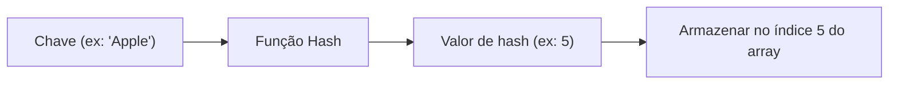
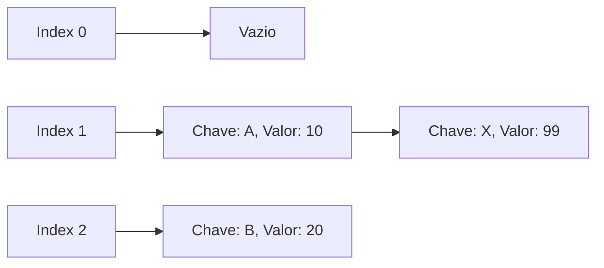

# Fundamentos e Importância dos Algoritmos de Busca

Na ciência da computação moderna, os **algoritmos de busca**, que encontram rapidamente o valor desejado dentre os dados, são uma tecnologia extremamente importante que constitui a base de todos os softwares e sistemas. Somos beneficiados diariamente pelos algoritmos de busca em pesquisas de banco de dados, busca de palavras-chave em navegadores web, pesquisa de nomes em aplicativos de contatos de smartphones, etc.

Neste artigo, explicaremos detalhadamente os algoritmos de "Busca Linear" (Linear Search) e "Busca Binária" (Binary Search), que são os fundamentos da ciência da computação, incluindo seus mecanismos, complexidade de tempo e exemplos de implementação em Python. Além disso, nos aprofundaremos nos princípios da "Tabela Hash" (Hash Table), que rompe os limites desses algoritmos para realizar velocidades de busca esmagadoras, no papel das funções hash e nos métodos de resolução de colisões de hash (Collision).


Aprofundar a compreensão sobre algoritmos de busca é indispensável para elevar as suas habilidades como programador. Se a quantidade de dados for pequena, o impacto da escolha do algoritmo no desempenho pode ser mínimo, mas na era do Big Data, escolher os algoritmos e estruturas de dados adequados torna-se de extrema importância para encontrar a informação desejada instantaneamente no meio de milhões ou bilhões de dados. Em particular, compreender o conceito de **complexidade de tempo** (como $O(n)$, $O(\log n)$, $O(1)$) é essencial na hora de projetar programas eficientes.

Aprofundar a compreensão sobre algoritmos de busca é indispensável para elevar as suas habilidades como programador. Se a quantidade de dados for pequena, o impacto da escolha do algoritmo no desempenho pode ser mínimo, mas na era do Big Data, escolher os algoritmos e estruturas de dados adequados torna-se de extrema importância para encontrar a informação desejada instantaneamente no meio de milhões ou bilhões de dados. Em particular, compreender o conceito de **complexidade de tempo** (como $O(n)$, $O(\log n)$, $O(1)$) é essencial na hora de projetar programas eficientes.

Aprofundar a compreensão sobre algoritmos de busca é indispensável para elevar as suas habilidades como programador. Se a quantidade de dados for pequena, o impacto da escolha do algoritmo no desempenho pode ser mínimo, mas na era do Big Data, escolher os algoritmos e estruturas de dados adequados torna-se de extrema importância para encontrar a informação desejada instantaneamente no meio de milhões ou bilhões de dados. Em particular, compreender o conceito de **complexidade de tempo** (como $O(n)$, $O(\log n)$, $O(1)$) é essencial na hora de projetar programas eficientes.

Aprofundar a compreensão sobre algoritmos de busca é indispensável para elevar as suas habilidades como programador. Se a quantidade de dados for pequena, o impacto da escolha do algoritmo no desempenho pode ser mínimo, mas na era do Big Data, escolher os algoritmos e estruturas de dados adequados torna-se de extrema importância para encontrar a informação desejada instantaneamente no meio de milhões ou bilhões de dados. Em particular, compreender o conceito de **complexidade de tempo** (como $O(n)$, $O(\log n)$, $O(1)$) é essencial na hora de projetar programas eficientes.

Aprofundar a compreensão sobre algoritmos de busca é indispensável para elevar as suas habilidades como programador. Se a quantidade de dados for pequena, o impacto da escolha do algoritmo no desempenho pode ser mínimo, mas na era do Big Data, escolher os algoritmos e estruturas de dados adequados torna-se de extrema importância para encontrar a informação desejada instantaneamente no meio de milhões ou bilhões de dados. Em particular, compreender o conceito de **complexidade de tempo** (como $O(n)$, $O(\log n)$, $O(1)$) é essencial na hora de projetar programas eficientes.

Aprofundar a compreensão sobre algoritmos de busca é indispensável para elevar as suas habilidades como programador. Se a quantidade de dados for pequena, o impacto da escolha do algoritmo no desempenho pode ser mínimo, mas na era do Big Data, escolher os algoritmos e estruturas de dados adequados torna-se de extrema importância para encontrar a informação desejada instantaneamente no meio de milhões ou bilhões de dados. Em particular, compreender o conceito de **complexidade de tempo** (como $O(n)$, $O(\log n)$, $O(1)$) é essencial na hora de projetar programas eficientes.

Aprofundar a compreensão sobre algoritmos de busca é indispensável para elevar as suas habilidades como programador. Se a quantidade de dados for pequena, o impacto da escolha do algoritmo no desempenho pode ser mínimo, mas na era do Big Data, escolher os algoritmos e estruturas de dados adequados torna-se de extrema importância para encontrar a informação desejada instantaneamente no meio de milhões ou bilhões de dados. Em particular, compreender o conceito de **complexidade de tempo** (como $O(n)$, $O(\log n)$, $O(1)$) é essencial na hora de projetar programas eficientes.

Aprofundar a compreensão sobre algoritmos de busca é indispensável para elevar as suas habilidades como programador. Se a quantidade de dados for pequena, o impacto da escolha do algoritmo no desempenho pode ser mínimo, mas na era do Big Data, escolher os algoritmos e estruturas de dados adequados torna-se de extrema importância para encontrar a informação desejada instantaneamente no meio de milhões ou bilhões de dados. Em particular, compreender o conceito de **complexidade de tempo** (como $O(n)$, $O(\log n)$, $O(1)$) é essencial na hora de projetar programas eficientes.

Aprofundar a compreensão sobre algoritmos de busca é indispensável para elevar as suas habilidades como programador. Se a quantidade de dados for pequena, o impacto da escolha do algoritmo no desempenho pode ser mínimo, mas na era do Big Data, escolher os algoritmos e estruturas de dados adequados torna-se de extrema importância para encontrar a informação desejada instantaneamente no meio de milhões ou bilhões de dados. Em particular, compreender o conceito de **complexidade de tempo** (como $O(n)$, $O(\log n)$, $O(1)$) é essencial na hora de projetar programas eficientes.

Aprofundar a compreensão sobre algoritmos de busca é indispensável para elevar as suas habilidades como programador. Se a quantidade de dados for pequena, o impacto da escolha do algoritmo no desempenho pode ser mínimo, mas na era do Big Data, escolher os algoritmos e estruturas de dados adequados torna-se de extrema importância para encontrar a informação desejada instantaneamente no meio de milhões ou bilhões de dados. Em particular, compreender o conceito de **complexidade de tempo** (como $O(n)$, $O(\log n)$, $O(1)$) é essencial na hora de projetar programas eficientes.

## 1. Busca Linear (Linear Search)

A busca linear é o algoritmo de busca mais simples e intuitivo, no qual os elementos de uma estrutura de dados (como um array ou lista) são verificados um a um, em ordem, do início ao fim, até que o valor desejado seja encontrado.

### 1.1 Mecanismo da Busca Linear

O algoritmo de busca linear procede com os seguintes passos:

1. Obtém o primeiro elemento do array.
2. Verifica se o elemento obtido corresponde ao valor desejado (alvo).
3. Caso corresponda, retorna o índice (posição) desse elemento e encerra a busca.
4. Caso não corresponda, avança para o próximo elemento.
5. Verifica até o final do array e, se o alvo não for encontrado, encerra como falha na busca (por exemplo, retornando `-1` ou `None`).

```mermaid
flowchart TD
    A["Início da Busca"] --> B["Índice i = 0"]
    B --> C{"i < Tamanho do array?"}
    C -- "Yes" --> D{"array["i"] == alvo?"}
    C -- "No" --> E["Falha na busca (não encontrado)"]
    D -- "Yes" --> F["Retornar índice i"]
    D -- "No" --> G["Incrementar i em 1"]
    G --> C
```

### 1.2 Implementação da Busca Linear em Python

Abaixo é mostrado um exemplo simples de implementação da busca linear usando Python.

```python
def linear_search(arr, target):
    """
    Função que executa a busca linear
    :param arr: Lista a ser pesquisada
    :param target: Valor que se deseja encontrar
    :return: O índice, se encontrado, caso contrário, -1
    """
    for i in range(len(arr)):
        if arr[i] == target:
            return i
    return -1

# Dados de teste
numbers = [10, 23, 4, 15, 2, 7, 34, 11]
target_value = 7

result_index = linear_search(numbers, target_value)
if result_index != -1:
    print(f"O elemento {target_value} foi encontrado no índice {result_index}.")
else:
    print(f"O elemento {target_value} não existe na lista.")
```


A maior característica da busca linear é que não é necessário que os dados estejam ordenados (sorteados). Mesmo que os dados estejam armazenados de forma aleatória, ao verificar em ordem a partir do início, é possível encontrar de forma certeira o valor desejado (ou confirmar que ele não existe). No entanto, essa propriedade de "verificar tudo em ordem" torna-se a maior causa da queda de desempenho quando a quantidade de dados aumenta.

A maior característica da busca linear é que não é necessário que os dados estejam ordenados (sorteados). Mesmo que os dados estejam armazenados de forma aleatória, ao verificar em ordem a partir do início, é possível encontrar de forma certeira o valor desejado (ou confirmar que ele não existe). No entanto, essa propriedade de "verificar tudo em ordem" torna-se a maior causa da queda de desempenho quando a quantidade de dados aumenta.

A maior característica da busca linear é que não é necessário que os dados estejam ordenados (sorteados). Mesmo que os dados estejam armazenados de forma aleatória, ao verificar em ordem a partir do início, é possível encontrar de forma certeira o valor desejado (ou confirmar que ele não existe). No entanto, essa propriedade de "verificar tudo em ordem" torna-se a maior causa da queda de desempenho quando a quantidade de dados aumenta.

A maior característica da busca linear é que não é necessário que os dados estejam ordenados (sorteados). Mesmo que os dados estejam armazenados de forma aleatória, ao verificar em ordem a partir do início, é possível encontrar de forma certeira o valor desejado (ou confirmar que ele não existe). No entanto, essa propriedade de "verificar tudo em ordem" torna-se a maior causa da queda de desempenho quando a quantidade de dados aumenta.

A maior característica da busca linear é que não é necessário que os dados estejam ordenados (sorteados). Mesmo que os dados estejam armazenados de forma aleatória, ao verificar em ordem a partir do início, é possível encontrar de forma certeira o valor desejado (ou confirmar que ele não existe). No entanto, essa propriedade de "verificar tudo em ordem" torna-se a maior causa da queda de desempenho quando a quantidade de dados aumenta.

A maior característica da busca linear é que não é necessário que os dados estejam ordenados (sorteados). Mesmo que os dados estejam armazenados de forma aleatória, ao verificar em ordem a partir do início, é possível encontrar de forma certeira o valor desejado (ou confirmar que ele não existe). No entanto, essa propriedade de "verificar tudo em ordem" torna-se a maior causa da queda de desempenho quando a quantidade de dados aumenta.

A maior característica da busca linear é que não é necessário que os dados estejam ordenados (sorteados). Mesmo que os dados estejam armazenados de forma aleatória, ao verificar em ordem a partir do início, é possível encontrar de forma certeira o valor desejado (ou confirmar que ele não existe). No entanto, essa propriedade de "verificar tudo em ordem" torna-se a maior causa da queda de desempenho quando a quantidade de dados aumenta.

A maior característica da busca linear é que não é necessário que os dados estejam ordenados (sorteados). Mesmo que os dados estejam armazenados de forma aleatória, ao verificar em ordem a partir do início, é possível encontrar de forma certeira o valor desejado (ou confirmar que ele não existe). No entanto, essa propriedade de "verificar tudo em ordem" torna-se a maior causa da queda de desempenho quando a quantidade de dados aumenta.

A maior característica da busca linear é que não é necessário que os dados estejam ordenados (sorteados). Mesmo que os dados estejam armazenados de forma aleatória, ao verificar em ordem a partir do início, é possível encontrar de forma certeira o valor desejado (ou confirmar que ele não existe). No entanto, essa propriedade de "verificar tudo em ordem" torna-se a maior causa da queda de desempenho quando a quantidade de dados aumenta.

A maior característica da busca linear é que não é necessário que os dados estejam ordenados (sorteados). Mesmo que os dados estejam armazenados de forma aleatória, ao verificar em ordem a partir do início, é possível encontrar de forma certeira o valor desejado (ou confirmar que ele não existe). No entanto, essa propriedade de "verificar tudo em ordem" torna-se a maior causa da queda de desempenho quando a quantidade de dados aumenta.

A maior característica da busca linear é que não é necessário que os dados estejam ordenados (sorteados). Mesmo que os dados estejam armazenados de forma aleatória, ao verificar em ordem a partir do início, é possível encontrar de forma certeira o valor desejado (ou confirmar que ele não existe). No entanto, essa propriedade de "verificar tudo em ordem" torna-se a maior causa da queda de desempenho quando a quantidade de dados aumenta.

A maior característica da busca linear é que não é necessário que os dados estejam ordenados (sorteados). Mesmo que os dados estejam armazenados de forma aleatória, ao verificar em ordem a partir do início, é possível encontrar de forma certeira o valor desejado (ou confirmar que ele não existe). No entanto, essa propriedade de "verificar tudo em ordem" torna-se a maior causa da queda de desempenho quando a quantidade de dados aumenta.

A maior característica da busca linear é que não é necessário que os dados estejam ordenados (sorteados). Mesmo que os dados estejam armazenados de forma aleatória, ao verificar em ordem a partir do início, é possível encontrar de forma certeira o valor desejado (ou confirmar que ele não existe). No entanto, essa propriedade de "verificar tudo em ordem" torna-se a maior causa da queda de desempenho quando a quantidade de dados aumenta.

A maior característica da busca linear é que não é necessário que os dados estejam ordenados (sorteados). Mesmo que os dados estejam armazenados de forma aleatória, ao verificar em ordem a partir do início, é possível encontrar de forma certeira o valor desejado (ou confirmar que ele não existe). No entanto, essa propriedade de "verificar tudo em ordem" torna-se a maior causa da queda de desempenho quando a quantidade de dados aumenta.

A maior característica da busca linear é que não é necessário que os dados estejam ordenados (sorteados). Mesmo que os dados estejam armazenados de forma aleatória, ao verificar em ordem a partir do início, é possível encontrar de forma certeira o valor desejado (ou confirmar que ele não existe). No entanto, essa propriedade de "verificar tudo em ordem" torna-se a maior causa da queda de desempenho quando a quantidade de dados aumenta.

A maior característica da busca linear é que não é necessário que os dados estejam ordenados (sorteados). Mesmo que os dados estejam armazenados de forma aleatória, ao verificar em ordem a partir do início, é possível encontrar de forma certeira o valor desejado (ou confirmar que ele não existe). No entanto, essa propriedade de "verificar tudo em ordem" torna-se a maior causa da queda de desempenho quando a quantidade de dados aumenta.

A maior característica da busca linear é que não é necessário que os dados estejam ordenados (sorteados). Mesmo que os dados estejam armazenados de forma aleatória, ao verificar em ordem a partir do início, é possível encontrar de forma certeira o valor desejado (ou confirmar que ele não existe). No entanto, essa propriedade de "verificar tudo em ordem" torna-se a maior causa da queda de desempenho quando a quantidade de dados aumenta.

A maior característica da busca linear é que não é necessário que os dados estejam ordenados (sorteados). Mesmo que os dados estejam armazenados de forma aleatória, ao verificar em ordem a partir do início, é possível encontrar de forma certeira o valor desejado (ou confirmar que ele não existe). No entanto, essa propriedade de "verificar tudo em ordem" torna-se a maior causa da queda de desempenho quando a quantidade de dados aumenta.

A maior característica da busca linear é que não é necessário que os dados estejam ordenados (sorteados). Mesmo que os dados estejam armazenados de forma aleatória, ao verificar em ordem a partir do início, é possível encontrar de forma certeira o valor desejado (ou confirmar que ele não existe). No entanto, essa propriedade de "verificar tudo em ordem" torna-se a maior causa da queda de desempenho quando a quantidade de dados aumenta.

A maior característica da busca linear é que não é necessário que os dados estejam ordenados (sorteados). Mesmo que os dados estejam armazenados de forma aleatória, ao verificar em ordem a partir do início, é possível encontrar de forma certeira o valor desejado (ou confirmar que ele não existe). No entanto, essa propriedade de "verificar tudo em ordem" torna-se a maior causa da queda de desempenho quando a quantidade de dados aumenta.

A maior característica da busca linear é que não é necessário que os dados estejam ordenados (sorteados). Mesmo que os dados estejam armazenados de forma aleatória, ao verificar em ordem a partir do início, é possível encontrar de forma certeira o valor desejado (ou confirmar que ele não existe). No entanto, essa propriedade de "verificar tudo em ordem" torna-se a maior causa da queda de desempenho quando a quantidade de dados aumenta.

A maior característica da busca linear é que não é necessário que os dados estejam ordenados (sorteados). Mesmo que os dados estejam armazenados de forma aleatória, ao verificar em ordem a partir do início, é possível encontrar de forma certeira o valor desejado (ou confirmar que ele não existe). No entanto, essa propriedade de "verificar tudo em ordem" torna-se a maior causa da queda de desempenho quando a quantidade de dados aumenta.

A maior característica da busca linear é que não é necessário que os dados estejam ordenados (sorteados). Mesmo que os dados estejam armazenados de forma aleatória, ao verificar em ordem a partir do início, é possível encontrar de forma certeira o valor desejado (ou confirmar que ele não existe). No entanto, essa propriedade de "verificar tudo em ordem" torna-se a maior causa da queda de desempenho quando a quantidade de dados aumenta.

A maior característica da busca linear é que não é necessário que os dados estejam ordenados (sorteados). Mesmo que os dados estejam armazenados de forma aleatória, ao verificar em ordem a partir do início, é possível encontrar de forma certeira o valor desejado (ou confirmar que ele não existe). No entanto, essa propriedade de "verificar tudo em ordem" torna-se a maior causa da queda de desempenho quando a quantidade de dados aumenta.

A maior característica da busca linear é que não é necessário que os dados estejam ordenados (sorteados). Mesmo que os dados estejam armazenados de forma aleatória, ao verificar em ordem a partir do início, é possível encontrar de forma certeira o valor desejado (ou confirmar que ele não existe). No entanto, essa propriedade de "verificar tudo em ordem" torna-se a maior causa da queda de desempenho quando a quantidade de dados aumenta.

A maior característica da busca linear é que não é necessário que os dados estejam ordenados (sorteados). Mesmo que os dados estejam armazenados de forma aleatória, ao verificar em ordem a partir do início, é possível encontrar de forma certeira o valor desejado (ou confirmar que ele não existe). No entanto, essa propriedade de "verificar tudo em ordem" torna-se a maior causa da queda de desempenho quando a quantidade de dados aumenta.

A maior característica da busca linear é que não é necessário que os dados estejam ordenados (sorteados). Mesmo que os dados estejam armazenados de forma aleatória, ao verificar em ordem a partir do início, é possível encontrar de forma certeira o valor desejado (ou confirmar que ele não existe). No entanto, essa propriedade de "verificar tudo em ordem" torna-se a maior causa da queda de desempenho quando a quantidade de dados aumenta.

A maior característica da busca linear é que não é necessário que os dados estejam ordenados (sorteados). Mesmo que os dados estejam armazenados de forma aleatória, ao verificar em ordem a partir do início, é possível encontrar de forma certeira o valor desejado (ou confirmar que ele não existe). No entanto, essa propriedade de "verificar tudo em ordem" torna-se a maior causa da queda de desempenho quando a quantidade de dados aumenta.

A maior característica da busca linear é que não é necessário que os dados estejam ordenados (sorteados). Mesmo que os dados estejam armazenados de forma aleatória, ao verificar em ordem a partir do início, é possível encontrar de forma certeira o valor desejado (ou confirmar que ele não existe). No entanto, essa propriedade de "verificar tudo em ordem" torna-se a maior causa da queda de desempenho quando a quantidade de dados aumenta.

A maior característica da busca linear é que não é necessário que os dados estejam ordenados (sorteados). Mesmo que os dados estejam armazenados de forma aleatória, ao verificar em ordem a partir do início, é possível encontrar de forma certeira o valor desejado (ou confirmar que ele não existe). No entanto, essa propriedade de "verificar tudo em ordem" torna-se a maior causa da queda de desempenho quando a quantidade de dados aumenta.

A maior característica da busca linear é que não é necessário que os dados estejam ordenados (sorteados). Mesmo que os dados estejam armazenados de forma aleatória, ao verificar em ordem a partir do início, é possível encontrar de forma certeira o valor desejado (ou confirmar que ele não existe). No entanto, essa propriedade de "verificar tudo em ordem" torna-se a maior causa da queda de desempenho quando a quantidade de dados aumenta.

A maior característica da busca linear é que não é necessário que os dados estejam ordenados (sorteados). Mesmo que os dados estejam armazenados de forma aleatória, ao verificar em ordem a partir do início, é possível encontrar de forma certeira o valor desejado (ou confirmar que ele não existe). No entanto, essa propriedade de "verificar tudo em ordem" torna-se a maior causa da queda de desempenho quando a quantidade de dados aumenta.

A maior característica da busca linear é que não é necessário que os dados estejam ordenados (sorteados). Mesmo que os dados estejam armazenados de forma aleatória, ao verificar em ordem a partir do início, é possível encontrar de forma certeira o valor desejado (ou confirmar que ele não existe). No entanto, essa propriedade de "verificar tudo em ordem" torna-se a maior causa da queda de desempenho quando a quantidade de dados aumenta.

A maior característica da busca linear é que não é necessário que os dados estejam ordenados (sorteados). Mesmo que os dados estejam armazenados de forma aleatória, ao verificar em ordem a partir do início, é possível encontrar de forma certeira o valor desejado (ou confirmar que ele não existe). No entanto, essa propriedade de "verificar tudo em ordem" torna-se a maior causa da queda de desempenho quando a quantidade de dados aumenta.

A maior característica da busca linear é que não é necessário que os dados estejam ordenados (sorteados). Mesmo que os dados estejam armazenados de forma aleatória, ao verificar em ordem a partir do início, é possível encontrar de forma certeira o valor desejado (ou confirmar que ele não existe). No entanto, essa propriedade de "verificar tudo em ordem" torna-se a maior causa da queda de desempenho quando a quantidade de dados aumenta.

A maior característica da busca linear é que não é necessário que os dados estejam ordenados (sorteados). Mesmo que os dados estejam armazenados de forma aleatória, ao verificar em ordem a partir do início, é possível encontrar de forma certeira o valor desejado (ou confirmar que ele não existe). No entanto, essa propriedade de "verificar tudo em ordem" torna-se a maior causa da queda de desempenho quando a quantidade de dados aumenta.

A maior característica da busca linear é que não é necessário que os dados estejam ordenados (sorteados). Mesmo que os dados estejam armazenados de forma aleatória, ao verificar em ordem a partir do início, é possível encontrar de forma certeira o valor desejado (ou confirmar que ele não existe). No entanto, essa propriedade de "verificar tudo em ordem" torna-se a maior causa da queda de desempenho quando a quantidade de dados aumenta.

A maior característica da busca linear é que não é necessário que os dados estejam ordenados (sorteados). Mesmo que os dados estejam armazenados de forma aleatória, ao verificar em ordem a partir do início, é possível encontrar de forma certeira o valor desejado (ou confirmar que ele não existe). No entanto, essa propriedade de "verificar tudo em ordem" torna-se a maior causa da queda de desempenho quando a quantidade de dados aumenta.

A maior característica da busca linear é que não é necessário que os dados estejam ordenados (sorteados). Mesmo que os dados estejam armazenados de forma aleatória, ao verificar em ordem a partir do início, é possível encontrar de forma certeira o valor desejado (ou confirmar que ele não existe). No entanto, essa propriedade de "verificar tudo em ordem" torna-se a maior causa da queda de desempenho quando a quantidade de dados aumenta.

A maior característica da busca linear é que não é necessário que os dados estejam ordenados (sorteados). Mesmo que os dados estejam armazenados de forma aleatória, ao verificar em ordem a partir do início, é possível encontrar de forma certeira o valor desejado (ou confirmar que ele não existe). No entanto, essa propriedade de "verificar tudo em ordem" torna-se a maior causa da queda de desempenho quando a quantidade de dados aumenta.

A maior característica da busca linear é que não é necessário que os dados estejam ordenados (sorteados). Mesmo que os dados estejam armazenados de forma aleatória, ao verificar em ordem a partir do início, é possível encontrar de forma certeira o valor desejado (ou confirmar que ele não existe). No entanto, essa propriedade de "verificar tudo em ordem" torna-se a maior causa da queda de desempenho quando a quantidade de dados aumenta.

A maior característica da busca linear é que não é necessário que os dados estejam ordenados (sorteados). Mesmo que os dados estejam armazenados de forma aleatória, ao verificar em ordem a partir do início, é possível encontrar de forma certeira o valor desejado (ou confirmar que ele não existe). No entanto, essa propriedade de "verificar tudo em ordem" torna-se a maior causa da queda de desempenho quando a quantidade de dados aumenta.

A maior característica da busca linear é que não é necessário que os dados estejam ordenados (sorteados). Mesmo que os dados estejam armazenados de forma aleatória, ao verificar em ordem a partir do início, é possível encontrar de forma certeira o valor desejado (ou confirmar que ele não existe). No entanto, essa propriedade de "verificar tudo em ordem" torna-se a maior causa da queda de desempenho quando a quantidade de dados aumenta.

A maior característica da busca linear é que não é necessário que os dados estejam ordenados (sorteados). Mesmo que os dados estejam armazenados de forma aleatória, ao verificar em ordem a partir do início, é possível encontrar de forma certeira o valor desejado (ou confirmar que ele não existe). No entanto, essa propriedade de "verificar tudo em ordem" torna-se a maior causa da queda de desempenho quando a quantidade de dados aumenta.

A maior característica da busca linear é que não é necessário que os dados estejam ordenados (sorteados). Mesmo que os dados estejam armazenados de forma aleatória, ao verificar em ordem a partir do início, é possível encontrar de forma certeira o valor desejado (ou confirmar que ele não existe). No entanto, essa propriedade de "verificar tudo em ordem" torna-se a maior causa da queda de desempenho quando a quantidade de dados aumenta.

A maior característica da busca linear é que não é necessário que os dados estejam ordenados (sorteados). Mesmo que os dados estejam armazenados de forma aleatória, ao verificar em ordem a partir do início, é possível encontrar de forma certeira o valor desejado (ou confirmar que ele não existe). No entanto, essa propriedade de "verificar tudo em ordem" torna-se a maior causa da queda de desempenho quando a quantidade de dados aumenta.

A maior característica da busca linear é que não é necessário que os dados estejam ordenados (sorteados). Mesmo que os dados estejam armazenados de forma aleatória, ao verificar em ordem a partir do início, é possível encontrar de forma certeira o valor desejado (ou confirmar que ele não existe). No entanto, essa propriedade de "verificar tudo em ordem" torna-se a maior causa da queda de desempenho quando a quantidade de dados aumenta.

A maior característica da busca linear é que não é necessário que os dados estejam ordenados (sorteados). Mesmo que os dados estejam armazenados de forma aleatória, ao verificar em ordem a partir do início, é possível encontrar de forma certeira o valor desejado (ou confirmar que ele não existe). No entanto, essa propriedade de "verificar tudo em ordem" torna-se a maior causa da queda de desempenho quando a quantidade de dados aumenta.

A maior característica da busca linear é que não é necessário que os dados estejam ordenados (sorteados). Mesmo que os dados estejam armazenados de forma aleatória, ao verificar em ordem a partir do início, é possível encontrar de forma certeira o valor desejado (ou confirmar que ele não existe). No entanto, essa propriedade de "verificar tudo em ordem" torna-se a maior causa da queda de desempenho quando a quantidade de dados aumenta.

A maior característica da busca linear é que não é necessário que os dados estejam ordenados (sorteados). Mesmo que os dados estejam armazenados de forma aleatória, ao verificar em ordem a partir do início, é possível encontrar de forma certeira o valor desejado (ou confirmar que ele não existe). No entanto, essa propriedade de "verificar tudo em ordem" torna-se a maior causa da queda de desempenho quando a quantidade de dados aumenta.

## 2. Busca Binária (Binary Search)

A busca binária é um algoritmo de busca muito rápido e eficiente que só pode ser aplicado em **dados previamente ordenados (crescente ou decrescente)**. Ao restringir o intervalo de busca pela metade a cada vez, reduz drasticamente a quantidade de cálculos.

### 2.1 Mecanismo da Busca Binária

A busca binária é realizada pelos seguintes passos:

1. Inicializa-se os índices da "extremidade esquerda (`low`)" e "extremidade direita (`high`)" do array a ser pesquisado.
2. Enquanto o intervalo de busca for válido (`low <= high`), repete o seguinte processamento.
3. Calcula o índice central (`mid`) do intervalo de busca.
4. Compara o elemento central (`arr[mid]`) com o valor desejado (alvo).
5. Caso corresponda, retorna `mid` e encerra.
6. Caso o elemento central seja menor que o alvo, significa que o alvo se encontra na metade direita, então atualiza a extremidade esquerda para `mid + 1`.
7. Caso o elemento central seja maior que o alvo, significa que o alvo se encontra na metade esquerda, então atualiza a extremidade direita para `mid - 1`.
8. Caso o intervalo de busca acabe e o alvo não for encontrado, encerra-se como falha na busca.

```mermaid
flowchart TD
    A["Início da Busca"] --> B["low = 0, high = len - 1"]
    B --> C{"low <= high?"}
    C -- "No" --> D["Falha na busca"]
    C -- "Yes" --> E["mid = (low + high) / 2"]
    E --> F{"arr["mid"] == target?"}
    F -- "Yes" --> G["Retornar mid"]
    F -- "No" --> H{"arr["mid"] < target?"}
    H -- "Yes" --> I["low = mid + 1"]
    H -- "No" --> J["high = mid - 1"]
    I --> C
    J --> C
```

### 2.2 Implementação da Busca Binária em Python (Método Iterativo)

```python
def binary_search(arr, target):
    """
    Função que executa a busca binária (método iterativo)
    :param arr: Lista ordenada a ser pesquisada
    :param target: Valor que se deseja encontrar
    :return: O índice, se encontrado, caso contrário, -1
    """
    low = 0
    high = len(arr) - 1

    while low <= high:
        mid = (low + high) // 2
        
        if arr[mid] == target:
            return mid
        elif arr[mid] < target:
            low = mid + 1
        else:
            high = mid - 1
            
    return -1

# Dados de teste (deve estar ordenado)
sorted_numbers = [2, 4, 7, 10, 11, 15, 23, 34]
target_value = 15

result_index = binary_search(sorted_numbers, target_value)
if result_index != -1:
    print(f"O elemento {target_value} foi encontrado no índice {result_index}.")
else:
    print(f"O elemento {target_value} não existe na lista.")
```

O incrível desempenho da busca binária vem da propriedade de dividir o intervalo de busca pela metade a cada iteração. Por exemplo, se realizarmos uma busca linear num array com 1 milhão de elementos, no pior caso seriam necessárias 1 milhão de comparações, mas se usarmos a busca binária, conseguimos encontrar o valor desejado com cerca de 20 comparações ($2^{20} \approx 1.000.000$). Por isso, em operações de busca em grandes conjuntos de dados, a busca binária apresenta uma superioridade avassaladora em comparação com a busca linear. Matematicamente, a complexidade de tempo da busca binária é expressa como $O(\log n)$.

O incrível desempenho da busca binária vem da propriedade de dividir o intervalo de busca pela metade a cada iteração. Por exemplo, se realizarmos uma busca linear num array com 1 milhão de elementos, no pior caso seriam necessárias 1 milhão de comparações, mas se usarmos a busca binária, conseguimos encontrar o valor desejado com cerca de 20 comparações ($2^{20} \approx 1.000.000$). Por isso, em operações de busca em grandes conjuntos de dados, a busca binária apresenta uma superioridade avassaladora em comparação com a busca linear. Matematicamente, a complexidade de tempo da busca binária é expressa como $O(\log n)$.

O incrível desempenho da busca binária vem da propriedade de dividir o intervalo de busca pela metade a cada iteração. Por exemplo, se realizarmos uma busca linear num array com 1 milhão de elementos, no pior caso seriam necessárias 1 milhão de comparações, mas se usarmos a busca binária, conseguimos encontrar o valor desejado com cerca de 20 comparações ($2^{20} \approx 1.000.000$). Por isso, em operações de busca em grandes conjuntos de dados, a busca binária apresenta uma superioridade avassaladora em comparação com a busca linear. Matematicamente, a complexidade de tempo da busca binária é expressa como $O(\log n)$.

O incrível desempenho da busca binária vem da propriedade de dividir o intervalo de busca pela metade a cada iteração. Por exemplo, se realizarmos uma busca linear num array com 1 milhão de elementos, no pior caso seriam necessárias 1 milhão de comparações, mas se usarmos a busca binária, conseguimos encontrar o valor desejado com cerca de 20 comparações ($2^{20} \approx 1.000.000$). Por isso, em operações de busca em grandes conjuntos de dados, a busca binária apresenta uma superioridade avassaladora em comparação com a busca linear. Matematicamente, a complexidade de tempo da busca binária é expressa como $O(\log n)$.

O incrível desempenho da busca binária vem da propriedade de dividir o intervalo de busca pela metade a cada iteração. Por exemplo, se realizarmos uma busca linear num array com 1 milhão de elementos, no pior caso seriam necessárias 1 milhão de comparações, mas se usarmos a busca binária, conseguimos encontrar o valor desejado com cerca de 20 comparações ($2^{20} \approx 1.000.000$). Por isso, em operações de busca em grandes conjuntos de dados, a busca binária apresenta uma superioridade avassaladora em comparação com a busca linear. Matematicamente, a complexidade de tempo da busca binária é expressa como $O(\log n)$.

O incrível desempenho da busca binária vem da propriedade de dividir o intervalo de busca pela metade a cada iteração. Por exemplo, se realizarmos uma busca linear num array com 1 milhão de elementos, no pior caso seriam necessárias 1 milhão de comparações, mas se usarmos a busca binária, conseguimos encontrar o valor desejado com cerca de 20 comparações ($2^{20} \approx 1.000.000$). Por isso, em operações de busca em grandes conjuntos de dados, a busca binária apresenta uma superioridade avassaladora em comparação com a busca linear. Matematicamente, a complexidade de tempo da busca binária é expressa como $O(\log n)$.

O incrível desempenho da busca binária vem da propriedade de dividir o intervalo de busca pela metade a cada iteração. Por exemplo, se realizarmos uma busca linear num array com 1 milhão de elementos, no pior caso seriam necessárias 1 milhão de comparações, mas se usarmos a busca binária, conseguimos encontrar o valor desejado com cerca de 20 comparações ($2^{20} \approx 1.000.000$). Por isso, em operações de busca em grandes conjuntos de dados, a busca binária apresenta uma superioridade avassaladora em comparação com a busca linear. Matematicamente, a complexidade de tempo da busca binária é expressa como $O(\log n)$.

O incrível desempenho da busca binária vem da propriedade de dividir o intervalo de busca pela metade a cada iteração. Por exemplo, se realizarmos uma busca linear num array com 1 milhão de elementos, no pior caso seriam necessárias 1 milhão de comparações, mas se usarmos a busca binária, conseguimos encontrar o valor desejado com cerca de 20 comparações ($2^{20} \approx 1.000.000$). Por isso, em operações de busca em grandes conjuntos de dados, a busca binária apresenta uma superioridade avassaladora em comparação com a busca linear. Matematicamente, a complexidade de tempo da busca binária é expressa como $O(\log n)$.

O incrível desempenho da busca binária vem da propriedade de dividir o intervalo de busca pela metade a cada iteração. Por exemplo, se realizarmos uma busca linear num array com 1 milhão de elementos, no pior caso seriam necessárias 1 milhão de comparações, mas se usarmos a busca binária, conseguimos encontrar o valor desejado com cerca de 20 comparações ($2^{20} \approx 1.000.000$). Por isso, em operações de busca em grandes conjuntos de dados, a busca binária apresenta uma superioridade avassaladora em comparação com a busca linear. Matematicamente, a complexidade de tempo da busca binária é expressa como $O(\log n)$.

O incrível desempenho da busca binária vem da propriedade de dividir o intervalo de busca pela metade a cada iteração. Por exemplo, se realizarmos uma busca linear num array com 1 milhão de elementos, no pior caso seriam necessárias 1 milhão de comparações, mas se usarmos a busca binária, conseguimos encontrar o valor desejado com cerca de 20 comparações ($2^{20} \approx 1.000.000$). Por isso, em operações de busca em grandes conjuntos de dados, a busca binária apresenta uma superioridade avassaladora em comparação com a busca linear. Matematicamente, a complexidade de tempo da busca binária é expressa como $O(\log n)$.

O incrível desempenho da busca binária vem da propriedade de dividir o intervalo de busca pela metade a cada iteração. Por exemplo, se realizarmos uma busca linear num array com 1 milhão de elementos, no pior caso seriam necessárias 1 milhão de comparações, mas se usarmos a busca binária, conseguimos encontrar o valor desejado com cerca de 20 comparações ($2^{20} \approx 1.000.000$). Por isso, em operações de busca em grandes conjuntos de dados, a busca binária apresenta uma superioridade avassaladora em comparação com a busca linear. Matematicamente, a complexidade de tempo da busca binária é expressa como $O(\log n)$.

O incrível desempenho da busca binária vem da propriedade de dividir o intervalo de busca pela metade a cada iteração. Por exemplo, se realizarmos uma busca linear num array com 1 milhão de elementos, no pior caso seriam necessárias 1 milhão de comparações, mas se usarmos a busca binária, conseguimos encontrar o valor desejado com cerca de 20 comparações ($2^{20} \approx 1.000.000$). Por isso, em operações de busca em grandes conjuntos de dados, a busca binária apresenta uma superioridade avassaladora em comparação com a busca linear. Matematicamente, a complexidade de tempo da busca binária é expressa como $O(\log n)$.

O incrível desempenho da busca binária vem da propriedade de dividir o intervalo de busca pela metade a cada iteração. Por exemplo, se realizarmos uma busca linear num array com 1 milhão de elementos, no pior caso seriam necessárias 1 milhão de comparações, mas se usarmos a busca binária, conseguimos encontrar o valor desejado com cerca de 20 comparações ($2^{20} \approx 1.000.000$). Por isso, em operações de busca em grandes conjuntos de dados, a busca binária apresenta uma superioridade avassaladora em comparação com a busca linear. Matematicamente, a complexidade de tempo da busca binária é expressa como $O(\log n)$.

O incrível desempenho da busca binária vem da propriedade de dividir o intervalo de busca pela metade a cada iteração. Por exemplo, se realizarmos uma busca linear num array com 1 milhão de elementos, no pior caso seriam necessárias 1 milhão de comparações, mas se usarmos a busca binária, conseguimos encontrar o valor desejado com cerca de 20 comparações ($2^{20} \approx 1.000.000$). Por isso, em operações de busca em grandes conjuntos de dados, a busca binária apresenta uma superioridade avassaladora em comparação com a busca linear. Matematicamente, a complexidade de tempo da busca binária é expressa como $O(\log n)$.

O incrível desempenho da busca binária vem da propriedade de dividir o intervalo de busca pela metade a cada iteração. Por exemplo, se realizarmos uma busca linear num array com 1 milhão de elementos, no pior caso seriam necessárias 1 milhão de comparações, mas se usarmos a busca binária, conseguimos encontrar o valor desejado com cerca de 20 comparações ($2^{20} \approx 1.000.000$). Por isso, em operações de busca em grandes conjuntos de dados, a busca binária apresenta uma superioridade avassaladora em comparação com a busca linear. Matematicamente, a complexidade de tempo da busca binária é expressa como $O(\log n)$.

O incrível desempenho da busca binária vem da propriedade de dividir o intervalo de busca pela metade a cada iteração. Por exemplo, se realizarmos uma busca linear num array com 1 milhão de elementos, no pior caso seriam necessárias 1 milhão de comparações, mas se usarmos a busca binária, conseguimos encontrar o valor desejado com cerca de 20 comparações ($2^{20} \approx 1.000.000$). Por isso, em operações de busca em grandes conjuntos de dados, a busca binária apresenta uma superioridade avassaladora em comparação com a busca linear. Matematicamente, a complexidade de tempo da busca binária é expressa como $O(\log n)$.

O incrível desempenho da busca binária vem da propriedade de dividir o intervalo de busca pela metade a cada iteração. Por exemplo, se realizarmos uma busca linear num array com 1 milhão de elementos, no pior caso seriam necessárias 1 milhão de comparações, mas se usarmos a busca binária, conseguimos encontrar o valor desejado com cerca de 20 comparações ($2^{20} \approx 1.000.000$). Por isso, em operações de busca em grandes conjuntos de dados, a busca binária apresenta uma superioridade avassaladora em comparação com a busca linear. Matematicamente, a complexidade de tempo da busca binária é expressa como $O(\log n)$.

O incrível desempenho da busca binária vem da propriedade de dividir o intervalo de busca pela metade a cada iteração. Por exemplo, se realizarmos uma busca linear num array com 1 milhão de elementos, no pior caso seriam necessárias 1 milhão de comparações, mas se usarmos a busca binária, conseguimos encontrar o valor desejado com cerca de 20 comparações ($2^{20} \approx 1.000.000$). Por isso, em operações de busca em grandes conjuntos de dados, a busca binária apresenta uma superioridade avassaladora em comparação com a busca linear. Matematicamente, a complexidade de tempo da busca binária é expressa como $O(\log n)$.

O incrível desempenho da busca binária vem da propriedade de dividir o intervalo de busca pela metade a cada iteração. Por exemplo, se realizarmos uma busca linear num array com 1 milhão de elementos, no pior caso seriam necessárias 1 milhão de comparações, mas se usarmos a busca binária, conseguimos encontrar o valor desejado com cerca de 20 comparações ($2^{20} \approx 1.000.000$). Por isso, em operações de busca em grandes conjuntos de dados, a busca binária apresenta uma superioridade avassaladora em comparação com a busca linear. Matematicamente, a complexidade de tempo da busca binária é expressa como $O(\log n)$.

O incrível desempenho da busca binária vem da propriedade de dividir o intervalo de busca pela metade a cada iteração. Por exemplo, se realizarmos uma busca linear num array com 1 milhão de elementos, no pior caso seriam necessárias 1 milhão de comparações, mas se usarmos a busca binária, conseguimos encontrar o valor desejado com cerca de 20 comparações ($2^{20} \approx 1.000.000$). Por isso, em operações de busca em grandes conjuntos de dados, a busca binária apresenta uma superioridade avassaladora em comparação com a busca linear. Matematicamente, a complexidade de tempo da busca binária é expressa como $O(\log n)$.

O incrível desempenho da busca binária vem da propriedade de dividir o intervalo de busca pela metade a cada iteração. Por exemplo, se realizarmos uma busca linear num array com 1 milhão de elementos, no pior caso seriam necessárias 1 milhão de comparações, mas se usarmos a busca binária, conseguimos encontrar o valor desejado com cerca de 20 comparações ($2^{20} \approx 1.000.000$). Por isso, em operações de busca em grandes conjuntos de dados, a busca binária apresenta uma superioridade avassaladora em comparação com a busca linear. Matematicamente, a complexidade de tempo da busca binária é expressa como $O(\log n)$.

O incrível desempenho da busca binária vem da propriedade de dividir o intervalo de busca pela metade a cada iteração. Por exemplo, se realizarmos uma busca linear num array com 1 milhão de elementos, no pior caso seriam necessárias 1 milhão de comparações, mas se usarmos a busca binária, conseguimos encontrar o valor desejado com cerca de 20 comparações ($2^{20} \approx 1.000.000$). Por isso, em operações de busca em grandes conjuntos de dados, a busca binária apresenta uma superioridade avassaladora em comparação com a busca linear. Matematicamente, a complexidade de tempo da busca binária é expressa como $O(\log n)$.

O incrível desempenho da busca binária vem da propriedade de dividir o intervalo de busca pela metade a cada iteração. Por exemplo, se realizarmos uma busca linear num array com 1 milhão de elementos, no pior caso seriam necessárias 1 milhão de comparações, mas se usarmos a busca binária, conseguimos encontrar o valor desejado com cerca de 20 comparações ($2^{20} \approx 1.000.000$). Por isso, em operações de busca em grandes conjuntos de dados, a busca binária apresenta uma superioridade avassaladora em comparação com a busca linear. Matematicamente, a complexidade de tempo da busca binária é expressa como $O(\log n)$.

O incrível desempenho da busca binária vem da propriedade de dividir o intervalo de busca pela metade a cada iteração. Por exemplo, se realizarmos uma busca linear num array com 1 milhão de elementos, no pior caso seriam necessárias 1 milhão de comparações, mas se usarmos a busca binária, conseguimos encontrar o valor desejado com cerca de 20 comparações ($2^{20} \approx 1.000.000$). Por isso, em operações de busca em grandes conjuntos de dados, a busca binária apresenta uma superioridade avassaladora em comparação com a busca linear. Matematicamente, a complexidade de tempo da busca binária é expressa como $O(\log n)$.

O incrível desempenho da busca binária vem da propriedade de dividir o intervalo de busca pela metade a cada iteração. Por exemplo, se realizarmos uma busca linear num array com 1 milhão de elementos, no pior caso seriam necessárias 1 milhão de comparações, mas se usarmos a busca binária, conseguimos encontrar o valor desejado com cerca de 20 comparações ($2^{20} \approx 1.000.000$). Por isso, em operações de busca em grandes conjuntos de dados, a busca binária apresenta uma superioridade avassaladora em comparação com a busca linear. Matematicamente, a complexidade de tempo da busca binária é expressa como $O(\log n)$.

O incrível desempenho da busca binária vem da propriedade de dividir o intervalo de busca pela metade a cada iteração. Por exemplo, se realizarmos uma busca linear num array com 1 milhão de elementos, no pior caso seriam necessárias 1 milhão de comparações, mas se usarmos a busca binária, conseguimos encontrar o valor desejado com cerca de 20 comparações ($2^{20} \approx 1.000.000$). Por isso, em operações de busca em grandes conjuntos de dados, a busca binária apresenta uma superioridade avassaladora em comparação com a busca linear. Matematicamente, a complexidade de tempo da busca binária é expressa como $O(\log n)$.

O incrível desempenho da busca binária vem da propriedade de dividir o intervalo de busca pela metade a cada iteração. Por exemplo, se realizarmos uma busca linear num array com 1 milhão de elementos, no pior caso seriam necessárias 1 milhão de comparações, mas se usarmos a busca binária, conseguimos encontrar o valor desejado com cerca de 20 comparações ($2^{20} \approx 1.000.000$). Por isso, em operações de busca em grandes conjuntos de dados, a busca binária apresenta uma superioridade avassaladora em comparação com a busca linear. Matematicamente, a complexidade de tempo da busca binária é expressa como $O(\log n)$.

O incrível desempenho da busca binária vem da propriedade de dividir o intervalo de busca pela metade a cada iteração. Por exemplo, se realizarmos uma busca linear num array com 1 milhão de elementos, no pior caso seriam necessárias 1 milhão de comparações, mas se usarmos a busca binária, conseguimos encontrar o valor desejado com cerca de 20 comparações ($2^{20} \approx 1.000.000$). Por isso, em operações de busca em grandes conjuntos de dados, a busca binária apresenta uma superioridade avassaladora em comparação com a busca linear. Matematicamente, a complexidade de tempo da busca binária é expressa como $O(\log n)$.

O incrível desempenho da busca binária vem da propriedade de dividir o intervalo de busca pela metade a cada iteração. Por exemplo, se realizarmos uma busca linear num array com 1 milhão de elementos, no pior caso seriam necessárias 1 milhão de comparações, mas se usarmos a busca binária, conseguimos encontrar o valor desejado com cerca de 20 comparações ($2^{20} \approx 1.000.000$). Por isso, em operações de busca em grandes conjuntos de dados, a busca binária apresenta uma superioridade avassaladora em comparação com a busca linear. Matematicamente, a complexidade de tempo da busca binária é expressa como $O(\log n)$.

O incrível desempenho da busca binária vem da propriedade de dividir o intervalo de busca pela metade a cada iteração. Por exemplo, se realizarmos uma busca linear num array com 1 milhão de elementos, no pior caso seriam necessárias 1 milhão de comparações, mas se usarmos a busca binária, conseguimos encontrar o valor desejado com cerca de 20 comparações ($2^{20} \approx 1.000.000$). Por isso, em operações de busca em grandes conjuntos de dados, a busca binária apresenta uma superioridade avassaladora em comparação com a busca linear. Matematicamente, a complexidade de tempo da busca binária é expressa como $O(\log n)$.

O incrível desempenho da busca binária vem da propriedade de dividir o intervalo de busca pela metade a cada iteração. Por exemplo, se realizarmos uma busca linear num array com 1 milhão de elementos, no pior caso seriam necessárias 1 milhão de comparações, mas se usarmos a busca binária, conseguimos encontrar o valor desejado com cerca de 20 comparações ($2^{20} \approx 1.000.000$). Por isso, em operações de busca em grandes conjuntos de dados, a busca binária apresenta uma superioridade avassaladora em comparação com a busca linear. Matematicamente, a complexidade de tempo da busca binária é expressa como $O(\log n)$.

O incrível desempenho da busca binária vem da propriedade de dividir o intervalo de busca pela metade a cada iteração. Por exemplo, se realizarmos uma busca linear num array com 1 milhão de elementos, no pior caso seriam necessárias 1 milhão de comparações, mas se usarmos a busca binária, conseguimos encontrar o valor desejado com cerca de 20 comparações ($2^{20} \approx 1.000.000$). Por isso, em operações de busca em grandes conjuntos de dados, a busca binária apresenta uma superioridade avassaladora em comparação com a busca linear. Matematicamente, a complexidade de tempo da busca binária é expressa como $O(\log n)$.

O incrível desempenho da busca binária vem da propriedade de dividir o intervalo de busca pela metade a cada iteração. Por exemplo, se realizarmos uma busca linear num array com 1 milhão de elementos, no pior caso seriam necessárias 1 milhão de comparações, mas se usarmos a busca binária, conseguimos encontrar o valor desejado com cerca de 20 comparações ($2^{20} \approx 1.000.000$). Por isso, em operações de busca em grandes conjuntos de dados, a busca binária apresenta uma superioridade avassaladora em comparação com a busca linear. Matematicamente, a complexidade de tempo da busca binária é expressa como $O(\log n)$.

O incrível desempenho da busca binária vem da propriedade de dividir o intervalo de busca pela metade a cada iteração. Por exemplo, se realizarmos uma busca linear num array com 1 milhão de elementos, no pior caso seriam necessárias 1 milhão de comparações, mas se usarmos a busca binária, conseguimos encontrar o valor desejado com cerca de 20 comparações ($2^{20} \approx 1.000.000$). Por isso, em operações de busca em grandes conjuntos de dados, a busca binária apresenta uma superioridade avassaladora em comparação com a busca linear. Matematicamente, a complexidade de tempo da busca binária é expressa como $O(\log n)$.

O incrível desempenho da busca binária vem da propriedade de dividir o intervalo de busca pela metade a cada iteração. Por exemplo, se realizarmos uma busca linear num array com 1 milhão de elementos, no pior caso seriam necessárias 1 milhão de comparações, mas se usarmos a busca binária, conseguimos encontrar o valor desejado com cerca de 20 comparações ($2^{20} \approx 1.000.000$). Por isso, em operações de busca em grandes conjuntos de dados, a busca binária apresenta uma superioridade avassaladora em comparação com a busca linear. Matematicamente, a complexidade de tempo da busca binária é expressa como $O(\log n)$.

O incrível desempenho da busca binária vem da propriedade de dividir o intervalo de busca pela metade a cada iteração. Por exemplo, se realizarmos uma busca linear num array com 1 milhão de elementos, no pior caso seriam necessárias 1 milhão de comparações, mas se usarmos a busca binária, conseguimos encontrar o valor desejado com cerca de 20 comparações ($2^{20} \approx 1.000.000$). Por isso, em operações de busca em grandes conjuntos de dados, a busca binária apresenta uma superioridade avassaladora em comparação com a busca linear. Matematicamente, a complexidade de tempo da busca binária é expressa como $O(\log n)$.

O incrível desempenho da busca binária vem da propriedade de dividir o intervalo de busca pela metade a cada iteração. Por exemplo, se realizarmos uma busca linear num array com 1 milhão de elementos, no pior caso seriam necessárias 1 milhão de comparações, mas se usarmos a busca binária, conseguimos encontrar o valor desejado com cerca de 20 comparações ($2^{20} \approx 1.000.000$). Por isso, em operações de busca em grandes conjuntos de dados, a busca binária apresenta uma superioridade avassaladora em comparação com a busca linear. Matematicamente, a complexidade de tempo da busca binária é expressa como $O(\log n)$.

O incrível desempenho da busca binária vem da propriedade de dividir o intervalo de busca pela metade a cada iteração. Por exemplo, se realizarmos uma busca linear num array com 1 milhão de elementos, no pior caso seriam necessárias 1 milhão de comparações, mas se usarmos a busca binária, conseguimos encontrar o valor desejado com cerca de 20 comparações ($2^{20} \approx 1.000.000$). Por isso, em operações de busca em grandes conjuntos de dados, a busca binária apresenta uma superioridade avassaladora em comparação com a busca linear. Matematicamente, a complexidade de tempo da busca binária é expressa como $O(\log n)$.

O incrível desempenho da busca binária vem da propriedade de dividir o intervalo de busca pela metade a cada iteração. Por exemplo, se realizarmos uma busca linear num array com 1 milhão de elementos, no pior caso seriam necessárias 1 milhão de comparações, mas se usarmos a busca binária, conseguimos encontrar o valor desejado com cerca de 20 comparações ($2^{20} \approx 1.000.000$). Por isso, em operações de busca em grandes conjuntos de dados, a busca binária apresenta uma superioridade avassaladora em comparação com a busca linear. Matematicamente, a complexidade de tempo da busca binária é expressa como $O(\log n)$.

O incrível desempenho da busca binária vem da propriedade de dividir o intervalo de busca pela metade a cada iteração. Por exemplo, se realizarmos uma busca linear num array com 1 milhão de elementos, no pior caso seriam necessárias 1 milhão de comparações, mas se usarmos a busca binária, conseguimos encontrar o valor desejado com cerca de 20 comparações ($2^{20} \approx 1.000.000$). Por isso, em operações de busca em grandes conjuntos de dados, a busca binária apresenta uma superioridade avassaladora em comparação com a busca linear. Matematicamente, a complexidade de tempo da busca binária é expressa como $O(\log n)$.

O incrível desempenho da busca binária vem da propriedade de dividir o intervalo de busca pela metade a cada iteração. Por exemplo, se realizarmos uma busca linear num array com 1 milhão de elementos, no pior caso seriam necessárias 1 milhão de comparações, mas se usarmos a busca binária, conseguimos encontrar o valor desejado com cerca de 20 comparações ($2^{20} \approx 1.000.000$). Por isso, em operações de busca em grandes conjuntos de dados, a busca binária apresenta uma superioridade avassaladora em comparação com a busca linear. Matematicamente, a complexidade de tempo da busca binária é expressa como $O(\log n)$.

O incrível desempenho da busca binária vem da propriedade de dividir o intervalo de busca pela metade a cada iteração. Por exemplo, se realizarmos uma busca linear num array com 1 milhão de elementos, no pior caso seriam necessárias 1 milhão de comparações, mas se usarmos a busca binária, conseguimos encontrar o valor desejado com cerca de 20 comparações ($2^{20} \approx 1.000.000$). Por isso, em operações de busca em grandes conjuntos de dados, a busca binária apresenta uma superioridade avassaladora em comparação com a busca linear. Matematicamente, a complexidade de tempo da busca binária é expressa como $O(\log n)$.

O incrível desempenho da busca binária vem da propriedade de dividir o intervalo de busca pela metade a cada iteração. Por exemplo, se realizarmos uma busca linear num array com 1 milhão de elementos, no pior caso seriam necessárias 1 milhão de comparações, mas se usarmos a busca binária, conseguimos encontrar o valor desejado com cerca de 20 comparações ($2^{20} \approx 1.000.000$). Por isso, em operações de busca em grandes conjuntos de dados, a busca binária apresenta uma superioridade avassaladora em comparação com a busca linear. Matematicamente, a complexidade de tempo da busca binária é expressa como $O(\log n)$.

O incrível desempenho da busca binária vem da propriedade de dividir o intervalo de busca pela metade a cada iteração. Por exemplo, se realizarmos uma busca linear num array com 1 milhão de elementos, no pior caso seriam necessárias 1 milhão de comparações, mas se usarmos a busca binária, conseguimos encontrar o valor desejado com cerca de 20 comparações ($2^{20} \approx 1.000.000$). Por isso, em operações de busca em grandes conjuntos de dados, a busca binária apresenta uma superioridade avassaladora em comparação com a busca linear. Matematicamente, a complexidade de tempo da busca binária é expressa como $O(\log n)$.

O incrível desempenho da busca binária vem da propriedade de dividir o intervalo de busca pela metade a cada iteração. Por exemplo, se realizarmos uma busca linear num array com 1 milhão de elementos, no pior caso seriam necessárias 1 milhão de comparações, mas se usarmos a busca binária, conseguimos encontrar o valor desejado com cerca de 20 comparações ($2^{20} \approx 1.000.000$). Por isso, em operações de busca em grandes conjuntos de dados, a busca binária apresenta uma superioridade avassaladora em comparação com a busca linear. Matematicamente, a complexidade de tempo da busca binária é expressa como $O(\log n)$.

O incrível desempenho da busca binária vem da propriedade de dividir o intervalo de busca pela metade a cada iteração. Por exemplo, se realizarmos uma busca linear num array com 1 milhão de elementos, no pior caso seriam necessárias 1 milhão de comparações, mas se usarmos a busca binária, conseguimos encontrar o valor desejado com cerca de 20 comparações ($2^{20} \approx 1.000.000$). Por isso, em operações de busca em grandes conjuntos de dados, a busca binária apresenta uma superioridade avassaladora em comparação com a busca linear. Matematicamente, a complexidade de tempo da busca binária é expressa como $O(\log n)$.

O incrível desempenho da busca binária vem da propriedade de dividir o intervalo de busca pela metade a cada iteração. Por exemplo, se realizarmos uma busca linear num array com 1 milhão de elementos, no pior caso seriam necessárias 1 milhão de comparações, mas se usarmos a busca binária, conseguimos encontrar o valor desejado com cerca de 20 comparações ($2^{20} \approx 1.000.000$). Por isso, em operações de busca em grandes conjuntos de dados, a busca binária apresenta uma superioridade avassaladora em comparação com a busca linear. Matematicamente, a complexidade de tempo da busca binária é expressa como $O(\log n)$.

O incrível desempenho da busca binária vem da propriedade de dividir o intervalo de busca pela metade a cada iteração. Por exemplo, se realizarmos uma busca linear num array com 1 milhão de elementos, no pior caso seriam necessárias 1 milhão de comparações, mas se usarmos a busca binária, conseguimos encontrar o valor desejado com cerca de 20 comparações ($2^{20} \approx 1.000.000$). Por isso, em operações de busca em grandes conjuntos de dados, a busca binária apresenta uma superioridade avassaladora em comparação com a busca linear. Matematicamente, a complexidade de tempo da busca binária é expressa como $O(\log n)$.

O incrível desempenho da busca binária vem da propriedade de dividir o intervalo de busca pela metade a cada iteração. Por exemplo, se realizarmos uma busca linear num array com 1 milhão de elementos, no pior caso seriam necessárias 1 milhão de comparações, mas se usarmos a busca binária, conseguimos encontrar o valor desejado com cerca de 20 comparações ($2^{20} \approx 1.000.000$). Por isso, em operações de busca em grandes conjuntos de dados, a busca binária apresenta uma superioridade avassaladora em comparação com a busca linear. Matematicamente, a complexidade de tempo da busca binária é expressa como $O(\log n)$.

O incrível desempenho da busca binária vem da propriedade de dividir o intervalo de busca pela metade a cada iteração. Por exemplo, se realizarmos uma busca linear num array com 1 milhão de elementos, no pior caso seriam necessárias 1 milhão de comparações, mas se usarmos a busca binária, conseguimos encontrar o valor desejado com cerca de 20 comparações ($2^{20} \approx 1.000.000$). Por isso, em operações de busca em grandes conjuntos de dados, a busca binária apresenta uma superioridade avassaladora em comparação com a busca linear. Matematicamente, a complexidade de tempo da busca binária é expressa como $O(\log n)$.

## 3. Princípios e Estrutura da Tabela Hash (Hash Table)

Em contraste com o $O(n)$ da busca linear e o $O(\log n)$ da busca binária, a **tabela hash** (ou mapa hash) é uma estrutura de dados que visa uma busca ainda mais rápida, em $O(1)$ (tempo constante). A tabela hash armazena pares de "Chave (Key)" e "Valor (Value)" e é um mecanismo poderoso que permite extrair valores instantaneamente através de suas chaves.

### 3.1 O Papel da Função Hash

Quem desempenha o papel central na tabela hash é a **função hash**. A função hash é uma função que recebe um dado arbitrário (chave) como entrada e produz um valor inteiro de tamanho fixo (valor de hash) como saída. Usando esse valor de hash, decide-se em qual índice de um array (bucket) os dados serão armazenados.

Uma função hash ideal precisa satisfazer as seguintes condições:
1. **Ser computacionalmente rápida**: Se o processo para calcular o valor de hash a partir da chave for demorado, o desempenho geral da busca irá diminuir.
2. **Ser determinística**: Se for inserida a mesma chave, o mesmo valor de hash deve ser gerado.
3. **Ter uma distribuição uniforme**: Exige-se que, ao inserir chaves diferentes, os valores de hash se dispersem uniformemente pelos vários índices do array (sem viés).



### 3.2 Adição e Busca de Dados na Tabela Hash

A adição (Insert) de dados na tabela hash é feita pelos seguintes passos:
1. Passa a chave do dado que deseja adicionar para a função hash e calcula o valor de hash.
2. Calcula o resto da divisão (operação módulo) do valor de hash calculado pelo tamanho do array da tabela hash e determina o índice real.
   `index = hash(key) % array_size`
3. Salva o par de chave e valor na posição do índice determinada.

De forma similar, a busca (Search) também calcula o valor de hash da chave que se deseja buscar, determina o índice e simplesmente verifica o dado naquela posição. Como o local de armazenamento pode ser calculado diretamente da chave, a busca é concluída instantaneamente, não importando a quantidade de dados (complexidade de tempo $O(1)$).

### 3.3 Colisão de Hash (Collision) e seus Métodos de Resolução

Como o intervalo de saída da função hash (tamanho do array) é limitado, pode ocorrer que chaves diferentes gerem o mesmo valor de hash (mesmo índice). Isso é chamado de **colisão de hash (Collision)**. Visto que colisões de hash são problemas inevitáveis, são necessários métodos adequados para resolvê-las.

#### 3.3.1 Encadeamento Separado (Separate Chaining)

O método de encadeamento é uma técnica que dá a cada índice do array uma "Lista Encadeada (Linked List)". Quando ocorre uma colisão de hash, os novos elementos são adicionados à lista encadeada do mesmo índice.



#### 3.3.2 Endereçamento Aberto (Open Addressing)

O método de endereçamento aberto é uma técnica que armazena todos os dados dentro do próprio array da tabela hash, sem utilizar estruturas de dados adicionais (como listas encadeadas). Quando ocorre uma colisão, procura-se por um "outro índice (bucket) livre" seguindo uma regra pré-determinada, e o dado é armazenado lá.

Dentre os métodos representativos para buscar espaços livres (métodos de sondagem), encontram-se os seguintes:
* **Sondagem Linear (Linear Probing)**: Procura pelo próximo espaço livre em sequência (+1, +2, ...) a partir do índice onde ocorreu a colisão.
* **Sondagem Quadrática (Quadratic Probing)**: Procura por espaço livre aumentando o intervalo com os quadrados, $1^2, 2^2, 3^2...$ a partir do índice de colisão.
* **Hashing Duplo (Double Hashing)**: Utiliza uma segunda função hash, diferente, para determinar o intervalo de sondagem pelo próximo espaço vazio.

### 3.4 Implementação da Tabela Hash em Python (Método de Encadeamento)

Abaixo, implementamos uma tabela hash simples provida de resolução de colisão por encadeamento utilizando Python.

```python
class Node:
    def __init__(self, key, value):
        self.key = key
        self.value = value
        self.next = None

class HashTable:
    def __init__(self, capacity=10):
        self.capacity = capacity
        self.size = 0
        self.table = [None] * self.capacity

    def _hash_function(self, key):
        return hash(key) % self.capacity

    def insert(self, key, value):
        index = self._hash_function(key)
        
        if self.table[index] is None:
            self.table[index] = Node(key, value)
            self.size += 1
        else:
            current = self.table[index]
            while current:
                if current.key == key:
                    current.value = value  # Se a chave já existir, atualiza o valor
                    return
                if current.next is None:
                    break
                current = current.next
            current.next = Node(key, value)
            self.size += 1

    def search(self, key):
        index = self._hash_function(key)
        current = self.table[index]
        
        while current:
            if current.key == key:
                return current.value
            current = current.next
            
        return None  # Caso a chave não seja encontrada

# Teste da tabela hash
ht = HashTable()
ht.insert("apple", 100)
ht.insert("banana", 200)
ht.insert("orange", 300)

print(f"Preço de apple: {ht.search('apple')} ienes")
print(f"Preço de banana: {ht.search('banana')} ienes")
print(f"Preço de grape: {ht.search('grape')} ienes")  # Chave inexistente
```

No design de uma tabela hash, a qualidade da função hash e o gerenciamento do tamanho do array (Fator de Carga: Load Factor) são extremamente importantes. Se o número de elementos dos dados ficar muito grande em relação ao tamanho do array (o fator de carga aumenta), colisões de hash ocorrerão com frequência; no método de encadeamento as listas encadeadas ficarão maiores e, no endereçamento aberto, o número de sondagens por espaços vazios aumentará. Como resultado, o tempo de busca se degradará de $O(1)$ para $O(n)$. Para prevenir isso, na implementação de muitas tabelas hash (como o dicionário integrado do Python `dict`), ocorre um processo chamado "Rehashing", onde, à medida que o número de elementos cresce, o tamanho do array se expande automaticamente, e o valor de hash de todos os elementos é recalculado para ser reposicionado.

No design de uma tabela hash, a qualidade da função hash e o gerenciamento do tamanho do array (Fator de Carga: Load Factor) são extremamente importantes. Se o número de elementos dos dados ficar muito grande em relação ao tamanho do array (o fator de carga aumenta), colisões de hash ocorrerão com frequência; no método de encadeamento as listas encadeadas ficarão maiores e, no endereçamento aberto, o número de sondagens por espaços vazios aumentará. Como resultado, o tempo de busca se degradará de $O(1)$ para $O(n)$. Para prevenir isso, na implementação de muitas tabelas hash (como o dicionário integrado do Python `dict`), ocorre um processo chamado "Rehashing", onde, à medida que o número de elementos cresce, o tamanho do array se expande automaticamente, e o valor de hash de todos os elementos é recalculado para ser reposicionado.

No design de uma tabela hash, a qualidade da função hash e o gerenciamento do tamanho do array (Fator de Carga: Load Factor) são extremamente importantes. Se o número de elementos dos dados ficar muito grande em relação ao tamanho do array (o fator de carga aumenta), colisões de hash ocorrerão com frequência; no método de encadeamento as listas encadeadas ficarão maiores e, no endereçamento aberto, o número de sondagens por espaços vazios aumentará. Como resultado, o tempo de busca se degradará de $O(1)$ para $O(n)$. Para prevenir isso, na implementação de muitas tabelas hash (como o dicionário integrado do Python `dict`), ocorre um processo chamado "Rehashing", onde, à medida que o número de elementos cresce, o tamanho do array se expande automaticamente, e o valor de hash de todos os elementos é recalculado para ser reposicionado.

No design de uma tabela hash, a qualidade da função hash e o gerenciamento do tamanho do array (Fator de Carga: Load Factor) são extremamente importantes. Se o número de elementos dos dados ficar muito grande em relação ao tamanho do array (o fator de carga aumenta), colisões de hash ocorrerão com frequência; no método de encadeamento as listas encadeadas ficarão maiores e, no endereçamento aberto, o número de sondagens por espaços vazios aumentará. Como resultado, o tempo de busca se degradará de $O(1)$ para $O(n)$. Para prevenir isso, na implementação de muitas tabelas hash (como o dicionário integrado do Python `dict`), ocorre um processo chamado "Rehashing", onde, à medida que o número de elementos cresce, o tamanho do array se expande automaticamente, e o valor de hash de todos os elementos é recalculado para ser reposicionado.

No design de uma tabela hash, a qualidade da função hash e o gerenciamento do tamanho do array (Fator de Carga: Load Factor) são extremamente importantes. Se o número de elementos dos dados ficar muito grande em relação ao tamanho do array (o fator de carga aumenta), colisões de hash ocorrerão com frequência; no método de encadeamento as listas encadeadas ficarão maiores e, no endereçamento aberto, o número de sondagens por espaços vazios aumentará. Como resultado, o tempo de busca se degradará de $O(1)$ para $O(n)$. Para prevenir isso, na implementação de muitas tabelas hash (como o dicionário integrado do Python `dict`), ocorre um processo chamado "Rehashing", onde, à medida que o número de elementos cresce, o tamanho do array se expande automaticamente, e o valor de hash de todos os elementos é recalculado para ser reposicionado.

No design de uma tabela hash, a qualidade da função hash e o gerenciamento do tamanho do array (Fator de Carga: Load Factor) são extremamente importantes. Se o número de elementos dos dados ficar muito grande em relação ao tamanho do array (o fator de carga aumenta), colisões de hash ocorrerão com frequência; no método de encadeamento as listas encadeadas ficarão maiores e, no endereçamento aberto, o número de sondagens por espaços vazios aumentará. Como resultado, o tempo de busca se degradará de $O(1)$ para $O(n)$. Para prevenir isso, na implementação de muitas tabelas hash (como o dicionário integrado do Python `dict`), ocorre um processo chamado "Rehashing", onde, à medida que o número de elementos cresce, o tamanho do array se expande automaticamente, e o valor de hash de todos os elementos é recalculado para ser reposicionado.

No design de uma tabela hash, a qualidade da função hash e o gerenciamento do tamanho do array (Fator de Carga: Load Factor) são extremamente importantes. Se o número de elementos dos dados ficar muito grande em relação ao tamanho do array (o fator de carga aumenta), colisões de hash ocorrerão com frequência; no método de encadeamento as listas encadeadas ficarão maiores e, no endereçamento aberto, o número de sondagens por espaços vazios aumentará. Como resultado, o tempo de busca se degradará de $O(1)$ para $O(n)$. Para prevenir isso, na implementação de muitas tabelas hash (como o dicionário integrado do Python `dict`), ocorre um processo chamado "Rehashing", onde, à medida que o número de elementos cresce, o tamanho do array se expande automaticamente, e o valor de hash de todos os elementos é recalculado para ser reposicionado.

No design de uma tabela hash, a qualidade da função hash e o gerenciamento do tamanho do array (Fator de Carga: Load Factor) são extremamente importantes. Se o número de elementos dos dados ficar muito grande em relação ao tamanho do array (o fator de carga aumenta), colisões de hash ocorrerão com frequência; no método de encadeamento as listas encadeadas ficarão maiores e, no endereçamento aberto, o número de sondagens por espaços vazios aumentará. Como resultado, o tempo de busca se degradará de $O(1)$ para $O(n)$. Para prevenir isso, na implementação de muitas tabelas hash (como o dicionário integrado do Python `dict`), ocorre um processo chamado "Rehashing", onde, à medida que o número de elementos cresce, o tamanho do array se expande automaticamente, e o valor de hash de todos os elementos é recalculado para ser reposicionado.

No design de uma tabela hash, a qualidade da função hash e o gerenciamento do tamanho do array (Fator de Carga: Load Factor) são extremamente importantes. Se o número de elementos dos dados ficar muito grande em relação ao tamanho do array (o fator de carga aumenta), colisões de hash ocorrerão com frequência; no método de encadeamento as listas encadeadas ficarão maiores e, no endereçamento aberto, o número de sondagens por espaços vazios aumentará. Como resultado, o tempo de busca se degradará de $O(1)$ para $O(n)$. Para prevenir isso, na implementação de muitas tabelas hash (como o dicionário integrado do Python `dict`), ocorre um processo chamado "Rehashing", onde, à medida que o número de elementos cresce, o tamanho do array se expande automaticamente, e o valor de hash de todos os elementos é recalculado para ser reposicionado.

No design de uma tabela hash, a qualidade da função hash e o gerenciamento do tamanho do array (Fator de Carga: Load Factor) são extremamente importantes. Se o número de elementos dos dados ficar muito grande em relação ao tamanho do array (o fator de carga aumenta), colisões de hash ocorrerão com frequência; no método de encadeamento as listas encadeadas ficarão maiores e, no endereçamento aberto, o número de sondagens por espaços vazios aumentará. Como resultado, o tempo de busca se degradará de $O(1)$ para $O(n)$. Para prevenir isso, na implementação de muitas tabelas hash (como o dicionário integrado do Python `dict`), ocorre um processo chamado "Rehashing", onde, à medida que o número de elementos cresce, o tamanho do array se expande automaticamente, e o valor de hash de todos os elementos é recalculado para ser reposicionado.

No design de uma tabela hash, a qualidade da função hash e o gerenciamento do tamanho do array (Fator de Carga: Load Factor) são extremamente importantes. Se o número de elementos dos dados ficar muito grande em relação ao tamanho do array (o fator de carga aumenta), colisões de hash ocorrerão com frequência; no método de encadeamento as listas encadeadas ficarão maiores e, no endereçamento aberto, o número de sondagens por espaços vazios aumentará. Como resultado, o tempo de busca se degradará de $O(1)$ para $O(n)$. Para prevenir isso, na implementação de muitas tabelas hash (como o dicionário integrado do Python `dict`), ocorre um processo chamado "Rehashing", onde, à medida que o número de elementos cresce, o tamanho do array se expande automaticamente, e o valor de hash de todos os elementos é recalculado para ser reposicionado.

No design de uma tabela hash, a qualidade da função hash e o gerenciamento do tamanho do array (Fator de Carga: Load Factor) são extremamente importantes. Se o número de elementos dos dados ficar muito grande em relação ao tamanho do array (o fator de carga aumenta), colisões de hash ocorrerão com frequência; no método de encadeamento as listas encadeadas ficarão maiores e, no endereçamento aberto, o número de sondagens por espaços vazios aumentará. Como resultado, o tempo de busca se degradará de $O(1)$ para $O(n)$. Para prevenir isso, na implementação de muitas tabelas hash (como o dicionário integrado do Python `dict`), ocorre um processo chamado "Rehashing", onde, à medida que o número de elementos cresce, o tamanho do array se expande automaticamente, e o valor de hash de todos os elementos é recalculado para ser reposicionado.

No design de uma tabela hash, a qualidade da função hash e o gerenciamento do tamanho do array (Fator de Carga: Load Factor) são extremamente importantes. Se o número de elementos dos dados ficar muito grande em relação ao tamanho do array (o fator de carga aumenta), colisões de hash ocorrerão com frequência; no método de encadeamento as listas encadeadas ficarão maiores e, no endereçamento aberto, o número de sondagens por espaços vazios aumentará. Como resultado, o tempo de busca se degradará de $O(1)$ para $O(n)$. Para prevenir isso, na implementação de muitas tabelas hash (como o dicionário integrado do Python `dict`), ocorre um processo chamado "Rehashing", onde, à medida que o número de elementos cresce, o tamanho do array se expande automaticamente, e o valor de hash de todos os elementos é recalculado para ser reposicionado.

No design de uma tabela hash, a qualidade da função hash e o gerenciamento do tamanho do array (Fator de Carga: Load Factor) são extremamente importantes. Se o número de elementos dos dados ficar muito grande em relação ao tamanho do array (o fator de carga aumenta), colisões de hash ocorrerão com frequência; no método de encadeamento as listas encadeadas ficarão maiores e, no endereçamento aberto, o número de sondagens por espaços vazios aumentará. Como resultado, o tempo de busca se degradará de $O(1)$ para $O(n)$. Para prevenir isso, na implementação de muitas tabelas hash (como o dicionário integrado do Python `dict`), ocorre um processo chamado "Rehashing", onde, à medida que o número de elementos cresce, o tamanho do array se expande automaticamente, e o valor de hash de todos os elementos é recalculado para ser reposicionado.

No design de uma tabela hash, a qualidade da função hash e o gerenciamento do tamanho do array (Fator de Carga: Load Factor) são extremamente importantes. Se o número de elementos dos dados ficar muito grande em relação ao tamanho do array (o fator de carga aumenta), colisões de hash ocorrerão com frequência; no método de encadeamento as listas encadeadas ficarão maiores e, no endereçamento aberto, o número de sondagens por espaços vazios aumentará. Como resultado, o tempo de busca se degradará de $O(1)$ para $O(n)$. Para prevenir isso, na implementação de muitas tabelas hash (como o dicionário integrado do Python `dict`), ocorre um processo chamado "Rehashing", onde, à medida que o número de elementos cresce, o tamanho do array se expande automaticamente, e o valor de hash de todos os elementos é recalculado para ser reposicionado.

No design de uma tabela hash, a qualidade da função hash e o gerenciamento do tamanho do array (Fator de Carga: Load Factor) são extremamente importantes. Se o número de elementos dos dados ficar muito grande em relação ao tamanho do array (o fator de carga aumenta), colisões de hash ocorrerão com frequência; no método de encadeamento as listas encadeadas ficarão maiores e, no endereçamento aberto, o número de sondagens por espaços vazios aumentará. Como resultado, o tempo de busca se degradará de $O(1)$ para $O(n)$. Para prevenir isso, na implementação de muitas tabelas hash (como o dicionário integrado do Python `dict`), ocorre um processo chamado "Rehashing", onde, à medida que o número de elementos cresce, o tamanho do array se expande automaticamente, e o valor de hash de todos os elementos é recalculado para ser reposicionado.

No design de uma tabela hash, a qualidade da função hash e o gerenciamento do tamanho do array (Fator de Carga: Load Factor) são extremamente importantes. Se o número de elementos dos dados ficar muito grande em relação ao tamanho do array (o fator de carga aumenta), colisões de hash ocorrerão com frequência; no método de encadeamento as listas encadeadas ficarão maiores e, no endereçamento aberto, o número de sondagens por espaços vazios aumentará. Como resultado, o tempo de busca se degradará de $O(1)$ para $O(n)$. Para prevenir isso, na implementação de muitas tabelas hash (como o dicionário integrado do Python `dict`), ocorre um processo chamado "Rehashing", onde, à medida que o número de elementos cresce, o tamanho do array se expande automaticamente, e o valor de hash de todos os elementos é recalculado para ser reposicionado.

No design de uma tabela hash, a qualidade da função hash e o gerenciamento do tamanho do array (Fator de Carga: Load Factor) são extremamente importantes. Se o número de elementos dos dados ficar muito grande em relação ao tamanho do array (o fator de carga aumenta), colisões de hash ocorrerão com frequência; no método de encadeamento as listas encadeadas ficarão maiores e, no endereçamento aberto, o número de sondagens por espaços vazios aumentará. Como resultado, o tempo de busca se degradará de $O(1)$ para $O(n)$. Para prevenir isso, na implementação de muitas tabelas hash (como o dicionário integrado do Python `dict`), ocorre um processo chamado "Rehashing", onde, à medida que o número de elementos cresce, o tamanho do array se expande automaticamente, e o valor de hash de todos os elementos é recalculado para ser reposicionado.

No design de uma tabela hash, a qualidade da função hash e o gerenciamento do tamanho do array (Fator de Carga: Load Factor) são extremamente importantes. Se o número de elementos dos dados ficar muito grande em relação ao tamanho do array (o fator de carga aumenta), colisões de hash ocorrerão com frequência; no método de encadeamento as listas encadeadas ficarão maiores e, no endereçamento aberto, o número de sondagens por espaços vazios aumentará. Como resultado, o tempo de busca se degradará de $O(1)$ para $O(n)$. Para prevenir isso, na implementação de muitas tabelas hash (como o dicionário integrado do Python `dict`), ocorre um processo chamado "Rehashing", onde, à medida que o número de elementos cresce, o tamanho do array se expande automaticamente, e o valor de hash de todos os elementos é recalculado para ser reposicionado.

No design de uma tabela hash, a qualidade da função hash e o gerenciamento do tamanho do array (Fator de Carga: Load Factor) são extremamente importantes. Se o número de elementos dos dados ficar muito grande em relação ao tamanho do array (o fator de carga aumenta), colisões de hash ocorrerão com frequência; no método de encadeamento as listas encadeadas ficarão maiores e, no endereçamento aberto, o número de sondagens por espaços vazios aumentará. Como resultado, o tempo de busca se degradará de $O(1)$ para $O(n)$. Para prevenir isso, na implementação de muitas tabelas hash (como o dicionário integrado do Python `dict`), ocorre um processo chamado "Rehashing", onde, à medida que o número de elementos cresce, o tamanho do array se expande automaticamente, e o valor de hash de todos os elementos é recalculado para ser reposicionado.

No design de uma tabela hash, a qualidade da função hash e o gerenciamento do tamanho do array (Fator de Carga: Load Factor) são extremamente importantes. Se o número de elementos dos dados ficar muito grande em relação ao tamanho do array (o fator de carga aumenta), colisões de hash ocorrerão com frequência; no método de encadeamento as listas encadeadas ficarão maiores e, no endereçamento aberto, o número de sondagens por espaços vazios aumentará. Como resultado, o tempo de busca se degradará de $O(1)$ para $O(n)$. Para prevenir isso, na implementação de muitas tabelas hash (como o dicionário integrado do Python `dict`), ocorre um processo chamado "Rehashing", onde, à medida que o número de elementos cresce, o tamanho do array se expande automaticamente, e o valor de hash de todos os elementos é recalculado para ser reposicionado.

No design de uma tabela hash, a qualidade da função hash e o gerenciamento do tamanho do array (Fator de Carga: Load Factor) são extremamente importantes. Se o número de elementos dos dados ficar muito grande em relação ao tamanho do array (o fator de carga aumenta), colisões de hash ocorrerão com frequência; no método de encadeamento as listas encadeadas ficarão maiores e, no endereçamento aberto, o número de sondagens por espaços vazios aumentará. Como resultado, o tempo de busca se degradará de $O(1)$ para $O(n)$. Para prevenir isso, na implementação de muitas tabelas hash (como o dicionário integrado do Python `dict`), ocorre um processo chamado "Rehashing", onde, à medida que o número de elementos cresce, o tamanho do array se expande automaticamente, e o valor de hash de todos os elementos é recalculado para ser reposicionado.

No design de uma tabela hash, a qualidade da função hash e o gerenciamento do tamanho do array (Fator de Carga: Load Factor) são extremamente importantes. Se o número de elementos dos dados ficar muito grande em relação ao tamanho do array (o fator de carga aumenta), colisões de hash ocorrerão com frequência; no método de encadeamento as listas encadeadas ficarão maiores e, no endereçamento aberto, o número de sondagens por espaços vazios aumentará. Como resultado, o tempo de busca se degradará de $O(1)$ para $O(n)$. Para prevenir isso, na implementação de muitas tabelas hash (como o dicionário integrado do Python `dict`), ocorre um processo chamado "Rehashing", onde, à medida que o número de elementos cresce, o tamanho do array se expande automaticamente, e o valor de hash de todos os elementos é recalculado para ser reposicionado.

No design de uma tabela hash, a qualidade da função hash e o gerenciamento do tamanho do array (Fator de Carga: Load Factor) são extremamente importantes. Se o número de elementos dos dados ficar muito grande em relação ao tamanho do array (o fator de carga aumenta), colisões de hash ocorrerão com frequência; no método de encadeamento as listas encadeadas ficarão maiores e, no endereçamento aberto, o número de sondagens por espaços vazios aumentará. Como resultado, o tempo de busca se degradará de $O(1)$ para $O(n)$. Para prevenir isso, na implementação de muitas tabelas hash (como o dicionário integrado do Python `dict`), ocorre um processo chamado "Rehashing", onde, à medida que o número de elementos cresce, o tamanho do array se expande automaticamente, e o valor de hash de todos os elementos é recalculado para ser reposicionado.

No design de uma tabela hash, a qualidade da função hash e o gerenciamento do tamanho do array (Fator de Carga: Load Factor) são extremamente importantes. Se o número de elementos dos dados ficar muito grande em relação ao tamanho do array (o fator de carga aumenta), colisões de hash ocorrerão com frequência; no método de encadeamento as listas encadeadas ficarão maiores e, no endereçamento aberto, o número de sondagens por espaços vazios aumentará. Como resultado, o tempo de busca se degradará de $O(1)$ para $O(n)$. Para prevenir isso, na implementação de muitas tabelas hash (como o dicionário integrado do Python `dict`), ocorre um processo chamado "Rehashing", onde, à medida que o número de elementos cresce, o tamanho do array se expande automaticamente, e o valor de hash de todos os elementos é recalculado para ser reposicionado.

No design de uma tabela hash, a qualidade da função hash e o gerenciamento do tamanho do array (Fator de Carga: Load Factor) são extremamente importantes. Se o número de elementos dos dados ficar muito grande em relação ao tamanho do array (o fator de carga aumenta), colisões de hash ocorrerão com frequência; no método de encadeamento as listas encadeadas ficarão maiores e, no endereçamento aberto, o número de sondagens por espaços vazios aumentará. Como resultado, o tempo de busca se degradará de $O(1)$ para $O(n)$. Para prevenir isso, na implementação de muitas tabelas hash (como o dicionário integrado do Python `dict`), ocorre um processo chamado "Rehashing", onde, à medida que o número de elementos cresce, o tamanho do array se expande automaticamente, e o valor de hash de todos os elementos é recalculado para ser reposicionado.

No design de uma tabela hash, a qualidade da função hash e o gerenciamento do tamanho do array (Fator de Carga: Load Factor) são extremamente importantes. Se o número de elementos dos dados ficar muito grande em relação ao tamanho do array (o fator de carga aumenta), colisões de hash ocorrerão com frequência; no método de encadeamento as listas encadeadas ficarão maiores e, no endereçamento aberto, o número de sondagens por espaços vazios aumentará. Como resultado, o tempo de busca se degradará de $O(1)$ para $O(n)$. Para prevenir isso, na implementação de muitas tabelas hash (como o dicionário integrado do Python `dict`), ocorre um processo chamado "Rehashing", onde, à medida que o número de elementos cresce, o tamanho do array se expande automaticamente, e o valor de hash de todos os elementos é recalculado para ser reposicionado.

No design de uma tabela hash, a qualidade da função hash e o gerenciamento do tamanho do array (Fator de Carga: Load Factor) são extremamente importantes. Se o número de elementos dos dados ficar muito grande em relação ao tamanho do array (o fator de carga aumenta), colisões de hash ocorrerão com frequência; no método de encadeamento as listas encadeadas ficarão maiores e, no endereçamento aberto, o número de sondagens por espaços vazios aumentará. Como resultado, o tempo de busca se degradará de $O(1)$ para $O(n)$. Para prevenir isso, na implementação de muitas tabelas hash (como o dicionário integrado do Python `dict`), ocorre um processo chamado "Rehashing", onde, à medida que o número de elementos cresce, o tamanho do array se expande automaticamente, e o valor de hash de todos os elementos é recalculado para ser reposicionado.

No design de uma tabela hash, a qualidade da função hash e o gerenciamento do tamanho do array (Fator de Carga: Load Factor) são extremamente importantes. Se o número de elementos dos dados ficar muito grande em relação ao tamanho do array (o fator de carga aumenta), colisões de hash ocorrerão com frequência; no método de encadeamento as listas encadeadas ficarão maiores e, no endereçamento aberto, o número de sondagens por espaços vazios aumentará. Como resultado, o tempo de busca se degradará de $O(1)$ para $O(n)$. Para prevenir isso, na implementação de muitas tabelas hash (como o dicionário integrado do Python `dict`), ocorre um processo chamado "Rehashing", onde, à medida que o número de elementos cresce, o tamanho do array se expande automaticamente, e o valor de hash de todos os elementos é recalculado para ser reposicionado.

No design de uma tabela hash, a qualidade da função hash e o gerenciamento do tamanho do array (Fator de Carga: Load Factor) são extremamente importantes. Se o número de elementos dos dados ficar muito grande em relação ao tamanho do array (o fator de carga aumenta), colisões de hash ocorrerão com frequência; no método de encadeamento as listas encadeadas ficarão maiores e, no endereçamento aberto, o número de sondagens por espaços vazios aumentará. Como resultado, o tempo de busca se degradará de $O(1)$ para $O(n)$. Para prevenir isso, na implementação de muitas tabelas hash (como o dicionário integrado do Python `dict`), ocorre um processo chamado "Rehashing", onde, à medida que o número de elementos cresce, o tamanho do array se expande automaticamente, e o valor de hash de todos os elementos é recalculado para ser reposicionado.

No design de uma tabela hash, a qualidade da função hash e o gerenciamento do tamanho do array (Fator de Carga: Load Factor) são extremamente importantes. Se o número de elementos dos dados ficar muito grande em relação ao tamanho do array (o fator de carga aumenta), colisões de hash ocorrerão com frequência; no método de encadeamento as listas encadeadas ficarão maiores e, no endereçamento aberto, o número de sondagens por espaços vazios aumentará. Como resultado, o tempo de busca se degradará de $O(1)$ para $O(n)$. Para prevenir isso, na implementação de muitas tabelas hash (como o dicionário integrado do Python `dict`), ocorre um processo chamado "Rehashing", onde, à medida que o número de elementos cresce, o tamanho do array se expande automaticamente, e o valor de hash de todos os elementos é recalculado para ser reposicionado.

No design de uma tabela hash, a qualidade da função hash e o gerenciamento do tamanho do array (Fator de Carga: Load Factor) são extremamente importantes. Se o número de elementos dos dados ficar muito grande em relação ao tamanho do array (o fator de carga aumenta), colisões de hash ocorrerão com frequência; no método de encadeamento as listas encadeadas ficarão maiores e, no endereçamento aberto, o número de sondagens por espaços vazios aumentará. Como resultado, o tempo de busca se degradará de $O(1)$ para $O(n)$. Para prevenir isso, na implementação de muitas tabelas hash (como o dicionário integrado do Python `dict`), ocorre um processo chamado "Rehashing", onde, à medida que o número de elementos cresce, o tamanho do array se expande automaticamente, e o valor de hash de todos os elementos é recalculado para ser reposicionado.

No design de uma tabela hash, a qualidade da função hash e o gerenciamento do tamanho do array (Fator de Carga: Load Factor) são extremamente importantes. Se o número de elementos dos dados ficar muito grande em relação ao tamanho do array (o fator de carga aumenta), colisões de hash ocorrerão com frequência; no método de encadeamento as listas encadeadas ficarão maiores e, no endereçamento aberto, o número de sondagens por espaços vazios aumentará. Como resultado, o tempo de busca se degradará de $O(1)$ para $O(n)$. Para prevenir isso, na implementação de muitas tabelas hash (como o dicionário integrado do Python `dict`), ocorre um processo chamado "Rehashing", onde, à medida que o número de elementos cresce, o tamanho do array se expande automaticamente, e o valor de hash de todos os elementos é recalculado para ser reposicionado.

No design de uma tabela hash, a qualidade da função hash e o gerenciamento do tamanho do array (Fator de Carga: Load Factor) são extremamente importantes. Se o número de elementos dos dados ficar muito grande em relação ao tamanho do array (o fator de carga aumenta), colisões de hash ocorrerão com frequência; no método de encadeamento as listas encadeadas ficarão maiores e, no endereçamento aberto, o número de sondagens por espaços vazios aumentará. Como resultado, o tempo de busca se degradará de $O(1)$ para $O(n)$. Para prevenir isso, na implementação de muitas tabelas hash (como o dicionário integrado do Python `dict`), ocorre um processo chamado "Rehashing", onde, à medida que o número de elementos cresce, o tamanho do array se expande automaticamente, e o valor de hash de todos os elementos é recalculado para ser reposicionado.

No design de uma tabela hash, a qualidade da função hash e o gerenciamento do tamanho do array (Fator de Carga: Load Factor) são extremamente importantes. Se o número de elementos dos dados ficar muito grande em relação ao tamanho do array (o fator de carga aumenta), colisões de hash ocorrerão com frequência; no método de encadeamento as listas encadeadas ficarão maiores e, no endereçamento aberto, o número de sondagens por espaços vazios aumentará. Como resultado, o tempo de busca se degradará de $O(1)$ para $O(n)$. Para prevenir isso, na implementação de muitas tabelas hash (como o dicionário integrado do Python `dict`), ocorre um processo chamado "Rehashing", onde, à medida que o número de elementos cresce, o tamanho do array se expande automaticamente, e o valor de hash de todos os elementos é recalculado para ser reposicionado.

No design de uma tabela hash, a qualidade da função hash e o gerenciamento do tamanho do array (Fator de Carga: Load Factor) são extremamente importantes. Se o número de elementos dos dados ficar muito grande em relação ao tamanho do array (o fator de carga aumenta), colisões de hash ocorrerão com frequência; no método de encadeamento as listas encadeadas ficarão maiores e, no endereçamento aberto, o número de sondagens por espaços vazios aumentará. Como resultado, o tempo de busca se degradará de $O(1)$ para $O(n)$. Para prevenir isso, na implementação de muitas tabelas hash (como o dicionário integrado do Python `dict`), ocorre um processo chamado "Rehashing", onde, à medida que o número de elementos cresce, o tamanho do array se expande automaticamente, e o valor de hash de todos os elementos é recalculado para ser reposicionado.

No design de uma tabela hash, a qualidade da função hash e o gerenciamento do tamanho do array (Fator de Carga: Load Factor) são extremamente importantes. Se o número de elementos dos dados ficar muito grande em relação ao tamanho do array (o fator de carga aumenta), colisões de hash ocorrerão com frequência; no método de encadeamento as listas encadeadas ficarão maiores e, no endereçamento aberto, o número de sondagens por espaços vazios aumentará. Como resultado, o tempo de busca se degradará de $O(1)$ para $O(n)$. Para prevenir isso, na implementação de muitas tabelas hash (como o dicionário integrado do Python `dict`), ocorre um processo chamado "Rehashing", onde, à medida que o número de elementos cresce, o tamanho do array se expande automaticamente, e o valor de hash de todos os elementos é recalculado para ser reposicionado.

No design de uma tabela hash, a qualidade da função hash e o gerenciamento do tamanho do array (Fator de Carga: Load Factor) são extremamente importantes. Se o número de elementos dos dados ficar muito grande em relação ao tamanho do array (o fator de carga aumenta), colisões de hash ocorrerão com frequência; no método de encadeamento as listas encadeadas ficarão maiores e, no endereçamento aberto, o número de sondagens por espaços vazios aumentará. Como resultado, o tempo de busca se degradará de $O(1)$ para $O(n)$. Para prevenir isso, na implementação de muitas tabelas hash (como o dicionário integrado do Python `dict`), ocorre um processo chamado "Rehashing", onde, à medida que o número de elementos cresce, o tamanho do array se expande automaticamente, e o valor de hash de todos os elementos é recalculado para ser reposicionado.

No design de uma tabela hash, a qualidade da função hash e o gerenciamento do tamanho do array (Fator de Carga: Load Factor) são extremamente importantes. Se o número de elementos dos dados ficar muito grande em relação ao tamanho do array (o fator de carga aumenta), colisões de hash ocorrerão com frequência; no método de encadeamento as listas encadeadas ficarão maiores e, no endereçamento aberto, o número de sondagens por espaços vazios aumentará. Como resultado, o tempo de busca se degradará de $O(1)$ para $O(n)$. Para prevenir isso, na implementação de muitas tabelas hash (como o dicionário integrado do Python `dict`), ocorre um processo chamado "Rehashing", onde, à medida que o número de elementos cresce, o tamanho do array se expande automaticamente, e o valor de hash de todos os elementos é recalculado para ser reposicionado.

No design de uma tabela hash, a qualidade da função hash e o gerenciamento do tamanho do array (Fator de Carga: Load Factor) são extremamente importantes. Se o número de elementos dos dados ficar muito grande em relação ao tamanho do array (o fator de carga aumenta), colisões de hash ocorrerão com frequência; no método de encadeamento as listas encadeadas ficarão maiores e, no endereçamento aberto, o número de sondagens por espaços vazios aumentará. Como resultado, o tempo de busca se degradará de $O(1)$ para $O(n)$. Para prevenir isso, na implementação de muitas tabelas hash (como o dicionário integrado do Python `dict`), ocorre um processo chamado "Rehashing", onde, à medida que o número de elementos cresce, o tamanho do array se expande automaticamente, e o valor de hash de todos os elementos é recalculado para ser reposicionado.

No design de uma tabela hash, a qualidade da função hash e o gerenciamento do tamanho do array (Fator de Carga: Load Factor) são extremamente importantes. Se o número de elementos dos dados ficar muito grande em relação ao tamanho do array (o fator de carga aumenta), colisões de hash ocorrerão com frequência; no método de encadeamento as listas encadeadas ficarão maiores e, no endereçamento aberto, o número de sondagens por espaços vazios aumentará. Como resultado, o tempo de busca se degradará de $O(1)$ para $O(n)$. Para prevenir isso, na implementação de muitas tabelas hash (como o dicionário integrado do Python `dict`), ocorre um processo chamado "Rehashing", onde, à medida que o número de elementos cresce, o tamanho do array se expande automaticamente, e o valor de hash de todos os elementos é recalculado para ser reposicionado.

No design de uma tabela hash, a qualidade da função hash e o gerenciamento do tamanho do array (Fator de Carga: Load Factor) são extremamente importantes. Se o número de elementos dos dados ficar muito grande em relação ao tamanho do array (o fator de carga aumenta), colisões de hash ocorrerão com frequência; no método de encadeamento as listas encadeadas ficarão maiores e, no endereçamento aberto, o número de sondagens por espaços vazios aumentará. Como resultado, o tempo de busca se degradará de $O(1)$ para $O(n)$. Para prevenir isso, na implementação de muitas tabelas hash (como o dicionário integrado do Python `dict`), ocorre um processo chamado "Rehashing", onde, à medida que o número de elementos cresce, o tamanho do array se expande automaticamente, e o valor de hash de todos os elementos é recalculado para ser reposicionado.

No design de uma tabela hash, a qualidade da função hash e o gerenciamento do tamanho do array (Fator de Carga: Load Factor) são extremamente importantes. Se o número de elementos dos dados ficar muito grande em relação ao tamanho do array (o fator de carga aumenta), colisões de hash ocorrerão com frequência; no método de encadeamento as listas encadeadas ficarão maiores e, no endereçamento aberto, o número de sondagens por espaços vazios aumentará. Como resultado, o tempo de busca se degradará de $O(1)$ para $O(n)$. Para prevenir isso, na implementação de muitas tabelas hash (como o dicionário integrado do Python `dict`), ocorre um processo chamado "Rehashing", onde, à medida que o número de elementos cresce, o tamanho do array se expande automaticamente, e o valor de hash de todos os elementos é recalculado para ser reposicionado.

No design de uma tabela hash, a qualidade da função hash e o gerenciamento do tamanho do array (Fator de Carga: Load Factor) são extremamente importantes. Se o número de elementos dos dados ficar muito grande em relação ao tamanho do array (o fator de carga aumenta), colisões de hash ocorrerão com frequência; no método de encadeamento as listas encadeadas ficarão maiores e, no endereçamento aberto, o número de sondagens por espaços vazios aumentará. Como resultado, o tempo de busca se degradará de $O(1)$ para $O(n)$. Para prevenir isso, na implementação de muitas tabelas hash (como o dicionário integrado do Python `dict`), ocorre um processo chamado "Rehashing", onde, à medida que o número de elementos cresce, o tamanho do array se expande automaticamente, e o valor de hash de todos os elementos é recalculado para ser reposicionado.

No design de uma tabela hash, a qualidade da função hash e o gerenciamento do tamanho do array (Fator de Carga: Load Factor) são extremamente importantes. Se o número de elementos dos dados ficar muito grande em relação ao tamanho do array (o fator de carga aumenta), colisões de hash ocorrerão com frequência; no método de encadeamento as listas encadeadas ficarão maiores e, no endereçamento aberto, o número de sondagens por espaços vazios aumentará. Como resultado, o tempo de busca se degradará de $O(1)$ para $O(n)$. Para prevenir isso, na implementação de muitas tabelas hash (como o dicionário integrado do Python `dict`), ocorre um processo chamado "Rehashing", onde, à medida que o número de elementos cresce, o tamanho do array se expande automaticamente, e o valor de hash de todos os elementos é recalculado para ser reposicionado.

No design de uma tabela hash, a qualidade da função hash e o gerenciamento do tamanho do array (Fator de Carga: Load Factor) são extremamente importantes. Se o número de elementos dos dados ficar muito grande em relação ao tamanho do array (o fator de carga aumenta), colisões de hash ocorrerão com frequência; no método de encadeamento as listas encadeadas ficarão maiores e, no endereçamento aberto, o número de sondagens por espaços vazios aumentará. Como resultado, o tempo de busca se degradará de $O(1)$ para $O(n)$. Para prevenir isso, na implementação de muitas tabelas hash (como o dicionário integrado do Python `dict`), ocorre um processo chamado "Rehashing", onde, à medida que o número de elementos cresce, o tamanho do array se expande automaticamente, e o valor de hash de todos os elementos é recalculado para ser reposicionado.

No design de uma tabela hash, a qualidade da função hash e o gerenciamento do tamanho do array (Fator de Carga: Load Factor) são extremamente importantes. Se o número de elementos dos dados ficar muito grande em relação ao tamanho do array (o fator de carga aumenta), colisões de hash ocorrerão com frequência; no método de encadeamento as listas encadeadas ficarão maiores e, no endereçamento aberto, o número de sondagens por espaços vazios aumentará. Como resultado, o tempo de busca se degradará de $O(1)$ para $O(n)$. Para prevenir isso, na implementação de muitas tabelas hash (como o dicionário integrado do Python `dict`), ocorre um processo chamado "Rehashing", onde, à medida que o número de elementos cresce, o tamanho do array se expande automaticamente, e o valor de hash de todos os elementos é recalculado para ser reposicionado.

No design de uma tabela hash, a qualidade da função hash e o gerenciamento do tamanho do array (Fator de Carga: Load Factor) são extremamente importantes. Se o número de elementos dos dados ficar muito grande em relação ao tamanho do array (o fator de carga aumenta), colisões de hash ocorrerão com frequência; no método de encadeamento as listas encadeadas ficarão maiores e, no endereçamento aberto, o número de sondagens por espaços vazios aumentará. Como resultado, o tempo de busca se degradará de $O(1)$ para $O(n)$. Para prevenir isso, na implementação de muitas tabelas hash (como o dicionário integrado do Python `dict`), ocorre um processo chamado "Rehashing", onde, à medida que o número de elementos cresce, o tamanho do array se expande automaticamente, e o valor de hash de todos os elementos é recalculado para ser reposicionado.

No design de uma tabela hash, a qualidade da função hash e o gerenciamento do tamanho do array (Fator de Carga: Load Factor) são extremamente importantes. Se o número de elementos dos dados ficar muito grande em relação ao tamanho do array (o fator de carga aumenta), colisões de hash ocorrerão com frequência; no método de encadeamento as listas encadeadas ficarão maiores e, no endereçamento aberto, o número de sondagens por espaços vazios aumentará. Como resultado, o tempo de busca se degradará de $O(1)$ para $O(n)$. Para prevenir isso, na implementação de muitas tabelas hash (como o dicionário integrado do Python `dict`), ocorre um processo chamado "Rehashing", onde, à medida que o número de elementos cresce, o tamanho do array se expande automaticamente, e o valor de hash de todos os elementos é recalculado para ser reposicionado.

No design de uma tabela hash, a qualidade da função hash e o gerenciamento do tamanho do array (Fator de Carga: Load Factor) são extremamente importantes. Se o número de elementos dos dados ficar muito grande em relação ao tamanho do array (o fator de carga aumenta), colisões de hash ocorrerão com frequência; no método de encadeamento as listas encadeadas ficarão maiores e, no endereçamento aberto, o número de sondagens por espaços vazios aumentará. Como resultado, o tempo de busca se degradará de $O(1)$ para $O(n)$. Para prevenir isso, na implementação de muitas tabelas hash (como o dicionário integrado do Python `dict`), ocorre um processo chamado "Rehashing", onde, à medida que o número de elementos cresce, o tamanho do array se expande automaticamente, e o valor de hash de todos os elementos é recalculado para ser reposicionado.

No design de uma tabela hash, a qualidade da função hash e o gerenciamento do tamanho do array (Fator de Carga: Load Factor) são extremamente importantes. Se o número de elementos dos dados ficar muito grande em relação ao tamanho do array (o fator de carga aumenta), colisões de hash ocorrerão com frequência; no método de encadeamento as listas encadeadas ficarão maiores e, no endereçamento aberto, o número de sondagens por espaços vazios aumentará. Como resultado, o tempo de busca se degradará de $O(1)$ para $O(n)$. Para prevenir isso, na implementação de muitas tabelas hash (como o dicionário integrado do Python `dict`), ocorre um processo chamado "Rehashing", onde, à medida que o número de elementos cresce, o tamanho do array se expande automaticamente, e o valor de hash de todos os elementos é recalculado para ser reposicionado.

No design de uma tabela hash, a qualidade da função hash e o gerenciamento do tamanho do array (Fator de Carga: Load Factor) são extremamente importantes. Se o número de elementos dos dados ficar muito grande em relação ao tamanho do array (o fator de carga aumenta), colisões de hash ocorrerão com frequência; no método de encadeamento as listas encadeadas ficarão maiores e, no endereçamento aberto, o número de sondagens por espaços vazios aumentará. Como resultado, o tempo de busca se degradará de $O(1)$ para $O(n)$. Para prevenir isso, na implementação de muitas tabelas hash (como o dicionário integrado do Python `dict`), ocorre um processo chamado "Rehashing", onde, à medida que o número de elementos cresce, o tamanho do array se expande automaticamente, e o valor de hash de todos os elementos é recalculado para ser reposicionado.

No design de uma tabela hash, a qualidade da função hash e o gerenciamento do tamanho do array (Fator de Carga: Load Factor) são extremamente importantes. Se o número de elementos dos dados ficar muito grande em relação ao tamanho do array (o fator de carga aumenta), colisões de hash ocorrerão com frequência; no método de encadeamento as listas encadeadas ficarão maiores e, no endereçamento aberto, o número de sondagens por espaços vazios aumentará. Como resultado, o tempo de busca se degradará de $O(1)$ para $O(n)$. Para prevenir isso, na implementação de muitas tabelas hash (como o dicionário integrado do Python `dict`), ocorre um processo chamado "Rehashing", onde, à medida que o número de elementos cresce, o tamanho do array se expande automaticamente, e o valor de hash de todos os elementos é recalculado para ser reposicionado.

No design de uma tabela hash, a qualidade da função hash e o gerenciamento do tamanho do array (Fator de Carga: Load Factor) são extremamente importantes. Se o número de elementos dos dados ficar muito grande em relação ao tamanho do array (o fator de carga aumenta), colisões de hash ocorrerão com frequência; no método de encadeamento as listas encadeadas ficarão maiores e, no endereçamento aberto, o número de sondagens por espaços vazios aumentará. Como resultado, o tempo de busca se degradará de $O(1)$ para $O(n)$. Para prevenir isso, na implementação de muitas tabelas hash (como o dicionário integrado do Python `dict`), ocorre um processo chamado "Rehashing", onde, à medida que o número de elementos cresce, o tamanho do array se expande automaticamente, e o valor de hash de todos os elementos é recalculado para ser reposicionado.

No design de uma tabela hash, a qualidade da função hash e o gerenciamento do tamanho do array (Fator de Carga: Load Factor) são extremamente importantes. Se o número de elementos dos dados ficar muito grande em relação ao tamanho do array (o fator de carga aumenta), colisões de hash ocorrerão com frequência; no método de encadeamento as listas encadeadas ficarão maiores e, no endereçamento aberto, o número de sondagens por espaços vazios aumentará. Como resultado, o tempo de busca se degradará de $O(1)$ para $O(n)$. Para prevenir isso, na implementação de muitas tabelas hash (como o dicionário integrado do Python `dict`), ocorre um processo chamado "Rehashing", onde, à medida que o número de elementos cresce, o tamanho do array se expande automaticamente, e o valor de hash de todos os elementos é recalculado para ser reposicionado.

No design de uma tabela hash, a qualidade da função hash e o gerenciamento do tamanho do array (Fator de Carga: Load Factor) são extremamente importantes. Se o número de elementos dos dados ficar muito grande em relação ao tamanho do array (o fator de carga aumenta), colisões de hash ocorrerão com frequência; no método de encadeamento as listas encadeadas ficarão maiores e, no endereçamento aberto, o número de sondagens por espaços vazios aumentará. Como resultado, o tempo de busca se degradará de $O(1)$ para $O(n)$. Para prevenir isso, na implementação de muitas tabelas hash (como o dicionário integrado do Python `dict`), ocorre um processo chamado "Rehashing", onde, à medida que o número de elementos cresce, o tamanho do array se expande automaticamente, e o valor de hash de todos os elementos é recalculado para ser reposicionado.

No design de uma tabela hash, a qualidade da função hash e o gerenciamento do tamanho do array (Fator de Carga: Load Factor) são extremamente importantes. Se o número de elementos dos dados ficar muito grande em relação ao tamanho do array (o fator de carga aumenta), colisões de hash ocorrerão com frequência; no método de encadeamento as listas encadeadas ficarão maiores e, no endereçamento aberto, o número de sondagens por espaços vazios aumentará. Como resultado, o tempo de busca se degradará de $O(1)$ para $O(n)$. Para prevenir isso, na implementação de muitas tabelas hash (como o dicionário integrado do Python `dict`), ocorre um processo chamado "Rehashing", onde, à medida que o número de elementos cresce, o tamanho do array se expande automaticamente, e o valor de hash de todos os elementos é recalculado para ser reposicionado.

No design de uma tabela hash, a qualidade da função hash e o gerenciamento do tamanho do array (Fator de Carga: Load Factor) são extremamente importantes. Se o número de elementos dos dados ficar muito grande em relação ao tamanho do array (o fator de carga aumenta), colisões de hash ocorrerão com frequência; no método de encadeamento as listas encadeadas ficarão maiores e, no endereçamento aberto, o número de sondagens por espaços vazios aumentará. Como resultado, o tempo de busca se degradará de $O(1)$ para $O(n)$. Para prevenir isso, na implementação de muitas tabelas hash (como o dicionário integrado do Python `dict`), ocorre um processo chamado "Rehashing", onde, à medida que o número de elementos cresce, o tamanho do array se expande automaticamente, e o valor de hash de todos os elementos é recalculado para ser reposicionado.

No design de uma tabela hash, a qualidade da função hash e o gerenciamento do tamanho do array (Fator de Carga: Load Factor) são extremamente importantes. Se o número de elementos dos dados ficar muito grande em relação ao tamanho do array (o fator de carga aumenta), colisões de hash ocorrerão com frequência; no método de encadeamento as listas encadeadas ficarão maiores e, no endereçamento aberto, o número de sondagens por espaços vazios aumentará. Como resultado, o tempo de busca se degradará de $O(1)$ para $O(n)$. Para prevenir isso, na implementação de muitas tabelas hash (como o dicionário integrado do Python `dict`), ocorre um processo chamado "Rehashing", onde, à medida que o número de elementos cresce, o tamanho do array se expande automaticamente, e o valor de hash de todos os elementos é recalculado para ser reposicionado.

No design de uma tabela hash, a qualidade da função hash e o gerenciamento do tamanho do array (Fator de Carga: Load Factor) são extremamente importantes. Se o número de elementos dos dados ficar muito grande em relação ao tamanho do array (o fator de carga aumenta), colisões de hash ocorrerão com frequência; no método de encadeamento as listas encadeadas ficarão maiores e, no endereçamento aberto, o número de sondagens por espaços vazios aumentará. Como resultado, o tempo de busca se degradará de $O(1)$ para $O(n)$. Para prevenir isso, na implementação de muitas tabelas hash (como o dicionário integrado do Python `dict`), ocorre um processo chamado "Rehashing", onde, à medida que o número de elementos cresce, o tamanho do array se expande automaticamente, e o valor de hash de todos os elementos é recalculado para ser reposicionado.

No design de uma tabela hash, a qualidade da função hash e o gerenciamento do tamanho do array (Fator de Carga: Load Factor) são extremamente importantes. Se o número de elementos dos dados ficar muito grande em relação ao tamanho do array (o fator de carga aumenta), colisões de hash ocorrerão com frequência; no método de encadeamento as listas encadeadas ficarão maiores e, no endereçamento aberto, o número de sondagens por espaços vazios aumentará. Como resultado, o tempo de busca se degradará de $O(1)$ para $O(n)$. Para prevenir isso, na implementação de muitas tabelas hash (como o dicionário integrado do Python `dict`), ocorre um processo chamado "Rehashing", onde, à medida que o número de elementos cresce, o tamanho do array se expande automaticamente, e o valor de hash de todos os elementos é recalculado para ser reposicionado.

No design de uma tabela hash, a qualidade da função hash e o gerenciamento do tamanho do array (Fator de Carga: Load Factor) são extremamente importantes. Se o número de elementos dos dados ficar muito grande em relação ao tamanho do array (o fator de carga aumenta), colisões de hash ocorrerão com frequência; no método de encadeamento as listas encadeadas ficarão maiores e, no endereçamento aberto, o número de sondagens por espaços vazios aumentará. Como resultado, o tempo de busca se degradará de $O(1)$ para $O(n)$. Para prevenir isso, na implementação de muitas tabelas hash (como o dicionário integrado do Python `dict`), ocorre um processo chamado "Rehashing", onde, à medida que o número de elementos cresce, o tamanho do array se expande automaticamente, e o valor de hash de todos os elementos é recalculado para ser reposicionado.

No design de uma tabela hash, a qualidade da função hash e o gerenciamento do tamanho do array (Fator de Carga: Load Factor) são extremamente importantes. Se o número de elementos dos dados ficar muito grande em relação ao tamanho do array (o fator de carga aumenta), colisões de hash ocorrerão com frequência; no método de encadeamento as listas encadeadas ficarão maiores e, no endereçamento aberto, o número de sondagens por espaços vazios aumentará. Como resultado, o tempo de busca se degradará de $O(1)$ para $O(n)$. Para prevenir isso, na implementação de muitas tabelas hash (como o dicionário integrado do Python `dict`), ocorre um processo chamado "Rehashing", onde, à medida que o número de elementos cresce, o tamanho do array se expande automaticamente, e o valor de hash de todos os elementos é recalculado para ser reposicionado.

No design de uma tabela hash, a qualidade da função hash e o gerenciamento do tamanho do array (Fator de Carga: Load Factor) são extremamente importantes. Se o número de elementos dos dados ficar muito grande em relação ao tamanho do array (o fator de carga aumenta), colisões de hash ocorrerão com frequência; no método de encadeamento as listas encadeadas ficarão maiores e, no endereçamento aberto, o número de sondagens por espaços vazios aumentará. Como resultado, o tempo de busca se degradará de $O(1)$ para $O(n)$. Para prevenir isso, na implementação de muitas tabelas hash (como o dicionário integrado do Python `dict`), ocorre um processo chamado "Rehashing", onde, à medida que o número de elementos cresce, o tamanho do array se expande automaticamente, e o valor de hash de todos os elementos é recalculado para ser reposicionado.

No design de uma tabela hash, a qualidade da função hash e o gerenciamento do tamanho do array (Fator de Carga: Load Factor) são extremamente importantes. Se o número de elementos dos dados ficar muito grande em relação ao tamanho do array (o fator de carga aumenta), colisões de hash ocorrerão com frequência; no método de encadeamento as listas encadeadas ficarão maiores e, no endereçamento aberto, o número de sondagens por espaços vazios aumentará. Como resultado, o tempo de busca se degradará de $O(1)$ para $O(n)$. Para prevenir isso, na implementação de muitas tabelas hash (como o dicionário integrado do Python `dict`), ocorre um processo chamado "Rehashing", onde, à medida que o número de elementos cresce, o tamanho do array se expande automaticamente, e o valor de hash de todos os elementos é recalculado para ser reposicionado.

No design de uma tabela hash, a qualidade da função hash e o gerenciamento do tamanho do array (Fator de Carga: Load Factor) são extremamente importantes. Se o número de elementos dos dados ficar muito grande em relação ao tamanho do array (o fator de carga aumenta), colisões de hash ocorrerão com frequência; no método de encadeamento as listas encadeadas ficarão maiores e, no endereçamento aberto, o número de sondagens por espaços vazios aumentará. Como resultado, o tempo de busca se degradará de $O(1)$ para $O(n)$. Para prevenir isso, na implementação de muitas tabelas hash (como o dicionário integrado do Python `dict`), ocorre um processo chamado "Rehashing", onde, à medida que o número de elementos cresce, o tamanho do array se expande automaticamente, e o valor de hash de todos os elementos é recalculado para ser reposicionado.

No design de uma tabela hash, a qualidade da função hash e o gerenciamento do tamanho do array (Fator de Carga: Load Factor) são extremamente importantes. Se o número de elementos dos dados ficar muito grande em relação ao tamanho do array (o fator de carga aumenta), colisões de hash ocorrerão com frequência; no método de encadeamento as listas encadeadas ficarão maiores e, no endereçamento aberto, o número de sondagens por espaços vazios aumentará. Como resultado, o tempo de busca se degradará de $O(1)$ para $O(n)$. Para prevenir isso, na implementação de muitas tabelas hash (como o dicionário integrado do Python `dict`), ocorre um processo chamado "Rehashing", onde, à medida que o número de elementos cresce, o tamanho do array se expande automaticamente, e o valor de hash de todos os elementos é recalculado para ser reposicionado.

No design de uma tabela hash, a qualidade da função hash e o gerenciamento do tamanho do array (Fator de Carga: Load Factor) são extremamente importantes. Se o número de elementos dos dados ficar muito grande em relação ao tamanho do array (o fator de carga aumenta), colisões de hash ocorrerão com frequência; no método de encadeamento as listas encadeadas ficarão maiores e, no endereçamento aberto, o número de sondagens por espaços vazios aumentará. Como resultado, o tempo de busca se degradará de $O(1)$ para $O(n)$. Para prevenir isso, na implementação de muitas tabelas hash (como o dicionário integrado do Python `dict`), ocorre um processo chamado "Rehashing", onde, à medida que o número de elementos cresce, o tamanho do array se expande automaticamente, e o valor de hash de todos os elementos é recalculado para ser reposicionado.

No design de uma tabela hash, a qualidade da função hash e o gerenciamento do tamanho do array (Fator de Carga: Load Factor) são extremamente importantes. Se o número de elementos dos dados ficar muito grande em relação ao tamanho do array (o fator de carga aumenta), colisões de hash ocorrerão com frequência; no método de encadeamento as listas encadeadas ficarão maiores e, no endereçamento aberto, o número de sondagens por espaços vazios aumentará. Como resultado, o tempo de busca se degradará de $O(1)$ para $O(n)$. Para prevenir isso, na implementação de muitas tabelas hash (como o dicionário integrado do Python `dict`), ocorre um processo chamado "Rehashing", onde, à medida que o número de elementos cresce, o tamanho do array se expande automaticamente, e o valor de hash de todos os elementos é recalculado para ser reposicionado.

No design de uma tabela hash, a qualidade da função hash e o gerenciamento do tamanho do array (Fator de Carga: Load Factor) são extremamente importantes. Se o número de elementos dos dados ficar muito grande em relação ao tamanho do array (o fator de carga aumenta), colisões de hash ocorrerão com frequência; no método de encadeamento as listas encadeadas ficarão maiores e, no endereçamento aberto, o número de sondagens por espaços vazios aumentará. Como resultado, o tempo de busca se degradará de $O(1)$ para $O(n)$. Para prevenir isso, na implementação de muitas tabelas hash (como o dicionário integrado do Python `dict`), ocorre um processo chamado "Rehashing", onde, à medida que o número de elementos cresce, o tamanho do array se expande automaticamente, e o valor de hash de todos os elementos é recalculado para ser reposicionado.

No design de uma tabela hash, a qualidade da função hash e o gerenciamento do tamanho do array (Fator de Carga: Load Factor) são extremamente importantes. Se o número de elementos dos dados ficar muito grande em relação ao tamanho do array (o fator de carga aumenta), colisões de hash ocorrerão com frequência; no método de encadeamento as listas encadeadas ficarão maiores e, no endereçamento aberto, o número de sondagens por espaços vazios aumentará. Como resultado, o tempo de busca se degradará de $O(1)$ para $O(n)$. Para prevenir isso, na implementação de muitas tabelas hash (como o dicionário integrado do Python `dict`), ocorre um processo chamado "Rehashing", onde, à medida que o número de elementos cresce, o tamanho do array se expande automaticamente, e o valor de hash de todos os elementos é recalculado para ser reposicionado.

No design de uma tabela hash, a qualidade da função hash e o gerenciamento do tamanho do array (Fator de Carga: Load Factor) são extremamente importantes. Se o número de elementos dos dados ficar muito grande em relação ao tamanho do array (o fator de carga aumenta), colisões de hash ocorrerão com frequência; no método de encadeamento as listas encadeadas ficarão maiores e, no endereçamento aberto, o número de sondagens por espaços vazios aumentará. Como resultado, o tempo de busca se degradará de $O(1)$ para $O(n)$. Para prevenir isso, na implementação de muitas tabelas hash (como o dicionário integrado do Python `dict`), ocorre um processo chamado "Rehashing", onde, à medida que o número de elementos cresce, o tamanho do array se expande automaticamente, e o valor de hash de todos os elementos é recalculado para ser reposicionado.

No design de uma tabela hash, a qualidade da função hash e o gerenciamento do tamanho do array (Fator de Carga: Load Factor) são extremamente importantes. Se o número de elementos dos dados ficar muito grande em relação ao tamanho do array (o fator de carga aumenta), colisões de hash ocorrerão com frequência; no método de encadeamento as listas encadeadas ficarão maiores e, no endereçamento aberto, o número de sondagens por espaços vazios aumentará. Como resultado, o tempo de busca se degradará de $O(1)$ para $O(n)$. Para prevenir isso, na implementação de muitas tabelas hash (como o dicionário integrado do Python `dict`), ocorre um processo chamado "Rehashing", onde, à medida que o número de elementos cresce, o tamanho do array se expande automaticamente, e o valor de hash de todos os elementos é recalculado para ser reposicionado.

No design de uma tabela hash, a qualidade da função hash e o gerenciamento do tamanho do array (Fator de Carga: Load Factor) são extremamente importantes. Se o número de elementos dos dados ficar muito grande em relação ao tamanho do array (o fator de carga aumenta), colisões de hash ocorrerão com frequência; no método de encadeamento as listas encadeadas ficarão maiores e, no endereçamento aberto, o número de sondagens por espaços vazios aumentará. Como resultado, o tempo de busca se degradará de $O(1)$ para $O(n)$. Para prevenir isso, na implementação de muitas tabelas hash (como o dicionário integrado do Python `dict`), ocorre um processo chamado "Rehashing", onde, à medida que o número de elementos cresce, o tamanho do array se expande automaticamente, e o valor de hash de todos os elementos é recalculado para ser reposicionado.

No design de uma tabela hash, a qualidade da função hash e o gerenciamento do tamanho do array (Fator de Carga: Load Factor) são extremamente importantes. Se o número de elementos dos dados ficar muito grande em relação ao tamanho do array (o fator de carga aumenta), colisões de hash ocorrerão com frequência; no método de encadeamento as listas encadeadas ficarão maiores e, no endereçamento aberto, o número de sondagens por espaços vazios aumentará. Como resultado, o tempo de busca se degradará de $O(1)$ para $O(n)$. Para prevenir isso, na implementação de muitas tabelas hash (como o dicionário integrado do Python `dict`), ocorre um processo chamado "Rehashing", onde, à medida que o número de elementos cresce, o tamanho do array se expande automaticamente, e o valor de hash de todos os elementos é recalculado para ser reposicionado.

No design de uma tabela hash, a qualidade da função hash e o gerenciamento do tamanho do array (Fator de Carga: Load Factor) são extremamente importantes. Se o número de elementos dos dados ficar muito grande em relação ao tamanho do array (o fator de carga aumenta), colisões de hash ocorrerão com frequência; no método de encadeamento as listas encadeadas ficarão maiores e, no endereçamento aberto, o número de sondagens por espaços vazios aumentará. Como resultado, o tempo de busca se degradará de $O(1)$ para $O(n)$. Para prevenir isso, na implementação de muitas tabelas hash (como o dicionário integrado do Python `dict`), ocorre um processo chamado "Rehashing", onde, à medida que o número de elementos cresce, o tamanho do array se expande automaticamente, e o valor de hash de todos os elementos é recalculado para ser reposicionado.

No design de uma tabela hash, a qualidade da função hash e o gerenciamento do tamanho do array (Fator de Carga: Load Factor) são extremamente importantes. Se o número de elementos dos dados ficar muito grande em relação ao tamanho do array (o fator de carga aumenta), colisões de hash ocorrerão com frequência; no método de encadeamento as listas encadeadas ficarão maiores e, no endereçamento aberto, o número de sondagens por espaços vazios aumentará. Como resultado, o tempo de busca se degradará de $O(1)$ para $O(n)$. Para prevenir isso, na implementação de muitas tabelas hash (como o dicionário integrado do Python `dict`), ocorre um processo chamado "Rehashing", onde, à medida que o número de elementos cresce, o tamanho do array se expande automaticamente, e o valor de hash de todos os elementos é recalculado para ser reposicionado.

No design de uma tabela hash, a qualidade da função hash e o gerenciamento do tamanho do array (Fator de Carga: Load Factor) são extremamente importantes. Se o número de elementos dos dados ficar muito grande em relação ao tamanho do array (o fator de carga aumenta), colisões de hash ocorrerão com frequência; no método de encadeamento as listas encadeadas ficarão maiores e, no endereçamento aberto, o número de sondagens por espaços vazios aumentará. Como resultado, o tempo de busca se degradará de $O(1)$ para $O(n)$. Para prevenir isso, na implementação de muitas tabelas hash (como o dicionário integrado do Python `dict`), ocorre um processo chamado "Rehashing", onde, à medida que o número de elementos cresce, o tamanho do array se expande automaticamente, e o valor de hash de todos os elementos é recalculado para ser reposicionado.

No design de uma tabela hash, a qualidade da função hash e o gerenciamento do tamanho do array (Fator de Carga: Load Factor) são extremamente importantes. Se o número de elementos dos dados ficar muito grande em relação ao tamanho do array (o fator de carga aumenta), colisões de hash ocorrerão com frequência; no método de encadeamento as listas encadeadas ficarão maiores e, no endereçamento aberto, o número de sondagens por espaços vazios aumentará. Como resultado, o tempo de busca se degradará de $O(1)$ para $O(n)$. Para prevenir isso, na implementação de muitas tabelas hash (como o dicionário integrado do Python `dict`), ocorre um processo chamado "Rehashing", onde, à medida que o número de elementos cresce, o tamanho do array se expande automaticamente, e o valor de hash de todos os elementos é recalculado para ser reposicionado.

No design de uma tabela hash, a qualidade da função hash e o gerenciamento do tamanho do array (Fator de Carga: Load Factor) são extremamente importantes. Se o número de elementos dos dados ficar muito grande em relação ao tamanho do array (o fator de carga aumenta), colisões de hash ocorrerão com frequência; no método de encadeamento as listas encadeadas ficarão maiores e, no endereçamento aberto, o número de sondagens por espaços vazios aumentará. Como resultado, o tempo de busca se degradará de $O(1)$ para $O(n)$. Para prevenir isso, na implementação de muitas tabelas hash (como o dicionário integrado do Python `dict`), ocorre um processo chamado "Rehashing", onde, à medida que o número de elementos cresce, o tamanho do array se expande automaticamente, e o valor de hash de todos os elementos é recalculado para ser reposicionado.

No design de uma tabela hash, a qualidade da função hash e o gerenciamento do tamanho do array (Fator de Carga: Load Factor) são extremamente importantes. Se o número de elementos dos dados ficar muito grande em relação ao tamanho do array (o fator de carga aumenta), colisões de hash ocorrerão com frequência; no método de encadeamento as listas encadeadas ficarão maiores e, no endereçamento aberto, o número de sondagens por espaços vazios aumentará. Como resultado, o tempo de busca se degradará de $O(1)$ para $O(n)$. Para prevenir isso, na implementação de muitas tabelas hash (como o dicionário integrado do Python `dict`), ocorre um processo chamado "Rehashing", onde, à medida que o número de elementos cresce, o tamanho do array se expande automaticamente, e o valor de hash de todos os elementos é recalculado para ser reposicionado.

No design de uma tabela hash, a qualidade da função hash e o gerenciamento do tamanho do array (Fator de Carga: Load Factor) são extremamente importantes. Se o número de elementos dos dados ficar muito grande em relação ao tamanho do array (o fator de carga aumenta), colisões de hash ocorrerão com frequência; no método de encadeamento as listas encadeadas ficarão maiores e, no endereçamento aberto, o número de sondagens por espaços vazios aumentará. Como resultado, o tempo de busca se degradará de $O(1)$ para $O(n)$. Para prevenir isso, na implementação de muitas tabelas hash (como o dicionário integrado do Python `dict`), ocorre um processo chamado "Rehashing", onde, à medida que o número de elementos cresce, o tamanho do array se expande automaticamente, e o valor de hash de todos os elementos é recalculado para ser reposicionado.

No design de uma tabela hash, a qualidade da função hash e o gerenciamento do tamanho do array (Fator de Carga: Load Factor) são extremamente importantes. Se o número de elementos dos dados ficar muito grande em relação ao tamanho do array (o fator de carga aumenta), colisões de hash ocorrerão com frequência; no método de encadeamento as listas encadeadas ficarão maiores e, no endereçamento aberto, o número de sondagens por espaços vazios aumentará. Como resultado, o tempo de busca se degradará de $O(1)$ para $O(n)$. Para prevenir isso, na implementação de muitas tabelas hash (como o dicionário integrado do Python `dict`), ocorre um processo chamado "Rehashing", onde, à medida que o número de elementos cresce, o tamanho do array se expande automaticamente, e o valor de hash de todos os elementos é recalculado para ser reposicionado.

No design de uma tabela hash, a qualidade da função hash e o gerenciamento do tamanho do array (Fator de Carga: Load Factor) são extremamente importantes. Se o número de elementos dos dados ficar muito grande em relação ao tamanho do array (o fator de carga aumenta), colisões de hash ocorrerão com frequência; no método de encadeamento as listas encadeadas ficarão maiores e, no endereçamento aberto, o número de sondagens por espaços vazios aumentará. Como resultado, o tempo de busca se degradará de $O(1)$ para $O(n)$. Para prevenir isso, na implementação de muitas tabelas hash (como o dicionário integrado do Python `dict`), ocorre um processo chamado "Rehashing", onde, à medida que o número de elementos cresce, o tamanho do array se expande automaticamente, e o valor de hash de todos os elementos é recalculado para ser reposicionado.

No design de uma tabela hash, a qualidade da função hash e o gerenciamento do tamanho do array (Fator de Carga: Load Factor) são extremamente importantes. Se o número de elementos dos dados ficar muito grande em relação ao tamanho do array (o fator de carga aumenta), colisões de hash ocorrerão com frequência; no método de encadeamento as listas encadeadas ficarão maiores e, no endereçamento aberto, o número de sondagens por espaços vazios aumentará. Como resultado, o tempo de busca se degradará de $O(1)$ para $O(n)$. Para prevenir isso, na implementação de muitas tabelas hash (como o dicionário integrado do Python `dict`), ocorre um processo chamado "Rehashing", onde, à medida que o número de elementos cresce, o tamanho do array se expande automaticamente, e o valor de hash de todos os elementos é recalculado para ser reposicionado.

No design de uma tabela hash, a qualidade da função hash e o gerenciamento do tamanho do array (Fator de Carga: Load Factor) são extremamente importantes. Se o número de elementos dos dados ficar muito grande em relação ao tamanho do array (o fator de carga aumenta), colisões de hash ocorrerão com frequência; no método de encadeamento as listas encadeadas ficarão maiores e, no endereçamento aberto, o número de sondagens por espaços vazios aumentará. Como resultado, o tempo de busca se degradará de $O(1)$ para $O(n)$. Para prevenir isso, na implementação de muitas tabelas hash (como o dicionário integrado do Python `dict`), ocorre um processo chamado "Rehashing", onde, à medida que o número de elementos cresce, o tamanho do array se expande automaticamente, e o valor de hash de todos os elementos é recalculado para ser reposicionado.

No design de uma tabela hash, a qualidade da função hash e o gerenciamento do tamanho do array (Fator de Carga: Load Factor) são extremamente importantes. Se o número de elementos dos dados ficar muito grande em relação ao tamanho do array (o fator de carga aumenta), colisões de hash ocorrerão com frequência; no método de encadeamento as listas encadeadas ficarão maiores e, no endereçamento aberto, o número de sondagens por espaços vazios aumentará. Como resultado, o tempo de busca se degradará de $O(1)$ para $O(n)$. Para prevenir isso, na implementação de muitas tabelas hash (como o dicionário integrado do Python `dict`), ocorre um processo chamado "Rehashing", onde, à medida que o número de elementos cresce, o tamanho do array se expande automaticamente, e o valor de hash de todos os elementos é recalculado para ser reposicionado.

No design de uma tabela hash, a qualidade da função hash e o gerenciamento do tamanho do array (Fator de Carga: Load Factor) são extremamente importantes. Se o número de elementos dos dados ficar muito grande em relação ao tamanho do array (o fator de carga aumenta), colisões de hash ocorrerão com frequência; no método de encadeamento as listas encadeadas ficarão maiores e, no endereçamento aberto, o número de sondagens por espaços vazios aumentará. Como resultado, o tempo de busca se degradará de $O(1)$ para $O(n)$. Para prevenir isso, na implementação de muitas tabelas hash (como o dicionário integrado do Python `dict`), ocorre um processo chamado "Rehashing", onde, à medida que o número de elementos cresce, o tamanho do array se expande automaticamente, e o valor de hash de todos os elementos é recalculado para ser reposicionado.

No design de uma tabela hash, a qualidade da função hash e o gerenciamento do tamanho do array (Fator de Carga: Load Factor) são extremamente importantes. Se o número de elementos dos dados ficar muito grande em relação ao tamanho do array (o fator de carga aumenta), colisões de hash ocorrerão com frequência; no método de encadeamento as listas encadeadas ficarão maiores e, no endereçamento aberto, o número de sondagens por espaços vazios aumentará. Como resultado, o tempo de busca se degradará de $O(1)$ para $O(n)$. Para prevenir isso, na implementação de muitas tabelas hash (como o dicionário integrado do Python `dict`), ocorre um processo chamado "Rehashing", onde, à medida que o número de elementos cresce, o tamanho do array se expande automaticamente, e o valor de hash de todos os elementos é recalculado para ser reposicionado.

No design de uma tabela hash, a qualidade da função hash e o gerenciamento do tamanho do array (Fator de Carga: Load Factor) são extremamente importantes. Se o número de elementos dos dados ficar muito grande em relação ao tamanho do array (o fator de carga aumenta), colisões de hash ocorrerão com frequência; no método de encadeamento as listas encadeadas ficarão maiores e, no endereçamento aberto, o número de sondagens por espaços vazios aumentará. Como resultado, o tempo de busca se degradará de $O(1)$ para $O(n)$. Para prevenir isso, na implementação de muitas tabelas hash (como o dicionário integrado do Python `dict`), ocorre um processo chamado "Rehashing", onde, à medida que o número de elementos cresce, o tamanho do array se expande automaticamente, e o valor de hash de todos os elementos é recalculado para ser reposicionado.

No design de uma tabela hash, a qualidade da função hash e o gerenciamento do tamanho do array (Fator de Carga: Load Factor) são extremamente importantes. Se o número de elementos dos dados ficar muito grande em relação ao tamanho do array (o fator de carga aumenta), colisões de hash ocorrerão com frequência; no método de encadeamento as listas encadeadas ficarão maiores e, no endereçamento aberto, o número de sondagens por espaços vazios aumentará. Como resultado, o tempo de busca se degradará de $O(1)$ para $O(n)$. Para prevenir isso, na implementação de muitas tabelas hash (como o dicionário integrado do Python `dict`), ocorre um processo chamado "Rehashing", onde, à medida que o número de elementos cresce, o tamanho do array se expande automaticamente, e o valor de hash de todos os elementos é recalculado para ser reposicionado.

No design de uma tabela hash, a qualidade da função hash e o gerenciamento do tamanho do array (Fator de Carga: Load Factor) são extremamente importantes. Se o número de elementos dos dados ficar muito grande em relação ao tamanho do array (o fator de carga aumenta), colisões de hash ocorrerão com frequência; no método de encadeamento as listas encadeadas ficarão maiores e, no endereçamento aberto, o número de sondagens por espaços vazios aumentará. Como resultado, o tempo de busca se degradará de $O(1)$ para $O(n)$. Para prevenir isso, na implementação de muitas tabelas hash (como o dicionário integrado do Python `dict`), ocorre um processo chamado "Rehashing", onde, à medida que o número de elementos cresce, o tamanho do array se expande automaticamente, e o valor de hash de todos os elementos é recalculado para ser reposicionado.

No design de uma tabela hash, a qualidade da função hash e o gerenciamento do tamanho do array (Fator de Carga: Load Factor) são extremamente importantes. Se o número de elementos dos dados ficar muito grande em relação ao tamanho do array (o fator de carga aumenta), colisões de hash ocorrerão com frequência; no método de encadeamento as listas encadeadas ficarão maiores e, no endereçamento aberto, o número de sondagens por espaços vazios aumentará. Como resultado, o tempo de busca se degradará de $O(1)$ para $O(n)$. Para prevenir isso, na implementação de muitas tabelas hash (como o dicionário integrado do Python `dict`), ocorre um processo chamado "Rehashing", onde, à medida que o número de elementos cresce, o tamanho do array se expande automaticamente, e o valor de hash de todos os elementos é recalculado para ser reposicionado.

No design de uma tabela hash, a qualidade da função hash e o gerenciamento do tamanho do array (Fator de Carga: Load Factor) são extremamente importantes. Se o número de elementos dos dados ficar muito grande em relação ao tamanho do array (o fator de carga aumenta), colisões de hash ocorrerão com frequência; no método de encadeamento as listas encadeadas ficarão maiores e, no endereçamento aberto, o número de sondagens por espaços vazios aumentará. Como resultado, o tempo de busca se degradará de $O(1)$ para $O(n)$. Para prevenir isso, na implementação de muitas tabelas hash (como o dicionário integrado do Python `dict`), ocorre um processo chamado "Rehashing", onde, à medida que o número de elementos cresce, o tamanho do array se expande automaticamente, e o valor de hash de todos os elementos é recalculado para ser reposicionado.

No design de uma tabela hash, a qualidade da função hash e o gerenciamento do tamanho do array (Fator de Carga: Load Factor) são extremamente importantes. Se o número de elementos dos dados ficar muito grande em relação ao tamanho do array (o fator de carga aumenta), colisões de hash ocorrerão com frequência; no método de encadeamento as listas encadeadas ficarão maiores e, no endereçamento aberto, o número de sondagens por espaços vazios aumentará. Como resultado, o tempo de busca se degradará de $O(1)$ para $O(n)$. Para prevenir isso, na implementação de muitas tabelas hash (como o dicionário integrado do Python `dict`), ocorre um processo chamado "Rehashing", onde, à medida que o número de elementos cresce, o tamanho do array se expande automaticamente, e o valor de hash de todos os elementos é recalculado para ser reposicionado.

No design de uma tabela hash, a qualidade da função hash e o gerenciamento do tamanho do array (Fator de Carga: Load Factor) são extremamente importantes. Se o número de elementos dos dados ficar muito grande em relação ao tamanho do array (o fator de carga aumenta), colisões de hash ocorrerão com frequência; no método de encadeamento as listas encadeadas ficarão maiores e, no endereçamento aberto, o número de sondagens por espaços vazios aumentará. Como resultado, o tempo de busca se degradará de $O(1)$ para $O(n)$. Para prevenir isso, na implementação de muitas tabelas hash (como o dicionário integrado do Python `dict`), ocorre um processo chamado "Rehashing", onde, à medida que o número de elementos cresce, o tamanho do array se expande automaticamente, e o valor de hash de todos os elementos é recalculado para ser reposicionado.

No design de uma tabela hash, a qualidade da função hash e o gerenciamento do tamanho do array (Fator de Carga: Load Factor) são extremamente importantes. Se o número de elementos dos dados ficar muito grande em relação ao tamanho do array (o fator de carga aumenta), colisões de hash ocorrerão com frequência; no método de encadeamento as listas encadeadas ficarão maiores e, no endereçamento aberto, o número de sondagens por espaços vazios aumentará. Como resultado, o tempo de busca se degradará de $O(1)$ para $O(n)$. Para prevenir isso, na implementação de muitas tabelas hash (como o dicionário integrado do Python `dict`), ocorre um processo chamado "Rehashing", onde, à medida que o número de elementos cresce, o tamanho do array se expande automaticamente, e o valor de hash de todos os elementos é recalculado para ser reposicionado.

No design de uma tabela hash, a qualidade da função hash e o gerenciamento do tamanho do array (Fator de Carga: Load Factor) são extremamente importantes. Se o número de elementos dos dados ficar muito grande em relação ao tamanho do array (o fator de carga aumenta), colisões de hash ocorrerão com frequência; no método de encadeamento as listas encadeadas ficarão maiores e, no endereçamento aberto, o número de sondagens por espaços vazios aumentará. Como resultado, o tempo de busca se degradará de $O(1)$ para $O(n)$. Para prevenir isso, na implementação de muitas tabelas hash (como o dicionário integrado do Python `dict`), ocorre um processo chamado "Rehashing", onde, à medida que o número de elementos cresce, o tamanho do array se expande automaticamente, e o valor de hash de todos os elementos é recalculado para ser reposicionado.

No design de uma tabela hash, a qualidade da função hash e o gerenciamento do tamanho do array (Fator de Carga: Load Factor) são extremamente importantes. Se o número de elementos dos dados ficar muito grande em relação ao tamanho do array (o fator de carga aumenta), colisões de hash ocorrerão com frequência; no método de encadeamento as listas encadeadas ficarão maiores e, no endereçamento aberto, o número de sondagens por espaços vazios aumentará. Como resultado, o tempo de busca se degradará de $O(1)$ para $O(n)$. Para prevenir isso, na implementação de muitas tabelas hash (como o dicionário integrado do Python `dict`), ocorre um processo chamado "Rehashing", onde, à medida que o número de elementos cresce, o tamanho do array se expande automaticamente, e o valor de hash de todos os elementos é recalculado para ser reposicionado.

No design de uma tabela hash, a qualidade da função hash e o gerenciamento do tamanho do array (Fator de Carga: Load Factor) são extremamente importantes. Se o número de elementos dos dados ficar muito grande em relação ao tamanho do array (o fator de carga aumenta), colisões de hash ocorrerão com frequência; no método de encadeamento as listas encadeadas ficarão maiores e, no endereçamento aberto, o número de sondagens por espaços vazios aumentará. Como resultado, o tempo de busca se degradará de $O(1)$ para $O(n)$. Para prevenir isso, na implementação de muitas tabelas hash (como o dicionário integrado do Python `dict`), ocorre um processo chamado "Rehashing", onde, à medida que o número de elementos cresce, o tamanho do array se expande automaticamente, e o valor de hash de todos os elementos é recalculado para ser reposicionado.

No design de uma tabela hash, a qualidade da função hash e o gerenciamento do tamanho do array (Fator de Carga: Load Factor) são extremamente importantes. Se o número de elementos dos dados ficar muito grande em relação ao tamanho do array (o fator de carga aumenta), colisões de hash ocorrerão com frequência; no método de encadeamento as listas encadeadas ficarão maiores e, no endereçamento aberto, o número de sondagens por espaços vazios aumentará. Como resultado, o tempo de busca se degradará de $O(1)$ para $O(n)$. Para prevenir isso, na implementação de muitas tabelas hash (como o dicionário integrado do Python `dict`), ocorre um processo chamado "Rehashing", onde, à medida que o número de elementos cresce, o tamanho do array se expande automaticamente, e o valor de hash de todos os elementos é recalculado para ser reposicionado.

No design de uma tabela hash, a qualidade da função hash e o gerenciamento do tamanho do array (Fator de Carga: Load Factor) são extremamente importantes. Se o número de elementos dos dados ficar muito grande em relação ao tamanho do array (o fator de carga aumenta), colisões de hash ocorrerão com frequência; no método de encadeamento as listas encadeadas ficarão maiores e, no endereçamento aberto, o número de sondagens por espaços vazios aumentará. Como resultado, o tempo de busca se degradará de $O(1)$ para $O(n)$. Para prevenir isso, na implementação de muitas tabelas hash (como o dicionário integrado do Python `dict`), ocorre um processo chamado "Rehashing", onde, à medida que o número de elementos cresce, o tamanho do array se expande automaticamente, e o valor de hash de todos os elementos é recalculado para ser reposicionado.

No design de uma tabela hash, a qualidade da função hash e o gerenciamento do tamanho do array (Fator de Carga: Load Factor) são extremamente importantes. Se o número de elementos dos dados ficar muito grande em relação ao tamanho do array (o fator de carga aumenta), colisões de hash ocorrerão com frequência; no método de encadeamento as listas encadeadas ficarão maiores e, no endereçamento aberto, o número de sondagens por espaços vazios aumentará. Como resultado, o tempo de busca se degradará de $O(1)$ para $O(n)$. Para prevenir isso, na implementação de muitas tabelas hash (como o dicionário integrado do Python `dict`), ocorre um processo chamado "Rehashing", onde, à medida que o número de elementos cresce, o tamanho do array se expande automaticamente, e o valor de hash de todos os elementos é recalculado para ser reposicionado.

No design de uma tabela hash, a qualidade da função hash e o gerenciamento do tamanho do array (Fator de Carga: Load Factor) são extremamente importantes. Se o número de elementos dos dados ficar muito grande em relação ao tamanho do array (o fator de carga aumenta), colisões de hash ocorrerão com frequência; no método de encadeamento as listas encadeadas ficarão maiores e, no endereçamento aberto, o número de sondagens por espaços vazios aumentará. Como resultado, o tempo de busca se degradará de $O(1)$ para $O(n)$. Para prevenir isso, na implementação de muitas tabelas hash (como o dicionário integrado do Python `dict`), ocorre um processo chamado "Rehashing", onde, à medida que o número de elementos cresce, o tamanho do array se expande automaticamente, e o valor de hash de todos os elementos é recalculado para ser reposicionado.

No design de uma tabela hash, a qualidade da função hash e o gerenciamento do tamanho do array (Fator de Carga: Load Factor) são extremamente importantes. Se o número de elementos dos dados ficar muito grande em relação ao tamanho do array (o fator de carga aumenta), colisões de hash ocorrerão com frequência; no método de encadeamento as listas encadeadas ficarão maiores e, no endereçamento aberto, o número de sondagens por espaços vazios aumentará. Como resultado, o tempo de busca se degradará de $O(1)$ para $O(n)$. Para prevenir isso, na implementação de muitas tabelas hash (como o dicionário integrado do Python `dict`), ocorre um processo chamado "Rehashing", onde, à medida que o número de elementos cresce, o tamanho do array se expande automaticamente, e o valor de hash de todos os elementos é recalculado para ser reposicionado.

No design de uma tabela hash, a qualidade da função hash e o gerenciamento do tamanho do array (Fator de Carga: Load Factor) são extremamente importantes. Se o número de elementos dos dados ficar muito grande em relação ao tamanho do array (o fator de carga aumenta), colisões de hash ocorrerão com frequência; no método de encadeamento as listas encadeadas ficarão maiores e, no endereçamento aberto, o número de sondagens por espaços vazios aumentará. Como resultado, o tempo de busca se degradará de $O(1)$ para $O(n)$. Para prevenir isso, na implementação de muitas tabelas hash (como o dicionário integrado do Python `dict`), ocorre um processo chamado "Rehashing", onde, à medida que o número de elementos cresce, o tamanho do array se expande automaticamente, e o valor de hash de todos os elementos é recalculado para ser reposicionado.

No design de uma tabela hash, a qualidade da função hash e o gerenciamento do tamanho do array (Fator de Carga: Load Factor) são extremamente importantes. Se o número de elementos dos dados ficar muito grande em relação ao tamanho do array (o fator de carga aumenta), colisões de hash ocorrerão com frequência; no método de encadeamento as listas encadeadas ficarão maiores e, no endereçamento aberto, o número de sondagens por espaços vazios aumentará. Como resultado, o tempo de busca se degradará de $O(1)$ para $O(n)$. Para prevenir isso, na implementação de muitas tabelas hash (como o dicionário integrado do Python `dict`), ocorre um processo chamado "Rehashing", onde, à medida que o número de elementos cresce, o tamanho do array se expande automaticamente, e o valor de hash de todos os elementos é recalculado para ser reposicionado.

No design de uma tabela hash, a qualidade da função hash e o gerenciamento do tamanho do array (Fator de Carga: Load Factor) são extremamente importantes. Se o número de elementos dos dados ficar muito grande em relação ao tamanho do array (o fator de carga aumenta), colisões de hash ocorrerão com frequência; no método de encadeamento as listas encadeadas ficarão maiores e, no endereçamento aberto, o número de sondagens por espaços vazios aumentará. Como resultado, o tempo de busca se degradará de $O(1)$ para $O(n)$. Para prevenir isso, na implementação de muitas tabelas hash (como o dicionário integrado do Python `dict`), ocorre um processo chamado "Rehashing", onde, à medida que o número de elementos cresce, o tamanho do array se expande automaticamente, e o valor de hash de todos os elementos é recalculado para ser reposicionado.

No design de uma tabela hash, a qualidade da função hash e o gerenciamento do tamanho do array (Fator de Carga: Load Factor) são extremamente importantes. Se o número de elementos dos dados ficar muito grande em relação ao tamanho do array (o fator de carga aumenta), colisões de hash ocorrerão com frequência; no método de encadeamento as listas encadeadas ficarão maiores e, no endereçamento aberto, o número de sondagens por espaços vazios aumentará. Como resultado, o tempo de busca se degradará de $O(1)$ para $O(n)$. Para prevenir isso, na implementação de muitas tabelas hash (como o dicionário integrado do Python `dict`), ocorre um processo chamado "Rehashing", onde, à medida que o número de elementos cresce, o tamanho do array se expande automaticamente, e o valor de hash de todos os elementos é recalculado para ser reposicionado.

No design de uma tabela hash, a qualidade da função hash e o gerenciamento do tamanho do array (Fator de Carga: Load Factor) são extremamente importantes. Se o número de elementos dos dados ficar muito grande em relação ao tamanho do array (o fator de carga aumenta), colisões de hash ocorrerão com frequência; no método de encadeamento as listas encadeadas ficarão maiores e, no endereçamento aberto, o número de sondagens por espaços vazios aumentará. Como resultado, o tempo de busca se degradará de $O(1)$ para $O(n)$. Para prevenir isso, na implementação de muitas tabelas hash (como o dicionário integrado do Python `dict`), ocorre um processo chamado "Rehashing", onde, à medida que o número de elementos cresce, o tamanho do array se expande automaticamente, e o valor de hash de todos os elementos é recalculado para ser reposicionado.

No design de uma tabela hash, a qualidade da função hash e o gerenciamento do tamanho do array (Fator de Carga: Load Factor) são extremamente importantes. Se o número de elementos dos dados ficar muito grande em relação ao tamanho do array (o fator de carga aumenta), colisões de hash ocorrerão com frequência; no método de encadeamento as listas encadeadas ficarão maiores e, no endereçamento aberto, o número de sondagens por espaços vazios aumentará. Como resultado, o tempo de busca se degradará de $O(1)$ para $O(n)$. Para prevenir isso, na implementação de muitas tabelas hash (como o dicionário integrado do Python `dict`), ocorre um processo chamado "Rehashing", onde, à medida que o número de elementos cresce, o tamanho do array se expande automaticamente, e o valor de hash de todos os elementos é recalculado para ser reposicionado.

No design de uma tabela hash, a qualidade da função hash e o gerenciamento do tamanho do array (Fator de Carga: Load Factor) são extremamente importantes. Se o número de elementos dos dados ficar muito grande em relação ao tamanho do array (o fator de carga aumenta), colisões de hash ocorrerão com frequência; no método de encadeamento as listas encadeadas ficarão maiores e, no endereçamento aberto, o número de sondagens por espaços vazios aumentará. Como resultado, o tempo de busca se degradará de $O(1)$ para $O(n)$. Para prevenir isso, na implementação de muitas tabelas hash (como o dicionário integrado do Python `dict`), ocorre um processo chamado "Rehashing", onde, à medida que o número de elementos cresce, o tamanho do array se expande automaticamente, e o valor de hash de todos os elementos é recalculado para ser reposicionado.

No design de uma tabela hash, a qualidade da função hash e o gerenciamento do tamanho do array (Fator de Carga: Load Factor) são extremamente importantes. Se o número de elementos dos dados ficar muito grande em relação ao tamanho do array (o fator de carga aumenta), colisões de hash ocorrerão com frequência; no método de encadeamento as listas encadeadas ficarão maiores e, no endereçamento aberto, o número de sondagens por espaços vazios aumentará. Como resultado, o tempo de busca se degradará de $O(1)$ para $O(n)$. Para prevenir isso, na implementação de muitas tabelas hash (como o dicionário integrado do Python `dict`), ocorre um processo chamado "Rehashing", onde, à medida que o número de elementos cresce, o tamanho do array se expande automaticamente, e o valor de hash de todos os elementos é recalculado para ser reposicionado.

No design de uma tabela hash, a qualidade da função hash e o gerenciamento do tamanho do array (Fator de Carga: Load Factor) são extremamente importantes. Se o número de elementos dos dados ficar muito grande em relação ao tamanho do array (o fator de carga aumenta), colisões de hash ocorrerão com frequência; no método de encadeamento as listas encadeadas ficarão maiores e, no endereçamento aberto, o número de sondagens por espaços vazios aumentará. Como resultado, o tempo de busca se degradará de $O(1)$ para $O(n)$. Para prevenir isso, na implementação de muitas tabelas hash (como o dicionário integrado do Python `dict`), ocorre um processo chamado "Rehashing", onde, à medida que o número de elementos cresce, o tamanho do array se expande automaticamente, e o valor de hash de todos os elementos é recalculado para ser reposicionado.

No design de uma tabela hash, a qualidade da função hash e o gerenciamento do tamanho do array (Fator de Carga: Load Factor) são extremamente importantes. Se o número de elementos dos dados ficar muito grande em relação ao tamanho do array (o fator de carga aumenta), colisões de hash ocorrerão com frequência; no método de encadeamento as listas encadeadas ficarão maiores e, no endereçamento aberto, o número de sondagens por espaços vazios aumentará. Como resultado, o tempo de busca se degradará de $O(1)$ para $O(n)$. Para prevenir isso, na implementação de muitas tabelas hash (como o dicionário integrado do Python `dict`), ocorre um processo chamado "Rehashing", onde, à medida que o número de elementos cresce, o tamanho do array se expande automaticamente, e o valor de hash de todos os elementos é recalculado para ser reposicionado.

No design de uma tabela hash, a qualidade da função hash e o gerenciamento do tamanho do array (Fator de Carga: Load Factor) são extremamente importantes. Se o número de elementos dos dados ficar muito grande em relação ao tamanho do array (o fator de carga aumenta), colisões de hash ocorrerão com frequência; no método de encadeamento as listas encadeadas ficarão maiores e, no endereçamento aberto, o número de sondagens por espaços vazios aumentará. Como resultado, o tempo de busca se degradará de $O(1)$ para $O(n)$. Para prevenir isso, na implementação de muitas tabelas hash (como o dicionário integrado do Python `dict`), ocorre um processo chamado "Rehashing", onde, à medida que o número de elementos cresce, o tamanho do array se expande automaticamente, e o valor de hash de todos os elementos é recalculado para ser reposicionado.

No design de uma tabela hash, a qualidade da função hash e o gerenciamento do tamanho do array (Fator de Carga: Load Factor) são extremamente importantes. Se o número de elementos dos dados ficar muito grande em relação ao tamanho do array (o fator de carga aumenta), colisões de hash ocorrerão com frequência; no método de encadeamento as listas encadeadas ficarão maiores e, no endereçamento aberto, o número de sondagens por espaços vazios aumentará. Como resultado, o tempo de busca se degradará de $O(1)$ para $O(n)$. Para prevenir isso, na implementação de muitas tabelas hash (como o dicionário integrado do Python `dict`), ocorre um processo chamado "Rehashing", onde, à medida que o número de elementos cresce, o tamanho do array se expande automaticamente, e o valor de hash de todos os elementos é recalculado para ser reposicionado.

No design de uma tabela hash, a qualidade da função hash e o gerenciamento do tamanho do array (Fator de Carga: Load Factor) são extremamente importantes. Se o número de elementos dos dados ficar muito grande em relação ao tamanho do array (o fator de carga aumenta), colisões de hash ocorrerão com frequência; no método de encadeamento as listas encadeadas ficarão maiores e, no endereçamento aberto, o número de sondagens por espaços vazios aumentará. Como resultado, o tempo de busca se degradará de $O(1)$ para $O(n)$. Para prevenir isso, na implementação de muitas tabelas hash (como o dicionário integrado do Python `dict`), ocorre um processo chamado "Rehashing", onde, à medida que o número de elementos cresce, o tamanho do array se expande automaticamente, e o valor de hash de todos os elementos é recalculado para ser reposicionado.

No design de uma tabela hash, a qualidade da função hash e o gerenciamento do tamanho do array (Fator de Carga: Load Factor) são extremamente importantes. Se o número de elementos dos dados ficar muito grande em relação ao tamanho do array (o fator de carga aumenta), colisões de hash ocorrerão com frequência; no método de encadeamento as listas encadeadas ficarão maiores e, no endereçamento aberto, o número de sondagens por espaços vazios aumentará. Como resultado, o tempo de busca se degradará de $O(1)$ para $O(n)$. Para prevenir isso, na implementação de muitas tabelas hash (como o dicionário integrado do Python `dict`), ocorre um processo chamado "Rehashing", onde, à medida que o número de elementos cresce, o tamanho do array se expande automaticamente, e o valor de hash de todos os elementos é recalculado para ser reposicionado.

No design de uma tabela hash, a qualidade da função hash e o gerenciamento do tamanho do array (Fator de Carga: Load Factor) são extremamente importantes. Se o número de elementos dos dados ficar muito grande em relação ao tamanho do array (o fator de carga aumenta), colisões de hash ocorrerão com frequência; no método de encadeamento as listas encadeadas ficarão maiores e, no endereçamento aberto, o número de sondagens por espaços vazios aumentará. Como resultado, o tempo de busca se degradará de $O(1)$ para $O(n)$. Para prevenir isso, na implementação de muitas tabelas hash (como o dicionário integrado do Python `dict`), ocorre um processo chamado "Rehashing", onde, à medida que o número de elementos cresce, o tamanho do array se expande automaticamente, e o valor de hash de todos os elementos é recalculado para ser reposicionado.

## 4. Comparação de Algoritmos e Conclusão

Resumimos as propriedades dos três algoritmos de busca explicados até agora (Busca Linear, Busca Binária, Tabela Hash) na tabela comparativa.

| Algoritmo | Complexidade de Tempo (Média) | Complexidade de Tempo (Pior) | Complexidade de Espaço | Condição Prévia | Características |
| :--- | :---: | :---: | :---: | :--- | :--- |
| **Busca Linear** | $O(n)$ | $O(n)$ | $O(1)$ | Nenhuma | Implementação simples. Aplicável em dados pequenos ou não ordenados. |
| **Busca Binária** | $O(\log n)$ | $O(\log n)$ | $O(1)$ | Estar previamente ordenado | Alta velocidade. Exige estruturas com acesso aleatório, como arrays. |
| **Tabela Hash** | $O(1)$ | $O(n)$ | $O(n)$ | Exige função hash | Busca de alta velocidade avassaladora, mas consome bastante memória; deve-se ter cuidado com a degradação no pior caso. |

Escolher o algoritmo adequado de acordo com a situação é a chave para a otimização de desempenho do sistema. Se houver sobra de memória e a velocidade da busca for a prioridade principal, a tabela hash é a melhor opção. Se houver restrições de memória e for possível manter os dados constantemente ordenados, a busca binária se torna uma opção poderosa. Se a quantidade de dados for muito pequena, ou se a adição e exclusão de dados for frequente e o custo de mantê-los ordenados for alto, a simples busca linear pode, ao fim, ser a melhor escolha.
