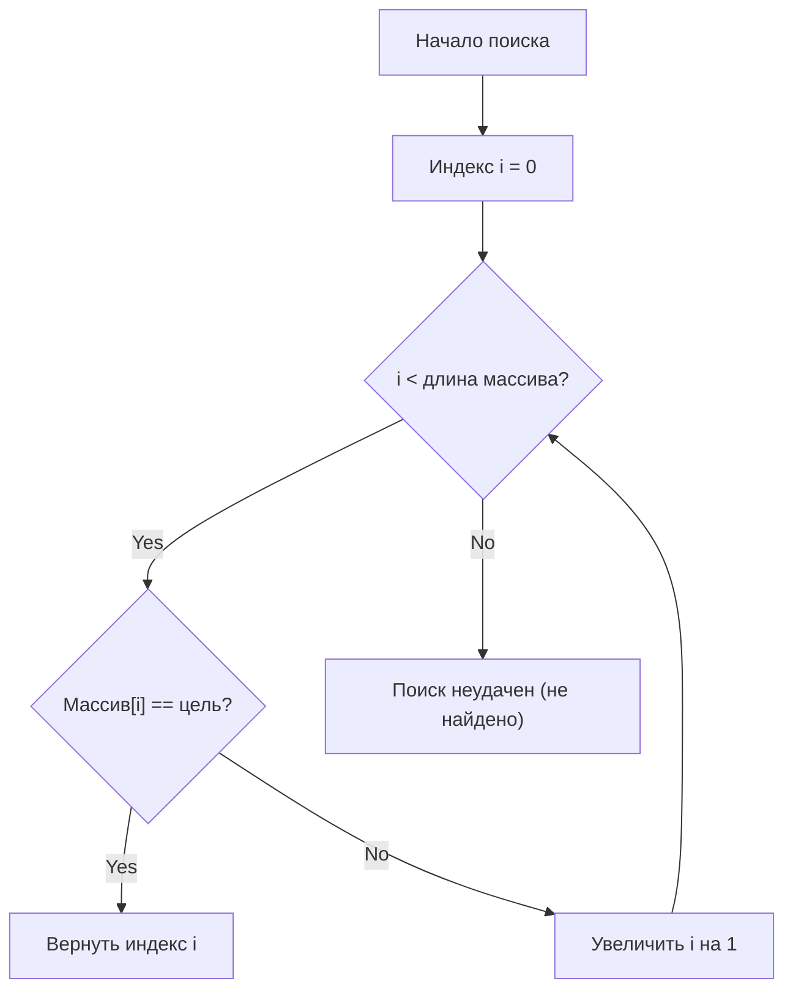
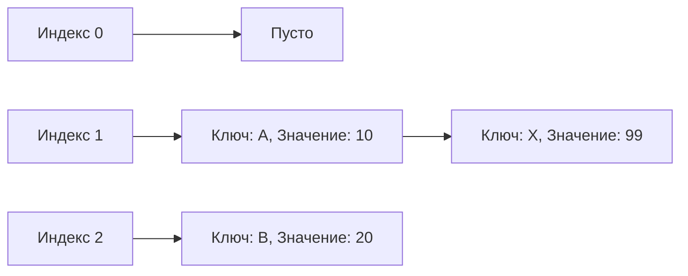

# Основы и важность алгоритмов поиска

В современной информатике **алгоритмы поиска** , позволяющие быстро находить нужное значение среди данных, являются важнейшей технологией, лежащей в основе любого программного обеспечения или системы. Мы ежедневно пользуемся преимуществами алгоритмов поиска: будь то поиск в базе данных, поиск по ключевым словам в веб-браузере или поиск имени в приложении контактов на смартфоне.

В этой статье мы подробно рассмотрим алгоритмы «линейного поиска (Linear Search)» и «бинарного поиска (Binary Search)», которые являются основами информатики, объяснив механизмы их работы, вычислительную сложность и примеры реализации на Python. Кроме того, мы углубимся в принципы «хеш-таблиц (Hash Table)», которые преодолевают ограничения этих алгоритмов и обеспечивают колоссальную скорость поиска, роль хеш-функций и методы разрешения хеш-коллизий (Collision).


Глубокое понимание алгоритмов поиска необходимо для повышения квалификации программиста на новый уровень. При небольшом объеме данных выбор алгоритма может оказывать незначительное влияние на производительность, но в эпоху больших данных выбор правильного алгоритма и структуры данных крайне важен для мгновенного нахождения нужной информации среди миллионов и сотен миллионов записей. В частности, понимание концепции **временной сложности** (например, $O(n)$, $O(\log n)$, $O(1)$) является неотъемлемым элементом при проектировании эффективных программ.

Глубокое понимание алгоритмов поиска необходимо для повышения квалификации программиста на новый уровень. При небольшом объеме данных выбор алгоритма может оказывать незначительное влияние на производительность, но в эпоху больших данных выбор правильного алгоритма и структуры данных крайне важен для мгновенного нахождения нужной информации среди миллионов и сотен миллионов записей. В частности, понимание концепции **временной сложности** (например, $O(n)$, $O(\log n)$, $O(1)$) является неотъемлемым элементом при проектировании эффективных программ.

Глубокое понимание алгоритмов поиска необходимо для повышения квалификации программиста на новый уровень. При небольшом объеме данных выбор алгоритма может оказывать незначительное влияние на производительность, но в эпоху больших данных выбор правильного алгоритма и структуры данных крайне важен для мгновенного нахождения нужной информации среди миллионов и сотен миллионов записей. В частности, понимание концепции **временной сложности** (например, $O(n)$, $O(\log n)$, $O(1)$) является неотъемлемым элементом при проектировании эффективных программ.

Глубокое понимание алгоритмов поиска необходимо для повышения квалификации программиста на новый уровень. При небольшом объеме данных выбор алгоритма может оказывать незначительное влияние на производительность, но в эпоху больших данных выбор правильного алгоритма и структуры данных крайне важен для мгновенного нахождения нужной информации среди миллионов и сотен миллионов записей. В частности, понимание концепции **временной сложности** (например, $O(n)$, $O(\log n)$, $O(1)$) является неотъемлемым элементом при проектировании эффективных программ.

Глубокое понимание алгоритмов поиска необходимо для повышения квалификации программиста на новый уровень. При небольшом объеме данных выбор алгоритма может оказывать незначительное влияние на производительность, но в эпоху больших данных выбор правильного алгоритма и структуры данных крайне важен для мгновенного нахождения нужной информации среди миллионов и сотен миллионов записей. В частности, понимание концепции **временной сложности** (например, $O(n)$, $O(\log n)$, $O(1)$) является неотъемлемым элементом при проектировании эффективных программ.

Глубокое понимание алгоритмов поиска необходимо для повышения квалификации программиста на новый уровень. При небольшом объеме данных выбор алгоритма может оказывать незначительное влияние на производительность, но в эпоху больших данных выбор правильного алгоритма и структуры данных крайне важен для мгновенного нахождения нужной информации среди миллионов и сотен миллионов записей. В частности, понимание концепции **временной сложности** (например, $O(n)$, $O(\log n)$, $O(1)$) является неотъемлемым элементом при проектировании эффективных программ.

Глубокое понимание алгоритмов поиска необходимо для повышения квалификации программиста на новый уровень. При небольшом объеме данных выбор алгоритма может оказывать незначительное влияние на производительность, но в эпоху больших данных выбор правильного алгоритма и структуры данных крайне важен для мгновенного нахождения нужной информации среди миллионов и сотен миллионов записей. В частности, понимание концепции **временной сложности** (например, $O(n)$, $O(\log n)$, $O(1)$) является неотъемлемым элементом при проектировании эффективных программ.

Глубокое понимание алгоритмов поиска необходимо для повышения квалификации программиста на новый уровень. При небольшом объеме данных выбор алгоритма может оказывать незначительное влияние на производительность, но в эпоху больших данных выбор правильного алгоритма и структуры данных крайне важен для мгновенного нахождения нужной информации среди миллионов и сотен миллионов записей. В частности, понимание концепции **временной сложности** (например, $O(n)$, $O(\log n)$, $O(1)$) является неотъемлемым элементом при проектировании эффективных программ.

Глубокое понимание алгоритмов поиска необходимо для повышения квалификации программиста на новый уровень. При небольшом объеме данных выбор алгоритма может оказывать незначительное влияние на производительность, но в эпоху больших данных выбор правильного алгоритма и структуры данных крайне важен для мгновенного нахождения нужной информации среди миллионов и сотен миллионов записей. В частности, понимание концепции **временной сложности** (например, $O(n)$, $O(\log n)$, $O(1)$) является неотъемлемым элементом при проектировании эффективных программ.

Глубокое понимание алгоритмов поиска необходимо для повышения квалификации программиста на новый уровень. При небольшом объеме данных выбор алгоритма может оказывать незначительное влияние на производительность, но в эпоху больших данных выбор правильного алгоритма и структуры данных крайне важен для мгновенного нахождения нужной информации среди миллионов и сотен миллионов записей. В частности, понимание концепции **временной сложности** (например, $O(n)$, $O(\log n)$, $O(1)$) является неотъемлемым элементом при проектировании эффективных программ.

## 1. Линейный поиск (Linear Search)

Линейный поиск — это самый простой и интуитивно понятный алгоритм поиска, в котором элементы структуры данных (например, массива или списка) проверяются по очереди, от начала до конца, пока не будет найдено нужное значение.

### 1.1 Как работает линейный поиск

Алгоритм линейного поиска выполняется по следующим шагам:

1. Извлекается первый элемент массива.
2. Проверяется, совпадает ли извлеченный элемент с искомым значением (целью).
3. Если они совпадают, возвращается индекс (позиция) этого элемента, и поиск завершается.
4. Если совпадения нет, алгоритм переходит к следующему элементу.
5. Если массив проверен до конца, и цель не найдена, поиск завершается как неудачный (например, возвращается `-1` или `None`).



### 1.2 Реализация линейного поиска на Python

Ниже приведен простой пример реализации линейного поиска с использованием Python.

```python
def linear_search(arr, target):
    """
    Функция для выполнения линейного поиска
    :param arr: Список для поиска
    :param target: Значение, которое нужно найти
    :return: Индекс найденного элемента, или -1, если не найдено
    """
    for i in range(len(arr)):
        if arr[i] == target:
            return i
    return -1

# Тестовые данные
numbers = [10, 23, 4, 15, 2, 7, 34, 11]
target_value = 7

result_index = linear_search(numbers, target_value)
if result_index != -1:
    print(f"Элемент {target_value} найден по индексу {result_index}.")
else:
    print(f"Элемент {target_value} не существует в списке.")
```


Главная особенность линейного поиска заключается в том, что данные не обязательно должны быть отсортированы. Даже если данные хранятся в случайном порядке, их проверка по очереди от начала гарантирует, что мы найдем нужное значение (или подтвердим его отсутствие). Однако это свойство «проверки всего по порядку» является основным фактором снижения производительности при больших объемах данных.

Главная особенность линейного поиска заключается в том, что данные не обязательно должны быть отсортированы. Даже если данные хранятся в случайном порядке, их проверка по очереди от начала гарантирует, что мы найдем нужное значение (или подтвердим его отсутствие). Однако это свойство «проверки всего по порядку» является основным фактором снижения производительности при больших объемах данных.

Главная особенность линейного поиска заключается в том, что данные не обязательно должны быть отсортированы. Даже если данные хранятся в случайном порядке, их проверка по очереди от начала гарантирует, что мы найдем нужное значение (или подтвердим его отсутствие). Однако это свойство «проверки всего по порядку» является основным фактором снижения производительности при больших объемах данных.

Главная особенность линейного поиска заключается в том, что данные не обязательно должны быть отсортированы. Даже если данные хранятся в случайном порядке, их проверка по очереди от начала гарантирует, что мы найдем нужное значение (или подтвердим его отсутствие). Однако это свойство «проверки всего по порядку» является основным фактором снижения производительности при больших объемах данных.

Главная особенность линейного поиска заключается в том, что данные не обязательно должны быть отсортированы. Даже если данные хранятся в случайном порядке, их проверка по очереди от начала гарантирует, что мы найдем нужное значение (или подтвердим его отсутствие). Однако это свойство «проверки всего по порядку» является основным фактором снижения производительности при больших объемах данных.

Главная особенность линейного поиска заключается в том, что данные не обязательно должны быть отсортированы. Даже если данные хранятся в случайном порядке, их проверка по очереди от начала гарантирует, что мы найдем нужное значение (или подтвердим его отсутствие). Однако это свойство «проверки всего по порядку» является основным фактором снижения производительности при больших объемах данных.

Главная особенность линейного поиска заключается в том, что данные не обязательно должны быть отсортированы. Даже если данные хранятся в случайном порядке, их проверка по очереди от начала гарантирует, что мы найдем нужное значение (или подтвердим его отсутствие). Однако это свойство «проверки всего по порядку» является основным фактором снижения производительности при больших объемах данных.

Главная особенность линейного поиска заключается в том, что данные не обязательно должны быть отсортированы. Даже если данные хранятся в случайном порядке, их проверка по очереди от начала гарантирует, что мы найдем нужное значение (или подтвердим его отсутствие). Однако это свойство «проверки всего по порядку» является основным фактором снижения производительности при больших объемах данных.

Главная особенность линейного поиска заключается в том, что данные не обязательно должны быть отсортированы. Даже если данные хранятся в случайном порядке, их проверка по очереди от начала гарантирует, что мы найдем нужное значение (или подтвердим его отсутствие). Однако это свойство «проверки всего по порядку» является основным фактором снижения производительности при больших объемах данных.

Главная особенность линейного поиска заключается в том, что данные не обязательно должны быть отсортированы. Даже если данные хранятся в случайном порядке, их проверка по очереди от начала гарантирует, что мы найдем нужное значение (или подтвердим его отсутствие). Однако это свойство «проверки всего по порядку» является основным фактором снижения производительности при больших объемах данных.

Главная особенность линейного поиска заключается в том, что данные не обязательно должны быть отсортированы. Даже если данные хранятся в случайном порядке, их проверка по очереди от начала гарантирует, что мы найдем нужное значение (или подтвердим его отсутствие). Однако это свойство «проверки всего по порядку» является основным фактором снижения производительности при больших объемах данных.

Главная особенность линейного поиска заключается в том, что данные не обязательно должны быть отсортированы. Даже если данные хранятся в случайном порядке, их проверка по очереди от начала гарантирует, что мы найдем нужное значение (или подтвердим его отсутствие). Однако это свойство «проверки всего по порядку» является основным фактором снижения производительности при больших объемах данных.

Главная особенность линейного поиска заключается в том, что данные не обязательно должны быть отсортированы. Даже если данные хранятся в случайном порядке, их проверка по очереди от начала гарантирует, что мы найдем нужное значение (или подтвердим его отсутствие). Однако это свойство «проверки всего по порядку» является основным фактором снижения производительности при больших объемах данных.

Главная особенность линейного поиска заключается в том, что данные не обязательно должны быть отсортированы. Даже если данные хранятся в случайном порядке, их проверка по очереди от начала гарантирует, что мы найдем нужное значение (или подтвердим его отсутствие). Однако это свойство «проверки всего по порядку» является основным фактором снижения производительности при больших объемах данных.

Главная особенность линейного поиска заключается в том, что данные не обязательно должны быть отсортированы. Даже если данные хранятся в случайном порядке, их проверка по очереди от начала гарантирует, что мы найдем нужное значение (или подтвердим его отсутствие). Однако это свойство «проверки всего по порядку» является основным фактором снижения производительности при больших объемах данных.

Главная особенность линейного поиска заключается в том, что данные не обязательно должны быть отсортированы. Даже если данные хранятся в случайном порядке, их проверка по очереди от начала гарантирует, что мы найдем нужное значение (или подтвердим его отсутствие). Однако это свойство «проверки всего по порядку» является основным фактором снижения производительности при больших объемах данных.

Главная особенность линейного поиска заключается в том, что данные не обязательно должны быть отсортированы. Даже если данные хранятся в случайном порядке, их проверка по очереди от начала гарантирует, что мы найдем нужное значение (или подтвердим его отсутствие). Однако это свойство «проверки всего по порядку» является основным фактором снижения производительности при больших объемах данных.

Главная особенность линейного поиска заключается в том, что данные не обязательно должны быть отсортированы. Даже если данные хранятся в случайном порядке, их проверка по очереди от начала гарантирует, что мы найдем нужное значение (или подтвердим его отсутствие). Однако это свойство «проверки всего по порядку» является основным фактором снижения производительности при больших объемах данных.

Главная особенность линейного поиска заключается в том, что данные не обязательно должны быть отсортированы. Даже если данные хранятся в случайном порядке, их проверка по очереди от начала гарантирует, что мы найдем нужное значение (или подтвердим его отсутствие). Однако это свойство «проверки всего по порядку» является основным фактором снижения производительности при больших объемах данных.

Главная особенность линейного поиска заключается в том, что данные не обязательно должны быть отсортированы. Даже если данные хранятся в случайном порядке, их проверка по очереди от начала гарантирует, что мы найдем нужное значение (или подтвердим его отсутствие). Однако это свойство «проверки всего по порядку» является основным фактором снижения производительности при больших объемах данных.

Главная особенность линейного поиска заключается в том, что данные не обязательно должны быть отсортированы. Даже если данные хранятся в случайном порядке, их проверка по очереди от начала гарантирует, что мы найдем нужное значение (или подтвердим его отсутствие). Однако это свойство «проверки всего по порядку» является основным фактором снижения производительности при больших объемах данных.

Главная особенность линейного поиска заключается в том, что данные не обязательно должны быть отсортированы. Даже если данные хранятся в случайном порядке, их проверка по очереди от начала гарантирует, что мы найдем нужное значение (или подтвердим его отсутствие). Однако это свойство «проверки всего по порядку» является основным фактором снижения производительности при больших объемах данных.

Главная особенность линейного поиска заключается в том, что данные не обязательно должны быть отсортированы. Даже если данные хранятся в случайном порядке, их проверка по очереди от начала гарантирует, что мы найдем нужное значение (или подтвердим его отсутствие). Однако это свойство «проверки всего по порядку» является основным фактором снижения производительности при больших объемах данных.

Главная особенность линейного поиска заключается в том, что данные не обязательно должны быть отсортированы. Даже если данные хранятся в случайном порядке, их проверка по очереди от начала гарантирует, что мы найдем нужное значение (или подтвердим его отсутствие). Однако это свойство «проверки всего по порядку» является основным фактором снижения производительности при больших объемах данных.

Главная особенность линейного поиска заключается в том, что данные не обязательно должны быть отсортированы. Даже если данные хранятся в случайном порядке, их проверка по очереди от начала гарантирует, что мы найдем нужное значение (или подтвердим его отсутствие). Однако это свойство «проверки всего по порядку» является основным фактором снижения производительности при больших объемах данных.

Главная особенность линейного поиска заключается в том, что данные не обязательно должны быть отсортированы. Даже если данные хранятся в случайном порядке, их проверка по очереди от начала гарантирует, что мы найдем нужное значение (или подтвердим его отсутствие). Однако это свойство «проверки всего по порядку» является основным фактором снижения производительности при больших объемах данных.

Главная особенность линейного поиска заключается в том, что данные не обязательно должны быть отсортированы. Даже если данные хранятся в случайном порядке, их проверка по очереди от начала гарантирует, что мы найдем нужное значение (или подтвердим его отсутствие). Однако это свойство «проверки всего по порядку» является основным фактором снижения производительности при больших объемах данных.

Главная особенность линейного поиска заключается в том, что данные не обязательно должны быть отсортированы. Даже если данные хранятся в случайном порядке, их проверка по очереди от начала гарантирует, что мы найдем нужное значение (или подтвердим его отсутствие). Однако это свойство «проверки всего по порядку» является основным фактором снижения производительности при больших объемах данных.

Главная особенность линейного поиска заключается в том, что данные не обязательно должны быть отсортированы. Даже если данные хранятся в случайном порядке, их проверка по очереди от начала гарантирует, что мы найдем нужное значение (или подтвердим его отсутствие). Однако это свойство «проверки всего по порядку» является основным фактором снижения производительности при больших объемах данных.

Главная особенность линейного поиска заключается в том, что данные не обязательно должны быть отсортированы. Даже если данные хранятся в случайном порядке, их проверка по очереди от начала гарантирует, что мы найдем нужное значение (или подтвердим его отсутствие). Однако это свойство «проверки всего по порядку» является основным фактором снижения производительности при больших объемах данных.

Главная особенность линейного поиска заключается в том, что данные не обязательно должны быть отсортированы. Даже если данные хранятся в случайном порядке, их проверка по очереди от начала гарантирует, что мы найдем нужное значение (или подтвердим его отсутствие). Однако это свойство «проверки всего по порядку» является основным фактором снижения производительности при больших объемах данных.

Главная особенность линейного поиска заключается в том, что данные не обязательно должны быть отсортированы. Даже если данные хранятся в случайном порядке, их проверка по очереди от начала гарантирует, что мы найдем нужное значение (или подтвердим его отсутствие). Однако это свойство «проверки всего по порядку» является основным фактором снижения производительности при больших объемах данных.

Главная особенность линейного поиска заключается в том, что данные не обязательно должны быть отсортированы. Даже если данные хранятся в случайном порядке, их проверка по очереди от начала гарантирует, что мы найдем нужное значение (или подтвердим его отсутствие). Однако это свойство «проверки всего по порядку» является основным фактором снижения производительности при больших объемах данных.

Главная особенность линейного поиска заключается в том, что данные не обязательно должны быть отсортированы. Даже если данные хранятся в случайном порядке, их проверка по очереди от начала гарантирует, что мы найдем нужное значение (или подтвердим его отсутствие). Однако это свойство «проверки всего по порядку» является основным фактором снижения производительности при больших объемах данных.

Главная особенность линейного поиска заключается в том, что данные не обязательно должны быть отсортированы. Даже если данные хранятся в случайном порядке, их проверка по очереди от начала гарантирует, что мы найдем нужное значение (или подтвердим его отсутствие). Однако это свойство «проверки всего по порядку» является основным фактором снижения производительности при больших объемах данных.

Главная особенность линейного поиска заключается в том, что данные не обязательно должны быть отсортированы. Даже если данные хранятся в случайном порядке, их проверка по очереди от начала гарантирует, что мы найдем нужное значение (или подтвердим его отсутствие). Однако это свойство «проверки всего по порядку» является основным фактором снижения производительности при больших объемах данных.

Главная особенность линейного поиска заключается в том, что данные не обязательно должны быть отсортированы. Даже если данные хранятся в случайном порядке, их проверка по очереди от начала гарантирует, что мы найдем нужное значение (или подтвердим его отсутствие). Однако это свойство «проверки всего по порядку» является основным фактором снижения производительности при больших объемах данных.

Главная особенность линейного поиска заключается в том, что данные не обязательно должны быть отсортированы. Даже если данные хранятся в случайном порядке, их проверка по очереди от начала гарантирует, что мы найдем нужное значение (или подтвердим его отсутствие). Однако это свойство «проверки всего по порядку» является основным фактором снижения производительности при больших объемах данных.

Главная особенность линейного поиска заключается в том, что данные не обязательно должны быть отсортированы. Даже если данные хранятся в случайном порядке, их проверка по очереди от начала гарантирует, что мы найдем нужное значение (или подтвердим его отсутствие). Однако это свойство «проверки всего по порядку» является основным фактором снижения производительности при больших объемах данных.

Главная особенность линейного поиска заключается в том, что данные не обязательно должны быть отсортированы. Даже если данные хранятся в случайном порядке, их проверка по очереди от начала гарантирует, что мы найдем нужное значение (или подтвердим его отсутствие). Однако это свойство «проверки всего по порядку» является основным фактором снижения производительности при больших объемах данных.

Главная особенность линейного поиска заключается в том, что данные не обязательно должны быть отсортированы. Даже если данные хранятся в случайном порядке, их проверка по очереди от начала гарантирует, что мы найдем нужное значение (или подтвердим его отсутствие). Однако это свойство «проверки всего по порядку» является основным фактором снижения производительности при больших объемах данных.

Главная особенность линейного поиска заключается в том, что данные не обязательно должны быть отсортированы. Даже если данные хранятся в случайном порядке, их проверка по очереди от начала гарантирует, что мы найдем нужное значение (или подтвердим его отсутствие). Однако это свойство «проверки всего по порядку» является основным фактором снижения производительности при больших объемах данных.

Главная особенность линейного поиска заключается в том, что данные не обязательно должны быть отсортированы. Даже если данные хранятся в случайном порядке, их проверка по очереди от начала гарантирует, что мы найдем нужное значение (или подтвердим его отсутствие). Однако это свойство «проверки всего по порядку» является основным фактором снижения производительности при больших объемах данных.

Главная особенность линейного поиска заключается в том, что данные не обязательно должны быть отсортированы. Даже если данные хранятся в случайном порядке, их проверка по очереди от начала гарантирует, что мы найдем нужное значение (или подтвердим его отсутствие). Однако это свойство «проверки всего по порядку» является основным фактором снижения производительности при больших объемах данных.

Главная особенность линейного поиска заключается в том, что данные не обязательно должны быть отсортированы. Даже если данные хранятся в случайном порядке, их проверка по очереди от начала гарантирует, что мы найдем нужное значение (или подтвердим его отсутствие). Однако это свойство «проверки всего по порядку» является основным фактором снижения производительности при больших объемах данных.

Главная особенность линейного поиска заключается в том, что данные не обязательно должны быть отсортированы. Даже если данные хранятся в случайном порядке, их проверка по очереди от начала гарантирует, что мы найдем нужное значение (или подтвердим его отсутствие). Однако это свойство «проверки всего по порядку» является основным фактором снижения производительности при больших объемах данных.

Главная особенность линейного поиска заключается в том, что данные не обязательно должны быть отсортированы. Даже если данные хранятся в случайном порядке, их проверка по очереди от начала гарантирует, что мы найдем нужное значение (или подтвердим его отсутствие). Однако это свойство «проверки всего по порядку» является основным фактором снижения производительности при больших объемах данных.

Главная особенность линейного поиска заключается в том, что данные не обязательно должны быть отсортированы. Даже если данные хранятся в случайном порядке, их проверка по очереди от начала гарантирует, что мы найдем нужное значение (или подтвердим его отсутствие). Однако это свойство «проверки всего по порядку» является основным фактором снижения производительности при больших объемах данных.

Главная особенность линейного поиска заключается в том, что данные не обязательно должны быть отсортированы. Даже если данные хранятся в случайном порядке, их проверка по очереди от начала гарантирует, что мы найдем нужное значение (или подтвердим его отсутствие). Однако это свойство «проверки всего по порядку» является основным фактором снижения производительности при больших объемах данных.

Главная особенность линейного поиска заключается в том, что данные не обязательно должны быть отсортированы. Даже если данные хранятся в случайном порядке, их проверка по очереди от начала гарантирует, что мы найдем нужное значение (или подтвердим его отсутствие). Однако это свойство «проверки всего по порядку» является основным фактором снижения производительности при больших объемах данных.

## 2. Бинарный поиск (Binary Search)

Бинарный поиск — это очень быстрый и эффективный алгоритм поиска, который можно применять только к **предварительно отсортированным (по возрастанию или убыванию) данным** . Значительно сокращает вычислительную сложность за счет сужения области поиска вдвое на каждом шаге.

### 2.1 Как работает бинарный поиск

Бинарный поиск выполняется по следующим шагам:

1. Инициализируются индексы «левого края» (`low`) и «правого края» (`high`) массива, в котором ведется поиск.
2. До тех пор, пока диапазон поиска действителен (`low <= high`), повторяются следующие действия.
3. Вычисляется центральный индекс (`mid`) диапазона поиска.
4. Сравнивается центральный элемент (`arr[mid]`) и искомое значение (цель).
5. Если они совпадают, возвращается `mid`, и поиск завершается.
6. Если центральный элемент меньше цели, цель находится в правой половине, поэтому левый край обновляется на `mid + 1`.
7. Если центральный элемент больше цели, цель находится в левой половине, поэтому правый край обновляется на `mid - 1`.
8. Если диапазон поиска исчерпан, а элемент не найден, поиск считается неудачным.

```mermaid
flowchart TD
    A["Начало поиска"] --> B["low = 0, high = len - 1"]
    B --> C{"low <= high?"}
    C -- "No" --> D["Поиск неудачен"]
    C -- "Yes" --> E["mid = (low + high) / 2"]
    E --> F{"arr["mid"] == target?"}
    F -- "Yes" --> G["Вернуть mid"]
    F -- "No" --> H{"arr["mid"] < target?"}
    H -- "Yes" --> I["low = mid + 1"]
    H -- "No" --> J["high = mid - 1"]
    I --> C
    J --> C
```

### 2.2 Реализация бинарного поиска на Python (итеративный метод)

```python
def binary_search(arr, target):
    """
    Функция для выполнения бинарного поиска (итеративный метод)
    :param arr: Отсортированный список для поиска
    :param target: Значение, которое нужно найти
    :return: Индекс найденного элемента, или -1, если не найдено
    """
    low = 0
    high = len(arr) - 1

    while low <= high:
        mid = (low + high) // 2
        
        if arr[mid] == target:
            return mid
        elif arr[mid] < target:
            low = mid + 1
        else:
            high = mid - 1
            
    return -1

# Тестовые данные (должны быть отсортированы)
sorted_numbers = [2, 4, 7, 10, 11, 15, 23, 34]
target_value = 15

result_index = binary_search(sorted_numbers, target_value)
if result_index != -1:
    print(f"Элемент {target_value} найден по индексу {result_index}.")
else:
    print(f"Элемент {target_value} не существует в списке.")
```

Потрясающая производительность бинарного поиска обусловлена тем, что на каждом шаге область поиска делится пополам. Например, если при линейном поиске в массиве из 1 миллиона элементов в худшем случае потребуется 1 миллион сравнений, то при использовании бинарного поиска нужное значение можно найти всего примерно за 20 сравнений ($2^{20} \approx 1,000,000$). По этой причине бинарный поиск имеет подавляющее преимущество над линейным поиском в операциях поиска в крупных наборах данных. Математически временная сложность бинарного поиска выражается как $O(\log n)$.

Потрясающая производительность бинарного поиска обусловлена тем, что на каждом шаге область поиска делится пополам. Например, если при линейном поиске в массиве из 1 миллиона элементов в худшем случае потребуется 1 миллион сравнений, то при использовании бинарного поиска нужное значение можно найти всего примерно за 20 сравнений ($2^{20} \approx 1,000,000$). По этой причине бинарный поиск имеет подавляющее преимущество над линейным поиском в операциях поиска в крупных наборах данных. Математически временная сложность бинарного поиска выражается как $O(\log n)$.

Потрясающая производительность бинарного поиска обусловлена тем, что на каждом шаге область поиска делится пополам. Например, если при линейном поиске в массиве из 1 миллиона элементов в худшем случае потребуется 1 миллион сравнений, то при использовании бинарного поиска нужное значение можно найти всего примерно за 20 сравнений ($2^{20} \approx 1,000,000$). По этой причине бинарный поиск имеет подавляющее преимущество над линейным поиском в операциях поиска в крупных наборах данных. Математически временная сложность бинарного поиска выражается как $O(\log n)$.

Потрясающая производительность бинарного поиска обусловлена тем, что на каждом шаге область поиска делится пополам. Например, если при линейном поиске в массиве из 1 миллиона элементов в худшем случае потребуется 1 миллион сравнений, то при использовании бинарного поиска нужное значение можно найти всего примерно за 20 сравнений ($2^{20} \approx 1,000,000$). По этой причине бинарный поиск имеет подавляющее преимущество над линейным поиском в операциях поиска в крупных наборах данных. Математически временная сложность бинарного поиска выражается как $O(\log n)$.

Потрясающая производительность бинарного поиска обусловлена тем, что на каждом шаге область поиска делится пополам. Например, если при линейном поиске в массиве из 1 миллиона элементов в худшем случае потребуется 1 миллион сравнений, то при использовании бинарного поиска нужное значение можно найти всего примерно за 20 сравнений ($2^{20} \approx 1,000,000$). По этой причине бинарный поиск имеет подавляющее преимущество над линейным поиском в операциях поиска в крупных наборах данных. Математически временная сложность бинарного поиска выражается как $O(\log n)$.

Потрясающая производительность бинарного поиска обусловлена тем, что на каждом шаге область поиска делится пополам. Например, если при линейном поиске в массиве из 1 миллиона элементов в худшем случае потребуется 1 миллион сравнений, то при использовании бинарного поиска нужное значение можно найти всего примерно за 20 сравнений ($2^{20} \approx 1,000,000$). По этой причине бинарный поиск имеет подавляющее преимущество над линейным поиском в операциях поиска в крупных наборах данных. Математически временная сложность бинарного поиска выражается как $O(\log n)$.

Потрясающая производительность бинарного поиска обусловлена тем, что на каждом шаге область поиска делится пополам. Например, если при линейном поиске в массиве из 1 миллиона элементов в худшем случае потребуется 1 миллион сравнений, то при использовании бинарного поиска нужное значение можно найти всего примерно за 20 сравнений ($2^{20} \approx 1,000,000$). По этой причине бинарный поиск имеет подавляющее преимущество над линейным поиском в операциях поиска в крупных наборах данных. Математически временная сложность бинарного поиска выражается как $O(\log n)$.

Потрясающая производительность бинарного поиска обусловлена тем, что на каждом шаге область поиска делится пополам. Например, если при линейном поиске в массиве из 1 миллиона элементов в худшем случае потребуется 1 миллион сравнений, то при использовании бинарного поиска нужное значение можно найти всего примерно за 20 сравнений ($2^{20} \approx 1,000,000$). По этой причине бинарный поиск имеет подавляющее преимущество над линейным поиском в операциях поиска в крупных наборах данных. Математически временная сложность бинарного поиска выражается как $O(\log n)$.

Потрясающая производительность бинарного поиска обусловлена тем, что на каждом шаге область поиска делится пополам. Например, если при линейном поиске в массиве из 1 миллиона элементов в худшем случае потребуется 1 миллион сравнений, то при использовании бинарного поиска нужное значение можно найти всего примерно за 20 сравнений ($2^{20} \approx 1,000,000$). По этой причине бинарный поиск имеет подавляющее преимущество над линейным поиском в операциях поиска в крупных наборах данных. Математически временная сложность бинарного поиска выражается как $O(\log n)$.

Потрясающая производительность бинарного поиска обусловлена тем, что на каждом шаге область поиска делится пополам. Например, если при линейном поиске в массиве из 1 миллиона элементов в худшем случае потребуется 1 миллион сравнений, то при использовании бинарного поиска нужное значение можно найти всего примерно за 20 сравнений ($2^{20} \approx 1,000,000$). По этой причине бинарный поиск имеет подавляющее преимущество над линейным поиском в операциях поиска в крупных наборах данных. Математически временная сложность бинарного поиска выражается как $O(\log n)$.

Потрясающая производительность бинарного поиска обусловлена тем, что на каждом шаге область поиска делится пополам. Например, если при линейном поиске в массиве из 1 миллиона элементов в худшем случае потребуется 1 миллион сравнений, то при использовании бинарного поиска нужное значение можно найти всего примерно за 20 сравнений ($2^{20} \approx 1,000,000$). По этой причине бинарный поиск имеет подавляющее преимущество над линейным поиском в операциях поиска в крупных наборах данных. Математически временная сложность бинарного поиска выражается как $O(\log n)$.

Потрясающая производительность бинарного поиска обусловлена тем, что на каждом шаге область поиска делится пополам. Например, если при линейном поиске в массиве из 1 миллиона элементов в худшем случае потребуется 1 миллион сравнений, то при использовании бинарного поиска нужное значение можно найти всего примерно за 20 сравнений ($2^{20} \approx 1,000,000$). По этой причине бинарный поиск имеет подавляющее преимущество над линейным поиском в операциях поиска в крупных наборах данных. Математически временная сложность бинарного поиска выражается как $O(\log n)$.

Потрясающая производительность бинарного поиска обусловлена тем, что на каждом шаге область поиска делится пополам. Например, если при линейном поиске в массиве из 1 миллиона элементов в худшем случае потребуется 1 миллион сравнений, то при использовании бинарного поиска нужное значение можно найти всего примерно за 20 сравнений ($2^{20} \approx 1,000,000$). По этой причине бинарный поиск имеет подавляющее преимущество над линейным поиском в операциях поиска в крупных наборах данных. Математически временная сложность бинарного поиска выражается как $O(\log n)$.

Потрясающая производительность бинарного поиска обусловлена тем, что на каждом шаге область поиска делится пополам. Например, если при линейном поиске в массиве из 1 миллиона элементов в худшем случае потребуется 1 миллион сравнений, то при использовании бинарного поиска нужное значение можно найти всего примерно за 20 сравнений ($2^{20} \approx 1,000,000$). По этой причине бинарный поиск имеет подавляющее преимущество над линейным поиском в операциях поиска в крупных наборах данных. Математически временная сложность бинарного поиска выражается как $O(\log n)$.

Потрясающая производительность бинарного поиска обусловлена тем, что на каждом шаге область поиска делится пополам. Например, если при линейном поиске в массиве из 1 миллиона элементов в худшем случае потребуется 1 миллион сравнений, то при использовании бинарного поиска нужное значение можно найти всего примерно за 20 сравнений ($2^{20} \approx 1,000,000$). По этой причине бинарный поиск имеет подавляющее преимущество над линейным поиском в операциях поиска в крупных наборах данных. Математически временная сложность бинарного поиска выражается как $O(\log n)$.

Потрясающая производительность бинарного поиска обусловлена тем, что на каждом шаге область поиска делится пополам. Например, если при линейном поиске в массиве из 1 миллиона элементов в худшем случае потребуется 1 миллион сравнений, то при использовании бинарного поиска нужное значение можно найти всего примерно за 20 сравнений ($2^{20} \approx 1,000,000$). По этой причине бинарный поиск имеет подавляющее преимущество над линейным поиском в операциях поиска в крупных наборах данных. Математически временная сложность бинарного поиска выражается как $O(\log n)$.

Потрясающая производительность бинарного поиска обусловлена тем, что на каждом шаге область поиска делится пополам. Например, если при линейном поиске в массиве из 1 миллиона элементов в худшем случае потребуется 1 миллион сравнений, то при использовании бинарного поиска нужное значение можно найти всего примерно за 20 сравнений ($2^{20} \approx 1,000,000$). По этой причине бинарный поиск имеет подавляющее преимущество над линейным поиском в операциях поиска в крупных наборах данных. Математически временная сложность бинарного поиска выражается как $O(\log n)$.

Потрясающая производительность бинарного поиска обусловлена тем, что на каждом шаге область поиска делится пополам. Например, если при линейном поиске в массиве из 1 миллиона элементов в худшем случае потребуется 1 миллион сравнений, то при использовании бинарного поиска нужное значение можно найти всего примерно за 20 сравнений ($2^{20} \approx 1,000,000$). По этой причине бинарный поиск имеет подавляющее преимущество над линейным поиском в операциях поиска в крупных наборах данных. Математически временная сложность бинарного поиска выражается как $O(\log n)$.

Потрясающая производительность бинарного поиска обусловлена тем, что на каждом шаге область поиска делится пополам. Например, если при линейном поиске в массиве из 1 миллиона элементов в худшем случае потребуется 1 миллион сравнений, то при использовании бинарного поиска нужное значение можно найти всего примерно за 20 сравнений ($2^{20} \approx 1,000,000$). По этой причине бинарный поиск имеет подавляющее преимущество над линейным поиском в операциях поиска в крупных наборах данных. Математически временная сложность бинарного поиска выражается как $O(\log n)$.

Потрясающая производительность бинарного поиска обусловлена тем, что на каждом шаге область поиска делится пополам. Например, если при линейном поиске в массиве из 1 миллиона элементов в худшем случае потребуется 1 миллион сравнений, то при использовании бинарного поиска нужное значение можно найти всего примерно за 20 сравнений ($2^{20} \approx 1,000,000$). По этой причине бинарный поиск имеет подавляющее преимущество над линейным поиском в операциях поиска в крупных наборах данных. Математически временная сложность бинарного поиска выражается как $O(\log n)$.

Потрясающая производительность бинарного поиска обусловлена тем, что на каждом шаге область поиска делится пополам. Например, если при линейном поиске в массиве из 1 миллиона элементов в худшем случае потребуется 1 миллион сравнений, то при использовании бинарного поиска нужное значение можно найти всего примерно за 20 сравнений ($2^{20} \approx 1,000,000$). По этой причине бинарный поиск имеет подавляющее преимущество над линейным поиском в операциях поиска в крупных наборах данных. Математически временная сложность бинарного поиска выражается как $O(\log n)$.

Потрясающая производительность бинарного поиска обусловлена тем, что на каждом шаге область поиска делится пополам. Например, если при линейном поиске в массиве из 1 миллиона элементов в худшем случае потребуется 1 миллион сравнений, то при использовании бинарного поиска нужное значение можно найти всего примерно за 20 сравнений ($2^{20} \approx 1,000,000$). По этой причине бинарный поиск имеет подавляющее преимущество над линейным поиском в операциях поиска в крупных наборах данных. Математически временная сложность бинарного поиска выражается как $O(\log n)$.

Потрясающая производительность бинарного поиска обусловлена тем, что на каждом шаге область поиска делится пополам. Например, если при линейном поиске в массиве из 1 миллиона элементов в худшем случае потребуется 1 миллион сравнений, то при использовании бинарного поиска нужное значение можно найти всего примерно за 20 сравнений ($2^{20} \approx 1,000,000$). По этой причине бинарный поиск имеет подавляющее преимущество над линейным поиском в операциях поиска в крупных наборах данных. Математически временная сложность бинарного поиска выражается как $O(\log n)$.

Потрясающая производительность бинарного поиска обусловлена тем, что на каждом шаге область поиска делится пополам. Например, если при линейном поиске в массиве из 1 миллиона элементов в худшем случае потребуется 1 миллион сравнений, то при использовании бинарного поиска нужное значение можно найти всего примерно за 20 сравнений ($2^{20} \approx 1,000,000$). По этой причине бинарный поиск имеет подавляющее преимущество над линейным поиском в операциях поиска в крупных наборах данных. Математически временная сложность бинарного поиска выражается как $O(\log n)$.

Потрясающая производительность бинарного поиска обусловлена тем, что на каждом шаге область поиска делится пополам. Например, если при линейном поиске в массиве из 1 миллиона элементов в худшем случае потребуется 1 миллион сравнений, то при использовании бинарного поиска нужное значение можно найти всего примерно за 20 сравнений ($2^{20} \approx 1,000,000$). По этой причине бинарный поиск имеет подавляющее преимущество над линейным поиском в операциях поиска в крупных наборах данных. Математически временная сложность бинарного поиска выражается как $O(\log n)$.

Потрясающая производительность бинарного поиска обусловлена тем, что на каждом шаге область поиска делится пополам. Например, если при линейном поиске в массиве из 1 миллиона элементов в худшем случае потребуется 1 миллион сравнений, то при использовании бинарного поиска нужное значение можно найти всего примерно за 20 сравнений ($2^{20} \approx 1,000,000$). По этой причине бинарный поиск имеет подавляющее преимущество над линейным поиском в операциях поиска в крупных наборах данных. Математически временная сложность бинарного поиска выражается как $O(\log n)$.

Потрясающая производительность бинарного поиска обусловлена тем, что на каждом шаге область поиска делится пополам. Например, если при линейном поиске в массиве из 1 миллиона элементов в худшем случае потребуется 1 миллион сравнений, то при использовании бинарного поиска нужное значение можно найти всего примерно за 20 сравнений ($2^{20} \approx 1,000,000$). По этой причине бинарный поиск имеет подавляющее преимущество над линейным поиском в операциях поиска в крупных наборах данных. Математически временная сложность бинарного поиска выражается как $O(\log n)$.

Потрясающая производительность бинарного поиска обусловлена тем, что на каждом шаге область поиска делится пополам. Например, если при линейном поиске в массиве из 1 миллиона элементов в худшем случае потребуется 1 миллион сравнений, то при использовании бинарного поиска нужное значение можно найти всего примерно за 20 сравнений ($2^{20} \approx 1,000,000$). По этой причине бинарный поиск имеет подавляющее преимущество над линейным поиском в операциях поиска в крупных наборах данных. Математически временная сложность бинарного поиска выражается как $O(\log n)$.

Потрясающая производительность бинарного поиска обусловлена тем, что на каждом шаге область поиска делится пополам. Например, если при линейном поиске в массиве из 1 миллиона элементов в худшем случае потребуется 1 миллион сравнений, то при использовании бинарного поиска нужное значение можно найти всего примерно за 20 сравнений ($2^{20} \approx 1,000,000$). По этой причине бинарный поиск имеет подавляющее преимущество над линейным поиском в операциях поиска в крупных наборах данных. Математически временная сложность бинарного поиска выражается как $O(\log n)$.

Потрясающая производительность бинарного поиска обусловлена тем, что на каждом шаге область поиска делится пополам. Например, если при линейном поиске в массиве из 1 миллиона элементов в худшем случае потребуется 1 миллион сравнений, то при использовании бинарного поиска нужное значение можно найти всего примерно за 20 сравнений ($2^{20} \approx 1,000,000$). По этой причине бинарный поиск имеет подавляющее преимущество над линейным поиском в операциях поиска в крупных наборах данных. Математически временная сложность бинарного поиска выражается как $O(\log n)$.

Потрясающая производительность бинарного поиска обусловлена тем, что на каждом шаге область поиска делится пополам. Например, если при линейном поиске в массиве из 1 миллиона элементов в худшем случае потребуется 1 миллион сравнений, то при использовании бинарного поиска нужное значение можно найти всего примерно за 20 сравнений ($2^{20} \approx 1,000,000$). По этой причине бинарный поиск имеет подавляющее преимущество над линейным поиском в операциях поиска в крупных наборах данных. Математически временная сложность бинарного поиска выражается как $O(\log n)$.

Потрясающая производительность бинарного поиска обусловлена тем, что на каждом шаге область поиска делится пополам. Например, если при линейном поиске в массиве из 1 миллиона элементов в худшем случае потребуется 1 миллион сравнений, то при использовании бинарного поиска нужное значение можно найти всего примерно за 20 сравнений ($2^{20} \approx 1,000,000$). По этой причине бинарный поиск имеет подавляющее преимущество над линейным поиском в операциях поиска в крупных наборах данных. Математически временная сложность бинарного поиска выражается как $O(\log n)$.

Потрясающая производительность бинарного поиска обусловлена тем, что на каждом шаге область поиска делится пополам. Например, если при линейном поиске в массиве из 1 миллиона элементов в худшем случае потребуется 1 миллион сравнений, то при использовании бинарного поиска нужное значение можно найти всего примерно за 20 сравнений ($2^{20} \approx 1,000,000$). По этой причине бинарный поиск имеет подавляющее преимущество над линейным поиском в операциях поиска в крупных наборах данных. Математически временная сложность бинарного поиска выражается как $O(\log n)$.

Потрясающая производительность бинарного поиска обусловлена тем, что на каждом шаге область поиска делится пополам. Например, если при линейном поиске в массиве из 1 миллиона элементов в худшем случае потребуется 1 миллион сравнений, то при использовании бинарного поиска нужное значение можно найти всего примерно за 20 сравнений ($2^{20} \approx 1,000,000$). По этой причине бинарный поиск имеет подавляющее преимущество над линейным поиском в операциях поиска в крупных наборах данных. Математически временная сложность бинарного поиска выражается как $O(\log n)$.

Потрясающая производительность бинарного поиска обусловлена тем, что на каждом шаге область поиска делится пополам. Например, если при линейном поиске в массиве из 1 миллиона элементов в худшем случае потребуется 1 миллион сравнений, то при использовании бинарного поиска нужное значение можно найти всего примерно за 20 сравнений ($2^{20} \approx 1,000,000$). По этой причине бинарный поиск имеет подавляющее преимущество над линейным поиском в операциях поиска в крупных наборах данных. Математически временная сложность бинарного поиска выражается как $O(\log n)$.

Потрясающая производительность бинарного поиска обусловлена тем, что на каждом шаге область поиска делится пополам. Например, если при линейном поиске в массиве из 1 миллиона элементов в худшем случае потребуется 1 миллион сравнений, то при использовании бинарного поиска нужное значение можно найти всего примерно за 20 сравнений ($2^{20} \approx 1,000,000$). По этой причине бинарный поиск имеет подавляющее преимущество над линейным поиском в операциях поиска в крупных наборах данных. Математически временная сложность бинарного поиска выражается как $O(\log n)$.

Потрясающая производительность бинарного поиска обусловлена тем, что на каждом шаге область поиска делится пополам. Например, если при линейном поиске в массиве из 1 миллиона элементов в худшем случае потребуется 1 миллион сравнений, то при использовании бинарного поиска нужное значение можно найти всего примерно за 20 сравнений ($2^{20} \approx 1,000,000$). По этой причине бинарный поиск имеет подавляющее преимущество над линейным поиском в операциях поиска в крупных наборах данных. Математически временная сложность бинарного поиска выражается как $O(\log n)$.

Потрясающая производительность бинарного поиска обусловлена тем, что на каждом шаге область поиска делится пополам. Например, если при линейном поиске в массиве из 1 миллиона элементов в худшем случае потребуется 1 миллион сравнений, то при использовании бинарного поиска нужное значение можно найти всего примерно за 20 сравнений ($2^{20} \approx 1,000,000$). По этой причине бинарный поиск имеет подавляющее преимущество над линейным поиском в операциях поиска в крупных наборах данных. Математически временная сложность бинарного поиска выражается как $O(\log n)$.

Потрясающая производительность бинарного поиска обусловлена тем, что на каждом шаге область поиска делится пополам. Например, если при линейном поиске в массиве из 1 миллиона элементов в худшем случае потребуется 1 миллион сравнений, то при использовании бинарного поиска нужное значение можно найти всего примерно за 20 сравнений ($2^{20} \approx 1,000,000$). По этой причине бинарный поиск имеет подавляющее преимущество над линейным поиском в операциях поиска в крупных наборах данных. Математически временная сложность бинарного поиска выражается как $O(\log n)$.

Потрясающая производительность бинарного поиска обусловлена тем, что на каждом шаге область поиска делится пополам. Например, если при линейном поиске в массиве из 1 миллиона элементов в худшем случае потребуется 1 миллион сравнений, то при использовании бинарного поиска нужное значение можно найти всего примерно за 20 сравнений ($2^{20} \approx 1,000,000$). По этой причине бинарный поиск имеет подавляющее преимущество над линейным поиском в операциях поиска в крупных наборах данных. Математически временная сложность бинарного поиска выражается как $O(\log n)$.

Потрясающая производительность бинарного поиска обусловлена тем, что на каждом шаге область поиска делится пополам. Например, если при линейном поиске в массиве из 1 миллиона элементов в худшем случае потребуется 1 миллион сравнений, то при использовании бинарного поиска нужное значение можно найти всего примерно за 20 сравнений ($2^{20} \approx 1,000,000$). По этой причине бинарный поиск имеет подавляющее преимущество над линейным поиском в операциях поиска в крупных наборах данных. Математически временная сложность бинарного поиска выражается как $O(\log n)$.

Потрясающая производительность бинарного поиска обусловлена тем, что на каждом шаге область поиска делится пополам. Например, если при линейном поиске в массиве из 1 миллиона элементов в худшем случае потребуется 1 миллион сравнений, то при использовании бинарного поиска нужное значение можно найти всего примерно за 20 сравнений ($2^{20} \approx 1,000,000$). По этой причине бинарный поиск имеет подавляющее преимущество над линейным поиском в операциях поиска в крупных наборах данных. Математически временная сложность бинарного поиска выражается как $O(\log n)$.

Потрясающая производительность бинарного поиска обусловлена тем, что на каждом шаге область поиска делится пополам. Например, если при линейном поиске в массиве из 1 миллиона элементов в худшем случае потребуется 1 миллион сравнений, то при использовании бинарного поиска нужное значение можно найти всего примерно за 20 сравнений ($2^{20} \approx 1,000,000$). По этой причине бинарный поиск имеет подавляющее преимущество над линейным поиском в операциях поиска в крупных наборах данных. Математически временная сложность бинарного поиска выражается как $O(\log n)$.

Потрясающая производительность бинарного поиска обусловлена тем, что на каждом шаге область поиска делится пополам. Например, если при линейном поиске в массиве из 1 миллиона элементов в худшем случае потребуется 1 миллион сравнений, то при использовании бинарного поиска нужное значение можно найти всего примерно за 20 сравнений ($2^{20} \approx 1,000,000$). По этой причине бинарный поиск имеет подавляющее преимущество над линейным поиском в операциях поиска в крупных наборах данных. Математически временная сложность бинарного поиска выражается как $O(\log n)$.

Потрясающая производительность бинарного поиска обусловлена тем, что на каждом шаге область поиска делится пополам. Например, если при линейном поиске в массиве из 1 миллиона элементов в худшем случае потребуется 1 миллион сравнений, то при использовании бинарного поиска нужное значение можно найти всего примерно за 20 сравнений ($2^{20} \approx 1,000,000$). По этой причине бинарный поиск имеет подавляющее преимущество над линейным поиском в операциях поиска в крупных наборах данных. Математически временная сложность бинарного поиска выражается как $O(\log n)$.

Потрясающая производительность бинарного поиска обусловлена тем, что на каждом шаге область поиска делится пополам. Например, если при линейном поиске в массиве из 1 миллиона элементов в худшем случае потребуется 1 миллион сравнений, то при использовании бинарного поиска нужное значение можно найти всего примерно за 20 сравнений ($2^{20} \approx 1,000,000$). По этой причине бинарный поиск имеет подавляющее преимущество над линейным поиском в операциях поиска в крупных наборах данных. Математически временная сложность бинарного поиска выражается как $O(\log n)$.

Потрясающая производительность бинарного поиска обусловлена тем, что на каждом шаге область поиска делится пополам. Например, если при линейном поиске в массиве из 1 миллиона элементов в худшем случае потребуется 1 миллион сравнений, то при использовании бинарного поиска нужное значение можно найти всего примерно за 20 сравнений ($2^{20} \approx 1,000,000$). По этой причине бинарный поиск имеет подавляющее преимущество над линейным поиском в операциях поиска в крупных наборах данных. Математически временная сложность бинарного поиска выражается как $O(\log n)$.

Потрясающая производительность бинарного поиска обусловлена тем, что на каждом шаге область поиска делится пополам. Например, если при линейном поиске в массиве из 1 миллиона элементов в худшем случае потребуется 1 миллион сравнений, то при использовании бинарного поиска нужное значение можно найти всего примерно за 20 сравнений ($2^{20} \approx 1,000,000$). По этой причине бинарный поиск имеет подавляющее преимущество над линейным поиском в операциях поиска в крупных наборах данных. Математически временная сложность бинарного поиска выражается как $O(\log n)$.

Потрясающая производительность бинарного поиска обусловлена тем, что на каждом шаге область поиска делится пополам. Например, если при линейном поиске в массиве из 1 миллиона элементов в худшем случае потребуется 1 миллион сравнений, то при использовании бинарного поиска нужное значение можно найти всего примерно за 20 сравнений ($2^{20} \approx 1,000,000$). По этой причине бинарный поиск имеет подавляющее преимущество над линейным поиском в операциях поиска в крупных наборах данных. Математически временная сложность бинарного поиска выражается как $O(\log n)$.

Потрясающая производительность бинарного поиска обусловлена тем, что на каждом шаге область поиска делится пополам. Например, если при линейном поиске в массиве из 1 миллиона элементов в худшем случае потребуется 1 миллион сравнений, то при использовании бинарного поиска нужное значение можно найти всего примерно за 20 сравнений ($2^{20} \approx 1,000,000$). По этой причине бинарный поиск имеет подавляющее преимущество над линейным поиском в операциях поиска в крупных наборах данных. Математически временная сложность бинарного поиска выражается как $O(\log n)$.

## 3. Принципы и структура хеш-таблиц (Hash Table)

В отличие от $O(n)$ для линейного поиска и $O(\log n)$ для бинарного поиска, структурой данных, стремящейся к еще более быстрому поиску за $O(1)$ (константное время), является **хеш-таблица** (или хеш-карта). Хеш-таблица — это мощный механизм, который сохраняет пары «ключ (Key)» и «значение (Value)» и позволяет мгновенно извлекать значения по их ключам.

### 3.1 Роль хеш-функции

Основой хеш-таблицы является **хеш-функция** . Хеш-функция — это функция, которая принимает любые данные (ключ) на входе и выдает целое число фиксированной длины (хеш-значение). Это хеш-значение используется для определения индекса в массиве (корзине), куда будут сохранены данные.

Идеальная хеш-функция должна удовлетворять следующим условиям:
1. **Высокая скорость вычислений** : Если процесс получения хеш-значения из ключа занимает много времени, общая производительность поиска снижается.
2. **Детерминированность** : При вводе одного и того же ключа всегда должно выдаваться одно и то же хеш-значение.
3. **Равномерное распределение** : При вводе разных ключей хеш-значения должны равномерно распределяться по разным индексам массива (без смещений).


### 3.2 Добавление данных и поиск в хеш-таблице

Добавление данных (Insert) в хеш-таблицу выполняется по следующим шагам:
1. Ключ данных, которые нужно добавить, передается в хеш-функцию для вычисления хеш-значения.
2. Вычисляется остаток от деления (по модулю) рассчитанного хеш-значения на размер массива хеш-таблицы, что определяет фактический индекс.
   `index = hash(key) % array_size`
3. Пара ключ-значение сохраняется по определенному индексу.

Поиск (Search) осуществляется аналогично: вычисляется хеш-значение для искомого ключа, определяется индекс, и данные проверяются по этому месту. Поскольку место хранения можно вычислить напрямую из ключа, поиск завершается мгновенно независимо от объема данных (временная сложность $O(1)$).

### 3.3 Хеш-коллизии (Collision) и методы их разрешения

Поскольку диапазон вывода хеш-функции (размер массива) ограничен, для разных ключей может генерироваться одно и то же хеш-значение (один и тот же индекс). Это называется **хеш-коллизией (Collision)** . Так как хеш-коллизии неизбежны, необходимы подходящие методы их разрешения.

#### 3.3.1 Метод цепочек (Separate Chaining)

Метод цепочек — это подход, при котором каждый индекс массива содержит «связный список (Linked List)». В случае возникновения хеш-коллизии новые элементы добавляются в связный список по тому же индексу.



#### 3.3.2 Метод открытой адресации (Open Addressing)

Метод открытой адресации — это подход, при котором все данные хранятся в самом массиве хеш-таблицы без использования дополнительных структур данных (таких как связные списки). При возникновении коллизии происходит поиск «другого свободного индекса (корзины)» по заранее определенным правилам, и данные сохраняются туда.

К типичным способам поиска свободных мест (методам зондирования) относятся следующие:
* **Линейное зондирование (Linear Probing)** : Поиск следующего свободного места по очереди (+1, +2, ...) от индекса, где произошла коллизия.
* **Квадратичное зондирование (Quadratic Probing)** : Поиск свободного места с увеличивающимися интервалами (квадрат 1, квадрат 2, квадрат 3...) от индекса, где произошла коллизия.
* **Двойное хеширование (Double Hashing)** : Использование второй, отличающейся хеш-функции для определения интервала поиска следующего свободного места.

### 3.4 Реализация хеш-таблицы на Python (метод цепочек)

Ниже представлена реализация простой хеш-таблицы на Python с разрешением хеш-коллизий с помощью метода цепочек.

```python
class Node:
    def __init__(self, key, value):
        self.key = key
        self.value = value
        self.next = None

class HashTable:
    def __init__(self, capacity=10):
        self.capacity = capacity
        self.size = 0
        self.table = [None] * self.capacity

    def _hash_function(self, key):
        return hash(key) % self.capacity

    def insert(self, key, value):
        index = self._hash_function(key)
        
        if self.table[index] is None:
            self.table[index] = Node(key, value)
            self.size += 1
        else:
            current = self.table[index]
            while current:
                if current.key == key:
                    current.value = value  # Обновить значение, если ключ уже существует
                    return
                if current.next is None:
                    break
                current = current.next
            current.next = Node(key, value)
            self.size += 1

    def search(self, key):
        index = self._hash_function(key)
        current = self.table[index]
        
        while current:
            if current.key == key:
                return current.value
            current = current.next
            
        return None  # Если ключ не найден

# Тестирование хеш-таблицы
ht = HashTable()
ht.insert("apple", 100)
ht.insert("banana", 200)
ht.insert("orange", 300)

print(f"Цена apple: {ht.search('apple')} иен")
print(f"Цена banana: {ht.search('banana')} иен")
print(f"Цена grape: {ht.search('grape')} иен")  # Несуществующий ключ
```

При проектировании хеш-таблиц управление качеством хеш-функции и размером массива (коэффициентом заполнения, Load Factor) крайне важно. Если количество элементов данных становится слишком большим по сравнению с размером массива (высокий коэффициент заполнения), часто возникают хеш-коллизии: в методе цепочек связные списки становятся длинными, а в методе открытой адресации увеличивается количество зондирований для поиска свободного места. В результате время поиска ухудшается с $O(1)$ до $O(n)$. Чтобы предотвратить это, во многих реализациях хеш-таблиц (таких как встроенный словарь `dict` в Python) при увеличении числа элементов автоматически увеличивается размер массива и выполняется процесс перехеширования (Rehashing), при котором хеш-значения всех элементов пересчитываются и они размещаются заново.

При проектировании хеш-таблиц управление качеством хеш-функции и размером массива (коэффициентом заполнения, Load Factor) крайне важно. Если количество элементов данных становится слишком большим по сравнению с размером массива (высокий коэффициент заполнения), часто возникают хеш-коллизии: в методе цепочек связные списки становятся длинными, а в методе открытой адресации увеличивается количество зондирований для поиска свободного места. В результате время поиска ухудшается с $O(1)$ до $O(n)$. Чтобы предотвратить это, во многих реализациях хеш-таблиц (таких как встроенный словарь `dict` в Python) при увеличении числа элементов автоматически увеличивается размер массива и выполняется процесс перехеширования (Rehashing), при котором хеш-значения всех элементов пересчитываются и они размещаются заново.

При проектировании хеш-таблиц управление качеством хеш-функции и размером массива (коэффициентом заполнения, Load Factor) крайне важно. Если количество элементов данных становится слишком большим по сравнению с размером массива (высокий коэффициент заполнения), часто возникают хеш-коллизии: в методе цепочек связные списки становятся длинными, а в методе открытой адресации увеличивается количество зондирований для поиска свободного места. В результате время поиска ухудшается с $O(1)$ до $O(n)$. Чтобы предотвратить это, во многих реализациях хеш-таблиц (таких как встроенный словарь `dict` в Python) при увеличении числа элементов автоматически увеличивается размер массива и выполняется процесс перехеширования (Rehashing), при котором хеш-значения всех элементов пересчитываются и они размещаются заново.

При проектировании хеш-таблиц управление качеством хеш-функции и размером массива (коэффициентом заполнения, Load Factor) крайне важно. Если количество элементов данных становится слишком большим по сравнению с размером массива (высокий коэффициент заполнения), часто возникают хеш-коллизии: в методе цепочек связные списки становятся длинными, а в методе открытой адресации увеличивается количество зондирований для поиска свободного места. В результате время поиска ухудшается с $O(1)$ до $O(n)$. Чтобы предотвратить это, во многих реализациях хеш-таблиц (таких как встроенный словарь `dict` в Python) при увеличении числа элементов автоматически увеличивается размер массива и выполняется процесс перехеширования (Rehashing), при котором хеш-значения всех элементов пересчитываются и они размещаются заново.

При проектировании хеш-таблиц управление качеством хеш-функции и размером массива (коэффициентом заполнения, Load Factor) крайне важно. Если количество элементов данных становится слишком большим по сравнению с размером массива (высокий коэффициент заполнения), часто возникают хеш-коллизии: в методе цепочек связные списки становятся длинными, а в методе открытой адресации увеличивается количество зондирований для поиска свободного места. В результате время поиска ухудшается с $O(1)$ до $O(n)$. Чтобы предотвратить это, во многих реализациях хеш-таблиц (таких как встроенный словарь `dict` в Python) при увеличении числа элементов автоматически увеличивается размер массива и выполняется процесс перехеширования (Rehashing), при котором хеш-значения всех элементов пересчитываются и они размещаются заново.

При проектировании хеш-таблиц управление качеством хеш-функции и размером массива (коэффициентом заполнения, Load Factor) крайне важно. Если количество элементов данных становится слишком большим по сравнению с размером массива (высокий коэффициент заполнения), часто возникают хеш-коллизии: в методе цепочек связные списки становятся длинными, а в методе открытой адресации увеличивается количество зондирований для поиска свободного места. В результате время поиска ухудшается с $O(1)$ до $O(n)$. Чтобы предотвратить это, во многих реализациях хеш-таблиц (таких как встроенный словарь `dict` в Python) при увеличении числа элементов автоматически увеличивается размер массива и выполняется процесс перехеширования (Rehashing), при котором хеш-значения всех элементов пересчитываются и они размещаются заново.

При проектировании хеш-таблиц управление качеством хеш-функции и размером массива (коэффициентом заполнения, Load Factor) крайне важно. Если количество элементов данных становится слишком большим по сравнению с размером массива (высокий коэффициент заполнения), часто возникают хеш-коллизии: в методе цепочек связные списки становятся длинными, а в методе открытой адресации увеличивается количество зондирований для поиска свободного места. В результате время поиска ухудшается с $O(1)$ до $O(n)$. Чтобы предотвратить это, во многих реализациях хеш-таблиц (таких как встроенный словарь `dict` в Python) при увеличении числа элементов автоматически увеличивается размер массива и выполняется процесс перехеширования (Rehashing), при котором хеш-значения всех элементов пересчитываются и они размещаются заново.

При проектировании хеш-таблиц управление качеством хеш-функции и размером массива (коэффициентом заполнения, Load Factor) крайне важно. Если количество элементов данных становится слишком большим по сравнению с размером массива (высокий коэффициент заполнения), часто возникают хеш-коллизии: в методе цепочек связные списки становятся длинными, а в методе открытой адресации увеличивается количество зондирований для поиска свободного места. В результате время поиска ухудшается с $O(1)$ до $O(n)$. Чтобы предотвратить это, во многих реализациях хеш-таблиц (таких как встроенный словарь `dict` в Python) при увеличении числа элементов автоматически увеличивается размер массива и выполняется процесс перехеширования (Rehashing), при котором хеш-значения всех элементов пересчитываются и они размещаются заново.

При проектировании хеш-таблиц управление качеством хеш-функции и размером массива (коэффициентом заполнения, Load Factor) крайне важно. Если количество элементов данных становится слишком большим по сравнению с размером массива (высокий коэффициент заполнения), часто возникают хеш-коллизии: в методе цепочек связные списки становятся длинными, а в методе открытой адресации увеличивается количество зондирований для поиска свободного места. В результате время поиска ухудшается с $O(1)$ до $O(n)$. Чтобы предотвратить это, во многих реализациях хеш-таблиц (таких как встроенный словарь `dict` в Python) при увеличении числа элементов автоматически увеличивается размер массива и выполняется процесс перехеширования (Rehashing), при котором хеш-значения всех элементов пересчитываются и они размещаются заново.

При проектировании хеш-таблиц управление качеством хеш-функции и размером массива (коэффициентом заполнения, Load Factor) крайне важно. Если количество элементов данных становится слишком большим по сравнению с размером массива (высокий коэффициент заполнения), часто возникают хеш-коллизии: в методе цепочек связные списки становятся длинными, а в методе открытой адресации увеличивается количество зондирований для поиска свободного места. В результате время поиска ухудшается с $O(1)$ до $O(n)$. Чтобы предотвратить это, во многих реализациях хеш-таблиц (таких как встроенный словарь `dict` в Python) при увеличении числа элементов автоматически увеличивается размер массива и выполняется процесс перехеширования (Rehashing), при котором хеш-значения всех элементов пересчитываются и они размещаются заново.

При проектировании хеш-таблиц управление качеством хеш-функции и размером массива (коэффициентом заполнения, Load Factor) крайне важно. Если количество элементов данных становится слишком большим по сравнению с размером массива (высокий коэффициент заполнения), часто возникают хеш-коллизии: в методе цепочек связные списки становятся длинными, а в методе открытой адресации увеличивается количество зондирований для поиска свободного места. В результате время поиска ухудшается с $O(1)$ до $O(n)$. Чтобы предотвратить это, во многих реализациях хеш-таблиц (таких как встроенный словарь `dict` в Python) при увеличении числа элементов автоматически увеличивается размер массива и выполняется процесс перехеширования (Rehashing), при котором хеш-значения всех элементов пересчитываются и они размещаются заново.

При проектировании хеш-таблиц управление качеством хеш-функции и размером массива (коэффициентом заполнения, Load Factor) крайне важно. Если количество элементов данных становится слишком большим по сравнению с размером массива (высокий коэффициент заполнения), часто возникают хеш-коллизии: в методе цепочек связные списки становятся длинными, а в методе открытой адресации увеличивается количество зондирований для поиска свободного места. В результате время поиска ухудшается с $O(1)$ до $O(n)$. Чтобы предотвратить это, во многих реализациях хеш-таблиц (таких как встроенный словарь `dict` в Python) при увеличении числа элементов автоматически увеличивается размер массива и выполняется процесс перехеширования (Rehashing), при котором хеш-значения всех элементов пересчитываются и они размещаются заново.

При проектировании хеш-таблиц управление качеством хеш-функции и размером массива (коэффициентом заполнения, Load Factor) крайне важно. Если количество элементов данных становится слишком большим по сравнению с размером массива (высокий коэффициент заполнения), часто возникают хеш-коллизии: в методе цепочек связные списки становятся длинными, а в методе открытой адресации увеличивается количество зондирований для поиска свободного места. В результате время поиска ухудшается с $O(1)$ до $O(n)$. Чтобы предотвратить это, во многих реализациях хеш-таблиц (таких как встроенный словарь `dict` в Python) при увеличении числа элементов автоматически увеличивается размер массива и выполняется процесс перехеширования (Rehashing), при котором хеш-значения всех элементов пересчитываются и они размещаются заново.

При проектировании хеш-таблиц управление качеством хеш-функции и размером массива (коэффициентом заполнения, Load Factor) крайне важно. Если количество элементов данных становится слишком большим по сравнению с размером массива (высокий коэффициент заполнения), часто возникают хеш-коллизии: в методе цепочек связные списки становятся длинными, а в методе открытой адресации увеличивается количество зондирований для поиска свободного места. В результате время поиска ухудшается с $O(1)$ до $O(n)$. Чтобы предотвратить это, во многих реализациях хеш-таблиц (таких как встроенный словарь `dict` в Python) при увеличении числа элементов автоматически увеличивается размер массива и выполняется процесс перехеширования (Rehashing), при котором хеш-значения всех элементов пересчитываются и они размещаются заново.

При проектировании хеш-таблиц управление качеством хеш-функции и размером массива (коэффициентом заполнения, Load Factor) крайне важно. Если количество элементов данных становится слишком большим по сравнению с размером массива (высокий коэффициент заполнения), часто возникают хеш-коллизии: в методе цепочек связные списки становятся длинными, а в методе открытой адресации увеличивается количество зондирований для поиска свободного места. В результате время поиска ухудшается с $O(1)$ до $O(n)$. Чтобы предотвратить это, во многих реализациях хеш-таблиц (таких как встроенный словарь `dict` в Python) при увеличении числа элементов автоматически увеличивается размер массива и выполняется процесс перехеширования (Rehashing), при котором хеш-значения всех элементов пересчитываются и они размещаются заново.

При проектировании хеш-таблиц управление качеством хеш-функции и размером массива (коэффициентом заполнения, Load Factor) крайне важно. Если количество элементов данных становится слишком большим по сравнению с размером массива (высокий коэффициент заполнения), часто возникают хеш-коллизии: в методе цепочек связные списки становятся длинными, а в методе открытой адресации увеличивается количество зондирований для поиска свободного места. В результате время поиска ухудшается с $O(1)$ до $O(n)$. Чтобы предотвратить это, во многих реализациях хеш-таблиц (таких как встроенный словарь `dict` в Python) при увеличении числа элементов автоматически увеличивается размер массива и выполняется процесс перехеширования (Rehashing), при котором хеш-значения всех элементов пересчитываются и они размещаются заново.

При проектировании хеш-таблиц управление качеством хеш-функции и размером массива (коэффициентом заполнения, Load Factor) крайне важно. Если количество элементов данных становится слишком большим по сравнению с размером массива (высокий коэффициент заполнения), часто возникают хеш-коллизии: в методе цепочек связные списки становятся длинными, а в методе открытой адресации увеличивается количество зондирований для поиска свободного места. В результате время поиска ухудшается с $O(1)$ до $O(n)$. Чтобы предотвратить это, во многих реализациях хеш-таблиц (таких как встроенный словарь `dict` в Python) при увеличении числа элементов автоматически увеличивается размер массива и выполняется процесс перехеширования (Rehashing), при котором хеш-значения всех элементов пересчитываются и они размещаются заново.

При проектировании хеш-таблиц управление качеством хеш-функции и размером массива (коэффициентом заполнения, Load Factor) крайне важно. Если количество элементов данных становится слишком большим по сравнению с размером массива (высокий коэффициент заполнения), часто возникают хеш-коллизии: в методе цепочек связные списки становятся длинными, а в методе открытой адресации увеличивается количество зондирований для поиска свободного места. В результате время поиска ухудшается с $O(1)$ до $O(n)$. Чтобы предотвратить это, во многих реализациях хеш-таблиц (таких как встроенный словарь `dict` в Python) при увеличении числа элементов автоматически увеличивается размер массива и выполняется процесс перехеширования (Rehashing), при котором хеш-значения всех элементов пересчитываются и они размещаются заново.

При проектировании хеш-таблиц управление качеством хеш-функции и размером массива (коэффициентом заполнения, Load Factor) крайне важно. Если количество элементов данных становится слишком большим по сравнению с размером массива (высокий коэффициент заполнения), часто возникают хеш-коллизии: в методе цепочек связные списки становятся длинными, а в методе открытой адресации увеличивается количество зондирований для поиска свободного места. В результате время поиска ухудшается с $O(1)$ до $O(n)$. Чтобы предотвратить это, во многих реализациях хеш-таблиц (таких как встроенный словарь `dict` в Python) при увеличении числа элементов автоматически увеличивается размер массива и выполняется процесс перехеширования (Rehashing), при котором хеш-значения всех элементов пересчитываются и они размещаются заново.

При проектировании хеш-таблиц управление качеством хеш-функции и размером массива (коэффициентом заполнения, Load Factor) крайне важно. Если количество элементов данных становится слишком большим по сравнению с размером массива (высокий коэффициент заполнения), часто возникают хеш-коллизии: в методе цепочек связные списки становятся длинными, а в методе открытой адресации увеличивается количество зондирований для поиска свободного места. В результате время поиска ухудшается с $O(1)$ до $O(n)$. Чтобы предотвратить это, во многих реализациях хеш-таблиц (таких как встроенный словарь `dict` в Python) при увеличении числа элементов автоматически увеличивается размер массива и выполняется процесс перехеширования (Rehashing), при котором хеш-значения всех элементов пересчитываются и они размещаются заново.

При проектировании хеш-таблиц управление качеством хеш-функции и размером массива (коэффициентом заполнения, Load Factor) крайне важно. Если количество элементов данных становится слишком большим по сравнению с размером массива (высокий коэффициент заполнения), часто возникают хеш-коллизии: в методе цепочек связные списки становятся длинными, а в методе открытой адресации увеличивается количество зондирований для поиска свободного места. В результате время поиска ухудшается с $O(1)$ до $O(n)$. Чтобы предотвратить это, во многих реализациях хеш-таблиц (таких как встроенный словарь `dict` в Python) при увеличении числа элементов автоматически увеличивается размер массива и выполняется процесс перехеширования (Rehashing), при котором хеш-значения всех элементов пересчитываются и они размещаются заново.

При проектировании хеш-таблиц управление качеством хеш-функции и размером массива (коэффициентом заполнения, Load Factor) крайне важно. Если количество элементов данных становится слишком большим по сравнению с размером массива (высокий коэффициент заполнения), часто возникают хеш-коллизии: в методе цепочек связные списки становятся длинными, а в методе открытой адресации увеличивается количество зондирований для поиска свободного места. В результате время поиска ухудшается с $O(1)$ до $O(n)$. Чтобы предотвратить это, во многих реализациях хеш-таблиц (таких как встроенный словарь `dict` в Python) при увеличении числа элементов автоматически увеличивается размер массива и выполняется процесс перехеширования (Rehashing), при котором хеш-значения всех элементов пересчитываются и они размещаются заново.

При проектировании хеш-таблиц управление качеством хеш-функции и размером массива (коэффициентом заполнения, Load Factor) крайне важно. Если количество элементов данных становится слишком большим по сравнению с размером массива (высокий коэффициент заполнения), часто возникают хеш-коллизии: в методе цепочек связные списки становятся длинными, а в методе открытой адресации увеличивается количество зондирований для поиска свободного места. В результате время поиска ухудшается с $O(1)$ до $O(n)$. Чтобы предотвратить это, во многих реализациях хеш-таблиц (таких как встроенный словарь `dict` в Python) при увеличении числа элементов автоматически увеличивается размер массива и выполняется процесс перехеширования (Rehashing), при котором хеш-значения всех элементов пересчитываются и они размещаются заново.

При проектировании хеш-таблиц управление качеством хеш-функции и размером массива (коэффициентом заполнения, Load Factor) крайне важно. Если количество элементов данных становится слишком большим по сравнению с размером массива (высокий коэффициент заполнения), часто возникают хеш-коллизии: в методе цепочек связные списки становятся длинными, а в методе открытой адресации увеличивается количество зондирований для поиска свободного места. В результате время поиска ухудшается с $O(1)$ до $O(n)$. Чтобы предотвратить это, во многих реализациях хеш-таблиц (таких как встроенный словарь `dict` в Python) при увеличении числа элементов автоматически увеличивается размер массива и выполняется процесс перехеширования (Rehashing), при котором хеш-значения всех элементов пересчитываются и они размещаются заново.

При проектировании хеш-таблиц управление качеством хеш-функции и размером массива (коэффициентом заполнения, Load Factor) крайне важно. Если количество элементов данных становится слишком большим по сравнению с размером массива (высокий коэффициент заполнения), часто возникают хеш-коллизии: в методе цепочек связные списки становятся длинными, а в методе открытой адресации увеличивается количество зондирований для поиска свободного места. В результате время поиска ухудшается с $O(1)$ до $O(n)$. Чтобы предотвратить это, во многих реализациях хеш-таблиц (таких как встроенный словарь `dict` в Python) при увеличении числа элементов автоматически увеличивается размер массива и выполняется процесс перехеширования (Rehashing), при котором хеш-значения всех элементов пересчитываются и они размещаются заново.

При проектировании хеш-таблиц управление качеством хеш-функции и размером массива (коэффициентом заполнения, Load Factor) крайне важно. Если количество элементов данных становится слишком большим по сравнению с размером массива (высокий коэффициент заполнения), часто возникают хеш-коллизии: в методе цепочек связные списки становятся длинными, а в методе открытой адресации увеличивается количество зондирований для поиска свободного места. В результате время поиска ухудшается с $O(1)$ до $O(n)$. Чтобы предотвратить это, во многих реализациях хеш-таблиц (таких как встроенный словарь `dict` в Python) при увеличении числа элементов автоматически увеличивается размер массива и выполняется процесс перехеширования (Rehashing), при котором хеш-значения всех элементов пересчитываются и они размещаются заново.

При проектировании хеш-таблиц управление качеством хеш-функции и размером массива (коэффициентом заполнения, Load Factor) крайне важно. Если количество элементов данных становится слишком большим по сравнению с размером массива (высокий коэффициент заполнения), часто возникают хеш-коллизии: в методе цепочек связные списки становятся длинными, а в методе открытой адресации увеличивается количество зондирований для поиска свободного места. В результате время поиска ухудшается с $O(1)$ до $O(n)$. Чтобы предотвратить это, во многих реализациях хеш-таблиц (таких как встроенный словарь `dict` в Python) при увеличении числа элементов автоматически увеличивается размер массива и выполняется процесс перехеширования (Rehashing), при котором хеш-значения всех элементов пересчитываются и они размещаются заново.

При проектировании хеш-таблиц управление качеством хеш-функции и размером массива (коэффициентом заполнения, Load Factor) крайне важно. Если количество элементов данных становится слишком большим по сравнению с размером массива (высокий коэффициент заполнения), часто возникают хеш-коллизии: в методе цепочек связные списки становятся длинными, а в методе открытой адресации увеличивается количество зондирований для поиска свободного места. В результате время поиска ухудшается с $O(1)$ до $O(n)$. Чтобы предотвратить это, во многих реализациях хеш-таблиц (таких как встроенный словарь `dict` в Python) при увеличении числа элементов автоматически увеличивается размер массива и выполняется процесс перехеширования (Rehashing), при котором хеш-значения всех элементов пересчитываются и они размещаются заново.

При проектировании хеш-таблиц управление качеством хеш-функции и размером массива (коэффициентом заполнения, Load Factor) крайне важно. Если количество элементов данных становится слишком большим по сравнению с размером массива (высокий коэффициент заполнения), часто возникают хеш-коллизии: в методе цепочек связные списки становятся длинными, а в методе открытой адресации увеличивается количество зондирований для поиска свободного места. В результате время поиска ухудшается с $O(1)$ до $O(n)$. Чтобы предотвратить это, во многих реализациях хеш-таблиц (таких как встроенный словарь `dict` в Python) при увеличении числа элементов автоматически увеличивается размер массива и выполняется процесс перехеширования (Rehashing), при котором хеш-значения всех элементов пересчитываются и они размещаются заново.

При проектировании хеш-таблиц управление качеством хеш-функции и размером массива (коэффициентом заполнения, Load Factor) крайне важно. Если количество элементов данных становится слишком большим по сравнению с размером массива (высокий коэффициент заполнения), часто возникают хеш-коллизии: в методе цепочек связные списки становятся длинными, а в методе открытой адресации увеличивается количество зондирований для поиска свободного места. В результате время поиска ухудшается с $O(1)$ до $O(n)$. Чтобы предотвратить это, во многих реализациях хеш-таблиц (таких как встроенный словарь `dict` в Python) при увеличении числа элементов автоматически увеличивается размер массива и выполняется процесс перехеширования (Rehashing), при котором хеш-значения всех элементов пересчитываются и они размещаются заново.

При проектировании хеш-таблиц управление качеством хеш-функции и размером массива (коэффициентом заполнения, Load Factor) крайне важно. Если количество элементов данных становится слишком большим по сравнению с размером массива (высокий коэффициент заполнения), часто возникают хеш-коллизии: в методе цепочек связные списки становятся длинными, а в методе открытой адресации увеличивается количество зондирований для поиска свободного места. В результате время поиска ухудшается с $O(1)$ до $O(n)$. Чтобы предотвратить это, во многих реализациях хеш-таблиц (таких как встроенный словарь `dict` в Python) при увеличении числа элементов автоматически увеличивается размер массива и выполняется процесс перехеширования (Rehashing), при котором хеш-значения всех элементов пересчитываются и они размещаются заново.

При проектировании хеш-таблиц управление качеством хеш-функции и размером массива (коэффициентом заполнения, Load Factor) крайне важно. Если количество элементов данных становится слишком большим по сравнению с размером массива (высокий коэффициент заполнения), часто возникают хеш-коллизии: в методе цепочек связные списки становятся длинными, а в методе открытой адресации увеличивается количество зондирований для поиска свободного места. В результате время поиска ухудшается с $O(1)$ до $O(n)$. Чтобы предотвратить это, во многих реализациях хеш-таблиц (таких как встроенный словарь `dict` в Python) при увеличении числа элементов автоматически увеличивается размер массива и выполняется процесс перехеширования (Rehashing), при котором хеш-значения всех элементов пересчитываются и они размещаются заново.

При проектировании хеш-таблиц управление качеством хеш-функции и размером массива (коэффициентом заполнения, Load Factor) крайне важно. Если количество элементов данных становится слишком большим по сравнению с размером массива (высокий коэффициент заполнения), часто возникают хеш-коллизии: в методе цепочек связные списки становятся длинными, а в методе открытой адресации увеличивается количество зондирований для поиска свободного места. В результате время поиска ухудшается с $O(1)$ до $O(n)$. Чтобы предотвратить это, во многих реализациях хеш-таблиц (таких как встроенный словарь `dict` в Python) при увеличении числа элементов автоматически увеличивается размер массива и выполняется процесс перехеширования (Rehashing), при котором хеш-значения всех элементов пересчитываются и они размещаются заново.

При проектировании хеш-таблиц управление качеством хеш-функции и размером массива (коэффициентом заполнения, Load Factor) крайне важно. Если количество элементов данных становится слишком большим по сравнению с размером массива (высокий коэффициент заполнения), часто возникают хеш-коллизии: в методе цепочек связные списки становятся длинными, а в методе открытой адресации увеличивается количество зондирований для поиска свободного места. В результате время поиска ухудшается с $O(1)$ до $O(n)$. Чтобы предотвратить это, во многих реализациях хеш-таблиц (таких как встроенный словарь `dict` в Python) при увеличении числа элементов автоматически увеличивается размер массива и выполняется процесс перехеширования (Rehashing), при котором хеш-значения всех элементов пересчитываются и они размещаются заново.

При проектировании хеш-таблиц управление качеством хеш-функции и размером массива (коэффициентом заполнения, Load Factor) крайне важно. Если количество элементов данных становится слишком большим по сравнению с размером массива (высокий коэффициент заполнения), часто возникают хеш-коллизии: в методе цепочек связные списки становятся длинными, а в методе открытой адресации увеличивается количество зондирований для поиска свободного места. В результате время поиска ухудшается с $O(1)$ до $O(n)$. Чтобы предотвратить это, во многих реализациях хеш-таблиц (таких как встроенный словарь `dict` в Python) при увеличении числа элементов автоматически увеличивается размер массива и выполняется процесс перехеширования (Rehashing), при котором хеш-значения всех элементов пересчитываются и они размещаются заново.

При проектировании хеш-таблиц управление качеством хеш-функции и размером массива (коэффициентом заполнения, Load Factor) крайне важно. Если количество элементов данных становится слишком большим по сравнению с размером массива (высокий коэффициент заполнения), часто возникают хеш-коллизии: в методе цепочек связные списки становятся длинными, а в методе открытой адресации увеличивается количество зондирований для поиска свободного места. В результате время поиска ухудшается с $O(1)$ до $O(n)$. Чтобы предотвратить это, во многих реализациях хеш-таблиц (таких как встроенный словарь `dict` в Python) при увеличении числа элементов автоматически увеличивается размер массива и выполняется процесс перехеширования (Rehashing), при котором хеш-значения всех элементов пересчитываются и они размещаются заново.

При проектировании хеш-таблиц управление качеством хеш-функции и размером массива (коэффициентом заполнения, Load Factor) крайне важно. Если количество элементов данных становится слишком большим по сравнению с размером массива (высокий коэффициент заполнения), часто возникают хеш-коллизии: в методе цепочек связные списки становятся длинными, а в методе открытой адресации увеличивается количество зондирований для поиска свободного места. В результате время поиска ухудшается с $O(1)$ до $O(n)$. Чтобы предотвратить это, во многих реализациях хеш-таблиц (таких как встроенный словарь `dict` в Python) при увеличении числа элементов автоматически увеличивается размер массива и выполняется процесс перехеширования (Rehashing), при котором хеш-значения всех элементов пересчитываются и они размещаются заново.

При проектировании хеш-таблиц управление качеством хеш-функции и размером массива (коэффициентом заполнения, Load Factor) крайне важно. Если количество элементов данных становится слишком большим по сравнению с размером массива (высокий коэффициент заполнения), часто возникают хеш-коллизии: в методе цепочек связные списки становятся длинными, а в методе открытой адресации увеличивается количество зондирований для поиска свободного места. В результате время поиска ухудшается с $O(1)$ до $O(n)$. Чтобы предотвратить это, во многих реализациях хеш-таблиц (таких как встроенный словарь `dict` в Python) при увеличении числа элементов автоматически увеличивается размер массива и выполняется процесс перехеширования (Rehashing), при котором хеш-значения всех элементов пересчитываются и они размещаются заново.

При проектировании хеш-таблиц управление качеством хеш-функции и размером массива (коэффициентом заполнения, Load Factor) крайне важно. Если количество элементов данных становится слишком большим по сравнению с размером массива (высокий коэффициент заполнения), часто возникают хеш-коллизии: в методе цепочек связные списки становятся длинными, а в методе открытой адресации увеличивается количество зондирований для поиска свободного места. В результате время поиска ухудшается с $O(1)$ до $O(n)$. Чтобы предотвратить это, во многих реализациях хеш-таблиц (таких как встроенный словарь `dict` в Python) при увеличении числа элементов автоматически увеличивается размер массива и выполняется процесс перехеширования (Rehashing), при котором хеш-значения всех элементов пересчитываются и они размещаются заново.

При проектировании хеш-таблиц управление качеством хеш-функции и размером массива (коэффициентом заполнения, Load Factor) крайне важно. Если количество элементов данных становится слишком большим по сравнению с размером массива (высокий коэффициент заполнения), часто возникают хеш-коллизии: в методе цепочек связные списки становятся длинными, а в методе открытой адресации увеличивается количество зондирований для поиска свободного места. В результате время поиска ухудшается с $O(1)$ до $O(n)$. Чтобы предотвратить это, во многих реализациях хеш-таблиц (таких как встроенный словарь `dict` в Python) при увеличении числа элементов автоматически увеличивается размер массива и выполняется процесс перехеширования (Rehashing), при котором хеш-значения всех элементов пересчитываются и они размещаются заново.

При проектировании хеш-таблиц управление качеством хеш-функции и размером массива (коэффициентом заполнения, Load Factor) крайне важно. Если количество элементов данных становится слишком большим по сравнению с размером массива (высокий коэффициент заполнения), часто возникают хеш-коллизии: в методе цепочек связные списки становятся длинными, а в методе открытой адресации увеличивается количество зондирований для поиска свободного места. В результате время поиска ухудшается с $O(1)$ до $O(n)$. Чтобы предотвратить это, во многих реализациях хеш-таблиц (таких как встроенный словарь `dict` в Python) при увеличении числа элементов автоматически увеличивается размер массива и выполняется процесс перехеширования (Rehashing), при котором хеш-значения всех элементов пересчитываются и они размещаются заново.

При проектировании хеш-таблиц управление качеством хеш-функции и размером массива (коэффициентом заполнения, Load Factor) крайне важно. Если количество элементов данных становится слишком большим по сравнению с размером массива (высокий коэффициент заполнения), часто возникают хеш-коллизии: в методе цепочек связные списки становятся длинными, а в методе открытой адресации увеличивается количество зондирований для поиска свободного места. В результате время поиска ухудшается с $O(1)$ до $O(n)$. Чтобы предотвратить это, во многих реализациях хеш-таблиц (таких как встроенный словарь `dict` в Python) при увеличении числа элементов автоматически увеличивается размер массива и выполняется процесс перехеширования (Rehashing), при котором хеш-значения всех элементов пересчитываются и они размещаются заново.

При проектировании хеш-таблиц управление качеством хеш-функции и размером массива (коэффициентом заполнения, Load Factor) крайне важно. Если количество элементов данных становится слишком большим по сравнению с размером массива (высокий коэффициент заполнения), часто возникают хеш-коллизии: в методе цепочек связные списки становятся длинными, а в методе открытой адресации увеличивается количество зондирований для поиска свободного места. В результате время поиска ухудшается с $O(1)$ до $O(n)$. Чтобы предотвратить это, во многих реализациях хеш-таблиц (таких как встроенный словарь `dict` в Python) при увеличении числа элементов автоматически увеличивается размер массива и выполняется процесс перехеширования (Rehashing), при котором хеш-значения всех элементов пересчитываются и они размещаются заново.

При проектировании хеш-таблиц управление качеством хеш-функции и размером массива (коэффициентом заполнения, Load Factor) крайне важно. Если количество элементов данных становится слишком большим по сравнению с размером массива (высокий коэффициент заполнения), часто возникают хеш-коллизии: в методе цепочек связные списки становятся длинными, а в методе открытой адресации увеличивается количество зондирований для поиска свободного места. В результате время поиска ухудшается с $O(1)$ до $O(n)$. Чтобы предотвратить это, во многих реализациях хеш-таблиц (таких как встроенный словарь `dict` в Python) при увеличении числа элементов автоматически увеличивается размер массива и выполняется процесс перехеширования (Rehashing), при котором хеш-значения всех элементов пересчитываются и они размещаются заново.

При проектировании хеш-таблиц управление качеством хеш-функции и размером массива (коэффициентом заполнения, Load Factor) крайне важно. Если количество элементов данных становится слишком большим по сравнению с размером массива (высокий коэффициент заполнения), часто возникают хеш-коллизии: в методе цепочек связные списки становятся длинными, а в методе открытой адресации увеличивается количество зондирований для поиска свободного места. В результате время поиска ухудшается с $O(1)$ до $O(n)$. Чтобы предотвратить это, во многих реализациях хеш-таблиц (таких как встроенный словарь `dict` в Python) при увеличении числа элементов автоматически увеличивается размер массива и выполняется процесс перехеширования (Rehashing), при котором хеш-значения всех элементов пересчитываются и они размещаются заново.

При проектировании хеш-таблиц управление качеством хеш-функции и размером массива (коэффициентом заполнения, Load Factor) крайне важно. Если количество элементов данных становится слишком большим по сравнению с размером массива (высокий коэффициент заполнения), часто возникают хеш-коллизии: в методе цепочек связные списки становятся длинными, а в методе открытой адресации увеличивается количество зондирований для поиска свободного места. В результате время поиска ухудшается с $O(1)$ до $O(n)$. Чтобы предотвратить это, во многих реализациях хеш-таблиц (таких как встроенный словарь `dict` в Python) при увеличении числа элементов автоматически увеличивается размер массива и выполняется процесс перехеширования (Rehashing), при котором хеш-значения всех элементов пересчитываются и они размещаются заново.

При проектировании хеш-таблиц управление качеством хеш-функции и размером массива (коэффициентом заполнения, Load Factor) крайне важно. Если количество элементов данных становится слишком большим по сравнению с размером массива (высокий коэффициент заполнения), часто возникают хеш-коллизии: в методе цепочек связные списки становятся длинными, а в методе открытой адресации увеличивается количество зондирований для поиска свободного места. В результате время поиска ухудшается с $O(1)$ до $O(n)$. Чтобы предотвратить это, во многих реализациях хеш-таблиц (таких как встроенный словарь `dict` в Python) при увеличении числа элементов автоматически увеличивается размер массива и выполняется процесс перехеширования (Rehashing), при котором хеш-значения всех элементов пересчитываются и они размещаются заново.

При проектировании хеш-таблиц управление качеством хеш-функции и размером массива (коэффициентом заполнения, Load Factor) крайне важно. Если количество элементов данных становится слишком большим по сравнению с размером массива (высокий коэффициент заполнения), часто возникают хеш-коллизии: в методе цепочек связные списки становятся длинными, а в методе открытой адресации увеличивается количество зондирований для поиска свободного места. В результате время поиска ухудшается с $O(1)$ до $O(n)$. Чтобы предотвратить это, во многих реализациях хеш-таблиц (таких как встроенный словарь `dict` в Python) при увеличении числа элементов автоматически увеличивается размер массива и выполняется процесс перехеширования (Rehashing), при котором хеш-значения всех элементов пересчитываются и они размещаются заново.

При проектировании хеш-таблиц управление качеством хеш-функции и размером массива (коэффициентом заполнения, Load Factor) крайне важно. Если количество элементов данных становится слишком большим по сравнению с размером массива (высокий коэффициент заполнения), часто возникают хеш-коллизии: в методе цепочек связные списки становятся длинными, а в методе открытой адресации увеличивается количество зондирований для поиска свободного места. В результате время поиска ухудшается с $O(1)$ до $O(n)$. Чтобы предотвратить это, во многих реализациях хеш-таблиц (таких как встроенный словарь `dict` в Python) при увеличении числа элементов автоматически увеличивается размер массива и выполняется процесс перехеширования (Rehashing), при котором хеш-значения всех элементов пересчитываются и они размещаются заново.

При проектировании хеш-таблиц управление качеством хеш-функции и размером массива (коэффициентом заполнения, Load Factor) крайне важно. Если количество элементов данных становится слишком большим по сравнению с размером массива (высокий коэффициент заполнения), часто возникают хеш-коллизии: в методе цепочек связные списки становятся длинными, а в методе открытой адресации увеличивается количество зондирований для поиска свободного места. В результате время поиска ухудшается с $O(1)$ до $O(n)$. Чтобы предотвратить это, во многих реализациях хеш-таблиц (таких как встроенный словарь `dict` в Python) при увеличении числа элементов автоматически увеличивается размер массива и выполняется процесс перехеширования (Rehashing), при котором хеш-значения всех элементов пересчитываются и они размещаются заново.

При проектировании хеш-таблиц управление качеством хеш-функции и размером массива (коэффициентом заполнения, Load Factor) крайне важно. Если количество элементов данных становится слишком большим по сравнению с размером массива (высокий коэффициент заполнения), часто возникают хеш-коллизии: в методе цепочек связные списки становятся длинными, а в методе открытой адресации увеличивается количество зондирований для поиска свободного места. В результате время поиска ухудшается с $O(1)$ до $O(n)$. Чтобы предотвратить это, во многих реализациях хеш-таблиц (таких как встроенный словарь `dict` в Python) при увеличении числа элементов автоматически увеличивается размер массива и выполняется процесс перехеширования (Rehashing), при котором хеш-значения всех элементов пересчитываются и они размещаются заново.

При проектировании хеш-таблиц управление качеством хеш-функции и размером массива (коэффициентом заполнения, Load Factor) крайне важно. Если количество элементов данных становится слишком большим по сравнению с размером массива (высокий коэффициент заполнения), часто возникают хеш-коллизии: в методе цепочек связные списки становятся длинными, а в методе открытой адресации увеличивается количество зондирований для поиска свободного места. В результате время поиска ухудшается с $O(1)$ до $O(n)$. Чтобы предотвратить это, во многих реализациях хеш-таблиц (таких как встроенный словарь `dict` в Python) при увеличении числа элементов автоматически увеличивается размер массива и выполняется процесс перехеширования (Rehashing), при котором хеш-значения всех элементов пересчитываются и они размещаются заново.

При проектировании хеш-таблиц управление качеством хеш-функции и размером массива (коэффициентом заполнения, Load Factor) крайне важно. Если количество элементов данных становится слишком большим по сравнению с размером массива (высокий коэффициент заполнения), часто возникают хеш-коллизии: в методе цепочек связные списки становятся длинными, а в методе открытой адресации увеличивается количество зондирований для поиска свободного места. В результате время поиска ухудшается с $O(1)$ до $O(n)$. Чтобы предотвратить это, во многих реализациях хеш-таблиц (таких как встроенный словарь `dict` в Python) при увеличении числа элементов автоматически увеличивается размер массива и выполняется процесс перехеширования (Rehashing), при котором хеш-значения всех элементов пересчитываются и они размещаются заново.

При проектировании хеш-таблиц управление качеством хеш-функции и размером массива (коэффициентом заполнения, Load Factor) крайне важно. Если количество элементов данных становится слишком большим по сравнению с размером массива (высокий коэффициент заполнения), часто возникают хеш-коллизии: в методе цепочек связные списки становятся длинными, а в методе открытой адресации увеличивается количество зондирований для поиска свободного места. В результате время поиска ухудшается с $O(1)$ до $O(n)$. Чтобы предотвратить это, во многих реализациях хеш-таблиц (таких как встроенный словарь `dict` в Python) при увеличении числа элементов автоматически увеличивается размер массива и выполняется процесс перехеширования (Rehashing), при котором хеш-значения всех элементов пересчитываются и они размещаются заново.

При проектировании хеш-таблиц управление качеством хеш-функции и размером массива (коэффициентом заполнения, Load Factor) крайне важно. Если количество элементов данных становится слишком большим по сравнению с размером массива (высокий коэффициент заполнения), часто возникают хеш-коллизии: в методе цепочек связные списки становятся длинными, а в методе открытой адресации увеличивается количество зондирований для поиска свободного места. В результате время поиска ухудшается с $O(1)$ до $O(n)$. Чтобы предотвратить это, во многих реализациях хеш-таблиц (таких как встроенный словарь `dict` в Python) при увеличении числа элементов автоматически увеличивается размер массива и выполняется процесс перехеширования (Rehashing), при котором хеш-значения всех элементов пересчитываются и они размещаются заново.

При проектировании хеш-таблиц управление качеством хеш-функции и размером массива (коэффициентом заполнения, Load Factor) крайне важно. Если количество элементов данных становится слишком большим по сравнению с размером массива (высокий коэффициент заполнения), часто возникают хеш-коллизии: в методе цепочек связные списки становятся длинными, а в методе открытой адресации увеличивается количество зондирований для поиска свободного места. В результате время поиска ухудшается с $O(1)$ до $O(n)$. Чтобы предотвратить это, во многих реализациях хеш-таблиц (таких как встроенный словарь `dict` в Python) при увеличении числа элементов автоматически увеличивается размер массива и выполняется процесс перехеширования (Rehashing), при котором хеш-значения всех элементов пересчитываются и они размещаются заново.

При проектировании хеш-таблиц управление качеством хеш-функции и размером массива (коэффициентом заполнения, Load Factor) крайне важно. Если количество элементов данных становится слишком большим по сравнению с размером массива (высокий коэффициент заполнения), часто возникают хеш-коллизии: в методе цепочек связные списки становятся длинными, а в методе открытой адресации увеличивается количество зондирований для поиска свободного места. В результате время поиска ухудшается с $O(1)$ до $O(n)$. Чтобы предотвратить это, во многих реализациях хеш-таблиц (таких как встроенный словарь `dict` в Python) при увеличении числа элементов автоматически увеличивается размер массива и выполняется процесс перехеширования (Rehashing), при котором хеш-значения всех элементов пересчитываются и они размещаются заново.

При проектировании хеш-таблиц управление качеством хеш-функции и размером массива (коэффициентом заполнения, Load Factor) крайне важно. Если количество элементов данных становится слишком большим по сравнению с размером массива (высокий коэффициент заполнения), часто возникают хеш-коллизии: в методе цепочек связные списки становятся длинными, а в методе открытой адресации увеличивается количество зондирований для поиска свободного места. В результате время поиска ухудшается с $O(1)$ до $O(n)$. Чтобы предотвратить это, во многих реализациях хеш-таблиц (таких как встроенный словарь `dict` в Python) при увеличении числа элементов автоматически увеличивается размер массива и выполняется процесс перехеширования (Rehashing), при котором хеш-значения всех элементов пересчитываются и они размещаются заново.

При проектировании хеш-таблиц управление качеством хеш-функции и размером массива (коэффициентом заполнения, Load Factor) крайне важно. Если количество элементов данных становится слишком большим по сравнению с размером массива (высокий коэффициент заполнения), часто возникают хеш-коллизии: в методе цепочек связные списки становятся длинными, а в методе открытой адресации увеличивается количество зондирований для поиска свободного места. В результате время поиска ухудшается с $O(1)$ до $O(n)$. Чтобы предотвратить это, во многих реализациях хеш-таблиц (таких как встроенный словарь `dict` в Python) при увеличении числа элементов автоматически увеличивается размер массива и выполняется процесс перехеширования (Rehashing), при котором хеш-значения всех элементов пересчитываются и они размещаются заново.

При проектировании хеш-таблиц управление качеством хеш-функции и размером массива (коэффициентом заполнения, Load Factor) крайне важно. Если количество элементов данных становится слишком большим по сравнению с размером массива (высокий коэффициент заполнения), часто возникают хеш-коллизии: в методе цепочек связные списки становятся длинными, а в методе открытой адресации увеличивается количество зондирований для поиска свободного места. В результате время поиска ухудшается с $O(1)$ до $O(n)$. Чтобы предотвратить это, во многих реализациях хеш-таблиц (таких как встроенный словарь `dict` в Python) при увеличении числа элементов автоматически увеличивается размер массива и выполняется процесс перехеширования (Rehashing), при котором хеш-значения всех элементов пересчитываются и они размещаются заново.

При проектировании хеш-таблиц управление качеством хеш-функции и размером массива (коэффициентом заполнения, Load Factor) крайне важно. Если количество элементов данных становится слишком большим по сравнению с размером массива (высокий коэффициент заполнения), часто возникают хеш-коллизии: в методе цепочек связные списки становятся длинными, а в методе открытой адресации увеличивается количество зондирований для поиска свободного места. В результате время поиска ухудшается с $O(1)$ до $O(n)$. Чтобы предотвратить это, во многих реализациях хеш-таблиц (таких как встроенный словарь `dict` в Python) при увеличении числа элементов автоматически увеличивается размер массива и выполняется процесс перехеширования (Rehashing), при котором хеш-значения всех элементов пересчитываются и они размещаются заново.

При проектировании хеш-таблиц управление качеством хеш-функции и размером массива (коэффициентом заполнения, Load Factor) крайне важно. Если количество элементов данных становится слишком большим по сравнению с размером массива (высокий коэффициент заполнения), часто возникают хеш-коллизии: в методе цепочек связные списки становятся длинными, а в методе открытой адресации увеличивается количество зондирований для поиска свободного места. В результате время поиска ухудшается с $O(1)$ до $O(n)$. Чтобы предотвратить это, во многих реализациях хеш-таблиц (таких как встроенный словарь `dict` в Python) при увеличении числа элементов автоматически увеличивается размер массива и выполняется процесс перехеширования (Rehashing), при котором хеш-значения всех элементов пересчитываются и они размещаются заново.

При проектировании хеш-таблиц управление качеством хеш-функции и размером массива (коэффициентом заполнения, Load Factor) крайне важно. Если количество элементов данных становится слишком большим по сравнению с размером массива (высокий коэффициент заполнения), часто возникают хеш-коллизии: в методе цепочек связные списки становятся длинными, а в методе открытой адресации увеличивается количество зондирований для поиска свободного места. В результате время поиска ухудшается с $O(1)$ до $O(n)$. Чтобы предотвратить это, во многих реализациях хеш-таблиц (таких как встроенный словарь `dict` в Python) при увеличении числа элементов автоматически увеличивается размер массива и выполняется процесс перехеширования (Rehashing), при котором хеш-значения всех элементов пересчитываются и они размещаются заново.

При проектировании хеш-таблиц управление качеством хеш-функции и размером массива (коэффициентом заполнения, Load Factor) крайне важно. Если количество элементов данных становится слишком большим по сравнению с размером массива (высокий коэффициент заполнения), часто возникают хеш-коллизии: в методе цепочек связные списки становятся длинными, а в методе открытой адресации увеличивается количество зондирований для поиска свободного места. В результате время поиска ухудшается с $O(1)$ до $O(n)$. Чтобы предотвратить это, во многих реализациях хеш-таблиц (таких как встроенный словарь `dict` в Python) при увеличении числа элементов автоматически увеличивается размер массива и выполняется процесс перехеширования (Rehashing), при котором хеш-значения всех элементов пересчитываются и они размещаются заново.

При проектировании хеш-таблиц управление качеством хеш-функции и размером массива (коэффициентом заполнения, Load Factor) крайне важно. Если количество элементов данных становится слишком большим по сравнению с размером массива (высокий коэффициент заполнения), часто возникают хеш-коллизии: в методе цепочек связные списки становятся длинными, а в методе открытой адресации увеличивается количество зондирований для поиска свободного места. В результате время поиска ухудшается с $O(1)$ до $O(n)$. Чтобы предотвратить это, во многих реализациях хеш-таблиц (таких как встроенный словарь `dict` в Python) при увеличении числа элементов автоматически увеличивается размер массива и выполняется процесс перехеширования (Rehashing), при котором хеш-значения всех элементов пересчитываются и они размещаются заново.

При проектировании хеш-таблиц управление качеством хеш-функции и размером массива (коэффициентом заполнения, Load Factor) крайне важно. Если количество элементов данных становится слишком большим по сравнению с размером массива (высокий коэффициент заполнения), часто возникают хеш-коллизии: в методе цепочек связные списки становятся длинными, а в методе открытой адресации увеличивается количество зондирований для поиска свободного места. В результате время поиска ухудшается с $O(1)$ до $O(n)$. Чтобы предотвратить это, во многих реализациях хеш-таблиц (таких как встроенный словарь `dict` в Python) при увеличении числа элементов автоматически увеличивается размер массива и выполняется процесс перехеширования (Rehashing), при котором хеш-значения всех элементов пересчитываются и они размещаются заново.

При проектировании хеш-таблиц управление качеством хеш-функции и размером массива (коэффициентом заполнения, Load Factor) крайне важно. Если количество элементов данных становится слишком большим по сравнению с размером массива (высокий коэффициент заполнения), часто возникают хеш-коллизии: в методе цепочек связные списки становятся длинными, а в методе открытой адресации увеличивается количество зондирований для поиска свободного места. В результате время поиска ухудшается с $O(1)$ до $O(n)$. Чтобы предотвратить это, во многих реализациях хеш-таблиц (таких как встроенный словарь `dict` в Python) при увеличении числа элементов автоматически увеличивается размер массива и выполняется процесс перехеширования (Rehashing), при котором хеш-значения всех элементов пересчитываются и они размещаются заново.

При проектировании хеш-таблиц управление качеством хеш-функции и размером массива (коэффициентом заполнения, Load Factor) крайне важно. Если количество элементов данных становится слишком большим по сравнению с размером массива (высокий коэффициент заполнения), часто возникают хеш-коллизии: в методе цепочек связные списки становятся длинными, а в методе открытой адресации увеличивается количество зондирований для поиска свободного места. В результате время поиска ухудшается с $O(1)$ до $O(n)$. Чтобы предотвратить это, во многих реализациях хеш-таблиц (таких как встроенный словарь `dict` в Python) при увеличении числа элементов автоматически увеличивается размер массива и выполняется процесс перехеширования (Rehashing), при котором хеш-значения всех элементов пересчитываются и они размещаются заново.

При проектировании хеш-таблиц управление качеством хеш-функции и размером массива (коэффициентом заполнения, Load Factor) крайне важно. Если количество элементов данных становится слишком большим по сравнению с размером массива (высокий коэффициент заполнения), часто возникают хеш-коллизии: в методе цепочек связные списки становятся длинными, а в методе открытой адресации увеличивается количество зондирований для поиска свободного места. В результате время поиска ухудшается с $O(1)$ до $O(n)$. Чтобы предотвратить это, во многих реализациях хеш-таблиц (таких как встроенный словарь `dict` в Python) при увеличении числа элементов автоматически увеличивается размер массива и выполняется процесс перехеширования (Rehashing), при котором хеш-значения всех элементов пересчитываются и они размещаются заново.

При проектировании хеш-таблиц управление качеством хеш-функции и размером массива (коэффициентом заполнения, Load Factor) крайне важно. Если количество элементов данных становится слишком большим по сравнению с размером массива (высокий коэффициент заполнения), часто возникают хеш-коллизии: в методе цепочек связные списки становятся длинными, а в методе открытой адресации увеличивается количество зондирований для поиска свободного места. В результате время поиска ухудшается с $O(1)$ до $O(n)$. Чтобы предотвратить это, во многих реализациях хеш-таблиц (таких как встроенный словарь `dict` в Python) при увеличении числа элементов автоматически увеличивается размер массива и выполняется процесс перехеширования (Rehashing), при котором хеш-значения всех элементов пересчитываются и они размещаются заново.

При проектировании хеш-таблиц управление качеством хеш-функции и размером массива (коэффициентом заполнения, Load Factor) крайне важно. Если количество элементов данных становится слишком большим по сравнению с размером массива (высокий коэффициент заполнения), часто возникают хеш-коллизии: в методе цепочек связные списки становятся длинными, а в методе открытой адресации увеличивается количество зондирований для поиска свободного места. В результате время поиска ухудшается с $O(1)$ до $O(n)$. Чтобы предотвратить это, во многих реализациях хеш-таблиц (таких как встроенный словарь `dict` в Python) при увеличении числа элементов автоматически увеличивается размер массива и выполняется процесс перехеширования (Rehashing), при котором хеш-значения всех элементов пересчитываются и они размещаются заново.

При проектировании хеш-таблиц управление качеством хеш-функции и размером массива (коэффициентом заполнения, Load Factor) крайне важно. Если количество элементов данных становится слишком большим по сравнению с размером массива (высокий коэффициент заполнения), часто возникают хеш-коллизии: в методе цепочек связные списки становятся длинными, а в методе открытой адресации увеличивается количество зондирований для поиска свободного места. В результате время поиска ухудшается с $O(1)$ до $O(n)$. Чтобы предотвратить это, во многих реализациях хеш-таблиц (таких как встроенный словарь `dict` в Python) при увеличении числа элементов автоматически увеличивается размер массива и выполняется процесс перехеширования (Rehashing), при котором хеш-значения всех элементов пересчитываются и они размещаются заново.

При проектировании хеш-таблиц управление качеством хеш-функции и размером массива (коэффициентом заполнения, Load Factor) крайне важно. Если количество элементов данных становится слишком большим по сравнению с размером массива (высокий коэффициент заполнения), часто возникают хеш-коллизии: в методе цепочек связные списки становятся длинными, а в методе открытой адресации увеличивается количество зондирований для поиска свободного места. В результате время поиска ухудшается с $O(1)$ до $O(n)$. Чтобы предотвратить это, во многих реализациях хеш-таблиц (таких как встроенный словарь `dict` в Python) при увеличении числа элементов автоматически увеличивается размер массива и выполняется процесс перехеширования (Rehashing), при котором хеш-значения всех элементов пересчитываются и они размещаются заново.

При проектировании хеш-таблиц управление качеством хеш-функции и размером массива (коэффициентом заполнения, Load Factor) крайне важно. Если количество элементов данных становится слишком большим по сравнению с размером массива (высокий коэффициент заполнения), часто возникают хеш-коллизии: в методе цепочек связные списки становятся длинными, а в методе открытой адресации увеличивается количество зондирований для поиска свободного места. В результате время поиска ухудшается с $O(1)$ до $O(n)$. Чтобы предотвратить это, во многих реализациях хеш-таблиц (таких как встроенный словарь `dict` в Python) при увеличении числа элементов автоматически увеличивается размер массива и выполняется процесс перехеширования (Rehashing), при котором хеш-значения всех элементов пересчитываются и они размещаются заново.

При проектировании хеш-таблиц управление качеством хеш-функции и размером массива (коэффициентом заполнения, Load Factor) крайне важно. Если количество элементов данных становится слишком большим по сравнению с размером массива (высокий коэффициент заполнения), часто возникают хеш-коллизии: в методе цепочек связные списки становятся длинными, а в методе открытой адресации увеличивается количество зондирований для поиска свободного места. В результате время поиска ухудшается с $O(1)$ до $O(n)$. Чтобы предотвратить это, во многих реализациях хеш-таблиц (таких как встроенный словарь `dict` в Python) при увеличении числа элементов автоматически увеличивается размер массива и выполняется процесс перехеширования (Rehashing), при котором хеш-значения всех элементов пересчитываются и они размещаются заново.

При проектировании хеш-таблиц управление качеством хеш-функции и размером массива (коэффициентом заполнения, Load Factor) крайне важно. Если количество элементов данных становится слишком большим по сравнению с размером массива (высокий коэффициент заполнения), часто возникают хеш-коллизии: в методе цепочек связные списки становятся длинными, а в методе открытой адресации увеличивается количество зондирований для поиска свободного места. В результате время поиска ухудшается с $O(1)$ до $O(n)$. Чтобы предотвратить это, во многих реализациях хеш-таблиц (таких как встроенный словарь `dict` в Python) при увеличении числа элементов автоматически увеличивается размер массива и выполняется процесс перехеширования (Rehashing), при котором хеш-значения всех элементов пересчитываются и они размещаются заново.

При проектировании хеш-таблиц управление качеством хеш-функции и размером массива (коэффициентом заполнения, Load Factor) крайне важно. Если количество элементов данных становится слишком большим по сравнению с размером массива (высокий коэффициент заполнения), часто возникают хеш-коллизии: в методе цепочек связные списки становятся длинными, а в методе открытой адресации увеличивается количество зондирований для поиска свободного места. В результате время поиска ухудшается с $O(1)$ до $O(n)$. Чтобы предотвратить это, во многих реализациях хеш-таблиц (таких как встроенный словарь `dict` в Python) при увеличении числа элементов автоматически увеличивается размер массива и выполняется процесс перехеширования (Rehashing), при котором хеш-значения всех элементов пересчитываются и они размещаются заново.

При проектировании хеш-таблиц управление качеством хеш-функции и размером массива (коэффициентом заполнения, Load Factor) крайне важно. Если количество элементов данных становится слишком большим по сравнению с размером массива (высокий коэффициент заполнения), часто возникают хеш-коллизии: в методе цепочек связные списки становятся длинными, а в методе открытой адресации увеличивается количество зондирований для поиска свободного места. В результате время поиска ухудшается с $O(1)$ до $O(n)$. Чтобы предотвратить это, во многих реализациях хеш-таблиц (таких как встроенный словарь `dict` в Python) при увеличении числа элементов автоматически увеличивается размер массива и выполняется процесс перехеширования (Rehashing), при котором хеш-значения всех элементов пересчитываются и они размещаются заново.

При проектировании хеш-таблиц управление качеством хеш-функции и размером массива (коэффициентом заполнения, Load Factor) крайне важно. Если количество элементов данных становится слишком большим по сравнению с размером массива (высокий коэффициент заполнения), часто возникают хеш-коллизии: в методе цепочек связные списки становятся длинными, а в методе открытой адресации увеличивается количество зондирований для поиска свободного места. В результате время поиска ухудшается с $O(1)$ до $O(n)$. Чтобы предотвратить это, во многих реализациях хеш-таблиц (таких как встроенный словарь `dict` в Python) при увеличении числа элементов автоматически увеличивается размер массива и выполняется процесс перехеширования (Rehashing), при котором хеш-значения всех элементов пересчитываются и они размещаются заново.

При проектировании хеш-таблиц управление качеством хеш-функции и размером массива (коэффициентом заполнения, Load Factor) крайне важно. Если количество элементов данных становится слишком большим по сравнению с размером массива (высокий коэффициент заполнения), часто возникают хеш-коллизии: в методе цепочек связные списки становятся длинными, а в методе открытой адресации увеличивается количество зондирований для поиска свободного места. В результате время поиска ухудшается с $O(1)$ до $O(n)$. Чтобы предотвратить это, во многих реализациях хеш-таблиц (таких как встроенный словарь `dict` в Python) при увеличении числа элементов автоматически увеличивается размер массива и выполняется процесс перехеширования (Rehashing), при котором хеш-значения всех элементов пересчитываются и они размещаются заново.

При проектировании хеш-таблиц управление качеством хеш-функции и размером массива (коэффициентом заполнения, Load Factor) крайне важно. Если количество элементов данных становится слишком большим по сравнению с размером массива (высокий коэффициент заполнения), часто возникают хеш-коллизии: в методе цепочек связные списки становятся длинными, а в методе открытой адресации увеличивается количество зондирований для поиска свободного места. В результате время поиска ухудшается с $O(1)$ до $O(n)$. Чтобы предотвратить это, во многих реализациях хеш-таблиц (таких как встроенный словарь `dict` в Python) при увеличении числа элементов автоматически увеличивается размер массива и выполняется процесс перехеширования (Rehashing), при котором хеш-значения всех элементов пересчитываются и они размещаются заново.

При проектировании хеш-таблиц управление качеством хеш-функции и размером массива (коэффициентом заполнения, Load Factor) крайне важно. Если количество элементов данных становится слишком большим по сравнению с размером массива (высокий коэффициент заполнения), часто возникают хеш-коллизии: в методе цепочек связные списки становятся длинными, а в методе открытой адресации увеличивается количество зондирований для поиска свободного места. В результате время поиска ухудшается с $O(1)$ до $O(n)$. Чтобы предотвратить это, во многих реализациях хеш-таблиц (таких как встроенный словарь `dict` в Python) при увеличении числа элементов автоматически увеличивается размер массива и выполняется процесс перехеширования (Rehashing), при котором хеш-значения всех элементов пересчитываются и они размещаются заново.

При проектировании хеш-таблиц управление качеством хеш-функции и размером массива (коэффициентом заполнения, Load Factor) крайне важно. Если количество элементов данных становится слишком большим по сравнению с размером массива (высокий коэффициент заполнения), часто возникают хеш-коллизии: в методе цепочек связные списки становятся длинными, а в методе открытой адресации увеличивается количество зондирований для поиска свободного места. В результате время поиска ухудшается с $O(1)$ до $O(n)$. Чтобы предотвратить это, во многих реализациях хеш-таблиц (таких как встроенный словарь `dict` в Python) при увеличении числа элементов автоматически увеличивается размер массива и выполняется процесс перехеширования (Rehashing), при котором хеш-значения всех элементов пересчитываются и они размещаются заново.

При проектировании хеш-таблиц управление качеством хеш-функции и размером массива (коэффициентом заполнения, Load Factor) крайне важно. Если количество элементов данных становится слишком большим по сравнению с размером массива (высокий коэффициент заполнения), часто возникают хеш-коллизии: в методе цепочек связные списки становятся длинными, а в методе открытой адресации увеличивается количество зондирований для поиска свободного места. В результате время поиска ухудшается с $O(1)$ до $O(n)$. Чтобы предотвратить это, во многих реализациях хеш-таблиц (таких как встроенный словарь `dict` в Python) при увеличении числа элементов автоматически увеличивается размер массива и выполняется процесс перехеширования (Rehashing), при котором хеш-значения всех элементов пересчитываются и они размещаются заново.

При проектировании хеш-таблиц управление качеством хеш-функции и размером массива (коэффициентом заполнения, Load Factor) крайне важно. Если количество элементов данных становится слишком большим по сравнению с размером массива (высокий коэффициент заполнения), часто возникают хеш-коллизии: в методе цепочек связные списки становятся длинными, а в методе открытой адресации увеличивается количество зондирований для поиска свободного места. В результате время поиска ухудшается с $O(1)$ до $O(n)$. Чтобы предотвратить это, во многих реализациях хеш-таблиц (таких как встроенный словарь `dict` в Python) при увеличении числа элементов автоматически увеличивается размер массива и выполняется процесс перехеширования (Rehashing), при котором хеш-значения всех элементов пересчитываются и они размещаются заново.

При проектировании хеш-таблиц управление качеством хеш-функции и размером массива (коэффициентом заполнения, Load Factor) крайне важно. Если количество элементов данных становится слишком большим по сравнению с размером массива (высокий коэффициент заполнения), часто возникают хеш-коллизии: в методе цепочек связные списки становятся длинными, а в методе открытой адресации увеличивается количество зондирований для поиска свободного места. В результате время поиска ухудшается с $O(1)$ до $O(n)$. Чтобы предотвратить это, во многих реализациях хеш-таблиц (таких как встроенный словарь `dict` в Python) при увеличении числа элементов автоматически увеличивается размер массива и выполняется процесс перехеширования (Rehashing), при котором хеш-значения всех элементов пересчитываются и они размещаются заново.

При проектировании хеш-таблиц управление качеством хеш-функции и размером массива (коэффициентом заполнения, Load Factor) крайне важно. Если количество элементов данных становится слишком большим по сравнению с размером массива (высокий коэффициент заполнения), часто возникают хеш-коллизии: в методе цепочек связные списки становятся длинными, а в методе открытой адресации увеличивается количество зондирований для поиска свободного места. В результате время поиска ухудшается с $O(1)$ до $O(n)$. Чтобы предотвратить это, во многих реализациях хеш-таблиц (таких как встроенный словарь `dict` в Python) при увеличении числа элементов автоматически увеличивается размер массива и выполняется процесс перехеширования (Rehashing), при котором хеш-значения всех элементов пересчитываются и они размещаются заново.

При проектировании хеш-таблиц управление качеством хеш-функции и размером массива (коэффициентом заполнения, Load Factor) крайне важно. Если количество элементов данных становится слишком большим по сравнению с размером массива (высокий коэффициент заполнения), часто возникают хеш-коллизии: в методе цепочек связные списки становятся длинными, а в методе открытой адресации увеличивается количество зондирований для поиска свободного места. В результате время поиска ухудшается с $O(1)$ до $O(n)$. Чтобы предотвратить это, во многих реализациях хеш-таблиц (таких как встроенный словарь `dict` в Python) при увеличении числа элементов автоматически увеличивается размер массива и выполняется процесс перехеширования (Rehashing), при котором хеш-значения всех элементов пересчитываются и они размещаются заново.

При проектировании хеш-таблиц управление качеством хеш-функции и размером массива (коэффициентом заполнения, Load Factor) крайне важно. Если количество элементов данных становится слишком большим по сравнению с размером массива (высокий коэффициент заполнения), часто возникают хеш-коллизии: в методе цепочек связные списки становятся длинными, а в методе открытой адресации увеличивается количество зондирований для поиска свободного места. В результате время поиска ухудшается с $O(1)$ до $O(n)$. Чтобы предотвратить это, во многих реализациях хеш-таблиц (таких как встроенный словарь `dict` в Python) при увеличении числа элементов автоматически увеличивается размер массива и выполняется процесс перехеширования (Rehashing), при котором хеш-значения всех элементов пересчитываются и они размещаются заново.

При проектировании хеш-таблиц управление качеством хеш-функции и размером массива (коэффициентом заполнения, Load Factor) крайне важно. Если количество элементов данных становится слишком большим по сравнению с размером массива (высокий коэффициент заполнения), часто возникают хеш-коллизии: в методе цепочек связные списки становятся длинными, а в методе открытой адресации увеличивается количество зондирований для поиска свободного места. В результате время поиска ухудшается с $O(1)$ до $O(n)$. Чтобы предотвратить это, во многих реализациях хеш-таблиц (таких как встроенный словарь `dict` в Python) при увеличении числа элементов автоматически увеличивается размер массива и выполняется процесс перехеширования (Rehashing), при котором хеш-значения всех элементов пересчитываются и они размещаются заново.

При проектировании хеш-таблиц управление качеством хеш-функции и размером массива (коэффициентом заполнения, Load Factor) крайне важно. Если количество элементов данных становится слишком большим по сравнению с размером массива (высокий коэффициент заполнения), часто возникают хеш-коллизии: в методе цепочек связные списки становятся длинными, а в методе открытой адресации увеличивается количество зондирований для поиска свободного места. В результате время поиска ухудшается с $O(1)$ до $O(n)$. Чтобы предотвратить это, во многих реализациях хеш-таблиц (таких как встроенный словарь `dict` в Python) при увеличении числа элементов автоматически увеличивается размер массива и выполняется процесс перехеширования (Rehashing), при котором хеш-значения всех элементов пересчитываются и они размещаются заново.

При проектировании хеш-таблиц управление качеством хеш-функции и размером массива (коэффициентом заполнения, Load Factor) крайне важно. Если количество элементов данных становится слишком большим по сравнению с размером массива (высокий коэффициент заполнения), часто возникают хеш-коллизии: в методе цепочек связные списки становятся длинными, а в методе открытой адресации увеличивается количество зондирований для поиска свободного места. В результате время поиска ухудшается с $O(1)$ до $O(n)$. Чтобы предотвратить это, во многих реализациях хеш-таблиц (таких как встроенный словарь `dict` в Python) при увеличении числа элементов автоматически увеличивается размер массива и выполняется процесс перехеширования (Rehashing), при котором хеш-значения всех элементов пересчитываются и они размещаются заново.

При проектировании хеш-таблиц управление качеством хеш-функции и размером массива (коэффициентом заполнения, Load Factor) крайне важно. Если количество элементов данных становится слишком большим по сравнению с размером массива (высокий коэффициент заполнения), часто возникают хеш-коллизии: в методе цепочек связные списки становятся длинными, а в методе открытой адресации увеличивается количество зондирований для поиска свободного места. В результате время поиска ухудшается с $O(1)$ до $O(n)$. Чтобы предотвратить это, во многих реализациях хеш-таблиц (таких как встроенный словарь `dict` в Python) при увеличении числа элементов автоматически увеличивается размер массива и выполняется процесс перехеширования (Rehashing), при котором хеш-значения всех элементов пересчитываются и они размещаются заново.

При проектировании хеш-таблиц управление качеством хеш-функции и размером массива (коэффициентом заполнения, Load Factor) крайне важно. Если количество элементов данных становится слишком большим по сравнению с размером массива (высокий коэффициент заполнения), часто возникают хеш-коллизии: в методе цепочек связные списки становятся длинными, а в методе открытой адресации увеличивается количество зондирований для поиска свободного места. В результате время поиска ухудшается с $O(1)$ до $O(n)$. Чтобы предотвратить это, во многих реализациях хеш-таблиц (таких как встроенный словарь `dict` в Python) при увеличении числа элементов автоматически увеличивается размер массива и выполняется процесс перехеширования (Rehashing), при котором хеш-значения всех элементов пересчитываются и они размещаются заново.

При проектировании хеш-таблиц управление качеством хеш-функции и размером массива (коэффициентом заполнения, Load Factor) крайне важно. Если количество элементов данных становится слишком большим по сравнению с размером массива (высокий коэффициент заполнения), часто возникают хеш-коллизии: в методе цепочек связные списки становятся длинными, а в методе открытой адресации увеличивается количество зондирований для поиска свободного места. В результате время поиска ухудшается с $O(1)$ до $O(n)$. Чтобы предотвратить это, во многих реализациях хеш-таблиц (таких как встроенный словарь `dict` в Python) при увеличении числа элементов автоматически увеличивается размер массива и выполняется процесс перехеширования (Rehashing), при котором хеш-значения всех элементов пересчитываются и они размещаются заново.

При проектировании хеш-таблиц управление качеством хеш-функции и размером массива (коэффициентом заполнения, Load Factor) крайне важно. Если количество элементов данных становится слишком большим по сравнению с размером массива (высокий коэффициент заполнения), часто возникают хеш-коллизии: в методе цепочек связные списки становятся длинными, а в методе открытой адресации увеличивается количество зондирований для поиска свободного места. В результате время поиска ухудшается с $O(1)$ до $O(n)$. Чтобы предотвратить это, во многих реализациях хеш-таблиц (таких как встроенный словарь `dict` в Python) при увеличении числа элементов автоматически увеличивается размер массива и выполняется процесс перехеширования (Rehashing), при котором хеш-значения всех элементов пересчитываются и они размещаются заново.

При проектировании хеш-таблиц управление качеством хеш-функции и размером массива (коэффициентом заполнения, Load Factor) крайне важно. Если количество элементов данных становится слишком большим по сравнению с размером массива (высокий коэффициент заполнения), часто возникают хеш-коллизии: в методе цепочек связные списки становятся длинными, а в методе открытой адресации увеличивается количество зондирований для поиска свободного места. В результате время поиска ухудшается с $O(1)$ до $O(n)$. Чтобы предотвратить это, во многих реализациях хеш-таблиц (таких как встроенный словарь `dict` в Python) при увеличении числа элементов автоматически увеличивается размер массива и выполняется процесс перехеширования (Rehashing), при котором хеш-значения всех элементов пересчитываются и они размещаются заново.

При проектировании хеш-таблиц управление качеством хеш-функции и размером массива (коэффициентом заполнения, Load Factor) крайне важно. Если количество элементов данных становится слишком большим по сравнению с размером массива (высокий коэффициент заполнения), часто возникают хеш-коллизии: в методе цепочек связные списки становятся длинными, а в методе открытой адресации увеличивается количество зондирований для поиска свободного места. В результате время поиска ухудшается с $O(1)$ до $O(n)$. Чтобы предотвратить это, во многих реализациях хеш-таблиц (таких как встроенный словарь `dict` в Python) при увеличении числа элементов автоматически увеличивается размер массива и выполняется процесс перехеширования (Rehashing), при котором хеш-значения всех элементов пересчитываются и они размещаются заново.

При проектировании хеш-таблиц управление качеством хеш-функции и размером массива (коэффициентом заполнения, Load Factor) крайне важно. Если количество элементов данных становится слишком большим по сравнению с размером массива (высокий коэффициент заполнения), часто возникают хеш-коллизии: в методе цепочек связные списки становятся длинными, а в методе открытой адресации увеличивается количество зондирований для поиска свободного места. В результате время поиска ухудшается с $O(1)$ до $O(n)$. Чтобы предотвратить это, во многих реализациях хеш-таблиц (таких как встроенный словарь `dict` в Python) при увеличении числа элементов автоматически увеличивается размер массива и выполняется процесс перехеширования (Rehashing), при котором хеш-значения всех элементов пересчитываются и они размещаются заново.

При проектировании хеш-таблиц управление качеством хеш-функции и размером массива (коэффициентом заполнения, Load Factor) крайне важно. Если количество элементов данных становится слишком большим по сравнению с размером массива (высокий коэффициент заполнения), часто возникают хеш-коллизии: в методе цепочек связные списки становятся длинными, а в методе открытой адресации увеличивается количество зондирований для поиска свободного места. В результате время поиска ухудшается с $O(1)$ до $O(n)$. Чтобы предотвратить это, во многих реализациях хеш-таблиц (таких как встроенный словарь `dict` в Python) при увеличении числа элементов автоматически увеличивается размер массива и выполняется процесс перехеширования (Rehashing), при котором хеш-значения всех элементов пересчитываются и они размещаются заново.

При проектировании хеш-таблиц управление качеством хеш-функции и размером массива (коэффициентом заполнения, Load Factor) крайне важно. Если количество элементов данных становится слишком большим по сравнению с размером массива (высокий коэффициент заполнения), часто возникают хеш-коллизии: в методе цепочек связные списки становятся длинными, а в методе открытой адресации увеличивается количество зондирований для поиска свободного места. В результате время поиска ухудшается с $O(1)$ до $O(n)$. Чтобы предотвратить это, во многих реализациях хеш-таблиц (таких как встроенный словарь `dict` в Python) при увеличении числа элементов автоматически увеличивается размер массива и выполняется процесс перехеширования (Rehashing), при котором хеш-значения всех элементов пересчитываются и они размещаются заново.

При проектировании хеш-таблиц управление качеством хеш-функции и размером массива (коэффициентом заполнения, Load Factor) крайне важно. Если количество элементов данных становится слишком большим по сравнению с размером массива (высокий коэффициент заполнения), часто возникают хеш-коллизии: в методе цепочек связные списки становятся длинными, а в методе открытой адресации увеличивается количество зондирований для поиска свободного места. В результате время поиска ухудшается с $O(1)$ до $O(n)$. Чтобы предотвратить это, во многих реализациях хеш-таблиц (таких как встроенный словарь `dict` в Python) при увеличении числа элементов автоматически увеличивается размер массива и выполняется процесс перехеширования (Rehashing), при котором хеш-значения всех элементов пересчитываются и они размещаются заново.

При проектировании хеш-таблиц управление качеством хеш-функции и размером массива (коэффициентом заполнения, Load Factor) крайне важно. Если количество элементов данных становится слишком большим по сравнению с размером массива (высокий коэффициент заполнения), часто возникают хеш-коллизии: в методе цепочек связные списки становятся длинными, а в методе открытой адресации увеличивается количество зондирований для поиска свободного места. В результате время поиска ухудшается с $O(1)$ до $O(n)$. Чтобы предотвратить это, во многих реализациях хеш-таблиц (таких как встроенный словарь `dict` в Python) при увеличении числа элементов автоматически увеличивается размер массива и выполняется процесс перехеширования (Rehashing), при котором хеш-значения всех элементов пересчитываются и они размещаются заново.

При проектировании хеш-таблиц управление качеством хеш-функции и размером массива (коэффициентом заполнения, Load Factor) крайне важно. Если количество элементов данных становится слишком большим по сравнению с размером массива (высокий коэффициент заполнения), часто возникают хеш-коллизии: в методе цепочек связные списки становятся длинными, а в методе открытой адресации увеличивается количество зондирований для поиска свободного места. В результате время поиска ухудшается с $O(1)$ до $O(n)$. Чтобы предотвратить это, во многих реализациях хеш-таблиц (таких как встроенный словарь `dict` в Python) при увеличении числа элементов автоматически увеличивается размер массива и выполняется процесс перехеширования (Rehashing), при котором хеш-значения всех элементов пересчитываются и они размещаются заново.

При проектировании хеш-таблиц управление качеством хеш-функции и размером массива (коэффициентом заполнения, Load Factor) крайне важно. Если количество элементов данных становится слишком большим по сравнению с размером массива (высокий коэффициент заполнения), часто возникают хеш-коллизии: в методе цепочек связные списки становятся длинными, а в методе открытой адресации увеличивается количество зондирований для поиска свободного места. В результате время поиска ухудшается с $O(1)$ до $O(n)$. Чтобы предотвратить это, во многих реализациях хеш-таблиц (таких как встроенный словарь `dict` в Python) при увеличении числа элементов автоматически увеличивается размер массива и выполняется процесс перехеширования (Rehashing), при котором хеш-значения всех элементов пересчитываются и они размещаются заново.

При проектировании хеш-таблиц управление качеством хеш-функции и размером массива (коэффициентом заполнения, Load Factor) крайне важно. Если количество элементов данных становится слишком большим по сравнению с размером массива (высокий коэффициент заполнения), часто возникают хеш-коллизии: в методе цепочек связные списки становятся длинными, а в методе открытой адресации увеличивается количество зондирований для поиска свободного места. В результате время поиска ухудшается с $O(1)$ до $O(n)$. Чтобы предотвратить это, во многих реализациях хеш-таблиц (таких как встроенный словарь `dict` в Python) при увеличении числа элементов автоматически увеличивается размер массива и выполняется процесс перехеширования (Rehashing), при котором хеш-значения всех элементов пересчитываются и они размещаются заново.

При проектировании хеш-таблиц управление качеством хеш-функции и размером массива (коэффициентом заполнения, Load Factor) крайне важно. Если количество элементов данных становится слишком большим по сравнению с размером массива (высокий коэффициент заполнения), часто возникают хеш-коллизии: в методе цепочек связные списки становятся длинными, а в методе открытой адресации увеличивается количество зондирований для поиска свободного места. В результате время поиска ухудшается с $O(1)$ до $O(n)$. Чтобы предотвратить это, во многих реализациях хеш-таблиц (таких как встроенный словарь `dict` в Python) при увеличении числа элементов автоматически увеличивается размер массива и выполняется процесс перехеширования (Rehashing), при котором хеш-значения всех элементов пересчитываются и они размещаются заново.

При проектировании хеш-таблиц управление качеством хеш-функции и размером массива (коэффициентом заполнения, Load Factor) крайне важно. Если количество элементов данных становится слишком большим по сравнению с размером массива (высокий коэффициент заполнения), часто возникают хеш-коллизии: в методе цепочек связные списки становятся длинными, а в методе открытой адресации увеличивается количество зондирований для поиска свободного места. В результате время поиска ухудшается с $O(1)$ до $O(n)$. Чтобы предотвратить это, во многих реализациях хеш-таблиц (таких как встроенный словарь `dict` в Python) при увеличении числа элементов автоматически увеличивается размер массива и выполняется процесс перехеширования (Rehashing), при котором хеш-значения всех элементов пересчитываются и они размещаются заново.

При проектировании хеш-таблиц управление качеством хеш-функции и размером массива (коэффициентом заполнения, Load Factor) крайне важно. Если количество элементов данных становится слишком большим по сравнению с размером массива (высокий коэффициент заполнения), часто возникают хеш-коллизии: в методе цепочек связные списки становятся длинными, а в методе открытой адресации увеличивается количество зондирований для поиска свободного места. В результате время поиска ухудшается с $O(1)$ до $O(n)$. Чтобы предотвратить это, во многих реализациях хеш-таблиц (таких как встроенный словарь `dict` в Python) при увеличении числа элементов автоматически увеличивается размер массива и выполняется процесс перехеширования (Rehashing), при котором хеш-значения всех элементов пересчитываются и они размещаются заново.

При проектировании хеш-таблиц управление качеством хеш-функции и размером массива (коэффициентом заполнения, Load Factor) крайне важно. Если количество элементов данных становится слишком большим по сравнению с размером массива (высокий коэффициент заполнения), часто возникают хеш-коллизии: в методе цепочек связные списки становятся длинными, а в методе открытой адресации увеличивается количество зондирований для поиска свободного места. В результате время поиска ухудшается с $O(1)$ до $O(n)$. Чтобы предотвратить это, во многих реализациях хеш-таблиц (таких как встроенный словарь `dict` в Python) при увеличении числа элементов автоматически увеличивается размер массива и выполняется процесс перехеширования (Rehashing), при котором хеш-значения всех элементов пересчитываются и они размещаются заново.

При проектировании хеш-таблиц управление качеством хеш-функции и размером массива (коэффициентом заполнения, Load Factor) крайне важно. Если количество элементов данных становится слишком большим по сравнению с размером массива (высокий коэффициент заполнения), часто возникают хеш-коллизии: в методе цепочек связные списки становятся длинными, а в методе открытой адресации увеличивается количество зондирований для поиска свободного места. В результате время поиска ухудшается с $O(1)$ до $O(n)$. Чтобы предотвратить это, во многих реализациях хеш-таблиц (таких как встроенный словарь `dict` в Python) при увеличении числа элементов автоматически увеличивается размер массива и выполняется процесс перехеширования (Rehashing), при котором хеш-значения всех элементов пересчитываются и они размещаются заново.

При проектировании хеш-таблиц управление качеством хеш-функции и размером массива (коэффициентом заполнения, Load Factor) крайне важно. Если количество элементов данных становится слишком большим по сравнению с размером массива (высокий коэффициент заполнения), часто возникают хеш-коллизии: в методе цепочек связные списки становятся длинными, а в методе открытой адресации увеличивается количество зондирований для поиска свободного места. В результате время поиска ухудшается с $O(1)$ до $O(n)$. Чтобы предотвратить это, во многих реализациях хеш-таблиц (таких как встроенный словарь `dict` в Python) при увеличении числа элементов автоматически увеличивается размер массива и выполняется процесс перехеширования (Rehashing), при котором хеш-значения всех элементов пересчитываются и они размещаются заново.

При проектировании хеш-таблиц управление качеством хеш-функции и размером массива (коэффициентом заполнения, Load Factor) крайне важно. Если количество элементов данных становится слишком большим по сравнению с размером массива (высокий коэффициент заполнения), часто возникают хеш-коллизии: в методе цепочек связные списки становятся длинными, а в методе открытой адресации увеличивается количество зондирований для поиска свободного места. В результате время поиска ухудшается с $O(1)$ до $O(n)$. Чтобы предотвратить это, во многих реализациях хеш-таблиц (таких как встроенный словарь `dict` в Python) при увеличении числа элементов автоматически увеличивается размер массива и выполняется процесс перехеширования (Rehashing), при котором хеш-значения всех элементов пересчитываются и они размещаются заново.

При проектировании хеш-таблиц управление качеством хеш-функции и размером массива (коэффициентом заполнения, Load Factor) крайне важно. Если количество элементов данных становится слишком большим по сравнению с размером массива (высокий коэффициент заполнения), часто возникают хеш-коллизии: в методе цепочек связные списки становятся длинными, а в методе открытой адресации увеличивается количество зондирований для поиска свободного места. В результате время поиска ухудшается с $O(1)$ до $O(n)$. Чтобы предотвратить это, во многих реализациях хеш-таблиц (таких как встроенный словарь `dict` в Python) при увеличении числа элементов автоматически увеличивается размер массива и выполняется процесс перехеширования (Rehashing), при котором хеш-значения всех элементов пересчитываются и они размещаются заново.

При проектировании хеш-таблиц управление качеством хеш-функции и размером массива (коэффициентом заполнения, Load Factor) крайне важно. Если количество элементов данных становится слишком большим по сравнению с размером массива (высокий коэффициент заполнения), часто возникают хеш-коллизии: в методе цепочек связные списки становятся длинными, а в методе открытой адресации увеличивается количество зондирований для поиска свободного места. В результате время поиска ухудшается с $O(1)$ до $O(n)$. Чтобы предотвратить это, во многих реализациях хеш-таблиц (таких как встроенный словарь `dict` в Python) при увеличении числа элементов автоматически увеличивается размер массива и выполняется процесс перехеширования (Rehashing), при котором хеш-значения всех элементов пересчитываются и они размещаются заново.

При проектировании хеш-таблиц управление качеством хеш-функции и размером массива (коэффициентом заполнения, Load Factor) крайне важно. Если количество элементов данных становится слишком большим по сравнению с размером массива (высокий коэффициент заполнения), часто возникают хеш-коллизии: в методе цепочек связные списки становятся длинными, а в методе открытой адресации увеличивается количество зондирований для поиска свободного места. В результате время поиска ухудшается с $O(1)$ до $O(n)$. Чтобы предотвратить это, во многих реализациях хеш-таблиц (таких как встроенный словарь `dict` в Python) при увеличении числа элементов автоматически увеличивается размер массива и выполняется процесс перехеширования (Rehashing), при котором хеш-значения всех элементов пересчитываются и они размещаются заново.

При проектировании хеш-таблиц управление качеством хеш-функции и размером массива (коэффициентом заполнения, Load Factor) крайне важно. Если количество элементов данных становится слишком большим по сравнению с размером массива (высокий коэффициент заполнения), часто возникают хеш-коллизии: в методе цепочек связные списки становятся длинными, а в методе открытой адресации увеличивается количество зондирований для поиска свободного места. В результате время поиска ухудшается с $O(1)$ до $O(n)$. Чтобы предотвратить это, во многих реализациях хеш-таблиц (таких как встроенный словарь `dict` в Python) при увеличении числа элементов автоматически увеличивается размер массива и выполняется процесс перехеширования (Rehashing), при котором хеш-значения всех элементов пересчитываются и они размещаются заново.

При проектировании хеш-таблиц управление качеством хеш-функции и размером массива (коэффициентом заполнения, Load Factor) крайне важно. Если количество элементов данных становится слишком большим по сравнению с размером массива (высокий коэффициент заполнения), часто возникают хеш-коллизии: в методе цепочек связные списки становятся длинными, а в методе открытой адресации увеличивается количество зондирований для поиска свободного места. В результате время поиска ухудшается с $O(1)$ до $O(n)$. Чтобы предотвратить это, во многих реализациях хеш-таблиц (таких как встроенный словарь `dict` в Python) при увеличении числа элементов автоматически увеличивается размер массива и выполняется процесс перехеширования (Rehashing), при котором хеш-значения всех элементов пересчитываются и они размещаются заново.

При проектировании хеш-таблиц управление качеством хеш-функции и размером массива (коэффициентом заполнения, Load Factor) крайне важно. Если количество элементов данных становится слишком большим по сравнению с размером массива (высокий коэффициент заполнения), часто возникают хеш-коллизии: в методе цепочек связные списки становятся длинными, а в методе открытой адресации увеличивается количество зондирований для поиска свободного места. В результате время поиска ухудшается с $O(1)$ до $O(n)$. Чтобы предотвратить это, во многих реализациях хеш-таблиц (таких как встроенный словарь `dict` в Python) при увеличении числа элементов автоматически увеличивается размер массива и выполняется процесс перехеширования (Rehashing), при котором хеш-значения всех элементов пересчитываются и они размещаются заново.

При проектировании хеш-таблиц управление качеством хеш-функции и размером массива (коэффициентом заполнения, Load Factor) крайне важно. Если количество элементов данных становится слишком большим по сравнению с размером массива (высокий коэффициент заполнения), часто возникают хеш-коллизии: в методе цепочек связные списки становятся длинными, а в методе открытой адресации увеличивается количество зондирований для поиска свободного места. В результате время поиска ухудшается с $O(1)$ до $O(n)$. Чтобы предотвратить это, во многих реализациях хеш-таблиц (таких как встроенный словарь `dict` в Python) при увеличении числа элементов автоматически увеличивается размер массива и выполняется процесс перехеширования (Rehashing), при котором хеш-значения всех элементов пересчитываются и они размещаются заново.

## 4. Сравнение алгоритмов и итоги

В таблице ниже приведено сравнение характеристик трех алгоритмов поиска (линейный поиск, бинарный поиск, хеш-таблица), о которых мы рассказали выше.

| Алгоритм | Временная сложность (в среднем) | Временная сложность (в худшем случае) | Пространственная сложность | Предварительные условия | Особенности |
| :--- | :---: | :---: | :---: | :--- | :--- |
| **Линейный поиск** | $O(n)$ | $O(n)$ | $O(1)$ | Нет | Простая реализация. Применяется для небольших или неотсортированных данных. |
| **Бинарный поиск** | $O(\log n)$ | $O(\log n)$ | $O(1)$ | Данные должны быть отсортированы | Высокая скорость. Требуется структура данных с произвольным доступом, например массив. |
| **Хеш-таблица** | $O(1)$ | $O(n)$ | $O(n)$ | Требуется хеш-функция | Обеспечивает колоссальную скорость поиска, но потребляет много памяти; следует учитывать ухудшение производительности в худшем случае. |

Выбор подходящего алгоритма в зависимости от ситуации является ключом к оптимизации производительности системы. Если есть запас памяти и приоритетом является скорость поиска, лучше всего подойдет хеш-таблица. При ограничениях памяти и возможности поддерживать данные в отсортированном состоянии бинарный поиск становится мощным вариантом. При очень небольшом количестве данных, или когда данные часто добавляются и удаляются, а стоимость поддержания их сортировки высока, простой линейный поиск может в конечном итоге оказаться лучшим выбором.
