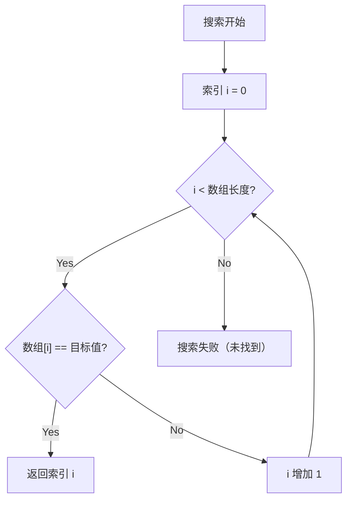
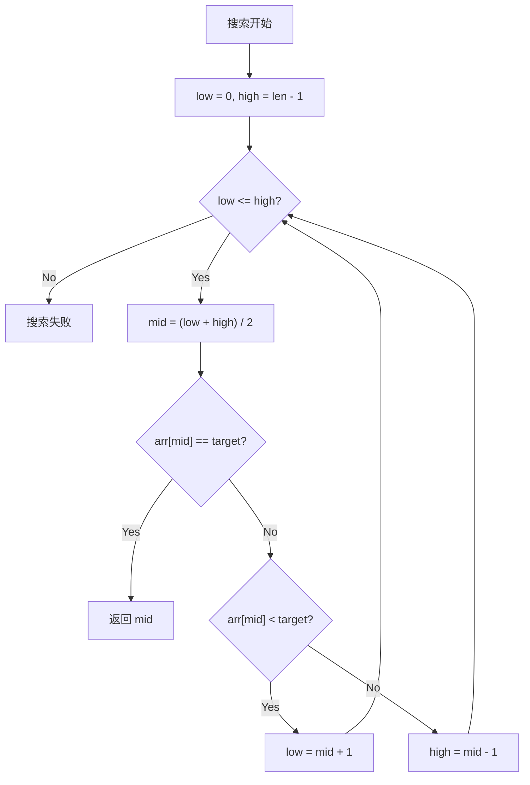
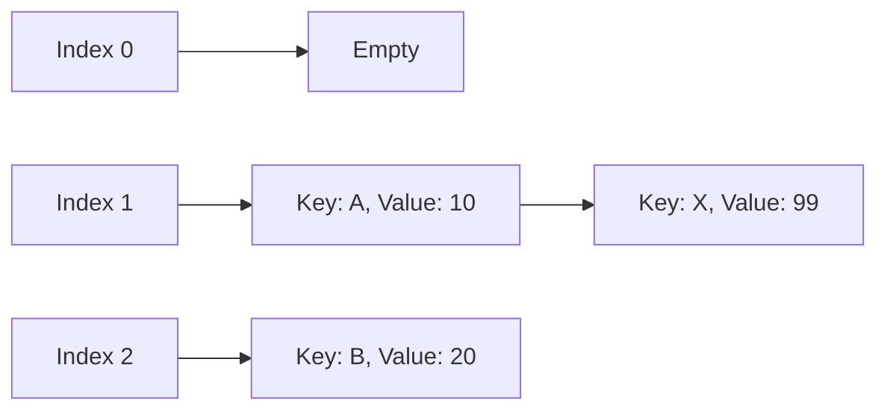

# 搜索算法的基础与重要性

在现代计算机科学中，迅速从数据中找出目标值的 **搜索算法** 是构成各种软件和系统根基的极其重要的技术。数据库的搜索、网络浏览器中的关键字搜索、智能手机联系人应用中的名字搜索等，我们在日常生活中经常受惠于搜索算法。

本文将结合其机制、时间复杂度和 Python 实现示例，详细解说计算机科学的基础——“线性搜索（Linear Search）”和“二分搜索（Binary Search）”算法。此外，还将突破这些算法的局限，深入探讨实现压倒性搜索速度的“哈希表（Hash Table）”的原理、哈希函数的作用，以及哈希冲突（Collision）的解决方法。


深入理解搜索算法，对于将程序员的技能提升一个台阶来说是不可或缺的。如果数据量较少，算法选择对性能的影响可能微乎其微，但在大数据时代，为了能从数百万、数亿的数据中瞬间找出目标信息，选择合适的算法和数据结构变得极其重要。特别是理解 **时间复杂度** （如 $O(n)$ 、 $O(\log n)$ 、 $O(1)$ 等）的概念，在设计高效程序时是必不可少的要素。

深入理解搜索算法，对于将程序员的技能提升一个台阶来说是不可或缺的。如果数据量较少，算法选择对性能的影响可能微乎其微，但在大数据时代，为了能从数百万、数亿的数据中瞬间找出目标信息，选择合适的算法和数据结构变得极其重要。特别是理解 **时间复杂度** （如 $O(n)$ 、 $O(\log n)$ 、 $O(1)$ 等）的概念，在设计高效程序时是必不可少的要素。

深入理解搜索算法，对于将程序员的技能提升一个台阶来说是不可或缺的。如果数据量较少，算法选择对性能的影响可能微乎其微，但在大数据时代，为了能从数百万、数亿的数据中瞬间找出目标信息，选择合适的算法和数据结构变得极其重要。特别是理解 **时间复杂度** （如 $O(n)$ 、 $O(\log n)$ 、 $O(1)$ 等）的概念，在设计高效程序时是必不可少的要素。

深入理解搜索算法，对于将程序员的技能提升一个台阶来说是不可或缺的。如果数据量较少，算法选择对性能的影响可能微乎其微，但在大数据时代，为了能从数百万、数亿的数据中瞬间找出目标信息，选择合适的算法和数据结构变得极其重要。特别是理解 **时间复杂度** （如 $O(n)$ 、 $O(\log n)$ 、 $O(1)$ 等）的概念，在设计高效程序时是必不可少的要素。

深入理解搜索算法，对于将程序员的技能提升一个台阶来说是不可或缺的。如果数据量较少，算法选择对性能的影响可能微乎其微，但在大数据时代，为了能从数百万、数亿的数据中瞬间找出目标信息，选择合适的算法和数据结构变得极其重要。特别是理解 **时间复杂度** （如 $O(n)$ 、 $O(\log n)$ 、 $O(1)$ 等）的概念，在设计高效程序时是必不可少的要素。

深入理解搜索算法，对于将程序员的技能提升一个台阶来说是不可或缺的。如果数据量较少，算法选择对性能的影响可能微乎其微，但在大数据时代，为了能从数百万、数亿的数据中瞬间找出目标信息，选择合适的算法和数据结构变得极其重要。特别是理解 **时间复杂度** （如 $O(n)$ 、 $O(\log n)$ 、 $O(1)$ 等）的概念，在设计高效程序时是必不可少的要素。

深入理解搜索算法，对于将程序员的技能提升一个台阶来说是不可或缺的。如果数据量较少，算法选择对性能的影响可能微乎其微，但在大数据时代，为了能从数百万、数亿的数据中瞬间找出目标信息，选择合适的算法和数据结构变得极其重要。特别是理解 **时间复杂度** （如 $O(n)$ 、 $O(\log n)$ 、 $O(1)$ 等）的概念，在设计高效程序时是必不可少的要素。

深入理解搜索算法，对于将程序员的技能提升一个台阶来说是不可或缺的。如果数据量较少，算法选择对性能的影响可能微乎其微，但在大数据时代，为了能从数百万、数亿的数据中瞬间找出目标信息，选择合适的算法和数据结构变得极其重要。特别是理解 **时间复杂度** （如 $O(n)$ 、 $O(\log n)$ 、 $O(1)$ 等）的概念，在设计高效程序时是必不可少的要素。

深入理解搜索算法，对于将程序员的技能提升一个台阶来说是不可或缺的。如果数据量较少，算法选择对性能的影响可能微乎其微，但在大数据时代，为了能从数百万、数亿的数据中瞬间找出目标信息，选择合适的算法和数据结构变得极其重要。特别是理解 **时间复杂度** （如 $O(n)$ 、 $O(\log n)$ 、 $O(1)$ 等）的概念，在设计高效程序时是必不可少的要素。

深入理解搜索算法，对于将程序员的技能提升一个台阶来说是不可或缺的。如果数据量较少，算法选择对性能的影响可能微乎其微，但在大数据时代，为了能从数百万、数亿的数据中瞬间找出目标信息，选择合适的算法和数据结构变得极其重要。特别是理解 **时间复杂度** （如 $O(n)$ 、 $O(\log n)$ 、 $O(1)$ 等）的概念，在设计高效程序时是必不可少的要素。

## 1. 线性搜索（Linear Search）

线性搜索是从数据结构（数组或列表等）的开头向末尾，按顺序逐个确认元素，直到找到目标值为止的，最简单且直观的搜索算法。

### 1.1 线性搜索的机制

线性搜索算法按以下步骤进行。

1. 取出数组的第一个元素。
2. 确认取出的元素是否与目标值相匹配。
3. 如果一致，则返回该元素的索引（位置）并结束搜索。
4. 如果不一致，则进入下一个元素。
5. 确认到数组的末尾，如果没有找到目标值，则作为搜索失败（例如返回 `-1` 或 `None`）结束。



### 1.2 使用 Python 实现线性搜索

下面展示使用 Python 实现线性搜索的简单示例。

```python
def linear_search(arr, target):
    """
    执行线性搜索的函数
    :param arr: 搜索目标的列表
    :param target: 想要查找的值
    :return: 如果找到则返回其索引，如果未找到则返回 -1
    """
    for i in range(len(arr)):
        if arr[i] == target:
            return i
    return -1

# 测试数据
numbers = [10, 23, 4, 15, 2, 7, 34, 11]
target_value = 7

result_index = linear_search(numbers, target_value)
if result_index != -1:
    print(f"元素 {target_value} 在索引 {result_index} 处被找到。")
else:
    print(f"元素 {target_value} 不存在于列表中。")
```


线性搜索的最大特点在于不需要对数据进行排序。即使数据以杂乱无章的顺序存储，由于是从头开始按顺序确认，也能确实地找到目标值（或者确认其不存在）。然而，这种“按顺序确认所有内容”的性质，正是数据量变大时性能下降的最大原因。

线性搜索的最大特点在于不需要对数据进行排序。即使数据以杂乱无章的顺序存储，由于是从头开始按顺序确认，也能确实地找到目标值（或者确认其不存在）。然而，这种“按顺序确认所有内容”的性质，正是数据量变大时性能下降的最大原因。

线性搜索的最大特点在于不需要对数据进行排序。即使数据以杂乱无章的顺序存储，由于是从头开始按顺序确认，也能确实地找到目标值（或者确认其不存在）。然而，这种“按顺序确认所有内容”的性质，正是数据量变大时性能下降的最大原因。

线性搜索的最大特点在于不需要对数据进行排序。即使数据以杂乱无章的顺序存储，由于是从头开始按顺序确认，也能确实地找到目标值（或者确认其不存在）。然而，这种“按顺序确认所有内容”的性质，正是数据量变大时性能下降的最大原因。

线性搜索的最大特点在于不需要对数据进行排序。即使数据以杂乱无章的顺序存储，由于是从头开始按顺序确认，也能确实地找到目标值（或者确认其不存在）。然而，这种“按顺序确认所有内容”的性质，正是数据量变大时性能下降的最大原因。

线性搜索的最大特点在于不需要对数据进行排序。即使数据以杂乱无章的顺序存储，由于是从头开始按顺序确认，也能确实地找到目标值（或者确认其不存在）。然而，这种“按顺序确认所有内容”的性质，正是数据量变大时性能下降的最大原因。

线性搜索的最大特点在于不需要对数据进行排序。即使数据以杂乱无章的顺序存储，由于是从头开始按顺序确认，也能确实地找到目标值（或者确认其不存在）。然而，这种“按顺序确认所有内容”的性质，正是数据量变大时性能下降的最大原因。

线性搜索的最大特点在于不需要对数据进行排序。即使数据以杂乱无章的顺序存储，由于是从头开始按顺序确认，也能确实地找到目标值（或者确认其不存在）。然而，这种“按顺序确认所有内容”的性质，正是数据量变大时性能下降的最大原因。

线性搜索的最大特点在于不需要对数据进行排序。即使数据以杂乱无章的顺序存储，由于是从头开始按顺序确认，也能确实地找到目标值（或者确认其不存在）。然而，这种“按顺序确认所有内容”的性质，正是数据量变大时性能下降的最大原因。

线性搜索的最大特点在于不需要对数据进行排序。即使数据以杂乱无章的顺序存储，由于是从头开始按顺序确认，也能确实地找到目标值（或者确认其不存在）。然而，这种“按顺序确认所有内容”的性质，正是数据量变大时性能下降的最大原因。

线性搜索的最大特点在于不需要对数据进行排序。即使数据以杂乱无章的顺序存储，由于是从头开始按顺序确认，也能确实地找到目标值（或者确认其不存在）。然而，这种“按顺序确认所有内容”的性质，正是数据量变大时性能下降的最大原因。

线性搜索的最大特点在于不需要对数据进行排序。即使数据以杂乱无章的顺序存储，由于是从头开始按顺序确认，也能确实地找到目标值（或者确认其不存在）。然而，这种“按顺序确认所有内容”的性质，正是数据量变大时性能下降的最大原因。

线性搜索的最大特点在于不需要对数据进行排序。即使数据以杂乱无章的顺序存储，由于是从头开始按顺序确认，也能确实地找到目标值（或者确认其不存在）。然而，这种“按顺序确认所有内容”的性质，正是数据量变大时性能下降的最大原因。

线性搜索的最大特点在于不需要对数据进行排序。即使数据以杂乱无章的顺序存储，由于是从头开始按顺序确认，也能确实地找到目标值（或者确认其不存在）。然而，这种“按顺序确认所有内容”的性质，正是数据量变大时性能下降的最大原因。

线性搜索的最大特点在于不需要对数据进行排序。即使数据以杂乱无章的顺序存储，由于是从头开始按顺序确认，也能确实地找到目标值（或者确认其不存在）。然而，这种“按顺序确认所有内容”的性质，正是数据量变大时性能下降的最大原因。

线性搜索的最大特点在于不需要对数据进行排序。即使数据以杂乱无章的顺序存储，由于是从头开始按顺序确认，也能确实地找到目标值（或者确认其不存在）。然而，这种“按顺序确认所有内容”的性质，正是数据量变大时性能下降的最大原因。

线性搜索的最大特点在于不需要对数据进行排序。即使数据以杂乱无章的顺序存储，由于是从头开始按顺序确认，也能确实地找到目标值（或者确认其不存在）。然而，这种“按顺序确认所有内容”的性质，正是数据量变大时性能下降的最大原因。

线性搜索的最大特点在于不需要对数据进行排序。即使数据以杂乱无章的顺序存储，由于是从头开始按顺序确认，也能确实地找到目标值（或者确认其不存在）。然而，这种“按顺序确认所有内容”的性质，正是数据量变大时性能下降的最大原因。

线性搜索的最大特点在于不需要对数据进行排序。即使数据以杂乱无章的顺序存储，由于是从头开始按顺序确认，也能确实地找到目标值（或者确认其不存在）。然而，这种“按顺序确认所有内容”的性质，正是数据量变大时性能下降的最大原因。

线性搜索的最大特点在于不需要对数据进行排序。即使数据以杂乱无章的顺序存储，由于是从头开始按顺序确认，也能确实地找到目标值（或者确认其不存在）。然而，这种“按顺序确认所有内容”的性质，正是数据量变大时性能下降的最大原因。

线性搜索的最大特点在于不需要对数据进行排序。即使数据以杂乱无章的顺序存储，由于是从头开始按顺序确认，也能确实地找到目标值（或者确认其不存在）。然而，这种“按顺序确认所有内容”的性质，正是数据量变大时性能下降的最大原因。

线性搜索的最大特点在于不需要对数据进行排序。即使数据以杂乱无章的顺序存储，由于是从头开始按顺序确认，也能确实地找到目标值（或者确认其不存在）。然而，这种“按顺序确认所有内容”的性质，正是数据量变大时性能下降的最大原因。

线性搜索的最大特点在于不需要对数据进行排序。即使数据以杂乱无章的顺序存储，由于是从头开始按顺序确认，也能确实地找到目标值（或者确认其不存在）。然而，这种“按顺序确认所有内容”的性质，正是数据量变大时性能下降的最大原因。

线性搜索的最大特点在于不需要对数据进行排序。即使数据以杂乱无章的顺序存储，由于是从头开始按顺序确认，也能确实地找到目标值（或者确认其不存在）。然而，这种“按顺序确认所有内容”的性质，正是数据量变大时性能下降的最大原因。

线性搜索的最大特点在于不需要对数据进行排序。即使数据以杂乱无章的顺序存储，由于是从头开始按顺序确认，也能确实地找到目标值（或者确认其不存在）。然而，这种“按顺序确认所有内容”的性质，正是数据量变大时性能下降的最大原因。

线性搜索的最大特点在于不需要对数据进行排序。即使数据以杂乱无章的顺序存储，由于是从头开始按顺序确认，也能确实地找到目标值（或者确认其不存在）。然而，这种“按顺序确认所有内容”的性质，正是数据量变大时性能下降的最大原因。

线性搜索的最大特点在于不需要对数据进行排序。即使数据以杂乱无章的顺序存储，由于是从头开始按顺序确认，也能确实地找到目标值（或者确认其不存在）。然而，这种“按顺序确认所有内容”的性质，正是数据量变大时性能下降的最大原因。

线性搜索的最大特点在于不需要对数据进行排序。即使数据以杂乱无章的顺序存储，由于是从头开始按顺序确认，也能确实地找到目标值（或者确认其不存在）。然而，这种“按顺序确认所有内容”的性质，正是数据量变大时性能下降的最大原因。

线性搜索的最大特点在于不需要对数据进行排序。即使数据以杂乱无章的顺序存储，由于是从头开始按顺序确认，也能确实地找到目标值（或者确认其不存在）。然而，这种“按顺序确认所有内容”的性质，正是数据量变大时性能下降的最大原因。

线性搜索的最大特点在于不需要对数据进行排序。即使数据以杂乱无章的顺序存储，由于是从头开始按顺序确认，也能确实地找到目标值（或者确认其不存在）。然而，这种“按顺序确认所有内容”的性质，正是数据量变大时性能下降的最大原因。

线性搜索的最大特点在于不需要对数据进行排序。即使数据以杂乱无章的顺序存储，由于是从头开始按顺序确认，也能确实地找到目标值（或者确认其不存在）。然而，这种“按顺序确认所有内容”的性质，正是数据量变大时性能下降的最大原因。

线性搜索的最大特点在于不需要对数据进行排序。即使数据以杂乱无章的顺序存储，由于是从头开始按顺序确认，也能确实地找到目标值（或者确认其不存在）。然而，这种“按顺序确认所有内容”的性质，正是数据量变大时性能下降的最大原因。

线性搜索的最大特点在于不需要对数据进行排序。即使数据以杂乱无章的顺序存储，由于是从头开始按顺序确认，也能确实地找到目标值（或者确认其不存在）。然而，这种“按顺序确认所有内容”的性质，正是数据量变大时性能下降的最大原因。

线性搜索的最大特点在于不需要对数据进行排序。即使数据以杂乱无章的顺序存储，由于是从头开始按顺序确认，也能确实地找到目标值（或者确认其不存在）。然而，这种“按顺序确认所有内容”的性质，正是数据量变大时性能下降的最大原因。

线性搜索的最大特点在于不需要对数据进行排序。即使数据以杂乱无章的顺序存储，由于是从头开始按顺序确认，也能确实地找到目标值（或者确认其不存在）。然而，这种“按顺序确认所有内容”的性质，正是数据量变大时性能下降的最大原因。

线性搜索的最大特点在于不需要对数据进行排序。即使数据以杂乱无章的顺序存储，由于是从头开始按顺序确认，也能确实地找到目标值（或者确认其不存在）。然而，这种“按顺序确认所有内容”的性质，正是数据量变大时性能下降的最大原因。

线性搜索的最大特点在于不需要对数据进行排序。即使数据以杂乱无章的顺序存储，由于是从头开始按顺序确认，也能确实地找到目标值（或者确认其不存在）。然而，这种“按顺序确认所有内容”的性质，正是数据量变大时性能下降的最大原因。

线性搜索的最大特点在于不需要对数据进行排序。即使数据以杂乱无章的顺序存储，由于是从头开始按顺序确认，也能确实地找到目标值（或者确认其不存在）。然而，这种“按顺序确认所有内容”的性质，正是数据量变大时性能下降的最大原因。

线性搜索的最大特点在于不需要对数据进行排序。即使数据以杂乱无章的顺序存储，由于是从头开始按顺序确认，也能确实地找到目标值（或者确认其不存在）。然而，这种“按顺序确认所有内容”的性质，正是数据量变大时性能下降的最大原因。

线性搜索的最大特点在于不需要对数据进行排序。即使数据以杂乱无章的顺序存储，由于是从头开始按顺序确认，也能确实地找到目标值（或者确认其不存在）。然而，这种“按顺序确认所有内容”的性质，正是数据量变大时性能下降的最大原因。

线性搜索的最大特点在于不需要对数据进行排序。即使数据以杂乱无章的顺序存储，由于是从头开始按顺序确认，也能确实地找到目标值（或者确认其不存在）。然而，这种“按顺序确认所有内容”的性质，正是数据量变大时性能下降的最大原因。

线性搜索的最大特点在于不需要对数据进行排序。即使数据以杂乱无章的顺序存储，由于是从头开始按顺序确认，也能确实地找到目标值（或者确认其不存在）。然而，这种“按顺序确认所有内容”的性质，正是数据量变大时性能下降的最大原因。

线性搜索的最大特点在于不需要对数据进行排序。即使数据以杂乱无章的顺序存储，由于是从头开始按顺序确认，也能确实地找到目标值（或者确认其不存在）。然而，这种“按顺序确认所有内容”的性质，正是数据量变大时性能下降的最大原因。

线性搜索的最大特点在于不需要对数据进行排序。即使数据以杂乱无章的顺序存储，由于是从头开始按顺序确认，也能确实地找到目标值（或者确认其不存在）。然而，这种“按顺序确认所有内容”的性质，正是数据量变大时性能下降的最大原因。

线性搜索的最大特点在于不需要对数据进行排序。即使数据以杂乱无章的顺序存储，由于是从头开始按顺序确认，也能确实地找到目标值（或者确认其不存在）。然而，这种“按顺序确认所有内容”的性质，正是数据量变大时性能下降的最大原因。

线性搜索的最大特点在于不需要对数据进行排序。即使数据以杂乱无章的顺序存储，由于是从头开始按顺序确认，也能确实地找到目标值（或者确认其不存在）。然而，这种“按顺序确认所有内容”的性质，正是数据量变大时性能下降的最大原因。

线性搜索的最大特点在于不需要对数据进行排序。即使数据以杂乱无章的顺序存储，由于是从头开始按顺序确认，也能确实地找到目标值（或者确认其不存在）。然而，这种“按顺序确认所有内容”的性质，正是数据量变大时性能下降的最大原因。

线性搜索的最大特点在于不需要对数据进行排序。即使数据以杂乱无章的顺序存储，由于是从头开始按顺序确认，也能确实地找到目标值（或者确认其不存在）。然而，这种“按顺序确认所有内容”的性质，正是数据量变大时性能下降的最大原因。

线性搜索的最大特点在于不需要对数据进行排序。即使数据以杂乱无章的顺序存储，由于是从头开始按顺序确认，也能确实地找到目标值（或者确认其不存在）。然而，这种“按顺序确认所有内容”的性质，正是数据量变大时性能下降的最大原因。

线性搜索的最大特点在于不需要对数据进行排序。即使数据以杂乱无章的顺序存储，由于是从头开始按顺序确认，也能确实地找到目标值（或者确认其不存在）。然而，这种“按顺序确认所有内容”的性质，正是数据量变大时性能下降的最大原因。

## 2. 二分搜索（Binary Search）

二分搜索是仅能应用于 **预先已排序（升序或降序排列）的数据** 的极其高速且高效的搜索算法。通过将搜索范围逐次对半缩小，可以剧烈地减少计算量。

### 2.1 二分搜索的机制

二分搜索按以下步骤进行。

1. 初始化搜索目标数组的“左端（`low`）”和“右端（`high`）”索引。
2. 只要搜索范围有效（`low <= high`），就重复以下处理。
3. 计算搜索范围中间的索引（`mid`）。
4. 比较中间的元素（`arr[mid]`）和目标值。
5. 如果一致，则返回 `mid` 并结束。
6. 如果中间的元素小于目标值，说明目标值存在于右半部分的范围内，因此将左端更新为 `mid + 1`。
7. 如果中间的元素大于目标值，说明目标值存在于左半部分的范围内，因此将右端更新为 `mid - 1`。
8. 如果搜索范围消失仍未找到，则视为搜索失败。



### 2.2 使用 Python 实现二分搜索（迭代法）

```python
def binary_search(arr, target):
    """
    执行二分搜索（迭代法）的函数
    :param arr: 已排序的搜索目标列表
    :param target: 想要查找的值
    :return: 如果找到则返回其索引，如果未找到则返回 -1
    """
    low = 0
    high = len(arr) - 1

    while low <= high:
        mid = (low + high) // 2
        
        if arr[mid] == target:
            return mid
        elif arr[mid] < target:
            low = mid + 1
        else:
            high = mid - 1
            
    return -1

# 测试数据（必须已排序）
sorted_numbers = [2, 4, 7, 10, 11, 15, 23, 34]
target_value = 15

result_index = binary_search(sorted_numbers, target_value)
if result_index != -1:
    print(f"元素 {target_value} 在索引 {result_index} 处被找到。")
else:
    print(f"元素 {target_value} 不存在于列表中。")
```

二分搜索惊人的性能来自于每次将搜索范围对半分割的性质。例如，对含有 100 万个元素的数组进行线性搜索，最坏的情况下需要进行 100 万次比较，但如果使用二分搜索，只需大约 20 次比较就能找到目标值（$2^{20} \approx 1,000,000$）。因此，在针对大规模数据集的搜索操作中，二分搜索与线性搜索相比拥有压倒性的优势。在数学上，二分搜索的时间复杂度表示为 $O(\log n)$ 。

二分搜索惊人的性能来自于每次将搜索范围对半分割的性质。例如，对含有 100 万个元素的数组进行线性搜索，最坏的情况下需要进行 100 万次比较，但如果使用二分搜索，只需大约 20 次比较就能找到目标值（$2^{20} \approx 1,000,000$）。因此，在针对大规模数据集的搜索操作中，二分搜索与线性搜索相比拥有压倒性的优势。在数学上，二分搜索的时间复杂度表示为 $O(\log n)$ 。

二分搜索惊人的性能来自于每次将搜索范围对半分割的性质。例如，对含有 100 万个元素的数组进行线性搜索，最坏的情况下需要进行 100 万次比较，但如果使用二分搜索，只需大约 20 次比较就能找到目标值（$2^{20} \approx 1,000,000$）。因此，在针对大规模数据集的搜索操作中，二分搜索与线性搜索相比拥有压倒性的优势。在数学上，二分搜索的时间复杂度表示为 $O(\log n)$ 。

二分搜索惊人的性能来自于每次将搜索范围对半分割的性质。例如，对含有 100 万个元素的数组进行线性搜索，最坏的情况下需要进行 100 万次比较，但如果使用二分搜索，只需大约 20 次比较就能找到目标值（$2^{20} \approx 1,000,000$）。因此，在针对大规模数据集的搜索操作中，二分搜索与线性搜索相比拥有压倒性的优势。在数学上，二分搜索的时间复杂度表示为 $O(\log n)$ 。

二分搜索惊人的性能来自于每次将搜索范围对半分割的性质。例如，对含有 100 万个元素的数组进行线性搜索，最坏的情况下需要进行 100 万次比较，但如果使用二分搜索，只需大约 20 次比较就能找到目标值（$2^{20} \approx 1,000,000$）。因此，在针对大规模数据集的搜索操作中，二分搜索与线性搜索相比拥有压倒性的优势。在数学上，二分搜索的时间复杂度表示为 $O(\log n)$ 。

二分搜索惊人的性能来自于每次将搜索范围对半分割的性质。例如，对含有 100 万个元素的数组进行线性搜索，最坏的情况下需要进行 100 万次比较，但如果使用二分搜索，只需大约 20 次比较就能找到目标值（$2^{20} \approx 1,000,000$）。因此，在针对大规模数据集的搜索操作中，二分搜索与线性搜索相比拥有压倒性的优势。在数学上，二分搜索的时间复杂度表示为 $O(\log n)$ 。

二分搜索惊人的性能来自于每次将搜索范围对半分割的性质。例如，对含有 100 万个元素的数组进行线性搜索，最坏的情况下需要进行 100 万次比较，但如果使用二分搜索，只需大约 20 次比较就能找到目标值（$2^{20} \approx 1,000,000$）。因此，在针对大规模数据集的搜索操作中，二分搜索与线性搜索相比拥有压倒性的优势。在数学上，二分搜索的时间复杂度表示为 $O(\log n)$ 。

二分搜索惊人的性能来自于每次将搜索范围对半分割的性质。例如，对含有 100 万个元素的数组进行线性搜索，最坏的情况下需要进行 100 万次比较，但如果使用二分搜索，只需大约 20 次比较就能找到目标值（$2^{20} \approx 1,000,000$）。因此，在针对大规模数据集的搜索操作中，二分搜索与线性搜索相比拥有压倒性的优势。在数学上，二分搜索的时间复杂度表示为 $O(\log n)$ 。

二分搜索惊人的性能来自于每次将搜索范围对半分割的性质。例如，对含有 100 万个元素的数组进行线性搜索，最坏的情况下需要进行 100 万次比较，但如果使用二分搜索，只需大约 20 次比较就能找到目标值（$2^{20} \approx 1,000,000$）。因此，在针对大规模数据集的搜索操作中，二分搜索与线性搜索相比拥有压倒性的优势。在数学上，二分搜索的时间复杂度表示为 $O(\log n)$ 。

二分搜索惊人的性能来自于每次将搜索范围对半分割的性质。例如，对含有 100 万个元素的数组进行线性搜索，最坏的情况下需要进行 100 万次比较，但如果使用二分搜索，只需大约 20 次比较就能找到目标值（$2^{20} \approx 1,000,000$）。因此，在针对大规模数据集的搜索操作中，二分搜索与线性搜索相比拥有压倒性的优势。在数学上，二分搜索的时间复杂度表示为 $O(\log n)$ 。

二分搜索惊人的性能来自于每次将搜索范围对半分割的性质。例如，对含有 100 万个元素的数组进行线性搜索，最坏的情况下需要进行 100 万次比较，但如果使用二分搜索，只需大约 20 次比较就能找到目标值（$2^{20} \approx 1,000,000$）。因此，在针对大规模数据集的搜索操作中，二分搜索与线性搜索相比拥有压倒性的优势。在数学上，二分搜索的时间复杂度表示为 $O(\log n)$ 。

二分搜索惊人的性能来自于每次将搜索范围对半分割的性质。例如，对含有 100 万个元素的数组进行线性搜索，最坏的情况下需要进行 100 万次比较，但如果使用二分搜索，只需大约 20 次比较就能找到目标值（$2^{20} \approx 1,000,000$）。因此，在针对大规模数据集的搜索操作中，二分搜索与线性搜索相比拥有压倒性的优势。在数学上，二分搜索的时间复杂度表示为 $O(\log n)$ 。

二分搜索惊人的性能来自于每次将搜索范围对半分割的性质。例如，对含有 100 万个元素的数组进行线性搜索，最坏的情况下需要进行 100 万次比较，但如果使用二分搜索，只需大约 20 次比较就能找到目标值（$2^{20} \approx 1,000,000$）。因此，在针对大规模数据集的搜索操作中，二分搜索与线性搜索相比拥有压倒性的优势。在数学上，二分搜索的时间复杂度表示为 $O(\log n)$ 。

二分搜索惊人的性能来自于每次将搜索范围对半分割的性质。例如，对含有 100 万个元素的数组进行线性搜索，最坏的情况下需要进行 100 万次比较，但如果使用二分搜索，只需大约 20 次比较就能找到目标值（$2^{20} \approx 1,000,000$）。因此，在针对大规模数据集的搜索操作中，二分搜索与线性搜索相比拥有压倒性的优势。在数学上，二分搜索的时间复杂度表示为 $O(\log n)$ 。

二分搜索惊人的性能来自于每次将搜索范围对半分割的性质。例如，对含有 100 万个元素的数组进行线性搜索，最坏的情况下需要进行 100 万次比较，但如果使用二分搜索，只需大约 20 次比较就能找到目标值（$2^{20} \approx 1,000,000$）。因此，在针对大规模数据集的搜索操作中，二分搜索与线性搜索相比拥有压倒性的优势。在数学上，二分搜索的时间复杂度表示为 $O(\log n)$ 。

二分搜索惊人的性能来自于每次将搜索范围对半分割的性质。例如，对含有 100 万个元素的数组进行线性搜索，最坏的情况下需要进行 100 万次比较，但如果使用二分搜索，只需大约 20 次比较就能找到目标值（$2^{20} \approx 1,000,000$）。因此，在针对大规模数据集的搜索操作中，二分搜索与线性搜索相比拥有压倒性的优势。在数学上，二分搜索的时间复杂度表示为 $O(\log n)$ 。

二分搜索惊人的性能来自于每次将搜索范围对半分割的性质。例如，对含有 100 万个元素的数组进行线性搜索，最坏的情况下需要进行 100 万次比较，但如果使用二分搜索，只需大约 20 次比较就能找到目标值（$2^{20} \approx 1,000,000$）。因此，在针对大规模数据集的搜索操作中，二分搜索与线性搜索相比拥有压倒性的优势。在数学上，二分搜索的时间复杂度表示为 $O(\log n)$ 。

二分搜索惊人的性能来自于每次将搜索范围对半分割的性质。例如，对含有 100 万个元素的数组进行线性搜索，最坏的情况下需要进行 100 万次比较，但如果使用二分搜索，只需大约 20 次比较就能找到目标值（$2^{20} \approx 1,000,000$）。因此，在针对大规模数据集的搜索操作中，二分搜索与线性搜索相比拥有压倒性的优势。在数学上，二分搜索的时间复杂度表示为 $O(\log n)$ 。

二分搜索惊人的性能来自于每次将搜索范围对半分割的性质。例如，对含有 100 万个元素的数组进行线性搜索，最坏的情况下需要进行 100 万次比较，但如果使用二分搜索，只需大约 20 次比较就能找到目标值（$2^{20} \approx 1,000,000$）。因此，在针对大规模数据集的搜索操作中，二分搜索与线性搜索相比拥有压倒性的优势。在数学上，二分搜索的时间复杂度表示为 $O(\log n)$ 。

二分搜索惊人的性能来自于每次将搜索范围对半分割的性质。例如，对含有 100 万个元素的数组进行线性搜索，最坏的情况下需要进行 100 万次比较，但如果使用二分搜索，只需大约 20 次比较就能找到目标值（$2^{20} \approx 1,000,000$）。因此，在针对大规模数据集的搜索操作中，二分搜索与线性搜索相比拥有压倒性的优势。在数学上，二分搜索的时间复杂度表示为 $O(\log n)$ 。

二分搜索惊人的性能来自于每次将搜索范围对半分割的性质。例如，对含有 100 万个元素的数组进行线性搜索，最坏的情况下需要进行 100 万次比较，但如果使用二分搜索，只需大约 20 次比较就能找到目标值（$2^{20} \approx 1,000,000$）。因此，在针对大规模数据集的搜索操作中，二分搜索与线性搜索相比拥有压倒性的优势。在数学上，二分搜索的时间复杂度表示为 $O(\log n)$ 。

二分搜索惊人的性能来自于每次将搜索范围对半分割的性质。例如，对含有 100 万个元素的数组进行线性搜索，最坏的情况下需要进行 100 万次比较，但如果使用二分搜索，只需大约 20 次比较就能找到目标值（$2^{20} \approx 1,000,000$）。因此，在针对大规模数据集的搜索操作中，二分搜索与线性搜索相比拥有压倒性的优势。在数学上，二分搜索的时间复杂度表示为 $O(\log n)$ 。

二分搜索惊人的性能来自于每次将搜索范围对半分割的性质。例如，对含有 100 万个元素的数组进行线性搜索，最坏的情况下需要进行 100 万次比较，但如果使用二分搜索，只需大约 20 次比较就能找到目标值（$2^{20} \approx 1,000,000$）。因此，在针对大规模数据集的搜索操作中，二分搜索与线性搜索相比拥有压倒性的优势。在数学上，二分搜索的时间复杂度表示为 $O(\log n)$ 。

二分搜索惊人的性能来自于每次将搜索范围对半分割的性质。例如，对含有 100 万个元素的数组进行线性搜索，最坏的情况下需要进行 100 万次比较，但如果使用二分搜索，只需大约 20 次比较就能找到目标值（$2^{20} \approx 1,000,000$）。因此，在针对大规模数据集的搜索操作中，二分搜索与线性搜索相比拥有压倒性的优势。在数学上，二分搜索的时间复杂度表示为 $O(\log n)$ 。

二分搜索惊人的性能来自于每次将搜索范围对半分割的性质。例如，对含有 100 万个元素的数组进行线性搜索，最坏的情况下需要进行 100 万次比较，但如果使用二分搜索，只需大约 20 次比较就能找到目标值（$2^{20} \approx 1,000,000$）。因此，在针对大规模数据集的搜索操作中，二分搜索与线性搜索相比拥有压倒性的优势。在数学上，二分搜索的时间复杂度表示为 $O(\log n)$ 。

二分搜索惊人的性能来自于每次将搜索范围对半分割的性质。例如，对含有 100 万个元素的数组进行线性搜索，最坏的情况下需要进行 100 万次比较，但如果使用二分搜索，只需大约 20 次比较就能找到目标值（$2^{20} \approx 1,000,000$）。因此，在针对大规模数据集的搜索操作中，二分搜索与线性搜索相比拥有压倒性的优势。在数学上，二分搜索的时间复杂度表示为 $O(\log n)$ 。

二分搜索惊人的性能来自于每次将搜索范围对半分割的性质。例如，对含有 100 万个元素的数组进行线性搜索，最坏的情况下需要进行 100 万次比较，但如果使用二分搜索，只需大约 20 次比较就能找到目标值（$2^{20} \approx 1,000,000$）。因此，在针对大规模数据集的搜索操作中，二分搜索与线性搜索相比拥有压倒性的优势。在数学上，二分搜索的时间复杂度表示为 $O(\log n)$ 。

二分搜索惊人的性能来自于每次将搜索范围对半分割的性质。例如，对含有 100 万个元素的数组进行线性搜索，最坏的情况下需要进行 100 万次比较，但如果使用二分搜索，只需大约 20 次比较就能找到目标值（$2^{20} \approx 1,000,000$）。因此，在针对大规模数据集的搜索操作中，二分搜索与线性搜索相比拥有压倒性的优势。在数学上，二分搜索的时间复杂度表示为 $O(\log n)$ 。

二分搜索惊人的性能来自于每次将搜索范围对半分割的性质。例如，对含有 100 万个元素的数组进行线性搜索，最坏的情况下需要进行 100 万次比较，但如果使用二分搜索，只需大约 20 次比较就能找到目标值（$2^{20} \approx 1,000,000$）。因此，在针对大规模数据集的搜索操作中，二分搜索与线性搜索相比拥有压倒性的优势。在数学上，二分搜索的时间复杂度表示为 $O(\log n)$ 。

二分搜索惊人的性能来自于每次将搜索范围对半分割的性质。例如，对含有 100 万个元素的数组进行线性搜索，最坏的情况下需要进行 100 万次比较，但如果使用二分搜索，只需大约 20 次比较就能找到目标值（$2^{20} \approx 1,000,000$）。因此，在针对大规模数据集的搜索操作中，二分搜索与线性搜索相比拥有压倒性的优势。在数学上，二分搜索的时间复杂度表示为 $O(\log n)$ 。

二分搜索惊人的性能来自于每次将搜索范围对半分割的性质。例如，对含有 100 万个元素的数组进行线性搜索，最坏的情况下需要进行 100 万次比较，但如果使用二分搜索，只需大约 20 次比较就能找到目标值（$2^{20} \approx 1,000,000$）。因此，在针对大规模数据集的搜索操作中，二分搜索与线性搜索相比拥有压倒性的优势。在数学上，二分搜索的时间复杂度表示为 $O(\log n)$ 。

二分搜索惊人的性能来自于每次将搜索范围对半分割的性质。例如，对含有 100 万个元素的数组进行线性搜索，最坏的情况下需要进行 100 万次比较，但如果使用二分搜索，只需大约 20 次比较就能找到目标值（$2^{20} \approx 1,000,000$）。因此，在针对大规模数据集的搜索操作中，二分搜索与线性搜索相比拥有压倒性的优势。在数学上，二分搜索的时间复杂度表示为 $O(\log n)$ 。

二分搜索惊人的性能来自于每次将搜索范围对半分割的性质。例如，对含有 100 万个元素的数组进行线性搜索，最坏的情况下需要进行 100 万次比较，但如果使用二分搜索，只需大约 20 次比较就能找到目标值（$2^{20} \approx 1,000,000$）。因此，在针对大规模数据集的搜索操作中，二分搜索与线性搜索相比拥有压倒性的优势。在数学上，二分搜索的时间复杂度表示为 $O(\log n)$ 。

二分搜索惊人的性能来自于每次将搜索范围对半分割的性质。例如，对含有 100 万个元素的数组进行线性搜索，最坏的情况下需要进行 100 万次比较，但如果使用二分搜索，只需大约 20 次比较就能找到目标值（$2^{20} \approx 1,000,000$）。因此，在针对大规模数据集的搜索操作中，二分搜索与线性搜索相比拥有压倒性的优势。在数学上，二分搜索的时间复杂度表示为 $O(\log n)$ 。

二分搜索惊人的性能来自于每次将搜索范围对半分割的性质。例如，对含有 100 万个元素的数组进行线性搜索，最坏的情况下需要进行 100 万次比较，但如果使用二分搜索，只需大约 20 次比较就能找到目标值（$2^{20} \approx 1,000,000$）。因此，在针对大规模数据集的搜索操作中，二分搜索与线性搜索相比拥有压倒性的优势。在数学上，二分搜索的时间复杂度表示为 $O(\log n)$ 。

二分搜索惊人的性能来自于每次将搜索范围对半分割的性质。例如，对含有 100 万个元素的数组进行线性搜索，最坏的情况下需要进行 100 万次比较，但如果使用二分搜索，只需大约 20 次比较就能找到目标值（$2^{20} \approx 1,000,000$）。因此，在针对大规模数据集的搜索操作中，二分搜索与线性搜索相比拥有压倒性的优势。在数学上，二分搜索的时间复杂度表示为 $O(\log n)$ 。

二分搜索惊人的性能来自于每次将搜索范围对半分割的性质。例如，对含有 100 万个元素的数组进行线性搜索，最坏的情况下需要进行 100 万次比较，但如果使用二分搜索，只需大约 20 次比较就能找到目标值（$2^{20} \approx 1,000,000$）。因此，在针对大规模数据集的搜索操作中，二分搜索与线性搜索相比拥有压倒性的优势。在数学上，二分搜索的时间复杂度表示为 $O(\log n)$ 。

二分搜索惊人的性能来自于每次将搜索范围对半分割的性质。例如，对含有 100 万个元素的数组进行线性搜索，最坏的情况下需要进行 100 万次比较，但如果使用二分搜索，只需大约 20 次比较就能找到目标值（$2^{20} \approx 1,000,000$）。因此，在针对大规模数据集的搜索操作中，二分搜索与线性搜索相比拥有压倒性的优势。在数学上，二分搜索的时间复杂度表示为 $O(\log n)$ 。

二分搜索惊人的性能来自于每次将搜索范围对半分割的性质。例如，对含有 100 万个元素的数组进行线性搜索，最坏的情况下需要进行 100 万次比较，但如果使用二分搜索，只需大约 20 次比较就能找到目标值（$2^{20} \approx 1,000,000$）。因此，在针对大规模数据集的搜索操作中，二分搜索与线性搜索相比拥有压倒性的优势。在数学上，二分搜索的时间复杂度表示为 $O(\log n)$ 。

二分搜索惊人的性能来自于每次将搜索范围对半分割的性质。例如，对含有 100 万个元素的数组进行线性搜索，最坏的情况下需要进行 100 万次比较，但如果使用二分搜索，只需大约 20 次比较就能找到目标值（$2^{20} \approx 1,000,000$）。因此，在针对大规模数据集的搜索操作中，二分搜索与线性搜索相比拥有压倒性的优势。在数学上，二分搜索的时间复杂度表示为 $O(\log n)$ 。

二分搜索惊人的性能来自于每次将搜索范围对半分割的性质。例如，对含有 100 万个元素的数组进行线性搜索，最坏的情况下需要进行 100 万次比较，但如果使用二分搜索，只需大约 20 次比较就能找到目标值（$2^{20} \approx 1,000,000$）。因此，在针对大规模数据集的搜索操作中，二分搜索与线性搜索相比拥有压倒性的优势。在数学上，二分搜索的时间复杂度表示为 $O(\log n)$ 。

二分搜索惊人的性能来自于每次将搜索范围对半分割的性质。例如，对含有 100 万个元素的数组进行线性搜索，最坏的情况下需要进行 100 万次比较，但如果使用二分搜索，只需大约 20 次比较就能找到目标值（$2^{20} \approx 1,000,000$）。因此，在针对大规模数据集的搜索操作中，二分搜索与线性搜索相比拥有压倒性的优势。在数学上，二分搜索的时间复杂度表示为 $O(\log n)$ 。

二分搜索惊人的性能来自于每次将搜索范围对半分割的性质。例如，对含有 100 万个元素的数组进行线性搜索，最坏的情况下需要进行 100 万次比较，但如果使用二分搜索，只需大约 20 次比较就能找到目标值（$2^{20} \approx 1,000,000$）。因此，在针对大规模数据集的搜索操作中，二分搜索与线性搜索相比拥有压倒性的优势。在数学上，二分搜索的时间复杂度表示为 $O(\log n)$ 。

二分搜索惊人的性能来自于每次将搜索范围对半分割的性质。例如，对含有 100 万个元素的数组进行线性搜索，最坏的情况下需要进行 100 万次比较，但如果使用二分搜索，只需大约 20 次比较就能找到目标值（$2^{20} \approx 1,000,000$）。因此，在针对大规模数据集的搜索操作中，二分搜索与线性搜索相比拥有压倒性的优势。在数学上，二分搜索的时间复杂度表示为 $O(\log n)$ 。

二分搜索惊人的性能来自于每次将搜索范围对半分割的性质。例如，对含有 100 万个元素的数组进行线性搜索，最坏的情况下需要进行 100 万次比较，但如果使用二分搜索，只需大约 20 次比较就能找到目标值（$2^{20} \approx 1,000,000$）。因此，在针对大规模数据集的搜索操作中，二分搜索与线性搜索相比拥有压倒性的优势。在数学上，二分搜索的时间复杂度表示为 $O(\log n)$ 。

二分搜索惊人的性能来自于每次将搜索范围对半分割的性质。例如，对含有 100 万个元素的数组进行线性搜索，最坏的情况下需要进行 100 万次比较，但如果使用二分搜索，只需大约 20 次比较就能找到目标值（$2^{20} \approx 1,000,000$）。因此，在针对大规模数据集的搜索操作中，二分搜索与线性搜索相比拥有压倒性的优势。在数学上，二分搜索的时间复杂度表示为 $O(\log n)$ 。

二分搜索惊人的性能来自于每次将搜索范围对半分割的性质。例如，对含有 100 万个元素的数组进行线性搜索，最坏的情况下需要进行 100 万次比较，但如果使用二分搜索，只需大约 20 次比较就能找到目标值（$2^{20} \approx 1,000,000$）。因此，在针对大规模数据集的搜索操作中，二分搜索与线性搜索相比拥有压倒性的优势。在数学上，二分搜索的时间复杂度表示为 $O(\log n)$ 。

二分搜索惊人的性能来自于每次将搜索范围对半分割的性质。例如，对含有 100 万个元素的数组进行线性搜索，最坏的情况下需要进行 100 万次比较，但如果使用二分搜索，只需大约 20 次比较就能找到目标值（$2^{20} \approx 1,000,000$）。因此，在针对大规模数据集的搜索操作中，二分搜索与线性搜索相比拥有压倒性的优势。在数学上，二分搜索的时间复杂度表示为 $O(\log n)$ 。

二分搜索惊人的性能来自于每次将搜索范围对半分割的性质。例如，对含有 100 万个元素的数组进行线性搜索，最坏的情况下需要进行 100 万次比较，但如果使用二分搜索，只需大约 20 次比较就能找到目标值（$2^{20} \approx 1,000,000$）。因此，在针对大规模数据集的搜索操作中，二分搜索与线性搜索相比拥有压倒性的优势。在数学上，二分搜索的时间复杂度表示为 $O(\log n)$ 。

二分搜索惊人的性能来自于每次将搜索范围对半分割的性质。例如，对含有 100 万个元素的数组进行线性搜索，最坏的情况下需要进行 100 万次比较，但如果使用二分搜索，只需大约 20 次比较就能找到目标值（$2^{20} \approx 1,000,000$）。因此，在针对大规模数据集的搜索操作中，二分搜索与线性搜索相比拥有压倒性的优势。在数学上，二分搜索的时间复杂度表示为 $O(\log n)$ 。

## 3. 哈希表（Hash Table）的原理与结构

相对于线性搜索的 $O(n)$ 和二分搜索的 $O(\log n)$ ，旨在实现更高速的 $O(1)$ （常数时间）搜索的数据结构就是 **哈希表** （或哈希映射）。哈希表保存“键（Key）”和“值（Value）”的键值对，是一种能够使用键瞬间取出值的强大机制。

### 3.1 哈希函数的作用

担纲哈希表核心的是 **哈希函数** 。哈希函数接收任意数据（键）作为输入，输出固定长度的整数值（哈希值）。通过使用这个哈希值，决定将数据保存到数组（桶）的哪一个索引中。

理想的哈希函数需要满足以下条件。
1. **计算要快** : 如果从键计算哈希值的过程耗时，整体搜索的性能就会下降。
2. **要具有确定性** : 如果输入相同的键，则必须输出相同的哈希值。
3. **分布要均匀** : 要求在输入不同的键时，哈希值能够均匀地分散到数组的各个索引中（不产生偏移）。


### 3.2 向哈希表添加数据与搜索

向哈希表添加数据（Insert）按以下步骤进行。
1. 将想要添加的数据的键传递给哈希函数，计算哈希值。
2. 求出计算得到的哈希值除以哈希表数组大小的余数（模运算），以确定实际的索引。
   `index = hash(key) % array_size`
3. 在决定的索引位置，保存键值对。

搜索（Search）也一样，只需计算要搜索的键的哈希值，求出索引并确认该位置的数据即可。由于可以直接从键计算出保存位置，因此无论数据量多少，都可以瞬间完成搜索（时间复杂度为 $O(1)$ ）。

### 3.3 哈希冲突（Collision）及其解决方法

由于哈希函数的输出范围（数组的大小）是有限的，不同的键可能会生成相同的哈希值（相同的索引）。这被称为 **哈希冲突（Collision）** 。因为哈希冲突是不可避免的问题，所以需要适当的手法来解决它。

#### 3.3.1 链地址法（Separate Chaining）

链地址法是在数组的每个索引处配置一个“链表（Linked List）”的手法。当发生哈希冲突时，将新元素追加到同一索引的链表中。



#### 3.3.2 开放地址法（Open Addressing）

开放地址法是不使用追加的数据结构（如链表等），而是将所有数据直接存储在哈希表数组本身的手法。当发生冲突时，按照预先定好的规则寻找“空着的另一个索引（桶）”，并将数据存储在里面。

代表性的寻找空位的方法（探测手法）有以下几种。
* **线性探测（Linear Probing）** : 从发生冲突的索引开始，按顺序（+1, +2, ...）寻找下一个空位。
* **平方探测（Quadratic Probing）** : 从发生冲突的索引开始，按照 1 的平方、2 的平方、3 的平方……这样逐渐扩大间隔来寻找空位。
* **双重哈希（Double Hashing）** : 使用第二个不同的哈希函数来决定寻找下一个空位的间隔。

### 3.4 使用 Python 实现哈希表（链地址法）

下面展示使用 Python 实现具备链地址法哈希冲突解决的简单哈希表。

```python
class Node:
    def __init__(self, key, value):
        self.key = key
        self.value = value
        self.next = None

class HashTable:
    def __init__(self, capacity=10):
        self.capacity = capacity
        self.size = 0
        self.table = [None] * self.capacity

    def _hash_function(self, key):
        return hash(key) % self.capacity

    def insert(self, key, value):
        index = self._hash_function(key)
        
        if self.table[index] is None:
            self.table[index] = Node(key, value)
            self.size += 1
        else:
            current = self.table[index]
            while current:
                if current.key == key:
                    current.value = value  # 如果键已经存在，则更新值
                    return
                if current.next is None:
                    break
                current = current.next
            current.next = Node(key, value)
            self.size += 1

    def search(self, key):
        index = self._hash_function(key)
        current = self.table[index]
        
        while current:
            if current.key == key:
                return current.value
            current = current.next
            
        return None  # 如果没有找到键

# 哈希表测试
ht = HashTable()
ht.insert("apple", 100)
ht.insert("banana", 200)
ht.insert("orange", 300)

print(f"apple的价格: {ht.search('apple')}日元")
print(f"banana的价格: {ht.search('banana')}日元")
print(f"grape的价格: {ht.search('grape')}日元")  # 不存在的键
```

在哈希表的设计中，哈希函数的质量和数组大小（负载因子：Load Factor）的管理极其重要。如果数据元素的数量相对于数组大小过多（负载因子变高），哈希冲突就会频繁发生，在链地址法中链表会变长，在开放地址法中寻找空位的探测次数会增加。结果会导致搜索时间从 $O(1)$ 退化到 $O(n)$ 。为了防止这种情况，在许多哈希表的实现中（例如 Python 的内置字典 `dict`），当元素数量增加时，会自动扩展数组的大小，并重新计算所有元素的哈希值进行重新排列，这个过程称为“重哈希（Rehashing）”。

在哈希表的设计中，哈希函数的质量和数组大小（负载因子：Load Factor）的管理极其重要。如果数据元素的数量相对于数组大小过多（负载因子变高），哈希冲突就会频繁发生，在链地址法中链表会变长，在开放地址法中寻找空位的探测次数会增加。结果会导致搜索时间从 $O(1)$ 退化到 $O(n)$ 。为了防止这种情况，在许多哈希表的实现中（例如 Python 的内置字典 `dict`），当元素数量增加时，会自动扩展数组的大小，并重新计算所有元素的哈希值进行重新排列，这个过程称为“重哈希（Rehashing）”。

在哈希表的设计中，哈希函数的质量和数组大小（负载因子：Load Factor）的管理极其重要。如果数据元素的数量相对于数组大小过多（负载因子变高），哈希冲突就会频繁发生，在链地址法中链表会变长，在开放地址法中寻找空位的探测次数会增加。结果会导致搜索时间从 $O(1)$ 退化到 $O(n)$ 。为了防止这种情况，在许多哈希表的实现中（例如 Python 的内置字典 `dict`），当元素数量增加时，会自动扩展数组的大小，并重新计算所有元素的哈希值进行重新排列，这个过程称为“重哈希（Rehashing）”。

在哈希表的设计中，哈希函数的质量和数组大小（负载因子：Load Factor）的管理极其重要。如果数据元素的数量相对于数组大小过多（负载因子变高），哈希冲突就会频繁发生，在链地址法中链表会变长，在开放地址法中寻找空位的探测次数会增加。结果会导致搜索时间从 $O(1)$ 退化到 $O(n)$ 。为了防止这种情况，在许多哈希表的实现中（例如 Python 的内置字典 `dict`），当元素数量增加时，会自动扩展数组的大小，并重新计算所有元素的哈希值进行重新排列，这个过程称为“重哈希（Rehashing）”。

在哈希表的设计中，哈希函数的质量和数组大小（负载因子：Load Factor）的管理极其重要。如果数据元素的数量相对于数组大小过多（负载因子变高），哈希冲突就会频繁发生，在链地址法中链表会变长，在开放地址法中寻找空位的探测次数会增加。结果会导致搜索时间从 $O(1)$ 退化到 $O(n)$ 。为了防止这种情况，在许多哈希表的实现中（例如 Python 的内置字典 `dict`），当元素数量增加时，会自动扩展数组的大小，并重新计算所有元素的哈希值进行重新排列，这个过程称为“重哈希（Rehashing）”。

在哈希表的设计中，哈希函数的质量和数组大小（负载因子：Load Factor）的管理极其重要。如果数据元素的数量相对于数组大小过多（负载因子变高），哈希冲突就会频繁发生，在链地址法中链表会变长，在开放地址法中寻找空位的探测次数会增加。结果会导致搜索时间从 $O(1)$ 退化到 $O(n)$ 。为了防止这种情况，在许多哈希表的实现中（例如 Python 的内置字典 `dict`），当元素数量增加时，会自动扩展数组的大小，并重新计算所有元素的哈希值进行重新排列，这个过程称为“重哈希（Rehashing）”。

在哈希表的设计中，哈希函数的质量和数组大小（负载因子：Load Factor）的管理极其重要。如果数据元素的数量相对于数组大小过多（负载因子变高），哈希冲突就会频繁发生，在链地址法中链表会变长，在开放地址法中寻找空位的探测次数会增加。结果会导致搜索时间从 $O(1)$ 退化到 $O(n)$ 。为了防止这种情况，在许多哈希表的实现中（例如 Python 的内置字典 `dict`），当元素数量增加时，会自动扩展数组的大小，并重新计算所有元素的哈希值进行重新排列，这个过程称为“重哈希（Rehashing）”。

在哈希表的设计中，哈希函数的质量和数组大小（负载因子：Load Factor）的管理极其重要。如果数据元素的数量相对于数组大小过多（负载因子变高），哈希冲突就会频繁发生，在链地址法中链表会变长，在开放地址法中寻找空位的探测次数会增加。结果会导致搜索时间从 $O(1)$ 退化到 $O(n)$ 。为了防止这种情况，在许多哈希表的实现中（例如 Python 的内置字典 `dict`），当元素数量增加时，会自动扩展数组的大小，并重新计算所有元素的哈希值进行重新排列，这个过程称为“重哈希（Rehashing）”。

在哈希表的设计中，哈希函数的质量和数组大小（负载因子：Load Factor）的管理极其重要。如果数据元素的数量相对于数组大小过多（负载因子变高），哈希冲突就会频繁发生，在链地址法中链表会变长，在开放地址法中寻找空位的探测次数会增加。结果会导致搜索时间从 $O(1)$ 退化到 $O(n)$ 。为了防止这种情况，在许多哈希表的实现中（例如 Python 的内置字典 `dict`），当元素数量增加时，会自动扩展数组的大小，并重新计算所有元素的哈希值进行重新排列，这个过程称为“重哈希（Rehashing）”。

在哈希表的设计中，哈希函数的质量和数组大小（负载因子：Load Factor）的管理极其重要。如果数据元素的数量相对于数组大小过多（负载因子变高），哈希冲突就会频繁发生，在链地址法中链表会变长，在开放地址法中寻找空位的探测次数会增加。结果会导致搜索时间从 $O(1)$ 退化到 $O(n)$ 。为了防止这种情况，在许多哈希表的实现中（例如 Python 的内置字典 `dict`），当元素数量增加时，会自动扩展数组的大小，并重新计算所有元素的哈希值进行重新排列，这个过程称为“重哈希（Rehashing）”。

在哈希表的设计中，哈希函数的质量和数组大小（负载因子：Load Factor）的管理极其重要。如果数据元素的数量相对于数组大小过多（负载因子变高），哈希冲突就会频繁发生，在链地址法中链表会变长，在开放地址法中寻找空位的探测次数会增加。结果会导致搜索时间从 $O(1)$ 退化到 $O(n)$ 。为了防止这种情况，在许多哈希表的实现中（例如 Python 的内置字典 `dict`），当元素数量增加时，会自动扩展数组的大小，并重新计算所有元素的哈希值进行重新排列，这个过程称为“重哈希（Rehashing）”。

在哈希表的设计中，哈希函数的质量和数组大小（负载因子：Load Factor）的管理极其重要。如果数据元素的数量相对于数组大小过多（负载因子变高），哈希冲突就会频繁发生，在链地址法中链表会变长，在开放地址法中寻找空位的探测次数会增加。结果会导致搜索时间从 $O(1)$ 退化到 $O(n)$ 。为了防止这种情况，在许多哈希表的实现中（例如 Python 的内置字典 `dict`），当元素数量增加时，会自动扩展数组的大小，并重新计算所有元素的哈希值进行重新排列，这个过程称为“重哈希（Rehashing）”。

在哈希表的设计中，哈希函数的质量和数组大小（负载因子：Load Factor）的管理极其重要。如果数据元素的数量相对于数组大小过多（负载因子变高），哈希冲突就会频繁发生，在链地址法中链表会变长，在开放地址法中寻找空位的探测次数会增加。结果会导致搜索时间从 $O(1)$ 退化到 $O(n)$ 。为了防止这种情况，在许多哈希表的实现中（例如 Python 的内置字典 `dict`），当元素数量增加时，会自动扩展数组的大小，并重新计算所有元素的哈希值进行重新排列，这个过程称为“重哈希（Rehashing）”。

在哈希表的设计中，哈希函数的质量和数组大小（负载因子：Load Factor）的管理极其重要。如果数据元素的数量相对于数组大小过多（负载因子变高），哈希冲突就会频繁发生，在链地址法中链表会变长，在开放地址法中寻找空位的探测次数会增加。结果会导致搜索时间从 $O(1)$ 退化到 $O(n)$ 。为了防止这种情况，在许多哈希表的实现中（例如 Python 的内置字典 `dict`），当元素数量增加时，会自动扩展数组的大小，并重新计算所有元素的哈希值进行重新排列，这个过程称为“重哈希（Rehashing）”。

在哈希表的设计中，哈希函数的质量和数组大小（负载因子：Load Factor）的管理极其重要。如果数据元素的数量相对于数组大小过多（负载因子变高），哈希冲突就会频繁发生，在链地址法中链表会变长，在开放地址法中寻找空位的探测次数会增加。结果会导致搜索时间从 $O(1)$ 退化到 $O(n)$ 。为了防止这种情况，在许多哈希表的实现中（例如 Python 的内置字典 `dict`），当元素数量增加时，会自动扩展数组的大小，并重新计算所有元素的哈希值进行重新排列，这个过程称为“重哈希（Rehashing）”。

在哈希表的设计中，哈希函数的质量和数组大小（负载因子：Load Factor）的管理极其重要。如果数据元素的数量相对于数组大小过多（负载因子变高），哈希冲突就会频繁发生，在链地址法中链表会变长，在开放地址法中寻找空位的探测次数会增加。结果会导致搜索时间从 $O(1)$ 退化到 $O(n)$ 。为了防止这种情况，在许多哈希表的实现中（例如 Python 的内置字典 `dict`），当元素数量增加时，会自动扩展数组的大小，并重新计算所有元素的哈希值进行重新排列，这个过程称为“重哈希（Rehashing）”。

在哈希表的设计中，哈希函数的质量和数组大小（负载因子：Load Factor）的管理极其重要。如果数据元素的数量相对于数组大小过多（负载因子变高），哈希冲突就会频繁发生，在链地址法中链表会变长，在开放地址法中寻找空位的探测次数会增加。结果会导致搜索时间从 $O(1)$ 退化到 $O(n)$ 。为了防止这种情况，在许多哈希表的实现中（例如 Python 的内置字典 `dict`），当元素数量增加时，会自动扩展数组的大小，并重新计算所有元素的哈希值进行重新排列，这个过程称为“重哈希（Rehashing）”。

在哈希表的设计中，哈希函数的质量和数组大小（负载因子：Load Factor）的管理极其重要。如果数据元素的数量相对于数组大小过多（负载因子变高），哈希冲突就会频繁发生，在链地址法中链表会变长，在开放地址法中寻找空位的探测次数会增加。结果会导致搜索时间从 $O(1)$ 退化到 $O(n)$ 。为了防止这种情况，在许多哈希表的实现中（例如 Python 的内置字典 `dict`），当元素数量增加时，会自动扩展数组的大小，并重新计算所有元素的哈希值进行重新排列，这个过程称为“重哈希（Rehashing）”。

在哈希表的设计中，哈希函数的质量和数组大小（负载因子：Load Factor）的管理极其重要。如果数据元素的数量相对于数组大小过多（负载因子变高），哈希冲突就会频繁发生，在链地址法中链表会变长，在开放地址法中寻找空位的探测次数会增加。结果会导致搜索时间从 $O(1)$ 退化到 $O(n)$ 。为了防止这种情况，在许多哈希表的实现中（例如 Python 的内置字典 `dict`），当元素数量增加时，会自动扩展数组的大小，并重新计算所有元素的哈希值进行重新排列，这个过程称为“重哈希（Rehashing）”。

在哈希表的设计中，哈希函数的质量和数组大小（负载因子：Load Factor）的管理极其重要。如果数据元素的数量相对于数组大小过多（负载因子变高），哈希冲突就会频繁发生，在链地址法中链表会变长，在开放地址法中寻找空位的探测次数会增加。结果会导致搜索时间从 $O(1)$ 退化到 $O(n)$ 。为了防止这种情况，在许多哈希表的实现中（例如 Python 的内置字典 `dict`），当元素数量增加时，会自动扩展数组的大小，并重新计算所有元素的哈希值进行重新排列，这个过程称为“重哈希（Rehashing）”。

在哈希表的设计中，哈希函数的质量和数组大小（负载因子：Load Factor）的管理极其重要。如果数据元素的数量相对于数组大小过多（负载因子变高），哈希冲突就会频繁发生，在链地址法中链表会变长，在开放地址法中寻找空位的探测次数会增加。结果会导致搜索时间从 $O(1)$ 退化到 $O(n)$ 。为了防止这种情况，在许多哈希表的实现中（例如 Python 的内置字典 `dict`），当元素数量增加时，会自动扩展数组的大小，并重新计算所有元素的哈希值进行重新排列，这个过程称为“重哈希（Rehashing）”。

在哈希表的设计中，哈希函数的质量和数组大小（负载因子：Load Factor）的管理极其重要。如果数据元素的数量相对于数组大小过多（负载因子变高），哈希冲突就会频繁发生，在链地址法中链表会变长，在开放地址法中寻找空位的探测次数会增加。结果会导致搜索时间从 $O(1)$ 退化到 $O(n)$ 。为了防止这种情况，在许多哈希表的实现中（例如 Python 的内置字典 `dict`），当元素数量增加时，会自动扩展数组的大小，并重新计算所有元素的哈希值进行重新排列，这个过程称为“重哈希（Rehashing）”。

在哈希表的设计中，哈希函数的质量和数组大小（负载因子：Load Factor）的管理极其重要。如果数据元素的数量相对于数组大小过多（负载因子变高），哈希冲突就会频繁发生，在链地址法中链表会变长，在开放地址法中寻找空位的探测次数会增加。结果会导致搜索时间从 $O(1)$ 退化到 $O(n)$ 。为了防止这种情况，在许多哈希表的实现中（例如 Python 的内置字典 `dict`），当元素数量增加时，会自动扩展数组的大小，并重新计算所有元素的哈希值进行重新排列，这个过程称为“重哈希（Rehashing）”。

在哈希表的设计中，哈希函数的质量和数组大小（负载因子：Load Factor）的管理极其重要。如果数据元素的数量相对于数组大小过多（负载因子变高），哈希冲突就会频繁发生，在链地址法中链表会变长，在开放地址法中寻找空位的探测次数会增加。结果会导致搜索时间从 $O(1)$ 退化到 $O(n)$ 。为了防止这种情况，在许多哈希表的实现中（例如 Python 的内置字典 `dict`），当元素数量增加时，会自动扩展数组的大小，并重新计算所有元素的哈希值进行重新排列，这个过程称为“重哈希（Rehashing）”。

在哈希表的设计中，哈希函数的质量和数组大小（负载因子：Load Factor）的管理极其重要。如果数据元素的数量相对于数组大小过多（负载因子变高），哈希冲突就会频繁发生，在链地址法中链表会变长，在开放地址法中寻找空位的探测次数会增加。结果会导致搜索时间从 $O(1)$ 退化到 $O(n)$ 。为了防止这种情况，在许多哈希表的实现中（例如 Python 的内置字典 `dict`），当元素数量增加时，会自动扩展数组的大小，并重新计算所有元素的哈希值进行重新排列，这个过程称为“重哈希（Rehashing）”。

在哈希表的设计中，哈希函数的质量和数组大小（负载因子：Load Factor）的管理极其重要。如果数据元素的数量相对于数组大小过多（负载因子变高），哈希冲突就会频繁发生，在链地址法中链表会变长，在开放地址法中寻找空位的探测次数会增加。结果会导致搜索时间从 $O(1)$ 退化到 $O(n)$ 。为了防止这种情况，在许多哈希表的实现中（例如 Python 的内置字典 `dict`），当元素数量增加时，会自动扩展数组的大小，并重新计算所有元素的哈希值进行重新排列，这个过程称为“重哈希（Rehashing）”。

在哈希表的设计中，哈希函数的质量和数组大小（负载因子：Load Factor）的管理极其重要。如果数据元素的数量相对于数组大小过多（负载因子变高），哈希冲突就会频繁发生，在链地址法中链表会变长，在开放地址法中寻找空位的探测次数会增加。结果会导致搜索时间从 $O(1)$ 退化到 $O(n)$ 。为了防止这种情况，在许多哈希表的实现中（例如 Python 的内置字典 `dict`），当元素数量增加时，会自动扩展数组的大小，并重新计算所有元素的哈希值进行重新排列，这个过程称为“重哈希（Rehashing）”。

在哈希表的设计中，哈希函数的质量和数组大小（负载因子：Load Factor）的管理极其重要。如果数据元素的数量相对于数组大小过多（负载因子变高），哈希冲突就会频繁发生，在链地址法中链表会变长，在开放地址法中寻找空位的探测次数会增加。结果会导致搜索时间从 $O(1)$ 退化到 $O(n)$ 。为了防止这种情况，在许多哈希表的实现中（例如 Python 的内置字典 `dict`），当元素数量增加时，会自动扩展数组的大小，并重新计算所有元素的哈希值进行重新排列，这个过程称为“重哈希（Rehashing）”。

在哈希表的设计中，哈希函数的质量和数组大小（负载因子：Load Factor）的管理极其重要。如果数据元素的数量相对于数组大小过多（负载因子变高），哈希冲突就会频繁发生，在链地址法中链表会变长，在开放地址法中寻找空位的探测次数会增加。结果会导致搜索时间从 $O(1)$ 退化到 $O(n)$ 。为了防止这种情况，在许多哈希表的实现中（例如 Python 的内置字典 `dict`），当元素数量增加时，会自动扩展数组的大小，并重新计算所有元素的哈希值进行重新排列，这个过程称为“重哈希（Rehashing）”。

在哈希表的设计中，哈希函数的质量和数组大小（负载因子：Load Factor）的管理极其重要。如果数据元素的数量相对于数组大小过多（负载因子变高），哈希冲突就会频繁发生，在链地址法中链表会变长，在开放地址法中寻找空位的探测次数会增加。结果会导致搜索时间从 $O(1)$ 退化到 $O(n)$ 。为了防止这种情况，在许多哈希表的实现中（例如 Python 的内置字典 `dict`），当元素数量增加时，会自动扩展数组的大小，并重新计算所有元素的哈希值进行重新排列，这个过程称为“重哈希（Rehashing）”。

在哈希表的设计中，哈希函数的质量和数组大小（负载因子：Load Factor）的管理极其重要。如果数据元素的数量相对于数组大小过多（负载因子变高），哈希冲突就会频繁发生，在链地址法中链表会变长，在开放地址法中寻找空位的探测次数会增加。结果会导致搜索时间从 $O(1)$ 退化到 $O(n)$ 。为了防止这种情况，在许多哈希表的实现中（例如 Python 的内置字典 `dict`），当元素数量增加时，会自动扩展数组的大小，并重新计算所有元素的哈希值进行重新排列，这个过程称为“重哈希（Rehashing）”。

在哈希表的设计中，哈希函数的质量和数组大小（负载因子：Load Factor）的管理极其重要。如果数据元素的数量相对于数组大小过多（负载因子变高），哈希冲突就会频繁发生，在链地址法中链表会变长，在开放地址法中寻找空位的探测次数会增加。结果会导致搜索时间从 $O(1)$ 退化到 $O(n)$ 。为了防止这种情况，在许多哈希表的实现中（例如 Python 的内置字典 `dict`），当元素数量增加时，会自动扩展数组的大小，并重新计算所有元素的哈希值进行重新排列，这个过程称为“重哈希（Rehashing）”。

在哈希表的设计中，哈希函数的质量和数组大小（负载因子：Load Factor）的管理极其重要。如果数据元素的数量相对于数组大小过多（负载因子变高），哈希冲突就会频繁发生，在链地址法中链表会变长，在开放地址法中寻找空位的探测次数会增加。结果会导致搜索时间从 $O(1)$ 退化到 $O(n)$ 。为了防止这种情况，在许多哈希表的实现中（例如 Python 的内置字典 `dict`），当元素数量增加时，会自动扩展数组的大小，并重新计算所有元素的哈希值进行重新排列，这个过程称为“重哈希（Rehashing）”。

在哈希表的设计中，哈希函数的质量和数组大小（负载因子：Load Factor）的管理极其重要。如果数据元素的数量相对于数组大小过多（负载因子变高），哈希冲突就会频繁发生，在链地址法中链表会变长，在开放地址法中寻找空位的探测次数会增加。结果会导致搜索时间从 $O(1)$ 退化到 $O(n)$ 。为了防止这种情况，在许多哈希表的实现中（例如 Python 的内置字典 `dict`），当元素数量增加时，会自动扩展数组的大小，并重新计算所有元素的哈希值进行重新排列，这个过程称为“重哈希（Rehashing）”。

在哈希表的设计中，哈希函数的质量和数组大小（负载因子：Load Factor）的管理极其重要。如果数据元素的数量相对于数组大小过多（负载因子变高），哈希冲突就会频繁发生，在链地址法中链表会变长，在开放地址法中寻找空位的探测次数会增加。结果会导致搜索时间从 $O(1)$ 退化到 $O(n)$ 。为了防止这种情况，在许多哈希表的实现中（例如 Python 的内置字典 `dict`），当元素数量增加时，会自动扩展数组的大小，并重新计算所有元素的哈希值进行重新排列，这个过程称为“重哈希（Rehashing）”。

在哈希表的设计中，哈希函数的质量和数组大小（负载因子：Load Factor）的管理极其重要。如果数据元素的数量相对于数组大小过多（负载因子变高），哈希冲突就会频繁发生，在链地址法中链表会变长，在开放地址法中寻找空位的探测次数会增加。结果会导致搜索时间从 $O(1)$ 退化到 $O(n)$ 。为了防止这种情况，在许多哈希表的实现中（例如 Python 的内置字典 `dict`），当元素数量增加时，会自动扩展数组的大小，并重新计算所有元素的哈希值进行重新排列，这个过程称为“重哈希（Rehashing）”。

在哈希表的设计中，哈希函数的质量和数组大小（负载因子：Load Factor）的管理极其重要。如果数据元素的数量相对于数组大小过多（负载因子变高），哈希冲突就会频繁发生，在链地址法中链表会变长，在开放地址法中寻找空位的探测次数会增加。结果会导致搜索时间从 $O(1)$ 退化到 $O(n)$ 。为了防止这种情况，在许多哈希表的实现中（例如 Python 的内置字典 `dict`），当元素数量增加时，会自动扩展数组的大小，并重新计算所有元素的哈希值进行重新排列，这个过程称为“重哈希（Rehashing）”。

在哈希表的设计中，哈希函数的质量和数组大小（负载因子：Load Factor）的管理极其重要。如果数据元素的数量相对于数组大小过多（负载因子变高），哈希冲突就会频繁发生，在链地址法中链表会变长，在开放地址法中寻找空位的探测次数会增加。结果会导致搜索时间从 $O(1)$ 退化到 $O(n)$ 。为了防止这种情况，在许多哈希表的实现中（例如 Python 的内置字典 `dict`），当元素数量增加时，会自动扩展数组的大小，并重新计算所有元素的哈希值进行重新排列，这个过程称为“重哈希（Rehashing）”。

在哈希表的设计中，哈希函数的质量和数组大小（负载因子：Load Factor）的管理极其重要。如果数据元素的数量相对于数组大小过多（负载因子变高），哈希冲突就会频繁发生，在链地址法中链表会变长，在开放地址法中寻找空位的探测次数会增加。结果会导致搜索时间从 $O(1)$ 退化到 $O(n)$ 。为了防止这种情况，在许多哈希表的实现中（例如 Python 的内置字典 `dict`），当元素数量增加时，会自动扩展数组的大小，并重新计算所有元素的哈希值进行重新排列，这个过程称为“重哈希（Rehashing）”。

在哈希表的设计中，哈希函数的质量和数组大小（负载因子：Load Factor）的管理极其重要。如果数据元素的数量相对于数组大小过多（负载因子变高），哈希冲突就会频繁发生，在链地址法中链表会变长，在开放地址法中寻找空位的探测次数会增加。结果会导致搜索时间从 $O(1)$ 退化到 $O(n)$ 。为了防止这种情况，在许多哈希表的实现中（例如 Python 的内置字典 `dict`），当元素数量增加时，会自动扩展数组的大小，并重新计算所有元素的哈希值进行重新排列，这个过程称为“重哈希（Rehashing）”。

在哈希表的设计中，哈希函数的质量和数组大小（负载因子：Load Factor）的管理极其重要。如果数据元素的数量相对于数组大小过多（负载因子变高），哈希冲突就会频繁发生，在链地址法中链表会变长，在开放地址法中寻找空位的探测次数会增加。结果会导致搜索时间从 $O(1)$ 退化到 $O(n)$ 。为了防止这种情况，在许多哈希表的实现中（例如 Python 的内置字典 `dict`），当元素数量增加时，会自动扩展数组的大小，并重新计算所有元素的哈希值进行重新排列，这个过程称为“重哈希（Rehashing）”。

在哈希表的设计中，哈希函数的质量和数组大小（负载因子：Load Factor）的管理极其重要。如果数据元素的数量相对于数组大小过多（负载因子变高），哈希冲突就会频繁发生，在链地址法中链表会变长，在开放地址法中寻找空位的探测次数会增加。结果会导致搜索时间从 $O(1)$ 退化到 $O(n)$ 。为了防止这种情况，在许多哈希表的实现中（例如 Python 的内置字典 `dict`），当元素数量增加时，会自动扩展数组的大小，并重新计算所有元素的哈希值进行重新排列，这个过程称为“重哈希（Rehashing）”。

在哈希表的设计中，哈希函数的质量和数组大小（负载因子：Load Factor）的管理极其重要。如果数据元素的数量相对于数组大小过多（负载因子变高），哈希冲突就会频繁发生，在链地址法中链表会变长，在开放地址法中寻找空位的探测次数会增加。结果会导致搜索时间从 $O(1)$ 退化到 $O(n)$ 。为了防止这种情况，在许多哈希表的实现中（例如 Python 的内置字典 `dict`），当元素数量增加时，会自动扩展数组的大小，并重新计算所有元素的哈希值进行重新排列，这个过程称为“重哈希（Rehashing）”。

在哈希表的设计中，哈希函数的质量和数组大小（负载因子：Load Factor）的管理极其重要。如果数据元素的数量相对于数组大小过多（负载因子变高），哈希冲突就会频繁发生，在链地址法中链表会变长，在开放地址法中寻找空位的探测次数会增加。结果会导致搜索时间从 $O(1)$ 退化到 $O(n)$ 。为了防止这种情况，在许多哈希表的实现中（例如 Python 的内置字典 `dict`），当元素数量增加时，会自动扩展数组的大小，并重新计算所有元素的哈希值进行重新排列，这个过程称为“重哈希（Rehashing）”。

在哈希表的设计中，哈希函数的质量和数组大小（负载因子：Load Factor）的管理极其重要。如果数据元素的数量相对于数组大小过多（负载因子变高），哈希冲突就会频繁发生，在链地址法中链表会变长，在开放地址法中寻找空位的探测次数会增加。结果会导致搜索时间从 $O(1)$ 退化到 $O(n)$ 。为了防止这种情况，在许多哈希表的实现中（例如 Python 的内置字典 `dict`），当元素数量增加时，会自动扩展数组的大小，并重新计算所有元素的哈希值进行重新排列，这个过程称为“重哈希（Rehashing）”。

在哈希表的设计中，哈希函数的质量和数组大小（负载因子：Load Factor）的管理极其重要。如果数据元素的数量相对于数组大小过多（负载因子变高），哈希冲突就会频繁发生，在链地址法中链表会变长，在开放地址法中寻找空位的探测次数会增加。结果会导致搜索时间从 $O(1)$ 退化到 $O(n)$ 。为了防止这种情况，在许多哈希表的实现中（例如 Python 的内置字典 `dict`），当元素数量增加时，会自动扩展数组的大小，并重新计算所有元素的哈希值进行重新排列，这个过程称为“重哈希（Rehashing）”。

在哈希表的设计中，哈希函数的质量和数组大小（负载因子：Load Factor）的管理极其重要。如果数据元素的数量相对于数组大小过多（负载因子变高），哈希冲突就会频繁发生，在链地址法中链表会变长，在开放地址法中寻找空位的探测次数会增加。结果会导致搜索时间从 $O(1)$ 退化到 $O(n)$ 。为了防止这种情况，在许多哈希表的实现中（例如 Python 的内置字典 `dict`），当元素数量增加时，会自动扩展数组的大小，并重新计算所有元素的哈希值进行重新排列，这个过程称为“重哈希（Rehashing）”。

在哈希表的设计中，哈希函数的质量和数组大小（负载因子：Load Factor）的管理极其重要。如果数据元素的数量相对于数组大小过多（负载因子变高），哈希冲突就会频繁发生，在链地址法中链表会变长，在开放地址法中寻找空位的探测次数会增加。结果会导致搜索时间从 $O(1)$ 退化到 $O(n)$ 。为了防止这种情况，在许多哈希表的实现中（例如 Python 的内置字典 `dict`），当元素数量增加时，会自动扩展数组的大小，并重新计算所有元素的哈希值进行重新排列，这个过程称为“重哈希（Rehashing）”。

在哈希表的设计中，哈希函数的质量和数组大小（负载因子：Load Factor）的管理极其重要。如果数据元素的数量相对于数组大小过多（负载因子变高），哈希冲突就会频繁发生，在链地址法中链表会变长，在开放地址法中寻找空位的探测次数会增加。结果会导致搜索时间从 $O(1)$ 退化到 $O(n)$ 。为了防止这种情况，在许多哈希表的实现中（例如 Python 的内置字典 `dict`），当元素数量增加时，会自动扩展数组的大小，并重新计算所有元素的哈希值进行重新排列，这个过程称为“重哈希（Rehashing）”。

在哈希表的设计中，哈希函数的质量和数组大小（负载因子：Load Factor）的管理极其重要。如果数据元素的数量相对于数组大小过多（负载因子变高），哈希冲突就会频繁发生，在链地址法中链表会变长，在开放地址法中寻找空位的探测次数会增加。结果会导致搜索时间从 $O(1)$ 退化到 $O(n)$ 。为了防止这种情况，在许多哈希表的实现中（例如 Python 的内置字典 `dict`），当元素数量增加时，会自动扩展数组的大小，并重新计算所有元素的哈希值进行重新排列，这个过程称为“重哈希（Rehashing）”。

在哈希表的设计中，哈希函数的质量和数组大小（负载因子：Load Factor）的管理极其重要。如果数据元素的数量相对于数组大小过多（负载因子变高），哈希冲突就会频繁发生，在链地址法中链表会变长，在开放地址法中寻找空位的探测次数会增加。结果会导致搜索时间从 $O(1)$ 退化到 $O(n)$ 。为了防止这种情况，在许多哈希表的实现中（例如 Python 的内置字典 `dict`），当元素数量增加时，会自动扩展数组的大小，并重新计算所有元素的哈希值进行重新排列，这个过程称为“重哈希（Rehashing）”。

在哈希表的设计中，哈希函数的质量和数组大小（负载因子：Load Factor）的管理极其重要。如果数据元素的数量相对于数组大小过多（负载因子变高），哈希冲突就会频繁发生，在链地址法中链表会变长，在开放地址法中寻找空位的探测次数会增加。结果会导致搜索时间从 $O(1)$ 退化到 $O(n)$ 。为了防止这种情况，在许多哈希表的实现中（例如 Python 的内置字典 `dict`），当元素数量增加时，会自动扩展数组的大小，并重新计算所有元素的哈希值进行重新排列，这个过程称为“重哈希（Rehashing）”。

在哈希表的设计中，哈希函数的质量和数组大小（负载因子：Load Factor）的管理极其重要。如果数据元素的数量相对于数组大小过多（负载因子变高），哈希冲突就会频繁发生，在链地址法中链表会变长，在开放地址法中寻找空位的探测次数会增加。结果会导致搜索时间从 $O(1)$ 退化到 $O(n)$ 。为了防止这种情况，在许多哈希表的实现中（例如 Python 的内置字典 `dict`），当元素数量增加时，会自动扩展数组的大小，并重新计算所有元素的哈希值进行重新排列，这个过程称为“重哈希（Rehashing）”。

在哈希表的设计中，哈希函数的质量和数组大小（负载因子：Load Factor）的管理极其重要。如果数据元素的数量相对于数组大小过多（负载因子变高），哈希冲突就会频繁发生，在链地址法中链表会变长，在开放地址法中寻找空位的探测次数会增加。结果会导致搜索时间从 $O(1)$ 退化到 $O(n)$ 。为了防止这种情况，在许多哈希表的实现中（例如 Python 的内置字典 `dict`），当元素数量增加时，会自动扩展数组的大小，并重新计算所有元素的哈希值进行重新排列，这个过程称为“重哈希（Rehashing）”。

在哈希表的设计中，哈希函数的质量和数组大小（负载因子：Load Factor）的管理极其重要。如果数据元素的数量相对于数组大小过多（负载因子变高），哈希冲突就会频繁发生，在链地址法中链表会变长，在开放地址法中寻找空位的探测次数会增加。结果会导致搜索时间从 $O(1)$ 退化到 $O(n)$ 。为了防止这种情况，在许多哈希表的实现中（例如 Python 的内置字典 `dict`），当元素数量增加时，会自动扩展数组的大小，并重新计算所有元素的哈希值进行重新排列，这个过程称为“重哈希（Rehashing）”。

在哈希表的设计中，哈希函数的质量和数组大小（负载因子：Load Factor）的管理极其重要。如果数据元素的数量相对于数组大小过多（负载因子变高），哈希冲突就会频繁发生，在链地址法中链表会变长，在开放地址法中寻找空位的探测次数会增加。结果会导致搜索时间从 $O(1)$ 退化到 $O(n)$ 。为了防止这种情况，在许多哈希表的实现中（例如 Python 的内置字典 `dict`），当元素数量增加时，会自动扩展数组的大小，并重新计算所有元素的哈希值进行重新排列，这个过程称为“重哈希（Rehashing）”。

在哈希表的设计中，哈希函数的质量和数组大小（负载因子：Load Factor）的管理极其重要。如果数据元素的数量相对于数组大小过多（负载因子变高），哈希冲突就会频繁发生，在链地址法中链表会变长，在开放地址法中寻找空位的探测次数会增加。结果会导致搜索时间从 $O(1)$ 退化到 $O(n)$ 。为了防止这种情况，在许多哈希表的实现中（例如 Python 的内置字典 `dict`），当元素数量增加时，会自动扩展数组的大小，并重新计算所有元素的哈希值进行重新排列，这个过程称为“重哈希（Rehashing）”。

在哈希表的设计中，哈希函数的质量和数组大小（负载因子：Load Factor）的管理极其重要。如果数据元素的数量相对于数组大小过多（负载因子变高），哈希冲突就会频繁发生，在链地址法中链表会变长，在开放地址法中寻找空位的探测次数会增加。结果会导致搜索时间从 $O(1)$ 退化到 $O(n)$ 。为了防止这种情况，在许多哈希表的实现中（例如 Python 的内置字典 `dict`），当元素数量增加时，会自动扩展数组的大小，并重新计算所有元素的哈希值进行重新排列，这个过程称为“重哈希（Rehashing）”。

在哈希表的设计中，哈希函数的质量和数组大小（负载因子：Load Factor）的管理极其重要。如果数据元素的数量相对于数组大小过多（负载因子变高），哈希冲突就会频繁发生，在链地址法中链表会变长，在开放地址法中寻找空位的探测次数会增加。结果会导致搜索时间从 $O(1)$ 退化到 $O(n)$ 。为了防止这种情况，在许多哈希表的实现中（例如 Python 的内置字典 `dict`），当元素数量增加时，会自动扩展数组的大小，并重新计算所有元素的哈希值进行重新排列，这个过程称为“重哈希（Rehashing）”。

在哈希表的设计中，哈希函数的质量和数组大小（负载因子：Load Factor）的管理极其重要。如果数据元素的数量相对于数组大小过多（负载因子变高），哈希冲突就会频繁发生，在链地址法中链表会变长，在开放地址法中寻找空位的探测次数会增加。结果会导致搜索时间从 $O(1)$ 退化到 $O(n)$ 。为了防止这种情况，在许多哈希表的实现中（例如 Python 的内置字典 `dict`），当元素数量增加时，会自动扩展数组的大小，并重新计算所有元素的哈希值进行重新排列，这个过程称为“重哈希（Rehashing）”。

在哈希表的设计中，哈希函数的质量和数组大小（负载因子：Load Factor）的管理极其重要。如果数据元素的数量相对于数组大小过多（负载因子变高），哈希冲突就会频繁发生，在链地址法中链表会变长，在开放地址法中寻找空位的探测次数会增加。结果会导致搜索时间从 $O(1)$ 退化到 $O(n)$ 。为了防止这种情况，在许多哈希表的实现中（例如 Python 的内置字典 `dict`），当元素数量增加时，会自动扩展数组的大小，并重新计算所有元素的哈希值进行重新排列，这个过程称为“重哈希（Rehashing）”。

在哈希表的设计中，哈希函数的质量和数组大小（负载因子：Load Factor）的管理极其重要。如果数据元素的数量相对于数组大小过多（负载因子变高），哈希冲突就会频繁发生，在链地址法中链表会变长，在开放地址法中寻找空位的探测次数会增加。结果会导致搜索时间从 $O(1)$ 退化到 $O(n)$ 。为了防止这种情况，在许多哈希表的实现中（例如 Python 的内置字典 `dict`），当元素数量增加时，会自动扩展数组的大小，并重新计算所有元素的哈希值进行重新排列，这个过程称为“重哈希（Rehashing）”。

在哈希表的设计中，哈希函数的质量和数组大小（负载因子：Load Factor）的管理极其重要。如果数据元素的数量相对于数组大小过多（负载因子变高），哈希冲突就会频繁发生，在链地址法中链表会变长，在开放地址法中寻找空位的探测次数会增加。结果会导致搜索时间从 $O(1)$ 退化到 $O(n)$ 。为了防止这种情况，在许多哈希表的实现中（例如 Python 的内置字典 `dict`），当元素数量增加时，会自动扩展数组的大小，并重新计算所有元素的哈希值进行重新排列，这个过程称为“重哈希（Rehashing）”。

在哈希表的设计中，哈希函数的质量和数组大小（负载因子：Load Factor）的管理极其重要。如果数据元素的数量相对于数组大小过多（负载因子变高），哈希冲突就会频繁发生，在链地址法中链表会变长，在开放地址法中寻找空位的探测次数会增加。结果会导致搜索时间从 $O(1)$ 退化到 $O(n)$ 。为了防止这种情况，在许多哈希表的实现中（例如 Python 的内置字典 `dict`），当元素数量增加时，会自动扩展数组的大小，并重新计算所有元素的哈希值进行重新排列，这个过程称为“重哈希（Rehashing）”。

在哈希表的设计中，哈希函数的质量和数组大小（负载因子：Load Factor）的管理极其重要。如果数据元素的数量相对于数组大小过多（负载因子变高），哈希冲突就会频繁发生，在链地址法中链表会变长，在开放地址法中寻找空位的探测次数会增加。结果会导致搜索时间从 $O(1)$ 退化到 $O(n)$ 。为了防止这种情况，在许多哈希表的实现中（例如 Python 的内置字典 `dict`），当元素数量增加时，会自动扩展数组的大小，并重新计算所有元素的哈希值进行重新排列，这个过程称为“重哈希（Rehashing）”。

在哈希表的设计中，哈希函数的质量和数组大小（负载因子：Load Factor）的管理极其重要。如果数据元素的数量相对于数组大小过多（负载因子变高），哈希冲突就会频繁发生，在链地址法中链表会变长，在开放地址法中寻找空位的探测次数会增加。结果会导致搜索时间从 $O(1)$ 退化到 $O(n)$ 。为了防止这种情况，在许多哈希表的实现中（例如 Python 的内置字典 `dict`），当元素数量增加时，会自动扩展数组的大小，并重新计算所有元素的哈希值进行重新排列，这个过程称为“重哈希（Rehashing）”。

在哈希表的设计中，哈希函数的质量和数组大小（负载因子：Load Factor）的管理极其重要。如果数据元素的数量相对于数组大小过多（负载因子变高），哈希冲突就会频繁发生，在链地址法中链表会变长，在开放地址法中寻找空位的探测次数会增加。结果会导致搜索时间从 $O(1)$ 退化到 $O(n)$ 。为了防止这种情况，在许多哈希表的实现中（例如 Python 的内置字典 `dict`），当元素数量增加时，会自动扩展数组的大小，并重新计算所有元素的哈希值进行重新排列，这个过程称为“重哈希（Rehashing）”。

在哈希表的设计中，哈希函数的质量和数组大小（负载因子：Load Factor）的管理极其重要。如果数据元素的数量相对于数组大小过多（负载因子变高），哈希冲突就会频繁发生，在链地址法中链表会变长，在开放地址法中寻找空位的探测次数会增加。结果会导致搜索时间从 $O(1)$ 退化到 $O(n)$ 。为了防止这种情况，在许多哈希表的实现中（例如 Python 的内置字典 `dict`），当元素数量增加时，会自动扩展数组的大小，并重新计算所有元素的哈希值进行重新排列，这个过程称为“重哈希（Rehashing）”。

在哈希表的设计中，哈希函数的质量和数组大小（负载因子：Load Factor）的管理极其重要。如果数据元素的数量相对于数组大小过多（负载因子变高），哈希冲突就会频繁发生，在链地址法中链表会变长，在开放地址法中寻找空位的探测次数会增加。结果会导致搜索时间从 $O(1)$ 退化到 $O(n)$ 。为了防止这种情况，在许多哈希表的实现中（例如 Python 的内置字典 `dict`），当元素数量增加时，会自动扩展数组的大小，并重新计算所有元素的哈希值进行重新排列，这个过程称为“重哈希（Rehashing）”。

在哈希表的设计中，哈希函数的质量和数组大小（负载因子：Load Factor）的管理极其重要。如果数据元素的数量相对于数组大小过多（负载因子变高），哈希冲突就会频繁发生，在链地址法中链表会变长，在开放地址法中寻找空位的探测次数会增加。结果会导致搜索时间从 $O(1)$ 退化到 $O(n)$ 。为了防止这种情况，在许多哈希表的实现中（例如 Python 的内置字典 `dict`），当元素数量增加时，会自动扩展数组的大小，并重新计算所有元素的哈希值进行重新排列，这个过程称为“重哈希（Rehashing）”。

在哈希表的设计中，哈希函数的质量和数组大小（负载因子：Load Factor）的管理极其重要。如果数据元素的数量相对于数组大小过多（负载因子变高），哈希冲突就会频繁发生，在链地址法中链表会变长，在开放地址法中寻找空位的探测次数会增加。结果会导致搜索时间从 $O(1)$ 退化到 $O(n)$ 。为了防止这种情况，在许多哈希表的实现中（例如 Python 的内置字典 `dict`），当元素数量增加时，会自动扩展数组的大小，并重新计算所有元素的哈希值进行重新排列，这个过程称为“重哈希（Rehashing）”。

在哈希表的设计中，哈希函数的质量和数组大小（负载因子：Load Factor）的管理极其重要。如果数据元素的数量相对于数组大小过多（负载因子变高），哈希冲突就会频繁发生，在链地址法中链表会变长，在开放地址法中寻找空位的探测次数会增加。结果会导致搜索时间从 $O(1)$ 退化到 $O(n)$ 。为了防止这种情况，在许多哈希表的实现中（例如 Python 的内置字典 `dict`），当元素数量增加时，会自动扩展数组的大小，并重新计算所有元素的哈希值进行重新排列，这个过程称为“重哈希（Rehashing）”。

在哈希表的设计中，哈希函数的质量和数组大小（负载因子：Load Factor）的管理极其重要。如果数据元素的数量相对于数组大小过多（负载因子变高），哈希冲突就会频繁发生，在链地址法中链表会变长，在开放地址法中寻找空位的探测次数会增加。结果会导致搜索时间从 $O(1)$ 退化到 $O(n)$ 。为了防止这种情况，在许多哈希表的实现中（例如 Python 的内置字典 `dict`），当元素数量增加时，会自动扩展数组的大小，并重新计算所有元素的哈希值进行重新排列，这个过程称为“重哈希（Rehashing）”。

在哈希表的设计中，哈希函数的质量和数组大小（负载因子：Load Factor）的管理极其重要。如果数据元素的数量相对于数组大小过多（负载因子变高），哈希冲突就会频繁发生，在链地址法中链表会变长，在开放地址法中寻找空位的探测次数会增加。结果会导致搜索时间从 $O(1)$ 退化到 $O(n)$ 。为了防止这种情况，在许多哈希表的实现中（例如 Python 的内置字典 `dict`），当元素数量增加时，会自动扩展数组的大小，并重新计算所有元素的哈希值进行重新排列，这个过程称为“重哈希（Rehashing）”。

在哈希表的设计中，哈希函数的质量和数组大小（负载因子：Load Factor）的管理极其重要。如果数据元素的数量相对于数组大小过多（负载因子变高），哈希冲突就会频繁发生，在链地址法中链表会变长，在开放地址法中寻找空位的探测次数会增加。结果会导致搜索时间从 $O(1)$ 退化到 $O(n)$ 。为了防止这种情况，在许多哈希表的实现中（例如 Python 的内置字典 `dict`），当元素数量增加时，会自动扩展数组的大小，并重新计算所有元素的哈希值进行重新排列，这个过程称为“重哈希（Rehashing）”。

在哈希表的设计中，哈希函数的质量和数组大小（负载因子：Load Factor）的管理极其重要。如果数据元素的数量相对于数组大小过多（负载因子变高），哈希冲突就会频繁发生，在链地址法中链表会变长，在开放地址法中寻找空位的探测次数会增加。结果会导致搜索时间从 $O(1)$ 退化到 $O(n)$ 。为了防止这种情况，在许多哈希表的实现中（例如 Python 的内置字典 `dict`），当元素数量增加时，会自动扩展数组的大小，并重新计算所有元素的哈希值进行重新排列，这个过程称为“重哈希（Rehashing）”。

在哈希表的设计中，哈希函数的质量和数组大小（负载因子：Load Factor）的管理极其重要。如果数据元素的数量相对于数组大小过多（负载因子变高），哈希冲突就会频繁发生，在链地址法中链表会变长，在开放地址法中寻找空位的探测次数会增加。结果会导致搜索时间从 $O(1)$ 退化到 $O(n)$ 。为了防止这种情况，在许多哈希表的实现中（例如 Python 的内置字典 `dict`），当元素数量增加时，会自动扩展数组的大小，并重新计算所有元素的哈希值进行重新排列，这个过程称为“重哈希（Rehashing）”。

在哈希表的设计中，哈希函数的质量和数组大小（负载因子：Load Factor）的管理极其重要。如果数据元素的数量相对于数组大小过多（负载因子变高），哈希冲突就会频繁发生，在链地址法中链表会变长，在开放地址法中寻找空位的探测次数会增加。结果会导致搜索时间从 $O(1)$ 退化到 $O(n)$ 。为了防止这种情况，在许多哈希表的实现中（例如 Python 的内置字典 `dict`），当元素数量增加时，会自动扩展数组的大小，并重新计算所有元素的哈希值进行重新排列，这个过程称为“重哈希（Rehashing）”。

在哈希表的设计中，哈希函数的质量和数组大小（负载因子：Load Factor）的管理极其重要。如果数据元素的数量相对于数组大小过多（负载因子变高），哈希冲突就会频繁发生，在链地址法中链表会变长，在开放地址法中寻找空位的探测次数会增加。结果会导致搜索时间从 $O(1)$ 退化到 $O(n)$ 。为了防止这种情况，在许多哈希表的实现中（例如 Python 的内置字典 `dict`），当元素数量增加时，会自动扩展数组的大小，并重新计算所有元素的哈希值进行重新排列，这个过程称为“重哈希（Rehashing）”。

在哈希表的设计中，哈希函数的质量和数组大小（负载因子：Load Factor）的管理极其重要。如果数据元素的数量相对于数组大小过多（负载因子变高），哈希冲突就会频繁发生，在链地址法中链表会变长，在开放地址法中寻找空位的探测次数会增加。结果会导致搜索时间从 $O(1)$ 退化到 $O(n)$ 。为了防止这种情况，在许多哈希表的实现中（例如 Python 的内置字典 `dict`），当元素数量增加时，会自动扩展数组的大小，并重新计算所有元素的哈希值进行重新排列，这个过程称为“重哈希（Rehashing）”。

在哈希表的设计中，哈希函数的质量和数组大小（负载因子：Load Factor）的管理极其重要。如果数据元素的数量相对于数组大小过多（负载因子变高），哈希冲突就会频繁发生，在链地址法中链表会变长，在开放地址法中寻找空位的探测次数会增加。结果会导致搜索时间从 $O(1)$ 退化到 $O(n)$ 。为了防止这种情况，在许多哈希表的实现中（例如 Python 的内置字典 `dict`），当元素数量增加时，会自动扩展数组的大小，并重新计算所有元素的哈希值进行重新排列，这个过程称为“重哈希（Rehashing）”。

在哈希表的设计中，哈希函数的质量和数组大小（负载因子：Load Factor）的管理极其重要。如果数据元素的数量相对于数组大小过多（负载因子变高），哈希冲突就会频繁发生，在链地址法中链表会变长，在开放地址法中寻找空位的探测次数会增加。结果会导致搜索时间从 $O(1)$ 退化到 $O(n)$ 。为了防止这种情况，在许多哈希表的实现中（例如 Python 的内置字典 `dict`），当元素数量增加时，会自动扩展数组的大小，并重新计算所有元素的哈希值进行重新排列，这个过程称为“重哈希（Rehashing）”。

在哈希表的设计中，哈希函数的质量和数组大小（负载因子：Load Factor）的管理极其重要。如果数据元素的数量相对于数组大小过多（负载因子变高），哈希冲突就会频繁发生，在链地址法中链表会变长，在开放地址法中寻找空位的探测次数会增加。结果会导致搜索时间从 $O(1)$ 退化到 $O(n)$ 。为了防止这种情况，在许多哈希表的实现中（例如 Python 的内置字典 `dict`），当元素数量增加时，会自动扩展数组的大小，并重新计算所有元素的哈希值进行重新排列，这个过程称为“重哈希（Rehashing）”。

在哈希表的设计中，哈希函数的质量和数组大小（负载因子：Load Factor）的管理极其重要。如果数据元素的数量相对于数组大小过多（负载因子变高），哈希冲突就会频繁发生，在链地址法中链表会变长，在开放地址法中寻找空位的探测次数会增加。结果会导致搜索时间从 $O(1)$ 退化到 $O(n)$ 。为了防止这种情况，在许多哈希表的实现中（例如 Python 的内置字典 `dict`），当元素数量增加时，会自动扩展数组的大小，并重新计算所有元素的哈希值进行重新排列，这个过程称为“重哈希（Rehashing）”。

在哈希表的设计中，哈希函数的质量和数组大小（负载因子：Load Factor）的管理极其重要。如果数据元素的数量相对于数组大小过多（负载因子变高），哈希冲突就会频繁发生，在链地址法中链表会变长，在开放地址法中寻找空位的探测次数会增加。结果会导致搜索时间从 $O(1)$ 退化到 $O(n)$ 。为了防止这种情况，在许多哈希表的实现中（例如 Python 的内置字典 `dict`），当元素数量增加时，会自动扩展数组的大小，并重新计算所有元素的哈希值进行重新排列，这个过程称为“重哈希（Rehashing）”。

在哈希表的设计中，哈希函数的质量和数组大小（负载因子：Load Factor）的管理极其重要。如果数据元素的数量相对于数组大小过多（负载因子变高），哈希冲突就会频繁发生，在链地址法中链表会变长，在开放地址法中寻找空位的探测次数会增加。结果会导致搜索时间从 $O(1)$ 退化到 $O(n)$ 。为了防止这种情况，在许多哈希表的实现中（例如 Python 的内置字典 `dict`），当元素数量增加时，会自动扩展数组的大小，并重新计算所有元素的哈希值进行重新排列，这个过程称为“重哈希（Rehashing）”。

在哈希表的设计中，哈希函数的质量和数组大小（负载因子：Load Factor）的管理极其重要。如果数据元素的数量相对于数组大小过多（负载因子变高），哈希冲突就会频繁发生，在链地址法中链表会变长，在开放地址法中寻找空位的探测次数会增加。结果会导致搜索时间从 $O(1)$ 退化到 $O(n)$ 。为了防止这种情况，在许多哈希表的实现中（例如 Python 的内置字典 `dict`），当元素数量增加时，会自动扩展数组的大小，并重新计算所有元素的哈希值进行重新排列，这个过程称为“重哈希（Rehashing）”。

在哈希表的设计中，哈希函数的质量和数组大小（负载因子：Load Factor）的管理极其重要。如果数据元素的数量相对于数组大小过多（负载因子变高），哈希冲突就会频繁发生，在链地址法中链表会变长，在开放地址法中寻找空位的探测次数会增加。结果会导致搜索时间从 $O(1)$ 退化到 $O(n)$ 。为了防止这种情况，在许多哈希表的实现中（例如 Python 的内置字典 `dict`），当元素数量增加时，会自动扩展数组的大小，并重新计算所有元素的哈希值进行重新排列，这个过程称为“重哈希（Rehashing）”。

在哈希表的设计中，哈希函数的质量和数组大小（负载因子：Load Factor）的管理极其重要。如果数据元素的数量相对于数组大小过多（负载因子变高），哈希冲突就会频繁发生，在链地址法中链表会变长，在开放地址法中寻找空位的探测次数会增加。结果会导致搜索时间从 $O(1)$ 退化到 $O(n)$ 。为了防止这种情况，在许多哈希表的实现中（例如 Python 的内置字典 `dict`），当元素数量增加时，会自动扩展数组的大小，并重新计算所有元素的哈希值进行重新排列，这个过程称为“重哈希（Rehashing）”。

在哈希表的设计中，哈希函数的质量和数组大小（负载因子：Load Factor）的管理极其重要。如果数据元素的数量相对于数组大小过多（负载因子变高），哈希冲突就会频繁发生，在链地址法中链表会变长，在开放地址法中寻找空位的探测次数会增加。结果会导致搜索时间从 $O(1)$ 退化到 $O(n)$ 。为了防止这种情况，在许多哈希表的实现中（例如 Python 的内置字典 `dict`），当元素数量增加时，会自动扩展数组的大小，并重新计算所有元素的哈希值进行重新排列，这个过程称为“重哈希（Rehashing）”。

在哈希表的设计中，哈希函数的质量和数组大小（负载因子：Load Factor）的管理极其重要。如果数据元素的数量相对于数组大小过多（负载因子变高），哈希冲突就会频繁发生，在链地址法中链表会变长，在开放地址法中寻找空位的探测次数会增加。结果会导致搜索时间从 $O(1)$ 退化到 $O(n)$ 。为了防止这种情况，在许多哈希表的实现中（例如 Python 的内置字典 `dict`），当元素数量增加时，会自动扩展数组的大小，并重新计算所有元素的哈希值进行重新排列，这个过程称为“重哈希（Rehashing）”。

在哈希表的设计中，哈希函数的质量和数组大小（负载因子：Load Factor）的管理极其重要。如果数据元素的数量相对于数组大小过多（负载因子变高），哈希冲突就会频繁发生，在链地址法中链表会变长，在开放地址法中寻找空位的探测次数会增加。结果会导致搜索时间从 $O(1)$ 退化到 $O(n)$ 。为了防止这种情况，在许多哈希表的实现中（例如 Python 的内置字典 `dict`），当元素数量增加时，会自动扩展数组的大小，并重新计算所有元素的哈希值进行重新排列，这个过程称为“重哈希（Rehashing）”。

在哈希表的设计中，哈希函数的质量和数组大小（负载因子：Load Factor）的管理极其重要。如果数据元素的数量相对于数组大小过多（负载因子变高），哈希冲突就会频繁发生，在链地址法中链表会变长，在开放地址法中寻找空位的探测次数会增加。结果会导致搜索时间从 $O(1)$ 退化到 $O(n)$ 。为了防止这种情况，在许多哈希表的实现中（例如 Python 的内置字典 `dict`），当元素数量增加时，会自动扩展数组的大小，并重新计算所有元素的哈希值进行重新排列，这个过程称为“重哈希（Rehashing）”。

在哈希表的设计中，哈希函数的质量和数组大小（负载因子：Load Factor）的管理极其重要。如果数据元素的数量相对于数组大小过多（负载因子变高），哈希冲突就会频繁发生，在链地址法中链表会变长，在开放地址法中寻找空位的探测次数会增加。结果会导致搜索时间从 $O(1)$ 退化到 $O(n)$ 。为了防止这种情况，在许多哈希表的实现中（例如 Python 的内置字典 `dict`），当元素数量增加时，会自动扩展数组的大小，并重新计算所有元素的哈希值进行重新排列，这个过程称为“重哈希（Rehashing）”。

在哈希表的设计中，哈希函数的质量和数组大小（负载因子：Load Factor）的管理极其重要。如果数据元素的数量相对于数组大小过多（负载因子变高），哈希冲突就会频繁发生，在链地址法中链表会变长，在开放地址法中寻找空位的探测次数会增加。结果会导致搜索时间从 $O(1)$ 退化到 $O(n)$ 。为了防止这种情况，在许多哈希表的实现中（例如 Python 的内置字典 `dict`），当元素数量增加时，会自动扩展数组的大小，并重新计算所有元素的哈希值进行重新排列，这个过程称为“重哈希（Rehashing）”。

在哈希表的设计中，哈希函数的质量和数组大小（负载因子：Load Factor）的管理极其重要。如果数据元素的数量相对于数组大小过多（负载因子变高），哈希冲突就会频繁发生，在链地址法中链表会变长，在开放地址法中寻找空位的探测次数会增加。结果会导致搜索时间从 $O(1)$ 退化到 $O(n)$ 。为了防止这种情况，在许多哈希表的实现中（例如 Python 的内置字典 `dict`），当元素数量增加时，会自动扩展数组的大小，并重新计算所有元素的哈希值进行重新排列，这个过程称为“重哈希（Rehashing）”。

在哈希表的设计中，哈希函数的质量和数组大小（负载因子：Load Factor）的管理极其重要。如果数据元素的数量相对于数组大小过多（负载因子变高），哈希冲突就会频繁发生，在链地址法中链表会变长，在开放地址法中寻找空位的探测次数会增加。结果会导致搜索时间从 $O(1)$ 退化到 $O(n)$ 。为了防止这种情况，在许多哈希表的实现中（例如 Python 的内置字典 `dict`），当元素数量增加时，会自动扩展数组的大小，并重新计算所有元素的哈希值进行重新排列，这个过程称为“重哈希（Rehashing）”。

在哈希表的设计中，哈希函数的质量和数组大小（负载因子：Load Factor）的管理极其重要。如果数据元素的数量相对于数组大小过多（负载因子变高），哈希冲突就会频繁发生，在链地址法中链表会变长，在开放地址法中寻找空位的探测次数会增加。结果会导致搜索时间从 $O(1)$ 退化到 $O(n)$ 。为了防止这种情况，在许多哈希表的实现中（例如 Python 的内置字典 `dict`），当元素数量增加时，会自动扩展数组的大小，并重新计算所有元素的哈希值进行重新排列，这个过程称为“重哈希（Rehashing）”。

在哈希表的设计中，哈希函数的质量和数组大小（负载因子：Load Factor）的管理极其重要。如果数据元素的数量相对于数组大小过多（负载因子变高），哈希冲突就会频繁发生，在链地址法中链表会变长，在开放地址法中寻找空位的探测次数会增加。结果会导致搜索时间从 $O(1)$ 退化到 $O(n)$ 。为了防止这种情况，在许多哈希表的实现中（例如 Python 的内置字典 `dict`），当元素数量增加时，会自动扩展数组的大小，并重新计算所有元素的哈希值进行重新排列，这个过程称为“重哈希（Rehashing）”。

在哈希表的设计中，哈希函数的质量和数组大小（负载因子：Load Factor）的管理极其重要。如果数据元素的数量相对于数组大小过多（负载因子变高），哈希冲突就会频繁发生，在链地址法中链表会变长，在开放地址法中寻找空位的探测次数会增加。结果会导致搜索时间从 $O(1)$ 退化到 $O(n)$ 。为了防止这种情况，在许多哈希表的实现中（例如 Python 的内置字典 `dict`），当元素数量增加时，会自动扩展数组的大小，并重新计算所有元素的哈希值进行重新排列，这个过程称为“重哈希（Rehashing）”。

在哈希表的设计中，哈希函数的质量和数组大小（负载因子：Load Factor）的管理极其重要。如果数据元素的数量相对于数组大小过多（负载因子变高），哈希冲突就会频繁发生，在链地址法中链表会变长，在开放地址法中寻找空位的探测次数会增加。结果会导致搜索时间从 $O(1)$ 退化到 $O(n)$ 。为了防止这种情况，在许多哈希表的实现中（例如 Python 的内置字典 `dict`），当元素数量增加时，会自动扩展数组的大小，并重新计算所有元素的哈希值进行重新排列，这个过程称为“重哈希（Rehashing）”。

在哈希表的设计中，哈希函数的质量和数组大小（负载因子：Load Factor）的管理极其重要。如果数据元素的数量相对于数组大小过多（负载因子变高），哈希冲突就会频繁发生，在链地址法中链表会变长，在开放地址法中寻找空位的探测次数会增加。结果会导致搜索时间从 $O(1)$ 退化到 $O(n)$ 。为了防止这种情况，在许多哈希表的实现中（例如 Python 的内置字典 `dict`），当元素数量增加时，会自动扩展数组的大小，并重新计算所有元素的哈希值进行重新排列，这个过程称为“重哈希（Rehashing）”。

在哈希表的设计中，哈希函数的质量和数组大小（负载因子：Load Factor）的管理极其重要。如果数据元素的数量相对于数组大小过多（负载因子变高），哈希冲突就会频繁发生，在链地址法中链表会变长，在开放地址法中寻找空位的探测次数会增加。结果会导致搜索时间从 $O(1)$ 退化到 $O(n)$ 。为了防止这种情况，在许多哈希表的实现中（例如 Python 的内置字典 `dict`），当元素数量增加时，会自动扩展数组的大小，并重新计算所有元素的哈希值进行重新排列，这个过程称为“重哈希（Rehashing）”。

在哈希表的设计中，哈希函数的质量和数组大小（负载因子：Load Factor）的管理极其重要。如果数据元素的数量相对于数组大小过多（负载因子变高），哈希冲突就会频繁发生，在链地址法中链表会变长，在开放地址法中寻找空位的探测次数会增加。结果会导致搜索时间从 $O(1)$ 退化到 $O(n)$ 。为了防止这种情况，在许多哈希表的实现中（例如 Python 的内置字典 `dict`），当元素数量增加时，会自动扩展数组的大小，并重新计算所有元素的哈希值进行重新排列，这个过程称为“重哈希（Rehashing）”。

在哈希表的设计中，哈希函数的质量和数组大小（负载因子：Load Factor）的管理极其重要。如果数据元素的数量相对于数组大小过多（负载因子变高），哈希冲突就会频繁发生，在链地址法中链表会变长，在开放地址法中寻找空位的探测次数会增加。结果会导致搜索时间从 $O(1)$ 退化到 $O(n)$ 。为了防止这种情况，在许多哈希表的实现中（例如 Python 的内置字典 `dict`），当元素数量增加时，会自动扩展数组的大小，并重新计算所有元素的哈希值进行重新排列，这个过程称为“重哈希（Rehashing）”。

在哈希表的设计中，哈希函数的质量和数组大小（负载因子：Load Factor）的管理极其重要。如果数据元素的数量相对于数组大小过多（负载因子变高），哈希冲突就会频繁发生，在链地址法中链表会变长，在开放地址法中寻找空位的探测次数会增加。结果会导致搜索时间从 $O(1)$ 退化到 $O(n)$ 。为了防止这种情况，在许多哈希表的实现中（例如 Python 的内置字典 `dict`），当元素数量增加时，会自动扩展数组的大小，并重新计算所有元素的哈希值进行重新排列，这个过程称为“重哈希（Rehashing）”。

在哈希表的设计中，哈希函数的质量和数组大小（负载因子：Load Factor）的管理极其重要。如果数据元素的数量相对于数组大小过多（负载因子变高），哈希冲突就会频繁发生，在链地址法中链表会变长，在开放地址法中寻找空位的探测次数会增加。结果会导致搜索时间从 $O(1)$ 退化到 $O(n)$ 。为了防止这种情况，在许多哈希表的实现中（例如 Python 的内置字典 `dict`），当元素数量增加时，会自动扩展数组的大小，并重新计算所有元素的哈希值进行重新排列，这个过程称为“重哈希（Rehashing）”。

在哈希表的设计中，哈希函数的质量和数组大小（负载因子：Load Factor）的管理极其重要。如果数据元素的数量相对于数组大小过多（负载因子变高），哈希冲突就会频繁发生，在链地址法中链表会变长，在开放地址法中寻找空位的探测次数会增加。结果会导致搜索时间从 $O(1)$ 退化到 $O(n)$ 。为了防止这种情况，在许多哈希表的实现中（例如 Python 的内置字典 `dict`），当元素数量增加时，会自动扩展数组的大小，并重新计算所有元素的哈希值进行重新排列，这个过程称为“重哈希（Rehashing）”。

在哈希表的设计中，哈希函数的质量和数组大小（负载因子：Load Factor）的管理极其重要。如果数据元素的数量相对于数组大小过多（负载因子变高），哈希冲突就会频繁发生，在链地址法中链表会变长，在开放地址法中寻找空位的探测次数会增加。结果会导致搜索时间从 $O(1)$ 退化到 $O(n)$ 。为了防止这种情况，在许多哈希表的实现中（例如 Python 的内置字典 `dict`），当元素数量增加时，会自动扩展数组的大小，并重新计算所有元素的哈希值进行重新排列，这个过程称为“重哈希（Rehashing）”。

在哈希表的设计中，哈希函数的质量和数组大小（负载因子：Load Factor）的管理极其重要。如果数据元素的数量相对于数组大小过多（负载因子变高），哈希冲突就会频繁发生，在链地址法中链表会变长，在开放地址法中寻找空位的探测次数会增加。结果会导致搜索时间从 $O(1)$ 退化到 $O(n)$ 。为了防止这种情况，在许多哈希表的实现中（例如 Python 的内置字典 `dict`），当元素数量增加时，会自动扩展数组的大小，并重新计算所有元素的哈希值进行重新排列，这个过程称为“重哈希（Rehashing）”。

在哈希表的设计中，哈希函数的质量和数组大小（负载因子：Load Factor）的管理极其重要。如果数据元素的数量相对于数组大小过多（负载因子变高），哈希冲突就会频繁发生，在链地址法中链表会变长，在开放地址法中寻找空位的探测次数会增加。结果会导致搜索时间从 $O(1)$ 退化到 $O(n)$ 。为了防止这种情况，在许多哈希表的实现中（例如 Python 的内置字典 `dict`），当元素数量增加时，会自动扩展数组的大小，并重新计算所有元素的哈希值进行重新排列，这个过程称为“重哈希（Rehashing）”。

在哈希表的设计中，哈希函数的质量和数组大小（负载因子：Load Factor）的管理极其重要。如果数据元素的数量相对于数组大小过多（负载因子变高），哈希冲突就会频繁发生，在链地址法中链表会变长，在开放地址法中寻找空位的探测次数会增加。结果会导致搜索时间从 $O(1)$ 退化到 $O(n)$ 。为了防止这种情况，在许多哈希表的实现中（例如 Python 的内置字典 `dict`），当元素数量增加时，会自动扩展数组的大小，并重新计算所有元素的哈希值进行重新排列，这个过程称为“重哈希（Rehashing）”。

在哈希表的设计中，哈希函数的质量和数组大小（负载因子：Load Factor）的管理极其重要。如果数据元素的数量相对于数组大小过多（负载因子变高），哈希冲突就会频繁发生，在链地址法中链表会变长，在开放地址法中寻找空位的探测次数会增加。结果会导致搜索时间从 $O(1)$ 退化到 $O(n)$ 。为了防止这种情况，在许多哈希表的实现中（例如 Python 的内置字典 `dict`），当元素数量增加时，会自动扩展数组的大小，并重新计算所有元素的哈希值进行重新排列，这个过程称为“重哈希（Rehashing）”。

在哈希表的设计中，哈希函数的质量和数组大小（负载因子：Load Factor）的管理极其重要。如果数据元素的数量相对于数组大小过多（负载因子变高），哈希冲突就会频繁发生，在链地址法中链表会变长，在开放地址法中寻找空位的探测次数会增加。结果会导致搜索时间从 $O(1)$ 退化到 $O(n)$ 。为了防止这种情况，在许多哈希表的实现中（例如 Python 的内置字典 `dict`），当元素数量增加时，会自动扩展数组的大小，并重新计算所有元素的哈希值进行重新排列，这个过程称为“重哈希（Rehashing）”。

在哈希表的设计中，哈希函数的质量和数组大小（负载因子：Load Factor）的管理极其重要。如果数据元素的数量相对于数组大小过多（负载因子变高），哈希冲突就会频繁发生，在链地址法中链表会变长，在开放地址法中寻找空位的探测次数会增加。结果会导致搜索时间从 $O(1)$ 退化到 $O(n)$ 。为了防止这种情况，在许多哈希表的实现中（例如 Python 的内置字典 `dict`），当元素数量增加时，会自动扩展数组的大小，并重新计算所有元素的哈希值进行重新排列，这个过程称为“重哈希（Rehashing）”。

在哈希表的设计中，哈希函数的质量和数组大小（负载因子：Load Factor）的管理极其重要。如果数据元素的数量相对于数组大小过多（负载因子变高），哈希冲突就会频繁发生，在链地址法中链表会变长，在开放地址法中寻找空位的探测次数会增加。结果会导致搜索时间从 $O(1)$ 退化到 $O(n)$ 。为了防止这种情况，在许多哈希表的实现中（例如 Python 的内置字典 `dict`），当元素数量增加时，会自动扩展数组的大小，并重新计算所有元素的哈希值进行重新排列，这个过程称为“重哈希（Rehashing）”。

在哈希表的设计中，哈希函数的质量和数组大小（负载因子：Load Factor）的管理极其重要。如果数据元素的数量相对于数组大小过多（负载因子变高），哈希冲突就会频繁发生，在链地址法中链表会变长，在开放地址法中寻找空位的探测次数会增加。结果会导致搜索时间从 $O(1)$ 退化到 $O(n)$ 。为了防止这种情况，在许多哈希表的实现中（例如 Python 的内置字典 `dict`），当元素数量增加时，会自动扩展数组的大小，并重新计算所有元素的哈希值进行重新排列，这个过程称为“重哈希（Rehashing）”。

在哈希表的设计中，哈希函数的质量和数组大小（负载因子：Load Factor）的管理极其重要。如果数据元素的数量相对于数组大小过多（负载因子变高），哈希冲突就会频繁发生，在链地址法中链表会变长，在开放地址法中寻找空位的探测次数会增加。结果会导致搜索时间从 $O(1)$ 退化到 $O(n)$ 。为了防止这种情况，在许多哈希表的实现中（例如 Python 的内置字典 `dict`），当元素数量增加时，会自动扩展数组的大小，并重新计算所有元素的哈希值进行重新排列，这个过程称为“重哈希（Rehashing）”。

在哈希表的设计中，哈希函数的质量和数组大小（负载因子：Load Factor）的管理极其重要。如果数据元素的数量相对于数组大小过多（负载因子变高），哈希冲突就会频繁发生，在链地址法中链表会变长，在开放地址法中寻找空位的探测次数会增加。结果会导致搜索时间从 $O(1)$ 退化到 $O(n)$ 。为了防止这种情况，在许多哈希表的实现中（例如 Python 的内置字典 `dict`），当元素数量增加时，会自动扩展数组的大小，并重新计算所有元素的哈希值进行重新排列，这个过程称为“重哈希（Rehashing）”。

在哈希表的设计中，哈希函数的质量和数组大小（负载因子：Load Factor）的管理极其重要。如果数据元素的数量相对于数组大小过多（负载因子变高），哈希冲突就会频繁发生，在链地址法中链表会变长，在开放地址法中寻找空位的探测次数会增加。结果会导致搜索时间从 $O(1)$ 退化到 $O(n)$ 。为了防止这种情况，在许多哈希表的实现中（例如 Python 的内置字典 `dict`），当元素数量增加时，会自动扩展数组的大小，并重新计算所有元素的哈希值进行重新排列，这个过程称为“重哈希（Rehashing）”。

## 4. 算法比较与总结

将目前为止解说过的 3 种搜索算法（线性搜索、二分搜索、哈希表）的特性总结在比较表中。

| 算法 | 时间复杂度 (平均) | 时间复杂度 (最坏) | 空间复杂度 | 前提条件 | 特点 |
| :--- | :---: | :---: | :---: | :--- | :--- |
| **线性搜索** | $O(n)$ | $O(n)$ | $O(1)$ | 无 | 实现简单。适用于小规模数据或未排序数据。 |
| **二分搜索** | $O(\log n)$ | $O(\log n)$ | $O(1)$ | 必须已排序 | 高速。需要数组等支持随机访问的数据结构。 |
| **哈希表** | $O(1)$ | $O(n)$ | $O(n)$ | 需要哈希函数 | 能够进行压倒性的高速搜索，但内存消耗大，需注意最坏情况下的性能退化。 |

根据情况选择合适的算法是系统性能优化的关键。如果内存充裕，且将搜索速度放在首位，则哈希表是最佳选择。如果有内存限制，并且能保证数据始终保持已排序状态，那么二分搜索将是一个强有力的选择。如果数据量极少，或者由于数据的添加/删除频繁导致维护排序的成本很高，那么简单的线性搜索最终可能会成为最佳选择。
