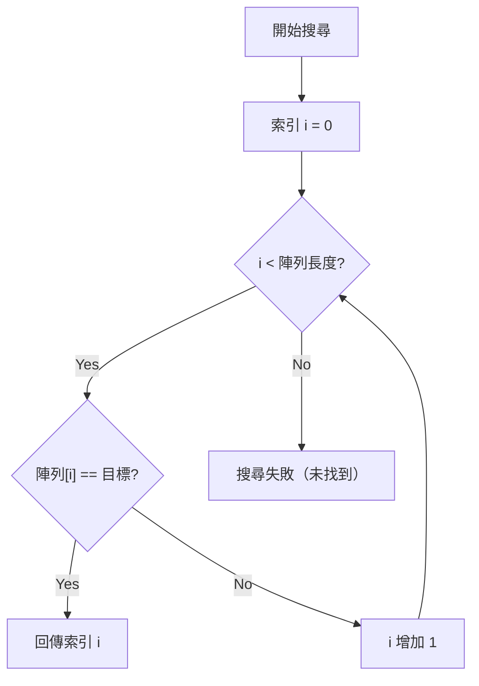
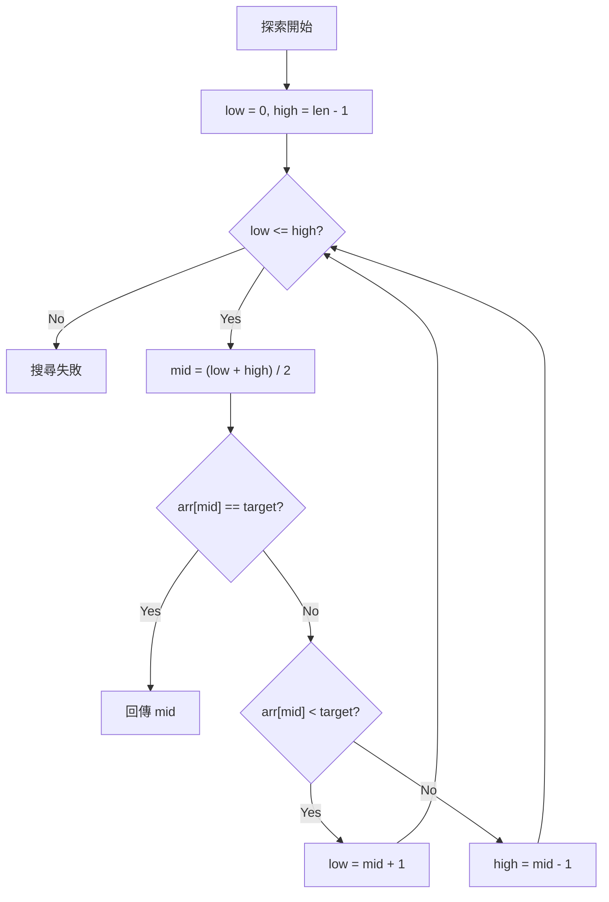
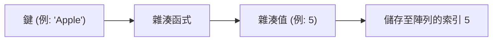
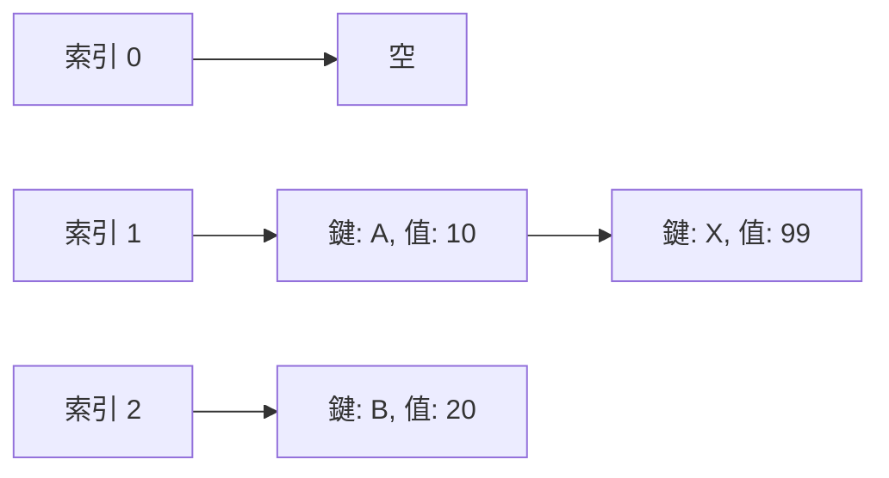

# 搜尋演算法的基礎與重要性

在現代電腦科學中，從資料中迅速找出目標值的 **搜尋演算法** ，是構成所有軟體與系統根基的一項非常重要的技術。無論是資料庫的搜尋、網頁瀏覽器的關鍵字搜尋，或是智慧型手機聯絡人應用程式中的名稱搜尋，我們在日常生活中都受惠於搜尋演算法。

在本文中，我們將針對電腦科學基礎的「線性搜尋（Linear Search）」與「二元搜尋（Binary Search）」演算法，交錯介紹其機制、時間[複雜度](/zh-tw/p/time-space-complexity-big-o-notation-examples/)，以及使用 Python 的實作範例進行詳細解說。此外，更將深入探討突破這些演算法限制、實現壓倒性搜尋速度的「雜湊表（Hash Table）」原理、雜湊函式的角色，甚至到雜湊衝突（Collision）的解決手法。


深入理解搜尋演算法，是提升程式設計師技能不可或缺的一環。資料量少時，演算法的選擇對效能的影響可能微乎其微，但在巨量資料時代，要在數百萬、數億筆資料中瞬間找出目標資訊，選擇合適的演算法與資料結構就變得至關重要。特別是理解 **時間[複雜度](/zh-tw/p/time-space-complexity-big-o-notation-examples/)** （如 $O(n)$ 、 $O(\log n)$ 、 $O(1)$ 等）的概念，更是設計高效能程式不可或缺的要素。

深入理解搜尋演算法，是提升程式設計師技能不可或缺的一環。資料量少時，演算法的選擇對效能的影響可能微乎其微，但在巨量資料時代，要在數百萬、數億筆資料中瞬間找出目標資訊，選擇合適的演算法與資料結構就變得至關重要。特別是理解 **時間[複雜度](/zh-tw/p/time-space-complexity-big-o-notation-examples/)** （如 $O(n)$ 、 $O(\log n)$ 、 $O(1)$ 等）的概念，更是設計高效能程式不可或缺的要素。

深入理解搜尋演算法，是提升程式設計師技能不可或缺的一環。資料量少時，演算法的選擇對效能的影響可能微乎其微，但在巨量資料時代，要在數百萬、數億筆資料中瞬間找出目標資訊，選擇合適的演算法與資料結構就變得至關重要。特別是理解 **時間[複雜度](/zh-tw/p/time-space-complexity-big-o-notation-examples/)** （如 $O(n)$ 、 $O(\log n)$ 、 $O(1)$ 等）的概念，更是設計高效能程式不可或缺的要素。

深入理解搜尋演算法，是提升程式設計師技能不可或缺的一環。資料量少時，演算法的選擇對效能的影響可能微乎其微，但在巨量資料時代，要在數百萬、數億筆資料中瞬間找出目標資訊，選擇合適的演算法與資料結構就變得至關重要。特別是理解 **時間[複雜度](/zh-tw/p/time-space-complexity-big-o-notation-examples/)** （如 $O(n)$ 、 $O(\log n)$ 、 $O(1)$ 等）的概念，更是設計高效能程式不可或缺的要素。

深入理解搜尋演算法，是提升程式設計師技能不可或缺的一環。資料量少時，演算法的選擇對效能的影響可能微乎其微，但在巨量資料時代，要在數百萬、數億筆資料中瞬間找出目標資訊，選擇合適的演算法與資料結構就變得至關重要。特別是理解 **時間[複雜度](/zh-tw/p/time-space-complexity-big-o-notation-examples/)** （如 $O(n)$ 、 $O(\log n)$ 、 $O(1)$ 等）的概念，更是設計高效能程式不可或缺的要素。

深入理解搜尋演算法，是提升程式設計師技能不可或缺的一環。資料量少時，演算法的選擇對效能的影響可能微乎其微，但在巨量資料時代，要在數百萬、數億筆資料中瞬間找出目標資訊，選擇合適的演算法與資料結構就變得至關重要。特別是理解 **時間[複雜度](/zh-tw/p/time-space-complexity-big-o-notation-examples/)** （如 $O(n)$ 、 $O(\log n)$ 、 $O(1)$ 等）的概念，更是設計高效能程式不可或缺的要素。

深入理解搜尋演算法，是提升程式設計師技能不可或缺的一環。資料量少時，演算法的選擇對效能的影響可能微乎其微，但在巨量資料時代，要在數百萬、數億筆資料中瞬間找出目標資訊，選擇合適的演算法與資料結構就變得至關重要。特別是理解 **時間[複雜度](/zh-tw/p/time-space-complexity-big-o-notation-examples/)** （如 $O(n)$ 、 $O(\log n)$ 、 $O(1)$ 等）的概念，更是設計高效能程式不可或缺的要素。

深入理解搜尋演算法，是提升程式設計師技能不可或缺的一環。資料量少時，演算法的選擇對效能的影響可能微乎其微，但在巨量資料時代，要在數百萬、數億筆資料中瞬間找出目標資訊，選擇合適的演算法與資料結構就變得至關重要。特別是理解 **時間[複雜度](/zh-tw/p/time-space-complexity-big-o-notation-examples/)** （如 $O(n)$ 、 $O(\log n)$ 、 $O(1)$ 等）的概念，更是設計高效能程式不可或缺的要素。

深入理解搜尋演算法，是提升程式設計師技能不可或缺的一環。資料量少時，演算法的選擇對效能的影響可能微乎其微，但在巨量資料時代，要在數百萬、數億筆資料中瞬間找出目標資訊，選擇合適的演算法與資料結構就變得至關重要。特別是理解 **時間[複雜度](/zh-tw/p/time-space-complexity-big-o-notation-examples/)** （如 $O(n)$ 、 $O(\log n)$ 、 $O(1)$ 等）的概念，更是設計高效能程式不可或缺的要素。

深入理解搜尋演算法，是提升程式設計師技能不可或缺的一環。資料量少時，演算法的選擇對效能的影響可能微乎其微，但在巨量資料時代，要在數百萬、數億筆資料中瞬間找出目標資訊，選擇合適的演算法與資料結構就變得至關重要。特別是理解 **時間[複雜度](/zh-tw/p/time-space-complexity-big-o-notation-examples/)** （如 $O(n)$ 、 $O(\log n)$ 、 $O(1)$ 等）的概念，更是設計高效能程式不可或缺的要素。

## 1. 線性搜尋（Linear Search）

線性搜尋是從資料結構（如陣列或串列等）的開頭往末端，按順序逐一確認元素直到找到目標值為止，最簡單且直覺的搜尋演算法。

### 1.1 線性搜尋的機制

線性搜尋演算法依以下步驟進行：

1. 取出陣列的第一個元素。
2. 確認取出的元素是否與目標值（Target）一致。
3. 若一致，則回傳該元素的索引（位置）並結束搜尋。
4. 若不一致，則前進至下一個元素。
5. 確認至陣列末端，若未找到目標，則以搜尋失敗（例如回傳 `-1` 或 `None` ）結束。



### 1.2 使用 Python 實作線性搜尋

以下展示使用 Python 實作線性搜尋的簡單範例。

```python
def linear_search(arr, target):
    """
    執行線性搜尋的函式
    :param arr: 要搜尋的串列
    :param target: 要尋找的值
    :return: 若找到則回傳其索引，未找到則回傳 -1
    """
    for i in range(len(arr)):
        if arr[i] == target:
            return i
    return -1

# 測試資料
numbers = [10, 23, 4, 15, 2, 7, 34, 11]
target_value = 7

result_index = linear_search(numbers, target_value)
if result_index != -1:
    print(f"元素 {target_value} 在索引 {result_index} 被找到了。")
else:
    print(f"元素 {target_value} 不存在於串列中。")
```


線性搜尋最大的特徵，在於資料不需要事先排序（整列）。即使資料是以散亂的順序儲存，因為是從頭開始依序確認，所以必定能找出目標值（或確認其不存在）。然而，這個「依序確認全部」的性質，正是資料量增加時效能低落的最大主因。

線性搜尋最大的特徵，在於資料不需要事先排序（整列）。即使資料是以散亂的順序儲存，因為是從頭開始依序確認，所以必定能找出目標值（或確認其不存在）。然而，這個「依序確認全部」的性質，正是資料量增加時效能低落的最大主因。

線性搜尋最大的特徵，在於資料不需要事先排序（整列）。即使資料是以散亂的順序儲存，因為是從頭開始依序確認，所以必定能找出目標值（或確認其不存在）。然而，這個「依序確認全部」的性質，正是資料量增加時效能低落的最大主因。

線性搜尋最大的特徵，在於資料不需要事先排序（整列）。即使資料是以散亂的順序儲存，因為是從頭開始依序確認，所以必定能找出目標值（或確認其不存在）。然而，這個「依序確認全部」的性質，正是資料量增加時效能低落的最大主因。

線性搜尋最大的特徵，在於資料不需要事先排序（整列）。即使資料是以散亂的順序儲存，因為是從頭開始依序確認，所以必定能找出目標值（或確認其不存在）。然而，這個「依序確認全部」的性質，正是資料量增加時效能低落的最大主因。

線性搜尋最大的特徵，在於資料不需要事先排序（整列）。即使資料是以散亂的順序儲存，因為是從頭開始依序確認，所以必定能找出目標值（或確認其不存在）。然而，這個「依序確認全部」的性質，正是資料量增加時效能低落的最大主因。

線性搜尋最大的特徵，在於資料不需要事先排序（整列）。即使資料是以散亂的順序儲存，因為是從頭開始依序確認，所以必定能找出目標值（或確認其不存在）。然而，這個「依序確認全部」的性質，正是資料量增加時效能低落的最大主因。

線性搜尋最大的特徵，在於資料不需要事先排序（整列）。即使資料是以散亂的順序儲存，因為是從頭開始依序確認，所以必定能找出目標值（或確認其不存在）。然而，這個「依序確認全部」的性質，正是資料量增加時效能低落的最大主因。

線性搜尋最大的特徵，在於資料不需要事先排序（整列）。即使資料是以散亂的順序儲存，因為是從頭開始依序確認，所以必定能找出目標值（或確認其不存在）。然而，這個「依序確認全部」的性質，正是資料量增加時效能低落的最大主因。

線性搜尋最大的特徵，在於資料不需要事先排序（整列）。即使資料是以散亂的順序儲存，因為是從頭開始依序確認，所以必定能找出目標值（或確認其不存在）。然而，這個「依序確認全部」的性質，正是資料量增加時效能低落的最大主因。

線性搜尋最大的特徵，在於資料不需要事先排序（整列）。即使資料是以散亂的順序儲存，因為是從頭開始依序確認，所以必定能找出目標值（或確認其不存在）。然而，這個「依序確認全部」的性質，正是資料量增加時效能低落的最大主因。

線性搜尋最大的特徵，在於資料不需要事先排序（整列）。即使資料是以散亂的順序儲存，因為是從頭開始依序確認，所以必定能找出目標值（或確認其不存在）。然而，這個「依序確認全部」的性質，正是資料量增加時效能低落的最大主因。

線性搜尋最大的特徵，在於資料不需要事先排序（整列）。即使資料是以散亂的順序儲存，因為是從頭開始依序確認，所以必定能找出目標值（或確認其不存在）。然而，這個「依序確認全部」的性質，正是資料量增加時效能低落的最大主因。

線性搜尋最大的特徵，在於資料不需要事先排序（整列）。即使資料是以散亂的順序儲存，因為是從頭開始依序確認，所以必定能找出目標值（或確認其不存在）。然而，這個「依序確認全部」的性質，正是資料量增加時效能低落的最大主因。

線性搜尋最大的特徵，在於資料不需要事先排序（整列）。即使資料是以散亂的順序儲存，因為是從頭開始依序確認，所以必定能找出目標值（或確認其不存在）。然而，這個「依序確認全部」的性質，正是資料量增加時效能低落的最大主因。

線性搜尋最大的特徵，在於資料不需要事先排序（整列）。即使資料是以散亂的順序儲存，因為是從頭開始依序確認，所以必定能找出目標值（或確認其不存在）。然而，這個「依序確認全部」的性質，正是資料量增加時效能低落的最大主因。

線性搜尋最大的特徵，在於資料不需要事先排序（整列）。即使資料是以散亂的順序儲存，因為是從頭開始依序確認，所以必定能找出目標值（或確認其不存在）。然而，這個「依序確認全部」的性質，正是資料量增加時效能低落的最大主因。

線性搜尋最大的特徵，在於資料不需要事先排序（整列）。即使資料是以散亂的順序儲存，因為是從頭開始依序確認，所以必定能找出目標值（或確認其不存在）。然而，這個「依序確認全部」的性質，正是資料量增加時效能低落的最大主因。

線性搜尋最大的特徵，在於資料不需要事先排序（整列）。即使資料是以散亂的順序儲存，因為是從頭開始依序確認，所以必定能找出目標值（或確認其不存在）。然而，這個「依序確認全部」的性質，正是資料量增加時效能低落的最大主因。

線性搜尋最大的特徵，在於資料不需要事先排序（整列）。即使資料是以散亂的順序儲存，因為是從頭開始依序確認，所以必定能找出目標值（或確認其不存在）。然而，這個「依序確認全部」的性質，正是資料量增加時效能低落的最大主因。

線性搜尋最大的特徵，在於資料不需要事先排序（整列）。即使資料是以散亂的順序儲存，因為是從頭開始依序確認，所以必定能找出目標值（或確認其不存在）。然而，這個「依序確認全部」的性質，正是資料量增加時效能低落的最大主因。

線性搜尋最大的特徵，在於資料不需要事先排序（整列）。即使資料是以散亂的順序儲存，因為是從頭開始依序確認，所以必定能找出目標值（或確認其不存在）。然而，這個「依序確認全部」的性質，正是資料量增加時效能低落的最大主因。

線性搜尋最大的特徵，在於資料不需要事先排序（整列）。即使資料是以散亂的順序儲存，因為是從頭開始依序確認，所以必定能找出目標值（或確認其不存在）。然而，這個「依序確認全部」的性質，正是資料量增加時效能低落的最大主因。

線性搜尋最大的特徵，在於資料不需要事先排序（整列）。即使資料是以散亂的順序儲存，因為是從頭開始依序確認，所以必定能找出目標值（或確認其不存在）。然而，這個「依序確認全部」的性質，正是資料量增加時效能低落的最大主因。

線性搜尋最大的特徵，在於資料不需要事先排序（整列）。即使資料是以散亂的順序儲存，因為是從頭開始依序確認，所以必定能找出目標值（或確認其不存在）。然而，這個「依序確認全部」的性質，正是資料量增加時效能低落的最大主因。

線性搜尋最大的特徵，在於資料不需要事先排序（整列）。即使資料是以散亂的順序儲存，因為是從頭開始依序確認，所以必定能找出目標值（或確認其不存在）。然而，這個「依序確認全部」的性質，正是資料量增加時效能低落的最大主因。

線性搜尋最大的特徵，在於資料不需要事先排序（整列）。即使資料是以散亂的順序儲存，因為是從頭開始依序確認，所以必定能找出目標值（或確認其不存在）。然而，這個「依序確認全部」的性質，正是資料量增加時效能低落的最大主因。

線性搜尋最大的特徵，在於資料不需要事先排序（整列）。即使資料是以散亂的順序儲存，因為是從頭開始依序確認，所以必定能找出目標值（或確認其不存在）。然而，這個「依序確認全部」的性質，正是資料量增加時效能低落的最大主因。

線性搜尋最大的特徵，在於資料不需要事先排序（整列）。即使資料是以散亂的順序儲存，因為是從頭開始依序確認，所以必定能找出目標值（或確認其不存在）。然而，這個「依序確認全部」的性質，正是資料量增加時效能低落的最大主因。

線性搜尋最大的特徵，在於資料不需要事先排序（整列）。即使資料是以散亂的順序儲存，因為是從頭開始依序確認，所以必定能找出目標值（或確認其不存在）。然而，這個「依序確認全部」的性質，正是資料量增加時效能低落的最大主因。

線性搜尋最大的特徵，在於資料不需要事先排序（整列）。即使資料是以散亂的順序儲存，因為是從頭開始依序確認，所以必定能找出目標值（或確認其不存在）。然而，這個「依序確認全部」的性質，正是資料量增加時效能低落的最大主因。

線性搜尋最大的特徵，在於資料不需要事先排序（整列）。即使資料是以散亂的順序儲存，因為是從頭開始依序確認，所以必定能找出目標值（或確認其不存在）。然而，這個「依序確認全部」的性質，正是資料量增加時效能低落的最大主因。

線性搜尋最大的特徵，在於資料不需要事先排序（整列）。即使資料是以散亂的順序儲存，因為是從頭開始依序確認，所以必定能找出目標值（或確認其不存在）。然而，這個「依序確認全部」的性質，正是資料量增加時效能低落的最大主因。

線性搜尋最大的特徵，在於資料不需要事先排序（整列）。即使資料是以散亂的順序儲存，因為是從頭開始依序確認，所以必定能找出目標值（或確認其不存在）。然而，這個「依序確認全部」的性質，正是資料量增加時效能低落的最大主因。

線性搜尋最大的特徵，在於資料不需要事先排序（整列）。即使資料是以散亂的順序儲存，因為是從頭開始依序確認，所以必定能找出目標值（或確認其不存在）。然而，這個「依序確認全部」的性質，正是資料量增加時效能低落的最大主因。

線性搜尋最大的特徵，在於資料不需要事先排序（整列）。即使資料是以散亂的順序儲存，因為是從頭開始依序確認，所以必定能找出目標值（或確認其不存在）。然而，這個「依序確認全部」的性質，正是資料量增加時效能低落的最大主因。

線性搜尋最大的特徵，在於資料不需要事先排序（整列）。即使資料是以散亂的順序儲存，因為是從頭開始依序確認，所以必定能找出目標值（或確認其不存在）。然而，這個「依序確認全部」的性質，正是資料量增加時效能低落的最大主因。

線性搜尋最大的特徵，在於資料不需要事先排序（整列）。即使資料是以散亂的順序儲存，因為是從頭開始依序確認，所以必定能找出目標值（或確認其不存在）。然而，這個「依序確認全部」的性質，正是資料量增加時效能低落的最大主因。

線性搜尋最大的特徵，在於資料不需要事先排序（整列）。即使資料是以散亂的順序儲存，因為是從頭開始依序確認，所以必定能找出目標值（或確認其不存在）。然而，這個「依序確認全部」的性質，正是資料量增加時效能低落的最大主因。

線性搜尋最大的特徵，在於資料不需要事先排序（整列）。即使資料是以散亂的順序儲存，因為是從頭開始依序確認，所以必定能找出目標值（或確認其不存在）。然而，這個「依序確認全部」的性質，正是資料量增加時效能低落的最大主因。

線性搜尋最大的特徵，在於資料不需要事先排序（整列）。即使資料是以散亂的順序儲存，因為是從頭開始依序確認，所以必定能找出目標值（或確認其不存在）。然而，這個「依序確認全部」的性質，正是資料量增加時效能低落的最大主因。

線性搜尋最大的特徵，在於資料不需要事先排序（整列）。即使資料是以散亂的順序儲存，因為是從頭開始依序確認，所以必定能找出目標值（或確認其不存在）。然而，這個「依序確認全部」的性質，正是資料量增加時效能低落的最大主因。

線性搜尋最大的特徵，在於資料不需要事先排序（整列）。即使資料是以散亂的順序儲存，因為是從頭開始依序確認，所以必定能找出目標值（或確認其不存在）。然而，這個「依序確認全部」的性質，正是資料量增加時效能低落的最大主因。

線性搜尋最大的特徵，在於資料不需要事先排序（整列）。即使資料是以散亂的順序儲存，因為是從頭開始依序確認，所以必定能找出目標值（或確認其不存在）。然而，這個「依序確認全部」的性質，正是資料量增加時效能低落的最大主因。

線性搜尋最大的特徵，在於資料不需要事先排序（整列）。即使資料是以散亂的順序儲存，因為是從頭開始依序確認，所以必定能找出目標值（或確認其不存在）。然而，這個「依序確認全部」的性質，正是資料量增加時效能低落的最大主因。

線性搜尋最大的特徵，在於資料不需要事先排序（整列）。即使資料是以散亂的順序儲存，因為是從頭開始依序確認，所以必定能找出目標值（或確認其不存在）。然而，這個「依序確認全部」的性質，正是資料量增加時效能低落的最大主因。

線性搜尋最大的特徵，在於資料不需要事先排序（整列）。即使資料是以散亂的順序儲存，因為是從頭開始依序確認，所以必定能找出目標值（或確認其不存在）。然而，這個「依序確認全部」的性質，正是資料量增加時效能低落的最大主因。

線性搜尋最大的特徵，在於資料不需要事先排序（整列）。即使資料是以散亂的順序儲存，因為是從頭開始依序確認，所以必定能找出目標值（或確認其不存在）。然而，這個「依序確認全部」的性質，正是資料量增加時效能低落的最大主因。

線性搜尋最大的特徵，在於資料不需要事先排序（整列）。即使資料是以散亂的順序儲存，因為是從頭開始依序確認，所以必定能找出目標值（或確認其不存在）。然而，這個「依序確認全部」的性質，正是資料量增加時效能低落的最大主因。

線性搜尋最大的特徵，在於資料不需要事先排序（整列）。即使資料是以散亂的順序儲存，因為是從頭開始依序確認，所以必定能找出目標值（或確認其不存在）。然而，這個「依序確認全部」的性質，正是資料量增加時效能低落的最大主因。

## 2. 二元搜尋（Binary Search）

二元搜尋是僅能應用於 **已預先排序（遞增或遞減整列）的資料** 的非常高速且高效的搜尋演算法。藉由每次將搜尋範圍縮減一半，戲劇性地減少計算量。

### 2.1 二元搜尋的機制

二元搜尋依以下步驟進行：

1. 初始化搜尋目標陣列的「左端（`low`）」與「右端（`high`）」索引。
2. 只要搜尋範圍仍有效（`low <= high`），便重複以下處理。
3. 計算搜尋範圍中央的索引（`mid`）。
4. 比較中央的元素（`arr[mid]`）與目標值（Target）。
5. 若一致，則回傳 `mid` 並結束。
6. 若中央的元素小於目標，代表目標存在於右半部範圍，因此將左端更新為 `mid + 1` 。
7. 若中央的元素大於目標，代表目標存在於左半部範圍，因此將右端更新為 `mid - 1` 。
8. 若搜尋範圍消失仍未找到，則視為搜尋失敗。



### 2.2 使用 Python 實作二元搜尋（反覆法）

```python
def binary_search(arr, target):
    """
    執行二元搜尋（反覆法）的函式
    :param arr: 已排序的搜尋目標串列
    :param target: 要尋找的值
    :return: 若找到則回傳其索引，未找到則回傳 -1
    """
    low = 0
    high = len(arr) - 1

    while low <= high:
        mid = (low + high) // 2
        
        if arr[mid] == target:
            return mid
        elif arr[mid] < target:
            low = mid + 1
        else:
            high = mid - 1
            
    return -1

# 測試資料（ソート済みである必要がある）
sorted_numbers = [2, 4, 7, 10, 11, 15, 23, 34]
target_value = 15

result_index = binary_search(sorted_numbers, target_value)
if result_index != -1:
    print(f"元素 {target_value} 在索引 {result_index} 被找到了。")
else:
    print(f"元素 {target_value} 不存在於串列中。")
```

二元搜尋驚人的效能，來自於每次將搜尋範圍縮減一半的性質。舉例來說，對擁有 100 萬個元素的陣列進行線性搜尋，最壞的情況下需要進行 100 萬次比較，但若使用二元搜尋，僅需約 20 次比較就能找到目標值（$2^{20} \approx 1,000,000$）。因此，在針對大規模資料集的操作上，二元搜尋相較於線性搜尋具有壓倒性的優勢。在數學上，二元搜尋的時間[複雜度](/zh-tw/p/time-space-complexity-big-o-notation-examples/)表示為 $O(\log n)$ 。

二元搜尋驚人的效能，來自於每次將搜尋範圍縮減一半的性質。舉例來說，對擁有 100 萬個元素的陣列進行線性搜尋，最壞的情況下需要進行 100 萬次比較，但若使用二元搜尋，僅需約 20 次比較就能找到目標值（$2^{20} \approx 1,000,000$）。因此，在針對大規模資料集的操作上，二元搜尋相較於線性搜尋具有壓倒性的優勢。在數學上，二元搜尋的時間[複雜度](/zh-tw/p/time-space-complexity-big-o-notation-examples/)表示為 $O(\log n)$ 。

二元搜尋驚人的效能，來自於每次將搜尋範圍縮減一半的性質。舉例來說，對擁有 100 萬個元素的陣列進行線性搜尋，最壞的情況下需要進行 100 萬次比較，但若使用二元搜尋，僅需約 20 次比較就能找到目標值（$2^{20} \approx 1,000,000$）。因此，在針對大規模資料集的操作上，二元搜尋相較於線性搜尋具有壓倒性的優勢。在數學上，二元搜尋的時間[複雜度](/zh-tw/p/time-space-complexity-big-o-notation-examples/)表示為 $O(\log n)$ 。

二元搜尋驚人的效能，來自於每次將搜尋範圍縮減一半的性質。舉例來說，對擁有 100 萬個元素的陣列進行線性搜尋，最壞的情況下需要進行 100 萬次比較，但若使用二元搜尋，僅需約 20 次比較就能找到目標值（$2^{20} \approx 1,000,000$）。因此，在針對大規模資料集的操作上，二元搜尋相較於線性搜尋具有壓倒性的優勢。在數學上，二元搜尋的時間[複雜度](/zh-tw/p/time-space-complexity-big-o-notation-examples/)表示為 $O(\log n)$ 。

二元搜尋驚人的效能，來自於每次將搜尋範圍縮減一半的性質。舉例來說，對擁有 100 萬個元素的陣列進行線性搜尋，最壞的情況下需要進行 100 萬次比較，但若使用二元搜尋，僅需約 20 次比較就能找到目標值（$2^{20} \approx 1,000,000$）。因此，在針對大規模資料集的操作上，二元搜尋相較於線性搜尋具有壓倒性的優勢。在數學上，二元搜尋的時間[複雜度](/zh-tw/p/time-space-complexity-big-o-notation-examples/)表示為 $O(\log n)$ 。

二元搜尋驚人的效能，來自於每次將搜尋範圍縮減一半的性質。舉例來說，對擁有 100 萬個元素的陣列進行線性搜尋，最壞的情況下需要進行 100 萬次比較，但若使用二元搜尋，僅需約 20 次比較就能找到目標值（$2^{20} \approx 1,000,000$）。因此，在針對大規模資料集的操作上，二元搜尋相較於線性搜尋具有壓倒性的優勢。在數學上，二元搜尋的時間[複雜度](/zh-tw/p/time-space-complexity-big-o-notation-examples/)表示為 $O(\log n)$ 。

二元搜尋驚人的效能，來自於每次將搜尋範圍縮減一半的性質。舉例來說，對擁有 100 萬個元素的陣列進行線性搜尋，最壞的情況下需要進行 100 萬次比較，但若使用二元搜尋，僅需約 20 次比較就能找到目標值（$2^{20} \approx 1,000,000$）。因此，在針對大規模資料集的操作上，二元搜尋相較於線性搜尋具有壓倒性的優勢。在數學上，二元搜尋的時間[複雜度](/zh-tw/p/time-space-complexity-big-o-notation-examples/)表示為 $O(\log n)$ 。

二元搜尋驚人的效能，來自於每次將搜尋範圍縮減一半的性質。舉例來說，對擁有 100 萬個元素的陣列進行線性搜尋，最壞的情況下需要進行 100 萬次比較，但若使用二元搜尋，僅需約 20 次比較就能找到目標值（$2^{20} \approx 1,000,000$）。因此，在針對大規模資料集的操作上，二元搜尋相較於線性搜尋具有壓倒性的優勢。在數學上，二元搜尋的時間[複雜度](/zh-tw/p/time-space-complexity-big-o-notation-examples/)表示為 $O(\log n)$ 。

二元搜尋驚人的效能，來自於每次將搜尋範圍縮減一半的性質。舉例來說，對擁有 100 萬個元素的陣列進行線性搜尋，最壞的情況下需要進行 100 萬次比較，但若使用二元搜尋，僅需約 20 次比較就能找到目標值（$2^{20} \approx 1,000,000$）。因此，在針對大規模資料集的操作上，二元搜尋相較於線性搜尋具有壓倒性的優勢。在數學上，二元搜尋的時間[複雜度](/zh-tw/p/time-space-complexity-big-o-notation-examples/)表示為 $O(\log n)$ 。

二元搜尋驚人的效能，來自於每次將搜尋範圍縮減一半的性質。舉例來說，對擁有 100 萬個元素的陣列進行線性搜尋，最壞的情況下需要進行 100 萬次比較，但若使用二元搜尋，僅需約 20 次比較就能找到目標值（$2^{20} \approx 1,000,000$）。因此，在針對大規模資料集的操作上，二元搜尋相較於線性搜尋具有壓倒性的優勢。在數學上，二元搜尋的時間[複雜度](/zh-tw/p/time-space-complexity-big-o-notation-examples/)表示為 $O(\log n)$ 。

二元搜尋驚人的效能，來自於每次將搜尋範圍縮減一半的性質。舉例來說，對擁有 100 萬個元素的陣列進行線性搜尋，最壞的情況下需要進行 100 萬次比較，但若使用二元搜尋，僅需約 20 次比較就能找到目標值（$2^{20} \approx 1,000,000$）。因此，在針對大規模資料集的操作上，二元搜尋相較於線性搜尋具有壓倒性的優勢。在數學上，二元搜尋的時間[複雜度](/zh-tw/p/time-space-complexity-big-o-notation-examples/)表示為 $O(\log n)$ 。

二元搜尋驚人的效能，來自於每次將搜尋範圍縮減一半的性質。舉例來說，對擁有 100 萬個元素的陣列進行線性搜尋，最壞的情況下需要進行 100 萬次比較，但若使用二元搜尋，僅需約 20 次比較就能找到目標值（$2^{20} \approx 1,000,000$）。因此，在針對大規模資料集的操作上，二元搜尋相較於線性搜尋具有壓倒性的優勢。在數學上，二元搜尋的時間[複雜度](/zh-tw/p/time-space-complexity-big-o-notation-examples/)表示為 $O(\log n)$ 。

二元搜尋驚人的效能，來自於每次將搜尋範圍縮減一半的性質。舉例來說，對擁有 100 萬個元素的陣列進行線性搜尋，最壞的情況下需要進行 100 萬次比較，但若使用二元搜尋，僅需約 20 次比較就能找到目標值（$2^{20} \approx 1,000,000$）。因此，在針對大規模資料集的操作上，二元搜尋相較於線性搜尋具有壓倒性的優勢。在數學上，二元搜尋的時間[複雜度](/zh-tw/p/time-space-complexity-big-o-notation-examples/)表示為 $O(\log n)$ 。

二元搜尋驚人的效能，來自於每次將搜尋範圍縮減一半的性質。舉例來說，對擁有 100 萬個元素的陣列進行線性搜尋，最壞的情況下需要進行 100 萬次比較，但若使用二元搜尋，僅需約 20 次比較就能找到目標值（$2^{20} \approx 1,000,000$）。因此，在針對大規模資料集的操作上，二元搜尋相較於線性搜尋具有壓倒性的優勢。在數學上，二元搜尋的時間[複雜度](/zh-tw/p/time-space-complexity-big-o-notation-examples/)表示為 $O(\log n)$ 。

二元搜尋驚人的效能，來自於每次將搜尋範圍縮減一半的性質。舉例來說，對擁有 100 萬個元素的陣列進行線性搜尋，最壞的情況下需要進行 100 萬次比較，但若使用二元搜尋，僅需約 20 次比較就能找到目標值（$2^{20} \approx 1,000,000$）。因此，在針對大規模資料集的操作上，二元搜尋相較於線性搜尋具有壓倒性的優勢。在數學上，二元搜尋的時間[複雜度](/zh-tw/p/time-space-complexity-big-o-notation-examples/)表示為 $O(\log n)$ 。

二元搜尋驚人的效能，來自於每次將搜尋範圍縮減一半的性質。舉例來說，對擁有 100 萬個元素的陣列進行線性搜尋，最壞的情況下需要進行 100 萬次比較，但若使用二元搜尋，僅需約 20 次比較就能找到目標值（$2^{20} \approx 1,000,000$）。因此，在針對大規模資料集的操作上，二元搜尋相較於線性搜尋具有壓倒性的優勢。在數學上，二元搜尋的時間[複雜度](/zh-tw/p/time-space-complexity-big-o-notation-examples/)表示為 $O(\log n)$ 。

二元搜尋驚人的效能，來自於每次將搜尋範圍縮減一半的性質。舉例來說，對擁有 100 萬個元素的陣列進行線性搜尋，最壞的情況下需要進行 100 萬次比較，但若使用二元搜尋，僅需約 20 次比較就能找到目標值（$2^{20} \approx 1,000,000$）。因此，在針對大規模資料集的操作上，二元搜尋相較於線性搜尋具有壓倒性的優勢。在數學上，二元搜尋的時間[複雜度](/zh-tw/p/time-space-complexity-big-o-notation-examples/)表示為 $O(\log n)$ 。

二元搜尋驚人的效能，來自於每次將搜尋範圍縮減一半的性質。舉例來說，對擁有 100 萬個元素的陣列進行線性搜尋，最壞的情況下需要進行 100 萬次比較，但若使用二元搜尋，僅需約 20 次比較就能找到目標值（$2^{20} \approx 1,000,000$）。因此，在針對大規模資料集的操作上，二元搜尋相較於線性搜尋具有壓倒性的優勢。在數學上，二元搜尋的時間[複雜度](/zh-tw/p/time-space-complexity-big-o-notation-examples/)表示為 $O(\log n)$ 。

二元搜尋驚人的效能，來自於每次將搜尋範圍縮減一半的性質。舉例來說，對擁有 100 萬個元素的陣列進行線性搜尋，最壞的情況下需要進行 100 萬次比較，但若使用二元搜尋，僅需約 20 次比較就能找到目標值（$2^{20} \approx 1,000,000$）。因此，在針對大規模資料集的操作上，二元搜尋相較於線性搜尋具有壓倒性的優勢。在數學上，二元搜尋的時間[複雜度](/zh-tw/p/time-space-complexity-big-o-notation-examples/)表示為 $O(\log n)$ 。

二元搜尋驚人的效能，來自於每次將搜尋範圍縮減一半的性質。舉例來說，對擁有 100 萬個元素的陣列進行線性搜尋，最壞的情況下需要進行 100 萬次比較，但若使用二元搜尋，僅需約 20 次比較就能找到目標值（$2^{20} \approx 1,000,000$）。因此，在針對大規模資料集的操作上，二元搜尋相較於線性搜尋具有壓倒性的優勢。在數學上，二元搜尋的時間[複雜度](/zh-tw/p/time-space-complexity-big-o-notation-examples/)表示為 $O(\log n)$ 。

二元搜尋驚人的效能，來自於每次將搜尋範圍縮減一半的性質。舉例來說，對擁有 100 萬個元素的陣列進行線性搜尋，最壞的情況下需要進行 100 萬次比較，但若使用二元搜尋，僅需約 20 次比較就能找到目標值（$2^{20} \approx 1,000,000$）。因此，在針對大規模資料集的操作上，二元搜尋相較於線性搜尋具有壓倒性的優勢。在數學上，二元搜尋的時間[複雜度](/zh-tw/p/time-space-complexity-big-o-notation-examples/)表示為 $O(\log n)$ 。

二元搜尋驚人的效能，來自於每次將搜尋範圍縮減一半的性質。舉例來說，對擁有 100 萬個元素的陣列進行線性搜尋，最壞的情況下需要進行 100 萬次比較，但若使用二元搜尋，僅需約 20 次比較就能找到目標值（$2^{20} \approx 1,000,000$）。因此，在針對大規模資料集的操作上，二元搜尋相較於線性搜尋具有壓倒性的優勢。在數學上，二元搜尋的時間[複雜度](/zh-tw/p/time-space-complexity-big-o-notation-examples/)表示為 $O(\log n)$ 。

二元搜尋驚人的效能，來自於每次將搜尋範圍縮減一半的性質。舉例來說，對擁有 100 萬個元素的陣列進行線性搜尋，最壞的情況下需要進行 100 萬次比較，但若使用二元搜尋，僅需約 20 次比較就能找到目標值（$2^{20} \approx 1,000,000$）。因此，在針對大規模資料集的操作上，二元搜尋相較於線性搜尋具有壓倒性的優勢。在數學上，二元搜尋的時間[複雜度](/zh-tw/p/time-space-complexity-big-o-notation-examples/)表示為 $O(\log n)$ 。

二元搜尋驚人的效能，來自於每次將搜尋範圍縮減一半的性質。舉例來說，對擁有 100 萬個元素的陣列進行線性搜尋，最壞的情況下需要進行 100 萬次比較，但若使用二元搜尋，僅需約 20 次比較就能找到目標值（$2^{20} \approx 1,000,000$）。因此，在針對大規模資料集的操作上，二元搜尋相較於線性搜尋具有壓倒性的優勢。在數學上，二元搜尋的時間[複雜度](/zh-tw/p/time-space-complexity-big-o-notation-examples/)表示為 $O(\log n)$ 。

二元搜尋驚人的效能，來自於每次將搜尋範圍縮減一半的性質。舉例來說，對擁有 100 萬個元素的陣列進行線性搜尋，最壞的情況下需要進行 100 萬次比較，但若使用二元搜尋，僅需約 20 次比較就能找到目標值（$2^{20} \approx 1,000,000$）。因此，在針對大規模資料集的操作上，二元搜尋相較於線性搜尋具有壓倒性的優勢。在數學上，二元搜尋的時間[複雜度](/zh-tw/p/time-space-complexity-big-o-notation-examples/)表示為 $O(\log n)$ 。

二元搜尋驚人的效能，來自於每次將搜尋範圍縮減一半的性質。舉例來說，對擁有 100 萬個元素的陣列進行線性搜尋，最壞的情況下需要進行 100 萬次比較，但若使用二元搜尋，僅需約 20 次比較就能找到目標值（$2^{20} \approx 1,000,000$）。因此，在針對大規模資料集的操作上，二元搜尋相較於線性搜尋具有壓倒性的優勢。在數學上，二元搜尋的時間[複雜度](/zh-tw/p/time-space-complexity-big-o-notation-examples/)表示為 $O(\log n)$ 。

二元搜尋驚人的效能，來自於每次將搜尋範圍縮減一半的性質。舉例來說，對擁有 100 萬個元素的陣列進行線性搜尋，最壞的情況下需要進行 100 萬次比較，但若使用二元搜尋，僅需約 20 次比較就能找到目標值（$2^{20} \approx 1,000,000$）。因此，在針對大規模資料集的操作上，二元搜尋相較於線性搜尋具有壓倒性的優勢。在數學上，二元搜尋的時間[複雜度](/zh-tw/p/time-space-complexity-big-o-notation-examples/)表示為 $O(\log n)$ 。

二元搜尋驚人的效能，來自於每次將搜尋範圍縮減一半的性質。舉例來說，對擁有 100 萬個元素的陣列進行線性搜尋，最壞的情況下需要進行 100 萬次比較，但若使用二元搜尋，僅需約 20 次比較就能找到目標值（$2^{20} \approx 1,000,000$）。因此，在針對大規模資料集的操作上，二元搜尋相較於線性搜尋具有壓倒性的優勢。在數學上，二元搜尋的時間[複雜度](/zh-tw/p/time-space-complexity-big-o-notation-examples/)表示為 $O(\log n)$ 。

二元搜尋驚人的效能，來自於每次將搜尋範圍縮減一半的性質。舉例來說，對擁有 100 萬個元素的陣列進行線性搜尋，最壞的情況下需要進行 100 萬次比較，但若使用二元搜尋，僅需約 20 次比較就能找到目標值（$2^{20} \approx 1,000,000$）。因此，在針對大規模資料集的操作上，二元搜尋相較於線性搜尋具有壓倒性的優勢。在數學上，二元搜尋的時間[複雜度](/zh-tw/p/time-space-complexity-big-o-notation-examples/)表示為 $O(\log n)$ 。

二元搜尋驚人的效能，來自於每次將搜尋範圍縮減一半的性質。舉例來說，對擁有 100 萬個元素的陣列進行線性搜尋，最壞的情況下需要進行 100 萬次比較，但若使用二元搜尋，僅需約 20 次比較就能找到目標值（$2^{20} \approx 1,000,000$）。因此，在針對大規模資料集的操作上，二元搜尋相較於線性搜尋具有壓倒性的優勢。在數學上，二元搜尋的時間[複雜度](/zh-tw/p/time-space-complexity-big-o-notation-examples/)表示為 $O(\log n)$ 。

二元搜尋驚人的效能，來自於每次將搜尋範圍縮減一半的性質。舉例來說，對擁有 100 萬個元素的陣列進行線性搜尋，最壞的情況下需要進行 100 萬次比較，但若使用二元搜尋，僅需約 20 次比較就能找到目標值（$2^{20} \approx 1,000,000$）。因此，在針對大規模資料集的操作上，二元搜尋相較於線性搜尋具有壓倒性的優勢。在數學上，二元搜尋的時間[複雜度](/zh-tw/p/time-space-complexity-big-o-notation-examples/)表示為 $O(\log n)$ 。

二元搜尋驚人的效能，來自於每次將搜尋範圍縮減一半的性質。舉例來說，對擁有 100 萬個元素的陣列進行線性搜尋，最壞的情況下需要進行 100 萬次比較，但若使用二元搜尋，僅需約 20 次比較就能找到目標值（$2^{20} \approx 1,000,000$）。因此，在針對大規模資料集的操作上，二元搜尋相較於線性搜尋具有壓倒性的優勢。在數學上，二元搜尋的時間[複雜度](/zh-tw/p/time-space-complexity-big-o-notation-examples/)表示為 $O(\log n)$ 。

二元搜尋驚人的效能，來自於每次將搜尋範圍縮減一半的性質。舉例來說，對擁有 100 萬個元素的陣列進行線性搜尋，最壞的情況下需要進行 100 萬次比較，但若使用二元搜尋，僅需約 20 次比較就能找到目標值（$2^{20} \approx 1,000,000$）。因此，在針對大規模資料集的操作上，二元搜尋相較於線性搜尋具有壓倒性的優勢。在數學上，二元搜尋的時間[複雜度](/zh-tw/p/time-space-complexity-big-o-notation-examples/)表示為 $O(\log n)$ 。

二元搜尋驚人的效能，來自於每次將搜尋範圍縮減一半的性質。舉例來說，對擁有 100 萬個元素的陣列進行線性搜尋，最壞的情況下需要進行 100 萬次比較，但若使用二元搜尋，僅需約 20 次比較就能找到目標值（$2^{20} \approx 1,000,000$）。因此，在針對大規模資料集的操作上，二元搜尋相較於線性搜尋具有壓倒性的優勢。在數學上，二元搜尋的時間[複雜度](/zh-tw/p/time-space-complexity-big-o-notation-examples/)表示為 $O(\log n)$ 。

二元搜尋驚人的效能，來自於每次將搜尋範圍縮減一半的性質。舉例來說，對擁有 100 萬個元素的陣列進行線性搜尋，最壞的情況下需要進行 100 萬次比較，但若使用二元搜尋，僅需約 20 次比較就能找到目標值（$2^{20} \approx 1,000,000$）。因此，在針對大規模資料集的操作上，二元搜尋相較於線性搜尋具有壓倒性的優勢。在數學上，二元搜尋的時間[複雜度](/zh-tw/p/time-space-complexity-big-o-notation-examples/)表示為 $O(\log n)$ 。

二元搜尋驚人的效能，來自於每次將搜尋範圍縮減一半的性質。舉例來說，對擁有 100 萬個元素的陣列進行線性搜尋，最壞的情況下需要進行 100 萬次比較，但若使用二元搜尋，僅需約 20 次比較就能找到目標值（$2^{20} \approx 1,000,000$）。因此，在針對大規模資料集的操作上，二元搜尋相較於線性搜尋具有壓倒性的優勢。在數學上，二元搜尋的時間[複雜度](/zh-tw/p/time-space-complexity-big-o-notation-examples/)表示為 $O(\log n)$ 。

二元搜尋驚人的效能，來自於每次將搜尋範圍縮減一半的性質。舉例來說，對擁有 100 萬個元素的陣列進行線性搜尋，最壞的情況下需要進行 100 萬次比較，但若使用二元搜尋，僅需約 20 次比較就能找到目標值（$2^{20} \approx 1,000,000$）。因此，在針對大規模資料集的操作上，二元搜尋相較於線性搜尋具有壓倒性的優勢。在數學上，二元搜尋的時間[複雜度](/zh-tw/p/time-space-complexity-big-o-notation-examples/)表示為 $O(\log n)$ 。

二元搜尋驚人的效能，來自於每次將搜尋範圍縮減一半的性質。舉例來說，對擁有 100 萬個元素的陣列進行線性搜尋，最壞的情況下需要進行 100 萬次比較，但若使用二元搜尋，僅需約 20 次比較就能找到目標值（$2^{20} \approx 1,000,000$）。因此，在針對大規模資料集的操作上，二元搜尋相較於線性搜尋具有壓倒性的優勢。在數學上，二元搜尋的時間[複雜度](/zh-tw/p/time-space-complexity-big-o-notation-examples/)表示為 $O(\log n)$ 。

二元搜尋驚人的效能，來自於每次將搜尋範圍縮減一半的性質。舉例來說，對擁有 100 萬個元素的陣列進行線性搜尋，最壞的情況下需要進行 100 萬次比較，但若使用二元搜尋，僅需約 20 次比較就能找到目標值（$2^{20} \approx 1,000,000$）。因此，在針對大規模資料集的操作上，二元搜尋相較於線性搜尋具有壓倒性的優勢。在數學上，二元搜尋的時間[複雜度](/zh-tw/p/time-space-complexity-big-o-notation-examples/)表示為 $O(\log n)$ 。

二元搜尋驚人的效能，來自於每次將搜尋範圍縮減一半的性質。舉例來說，對擁有 100 萬個元素的陣列進行線性搜尋，最壞的情況下需要進行 100 萬次比較，但若使用二元搜尋，僅需約 20 次比較就能找到目標值（$2^{20} \approx 1,000,000$）。因此，在針對大規模資料集的操作上，二元搜尋相較於線性搜尋具有壓倒性的優勢。在數學上，二元搜尋的時間[複雜度](/zh-tw/p/time-space-complexity-big-o-notation-examples/)表示為 $O(\log n)$ 。

二元搜尋驚人的效能，來自於每次將搜尋範圍縮減一半的性質。舉例來說，對擁有 100 萬個元素的陣列進行線性搜尋，最壞的情況下需要進行 100 萬次比較，但若使用二元搜尋，僅需約 20 次比較就能找到目標值（$2^{20} \approx 1,000,000$）。因此，在針對大規模資料集的操作上，二元搜尋相較於線性搜尋具有壓倒性的優勢。在數學上，二元搜尋的時間[複雜度](/zh-tw/p/time-space-complexity-big-o-notation-examples/)表示為 $O(\log n)$ 。

二元搜尋驚人的效能，來自於每次將搜尋範圍縮減一半的性質。舉例來說，對擁有 100 萬個元素的陣列進行線性搜尋，最壞的情況下需要進行 100 萬次比較，但若使用二元搜尋，僅需約 20 次比較就能找到目標值（$2^{20} \approx 1,000,000$）。因此，在針對大規模資料集的操作上，二元搜尋相較於線性搜尋具有壓倒性的優勢。在數學上，二元搜尋的時間[複雜度](/zh-tw/p/time-space-complexity-big-o-notation-examples/)表示為 $O(\log n)$ 。

二元搜尋驚人的效能，來自於每次將搜尋範圍縮減一半的性質。舉例來說，對擁有 100 萬個元素的陣列進行線性搜尋，最壞的情況下需要進行 100 萬次比較，但若使用二元搜尋，僅需約 20 次比較就能找到目標值（$2^{20} \approx 1,000,000$）。因此，在針對大規模資料集的操作上，二元搜尋相較於線性搜尋具有壓倒性的優勢。在數學上，二元搜尋的時間[複雜度](/zh-tw/p/time-space-complexity-big-o-notation-examples/)表示為 $O(\log n)$ 。

二元搜尋驚人的效能，來自於每次將搜尋範圍縮減一半的性質。舉例來說，對擁有 100 萬個元素的陣列進行線性搜尋，最壞的情況下需要進行 100 萬次比較，但若使用二元搜尋，僅需約 20 次比較就能找到目標值（$2^{20} \approx 1,000,000$）。因此，在針對大規模資料集的操作上，二元搜尋相較於線性搜尋具有壓倒性的優勢。在數學上，二元搜尋的時間[複雜度](/zh-tw/p/time-space-complexity-big-o-notation-examples/)表示為 $O(\log n)$ 。

二元搜尋驚人的效能，來自於每次將搜尋範圍縮減一半的性質。舉例來說，對擁有 100 萬個元素的陣列進行線性搜尋，最壞的情況下需要進行 100 萬次比較，但若使用二元搜尋，僅需約 20 次比較就能找到目標值（$2^{20} \approx 1,000,000$）。因此，在針對大規模資料集的操作上，二元搜尋相較於線性搜尋具有壓倒性的優勢。在數學上，二元搜尋的時間[複雜度](/zh-tw/p/time-space-complexity-big-o-notation-examples/)表示為 $O(\log n)$ 。

二元搜尋驚人的效能，來自於每次將搜尋範圍縮減一半的性質。舉例來說，對擁有 100 萬個元素的陣列進行線性搜尋，最壞的情況下需要進行 100 萬次比較，但若使用二元搜尋，僅需約 20 次比較就能找到目標值（$2^{20} \approx 1,000,000$）。因此，在針對大規模資料集的操作上，二元搜尋相較於線性搜尋具有壓倒性的優勢。在數學上，二元搜尋的時間[複雜度](/zh-tw/p/time-space-complexity-big-o-notation-examples/)表示為 $O(\log n)$ 。

二元搜尋驚人的效能，來自於每次將搜尋範圍縮減一半的性質。舉例來說，對擁有 100 萬個元素的陣列進行線性搜尋，最壞的情況下需要進行 100 萬次比較，但若使用二元搜尋，僅需約 20 次比較就能找到目標值（$2^{20} \approx 1,000,000$）。因此，在針對大規模資料集的操作上，二元搜尋相較於線性搜尋具有壓倒性的優勢。在數學上，二元搜尋的時間[複雜度](/zh-tw/p/time-space-complexity-big-o-notation-examples/)表示為 $O(\log n)$ 。

二元搜尋驚人的效能，來自於每次將搜尋範圍縮減一半的性質。舉例來說，對擁有 100 萬個元素的陣列進行線性搜尋，最壞的情況下需要進行 100 萬次比較，但若使用二元搜尋，僅需約 20 次比較就能找到目標值（$2^{20} \approx 1,000,000$）。因此，在針對大規模資料集的操作上，二元搜尋相較於線性搜尋具有壓倒性的優勢。在數學上，二元搜尋的時間[複雜度](/zh-tw/p/time-space-complexity-big-o-notation-examples/)表示為 $O(\log n)$ 。

二元搜尋驚人的效能，來自於每次將搜尋範圍縮減一半的性質。舉例來說，對擁有 100 萬個元素的陣列進行線性搜尋，最壞的情況下需要進行 100 萬次比較，但若使用二元搜尋，僅需約 20 次比較就能找到目標值（$2^{20} \approx 1,000,000$）。因此，在針對大規模資料集的操作上，二元搜尋相較於線性搜尋具有壓倒性的優勢。在數學上，二元搜尋的時間[複雜度](/zh-tw/p/time-space-complexity-big-o-notation-examples/)表示為 $O(\log n)$ 。

二元搜尋驚人的效能，來自於每次將搜尋範圍縮減一半的性質。舉例來說，對擁有 100 萬個元素的陣列進行線性搜尋，最壞的情況下需要進行 100 萬次比較，但若使用二元搜尋，僅需約 20 次比較就能找到目標值（$2^{20} \approx 1,000,000$）。因此，在針對大規模資料集的操作上，二元搜尋相較於線性搜尋具有壓倒性的優勢。在數學上，二元搜尋的時間[複雜度](/zh-tw/p/time-space-complexity-big-o-notation-examples/)表示為 $O(\log n)$ 。

## 3. 雜湊表（Hash Table）的原理與結構

相對於線性搜尋的 $O(n)$ 、二元搜尋的 $O(\log n)$ ，目標以更高速的 $O(1)$ （常數時間）進行搜尋的資料結構便是 **雜湊表** （或稱雜湊對應）。雜湊表是儲存「鍵（Key）」與「值（Value）」的配對，並能使用鍵瞬間取出值的強大機制。

### 3.1 雜湊函式的角色

擔綱雜湊表核心的是 **雜湊函式** 。雜湊函式是接收任意資料（鍵）作為輸入，並輸出固定長度整數值（雜湊值）的函式。使用這個雜湊值來決定要將資料儲存在陣列（桶，Bucket）的哪個索引。

理想的雜湊函式必須滿足以下條件：
1. **計算快速** ：若從鍵求出雜湊值的處理耗費時間，整體搜尋的效能便會低落。
2. **具決定性** ：輸入相同的鍵，必定要輸出相同的雜湊值。
3. **分布均勻** ：輸入不同的鍵時，雜湊值應均勻分散在陣列的各個索引中（無偏差）。



### 3.2 在雜湊表新增與搜尋資料

在雜湊表中新增資料（Insert）依以下步驟進行：
1. 將欲新增資料的鍵傳入雜湊函式，計算出雜湊值。
2. 將計算出的雜湊值，除以雜湊表陣列的大小求餘數（模除運算），決定實際的索引。
   `index = hash(key) % array_size`
3. 在決定的索引位置，儲存鍵與值的配對。

搜尋（Search）也同樣地，只需計算欲搜尋鍵的雜湊值，求出索引並確認該位置的資料即可。由於能直接從鍵計算出儲存位置，因此無論資料量多寡，搜尋都能瞬間完成（時間[複雜度](/zh-tw/p/time-space-complexity-big-o-notation-examples/)為 $O(1)$ ）。

### 3.3 雜湊衝突（Collision）與其解決方法

由於雜湊函式的輸出範圍（陣列大小）有限，有時不同鍵會生成相同的雜湊值（相同索引）。這稱為 **雜湊衝突（Collision）** 。雜湊衝突是無法避免的問題，因此需要適當的手法來解決它。

#### 3.3.1 鏈結法（Separate Chaining）

鏈結法是讓陣列的每個索引都保有一個「鏈結串列（Linked List）」的手法。當發生雜湊衝突時，會將新元素新增至同一個索引的鏈結串列中。



#### 3.3.2 開放定址法（Open Addressing）

開放定址法是不使用額外的資料結構（如鏈結串列），將所有資料儲存在雜湊表陣列本身的手法。發生衝突時，會依照預先決定的規則尋找「另一個空的索引（桶）」，並將資料儲存於該處。

具代表性的空位尋找方式（探測手法）有以下幾種：
* **線性探測（Linear Probing）** ：從發生衝突的索引開始按順序（+1, +2, ...）尋找下一個空位。
* **二次探測（Quadratic Probing）** ：從發生衝突的索引開始，以 1 的 2 次方、2 的 2 次方、3 的 2 次方... 拉大間隔尋找空位。
* **雙重雜湊（Double Hashing）** ：使用第二個不同的雜湊函式，來決定尋找下一個空位的間隔。

### 3.4 使用 Python 實作雜湊表（鏈結法）

以下使用 Python 實作具備鏈結法雜湊衝突解決方案的簡單雜湊表。

```python
class Node:
    def __init__(self, key, value):
        self.key = key
        self.value = value
        self.next = None

class HashTable:
    def __init__(self, capacity=10):
        self.capacity = capacity
        self.size = 0
        self.table = [None] * self.capacity

    def _hash_function(self, key):
        return hash(key) % self.capacity

    def insert(self, key, value):
        index = self._hash_function(key)
        
        if self.table[index] is None:
            self.table[index] = Node(key, value)
            self.size += 1
        else:
            current = self.table[index]
            while current:
                if current.key == key:
                    current.value = value  # 若鍵已存在則更新值
                    return
                if current.next is None:
                    break
                current = current.next
            current.next = Node(key, value)
            self.size += 1

    def search(self, key):
        index = self._hash_function(key)
        current = self.table[index]
        
        while current:
            if current.key == key:
                return current.value
            current = current.next
            
        return None  # 若找不到鍵

# 測試雜湊表
ht = HashTable()
ht.insert("apple", 100)
ht.insert("banana", 200)
ht.insert("orange", 300)

print(f"apple 的價格: {ht.search('apple')} 圓")
print(f"banana 的價格: {ht.search('banana')} 圓")
print(f"grape 的價格: {ht.search('grape')} 圓")  # 不存在的鍵
```

在設計雜湊表時，雜湊函式的品質與陣列大小（負載因子：Load Factor）的管理極為重要。當資料元素數量相對於陣列大小變得過多（負載因子變高）時，會頻繁發生雜湊衝突，在鏈結法中會使鏈結串列變長，在開放定址法中則會增加尋找空位的探測次數。結果將導致搜尋時間從 $O(1)$ 惡化至 $O(n)$ 。為了防止這種情況，許多雜湊表的實作（如 Python 的內建字典 `dict` 等），會在元素數量增加時自動擴充陣列大小，並重新計算所有元素的雜湊值重新配置，這個處理稱為「重新雜湊（Rehashing）」。

在設計雜湊表時，雜湊函式的品質與陣列大小（負載因子：Load Factor）的管理極為重要。當資料元素數量相對於陣列大小變得過多（負載因子變高）時，會頻繁發生雜湊衝突，在鏈結法中會使鏈結串列變長，在開放定址法中則會增加尋找空位的探測次數。結果將導致搜尋時間從 $O(1)$ 惡化至 $O(n)$ 。為了防止這種情況，許多雜湊表的實作（如 Python 的內建字典 `dict` 等），會在元素數量增加時自動擴充陣列大小，並重新計算所有元素的雜湊值重新配置，這個處理稱為「重新雜湊（Rehashing）」。

在設計雜湊表時，雜湊函式的品質與陣列大小（負載因子：Load Factor）的管理極為重要。當資料元素數量相對於陣列大小變得過多（負載因子變高）時，會頻繁發生雜湊衝突，在鏈結法中會使鏈結串列變長，在開放定址法中則會增加尋找空位的探測次數。結果將導致搜尋時間從 $O(1)$ 惡化至 $O(n)$ 。為了防止這種情況，許多雜湊表的實作（如 Python 的內建字典 `dict` 等），會在元素數量增加時自動擴充陣列大小，並重新計算所有元素的雜湊值重新配置，這個處理稱為「重新雜湊（Rehashing）」。

在設計雜湊表時，雜湊函式的品質與陣列大小（負載因子：Load Factor）的管理極為重要。當資料元素數量相對於陣列大小變得過多（負載因子變高）時，會頻繁發生雜湊衝突，在鏈結法中會使鏈結串列變長，在開放定址法中則會增加尋找空位的探測次數。結果將導致搜尋時間從 $O(1)$ 惡化至 $O(n)$ 。為了防止這種情況，許多雜湊表的實作（如 Python 的內建字典 `dict` 等），會在元素數量增加時自動擴充陣列大小，並重新計算所有元素的雜湊值重新配置，這個處理稱為「重新雜湊（Rehashing）」。

在設計雜湊表時，雜湊函式的品質與陣列大小（負載因子：Load Factor）的管理極為重要。當資料元素數量相對於陣列大小變得過多（負載因子變高）時，會頻繁發生雜湊衝突，在鏈結法中會使鏈結串列變長，在開放定址法中則會增加尋找空位的探測次數。結果將導致搜尋時間從 $O(1)$ 惡化至 $O(n)$ 。為了防止這種情況，許多雜湊表的實作（如 Python 的內建字典 `dict` 等），會在元素數量增加時自動擴充陣列大小，並重新計算所有元素的雜湊值重新配置，這個處理稱為「重新雜湊（Rehashing）」。

在設計雜湊表時，雜湊函式的品質與陣列大小（負載因子：Load Factor）的管理極為重要。當資料元素數量相對於陣列大小變得過多（負載因子變高）時，會頻繁發生雜湊衝突，在鏈結法中會使鏈結串列變長，在開放定址法中則會增加尋找空位的探測次數。結果將導致搜尋時間從 $O(1)$ 惡化至 $O(n)$ 。為了防止這種情況，許多雜湊表的實作（如 Python 的內建字典 `dict` 等），會在元素數量增加時自動擴充陣列大小，並重新計算所有元素的雜湊值重新配置，這個處理稱為「重新雜湊（Rehashing）」。

在設計雜湊表時，雜湊函式的品質與陣列大小（負載因子：Load Factor）的管理極為重要。當資料元素數量相對於陣列大小變得過多（負載因子變高）時，會頻繁發生雜湊衝突，在鏈結法中會使鏈結串列變長，在開放定址法中則會增加尋找空位的探測次數。結果將導致搜尋時間從 $O(1)$ 惡化至 $O(n)$ 。為了防止這種情況，許多雜湊表的實作（如 Python 的內建字典 `dict` 等），會在元素數量增加時自動擴充陣列大小，並重新計算所有元素的雜湊值重新配置，這個處理稱為「重新雜湊（Rehashing）」。

在設計雜湊表時，雜湊函式的品質與陣列大小（負載因子：Load Factor）的管理極為重要。當資料元素數量相對於陣列大小變得過多（負載因子變高）時，會頻繁發生雜湊衝突，在鏈結法中會使鏈結串列變長，在開放定址法中則會增加尋找空位的探測次數。結果將導致搜尋時間從 $O(1)$ 惡化至 $O(n)$ 。為了防止這種情況，許多雜湊表的實作（如 Python 的內建字典 `dict` 等），會在元素數量增加時自動擴充陣列大小，並重新計算所有元素的雜湊值重新配置，這個處理稱為「重新雜湊（Rehashing）」。

在設計雜湊表時，雜湊函式的品質與陣列大小（負載因子：Load Factor）的管理極為重要。當資料元素數量相對於陣列大小變得過多（負載因子變高）時，會頻繁發生雜湊衝突，在鏈結法中會使鏈結串列變長，在開放定址法中則會增加尋找空位的探測次數。結果將導致搜尋時間從 $O(1)$ 惡化至 $O(n)$ 。為了防止這種情況，許多雜湊表的實作（如 Python 的內建字典 `dict` 等），會在元素數量增加時自動擴充陣列大小，並重新計算所有元素的雜湊值重新配置，這個處理稱為「重新雜湊（Rehashing）」。

在設計雜湊表時，雜湊函式的品質與陣列大小（負載因子：Load Factor）的管理極為重要。當資料元素數量相對於陣列大小變得過多（負載因子變高）時，會頻繁發生雜湊衝突，在鏈結法中會使鏈結串列變長，在開放定址法中則會增加尋找空位的探測次數。結果將導致搜尋時間從 $O(1)$ 惡化至 $O(n)$ 。為了防止這種情況，許多雜湊表的實作（如 Python 的內建字典 `dict` 等），會在元素數量增加時自動擴充陣列大小，並重新計算所有元素的雜湊值重新配置，這個處理稱為「重新雜湊（Rehashing）」。

在設計雜湊表時，雜湊函式的品質與陣列大小（負載因子：Load Factor）的管理極為重要。當資料元素數量相對於陣列大小變得過多（負載因子變高）時，會頻繁發生雜湊衝突，在鏈結法中會使鏈結串列變長，在開放定址法中則會增加尋找空位的探測次數。結果將導致搜尋時間從 $O(1)$ 惡化至 $O(n)$ 。為了防止這種情況，許多雜湊表的實作（如 Python 的內建字典 `dict` 等），會在元素數量增加時自動擴充陣列大小，並重新計算所有元素的雜湊值重新配置，這個處理稱為「重新雜湊（Rehashing）」。

在設計雜湊表時，雜湊函式的品質與陣列大小（負載因子：Load Factor）的管理極為重要。當資料元素數量相對於陣列大小變得過多（負載因子變高）時，會頻繁發生雜湊衝突，在鏈結法中會使鏈結串列變長，在開放定址法中則會增加尋找空位的探測次數。結果將導致搜尋時間從 $O(1)$ 惡化至 $O(n)$ 。為了防止這種情況，許多雜湊表的實作（如 Python 的內建字典 `dict` 等），會在元素數量增加時自動擴充陣列大小，並重新計算所有元素的雜湊值重新配置，這個處理稱為「重新雜湊（Rehashing）」。

在設計雜湊表時，雜湊函式的品質與陣列大小（負載因子：Load Factor）的管理極為重要。當資料元素數量相對於陣列大小變得過多（負載因子變高）時，會頻繁發生雜湊衝突，在鏈結法中會使鏈結串列變長，在開放定址法中則會增加尋找空位的探測次數。結果將導致搜尋時間從 $O(1)$ 惡化至 $O(n)$ 。為了防止這種情況，許多雜湊表的實作（如 Python 的內建字典 `dict` 等），會在元素數量增加時自動擴充陣列大小，並重新計算所有元素的雜湊值重新配置，這個處理稱為「重新雜湊（Rehashing）」。

在設計雜湊表時，雜湊函式的品質與陣列大小（負載因子：Load Factor）的管理極為重要。當資料元素數量相對於陣列大小變得過多（負載因子變高）時，會頻繁發生雜湊衝突，在鏈結法中會使鏈結串列變長，在開放定址法中則會增加尋找空位的探測次數。結果將導致搜尋時間從 $O(1)$ 惡化至 $O(n)$ 。為了防止這種情況，許多雜湊表的實作（如 Python 的內建字典 `dict` 等），會在元素數量增加時自動擴充陣列大小，並重新計算所有元素的雜湊值重新配置，這個處理稱為「重新雜湊（Rehashing）」。

在設計雜湊表時，雜湊函式的品質與陣列大小（負載因子：Load Factor）的管理極為重要。當資料元素數量相對於陣列大小變得過多（負載因子變高）時，會頻繁發生雜湊衝突，在鏈結法中會使鏈結串列變長，在開放定址法中則會增加尋找空位的探測次數。結果將導致搜尋時間從 $O(1)$ 惡化至 $O(n)$ 。為了防止這種情況，許多雜湊表的實作（如 Python 的內建字典 `dict` 等），會在元素數量增加時自動擴充陣列大小，並重新計算所有元素的雜湊值重新配置，這個處理稱為「重新雜湊（Rehashing）」。

在設計雜湊表時，雜湊函式的品質與陣列大小（負載因子：Load Factor）的管理極為重要。當資料元素數量相對於陣列大小變得過多（負載因子變高）時，會頻繁發生雜湊衝突，在鏈結法中會使鏈結串列變長，在開放定址法中則會增加尋找空位的探測次數。結果將導致搜尋時間從 $O(1)$ 惡化至 $O(n)$ 。為了防止這種情況，許多雜湊表的實作（如 Python 的內建字典 `dict` 等），會在元素數量增加時自動擴充陣列大小，並重新計算所有元素的雜湊值重新配置，這個處理稱為「重新雜湊（Rehashing）」。

在設計雜湊表時，雜湊函式的品質與陣列大小（負載因子：Load Factor）的管理極為重要。當資料元素數量相對於陣列大小變得過多（負載因子變高）時，會頻繁發生雜湊衝突，在鏈結法中會使鏈結串列變長，在開放定址法中則會增加尋找空位的探測次數。結果將導致搜尋時間從 $O(1)$ 惡化至 $O(n)$ 。為了防止這種情況，許多雜湊表的實作（如 Python 的內建字典 `dict` 等），會在元素數量增加時自動擴充陣列大小，並重新計算所有元素的雜湊值重新配置，這個處理稱為「重新雜湊（Rehashing）」。

在設計雜湊表時，雜湊函式的品質與陣列大小（負載因子：Load Factor）的管理極為重要。當資料元素數量相對於陣列大小變得過多（負載因子變高）時，會頻繁發生雜湊衝突，在鏈結法中會使鏈結串列變長，在開放定址法中則會增加尋找空位的探測次數。結果將導致搜尋時間從 $O(1)$ 惡化至 $O(n)$ 。為了防止這種情況，許多雜湊表的實作（如 Python 的內建字典 `dict` 等），會在元素數量增加時自動擴充陣列大小，並重新計算所有元素的雜湊值重新配置，這個處理稱為「重新雜湊（Rehashing）」。

在設計雜湊表時，雜湊函式的品質與陣列大小（負載因子：Load Factor）的管理極為重要。當資料元素數量相對於陣列大小變得過多（負載因子變高）時，會頻繁發生雜湊衝突，在鏈結法中會使鏈結串列變長，在開放定址法中則會增加尋找空位的探測次數。結果將導致搜尋時間從 $O(1)$ 惡化至 $O(n)$ 。為了防止這種情況，許多雜湊表的實作（如 Python 的內建字典 `dict` 等），會在元素數量增加時自動擴充陣列大小，並重新計算所有元素的雜湊值重新配置，這個處理稱為「重新雜湊（Rehashing）」。

在設計雜湊表時，雜湊函式的品質與陣列大小（負載因子：Load Factor）的管理極為重要。當資料元素數量相對於陣列大小變得過多（負載因子變高）時，會頻繁發生雜湊衝突，在鏈結法中會使鏈結串列變長，在開放定址法中則會增加尋找空位的探測次數。結果將導致搜尋時間從 $O(1)$ 惡化至 $O(n)$ 。為了防止這種情況，許多雜湊表的實作（如 Python 的內建字典 `dict` 等），會在元素數量增加時自動擴充陣列大小，並重新計算所有元素的雜湊值重新配置，這個處理稱為「重新雜湊（Rehashing）」。

在設計雜湊表時，雜湊函式的品質與陣列大小（負載因子：Load Factor）的管理極為重要。當資料元素數量相對於陣列大小變得過多（負載因子變高）時，會頻繁發生雜湊衝突，在鏈結法中會使鏈結串列變長，在開放定址法中則會增加尋找空位的探測次數。結果將導致搜尋時間從 $O(1)$ 惡化至 $O(n)$ 。為了防止這種情況，許多雜湊表的實作（如 Python 的內建字典 `dict` 等），會在元素數量增加時自動擴充陣列大小，並重新計算所有元素的雜湊值重新配置，這個處理稱為「重新雜湊（Rehashing）」。

在設計雜湊表時，雜湊函式的品質與陣列大小（負載因子：Load Factor）的管理極為重要。當資料元素數量相對於陣列大小變得過多（負載因子變高）時，會頻繁發生雜湊衝突，在鏈結法中會使鏈結串列變長，在開放定址法中則會增加尋找空位的探測次數。結果將導致搜尋時間從 $O(1)$ 惡化至 $O(n)$ 。為了防止這種情況，許多雜湊表的實作（如 Python 的內建字典 `dict` 等），會在元素數量增加時自動擴充陣列大小，並重新計算所有元素的雜湊值重新配置，這個處理稱為「重新雜湊（Rehashing）」。

在設計雜湊表時，雜湊函式的品質與陣列大小（負載因子：Load Factor）的管理極為重要。當資料元素數量相對於陣列大小變得過多（負載因子變高）時，會頻繁發生雜湊衝突，在鏈結法中會使鏈結串列變長，在開放定址法中則會增加尋找空位的探測次數。結果將導致搜尋時間從 $O(1)$ 惡化至 $O(n)$ 。為了防止這種情況，許多雜湊表的實作（如 Python 的內建字典 `dict` 等），會在元素數量增加時自動擴充陣列大小，並重新計算所有元素的雜湊值重新配置，這個處理稱為「重新雜湊（Rehashing）」。

在設計雜湊表時，雜湊函式的品質與陣列大小（負載因子：Load Factor）的管理極為重要。當資料元素數量相對於陣列大小變得過多（負載因子變高）時，會頻繁發生雜湊衝突，在鏈結法中會使鏈結串列變長，在開放定址法中則會增加尋找空位的探測次數。結果將導致搜尋時間從 $O(1)$ 惡化至 $O(n)$ 。為了防止這種情況，許多雜湊表的實作（如 Python 的內建字典 `dict` 等），會在元素數量增加時自動擴充陣列大小，並重新計算所有元素的雜湊值重新配置，這個處理稱為「重新雜湊（Rehashing）」。

在設計雜湊表時，雜湊函式的品質與陣列大小（負載因子：Load Factor）的管理極為重要。當資料元素數量相對於陣列大小變得過多（負載因子變高）時，會頻繁發生雜湊衝突，在鏈結法中會使鏈結串列變長，在開放定址法中則會增加尋找空位的探測次數。結果將導致搜尋時間從 $O(1)$ 惡化至 $O(n)$ 。為了防止這種情況，許多雜湊表的實作（如 Python 的內建字典 `dict` 等），會在元素數量增加時自動擴充陣列大小，並重新計算所有元素的雜湊值重新配置，這個處理稱為「重新雜湊（Rehashing）」。

在設計雜湊表時，雜湊函式的品質與陣列大小（負載因子：Load Factor）的管理極為重要。當資料元素數量相對於陣列大小變得過多（負載因子變高）時，會頻繁發生雜湊衝突，在鏈結法中會使鏈結串列變長，在開放定址法中則會增加尋找空位的探測次數。結果將導致搜尋時間從 $O(1)$ 惡化至 $O(n)$ 。為了防止這種情況，許多雜湊表的實作（如 Python 的內建字典 `dict` 等），會在元素數量增加時自動擴充陣列大小，並重新計算所有元素的雜湊值重新配置，這個處理稱為「重新雜湊（Rehashing）」。

在設計雜湊表時，雜湊函式的品質與陣列大小（負載因子：Load Factor）的管理極為重要。當資料元素數量相對於陣列大小變得過多（負載因子變高）時，會頻繁發生雜湊衝突，在鏈結法中會使鏈結串列變長，在開放定址法中則會增加尋找空位的探測次數。結果將導致搜尋時間從 $O(1)$ 惡化至 $O(n)$ 。為了防止這種情況，許多雜湊表的實作（如 Python 的內建字典 `dict` 等），會在元素數量增加時自動擴充陣列大小，並重新計算所有元素的雜湊值重新配置，這個處理稱為「重新雜湊（Rehashing）」。

在設計雜湊表時，雜湊函式的品質與陣列大小（負載因子：Load Factor）的管理極為重要。當資料元素數量相對於陣列大小變得過多（負載因子變高）時，會頻繁發生雜湊衝突，在鏈結法中會使鏈結串列變長，在開放定址法中則會增加尋找空位的探測次數。結果將導致搜尋時間從 $O(1)$ 惡化至 $O(n)$ 。為了防止這種情況，許多雜湊表的實作（如 Python 的內建字典 `dict` 等），會在元素數量增加時自動擴充陣列大小，並重新計算所有元素的雜湊值重新配置，這個處理稱為「重新雜湊（Rehashing）」。

在設計雜湊表時，雜湊函式的品質與陣列大小（負載因子：Load Factor）的管理極為重要。當資料元素數量相對於陣列大小變得過多（負載因子變高）時，會頻繁發生雜湊衝突，在鏈結法中會使鏈結串列變長，在開放定址法中則會增加尋找空位的探測次數。結果將導致搜尋時間從 $O(1)$ 惡化至 $O(n)$ 。為了防止這種情況，許多雜湊表的實作（如 Python 的內建字典 `dict` 等），會在元素數量增加時自動擴充陣列大小，並重新計算所有元素的雜湊值重新配置，這個處理稱為「重新雜湊（Rehashing）」。

在設計雜湊表時，雜湊函式的品質與陣列大小（負載因子：Load Factor）的管理極為重要。當資料元素數量相對於陣列大小變得過多（負載因子變高）時，會頻繁發生雜湊衝突，在鏈結法中會使鏈結串列變長，在開放定址法中則會增加尋找空位的探測次數。結果將導致搜尋時間從 $O(1)$ 惡化至 $O(n)$ 。為了防止這種情況，許多雜湊表的實作（如 Python 的內建字典 `dict` 等），會在元素數量增加時自動擴充陣列大小，並重新計算所有元素的雜湊值重新配置，這個處理稱為「重新雜湊（Rehashing）」。

在設計雜湊表時，雜湊函式的品質與陣列大小（負載因子：Load Factor）的管理極為重要。當資料元素數量相對於陣列大小變得過多（負載因子變高）時，會頻繁發生雜湊衝突，在鏈結法中會使鏈結串列變長，在開放定址法中則會增加尋找空位的探測次數。結果將導致搜尋時間從 $O(1)$ 惡化至 $O(n)$ 。為了防止這種情況，許多雜湊表的實作（如 Python 的內建字典 `dict` 等），會在元素數量增加時自動擴充陣列大小，並重新計算所有元素的雜湊值重新配置，這個處理稱為「重新雜湊（Rehashing）」。

在設計雜湊表時，雜湊函式的品質與陣列大小（負載因子：Load Factor）的管理極為重要。當資料元素數量相對於陣列大小變得過多（負載因子變高）時，會頻繁發生雜湊衝突，在鏈結法中會使鏈結串列變長，在開放定址法中則會增加尋找空位的探測次數。結果將導致搜尋時間從 $O(1)$ 惡化至 $O(n)$ 。為了防止這種情況，許多雜湊表的實作（如 Python 的內建字典 `dict` 等），會在元素數量增加時自動擴充陣列大小，並重新計算所有元素的雜湊值重新配置，這個處理稱為「重新雜湊（Rehashing）」。

在設計雜湊表時，雜湊函式的品質與陣列大小（負載因子：Load Factor）的管理極為重要。當資料元素數量相對於陣列大小變得過多（負載因子變高）時，會頻繁發生雜湊衝突，在鏈結法中會使鏈結串列變長，在開放定址法中則會增加尋找空位的探測次數。結果將導致搜尋時間從 $O(1)$ 惡化至 $O(n)$ 。為了防止這種情況，許多雜湊表的實作（如 Python 的內建字典 `dict` 等），會在元素數量增加時自動擴充陣列大小，並重新計算所有元素的雜湊值重新配置，這個處理稱為「重新雜湊（Rehashing）」。

在設計雜湊表時，雜湊函式的品質與陣列大小（負載因子：Load Factor）的管理極為重要。當資料元素數量相對於陣列大小變得過多（負載因子變高）時，會頻繁發生雜湊衝突，在鏈結法中會使鏈結串列變長，在開放定址法中則會增加尋找空位的探測次數。結果將導致搜尋時間從 $O(1)$ 惡化至 $O(n)$ 。為了防止這種情況，許多雜湊表的實作（如 Python 的內建字典 `dict` 等），會在元素數量增加時自動擴充陣列大小，並重新計算所有元素的雜湊值重新配置，這個處理稱為「重新雜湊（Rehashing）」。

在設計雜湊表時，雜湊函式的品質與陣列大小（負載因子：Load Factor）的管理極為重要。當資料元素數量相對於陣列大小變得過多（負載因子變高）時，會頻繁發生雜湊衝突，在鏈結法中會使鏈結串列變長，在開放定址法中則會增加尋找空位的探測次數。結果將導致搜尋時間從 $O(1)$ 惡化至 $O(n)$ 。為了防止這種情況，許多雜湊表的實作（如 Python 的內建字典 `dict` 等），會在元素數量增加時自動擴充陣列大小，並重新計算所有元素的雜湊值重新配置，這個處理稱為「重新雜湊（Rehashing）」。

在設計雜湊表時，雜湊函式的品質與陣列大小（負載因子：Load Factor）的管理極為重要。當資料元素數量相對於陣列大小變得過多（負載因子變高）時，會頻繁發生雜湊衝突，在鏈結法中會使鏈結串列變長，在開放定址法中則會增加尋找空位的探測次數。結果將導致搜尋時間從 $O(1)$ 惡化至 $O(n)$ 。為了防止這種情況，許多雜湊表的實作（如 Python 的內建字典 `dict` 等），會在元素數量增加時自動擴充陣列大小，並重新計算所有元素的雜湊值重新配置，這個處理稱為「重新雜湊（Rehashing）」。

在設計雜湊表時，雜湊函式的品質與陣列大小（負載因子：Load Factor）的管理極為重要。當資料元素數量相對於陣列大小變得過多（負載因子變高）時，會頻繁發生雜湊衝突，在鏈結法中會使鏈結串列變長，在開放定址法中則會增加尋找空位的探測次數。結果將導致搜尋時間從 $O(1)$ 惡化至 $O(n)$ 。為了防止這種情況，許多雜湊表的實作（如 Python 的內建字典 `dict` 等），會在元素數量增加時自動擴充陣列大小，並重新計算所有元素的雜湊值重新配置，這個處理稱為「重新雜湊（Rehashing）」。

在設計雜湊表時，雜湊函式的品質與陣列大小（負載因子：Load Factor）的管理極為重要。當資料元素數量相對於陣列大小變得過多（負載因子變高）時，會頻繁發生雜湊衝突，在鏈結法中會使鏈結串列變長，在開放定址法中則會增加尋找空位的探測次數。結果將導致搜尋時間從 $O(1)$ 惡化至 $O(n)$ 。為了防止這種情況，許多雜湊表的實作（如 Python 的內建字典 `dict` 等），會在元素數量增加時自動擴充陣列大小，並重新計算所有元素的雜湊值重新配置，這個處理稱為「重新雜湊（Rehashing）」。

在設計雜湊表時，雜湊函式的品質與陣列大小（負載因子：Load Factor）的管理極為重要。當資料元素數量相對於陣列大小變得過多（負載因子變高）時，會頻繁發生雜湊衝突，在鏈結法中會使鏈結串列變長，在開放定址法中則會增加尋找空位的探測次數。結果將導致搜尋時間從 $O(1)$ 惡化至 $O(n)$ 。為了防止這種情況，許多雜湊表的實作（如 Python 的內建字典 `dict` 等），會在元素數量增加時自動擴充陣列大小，並重新計算所有元素的雜湊值重新配置，這個處理稱為「重新雜湊（Rehashing）」。

在設計雜湊表時，雜湊函式的品質與陣列大小（負載因子：Load Factor）的管理極為重要。當資料元素數量相對於陣列大小變得過多（負載因子變高）時，會頻繁發生雜湊衝突，在鏈結法中會使鏈結串列變長，在開放定址法中則會增加尋找空位的探測次數。結果將導致搜尋時間從 $O(1)$ 惡化至 $O(n)$ 。為了防止這種情況，許多雜湊表的實作（如 Python 的內建字典 `dict` 等），會在元素數量增加時自動擴充陣列大小，並重新計算所有元素的雜湊值重新配置，這個處理稱為「重新雜湊（Rehashing）」。

在設計雜湊表時，雜湊函式的品質與陣列大小（負載因子：Load Factor）的管理極為重要。當資料元素數量相對於陣列大小變得過多（負載因子變高）時，會頻繁發生雜湊衝突，在鏈結法中會使鏈結串列變長，在開放定址法中則會增加尋找空位的探測次數。結果將導致搜尋時間從 $O(1)$ 惡化至 $O(n)$ 。為了防止這種情況，許多雜湊表的實作（如 Python 的內建字典 `dict` 等），會在元素數量增加時自動擴充陣列大小，並重新計算所有元素的雜湊值重新配置，這個處理稱為「重新雜湊（Rehashing）」。

在設計雜湊表時，雜湊函式的品質與陣列大小（負載因子：Load Factor）的管理極為重要。當資料元素數量相對於陣列大小變得過多（負載因子變高）時，會頻繁發生雜湊衝突，在鏈結法中會使鏈結串列變長，在開放定址法中則會增加尋找空位的探測次數。結果將導致搜尋時間從 $O(1)$ 惡化至 $O(n)$ 。為了防止這種情況，許多雜湊表的實作（如 Python 的內建字典 `dict` 等），會在元素數量增加時自動擴充陣列大小，並重新計算所有元素的雜湊值重新配置，這個處理稱為「重新雜湊（Rehashing）」。

在設計雜湊表時，雜湊函式的品質與陣列大小（負載因子：Load Factor）的管理極為重要。當資料元素數量相對於陣列大小變得過多（負載因子變高）時，會頻繁發生雜湊衝突，在鏈結法中會使鏈結串列變長，在開放定址法中則會增加尋找空位的探測次數。結果將導致搜尋時間從 $O(1)$ 惡化至 $O(n)$ 。為了防止這種情況，許多雜湊表的實作（如 Python 的內建字典 `dict` 等），會在元素數量增加時自動擴充陣列大小，並重新計算所有元素的雜湊值重新配置，這個處理稱為「重新雜湊（Rehashing）」。

在設計雜湊表時，雜湊函式的品質與陣列大小（負載因子：Load Factor）的管理極為重要。當資料元素數量相對於陣列大小變得過多（負載因子變高）時，會頻繁發生雜湊衝突，在鏈結法中會使鏈結串列變長，在開放定址法中則會增加尋找空位的探測次數。結果將導致搜尋時間從 $O(1)$ 惡化至 $O(n)$ 。為了防止這種情況，許多雜湊表的實作（如 Python 的內建字典 `dict` 等），會在元素數量增加時自動擴充陣列大小，並重新計算所有元素的雜湊值重新配置，這個處理稱為「重新雜湊（Rehashing）」。

在設計雜湊表時，雜湊函式的品質與陣列大小（負載因子：Load Factor）的管理極為重要。當資料元素數量相對於陣列大小變得過多（負載因子變高）時，會頻繁發生雜湊衝突，在鏈結法中會使鏈結串列變長，在開放定址法中則會增加尋找空位的探測次數。結果將導致搜尋時間從 $O(1)$ 惡化至 $O(n)$ 。為了防止這種情況，許多雜湊表的實作（如 Python 的內建字典 `dict` 等），會在元素數量增加時自動擴充陣列大小，並重新計算所有元素的雜湊值重新配置，這個處理稱為「重新雜湊（Rehashing）」。

在設計雜湊表時，雜湊函式的品質與陣列大小（負載因子：Load Factor）的管理極為重要。當資料元素數量相對於陣列大小變得過多（負載因子變高）時，會頻繁發生雜湊衝突，在鏈結法中會使鏈結串列變長，在開放定址法中則會增加尋找空位的探測次數。結果將導致搜尋時間從 $O(1)$ 惡化至 $O(n)$ 。為了防止這種情況，許多雜湊表的實作（如 Python 的內建字典 `dict` 等），會在元素數量增加時自動擴充陣列大小，並重新計算所有元素的雜湊值重新配置，這個處理稱為「重新雜湊（Rehashing）」。

在設計雜湊表時，雜湊函式的品質與陣列大小（負載因子：Load Factor）的管理極為重要。當資料元素數量相對於陣列大小變得過多（負載因子變高）時，會頻繁發生雜湊衝突，在鏈結法中會使鏈結串列變長，在開放定址法中則會增加尋找空位的探測次數。結果將導致搜尋時間從 $O(1)$ 惡化至 $O(n)$ 。為了防止這種情況，許多雜湊表的實作（如 Python 的內建字典 `dict` 等），會在元素數量增加時自動擴充陣列大小，並重新計算所有元素的雜湊值重新配置，這個處理稱為「重新雜湊（Rehashing）」。

在設計雜湊表時，雜湊函式的品質與陣列大小（負載因子：Load Factor）的管理極為重要。當資料元素數量相對於陣列大小變得過多（負載因子變高）時，會頻繁發生雜湊衝突，在鏈結法中會使鏈結串列變長，在開放定址法中則會增加尋找空位的探測次數。結果將導致搜尋時間從 $O(1)$ 惡化至 $O(n)$ 。為了防止這種情況，許多雜湊表的實作（如 Python 的內建字典 `dict` 等），會在元素數量增加時自動擴充陣列大小，並重新計算所有元素的雜湊值重新配置，這個處理稱為「重新雜湊（Rehashing）」。

在設計雜湊表時，雜湊函式的品質與陣列大小（負載因子：Load Factor）的管理極為重要。當資料元素數量相對於陣列大小變得過多（負載因子變高）時，會頻繁發生雜湊衝突，在鏈結法中會使鏈結串列變長，在開放定址法中則會增加尋找空位的探測次數。結果將導致搜尋時間從 $O(1)$ 惡化至 $O(n)$ 。為了防止這種情況，許多雜湊表的實作（如 Python 的內建字典 `dict` 等），會在元素數量增加時自動擴充陣列大小，並重新計算所有元素的雜湊值重新配置，這個處理稱為「重新雜湊（Rehashing）」。

在設計雜湊表時，雜湊函式的品質與陣列大小（負載因子：Load Factor）的管理極為重要。當資料元素數量相對於陣列大小變得過多（負載因子變高）時，會頻繁發生雜湊衝突，在鏈結法中會使鏈結串列變長，在開放定址法中則會增加尋找空位的探測次數。結果將導致搜尋時間從 $O(1)$ 惡化至 $O(n)$ 。為了防止這種情況，許多雜湊表的實作（如 Python 的內建字典 `dict` 等），會在元素數量增加時自動擴充陣列大小，並重新計算所有元素的雜湊值重新配置，這個處理稱為「重新雜湊（Rehashing）」。

在設計雜湊表時，雜湊函式的品質與陣列大小（負載因子：Load Factor）的管理極為重要。當資料元素數量相對於陣列大小變得過多（負載因子變高）時，會頻繁發生雜湊衝突，在鏈結法中會使鏈結串列變長，在開放定址法中則會增加尋找空位的探測次數。結果將導致搜尋時間從 $O(1)$ 惡化至 $O(n)$ 。為了防止這種情況，許多雜湊表的實作（如 Python 的內建字典 `dict` 等），會在元素數量增加時自動擴充陣列大小，並重新計算所有元素的雜湊值重新配置，這個處理稱為「重新雜湊（Rehashing）」。

在設計雜湊表時，雜湊函式的品質與陣列大小（負載因子：Load Factor）的管理極為重要。當資料元素數量相對於陣列大小變得過多（負載因子變高）時，會頻繁發生雜湊衝突，在鏈結法中會使鏈結串列變長，在開放定址法中則會增加尋找空位的探測次數。結果將導致搜尋時間從 $O(1)$ 惡化至 $O(n)$ 。為了防止這種情況，許多雜湊表的實作（如 Python 的內建字典 `dict` 等），會在元素數量增加時自動擴充陣列大小，並重新計算所有元素的雜湊值重新配置，這個處理稱為「重新雜湊（Rehashing）」。

在設計雜湊表時，雜湊函式的品質與陣列大小（負載因子：Load Factor）的管理極為重要。當資料元素數量相對於陣列大小變得過多（負載因子變高）時，會頻繁發生雜湊衝突，在鏈結法中會使鏈結串列變長，在開放定址法中則會增加尋找空位的探測次數。結果將導致搜尋時間從 $O(1)$ 惡化至 $O(n)$ 。為了防止這種情況，許多雜湊表的實作（如 Python 的內建字典 `dict` 等），會在元素數量增加時自動擴充陣列大小，並重新計算所有元素的雜湊值重新配置，這個處理稱為「重新雜湊（Rehashing）」。

在設計雜湊表時，雜湊函式的品質與陣列大小（負載因子：Load Factor）的管理極為重要。當資料元素數量相對於陣列大小變得過多（負載因子變高）時，會頻繁發生雜湊衝突，在鏈結法中會使鏈結串列變長，在開放定址法中則會增加尋找空位的探測次數。結果將導致搜尋時間從 $O(1)$ 惡化至 $O(n)$ 。為了防止這種情況，許多雜湊表的實作（如 Python 的內建字典 `dict` 等），會在元素數量增加時自動擴充陣列大小，並重新計算所有元素的雜湊值重新配置，這個處理稱為「重新雜湊（Rehashing）」。

在設計雜湊表時，雜湊函式的品質與陣列大小（負載因子：Load Factor）的管理極為重要。當資料元素數量相對於陣列大小變得過多（負載因子變高）時，會頻繁發生雜湊衝突，在鏈結法中會使鏈結串列變長，在開放定址法中則會增加尋找空位的探測次數。結果將導致搜尋時間從 $O(1)$ 惡化至 $O(n)$ 。為了防止這種情況，許多雜湊表的實作（如 Python 的內建字典 `dict` 等），會在元素數量增加時自動擴充陣列大小，並重新計算所有元素的雜湊值重新配置，這個處理稱為「重新雜湊（Rehashing）」。

在設計雜湊表時，雜湊函式的品質與陣列大小（負載因子：Load Factor）的管理極為重要。當資料元素數量相對於陣列大小變得過多（負載因子變高）時，會頻繁發生雜湊衝突，在鏈結法中會使鏈結串列變長，在開放定址法中則會增加尋找空位的探測次數。結果將導致搜尋時間從 $O(1)$ 惡化至 $O(n)$ 。為了防止這種情況，許多雜湊表的實作（如 Python 的內建字典 `dict` 等），會在元素數量增加時自動擴充陣列大小，並重新計算所有元素的雜湊值重新配置，這個處理稱為「重新雜湊（Rehashing）」。

在設計雜湊表時，雜湊函式的品質與陣列大小（負載因子：Load Factor）的管理極為重要。當資料元素數量相對於陣列大小變得過多（負載因子變高）時，會頻繁發生雜湊衝突，在鏈結法中會使鏈結串列變長，在開放定址法中則會增加尋找空位的探測次數。結果將導致搜尋時間從 $O(1)$ 惡化至 $O(n)$ 。為了防止這種情況，許多雜湊表的實作（如 Python 的內建字典 `dict` 等），會在元素數量增加時自動擴充陣列大小，並重新計算所有元素的雜湊值重新配置，這個處理稱為「重新雜湊（Rehashing）」。

在設計雜湊表時，雜湊函式的品質與陣列大小（負載因子：Load Factor）的管理極為重要。當資料元素數量相對於陣列大小變得過多（負載因子變高）時，會頻繁發生雜湊衝突，在鏈結法中會使鏈結串列變長，在開放定址法中則會增加尋找空位的探測次數。結果將導致搜尋時間從 $O(1)$ 惡化至 $O(n)$ 。為了防止這種情況，許多雜湊表的實作（如 Python 的內建字典 `dict` 等），會在元素數量增加時自動擴充陣列大小，並重新計算所有元素的雜湊值重新配置，這個處理稱為「重新雜湊（Rehashing）」。

在設計雜湊表時，雜湊函式的品質與陣列大小（負載因子：Load Factor）的管理極為重要。當資料元素數量相對於陣列大小變得過多（負載因子變高）時，會頻繁發生雜湊衝突，在鏈結法中會使鏈結串列變長，在開放定址法中則會增加尋找空位的探測次數。結果將導致搜尋時間從 $O(1)$ 惡化至 $O(n)$ 。為了防止這種情況，許多雜湊表的實作（如 Python 的內建字典 `dict` 等），會在元素數量增加時自動擴充陣列大小，並重新計算所有元素的雜湊值重新配置，這個處理稱為「重新雜湊（Rehashing）」。

在設計雜湊表時，雜湊函式的品質與陣列大小（負載因子：Load Factor）的管理極為重要。當資料元素數量相對於陣列大小變得過多（負載因子變高）時，會頻繁發生雜湊衝突，在鏈結法中會使鏈結串列變長，在開放定址法中則會增加尋找空位的探測次數。結果將導致搜尋時間從 $O(1)$ 惡化至 $O(n)$ 。為了防止這種情況，許多雜湊表的實作（如 Python 的內建字典 `dict` 等），會在元素數量增加時自動擴充陣列大小，並重新計算所有元素的雜湊值重新配置，這個處理稱為「重新雜湊（Rehashing）」。

在設計雜湊表時，雜湊函式的品質與陣列大小（負載因子：Load Factor）的管理極為重要。當資料元素數量相對於陣列大小變得過多（負載因子變高）時，會頻繁發生雜湊衝突，在鏈結法中會使鏈結串列變長，在開放定址法中則會增加尋找空位的探測次數。結果將導致搜尋時間從 $O(1)$ 惡化至 $O(n)$ 。為了防止這種情況，許多雜湊表的實作（如 Python 的內建字典 `dict` 等），會在元素數量增加時自動擴充陣列大小，並重新計算所有元素的雜湊值重新配置，這個處理稱為「重新雜湊（Rehashing）」。

在設計雜湊表時，雜湊函式的品質與陣列大小（負載因子：Load Factor）的管理極為重要。當資料元素數量相對於陣列大小變得過多（負載因子變高）時，會頻繁發生雜湊衝突，在鏈結法中會使鏈結串列變長，在開放定址法中則會增加尋找空位的探測次數。結果將導致搜尋時間從 $O(1)$ 惡化至 $O(n)$ 。為了防止這種情況，許多雜湊表的實作（如 Python 的內建字典 `dict` 等），會在元素數量增加時自動擴充陣列大小，並重新計算所有元素的雜湊值重新配置，這個處理稱為「重新雜湊（Rehashing）」。

在設計雜湊表時，雜湊函式的品質與陣列大小（負載因子：Load Factor）的管理極為重要。當資料元素數量相對於陣列大小變得過多（負載因子變高）時，會頻繁發生雜湊衝突，在鏈結法中會使鏈結串列變長，在開放定址法中則會增加尋找空位的探測次數。結果將導致搜尋時間從 $O(1)$ 惡化至 $O(n)$ 。為了防止這種情況，許多雜湊表的實作（如 Python 的內建字典 `dict` 等），會在元素數量增加時自動擴充陣列大小，並重新計算所有元素的雜湊值重新配置，這個處理稱為「重新雜湊（Rehashing）」。

在設計雜湊表時，雜湊函式的品質與陣列大小（負載因子：Load Factor）的管理極為重要。當資料元素數量相對於陣列大小變得過多（負載因子變高）時，會頻繁發生雜湊衝突，在鏈結法中會使鏈結串列變長，在開放定址法中則會增加尋找空位的探測次數。結果將導致搜尋時間從 $O(1)$ 惡化至 $O(n)$ 。為了防止這種情況，許多雜湊表的實作（如 Python 的內建字典 `dict` 等），會在元素數量增加時自動擴充陣列大小，並重新計算所有元素的雜湊值重新配置，這個處理稱為「重新雜湊（Rehashing）」。

在設計雜湊表時，雜湊函式的品質與陣列大小（負載因子：Load Factor）的管理極為重要。當資料元素數量相對於陣列大小變得過多（負載因子變高）時，會頻繁發生雜湊衝突，在鏈結法中會使鏈結串列變長，在開放定址法中則會增加尋找空位的探測次數。結果將導致搜尋時間從 $O(1)$ 惡化至 $O(n)$ 。為了防止這種情況，許多雜湊表的實作（如 Python 的內建字典 `dict` 等），會在元素數量增加時自動擴充陣列大小，並重新計算所有元素的雜湊值重新配置，這個處理稱為「重新雜湊（Rehashing）」。

在設計雜湊表時，雜湊函式的品質與陣列大小（負載因子：Load Factor）的管理極為重要。當資料元素數量相對於陣列大小變得過多（負載因子變高）時，會頻繁發生雜湊衝突，在鏈結法中會使鏈結串列變長，在開放定址法中則會增加尋找空位的探測次數。結果將導致搜尋時間從 $O(1)$ 惡化至 $O(n)$ 。為了防止這種情況，許多雜湊表的實作（如 Python 的內建字典 `dict` 等），會在元素數量增加時自動擴充陣列大小，並重新計算所有元素的雜湊值重新配置，這個處理稱為「重新雜湊（Rehashing）」。

在設計雜湊表時，雜湊函式的品質與陣列大小（負載因子：Load Factor）的管理極為重要。當資料元素數量相對於陣列大小變得過多（負載因子變高）時，會頻繁發生雜湊衝突，在鏈結法中會使鏈結串列變長，在開放定址法中則會增加尋找空位的探測次數。結果將導致搜尋時間從 $O(1)$ 惡化至 $O(n)$ 。為了防止這種情況，許多雜湊表的實作（如 Python 的內建字典 `dict` 等），會在元素數量增加時自動擴充陣列大小，並重新計算所有元素的雜湊值重新配置，這個處理稱為「重新雜湊（Rehashing）」。

在設計雜湊表時，雜湊函式的品質與陣列大小（負載因子：Load Factor）的管理極為重要。當資料元素數量相對於陣列大小變得過多（負載因子變高）時，會頻繁發生雜湊衝突，在鏈結法中會使鏈結串列變長，在開放定址法中則會增加尋找空位的探測次數。結果將導致搜尋時間從 $O(1)$ 惡化至 $O(n)$ 。為了防止這種情況，許多雜湊表的實作（如 Python 的內建字典 `dict` 等），會在元素數量增加時自動擴充陣列大小，並重新計算所有元素的雜湊值重新配置，這個處理稱為「重新雜湊（Rehashing）」。

在設計雜湊表時，雜湊函式的品質與陣列大小（負載因子：Load Factor）的管理極為重要。當資料元素數量相對於陣列大小變得過多（負載因子變高）時，會頻繁發生雜湊衝突，在鏈結法中會使鏈結串列變長，在開放定址法中則會增加尋找空位的探測次數。結果將導致搜尋時間從 $O(1)$ 惡化至 $O(n)$ 。為了防止這種情況，許多雜湊表的實作（如 Python 的內建字典 `dict` 等），會在元素數量增加時自動擴充陣列大小，並重新計算所有元素的雜湊值重新配置，這個處理稱為「重新雜湊（Rehashing）」。

在設計雜湊表時，雜湊函式的品質與陣列大小（負載因子：Load Factor）的管理極為重要。當資料元素數量相對於陣列大小變得過多（負載因子變高）時，會頻繁發生雜湊衝突，在鏈結法中會使鏈結串列變長，在開放定址法中則會增加尋找空位的探測次數。結果將導致搜尋時間從 $O(1)$ 惡化至 $O(n)$ 。為了防止這種情況，許多雜湊表的實作（如 Python 的內建字典 `dict` 等），會在元素數量增加時自動擴充陣列大小，並重新計算所有元素的雜湊值重新配置，這個處理稱為「重新雜湊（Rehashing）」。

在設計雜湊表時，雜湊函式的品質與陣列大小（負載因子：Load Factor）的管理極為重要。當資料元素數量相對於陣列大小變得過多（負載因子變高）時，會頻繁發生雜湊衝突，在鏈結法中會使鏈結串列變長，在開放定址法中則會增加尋找空位的探測次數。結果將導致搜尋時間從 $O(1)$ 惡化至 $O(n)$ 。為了防止這種情況，許多雜湊表的實作（如 Python 的內建字典 `dict` 等），會在元素數量增加時自動擴充陣列大小，並重新計算所有元素的雜湊值重新配置，這個處理稱為「重新雜湊（Rehashing）」。

在設計雜湊表時，雜湊函式的品質與陣列大小（負載因子：Load Factor）的管理極為重要。當資料元素數量相對於陣列大小變得過多（負載因子變高）時，會頻繁發生雜湊衝突，在鏈結法中會使鏈結串列變長，在開放定址法中則會增加尋找空位的探測次數。結果將導致搜尋時間從 $O(1)$ 惡化至 $O(n)$ 。為了防止這種情況，許多雜湊表的實作（如 Python 的內建字典 `dict` 等），會在元素數量增加時自動擴充陣列大小，並重新計算所有元素的雜湊值重新配置，這個處理稱為「重新雜湊（Rehashing）」。

在設計雜湊表時，雜湊函式的品質與陣列大小（負載因子：Load Factor）的管理極為重要。當資料元素數量相對於陣列大小變得過多（負載因子變高）時，會頻繁發生雜湊衝突，在鏈結法中會使鏈結串列變長，在開放定址法中則會增加尋找空位的探測次數。結果將導致搜尋時間從 $O(1)$ 惡化至 $O(n)$ 。為了防止這種情況，許多雜湊表的實作（如 Python 的內建字典 `dict` 等），會在元素數量增加時自動擴充陣列大小，並重新計算所有元素的雜湊值重新配置，這個處理稱為「重新雜湊（Rehashing）」。

在設計雜湊表時，雜湊函式的品質與陣列大小（負載因子：Load Factor）的管理極為重要。當資料元素數量相對於陣列大小變得過多（負載因子變高）時，會頻繁發生雜湊衝突，在鏈結法中會使鏈結串列變長，在開放定址法中則會增加尋找空位的探測次數。結果將導致搜尋時間從 $O(1)$ 惡化至 $O(n)$ 。為了防止這種情況，許多雜湊表的實作（如 Python 的內建字典 `dict` 等），會在元素數量增加時自動擴充陣列大小，並重新計算所有元素的雜湊值重新配置，這個處理稱為「重新雜湊（Rehashing）」。

在設計雜湊表時，雜湊函式的品質與陣列大小（負載因子：Load Factor）的管理極為重要。當資料元素數量相對於陣列大小變得過多（負載因子變高）時，會頻繁發生雜湊衝突，在鏈結法中會使鏈結串列變長，在開放定址法中則會增加尋找空位的探測次數。結果將導致搜尋時間從 $O(1)$ 惡化至 $O(n)$ 。為了防止這種情況，許多雜湊表的實作（如 Python 的內建字典 `dict` 等），會在元素數量增加時自動擴充陣列大小，並重新計算所有元素的雜湊值重新配置，這個處理稱為「重新雜湊（Rehashing）」。

在設計雜湊表時，雜湊函式的品質與陣列大小（負載因子：Load Factor）的管理極為重要。當資料元素數量相對於陣列大小變得過多（負載因子變高）時，會頻繁發生雜湊衝突，在鏈結法中會使鏈結串列變長，在開放定址法中則會增加尋找空位的探測次數。結果將導致搜尋時間從 $O(1)$ 惡化至 $O(n)$ 。為了防止這種情況，許多雜湊表的實作（如 Python 的內建字典 `dict` 等），會在元素數量增加時自動擴充陣列大小，並重新計算所有元素的雜湊值重新配置，這個處理稱為「重新雜湊（Rehashing）」。

在設計雜湊表時，雜湊函式的品質與陣列大小（負載因子：Load Factor）的管理極為重要。當資料元素數量相對於陣列大小變得過多（負載因子變高）時，會頻繁發生雜湊衝突，在鏈結法中會使鏈結串列變長，在開放定址法中則會增加尋找空位的探測次數。結果將導致搜尋時間從 $O(1)$ 惡化至 $O(n)$ 。為了防止這種情況，許多雜湊表的實作（如 Python 的內建字典 `dict` 等），會在元素數量增加時自動擴充陣列大小，並重新計算所有元素的雜湊值重新配置，這個處理稱為「重新雜湊（Rehashing）」。

在設計雜湊表時，雜湊函式的品質與陣列大小（負載因子：Load Factor）的管理極為重要。當資料元素數量相對於陣列大小變得過多（負載因子變高）時，會頻繁發生雜湊衝突，在鏈結法中會使鏈結串列變長，在開放定址法中則會增加尋找空位的探測次數。結果將導致搜尋時間從 $O(1)$ 惡化至 $O(n)$ 。為了防止這種情況，許多雜湊表的實作（如 Python 的內建字典 `dict` 等），會在元素數量增加時自動擴充陣列大小，並重新計算所有元素的雜湊值重新配置，這個處理稱為「重新雜湊（Rehashing）」。

在設計雜湊表時，雜湊函式的品質與陣列大小（負載因子：Load Factor）的管理極為重要。當資料元素數量相對於陣列大小變得過多（負載因子變高）時，會頻繁發生雜湊衝突，在鏈結法中會使鏈結串列變長，在開放定址法中則會增加尋找空位的探測次數。結果將導致搜尋時間從 $O(1)$ 惡化至 $O(n)$ 。為了防止這種情況，許多雜湊表的實作（如 Python 的內建字典 `dict` 等），會在元素數量增加時自動擴充陣列大小，並重新計算所有元素的雜湊值重新配置，這個處理稱為「重新雜湊（Rehashing）」。

在設計雜湊表時，雜湊函式的品質與陣列大小（負載因子：Load Factor）的管理極為重要。當資料元素數量相對於陣列大小變得過多（負載因子變高）時，會頻繁發生雜湊衝突，在鏈結法中會使鏈結串列變長，在開放定址法中則會增加尋找空位的探測次數。結果將導致搜尋時間從 $O(1)$ 惡化至 $O(n)$ 。為了防止這種情況，許多雜湊表的實作（如 Python 的內建字典 `dict` 等），會在元素數量增加時自動擴充陣列大小，並重新計算所有元素的雜湊值重新配置，這個處理稱為「重新雜湊（Rehashing）」。

在設計雜湊表時，雜湊函式的品質與陣列大小（負載因子：Load Factor）的管理極為重要。當資料元素數量相對於陣列大小變得過多（負載因子變高）時，會頻繁發生雜湊衝突，在鏈結法中會使鏈結串列變長，在開放定址法中則會增加尋找空位的探測次數。結果將導致搜尋時間從 $O(1)$ 惡化至 $O(n)$ 。為了防止這種情況，許多雜湊表的實作（如 Python 的內建字典 `dict` 等），會在元素數量增加時自動擴充陣列大小，並重新計算所有元素的雜湊值重新配置，這個處理稱為「重新雜湊（Rehashing）」。

在設計雜湊表時，雜湊函式的品質與陣列大小（負載因子：Load Factor）的管理極為重要。當資料元素數量相對於陣列大小變得過多（負載因子變高）時，會頻繁發生雜湊衝突，在鏈結法中會使鏈結串列變長，在開放定址法中則會增加尋找空位的探測次數。結果將導致搜尋時間從 $O(1)$ 惡化至 $O(n)$ 。為了防止這種情況，許多雜湊表的實作（如 Python 的內建字典 `dict` 等），會在元素數量增加時自動擴充陣列大小，並重新計算所有元素的雜湊值重新配置，這個處理稱為「重新雜湊（Rehashing）」。

在設計雜湊表時，雜湊函式的品質與陣列大小（負載因子：Load Factor）的管理極為重要。當資料元素數量相對於陣列大小變得過多（負載因子變高）時，會頻繁發生雜湊衝突，在鏈結法中會使鏈結串列變長，在開放定址法中則會增加尋找空位的探測次數。結果將導致搜尋時間從 $O(1)$ 惡化至 $O(n)$ 。為了防止這種情況，許多雜湊表的實作（如 Python 的內建字典 `dict` 等），會在元素數量增加時自動擴充陣列大小，並重新計算所有元素的雜湊值重新配置，這個處理稱為「重新雜湊（Rehashing）」。

在設計雜湊表時，雜湊函式的品質與陣列大小（負載因子：Load Factor）的管理極為重要。當資料元素數量相對於陣列大小變得過多（負載因子變高）時，會頻繁發生雜湊衝突，在鏈結法中會使鏈結串列變長，在開放定址法中則會增加尋找空位的探測次數。結果將導致搜尋時間從 $O(1)$ 惡化至 $O(n)$ 。為了防止這種情況，許多雜湊表的實作（如 Python 的內建字典 `dict` 等），會在元素數量增加時自動擴充陣列大小，並重新計算所有元素的雜湊值重新配置，這個處理稱為「重新雜湊（Rehashing）」。

在設計雜湊表時，雜湊函式的品質與陣列大小（負載因子：Load Factor）的管理極為重要。當資料元素數量相對於陣列大小變得過多（負載因子變高）時，會頻繁發生雜湊衝突，在鏈結法中會使鏈結串列變長，在開放定址法中則會增加尋找空位的探測次數。結果將導致搜尋時間從 $O(1)$ 惡化至 $O(n)$ 。為了防止這種情況，許多雜湊表的實作（如 Python 的內建字典 `dict` 等），會在元素數量增加時自動擴充陣列大小，並重新計算所有元素的雜湊值重新配置，這個處理稱為「重新雜湊（Rehashing）」。

在設計雜湊表時，雜湊函式的品質與陣列大小（負載因子：Load Factor）的管理極為重要。當資料元素數量相對於陣列大小變得過多（負載因子變高）時，會頻繁發生雜湊衝突，在鏈結法中會使鏈結串列變長，在開放定址法中則會增加尋找空位的探測次數。結果將導致搜尋時間從 $O(1)$ 惡化至 $O(n)$ 。為了防止這種情況，許多雜湊表的實作（如 Python 的內建字典 `dict` 等），會在元素數量增加時自動擴充陣列大小，並重新計算所有元素的雜湊值重新配置，這個處理稱為「重新雜湊（Rehashing）」。

在設計雜湊表時，雜湊函式的品質與陣列大小（負載因子：Load Factor）的管理極為重要。當資料元素數量相對於陣列大小變得過多（負載因子變高）時，會頻繁發生雜湊衝突，在鏈結法中會使鏈結串列變長，在開放定址法中則會增加尋找空位的探測次數。結果將導致搜尋時間從 $O(1)$ 惡化至 $O(n)$ 。為了防止這種情況，許多雜湊表的實作（如 Python 的內建字典 `dict` 等），會在元素數量增加時自動擴充陣列大小，並重新計算所有元素的雜湊值重新配置，這個處理稱為「重新雜湊（Rehashing）」。

在設計雜湊表時，雜湊函式的品質與陣列大小（負載因子：Load Factor）的管理極為重要。當資料元素數量相對於陣列大小變得過多（負載因子變高）時，會頻繁發生雜湊衝突，在鏈結法中會使鏈結串列變長，在開放定址法中則會增加尋找空位的探測次數。結果將導致搜尋時間從 $O(1)$ 惡化至 $O(n)$ 。為了防止這種情況，許多雜湊表的實作（如 Python 的內建字典 `dict` 等），會在元素數量增加時自動擴充陣列大小，並重新計算所有元素的雜湊值重新配置，這個處理稱為「重新雜湊（Rehashing）」。

在設計雜湊表時，雜湊函式的品質與陣列大小（負載因子：Load Factor）的管理極為重要。當資料元素數量相對於陣列大小變得過多（負載因子變高）時，會頻繁發生雜湊衝突，在鏈結法中會使鏈結串列變長，在開放定址法中則會增加尋找空位的探測次數。結果將導致搜尋時間從 $O(1)$ 惡化至 $O(n)$ 。為了防止這種情況，許多雜湊表的實作（如 Python 的內建字典 `dict` 等），會在元素數量增加時自動擴充陣列大小，並重新計算所有元素的雜湊值重新配置，這個處理稱為「重新雜湊（Rehashing）」。

在設計雜湊表時，雜湊函式的品質與陣列大小（負載因子：Load Factor）的管理極為重要。當資料元素數量相對於陣列大小變得過多（負載因子變高）時，會頻繁發生雜湊衝突，在鏈結法中會使鏈結串列變長，在開放定址法中則會增加尋找空位的探測次數。結果將導致搜尋時間從 $O(1)$ 惡化至 $O(n)$ 。為了防止這種情況，許多雜湊表的實作（如 Python 的內建字典 `dict` 等），會在元素數量增加時自動擴充陣列大小，並重新計算所有元素的雜湊值重新配置，這個處理稱為「重新雜湊（Rehashing）」。

在設計雜湊表時，雜湊函式的品質與陣列大小（負載因子：Load Factor）的管理極為重要。當資料元素數量相對於陣列大小變得過多（負載因子變高）時，會頻繁發生雜湊衝突，在鏈結法中會使鏈結串列變長，在開放定址法中則會增加尋找空位的探測次數。結果將導致搜尋時間從 $O(1)$ 惡化至 $O(n)$ 。為了防止這種情況，許多雜湊表的實作（如 Python 的內建字典 `dict` 等），會在元素數量增加時自動擴充陣列大小，並重新計算所有元素的雜湊值重新配置，這個處理稱為「重新雜湊（Rehashing）」。

在設計雜湊表時，雜湊函式的品質與陣列大小（負載因子：Load Factor）的管理極為重要。當資料元素數量相對於陣列大小變得過多（負載因子變高）時，會頻繁發生雜湊衝突，在鏈結法中會使鏈結串列變長，在開放定址法中則會增加尋找空位的探測次數。結果將導致搜尋時間從 $O(1)$ 惡化至 $O(n)$ 。為了防止這種情況，許多雜湊表的實作（如 Python 的內建字典 `dict` 等），會在元素數量增加時自動擴充陣列大小，並重新計算所有元素的雜湊值重新配置，這個處理稱為「重新雜湊（Rehashing）」。

在設計雜湊表時，雜湊函式的品質與陣列大小（負載因子：Load Factor）的管理極為重要。當資料元素數量相對於陣列大小變得過多（負載因子變高）時，會頻繁發生雜湊衝突，在鏈結法中會使鏈結串列變長，在開放定址法中則會增加尋找空位的探測次數。結果將導致搜尋時間從 $O(1)$ 惡化至 $O(n)$ 。為了防止這種情況，許多雜湊表的實作（如 Python 的內建字典 `dict` 等），會在元素數量增加時自動擴充陣列大小，並重新計算所有元素的雜湊值重新配置，這個處理稱為「重新雜湊（Rehashing）」。

在設計雜湊表時，雜湊函式的品質與陣列大小（負載因子：Load Factor）的管理極為重要。當資料元素數量相對於陣列大小變得過多（負載因子變高）時，會頻繁發生雜湊衝突，在鏈結法中會使鏈結串列變長，在開放定址法中則會增加尋找空位的探測次數。結果將導致搜尋時間從 $O(1)$ 惡化至 $O(n)$ 。為了防止這種情況，許多雜湊表的實作（如 Python 的內建字典 `dict` 等），會在元素數量增加時自動擴充陣列大小，並重新計算所有元素的雜湊值重新配置，這個處理稱為「重新雜湊（Rehashing）」。

在設計雜湊表時，雜湊函式的品質與陣列大小（負載因子：Load Factor）的管理極為重要。當資料元素數量相對於陣列大小變得過多（負載因子變高）時，會頻繁發生雜湊衝突，在鏈結法中會使鏈結串列變長，在開放定址法中則會增加尋找空位的探測次數。結果將導致搜尋時間從 $O(1)$ 惡化至 $O(n)$ 。為了防止這種情況，許多雜湊表的實作（如 Python 的內建字典 `dict` 等），會在元素數量增加時自動擴充陣列大小，並重新計算所有元素的雜湊值重新配置，這個處理稱為「重新雜湊（Rehashing）」。

在設計雜湊表時，雜湊函式的品質與陣列大小（負載因子：Load Factor）的管理極為重要。當資料元素數量相對於陣列大小變得過多（負載因子變高）時，會頻繁發生雜湊衝突，在鏈結法中會使鏈結串列變長，在開放定址法中則會增加尋找空位的探測次數。結果將導致搜尋時間從 $O(1)$ 惡化至 $O(n)$ 。為了防止這種情況，許多雜湊表的實作（如 Python 的內建字典 `dict` 等），會在元素數量增加時自動擴充陣列大小，並重新計算所有元素的雜湊值重新配置，這個處理稱為「重新雜湊（Rehashing）」。

在設計雜湊表時，雜湊函式的品質與陣列大小（負載因子：Load Factor）的管理極為重要。當資料元素數量相對於陣列大小變得過多（負載因子變高）時，會頻繁發生雜湊衝突，在鏈結法中會使鏈結串列變長，在開放定址法中則會增加尋找空位的探測次數。結果將導致搜尋時間從 $O(1)$ 惡化至 $O(n)$ 。為了防止這種情況，許多雜湊表的實作（如 Python 的內建字典 `dict` 等），會在元素數量增加時自動擴充陣列大小，並重新計算所有元素的雜湊值重新配置，這個處理稱為「重新雜湊（Rehashing）」。

在設計雜湊表時，雜湊函式的品質與陣列大小（負載因子：Load Factor）的管理極為重要。當資料元素數量相對於陣列大小變得過多（負載因子變高）時，會頻繁發生雜湊衝突，在鏈結法中會使鏈結串列變長，在開放定址法中則會增加尋找空位的探測次數。結果將導致搜尋時間從 $O(1)$ 惡化至 $O(n)$ 。為了防止這種情況，許多雜湊表的實作（如 Python 的內建字典 `dict` 等），會在元素數量增加時自動擴充陣列大小，並重新計算所有元素的雜湊值重新配置，這個處理稱為「重新雜湊（Rehashing）」。

在設計雜湊表時，雜湊函式的品質與陣列大小（負載因子：Load Factor）的管理極為重要。當資料元素數量相對於陣列大小變得過多（負載因子變高）時，會頻繁發生雜湊衝突，在鏈結法中會使鏈結串列變長，在開放定址法中則會增加尋找空位的探測次數。結果將導致搜尋時間從 $O(1)$ 惡化至 $O(n)$ 。為了防止這種情況，許多雜湊表的實作（如 Python 的內建字典 `dict` 等），會在元素數量增加時自動擴充陣列大小，並重新計算所有元素的雜湊值重新配置，這個處理稱為「重新雜湊（Rehashing）」。

在設計雜湊表時，雜湊函式的品質與陣列大小（負載因子：Load Factor）的管理極為重要。當資料元素數量相對於陣列大小變得過多（負載因子變高）時，會頻繁發生雜湊衝突，在鏈結法中會使鏈結串列變長，在開放定址法中則會增加尋找空位的探測次數。結果將導致搜尋時間從 $O(1)$ 惡化至 $O(n)$ 。為了防止這種情況，許多雜湊表的實作（如 Python 的內建字典 `dict` 等），會在元素數量增加時自動擴充陣列大小，並重新計算所有元素的雜湊值重新配置，這個處理稱為「重新雜湊（Rehashing）」。

在設計雜湊表時，雜湊函式的品質與陣列大小（負載因子：Load Factor）的管理極為重要。當資料元素數量相對於陣列大小變得過多（負載因子變高）時，會頻繁發生雜湊衝突，在鏈結法中會使鏈結串列變長，在開放定址法中則會增加尋找空位的探測次數。結果將導致搜尋時間從 $O(1)$ 惡化至 $O(n)$ 。為了防止這種情況，許多雜湊表的實作（如 Python 的內建字典 `dict` 等），會在元素數量增加時自動擴充陣列大小，並重新計算所有元素的雜湊值重新配置，這個處理稱為「重新雜湊（Rehashing）」。

在設計雜湊表時，雜湊函式的品質與陣列大小（負載因子：Load Factor）的管理極為重要。當資料元素數量相對於陣列大小變得過多（負載因子變高）時，會頻繁發生雜湊衝突，在鏈結法中會使鏈結串列變長，在開放定址法中則會增加尋找空位的探測次數。結果將導致搜尋時間從 $O(1)$ 惡化至 $O(n)$ 。為了防止這種情況，許多雜湊表的實作（如 Python 的內建字典 `dict` 等），會在元素數量增加時自動擴充陣列大小，並重新計算所有元素的雜湊值重新配置，這個處理稱為「重新雜湊（Rehashing）」。

在設計雜湊表時，雜湊函式的品質與陣列大小（負載因子：Load Factor）的管理極為重要。當資料元素數量相對於陣列大小變得過多（負載因子變高）時，會頻繁發生雜湊衝突，在鏈結法中會使鏈結串列變長，在開放定址法中則會增加尋找空位的探測次數。結果將導致搜尋時間從 $O(1)$ 惡化至 $O(n)$ 。為了防止這種情況，許多雜湊表的實作（如 Python 的內建字典 `dict` 等），會在元素數量增加時自動擴充陣列大小，並重新計算所有元素的雜湊值重新配置，這個處理稱為「重新雜湊（Rehashing）」。

在設計雜湊表時，雜湊函式的品質與陣列大小（負載因子：Load Factor）的管理極為重要。當資料元素數量相對於陣列大小變得過多（負載因子變高）時，會頻繁發生雜湊衝突，在鏈結法中會使鏈結串列變長，在開放定址法中則會增加尋找空位的探測次數。結果將導致搜尋時間從 $O(1)$ 惡化至 $O(n)$ 。為了防止這種情況，許多雜湊表的實作（如 Python 的內建字典 `dict` 等），會在元素數量增加時自動擴充陣列大小，並重新計算所有元素的雜湊值重新配置，這個處理稱為「重新雜湊（Rehashing）」。

在設計雜湊表時，雜湊函式的品質與陣列大小（負載因子：Load Factor）的管理極為重要。當資料元素數量相對於陣列大小變得過多（負載因子變高）時，會頻繁發生雜湊衝突，在鏈結法中會使鏈結串列變長，在開放定址法中則會增加尋找空位的探測次數。結果將導致搜尋時間從 $O(1)$ 惡化至 $O(n)$ 。為了防止這種情況，許多雜湊表的實作（如 Python 的內建字典 `dict` 等），會在元素數量增加時自動擴充陣列大小，並重新計算所有元素的雜湊值重新配置，這個處理稱為「重新雜湊（Rehashing）」。

在設計雜湊表時，雜湊函式的品質與陣列大小（負載因子：Load Factor）的管理極為重要。當資料元素數量相對於陣列大小變得過多（負載因子變高）時，會頻繁發生雜湊衝突，在鏈結法中會使鏈結串列變長，在開放定址法中則會增加尋找空位的探測次數。結果將導致搜尋時間從 $O(1)$ 惡化至 $O(n)$ 。為了防止這種情況，許多雜湊表的實作（如 Python 的內建字典 `dict` 等），會在元素數量增加時自動擴充陣列大小，並重新計算所有元素的雜湊值重新配置，這個處理稱為「重新雜湊（Rehashing）」。

在設計雜湊表時，雜湊函式的品質與陣列大小（負載因子：Load Factor）的管理極為重要。當資料元素數量相對於陣列大小變得過多（負載因子變高）時，會頻繁發生雜湊衝突，在鏈結法中會使鏈結串列變長，在開放定址法中則會增加尋找空位的探測次數。結果將導致搜尋時間從 $O(1)$ 惡化至 $O(n)$ 。為了防止這種情況，許多雜湊表的實作（如 Python 的內建字典 `dict` 等），會在元素數量增加時自動擴充陣列大小，並重新計算所有元素的雜湊值重新配置，這個處理稱為「重新雜湊（Rehashing）」。

在設計雜湊表時，雜湊函式的品質與陣列大小（負載因子：Load Factor）的管理極為重要。當資料元素數量相對於陣列大小變得過多（負載因子變高）時，會頻繁發生雜湊衝突，在鏈結法中會使鏈結串列變長，在開放定址法中則會增加尋找空位的探測次數。結果將導致搜尋時間從 $O(1)$ 惡化至 $O(n)$ 。為了防止這種情況，許多雜湊表的實作（如 Python 的內建字典 `dict` 等），會在元素數量增加時自動擴充陣列大小，並重新計算所有元素的雜湊值重新配置，這個處理稱為「重新雜湊（Rehashing）」。

在設計雜湊表時，雜湊函式的品質與陣列大小（負載因子：Load Factor）的管理極為重要。當資料元素數量相對於陣列大小變得過多（負載因子變高）時，會頻繁發生雜湊衝突，在鏈結法中會使鏈結串列變長，在開放定址法中則會增加尋找空位的探測次數。結果將導致搜尋時間從 $O(1)$ 惡化至 $O(n)$ 。為了防止這種情況，許多雜湊表的實作（如 Python 的內建字典 `dict` 等），會在元素數量增加時自動擴充陣列大小，並重新計算所有元素的雜湊值重新配置，這個處理稱為「重新雜湊（Rehashing）」。

在設計雜湊表時，雜湊函式的品質與陣列大小（負載因子：Load Factor）的管理極為重要。當資料元素數量相對於陣列大小變得過多（負載因子變高）時，會頻繁發生雜湊衝突，在鏈結法中會使鏈結串列變長，在開放定址法中則會增加尋找空位的探測次數。結果將導致搜尋時間從 $O(1)$ 惡化至 $O(n)$ 。為了防止這種情況，許多雜湊表的實作（如 Python 的內建字典 `dict` 等），會在元素數量增加時自動擴充陣列大小，並重新計算所有元素的雜湊值重新配置，這個處理稱為「重新雜湊（Rehashing）」。

在設計雜湊表時，雜湊函式的品質與陣列大小（負載因子：Load Factor）的管理極為重要。當資料元素數量相對於陣列大小變得過多（負載因子變高）時，會頻繁發生雜湊衝突，在鏈結法中會使鏈結串列變長，在開放定址法中則會增加尋找空位的探測次數。結果將導致搜尋時間從 $O(1)$ 惡化至 $O(n)$ 。為了防止這種情況，許多雜湊表的實作（如 Python 的內建字典 `dict` 等），會在元素數量增加時自動擴充陣列大小，並重新計算所有元素的雜湊值重新配置，這個處理稱為「重新雜湊（Rehashing）」。

在設計雜湊表時，雜湊函式的品質與陣列大小（負載因子：Load Factor）的管理極為重要。當資料元素數量相對於陣列大小變得過多（負載因子變高）時，會頻繁發生雜湊衝突，在鏈結法中會使鏈結串列變長，在開放定址法中則會增加尋找空位的探測次數。結果將導致搜尋時間從 $O(1)$ 惡化至 $O(n)$ 。為了防止這種情況，許多雜湊表的實作（如 Python 的內建字典 `dict` 等），會在元素數量增加時自動擴充陣列大小，並重新計算所有元素的雜湊值重新配置，這個處理稱為「重新雜湊（Rehashing）」。

在設計雜湊表時，雜湊函式的品質與陣列大小（負載因子：Load Factor）的管理極為重要。當資料元素數量相對於陣列大小變得過多（負載因子變高）時，會頻繁發生雜湊衝突，在鏈結法中會使鏈結串列變長，在開放定址法中則會增加尋找空位的探測次數。結果將導致搜尋時間從 $O(1)$ 惡化至 $O(n)$ 。為了防止這種情況，許多雜湊表的實作（如 Python 的內建字典 `dict` 等），會在元素數量增加時自動擴充陣列大小，並重新計算所有元素的雜湊值重新配置，這個處理稱為「重新雜湊（Rehashing）」。

在設計雜湊表時，雜湊函式的品質與陣列大小（負載因子：Load Factor）的管理極為重要。當資料元素數量相對於陣列大小變得過多（負載因子變高）時，會頻繁發生雜湊衝突，在鏈結法中會使鏈結串列變長，在開放定址法中則會增加尋找空位的探測次數。結果將導致搜尋時間從 $O(1)$ 惡化至 $O(n)$ 。為了防止這種情況，許多雜湊表的實作（如 Python 的內建字典 `dict` 等），會在元素數量增加時自動擴充陣列大小，並重新計算所有元素的雜湊值重新配置，這個處理稱為「重新雜湊（Rehashing）」。

在設計雜湊表時，雜湊函式的品質與陣列大小（負載因子：Load Factor）的管理極為重要。當資料元素數量相對於陣列大小變得過多（負載因子變高）時，會頻繁發生雜湊衝突，在鏈結法中會使鏈結串列變長，在開放定址法中則會增加尋找空位的探測次數。結果將導致搜尋時間從 $O(1)$ 惡化至 $O(n)$ 。為了防止這種情況，許多雜湊表的實作（如 Python 的內建字典 `dict` 等），會在元素數量增加時自動擴充陣列大小，並重新計算所有元素的雜湊值重新配置，這個處理稱為「重新雜湊（Rehashing）」。

在設計雜湊表時，雜湊函式的品質與陣列大小（負載因子：Load Factor）的管理極為重要。當資料元素數量相對於陣列大小變得過多（負載因子變高）時，會頻繁發生雜湊衝突，在鏈結法中會使鏈結串列變長，在開放定址法中則會增加尋找空位的探測次數。結果將導致搜尋時間從 $O(1)$ 惡化至 $O(n)$ 。為了防止這種情況，許多雜湊表的實作（如 Python 的內建字典 `dict` 等），會在元素數量增加時自動擴充陣列大小，並重新計算所有元素的雜湊值重新配置，這個處理稱為「重新雜湊（Rehashing）」。

在設計雜湊表時，雜湊函式的品質與陣列大小（負載因子：Load Factor）的管理極為重要。當資料元素數量相對於陣列大小變得過多（負載因子變高）時，會頻繁發生雜湊衝突，在鏈結法中會使鏈結串列變長，在開放定址法中則會增加尋找空位的探測次數。結果將導致搜尋時間從 $O(1)$ 惡化至 $O(n)$ 。為了防止這種情況，許多雜湊表的實作（如 Python 的內建字典 `dict` 等），會在元素數量增加時自動擴充陣列大小，並重新計算所有元素的雜湊值重新配置，這個處理稱為「重新雜湊（Rehashing）」。

在設計雜湊表時，雜湊函式的品質與陣列大小（負載因子：Load Factor）的管理極為重要。當資料元素數量相對於陣列大小變得過多（負載因子變高）時，會頻繁發生雜湊衝突，在鏈結法中會使鏈結串列變長，在開放定址法中則會增加尋找空位的探測次數。結果將導致搜尋時間從 $O(1)$ 惡化至 $O(n)$ 。為了防止這種情況，許多雜湊表的實作（如 Python 的內建字典 `dict` 等），會在元素數量增加時自動擴充陣列大小，並重新計算所有元素的雜湊值重新配置，這個處理稱為「重新雜湊（Rehashing）」。

在設計雜湊表時，雜湊函式的品質與陣列大小（負載因子：Load Factor）的管理極為重要。當資料元素數量相對於陣列大小變得過多（負載因子變高）時，會頻繁發生雜湊衝突，在鏈結法中會使鏈結串列變長，在開放定址法中則會增加尋找空位的探測次數。結果將導致搜尋時間從 $O(1)$ 惡化至 $O(n)$ 。為了防止這種情況，許多雜湊表的實作（如 Python 的內建字典 `dict` 等），會在元素數量增加時自動擴充陣列大小，並重新計算所有元素的雜湊值重新配置，這個處理稱為「重新雜湊（Rehashing）」。

在設計雜湊表時，雜湊函式的品質與陣列大小（負載因子：Load Factor）的管理極為重要。當資料元素數量相對於陣列大小變得過多（負載因子變高）時，會頻繁發生雜湊衝突，在鏈結法中會使鏈結串列變長，在開放定址法中則會增加尋找空位的探測次數。結果將導致搜尋時間從 $O(1)$ 惡化至 $O(n)$ 。為了防止這種情況，許多雜湊表的實作（如 Python 的內建字典 `dict` 等），會在元素數量增加時自動擴充陣列大小，並重新計算所有元素的雜湊值重新配置，這個處理稱為「重新雜湊（Rehashing）」。

## 4. アルゴリズムの比較とまとめ

ここまで解説してきた3つの探索アルゴリズム（線形探索、二分探索、ハッシュテーブル）の特性を比較表にまとめます。

| アルゴリズム | [時間計算量](https://kenji.blog/zh-tw/p/time-space-complexity-big-o-notation-examples/) (平均) | 時間計算量 (最悪) | [空間計算量](https://kenji.blog/zh-tw/p/time-space-complexity-big-o-notation-examples/) | 前提条件 | 特徴 |
| :--- | :---: | :---: | :---: | :--- | :--- |
| **線形探索** | $O(n)$ | $O(n)$ | $O(1)$ | なし | 実装が簡単。小規模データや未ソートデータに適用。 |
| **二分探索** | $O(\log n)$ | $O(\log n)$ | $O(1)$ | ソート済みであること | 高速。配列などランダムアクセス可能なデータ構造が必要。 |
| **ハッシュテーブル** | $O(1)$ | $O(n)$ | $O(n)$ | ハッシュ関数が必要 | 圧倒的な高速検索が可能だが、メモリを多く消費し、最悪ケースでの性能劣化に注意。 |

状況に応じて適切なアルゴリズムを選択することが、システムのパフォーマンス最適化の鍵となります。メモリに余裕があり、検索速度を最優先する場合はハッシュテーブルが最適です。メモリ制約があり、データが常にソートされた状態を保てるのであれば二分探索が強力な選択肢となります。データ数が非常に少ない場合や、データの追加・削除が頻繁でソートを維持するコストが高い場合は、シンプルな線形探索が結果的に最良の選択となることもあります。
