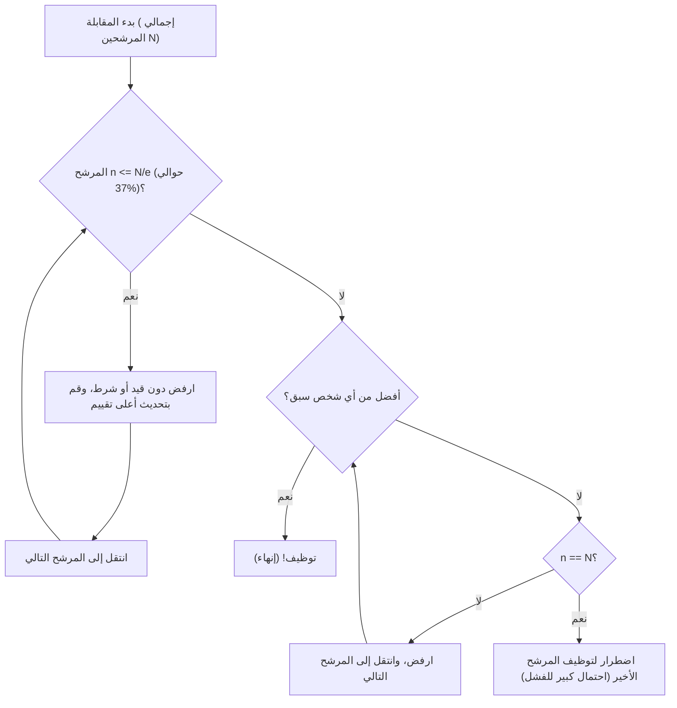

## ما هي مشكلة السكرتيرة (Secretary Problem)؟

تعتبر **مشكلة السكرتيرة** (Secretary Problem) واحدة من أشهر الأمثلة الكلاسيكية لـ **مشكلة التوقف الأمثل** (Optimal Stopping Problem) في نظرية الاحتمالات التطبيقية. تُعرف هذه المشكلة أيضًا باسم مشكلة الزواج (Marriage Problem) أو مشكلة مهر السلطان (Sultan's Dowry Problem)، وهي تضع نموذجًا رائعًا لمعضلة اتخاذ القرار حول كيفية اتخاذ **أفضل خيار** وسط حالة من عدم اليقين.

كل موقف يومي، مثل "متى تشتري منزلًا"، أو "متى تختار موقفًا للسيارة"، أو "متى تختار شريك حياتك"، يمكن أن يُردّ جميعها إلى هذه المشكلة.

### الإعداد الأساسي للمشكلة

تُدرس مشكلة السكرتيرة تحت القواعد الصارمة التالية:

1. **منصب شاغر واحد**: أنت ترغب في توظيف سكرتيرة واحدة.
2. **عدد المرشحين معروف**: إجمالي عدد المتقدمين $N$ معروف مسبقًا.
3. **مقابلات متتالية**: تتم مقابلة المرشحين واحدًا تلو الآخر بترتيب عشوائي، ويجب اتخاذ قرار بالقبول أو الرفض فورًا في مكان المقابلة.
4. **التقييم النسبي فقط**: يمكنك المقارنة مع المرشحين السابقين، ولكن لا يمكنك إعطاء درجة مطلقة (أي أنك لا تعرف سوى ما إذا كان المرشح الحالي هو الأفضل حتى الآن أم لا).
5. **لا تراجع**: لا يمكن توظيف مرشح تم رفضه مسبقًا.
6. **الهدف**: تعظيم احتمالية توظيف **أفضل مرشح** (المرشح الذي ترتيبه الحقيقي هو الأول). يُعتبر اختيار أي مرشح آخر (مثل الثاني) فشلًا.

في ظل هذه الظروف الصارمة، كيف يمكنك زيادة فرصة الحصول على "أفضل شخص" إلى أقصى حد؟

---

## الحدس مقابل الرياضيات

حدسيًا، إذا اتخذت قرارك مبكرًا جدًا، فهناك خطر تفويت مرشحين أفضل قد يكونون متاحين لاحقًا. وعلى العكس، إذا كنت حذرًا جدًا وانتظرت حتى النهاية، يزداد خطر أنك قد رفضت بالفعل أفضل مرشح.

الإستراتيجية المثلى التي استنتجتها الرياضيات هي قاعدة بسيطة كما يلي:

> **ارفض أول $r-1$ من المرشحين دون قيد أو شرط (واجعلهم "معيارًا")، ومن بين المرشحين بعد ذلك، وظف فورًا أول شخص يظهر ويكون أفضل من أي شخص سبقه.**

إذن، كم يجب أن يكون عدد الأشخاص الأساسيين $r-1$ (أو فترة المراقبة) لتعظيم احتمالية النجاح؟

---

## قاعدة 1/e (قاعدة 37% تقريبًا)

لندخل في صلب الموضوع: عندما يكون عدد المرشحين $N$ كبيرًا بما فيه الكفاية، فإن الإستراتيجية المثلى هي **"قضاء أول 37% تقريبًا من المرشحين في المراقبة (وضع المعيار)، ثم توظيف أول مرشح بعد ذلك يتجاوز هذا المعيار"**.

هذا الرقم "37%" يتم التعبير عنه كـ $1/e$ باستخدام أساس اللوغاريتم الطبيعي $e \approx 2.718$.
$$ \frac{1}{e} \approx 0.367879 \dots $$

والمثير للدهشة أنه عند اعتماد هذه الإستراتيجية، فإن احتمال النجاح في توظيف أفضل مرشح يكون أيضًا **$1/e$ (حوالي 37%)**. سواء كان عدد المرشحين 100 أو مليون، باتباع هذه القاعدة يمكنك اختيار أفضل شخص باحتمال يقارب 37%.

### مخطط التدفق: خوارزمية التوقف الأمثل

يوضح الشكل أدناه هذه الخوارزمية بصريًا.

---

## الإثبات الرياضي: لماذا 1/e؟

هنا نشرح الخلفية الاحتمالية لسبب اشتقاق النتيجة $1/e$.

لنفترض أن عدد الأشخاص المعياريين هو $r-1$. أي أن عملية التوظيف تبدأ من المرشح ذي الترتيب $r$.
لنفترض أنه من بين $N$ من المرشحين، أفضل مرشح حقيقي يقع في الترتيب $i$ (حيث $i \ge r$).

شروط التوظيف الناجح لهذا المرشح الـ $i$ هي كما يلي:
- أفضل مرشح حقيقي موجود في الترتيب $i$. هذا الاحتمال هو $1/N$.
- أفضل شخص من بين المرشحين من 1 إلى $i-1$ موجود ضمن أول $r-1$ شخص. وبسبب ذلك، لن يتجاوز المرشحون من $r$ إلى $i-1$ المعيار وبالتالي سيتم رفضهم. هذا الاحتمال هو $\frac{r-1}{i-1}$.

وبالتالي، فإن احتمال النجاح $P(r)$ عند تحديد معيار $r$ يُعبر عنه كما يلي:

$$ P(r) = \sum_{i=r}^{N} \frac{1}{N} \times \frac{r-1}{i-1} = \frac{r-1}{N} \sum_{i=r}^{N} \frac{1}{i-1} $$

عندما يكون $N$ كبيرًا جدًا، يمكن تقريب هذا المجموع باستخدام التكامل.
بوضع $x = \lim_{N \to \infty} \frac{r}{N}$ (النسبة من الإجمالي التي سيتم تعيينها كفترة مراقبة)،

$$ P(x) \approx x \int_{x}^{1} \frac{1}{t} dt = -x \ln(x) $$

لتعظيم احتمال النجاح $P(x)$، نبحث عن النقطة التي يكون فيها المشتق بالنسبة لـ $x$ هو $0$.

$$ \frac{d P(x)}{dx} = - \ln(x) - x \cdot \frac{1}{x} = - \ln(x) - 1 = 0 $$

بحل هذا،
$$ \ln(x) = -1 \implies x = e^{-1} = \frac{1}{e} $$

والاحتمال عند هذه القيمة القصوى هو،
$$ P(1/e) = -\left(\frac{1}{e}\right) \ln\left(\frac{1}{e}\right) = \frac{1}{e} $$

وبهذه الطريقة، يُستنتج بشكل جميل أن كلا من نسبة المراقبة واحتمال النجاح يصبحان **$1/e \approx 0.37$**.

---

## تطبيقات خارج أنشطة التوظيف

هذه **قاعدة 1/e** قابلة للتطبيق على نطاق واسع في أمور أخرى غير توظيف سكرتيرة.

1. **البحث عن منزل أو غرفة**
   إذا كان عليك تحديد مكان للانتقال إليه خلال فترة زمنية معينة (مثلاً شهر واحد). تكرس أول 11 يومًا تقريبًا (37%) للمعاينات دون توقيع عقد، وتستخدم مستوى أفضل عقار رأيته خلال تلك الفترة كمعيار. بعد ذلك، إذا ظهر عقار يتجاوز ذلك المعيار، توقّع العقد على الفور.

2. **البحث عن موقف سيارات**
   عند البحث عن مساحة لوقوف السيارات وأنت تقترب من وجهتك. تقود عبر أول 37% من المسافة الإجمالية فقط لتكوين فكرة عن التوافر، وبعد ذلك تركن في أول مساحة فارغة تجدها أقرب إلى وجهتك من أي مساحة رأيتها في أول 37%.

3. **البحث عن شريك زواج**
   هذا مثال يُذكر غالبًا على سبيل المزاح، لنفترض أنك تبحث عن شريك زواج على مدى 22 عامًا، من سن 18 إلى 40. 37% من 22 عامًا هي حوالي 8 سنوات. بعبارة أخرى، تلتقي بأشخاص مختلفين من سن 18 إلى 26 (18+8) لتشكيل معيارك، ومن سن 26 فصاعدًا، تتزوج من أول شخص تقابله وتراه أفضل من أي شخص في ماضيك؛ هذا هو الحل الأمثل رياضيًا.

---

## الخلاصة

تعد **مشكلة السكرتيرة** أداة رياضية قوية لحل معضلة شائعة في العالم الحقيقي تتمثل في الاضطرار إلى اتخاذ أفضل خيار دون امتلاك جميع المعلومات.

في مواجهة القلق الحدسي القائل بأن "السمكة التي أفلتت قد تكون كبيرة، لكن إذا انتظرت طويلاً فلن يتبقى أي سمك"، تقدم الرياضيات إجابة واضحة: **"شاهد 37% ثم قرر"**.

بالطبع، في عملية صنع القرار في العالم الحقيقي، هناك العديد من المتغيرات مثل "التقييم المطلق ممكن بالإضافة إلى التقييم النسبي"، أو "قد تتمكن من الاتصال بالمرشحين السابقين لاحقًا"، أو "يمكنك التنازل عن الثاني إذا لم يكن الأفضل". ومع ذلك، فإن معرفة **قاعدة 1/e** كمعيار يمكن أن تكون بوصلة قوية للتنقل في هذا العالم غير المؤكد.
