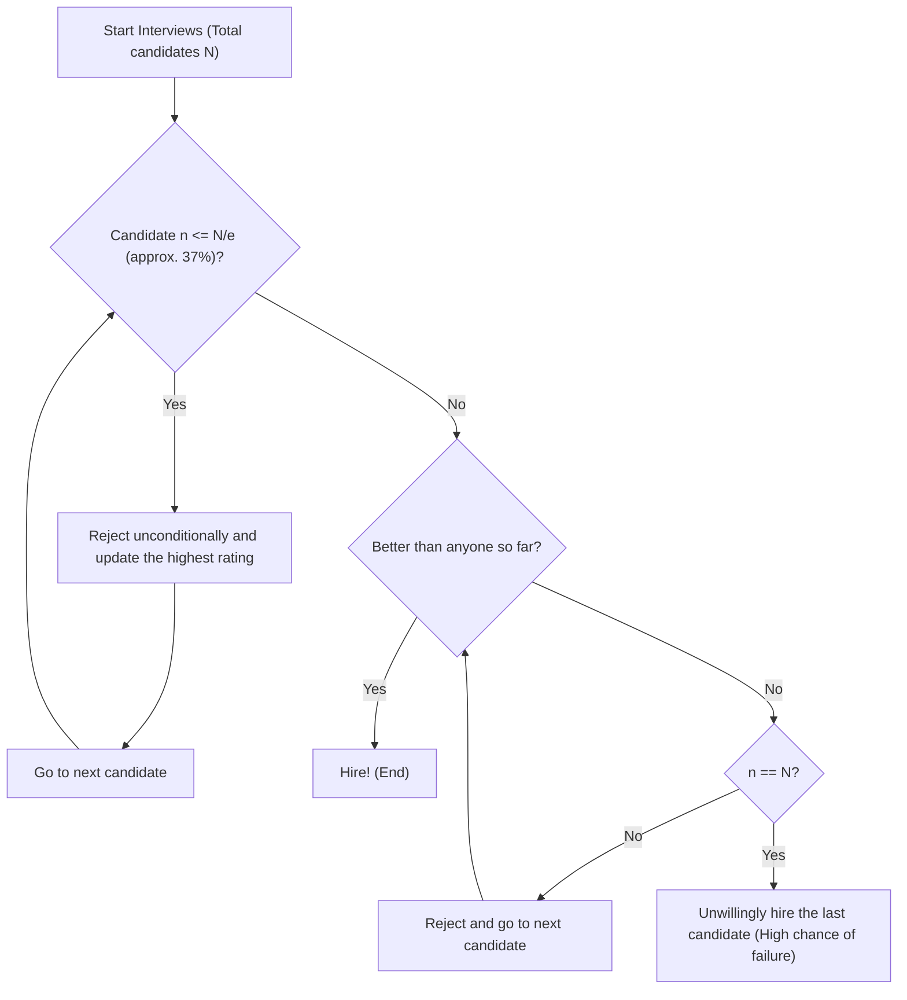

## What is the Secretary Problem?

The **Secretary Problem** is one of the most famous and classic examples of an **Optimal Stopping Problem** in applied probability theory. Also known as the Marriage Problem or the Sultan's Dowry Problem, it beautifully models the decision-making dilemma of how to make the **best choice** under uncertainty.

Everyday situations such as "when to buy a house," "when to settle on a parking space," or "when to choose a partner" can all potentially be reduced to this problem.

### Basic Problem Setting

The Secretary Problem is considered under the following strict rules:

1. **Single position**: You want to hire one secretary.
2. **Known number of candidates**: The total number of applicants $N$ is known in advance.
3. **Sequential interviews**: Candidates are interviewed one by one in a random order, and you must decide immediately whether to hire or reject them.
4. **Relative evaluation only**: You can compare them to past candidates, but you cannot assign an absolute score (i.e., you only know if the current candidate is the best so far).
5. **No going back**: Once a candidate is rejected, they cannot be recalled later.
6. **Objective**: Maximize the probability of hiring the **best candidate** (the one whose true rank is 1st). Hiring any other candidate (like the 2nd best) is considered a failure.

Under these strict conditions, how can you maximize the probability of selecting the "best one"?

---

## Intuition vs. Mathematics

Intuitively, if you decide too early, there is a risk of missing out on a potentially better candidate who might remain. Conversely, if you are too cautious and wait until the end, the risk of having already rejected the best candidate increases.

The optimal strategy derived by mathematics is the following simple rule:

> **Unconditionally reject the first $r-1$ candidates (use them as a "benchmark"), and then immediately hire the first candidate among the remaining ones who is better than anyone interviewed so far.**

So, how large should this benchmark number $r-1$ (or observation period) be to maximize the probability of success?

---

## The 1/e Law (The roughly 37% Rule)

To give the conclusion first, when the number of candidates $N$ is sufficiently large, the optimal strategy is **"spend the first roughly 37% of candidates on observation (establishing a benchmark), and then hire the first candidate who exceeds that benchmark."**

This number "37%" is expressed as $1/e$ using the base of the natural logarithm $e \approx 2.718$.
$$ \frac{1}{e} \approx 0.367879 \dots $$

Surprisingly, when you adopt this strategy, the probability of successfully hiring the best candidate is also **$1/e$ (approx. 37%)**. Whether there are 100 or 1,000,000 candidates, following this law gives you about a 37% chance of guessing the single best one.

### Flowchart: Optimal Stopping Algorithm

The diagram below visualizes the algorithm of this process.

---

## Mathematical Proof: Why 1/e?

Here, we explain the probability background of why the result $1/e$ is derived.

Let the number of people for the benchmark be $r-1$. In other words, hiring begins from the $r$-th candidate onward.
Assume that among the $N$ candidates, the truly best candidate is the $i$-th one ($i \ge r$).

The conditions for successfully hiring this $i$-th candidate are as follows:
- The true best candidate is at the $i$-th position. The probability of this is $1/N$.
- The best person among the 1st to $(i-1)$-th candidates is within the first $r-1$ people. Because of this, the candidates from the $r$-th to the $(i-1)$-th cannot exceed the benchmark, and are thus rejected. This probability is $\frac{r-1}{i-1}$.

Therefore, the probability of success $P(r)$ when setting the benchmark $r$ is expressed as follows:

$$ P(r) = \sum_{i=r}^{N} \frac{1}{N} \times \frac{r-1}{i-1} = \frac{r-1}{N} \sum_{i=r}^{N} \frac{1}{i-1} $$

When $N$ is very large, this sum can be approximated using an integral.
Letting $x = \lim_{N \to \infty} \frac{r}{N}$ (the proportion of the total used as the observation period),

$$ P(x) \approx x \int_{x}^{1} \frac{1}{t} dt = -x \ln(x) $$

To maximize the success probability $P(x)$, we differentiate with respect to $x$ and look for the point where it equals $0$.

$$ \frac{d P(x)}{dx} = - \ln(x) - x \cdot \frac{1}{x} = - \ln(x) - 1 = 0 $$

Solving this gives:
$$ \ln(x) = -1 \implies x = e^{-1} = \frac{1}{e} $$

And the probability at this maximum value is:
$$ P(1/e) = -\left(\frac{1}{e}\right) \ln\left(\frac{1}{e}\right) = \frac{1}{e} $$

In this way, it is beautifully derived that both the observation proportion and the success probability become **$1/e \approx 0.37$**.

---

## Applications Outside of Hiring

This **1/e law** can be widely applied outside of hiring a secretary.

1. **House Hunting or Apartment Hunting**
   If you have to decide on a place to move within a certain period (e.g., one month). Dedicate the first 11 days or so (37%) solely to viewing without signing a contract, and use the level of the best property seen during that time as a benchmark. After that, sign a contract immediately if a property exceeding that benchmark appears.

2. **Finding a Parking Space**
   When looking for a parking space while approaching your destination. Just pass by for the first 37% of the total distance to get a sense of the availability, and then park in the first empty space you find that is closer to your destination than any space you saw in the first 37%.

3. **Finding a Marriage Partner**
   An often half-jokingly mentioned example: suppose you search for a marriage partner over the 22 years from age 18 to 40. 37% of 22 years is about 8 years. In other words, the mathematically optimal solution is to meet various people to form a benchmark from age 18 to 26 (18+8), and then marry the first person you meet after turning 26 who you feel is more wonderful than anyone in your past.

---

## Conclusion

The **Secretary Problem** is a powerful mathematical tool for resolving the common real-world dilemma of being forced to make the best choice without having all the information.

To the intuitive anxiety that "the fish that got away might be big, but if I wait too long there will be no fish," mathematics presents a clear answer: **"look at 37% before deciding."**

Of course, real-world decision-making has various variables, such as "absolute evaluation is possible as well as relative evaluation," "you might be able to call back previous candidates later," and "you can compromise with the 2nd best even if not the very best." However, knowing the **1/e law** as a benchmark will be a powerful compass for surviving in an uncertain world.
