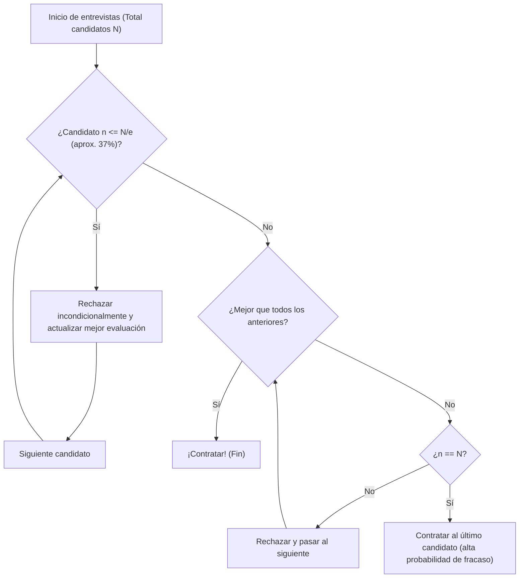

## ¿Qué es el Problema de la Secretaria (Secretary Problem)?

El **Problema de la Secretaria** (Secretary Problem) es uno de los ejemplos más famosos y clásicos del **Problema de Parada Óptima** (Optimal Stopping Problem) en probabilidad aplicada. También conocido como el Problema del Matrimonio o el Problema de la Dote del Sultán, modela brillantemente el dilema de cómo tomar la **mejor decisión** bajo incertidumbre.

Situaciones cotidianas como "¿cuándo comprar una casa?", "¿cuándo elegir un lugar de estacionamiento?" o "¿cuándo decidirse por una pareja?" pueden reducirse a este problema.

### Configuración básica del problema

El problema de la secretaria se plantea bajo las siguientes reglas estrictas:

1. **Una sola vacante**: Se desea contratar a una secretaria.
2. **Número de candidatos conocido**: El número total de postulantes $N$ se conoce de antemano.
3. **Entrevistas secuenciales**: Los candidatos se entrevistan uno a uno en orden aleatorio, y se debe decidir en el momento si se contrata o se rechaza.
4. **Solo evaluación relativa**: Se puede comparar con candidatos anteriores, pero no se puede asignar una puntuación absoluta (solo se sabe si el candidato actual es el mejor hasta ahora).
5. **Sin retorno**: Un candidato rechazado no puede ser contratado después.
6. **Objetivo**: Maximizar la probabilidad de contratar al **mejor candidato** (el de rango 1). Contratar a cualquier otro se considera un fracaso.

Bajo estas estrictas condiciones, ¿cómo maximizar la probabilidad de encontrar al mejor?

---

## Intuición vs. Matemáticas

Intuitivamente, decidir demasiado pronto conlleva el riesgo de perderse candidatos más cualificados que vendrán después. Por el contrario, esperar demasiado aumenta el riesgo de haber rechazado ya al mejor candidato.

La estrategia óptima que las matemáticas derivan es la siguiente regla simple:

> **Rechazar incondicionalmente a los primeros $r-1$ candidatos (usarlos como "referencia"), y luego contratar al primer candidato que supere a todos los anteriores.**

Entonces, ¿cuántos candidatos $r-1$ (o período de observación) debemos establecer como referencia para maximizar la probabilidad de éxito?

---

## La Ley de 1/e (Regla del 37%)

En conclusión, cuando el número de candidatos $N$ es suficientemente grande, la estrategia óptima es **"dedicar aproximadamente el 37% inicial de los candidatos a observación (establecer la referencia), y luego contratar al primer candidato que supere esa referencia"**.

Este "37%" se expresa mediante la base del logaritmo natural $e \approx 2.718$ como $1/e$.
$$ \frac{1}{e} \approx 0.367879 \dots $$

Sorprendentemente, al adoptar esta estrategia, la probabilidad de contratar al mejor candidato también es **$1/e$ (aproximadamente 37%)**. Ya sean 100 o 1 millón de candidatos, siguiendo esta ley se puede acertar con el mejor con una probabilidad de aproximadamente el 37%.

### Diagrama de flujo: Algoritmo de parada óptima

La siguiente figura visualiza el algoritmo de este proceso:

---

## Demostración matemática: ¿Por qué 1/e?

Aquí explicamos por qué se obtiene el resultado $1/e$.

Sea $r-1$ el número de referencia. Es decir, la contratación activa comienza a partir del candidato $r$.
Supongamos que el verdaderamente mejor candidato entre los $N$ está en la posición $i$ ($i \ge r$).

Las condiciones para contratar exitosamente al candidato $i$ son:
- El mejor candidato está en la posición $i$. Su probabilidad es $1/N$.
- El mejor entre los candidatos del 1 al $i-1$ está entre los primeros $r-1$. Esto hace que ningún candidato del $r$ al $i-1$ supere la referencia, siendo rechazados. Esta probabilidad es $\frac{r-1}{i-1}$.

Por tanto, la probabilidad de éxito $P(r)$ con la referencia $r$ es:

$$ P(r) = \sum_{i=r}^{N} \frac{1}{N} \times \frac{r-1}{i-1} = \frac{r-1}{N} \sum_{i=r}^{N} \frac{1}{i-1} $$

Cuando $N$ es muy grande, esta suma se puede aproximar mediante una integral.
Sea $x = \lim_{N \to \infty} \frac{r}{N}$ (la fracción del total dedicada a observación):

$$ P(x) \approx x \int_{x}^{1} \frac{1}{t} dt = -x \ln(x) $$

Para maximizar la probabilidad de éxito $P(x)$, derivamos respecto a $x$ e igualamos a $0$:

$$ \frac{d P(x)}{dx} = - \ln(x) - x \cdot \frac{1}{x} = - \ln(x) - 1 = 0 $$

Resolviendo:
$$ \ln(x) = -1 \implies x = e^{-1} = \frac{1}{e} $$

Y la probabilidad en este máximo es:
$$ P(1/e) = -\left(\frac{1}{e}\right) \ln\left(\frac{1}{e}\right) = \frac{1}{e} $$

Así se demuestra elegantemente que tanto la proporción de observación como la probabilidad de éxito son **$1/e \approx 0.37$**.

---

## Aplicaciones más allá de la contratación

La **ley de 1/e** es aplicable mucho más allá de la contratación de secretarias:

1. **Búsqueda de vivienda**
   Si debe decidir su próximo hogar en un período fijo (por ejemplo, 1 mes). Dedique los primeros 11 días (37%) a visitar sin comprometerse, estableciendo el nivel de referencia del mejor piso visto. Luego, alquile el primero que supere esa referencia.

2. **Búsqueda de estacionamiento**
   Al buscar estacionamiento acercándose al destino. Pase de largo el primer 37% de la distancia para hacerse una idea de la disponibilidad, y luego elija el primer espacio más cercano al destino que cualquiera de los vistos en ese 37%.

3. **Búsqueda de pareja**
   El ejemplo clásico (medio en broma): si busca pareja entre los 18 y los 40 años (22 años), el 37% de 22 es unos 8 años. Es decir, desde los 18 hasta los 26 (18+8), conozca personas y forme su referencia. A partir de los 26, la primera persona que supere a todas las anteriores es la elección matemáticamente óptima.

---

## Conclusión

El **Problema de la Secretaria** es una herramienta matemática poderosa que resuelve un dilema muy común en el mundo real: tomar la mejor decisión sin tener toda la información.

Ante la ansiedad intuitiva de "el pez que se escapó podría ser grande, pero si espero demasiado no quedará ninguno", las matemáticas nos dan una respuesta clara: **"observa el 37% y luego decide"**.

Por supuesto, en la toma de decisiones real hay muchas variables: evaluaciones absolutas además de relativas, posibilidad de contactar a candidatos anteriores, aceptar al segundo mejor como compromiso, etc. Sin embargo, conocer la **ley de 1/e** como referencia es una brújula poderosa para navegar en un mundo incierto.
