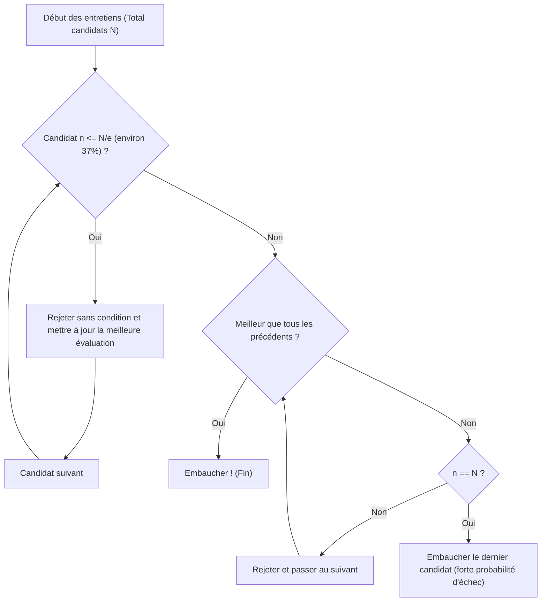

## Qu'est-ce que le problème du secrétaire (Secretary Problem) ?

Le **problème du secrétaire** (Secretary Problem) est l'un des exemples les plus célèbres et classiques du **problème d'arrêt optimal** (Optimal Stopping Problem) en probabilités appliquées. Également connu sous le nom de problème du mariage ou du problème de la dot du sultan, il modélise brillamment le dilemme de comment faire le **meilleur choix** en situation d'incertitude.

Des situations quotidiennes telles que « quand acheter une maison ? », « quand choisir une place de parking ? » ou « quand se décider pour un partenaire ? » se ramènent toutes à ce problème.

### Configuration de base du problème

Le problème du secrétaire se pose selon les règles strictes suivantes :

1. **Un seul poste** : On souhaite recruter un secrétaire.
2. **Nombre de candidats connu** : Le nombre total de candidats $N$ est connu à l'avance.
3. **Entretiens séquentiels** : Les candidats sont interviewés un par un dans un ordre aléatoire, et la décision d'embauche ou de rejet doit être prise sur-le-champ.
4. **Évaluation relative uniquement** : On peut comparer avec les candidats précédents, mais on ne peut pas attribuer de score absolu (on sait seulement si le candidat actuel est le meilleur vu jusqu'à présent).
5. **Pas de retour en arrière** : Un candidat rejeté ne peut pas être embauché ultérieurement.
6. **Objectif** : Maximiser la probabilité de recruter le **meilleur candidat** (celui classé 1er). Tout autre recrutement est considéré comme un échec.

Sous ces conditions strictes, comment maximiser la probabilité de trouver le meilleur ?

---

## Intuition vs. Mathématiques

Intuitivement, décider trop tôt comporte le risque de rater des candidats plus qualifiés à venir. À l'inverse, trop attendre augmente le risque d'avoir déjà rejeté le meilleur candidat.

La stratégie optimale dérivée par les mathématiques est la règle simple suivante :

> **Rejeter inconditionnellement les $r-1$ premiers candidats (les utiliser comme « référence »), puis embaucher le premier candidat qui surpasse tous les précédents.**

Alors, combien de candidats $r-1$ (ou période d'observation) faut-il comme référence pour maximiser la probabilité de succès ?

---

## La Loi de 1/e (Règle des 37%)

En conclusion, lorsque le nombre de candidats $N$ est suffisamment grand, la stratégie optimale est **« consacrer environ 37% des premiers candidats à l'observation (établir la référence), puis embaucher le premier candidat qui dépasse cette référence »**.

Ce « 37% » s'exprime à l'aide de la base du logarithme naturel $e \approx 2.718$ comme $1/e$.
$$ \frac{1}{e} \approx 0.367879 \dots $$

Étonnamment, en adoptant cette stratégie, la probabilité de recruter le meilleur candidat est également **$1/e$ (environ 37%)**. Que ce soit 100 ou 1 million de candidats, en suivant cette loi, on peut identifier le meilleur avec une probabilité d'environ 37%.

### Organigramme : Algorithme d'arrêt optimal

La figure suivante visualise l'algorithme de ce processus :

---

## Démonstration mathématique : Pourquoi 1/e ?

Expliquons ici pourquoi on obtient le résultat $1/e$.

Soit $r-1$ le nombre de référence. C'est-à-dire que le recrutement actif commence à partir du candidat $r$.
Supposons que le véritable meilleur candidat parmi les $N$ se trouve à la position $i$ ($i \ge r$).

Les conditions pour recruter avec succès le candidat $i$ sont :
- Le meilleur candidat est en position $i$. Sa probabilité est $1/N$.
- Le meilleur parmi les candidats 1 à $i-1$ se trouve dans les $r-1$ premiers. Cela signifie qu'aucun candidat de $r$ à $i-1$ ne dépasse la référence et est rejeté. Cette probabilité est $\frac{r-1}{i-1}$.

Par conséquent, la probabilité de succès $P(r)$ avec la référence $r$ est :

$$ P(r) = \sum_{i=r}^{N} \frac{1}{N} \times \frac{r-1}{i-1} = \frac{r-1}{N} \sum_{i=r}^{N} \frac{1}{i-1} $$

Lorsque $N$ est très grand, cette somme peut être approximée par une intégrale.
Posons $x = \lim_{N \to \infty} \frac{r}{N}$ (la fraction du total consacrée à l'observation) :

$$ P(x) \approx x \int_{x}^{1} \frac{1}{t} dt = -x \ln(x) $$

Pour maximiser la probabilité de succès $P(x)$, dérivons par rapport à $x$ et égalons à $0$ :

$$ \frac{d P(x)}{dx} = - \ln(x) - x \cdot \frac{1}{x} = - \ln(x) - 1 = 0 $$

En résolvant :
$$ \ln(x) = -1 \implies x = e^{-1} = \frac{1}{e} $$

Et la probabilité à ce maximum est :
$$ P(1/e) = -\left(\frac{1}{e}\right) \ln\left(\frac{1}{e}\right) = \frac{1}{e} $$

Ainsi, on démontre élégamment que la proportion d'observation et la probabilité de succès sont toutes deux **$1/e \approx 0.37$**.

---

## Applications au-delà du recrutement

La **loi de 1/e** est applicable bien au-delà du recrutement :

1. **Recherche de logement**
   Si vous devez trouver un logement dans un délai fixe (par exemple 1 mois). Consacrez les 11 premiers jours (37%) aux visites sans vous engager, en établissant le niveau de référence du meilleur logement vu. Ensuite, prenez le premier qui dépasse cette référence.

2. **Recherche de stationnement**
   En cherchant une place en approchant de votre destination. Parcourez le premier 37% de la distance pour évaluer la disponibilité, puis choisissez la première place plus proche de la destination que toutes celles vues dans ces 37%.

3. **Recherche de partenaire**
   L'exemple classique (à moitié plaisantin) : si vous cherchez un partenaire entre 18 et 40 ans (22 ans), 37% de 22 fait environ 8 ans. C'est-à-dire, de 18 à 26 ans (18+8), rencontrez des personnes et formez votre référence. À partir de 26 ans, la première personne qui surpasse toutes les précédentes est le choix mathématiquement optimal.

---

## Conclusion

Le **problème du secrétaire** est un outil mathématique puissant qui résout un dilemme très courant dans le monde réel : faire le meilleur choix sans disposer de toute l'information.

Face à l'anxiété intuitive que « le poisson qui s'est échappé était peut-être gros, mais si j'attends trop il n'en restera plus », les mathématiques nous donnent une réponse claire : **« observez 37% puis décidez »**.

Bien sûr, dans la prise de décision réelle, de nombreuses variables entrent en jeu : évaluations absolues en plus des relatives, possibilité de recontacter d'anciens candidats, accepter le deuxième meilleur comme compromis, etc. Cependant, connaître la **loi de 1/e** comme référence est une boussole puissante pour naviguer dans un monde incertain.
