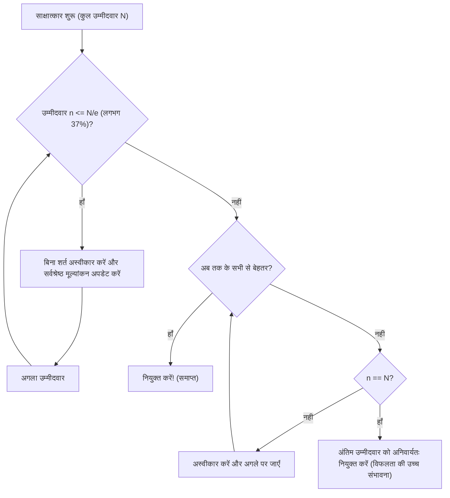

## सेक्रेटरी समस्या (Secretary Problem) क्या है?

**सेक्रेटरी समस्या** (Secretary Problem) अनुप्रयुक्त प्रायिकता में **इष्टतम रुकावट समस्या** (Optimal Stopping Problem) का सबसे प्रसिद्ध और शास्त्रीय उदाहरण है। इसे विवाह समस्या (Marriage Problem) या सुल्तान की दहेज समस्या (Sultan's Dowry Problem) के नाम से भी जाना जाता है, जो अनिश्चितता में **सर्वोत्तम चयन** कैसे करें, इस दुविधा को उत्कृष्ट रूप से मॉडल करता है।

रोज़मर्रा की स्थितियाँ जैसे "घर कब खरीदें?", "पार्किंग कब चुनें?" या "जीवनसाथी कब तय करें?" - ये सभी इस समस्या पर आधारित हो सकती हैं।

### समस्या की मूल सेटिंग

सेक्रेटरी समस्या निम्नलिखित सख्त नियमों के तहत विचार की जाती है:

1. **एक पद**: एक सेक्रेटरी की भर्ती करनी है।
2. **उम्मीदवारों की संख्या ज्ञात**: आवेदकों की कुल संख्या $N$ पहले से ज्ञात है।
3. **क्रमिक साक्षात्कार**: उम्मीदवारों का यादृच्छिक क्रम में एक-एक करके साक्षात्कार लिया जाता है, और तुरंत निर्णय लेना होता है।
4. **केवल सापेक्ष मूल्यांकन**: पिछले उम्मीदवारों से तुलना की जा सकती है, लेकिन पूर्ण अंक नहीं दिए जा सकते (केवल यह पता चलता है कि वर्तमान उम्मीदवार अब तक का सर्वश्रेष्ठ है या नहीं)।
5. **पीछे नहीं जा सकते**: एक बार अस्वीकृत उम्मीदवार को बाद में नियुक्त नहीं किया जा सकता।
6. **उद्देश्य**: **सर्वश्रेष्ठ उम्मीदवार** (रैंक 1) को नियुक्त करने की प्रायिकता को अधिकतम करना। किसी अन्य को नियुक्त करना विफलता माना जाता है।

इन कठोर शर्तों के अंतर्गत, सर्वश्रेष्ठ को खोजने की प्रायिकता कैसे अधिकतम करें?

---

## अंतर्ज्ञान बनाम गणित

सहज रूप से, बहुत जल्दी निर्णय लेने पर बाद में आने वाले बेहतर उम्मीदवारों को खोने का जोखिम होता है। इसके विपरीत, बहुत अधिक प्रतीक्षा करने पर पहले ही सर्वश्रेष्ठ उम्मीदवार को अस्वीकृत कर चुके होने का जोखिम बढ़ जाता है।

गणित द्वारा प्राप्त इष्टतम रणनीति यह सरल नियम है:

> **पहले $r-1$ उम्मीदवारों को बिना शर्त अस्वीकार करें (उन्हें "मानक" के रूप में उपयोग करें), फिर उसके बाद के उम्मीदवारों में से जो पहली बार सभी पिछले उम्मीदवारों से बेहतर हो, उसे तुरंत नियुक्त करें।**

तो, सफलता की प्रायिकता को अधिकतम करने के लिए मानक के रूप में $r-1$ (या अवलोकन अवधि) कितनी निर्धारित करनी चाहिए?

---

## 1/e का नियम (लगभग 37% नियम)

निष्कर्ष यह है कि जब उम्मीदवारों की संख्या $N$ पर्याप्त रूप से बड़ी हो, तो इष्टतम रणनीति है **"शुरुआती लगभग 37% उम्मीदवारों को अवलोकन (मानक निर्माण) में लगाएँ, और उसके बाद मानक से ऊपर आने वाले पहले उम्मीदवार को नियुक्त करें"**।

यह "37%" प्राकृतिक लघुगणक के आधार $e \approx 2.718$ का उपयोग करके $1/e$ के रूप में व्यक्त होता है।
$$ \frac{1}{e} \approx 0.367879 \dots $$

आश्चर्यजनक रूप से, इस रणनीति को अपनाने पर सर्वश्रेष्ठ उम्मीदवार को नियुक्त करने की प्रायिकता भी **$1/e$ (लगभग 37%)** होती है। चाहे 100 उम्मीदवार हों या 10 लाख, इस नियम का पालन करने पर लगभग 37% प्रायिकता से सर्वश्रेष्ठ को चुना जा सकता है।

### फ़्लोचार्ट: इष्टतम रुकावट एल्गोरिथम

निम्नलिखित आरेख इस प्रक्रिया के एल्गोरिथम को दर्शाता है:

---

## गणितीय प्रमाण: 1/e क्यों?

यहाँ हम समझाते हैं कि $1/e$ का परिणाम क्यों प्राप्त होता है।

मान लीजिए मानक संख्या $r-1$ व्यक्ति है। अर्थात, $r$-वें उम्मीदवार से नियुक्ति प्रारंभ होती है।
$N$ उम्मीदवारों में से, मान लीजिए वास्तव में सर्वश्रेष्ठ उम्मीदवार $i$-वें स्थान पर है ($i \ge r$)।

$i$-वें उम्मीदवार को सफलतापूर्वक नियुक्त करने की शर्तें:
- सर्वश्रेष्ठ उम्मीदवार $i$-वें स्थान पर है। इसकी प्रायिकता $1/N$ है।
- 1 से $i-1$ तक के उम्मीदवारों में सर्वश्रेष्ठ पहले $r-1$ में है। यह प्रायिकता $\frac{r-1}{i-1}$ है।

इसलिए, मानक $r$ के साथ सफलता की प्रायिकता $P(r)$:

$$ P(r) = \sum_{i=r}^{N} \frac{1}{N} \times \frac{r-1}{i-1} = \frac{r-1}{N} \sum_{i=r}^{N} \frac{1}{i-1} $$

जब $N$ बहुत बड़ा हो, तो इस योग को समाकल से सन्निकटित किया जा सकता है।
$x = \lim_{N \to \infty} \frac{r}{N}$ (कुल का कितना अंश अवलोकन के लिए) रखें:

$$ P(x) \approx x \int_{x}^{1} \frac{1}{t} dt = -x \ln(x) $$

सफलता की प्रायिकता $P(x)$ को अधिकतम करने के लिए, $x$ के सापेक्ष अवकलन करके $0$ के बराबर रखें:

$$ \frac{d P(x)}{dx} = - \ln(x) - x \cdot \frac{1}{x} = - \ln(x) - 1 = 0 $$

हल करने पर:
$$ \ln(x) = -1 \implies x = e^{-1} = \frac{1}{e} $$

और इस अधिकतम पर प्रायिकता:
$$ P(1/e) = -\left(\frac{1}{e}\right) \ln\left(\frac{1}{e}\right) = \frac{1}{e} $$

इस प्रकार, अवलोकन अनुपात और सफलता की प्रायिकता दोनों **$1/e \approx 0.37$** होना सुंदर ढंग से सिद्ध होता है।

---

## भर्ती से परे अनुप्रयोग

**1/e का नियम** भर्ती के अलावा व्यापक रूप से लागू होता है:

1. **घर या कमरा खोजना**
   यदि एक निश्चित अवधि (जैसे 1 महीना) में नया घर तय करना हो। पहले लगभग 11 दिन (37%) केवल देखने में लगाएँ बिना कोई अनुबंध किए, और उस दौरान देखे गए सर्वश्रेष्ठ का स्तर मानक बनाएँ। उसके बाद, मानक से बेहतर पहली संपत्ति पर तुरंत अनुबंध करें।

2. **पार्किंग खोजना**
   गंतव्य के पास पार्किंग खोजते समय। कुल दूरी का पहला 37% बस गुज़र जाएँ ताकि उपलब्धता का अंदाज़ा हो, फिर पहले 37% में देखी किसी भी जगह से गंतव्य के अधिक निकट पहली खाली जगह पर पार्क करें।

3. **जीवनसाथी खोजना**
   अक्सर मज़ाक में कहा जाने वाला उदाहरण: यदि 18 से 40 वर्ष (22 वर्ष) में जीवनसाथी खोजना हो। 22 का 37% लगभग 8 वर्ष है। अर्थात, 18 से 26 वर्ष (18+8) तक विभिन्न लोगों से मिलें और मानक बनाएँ। 26 वर्ष के बाद, जो पहला व्यक्ति पिछले सभी से बेहतर लगे, वह गणितीय रूप से इष्टतम चयन है।

---

## निष्कर्ष

**सेक्रेटरी समस्या** एक शक्तिशाली गणितीय उपकरण है जो वास्तविक दुनिया की एक बहुत सामान्य दुविधा को हल करती है: पूरी जानकारी के बिना सर्वोत्तम चयन करना।

"जो मछली छूट गई वो शायद बड़ी थी, लेकिन बहुत इंतज़ार करने पर कोई मछली नहीं बचेगी" - इस सहज चिंता के विरुद्ध, गणित एक स्पष्ट उत्तर देता है: **"37% देखो फिर निर्णय लो"**।

बेशक, वास्तविक निर्णय लेने में कई चर होते हैं: सापेक्ष के अलावा पूर्ण मूल्यांकन, पिछले उम्मीदवारों से संपर्क की संभावना, दूसरे सर्वश्रेष्ठ से समझौता आदि। फिर भी, संदर्भ के रूप में **1/e का नियम** जानना अनिश्चित दुनिया में जीने के लिए एक शक्तिशाली दिशा-सूचक है।
