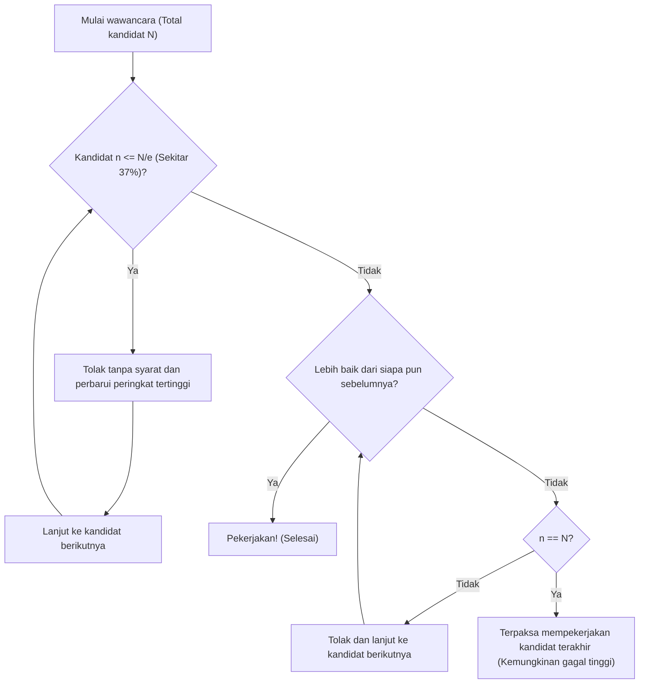

## Apa itu Masalah Sekretaris (Secretary Problem)?

**Masalah Sekretaris** (Secretary Problem) adalah salah satu contoh paling terkenal dan klasik dari **[Masalah Penghentian](/id/p/halting-problem/) Optimal** (Optimal Stopping Problem) dalam teori peluang terapan. Masalah ini, yang juga dikenal sebagai Masalah Pernikahan (Marriage Problem) atau Masalah Mahar Sultan (Sultan's Dowry Problem), memodelkan dengan sempurna dilema pengambilan keputusan tentang bagaimana membuat **pilihan terbaik** di tengah ketidakpastian.

Berbagai situasi sehari-hari, seperti "kapan harus membeli rumah," "kapan harus menentukan tempat parkir," dan "kapan harus memilih pasangan," semuanya bisa bermuara pada masalah ini.

### Pengaturan Dasar Masalah

Masalah Sekretaris dipertimbangkan di bawah aturan ketat berikut:

1. **Hanya ada 1 posisi**: Kita ingin mempekerjakan seorang sekretaris.
2. **Jumlah kandidat diketahui**: Jumlah total pelamar $N$ diketahui sebelumnya.
3. **Wawancara berurutan**: Kandidat diwawancarai satu per satu dalam urutan acak, dan keputusan untuk menerima atau menolak harus dibuat saat itu juga.
4. **Hanya evaluasi relatif**: Kita dapat membandingkan dengan kandidat sebelumnya, tetapi tidak dapat memberikan skor mutlak (artinya, kita hanya tahu apakah kandidat saat ini adalah yang terbaik sejauh ini).
5. **Tidak bisa mundur**: Kandidat yang sudah ditolak tidak dapat dipekerjakan kemudian.
6. **Tujuan**: Memaksimalkan peluang untuk mempekerjakan **kandidat terbaik** (kandidat dengan peringkat sebenarnya adalah 1). Memilih kandidat lain (seperti peringkat ke-2) dianggap gagal.

Dalam kondisi yang ketat ini, bagaimana kita dapat memaksimalkan peluang untuk mendapatkan "satu orang terbaik"?

---

## Intuisi vs. Matematika

Secara intuitif, jika kita membuat keputusan terlalu dini, ada risiko kehilangan kandidat yang mungkin lebih baik di masa depan. Sebaliknya, jika kita terlalu berhati-hati dan menunggu sampai akhir, risiko untuk telah menolak kandidat terbaik menjadi lebih tinggi.

Strategi optimal yang dihasilkan oleh matematika adalah aturan sederhana berikut:

> **Tolak $r-1$ kandidat pertama tanpa syarat (jadikan mereka sebagai "standar"), dan dari kandidat berikutnya, segera pekerjakan orang pertama yang lebih baik dari siapa pun sebelumnya.**

Lalu, berapa jumlah kandidat yang menjadi standar $r-1$ (atau periode observasi) yang harus ditetapkan untuk memaksimalkan peluang keberhasilan?

---

## Aturan 1/e (Aturan Sekitar 37%)

Kesimpulannya, ketika jumlah kandidat $N$ cukup besar, strategi optimalnya adalah **"habiskan sekitar 37% kandidat pertama untuk observasi (membuat standar), dan kemudian pekerjakan kandidat pertama yang melampaui standar tersebut."**

Angka "37%" ini direpresentasikan sebagai $1/e$ menggunakan basis logaritma natural $e \approx 2.718$.
$$ \frac{1}{e} \approx 0.367879 \dots $$

Yang mengejutkan, ketika strategi ini diadopsi, peluang keberhasilan dalam mempekerjakan kandidat terbaik juga menjadi **$1/e$ (sekitar 37%)**. Baik ada 100 atau 1 juta kandidat, mengikuti aturan ini memberi kita peluang sekitar 37% untuk mendapatkan satu orang terbaik.

### Diagram Alur: Algoritma Penghentian Optimal

Gambar di bawah ini memvisualisasikan algoritma dari proses ini.

---

## Bukti Matematis: Mengapa 1/e?

Di sini, kami akan menjelaskan latar belakang probabilistik mengapa hasil $1/e$ diperoleh.

Misalkan jumlah orang standar adalah $r-1$. Artinya, proses perekrutan dimulai dari kandidat ke-$r$.
Asumsikan bahwa di antara $N$ kandidat, kandidat yang benar-benar terbaik berada di posisi ke-$i$ ($i \ge r$).

Kondisi untuk berhasil mempekerjakan kandidat ke-$i$ ini adalah sebagai berikut:
- Kandidat terbaik yang sebenarnya ada di urutan ke-$i$. Peluangnya adalah $1/N$.
- Orang terbaik di antara kandidat ke-$1$ hingga ke-$(i-1)$ berada di dalam $r-1$ orang pertama. Dengan ini, kandidat dari $r$ hingga $i-1$ tidak dapat melampaui standar, sehingga mereka ditolak. Peluang ini adalah $\frac{r-1}{i-1}$.

Oleh karena itu, peluang keberhasilan $P(r)$ ketika menetapkan standar $r$ dinyatakan sebagai berikut:

$$ P(r) = \sum_{i=r}^{N} \frac{1}{N} \times \frac{r-1}{i-1} = \frac{r-1}{N} \sum_{i=r}^{N} \frac{1}{i-1} $$

Ketika $N$ sangat besar, jumlah ini dapat didekati menggunakan integral.
Misalkan $x = \lim_{N \to \infty} \frac{r}{N}$ (Berapa proporsi keseluruhan yang menjadi periode observasi),

$$ P(x) \approx x \int_{x}^{1} \frac{1}{t} dt = -x \ln(x) $$

Untuk memaksimalkan peluang keberhasilan $P(x)$, kita mencari titik di mana turunan terhadap $x$ menjadi $0$.

$$ \frac{d P(x)}{dx} = - \ln(x) - x \cdot \frac{1}{x} = - \ln(x) - 1 = 0 $$

Menyelesaikan ini,
$$ \ln(x) = -1 \implies x = e^{-1} = \frac{1}{e} $$

Dan, peluang pada nilai maksimum ini adalah,
$$ P(1/e) = -\left(\frac{1}{e}\right) \ln\left(\frac{1}{e}\right) = \frac{1}{e} $$

Dengan cara ini, diperoleh dengan indah bahwa baik proporsi yang diamati maupun peluang keberhasilan keduanya menjadi **$1/e \approx 0.37$**.

---

## Aplikasi di Luar Proses Rekrutmen

**Aturan 1/e** ini dapat diterapkan secara luas di luar perekrutan sekretaris.

1. **Mencari Rumah atau Kamar**
   Ketika kita harus memutuskan tempat pindah dalam periode tertentu (misalnya, 1 bulan). Sekitar 11 hari pertama (37%) dikhususkan untuk meninjau tanpa menandatangani kontrak, dan tingkat properti terbaik yang dilihat selama waktu itu dijadikan sebagai standar. Setelah itu, segera tanda tangani kontrak jika ada properti yang melampaui standar tersebut.

2. **Mencari Tempat Parkir**
   Ketika mencari tempat parkir sambil mendekati tempat tujuan. Untuk 37% pertama dari total jarak, lewati saja untuk merasakan ketersediaannya, lalu parkir di tempat kosong pertama yang kita temukan yang lebih dekat ke tujuan daripada tempat mana pun yang terlihat di 37% pertama.

3. **Mencari Pasangan Hidup**
   Ini adalah contoh yang sering diceritakan sambil bercanda. Misalkan kita mencari pasangan menikah selama 22 tahun dari usia 18 hingga 40 tahun. 37% dari 22 tahun adalah sekitar 8 tahun. Artinya, solusi optimal secara matematis adalah bertemu dengan berbagai orang dari usia 18 hingga 26 (18+8) untuk membentuk standar, dan menikah dengan orang pertama yang ditemui setelah usia 26 tahun yang terasa lebih baik dari siapa pun di masa lalu.

---

## Kesimpulan

**Masalah Sekretaris** adalah alat yang ampuh yang secara matematis menyelesaikan dilema yang umum di dunia nyata: dipaksa untuk membuat pilihan terbaik tanpa memiliki semua informasi.

Melawan kecemasan intuitif bahwa "ikan yang lolos mungkin besar, tetapi jika menunggu terlalu lama, ikannya akan hilang," matematika menawarkan jawaban yang jelas: **"Lihat 37% sebelum memutuskan."**

Tentu saja, dalam pengambilan keputusan di dunia nyata, ada berbagai variabel seperti "evaluasi mutlak dimungkinkan, tidak hanya evaluasi relatif," "kita mungkin bisa memanggil kembali kandidat sebelumnya nanti," dan "kita bisa berkompromi dengan yang terbaik kedua jika bukan yang terbaik." Namun, mengetahui **Aturan 1/e** sebagai standar akan menjadi kompas yang kuat untuk bertahan hidup di dunia yang tidak pasti.
