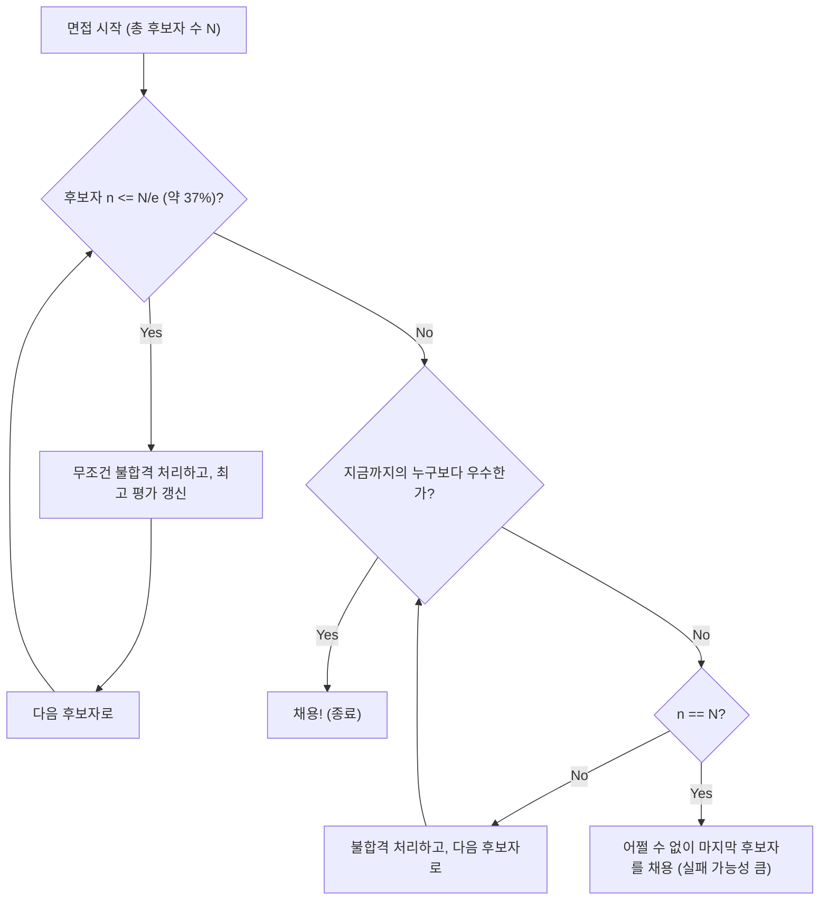

## 비서 문제 (Secretary Problem) 란?

**비서 문제** (Secretary Problem) 는 응용 확률론에서 **최적 정지 문제** (Optimal Stopping Problem) 의 가장 유명하고 고전적인 예 중 하나입니다. 이 문제는 결혼 문제(Marriage Problem)나 술탄의 지참금 문제(Sultan's Dowry Problem) 등으로도 불리며, 불확실성 속에서 어떻게 **최선의 선택** 을 해야 하는가 하는 의사결정의 딜레마를 훌륭하게 모델화하고 있습니다.

일상의 모든 상황, 예를 들어 '언제 집을 사야 할까', '언제 주차 공간을 정해야 할까', '언제 파트너를 정해야 할까'와 같은 상황은 모두 이 문제로 귀결될 수 있습니다.

### 문제의 기본 설정

비서 문제는 다음과 같은 엄격한 규칙 하에서 생각할 수 있습니다.

1. **채용 인원은 1명** : 한 명의 비서를 채용하고자 한다.
2. **후보자의 수는 이미 알고 있음** : 지원자의 총 수 $N$ 은 미리 알고 있다.
3. **순차적인 면접** : 후보자를 무작위 순서로 한 명씩 면접하고, 그 자리에서 합격인지 불합격인지를 결정해야 한다.
4. **상대 평가만 가능** : 과거의 후보자와 비교할 수는 있지만, 절대적인 점수를 매길 수는 없다 (즉, 현재 후보자가 지금까지 중 가장 우수한지 여부만 알 수 있다).
5. **되돌리기 불가** : 한 번 불합격시킨 후보자를 나중에 채용할 수는 없다.
6. **목적** : **가장 우수한 후보자** (진짜 순위가 1위인 후보자) 를 채용할 확률을 극대화하는 것. 그 외의 후보자 (2위 등) 를 채용한 경우는 실패로 간주한다.

이 엄격한 조건 속에서, 어떻게 하면 '최고의 1인' 을 뽑을 확률을 가장 높일 수 있을까요?

---

## 직관 vs. 수학

직관적으로는 너무 빨리 결정을 내리면, 나중에 남아 있을지도 모르는 더 우수한 후보자를 놓칠 위험이 있습니다. 반대로, 너무 신중해져서 끝까지 기다리면 이미 가장 우수한 후보자를 불합격시켜 버렸을 위험이 커집니다.

수학이 도출해 낸 최적의 전략은 다음과 같은 간단한 규칙입니다.

> **처음 $r-1$ 명의 후보자는 무조건 불합격시키고 (이들을 '기준' 으로 삼는다), 그 이후의 후보자 중에서 지금까지의 그 누구보다 우수한 사람이 나타나면 즉시 채용한다.**

그렇다면, 이 기준이 되는 인원 수 $r-1$ (또는 관찰 기간) 을 어느 정도로 설정해야 성공 확률을 극대화할 수 있을까요?

---

## 1/e의 법칙 (약 37% 규칙)

결론부터 말하자면, 후보자 수 $N$ 이 충분히 클 경우, 최적의 전략은 **'처음 약 37%의 후보자를 관찰 (기준 마련) 에 소비하고, 그 후 기준을 뛰어넘는 첫 번째 후보자를 채용한다'** 는 것입니다.

이 '37%' 라는 숫자는 자연로그의 밑 $e \approx 2.718$ 을 사용하여 $1/e$ 로 표현됩니다.
$$ \frac{1}{e} \approx 0.367879 \dots $$

놀랍게도, 이 전략을 채택했을 때 가장 우수한 후보자를 멋지게 채용할 수 있는 확률 또한 **$1/e$ (약 37%)** 가 됩니다. 후보자가 100명이든 100만 명이든, 이 법칙을 따르면 약 37%의 확률로 최고의 1인을 맞출 수 있는 것입니다.

### 순서도: 최적 정지 알고리즘

다음 그림은 이 프로세스의 알고리즘을 시각화한 것입니다.

---

## 수학적 증명: 왜 1/e 인가?

여기서는 왜 $1/e$ 이라는 결과가 도출되는지, 그 확률론적인 배경을 설명합니다.

어떤 기준의 인원 수를 $r-1$ 명이라고 합시다. 즉, $r$ 번째 이후의 후보자부터 채용 활동을 시작합니다.
$N$ 명의 후보자 중에서, 진정으로 가장 우수한 후보자가 $i$ 번째 ($i \ge r$) 에 있다고 가정합니다.

이 $i$ 번째 후보자를 멋지게 채용할 수 있는 조건은 다음과 같습니다.
- 진짜 최우수 후보자가 $i$ 번째에 있다. 그 확률은 $1/N$.
- $1$ 번째부터 $i-1$ 번째까지의 후보자 중에서 가장 우수한 사람이 처음 $r-1$ 명 안에 있다. 이로 인해, $r$ 번째부터 $i-1$ 번째까지의 후보자는 기준을 넘지 못하므로 불합격된다. 이 확률은 $\frac{r-1}{i-1}$.

따라서, $r$ 이라는 기준을 설정했을 때 성공할 확률 $P(r)$ 은 다음과 같이 표현됩니다.

$$ P(r) = \sum_{i=r}^{N} \frac{1}{N} \times \frac{r-1}{i-1} = \frac{r-1}{N} \sum_{i=r}^{N} \frac{1}{i-1} $$

$N$ 이 매우 클 때, 이 합은 적분을 사용하여 근사할 수 있습니다.
$x = \lim_{N \to \infty} \frac{r}{N}$ (전체의 몇 할을 관찰 기간으로 할 것인가) 라고 두면,

$$ P(x) \approx x \int_{x}^{1} \frac{1}{t} dt = -x \ln(x) $$

성공 확률 $P(x)$ 를 극대화하기 위해, $x$ 로 미분하여 $0$ 이 되는 점을 찾습니다.

$$ \frac{d P(x)}{dx} = - \ln(x) - x \cdot \frac{1}{x} = - \ln(x) - 1 = 0 $$

이것을 풀면,
$$ \ln(x) = -1 \implies x = e^{-1} = \frac{1}{e} $$

그리고, 이 최댓값에서의 확률은,
$$ P(1/e) = -\left(\frac{1}{e}\right) \ln\left(\frac{1}{e}\right) = \frac{1}{e} $$

이와 같이, 관찰하는 비율도 성공할 확률도 모두 **$1/e \approx 0.37$** 이 된다는 것이 아름답게 도출됩니다.

---

## 채용 활동 이외의 응용

이 **1/e의 법칙** 은 비서 채용 이외에도 폭넓게 응용 가능합니다.

1. **집 구하기나 방 구하기**
   어떤 기간 내 (예를 들어 1개월) 에 이사할 곳을 정해야 하는 경우. 처음 약 11일간 (37%) 은 집을 보는 데에만 전념하고 계약하지 않으며, 그동안 본 최고의 매물 수준을 기준으로 삼습니다. 그 후, 그 기준을 뛰어넘는 매물이 나타나면 즉시 계약합니다.

2. **주차장 찾기**
   목적지에 가까워지면서 주차 공간을 찾을 때. 전체 거리의 처음 37%는 그냥 지나치면서 빈자리 상황의 감을 잡고, 그 후 처음 37%에서 본 어떤 공간보다 목적지에 가까운 빈자리를 발견하면 거기에 주차합니다.

3. **결혼 상대 찾기**
   흔히 농담 반 진담 반으로 이야기되는 예이지만, 18세부터 40세까지 22년 동안 결혼 상대를 찾는다고 가정합시다. 22년의 37%는 약 8년입니다. 즉, 18세부터 26세(18+8)까지는 다양한 사람을 만나며 기준을 형성하고, 26세 이후에 만난 사람 중 지금까지 과거의 그 누구보다 훌륭하다고 느낀 첫 번째 상대와 결혼하는 것이 수학적 최적해입니다.

---

## 요약

**비서 문제** 는 정보를 모두 가지고 있지 않은 상태에서 최선의 선택을 해야 한다는, 현실 세계에 흔히 있는 딜레마를 수학적으로 해결해 주는 강력한 도구입니다.

"놓친 고기가 클지도 모르지만, 너무 기다리면 고기가 없어진다"는 직관적인 불안에 대해, 수학은 **"37%를 보고 나서 결정하라"** 는 명확한 해답을 제시해 줍니다.

물론 현실의 의사결정에는 "상대 평가뿐만 아니라 절대 평가도 가능", "이전의 후보자에게 나중에 연락할 수 있을지도 모름", "최고가 아니어도 2번째라면 타협할 수 있음"과 같은 다양한 변수가 있습니다. 하지만, 기준으로서의 **1/e의 법칙** 을 알아두는 것은 불확실한 세상을 살아남기 위한 하나의 강력한 나침반이 될 것입니다.
