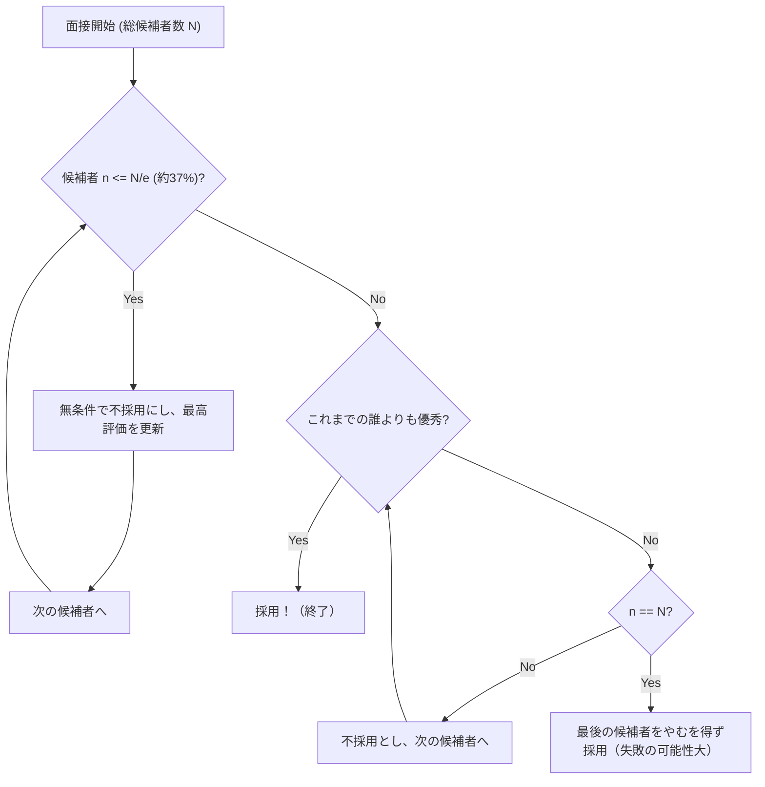

## 秘書問題（Secretary Problem）とは？

**秘書問題**（Secretary Problem）は、応用確率論における **最適停止問題**（Optimal Stopping Problem）の最も有名で古典的な例の一つです。この問題は、結婚問題（Marriage Problem）やスルタンの持参金問題（Sultan's Dowry Problem）などとも呼ばれ、不確実性の中でどのように **最良の選択** を行うべきかという意思決定のジレンマを見事にモデル化しています。

日常のあらゆる場面、例えば「いつ家を買うべきか」「いつ駐車スペースを決めるべきか」「いつパートナーを決めるべきか」といった状況は、すべてこの問題に帰着する可能性があります。

### 問題の基本設定

秘書問題は、以下のような厳密なルールのもとで考えられます。

1. **採用枠は1つ**：一人の秘書を採用したいと考えている。
2. **候補者の数は既知**：応募者の総数 $N$ はあらかじめ分かっている。
3. **逐次的な面接**：候補者をランダムな順序で一人ずつ面接し、その場で採用か不採用かを決定しなければならない。
4. **相対評価のみ**：過去の候補者との比較はできるが、絶対的なスコアをつけることはできない（つまり、今の候補者がこれまでで一番優秀かどうかしか分からない）。
5. **後戻り不可**：一度不採用にした候補者を後から採用することはできない。
6. **目的**： **最も優秀な候補者**（真のランクが1位の候補者）を採用する確率を最大化すること。それ以外の候補者（2位など）を採用した場合は失敗とみなす。

この厳しい条件の中で、どのようにすれば「最高の1人」を引き当てる確率を最も高くできるでしょうか？

---

## 直感 vs. 数学

直感的には、あまり早く決断してしまうと、後に残っているかもしれないもっと優秀な候補者を逃すリスクがあります。逆に、慎重になりすぎて最後まで待つと、すでに一番優秀な候補者を不採用にしてしまっているリスクが高まります。

数学が導き出した最適な戦略は、次のようなシンプルなルールです。

> **最初の $r-1$ 人の候補者は無条件で不採用とし（彼らを「基準」とする）、それ以降の候補者の中で、それまでの誰よりも優秀な人が現れたら即座に採用する。**

では、この基準となる人数 $r-1$ （または観察期間）をどのくらいに設定すれば、成功確率を最大化できるのでしょうか？

---

## 1/eの法則（約37%ルール）

結論から言うと、候補者数 $N$ が十分に大きい場合、最適な戦略は **「最初の約37%の候補者を観察（基準作り）に費やし、その後、基準を上回る最初の候補者を採用する」** というものです。

この「37%」という数字は、自然対数の底 $e \approx 2.718$ を用いて $1/e$ と表されます。
$$ \frac{1}{e} \approx 0.367879 \dots $$

驚くべきことに、この戦略を採用したとき、最も優秀な候補者を見事採用できる確率もまた **$1/e$ （約37%）** になります。候補者が100人でも100万人でも、この法則に従えば約37%の確率で最高の1人を当てることができるのです。

### フローチャート：最適停止アルゴリズム

以下の図は、このプロセスのアルゴリズムを可視化したものです。

---

## 数学的証明：なぜ 1/e なのか？

ここでは、なぜ $1/e$ という結果が導かれるのか、その確率論的な背景を解説します。

ある基準の人数を $r-1$ 人とします。つまり、 $r$ 番目以降の候補者から採用活動を開始します。
$N$ 人の候補者の中で、真に最も優秀な候補者が $i$ 番目（$i \ge r$）にいると仮定します。

この $i$ 番目の候補者を見事に採用できる条件は以下の通りです。
- 真の最優秀候補者が $i$ 番目にいる。その確率は $1/N$。
- $1$ 番目から $i-1$ 番目までの候補者の中で最も優秀な人が、最初の $r-1$ 人の中にいる。これにより、$r$ 番目から $i-1$ 番目までの候補者は基準を超えられないため、不採用になる。この確率は $\frac{r-1}{i-1}$。

したがって、$r$ という基準を設けたときに成功する確率 $P(r)$ は、次のように表されます。

$$ P(r) = \sum_{i=r}^{N} \frac{1}{N} \times \frac{r-1}{i-1} = \frac{r-1}{N} \sum_{i=r}^{N} \frac{1}{i-1} $$

$N$ が非常に大きいとき、この和は積分を用いて近似することができます。
$x = \lim_{N \to \infty} \frac{r}{N}$ （全体の何割を観察期間とするか）と置くと、

$$ P(x) \approx x \int_{x}^{1} \frac{1}{t} dt = -x \ln(x) $$

成功確率 $P(x)$ を最大化するために、$x$ で微分して $0$ になる点を探します。

$$ \frac{d P(x)}{dx} = - \ln(x) - x \cdot \frac{1}{x} = - \ln(x) - 1 = 0 $$

これを解くと、
$$ \ln(x) = -1 \implies x = e^{-1} = \frac{1}{e} $$

そして、この最大値での確率は、
$$ P(1/e) = -\left(\frac{1}{e}\right) \ln\left(\frac{1}{e}\right) = \frac{1}{e} $$

このようにして、観察する割合も成功する確率も共に **$1/e \approx 0.37$** になることが美しく導かれます。

---

## 採用活動以外での応用

この **1/eの法則** は、秘書の採用以外にも幅広く応用可能です。

1. **家探しや部屋探し**
   ある期間内（例えば1ヶ月）に引っ越し先を決めなければならない場合。最初の約11日間（37%）は下見に専念して契約せず、その間に見たベストな物件のレベルを基準とします。その後、その基準を上回る物件が現れたら即座に契約します。

2. **駐車場探し**
   目的地に近づきながら駐車スペースを探すとき。全体の距離の最初の37%はただ通り過ぎて空き状況の感覚を掴み、その後、最初の37%で見たどのスペースよりも目的地に近い空きスペースを見つけたらそこに駐車します。

3. **結婚相手探し**
   よく冗談交じりに言われる例ですが、18歳から40歳までの22年間で結婚相手を探すとします。22年の37%は約8年です。つまり、18歳から26歳（18+8）までは様々な人と出会って基準を形成し、26歳以降に出会った人で、それまでの過去の誰よりも素晴らしいと感じた最初の相手と結婚するのが数学的最適解です。

---

## まとめ

**秘書問題** は、情報をすべて持たない状態で最良の選択を迫られるという、現実世界によくあるジレンマを数学的に解決してくれる強力なツールです。

「逃した魚は大きいかもしれないが、待ちすぎると魚はいなくなる」という直感的な不安に対し、数学は **「37%見てから決めろ」** という明確な答えを提示してくれます。

もちろん、現実の意思決定には「相対評価だけでなく絶対評価も可能」「以前の候補者に後から声をかけられるかもしれない」「最良でなくても2番目なら妥協できる」といった様々な変数があります。しかし、基準としての **1/eの法則** を知っておくことは、不確実な世界を生き抜くための一つの強力な羅針盤となるでしょう。
