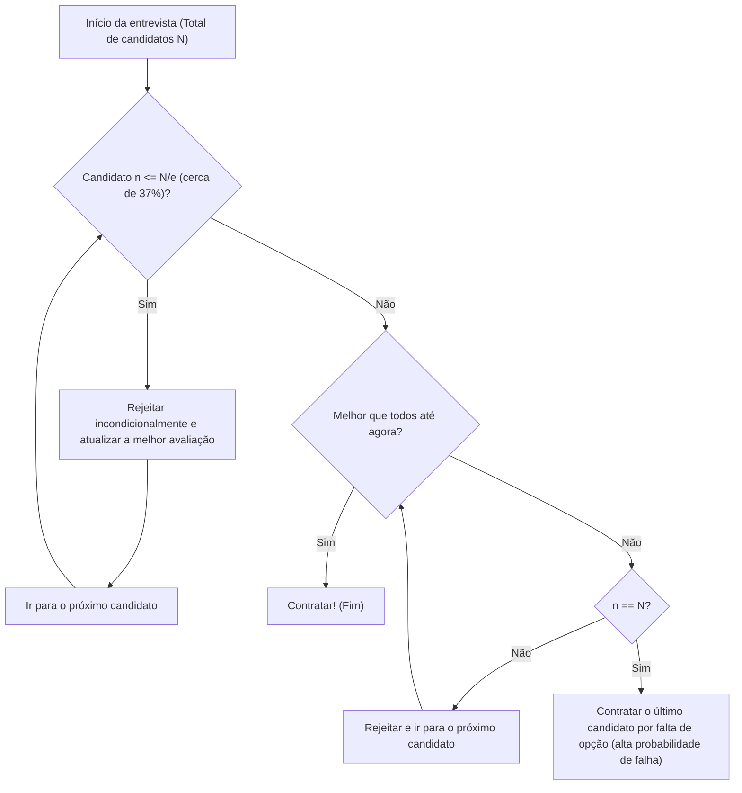

## O que é o Problema da Secretária (Secretary Problem)?

O **Problema da Secretária** (Secretary Problem) é um dos exemplos mais famosos e clássicos do **Problema da Parada Ótima** (Optimal Stopping Problem) na teoria das probabilidades aplicada. Este problema também é conhecido como o Problema do Casamento (Marriage Problem) ou o Problema do Dote do Sultão (Sultan's Dowry Problem), e modela brilhantemente o dilema de como tomar a **melhor decisão** em meio à incerteza.

Em muitas situações cotidianas, como "quando comprar uma casa", "quando escolher uma vaga de estacionamento" ou "quando escolher um parceiro", todas podem potencialmente ser reduzidas a este problema.

### Configuração Básica do Problema

O Problema da Secretária é considerado sob as seguintes regras estritas:

1. **Apenas uma vaga disponível**: Deseja-se contratar uma secretária.
2. **O número de candidatos é conhecido**: O número total de candidatos $N$ é conhecido antecipadamente.
3. **Entrevistas sequenciais**: Os candidatos são entrevistados um a um em ordem aleatória, e a decisão de contratar ou rejeitar deve ser tomada na hora.
4. **Apenas avaliação relativa**: É possível comparar com candidatos passados, mas não é possível dar uma pontuação absoluta (ou seja, você só sabe se o candidato atual é o melhor até agora).
5. **Sem volta**: Um candidato que foi rejeitado não pode ser contratado posteriormente.
6. **Objetivo**: Maximizar a probabilidade de contratar o **melhor candidato** (o candidato cujo rank verdadeiro é 1). Contratar qualquer outro candidato (como o 2º melhor) é considerado uma falha.

Sob essas condições estritas, como você pode maximizar a probabilidade de selecionar "o melhor único"?

---

## Intuição vs. Matemática

Intuitivamente, se você tomar uma decisão muito cedo, corre o risco de perder um candidato melhor que possa vir depois. Por outro lado, se você for muito cauteloso e esperar até o fim, aumenta o risco de já ter rejeitado o melhor candidato.

A estratégia ideal derivada da matemática é a seguinte regra simples:

> **Rejeite incondicionalmente os primeiros $r-1$ candidatos (use-os como "referência") e, entre os candidatos subsequentes, contrate imediatamente o primeiro que for melhor do que todos os anteriores.**

Então, quão grande deve ser esse número de referência $r-1$ (ou período de observação) para maximizar a probabilidade de sucesso?

---

## A Regra do 1/e (Regra dos cerca de 37%)

Para ir direto ao ponto, quando o número de candidatos $N$ é suficientemente grande, a estratégia ideal é **"gastar cerca dos primeiros 37% dos candidatos em observação (estabelecendo uma referência) e, em seguida, contratar o primeiro candidato que superar a referência."**

Este número "37%" é expresso como $1/e$ usando a base do logaritmo natural $e \approx 2.718$.
$$ \frac{1}{e} \approx 0.367879 \dots $$

Surpreendentemente, quando esta estratégia é adotada, a probabilidade de contratar com sucesso o melhor candidato também é de **$1/e$ (cerca de 37%)**. Quer haja 100 ou 1 milhão de candidatos, seguindo esta regra, você tem cerca de 37% de chance de escolher o melhor.

### Fluxograma: Algoritmo de Parada Ótima

O diagrama abaixo visualiza o algoritmo desse processo.

---

## Prova Matemática: Por que 1/e?

Aqui explicaremos o contexto probabilístico do porquê o resultado $1/e$ é derivado.

Suponha que o número de referência seja $r-1$ pessoas. Ou seja, você começa a considerar a contratação a partir do $r$-ésimo candidato.
Assuma que entre os $N$ candidatos, o verdadeiro melhor candidato é o $i$-ésimo ($i \ge r$).

As condições para contratar com sucesso este $i$-ésimo candidato são as seguintes:
- O verdadeiro melhor candidato está na posição $i$. A probabilidade disso é $1/N$.
- A melhor pessoa entre o 1º e o $(i-1)$-ésimo candidato está entre os primeiros $r-1$ candidatos. Como resultado, os candidatos do $r$-ésimo ao $(i-1)$-ésimo não podem superar a referência e, portanto, são rejeitados. Esta probabilidade é $\frac{r-1}{i-1}$.

Portanto, a probabilidade de sucesso $P(r)$ ao estabelecer uma referência $r$ é expressa da seguinte forma:

$$ P(r) = \sum_{i=r}^{N} \frac{1}{N} \times \frac{r-1}{i-1} = \frac{r-1}{N} \sum_{i=r}^{N} \frac{1}{i-1} $$

Quando $N$ é muito grande, esta soma pode ser aproximada usando uma integral.
Seja $x = \lim_{N \to \infty} \frac{r}{N}$ (qual proporção do total deve ser o período de observação),

$$ P(x) \approx x \int_{x}^{1} \frac{1}{t} dt = -x \ln(x) $$

Para maximizar a probabilidade de sucesso $P(x)$, derivamos em relação a $x$ e procuramos o ponto onde a derivada é $0$.

$$ \frac{d P(x)}{dx} = - \ln(x) - x \cdot \frac{1}{x} = - \ln(x) - 1 = 0 $$

Resolvendo isso, obtemos:
$$ \ln(x) = -1 \implies x = e^{-1} = \frac{1}{e} $$

E a probabilidade neste valor máximo é:
$$ P(1/e) = -\left(\frac{1}{e}\right) \ln\left(\frac{1}{e}\right) = \frac{1}{e} $$

Dessa forma, deduz-se lindamente que tanto a proporção a observar quanto a probabilidade de sucesso são **$1/e \approx 0.37$**.

---

## Aplicações Além de Contratações

Esta **Regra do 1/e** pode ser amplamente aplicada além da contratação de uma secretária.

1. **Procurando uma Casa ou Apartamento**
   Se você tiver que decidir por um novo local dentro de um determinado período (por exemplo, 1 mês). Os primeiros cerca de 11 dias (37%) são dedicados exclusivamente a visitas, sem assinar nenhum contrato, usando o nível da melhor propriedade vista durante esse tempo como referência. Depois disso, se aparecer uma propriedade que supere essa referência, você assina o contrato imediatamente.

2. **Procurando Estacionamento**
   Ao procurar uma vaga de estacionamento ao se aproximar do seu destino. Você simplesmente passa pelos primeiros 37% da distância total para ter uma ideia da disponibilidade e, em seguida, estaciona na primeira vaga que encontrar que seja mais próxima do destino do que qualquer espaço que você viu nos primeiros 37%.

3. **Procurando um Parceiro de Casamento**
   Um exemplo frequentemente mencionado em tom de brincadeira: suponha que você procure um parceiro de casamento durante os 22 anos entre as idades de 18 e 40 anos. 37% de 22 anos é cerca de 8 anos. Em outras palavras, a solução matemática ideal é conhecer várias pessoas e formar uma referência dos 18 aos 26 anos (18+8), e casar-se com a primeira pessoa que encontrar após os 26 anos que você ache melhor do que qualquer um de seus parceiros anteriores.

---

## Conclusão

O **Problema da Secretária** é uma ferramenta poderosa que resolve matematicamente um dilema comum no mundo real: ser forçado a fazer a melhor escolha sem ter todas as informações.

Contra a ansiedade intuitiva de que "o peixe que escapou pode ser grande, mas se você esperar muito tempo, não haverá nenhum peixe", a matemática oferece a resposta clara: **"olhe para 37% antes de decidir."**

É claro que na tomada de decisões no mundo real, existem várias variáveis como "a avaliação absoluta também é possível, não apenas a relativa", "os candidatos anteriores podem ser contatados mais tarde", e "se não for o melhor, o segundo melhor é aceitável". No entanto, conhecer a **Regra do 1/e** como referência servirá como uma poderosa bússola para navegar num mundo incerto.
