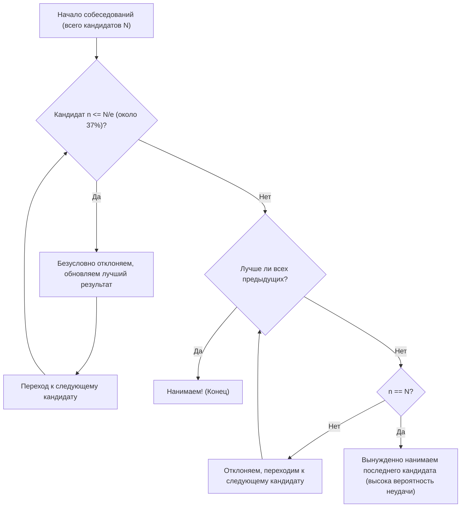

## Что такое проблема секретаря?

**Проблема секретаря** (Secretary Problem) — один из самых известных и классических примеров **задачи об оптимальной остановке** (Optimal Stopping Problem) в прикладной теории вероятностей. Эта проблема, также известная как «задача о разборчивой невесте» (Marriage Problem) или «задача о приданом султана» (Sultan's Dowry Problem), блестяще моделирует дилемму принятия решений о том, как сделать **наилучший выбор** в условиях неопределенности.

Почти любая повседневная ситуация, например, «когда покупать дом», «когда выбрать парковочное место» или «когда выбрать спутника жизни», может сводиться к этой задаче.

### Базовые условия задачи

Проблема секретаря рассматривается при следующих строгих правилах:

1. **Одна вакансия**: Мы хотим нанять только одного секретаря.
2. **Число кандидатов известно**: Общее количество соискателей $N$ известно заранее.
3. **Последовательные собеседования**: Кандидаты проходят собеседование один за другим в случайном порядке, и решение (нанять или отказать) должно приниматься на месте.
4. **Только относительная оценка**: Можно сравнивать кандидата с предыдущими, но нельзя выставлять абсолютную оценку (то есть мы можем знать только то, является ли текущий кандидат лучшим из всех просмотренных на данный момент).
5. **Нет пути назад**: Кандидата, которому уже отказали, нельзя нанять позже.
6. **Цель**: Максимизировать вероятность найма **самого лучшего кандидата** (кандидата с истинным рейтингом 1). Выбор любого другого кандидата (например, второго лучшего) считается провалом.

Как же в таких жестких условиях максимально повысить вероятность вытянуть «того самого» лучшего кандидата?

---

## Интуиция против математики

Интуитивно кажется, что если принять решение слишком рано, есть риск упустить потенциально лучших кандидатов, которые еще остались впереди. И наоборот, если быть слишком осторожным и ждать до последнего, высок риск того, что вы уже отказали самому лучшему кандидату.

Оптимальная стратегия, выведенная математически, представляет собой следующее простое правило:

> **Безусловно отказываем первым $r-1$ кандидатам (используя их как «базу для сравнения»), а среди всех последующих кандидатов немедленно нанимаем первого, кто окажется лучше любого из предыдущих.**

Так каков же должен быть этот базовый размер $r-1$ (или период наблюдения), чтобы вероятность успеха была максимальной?

---

## Правило 1/e (Правило 37%)

Забегая вперед, скажем: если число кандидатов $N$ достаточно велико, оптимальная стратегия — **«потратить первые примерно 37% кандидатов на наблюдение (создание базы для сравнения), а затем нанять первого же кандидата, который превосходит эту базу»**.

Это число «37%» выражается как $1/e$ с использованием основания натурального логарифма $e \approx 2.718$.
$$ \frac{1}{e} \approx 0.367879 \dots $$

Удивительно, но при использовании этой стратегии вероятность успешного найма самого лучшего кандидата также равна **$1/e$ (около 37%)**. Неважно, 100 у вас кандидатов или 1 миллион, следуя этому правилу, вы с вероятностью около 37% выберете лучшего из них.

### Блок-схема: Алгоритм оптимальной остановки

На схеме ниже визуализирован алгоритм этого процесса.

---

## Математическое доказательство: Почему именно 1/e?

Здесь мы объясним вероятностную основу того, почему получается именно $1/e$.

Пусть число человек в нашей базе для сравнения равно $r-1$. То есть мы начинаем делать предложения о найме, начиная с $r$-го кандидата.
Предположим, что истинный лучший кандидат находится на $i$-м месте (где $i \ge r$) среди $N$ кандидатов.

Условия для успешного найма этого $i$-го кандидата следующие:
- Истинно лучший кандидат находится на $i$-м месте. Вероятность этого равна $1/N$.
- Лучший кандидат среди кандидатов с 1-го по $i-1$-го должен оказаться среди первых $r-1$ человек. Благодаря этому все кандидаты с $r$-го по $i-1$-й не смогут превзойти эту базу и будут отклонены. Вероятность этого равна $\frac{r-1}{i-1}$.

Таким образом, вероятность успеха $P(r)$ при установке базы размера $r-1$ выражается следующим образом:

$$ P(r) = \sum_{i=r}^{N} \frac{1}{N} \times \frac{r-1}{i-1} = \frac{r-1}{N} \sum_{i=r}^{N} \frac{1}{i-1} $$

Когда $N$ очень велико, эту сумму можно аппроксимировать с помощью интеграла.
Положим $x = \lim_{N \to \infty} \frac{r}{N}$ (какую долю от целого мы берем в качестве периода наблюдения), тогда:

$$ P(x) \approx x \int_{x}^{1} \frac{1}{t} dt = -x \ln(x) $$

Чтобы максимизировать вероятность успеха $P(x)$, мы находим точку, где производная по $x$ равна $0$.

$$ \frac{d P(x)}{dx} = - \ln(x) - x \cdot \frac{1}{x} = - \ln(x) - 1 = 0 $$

Решая это уравнение, получаем:
$$ \ln(x) = -1 \implies x = e^{-1} = \frac{1}{e} $$

И вероятность в этой точке максимума равна:
$$ P(1/e) = -\left(\frac{1}{e}\right) \ln\left(\frac{1}{e}\right) = \frac{1}{e} $$

Именно так красиво выводится, что и доля для наблюдения, и вероятность успеха равны **$1/e \approx 0.37$**.

---

## Применение за пределами найма

Это **правило 1/e** широко применяется не только для найма секретарей.

1. **Поиск дома или квартиры**
   Если вам нужно найти новое жилье в течение определенного срока (например, за 1 месяц). Первые примерно 11 дней (37%) вы посвящаете только осмотрам и ничего не арендуете, используя лучший из увиденных вариантов как базу для сравнения. После этого вы немедленно арендуете первое жилье, которое превзойдет этот базовый уровень.

2. **Поиск парковочного места**
   При поиске места для парковки по мере приближения к пункту назначения. Первые 37% от всего пути вы просто проезжаете мимо, чтобы оценить загруженность. Затем паркуетесь на первом свободном месте, которое окажется ближе к месту назначения, чем любое из мест, увиденных на первых 37% пути.

3. **Поиск спутника жизни**
   Часто приводимый в шутку пример: предположим, вы ищете спутника жизни в течение 22 лет, с 18 до 40 лет. 37% от 22 лет — это примерно 8 лет. То есть с 18 до 26 лет (18+8) вы встречаетесь с разными людьми и формируете свои критерии, а математически оптимальное решение — вступить в брак с первым человеком, встреченным после 26 лет, который покажется вам лучше всех, с кем вы встречались ранее.

---

## Заключение

**Проблема секретаря** — это мощный инструмент математического решения дилеммы, часто возникающей в реальном мире: необходимости сделать лучший выбор в условиях неполной информации.

В ответ на интуитивный страх, что «упущенная рыба может оказаться самой крупной, но если ждать слишком долго, рыбы не останется совсем», математика дает четкий ответ: **«Сначала посмотри 37%, а потом решай»**.

Конечно, в реальных решениях существует множество переменных: возможна не только относительная, но и абсолютная оценка; возможно, можно вернуться к предыдущим кандидатам; можно пойти на компромисс и выбрать второго лучшего. Однако знание **правила 1/e** как базового ориентира может стать для вас надежным компасом в нашем неопределенном мире.
