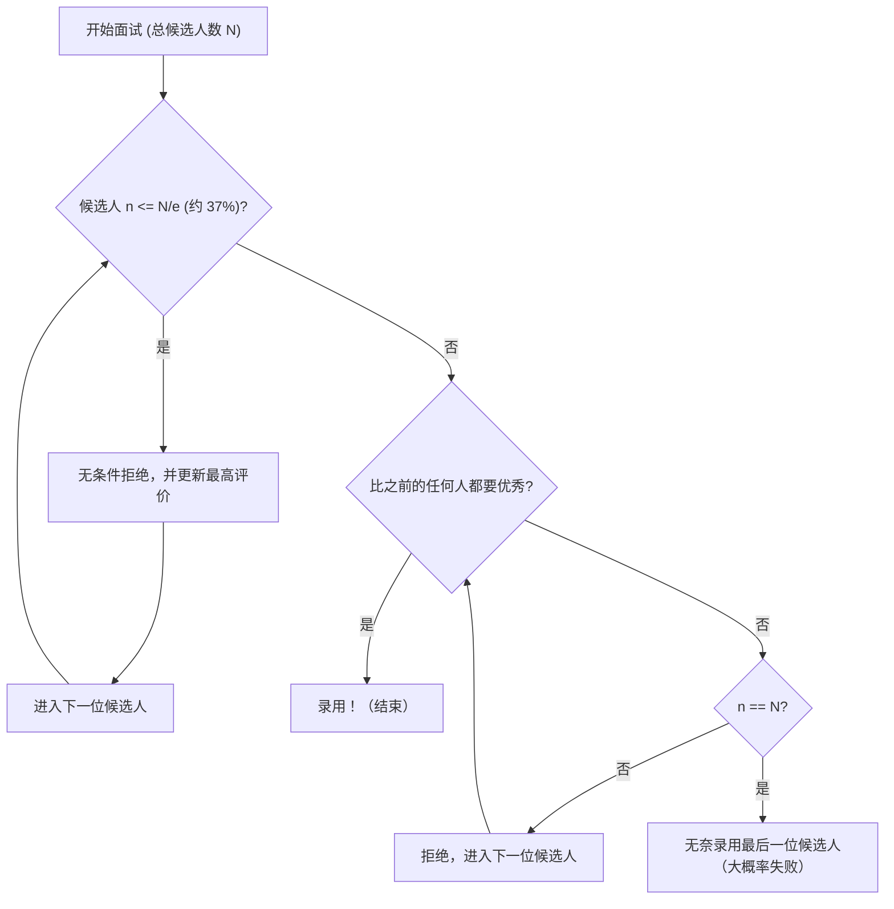

## 什么是秘书问题（Secretary Problem）？

**秘书问题**（Secretary Problem）是应用概率论中 **最佳停止问题**（Optimal Stopping Problem）最著名且经典的例子之一。这个问题也被称为婚姻问题（Marriage Problem）或苏丹嫁妆问题（Sultan's Dowry Problem），它完美地模拟了在不确定性中如何做出 **最佳选择** 的决策困境。

日常生活中的各种情况，例如“什么时候买房”、“什么时候决定停车位”、“什么时候确定伴侣”等，都可能归结为这个问题。

### 问题的基本设定

秘书问题是在以下严格的规则下考虑的。

1. **招聘名额为 1 个**：希望雇佣一名秘书。
2. **候选人数量已知**：申请者的总数 $N$ 事先已知。
3. **逐一面试**：以随机顺序对候选人进行逐一面谈，并且必须当场决定是录用还是拒绝。
4. **仅限相对评价**：可以与过去的候选人进行比较，但无法给出绝对分数（也就是说，只能知道当前候选人是否是迄今为止最优秀的）。
5. **不可撤回**：一旦拒绝了某位候选人，之后就不能再录用他们。
6. **目的**：最大化录用到 **最优秀候选人**（真实排名第 1 的候选人）的概率。如果录用了其他候选人（如第 2 名），则视为失败。

在这些苛刻的条件下，怎样才能使抽中“最佳 1 人”的概率最大化呢？

---

## 直觉 vs. 数学

直觉上，如果过早做出决定，就有可能错过后面可能出现的更优秀的候选人。相反，如果过于谨慎一直等到最后，那么极有可能已经拒绝了最优秀的候选人。

数学推导出的最佳策略是以下简单的规则。

> **无条件拒绝前 $r-1$ 名候选人（将他们作为“基准”），在之后的候选人中，如果出现了比之前所有人都优秀的人，就立即录用。**

那么，这个作为基准的人数 $r-1$（或观察期）设定为多少，才能使成功概率最大化呢？

---

## 1/e 法则（约 37% 规则）

长话短说，当候选人数量 $N$ 足够大时，最佳策略是 **“将前约 37% 的候选人用于观察（建立基准），然后录用第一个超过该基准的候选人”**。

这个“37%”的数字，使用自然对数的底数 $e \approx 2.718$ 表示为 $1/e$。
$$ \frac{1}{e} \approx 0.367879 \dots $$

令人惊讶的是，采用这种策略时，成功录用到最优秀候选人的概率也是 **$1/e$ （约 37%）**。无论候选人是 100 人还是 100 万人，只要遵循这个法则，就有约 37% 的概率选中最佳的那一个人。

### 流程图：最佳停止算法

下图将该过程的算法进行了可视化。

---

## 数学证明：为什么是 1/e？

这里将解释为什么会得出 $1/e$ 这个结果，以及其背后的概率论知识。

假设基准的人数为 $r-1$ 人。也就是说，从第 $r$ 名候选人开始进行录用活动。
在 $N$ 名候选人中，假设真正最优秀的候选人位于第 $i$ 个位置（$i \ge r$）。

成功录用到这位第 $i$ 名候选人的条件如下：
- 真正最优秀的候选人排在第 $i$ 位。这个概率是 $1/N$。
- 从第 $1$ 名到第 $i-1$ 名候选人中最优秀的那个人，恰好在前 $r-1$ 人之中。这样一来，从第 $r$ 名到第 $i-1$ 名的候选人因为无法超越基准，所以会被拒绝。这个概率是 $\frac{r-1}{i-1}$。

因此，当设定基准为 $r$ 时，成功的概率 $P(r)$ 可以表示为：

$$ P(r) = \sum_{i=r}^{N} \frac{1}{N} \times \frac{r-1}{i-1} = \frac{r-1}{N} \sum_{i=r}^{N} \frac{1}{i-1} $$

当 $N$ 非常大时，这个求和可以使用积分来近似。
设 $x = \lim_{N \to \infty} \frac{r}{N}$（即整个观察期占总体的比例），那么

$$ P(x) \approx x \int_{x}^{1} \frac{1}{t} dt = -x \ln(x) $$

为了使成功概率 $P(x)$ 最大化，对 $x$ 进行求导并寻找导数为 $0$ 的点。

$$ \frac{d P(x)}{dx} = - \ln(x) - x \cdot \frac{1}{x} = - \ln(x) - 1 = 0 $$

解这个方程，
$$ \ln(x) = -1 \implies x = e^{-1} = \frac{1}{e} $$

而且，在这个最大值处的概率为：
$$ P(1/e) = -\left(\frac{1}{e}\right) \ln\left(\frac{1}{e}\right) = \frac{1}{e} $$

通过这种方式，观察的比例和成功的概率都漂亮地导出了 **$1/e \approx 0.37$**。

---

## 招聘活动之外的应用

这个 **1/e 法则** 除了秘书的招聘之外，还可以广泛应用。

1. **找房子或租房间**
   需要在一定期限内（例如 1 个月）决定搬家目的地的情况。前约 11 天（37%）专心看房而不签约，并将这期间看到的最佳房源水平作为基准。之后，如果出现了超过该基准的房源，就立即签约。

2. **找停车位**
   在接近目的地时寻找停车位。将总距离的前 37% 只是开过去以把握空位情况的感觉，之后，如果找到一个比前 37% 中看到的任何空位都更靠近目的地的空位，就停在那里。

3. **寻找结婚对象**
   这是一个常带有玩笑性质的例子，假设要在 18 岁到 40 岁这 22 年间寻找结婚对象。22 年的 37% 大约是 8 年。也就是说，从 18 岁到 26 岁（18+8）的期间，通过结识各种人来形成基准，在 26 岁之后遇到的人中，与第一个让你觉得比过去遇到的任何人都好的人结婚，这就是数学上的最优解。

---

## 总结

**秘书问题** 是一个强大的数学工具，它解决了现实世界中常见的困境，即在没有掌握所有信息的情况下被迫做出最佳选择。

对于“逃走的鱼可能很大，但等得太久鱼就会消失”这种直觉上的不安，数学给出了 **“先看 37% 再做决定”** 这一明确的答案。

当然，现实的决策中存在许多变量，比如“不仅能相对评价也能绝对评价”、“之后也许能重新联系之前的候选人”、“不一定要最好的，第二名也可以妥协”等。然而，将 **1/e 法则** 作为基准，将成为在这个充满不确定的世界中生存下去的强大指南针。
