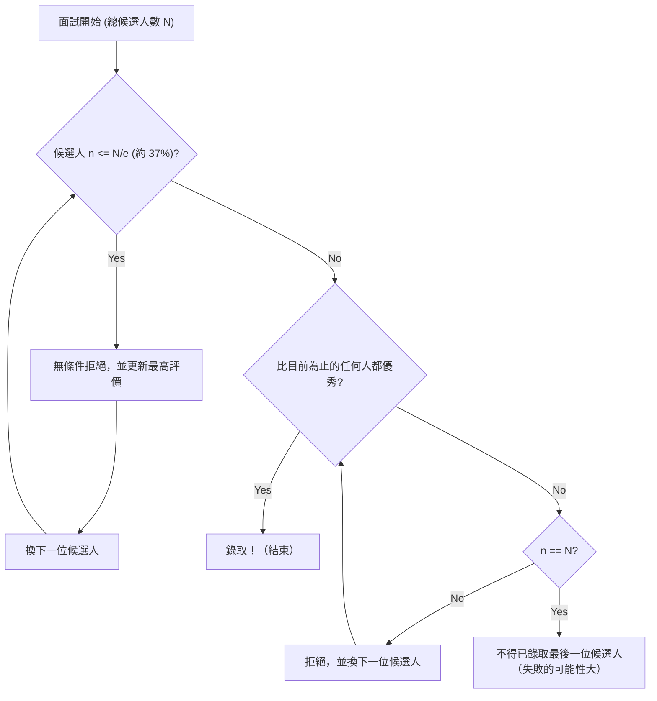

## 秘書問題（Secretary Problem）是什麼？

**秘書問題** （Secretary Problem）是應用機率論中 **最佳停止問題** （Optimal Stopping Problem）最著名且經典的例子之一。這個問題也被稱為結婚問題（Marriage Problem）或蘇丹嫁妝問題（Sultan's Dowry Problem）等，完美地模型化了在不確定性中如何做出 **最佳選擇** 的決策兩難。

日常的所有場合，例如「何時該買房」、「何時該決定停車位」、「何時該決定伴侶」等情況，都有可能歸結為這個問題。

### 問題的基本設定

秘書問題是在以下嚴格的規則下進行考量。

1. **錄取名額為 1 個** ：希望能錄取一名秘書。
2. **候選人數為已知** ：應徵者的總數 $N$ 事前已知。
3. **逐一面試** ：以隨機順序逐一面試候選人，且必須當場決定錄取或不錄取。
4. **僅有相對評價** ：可以與過去的候選人進行比較，但無法給予絕對的分數（也就是說，只能知道現在的候選人是否為目前為止最優秀的）。
5. **無法回頭** ：一旦拒絕了某個候選人，之後就無法再重新錄取。
6. **目的** ：將錄取 **最優秀的候選人** （真實排名為第 1 名的候選人）的機率最大化。如果錄取了其他候選人（如第 2 名），則視為失敗。

在這樣嚴苛的條件下，該如何做才能讓抽中「最棒的 1 人」的機率達到最高呢？

---

## 直覺 vs. 數學

直覺上，如果太早做出決定，會有錯過後面可能更優秀候選人的風險。反之，如果太過謹慎等到最後，已經將最優秀的候選人拒絕掉的風險也會增加。

數學導出的最佳策略是以下這個簡單的規則：

> **將前 $r-1$ 名候選人無條件拒絕（將他們作為「基準」），在之後的候選人中，一旦出現比之前所有人都優秀的人，就立即錄取。**

那麼，這個作為基準的人數 $r-1$ （或觀察期間）應該設定為多少，才能使成功機率最大化呢？

---

## 1/e 法則（約 37% 規則）

先說結論，當候選人數 $N$ 夠大時，最佳策略是 **「將最初約 37% 的候選人花在觀察（建立基準）上，之後錄取第一個超越該基準的候選人」** 。

這個「37%」的數字，是使用自然對數的底數 $e \approx 2.718$ 所表示的 $1/e$ 。
$$ \frac{1}{e} \approx 0.367879 \dots $$

令人驚訝的是，當採用這個策略時，成功錄取最優秀候選人的機率也會是 **$1/e$ （約 37%）** 。無論候選人有 100 人還是 100 萬人，只要遵循這個法則，就有約 37% 的機率能選中最好的那 1 人。

### 流程圖：最佳停止演算法

下圖將此過程的演算法視覺化。

---

## 數學證明：為什麼是 1/e？

在這裡，我們將解說為何會導出 $1/e$ 這個結果，及其機率論背景。

假設某個基準人數為 $r-1$ 人。也就是說，從第 $r$ 個候選人開始進行錄取活動。
假設在 $N$ 個候選人中，真正最優秀的候選人位於第 $i$ 個（$i \ge r$）。

成功錄取這位第 $i$ 個候選人的條件如下：
- 真正最優秀的候選人位於第 $i$ 個。其機率為 $1/N$。
- 第 $1$ 個到第 $i-1$ 個候選人之中最優秀的人，位於前 $r-1$ 人之中。因為這樣，第 $r$ 個到第 $i-1$ 個候選人都無法超越基準，從而被拒絕。這個機率為 $\frac{r-1}{i-1}$。

因此，設定 $r$ 這個基準時成功的機率 $P(r)$，可以表示如下：

$$ P(r) = \sum_{i=r}^{N} \frac{1}{N} \times \frac{r-1}{i-1} = \frac{r-1}{N} \sum_{i=r}^{N} \frac{1}{i-1} $$

當 $N$ 非常大時，這個總和可以使用積分來近似。
若令 $x = \lim_{N \to \infty} \frac{r}{N}$ （將整體的幾成作為觀察期間），則：

$$ P(x) \approx x \int_{x}^{1} \frac{1}{t} dt = -x \ln(x) $$

為了使成功機率 $P(x)$ 最大化，我們對 $x$ 微分並找出等於 $0$ 的點。

$$ \frac{d P(x)}{dx} = - \ln(x) - x \cdot \frac{1}{x} = - \ln(x) - 1 = 0 $$

解這個方程式得：
$$ \ln(x) = -1 \implies x = e^{-1} = \frac{1}{e} $$

而這個最大值的機率為：
$$ P(1/e) = -\left(\frac{1}{e}\right) \ln\left(\frac{1}{e}\right) = \frac{1}{e} $$

如此一來，觀察的比例與成功的機率兩者皆為 **$1/e \approx 0.37$** 的結果便被優美地推導出來了。

---

## 招募活動以外的應用

這個 **1/e 法則** 除了用於招募秘書外，還能廣泛應用於其他方面。

1. **找房子或租屋**
   必須在某段期間內（例如 1 個月）決定搬家地點時。前 11 天左右（37%）專心看房而不簽約，並將這段期間內看到最好的物件等級作為基準。之後，一旦出現超越該基準的物件，就立即簽約。

2. **找停車位**
   在接近目的地的同時尋找停車位時。總距離的前 37% 只是開過去以掌握空位的狀況，之後，只要找到比前 37% 看過的任何車位都更接近目的地的空車位，就停進去。

3. **尋找結婚對象**
   這是一個常被開玩笑舉出的例子，假設在 18 歲到 40 歲這 22 年間尋找結婚對象。22 年的 37% 大約是 8 年。也就是說，從 18 歲到 26 歲（18+8）這段期間與形形色色的人相遇以建立基準，而 26 歲以後遇到的人中，與第一個讓你覺得比過去任何人都更棒的對象結婚，這就是數學上的最佳解。

---

## 總結

**秘書問題** 是一個強大的數學工具，它解決了現實世界中常見的兩難困境：在尚未擁有全部資訊的狀態下，必須做出最佳選擇。

面對「錯過的魚可能很大，但等太久魚就會不見」這種直覺上的不安，數學給出了 **「看過 37% 再決定」** 這個明確的答案。

當然，現實的決策中還包含了各種變數，例如「不只有相對評價，也能進行絕對評價」、「也許事後能回頭找之前的候選人」、「就算不是最好，第二好的也能妥協」等。然而，將 **1/e 法則** 作為基準記在心裡，將成為在不確定的世界中生存下去的強大指南針。
