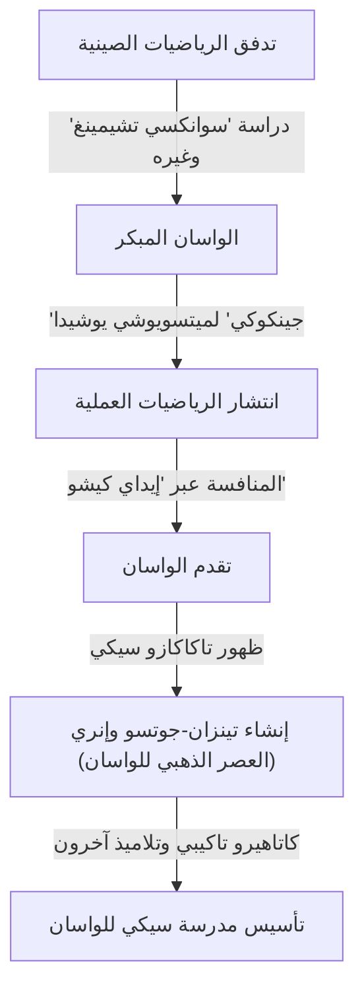
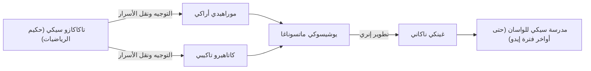

# 1. مقدمة: من كان [تاكاكازو سيكي](https://kenji.blog/ar/p/seki-takakazu/)؟

في فترة إيدو في اليابان، كان هناك رجل ارتقى بالرياضيات المطورة بشكل مستقل والمعروفة باسم "واسان" إلى آفاق غير مسبوقة. كان هذا الرجل هو **[تاكاكازو سيكي](https://kenji.blog/ar/p/seki-takakazu/)** (المعروف أيضًا باسم سيكي كوا، حوالي أربعينيات القرن السابع عشر - 1708). تم تبجيله لاحقًا باعتباره "حكيم الرياضيات" (سانسي) ويُصنف كواحد من أهم الشخصيات في تاريخ الرياضيات اليابانية.

خلال نفس الفترة في أوروبا، كان [إسحاق نيوتن](https://kenji.blog/ar/p/newton/) وغوتفريد لايبنيز يؤسسان حساب التفاضل والتكامل، لكن [تاكاكازو سيكي](https://kenji.blog/ar/p/seki-takakazu/) كان أيضًا يقوم باكتشافات رياضية متقدمة للغاية بشكل مستقل. في هذه المقالة، سنتعمق في حلقات حياته وإنجازاته الرياضية ذات المستوى العالمي، إلى جانب خلفيتها التاريخية.

# 2. فجر الواسان والرياضيات اليابانية قبل سيكي

لفهم إنجازات سيكي، يجب على المرء أن يعرف الخلفية الرياضية لليابان في ذلك الوقت. في أوائل فترة إيدو، كانت النصوص الرياضية المستوردة من الصين متداولة في اليابان. كان من أهمها "سوانكسي تشيمينغ" (مقدمة في الدراسات الحسابية، 1299) الذي كتبه تشو شيجي من أسرة يوان. تم إحضار هذا الكتاب إلى اليابان خلال غزوات تويوتومي هيديوشي لكوريا وكان له تأثير عميق على المثقفين اليابانيين.

خلال هذه الفترة، كان الكتاب الذي قدم الرياضيات العملية بشكل كبير في اليابان هو "جينكوكي" لميتسويوشي يوشيدا (1627). أصبح "جينكوكي" من أكثر الكتب مبيعًا من خلال شرح الرياضيات المفيدة للحياة اليومية والتجارة، مثل كيفية استخدام المعداد (سوروبان) وقياس المساحات. ومع ذلك، فقد ظل يقتصر على الحساب العملي والأساسي، ولم يصل إلى الجبر أو الهندسة المتقدمة.

من هذا الأساس الذي يركز على التطبيق العملي، ظهر في نهاية المطاف مثقفون سعوا وراء الجمال والعمق المنطقي للرياضيات البحتة. ابتكروا ثقافة فريدة تسمى "إيداي كيشو" (وراثة المشكلات الرياضية)، حيث تم نشر المشكلات التي لم يتم حلها في كتب الرياضيات لتحدي القراء. أصبحت هذه اللعبة الفكرية القوة الدافعة التي طورت الواسان بسرعة. والعبقري الذي ظهر في قمة هذا التطور في الواسان كان [تاكاكازو سيكي](https://kenji.blog/ar/p/seki-takakazu/).

# 3. حياة [تاكاكازو سيكي](https://kenji.blog/ar/p/seki-takakazu/) وخلفيته التاريخية

## 3.1 حياته المبكرة وحكايات شبابه

السنة الدقيقة لولادة [تاكاكازو سيكي](https://kenji.blog/ar/p/seki-takakazu/) غير معروفة، ولكن يُقدر عمومًا أنها حوالي 1640 إلى 1642. وُلد باعتباره الابن الثاني لعائلة أوتشياما، وهي عائلة ساموراي في فوجيوكا، مقاطعة كوزوكي (محافظة غونما الحالية)، وتم تبنيه لاحقًا في عائلة سيكي. كان اسمه الأول شينسوكي، واعتمد لاحقًا الاسم المستعار جيوساي.

يُقال إنه أظهر شغفًا وموهبة غير عاديين للرياضيات (الحساب) منذ سن مبكرة. في اليابان في ذلك الوقت، كانت تتم دراسة كتاب "سوانكسي تشيمينغ" المذكور أعلاه وغيره، لكن سيكي فك رموز هذه الكتب من خلال الدراسة الذاتية وطور محتوياتها بشكل أكبر. وفقًا للأسطورة، كان بإمكانه إجراء عمليات حسابية معقدة في رأسه منذ صغره، مما أثار دهشة البالغين من حوله. كانت لديه القدرة على استكشاف الحقائق الرياضية من خلال الدراسة الذاتية وتوليد أفكار جديدة غير مقيدة بالأطر الحالية.

## 3.2 الخدمة في مجال كوفو وكخادم مباشر للشوغون

لم يكن [تاكاكازو سيكي](https://kenji.blog/ar/p/seki-takakazu/) عالم رياضيات فحسب، بل كان أيضًا ساموراي كامل الأهلية. خدم تسوناتويو توكوغاوا (لاحقًا الشوغون السادس، إينوبو توكوغاوا)، سيد مجال كوفو، وشغل مناصب إدارية عملية مثل مدقق مالي (كانجو غينمي-ياكو). يشير هذا إلى أنه كان يمتلك قدرات عملية ممتازة ليس فقط في الرياضيات ولكن أيضًا في علم التقويم (حساب التقويم)، والمسح، ورسم الخرائط.

عندما دخل تسوناتويو إلى نيشينومارو في قلعة إيدو كخليفة للشوغون، تبعه سيكي وأصبح خادمًا مباشرًا (هاتاموتو) للشوغونية. يمكن للمرء أن يتخيل شخصيته الرواقية للغاية، وهو يؤدي واجباته الرسمية كساموراي نهارًا، ويأخذ عصي الحساب (سانغي) والفرشاة ليلًا لتحدي الحقائق الرياضية غير المعروفة.

## 3.3 سنواته الأخيرة ووفاته

واصل سيكي أبحاثه حتى بعد أن أصبح خادمًا مباشرًا للشوغونية، لكن في سنواته الأخيرة، كان غالبًا ما يطريح الفراش بسبب المرض. في 5 ديسمبر 1708، وافته المنية. يقع قبره حاليًا في معبد جورين-جي في شينجوكو، طوكيو، وأصبح مكانًا مقدسًا يزوره العديد من عشاق وباحثي الرياضيات.

# 4. ابتكار في الجبر: إنشاء تينزان-جوتسو (بوشو-هو)

كان أحد أعظم إنجازات [تاكاكازو سيكي](https://kenji.blog/ar/p/seki-takakazu/) هو الارتقاء بتقنيات الحساب المستوردة من الصين إلى نظام رياضي مجرد وعالمي يشبه الجبر الحديث.

في رياضيات شرق آسيا في ذلك الوقت، كان يُستخدم "تينغين-جوتسو"، وهو طريقة لحل المعادلات عن طريق ترتيب عصي تسمى "سانغي" (عصي الحساب) على لوحة. كان تينغين-جوتسو طريقة ممتازة، ولكن نظرًا لاستخدامه عصي مادية، كان بإمكانه فقط التعامل مع المعادلات ذات الترتيب العالي ذات المجهول الواحد، مما جعل من الصعب حل أنظمة المعادلات ذات المتغيرات المجهولة المتعددة.

لذلك، ابتكر [تاكاكازو سيكي](https://kenji.blog/ar/p/seki-takakazu/) تدوينًا جبريًا عبر الكتابة بالفرشاة يُسمى **بوشو-هو**. كان هذا يمثل المجاهيل والثوابت بأحرف صينية ويعبر عن الصيغ الرياضية عن طريق إضافة رموز بجوارها. جعل هذا من الممكن معالجة وتحويل المعادلات المعقدة التي تتضمن مجاهيل متعددة بحرية على الورق.

أطلق سيكي على طريقة ترتيب المعادلات باستخدام بوشو-هو هذا للقضاء على المجاهيل واشتقاق الحل النهائي اسم "إندان-جوتسو". أطلق عليها تلاميذه لاحقًا اسم "تينزان-جوتسو". وضع تينزان-جوتسو الأساس الجبري للواسان ومكّن من تطوره السريع بعد ذلك.

$$
\text{لعبت معالجة الصيغ الرياضية بواسطة بوشو-هو نفس الدور الأساسي الذي لعبه الجبر الرمزي مثل } ax^2 + bx + c = 0 \text{ في الغرب.}
$$

# 5. اكتشاف المحددات: إنجاز يسبق الغرب

أشهر إنجاز عالمي ل[تاكاكازو سيكي](https://kenji.blog/ar/p/seki-takakazu/) هو اكتشاف مفهوم **المحدد**. في كتابه عام 1683 "كاي فوكوداي نو هو" (طريقة حل المشكلات المخفية)، وصف طريقة توسيع المحددات كصيغة عامة للقضاء على المجاهيل من أنظمة المعادلات الخطية.

والمثير للدهشة أن هذا يعتبر أنه حدث في نفس الوقت تقريبًا (حوالي 1683)، أو أبكر قليلاً، من وقت وصول غوتفريد لايبنيز إلى مفهوم المحددات في أوروبا. كانت اليابان في ذلك الوقت في حالة من العزلة الوطنية (ساكوكو)، مما لم يترك مجالًا تقريبًا لدخول المعلومات الرياضية الغربية. لذلك، وصل سيكي إلى هذا الاكتشاف العظيم بشكل مستقل تمامًا.

أظهر سيكي بشكل صحيح توسيع المحددات للحالات $n=2, 3, 4, 5$ (على الرغم من وجود بعض أخطاء الإشارة في حالة $n=5$، فقد تم إنشاء المفهوم الأساسي). كان قد اشتق طريقة حسابية تعادل قاعدة ساروس قبل بقية العالم.

$$
D = \begin{vmatrix} 
a_{11} & a_{12} & a_{13} \\ 
a_{21} & a_{22} & a_{23} \\
a_{31} & a_{32} & a_{33} 
\end{vmatrix} = a_{11}a_{22}a_{33} + a_{12}a_{23}a_{31} + a_{13}a_{21}a_{32} - a_{13}a_{22}a_{31} - a_{11}a_{23}a_{32} - a_{12}a_{21}a_{33}
$$

جعل هذا الاكتشاف من الممكن التحديد المنهجي لشروط وجود حلول لأنظمة المعادلات المعقدة، وحسّن بشكل كبير القدرات الحسابية للواسان.

# 6. إنري: فجر حساب التفاضل والتكامل في الواسان

حقق سيكي إنجازات رائدة ليس فقط في الجبر ولكن أيضًا في الهندسة والتحليل. كان هذا هو إنشاء **إنري** (مبدأ الدائرة).

إنري هي طريقة تعتمد على النهايات لإيجاد باي، وطول قوس الدائرة، وحجم الكرة، وما إلى ذلك، وتتوافق مع المفاهيم الأساسية لحساب التفاضل والتكامل (خاصة التكامل) في الغرب.

حسب [تاكاكازو سيكي](https://kenji.blog/ar/p/seki-takakazu/) قيمة باي عن طريق رسم مضلعات منتظمة داخل دائرة وزيادة عدد أضلاعها. لقد بذل جهدًا مذهلاً لحساب المحيط وصولاً إلى مضلع منتظم مكون من 131,072 ضلعًا (مضلع $2^{17}$ ضلعًا). ومع ذلك، لم تكن عبقريته الحقيقية تكمن في مجرد تكرار الحسابات.

لقد وجد انتظامًا من سلسلة بيانات المحيط المحسوبة وطبق طريقة تسريع (خوارزمية لتسريع التقارب) تعادل **عملية آيتكين دلتا المربعة**. ونتيجة لذلك، نجح في الحصول على تقريب دقيق للغاية بكمية صغيرة من الحساب.

باستخدام هذه الطريقة، حسب سيكي قيمة باي بدقة حتى المنزلة العشرية الحادية عشرة.

$$
\pi \approx 3.14159265359\dots
$$

كان اكتشاف خوارزمية الحساب المتقدمة هذه على أعلى مستوى في العالم في ذلك الوقت، ويثبت أن الواسان لم يكن مجرد لغز، بل كان له جوانب من التحليل الرياضي الصارم.

# 7. اكتشاف أرقام برنولي وصيغة مجموع القوى

في عمله بعد وفاته "كاتسويو سانبو" (أساسيات الرياضيات) المنشور عام 1712، استنبط تمامًا صيغة مجموع القوى.

كانت صيغة إيجاد مجموع القوى النونية ($p$) للأعداد الطبيعية $\sum_{k=1}^n k^p$ مسألة اهتمام لعلماء الرياضيات منذ العصور القديمة. حسب [تاكاكازو سيكي](https://kenji.blog/ar/p/seki-takakazu/) بشكل منهجي تسلسلًا محددًا من الأرقام التي تظهر في معاملات هذه الصيغة. هذا التسلسل هو بالضبط ما يسمى الآن **أرقام برنولي**.

تم نشر هذا التسلسل أيضًا بشكل مستقل في كتاب عالم الرياضيات السويسري جاكوب برنولي "آرس كونجيكتاندي" (نُشر عام 1713). كان نشر كتاب سيكي أبكر بعام واحد من كتاب برنولي، ويُعتقد أن اكتشاف سيكي نفسه كان أبكر قليلاً. الغريب أنه على الجانبين المتقابلين من الأرض وفي نفس الوقت تقريبًا، وصل عبقريان إلى نفس الحقيقة الرياضية.

تُعرّف أرقام برنولي على النحو التالي:

$$
B_0 = 1, \quad B_1 = -\frac{1}{2}, \quad B_2 = \frac{1}{6}, \quad B_4 = -\frac{1}{30}, \quad B_6 = \frac{1}{42} \dots
$$

أطلق سيكي على هذا اسم "داسيكي-جوتسو" وأنشأ طريقة لحسابه بكفاءة باستخدام جدول معاملات مشابه لمثلث باسكال (يسمى "ريبو-شيكي" في الواسان).

# 8. تطور مدرسة سيكي للواسان وخلفاؤه

لم ينشر [تاكاكازو سيكي](https://kenji.blog/ar/p/seki-takakazu/) ويعلن عن جميع اكتشافاته على نطاق واسع. تم نقل رياضيات كتعاليم سرية لعدد محدود من التلاميذ اللامعين.

أشهرهم هو **كاتاهيرو تاكيبي**. طور تاكيبي إنري معلمه بشكل أكبر واكتشف توسعات متسلسلة لانهائية تعادل توسع تايلور للدوال المثلثية العكسية، مما دفع الواسان إلى حساب التفاضل والتكامل الأكثر تقدمًا.

سُميت هذه المدرسة الرياضية، التي أسسها [تاكاكازو سيكي](https://kenji.blog/ar/p/seki-takakazu/) ونظمها كاتاهيرو تاكيبي وآخرون، بـ "مدرسة سيكي". كان لمدرسة سيكي إطار منهجي وتعليمي للغاية، وهيمنت تمامًا على العالم الرياضي في اليابان في فترة إيدو.

# 9. المساهمة في علم التقويم والعلاقة مع هارومي شيبوكاوا

لم تقتصر معرفة سيكي على الرياضيات البحتة. كما كان ضليعًا بعمق في علم الفلك وعلم التقويم. في ذلك الوقت، كانت اليابان تستخدم تقويمًا قديمًا (تقويم شوانمينغ) مستوردًا من الصين لأكثر من 800 عام، وكان هناك تناقض كبير مع التحركات الفعلية للأجرام السماوية.

لاحظ عالم الفلك هارومي شيبوكاوا ذلك. ابتكر شيبوكاوا تقويمًا جديدًا، "تقويم جوكيو"، والذي اعتمدته الشوغونية. هناك نظرية مفادها أن [تاكاكازو سيكي](https://kenji.blog/ar/p/seki-takakazu/) دعم شيبوكاوا خلف الكواليس بالدعم النظري والحسابات المعقدة خلال هذا الوقت. على أي حال، كانت الأساليب الرياضية لسيكي لا غنى عنها لتطوير علم التقويم وتقنيات المسح في نفس العصر.

# 10. الخاتمة: مكانة [تاكاكازو سيكي](https://kenji.blog/ar/p/seki-takakazu/) في التاريخ العالمي للرياضيات

في اليابان، التي كانت في حالة عزلة وطنية مع معلومات محدودة للغاية من العالم الخارجي، بنى [تاكاكازو سيكي](https://kenji.blog/ar/p/seki-takakazu/) الرياضيات الأكثر تقدمًا في العالم باستخدام لغته الخاصة وتدوينه. يوضح وجوده مدى اتساع إمكانات العقل البشري.

حقيقة أنه اكتشف بشكل مستقل أدوات رياضية لا غنى عنها للعلوم والهندسة الحديثة، مثل المحددات، وأرقام برنولي، واستقراء آيتكين، وإنري (أساس حساب التفاضل والتكامل)، هي مصدر كبير للدهشة والفخر لنا اليوم.

أنهى الواسان الذي أسسه دوره عندما تم إدخال الرياضيات الغربية في عصر ميجي. ومع ذلك، أصبحت المعرفة الرياضية العالية ومهارات التفكير المنطقي التي زرعها الواسان أساسًا فكريًا قويًا لليابان حيث تطورت بسرعة إلى دولة حديثة.

يمكن حقًا تسمية [تاكاكازو سيكي](https://kenji.blog/ar/p/seki-takakazu/) بـ "حكيم الرياضيات" الذي أثبت عالمية الرياضيات عبر الزمان والمكان، وعملاق يتألق ببراعة في التاريخ العالمي للرياضيات.
