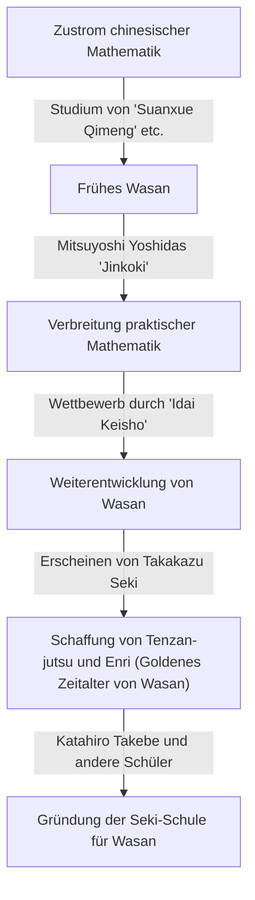
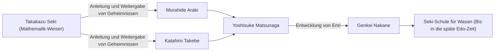

# 1. Einleitung: Wer war [Takakazu Seki](https://kenji.blog/de/p/seki-takakazu/)?

In der Edo-Zeit in Japan gab es einen Mann, der die eigenständig entwickelte Mathematik namens „Wasan“ in beispiellose Höhen hob. Dieser Mann war **[Takakazu Seki](https://kenji.blog/de/p/seki-takakazu/)** (auch bekannt als Seki Kōwa, ca. 1640er - 1708). Er wurde später als „Mathematik-Weiser“ (Sansei) verehrt und gilt als eine der wichtigsten Persönlichkeiten in der Geschichte der japanischen Mathematik.

Während in Europa [Isaac Newton](https://kenji.blog/de/p/newton/) und [Gottfried Leibniz](https://kenji.blog/de/p/leibniz/) zur selben Zeit die Infinitesimalrechnung etablierten, machte [Takakazu Seki](https://kenji.blog/de/p/seki-takakazu/) ebenfalls unabhängig davon äußerst fortschrittliche mathematische Entdeckungen. In diesem Artikel werden wir tiefer in die Episoden seines Lebens und seine mathematischen Errungenschaften von Weltklasse eintauchen, zusammen mit ihrem historischen Hintergrund.

# 2. Die Anfänge von Wasan und der japanischen Mathematik vor Seki

Um Sekis Errungenschaften zu verstehen, muss man den mathematischen Hintergrund Japans zu dieser Zeit kennen. Zu Beginn der Edo-Zeit kursierten in Japan aus China importierte mathematische Texte. Ein besonders wichtiger Text war das „Suanxue Qimeng“ (Einführung in das Rechnen, 1299), geschrieben von Zhu Shijie aus der Yuan-Dynastie. Dieses Buch gelangte während der Invasionen Koreas durch Toyotomi Hideyoshi nach Japan und hatte großen Einfluss auf die japanischen Intellektuellen.

In dieser Zeit war das Buch, das die angewandte Mathematik in Japan entscheidend voranbrachte, „Jinkoki“ (1627) von Mitsuyoshi Yoshida. „Jinkoki“ wurde zu einem Bestseller, indem es Mathematik erklärte, die für das tägliche Leben und den Handel nützlich war, wie den Gebrauch des Abakus (Soroban) und die Flächenmessung. Es blieb jedoch rein praktische und elementare Arithmetik und erreichte keine höhere Algebra oder Geometrie.

Aus diesem praxisorientierten Fundament gingen schließlich Intellektuelle hervor, die nach der Schönheit und der logischen Tiefe der reinen Mathematik strebten. Sie schufen eine einzigartige Kultur namens „Idai Keisho“ (Vererbung mathematischer Probleme), bei der ungelöste Probleme in Mathematikbüchern veröffentlicht wurden, um die Leser herauszufordern. Dieses intellektuelle Spiel wurde zur treibenden Kraft, die Wasan rasant voranbrachte. Und das Genie, das am Höhepunkt dieser Wasan-Entwicklung erschien, war [Takakazu Seki](https://kenji.blog/de/p/seki-takakazu/).

# 3. Das Leben und der historische Hintergrund von [Takakazu Seki](https://kenji.blog/de/p/seki-takakazu/)

## 3.1 Frühes Leben und Anekdoten aus der Jugend

Das genaue Geburtsjahr von [Takakazu Seki](https://kenji.blog/de/p/seki-takakazu/) ist unbekannt, wird jedoch allgemein auf die Zeit zwischen 1640 und 1642 geschätzt. Er wurde als zweiter Sohn der Familie Uchiyama, einer Samurai-Familie in Fujioka, Provinz Kozuke (heutige Präfektur Gunma), geboren und später von der Familie Seki adoptiert. Sein Vorname war Shinsuke, später nahm er den Pseudonym Jiyusai an.

Es heißt, dass er schon in jungen Jahren eine außerordentliche Leidenschaft und Begabung für Mathematik (Arithmetik) zeigte. Im damaligen Japan wurde das bereits erwähnte „Suanxue Qimeng“ und andere Texte studiert, aber Seki entschlüsselte diese Bücher im Selbststudium und entwickelte ihre Inhalte weiter. Der Legende nach konnte er schon als Kind komplexe Berechnungen im Kopf durchführen, was die Erwachsenen um ihn herum überraschte. Er besaß die Fähigkeit, durch Selbststudium mathematische Wahrheiten zu erforschen und neue Ideen hervorzubringen, die nicht an bestehende Rahmenbedingungen gebunden waren.

## 3.2 Dienst im Kofu-Lehen und als direkter Vasall des Shoguns

[Takakazu Seki](https://kenji.blog/de/p/seki-takakazu/) war nicht nur Mathematiker, sondern auch ein vollwertiger Samurai. Er diente Tsunatoyo Tokugawa (dem späteren 6. Shogun, Ienobu Tokugawa), dem Fürsten des Kofu-Lehens, und hatte praktische Verwaltungspositionen inne, wie etwa die eines Finanzprüfers (Kanjo Ginmi-yaku). Dies lässt darauf schließen, dass er nicht nur in der Mathematik, sondern auch in der Kalenderkunde (Kalenderberechnung), Vermessung und Kartografie über hervorragende praktische Fähigkeiten verfügte.

Als Tsunatoyo als Nachfolger des Shoguns in das Nishinomaru der Burg Edo einzog, folgte ihm Seki und wurde ein direkter Vasall (Hatamoto) des Shogunats. Man kann sich seine äußerst stoische Gestalt vorstellen, wie er tagsüber seine offiziellen Pflichten als Samurai erfüllte und nachts die Rechenstäbchen (Sangi) und den Pinsel zur Hand nahm, um unbekannte mathematische Wahrheiten herauszufordern.

## 3.3 Späte Jahre und Tod

Seki setzte seine Forschungen auch nach seiner Ernennung zum direkten Vasallen des Shogunats fort, war jedoch in seinen späten Jahren oft durch Krankheit ans Bett gefesselt. Am 5. Dezember 1708 verstarb [Takakazu Seki](https://kenji.blog/de/p/seki-takakazu/). Sein Grab befindet sich heute im Jorin-ji-Tempel in Shinjuku, Tokio, und ist zu einem heiligen Ort geworden, der von vielen Mathematikbegeisterten und Forschern besucht wird.

# 4. Innovation in der Algebra: Die Erschaffung des Tenzan-jutsu (Bosho-ho)

Eine der größten Errungenschaften von [Takakazu Seki](https://kenji.blog/de/p/seki-takakazu/) bestand darin, die aus China importierten Rechentechniken in ein abstraktes und universelles mathematisches System zu erheben, das der modernen Algebra entspricht.

In der ostasiatischen Mathematik jener Zeit wurde „Tengen-jutsu“ verwendet, eine Methode zur Lösung von Gleichungen, bei der Stäbchen, die „Sangi“ (Rechenstäbe) genannt wurden, auf einem Brett angeordnet wurden. Tengen-jutsu war eine hervorragende Methode, konnte aber, da sie physische Stäbchen verwendete, nur Gleichungen höheren Grades mit einer einzigen Unbekannten verarbeiten. Daher war es schwierig, Gleichungssysteme mit mehreren unbekannten Variablen zu lösen.

Deshalb entwickelte [Takakazu Seki](https://kenji.blog/de/p/seki-takakazu/) eine algebraische Notation für das Schreiben mit dem Pinsel, genannt **Bosho-ho**. Hierbei wurden Unbekannte und Konstanten mit chinesischen Schriftzeichen dargestellt und mathematische Formeln ausgedrückt, indem Symbole daneben gesetzt wurden. Dies machte es möglich, komplexe Gleichungen mit mehreren Unbekannten frei auf dem Papier zu manipulieren und umzuformen.

Seki nannte die Methode, Gleichungen mit diesem Bosho-ho so anzuordnen, dass Unbekannte eliminiert und die endgültige Lösung abgeleitet wird, „Endan-jutsu“. Dies wurde später von seinen Schülern „Tenzan-jutsu“ genannt. Tenzan-jutsu legte das algebraische Fundament von Wasan und ermöglichte danach dessen rasante Entwicklung.

$$
\text{Die Manipulation mathematischer Formeln durch Bosho-ho spielte im Wesentlichen dieselbe Rolle wie die symbolische Algebra wie } ax^2 + bx + c = 0 \text{ im Westen.}
$$

# 5. Entdeckung der Determinanten: Eine dem Westen vorauseilende Meisterleistung

Die weltweit berühmteste Errungenschaft von [Takakazu Seki](https://kenji.blog/de/p/seki-takakazu/) ist die Entdeckung des Konzepts der **Determinante**. In seinem 1683 erschienenen Buch „Kai Fukudai no Ho“ (Methode zur Lösung verborgener Probleme) beschrieb er die Entwicklungsmethode von Determinanten als eine allgemeine Formel zur Eliminierung von Unbekannten aus linearen Gleichungssystemen.

Erstaunlicherweise geschah dies etwa zur gleichen Zeit (um 1683) oder sogar etwas früher, als [Gottfried Leibniz](https://kenji.blog/de/p/leibniz/) in Europa zum Konzept der Determinanten gelangte. Japan befand sich zu jener Zeit in einem Zustand der nationalen Isolation (Sakoku), was so gut wie keinen Spielraum für das Eindringen westlicher mathematischer Informationen ließ. Daher kam Seki völlig unabhängig zu dieser großartigen Entdeckung.

Seki zeigte die Entwicklung von Determinanten für die Fälle $n=2, 3, 4, 5$ korrekt auf (obwohl es im Fall von $n=5$ einige Vorzeichenfehler gab, wurde das grundlegende Konzept etabliert). Er hatte der restlichen Welt voraus eine Berechnungsmethode abgeleitet, die der Regel von Sarrus entspricht.

$$
D = \begin{vmatrix} 
a_{11} & a_{12} & a_{13} \\ 
a_{21} & a_{22} & a_{23} \\
a_{31} & a_{32} & a_{33} 
\end{vmatrix} = a_{11}a_{22}a_{33} + a_{12}a_{23}a_{31} + a_{13}a_{21}a_{32} - a_{13}a_{22}a_{31} - a_{11}a_{23}a_{32} - a_{12}a_{21}a_{33}
$$

Diese Entdeckung machte es möglich, die Bedingungen für die Existenz von Lösungen komplexer Gleichungssysteme systematisch zu bestimmen, und verbesserte die Rechenkapazitäten von Wasan drastisch.

# 6. Enri: Die Anfänge der Infinitesimalrechnung in Wasan

Seki erzielte nicht nur in der Algebra, sondern auch in der Geometrie und Analysis bahnbrechende Errungenschaften. Dies war die Schaffung von **Enri** (Prinzip des Kreises).

Enri ist eine auf Grenzwerten basierende Methode zur Bestimmung von Pi, der Bogenlänge eines Kreises, des Volumens einer Kugel usw. und entspricht den fundamentalen Konzepten der Infinitesimalrechnung (insbesondere der Integralrechnung) im Westen.

[Takakazu Seki](https://kenji.blog/de/p/seki-takakazu/) berechnete Pi, indem er einem Kreis regelmäßige Polygone einschrieb und die Anzahl ihrer Seiten erhöhte. Er wandte eine unvorstellbare Menge an Mühe auf, um den Umfang bis zu einem regelmäßigen 131.072-Eck ($2^{17}$-Eck) zu berechnen. Sein wahres Genie lag jedoch nicht nur in der Wiederholung von Berechnungen.

Er fand Regelmäßigkeiten aus der Reihe der berechneten Umfangsdaten und wandte eine Beschleunigungsmethode (einen Algorithmus zur Beschleunigung der Konvergenz) an, die dem **Aitken'schen Delta-Quadrat-Prozess** entspricht. Dadurch gelang es ihm, mit geringem Rechenaufwand einen extrem genauen Näherungswert zu erhalten.

Mithilfe dieser Methode berechnete Seki Pi auf die 11. Nachkommastelle genau.

$$
\pi \approx 3.14159265359\dots
$$

Die Entdeckung dieses fortschrittlichen Berechnungsalgorithmus befand sich auf dem damals weltweit höchsten Niveau und beweist, dass Wasan nicht nur ein Rätsel war, sondern auch Aspekte strenger mathematischer Analysis besaß.

# 7. Entdeckung der Bernoulli-Zahlen und der Formel für die Potenzsumme

In seinem posthum veröffentlichten Werk „Katsuyo Sanpo“ (Essenzen der Mathematik), das 1712 nach seinem Tod erschien, leitete er die Formel für die Potenzsumme perfekt ab.

Die Formel zur Ermittlung der Summe der $p$-ten Potenzen natürlicher Zahlen $\sum_{k=1}^n k^p$ war für Mathematiker seit jeher von Interesse. [Takakazu Seki](https://kenji.blog/de/p/seki-takakazu/) berechnete systematisch eine bestimmte Zahlenfolge, die in den Koeffizienten dieser Formel auftritt. Diese Folge ist genau das, was heute als **Bernoulli-Zahlen** bezeichnet wird.

Diese Zahlenfolge wurde unabhängig davon in dem Buch „Ars Conjectandi“ (erschienen 1713) des Schweizer Mathematikers Jakob Bernoulli veröffentlicht. Die Veröffentlichung von Sekis Buch erfolgte ein Jahr früher als die von Bernoulli, und man geht davon aus, dass Sekis Entdeckung selbst etwas früher stattfand. Seltsamerweise waren zwei Genies an gegenüberliegenden Enden der Erde und fast zur gleichen Zeit zur selben mathematischen Wahrheit gelangt.

Bernoulli-Zahlen sind wie folgt definiert:

$$
B_0 = 1, \quad B_1 = -\frac{1}{2}, \quad B_2 = \frac{1}{6}, \quad B_4 = -\frac{1}{30}, \quad B_6 = \frac{1}{42} \dots
$$

Seki nannte dies „Daseki-jutsu“ und etablierte eine Methode, um sie effizient mithilfe einer Koeffiziententabelle ähnlich dem [Pascal](https://kenji.blog/de/p/pascal/)schen Dreieck (in Wasan „Rippo-shiki“ genannt) zu berechnen.

# 8. Entwicklung der Seki-Schule für Wasan und seiner Nachfolger

[Takakazu Seki](https://kenji.blog/de/p/seki-takakazu/) selbst veröffentlichte nicht alle seine Entdeckungen und gab sie nicht in großem Rahmen bekannt. Seine Mathematik wurde als geheime Lehre an eine begrenzte Anzahl brillanter Schüler weitergegeben.

Der berühmteste unter ihnen ist **Katahiro Takebe**. Takebe entwickelte das Enri seines Meisters weiter und entdeckte unendliche Reihenentwicklungen, die der Taylor-Entwicklung von Arkusfunktionen entsprechen, wodurch er Wasan zu noch höherer Analysis vorantrieb.

Diese Mathematikschule, die von [Takakazu Seki](https://kenji.blog/de/p/seki-takakazu/) gegründet und von Katahiro Takebe und anderen organisiert wurde, nannte man die „Seki-Schule“. Die Seki-Schule verfügte über ein extrem systematisches und lehrreiches System und dominierte die mathematische Welt Japans in der Edo-Zeit vollständig.

# 9. Beitrag zur Kalenderkunde und Beziehung zu Harumi Shibukawa

Sekis Wissen beschränkte sich nicht auf die reine Mathematik. Er war auch tief in der Astronomie und Kalenderkunde bewandert. Zu jener Zeit verwendete Japan über 800 Jahre lang einen alten Kalender (den Xuanming-Kalender), der aus China importiert worden war, was zu einer großen Diskrepanz zu den tatsächlichen Bewegungen der Himmelskörper führte.

Der Astronom Harumi Shibukawa bemerkte dies. Shibukawa erstellte einen neuen Kalender, den „Jokyo-Kalender“, der vom Shogunat übernommen wurde. Es gibt eine Theorie, dass [Takakazu Seki](https://kenji.blog/de/p/seki-takakazu/) Shibukawa in dieser Zeit im Hintergrund mit theoretischer Untermauerung und komplexen Berechnungen unterstützte. In jedem Fall waren Sekis mathematische Methoden für die Entwicklung der Kalenderkunde und der Vermessungstechniken derselben Epoche unverzichtbar.

# 10. Fazit: [Takakazu Seki](https://kenji.blog/de/p/seki-takakazu/)s Platz in der globalen Geschichte der Mathematik

In Japan, das sich in einem Zustand nationaler Isolation mit extrem begrenzten Informationen aus der Außenwelt befand, baute [Takakazu Seki](https://kenji.blog/de/p/seki-takakazu/) unter Verwendung seiner eigenen Sprache und Notation die weltweit fortschrittlichste Mathematik auf. Seine Existenz zeigt auf, wie enorm das Potenzial des menschlichen Intellekts ist.

Die Tatsache, dass er mathematische Werkzeuge, die für die moderne Wissenschaft und Technik unverzichtbar sind, wie Determinanten, Bernoulli-Zahlen, Aitken-Extrapolation und Enri (die Grundlage der Infinitesimalrechnung), unabhängig entdeckte, erfüllt uns heute mit großem Erstaunen und Stolz.

Das von ihm gegründete Wasan beendete seine Rolle, als in der Meiji-Zeit die westliche Mathematik eingeführt wurde. Dennoch wurden das hohe mathematische Verständnis und die logischen Denkfähigkeiten, die durch Wasan kultiviert wurden, zu einem starken intellektuellen Fundament für Japan, als es sich rasch zu einer modernen Nation entwickelte.

[Takakazu Seki](https://kenji.blog/de/p/seki-takakazu/) kann wahrlich als der „Mathematik-Weiser“ bezeichnet werden, der die Universalität der Mathematik über Raum und Zeit hinweg bewies, und als ein strahlend leuchtender Riese in der globalen Geschichte der Mathematik.
