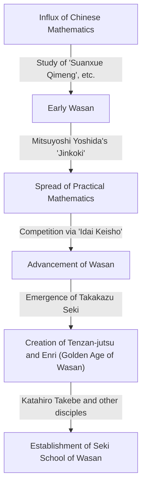
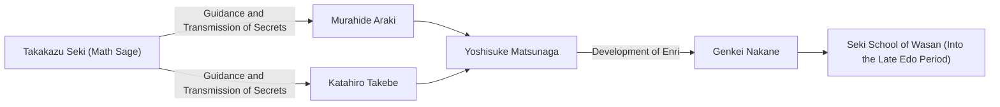

# 1. Introduction: Who Was [Takakazu Seki](https://kenji.blog/en/p/seki-takakazu/)?

In the Edo period of Japan, there was a man who elevated the independently developed mathematics known as "Wasan" to unprecedented heights. That man was **[Takakazu Seki](https://kenji.blog/en/p/seki-takakazu/)** (also known as Seki Kōwa, c. 1640s - 1708). He was later revered as the "Math Sage" (Sansei) and is positioned as one of the most important figures in the history of Japanese mathematics.

During the same period in Europe, [Isaac Newton](https://kenji.blog/en/p/newton/) and [Gottfried Leibniz](/en/p/leibniz/) were establishing calculus, but [Takakazu Seki](https://kenji.blog/en/p/seki-takakazu/) was also making extremely advanced mathematical discoveries independently. In this article, we will delve into the episodes of his life and his world-class mathematical achievements, along with their historical background.

# 2. The Dawn of Wasan and Japanese Mathematics Before Seki

To understand Seki's achievements, one must know the mathematical background of Japan at the time. In the early Edo period, mathematical texts imported from China were circulating in Japan. A particularly important one was the "Suanxue Qimeng" (Introduction to Computational Studies, 1299) written by Zhu Shijie of the Yuan dynasty. This book was brought to Japan during Toyotomi Hideyoshi's invasions of Korea and had a profound impact on Japanese intellectuals.

During this period, the book that significantly advanced practical mathematics in Japan was Mitsuyoshi Yoshida's "Jinkoki" (1627). "Jinkoki" became a bestseller by explaining mathematics useful for daily life and commerce, such as how to use the abacus (soroban) and measure areas. However, it remained strictly practical and elementary arithmetic, not reaching advanced algebra or geometry.

From this foundation of practical focus, intellectuals who pursued the beauty and logical depth of pure mathematics eventually emerged. They created a unique culture called "Idai Keisho" (Inheritance of Mathematical Problems), where unsolved problems were published in mathematical books to challenge readers. This intellectual game became the driving force that rapidly advanced Wasan. And the genius who appeared at the pinnacle of this Wasan development was [Takakazu Seki](https://kenji.blog/en/p/seki-takakazu/).

# 3. The Life and Historical Background of [Takakazu Seki](https://kenji.blog/en/p/seki-takakazu/)

## 3.1 Early Life and Youthful Anecdotes

The exact year of [Takakazu Seki](https://kenji.blog/en/p/seki-takakazu/)'s birth is unknown, but it is generally estimated to be around 1640 to 1642. He was born as the second son of the Uchiyama family, a samurai family in Fujioka, Kozuke Province (present-day Gunma Prefecture), and was later adopted into the Seki family. His given name was Shinsuke, and he later took the pen name Jiyusai.

It is said that he showed an extraordinary passion and talent for mathematics (arithmetic) from a young age. In Japan at that time, the aforementioned "Suanxue Qimeng" and others were being studied, but Seki deciphered these books through self-study and further developed their contents. According to legend, he could perform complex calculations in his head from a young age, surprising the adults around him. He had the ability to explore mathematical truths through self-study and generate new ideas not bound by existing frameworks.

## 3.2 [Service](https://kenji.blog/en/p/kubernetes-k8s-architecture-pod-service-ingress/) in the Kofu Domain and as a Direct Shogunal Retainer

[Takakazu Seki](https://kenji.blog/en/p/seki-takakazu/) was not only a mathematician but also a full-fledged samurai. He served Tsunatoyo Tokugawa (later the 6th Shogun, Ienobu Tokugawa), the lord of the Kofu Domain, and held practical administrative positions such as a financial auditor (Kanjo Ginmi-yaku). This suggests that he possessed excellent practical abilities not only in mathematics but also in calendrical science (calendar calculation), surveying, and mapmaking.

When Tsunatoyo entered the Nishinomaru of Edo Castle as the successor to the Shogun, Seki followed him and became a direct retainer (Hatamoto) of the shogunate. One can imagine his highly stoic figure, performing his official duties as a samurai by day, and taking up the calculating rods (sangi) and brush by night to challenge unknown mathematical truths.

## 3.3 Later Years and Death

Seki continued his research even after becoming a direct shogunal retainer, but in his later years, he was often bedridden with illness. On December 5, 1708, [Takakazu Seki](https://kenji.blog/en/p/seki-takakazu/) passed away. His grave is currently located at Jorin-ji Temple in Shinjuku, Tokyo, and has become a sacred place visited by many mathematics enthusiasts and researchers.

# 4. Innovation in Algebra: The Creation of Tenzan-jutsu (Bosho-ho)

One of [Takakazu Seki](https://kenji.blog/en/p/seki-takakazu/)'s greatest achievements was elevating the calculation techniques imported from China into an abstract and universal mathematical system akin to modern algebra.

In East Asian mathematics at the time, "Tengen-jutsu" was used, a method of solving equations by arranging sticks called "sangi" (calculating rods) on a board. Tengen-jutsu was an excellent method, but because it used physical sticks, it could only handle higher-order equations with a single unknown, making it difficult to solve systems of equations with multiple unknown variables.

Therefore, [Takakazu Seki](https://kenji.blog/en/p/seki-takakazu/) devised an algebraic notation via brush writing called **Bosho-ho**. This represented unknowns and constants with Chinese characters and expressed mathematical formulas by adding symbols next to them. This made it possible to freely manipulate and transform complex equations involving multiple unknowns on paper.

Seki called the method of arranging equations using this Bosho-ho to eliminate unknowns and derive the final solution "Endan-jutsu." This was later called "Tenzan-jutsu" by his disciples. Tenzan-jutsu laid the algebraic foundation of Wasan and enabled its rapid development thereafter.

$$
\text{The manipulation of mathematical formulas by Bosho-ho played essentially the same role as symbolic algebra like } ax^2 + bx + c = 0 \text{ in the West.}
$$

# 5. Discovery of Determinants: A Feat Preceding the West

[Takakazu Seki](https://kenji.blog/en/p/seki-takakazu/)'s most famous global achievement is the discovery of the concept of the **determinant**. In his 1683 book "Kai Fukudai no Ho" (Method of Solving Concealed Problems), he described the expansion method of determinants as a general formula for eliminating unknowns from systems of linear equations.

Astonishingly, this is considered to be around the same time (around 1683), or slightly earlier, than when [Gottfried Leibniz](https://kenji.blog/en/p/leibniz/) reached the concept of determinants in Europe. Japan at the time was in a state of national isolation (Sakoku), leaving almost no room for Western mathematical information to enter. Therefore, Seki arrived at this great discovery completely independently.

Seki correctly showed the expansion of determinants for the cases of $n=2, 3, 4, 5$ (although there were some sign errors in the case of $n=5$, the basic concept was established). He had derived a calculation method equivalent to Sarrus' rule ahead of the rest of the world.

$$
D = \begin{vmatrix} 
a_{11} & a_{12} & a_{13} \\ 
a_{21} & a_{22} & a_{23} \\
a_{31} & a_{32} & a_{33} 
\end{vmatrix} = a_{11}a_{22}a_{33} + a_{12}a_{23}a_{31} + a_{13}a_{21}a_{32} - a_{13}a_{22}a_{31} - a_{11}a_{23}a_{32} - a_{12}a_{21}a_{33}
$$

This discovery made it possible to systematically determine the conditions for the existence of solutions to complex systems of equations, and dramatically improved the computational capabilities of Wasan.

# 6. Enri: The Dawn of Calculus in Wasan

Seki made groundbreaking achievements not only in algebra but also in geometry and analysis. This was the creation of **Enri** (Principle of the Circle).

Enri is a limit-based method for finding pi, the arc length of a circle, the volume of a sphere, etc., and corresponds to the fundamental concepts of calculus (especially integration) in the West.

[Takakazu Seki](https://kenji.blog/en/p/seki-takakazu/) calculated pi by inscribing regular polygons inside a circle and increasing the number of their sides. He expended a staggering amount of effort to calculate the perimeter up to a regular 131,072-gon ($2^{17}$-gon). However, his true genius lay not merely in repeating calculations.

He found regularities from the series of calculated perimeter data and applied an acceleration method (an algorithm to speed up convergence) equivalent to **Aitken's delta-squared process**. As a result, he succeeded in obtaining an extremely precise approximation with a small amount of calculation.

Using this method, Seki accurately calculated pi to the 11th decimal place.

$$
\pi \approx 3.14159265359\dots
$$

The discovery of this advanced calculation algorithm was at the highest level in the world at the time, and proves that Wasan was not merely a puzzle, but had aspects of rigorous mathematical analysis.

# 7. Discovery of Bernoulli Numbers and the Sum of Powers Formula

In his posthumous work "Katsuyo Sanpo" (Essentials of Mathematics) published in 1712 after his death, he perfectly derived the formula for the sum of powers.

The formula for finding the sum of the $p$-th powers of natural numbers $\sum_{k=1}^n k^p$ had been a matter of interest to mathematicians since ancient times. [Takakazu Seki](https://kenji.blog/en/p/seki-takakazu/) systematically calculated a specific sequence of numbers that appears in the coefficients of this formula. This sequence is exactly what is now called **Bernoulli numbers**.

This sequence was also independently published in the Swiss mathematician Jacob Bernoulli's book "Ars Conjectandi" (published in 1713). The publication of Seki's book was one year earlier than Bernoulli's, and it is believed that Seki's discovery itself was slightly earlier. Strangely, on opposite sides of the earth and at almost the same time, two geniuses had reached the same mathematical truth.

Bernoulli numbers are defined as follows:

$$
B_0 = 1, \quad B_1 = -\frac{1}{2}, \quad B_2 = \frac{1}{6}, \quad B_4 = -\frac{1}{30}, \quad B_6 = \frac{1}{42} \dots
$$

Seki called this "Daseki-jutsu" and established a method to calculate it efficiently using a coefficient table similar to [Pascal](https://kenji.blog/en/p/pascal/)'s triangle (called "Rippo-shiki" in Wasan).

# 8. Development of the Seki School of Wasan and His Successors

[Takakazu Seki](https://kenji.blog/en/p/seki-takakazu/) himself did not publish and widely announce all of his discoveries. His mathematics was passed down as secret teachings to a limited number of brilliant disciples.

The most famous among them is **Katahiro Takebe**. Takebe further developed his master's Enri and discovered infinite series expansions equivalent to the Taylor expansion of inverse trigonometric functions, pushing Wasan into even more advanced calculus.

This school of mathematics, founded by [Takakazu Seki](https://kenji.blog/en/p/seki-takakazu/) and organized by Katahiro Takebe and others, was called the "Seki School." The Seki School had an extremely systematic and educational framework, and completely dominated the mathematical world of Japan in the Edo period.

# 9. Contribution to Calendrical Science and Relationship with Harumi Shibukawa

Seki's knowledge was not limited to pure mathematics. He was also deeply versed in astronomy and calendrical science. At that time, Japan had been using an old calendar (the Xuanming calendar) imported from China for over 800 years, and there was a large discrepancy with the actual movements of celestial bodies.

The astronomer Harumi Shibukawa noticed this. Shibukawa created a new calendar, the "Jokyo Calendar," which was adopted by the shogunate. There is a theory that [Takakazu Seki](https://kenji.blog/en/p/seki-takakazu/) supported Shibukawa behind the scenes with theoretical backing and complex calculations during this time. In any case, Seki's mathematical methods were indispensable for the development of calendrical science and surveying techniques of the same era.

# 10. Conclusion: [Takakazu Seki](https://kenji.blog/en/p/seki-takakazu/)'s Place in the Global History of Mathematics

In Japan, which was in a state of national isolation with extremely limited information from the outside world, [Takakazu Seki](https://kenji.blog/en/p/seki-takakazu/) built the world's most advanced mathematics using his own language and notation. His existence demonstrates just how vast the potential of human intellect is.

The fact that he independently discovered mathematical tools indispensable for modern science and engineering, such as determinants, Bernoulli numbers, Aitken's extrapolation, and Enri (the foundation of calculus), is a great source of astonishment and pride for us today.

The Wasan he founded ended its role when Western mathematics was introduced in the Meiji era. However, the high mathematical literacy and logical thinking skills cultivated by Wasan became a powerful intellectual foundation for Japan as it rapidly developed into a modern nation.

[Takakazu Seki](https://kenji.blog/en/p/seki-takakazu/) can truly be called the "Math Sage" who proved the universality of mathematics across time and space, and a brilliantly shining giant in the global history of mathematics.
