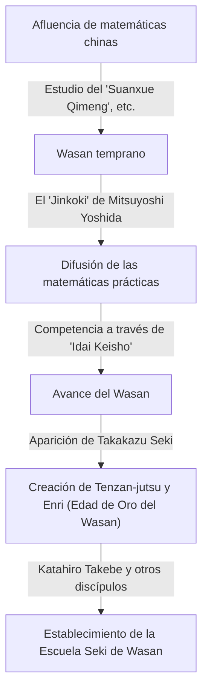
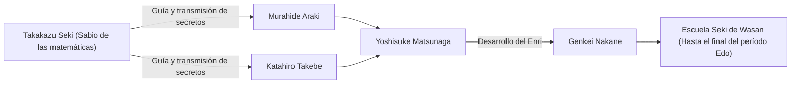

# 1. Introducción: ¿Quién fue [Takakazu Seki](https://kenji.blog/es/p/seki-takakazu/)?

En el período Edo de Japón, hubo un hombre que elevó las matemáticas desarrolladas de forma independiente, conocidas como "Wasan", a alturas sin precedentes. Ese hombre era **[Takakazu Seki](https://kenji.blog/es/p/seki-takakazu/)** (también conocido como Seki Kōwa, c. 1640s - 1708). Más tarde fue reverenciado como el "Sabio de las Matemáticas" (Sansei) y se le considera una de las figuras más importantes en la historia de las matemáticas japonesas.

Durante el mismo período en Europa, [Isaac Newton](https://kenji.blog/es/p/newton/) y [Gottfried Leibniz](/es/p/leibniz/) estaban estableciendo el cálculo infinitesimal, pero [Takakazu Seki](https://kenji.blog/es/p/seki-takakazu/) también estaba haciendo descubrimientos matemáticos extremadamente avanzados de forma independiente. En este artículo, profundizaremos en los episodios de su vida y sus logros matemáticos de clase mundial, junto con su contexto histórico.

# 2. Los albores del Wasan y las matemáticas japonesas antes de Seki

Para comprender los logros de Seki, uno debe conocer el contexto matemático de Japón en ese momento. A principios del período Edo, circulaban en Japón textos matemáticos importados de China. Uno particularmente importante fue el "Suanxue Qimeng" (Introducción a los estudios computacionales, 1299) escrito por Zhu Shijie de la dinastía Yuan. Este libro fue llevado a Japón durante las invasiones a Corea de Toyotomi Hideyoshi y tuvo un profundo impacto en los intelectuales japoneses.

Durante este período, el libro que hizo avanzar significativamente las matemáticas prácticas en Japón fue el "Jinkoki" (1627) de Mitsuyoshi Yoshida. El "Jinkoki" se convirtió en un éxito de ventas al explicar las matemáticas útiles para la vida diaria y el comercio, como el uso del ábaco (soroban) y la medición de áreas. Sin embargo, se limitó a la aritmética práctica y elemental, sin alcanzar el álgebra o la geometría avanzadas.

A partir de esta base centrada en lo práctico, finalmente surgieron intelectuales que buscaban la belleza y la profundidad lógica de las matemáticas puras. Crearon una cultura única llamada "Idai Keisho" (Herencia de problemas matemáticos), donde se publicaban problemas sin resolver en libros de matemáticas para desafiar a los lectores. Este juego intelectual se convirtió en la fuerza impulsora que hizo avanzar rápidamente el Wasan. Y el genio que apareció en la cúspide de este desarrollo del Wasan fue [Takakazu Seki](https://kenji.blog/es/p/seki-takakazu/).

# 3. La vida y el contexto histórico de [Takakazu Seki](https://kenji.blog/es/p/seki-takakazu/)

## 3.1 Primeros años y anécdotas de juventud

Se desconoce el año exacto del nacimiento de [Takakazu Seki](https://kenji.blog/es/p/seki-takakazu/), pero generalmente se estima que fue entre 1640 y 1642. Nació como el segundo hijo de la familia Uchiyama, una familia de samuráis en Fujioka, provincia de Kozuke (actual prefectura de Gunma), y luego fue adoptado por la familia Seki. Su nombre de pila era Shinsuke, y más tarde tomó el seudónimo de Jiyusai.

Se dice que mostró una pasión y un talento extraordinarios por las matemáticas (aritmética) desde muy joven. En Japón, en ese momento, se estudiaban el mencionado "Suanxue Qimeng" y otros, pero Seki descifró estos libros a través del estudio autodidacta y desarrolló aún más sus contenidos. Según la leyenda, podía realizar cálculos complejos en su cabeza desde que era niño, sorprendiendo a los adultos que lo rodeaban. Tenía la capacidad de explorar verdades matemáticas de forma autodidacta y generar nuevas ideas sin estar atado a los marcos existentes.

## 3.2 Servicio en el dominio de Kofu y como vasallo directo del Shogun

[Takakazu Seki](https://kenji.blog/es/p/seki-takakazu/) no solo era un matemático, sino también un samurái de pleno derecho. Sirvió a Tsunatoyo Tokugawa (más tarde el sexto Shogun, Ienobu Tokugawa), el señor del dominio de Kofu, y ocupó puestos administrativos prácticos, como el de auditor financiero (Kanjo Ginmi-yaku). Esto sugiere que poseía excelentes habilidades prácticas no solo en matemáticas, sino también en ciencias del calendario (cálculo de calendarios), topografía y cartografía.

Cuando Tsunatoyo entró en el Nishinomaru del Castillo Edo como sucesor del Shogun, Seki lo siguió y se convirtió en vasallo directo (Hatamoto) del shogunato. Uno puede imaginar su figura muy estoica, cumpliendo con sus deberes oficiales como samurái durante el día, y tomando los palillos de cálculo (sangi) y el pincel por la noche para desafiar las verdades matemáticas desconocidas.

## 3.3 Últimos años y muerte

Seki continuó su investigación incluso después de convertirse en un vasallo directo del shogunato, pero en sus últimos años, a menudo estuvo postrado en cama por enfermedad. El 5 de diciembre de 1708, [Takakazu Seki](https://kenji.blog/es/p/seki-takakazu/) falleció. Su tumba se encuentra actualmente en el Templo Jorin-ji en Shinjuku, Tokio, y se ha convertido en un lugar sagrado visitado por muchos entusiastas e investigadores de las matemáticas.

# 4. Innovación en álgebra: La creación del Tenzan-jutsu (Bosho-ho)

Uno de los mayores logros de [Takakazu Seki](https://kenji.blog/es/p/seki-takakazu/) fue elevar las técnicas de cálculo importadas de China a un sistema matemático abstracto y universal similar al álgebra moderna.

En las matemáticas de Asia Oriental de la época, se utilizaba el "Tengen-jutsu", un método para resolver ecuaciones colocando palillos llamados "sangi" (varillas de cálculo) en un tablero. El Tengen-jutsu era un método excelente, pero como usaba palillos físicos, solo podía manejar ecuaciones de orden superior con una sola incógnita, lo que dificultaba la resolución de sistemas de ecuaciones con múltiples variables desconocidas.

Por lo tanto, [Takakazu Seki](https://kenji.blog/es/p/seki-takakazu/) ideó una notación algebraica mediante escritura con pincel llamada **Bosho-ho**. Esta representaba incógnitas y constantes con caracteres chinos y expresaba fórmulas matemáticas añadiendo símbolos a su lado. Esto hizo posible manipular y transformar libremente ecuaciones complejas que involucraban múltiples incógnitas en papel.

Seki llamó al método de organizar las ecuaciones usando este Bosho-ho para eliminar las incógnitas y derivar la solución final "Endan-jutsu". Más tarde, sus discípulos lo llamaron "Tenzan-jutsu". El Tenzan-jutsu sentó las bases algebraicas del Wasan y permitió su rápido desarrollo a partir de entonces.

$$
\text{La manipulación de fórmulas matemáticas mediante Bosho-ho jugó esencialmente el mismo papel que el álgebra simbólica como } ax^2 + bx + c = 0 \text{ en Occidente.}
$$

# 5. Descubrimiento de los determinantes: Una hazaña que precedió a Occidente

El logro mundial más famoso de [Takakazu Seki](https://kenji.blog/es/p/seki-takakazu/) es el descubrimiento del concepto de **determinante**. En su libro de 1683 "Kai Fukudai no Ho" (Método para resolver problemas ocultos), describió el método de expansión de determinantes como una fórmula general para eliminar las incógnitas de los sistemas de ecuaciones lineales.

Sorprendentemente, se considera que esto ocurrió alrededor de la misma época (hacia 1683), o un poco antes, de que [Gottfried Leibniz](https://kenji.blog/es/p/leibniz/) llegara al concepto de los determinantes en Europa. Japón, en ese momento, se encontraba en un estado de aislamiento nacional (Sakoku), dejando casi sin espacio para que entrara la información matemática occidental. Por lo tanto, Seki llegó a este gran descubrimiento de forma completamente independiente.

Seki mostró correctamente la expansión de determinantes para los casos de $n=2, 3, 4, 5$ (aunque hubo algunos errores de signo en el caso de $n=5$, el concepto básico quedó establecido). Había derivado un método de cálculo equivalente a la regla de Sarrus antes que el resto del mundo.

$$
D = \begin{vmatrix} 
a_{11} & a_{12} & a_{13} \\ 
a_{21} & a_{22} & a_{23} \\
a_{31} & a_{32} & a_{33} 
\end{vmatrix} = a_{11}a_{22}a_{33} + a_{12}a_{23}a_{31} + a_{13}a_{21}a_{32} - a_{13}a_{22}a_{31} - a_{11}a_{23}a_{32} - a_{12}a_{21}a_{33}
$$

Este descubrimiento hizo posible determinar sistemáticamente las condiciones para la existencia de soluciones a sistemas complejos de ecuaciones, y mejoró drásticamente las capacidades computacionales del Wasan.

# 6. Enri: Los albores del cálculo en el Wasan

Seki logró avances pioneros no solo en álgebra, sino también en geometría y análisis. Esta fue la creación del **Enri** (Principio del Círculo).

El Enri es un método basado en límites para encontrar pi, la longitud del arco de un círculo, el volumen de una esfera, etc., y corresponde a los conceptos fundamentales del cálculo (especialmente la integración) en Occidente.

[Takakazu Seki](https://kenji.blog/es/p/seki-takakazu/) calculó pi inscribiendo polígonos regulares dentro de un círculo y aumentando el número de sus lados. Realizó un esfuerzo asombroso para calcular el perímetro de un polígono regular de hasta 131.072 lados (polígono de $2^{17}$ lados). Sin embargo, su verdadero genio no residía simplemente en repetir cálculos.

Encontró regularidades a partir de la serie de datos de perímetros calculados y aplicó un método de aceleración (un algoritmo para acelerar la convergencia) equivalente al **proceso delta-cuadrado de Aitken**. Como resultado, logró obtener una aproximación extremadamente precisa con una pequeña cantidad de cálculos.

Utilizando este método, Seki calculó con precisión pi hasta el undécimo decimal.

$$
\pi \approx 3.14159265359\dots
$$

El descubrimiento de este algoritmo de cálculo avanzado fue del más alto nivel mundial en ese momento, y demuestra que el Wasan no era simplemente un rompecabezas, sino que tenía aspectos de análisis matemático riguroso.

# 7. Descubrimiento de los números de Bernoulli y la fórmula de la suma de potencias

En su obra póstuma "Katsuyo Sanpo" (Lo esencial de las matemáticas) publicada en 1712 después de su muerte, derivó perfectamente la fórmula para la suma de las potencias.

La fórmula para encontrar la suma de las potencias enésimas ($p$) de los números naturales $\sum_{k=1}^n k^p$ había sido objeto de interés para los matemáticos desde la antigüedad. [Takakazu Seki](https://kenji.blog/es/p/seki-takakazu/) calculó sistemáticamente una secuencia específica de números que aparece en los coeficientes de esta fórmula. Esta secuencia es exactamente lo que ahora se llama **números de Bernoulli**.

Esta secuencia también se publicó de forma independiente en el libro "Ars Conjectandi" (publicado en 1713) del matemático suizo Jacob Bernoulli. La publicación del libro de Seki fue un año anterior a la de Bernoulli, y se cree que el descubrimiento de Seki en sí fue un poco antes. Curiosamente, en lados opuestos de la tierra y casi al mismo tiempo, dos genios habían alcanzado la misma verdad matemática.

Los números de Bernoulli se definen de la siguiente manera:

$$
B_0 = 1, \quad B_1 = -\frac{1}{2}, \quad B_2 = \frac{1}{6}, \quad B_4 = -\frac{1}{30}, \quad B_6 = \frac{1}{42} \dots
$$

Seki llamó a esto "Daseki-jutsu" y estableció un método para calcularlo de manera eficiente utilizando una tabla de coeficientes similar al triángulo de [Pascal](https://kenji.blog/es/p/pascal/) (llamado "Rippo-shiki" en el Wasan).

# 8. Desarrollo de la Escuela Seki de Wasan y sus sucesores

[Takakazu Seki](https://kenji.blog/es/p/seki-takakazu/) no publicó ni anunció ampliamente todos sus descubrimientos. Sus matemáticas se transmitieron como enseñanzas secretas a un número limitado de discípulos brillantes.

El más famoso de ellos es **Katahiro Takebe**. Takebe desarrolló aún más el Enri de su maestro y descubrió expansiones en series infinitas equivalentes a la expansión de Taylor de las funciones trigonométricas inversas, empujando al Wasan hacia un cálculo aún más avanzado.

Esta escuela de matemáticas, fundada por [Takakazu Seki](https://kenji.blog/es/p/seki-takakazu/) y organizada por Katahiro Takebe y otros, se llamó la "Escuela Seki". La Escuela Seki tenía una estructura extremadamente sistemática y educativa, y dominó por completo el mundo matemático de Japón en el período Edo.

# 9. Contribución a la ciencia del calendario y relación con Harumi Shibukawa

El conocimiento de Seki no se limitaba a las matemáticas puras. También estaba profundamente versado en astronomía y ciencia del calendario. En ese momento, Japón había estado usando un antiguo calendario (el calendario Xuanming) importado de China durante más de 800 años, y había una gran discrepancia con los movimientos reales de los cuerpos celestes.

El astrónomo Harumi Shibukawa notó esto. Shibukawa creó un nuevo calendario, el "Calendario Jokyo", que fue adoptado por el shogunato. Existe la teoría de que [Takakazu Seki](https://kenji.blog/es/p/seki-takakazu/) apoyó a Shibukawa entre bastidores con respaldo teórico y cálculos complejos durante este tiempo. En cualquier caso, los métodos matemáticos de Seki fueron indispensables para el desarrollo de la ciencia calendárica y las técnicas de topografía de la misma época.

# 10. Conclusión: El lugar de [Takakazu Seki](https://kenji.blog/es/p/seki-takakazu/) en la historia mundial de las matemáticas

En Japón, que se encontraba en un estado de aislamiento nacional con información extremadamente limitada del mundo exterior, [Takakazu Seki](https://kenji.blog/es/p/seki-takakazu/) construyó las matemáticas más avanzadas del mundo utilizando su propio idioma y notación. Su existencia demuestra cuán vasto es el potencial del intelecto humano.

El hecho de que descubriera independientemente herramientas matemáticas indispensables para la ciencia y la ingeniería modernas, como los determinantes, los números de Bernoulli, la extrapolación de Aitken y el Enri (la base del cálculo), es una gran fuente de asombro y orgullo para nosotros hoy.

El Wasan que fundó terminó su papel cuando se introdujeron las matemáticas occidentales en la era Meiji. Sin embargo, la alta alfabetización matemática y las habilidades de pensamiento lógico cultivadas por el Wasan se convirtieron en una poderosa base intelectual para Japón a medida que se desarrollaba rápidamente para convertirse en una nación moderna.

A [Takakazu Seki](https://kenji.blog/es/p/seki-takakazu/) se le puede llamar verdaderamente el "Sabio de las matemáticas" que demostró la universalidad de las matemáticas en el tiempo y el espacio, y un gigante brillante en la historia mundial de las matemáticas.
