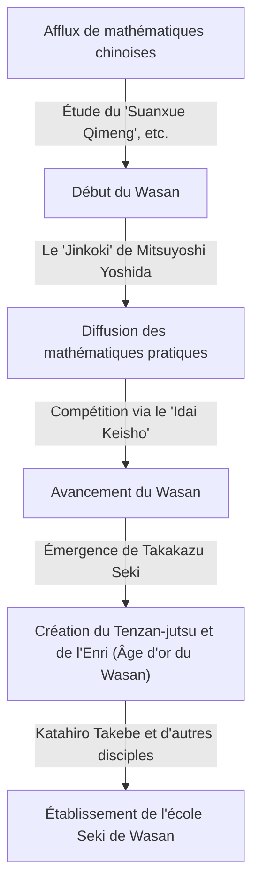
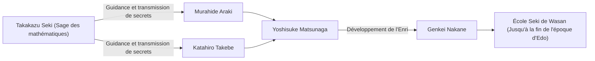

# 1. Introduction : Qui était [Takakazu Seki](https://kenji.blog/fr/p/seki-takakazu/) ?

Pendant la période d'Edo au Japon, un homme a élevé les mathématiques développées indépendamment, connues sous le nom de « Wasan », à des sommets sans précédent. Cet homme était **[Takakazu Seki](https://kenji.blog/fr/p/seki-takakazu/)** (également connu sous le nom de Seki Kōwa, v. 1640 - 1708). Il a plus tard été vénéré comme le « Sage des mathématiques » (Sansei) et est considéré comme l'une des figures les plus importantes de l'histoire des mathématiques japonaises.

À la même époque en Europe, [Isaac Newton](https://kenji.blog/fr/p/newton/) et [Gottfried Leibniz](https://kenji.blog/fr/p/leibniz/) établissaient le calcul infinitésimal, mais [Takakazu Seki](https://kenji.blog/fr/p/seki-takakazu/) faisait également des découvertes mathématiques extrêmement avancées de manière indépendante. Dans cet article, nous plongerons dans les épisodes de sa vie et ses réalisations mathématiques de classe mondiale, ainsi que leur contexte historique.

# 2. L'aube du Wasan et les mathématiques japonaises avant Seki

Pour comprendre les réalisations de Seki, il faut connaître le contexte mathématique du Japon de l'époque. Au début de la période d'Edo, des textes mathématiques importés de Chine circulaient au Japon. L'un d'eux, particulièrement important, était le « Suanxue Qimeng » (Introduction aux études de calcul, 1299) écrit par Zhu Shijie de la dynastie Yuan. Ce livre a été introduit au Japon lors des invasions de la Corée par Toyotomi Hideyoshi et a eu un impact profond sur les intellectuels japonais.

Au cours de cette période, le livre qui a considérablement fait progresser les mathématiques pratiques au Japon était le « Jinkoki » de Mitsuyoshi Yoshida (1627). Le « Jinkoki » est devenu un best-seller en expliquant les mathématiques utiles à la vie quotidienne et au commerce, comme l'utilisation du boulier (soroban) et la mesure des surfaces. Cependant, il s'agissait strictement d'arithmétique pratique et élémentaire, n'atteignant pas l'algèbre ou la géométrie avancées.

À partir de cette base axée sur la pratique, des intellectuels qui poursuivaient la beauté et la profondeur logique des mathématiques pures ont fini par émerger. Ils ont créé une culture unique appelée « Idai Keisho » (Héritage des problèmes mathématiques), où des problèmes non résolus étaient publiés dans des livres de mathématiques pour défier les lecteurs. Ce jeu intellectuel est devenu la force motrice qui a fait progresser rapidement le Wasan. Et le génie qui est apparu à l'apogée de ce développement du Wasan fut [Takakazu Seki](https://kenji.blog/fr/p/seki-takakazu/).

# 3. La vie et le contexte historique de [Takakazu Seki](https://kenji.blog/fr/p/seki-takakazu/)

## 3.1 Début de vie et anecdotes de jeunesse

L'année exacte de naissance de [Takakazu Seki](https://kenji.blog/fr/p/seki-takakazu/) est inconnue, mais elle est généralement estimée entre 1640 et 1642. Il est né comme le deuxième fils de la famille Uchiyama, une famille de samouraïs à Fujioka, dans la province de Kozuke (actuelle préfecture de Gunma), et a ensuite été adopté par la famille Seki. Son prénom était Shinsuke, et il a plus tard pris le pseudonyme de Jiyusai.

On dit qu'il a montré une passion et un talent extraordinaires pour les mathématiques (arithmétique) dès son plus jeune âge. Au Japon, à cette époque, le « Suanxue Qimeng » susmentionné et d'autres étaient étudiés, mais Seki a déchiffré ces livres en autodidacte et a approfondi leur contenu. Selon la légende, il pouvait effectuer des calculs complexes de tête dès son plus jeune âge, surprenant les adultes qui l'entouraient. Il avait la capacité d'explorer les vérités mathématiques en autodidacte et de générer de nouvelles idées non limitées par les cadres existants.

## 3.2 [Service](https://kenji.blog/fr/p/kubernetes-k8s-architecture-pod-service-ingress/) dans le domaine de Kofu et en tant que vassal direct du Shogun

[Takakazu Seki](https://kenji.blog/fr/p/seki-takakazu/) n'était pas seulement un mathématicien, mais aussi un samouraï à part entière. Il a servi Tsunatoyo Tokugawa (plus tard le 6e Shogun, Ienobu Tokugawa), le seigneur du domaine de Kofu, et a occupé des postes administratifs pratiques tels qu'auditeur financier (Kanjo Ginmi-yaku). Cela suggère qu'il possédait d'excellentes capacités pratiques non seulement en mathématiques, mais aussi en science du calendrier (calcul calendaire), en arpentage et en cartographie.

Lorsque Tsunatoyo est entré dans le Nishinomaru du château d'Edo en tant que successeur du Shogun, Seki l'a suivi et est devenu un vassal direct (Hatamoto) du shogunat. On peut imaginer sa silhouette très stoïque, accomplissant ses devoirs officiels de samouraï le jour, et prenant les bâtonnets à calcul (sangi) et le pinceau la nuit pour défier les vérités mathématiques inconnues.

## 3.3 Dernières années et décès

Seki a poursuivi ses recherches même après être devenu un vassal direct du shogunat, mais dans ses dernières années, il fut souvent alité par la maladie. Le 5 décembre 1708, [Takakazu Seki](https://kenji.blog/fr/p/seki-takakazu/) s'est éteint. Sa tombe est actuellement située au temple Jorin-ji à Shinjuku, Tokyo, et est devenue un lieu sacré visité par de nombreux passionnés et chercheurs en mathématiques.

# 4. Innovation en algèbre : La création du Tenzan-jutsu (Bosho-ho)

L'une des plus grandes réalisations de [Takakazu Seki](https://kenji.blog/fr/p/seki-takakazu/) a été d'élever les techniques de calcul importées de Chine en un système mathématique abstrait et universel semblable à l'algèbre moderne.

Dans les mathématiques d'Asie de l'Est à l'époque, on utilisait le « Tengen-jutsu », une méthode de résolution d'équations en disposant des bâtonnets appelés « sangi » (bâtonnets à calcul) sur un plateau. Le Tengen-jutsu était une excellente méthode, mais comme il utilisait des bâtonnets physiques, il ne pouvait traiter que des équations d'ordre supérieur avec une seule inconnue, ce qui rendait difficile la résolution de systèmes d'équations à plusieurs variables inconnues.

Par conséquent, [Takakazu Seki](https://kenji.blog/fr/p/seki-takakazu/) a conçu une notation algébrique écrite au pinceau appelée **Bosho-ho**. Elle représentait les inconnues et les constantes avec des caractères chinois et exprimait des formules mathématiques en ajoutant des symboles à côté d'eux. Cela a permis de manipuler et de transformer librement sur papier des équations complexes impliquant de multiples inconnues.

Seki a appelé « Endan-jutsu » la méthode consistant à arranger des équations à l'aide de ce Bosho-ho pour éliminer des inconnues et dériver la solution finale. Cela a plus tard été appelé « Tenzan-jutsu » par ses disciples. Le Tenzan-jutsu a jeté les bases algébriques du Wasan et a permis son développement rapide par la suite.

$$
\text{La manipulation des formules mathématiques par le Bosho-ho a joué essentiellement le même rôle que l'algèbre symbolique comme } ax^2 + bx + c = 0 \text{ en Occident.}
$$

# 5. Découverte des déterminants : Un exploit précédant l'Occident

La réalisation mondiale la plus célèbre de [Takakazu Seki](https://kenji.blog/fr/p/seki-takakazu/) est la découverte du concept du **déterminant**. Dans son livre de 1683 « Kai Fukudai no Ho » (Méthode de résolution des problèmes dissimulés), il a décrit la méthode de développement des déterminants comme une formule générale pour éliminer les inconnues des systèmes d'équations linéaires.

Fait étonnant, on considère que cela s'est produit à peu près à la même époque (vers 1683), ou un peu plus tôt, que lorsque [Gottfried Leibniz](https://kenji.blog/fr/p/leibniz/) a atteint le concept des déterminants en Europe. Le Japon à l'époque était dans un état d'isolement national (Sakoku), ne laissant presque aucune place à l'entrée d'informations mathématiques occidentales. Par conséquent, Seki est parvenu à cette grande découverte de manière totalement indépendante.

Seki a montré correctement le développement des déterminants pour les cas de $n=2, 3, 4, 5$ (bien qu'il y ait eu quelques erreurs de signe dans le cas de $n=5$, le concept de base était établi). Il avait dérivé une méthode de calcul équivalente à la règle de Sarrus avant le reste du monde.

$$
D = \begin{vmatrix} 
a_{11} & a_{12} & a_{13} \\ 
a_{21} & a_{22} & a_{23} \\
a_{31} & a_{32} & a_{33} 
\end{vmatrix} = a_{11}a_{22}a_{33} + a_{12}a_{23}a_{31} + a_{13}a_{21}a_{32} - a_{13}a_{22}a_{31} - a_{11}a_{23}a_{32} - a_{12}a_{21}a_{33}
$$

Cette découverte a permis de déterminer systématiquement les conditions d'existence de solutions à des systèmes d'équations complexes, et a considérablement amélioré les capacités de calcul du Wasan.

# 6. Enri : L'aube du calcul infinitésimal dans le Wasan

Seki a accompli des réalisations révolutionnaires non seulement en algèbre, mais aussi en géométrie et en analyse. Il s'agit de la création de l'**Enri** (Principe du cercle).

L'Enri est une méthode basée sur les limites pour trouver pi, la longueur de l'arc d'un cercle, le volume d'une sphère, etc., et correspond aux concepts fondamentaux du calcul infinitésimal (en particulier l'intégration) en Occident.

[Takakazu Seki](https://kenji.blog/fr/p/seki-takakazu/) a calculé pi en inscrivant des polygones réguliers à l'intérieur d'un cercle et en augmentant le nombre de leurs côtés. Il a déployé des efforts stupéfiants pour calculer le périmètre jusqu'à un polygone régulier à 131 072 côtés (polygone à $2^{17}$ côtés). Cependant, son véritable génie ne résidait pas seulement dans la répétition des calculs.

Il a trouvé des régularités à partir de la série de données de périmètre calculées et a appliqué une méthode d'accélération (un algorithme pour accélérer la convergence) équivalente au **Delta-2 d'Aitken** (Aitken's delta-squared process). En conséquence, il a réussi à obtenir une approximation extrêmement précise avec une petite quantité de calcul.

En utilisant cette méthode, Seki a calculé avec précision pi jusqu'à la 11e décimale.

$$
\pi \approx 3.14159265359\dots
$$

La découverte de cet algorithme de calcul avancé était au plus haut niveau mondial à l'époque, et prouve que le Wasan n'était pas simplement un puzzle, mais avait des aspects d'analyse mathématique rigoureuse.

# 7. Découverte des nombres de Bernoulli et la formule de la somme des puissances

Dans son œuvre posthume « Katsuyo Sanpo » (L'Essentiel des mathématiques) publiée en 1712 après sa mort, il a parfaitement dérivé la formule de la somme des puissances.

La formule pour trouver la somme des $p$-ièmes puissances des nombres naturels $\sum_{k=1}^n k^p$ suscitait l'intérêt des mathématiciens depuis l'Antiquité. [Takakazu Seki](https://kenji.blog/fr/p/seki-takakazu/) a calculé systématiquement une séquence spécifique de nombres qui apparaît dans les coefficients de cette formule. Cette séquence est exactement ce que l'on appelle aujourd'hui les **nombres de Bernoulli**.

Cette séquence a également été publiée de manière indépendante dans le livre « Ars Conjectandi » du mathématicien suisse Jacques Bernoulli (publié en 1713). La publication du livre de Seki a précédé d'un an celle de Bernoulli, et on pense que la découverte de Seki elle-même était légèrement antérieure. Étrangement, de part et d'autre de la Terre et presque au même moment, deux génies avaient atteint la même vérité mathématique.

Les nombres de Bernoulli sont définis comme suit :

$$
B_0 = 1, \quad B_1 = -\frac{1}{2}, \quad B_2 = \frac{1}{6}, \quad B_4 = -\frac{1}{30}, \quad B_6 = \frac{1}{42} \dots
$$

Seki appelait cela le « Daseki-jutsu » et a établi une méthode pour le calculer efficacement à l'aide d'un tableau de coefficients similaire au triangle de [Pascal](https://kenji.blog/fr/p/pascal/) (appelé « Rippo-shiki » dans le Wasan).

# 8. Développement de l'école Seki de Wasan et ses successeurs

[Takakazu Seki](https://kenji.blog/fr/p/seki-takakazu/) lui-même n'a pas publié et annoncé largement toutes ses découvertes. Ses mathématiques ont été transmises comme des enseignements secrets à un nombre limité de brillants disciples.

Le plus célèbre d'entre eux est **Katahiro Takebe**. Takebe a développé davantage l'Enri de son maître et a découvert des développements en séries infinies équivalentes au développement de Taylor des fonctions trigonométriques inverses, poussant le Wasan dans des calculs encore plus avancés.

Cette école de mathématiques, fondée par [Takakazu Seki](https://kenji.blog/fr/p/seki-takakazu/) et organisée par Katahiro Takebe et d'autres, a été appelée « l'École Seki ». L'École Seki avait un cadre extrêmement systématique et éducatif, et a complètement dominé le monde mathématique du Japon pendant la période d'Edo.

# 9. Contribution à la science du calendrier et relation avec Harumi Shibukawa

Les connaissances de Seki ne se limitaient pas aux mathématiques pures. Il était également profondément versé dans l'astronomie et la science du calendrier. À cette époque, le Japon utilisait un ancien calendrier (le calendrier Xuanming) importé de Chine depuis plus de 800 ans, et il y avait un grand décalage avec les mouvements réels des corps célestes.

L'astronome Harumi Shibukawa a remarqué cela. Shibukawa a créé un nouveau calendrier, le « calendrier Jokyo », qui a été adopté par le shogunat. Il existe une théorie selon laquelle [Takakazu Seki](https://kenji.blog/fr/p/seki-takakazu/) aurait soutenu Shibukawa en coulisse avec des fondements théoriques et des calculs complexes pendant cette période. Quoi qu'il en soit, les méthodes mathématiques de Seki étaient indispensables au développement de la science calendaire et des techniques d'arpentage de la même époque.

# 10. Conclusion : La place de [Takakazu Seki](https://kenji.blog/fr/p/seki-takakazu/) dans l'histoire mondiale des mathématiques

Au Japon, qui était dans un état d'isolement national avec des informations extrêmement limitées provenant du monde extérieur, [Takakazu Seki](https://kenji.blog/fr/p/seki-takakazu/) a construit les mathématiques les plus avancées au monde en utilisant sa propre langue et sa propre notation. Son existence démontre à quel point le potentiel de l'intellect humain est vaste.

Le fait qu'il ait découvert de manière indépendante des outils mathématiques indispensables à la science et à l'ingénierie modernes, tels que les déterminants, les nombres de Bernoulli, l'extrapolation d'Aitken et l'Enri (le fondement du calcul infinitésimal), est une grande source d'étonnement et de fierté pour nous aujourd'hui.

Le Wasan qu'il a fondé a mis fin à son rôle lorsque les mathématiques occidentales ont été introduites à l'ère Meiji. Cependant, les grandes connaissances mathématiques et les compétences en pensée logique cultivées par le Wasan sont devenues un puissant fondement intellectuel pour le Japon alors qu'il se développait rapidement pour devenir une nation moderne.

[Takakazu Seki](https://kenji.blog/fr/p/seki-takakazu/) peut véritablement être appelé le « Sage des mathématiques » qui a prouvé l'universalité des mathématiques à travers le temps et l'espace, et un géant brillant de l'histoire mondiale des mathématiques.
