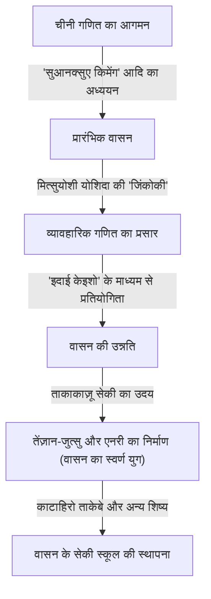
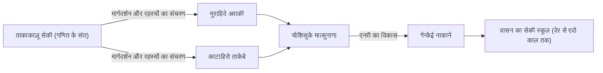

# 1. परिचय: [ताकाकाज़ू सेकी](https://kenji.blog/hi/p/seki-takakazu/) कौन थे?

जापान के एदो काल में, एक ऐसा व्यक्ति था जिसने स्वतंत्र रूप से विकसित गणित जिसे "वासन" के रूप में जाना जाता है, को अभूतपूर्व ऊंचाइयों तक पहुंचाया। वह व्यक्ति **[ताकाकाज़ू सेकी](https://kenji.blog/hi/p/seki-takakazu/)** (जिन्हें सेकी कोवा के नाम से भी जाना जाता है, लगभग 1640 के दशक - 1708) थे। उन्हें बाद में "गणित के संत" (संसेई) के रूप में सम्मानित किया गया और जापानी गणित के इतिहास में सबसे महत्वपूर्ण हस्तियों में से एक के रूप में स्थान दिया गया।

यूरोप में उसी काल के दौरान, [आइजैक न्यूटन](https://kenji.blog/hi/p/newton/) और गॉटफ्राइड लाइबनिज कैलकुलस की स्थापना कर रहे थे, लेकिन [ताकाकाज़ू सेकी](https://kenji.blog/hi/p/seki-takakazu/) भी स्वतंत्र रूप से अत्यंत उन्नत गणितीय खोज कर रहे थे। इस लेख में, हम उनके ऐतिहासिक पृष्ठभूमि के साथ-साथ उनके जीवन के प्रसंगों और उनकी विश्व स्तरीय गणितीय उपलब्धियों के बारे में विस्तार से जानेंगे।

# 2. वासन का उदय और सेकी से पहले जापानी गणित

सेकी की उपलब्धियों को समझने के लिए, किसी को उस समय जापान की गणितीय पृष्ठभूमि को जानना चाहिए। प्रारंभिक एदो काल में, चीन से आयातित गणितीय ग्रंथ जापान में प्रसारित हो रहे थे। एक विशेष रूप से महत्वपूर्ण ग्रन्थ युआन राजवंश के झू शिजिया द्वारा लिखित "सुआनक्सुए किमेंग" (कम्प्यूटेशनल अध्ययन का परिचय, 1299) था। यह पुस्तक टोयोटोमी हिदेयोशी के कोरिया पर आक्रमण के दौरान जापान लाई गई थी और इसका जापानी बुद्धिजीवियों पर गहरा प्रभाव पड़ा था।

इस अवधि के दौरान, जापान में व्यावहारिक गणित को महत्वपूर्ण रूप से आगे बढ़ाने वाली पुस्तक मित्सुयोशी योशिदा की "जिंकोकी" (1627) थी। "जिंकोकी" दैनिक जीवन और वाणिज्य के लिए उपयोगी गणित को समझाकर एक बेस्टसेलर बन गई, जैसे कि अबैकस (सोरोबान) का उपयोग कैसे करें और क्षेत्रों को कैसे मापें। हालाँकि, यह कड़ाई से व्यावहारिक और प्रारंभिक अंकगणित तक ही सीमित रही, जो उन्नत बीजगणित या ज्यामिति तक नहीं पहुँच पाई।

व्यावहारिक फोकस की इस नींव से, शुद्ध गणित की सुंदरता और तार्किक गहराई का अनुसरण करने वाले बुद्धिजीवी अंततः उभरे। उन्होंने "इदाई केइशो" (गणितीय समस्याओं की विरासत) नामक एक अनूठी संस्कृति बनाई, जहाँ पाठकों को चुनौती देने के लिए गणित की पुस्तकों में अनसुलझी समस्याओं को प्रकाशित किया गया था। यह बौद्धिक खेल वह प्रेरक शक्ति बन गया जिसने वासन को तेज़ी से आगे बढ़ाया। और वासन के इस विकास के शिखर पर दिखाई देने वाले प्रतिभाशाली व्यक्ति [ताकाकाज़ू सेकी](https://kenji.blog/hi/p/seki-takakazu/) थे।

# 3. [ताकाकाज़ू सेकी](https://kenji.blog/hi/p/seki-takakazu/) का जीवन और ऐतिहासिक पृष्ठभूमि

## 3.1 प्रारंभिक जीवन और युवावस्था के किस्से

[ताकाकाज़ू सेकी](https://kenji.blog/hi/p/seki-takakazu/) के जन्म का सही वर्ष अज्ञात है, लेकिन आमतौर पर यह अनुमान लगाया जाता है कि यह लगभग 1640 से 1642 के आसपास है। उनका जन्म फुजियोका, कोज़ुके प्रांत (वर्तमान गुन्मा प्रान्त) में एक समुराई परिवार उचियामा परिवार के दूसरे बेटे के रूप में हुआ था, और बाद में उन्हें सेकी परिवार में गोद ले लिया गया था। उनका दिया गया नाम शिंसुके था, और बाद में उन्होंने जियुसाई उपनाम रखा।

कहा जाता है कि उन्होंने कम उम्र से ही गणित (अंकगणित) के प्रति असाधारण जुनून और प्रतिभा दिखाई थी। उस समय जापान में, उपर्युक्त "सुआनक्सुए किमेंग" और अन्य का अध्ययन किया जा रहा था, लेकिन सेकी ने स्व-अध्ययन के माध्यम से इन पुस्तकों को समझा और उनकी सामग्री को और विकसित किया। किंवदंती के अनुसार, वह कम उम्र से ही अपने दिमाग में जटिल गणनाएँ कर सकते थे, जिससे उनके आस-पास के वयस्क आश्चर्यचकित रह जाते थे। उनमें स्व-अध्ययन के माध्यम से गणितीय सत्य का पता लगाने और मौजूदा रूपरेखाओं से बंधे बिना नए विचार उत्पन्न करने की क्षमता थी।

## 3.2 कोफू डोमेन में और शोगुन के सीधे अनुचर के रूप में सेवा

[ताकाकाज़ू सेकी](https://kenji.blog/hi/p/seki-takakazu/) केवल एक गणितज्ञ ही नहीं बल्कि एक पूर्ण समुराई भी थे। उन्होंने कोफू डोमेन के शासक सुनातोयो तोकुगावा (बाद में छठे शोगुन, इएनोबू तोकुगावा) की सेवा की और वित्तीय लेखा परीक्षक (कांजो गिन्मी-याकू) जैसे व्यावहारिक प्रशासनिक पदों पर कार्य किया। इससे पता चलता है कि उनके पास न केवल गणित में बल्कि कैलेंडर विज्ञान (कैलेंडर की गणना), सर्वेक्षण और मानचित्रण में भी उत्कृष्ट व्यावहारिक क्षमताएँ थीं।

जब सुनातोयो शोगुन के उत्तराधिकारी के रूप में एदो कैसल के निशिनोमारू में दाखिल हुए, तो सेकी ने उनके पीछे-पीछे शोगुनेट का एक सीधा अनुचर (हातामोटो) बन गया। कोई भी उनके अत्यधिक अडिग व्यक्तित्व की कल्पना कर सकता है, जो दिन में एक समुराई के रूप में अपने आधिकारिक कर्तव्यों का पालन करते हैं, और रात में अज्ञात गणितीय सत्य को चुनौती देने के लिए गणना की छड़ें (संगी) और ब्रश उठाते हैं।

## 3.3 बाद के वर्ष और मृत्यु

शोगुनेट के प्रत्यक्ष अनुचर बनने के बाद भी सेकी ने अपना शोध जारी रखा, लेकिन अपने बाद के वर्षों में, वे अक्सर बीमारी के कारण बिस्तर पर पड़े रहते थे। 5 दिसंबर, 1708 को [ताकाकाज़ू सेकी](https://kenji.blog/hi/p/seki-takakazu/) का निधन हो गया। उनकी कब्र वर्तमान में टोक्यो के शिंजुकु में जोरिन-जी मंदिर में स्थित है, और यह एक पवित्र स्थान बन गया है जहाँ कई गणित के प्रति उत्साही और शोधकर्ता आते हैं।

# 4. बीजगणित में नवाचार: तेंज़ान-जुत्सु (बोशो-हो) का निर्माण

[ताकाकाज़ू सेकी](https://kenji.blog/hi/p/seki-takakazu/) की सबसे बड़ी उपलब्धियों में से एक चीन से आयातित गणना तकनीकों को आधुनिक बीजगणित के समान एक अमूर्त और सार्वभौमिक गणितीय प्रणाली में ऊपर उठाना था।

उस समय पूर्वी एशियाई गणित में, "टेंगेन-जुत्सु" का उपयोग किया जाता था, जो एक बोर्ड पर "संगी" (गणना की छड़ें) नामक छड़ियों को व्यवस्थित करके समीकरणों को हल करने की एक विधि थी। टेंगेन-जुत्सु एक उत्कृष्ट विधि थी, लेकिन क्योंकि इसमें भौतिक छड़ियों का उपयोग किया जाता था, यह केवल एक अज्ञात के साथ उच्च-क्रम के समीकरणों को ही संभाल सकती थी, जिससे कई अज्ञात चर वाले समीकरणों की प्रणालियों को हल करना मुश्किल हो गया था।

इसलिए, [ताकाकाज़ू सेकी](https://kenji.blog/hi/p/seki-takakazu/) ने **बोशो-हो** नामक ब्रश लेखन के माध्यम से एक बीजगणितीय संकेतन तैयार किया। इसमें चीनी अक्षरों के साथ अज्ञात और स्थिरांक का प्रतिनिधित्व किया गया और उनके आगे प्रतीकों को जोड़कर गणितीय सूत्रों को व्यक्त किया गया। इससे कागज पर कई अज्ञात वाले जटिल समीकरणों को स्वतंत्र रूप से हेरफेर और बदलना संभव हो गया।

सेकी ने इस बोशो-हो का उपयोग करके अज्ञात को खत्म करने और अंतिम समाधान प्राप्त करने के लिए समीकरणों को व्यवस्थित करने की विधि को "एंदान-जुत्सु" कहा। इसे बाद में उनके शिष्यों द्वारा "तेंज़ान-जुत्सु" कहा गया। तेंज़ान-जुत्सु ने वासन की बीजगणितीय नींव रखी और उसके बाद इसके तेजी से विकास को सक्षम किया।

$$
\text{बोशो-हो द्वारा गणितीय सूत्रों के हेरफेर ने मूल रूप से पश्चिम में } ax^2 + bx + c = 0 \text{ जैसे प्रतीकात्मक बीजगणित के समान ही भूमिका निभाई।}
$$

# 5. सारणिकों की खोज: पश्चिम से पहले की एक उपलब्धि

[ताकाकाज़ू सेकी](https://kenji.blog/hi/p/seki-takakazu/) की सबसे प्रसिद्ध वैश्विक उपलब्धि **सारणिक** की अवधारणा की खोज है। अपनी 1683 की पुस्तक "काई फुकुदाई नो हो" (छिपी हुई समस्याओं को हल करने की विधि) में, उन्होंने रैखिक समीकरणों की प्रणालियों से अज्ञात को खत्म करने के लिए एक सामान्य सूत्र के रूप में सारणिकों की विस्तार विधि का वर्णन किया।

आश्चर्यजनक रूप से, यह माना जाता है कि यह उसी समय (लगभग 1683), या उससे थोड़ा पहले हुआ था, जब गॉटफ्राइड लाइबनिज यूरोप में सारणिकों की अवधारणा तक पहुंचे थे। उस समय जापान राष्ट्रीय अलगाव (सकोकू) की स्थिति में था, जिससे पश्चिमी गणितीय जानकारी के प्रवेश की लगभग कोई गुंजाइश नहीं थी। इसलिए, सेकी पूरी तरह से स्वतंत्र रूप से इस महान खोज पर पहुंचे।

सेकी ने $n=2, 3, 4, 5$ के मामलों के लिए सारणिकों के विस्तार को सही ढंग से दिखाया (हालांकि $n=5$ के मामले में कुछ संकेत त्रुटियां थीं, मूल अवधारणा स्थापित की गई थी)। उन्होंने दुनिया के बाकी हिस्सों से पहले सॅरस के नियम (Sarrus' rule) के समतुल्य एक गणना विधि प्राप्त की थी।

$$
D = \begin{vmatrix} 
a_{11} & a_{12} & a_{13} \\ 
a_{21} & a_{22} & a_{23} \\
a_{31} & a_{32} & a_{33} 
\end{vmatrix} = a_{11}a_{22}a_{33} + a_{12}a_{23}a_{31} + a_{13}a_{21}a_{32} - a_{13}a_{22}a_{31} - a_{11}a_{23}a_{32} - a_{12}a_{21}a_{33}
$$

इस खोज ने समीकरणों की जटिल प्रणालियों के समाधान के अस्तित्व के लिए शर्तों को व्यवस्थित रूप से निर्धारित करना संभव बना दिया, और वासन की कम्प्यूटेशनल क्षमताओं में नाटकीय रूप से सुधार किया।

# 6. एनरी: वासन में कैलकुलस का उदय

सेकी ने न केवल बीजगणित में बल्कि ज्यामिति और विश्लेषण में भी अभूतपूर्व उपलब्धियां हासिल कीं। यह **एनरी** (वृत्त का सिद्धांत) का निर्माण था।

एनरी पाई, एक वृत्त के चाप की लंबाई, एक गोले की मात्रा आदि को खोजने के लिए एक सीमा-आधारित विधि है, और यह पश्चिम में कैलकुलस (विशेष रूप से एकीकरण) की मूलभूत अवधारणाओं से मेल खाती है।

[ताकाकाज़ू सेकी](https://kenji.blog/hi/p/seki-takakazu/) ने एक वृत्त के अंदर नियमित बहुभुजों को अंकित करके और उनके पक्षों की संख्या बढ़ाकर पाई की गणना की। उन्होंने 131,072-भुजाओं वाले ($2^{17}$-भुजाओं वाले) नियमित बहुभुज तक की परिधि की गणना करने के लिए आश्चर्यजनक प्रयास किया। हालाँकि, उनकी सच्ची प्रतिभा केवल गणनाओं को दोहराने में नहीं थी।

उन्होंने गणना की गई परिधि डेटा की श्रृंखला से नियमितताएं पाईं और **ऐटकेन की डेल्टा-स्क्वायर्ड प्रक्रिया** के समतुल्य एक त्वरण विधि (अभिसरण को गति देने के लिए एक एल्गोरिदम) लागू की। परिणामस्वरूप, वे गणना की थोड़ी मात्रा के साथ अत्यधिक सटीक सन्निकटन प्राप्त करने में सफल रहे।

इस पद्धति का उपयोग करते हुए, सेकी ने दशमलव के 11वें स्थान तक पाई की सटीक गणना की।

$$
\pi \approx 3.14159265359\dots
$$

इस उन्नत गणना एल्गोरिदम की खोज उस समय दुनिया में उच्चतम स्तर पर थी, और यह साबित करती है कि वासन केवल एक पहेली नहीं थी, बल्कि इसमें कठोर गणितीय विश्लेषण के पहलू थे।

# 7. बर्नौली संख्याओं और शक्तियों के योग के सूत्र की खोज

उनकी मृत्यु के बाद 1712 में प्रकाशित उनके मरणोपरांत कार्य "कत्सुयो सान्पो" (गणित के अनिवार्य तत्व) में, उन्होंने शक्तियों के योग का सूत्र पूरी तरह से प्राप्त किया।

प्राकृतिक संख्याओं की $p$-वीं शक्तियों का योग $\sum_{k=1}^n k^p$ ज्ञात करने का सूत्र प्राचीन काल से ही गणितज्ञों के लिए रुचि का विषय रहा था। [ताकाकाज़ू सेकी](https://kenji.blog/hi/p/seki-takakazu/) ने इस सूत्र के गुणांकों में दिखाई देने वाले संख्याओं के एक विशिष्ट अनुक्रम की व्यवस्थित रूप से गणना की। यह अनुक्रम वही है जिसे अब **बर्नौली संख्याएँ** कहा जाता है।

यह अनुक्रम स्विस गणितज्ञ जैकब बर्नौली की पुस्तक "अर्स कंजेक्टांडी" (1713 में प्रकाशित) में भी स्वतंत्र रूप से प्रकाशित किया गया था। सेकी की पुस्तक का प्रकाशन बर्नौली से एक वर्ष पहले हुआ था, और ऐसा माना जाता है कि सेकी की खोज स्वयं थोड़ी पहले की थी। अजीब बात है कि पृथ्वी के विपरीत दिशाओं में और लगभग एक ही समय में, दो प्रतिभाशाली लोग एक ही गणितीय सत्य तक पहुंच गए थे।

बर्नौली संख्याओं को इस प्रकार परिभाषित किया गया है:

$$
B_0 = 1, \quad B_1 = -\frac{1}{2}, \quad B_2 = \frac{1}{6}, \quad B_4 = -\frac{1}{30}, \quad B_6 = \frac{1}{42} \dots
$$

सेकी ने इसे "दासेकी-जुत्सु" कहा और पास्कल के त्रिकोण (वासन में "रिप्पो-शिकी" कहा जाता है) के समान एक गुणांक तालिका का उपयोग करके इसे कुशलतापूर्वक गणना करने के लिए एक विधि स्थापित की।

# 8. वासन के सेकी स्कूल का विकास और उनके उत्तराधिकारी

[ताकाकाज़ू सेकी](https://kenji.blog/hi/p/seki-takakazu/) ने स्वयं अपनी सभी खोजों को व्यापक रूप से प्रकाशित और घोषित नहीं किया। उनके गणित को गुप्त शिक्षाओं के रूप में सीमित संख्या में मेधावी शिष्यों को सौंपा गया था।

उनमें से सबसे प्रसिद्ध **काटाहिरो ताकेबे** हैं। ताकेबे ने अपने गुरु के एनरी को और विकसित किया और प्रतिलोम त्रिकोणमितीय कार्यों के टेलर विस्तार के समतुल्य अनंत श्रृंखला विस्तार की खोज की, जिससे वासन को और भी अधिक उन्नत कैलकुलस में धकेल दिया गया।

गणित के इस स्कूल को, जिसकी स्थापना [ताकाकाज़ू सेकी](https://kenji.blog/hi/p/seki-takakazu/) ने की थी और जिसे काटाहिरो ताकेबे और अन्य लोगों ने व्यवस्थित किया था, "सेकी स्कूल" कहा जाता था। सेकी स्कूल का एक अत्यंत व्यवस्थित और शैक्षिक ढांचा था, और एदो काल में जापान के गणितीय दुनिया पर पूरी तरह से हावी था।

# 9. कैलेंडर विज्ञान में योगदान और हारुमी शिबुकावा के साथ संबंध

सेकी का ज्ञान केवल शुद्ध गणित तक सीमित नहीं था। वह खगोल विज्ञान और कैलेंडर विज्ञान में भी गहराई से पारंगत थे। उस समय, जापान चीन से आयातित एक पुराने कैलेंडर (ज़ुआनमिंग कैलेंडर) का उपयोग 800 से अधिक वर्षों से कर रहा था, और आकाशीय पिंडों की वास्तविक गतिविधियों के साथ एक बड़ी विसंगति थी।

खगोलशास्त्री हारुमी शिबुकावा ने इस पर ध्यान दिया। शिबुकावा ने एक नया कैलेंडर, "जोक्यो कैलेंडर" बनाया, जिसे शोगुनेट ने अपनाया था। एक सिद्धांत है कि [ताकाकाज़ू सेकी](https://kenji.blog/hi/p/seki-takakazu/) ने इस दौरान सैद्धांतिक समर्थन और जटिल गणनाओं के साथ पर्दे के पीछे शिबुकावा का समर्थन किया। किसी भी मामले में, उसी युग के कैलेंडर विज्ञान और सर्वेक्षण तकनीकों के विकास के लिए सेकी के गणितीय तरीके अपरिहार्य थे।

# 10. निष्कर्ष: गणित के वैश्विक इतिहास में [ताकाकाज़ू सेकी](https://kenji.blog/hi/p/seki-takakazu/) का स्थान

जापान में, जो राष्ट्रीय अलगाव की स्थिति में था और जहाँ बाहरी दुनिया से जानकारी अत्यंत सीमित थी, [ताकाकाज़ू सेकी](https://kenji.blog/hi/p/seki-takakazu/) ने अपनी खुद की भाषा और संकेतन का उपयोग करके दुनिया का सबसे उन्नत गणित बनाया। उनका अस्तित्व यह दर्शाता है कि मानव बुद्धि की क्षमता कितनी विशाल है।

तथ्य यह है कि उन्होंने स्वतंत्र रूप से आधुनिक विज्ञान और इंजीनियरिंग के लिए अपरिहार्य गणितीय उपकरणों की खोज की, जैसे कि सारणिक, बर्नौली संख्याएँ, ऐटकेन का एक्स्ट्रापोलेशन, और एनरी (कैलकुलस की नींव), यह आज हमारे लिए आश्चर्य और गर्व का एक बड़ा स्रोत है।

उनके द्वारा स्थापित वासन ने अपनी भूमिका तब समाप्त की जब मीजी युग में पश्चिमी गणित पेश किया गया। हालाँकि, वासन द्वारा विकसित उच्च गणितीय साक्षरता और तार्किक सोच कौशल जापान के लिए एक शक्तिशाली बौद्धिक नींव बन गए क्योंकि यह तेजी से एक आधुनिक राष्ट्र में विकसित हुआ।

[ताकाकाज़ू सेकी](https://kenji.blog/hi/p/seki-takakazu/) को वास्तव में "गणित का संत" कहा जा सकता है, जिन्होंने समय और स्थान के पार गणित की सार्वभौमिकता को साबित किया, और जो गणित के वैश्विक इतिहास में एक शानदार ढंग से चमकने वाले दिग्गज हैं।
