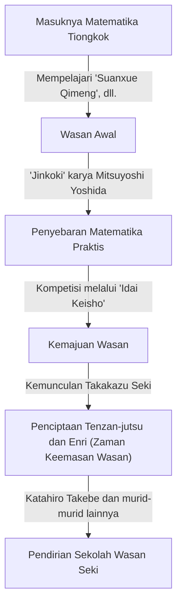
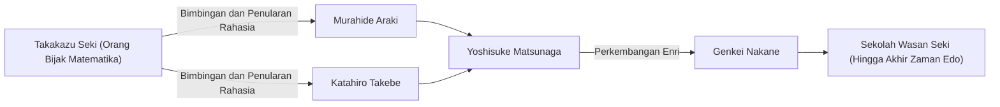

# 1. Pendahuluan: Siapakah [Takakazu Seki](https://kenji.blog/p/seki-takakazu/)?

Pada zaman Edo di Jepang, ada seorang pria yang mengangkat matematika yang dikembangkan secara independen yang dikenal sebagai "Wasan" ke tingkat yang belum pernah terjadi sebelumnya. Pria itu adalah **[Takakazu Seki](https://kenji.blog/p/seki-takakazu/)** (juga dikenal sebagai Seki Kōwa, sekitar tahun 1640-an - 1708). Dia kemudian dihormati sebagai "Orang Bijak Matematika" (Sansei) dan diposisikan sebagai salah satu tokoh paling penting dalam sejarah matematika Jepang.

Pada periode yang sama di Eropa, [Isaac Newton](https://kenji.blog/p/newton/) dan [Gottfried Leibniz](https://kenji.blog/p/leibniz/) sedang membangun kalkulus, tetapi [Takakazu Seki](https://kenji.blog/p/seki-takakazu/) juga membuat penemuan matematika yang sangat maju secara independen. Dalam artikel ini, kita akan mempelajari episode kehidupannya dan pencapaian matematikanya yang berkelas dunia, beserta latar belakang sejarahnya.

# 2. Fajar Wasan dan Matematika Jepang Sebelum Seki

Untuk memahami pencapaian Seki, kita harus mengetahui latar belakang matematika Jepang pada saat itu. Pada awal zaman Edo, teks matematika yang diimpor dari Tiongkok beredar di Jepang. Salah satu yang sangat penting adalah "Suanxue Qimeng" (Pengantar Studi Komputasi, 1299) yang ditulis oleh Zhu Shijie dari dinasti Yuan. Buku ini dibawa ke Jepang selama invasi Toyotomi Hideyoshi ke Korea dan berdampak besar pada para intelektual Jepang.

Selama periode ini, buku yang secara signifikan memajukan matematika praktis di Jepang adalah "Jinkoki" karya Mitsuyoshi Yoshida (1627). "Jinkoki" menjadi buku terlaris karena menjelaskan matematika yang berguna untuk kehidupan sehari-hari dan perdagangan, seperti cara menggunakan sempoa (soroban) dan mengukur luas area. Namun, buku ini tetap memuat aritmetika yang murni praktis dan dasar, belum mencapai aljabar atau geometri tingkat lanjut.

Dari landasan yang berfokus pada praktik ini, para intelektual yang mengejar keindahan dan kedalaman logis dari matematika murni akhirnya muncul. Mereka menciptakan budaya unik yang disebut "Idai Keisho" (Warisan Masalah Matematika), di mana masalah yang belum terpecahkan diterbitkan dalam buku-buku matematika untuk menantang pembaca. Permainan intelektual ini menjadi kekuatan pendorong yang memajukan Wasan dengan pesat. Dan jenius yang muncul di puncak perkembangan Wasan ini adalah [Takakazu Seki](https://kenji.blog/p/seki-takakazu/).

# 3. Kehidupan dan Latar Belakang Sejarah [Takakazu Seki](https://kenji.blog/p/seki-takakazu/)

## 3.1 Kehidupan Awal dan Anekdot Masa Muda

Tahun pasti kelahiran [Takakazu Seki](https://kenji.blog/p/seki-takakazu/) tidak diketahui, tetapi umumnya diperkirakan sekitar tahun 1640 hingga 1642. Dia dilahirkan sebagai putra kedua dari keluarga Uchiyama, sebuah keluarga samurai di Fujioka, Provinsi Kozuke (sekarang Prefektur Gunma), dan kemudian diadopsi ke dalam keluarga Seki. Nama aslinya adalah Shinsuke, dan ia kemudian menggunakan nama pena Jiyusai.

Dikatakan bahwa ia menunjukkan hasrat dan bakat luar biasa dalam matematika (aritmetika) sejak usia muda. Di Jepang pada masa itu, "Suanxue Qimeng" yang disebutkan di atas dan lainnya sedang dipelajari, tetapi Seki menguraikan buku-buku ini melalui belajar mandiri dan mengembangkan isinya lebih lanjut. Menurut legenda, ia dapat melakukan perhitungan rumit di luar kepala sejak usia muda, sehingga mengejutkan orang dewasa di sekitarnya. Dia memiliki kemampuan untuk mengeksplorasi kebenaran matematika melalui belajar mandiri dan menghasilkan ide-ide baru yang tidak terikat oleh kerangka kerja yang ada.

## 3.2 Pelayanan di Domain Kofu dan sebagai Pengikut Langsung Shogun

[Takakazu Seki](https://kenji.blog/p/seki-takakazu/) bukan hanya seorang matematikawan tetapi juga seorang samurai seutuhnya. Dia melayani Tsunatoyo Tokugawa (kemudian menjadi Shogun ke-6, Ienobu Tokugawa), penguasa Domain Kofu, dan memegang posisi administratif praktis seperti auditor keuangan (Kanjo Ginmi-yaku). Hal ini menunjukkan bahwa ia memiliki kemampuan praktis yang sangat baik tidak hanya dalam matematika tetapi juga dalam ilmu kalender (perhitungan kalender), survei, dan pembuatan peta.

Ketika Tsunatoyo memasuki Nishinomaru Kastil Edo sebagai penerus Shogun, Seki mengikutinya dan menjadi pengikut langsung (Hatamoto) shogun. Kita dapat membayangkan sosoknya yang sangat tabah, menjalankan tugas resminya sebagai seorang samurai di siang hari, dan mengambil batang hitung (sangi) serta kuas di malam hari untuk menantang kebenaran matematika yang tidak diketahui.

## 3.3 Tahun-tahun Terakhir dan Kematian

Seki melanjutkan penelitiannya bahkan setelah menjadi pengikut langsung shogun, tetapi di tahun-tahun terakhirnya, ia sering terbaring di tempat tidur karena sakit. Pada tanggal 5 Desember 1708, [Takakazu Seki](https://kenji.blog/p/seki-takakazu/) meninggal dunia. Makamnya saat ini terletak di Kuil Jorin-ji di Shinjuku, Tokyo, dan telah menjadi tempat suci yang dikunjungi oleh banyak penggemar dan peneliti matematika.

# 4. Inovasi dalam Aljabar: Penciptaan Tenzan-jutsu (Bosho-ho)

Salah satu pencapaian terbesar [Takakazu Seki](https://kenji.blog/p/seki-takakazu/) adalah mengangkat teknik perhitungan yang diimpor dari Tiongkok ke dalam sistem matematika abstrak dan universal yang mirip dengan aljabar modern.

Dalam matematika Asia Timur pada saat itu, "Tengen-jutsu" digunakan, sebuah metode penyelesaian persamaan dengan menyusun batang yang disebut "sangi" (batang hitung) di atas papan. Tengen-jutsu adalah metode yang sangat baik, tetapi karena menggunakan batang fisik, metode ini hanya dapat menangani persamaan tingkat tinggi dengan satu variabel tak diketahui, sehingga sulit untuk menyelesaikan sistem persamaan dengan banyak variabel tak diketahui.

Oleh karena itu, [Takakazu Seki](https://kenji.blog/p/seki-takakazu/) merancang notasi aljabar melalui tulisan kuas yang disebut **Bosho-ho**. Metode ini mewakili variabel tak diketahui dan konstanta dengan karakter Tionghoa dan menyatakan rumus matematika dengan menambahkan simbol di sebelahnya. Hal ini memungkinkan manipulasi dan transformasi persamaan kompleks yang melibatkan banyak variabel tak diketahui secara bebas di atas kertas.

Seki menyebut metode pengorganisasian persamaan yang menggunakan Bosho-ho ini untuk menghilangkan variabel tak diketahui dan mendapatkan solusi akhir sebagai "Endan-jutsu". Metode ini kemudian disebut "Tenzan-jutsu" oleh para muridnya. Tenzan-jutsu meletakkan dasar aljabar Wasan dan memungkinkan perkembangannya yang pesat setelah itu.

$$
\text{Manipulasi rumus matematika oleh Bosho-ho pada dasarnya memainkan peran yang sama dengan aljabar simbolik seperti } ax^2 + bx + c = 0 \text{ di Barat.}
$$

# 5. Penemuan Determinan: Prestasi yang Mendahului Barat

Pencapaian global paling terkenal dari [Takakazu Seki](https://kenji.blog/p/seki-takakazu/) adalah penemuan konsep **determinan**. Dalam bukunya tahun 1683 "Kai Fukudai no Ho" (Metode Menyelesaikan Masalah Tersembunyi), ia menggambarkan metode ekspansi determinan sebagai rumus umum untuk menghilangkan variabel tak diketahui dari sistem persamaan linear.

Hebatnya, hal ini dianggap terjadi pada waktu yang sama (sekitar 1683), atau sedikit lebih awal, dari ketika [Gottfried Leibniz](https://kenji.blog/p/leibniz/) mencapai konsep determinan di Eropa. Jepang pada waktu itu berada dalam keadaan isolasi nasional (Sakoku), sehingga hampir tidak menyisakan ruang bagi informasi matematika Barat untuk masuk. Oleh karena itu, Seki mencapai penemuan besar ini sepenuhnya secara independen.

Seki dengan benar menunjukkan ekspansi determinan untuk kasus $n=2, 3, 4, 5$ (meskipun ada beberapa kesalahan tanda dalam kasus $n=5$, konsep dasarnya telah ditetapkan). Dia telah menurunkan metode perhitungan yang setara dengan aturan Sarrus sebelum negara lain di dunia.

$$
D = \begin{vmatrix} 
a_{11} & a_{12} & a_{13} \\ 
a_{21} & a_{22} & a_{23} \\
a_{31} & a_{32} & a_{33} 
\end{vmatrix} = a_{11}a_{22}a_{33} + a_{12}a_{23}a_{31} + a_{13}a_{21}a_{32} - a_{13}a_{22}a_{31} - a_{11}a_{23}a_{32} - a_{12}a_{21}a_{33}
$$

Penemuan ini memungkinkan untuk secara sistematis menentukan kondisi keberadaan solusi untuk sistem persamaan yang kompleks, dan secara dramatis meningkatkan kemampuan komputasi Wasan.

# 6. Enri: Fajar Kalkulus dalam Wasan

Seki membuat pencapaian terobosan tidak hanya dalam aljabar tetapi juga dalam geometri dan analisis. Ini adalah penciptaan **Enri** (Prinsip Lingkaran).

Enri adalah metode berbasis limit untuk menemukan pi, panjang busur lingkaran, volume bola, dll., dan sesuai dengan konsep dasar kalkulus (terutama integrasi) di Barat.

[Takakazu Seki](https://kenji.blog/p/seki-takakazu/) menghitung pi dengan menggambar poligon beraturan di dalam lingkaran dan menambah jumlah sisinya. Dia menghabiskan banyak usaha untuk menghitung keliling hingga poligon beraturan segi-131.072 (poligon segi-$2^{17}$). Namun, kejeniusannya yang sebenarnya tidak hanya terletak pada pengulangan perhitungan.

Dia menemukan keteraturan dari rangkaian data keliling yang dihitung dan menerapkan metode akselerasi (algoritme untuk mempercepat konvergensi) yang setara dengan **proses delta-kuadrat Aitken**. Sebagai hasilnya, ia berhasil mendapatkan perkiraan yang sangat tepat dengan sedikit perhitungan.

Menggunakan metode ini, Seki menghitung pi secara akurat hingga 11 tempat desimal.

$$
\pi \approx 3.14159265359\dots
$$

Penemuan algoritme perhitungan tingkat lanjut ini berada pada tingkat tertinggi di dunia pada saat itu, dan membuktikan bahwa Wasan bukan sekadar teka-teki, tetapi memiliki aspek analisis matematika yang ketat.

# 7. Penemuan Angka Bernoulli dan Rumus Jumlah Pangkat

Dalam karya anumertanya "Katsuyo Sanpo" (Intisari Matematika) yang diterbitkan pada tahun 1712 setelah kematiannya, ia dengan sempurna menurunkan rumus untuk jumlah pangkat.

Rumus untuk mencari jumlah pangkat ke-$p$ dari bilangan asli $\sum_{k=1}^n k^p$ telah menjadi masalah yang menarik bagi para matematikawan sejak zaman kuno. [Takakazu Seki](https://kenji.blog/p/seki-takakazu/) secara sistematis menghitung urutan angka tertentu yang muncul dalam koefisien rumus ini. Urutan ini persis seperti yang sekarang disebut **angka Bernoulli**.

Urutan ini juga diterbitkan secara independen dalam buku matematikawan Swiss Jacob Bernoulli "Ars Conjectandi" (diterbitkan pada tahun 1713). Penerbitan buku Seki adalah satu tahun lebih awal dari Bernoulli, dan diyakini bahwa penemuan Seki sendiri sedikit lebih awal. Anehnya, di sisi bumi yang berlawanan dan pada waktu yang hampir bersamaan, dua orang jenius telah mencapai kebenaran matematika yang sama.

Angka Bernoulli didefinisikan sebagai berikut:

$$
B_0 = 1, \quad B_1 = -\frac{1}{2}, \quad B_2 = \frac{1}{6}, \quad B_4 = -\frac{1}{30}, \quad B_6 = \frac{1}{42} \dots
$$

Seki menyebut hal ini sebagai "Daseki-jutsu" dan menetapkan metode untuk menghitungnya secara efisien menggunakan tabel koefisien yang mirip dengan segitiga Pascal (disebut "Rippo-shiki" dalam Wasan).

# 8. Perkembangan Sekolah Wasan Seki dan Penerusnya

[Takakazu Seki](https://kenji.blog/p/seki-takakazu/) sendiri tidak menerbitkan dan mengumumkan secara luas semua penemuannya. Matematikanya diwariskan sebagai ajaran rahasia kepada sejumlah kecil murid yang brilian.

Yang paling terkenal di antara mereka adalah **Katahiro Takebe**. Takebe mengembangkan Enri milik gurunya lebih jauh dan menemukan ekspansi deret tak terhingga yang setara dengan ekspansi Taylor dari fungsi trigonometri invers, mendorong Wasan ke dalam kalkulus yang lebih maju.

Sekolah matematika ini, yang didirikan oleh [Takakazu Seki](https://kenji.blog/p/seki-takakazu/) dan diorganisasikan oleh Katahiro Takebe dan lain-lain, disebut "Sekolah Seki". Sekolah Seki memiliki kerangka yang sangat sistematis dan mendidik, dan sepenuhnya mendominasi dunia matematika Jepang pada zaman Edo.

# 9. Kontribusi pada Ilmu Kalender dan Hubungan dengan Harumi Shibukawa

Pengetahuan Seki tidak terbatas pada matematika murni. Dia juga sangat ahli dalam astronomi dan ilmu kalender. Pada saat itu, Jepang telah menggunakan kalender kuno (kalender Xuanming) yang diimpor dari Tiongkok selama lebih dari 800 tahun, dan terdapat perbedaan besar dengan pergerakan benda langit yang sebenarnya.

Astronom Harumi Shibukawa menyadari hal ini. Shibukawa membuat kalender baru, "Kalender Jokyo," yang diadopsi oleh keshogunan. Ada teori bahwa [Takakazu Seki](https://kenji.blog/p/seki-takakazu/) mendukung Shibukawa di balik layar dengan dukungan teoretis dan perhitungan rumit selama waktu ini. Bagaimanapun, metode matematika Seki sangat diperlukan untuk pengembangan ilmu kalender dan teknik survei pada era yang sama.

# 10. Kesimpulan: Tempat [Takakazu Seki](https://kenji.blog/p/seki-takakazu/) dalam Sejarah Matematika Global

Di Jepang, yang berada dalam keadaan isolasi nasional dengan informasi yang sangat terbatas dari dunia luar, [Takakazu Seki](https://kenji.blog/p/seki-takakazu/) membangun matematika paling maju di dunia menggunakan bahasa dan notasinya sendiri. Keberadaannya menunjukkan betapa luasnya potensi kecerdasan manusia.

Fakta bahwa ia secara independen menemukan alat matematika yang sangat diperlukan untuk sains dan teknik modern, seperti determinan, angka Bernoulli, ekstrapolasi Aitken, dan Enri (dasar kalkulus), merupakan sumber keheranan dan kebanggaan yang besar bagi kita hari ini.

Wasan yang ia dirikan mengakhiri perannya ketika matematika Barat diperkenalkan pada era Meiji. Namun, literasi matematika yang tinggi dan keterampilan berpikir logis yang dikembangkan oleh Wasan menjadi landasan intelektual yang kuat bagi Jepang saat berkembang pesat menjadi negara modern.

[Takakazu Seki](https://kenji.blog/p/seki-takakazu/) benar-benar dapat disebut sebagai "Orang Bijak Matematika" yang membuktikan universalitas matematika melintasi ruang dan waktu, dan raksasa yang bersinar cemerlang dalam sejarah matematika global.
