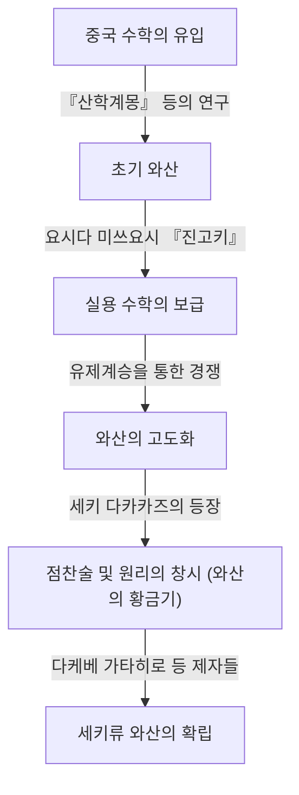

# 1. 서론: [세키 다카카즈](https://kenji.blog/p/seki-takakazu/)란 누구인가?

일본의 에도 시대에 독자적으로 발전한 수학인 '와산(和算)'을 전례 없는 높이로 끌어올린 인물이 있습니다. 그가 바로 **[세키 다카카즈](https://kenji.blog/p/seki-takakazu/)** (1640년대? - 1708년)입니다. 그는 훗날 '산성(算聖, 수학의 성인)'으로 불리며 일본 수학사에서 가장 중요한 인물 중 하나로 자리매김하고 있습니다.

같은 시기 유럽에서는 [아이작 뉴턴](https://kenji.blog/p/newton/)과 [고트프리트 라이프니츠](https://kenji.blog/p/leibniz/)가 미적분학을 구축하고 있었지만, [세키 다카카즈](https://kenji.blog/p/seki-takakazu/) 역시 이들과는 독립적으로 매우 고도의 수학적 발견을 해내고 있었습니다. 본 기사에서는 그의 생애와 세계 최고 수준이었던 그 수학적 업적에 대해 역사적 배경과 함께 자세히 파헤쳐 보겠습니다.

# 2. 와산의 여명기와 [세키 다카카즈](https://kenji.blog/p/seki-takakazu/) 등장 이전의 일본 수학

[세키 다카카즈](https://kenji.blog/p/seki-takakazu/)의 업적을 이해하려면 당시 일본의 수학적 배경을 알아야 합니다. 에도 시대 초기의 일본에는 중국에서 전래된 수학 서적이 유통되고 있었습니다. 특히 중요한 것이 원나라의 주세걸이 저술한 『산학계몽(算學啓蒙)』(1299년)입니다. 이 책은 도요토미 히데요시의 조선 출병 때 일본에 유입된 것으로 알려져 있으며, 일본의 지식인들에게 큰 영향을 미쳤습니다.

이 시기 일본의 실용 수학을 크게 진보시킨 것이 요시다 미쓰요시의 『진고키(塵劫記)』(1627년)입니다. 『진고키』는 주산(주판)의 사용법이나 면적 측정법 등 일상생활과 상업에 유용한 수학을 해설하여 베스트셀러가 되었습니다. 하지만 그것은 어디까지나 실용적이고 초보적인 산술에 머물렀으며, 고도화된 대수학이나 기하학에는 이르지 못했습니다.

그러한 실용 중시의 토양 속에서 이윽고 순수 수학으로서의 아름다움이나 논리적 깊이를 추구하는 지식인들이 등장합니다. 그들은 '유제계승(遺題繼承)'이라는, 수학 서적에 미해결 문제를 게재하여 독자에게 도전하게 하는 독자적인 문화를 만들어 냈습니다. 이 지적 게임이 와산을 급속히 고도화시키는 원동력이 되었습니다. 그리고 이 와산 발전의 정점에 나타난 천재가 바로 [세키 다카카즈](https://kenji.blog/p/seki-takakazu/)였습니다.

# 3. [세키 다카카즈](https://kenji.blog/p/seki-takakazu/)의 생애와 시대 배경

## 3.1 성장 과정과 젊은 시절의 일화

[세키 다카카즈](https://kenji.blog/p/seki-takakazu/)의 정확한 출생 연도는 불명확하지만, 일반적으로 1640년에서 1642년경에 태어난 것으로 추정됩니다. 고즈케국(현재의 군마현) 후지오카의 무사인 우치야마 가문의 차남으로 태어나, 훗날 세키 가문의 양자가 되었습니다. 본명은 신스케였고 나중에 지유사이라는 호를 썼습니다.

젊은 시절부터 수학(산술)에 대해 비정상적일 정도의 열정과 재능을 보였다고 전해집니다. 당시 일본에서는 앞서 언급한 『산학계몽』 등이 연구되고 있었는데, 세키는 이 서적들을 독학으로 해독하고 그 내용을 더욱 발전시켰습니다. 전설에 따르면 어릴 적부터 복잡한 계산을 암산으로 해내어 주위 어른들을 놀라게 했다고 합니다. 그는 독학으로 수학의 진리를 탐구하고, 기존의 틀에 얽매이지 않는 새로운 발상을 창출하는 능력을 가지고 있었습니다.

## 3.2 고후 번 임관과 막부 직참

[세키 다카카즈](https://kenji.blog/p/seki-takakazu/)는 수학자인 동시에 어엿한 무사였습니다. 그는 고후 번주였던 도쿠가와 쓰나토요(훗날 제6대 쇼군 도쿠가와 이에노부)를 섬기며, 간조긴미야쿠(회계 감사역) 등 실무적인 직책을 맡았습니다. 그가 수학뿐만 아니라 역학(달력 계산)이나 측량, 지도 제작 등에서도 뛰어난 실무 능력을 갖추고 있었음을 엿볼 수 있습니다.

쓰나토요가 쇼군의 후계자로서 에도 성 니시노마루에 들어가자, 세키도 그를 따라 막부의 직참(하타모토)이 되었습니다. 무사로서의 공무를 수행하면서도 밤마다 산목과 붓을 들고 미지의 수학적 진리에 도전하던 그의 모습은 매우 금욕적이었을 것으로 상상됩니다.

## 3.3 만년과 죽음

막부 직참이 된 후에도 연구를 계속했지만, 만년에는 병상에 눕는 일이 잦아졌습니다. 그리고 1708년 12월 5일, [세키 다카카즈](https://kenji.blog/p/seki-takakazu/)는 세상을 떠났습니다. 그의 묘는 현재 도쿄도 신주쿠구의 조린지에 있으며, 많은 수학 애호가와 연구자들이 찾는 성지가 되었습니다.

# 4. 대수학의 혁신: 점찬술(방서법)의 창시

[세키 다카카즈](https://kenji.blog/p/seki-takakazu/)의 최대 공적 중 하나는 중국에서 전해진 계산 기술을 현대 대수학에 통하는 추상적이고 보편적인 수학 체계로 승화시킨 것입니다.

당시 동아시아의 수학에서는 '산목(算木)'이라 불리는 막대를 판 위에 늘어놓고 방정식을 푸는 '천원술(天元術)'이 사용되고 있었습니다. 천원술은 뛰어난 방법이었지만, 물리적인 막대를 사용하기 때문에 미지수가 하나인 고차 방정식밖에 다룰 수 없어 미지수가 여러 개인 연립방정식을 풀기가 어려웠습니다.

그래서 [세키 다카카즈](https://kenji.blog/p/seki-takakazu/)는 **방서법(傍書法)** 이라는 필산을 통한 대수 기호법을 고안했습니다. 이것은 미지수나 상수를 한자로 나타내고, 그 옆에 기호를 덧붙여 수식을 표현하는 것입니다. 이를 통해 종이 위에서 여러 미지수를 포함한 복잡한 방정식을 자유롭게 조작하고 변형할 수 있게 되었습니다.

세키는 이 방서법을 이용하여 방정식을 정리하고 미지수를 소거하여 최종 해를 도출하는 수법을 '연단술'이라 불렀습니다. 훗날 이것은 제자들에 의해 '점찬술(點竄術)'로 불리게 됩니다. 점찬술은 와산의 대수학적 기초를 다졌고, 그 후 와산의 비약적인 발전을 가능하게 했습니다.

$$
\text{방서법에 의한 수식 조작은 서양의 } ax^2 + bx + c = 0 \text{ 과 같은 기호 대수학과 본질적으로 같은 역할을 했다.}
$$

# 5. 행렬식의 발견: 서양에 앞선 쾌거

[세키 다카카즈](https://kenji.blog/p/seki-takakazu/)의 가장 유명한 세계적 업적이 바로 **행렬식(Determinant)** 개념의 발견입니다. 그는 1683년 저서 『해복제지법(解伏題之法)』에서 연립 일차 방정식에서 미지수를 소거하기 위한 일반적인 공식으로서 행렬식의 전개 방법을 기술했습니다.

놀랍게도 이는 유럽에서 [고트프리트 라이프니츠](https://kenji.blog/p/leibniz/)가 행렬식의 개념에 도달한 것과 같은 시기(1683년경) 혹은 조금 더 이른 시기로 여겨집니다. 당시 일본은 쇄국 상태였기 때문에 서양의 수학 정보가 들어올 여지가 거의 없었습니다. 따라서 세키는 완전히 독립적으로 이 위대한 발견에 이른 것입니다.

세키는 $n=2, 3, 4, 5$ 인 경우의 행렬식 전개를 올바르게 제시했습니다(단, $n=5$ 인 경우에는 부호 오류가 일부 있었다고 하나 기본적인 개념은 확립되어 있었습니다). 사루스의 법칙(Sarrus' rule)에 해당하는 계산 방법을 세계 최초로 이끌어 냈던 것입니다.

$$
D = \begin{vmatrix} 
a_{11} & a_{12} & a_{13} \\ 
a_{21} & a_{22} & a_{23} \\
a_{31} & a_{32} & a_{33} 
\end{vmatrix} = a_{11}a_{22}a_{33} + a_{12}a_{23}a_{31} + a_{13}a_{21}a_{32} - a_{13}a_{22}a_{31} - a_{11}a_{23}a_{32} - a_{12}a_{21}a_{33}
$$

이 발견으로 복잡한 연립방정식의 해의 존재 조건을 체계적으로 판정하는 것이 가능해졌고, 와산의 계산 능력은 비약적으로 향상되었습니다.

# 6. 원리: 와산에서의 미적분학의 맹아

대수학뿐만 아니라 기하학과 해석학 분야에서도 [세키 다카카즈](https://kenji.blog/p/seki-takakazu/)는 획기적인 업적을 남겼습니다. 그것이 바로 **원리(圓理)** 의 창시입니다.

원리란 원주율이나 원의 호의 길이, 구의 부피 등을 구하기 위한 극한적 수법으로, 서양의 미분적분학(특히 적분법)의 기초 개념에 해당하는 것입니다.

[세키 다카카즈](https://kenji.blog/p/seki-takakazu/)는 정다각형을 원에 내접시키고, 그 변의 수를 늘려감으로써 원주율을 계산했습니다. 그는 정131072각형($2^{17}$각형)까지의 둘레를 계산하는 엄청난 노력을 기울였습니다. 하지만 그의 진정한 천재성은 단순히 계산을 반복한 것에 있지 않습니다.

그는 계산된 일련의 둘레 데이터로부터 규칙성을 찾아내어, **에이켄 외삽법(Aitken's delta-squared process)** 에 해당하는 가속법(수렴을 빠르게 하는 알고리즘)을 적용했습니다. 이를 통해 적은 계산량으로 극히 정밀도 높은 근사값을 구하는 데 성공한 것입니다.

이 기법을 사용하여 세키는 원주율을 소수점 이하 11자리까지 정확하게 구했습니다.

$$
\pi \approx 3.14159265359\dots
$$

이 고도화된 계산 알고리즘의 발견은 당시 세계 최고 수준이었으며, 와산이 단순한 퍼즐이 아니라 엄밀한 해석학으로서의 측면을 가지고 있었음을 증명하고 있습니다.

# 7. 베르누이 수의 발견과 거듭제곱의 합 공식

1712년 [세키 다카카즈](https://kenji.blog/p/seki-takakazu/) 사후에 출판된 유작 『괄요산법(括要算法)』에서 그는 거듭제곱의 합 공식을 완벽하게 유도해 냈습니다.

자연수의 $p$ 제곱의 합 $\sum_{k=1}^n k^p$ 을 구하는 공식은 예로부터 수학자들의 관심사였습니다. [세키 다카카즈](https://kenji.blog/p/seki-takakazu/)는 이 공식의 계수에 나타나는 특정한 수열을 체계적으로 계산했습니다. 이 수열이 바로 현재 **베르누이 수(Bernoulli numbers)** 라고 불리는 것입니다.

스위스의 수학자 야코프 베르누이의 저서 『추측술』(1713년 출판)에서도 이 수열은 독립적으로 발표되었습니다. 세키의 저서 출판이 베르누이의 저서보다 1년 빠르며, 발견 시기 자체도 세키 쪽이 조금 더 빨랐던 것으로 여겨집니다. 공교롭게도 지구 반대편에서 거의 같은 시대에 두 천재가 같은 수학적 진리에 도달해 있었던 것입니다.

베르누이 수는 다음과 같이 정의됩니다.

$$
B_0 = 1, \quad B_1 = -\frac{1}{2}, \quad B_2 = \frac{1}{6}, \quad B_4 = -\frac{1}{30}, \quad B_6 = \frac{1}{42} \dots
$$

세키는 이를 '다적술(朶積術)'이라 부르며, 파스칼의 삼각형(와산에서는 '입방식')과 유사한 계수표를 이용하여 효율적으로 계산하는 기법을 확립하고 있었습니다.

# 8. 세키류 와산의 발전과 후계자들

[세키 다카카즈](https://kenji.blog/p/seki-takakazu/) 자신은 자신의 발견을 모두 출판하여 널리 공표하지는 않았습니다. 그의 수학은 비전으로서 한정된 우수한 제자들에게 전승되었습니다.

그중에서도 가장 저명한 이가 **다케베 가타히로** 입니다. 다케베 가타히로는 스승의 원리를 더욱 발전시켜 역삼각함수의 테일러 전개에 해당하는 무한급수 전개를 발견하는 등, 와산을 더욱 고도화된 미적분학으로 끌어올렸습니다.

[세키 다카카즈](https://kenji.blog/p/seki-takakazu/)를 시조로 하고, 다케베 가타히로 등에 의해 정비된 이 수학 학파는 '세키류'라고 불렸습니다. 세키류는 매우 체계적이고 교육적인 시스템을 가졌으며, 에도 시대 일본의 수학계를 완전히 석권하게 됩니다.

# 9. 역학에 대한 공헌과 시부카와 하루미와의 관계

[세키 다카카즈](https://kenji.blog/p/seki-takakazu/)의 지식은 순수 수학에만 머물지 않았습니다. 그는 천문학과 역학(달력)에도 깊이 통달해 있었습니다. 당시 일본은 중국에서 전해진 오래된 달력(선명력)을 800년 이상이나 계속 사용하고 있어 실제 천체 운행과 큰 오차가 발생하고 있었습니다.

이를 알아챈 사람이 천문학자 시부카와 하루미입니다. 시부카와는 새로운 달력인 '조쿄력'을 작성하여 막부에 채용되었습니다. 이때 시부카와 하루미의 이론적 뒷받침이나 복잡한 계산을 [세키 다카카즈](https://kenji.blog/p/seki-takakazu/)가 뒤에서 지원했다는 설도 있습니다. 어찌 되었든 세키의 수학적 기법은 동시대의 역학이나 측량술 발전에 불가결한 것이었습니다.

# 10. 맺음말: 세계 수학사에서 [세키 다카카즈](https://kenji.blog/p/seki-takakazu/)의 위상

[세키 다카카즈](https://kenji.blog/p/seki-takakazu/)는 쇄국 상태에 있던 일본에서, 외부 세계로부터의 정보가 극히 제한된 가운데 독자적인 언어와 기법을 이용하여 세계 최첨단의 수학을 구축했습니다. 그의 존재는 인간 지성의 가능성이 얼마나 광대한지를 보여줍니다.

행렬식, 베르누이 수, 에이켄 외삽법, 그리고 미적분의 기초가 되는 원리 등 현대 이공학에 필수적인 수학적 도구를 그가 독자적으로 찾아냈다는 사실은 현대의 우리에게도 큰 놀라움이자 자랑입니다.

그가 창시한 와산은 훗날 메이지 시대가 되어 서양 수학이 도입되면서 그 역할을 마치게 됩니다. 하지만 와산을 통해 배양된 높은 수학적 소양과 논리적 사고력은 일본이 근대 국가로 급속히 발전할 때의 강력한 지적 기반이 되었습니다.

[세키 다카카즈](https://kenji.blog/p/seki-takakazu/)는 그야말로 시공을 초월하여 수학의 보편성을 증명한 '산성'이며, 세계 수학사에 찬란히 빛나는 거성이었다고 할 수 있을 것입니다.
