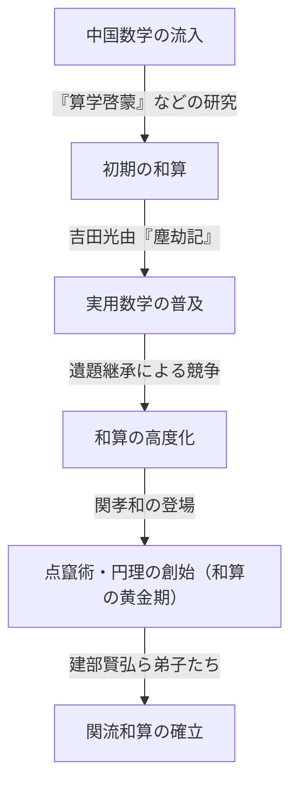
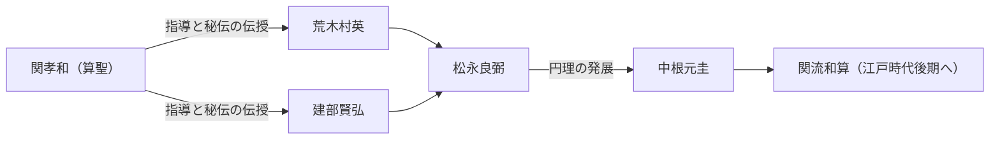

# 1. はじめに：[関孝和](https://kenji.blog/p/seki-takakazu/)とは何者か？

日本の江戸時代において、独自に発展した数学である「和算」をかつてない高みへと引き上げた人物がいます。それが **[関孝和](https://kenji.blog/p/seki-takakazu/)** （せき たかかず、1640年代? - 1708年）です。彼は後に「算聖」と称され、日本の数学史において最も重要な人物の一人として位置づけられています。

同時代のヨーロッパでは、アイザック・[ニュートン](https://kenji.blog/p/newton/)やゴットフリート・ライプニッツが微積分学を構築していましたが、[関孝和](https://kenji.blog/p/seki-takakazu/)もまた、それとは独立に極めて高度な数学的発見を行っていました。本記事では、彼の生涯のエピソードと、世界最高水準であったその数学的業績について、歴史的背景を交えながら詳細に深掘りしていきます。

# 2. 和算の黎明期と[関孝和](https://kenji.blog/p/seki-takakazu/)の登場前の日本の数学

[関孝和](https://kenji.blog/p/seki-takakazu/)の業績を理解するためには、当時の日本の数学的背景を知る必要があります。江戸時代初期の日本には、中国から伝来した数学書が流通していました。特に重要なのが、元の朱世傑（しゅ せいけつ）が著した『算学啓蒙』（さんがくけいもう、1299年）です。この書物は、豊臣秀吉の朝鮮出兵の際に日本にもたらされたとされ、日本の知識人たちに大きな影響を与えました。

この時期、日本の実用数学を大きく進歩させたのが吉田光由（よしだ みつよし）の『塵劫記』（じんこうき、1627年）です。『塵劫記』は、そろばん（算盤）の使い方や面積の測り方など、日常生活や商業に役立つ数学を解説したベストセラーとなりました。しかし、それはあくまで実用的・初等的な算術にとどまっており、高度な代数学や幾何学には至っていませんでした。

そのような実用重視の土壌の中から、やがて純粋数学としての美しさや論理的深みを追求する知識人たちが現れます。彼らは「遺題継承」（いだいけいしょう）と呼ばれる、数学書に未解決問題を掲載して読者に挑戦させるという独自の文化を生み出しました。この知的ゲームが、和算を急速に高度化させる原動力となったのです。そして、この和算の発展の頂点に現れた天才こそが、[関孝和](https://kenji.blog/p/seki-takakazu/)でした。

# 3. [関孝和](https://kenji.blog/p/seki-takakazu/)の生涯と時代背景

## 3.1 生い立ちと若き日の逸話

[関孝和](https://kenji.blog/p/seki-takakazu/)の正確な生年は不明ですが、一般的には1640年から1642年頃に生まれたと推定されています。上野国（現在の群馬県）藤岡の武士である内山家の次男として生まれ、後に関家の養子となりました。本名は新助、のちに自由斎と号しました。

若い頃から数学（算術）に対して異常なまでの熱情と才能を示していたと伝えられています。当時の日本では前述の『算学啓蒙』などが研究されていましたが、関はこれらの書物を独学で読み解き、その内容をさらに発展させていきました。伝説によれば、幼い頃から複雑な計算を暗算でこなし、周囲の大人たちを驚かせたと言われています。彼は独学で数学の真理を探求し、既存の枠組みにとらわれない新しい発想を生み出す能力を持っていました。

## 3.2 甲府藩への仕官と幕府直参

[関孝和](https://kenji.blog/p/seki-takakazu/)は数学者であると同時に、れっきとした武士でもありました。彼は甲府藩主であった徳川綱豊（後の第6代将軍・徳川家宣）に仕え、勘定吟味役など実務的な役職に就いていました。彼が数学だけでなく、暦学（カレンダーの計算）や測量、地図作成などにおいても優れた実務能力を持っていたことが伺えます。

綱豊が将軍の後継者として江戸城西の丸に入ると、関もそれに従って幕府の直参（旗本）となりました。武士としての公務をこなしながら、夜な夜な算木や筆を執って未知の数学的真理に挑む彼の姿は、非常にストイックなものであったと想像されます。

## 3.3 晩年と死

幕府直参となった後も研究を続けましたが、晩年は病に伏せることが多くなりました。そして1708年12月5日（宝永5年10月24日）、[関孝和](https://kenji.blog/p/seki-takakazu/)はこの世を去りました。彼の墓は現在、東京都新宿区の浄輪寺にあり、多くの数学愛好家や研究者が訪れる聖地となっています。

# 4. 代数学の革新：点竄術（傍書法）の創始

[関孝和](https://kenji.blog/p/seki-takakazu/)の最大の功績の一つは、中国から伝わった計算技術を、現代の代数学に通じる抽象的で普遍的な数学体系へと昇華させたことです。

当時の東アジアの数学では、「算木」（さんぎ）と呼ばれる棒を盤の上に並べて方程式を解く「天元術」（てんげんじゅつ）が用いられていました。天元術は優れた方法でしたが、物理的な棒を使うため、一つの未知数を持つ高次方程式しか扱うことができず、複数の中身の分からない変数を持つ連立方程式を解くのが困難でした。

そこで[関孝和](https://kenji.blog/p/seki-takakazu/)は、 **傍書法** （ぼうしょほう）という筆算による代数記法を考案しました。これは、未知数や定数を漢字で表し、その横に記号を書き添えることで数式を表現するものです。これにより、紙の上で複数の未知数を含む複雑な方程式を自由に操作・変形できるようになりました。

この傍書法を用いて方程式を整理し、未知数を消去して最終的な解を導き出す手法を、関は「演段術」（えんだんじゅつ）と呼びました。のちにこれは弟子たちによって「点竄術」（てんざんじゅつ）と呼ばれるようになります。点竄術は和算の代数学的基礎を築き、その後の和算の飛躍的な発展を可能にしました。

$$
\text{傍書法による数式の操作は、西洋の } ax^2 + bx + c = 0 \text{ のような記号代数学と本質的に同じ役割を果たした。}
$$

# 5. 行列式の発見：西洋に先駆けた快挙

[関孝和](https://kenji.blog/p/seki-takakazu/)の最も有名な世界的業績が、 **行列式** （determinant）の概念の発見です。彼は1683年の著書『解伏題之法』（かいふくだいのほう）において、連立一次方程式から未知数を消去するための一般的な公式として、行列式の展開方法を記述しました。

驚くべきことに、これはヨーロッパでゴットフリート・[ライプニッツ](https://kenji.blog/p/leibniz/)が行列式の概念に到達したのと同じ時期（1683年頃）、あるいは少し早い時期であったとされています。当時の日本は鎖国状態であり、西洋の数学情報が入る余地はほとんどありませんでした。したがって、関は完全に独立してこの偉大な発見に至ったのです。

関は $n=2, 3, 4, 5$ の場合の行列式の展開を正しく示しました（ただし $n=5$ の場合には符号の誤りが一部あったとされますが、基本的な概念は確立されていました）。サリュスの規則（Sarrus' rule）に相当する計算方法を、世界に先駆けて導き出していたのです。

$$
D = \begin{vmatrix} 
a_{11} & a_{12} & a_{13} \\ 
a_{21} & a_{22} & a_{23} \\
a_{31} & a_{32} & a_{33} 
\end{vmatrix} = a_{11}a_{22}a_{33} + a_{12}a_{23}a_{31} + a_{13}a_{21}a_{32} - a_{13}a_{22}a_{31} - a_{11}a_{23}a_{32} - a_{12}a_{21}a_{33}
$$

この発見により、複雑な連立方程式の解の存在条件をシステマティックに判定することが可能になり、和算の計算能力は飛躍的に向上しました。

# 6. 円理：和算における微積分学の萌芽

代数学のみならず、幾何学と解析学の分野でも[関孝和](https://kenji.blog/p/seki-takakazu/)は画期的な業績を残しています。それが **円理** （えんり）の創始です。

円理とは、円周率や円の弧の長さ、球の体積などを求めるための極限的手法であり、西洋における微分積分学（特に積分法）の基礎概念に相当するものです。

[関孝和](https://kenji.blog/p/seki-takakazu/)は正多角形を円に内接させ、その辺の数を増やしていくことで円周率を計算しました。彼は正131072角形（$2^{17}$角形）までの周長を計算するという、気の遠くなるような労力を費やしました。しかし、彼の真の天才性は、単に計算を繰り返したことではありません。

彼は、計算された一連の周長データから規則性を見出し、**エイトケン補外** （Aitken's delta-squared process）に相当する加速法（収束を速めるアルゴリズム）を適用しました。これにより、少ない計算量で極めて精度の高い近似値を求めることに成功したのです。

関はこの手法を用いて、円周率を小数点以下第11位まで正確に求めています。

$$
\pi \approx 3.14159265359\dots
$$

この高度な計算アルゴリズムの発見は当時の世界最高水準であり、和算が単なるパズルではなく、厳密な解析学としての側面を持っていたことを証明しています。

# 7. ベルヌーイ数の発見とべき乗和の公式

1712年に[関孝和](https://kenji.blog/p/seki-takakazu/)の死後に出版された遺作『括要算法』（かつようさんぽう）において、彼はべき乗和（累乗和）の公式を完全に導き出しています。

自然数の $p$ 乗の和 $\sum_{k=1}^n k^p$ を求める公式は、古くから数学者の関心事でした。[関孝和](https://kenji.blog/p/seki-takakazu/)は、この公式の係数に現れる特定の数列を体系的に計算しました。この数列こそが、現在 **ベルヌーイ数** （Bernoulli numbers）と呼ばれているものです。

スイスの数学者ヤコブ・ベルヌーイの著書『推測術』（1713年出版）でもこの数列は独立に発表されています。関の著書の出版はベルヌーイの著書より1年早く、発見時期自体も関の方が少し早かったと考えられています。奇しくも、地球の裏側でほぼ同時代に二人の天才が同じ数学的真理に到達していたのです。

ベルヌーイ数は以下のように定義されます。

$$
B_0 = 1, \quad B_1 = -\frac{1}{2}, \quad B_2 = \frac{1}{6}, \quad B_4 = -\frac{1}{30}, \quad B_6 = \frac{1}{42} \dots
$$

関はこれを「朶積術」（だせきじゅつ）と呼び、[パスカル](https://kenji.blog/p/pascal/)の三角形（和算では「立方式」）に似た係数表を用いて効率的に計算する手法を確立していました。

# 8. 関流和算の発展と後継者たち

[関孝和](https://kenji.blog/p/seki-takakazu/)自身は、自らの発見のすべてを出版して広く公表したわけではありませんでした。彼の数学は、秘伝として限られた優秀な弟子たちに受け継がれました。

その中でも最も著名なのが **建部賢弘** （たけべ かたひろ）です。建部賢弘は師の円理をさらに発展させ、逆三角関数のテイラー展開に相当する無限級数展開を発見するなど、和算をさらに高度な微積分学へと押し上げました。

[関孝和](https://kenji.blog/p/seki-takakazu/)を祖とし、建部賢弘らによって整備されたこの数学の学派は「関流」と呼ばれました。関流は極めて体系的かつ教育的なシステムを持ち、江戸時代の日本の数学界を完全に席巻することになります。

# 9. 暦学への貢献と渋川春海との関わり

[関孝和](https://kenji.blog/p/seki-takakazu/)の知識は純粋数学にとどまりませんでした。彼は天文学や暦学にも深く通じていました。当時の日本は、中国から伝わった古い暦（宣明暦）を800年以上も使い続けており、現実の天体運行との間に大きなズレが生じていました。

これに気づいたのが天文学者の渋川春海（しぶかわ はるみ）です。渋川は新しい暦である「貞享暦」（じょうきょうれき）を作成し、幕府に採用されました。この際、渋川春海の理論的裏付けや複雑な計算を、[関孝和](https://kenji.blog/p/seki-takakazu/)が裏でサポートしていたという説もあります。いずれにせよ、関の数学的手法は、同時代の暦学や測量術の発展に不可欠なものでした。

# 10. おわりに：世界の数学史における[関孝和](https://kenji.blog/p/seki-takakazu/)の地位

[関孝和](https://kenji.blog/p/seki-takakazu/)は、鎖国状態にあった日本において、外界からの情報が極めて限られている中で、独自の言語と記法を用いて世界最先端の数学を構築しました。彼の存在は、人間の知性の可能性がいかに広大であるかを示しています。

行列式、ベルヌーイ数、エイトケン補外、そして微積分の基礎となる円理など、現代の理工学に不可欠な数学的ツールを彼が独自に見出していたという事実は、現代の私たちにとっても大きな驚きであり、誇りでもあります。

彼が創始した和算は、のちに明治時代となって西洋数学が導入されると、その役割を終えることになります。しかし、和算によって培われた高い数学的リテラシーと論理的思考力は、日本が近代国家として急速に発展する際の強力な知的基盤となりました。

[関孝和](https://kenji.blog/p/seki-takakazu/)はまさに、時空を超えて数学の普遍性を証明した「算聖」であり、世界の数学史に燦然と輝く巨星であったと言えるでしょう。
