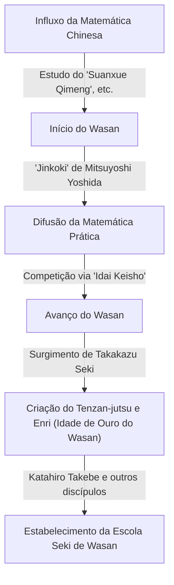
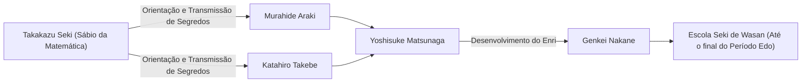

# 1. Introdução: Quem foi [Takakazu Seki](https://kenji.blog/pt/p/seki-takakazu/)?

No período Edo do Japão, houve um homem que elevou a matemática desenvolvida de forma independente, conhecida como "Wasan", a alturas sem precedentes. Esse homem era **[Takakazu Seki](https://kenji.blog/pt/p/seki-takakazu/)** (também conhecido como Seki Kōwa, c. 1640s - 1708). Mais tarde, ele foi reverenciado como o "Sábio da Matemática" (Sansei) e é posicionado como uma das figuras mais importantes na história da matemática japonesa.

Durante o mesmo período na Europa, [Isaac Newton](https://kenji.blog/pt/p/newton/) e [Gottfried Leibniz](https://kenji.blog/pt/p/leibniz/) estavam estabelecendo o cálculo infinitesimal, mas [Takakazu Seki](https://kenji.blog/pt/p/seki-takakazu/) também estava fazendo descobertas matemáticas extremamente avançadas de forma independente. Neste artigo, aprofundaremos os episódios de sua vida e suas realizações matemáticas de classe mundial, juntamente com seu contexto histórico.

# 2. O Alvorecer do Wasan e a Matemática Japonesa Antes de Seki

Para entender as realizações de Seki, deve-se conhecer o contexto matemático do Japão na época. No início do período Edo, textos matemáticos importados da China circulavam no Japão. Um particularmente importante foi o "Suanxue Qimeng" (Introdução aos Estudos Computacionais, 1299) escrito por Zhu Shijie da dinastia Yuan. Este livro foi trazido para o Japão durante as invasões da Coreia por Toyotomi Hideyoshi e teve um impacto profundo sobre os intelectuais japoneses.

Durante este período, o livro que avançou significativamente a matemática prática no Japão foi o "Jinkoki" (1627) de Mitsuyoshi Yoshida. O "Jinkoki" tornou-se um best-seller explicando matemática útil para a vida diária e o comércio, como usar o ábaco (soroban) e medir áreas. No entanto, permaneceu estritamente aritmética prática e elementar, não alcançando álgebra ou geometria avançadas.

Desta base de foco prático, intelectuais que buscavam a beleza e a profundidade lógica da matemática pura acabaram surgindo. Eles criaram uma cultura única chamada "Idai Keisho" (Herança de Problemas Matemáticos), onde problemas não resolvidos eram publicados em livros de matemática para desafiar os leitores. Este jogo intelectual tornou-se a força motriz que avançou rapidamente o Wasan. E o gênio que apareceu no auge deste desenvolvimento do Wasan foi [Takakazu Seki](https://kenji.blog/pt/p/seki-takakazu/).

# 3. A Vida e o Contexto Histórico de [Takakazu Seki](https://kenji.blog/pt/p/seki-takakazu/)

## 3.1 Início de Vida e Anedotas da Juventude

O ano exato do nascimento de [Takakazu Seki](https://kenji.blog/pt/p/seki-takakazu/) é desconhecido, mas geralmente estima-se que seja em torno de 1640 a 1642. Ele nasceu como o segundo filho da família Uchiyama, uma família de samurais em Fujioka, província de Kozuke (atual província de Gunma), e mais tarde foi adotado pela família Seki. Seu nome de batismo era Shinsuke, e mais tarde ele adotou o pseudônimo de Jiyusai.

Diz-se que ele mostrou uma paixão e um talento extraordinários para a matemática (aritmética) desde tenra idade. No Japão daquela época, o já mencionado "Suanxue Qimeng" e outros estavam sendo estudados, mas Seki decifrou esses livros através de estudo autodidata e desenvolveu ainda mais seus conteúdos. Segundo a lenda, ele podia realizar cálculos complexos de cabeça desde criança, surpreendendo os adultos ao seu redor. Ele tinha a capacidade de explorar verdades matemáticas através do estudo autodidata e gerar novas ideias não limitadas por estruturas existentes.

## 3.2 Serviço no Domínio de Kofu e como Vassalo Direto do Xogum

[Takakazu Seki](https://kenji.blog/pt/p/seki-takakazu/) não era apenas um matemático, mas também um samurai de pleno direito. Ele serviu a Tsunatoyo Tokugawa (mais tarde o 6º Xogum, Ienobu Tokugawa), o senhor do Domínio de Kofu, e ocupou cargos administrativos práticos, como auditor financeiro (Kanjo Ginmi-yaku). Isso sugere que ele possuía excelentes habilidades práticas não apenas em matemática, mas também em ciência calendárica (cálculo de calendário), topografia e cartografia.

Quando Tsunatoyo entrou no Nishinomaru do Castelo de Edo como o sucessor do Xogum, Seki o seguiu e tornou-se um vassalo direto (Hatamoto) do xogunato. Pode-se imaginar sua figura altamente estoica, realizando seus deveres oficiais como samurai de dia e pegando as varetas de cálculo (sangi) e o pincel à noite para desafiar verdades matemáticas desconhecidas.

## 3.3 Anos Finais e Morte

Seki continuou sua pesquisa mesmo depois de se tornar um vassalo direto do xogunato, mas em seus últimos anos, esteve frequentemente acamado devido a doenças. Em 5 de dezembro de 1708, [Takakazu Seki](https://kenji.blog/pt/p/seki-takakazu/) faleceu. Seu túmulo está atualmente localizado no Templo Jorin-ji em Shinjuku, Tóquio, e tornou-se um lugar sagrado visitado por muitos entusiastas e pesquisadores da matemática.

# 4. Inovação em Álgebra: A Criação do Tenzan-jutsu (Bosho-ho)

Uma das maiores realizações de [Takakazu Seki](https://kenji.blog/pt/p/seki-takakazu/) foi elevar as técnicas de cálculo importadas da China a um sistema matemático abstrato e universal semelhante à álgebra moderna.

Na matemática do Leste Asiático da época, o "Tengen-jutsu" era usado, um método de resolução de equações organizando varetas chamadas "sangi" (varetas de cálculo) em um tabuleiro. O Tengen-jutsu era um método excelente, mas como usava varetas físicas, só podia lidar com equações de ordem superior com uma única incógnita, tornando difícil resolver sistemas de equações com múltiplas variáveis desconhecidas.

Portanto, [Takakazu Seki](https://kenji.blog/pt/p/seki-takakazu/) idealizou uma notação algébrica via escrita com pincel chamada **Bosho-ho**. Esta representava incógnitas e constantes com caracteres chineses e expressava fórmulas matemáticas adicionando símbolos ao lado deles. Isso tornou possível manipular e transformar livremente equações complexas envolvendo múltiplas incógnitas no papel.

Seki chamou o método de organizar equações usando este Bosho-ho para eliminar incógnitas e derivar a solução final de "Endan-jutsu". Mais tarde, isso foi chamado de "Tenzan-jutsu" por seus discípulos. O Tenzan-jutsu lançou a base algébrica do Wasan e permitiu o seu rápido desenvolvimento posterior.

$$
\text{A manipulação de fórmulas matemáticas pelo Bosho-ho desempenhou essencialmente o mesmo papel que a álgebra simbólica como } ax^2 + bx + c = 0 \text{ no Ocidente.}
$$

# 5. Descoberta dos Determinantes: Um Feito Precedendo o Ocidente

A realização global mais famosa de [Takakazu Seki](https://kenji.blog/pt/p/seki-takakazu/) é a descoberta do conceito de **determinante**. Em seu livro de 1683 "Kai Fukudai no Ho" (Método de Resolução de Problemas Ocultos), ele descreveu o método de expansão de determinantes como uma fórmula geral para eliminar incógnitas de sistemas de equações lineares.

Surpreendentemente, considera-se que isso tenha ocorrido na mesma época (por volta de 1683), ou um pouco antes, de quando [Gottfried Leibniz](https://kenji.blog/pt/p/leibniz/) chegou ao conceito de determinantes na Europa. O Japão da época estava em um estado de isolamento nacional (Sakoku), não deixando quase nenhum espaço para a entrada de informações matemáticas ocidentais. Portanto, Seki chegou a essa grande descoberta de forma completamente independente.

Seki mostrou corretamente a expansão de determinantes para os casos de $n=2, 3, 4, 5$ (embora houvesse alguns erros de sinal no caso de $n=5$, o conceito básico foi estabelecido). Ele havia derivado um método de cálculo equivalente à regra de Sarrus antes do resto do mundo.

$$
D = \begin{vmatrix} 
a_{11} & a_{12} & a_{13} \\ 
a_{21} & a_{22} & a_{23} \\
a_{31} & a_{32} & a_{33} 
\end{vmatrix} = a_{11}a_{22}a_{33} + a_{12}a_{23}a_{31} + a_{13}a_{21}a_{32} - a_{13}a_{22}a_{31} - a_{11}a_{23}a_{32} - a_{12}a_{21}a_{33}
$$

Essa descoberta tornou possível determinar sistematicamente as condições para a existência de soluções para sistemas complexos de equações e melhorou drasticamente as capacidades computacionais do Wasan.

# 6. Enri: O Alvorecer do Cálculo no Wasan

Seki fez realizações inovadoras não apenas em álgebra, mas também em geometria e análise. Esta foi a criação do **Enri** (Princípio do Círculo).

Enri é um método baseado em limites para encontrar pi, o comprimento do arco de um círculo, o volume de uma esfera, etc., e corresponde aos conceitos fundamentais de cálculo (especialmente integração) no Ocidente.

[Takakazu Seki](https://kenji.blog/pt/p/seki-takakazu/) calculou o pi inscrevendo polígonos regulares dentro de um círculo e aumentando o número de seus lados. Ele gastou uma quantidade impressionante de esforço para calcular o perímetro até um polígono regular de 131.072 lados (polígono de $2^{17}$ lados). No entanto, sua verdadeira genialidade não residia apenas na repetição de cálculos.

Ele encontrou regularidades na série de dados de perímetro calculados e aplicou um método de aceleração (um algoritmo para acelerar a convergência) equivalente ao **processo delta-quadrado de Aitken**. Como resultado, ele conseguiu obter uma aproximação extremamente precisa com uma pequena quantidade de cálculo.

Usando este método, Seki calculou pi com precisão até a 11ª casa decimal.

$$
\pi \approx 3.14159265359\dots
$$

A descoberta deste algoritmo de cálculo avançado estava no mais alto nível do mundo na época e prova que o Wasan não era meramente um quebra-cabeça, mas tinha aspectos de análise matemática rigorosa.

# 7. Descoberta dos Números de Bernoulli e a Fórmula da Soma de Potências

Em sua obra póstuma "Katsuyo Sanpo" (Fundamentos da Matemática) publicada em 1712 após sua morte, ele derivou perfeitamente a fórmula para a soma de potências.

A fórmula para encontrar a soma das enésimas ($p$) potências dos números naturais $\sum_{k=1}^n k^p$ tem sido uma questão de interesse para os matemáticos desde a antiguidade. [Takakazu Seki](https://kenji.blog/pt/p/seki-takakazu/) calculou sistematicamente uma sequência específica de números que aparece nos coeficientes desta fórmula. Esta sequência é exatamente o que agora é chamado de **números de Bernoulli**.

Esta sequência também foi publicada de forma independente no livro do matemático suíço Jacob Bernoulli "Ars Conjectandi" (publicado em 1713). A publicação do livro de Seki foi um ano antes da de Bernoulli, e acredita-se que a própria descoberta de Seki tenha sido ligeiramente anterior. Estranhamente, em lados opostos da terra e quase ao mesmo tempo, dois gênios haviam alcançado a mesma verdade matemática.

Os números de Bernoulli são definidos da seguinte forma:

$$
B_0 = 1, \quad B_1 = -\frac{1}{2}, \quad B_2 = \frac{1}{6}, \quad B_4 = -\frac{1}{30}, \quad B_6 = \frac{1}{42} \dots
$$

Seki chamou isso de "Daseki-jutsu" e estabeleceu um método para calculá-lo eficientemente usando uma tabela de coeficientes semelhante ao triângulo de [Pascal](https://kenji.blog/pt/p/pascal/) (chamada "Rippo-shiki" no Wasan).

# 8. Desenvolvimento da Escola Seki de Wasan e seus Sucessores

O próprio [Takakazu Seki](https://kenji.blog/pt/p/seki-takakazu/) não publicou e anunciou amplamente todas as suas descobertas. Sua matemática foi transmitida como ensinamentos secretos a um número limitado de discípulos brilhantes.

O mais famoso entre eles é **Katahiro Takebe**. Takebe desenvolveu ainda mais o Enri de seu mestre e descobriu expansões em séries infinitas equivalentes à expansão de Taylor de funções trigonométricas inversas, empurrando o Wasan para um cálculo ainda mais avançado.

Esta escola de matemática, fundada por [Takakazu Seki](https://kenji.blog/pt/p/seki-takakazu/) e organizada por Katahiro Takebe e outros, foi chamada de "Escola Seki". A Escola Seki tinha uma estrutura extremamente sistemática e educacional e dominou completamente o mundo matemático do Japão no período Edo.

# 9. Contribuição à Ciência Calendárica e Relação com Harumi Shibukawa

O conhecimento de Seki não se limitava à matemática pura. Ele também era profundamente versado em astronomia e ciência calendárica. Naquela época, o Japão usava um antigo calendário (o calendário Xuanming) importado da China por mais de 800 anos, e havia uma grande discrepância com os movimentos reais dos corpos celestes.

O astrônomo Harumi Shibukawa percebeu isso. Shibukawa criou um novo calendário, o "Calendário Jokyo", que foi adotado pelo xogunato. Existe uma teoria de que [Takakazu Seki](https://kenji.blog/pt/p/seki-takakazu/) apoiou Shibukawa nos bastidores com apoio teórico e cálculos complexos durante esse período. De qualquer forma, os métodos matemáticos de Seki foram indispensáveis para o desenvolvimento da ciência calendárica e das técnicas de topografia da mesma época.

# 10. Conclusão: O Lugar de [Takakazu Seki](https://kenji.blog/pt/p/seki-takakazu/) na História Global da Matemática

No Japão, que estava em um estado de isolamento nacional com informações extremamente limitadas do mundo exterior, [Takakazu Seki](https://kenji.blog/pt/p/seki-takakazu/) construiu a matemática mais avançada do mundo usando sua própria linguagem e notação. Sua existência demonstra o quão vasto é o potencial do intelecto humano.

O fato de que ele descobriu independentemente ferramentas matemáticas indispensáveis para a ciência e engenharia modernas, como determinantes, números de Bernoulli, extrapolação de Aitken e Enri (a base do cálculo), é uma grande fonte de espanto e orgulho para nós hoje.

O Wasan que ele fundou encerrou seu papel quando a matemática ocidental foi introduzida na era Meiji. No entanto, a alta alfabetização matemática e as habilidades de raciocínio lógico cultivadas pelo Wasan tornaram-se uma base intelectual poderosa para o Japão à medida que se desenvolvia rapidamente em uma nação moderna.

[Takakazu Seki](https://kenji.blog/pt/p/seki-takakazu/) pode verdadeiramente ser chamado de "Sábio da Matemática" que provou a universalidade da matemática através do tempo e do espaço, e um gigante brilhante na história global da matemática.
