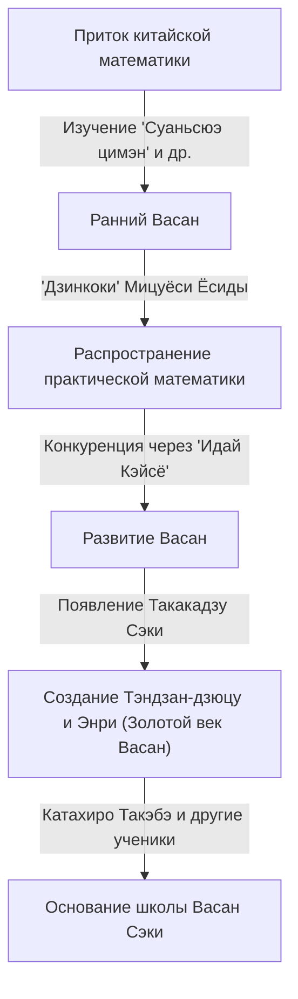
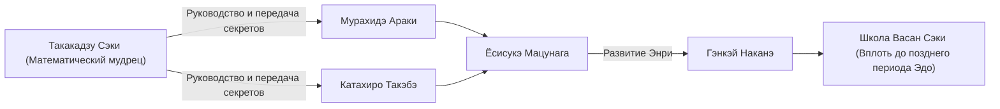

# 1. Введение: Кем был [Такакадзу Сэки](https://kenji.blog/ru/p/seki-takakazu/)?

В японский период Эдо жил человек, который поднял независимо развивавшуюся математику, известную как «Васан», на небывалые высоты. Этим человеком был **[Такакадзу Сэки](https://kenji.blog/ru/p/seki-takakazu/)** (также известный как Сэки Кова, ок. 1640-х — 1708). Позже его почитали как «Математического мудреца» (Сансэй), и он считается одной из самых важных фигур в истории японской математики.

В то же время в Европе [Исаак Ньютон](https://kenji.blog/ru/p/newton/) и Готфрид Лейбниц создавали математический анализ, но [Такакадзу Сэки](https://kenji.blog/ru/p/seki-takakazu/) также независимо делал чрезвычайно передовые математические открытия. В этой статье мы углубимся в эпизоды его жизни и его математические достижения мирового уровня вместе с их историческим фоном.

# 2. Рассвет Васан и японская математика до Сэки

Чтобы понять достижения Сэки, нужно знать математический фон Японии того времени. В начале периода Эдо в Японии циркулировали математические тексты, импортированные из Китая. Особенно важным был трактат «Суаньсюэ цимэн» (Введение в вычислительные науки, 1299 г.), написанный Чжу Шицзе из династии Юань. Эта книга была привезена в Японию во время вторжений Тоётоми Хидэёси в Корею и оказала глубокое влияние на японских интеллектуалов.

В этот период книгой, которая значительно продвинула практическую математику в Японии, стала «Дзинкоки» Мицуёси Ёсиды (1627 г.). «Дзинкоки» стал бестселлером, объясняя математику, полезную для повседневной жизни и коммерции, например, как использовать счеты (соробан) и измерять площади. Однако это оставалось чисто практической и элементарной арифметикой, не достигающей высшей алгебры или геометрии.

На основе этой практической ориентации в конечном итоге появились интеллектуалы, которые стремились к красоте и логической глубине чистой математики. Они создали уникальную культуру под названием «Идай Кэйсё» (Наследование математических задач), в которой нерешенные задачи публиковались в математических книгах, чтобы бросить вызов читателям. Эта интеллектуальная игра стала движущей силой, стремительно продвигавшей Васан. И гением, появившимся на вершине этого развития Васан, был [Такакадзу Сэки](https://kenji.blog/ru/p/seki-takakazu/).

# 3. Жизнь и исторический фон [Такакадзу Сэки](https://kenji.blog/ru/p/seki-takakazu/)

## 3.1 Ранняя жизнь и юношеские анекдоты

Точный год рождения [Такакадзу Сэки](https://kenji.blog/ru/p/seki-takakazu/) неизвестен, но обычно предполагается, что он родился около 1640–1642 годов. Он родился вторым сыном в семье Утияма, семье самураев в Фудзиоке, провинция Кодзукэ (современная префектура Гумма), а затем был усыновлен семьей Сэки. Его данное имя было Синсукэ, а позже он взял псевдоним Дзиюсай.

Говорят, что он проявлял необычайную страсть и талант к математике (арифметике) с юных лет. В Японии того времени изучались вышеупомянутый «Суаньсюэ цимэн» и другие тексты, но Сэки расшифровал эти книги путем самообразования и развил их содержание дальше. Согласно легенде, он мог выполнять сложные вычисления в уме с раннего возраста, удивляя окружающих его взрослых. У него была способность исследовать математические истины путем самообразования и генерировать новые идеи, не ограниченные существующими рамками.

## 3.2 Служба в княжестве Кофу и в качестве прямого вассала сёгуна

[Такакадзу Сэки](https://kenji.blog/ru/p/seki-takakazu/) был не только математиком, но и полноправным самураем. Он служил Цунатоё Токугаве (позже 6-му сёгуну, Иэнобу Токугаве), лорду княжества Кофу, и занимал практические административные должности, такие как финансовый аудитор (Кандзё Гинми-яку). Это говорит о том, что он обладал превосходными практическими способностями не только в математике, но и в календарной науке (расчете календарей), геодезии и картографии.

Когда Цунатоё вошел в Нисиномару замка Эдо в качестве преемника сёгуна, Сэки последовал за ним и стал прямым вассалом (Хатамото) сёгуната. Можно представить себе его крайне стоическую фигуру: днем он выполнял свои официальные обязанности самурая, а ночью брал в руки счетные палочки (санги) и кисть, чтобы бросить вызов неизвестным математическим истинам.

## 3.3 Последние годы и смерть

Сэки продолжал свои исследования даже после того, как стал прямым вассалом сёгуната, но в последние годы жизни он часто был прикован к постели из-за болезни. 5 декабря 1708 года [Такакадзу Сэки](https://kenji.blog/ru/p/seki-takakazu/) скончался. Его могила в настоящее время находится в храме Дзёрин-дзи в Синдзюку, Токио, и стала священным местом, которое посещают многие энтузиасты математики и исследователи.

# 4. Инновации в алгебре: Создание Тэндзан-дзюцу (Босё-хо)

Одним из величайших достижений [Такакадзу Сэки](https://kenji.blog/ru/p/seki-takakazu/) было возведение вычислительных методов, импортированных из Китая, в абстрактную и универсальную математическую систему, сродни современной алгебре.

В восточноазиатской математике того времени использовалось «Тэнгэн-дзюцу» — метод решения уравнений путем раскладывания палочек, называемых «санги» (счетные палочки), на доске. Тэнгэн-дзюцу был отличным методом, но поскольку в нем использовались физические палочки, он мог справляться только с уравнениями высших порядков с одним неизвестным, что затрудняло решение систем уравнений с несколькими неизвестными переменными.

Поэтому [Такакадзу Сэки](https://kenji.blog/ru/p/seki-takakazu/) изобрел алгебраическую нотацию, записываемую кистью, под названием **Босё-хо**. В ней неизвестные и константы обозначались китайскими иероглифами, а математические формулы выражались путем добавления символов рядом с ними. Это позволило свободно манипулировать и преобразовывать сложные уравнения, содержащие несколько неизвестных, на бумаге.

Сэки назвал метод организации уравнений с помощью Босё-хо для устранения неизвестных и получения окончательного решения «Эндан-дзюцу». Позже его ученики назвали это «Тэндзан-дзюцу». Тэндзан-дзюцу заложило алгебраическую основу Васан и сделало возможным его стремительное развитие в дальнейшем.

$$
\text{Манипулирование математическими формулами с помощью Босё-хо играло по сути ту же роль, что и символическая алгебра, такая как } ax^2 + bx + c = 0 \text{ на Западе.}
$$

# 5. Открытие определителей: Подвиг, предшествующий Западу

Самым известным мировым достижением [Такакадзу Сэки](https://kenji.blog/ru/p/seki-takakazu/) является открытие концепции **определителя**. В своей книге 1683 года «Кай Фукудай но Хо» (Метод решения скрытых задач) он описал метод разложения определителей как общую формулу для устранения неизвестных из систем линейных уравнений.

Удивительно, но считается, что это произошло примерно в то же время (около 1683 г.) или чуть раньше, чем [Готфрид Лейбниц](https://kenji.blog/ru/p/leibniz/) пришел к концепции определителей в Европе. Япония в то время находилась в состоянии национальной изоляции (Сакоку), что почти не оставляло возможностей для проникновения западной математической информации. Следовательно, Сэки пришел к этому великому открытию совершенно самостоятельно.

Сэки правильно показал разложение определителей для случаев $n=2, 3, 4, 5$ (хотя в случае $n=5$ были некоторые ошибки в знаках, базовая концепция была установлена). Он вывел метод расчета, эквивалентный правилу Саррюса, раньше остального мира.

$$
D = \begin{vmatrix} 
a_{11} & a_{12} & a_{13} \\ 
a_{21} & a_{22} & a_{23} \\
a_{31} & a_{32} & a_{33} 
\end{vmatrix} = a_{11}a_{22}a_{33} + a_{12}a_{23}a_{31} + a_{13}a_{21}a_{32} - a_{13}a_{22}a_{31} - a_{11}a_{23}a_{32} - a_{12}a_{21}a_{33}
$$

Это открытие сделало возможным систематическое определение условий существования решений сложных систем уравнений и резко повысило вычислительные возможности Васан.

# 6. Энри: Зарождение математического анализа в Васан

Сэки совершил новаторские достижения не только в алгебре, но и в геометрии, и в анализе. Это было создание **Энри** (Принцип круга).

Энри — это метод, основанный на пределах, для нахождения числа пи, длины дуги окружности, объема сферы и т. д., и соответствует фундаментальным концепциям математического анализа (особенно интегрирования) на Западе.

[Такакадзу Сэки](https://kenji.blog/ru/p/seki-takakazu/) вычислил число пи, вписывая правильные многоугольники в окружность и увеличивая количество их сторон. Он затратил колоссальные усилия на вычисление периметра вплоть до правильного 131 072-угольника (многоугольника с $2^{17}$ сторонами). Однако его истинный гений заключался не просто в повторении вычислений.

Он нашел закономерности в серии рассчитанных данных о периметре и применил метод ускорения (алгоритм для ускорения сходимости), эквивалентный **дельта-квадрат процессу Эйткена**. В результате ему удалось получить чрезвычайно точное приближение при небольшом объеме вычислений.

Используя этот метод, Сэки точно вычислил число пи до 11-го знака после запятой.

$$
\pi \approx 3.14159265359\dots
$$

Открытие этого продвинутого алгоритма вычислений находилось на самом высоком уровне в мире в то время и доказывает, что Васан был не просто головоломкой, но имел аспекты строгого математического анализа.

# 7. Открытие чисел Бернулли и формулы суммы степеней

В своей посмертной работе «Кацуё Санпо» (Основы математики), опубликованной в 1712 году после его смерти, он идеально вывел формулу для суммы степеней.

Формула для нахождения суммы $p$-х степеней натуральных чисел $\sum_{k=1}^n k^p$ интересовала математиков с древних времен. [Такакадзу Сэки](https://kenji.blog/ru/p/seki-takakazu/) систематически рассчитал конкретную последовательность чисел, которая появляется в коэффициентах этой формулы. Эта последовательность — именно то, что сейчас называется **числами Бернулли**.

Эта последовательность также была независимо опубликована в книге швейцарского математика Якоба Бернулли «Ars Conjectandi» (опубликована в 1713 г.). Публикация книги Сэки состоялась на год раньше, чем книги Бернулли, и считается, что само открытие Сэки произошло немного раньше. Как ни странно, на противоположных сторонах Земли и почти в одно и то же время два гения достигли одной и той же математической истины.

Числа Бернулли определяются следующим образом:

$$
B_0 = 1, \quad B_1 = -\frac{1}{2}, \quad B_2 = \frac{1}{6}, \quad B_4 = -\frac{1}{30}, \quad B_6 = \frac{1}{42} \dots
$$

Сэки назвал это «Дасэки-дзюцу» и разработал метод эффективного их вычисления с использованием таблицы коэффициентов, похожей на треугольник Паскаля (называемой в Васан «Риппо-сики»).

# 8. Развитие школы Васан Сэки и его преемники

Сам [Такакадзу Сэки](https://kenji.blog/ru/p/seki-takakazu/) не публиковал и широко не объявлял обо всех своих открытиях. Его математика передавалась как тайные учения ограниченному числу блестящих учеников.

Самый известный из них — **Катахиро Такэбэ**. Такэбэ развил Энри своего учителя и открыл разложения в бесконечные ряды, эквивалентные разложению Тейлора обратных тригонометрических функций, продвинув Васан в еще более продвинутый математический анализ.

Эта математическая школа, основанная [Такакадзу Сэки](https://kenji.blog/ru/p/seki-takakazu/) и организованная Катахиро Такэбэ и другими, получила название «Школа Сэки». Школа Сэки имела чрезвычайно систематическую и образовательную структуру и полностью доминировала в математическом мире Японии в период Эдо.

# 9. Вклад в календарную науку и отношения с Харуми Сибукавой

Знания Сэки не ограничивались чистой математикой. Он также глубоко разбирался в астрономии и календарной науке. В то время Япония более 800 лет использовала старый календарь (календарь Сюаньмин), привезенный из Китая, и существовало большое расхождение с фактическим движением небесных тел.

Астроном Харуми Сибукава заметил это. Сибукава создал новый календарь, «календарь Дзёкё», который был принят сёгунатом. Существует теория, что [Такакадзу Сэки](https://kenji.blog/ru/p/seki-takakazu/) поддерживал Сибукаву за кулисами теоретическим обоснованием и сложными расчетами в это время. В любом случае, математические методы Сэки были необходимы для развития календарной науки и методов геодезии той же эпохи.

# 10. Заключение: Место [Такакадзу Сэки](https://kenji.blog/ru/p/seki-takakazu/) в мировой истории математики

В Японии, которая находилась в состоянии национальной изоляции с крайне ограниченной информацией из внешнего мира, [Такакадзу Сэки](https://kenji.blog/ru/p/seki-takakazu/) создал самую передовую в мире математику, используя свой собственный язык и нотацию. Его существование демонстрирует, насколько огромен потенциал человеческого интеллекта.

Тот факт, что он независимо открыл математические инструменты, необходимые для современной науки и инженерии, такие как определители, числа Бернулли, экстраполяция Эйткена и Энри (основа математического анализа), является для нас сегодня большим источником удивления и гордости.

Основанный им Васан прекратил свою роль, когда в эпоху Мэйдзи была введена западная математика. Однако высокая математическая грамотность и навыки логического мышления, культивируемые Васан, стали мощным интеллектуальным фундаментом для Японии, когда она быстро развивалась в современную нацию.

[Такакадзу Сэки](https://kenji.blog/ru/p/seki-takakazu/) поистине можно назвать «Математическим мудрецом», доказавшим универсальность математики во времени и пространстве, и ярко сияющим гигантом в мировой истории математики.
